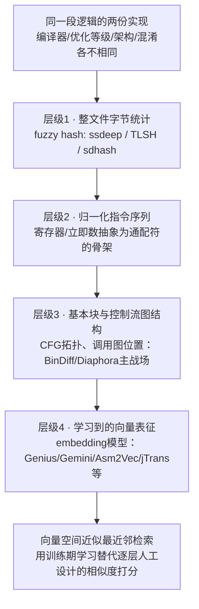
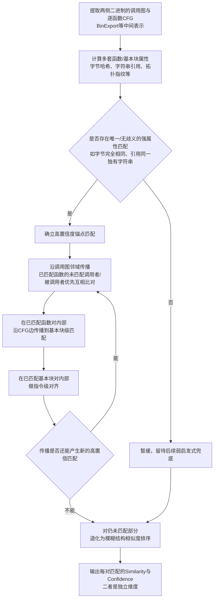
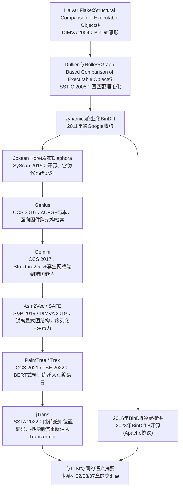
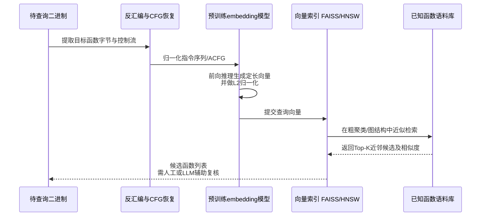
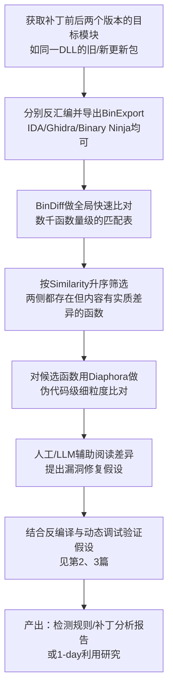

# AI辅助逆向与ML安全（4）· 二进制相似度与函数匹配

> [!abstract] TL;DR
> - 字节/文本层面的比对在编译器、优化等级、架构、混淆四个维度上都不稳定；BinDiff、Diaphora 与各代 embedding 方法本质上都是把"比对代码"降维成"比对更抽象、更稳定的结构或向量"，区别只在于抽象发生在哪一层、代价转移到了哪个阶段。
> - BinDiff 从不求解图同构问题本身（该问题一般情形下是 NP 完全的），而是用属性哈希找一小撮无歧义"锚点"匹配，再沿调用图与控制流图做邻域传播；similarity（匹配对内容有多像）与 confidence（这个匹配有多可信）是两个独立维度，混淆二者是最常见的误用。
> - 开源的 Diaphora 在 BinDiff 的图/哈希路线之外加了一层伪代码级模糊文本比对，"BinDiff 先做全局 triage、Diaphora 再对候选函数做细读"是业界公认的组合打法。
> - embedding 检索路线（Genius→Gemini→Asm2Vec/SAFE→PalmTree/Trex→jTrans）用训练期学习替代查询期的人工启发式，把图匹配的困难转移到训练阶段，换来检索期近似最近邻搜索的效率，代价是需要大规模语料且存在分布外泛化风险。
> - 这条技术脉络比"LLM 辅助逆向"这个说法本身还要老将近二十年（BinDiff 最初的学术论文发表于 2004 年），收入本系列是因为它近十年被深度学习（图嵌入、Transformer 预训练）持续重塑，且正在与 LLM 生成的自然语言差异摘要相互衔接。
> - 补丁日 1-day 分析、恶意代码家族聚类、跨架构固件漏洞传播研究共享同一套底层相似度匹配原语，但相似度分数从来不是结论，只是需要人工或 LLM 二次验证的候选线索。

## 概述与定位

二进制相似度匹配要回答的问题看似简单："这个二进制里的函数 A，是不是等价于那个二进制里的函数 B？"但真正棘手的地方在于，"等价"从来不是字节意义上的等价。同一段源码，换一个编译器版本、调高一级优化、换一个目标架构、或者简单地套一层控制流平坦化壳，产出的机器码可以在字节层面面目全非——寄存器分配变了、指令顺序被调度器打乱了、循环被展开或向量化了、原本独立的小函数被内联进了调用者。可即便如此，这两份机器码在很多场合下仍然被认为是"同一个函数"：它们实现的是同一段业务逻辑，一旦其中一份被发现存在漏洞，另一份大概率也存在；一旦供应商发布补丁，新旧版本之间那一小撮"看起来不一样"的函数，往往就精确对应着被修复的漏洞点。二进制相似度与函数匹配，就是在研究如何跨越这层语法噪声，找到结构或语义层面依然稳定的信号，把这种"不完全一样但应该被视为同一个东西"的直觉变成可计算、可排序、可自动化的相似度分数。

这件事的实用价值贯穿整个二进制安全工作流：补丁日（Patch Tuesday）场景下，把同一模块打补丁前后的两个版本拿去做差异比对，可以把分析范围从成百上千个函数收窄到几个"内容变了"的函数，这是目前公开报道的多数 1-day 分析工作流的起点；恶意代码研究中，把新样本与已知家族库做函数级比对，能区分出"这是同一伙人写的新变种"还是"这只是借用了同一份公开可用的加壳/协议库代码"；代码溯源与合规场景下，相似度匹配是判断闭源产品是否擅自复用了他人代码的技术底座；而在物联网固件安全研究中，面对海量、架构各异、通常被剥离符号的厂商固件镜像，相似度检索是找出"这个已知 CVE 函数被原样复制粘贴进了多少款设备"的唯一现实手段。

放在本系列里看，前三篇讨论的都是"LLM 直接读代码、直接给出判断"这条路径：第 1 篇给出 AI 辅助逆向的能力边界总览，第 2 篇是 LLM 对反编译输出做后处理（变量命名、结构恢复），第 3 篇是 LLM 驱动的漏洞挖掘与代码审计——这三篇的共同点是"模型阅读源码/伪代码文本，用语言理解能力给出结论"。本篇是一次方法论上的切换：不再依赖模型"读懂"代码，而是把代码变换成图（控制流图、调用图）或向量（embedding），用图论/几何意义上的相似度和检索算法去找对应关系。这条脉络的起点甚至早于"AI 辅助逆向"这个说法本身——Halvar Flake（Thomas Dullien）2004 年在 DIMVA 会议上发表的《Structural Comparison of Executable Objects》就是 BinDiff 的雏形论文，比 Transformer、比 ChatGPT 都要早了将近二十年。它被纳入本系列，是因为过去十年里这套问题被深度学习重新武装了一遍：从人工设计的图特征，到端到端训练的图嵌入网络，再到把 NLP 领域的 BERT 式预训练搬进汇编语言——这本身就是一部浓缩的表示学习简史，而且正日益与 LLM 生成的自然语言摘要相互对接。

需要预先划清边界，避免和相邻章节重复：本篇不处理"给定一个二进制家族语料库，判断某个新样本属于哪个家族/是否恶意"这个分类与检测问题，那是第 5 篇《机器学习恶意代码检测》的主战场——本篇提供的函数级/图级相似度是那条流水线可以复用的一个原语，但聚类与分类系统本身不在本篇展开。本篇也不深入讲解 embedding 模型内部具体怎么训练、指令/token 表示学习的一般理论，那是第 6 篇《嵌入与表示学习用于二进制》的任务——本篇只从"如何被用来做匹配和检索"这个应用视角触及 embedding，把训练细节留给下一篇。另外还有一类经常被读者与 BinDiff 混淆的技术需要提前撇清：IDA 的 FLIRT（Fast Library Identification and Recognition Technology）和 Lumina 云端符号库，本质上是**精确签名匹配**——FLIRT 靠带通配符的字节模式识别静态链接进来的库函数，Lumina 靠函数字节哈希在云端查找已知的名字/类型标注，二者的前提都是"要么完全匹配、要么不匹配"，不产出一个连续的相似度分数，也不具备容忍指令重排、寄存器重命名的能力。本篇讨论的是另一类问题：两份代码已经确定不字节相同，但结构或语义上有多接近，这是一个**模糊匹配/相似度排序**问题，而不是精确识别问题，这个区分会在后文反复用到。

## 原理与机制

### 为什么字节和文本层面的比对靠不住

最直觉的比对方式是把两个二进制当成两段字节流，跑一个类似 `diff` 或 `bsdiff`/`xdelta` 的通用差异算法。这在一种场景下确实好用：两次编译使用完全相同的编译器、相同的版本、相同的优化选项、相同的目标平台，只是源码改了几行——这正是很多供应商补丁发布的实际情况，此时字节级/块级差异算法效率很高，而且这也是后文"Patch Diffing 实战"里第一步会做的事。但只要放宽这个前提，字节比对立刻失灵：不同编译器厂商（GCC/Clang/MSVC）对同一段 C 代码生成的指令选择、寄存器分配策略、栈布局习惯都不同；同一个编译器换一档优化等级（`-O0` 到 `-O2`/`-O3`）会触发内联、循环展开、向量化、公共子表达式消除等一系列变换，函数边界本身都可能消失；换一个目标架构（x86 到 ARM），指令集、调用约定、寻址方式全部不同，字节流之间几乎没有可比性；再叠加控制流平坦化、垃圾指令插入等主动混淆手段，字节比对会直接给出"完全不同"的错误结论，即便两份代码语义上分毫不差。

真正稳定、跨这些扰动依然大体保持的，是更高层的结构信息：函数之间"谁调用谁"的关系（除非被内联，调用关系相对是编译器最后才会破坏的东西）；单个函数内部的控制流图"形状"（分支、循环回边的拓扑结构，大体反映源码里 if/while/for 的结构，虽然内联和循环展开会扰动它，但通常不会把它面目全非）；以及具体到每条指令，即便寄存器名、立即数、内存偏移换了，指令的"骨架"——操作码加操作数类型——往往是稳定的。举一个具体的归一化例子会更直观：

```text
原始(编译器A, -O0):   mov eax, dword ptr [ebp-0x8]
原始(编译器B, -O2):   mov eax, dword ptr [ebp-0x14]
归一化后的骨架:        mov reg32, dword ptr [ebp-imm]
```

两条指令在字节和具体操作数上完全不同，但抽象掉"具体是哪个栈偏移"这个无关紧要的细节之后，二者在骨架层面是同一条指令。这正是本篇要讲的所有技术共同的立足点：把比较的对象从"具体字节"逐级上移到"结构骨架"乃至"学习出来的语义向量"，牺牲一部分精确性换取对编译噪声的鲁棒性。

### 匹配的粒度层级：从整文件哈希到学习向量

按照抽象程度从低到高排列，实践中常见的匹配粒度大致分四层，它们并非互斥关系，很多实战流水线会按顺序尝试，前一层没能确定匹配的部分才交给下一层处理（这种"先精后模糊"的瀑布式策略在 Diaphora 里体现得尤其明显，后文详述）：整文件级的模糊哈希（ssdeep、TLSH、sdhash）把文件当作一段字节流做统计摘要，优点是极快、不需要反汇编，缺点是一旦代码被重新排布或部分修改就容易失效，而且极易被无关因素误导——一个典型陷阱是 UPX 一类加壳程序会在所有加壳样本里插入几乎相同的解壳桩代码，导致 ssdeep 之类工具报告两个完全不相关的恶意样本"高度相似"，实际相似的只是壳而不是载荷；归一化指令序列层面，通过把寄存器、立即数、内存偏移抽象成通配符得到指令骨架，这也是 FLIRT 一类签名技术的底层技巧之一；基本块与控制流图结构层面，这是 BinDiff、Diaphora 这类经典工具的主战场，本篇"原理与机制"剩余部分和"深度详解"的前半段都会围绕它展开；学习到的向量表征层面，用神经网络把一个函数（无论以 CFG 形式还是指令序列形式输入）映射成一个定长向量，相似度问题变成向量空间里的距离问题，这是 Genius 以降整条 embedding 路线的核心思路，也是让相似度匹配能够扩展到"一对海量语料库"检索规模的关键一步。



### 图匹配问题的复杂度：为什么没人真的在"解"图同构

把一个函数的控制流图和调用图看作带属性的图，"函数 A 是否匹配函数 B"这个问题在数学上就是子图同构或最大公共子图问题——判断两个图之间是否存在一个保持边关系的节点双射，这个问题在一般情形下是 NP 完全的：可能的节点对应方式随节点数增长呈组合爆炸，一个几百个基本块的函数如果真去穷举所有可能的对应关系，计算量是完全不可接受的。这也是为什么理解 BinDiff/Diaphora 时必须先纠正一个常见误解——这些工具从来没有、也不可能真正"求解"图同构问题，它们做的是多项式时间内的启发式近似打分，用一系列廉价但有区分度的属性（节点的入度出度、子树大小、字符串引用、拓扑位置等）代替昂贵的精确同构判定。这种"先用少量高置信线索钉住若干确定对应，再围绕这些锚点局部展开"的策略，在计算生物学的序列比对领域有一个几乎同构的对应物：BLAST 一类基因/蛋白质序列比对工具同样面对着序列全局比对的组合爆炸，采用的也是"先找短小精确的种子匹配（seed），再向两侧延伸（extend）"的策略——这不是巧合，而是同一类组合优化困境催生出的同一类工程解法，理解了这层类比，就能明白为什么二进制相似度匹配从一开始就注定是启发式而非精确算法的天下。

### BinDiff 的核心洞察：属性锚点 + 邻域传播

BinDiff 的算法可以概括为一句话：先用一批高区分度、低歧义的属性锁定一小撮"确凿无疑"的锚点匹配，再让这些锚点沿着调用图和控制流图的边把匹配关系传播出去，直到传播不再产生新的高置信匹配为止，剩下的残余部分退化为模糊排序兜底。具体展开：第一步在两侧二进制里分别计算函数级和基本块级的若干套属性——完全字节相同的哈希、对某个字符串常量的唯一引用、极端罕见的拓扑结构（比如全程序里入度出度组合独一无二的函数）——只要一个函数在两侧都能找到具备同一份罕见属性的对应项，且这份属性罕见到不可能是巧合，这对匹配就可以被高置信度地确立为锚点。第二步是传播：如果函数 F 已经匹配到函数 F'，那么 F 尚未匹配的调用者/被调用者，大概率就对应着 F' 尚未匹配的调用者/被调用者——因为调用关系是编译器最后才会破坏的结构，这一步沿调用图边不断扩散，每确立一对新匹配就会解锁更多待传播的邻居，形成一个不动点迭代过程。第三步把同样的传播逻辑下沉一层：在每一对已确立的函数匹配内部，沿该函数自己的控制流图边把匹配从基本块传播到基本块；第四步再下沉一层，在每一对已匹配的基本块内部做指令级对齐。这个"函数级→基本块级→指令级"的三层统计特征体系，正是公开资料里描述 BinDiff 具备"对寄存器互换、指令重排等中等程度语法差异有较强鲁棒性"这一特性的来源。传播耗尽之后仍未匹配的部分，算法才退回到单纯按结构相似度打分排序，不再强求唯一对应。



### Similarity 与 Confidence：两个经常被混为一谈的独立维度

BinDiff 对每一对匹配同时给出两个百分比：Similarity（相似度）衡量匹配对本身有多少内容是一致的——匹配上的基本块占比、匹配上的指令占比等，这是这**一对匹配**的属性；Confidence（置信度）衡量算法对"我选中的这个对应关系就是正确对应"这件事有多大把握，这是**这次匹配决策**本身的属性，取决于用了多少条独立启发式互相印证、匹配所依据的属性有多独特、是否存在其他几乎同样合适的候选。二者可以严重背离：两个几乎不做任何事情的一行 getter 函数彼此之间相似度接近 100%，但如果全程序里有几十个这样的 getter，算法很难确定"这个具体的 getter 应该对应哪一个"，置信度反而不高；反过来，一个被大改的函数即便相似度只有 60%-70%，只要它是从一个极高置信度的调用图锚点严格传播下来的、且没有其他候选与之竞争，置信度依然可以接近 100%。这个区分不是学术细节，而是直接决定"补丁日分析该怎么排序候选列表"的关键——后文"安全性与正确使用"会专门展开这一点。

## 匹配算法与向量检索详解

### 拓扑指纹：不比较指令内容也能判断"像不像"

BinDiff 报告里会出现一项叫作 MD-index 的数值（既有针对整个调用图的，也有针对单个函数控制流图的），公开资料显示它是从函数/基本块的图拓扑结构里自底向上归约出来的一个数值指纹，用来在完全不比较具体指令内容的前提下，快速判断两个图结构层面像不像。这类拓扑指纹的构造思路，与图论里常见的做法一脉相承：给每个节点按其局部结构信息（入度、出度、子树规模等）赋一个数值，再沿着图的层级关系自底向上合并，得到一个与节点具体编号顺序无关的摘要值。这种"序不敏感"的特性正是它的价值所在——两个 CFG 即便基本块的排布顺序、寄存器分配完全不同，只要拓扑形状接近，归约出的指纹就会接近，这也解释了为什么 BinDiff 对"寄存器互换、指令重排"这类只改变表象、不改变结构的扰动有较强抵抗力，但对内联、循环展开这类**真正改变图形状**的变换依然无能为力——拓扑指纹能容忍的只是同一拓扑下的表面噪声，不是拓扑本身的改变，这个边界在后文陷阱部分还会再提到。

### Diaphora：多重启发式瀑布与伪代码级比对

Diaphora 由 Joxean Koret 于 2015 年在 SyScan 大会首次发布，走的是与 BinDiff 相似但更"重装备"的路线：作为 IDA（近年也在扩展到 Ghidra、Binary Ninja）插件运行，先把每个函数的多套哈希/特征导出到一个 SQLite 数据库——包括与 BinDiff 思路类似的字节哈希、图拓扑哈希，也包括 BinDiff 没有的一项独门武器：把函数反编译成伪代码文本，规整化标识符命名后，用文本级模糊比对（例如基于最长公共子序列思路的序列匹配比率）直接对比两段伪代码有多像。这意味着 Diaphora 的相似度判据可以下探到"这两个函数的 C 语言风格逻辑读起来有多接近"，而不仅仅是"CFG 形状有多接近"。比对时，Diaphora 会按照从严格到宽松的顺序遍历数十种启发式——先看是否存在多种哈希同时精确吻合的"铁证级"匹配，逐步放宽到仅凭伪代码模糊比率的"未必可靠"匹配——每一类匹配结果都带着自己的置信档位，供分析者按需取舍。实战中被反复验证有效的组合打法是：先用 BinDiff 对整个二进制做一轮快速、可靠的全局扫描（几千个函数量级也能很快出结果），把"完全没变"的绝大多数函数直接排除；再把 BinDiff 挑出的少量候选交给 Diaphora，利用它的伪代码级 diff 能力，把"这个函数变了"进一步落实到"具体是哪几行逻辑变了"。需要留意的是 Diaphora 自 2.0 版本起改用 AGPLv3 许可（此前是 GPLv3），这一变更主要影响想基于它二次开发商业化 Web 服务的场景，普通分析使用不受影响；同一作者还维护着 Pigaios，专门解决"源码与二进制之间"的匹配问题，是本篇讨论范围之外但值得知道的近亲工具。

### 从人工特征到端到端图嵌入：Genius 与 Gemini

BinDiff/Diaphora 这条路线有一个规模上限：它们本质上是"两个二进制之间的一次性精确比对"，如果要在一个包含成千上万个二进制、覆盖多种架构的固件语料库里做"这个已知漏洞函数是否存在于任何一份固件中"这样的检索，逐对做图匹配的开销无法接受，跨架构场景下 CFG 本身的形状差异也会让图匹配的准确率明显下滑。Feng 等人在 2016 年 CCS 会议上发表的 Genius（《Scalable Graph-based Bug Search for Firmware Images》）正是针对这个场景提出的：把每个函数的 CFG 转换为属性控制流图（ACFG），给每个基本块节点标注一组与具体指令集无关的数值特征——

| ACFG 节点（基本块）特征示例 | 说明 |
|---|---|
| 算术指令数 | add/sub/mul 等，架构无关的语义计数 |
| 调用指令数 | 该块内 call 的次数 |
| 字符串/数值常量数 | 该块直接引用的字面量个数 |
| 指令总数 | 块大小的粗粒度度量 |
| 子节点数（offspring） | 以该块为根的子图规模 |
| 介数中心性（betweenness） | 该块在函数 CFG 中的"枢纽"程度 |

——这些统计量在 x86、ARM、MIPS 之间是可比的，不再依赖具体的指令编码。Genius 随后用一套码本（codebook）式的图嵌入把每个 ACFG 表示成向量，再借助局部敏感哈希（LSH）实现近似最近邻检索，从而把"逐对图匹配"变成"向量空间检索"。Xu 等人在次年（2017 年 CCS）发表的 Gemini（《Neural Network-based Graph Embedding for Cross-Platform Binary Code Similarity Detection》）则指出 Genius 的码本是与下游任务分离训练的，效果和效率都有改进空间：Gemini 用 Structure2vec——一种在图上反复做"聚合自身属性与邻居当前嵌入"的消息传递网络——直接学习 ACFG 到向量的映射，并用孪生网络（Siamese network）架构把两份函数的 ACFG 输入同一套共享权重的编码器，用相似度感知的损失函数端到端训练，让"语义相近的函数向量距离近"直接成为训练目标而不是事后验证的性质。公开数据显示 Gemini 相比 Genius 把嵌入生成速度提升了三到四个数量级，训练时间从一周以上压缩到半小时到十小时，并在真实固件漏洞检索案例中找到了比 Genius 更多的已知漏洞实例。Gemini 的意义不只在于效果提升，更在于它确立了此后几乎所有 embedding 类工作共同遵循的模板：训练一个编码器，用度量学习（对比/三元组损失）目标让语义相似度直接对应向量空间距离，推理阶段只需要一次前向传播加一次最近邻检索，彻底把图匹配的组合难题挪到了训练阶段。

### 脱离显式图结构：Asm2Vec 与 SAFE 的序列化路线

Gemini 依然要求推理时输入可靠的 CFG——这意味着它继承了反汇编/控制流恢复本身的不确定性：间接跳转、手工混淆的控制流、未能正确识别的代码都会污染 CFG，进而污染嵌入质量。Ding、Fung、Charland 在 2019 年 IEEE S&P 会议上发表的 Asm2Vec（《Asm2Vec: Boosting Static Representation Robustness for Binary Clone Search against Code Obfuscation and Compiler Optimization》）换了一个思路：借鉴 NLP 里 PV-DM（也就是 doc2vec）的做法，把一个函数看成一篇"文档"，通过在其 CFG 上做随机游走生成一批指令序列作为"句子"语料，无监督地同时学习指令 token 的向量和函数整体的向量——不需要任何标注好的"这两个函数相似"的训练对，也不像 Gemini 那样在推理期依赖显式的图结构输入。这带来了对某些混淆和优化差异更强的鲁棒性，但也有局限：按 SAFE 论文的比较，Asm2Vec 要求二进制里保留 libc 调用符号作为 token 输入，在大量剥离符号的实战场景下会打折扣，且原始设计只面向单一架构。Massarelli 等人同年在 DIMVA 会议发表的 SAFE（《SAFE: Self-Attentive Function Embeddings for Binary Similarity》）正是冲着这两个短板去的：用 word2vec 训练指令级 token 嵌入，再叠加一个自注意力（self-attentive）的双向循环网络把整条指令序列压缩成一个函数级向量，训练目标依然是让相似函数对距离更近，但不再要求 libc 符号存在，跨平台适应性也更好。SAFE 在这条脉络里还有一层技术史意义：它是这个领域较早引入注意力机制的工作之一，为几年后 Transformer/BERT 式方法的全面接管埋下了伏笔——图结构编码器（Gemini 一脉）与序列/token 编码器（Asm2Vec、SAFE 一脉）由此分叉成两条并行的技术路线，前者结构信息更直接但依赖 CFG 恢复质量、计算也更重，后者更轻量、更不挑输入质量，但代价是丢掉了图结构里唾手可得的拓扑信息，除非后续想办法把它找补回来——这正是 jTrans 要解决的问题。

### 预训练范式迁入：PalmTree、Trex 与 jTrans 把控制流"还"给 Transformer

2020 年前后，NLP 领域"先在海量无标注语料上自监督预训练、再针对下游任务微调"的 BERT/GPT 范式被系统性地搬进了二进制表征学习。Li、Qu、Yin 在 2021 年 CCS 发表的 PalmTree（《PalmTree: Learning an Assembly Language Model for Instruction Embedding》）基于 BERT 架构，设计了三个针对汇编语言特点定制的组件——指令对采样、分词、语言模型训练——预训练出的是可复用的**指令级**通用嵌入，作为一块可以插进各种下游二进制分析任务（相似度只是其中之一）的基础构件，而不是直接产出函数级向量。同期 Pei 等人提出的 Trex（《Trex: Learning Execution Semantics from Micro-Traces for Binary Similarity》，先以预印本形式流传，后发表于 IEEE TSE）走了另一条更激进的路：不满足于只从静态指令文本里学语法规律，而是在**微执行轨迹**（micro-trace，一种轻量级、欠约束的动态执行数值轨迹）上用分层 Transformer 做预训练，目的是让模型学到的是"这段代码在执行时实际算出了什么"这种执行语义，而不只是"这段代码写起来长什么样"——因为跨优化等级、跨架构乃至混淆前后，语法可以面目全非，但真正的计算语义应当保持不变。公开评测显示 Trex 在跨架构、跨优化、跨混淆三种匹配任务上相较此前最优方法分别提升约 7.8%、7.2%、14.3%。Wang 等人 2022 年在 ISSTA 发表的 jTrans（《jTrans: Jump-Aware Transformer for Binary Code Similarity Detection》）则精准点出了 PalmTree 这类"把代码当纯 token 序列喂给 Transformer"方法共同的盲区：一条跳转指令的目标地址对模型而言只是又一个普通 token，模型没有任何结构信号提示"这条指令真正的语义邻居是跳转目标，而不是线性字节流里的下一条指令"。jTrans 的解法是设计跳转感知的位置编码，把跳转源和跳转目标在模型的位置表示里显式关联起来，是第一个把控制流信息直接融合进 Transformer 序列建模、而不是另起一个 GNN 分支去处理图结构的方案，并配套发布了当时最大规模、最多样化的 BinaryCorp 数据集；论文报告在其更具挑战性的评测集上相较此前最优方法准确率从 32.0% 提升到 62.5%，在真实漏洞检索案例中的召回率达到此前最优方案的两倍。把这条脉络串起来看，是一条典型的"正-反-合"轨迹：Gemini 代表的图结构编码器把拓扑信息编码得很直接，但受限于 CFG 恢复质量和计算开销；Asm2Vec/SAFE 为了轻量和鲁棒暂时放弃了显式图结构；PalmTree/Trex 把更强大的预训练范式请了进来，却又继承了序列建模对控制流"视而不见"的老毛病；jTrans 最终把图结构信息重新注入了这套更强的 Transformer 底座——领域没有简单地抛弃早期的洞察，而是在更强的基础设施上把它找了回来。



### 向量检索基础设施：从 LSH 到 FAISS

有了函数级向量之后，还差最后一环基础设施：如何在数百万乃至数十亿条向量里，毫秒级找出与查询向量最接近的若干个。暴力线性扫描对每个候选都算一次距离，复杂度随语料规模线性增长，在固件级语料库的规模下完全不可行。最早的解法是局部敏感哈希（LSH，Genius 采用的方案）：设计一族哈希函数，使得相近的向量大概率落进同一个桶，不相近的向量大概率落进不同的桶，查询时只需要扫描同一个桶内的少数候选，用极小概率漏掉真正近邻的代价换取远超线性扫描的速度。此后 Facebook 开源的 FAISS 库（约 2017 年发布）逐渐成为这一领域的事实标准，其核心是两个可以叠加使用的手段：IVF（倒排文件索引）先用 k-means 之类方法把向量空间划分成若干粗粒度簇，查询时只在最接近查询点的少数几个簇内搜索，而不是遍历全部数据；PQ（乘积量化）把每个向量切成若干子向量并分别用一个小码本量化压缩，大幅降低内存占用，使十亿级向量能够整体驻留在内存里，代价是距离计算引入了量化误差。此外还有 HNSW（分层可导航小世界图）这种基于图结构的近似最近邻方案，不需要像 IVF 那样先训练聚类中心，直接在向量之间建一张多层图，查询时贪心地沿图边逼近目标，检索速度与精度的平衡通常优于纯 LSH 方案，也是目前很多向量数据库的默认选择。工程实践里还有一个容易被忽视但很关键的细节：函数向量通常会先做 L2 归一化再入库，这样余弦相似度就退化为简单的内积，可以直接复用 IVF/HNSW 等针对内积或欧氏距离优化的索引结构；归一化的深层原因是消除"长度混淆"——一个包含更多指令的函数，未归一化的原始向量往往量级更大，如果不做归一化，相似度排序可能被函数体量大小主导，而不是被语义接近程度主导，归一化把比较对象从"向量的大小"改回"向量的方向"，方向才是真正承载语义信息的部分。



一段最小可用的检索代码可以帮助把上面的流程落到实处：

```python
import faiss
import numpy as np

dim = 128  # 函数embedding的维度，取决于具体模型
corpus_embeddings = np.load("corpus_funcs.npy").astype("float32")
faiss.normalize_L2(corpus_embeddings)  # 归一化后用内积近似余弦相似度

# 语料库较小可用精确索引；十亿级规模通常改用 IndexIVFPQ 或 IndexHNSWFlat
index = faiss.IndexFlatIP(dim)
index.add(corpus_embeddings)

query = np.load("target_func.npy").astype("float32")
faiss.normalize_L2(query)
similarity, candidate_ids = index.search(query, k=10)  # 取Top-10候选
```

## 工具视角与实战

### 二进制画像先行：先判断该走哪条路线

动手比对之前，先给两侧目标做个画像，能决定该走 BinDiff/Diaphora 这条经典图匹配路线，还是 embedding 检索这条路线：如果两侧是同一架构、编译工具链大体相近、版本相邻（比如同一 DLL 补丁前后），图匹配路线又快又准，没有必要上重量级的神经网络方案；如果面对的是成百上千个二进制组成的语料库、需要一对多检索，或者两侧架构完全不同（比如把一个已知的 x86 漏洞函数拿去匹配 ARM/MIPS 固件），图匹配的开销和跨架构准确率都撑不住，这时候才是 embedding+ANN 检索发挥价值的场景。二者并不互斥，很多成熟流水线会先用轻量的结构特征做一轮粗筛，再对少数候选上更昂贵的精细比对——这也是"层级化处理、逐级收窄"这个思路在本篇内几乎所有实战场景里反复出现的原因。

### BinDiff 实战：BinExport 导出与差异报告解读

BinDiff 自身不做反汇编，它消费的是名为 BinExport 的中间表示文件，需要先在 IDA、Ghidra 或 Binary Ninja 里用对应插件把每个二进制导出一份：

```bash
# 用IDA的BinExport插件，把两个版本的二进制分别导出为.BinExport中间表示
ida64 -A -S"binexport_export.py" old_v1.2.3.dll
ida64 -A -S"binexport_export.py" new_v1.2.4.dll

# 命令行调用bindiff对两份.BinExport做全量比对，生成差异数据库
bindiff --primary old_v1.2.3.BinExport \
        --secondary new_v1.2.4.BinExport \
        --output_dir ./diff_result
```

差异结果里最重要的是一张匹配函数表，核心列是地址对、函数名、Similarity、Confidence 和匹配上的基本块/指令占比，示意如下（数值均为示意，请以实际比对结果为准）：

```text
Address(old)   Address(new)   Name                Similarity   Confidence   BasicBlocks
0x1400012a0    0x140001360    sub_validate_len    1.000000     1.000000     7/7
0x140001a10    0x140001af0    sub_parse_header    0.71         0.94         11/13
0x140002200    0x1400022e0    sub_alloc_buffer    1.000000     1.000000     5/5
—              0x140003100    sub_bounds_check    —            —            仅存在于new侧
```

解读这张表的关键动作是按 Similarity **升序**排序、但只看那些两侧都存在对应关系（即排除"仅存在于一侧"的行，那些另需单独关注）的函数：一份正常的补丁通常只改动极少数函数，绝大多数函数会以 100% 相似度、100% 置信度原样匹配，真正值得盯着看的，是那一小撮相似度明显低于 100% 但置信度依然很高的函数——它们就是"同一个函数,但内容被改了"的候选，往往正是补丁想要修复的位置；而"仅存在于新版本"的行则是全新增加的代码，常见于新增了一处边界检查函数这种情况，同样值得重点关注。

### Diaphora 实战：从数字到伪代码级理解

Diaphora 的典型用法是在 IDA 内直接跑脚本，或用命令行无界面模式批量导出，便于接入自动化流水线：

```bash
# IDA GUI内: File -> Script file... -> diaphora.py，弹出界面选择导出路径
# 命令行/无界面批量导出，适合批量语料构建或CI
idat64 -A -S"diaphora.py old.sqlite" old_v1.2.3.dll
idat64 -A -S"diaphora.py new.sqlite" new_v1.2.4.dll
# 随后在GUI或命令行下对两份.sqlite做diff，得到含伪代码级视图的报告
```

Diaphora 报告相比 BinDiff 最大的增量价值在于双栏伪代码对比视图：把"这两个函数相似度 71%"具体落实成"第 14 行原本是 `if (len > 0)`，新版本改成了 `if (len > 0 && len <= MAX_SIZE)`"这种逐行可读的差异，这一步几乎是补丁分析里最耗人力也最出结果的环节，Diaphora 把它半自动化了。因此实战中普遍采用"BinDiff 先扫、Diaphora 再读"的两段式流水线：前者在数千函数规模上给出可靠的全局排序，后者在个位数到几十个候选函数规模上给出可读的语义级差异。

### Patch Diffing 实战：补丁日 1-day 分析全流程

把前面的工具串起来，就是一条完整的补丁差异分析流水线：



这条流水线里每一步都在收窄搜索空间：从"整个模块"收窄到"内容变化的少数函数"，再收窄到"具体变化的几行逻辑"，最后收窄到"一个可验证的漏洞假设"。第 2 篇讨论的 LLM 辅助反编译、第 3 篇讨论的 LLM 驱动漏洞审计，在这条流水线的最后两步里正好可以无缝接入——本篇提供的是把分析范围从"整个二进制"精确收窄到"这几个函数"的前置能力。

### 恶意代码家族聚类与跨架构固件比对

两个更偏语料库规模的应用场景值得单独一提。其一是恶意代码家族内部的代码谱系分析：把一批样本里所有函数两两（或借助 embedding+ANN 做一对多）比对相似度后会发现明显的两极分化——某些函数在几乎所有样本里都近乎完全相同，这类函数通常是被复用的通用基础设施（打包壳、加密库、C2 通信协议实现），甚至可能跨越多个并不同源的家族（因为共享同一个地下工具链或构建器）；另一些函数只出现在少数样本里且彼此高度相似，这类函数更可能是该家族特有的"签名"逻辑。这个"通用代码 vs 独有代码"的区分正是第 5 篇恶意代码分类/聚类系统的重要输入特征，本篇提供的是这个区分背后的成对相似度原语，家族级聚类算法本身留给下一篇。其二是跨架构固件漏洞传播研究——这恰好是 Genius/Gemini 最初的目标应用场景：给定一个已知存在漏洞的开源库函数（例如某个 CVE 编号对应的 OpenSSL 或 BusyBox 函数），在一个覆盖 ARM/MIPS/x86 等多种架构、通常剥离了符号、编译选项未知的海量厂商固件语料库里检索"这份代码是否被原样复制进了其中任何一款设备"。这类研究反复揭示出一个现实：相当比例的真实固件漏洞并非全新缺陷，而是"同一份已知的坏代码，又被复制粘贴进了下一个厂商的产品"，这正是跨架构鲁棒的 embedding 方法相比架构相关的字节/指令匹配显得格外有价值的原因。

### 与 LLM 协同：让相似度结果"可读"

一份原始的 BinDiff/Diaphora 报告或 embedding 检索出的 Top-K 候选列表，本质上仍然只是一堆数字和代码片段的配对，把它们变成"这次改动大概修复了一个什么问题"这样一句人话总结，正是当前 LLM 辅助逆向工作流里越来越常见的最后一环——学术界已经出现专门研究"用大语言模型自动生成二进制差异摘要"的工作，思路是把匹配/未匹配的函数对连同其伪代码差异一并喂给 LLM，让它生成自然语言层面的变更说明,辅助分析师快速判断哪些候选函数值得优先深入。需要明确的是，这一步是**结果的解释层**，不是匹配本身——真正找出对应关系的仍然是图匹配算法或向量检索，LLM 不参与生成相似度分数，只负责把已经确定的差异"翻译"成更好读的文字，因此第 2、3 篇里反复强调的 LLM 局限（幻觉风险、需要以真实汇编/伪代码兜底、不能替代人工判断）在这里同样成立,不应把 LLM 生成的摘要当成不需要复核的最终结论。

BinDiff 与 Diaphora 之外，一张更完整的横向对比有助于建立选型直觉：

| 维度 | BinDiff | Diaphora | Embedding + ANN（Gemini/jTrans等） |
|---|---|---|---|
| 适用规模 | 两个二进制的一次性精确比对 | 两个二进制，含伪代码级细读 | 一对多/多对多的语料库级检索 |
| 核心信号 | CFG/调用图拓扑指纹与属性哈希 | 多重哈希瀑布 + 伪代码文本diff | 学习到的向量空间距离 |
| 跨架构能力 | 弱（指令/寄存器语义强相关） | 弱 | 强（专为跨ISA设计的特征或预训练目标） |
| 可解释性 | 高，能定位到具体匹配的块/指令 | 最高，能看到伪代码逐行差异 | 较低，向量距离本身不直接可读 |
| 是否需要训练语料 | 否 | 否 | 是，且需持续应对分布外泛化问题 |
| 典型场景 | 补丁日1-day快速triage | 补丁细节人工复核 | 固件级/家族级大规模检索 |

## 安全性与正确使用

### 双重用途的现实

二进制相似度匹配是一种彻头彻尾的双用技术：把补丁前后差异变得更容易发现，对防御方意味着更快定位需要修复或需要写检测规则的代码，对进攻方则同样意味着更快racing 出一枚 1-day 利用——这个张力并非 AI 化之后才出现的新问题，从补丁日文化诞生的第一天起，"比对补丁反推漏洞"就是攻防双方共享的既成技术，本篇讨论的图匹配和 embedding 检索只是让这件事的效率大幅提高，并没有改变它的性质。正确的态度不是回避这种张力，而是在实践中恪守既有的规范边界：只在获得授权的范围内开展分析与验证，遵循负责任的漏洞披露流程，不利用尚未完成补丁部署窗口期的信息去对未授权目标造成实际危害。

### 常见误区与失败模式

实战中最容易踩的坑，第一个就是前文强调过的 Similarity 与 Confidence 混淆：如果简单粗暴地只看"高置信度"就判定"这个函数没有可疑之处"，会系统性地漏掉补丁分析真正想找的东西——因为内容被修改过的函数，相似度理应偏低，但只要匹配关系本身足够确凿，置信度依然可以很高；正确的排序策略应当是先按置信度筛掉不可靠的匹配，再在可靠匹配的集合里按相似度升序找变化点，而不是笼统地按某个单一分数做阈值截断。第二个陷阱是编译器优化（尤其是链接时优化 LTO）对函数边界这一根本假设的破坏：内联会让一个源码函数彻底消失、并入调用者的 CFG，循环展开会在不改变语义的前提下大幅改变基本块数量和图形状，LTO 甚至可能跨编译单元合并、拆分、重排函数——这些变换发生在编译器内部更灵活的中间表示层面，而匹配算法隐含假设"一个函数对应一个函数"这个边界是稳定的，一旦这个假设被打破，即便是专门号称对优化差异鲁棒的 embedding 方法（如 Trex），准确率也会出现可测量的下滑,这不是工具的缺陷，而是这类问题本身固有的一块尚未彻底解决的硬骨头。第三个陷阱是反制型混淆：控制流平坦化、不透明谓词、函数拆分合并、垃圾基本块注入,都是专门针对 CFG 拓扑、拓扑指纹、调用图位置这些结构性信号设计的对抗手段,这是一场持续的攻防军备竞赛（详见第 8 篇对抗样本与规避检测),此处只做边界提示,不再展开。第四个陷阱是整文件级模糊哈希的"壳陷阱"——前文提过的 UPX 案例值得再强调一次：大量互不相关的恶意样本因为共享同一个加壳桩代码,在 ssdeep 之类工具下会被误判为高度相似,分析者若不做脱壳预处理直接信任整文件模糊哈希的结论,很容易把"壳一样"误读成"载荷一样"。第五个陷阱是 embedding 模型的分布外泛化风险：一个主要在 x86/ARM 的 C/C++ 二进制上训练出来的模型,面对 Go、Rust 这类运行时脚手架、调用约定差异巨大的语言产物,或者面对训练语料里几乎没见过的小众嵌入式架构,准确率可能悄悄劣化而不会有任何明确报错——模型依然会自信地吐出一个 Top-K 列表和一堆相似度分数,却没有任何内在信号提醒使用者"这次的输入已经超出了我熟悉的分布"。第六个陷阱与举证责任有关：无论是家族归因还是代码抄袭取证这类有法律或声誉后果的结论，自动化相似度分数只能作为概率性证据而非直接证明，需要独立的佐证与人工专家对实际匹配代码的复核，不能仅凭工具输出的一个百分比下判断。

| 干扰/边界情况 | 主要冲击的信号层级 | 常见应对 |
|---|---|---|
| 内联/循环展开/LTO | CFG形状、"一函数对一函数"边界假设 | 放宽为子图/跨函数匹配，结合调用点上下文交叉验证 |
| 控制流平坦化/不透明谓词 | CFG拓扑、图拓扑指纹 | 先做控制流恢复/反混淆预处理，再进入匹配管线 |
| 加壳（如UPX）导致的模糊哈希碰撞 | 整文件级fuzzy hash | 先脱壳再比对，不直接信任整文件哈希的相似度结论 |
| 跨架构/跨ISA | 字节/指令级特征 | 改用架构无关的ACFG统计特征或跨架构embedding模型 |
| 训练分布外的语言/工具链（Go/Rust等） | 学习到的embedding向量 | 人工复核+多层信号交叉验证，不单信embedding分数 |

### 正确使用建议

把上述陷阱反过来，就是一份可操作的正确使用清单：始终同时检视 Similarity 与 Confidence 两个维度，明确任务目标是"确认没变"还是"找出变了什么"，据此选择排序方向；不要依赖单一层级的信号，有条件时把字节哈希、图结构匹配、embedding 检索三层信号交叉验证，尤其是对结论有实质影响的高价值发现；把 embedding 检索出的 Top-K 候选始终当作"候选线索"而非"确定结论"，最终判断交给人工阅读伪代码或经 LLM 辅助但仍需人工把关的复核环节；动手之前先了解目标语料相对于工具/模型训练假设的匹配程度（架构、语言、编译工具链是否在其擅长的分布内），对分布外目标的输出结果保持更高的怀疑度；任何涉及法律后果或对外公开归因的结论，都应补充独立证据链，不能仅以自动化相似度分数作为唯一依据。

## 小结

二进制相似度匹配要解决的根本矛盾，是编译带来的语法多样性与代码背后语义稳定性之间的落差——同一段逻辑经过不同编译器、优化等级、目标架构或主动混淆处理后，字节和指令序列可以面目全非，但调用关系、控制流拓扑乃至更深层的执行语义往往保持相对稳定。围绕这道矛盾，业界走出了两条历史脉络：一条是以 BinDiff（2004 年至今，2022 年由 Google 开源）与 Diaphora（2015 年至今）为代表的结构化图匹配路线，靠属性锚点加邻域传播的启发式管线绕开图同构问题本身的 NP 完全性，至今仍是近版本对比、补丁日快速 triage 场景下又快又可靠的默认选择；另一条是以 Genius（2016）为起点、经 Gemini（2017）、Asm2Vec/SAFE（2019）、PalmTree/Trex（2021）演进到 jTrans（2022）的学习式 embedding 路线，把匹配问题转化为训练一个度量空间的问题，用训练期的优化换取推理期近似最近邻检索的效率,天然适配语料库规模、跨架构的检索场景。两条路线看似分道扬镳，底层其实共享同一套算法 DNA——都是在"用可计算的代理信号近似真实语义相似度"，区别只在于这份代理信号是靠人工设计的启发式规则，还是靠神经网络从数据里学出来的向量。真正决定实战效果的，从来不是选对了哪个工具，而是理解每一层信号各自的适用边界与失效模式，把 Similarity 与 Confidence 分开看待，把自动化输出的候选列表当作需要人工或 LLM 二次验证的线索而非结论。

## 相关阅读

- [[00.AI辅助逆向与ML安全总览|系列总览]]
- [[03.LLM驱动的漏洞挖掘与代码审计]] —— 上一篇：拿到本篇定位出的候选函数后如何做语义级审计
- [[05.机器学习恶意代码检测]] —— 下一篇：本篇的成对相似度如何延伸为家族级分类与聚类系统
- [[06.嵌入与表示学习用于二进制]] —— embedding 模型内部的表示学习理论，本篇只讲其作为检索工具的应用
- [[07.MCP与Agent集成到逆向工作流]] —— 把 BinDiff/Diaphora/embedding 检索接入自动化 Agent 流水线
- [[91.Claude Code/06-MCP]]、[[91.Claude Code/07-Subagents与工作流]] —— 工具编排承接
- [[45.反编译器与反汇编引擎原理/07.Hex-Rays反编译器内部机制]] —— Diaphora 伪代码级比对依赖的反编译器内部机制
- [[50.恶意代码分析与免杀对抗/02.恶意代码分类与家族谱系]] —— 家族聚类实战中相似度原语的下游应用
- 延伸文献：Halvar Flake, *Structural Comparison of Executable Objects*, DIMVA 2004；Thomas Dullien, Rolf Rolles, *Graph-Based Comparison of Executable Objects*, SSTIC 2005；Feng, Zhou, Xu, Cheng, Testa, Yin, *Scalable Graph-based Bug Search for Firmware Images*（Genius）, ACM CCS 2016；Xu, Liu, Feng, Yin, Song, Song, *Neural Network-based Graph Embedding for Cross-Platform Binary Code Similarity Detection*（Gemini）, ACM CCS 2017；Ding, Fung, Charland, *Asm2Vec: Boosting Static Representation Robustness for Binary Clone Search against Code Obfuscation and Compiler Optimization*, IEEE S&P 2019；Massarelli, Di Luna, Petroni, Querzoni, Baldoni, *SAFE: Self-Attentive Function Embeddings for Binary Similarity*, DIMVA 2019；Li, Qu, Yin, *PalmTree: Learning an Assembly Language Model for Instruction Embedding*, ACM CCS 2021；Pei et al., *Trex: Learning Execution Semantics from Micro-Traces for Binary Similarity*, IEEE TSE 2022；Wang et al., *jTrans: Jump-Aware Transformer for Binary Code Similarity Detection*, ISSTA 2022；Kornblum, *Identifying Almost Identical Files Using Context Triggered Piecewise Hashing*, Digital Investigation 2006；Johnson, Douze, Jégou, *Billion-scale similarity search with GPUs*（FAISS）；google/bindiff 与 google/binexport 官方仓库文档；joxeankoret/diaphora 官方仓库文档

[[00.AI辅助逆向与ML安全总览|⬆ 系列总览]] | [[03.LLM驱动的漏洞挖掘与代码审计|← 上一章]] | [[05.机器学习恶意代码检测|→ 下一章]]
