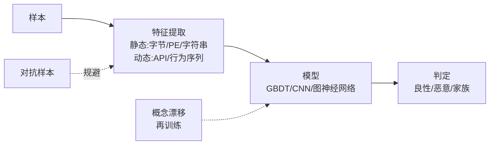

# AI辅助逆向与ML安全（5）· 机器学习恶意代码检测

> [!abstract] TL;DR
> - 恶意代码检测从基于规则/签名演进到端到端机器学习，突破了规则检测的维度瓶颈，但引入了对抗性风险与数据隐私问题
> - 特征工程分为静态特征（字节统计、API序列、导入表）和动态特征（系统调用轨迹、内存访问模式），两类互补但权衡检测速度与精准度
> - 模型选型涉及梯度提升（XGBoost/LightGBM）与深度学习（RNN/Transformer），需考虑样本不平衡、时间序列依赖、类别漂移，无通用最优解
> - ML检测器系统化被对抗样本绕过（梯度攻击、query攻击），数据集毒化风险高，正确使用需多阶段防御而非单模型依赖

## 概述与定位

机器学习恶意代码检测是AI辅助逆向工作流的关键前置节点，也是二进制安全领域ML应用最成熟的赛道。与传统基于病毒签名与启发式规则的检测器相比，ML方法通过学习恶意代码的统计特征与行为模式，实现零日威胁的泛化检测，但同时引入了对抗性与数据安全的新威胁。

本篇聚焦于**特征工程**（静/动特征如何设计）、**模型架构选型**（梯度提升vs深度学习的权衡）、**工程化部署**（样本不平衡、类别漂移）三个核心维度。不同于[[08.对抗样本与规避检测|对抗样本篇]]聚焦"如何绕过"，本篇是"如何构建可靠的检测器"的防守视角；不同于[[04.二进制相似度与函数匹配|二进制相似度篇]]的细粒度函数级匹配，恶意代码检测是粗粒度的样本级分类——输入一个完整PE/ELF文件，输出良性/恶意标签及置信度。

关键问题是：**规则为什么不够、特征怎么选、模型选什么、部署后为什么会失效**。

## 原理与机制




### 从签名到机器学习的演进

病毒扫描器的经典链路是：
- **早期**（1980s-2000s）：MD5签名库 → 完全匹配任何变种即失效
- **进化**（2000s-2010s）：启发式规则（PE导入表黑名单、代码熵、packing特征） → 规则维度固定且编写成本高
- **现代**（2010s-2020s）：数值向量化 → ML分类 → 自动捕捉高维统计规律

ML恶意代码检测的本质是**分布学习**：用大规模标注样本（良性VirusTotal已确认、恶意已沙箱确认），让模型学到 P(恶意|特征向量) 的后验分布，从而对未见样本泛化。

### 关键假设与陷阱

ML方法隐含两个关键假设，都会在对抗场景失效：

1. **特征稳定性假设**：恶意代码行为的统计特征在样本内相对稳定。但对手可通过代码混淆、packing、API替换等手段改变特征向量，同时保持恶意功能（对抗样本）。

2. **标注可信性假设**：训练集中良性样本确实无害、恶意样本确实有害。但存在：
   - 假负例：某些未公开的恶意代码被误标为良性（新型家族、政府级工具）
   - 假正例：某些良性行为（压缩软件、监控工具）被过度标记为恶意（误杀）
   
由于样本质量问题，即使模型精准度达98%，部署到百万级样本仍产生数万级的误判。

### ML检测流程全景

```
原始二进制 → 特征提取 → 向量化 → 模型推理 → 置信度 → 决策阈值 → 标签输出
             ↓                      ↓              ↓
          静态+动态           训练时学到      运维调参（FP率/FN率权衡）
          多特征维度           特征权重
```

工程上，完整系统需要：
- **特征层**：兼容多个特征源，支持增量更新（新API、新导入库）
- **模型层**：在线/离线混合，定期重训以应对类别漂移
- **后处理层**：confidence scoring、多引擎投票、沙箱反馈循环
- **监控层**：误杀/漏报追踪、样本来源追溯、对抗检测（是否有规律性规避特征）

## 特征工程与模型选型详解

### 静态特征族群

**原理**：不需运行程序，仅从二进制文件的结构、元数据、字节序列提取。速度快（毫秒级），但对抗性较弱（易被改特征向量）。

#### 1. PE/ELF元数据特征

```
文件大小 (bytes)
导入表大小 (number of imported functions)
导出表大小
节数量 (number of sections)
编译时间戳 (unix_time)
机器字节码版本
是否有重定位表、调试符号
```

**为何有效**：恶意代码倾向于：
- 大文件（捆绑payload）或小文件（精简后门）
- 导入少量特定API（CreateRemoteThread、WriteProcessMemory）
- 无调试符号（混淆）
- 时间戳异常（未来日期、1970年）

**绕过方式**：修改PE头字段，但这会破坏加载器兼容性，故对手需精细化处理。

#### 2. 字节级统计特征

```
字节熵 (entropy of byte distribution)
字符串密度 (printable characters ratio)
字节频率直方图 (256维)
N-gram频率 (1-gram, 2-gram, 4-gram bigrams)
```

**计算示例**（字节熵）：
```
H = -Σ(p_i * log2(p_i))  其中 p_i = count(byte_i) / file_size

- 加密/压缩数据：H ≈ 8（均匀分布）
- 明文代码：H ≈ 5-6（某些字节频繁）
```

**缺陷**：字节熵本身无法区分压缩的良性文件与加密的恶意代码。但**特征组合**有效：高熵+高导入数=可能的加壳恶意，高熵+低导入=可能的加密良性。

#### 3. 导入表特征

```python
# 伪代码
imported_dlls = [dll for dll in parse_import_table()]
imported_funcs = {dll: list(functions) for dll in imported_dlls}

# 特征化
features = {
    'num_dlls': len(imported_dlls),
    'num_funcs': sum(len(f) for f in imported_funcs.values()),
    'has_kernel32': 'kernel32.dll' in imported_dlls,
    'has_ntdll': 'ntdll.dll' in imported_dlls,
    'has_wininet': 'wininet.dll' in imported_dlls,
    'has_winsock': 'ws2_32.dll' in imported_dlls,
    # API风险等级组合
    'high_risk_api_count': count(['CreateRemoteThread', 'WriteProcessMemory', 
                                   'VirtualAllocEx', 'SetWindowsHookEx']),
}
```

**恶意代码的API特征签名**：
- 进程注入：CreateRemoteThread + WriteProcessMemory + ResumeThread
- 网络通信：InternetOpenUrlA + InternetReadFile（或WS2_32 socket系列）
- 注册表操作：RegOpenKeyEx + RegSetValueEx（持久化）
- 文件隐藏：FindFirstFileA + SetFileAttributesA（H标志）

**优势与劣势**：
- 优：极具可解释性，安全分析员能逐条理解为何标记为恶意
- 劣：对手易规避——简单import钩子（动态API解析）或加壳后导入表被清空

#### 4. 字符串特征

```
提取所有可打印字符串，计算：
- 字符串数量、平均长度
- URL/IP正则匹配计数
- 特定关键词计数（cmd.exe, powershell, http://, CreateProcess）
- 字符串熵（高熵字符串=可能的加密密钥或编码C2地址）
```

### 动态特征族群

**原理**：在受控沙箱环境运行程序，通过API Hook/系统调用跟踪捕捉行为轨迹。精准度高，但耗时（秒-分钟级）且易被反沙箱技术逃脱。

#### 1. API调用序列

```
API sequence = [CreateProcessA, WriteProcessMemory, ResumeThread, 
                 InternetOpenUrlA, InternetReadFile, ...]
```

**特征化方案**：
- **顺序特征**：API名称序列的N-gram统计（1-gram, 2-gram, 3-gram）
  ```
  1-gram: {CreateProcessA: 5, WriteProcessMemory: 3, ...}
  2-gram: {(CreateProcessA, WriteProcessMemory): 2, ...}
  ```
  
- **时间特征**：API间隔时间、调用频率
  ```
  time_between_calls = [t2-t1, t3-t2, ...]
  call_frequency_per_sec = len(calls) / duration
  ```
  
- **参数特征**：参数值的统计（命令行长度、URL数量、注册表路径深度）

**恶意代码的行为模式**：
- 进程注入链：CreateProcess → OpenProcess → VirtualAllocEx → WriteProcessMemory → CreateRemoteThread → ResumeThread（典型顺序）
- 文件操作链：CreateFileA → WriteFile → GetFileSize（多次重复=批量文件感染）
- 网络通信链：InternetOpenA → InternetConnectA → HttpOpenRequestA → HttpSendRequestA（C2通信）

#### 2. 系统调用轨迹（Syscall Trace）

在Linux环境，`strace` 捕捉的系统调用序列：

```
mmap() → open() → read() → close() → fork() → execve() → 
write() → socket() → connect() → send()
```

**特征化**：
- syscall名称直方图（哪些系统调用、调用频率）
- 参数统计（open打开的文件路径、socket连接的IP:port）
- 权限提升信号（setuid、CAP_SYS_ADMIN请求）

### 动态特征的采样策略

**完整轨迹 vs 摘要特征**的权衡：

```
方案         时间成本    信息量    对抗性    误杀率
─────────────────────────────────────────────────
全轨迹(序列) 高(秒级)   极高      低      低
摘要统计     低(毫秒)   中        中      中
特定签名     极低       低        高      高
```

实战中，采用**分层采样**：
1. 快速扫描层：仅用静态特征，5ms内给出初步判断
2. 深度分析层：对可疑样本进行5-10秒沙箱运行，提取完整动态特征
3. 仲裁层：多特征融合（静态+动态）得出最终判断

### 模型选型

#### 1. 梯度提升树（XGBoost/LightGBM/CatBoost）

**为什么成为工业标准**：
- **非线性能力**：自动捕捉特征交互（例：导入API数 × 字节熵 的乘积对恶意判断的影响）
- **特征重要性可解释**：SHAP值可精确分解每个特征对预测的贡献
- **样本不平衡鲁棒**：通过scale_pos_weight参数调整类权重，处理99% vs 1%的样本分布
- **速度**：推理毫秒级，适合实时扫描

**架构示意**：
```
Input: [file_size, entropy, num_imports, api_count_1, api_count_2, ...]
    ↓
多棵决策树(Boosting): 树1 → 残差 → 树2 → 残差 → 树3 → ...
    ↓
ensemble_score = tree1_pred + lr*tree2_pred + lr*tree3_pred + ...
    ↓
Output: P(恶意|特征) via sigmoid
```

**典型参数配置**：
```python
XGBClassifier(
    n_estimators=100,           # 树数量
    max_depth=6,                # 树深（太深易过拟合）
    learning_rate=0.1,          # 学习率（渐进式增强）
    scale_pos_weight=99,        # 正例权重（应对1%恶意样本）
    subsample=0.8,              # 行采样（引入随机性，减少过拟合）
    colsample_bytree=0.8,       # 列采样（特征随机）
)
```

**缺陷**：
- 无法捕捉**时间序列依赖**：API调用的顺序信息被flattened到统计特征
- 特征工程依赖手工：每新增API类型需手工设计特征
- 模型容量受限：特征维数增加到1000+时，树的划分能力下降

#### 2. 深度学习（RNN/Transformer/CNN）

**何时选择**：当特征有**序列结构**时，深度学习优势明显。

**RNN方案**（API序列建模）：
```
API序列输入: [CreateProcess, WriteProcessMemory, CreateRemoteThread, ...]
    ↓
嵌入层(Embedding): 每个API映射到d维密集向量
    ↓
LSTM/GRU: 逐步处理序列，隐状态捕捉上下文
    ↓
最后隐状态 → 全连接层 → sigmoid → 概率

h_t = LSTM(e_t, h_{t-1})  其中 e_t 是API的嵌入
最终输出 = linear(h_T)
```

**优势**：
- 自动学习API序列的判别特征（无需手工设计N-gram）
- 早期停止信号：某些API序列的**出现本身就是恶意信号**（如连续5个CreateRemoteThread调用）

**劣势**：
- 样本需求量大：通常需10万+标注样本才能有效训练
- 过拟合风险：序列可能包含噪声（良性程序偶尔也调用CreateRemoteThread）
- 对抗鲁棒性差：API序列易被插入无害操作打乱（对抗扰动）

**Transformer方案**（自注意力）：
```
使用Multi-head Attention替代RNN顺序处理
优势：并行效率高、能捕捉远距离依赖（序列开头和结尾的API关联）
劣势：参数量大（更易过拟合）、仍需大样本量
```

#### 3. 混合方案（Stacking/Ensemble）

实战中，最可靠的方案是**多模型融合**：

```python
# 第一层：多个基分类器
xgb_model = XGBClassifier(...)  # 静态特征
lstm_model = LSTM(...)           # API序列
cnn_model = CNN(...)             # 字节序列（字节视为图像）

# 第二层：Meta学习器
meta_model = LogisticRegression()
meta_model.fit(
    [xgb.predict_proba(X_val), lstm.predict_proba(X_val), ...],
    y_val
)

# 推理时
pred = meta_model.predict([xgb.predict_proba(X_test), ...])
```

**为什么有效**：
- XGBoost擅长捕捉统计特征
- LSTM擅长序列逻辑
- CNN对字节模式敏感（如加密特征）
- 融合后的投票效果超过单一模型

### 类别不平衡与正样本稀缺

恶意代码样本极其稀有（线上分布约0.1%-1%），带来的问题：

**问题1：精准度陷阱**
```
模型：永远预测"良性" → 准确率99.9%（毫无用处）
解决：用 F1分数、PR曲线（Precision-Recall）替代精准度
```

**问题2：类权重不匹配**
```
损失函数: L = Σ w_neg*loss(y=0, ŷ) + w_pos*loss(y=1, ŷ)
通常: w_neg=1, w_pos=99（比例反转）
```

**问题3：样本选择偏差**
```
训练集中：可获取的恶意样本 = 已被发现、已被标记的恶意代码
分布偏差：零日恶意 ≠ 已知恶意（特征分布不同）
后果：模型在训练集精准，线上大幅下滑（学术论文常达98%准度，部署后跌到70%）
```

**实战解决方案**：
- 动态重采样：SMOTE（合成少数类样本）
- 成本敏感学习：FN（漏报恶意）的代价 >> FP（误杀良性）
- 定期重训：捕捉类别漂移（新恶意家族出现导致特征分布变化）

## 工具视角与实战

### EMBER数据集与基准

EMBER（Endgame Malware Benchmark for Evasion Research）是学术标准基准，包含百万PE样本：
- 训练集：60万样本（标注 良性/恶意）
- 测试集：20万样本
- 特征：1MB的静态特征向量（PE元数据+字符串+字节统计预处理）

**关键指标**（典型结果）：
```
模型                   AUC    FPR@TPR=0.9    实战推理速度
─────────────────────────────────────────────────────
Gradient Boosting     0.98   1.8%            < 1ms
Deep Learning(RNN)    0.96   3.2%            5-10ms
规则签名              0.92   5%              < 0.1ms
```

**EMBER数据的局限性**：
- 样本年龄（2017年左右），不含现代混淆技术
- 样本来源单一（多为被动捕获，缺乏对抗设计）
- 类别标注可能含假例（VirusTotal投票制的误杀问题）

### 端到端工具链

#### 1. 静态特征提取工具

**Lief库**（用于PE/ELF解析）：
```python
import lief

binary = lief.parse("sample.exe")

# 提取PE头特征
features = {
    'file_size': os.path.getsize("sample.exe"),
    'num_sections': len(binary.sections),
    'is_dll': binary.header.characteristics_list.count('DLL') > 0,
    'timestamp': binary.header.time_date_stamps,
    'machine': binary.header.machine.name,
}

# 提取导入表
for import_table in binary.imports:
    dll_name = import_table.name
    for func in import_table.entries:
        imported_funcs.append(f"{dll_name}:{func.name}")
```

**字节特征提取**（自实现或用r2pipe）：
```python
def extract_byte_features(filepath):
    with open(filepath, 'rb') as f:
        data = f.read()
    
    entropy = calculate_entropy(data)  # H = -Σ p_i*log(p_i)
    byte_freq = Counter(data)
    
    features = {
        'entropy': entropy,
        'avg_byte_freq': statistics.mean(byte_freq.values()),
        'printable_ratio': sum(1 for b in data if 32 <= b < 127) / len(data),
        'byte_histogram': [byte_freq.get(i, 0) for i in range(256)],  # 256维
    }
    return features
```

#### 2. 动态特征采集（沙箱集成）

**Cuckoo Sandbox** 是开源标准（支持Windows/Linux）：
```python
import requests

# 提交样本到Cuckoo
files = {'file': open('sample.exe', 'rb')}
r = requests.post('http://cuckoo-server:8090/tasks/create/file', files=files)
task_id = r.json()['task_id']

# 等待分析完成
time.sleep(30)
r = requests.get(f'http://cuckoo-server:8090/tasks/report/{task_id}')
report = r.json()

# 提取动态特征
api_calls = [call['api'] for call in report['behavior']['apistats'][0]['calls']]
files_dropped = report['dropped']
network_requests = report['network']['tcp']  # (src, dst, dport, data)
```

**特征向量化**：
```python
def vectorize_dynamic_features(api_calls, files_dropped, network_requests):
    features = {
        'num_api_calls': len(api_calls),
        'unique_apis': len(set(api_calls)),
        'api_1gram': Counter(api_calls),  # API频率
        'api_2gram': Counter(zip(api_calls[:-1], api_calls[1:])),  # 相邻API对
        'num_files_dropped': len(files_dropped),
        'num_network_requests': len(network_requests),
        'has_dns_request': any('53' in str(req) for req in network_requests),
    }
    return features
```

#### 3. 模型训练与评估框架

**完整pipeline**（scikit-learn风格）：
```python
from sklearn.preprocessing import StandardScaler
from sklearn.model_selection import train_test_split
from xgboost import XGBClassifier
from sklearn.metrics import roc_auc_score, precision_recall_curve

# 1. 数据加载与预处理
X = load_static_dynamic_features()  # (N, D) 样本×特征
y = load_labels()                    # (N,) 0/1 标签

X_train, X_test, y_train, y_test = train_test_split(X, y, test_size=0.2, random_state=42)

# 2. 特征标准化（树模型可选，神经网络必需）
scaler = StandardScaler()
X_train_scaled = scaler.fit_transform(X_train)
X_test_scaled = scaler.transform(X_test)

# 3. 模型训练
model = XGBClassifier(
    n_estimators=100,
    max_depth=6,
    learning_rate=0.1,
    scale_pos_weight=sum(y==0) / sum(y==1),  # 自动计算类权重
    eval_metric='logloss',
)
model.fit(X_train_scaled, y_train, eval_set=[(X_test_scaled, y_test)], verbose=True)

# 4. 评估
y_pred_proba = model.predict_proba(X_test_scaled)[:, 1]
auc = roc_auc_score(y_test, y_pred_proba)

# 精确率-召回率曲线
precision, recall, thresholds = precision_recall_curve(y_test, y_pred_proba)
# 选择工作点（通常在高召回下选择可接受的误杀率）
```

### 实战案例：恶意代码家族分类

**场景**：已确认为恶意代码，但来源未知，需分类为：Trojan、Ransomware、Botnet、Spyware。

**方案**：
```python
# 多分类模型（5类）
model = XGBClassifier(n_classes=5, objective='multi:softmax')
# 特征：恶意代码独有的行为特征（注册表操作方式、网络通信协议等）
# 输出：概率分布 [P(Trojan), P(Ransomware), ..., P(Spyware)]
```

**特征设计**：
- Ransomware：大量文件写操作、特定文件后缀枚举（.doc、.xls）、加密库调用（CryptEncrypt）
- Botnet：网络通信频繁、特定C2端口、DGA解析、keepalive模式
- Spyware：进程窥探、剪贴板读取、键盘记录、截图操作
- Trojan：进程注入、UAC绕过、反虚拟机检测

通过组合这些特征，多分类F1-score可达0.85-0.92。

## 安全性与正确使用

### ML恶意代码检测器的系统性失效

#### 1. 对抗样本与梯度攻击

**问题**：给定模型的决策边界，对手可以**最小化地修改二进制**使其跨越边界，同时保持恶意功能。

**攻击形式**：
```
最小化: D(样本_恶意, 样本_对抗) 
约束条件: 
  - P(恶意|样本_对抗) < 0.5  （模型标为良性）
  - 样本_对抗 仍能执行原始恶意功能
```

**具体手段**：
- **API注入**：在恶意代码中插入无害API（Sleep、GetSystemInfo）以改变API统计特征
- **垃圾导入添加**：添加虚假导入表项，稀释恶意API的比例
- **字节填充**：尾部注入垃圾数据，改变字节熵（高熵→低熵或反之）
- **代码重排**：编译时指定函数顺序，改变字节N-gram特征

**对抗攻击的可转移性**：
```
攻击者不需知道目标模型参数
→ 在本地训练替代模型（结构相同但参数不同）
→ 对替代模型的对抗样本往往也能欺骗真实模型
→ 可转移性率60%-80%（实证测量）
```

#### 2. 数据集毒化（Poisoning）

**威胁模型**：对手污染训练数据，使模型学到后门规则。

**示例**：
```
恶意代码带有特征 X（如特定字符串"MAGIC_SIGNATURE"）
对手将X添加到99%的恶意样本中
→ 模型学到：X ≈ 恶意 （虚假相关）

到了线上，对手轻易生成含X的"伪恶意"代码
→ 所有含X的样本被误标为恶意（DoS攻击）
```

**更隐蔽的毒化**：
- 标签反转：故意将部分恶意样本标记为良性
- 特征相关性破坏：打乱真实的特征-标签关联

#### 3. 模型反演与功能提取

**威胁**：攻击者通过黑盒查询（仅获得模型的分类结果）反演出模型的特征权重与决策规则，从而有针对性地设计绕过。

**Query attack流程**：
```
1. 构造探测样本集（特征逐维度变化）
2. 查询黑盒模型得到预测值
3. 用线性回归拟合特征系数
4. 通过特征重要性理解模型决策
5. 生成针对性的对抗样本
```

**防御**：
- 限制查询频率（每IP每小时最多100次）
- 添加输出噪声（给模型输出加扰动）
- 使用防御性蒸馏（用软标签训练，增加鲁棒性）

### 正确使用的设计原则

#### 1. 多阶段防御而非单模型依赖

```
样本输入
  ↓
[第一关] 快速启发式规则（5ms）
  ├─ 明确黑名单（已确认恶意）→ 直接隔离
  ├─ 明确白名单（已确认良性）→ 直接放行
  └─ 可疑 → 进入第二关
  ↓
[第二关] ML模型打分（50ms）
  ├─ 高置信恶意（>0.95）→ 隔离+沙箱验证
  ├─ 高置信良性（<0.05）→ 放行
  └─ 中等置信（0.3-0.7）→ 进入第三关
  ↓
[第三关] 沙箱动态执行（5-30秒）
  ├─ 检测到恶意行为 → 隔离
  ├─ 无恶意行为 → 放行
  └─ 异常/超时 → 人工审核或隔离
```

**为什么要多阶段**：
- 单一ML模型可被系统性绕过（对抗样本）
- 多阶段增加了对手的适应成本（需同时规避规则+模型+沙箱）
- 沙箱检测行为，vs ML检测特征，两者正交互补

#### 2. 周期性重训与漂移检测

**类别漂移问题**：
```
时间 t=1: 恶意代码特征分布 P_mal_1(x)
→ 模型训练、部署

时间 t=2: 新恶意家族出现，特征分布变为 P_mal_2(x)，与 P_mal_1 显著不同
→ 模型线上准度下降20-30%
```

**检测与应对**：
```python
# 监控指标
def detect_drift(recent_preds, historical_preds):
    # KL散度或Kolmogorov-Smirnov检验
    ks_stat = ks_2samp(recent_preds, historical_preds)[0]
    if ks_stat > threshold:
        return True  # 检测到漂移
    return False

# 触发重训
if detect_drift(...):
    # 收集最近30天的新标注样本
    new_samples = load_recent_samples()
    # 用新数据+历史数据重训（防止灾难性遗忘）
    model.fit(combine(old_training_data, new_samples), ...)
```

**重训频率**：
- 高风险环境（0day频发）：每周
- 常规环境：每月
- 低风险环境：每季度

#### 3. 隐私与数据安全

**风险点**：
- 二进制样本本身可能含敏感内容（内部工具、源代码泄露）
- 训练数据的样本特征可被反演出原始二进制（membership inference attack）

**缓解方案**：
- 本地部署模型：避免样本上传云端
- 差分隐私训练：在梯度更新中添加噪声，使得单个样本无法被精确推断
- 数据最小化：仅提取必要特征，丢弃原始二进制

#### 4. 可解释性与可审计性

**为什么重要**：
- 安全团队需理解"为什么样本被标为恶意"
- 误杀的样本需追溯原因并改进

**SHAP分解方案**：
```python
import shap

explainer = shap.TreeExplainer(model)
shap_values = explainer.shap_values(X_test_sample)  # (D,) 各特征的贡献度

# 输出示例
# 特征 'num_imports'=42 → SHAP=+0.8 （增加恶意概率）
# 特征 'signed'=1     → SHAP=-0.3 （降低恶意概率）
# ...
# 最终预测 = base_value + sum(shap_values) ≈ 0.75
```

使用SHAP，每个预测都可被完全审计，安全分析员能理解模型逻辑。

## 小结

机器学习恶意代码检测从特征工程到模型选型，形成了一套成熟但需持续防守的技术体系。核心观察是：

1. **特征的两面性**：静态特征快速但易规避，动态特征精准但耗时，实战需分层融合
2. **模型无银弹**：梯度提升在工程部署中最实用（速度+可解释性），深度学习需足够大的数据才能超越
3. **对抗持续升级**：单一模型容易被系统性绕过，多阶段防御（规则+ML+沙箱）才是正确方向
4. **运维陷阱**：类别漂移、样本毒化、数据隐私是部署后最常见的失效原因

未来演进方向是：
- **鲁棒模型**：防御对抗样本的训练方法（对抗训练、certified robustness）
- **无监督检测**：减少对标注数据的依赖，捕捉异常行为本身
- **迁移学习**：跨平台、跨家族的特征复用，提高新样本的泛化

与对抗样本篇[[08.对抗样本与规避检测|第8篇]]相互呼应——该篇讲"如何绕过"，本篇讲"如何构建抗绕过的系统"。两个视角合并才是完整的攻防生态。

## 相关阅读

- [[02.LLM辅助反编译与变量命名|第2篇：LLM辅助反编译与变量命名]] —— 恶意代码分析的上游：反编译与符号恢复
- [[04.二进制相似度与函数匹配|第4篇：二进制相似度与函数匹配]] —— 恶意代码家族聚类的基础
- [[08.对抗样本与规避检测|第8篇：对抗样本与规避检测]] —— ML检测器的对手模型
- [[50.恶意代码分析与免杀对抗/02.恶意代码分类与家族谱系|恶意代码分类与家族谱系]] —— 背景知识：恶意代码的多维分类体系
- [[45.反编译器与反汇编引擎原理/07.Hex-Rays反编译器内部机制|Hex-Rays反编译器内部机制]] —— 反汇编层的基础设施

[[00.AI辅助逆向与ML安全总览|⬆ 系列总览]] | [[04.二进制相似度与函数匹配|← 上一章]] | [[06.嵌入与表示学习用于二进制|→ 下一章]]
