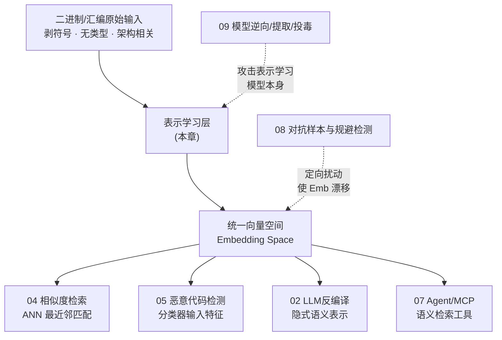
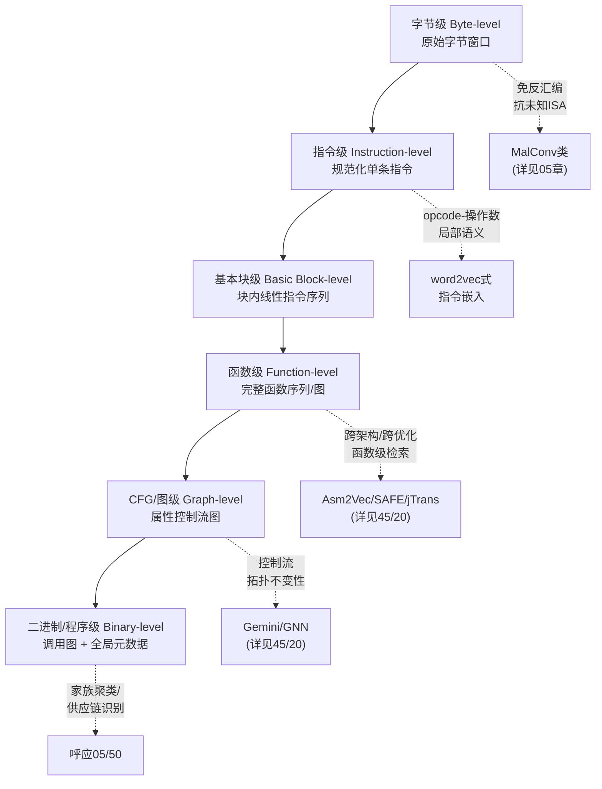
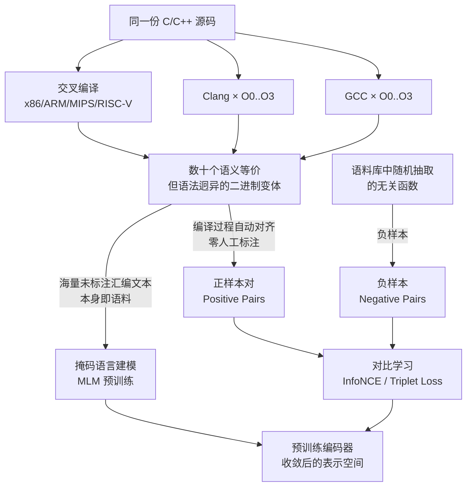
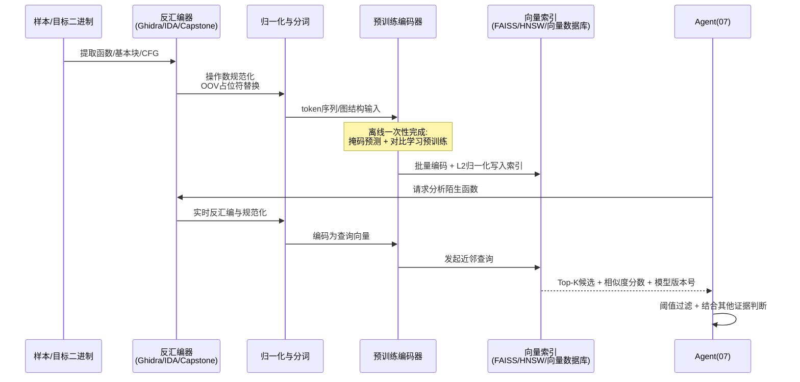
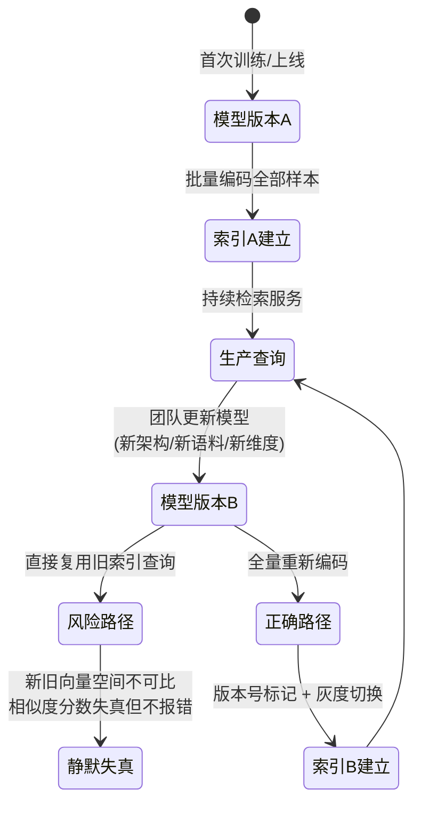

# AI辅助逆向与ML安全（6）· 嵌入与表示学习用于二进制
> [!abstract] TL;DR
> - 二进制表示学习的目标是把指令、基本块、函数、CFG 乃至整个二进制映射进同一个可计算的向量空间，让"这两段代码像不像""这段代码是不是内存分配相关"这类逆向直觉变成向量间的距离/内积计算——这是第 04 章相似度检索与第 05 章恶意代码检测背后共享的表示层地基，本篇只讲这层地基怎么建；具体系统（Asm2Vec/SAFE/Gemini/jTrans/PalmTree/Trex/BSim）的公式与工程细节已在 [[45.反编译器与反汇编引擎原理/20.深度学习二进制相似性]] 讲透，本篇不重复。
> - 表示粒度是一把有取舍的谱系尺：字节级免反汇编但语义最弱，指令级靠上下文学局部语义却不懂控制流，CFG/图级用图神经网络吃拓扑却撞上 Weisfeiler-Lehman 表达力天花板与"图没有天然顺序"的位置编码难题，函数级最适合跨架构检索但对内联、LTO 之类打散函数边界的优化无能为力——选粒度本质是选"愿意为哪种不变性买单、放弃哪种细节"。
> - 汇编不是自然语言：指令没有像文本那样唯一的线性语义顺序（跳转会打断顺序），立即数与地址会把词表撑爆成近乎无限的未登录词，寄存器分配是编译器的调度决策而非作者的语义表达——这三条差异决定了直接照搬 NLP 的分词器与绝对位置编码必然失败，操作数规范化与跳转感知位置编码不是锦上添花，而是让模型能训练下去的前提。
> - 预训练之所以在这个领域格外有效，是因为"同一份源码，用不同编译器 × 优化级别 × 目标架构编译出几十个语法迥异但语义等价的版本"提供了几乎零成本、天然对齐的自监督信号——这把原本稀缺昂贵的人工标注问题转化成了廉价的编译工程问题，是掩码预训练与对比学习能联合训练出高质量嵌入的根本原因。
> - 嵌入不是免费也不是万能的：模型换代后新旧向量空间互不可比却不会报错（静默失真）、短函数与编译器插入的桩函数会在向量空间里扎堆造成结构性误报、直接拿 LLM 隐藏状态当嵌入会撞上各向异性坍缩问题——这些工程陷阱决定了嵌入检索给出的永远是"候选线索"而不是"证据"，必须配阈值校准、版本化管理与人工复核。
> - 这套"编译不变性驱动的自监督预训练 + 向量检索"方法论，正被 LLM 时代的通用代码/汇编基座模型重新收编（直接用解码器模型的隐藏态当嵌入、或把汇编先转述成自然语言再嵌入），是第 02 章 LLM 辅助反编译与第 07 章 Agent/MCP 语义检索工具的共同技术底座。

## 概述与定位

表示学习（Representation Learning）要解决的问题可以用一句话概括：**把一段没有固定长度、没有代数结构的符号序列，压缩成一个固定维度、可以做加减乘除和距离计算的向量，同时让这个压缩过程尽量保留原始符号序列的"语义"而不是"字面"**。对二进制逆向而言，这个符号序列可以是一条汇编指令、一个基本块、一个函数、一整张控制流图（CFG），甚至一整个可执行文件；而"语义"通常指的是与具体架构、编译器、优化级别无关、只与程序真正在做什么有关的那部分信息。一旦这种映射存在，逆向工程里大量原本靠人眼比对、靠直觉判断的问题——"这个函数是不是那个已知漏洞函数的变体""这批样本里哪些函数来自同一个恶意软件家族""这段代码像不像内存分配器"——都可以转化成向量空间里的余弦相似度、欧氏距离或者聚类问题，从而具备规模化、自动化处理的可能性。

本篇在系列里的位置是"方法论地基"，而不是"应用案例集"。第 04 章《二进制相似度与函数匹配》讲的是拿到嵌入之后怎么做检索、怎么建 BinDiff 式的匹配流水线；第 05 章《机器学习恶意代码检测》讲的是拿到特征（可能是手工特征，也可能是学习到的嵌入）之后怎么训练分类器、怎么控制误报。这两章关心的是"嵌入拿来干什么"，本篇关心的是"嵌入是怎么被造出来的"——指令、函数、CFG 各自应该用什么方式表示，预训练目标应该怎么设计，才能让下游第 04、05 两章的检索与分类真正可靠。同时，本篇也是第 02 章（LLM 辅助反编译）、第 03 章（LLM 驱动的漏洞挖掘）背后隐含的技术假设——这些章节里 LLM 之所以能"读懂"反汇编或伪代码，本质上也是因为模型内部把代码 token 映射成了携带语义的向量表示，只是这一层通常被 LLM 的规模掩盖，不再单独讨论。理解表示学习的原理，能帮助读者在使用这些 LLM 工具时建立正确的心智模型：模型给出的答案不是"理解"了代码，而是在一个学出来的向量空间里做了最近邻式的模式匹配。

需要特别说明与知识库中既有内容的分工。反编译器系列第 20 篇《深度学习二进制相似性》已经用相当大的篇幅系统讲解了 Asm2Vec 的 PV-DM 训练目标、SAFE 的自注意力架构、Gemini 的 Structure2Vec 图嵌入、jTrans 的跳转感知位置编码与两阶段训练、PalmTree 的三种预训练任务、Trex 的微执行痕迹建模，并给出了 Ghidra BSim 与 Faiss 的工业级实战代码——这些是表示学习在二进制相似度检测这一具体任务上的**系统级案例**，本篇不再重复其中任何一条公式或伪代码。本篇要做的是退后一步，讲清楚这些系统之所以这样设计所依据的**通用原理**：为什么分布式表示比手工特征更强、为什么表示粒度存在谱系而非唯一正确答案、序列建模与图建模的根本张力是什么、预训练目标应该如何选择与组合、以及这套方法论如何超越 BCSD（二进制代码相似性检测）这一个任务，同时服务于恶意代码检测、反编译辅助与智能体检索。可以把两篇的关系理解成："45/20 是产品说明书，本篇是设计原理"。

理解二进制表示学习为什么比自然语言或源代码表示学习更难，需要先看清楚二进制丢失了什么。源代码层面的表示学习（CodeBERT、GraphCodeBERT、CodeT5 一类模型）可以直接利用标识符名称、类型声明、抽象语法树、注释这些高层语义线索；而经过编译、链接、剥符号（strip）之后的二进制，这些线索几乎全部消失——变量没有名字，类型需要靠数据流与内存访问模式重新推断，函数边界可能因为内联而不复存在，控制流可能因为循环展开、跳转表、尾调用优化而变得面目全非，同一份源码在不同架构、不同编译器、不同优化级别下产生的机器码在字节层面可以毫无相似之处。表示学习模型必须在没有这些高层线索的情况下，仅从"指令的种类、顺序与结构"这一层单薄的输入信息里，重新学出编译器早就知道、却在生成二进制时故意丢弃的语义结构。这也是为什么本系列把表示学习单独设为一篇：它不是相似度检测或恶意代码检测的一个技术细节，而是整个"用 AI 做二进制分析"这条技术路线能否成立的前提性问题。

从历史脉络看，这是一次与自然语言处理、计算机视觉几乎同构的范式迁移。恶意代码检测在深度学习普及之前主要依赖手工特征工程——opcode n-gram 直方图、导入表 one-hot 编码、PE 头部字段统计、字符串黑名单命中——这些特征需要领域专家反复试错设计，且天然对同义变形（指令重排、垃圾指令插入、寄存器换名）脆弱，具体的特征工程细节与其局限见第 05 章。表示学习的思路是反过来：不再由人设计"应该看哪些特征"，而是让模型在大规模数据上自己学出一个能同时保留区分性与不变性的低维嵌入函数，这正是词袋模型（Bag-of-Words）/TF-IDF 被 Word2Vec、BERT 取代，手工设计的 SIFT/HOG 图像特征被卷积神经网络取代的同一条历史逻辑在二进制领域的重演。



上图勾勒出本篇在系列里的枢纽位置：原始的二进制/汇编输入经过表示学习层被压缩成统一向量空间，这个向量空间本身不直接产出任何"结论"，而是作为共享的中间产物，被第 04 章的检索流水线、第 05 章的分类器、第 02 章 LLM 辅助反编译的隐式表示、第 07 章的 Agent 检索工具分别消费。反过来，这个向量空间也是攻防两端都会去碰的目标——第 08 章讨论的对抗样本本质上是对手主动构造扰动，让语义未变的代码在这个向量空间里发生定向漂移以逃避检测；第 09 章讨论的模型逆向与投毒，则可能直接以表示学习模型本身（而不是它的某一次输出）作为攻击对象，例如通过查询嵌入接口反推训练数据、或在预训练语料里投毒污染整个向量空间的几何结构。理解表示学习原理，既是用好 04/05/02/07 的前提，也是理解 08/09 攻击面从何而来的前提。

## 原理与机制

### 分布式表示：从"一个词"到"一个方向"

在深入指令、函数、CFG 各自的表示方式之前，有必要把表示学习最基本的直觉讲透，因为后面所有具体方法都是这个直觉在不同粒度上的展开。最朴素的符号编码方式是独热编码（one-hot）：词表里有 N 个不同的符号，每个符号对应一个 N 维向量，只有自己对应的位置是 1，其余全是 0。这种编码有两个致命问题：维度随词表线性增长（汇编指令的操作数组合几乎无穷，词表会爆炸到不可用的规模），更严重的是任意两个不同符号的独热向量距离都相等——"mov"和"push"的距离，与"mov"和"call"的距离完全一样，向量空间里不存在任何"相似"的概念，因为独热编码本质上只编码了"是谁"，没有编码"像谁"。

分布式表示（Distributed Representation）的思路是放弃稀疏的独热向量，改用低维稠密向量，并且不再由人工指定每一维代表什么含义，而是通过一个训练目标，让语义相近的符号在向量空间里自动靠拢。这个训练目标的理论基础是语言学里的分布假设（Distributional Hypothesis）：一个词的含义可以由它经常出现的上下文来刻画——"你可以通过一个词交的朋友认识它"。Word2Vec（Mikolov 等，2013）把这个假设变成了两个具体可训练的任务：CBOW（Continuous Bag-of-Words）用周围的上下文词去预测中心词，Skip-gram 反过来用中心词去预测周围的上下文词；由于直接对全词表做 Softmax 计算量过大，实践中普遍使用负采样（Negative Sampling）——每次只需要把真实的上下文词与随机抽取的几个"假"负样本词区分开，而不是在整个词表上归一化，这让训练在百万级词表上依然可行。训练收敛后，词向量的几何结构会自发涌现出语义规律，这不是任务设计者刻意安排的，而是"预测上下文"这个目标函数在优化过程中的副产品。

这个直觉平移到汇编指令上几乎是无缝的：把每一条（规范化后的）指令看作一个"词"，把一个基本块或者一次 CFG 随机游走路径看作一个"句子"，训练目标依然是"用上下文指令预测中心指令"或者反过来。经过训练，功能相近的指令——比如不同的清零 `xor eax, eax` 与 `mov eax, 0`，或者不同架构下语义等价的算术指令——会因为出现在相似的上下文里而被推到向量空间中相近的位置。这正是 45 系列第 20 篇里 Asm2Vec 采用的 PV-DM（在 Word2Vec 的 CBOW 基础上额外拼接一个"段落向量"联合训练）背后的原理，本篇不再重复其训练细节，这里只强调一点更底层的认识：**指令级嵌入不是逆向工程专属的新发明，而是分布假设这一 NLP 基础原理在新符号系统上的直接复用**，理解了这一点，才能理解后面粒度谱系、预训练目标选择等所有设计决策的出发点。

### 表示粒度谱系：字节到程序的六层阶梯

指令级嵌入只是整个粒度谱系的一环。二进制表示学习面对的输入天然具有层级结构——字节组成指令，指令组成基本块，基本块组成函数，函数组成调用图，调用图组成整个程序——选择在哪一层做嵌入，直接决定了模型能捕获什么不变性、会丢失什么细节、适合喂给哪个下游任务。这不是一道有标准答案的选择题，而是一组需要根据任务显式权衡的工程决策。



| 粒度 | 输入单元 | 是否需要反汇编 | 捕获的不变性 | 主要局限 |
|---|---|---|---|---|
| 字节级 | 原始字节滑动窗口 | 否 | 局部字节模式（魔数、opcode 片段、常见指令编码） | 无控制流与操作数语义，需要很大感受野才能覆盖一条指令 |
| 指令级 | 单条规范化指令 | 是（或轻量反汇编） | opcode 与操作数共现的局部语义 | 不含跨指令的执行顺序与控制流信息 |
| 基本块级 | 块内线性指令序列 | 是 | 顺序执行语义、局部数据流 | 跨基本块的信息在这一层完全缺失 |
| 函数级 | 完整函数（序列化或图） | 是 | 跨架构/跨优化级别的函数语义等价性 | 内联、LTO、尾调用优化会让函数边界本身消失 |
| CFG/图级 | 属性控制流图（ACFG） | 是 | 控制流拓扑不变性 | 受消息传递表达力上限约束，图本身没有天然的结点顺序 |
| 二进制/程序级 | 调用图 + 导入表等全局元数据 | 是 | 家族、供应链层面的整体相似性 | 维度与噪声都极高，早已丢失函数级别的执行细节 |

字节级表示的价值在于完全绕开反汇编这一步——如果目标架构未知、指令集是私有的、或者反汇编器本身可能出错（比如数据与代码混排、花指令干扰线性扫描），直接在原始字节流上滑窗建模是唯一稳妥的起点，这条路线在恶意代码检测里被 MalConv 一类模型系统采用，具体的架构设计与训练细节见第 05 章。指令级表示是前一小节讨论的分布式表示最自然的落点，它能学到"这条指令在做什么"，但完全不知道"做完这条指令之后会走到哪"。基本块级把指令线性串起来，补上了块内的执行顺序，但块与块之间的跳转关系仍然缺失。函数级是当前 BCSD 研究最密集的一层，因为跨架构、跨优化级别的函数检索是最贴近实战（1-day 漏洞搜索、开源组件识别）的任务形态，代表系统与训练细节见第 45 系列第 20 篇。CFG/图级把函数内部的跳转结构显式建模为图，理论上比"把 CFG 拍扁成一个线性序列再喂给序列模型"保留了更多结构信息，但图神经网络本身的表达力存在理论上限，下一小节展开讨论。二进制/程序级是最粗的一层，通常由调用图结构加上导入表、节区布局等全局元数据构成，适合做家族级别的粗粒度聚类，与第 05 章、以及 [[50.恶意代码分析与免杀对抗/02.恶意代码分类与家族谱系]] 中讨论的相似度阶梯（哈希 → imphash → 模糊哈希 → 图同构 → 行为向量）在思路上是同一件事：越粗的粒度抗变形能力越强，但能提供的辨析细节也越少。

### 序列还是图：位置与拓扑的根本矛盾

粒度谱系里最尖锐的技术分歧出现在"函数怎么表示"这一层：是把函数当成一个可以线性排列的 token 序列，套用成熟的 Transformer/RNN 生态；还是把函数的 CFG 老老实实当成一张图，用图神经网络直接在拓扑上做消息传递？这不是审美偏好，而是两条路线各自继承了不同的数学假设，也各自要为这些假设付出代价。

Transformer 的自注意力机制本身是置换等变的（permutation-equivariant）——如果不额外注入位置信息，模型看到的输入本质上是一个无序集合，同一组 token 换个顺序丢进去，输出的对应关系不会变化。这在自然语言里问题不大，因为自然语言的**线性阅读顺序天然就是语义顺序**：句子从左往右读，语法与语义结构基本沿着这个方向展开，所以绝对位置编码（原始 Transformer 论文用的正弦位置编码）或者后来的相对位置编码都能很好地工作。但汇编代码不满足这个前提：一条跳转指令可以让执行流跨越任意距离跳到程序的另一处，函数体在内存里的**线性地址顺序**与它实际的**控制流执行顺序**是两回事——一段被跳转指令绕过的代码在地址上离当前指令很近，在执行语义上却可能毫不相关；反过来两段在地址上相距很远的代码，可能因为一次跳转而在执行语义上紧密相邻。这正是 45 系列第 20 篇里 jTrans 引入跳转感知位置编码（JAPE）要解决的具体问题，本篇不重复其编码公式，但要强调这背后的一般性原理：**只要模型的输入表示是"线性化"的，就必须显式设计一种方式去弥补线性顺序与控制流顺序之间的落差，跳转感知位置编码只是这个问题空间里的一种具体解法，不是唯一解法。**

图神经网络路线试图从根子上绕开这个矛盾——CFG 本来就是一张图，为什么要先拍扁成序列再想办法找补丢失的结构？图神经网络的核心操作是消息传递（Message Passing）：每个节点在每一轮迭代里，把自己的特征与邻居节点特征聚合、更新，经过 T 轮迭代后，每个节点的表示就编码了它 T 跳邻域内的结构信息；最后用一个读出（Readout/Pooling）函数把所有节点表示汇总成一个图级别的向量，常见的做法是简单求和、求平均，或者更精细的注意力加权与层次化池化。这条路线天然满足图应有的置换不变性——CFG 的基本块本来就没有"第一个""第二个"这种天然顺序，只有拓扑关系，图神经网络对节点编号的重新排列不敏感，这一点序列模型做不到（序列模型必须先人为决定一个线性化顺序，这个决定本身就是有损的）。但图神经网络路线也有自己的理论天花板：标准的消息传递图神经网络在区分非同构图的能力上，已经被证明不会超过 1-维 Weisfeiler-Lehman 图同构测试（简称 1-WL，Xu 等在 GIN 论文中给出了这一表达力上界的证明）——直觉上，1-WL 测试反复用"节点自身标签 + 邻居标签的多重集合"来给节点重新着色，如果两个节点在无限轮迭代后颜色历史完全相同，1-WL 就无法区分它们，而标准图神经网络的表达力被证明不会超过这个上限。对 CFG 而言，这个理论局限会在某些对称的控制流模式上显现：例如一个 if-else 结构，两条分支内部的局部拓扑高度相似但语义相反，如果聚合函数或者节点初始特征设计得不够精细，图神经网络有可能给出过于接近的两个分支表示。另外，图神经网络还面临过平滑（Over-smoothing）问题——消息传递轮数越多，节点特征在图上传播、混合得越充分，超过某个层数后，所有节点的表示会趋于同质化、丧失区分度，这限制了图神经网络能够利用的有效感受野深度，也是为什么大多数 BCSD 里的图神经网络只叠加很浅的几层。

两条路线的根本张力可以归纳为一句话：**序列路线继承了 Transformer 生态成熟的预训练基础设施（分词器、位置编码、大规模预训练语料的复用经验），代价是要人工设计机制去弥补"线性顺序不等于控制流顺序"的落差；图路线原生保留了拓扑结构与置换不变性，代价是表达力存在理论天花板、层数不能堆深、也难以直接复用序列模型这些年积累的大规模预训练基础设施。** 近年的工程实践越来越多地选择某种折中——用跳转感知位置编码把部分图结构信息"编码进"序列模型（jTrans 的路线），或者先用图神经网络提取局部结构特征、再用 Transformer 处理线性化后的图编码序列（这类混合架构在神经反编译方向的 Nova 系统中也出现过，见 [[45.反编译器与反汇编引擎原理/19.神经反编译]]）。没有一条路线是全面占优的，选择哪一条本质上取决于你更在意保留哪一种不变性、以及能否负担得起对应的工程与算力代价。

### 预训练自监督信号从哪来：编译多样性

前面讨论的是"怎么表示"，这一节讨论种子话题里同样点名的"预训练"——即模型在见到任何具体下游任务（相似度检索、恶意分类）之前，先在什么数据、用什么目标上把表示学出来。预训练之所以在其他领域（尤其自然语言）成为主流范式，核心原因是可以利用海量廉价的无标注文本；这个逻辑能不能平移到二进制领域，取决于一个关键问题：**逆向工程里有没有类似"整个互联网文本"这样廉价、海量、天然多样的语料？**

答案出人意料地肯定，而且这份语料几乎是免费的：把同一份开源 C/C++ 源码，交给不同的编译器（GCC、Clang 各若干版本）、不同的优化级别（`-O0` 到 `-O3`、`-Os`）、不同的目标架构（x86、x64、ARM、MIPS、RISC-V）交叉编译，可以自动生成成百上千个语法形态迥异、但语义完全等价的二进制版本，而且哪个函数对应哪个函数的映射关系是**编译过程本身自带的**，不需要任何人工标注——通过调试信息或者简单的符号表就能精确对齐。这份"编译多样性"语料同时满足了两种截然不同的预训练需求：一方面它提供了海量未标注的汇编文本本身，可以直接拿来做掩码语言建模；另一方面它提供了自动对齐的正样本对（同一源函数的不同编译产物），可以直接拿来做对比学习——这是自然语言预训练语料所不具备的额外优势：文本预训练语料通常只有"一段连续文本"，没有天然的"这段文本的另一个语义等价变体是什么"这种配对信息，而二进制表示学习恰恰可以廉价地批量制造这种配对。



这张图里刻意把 MLM 预训练与对比学习预训练画成两条独立汇入编码器的支路，是因为它们对数据的要求本质不同：掩码语言建模只需要海量汇编文本本身，不需要任何配对关系，训练目标是"遮住一部分 token，用双向上下文猜出被遮住的内容"，这个目标能让模型学到指令与操作数在局部上下文里的共现规律，也就是前面讨论的分布式表示直觉；对比学习则必须依赖成对（或成组）的正负样本，训练目标是"让来自同一源函数的不同编译产物在向量空间里靠得更近，让无关函数推得更远"，这个目标直接优化的是下游检索任务真正关心的度量——语义等价性。这也是为什么 PalmTree、jTrans 一类系统普遍采用"先做大规模掩码预训练学好局部语义，再做对比学习微调学好检索所需的整体不变性"的两阶段策略——这不仅仅是因为两个目标在能力上互补，更根本的原因是两阶段对数据的要求不同：MLM 阶段可以用尽可能多的、不需要严格配对的原始语料把词汇/局部语义学扎实，对比学习阶段则用相对更小、但精确配对的编译多样性数据集去校准整体的相似性判断。理解了这一层数据供给的差异，才能理解为什么几乎所有近年的二进制表示学习系统都在往"预训练 + 微调"这个两段式范式收敛，而不是像早期 Asm2Vec/Gemini 那样从零开始为单一任务训练一个专用模型。

## 表示构建详解：分词、位置编码与预训练目标

### 分词与操作数规范化：对抗 OOV 爆炸

把汇编指令当作"词"直接建立词表，第一个撞上的工程问题就是词表爆炸。一条 `mov rax, 0x14a2f8` 如果不做任何处理，操作数里的立即数 `0x14a2f8` 会被当成一个独立的词元；同一份程序里几乎每一条访问不同地址、加载不同常量的指令都会引入一个新词，词表规模随二进制数量线性甚至超线性增长，绝大多数词元在训练语料里只出现一两次——这正是自然语言处理里"未登录词"（Out-of-Vocabulary，OOV）问题在汇编领域的极端放大版：自然语言里罕见词好歹还符合齐夫定律（词频与词频排名成反比），高频词占据绝大多数语料；汇编里的立即数/地址操作数几乎服从均匀分布，没有任何"高频核心词汇"可以覆盖大部分出现频次。

对策是操作数规范化（Operand Normalization）：把具体的立即数、内存地址、字符串指针统一替换成占位符（比如 `[IMM]`、`[MEM]`、`[ADDR]`），只保留操作数的**类别**而丢弃它的**具体值**。这里存在一个规范化强度的连续谱：最激进的做法（SAFE 采用的路线）把所有操作数归并成个位数的语义类别标签，最大程度压缩词表、提升跨架构泛化能力，但代价是丢失了操作数携带的精细信息；相对保守的做法会对立即数按数量级分桶（比如区分"小整数""可能是长度或计数""看起来像地址"），在压缩词表的同时保留一部分数值语义；而对寄存器操作数，多数系统选择保留原始寄存器名而不做规范化，因为寄存器分配虽然是编译器的调度决策，但同一个函数内部哪些操作复用同一个寄存器，仍然携带了有价值的数据流线索——不过这也带来了一个副作用：x86 的 `rax` 与 ARM 的 `x0` 在词表里是完全不同的词元，跨架构场景下这部分信息不能直接复用，这也是 45 系列第 20 篇里指出 Asm2Vec 跨架构性能明显弱于跨优化级别场景的直接原因。

```text
规范化前：mov    rax, qword ptr [rbp - 0x18]
规范化后：mov    REG, [MEM]

规范化前：cmp    eax, 0x1388
规范化后：cmp    REG, [IMM_SMALL]

规范化前：call   sub_140021A40
规范化后：call   [ADDR_CALLEE]
```

规范化之后，还要决定分词的最小单元是什么。一种做法是把"opcode + 规范化操作数"打包成一个原子词元（例如 `mov_REG,[MEM]` 作为一个整体的词），这样词表大小可控、每个词元语义完整，但相似的指令变体（`mov REG,[MEM]` 和 `mov REG,REG`）在词表里依然是两个互不相干的词，没有共享的子结构；另一种做法是借用自然语言处理里成熟的子词切分算法（如 BPE，字节对编码），把指令文本当作普通字符串去学习出现频率最高的字符/子串组合作为词元。子词切分的好处是能自动发现"mov"这个子串在大量词元里共享出现，从而让模型在没见过某个具体指令变体时依然能利用共享的子词embedding做出合理泛化；代价是分词边界不再与指令的语法结构对齐，模型需要额外学习"这几个子词拼在一起才是一条完整指令"这层结构。选择原子词元还是子词切分，本质上是在"词表可解释性、与指令语法的对齐程度"和"稀有变体的泛化能力"之间做权衡，目前没有哪一种方案在所有任务上都占优，需要结合具体语料规模与下游任务取舍。

### 位置编码设计空间：线性、拓扑与跳转感知

延续上一节关于序列与图张力的讨论，这里把位置编码作为一个独立的设计空间展开。绝对位置编码（原始 Transformer 用的正弦函数编码，或者后来更常见的可学习位置嵌入）给序列里每个位置分配一个固定或可学习的向量，直接与词嵌入相加；这种方式简单、与自然语言的线性语义顺序高度契合，但完全不携带跳转、分支这类结构信息。相对位置编码（如 Transformer-XL、T5 使用的方案）不再编码"绝对第几个位置"，而是编码"两个 token 之间相差几个位置"，在处理变长序列、以及位置的绝对值本身没有意义（比如同一条指令出现在函数的第 3 条还是第 300 条，语义应该是一样的）的场景下更合理，但依然假设"相对距离"这个概念在线性序列上是良定义的，对跳转打断顺序的问题无能为力。

面向图结构的位置编码则完全换了一条思路：既然节点没有天然顺序，位置编码要编码的就不是"第几个"，而是"这个节点在图的整体结构里处于什么位置"——常见做法包括用图拉普拉斯矩阵的特征向量作为位置编码（谱域上邻近的节点特征向量也相近，天然携带全局结构信息）、用随机游走命中概率作为位置编码（从每个节点出发做随机游走，统计多少步内能回到自身或到达其他节点，编码局部连通性）。这类方案的好处是不依赖任何线性化假设，直接刻画拓扑位置；代价是计算开销更高（特征分解或大量随机游走采样），且这些编码方式本身是为通用图（社交网络、分子结构）设计的，没有利用 CFG "近似有向无环、只有回边表示循环"这类领域特有的结构先验。跳转感知位置编码（如 jTrans 的 JAPE）则是专门针对 CFG 这一领域特性设计的折中方案：保留序列模型的线性主干位置编码作为基础，再叠加一份"如果这条指令是跳转指令，把跳转目标的位置信息也编码进来；如果这条指令是某个跳转的目标，把跳转来源的位置信息也编码进来"的额外信号，相当于用较低的工程代价把控制流图里最重要的"非线性连接"这一层结构，局部地缝合进本来是纯线性的序列表示里。具体的编码公式与实现细节 45 系列第 20 篇已有完整推导，这里要强调的是它在整个设计空间里的位置：它既不是最简单的绝对位置编码，也不是最彻底的图位置编码，而是"用最小的改动量解决控制流场景下最痛的那个具体问题"的工程折中，这个设计思路本身比具体公式更值得举一反三。

### 预训练目标横向对比：MLM、CLM 与对比学习

三类主流预训练目标在归纳偏置与适用任务上存在系统性差异，值得放在同一张表里对照理解：

| 预训练目标 | 核心机制 | 典型架构 | 擅长任务 | 主要局限 |
|---|---|---|---|---|
| 掩码语言建模 MLM | 随机遮盖部分 token，用双向上下文预测被遮盖内容 | BERT 类编码器（双向 Transformer） | 语义理解、作为嵌入抽取的骨干 | 训练与推理存在形式不一致（推理时不做遮盖），不能直接自回归生成 |
| 因果语言建模 CLM | 自回归预测下一个 token，只能看到左侧上文 | GPT 类解码器 | 生成任务（反编译输出、代码补全，呼应第 02 章与 [[45.反编译器与反汇编引擎原理/19.神经反编译]]） | 表示本质是单向的，直接截取某层隐藏状态当嵌入需要额外的池化与校准处理 |
| 对比学习 | 拉近正样本对表示，推远负样本对表示 | 孪生/双塔编码器，损失函数通常用 Triplet 或 InfoNCE | 相似性检索，直接优化下游度量（呼应第 04 章） | 高度依赖正负样本对的构造质量，负样本采样策略设计不当会导致训练不稳定或表示坍缩 |
| 结构感知预训练任务（如 def-use 预测、跳转目标预测） | 预测数据流或控制流层面的关系是否成立 | 序列/图混合架构 | 向表示中注入静态分析级别的结构归纳偏置 | 任务标签需要专门的静态分析（如 SSA 构建）支持生成，工程成本高于纯文本式的 MLM/CLM |

MLM 与 CLM 的选择本质上取决于下游要"理解"还是要"生成"：需要嵌入向量去做检索、分类、聚类的场景（第 04、05 章），双向上下文的 MLM 骨干通常是更自然的选择，因为它在训练时就已经在优化"用完整上下文表示每个位置"这个和嵌入抽取直接相关的目标；需要模型吐出一段新代码（反编译、补全）的场景，自回归的 CLM 骨干几乎是必选项，因为生成任务本身就是一个逐 token 自回归的过程。对比学习不是一个独立的"骨干架构"选择，而是一个可以叠加在 MLM 或 CLM 骨干之上的**微调阶段目标**——这也是前一节强调的两阶段范式的技术落点：先用 MLM（或 CLM）在海量未标注语料上把局部语义学扎实，再用对比学习在编译多样性构造的正负样本对上把"什么程度的语法差异对应语义相同"这件事校准清楚。结构感知预训练任务则是这几年比较活跃的补充方向，PalmTree 的 Def-Use Prediction 是其中一个具体例子（细节见 45 系列第 20 篇），本篇要指出的通用原理是：**MLM/CLM 学到的是统计层面的共现规律，如果希望模型显式理解数据流、控制流这类结构化关系，往往需要设计专门的预训练任务把静态分析的结果转化成监督信号，而不能指望纯粹的语言建模目标自动涌现出这种理解。**

### 从预训练到下游：全量微调、线性探针与隐状态直取

预训练模型学出的表示本身并不直接等于任何一个具体下游任务的最终答案，还需要一个适配（Adaptation）步骤，这里同样存在一个成本-效果的谱系。全量微调（Full Fine-tuning）是最直接的做法：在预训练权重的基础上，用下游任务的标注数据继续训练整个模型的所有参数，通常能取得当前该任务上最好的效果，代价是需要一定规模的下游标注数据、需要不小的训练算力，并且存在灾难性遗忘（Catastrophic Forgetting）的风险——如果下游数据集较小或分布较窄，全量微调可能会破坏预训练阶段学到的一部分通用表示能力，让模型在微调任务上表现更好，但在其他任务或分布外样本上表现下降。

线性探针（Linear Probing）是另一个极端：完全冻结预训练编码器的全部参数，只在其输出之上训练一个很小的线性分类头（甚至只是一个线性投影）。这样做的训练成本极低，更重要的是它常被用作一种**诊断工具**——如果冻结表示配一个简单线性头就已经能在下游任务上取得不错的效果，说明预训练阶段学到的表示本身已经把这个任务所需的信息线性可分地组织好了；反过来，如果线性探针效果很差、全量微调才明显提升，则说明预训练表示里虽然可能隐含相关信息，但需要经过非线性的进一步加工才能提取出来。在评估一个新的二进制预训练模型"表示质量到底好不好"时，线性探针是比直接看全量微调后的最终指标更能说明表示本身能力的实验设计。

第三条路径是近几年随着通用代码大模型能力提升而变得越来越现实的选择：完全不做任何针对二进制/汇编任务的专门训练，直接把汇编代码（或者反编译后的伪代码）喂给一个现成的大语言模型，取它某一层的隐藏状态做池化，当作现成的嵌入使用。这条路径的吸引力在于零训练成本、可以直接复用大模型在海量代码与自然语言语料上学到的强大先验，也天然衔接第 02 章讨论的 LLM 辅助反编译能力——同一个模型既能生成解释性文本，也能顺手产出可用于检索的向量表示。但这条路径要处理一个在自然语言句子嵌入领域已经被系统研究过的陷阱：各向异性坍缩（Anisotropy）问题。研究发现（Ethayarajh 在 2019 年的分析）像 BERT、GPT-2 这类模型的原始隐藏状态在向量空间里的分布远不是各向均匀的，而是高度集中在一个狭窄的锥形区域里，导致任意两个不相关句子的原始隐藏状态算出来的余弦相似度也普遍偏高，直接拿来做相似度检索会失真。后续研究提出了 BERT-flow、BERT-whitening 一类后处理手段，通过对隐藏状态做标准化变换把分布"拉"回更接近各向同性的形态，从而让余弦相似度重新变得有区分力。把这条经验搬到二进制场景下同样成立：直接截取解码器 LLM 某一层隐藏状态当函数嵌入之前，需要清楚这一层是否存在类似的各向异性问题，并考虑相应的白化或归一化处理，而不能想当然地认为"大模型的隐藏状态天然就是好嵌入"。

## 工具视角与实战

### 从零训练指令级嵌入：Capstone + gensim 实战

把前面的分布式表示原理落地成一段可以真正跑起来的最小实现，有助于建立具体的工程直觉。下面的流程用 Capstone 做反汇编与指令规范化，用 gensim 的 Word2Vec 实现训练指令级嵌入：

```python
import capstone
from gensim.models import Word2Vec
import numpy as np

md = capstone.Cs(capstone.CS_ARCH_X86, capstone.CS_MODE_64)

def normalize_operand(op_str: str) -> str:
    """简化版操作数规范化：区分寄存器/内存/立即数三类占位符。"""
    tokens = []
    for part in op_str.split(", "):
        if part.startswith("0x") or part.lstrip("-").isdigit():
            tokens.append("[IMM]")
        elif "[" in part or "ptr" in part:
            tokens.append("[MEM]")
        else:
            tokens.append(part)  # 寄存器名原样保留
    return ",".join(tokens)

def instr_to_token(insn) -> str:
    return f"{insn.mnemonic}_{normalize_operand(insn.op_str)}"

def random_walks(cfg, num_walks=8, walk_len=16):
    """在函数 CFG 上做多次随机游走，产出多条"指令句子"，
    弥补纯线性扫描无法覆盖跳转带来的多分支路径的问题。"""
    walks = []
    for _ in range(num_walks):
        walks.append(cfg.sample_path(max_len=walk_len))
    return walks

# 语料构建：对函数集合中的每个函数做若干次随机游走
corpus = []
for func in functions:               # functions: 待训练的函数集合
    for walk in random_walks(func.cfg):
        corpus.append([instr_to_token(i) for i in walk])

model = Word2Vec(
    sentences=corpus,
    vector_size=128,
    window=5,
    sg=1,            # 1 = Skip-gram，从中心词预测上下文
    negative=10,      # 负采样数量
    min_count=3,      # 过滤极低频词元，缓解长尾稀疏
    workers=8,
    epochs=10,
)

# 查看学到的指令语义近邻
print(model.wv.most_similar("mov_REG,[MEM]"))

# 函数级嵌入：对函数内全部指令词向量取均值池化
def function_embedding(func):
    tokens = [instr_to_token(i) for i in func.linear_instructions()]
    vecs = [model.wv[t] for t in tokens if t in model.wv]
    return np.mean(vecs, axis=0) if vecs else np.zeros(model.vector_size)
```

这段代码里最容易被忽略、但工程上最关键的两处细节是：`normalize_operand` 决定了词表规模与泛化能力的平衡点，任何精度问题排查都应该先检查这里的规范化规则是否过粗或过细；`random_walks` 用多次随机游走而不是简单的线性反汇编顺序去生成训练"句子"，是因为一次线性扫描只能覆盖一条执行路径，函数里的条件分支会被完全忽略，多次随机游走能以较低成本近似覆盖函数的多条可能执行路径，这与 45 系列第 20 篇里 Asm2Vec 采用同样思路是一致的设计选择。函数级嵌入这里用了最简单的均值池化，实践中如果发现效果不理想，通常的下一步是尝试加权池化（比如按 tf-idf 式的权重、或者用一个小的注意力层代替均值）——池化方式本身也是表示学习管线里一个常被低估的自由度。

### 借道现成 LLM：用隐藏状态当嵌入

对应上一节讨论的第三条适配路径，下面给出从一个通用代码大模型里直接提取函数嵌入的最小实现：

```python
from transformers import AutoTokenizer, AutoModelForCausalLM
import torch
import torch.nn.functional as F

MODEL_NAME = "<某代码预训练LLM，如 CodeLlama/DeepSeek-Coder 系列>"
tokenizer = AutoTokenizer.from_pretrained(MODEL_NAME)
model = AutoModelForCausalLM.from_pretrained(
    MODEL_NAME, output_hidden_states=True, torch_dtype=torch.bfloat16
)
model.eval()

asm_text = "push rbp\nmov rbp, rsp\nmov dword [rbp-4], edi\nmov eax, [rbp-4]\nimul eax, eax\npop rbp\nret\n"
inputs = tokenizer(asm_text, return_tensors="pt", truncation=True, max_length=512)

with torch.no_grad():
    out = model(**inputs)

# 经验做法：取倒数第二层而非最后一层做均值池化，
# 最后一层往往被下一词预测目标过度特化，倒数第二层通常更"通用"
hidden = out.hidden_states[-2][0]                     # (seq_len, hidden_dim)
mask = inputs["attention_mask"][0].unsqueeze(-1).float()
pooled = (hidden * mask).sum(0) / mask.sum()

# 白化/归一化处理，缓解各向异性坍缩带来的相似度失真
func_embedding = F.normalize(pooled, dim=0)
```

这里刻意保留了两处"经验做法"的注释，而不是把它们包装成看似严谨的固定规则：具体取哪一层做池化、是否需要额外的白化变换，在不同模型、不同语料下的最优选择并不完全一致，需要在实际下游任务（比如一个小规模的函数检索验证集）上做消融比较后再确定，不能想当然套用某一篇论文的具体设置。这条路径最大的优势是完全不需要为二进制任务单独准备预训练语料与算力，可以直接站在通用代码大模型的能力之上；但也要清楚它继承了通用大模型的所有局限——模型本身可能从未在大规模纯汇编语料上训练过，对反汇编文本的"理解"是从代码大模型的源码/伪代码先验里泛化而来的，泛化边界在哪里需要实测而非假设。

### 检索基础设施：ANN 索引与向量数据库选型

无论嵌入是用专用小模型训练出来的，还是从现成 LLM 隐藏状态里提取出来的，落地到生产环境都要面对同一个基础设施问题：如何在几十万乃至上亿条函数嵌入里，以毫秒级延迟找出与查询向量最相似的候选集合。暴力计算所有向量对的相似度是 O(n) 的查询代价，在大规模场景下不可接受，近似最近邻（Approximate Nearest Neighbor，ANN）索引通过牺牲一定的召回精度换取对数级别的查询速度。具体到 Faiss 的 IVF+PQ 索引构建、召回率与查询延迟的权衡曲线，45 系列第 20 篇已有完整的代码示例与参数说明，本篇不再重复，这里补充的是选型层面的横向视角：Faiss 是目前学术界与工业界最主流的库形态方案，适合嵌入生成与检索都在同一批处理流程里完成的场景；HNSW（层次化可导航小世界图）系索引（如 hnswlib、以及 Faiss 内部也提供的 HNSW 实现）在查询延迟与召回率的平衡上通常优于纯 IVF 方案，更适合对单次查询延迟敏感的在线服务；Milvus、Qdrant、Weaviate 一类独立部署的向量数据库在 ANN 索引之外，额外提供了持久化存储、水平扩展、按元数据过滤查询（比如"只在某个架构的函数里检索"）等数据库级别的能力，适合嵌入检索需要作为长期运行服务、且需要频繁增删数据的场景，代价是比直接嵌入式使用 Faiss 多一层部署与运维成本。选型的关键判断标准是：检索是一次性批处理任务还是长期在线服务、嵌入库的规模与更新频率、以及是否需要按元数据联合过滤——这几个问题的答案基本能直接排除掉大部分不合适的选项。

### 接入 Agent 工作流：把嵌入检索包装成 MCP 工具

本篇讨论的表示学习管线，最终要为第 07 章《MCP 与 Agent 集成到逆向工作流》里的智能体提供一种新的能力：语义检索。一个具体的落地形态是，把"输入一个函数（或一段选中的汇编/伪代码），返回向量库中语义最相似的 Top-K 候选函数及其相似度分数"包装成一个标准的 MCP 工具，供 Claude Code 一类 Agent 在分析过程中按需调用——比如在遇到一个陌生函数时，先用反编译工具（呼应 [[45.反编译器与反汇编引擎原理/07.Hex-Rays反编译器内部机制]] 一类反编译器内部机制）拿到伪代码，再调用语义检索工具查一遍这个函数是否与已知的漏洞函数库、已标注的恶意软件函数库高度相似，把检索结果作为下一步分析的线索输入。MCP 协议本身的传输方式、鉴权与工具注册细节见 [[91.Claude Code/06-MCP]]，具体的 Agent/Subagent 编排见 [[91.Claude Code/07-Subagents与工作流]]，本篇要指出的是这条集成路径对表示学习管线提出的额外要求：查询延迟必须控制在人机交互可接受的范围内（这也是上一节强调查询延迟与索引选型的原因），返回结果必须附带置信度/相似度分数而不是简单的布尔判断（Agent 需要这个分数去决定是否要进一步验证还是直接采信），并且嵌入模型的版本信息应该作为工具返回结果的一部分透出，避免 Agent 在多轮对话中混用不同版本产出的、实际上互不可比的向量。



## 安全性与正确使用

### 嵌入漂移与版本管理：静默失真的陷阱

表示学习模型不是一次训练、终身不变的固定资产——语料会扩充、架构会升级、训练目标会调整，几乎每一次模型迭代都会导致嵌入向量的几何结构发生变化。这里最危险的失败模式不是模型变差了会报错，而是**它不会报错**：旧模型产出的历史嵌入与新模型产出的新嵌入维度可能相同、数值范围可能相似，直接混在同一个向量索引里查询在语法上完全成立，不会有任何异常抛出，但计算出来的相似度分数已经失去了意义——因为两个向量根本不是在同一个坐标系里，它们的相对距离/夹角没有任何可比性。这类问题往往要等到检索结果的准确率出现莫名其妙的下降，排查很久之后才会归因到"索引里混入了新旧两个模型版本的向量"这个根因。



正确的工程纪律是把嵌入向量当作**有明确版本归属的衍生数据**而不是通用数值：每一批写入索引的向量都应该带上产出它的模型标识（架构、训练数据快照、checkpoint 版本号），模型升级后必须全量重新编码而不是增量追加，新旧索引并行灰度一段时间、确认检索质量达标后再切换，绝不能让来自不同模型版本的向量共存于同一个可查询集合。这条纪律听起来是基础的软件工程常识，但在快速迭代的研究/安全团队里恰恰最容易被忽略，因为"模型效果变好了"这个直觉判断很容易掩盖"旧数据没有跟着重新处理"这个操作疏漏。

### 结构性误报与粒度选择

45 系列第 20 篇已经详细讨论了短函数、编译器内置桩函数（如 `__stack_chk_fail`）在嵌入空间里扎堆造成结构性误报的问题，以及对应的规模过滤、黑名单排除等缓解策略，本篇不重复这些具体对策，但要补充一层更上游的视角：**这类误报在多大程度上出现，本身就是粒度与池化策略选择的函数**。信息量本来就少的短函数，无论用什么表示学习方法，能编码进嵌入向量里的可区分信息都天然有限——这不是某个具体模型的缺陷，而是"输入信息量不足"这个根本约束在下游检索阶段的必然投影。如果一个应用场景对短函数的区分精度有硬性要求，比在嵌入模型的训练目标或者相似度阈值上做文章更有效的做法，往往是从表示粒度设计阶段就做调整——比如把短函数的调用上下文（调用者、被调用者）一并编码进特征，或者干脆在检索前用基本块数/指令数做前置分层，把"过短函数"路由到完全不同的（比如基于调用图上下文的）匹配逻辑，而不是指望一个通用的函数级嵌入模型独自解决所有粒度的匹配问题。

### 对抗鲁棒性与模型资产风险：留给第 08、09 章的边界

本篇的范围停留在"表示如何被构造出来"，两类紧密相关但明确不在本篇讨论范围内的问题，分别由系列后续章节承接。其一是对抗鲁棒性：如果攻击者知道防御方使用了特定的表示学习模型，可以通过插入语义无关的垃圾指令、交换等价指令、重排独立基本块等方式对二进制做语义保持的扰动，使其嵌入向量发生定向漂移从而逃避检测——45 系列第 20 篇已经引用了具体的鲁棒性评测数据，系统性的攻防技术与规避手法见第 08 章《对抗样本与规避检测》。其二是表示学习模型本身作为资产被攻击的风险：如果对手能够反复查询一个嵌入检索接口，理论上存在通过大量查询去逼近、窃取模型行为（模型提取）的可能性，也存在通过精心构造的查询去反推训练语料中是否包含特定样本（成员推断）的风险，如果预训练语料本身被投毒污染，还可能污染整个向量空间的几何结构、让污染影响扩散到所有依赖这个嵌入空间的下游任务——这些针对模型本身而非模型某次具体输出的攻击面，是第 09 章《模型逆向与提取与投毒》的讨论范围。本篇提前点出这两类风险的存在，是为了说明表示学习模型一旦投入生产使用，就不再只是一个"分析工具"，其本身也构成了需要纳入威胁建模的资产。

### 正确使用的工程纪律

把前面几节的讨论收敛成一份可执行的正确使用清单：**相似度分数需要针对具体任务与数据分布做校准，不能把某个论文报告的阈值直接套用到自己的数据集上**——不同粒度、不同训练语料、不同规范化策略产出的嵌入空间尺度并不统一，0.85 的余弦相似度在一个模型里可能对应"几乎确定同源"，在另一个模型里可能只是"弱相关"；**任何嵌入检索结果都应当视为需要进一步验证的候选线索，而不是可以直接采信的结论**，高风险决策（专利/版权纠纷、司法取证、生产环境自动阻断）必须保留人工复核或者至少是多信号交叉验证的环节；**训练语料的授权与合规边界与传统反编译、神经反编译面临的问题是同一类问题**——如果预训练语料来自未获授权的专有软件或者未经许可的代码仓库，用这份语料训练出的表示学习模型同样继承了对应的合规风险，这一点 [[45.反编译器与反汇编引擎原理/19.神经反编译]] 在讨论训练数据集构建时已有相应说明，对表示学习模型同样适用；**模型的版本、训练语料快照、评测集表现应当被记录并可追溯**，这不仅是前面讨论的漂移管理所需要的工程基础，也是在结果被质疑时能够复现、解释、纠正的前提。这些纪律没有一条依赖高深的算法知识，但恰恰是把表示学习从"论文里能跑通的原型"变成"能在真实分析流程里稳定支撑决策的基础设施"之间，最容易被忽视也最容易出问题的部分。

## 小结

本篇把二进制表示学习拆解成三层递进的问题：**表示什么**（字节、指令、基本块、函数、CFG、整个程序这六层粒度谱系，每一层是一次不同的信息取舍）、**怎么表示**（分布式表示的分布假设直觉、序列建模与图建模在位置编码与表达力上的根本张力、操作数规范化对抗 OOV 爆炸）、**怎么学出这个表示**（预训练的自监督信号来自编译多样性这一近乎免费的天然对齐数据源，MLM/CLM/对比学习三类预训练目标承担不同的角色，全量微调/线性探针/隐状态直取是三种成本递减的下游适配路径）。这三层问题的答案共同构成了第 04 章相似度检索与第 05 章恶意代码检测背后真正的技术地基，也是理解第 02 章 LLM 辅助反编译、第 07 章 Agent 语义检索工具"为什么好用"的必要背景。

| 环节 | 核心矛盾 | 本篇给出的判断标准 |
|---|---|---|
| 粒度选择 | 保留结构细节 vs 抗变形能力 | 按下游任务需要的不变性反推粒度，没有万能粒度 |
| 序列 vs 图 | 复用成熟基础设施 vs 保留原生拓扑 | 看是否负担得起图侧的表达力天花板与算力代价 |
| 预训练目标 | 理解 vs 生成 vs 检索 | MLM 配理解/嵌入，CLM 配生成，对比学习配检索微调 |
| 下游适配 | 效果上限 vs 训练成本 | 全量微调追求上限，线性探针用于诊断，隐状态直取图零成本 |
| 生产落地 | 检索效率 vs 结果可信度 | ANN 索引解决效率，阈值校准与人工复核解决可信度 |

一句话收尾：**嵌入向量是逆向工程从"人眼比对"迈向"规模化计算"的关键跳板，但它压缩的是统计规律而不是形式化证明——表示学习能把一个模糊的相似性直觉变成可计算的数字，却不能替代对这个数字含义的工程纪律与人工验证**；这套方法论本身仍在快速演进，尤其是通用代码大模型的隐藏状态正在成为专用表示学习模型的有力替代品，但各向异性、版本漂移、结构性误报这些工程陷阱不会因为骨干模型变大而自动消失，反而需要更谨慎的校准与治理。

## 相关阅读

- [[45.反编译器与反汇编引擎原理/20.深度学习二进制相似性]] — Asm2Vec/SAFE/Gemini/jTrans/PalmTree/Trex 等具体系统的公式、伪代码与 BSim/Faiss 工业实现，本篇的直接姊妹篇
- [[45.反编译器与反汇编引擎原理/19.神经反编译]] — 序列到序列与 LLM 反编译的输入表示、训练数据构建与预训练范式，与本篇方法论互为参照
- [[45.反编译器与反汇编引擎原理/12.BinDiff与代码相似性分析]] — 传统图匹配基线，理解"为什么需要学习表示"的对照组
- [[45.反编译器与反汇编引擎原理/02.控制流图CFG构建与基本块]] — CFG 与基本块构建基础，图表示学习的输入前提
- [[45.反编译器与反汇编引擎原理/05.中间表示IR设计：LLVM-IR与VEX与P-Code]] — IR 级表示背景，IR2Vec 一类编译中间表示嵌入的技术依托
- [[45.反编译器与反汇编引擎原理/07.Hex-Rays反编译器内部机制]] — AI 增强反编译所依托的反编译器内部架构
- [[50.恶意代码分析与免杀对抗/02.恶意代码分类与家族谱系]] — 家族聚类与相似度阶梯，嵌入检索在威胁情报侧的下游落点
- [[04.二进制相似度与函数匹配]] — 本系列前篇，嵌入在相似度检索与函数匹配中的直接应用
- [[05.机器学习恶意代码检测]] — 本系列前篇，嵌入作为检测模型输入特征的具体场景
- [[07.MCP与Agent集成到逆向工作流]] — 本系列后篇，把嵌入检索包装成 Agent 可调用工具的工程细节
- [[91.Claude Code/06-MCP]] — MCP 协议基础，工具化嵌入检索的承接协议
- [[91.Claude Code/07-Subagents与工作流]] — Agent/Subagent 工作流编排，嵌入检索工具的调用方
- Mikolov T. 等，"Efficient Estimation of Word Representations in Vector Space"，2013 — Word2Vec 原始论文，分布式表示的奠基工作
- Devlin J. 等，"BERT: Pre-training of Deep Bidirectional Transformers for Language Understanding"，NAACL 2019 — 掩码语言建模范式
- Xu K. 等，"How Powerful are Graph Neural Networks?"，ICLR 2019（GIN）— 消息传递图神经网络表达力受 1-WL 上界约束的理论证明
- van den Oord A. 等，"Representation Learning with Contrastive Predictive Coding"，2018 — InfoNCE 对比损失的来源
- Ethayarajh K.，"How Contextual are Contextualized Word Representations?"，EMNLP 2019 — 预训练模型隐藏状态各向异性问题的系统分析
- Raff E. 等，"Malware Detection by Eating a Whole EXE"，AAAI Workshop 2018（MalConv）— 字节级原始输入表示的代表工作

[[00.AI辅助逆向与ML安全总览|⬆ 系列总览]] | [[05.机器学习恶意代码检测|← 上一章]] | [[07.MCP与Agent集成到逆向工作流|→ 下一章]]
