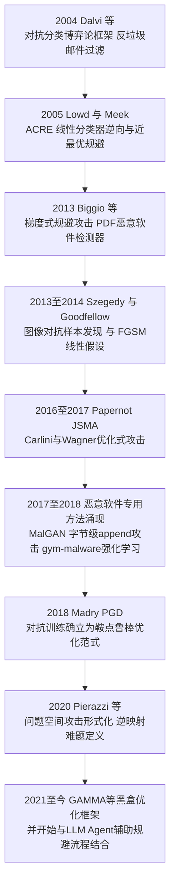
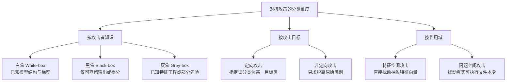
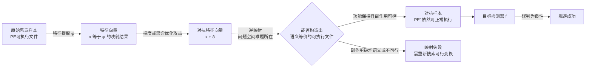
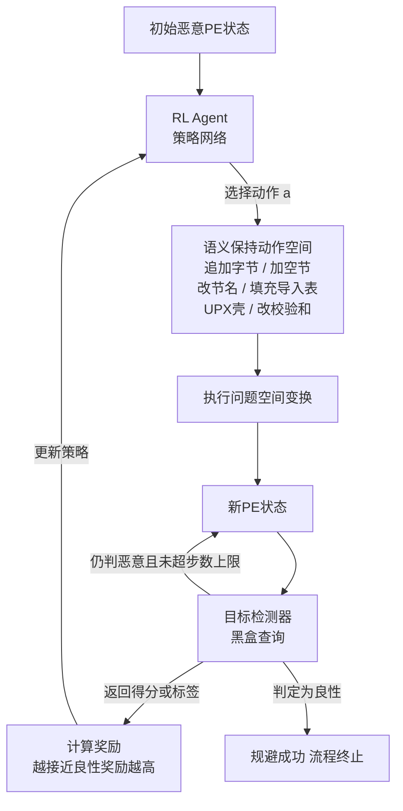

# AI辅助逆向与ML安全（8）· 对抗样本与规避检测
> [!abstract] TL;DR
> - 对抗机器学习并非始于图像分类：2004年垃圾邮件过滤博弈、2005年线性分类器逆向、2013年PDF检测器梯度规避都早于或同期于视觉领域的"对抗样本"发现，安全领域是这条脉络真正的策源地。
> - 恶意软件对抗样本与图像对抗样本有一个本质差异：前者必须同时满足"骗过检测器"与"保持文件可执行/功能等价"两个约束，后者只需满足前者——这道**问题空间到特征空间的逆映射难题**是本篇的核心。
> - 白盒梯度攻击（FGSM/PGD/C&W/JSMA）在连续特征空间效果显著，但面对离散PE字节、二值指示特征、只增不减的单调约束时会遇到取整误差与副作用特征两个工程陷阱，实用框架因此转向黑盒查询驱动的强化学习与遗传算法（gym-malware、GAMMA）。
> - 真实免杀链条通常是"工程手法（壳/混淆/资源注入）+ 优化制导的黑盒搜索"的组合，纯白盒梯度攻击在商业AV/EDR的黑盒集成场景下迁移性有限，不能与学术对抗样本简单划等号。
> - 防御侧的对抗训练本质是min-max鲁棒优化，但在离散结构化的恶意软件特征空间上很难获得图像领域randomized smoothing那样的可认证鲁棒性，单调分类器、集成检测、输入净化是更贴合本领域现实的补充手段。
> - 评估任何"鲁棒"检测器都要警惕梯度掩蔽（obfuscated gradients）陷阱：不可微预处理或随机化只是让攻击者难以直接求梯度，并不代表真正安全，必须用自适应攻击重新验证。

## 概述与定位

对抗样本（Adversarial Examples）指的是对模型输入施加人类难以察觉、或者在给定约束下极为克制的扰动，使模型输出发生剧烈甚至定向的变化。这个概念在公众认知里常被简化成"给熊猫图片加一层噪声，分类器就把它认成长臂猿"的图像案例，但把时间线拉长会看到一个更完整、也更贴合本系列定位的事实：对抗机器学习真正的策源地并不是计算机视觉，而是安全领域本身。早在2004年，Dalvi等人在《Adversarial Classification》里就把垃圾邮件过滤器建模成一场攻防博弈——过滤器学习一条线性决策边界，垃圾邮件发送者则通过增删关键词主动寻找绕过边界的构造方式；2005年Lowd与Meek进一步提出了ACRE（Adversarial Classifier Reverse Engineering）学习框架，证明攻击者仅凭对分类器的成员查询（membership query）就能以多项式复杂度逼近线性分类器的决策边界，并构造出近似最优的规避样本。这条脉络与本篇后文要讲的黑盒查询攻击、乃至第9篇要讲的模型提取，在方法论上是同一根藤上的瓜。2013年，Biggio等人在《Evasion Attacks against Machine Learning at Test Time》中对PDF恶意软件检测器（PDFrate等）做了基于梯度的规避攻击，这几乎与Szegedy同年发表的图像对抗样本论文《Intriguing properties of neural networks》同期、独立地发现了"沿损失函数梯度方向对输入做微小扰动即可翻转预测"这一现象。理解这段历史，有助于摆脱"对抗样本是CV专属现象、恶意软件检测领域只是照搬"的误解——事实恰恰相反，规避攻击是安全机器学习与生俱来的原生问题，图像领域只是后来居上，凭借更直观的可视化效果把它推成了学界热点。



本篇是本系列第8篇，处在系列第三组"逆向/加固AI本身"的起点。第5篇讨论的是如何用机器学习构建恶意代码检测器，第6篇讨论的是用嵌入与表示学习提升二进制特征的质量，二者关心的都是"分类器怎么造"；本篇要回答的问题反过来——给定一个已经训练好、甚至已经上线的检测器，攻击者如何在不破坏程序功能的前提下，找到一条能让它误判的输入变体。这把讨论的重心从"分类器的构建"切换到"分类器的攻防边界"，也直接为第9篇"模型逆向与提取与投毒"打地基：本篇讨论的规避攻击（evasion attack）发生在**测试/推理阶段**，只改变输入、不改变模型；第9篇的投毒攻击（poisoning attack）发生在**训练阶段**，污染的是训练数据或模型本体。两者是完全不同的威胁模型，对应完全不同的防御手段（本篇讲的是对抗训练与输入侧鲁棒化，第9篇讲的是数据溯源与训练流水线完整性），读者应当在概念上把这条边界画清楚。

对抗样本在恶意软件检测语境下与图像分类语境下最本质的差异，在于"扰动的可行域"完全不同。图像分类器的输入是连续、稠密的像素矩阵，只要扰动的Lp范数足够小、人眼看不出差别，攻击者几乎可以在整个像素空间里自由游走；而一份可执行文件的"扰动"绝不能是任意字节改动——改错一个字节就可能让PE装载器拒绝加载，或者让原本的功能逻辑彻底失效。因此恶意软件领域的对抗样本研究从一开始就必须同时满足两个约束：其一是让检测器误判（这与图像领域一致），其二是保持**功能等价**（functionality-preserving，这是本领域独有的硬约束，图像领域没有对应概念）。第二个约束才是这个子领域真正的技术难点所在，也是本篇第三节要重点展开的"问题空间攻击"的由来。下表把两个领域的差异做一个直观对照：

| 维度 | 图像分类对抗样本 | 恶意软件检测对抗样本 |
| --- | --- | --- |
| 输入空间 | 连续像素值，处处可微 | 离散字节/结构化文件格式，大量不可微变换 |
| 扰动约束 | Lp范数下人眼不可感知 | 必须保持功能等价可执行，无"感知阈值"概念 |
| 可行域 | 整个像素空间基本可达 | 仅问题空间中"合法且语义等价"的子集可达，逆映射困难 |
| 特征方向性 | 扰动可正可负（增亮/减暗） | 常存在单调约束，多数场景只能"新增"不能"删除"已有恶意逻辑 |
| 攻击有效性验证 | 人眼判断/L2距离度量 | 沙箱执行验证功能等价，往往还需多引擎复检 |

## 原理与机制

对抗样本的存在性可以从几个互补的角度解释，理解这些角度能帮助建立"为什么训练精度很高的模型依然如此脆弱"的直觉，而不只是记住几个攻击算法的名字。

**决策边界的几何脆弱性。** 任何分类器本质上是在特征空间里划出一张决策边界，把不同类别的区域分隔开。神经网络等高容量模型为了拟合训练集上错综复杂的分布，边界形状往往极其曲折，样本点到最近边界的距离在高维空间中可能远比直觉短。下面用一个极简的二维投影示意这个几何直觉：

```text
特征空间中的决策边界示意（简化二维投影）：

        良性区域
    B B B B B B B B
    B B B B B B B B
   -----------------  <- 决策边界 f(x) = 0
    M M M M M M M M
    M M M M x -----> x+δ   （最小扰动越过边界）
    M M M M M M M M
        恶意区域

样本 x 原本落在恶意区域深处；只要找到一个足够小的 δ，
把 x 推过最近的边界一小段距离，f(x+δ) 的预测标签就会翻转。
高维空间中"最近边界"往往比直觉近得多，这正是对抗样本存在性的几何来源之一。
```

**线性假设与FGSM。** Goodfellow等人在2014年提出了一个此后被广泛引用的解释：高维空间中，即便是分段线性或局部近似线性的模型（包括很多由ReLU堆叠出的深度网络），只要在梯度方向上对每一维输入做一个微小的同向扰动，各维度的贡献会线性叠加，最终导致输出发生巨大变化——这就是"线性假设"，也是Fast Gradient Sign Method（FGSM）的理论基础：

```text
FGSM（单步）：
    x_adv = x + ε · sign(∇x L(θ, x, y))

    θ  模型参数；L 为损失函数；y 为真实标签
    ε  扰动预算，控制单步幅度
    sign(·) 只取梯度方向不取幅值，保证每一维改动量一致
```

FGSM是"一步到位"的攻击：只算一次梯度符号，乘上扰动预算直接叠加到输入上。优点是极快（一次反向传播即可），常被用作基线或者用来批量生成对抗训练样本；缺点是攻击强度有限，稍加正则化的模型就能部分抵御纯FGSM。

**迭代式攻击：PGD。** Madry等人把生成对抗样本本身形式化为一个约束优化问题——在Lp范数球内寻找使损失最大化的扰动——并用投影梯度下降（Projected Gradient Descent）做多步小步长迭代，每步之后把结果投影回允许的扰动范围：

```text
PGD（多步投影梯度下降）：
    x^(t+1) = Proj_{x+S} ( x^t + α · sign(∇x L(θ, x^t, y)) )

    S = { δ : ‖δ‖∞ ≤ ε }  允许扰动的 Lp 范数球
    α  单步步长，通常远小于 ε
    Proj  每步之后把结果投影回可行域，避免越界
```

PGD比FGSM强得多，因为它不再依赖"局部线性"这个可能不成立的假设，而是在损失面上真正做多步爬坡搜索；代价是计算成本随迭代步数线性增长，且需要多次访问模型梯度，对黑盒场景不友好。更重要的是，Madry等人同时指出：如果把"生成对抗样本"这个内层最大化和"更新模型参数"这个外层最小化打包成一个鞍点（min-max）问题一起求解，就自然得到了对抗训练——这一点在"安全性与正确使用"一节还会详细展开。

**优化式攻击：C&W。** Carlini与Wagner在2017年提出了一族基于显式优化目标而非梯度符号的攻击，核心思路是把"寻找最小扰动使得错误类别的置信度超过正确类别"写成一个可微的margin-based损失，再配合变量替换把约束优化转成无约束优化去求解：

```text
C&W（以 L2 为例）：
    minimize   ‖δ‖2 + c · f(x+δ)
    s.t.       x+δ ∈ 合法输入范围
    f(x') = max( max_{i≠t} Z(x')_i − Z(x')_t , −κ )

    Z(·)  模型最后一层的 logit 输出；t 为目标类别
    c、κ  分别控制扰动大小与攻击置信度余量的超参数
```

C&W生成的扰动通常比FGSM/PGD更小、更难被简单手段察觉，因为它是真正针对"最小距离"这个目标做优化；代价是计算开销显著更高，且需对每个样本单独求解，不适合大规模黑盒场景下的快速迭代。C&W最初就是为了击穿"防御性蒸馏"这类早期防御方案而设计的，这也提示一个重要教训：几乎所有号称"鲁棒"的防御，最终都需要用专门针对该防御设计的自适应攻击重新检验——这一点在后文"梯度掩蔽陷阱"部分还会展开。

**面向稀疏/离散特征的JSMA。** Papernot等人提出的Jacobian-based Saliency Map Attack（JSMA）路线不同：它不追求Lp范数最小，而是追求L0范数最小，即"改动尽可能少的维度"。做法是计算输入相对输出的雅可比矩阵，构造一张"显著图"，每轮只挑显著性最高的一到两个特征维度修改，直到分类结果翻转或达到修改上限。这个思路天然适合恶意软件领域——很多恶意软件特征本身就是离散、稀疏的二值指示器（例如"是否声明了某条Android权限""是否导入了某个API"），JSMA式的"只碰少数几维"策略比FGSM式"所有维度都动一点"更贴合这种特征空间的现实约束，这也是Grosse等人把JSMA迁移到Android恶意软件检测（Drebin特征）时的直接动机，详见第三节。

**黑盒场景与可迁移性。** 上述四种方法都假设攻击者能拿到模型梯度，即白盒攻击。但现实中面对的商业检测引擎、云端AV/EDR，攻击者往往只能拿到一个标签或一个可疑度分数，是彻底的黑盒。黑盒攻击主要靠两条路：一是**可迁移性**（transferability）——Papernot等人证明，用攻击者自己训练的替代模型（substitute model）生成的对抗样本，相当一部分能直接迁移到结构、参数完全不同的目标模型上，原因是不同模型在同一份训练数据分布上往往学到了相似的非鲁棒特征和相近的决策边界形状；二是**基于查询的零阶优化**（query-based / zeroth-order），不依赖真实梯度，而是通过多次查询目标模型输出、用有限差分或进化算法/强化学习估计一个数值梯度或直接做无梯度搜索——这条路径在恶意软件领域尤其重要，下一节要讲的gym-malware、GAMMA等实用规避框架，几乎全部构建在"黑盒查询+启发式/强化学习搜索"上，而非依赖真实梯度。



需要强调的是，图中三个分类维度并非互斥，而是可以自由组合的——比如一次典型的恶意软件黑盒问题空间非定向攻击，指的就是攻击者不知道检测器内部结构（黑盒）、只要求脱离"恶意"这一类别而不关心被误判成哪个具体良性子类（非定向）、并且直接操纵真实PE文件而非抽象特征向量（问题空间）。这三个维度的组合直接决定了该用哪一族算法：白盒加特征空间可以直接套用FGSM/PGD/C&W；黑盒加问题空间基本只能依赖查询驱动的遗传算法或强化学习，这正是第三节的主题。

## 规避攻击算法详解：特征空间扰动与问题空间实现

### 特征空间与问题空间：一道逆映射难题

Pierazzi等人在2020年的论文中系统化了一个此前researcher们各自摸索、却始终没有被明确命名的核心矛盾：绝大多数梯度攻击算法都工作在**特征空间**——也就是检测器实际吃进去的那个数值向量 x = φ(样本)，φ是特征提取函数；但攻击者真正能操纵的是**问题空间**——也就是一份真实的PE文件、APK或者PDF本身。攻击者在特征空间里通过FGSM/PGD找到的最优扰动 δ，本质上只是"检测器最讨厌哪个方向"的一个数学答案，它不自动对应任何一种可以在文件里真实实施的字节级修改。把特征空间的扰动映射回一个真实可执行、语义等价的问题空间对象，这个逆映射 φ⁻¹ 在绝大多数场景下没有闭式解，只能靠对可用变换原语的搜索来近似——这就是"问题空间到特征空间的逆映射难题"，是理解本节所有具体攻击框架设计动机的总纲。



这道逆映射难题在实践中拆解为Pierazzi等人定义的四类约束，值得逐条理解，因为后文每一个具体框架其实都是在这四类约束下做取舍：其一是**可用变换集**（available transformations），攻击者能做的操作被限定在一个有限的原语集合里，比如"追加字节""插入节""改节名"，不能凭空要求特征向量的任意一维发生任意大小的变化；其二是**语义保持**（preserved semantics），任何变换都不能改变程序原有的功能逻辑，这是恶意软件对抗样本区别于图像对抗样本的根本约束；其三是**合理性**（plausibility），生成的文件不能在其他维度上显得过于怪异（比如一个正常大小几十KB的程序突然被追加几十MB的填充字节，本身就会触发"文件大小异常"这类附加的启发式规则）；其四是**鲁棒性**（robustness to preprocessing），变换要能扛得住检测流水线里常见的预处理步骤，比如脱壳、格式规范化，否则精心构造的扰动可能在预处理阶段就被冲掉。

### PE 文件的可操纵维度与静态特征规避

具体到Windows PE这个研究最成熟的载体（原因是PE长期是恶意软件的主战场，配套的解析/重写工具链LIEF、pefile也最成熟），可操纵的位置大致如下：

```text
典型 PE 文件结构与可规避操纵位置（简化示意）：

  +---------------------------+
  | DOS Header / DOS Stub     |  <- 可扩展冗余字段，低风险
  +---------------------------+
  | PE Header / Optional Hdr  |  <- Checksum可重算，字段一致性较敏感
  +---------------------------+
  | Section Table             |  <- 可改节名、可新增空/良性节
  +---------------------------+
  | .text  （代码节）           |  <- 高风险区，一般不直接扰动，易破坏功能
  | .data  （数据节）           |
  | .rdata （导入表等）          |  <- 导入表填充：追加良性API引用（未必实际调用）
  | .rsrc  （资源节）            |  <- 注入良性图标/版本信息/字符串表
  +---------------------------+
  | Overlay（附加数据区）       |  <- append攻击主战场：文件尾追加任意字节
  +---------------------------+
```

其中最常被研究和利用的是**Overlay追加攻击**（append attack）：PE装载器在正常加载流程中不会读取最后一个节之后的数据，因此在文件尾部追加任意字节，理论上对程序的运行语义零风险，是"功能保持"约束下摩擦最小的操纵维度，也因此成为最早一批端到端字节级检测器对抗样本研究的突破口。**导入表填充**则针对的是依赖API调用统计特征的检测器：只要在导入表里新增对若干常见良性API的引用（不要求代码真正调用它们），就能让"API集合的良性/恶意打分"这类特征发生偏移。**资源节注入**、**节名归一化**（把可疑或非常见节名改成编译器默认的.text/.data等）都是针对手工特征工程里那些"看起来朴素但极易被针对"的维度设计的，比如很多早期特征工程会把"节名是否在常见白名单里"直接当成一个特征，这类特征的规避成本极低。这里也能看出一个规律：**越是浅层、越接近"字节统计/字符串出现与否"这类表层特征，越容易被问题空间操纵覆盖；越是深层、依赖控制流/语义等价类的表示，规避成本越高**——这与第6篇嵌入表示学习强调的方向是一致的，用更接近程序语义本质的表示（而非表层统计量）本身就是一种源头防御。

### 面向恶意软件的经典攻击框架

**MalGAN**（Hu与Tan，2017）针对的是基于API调用集合特征、且检测器本身黑盒不可见的场景：攻击者训练一个生成器网络，输入原始恶意样本的API特征加上随机噪声，输出一份"改写后"的API特征向量（只允许新增、不允许删除已声明的恶意API，天然满足单调约束）；同时训练一个替代检测器去模仿黑盒目标的判别边界，生成器与替代检测器以类似GAN的方式对抗训练，最终生成器学会稳定输出能骗过替代检测器、进而有较大概率也能骗过真实黑盒目标的特征向量。MalGAN工作在特征空间，其"新增API引用"这个动作本身在问题空间里对应的正是前面提到的导入表填充，逆映射相对直接。

**Kreuk等人**（2018）把攻击目标转向端到端字节级深度模型——最典型的是MalConv（Raff等人2017年提出的、直接在最长可达2MB的原始字节序列上做卷积的恶意软件分类器）。他们的做法是在字节的embedding连续空间里跑FGSM式梯度攻击生成扰动，再把结果离散化投影回真实字节，同时把可修改区域限定在文件尾部的overlay和节间的slack space（对齐产生的填充空隙）里，从而在保证不破坏PE语义的前提下让端到端模型的判别得分发生偏移。Suciu等人随后的复现研究则指出了这类"追加式"攻击的一个重要局限：其可迁移性和稳健性远不如图像领域的对抗样本，很大程度上依赖训练集中良性/恶意样本在文件长度、padding模式上的分布偏差被模型学成了捷径特征，一旦训练数据做了针对性清洗，攻击效果会明显下降——这也提醒我们，很多"成功"的规避案例本质上是在打检测器训练数据的分布漏洞，而不是在打检测任务本身的天花板。

**gym-malware**（Anderson等人，Endgame团队）是黑盒问题空间强化学习规避的代表框架：把一个基于EMBER特征训练的梯度提升树检测器当成黑盒环境，用类似OpenAI Gym的接口封装一个动作空间，RL agent（论文里用DQN一类的方法）通过不断查询检测器返回的得分作为奖励信号，学习一条动作序列，把恶意PE一步步改写到检测器误判为止：

```text
gym-malware 风格的问题空间动作原语示例：
  append_bytes(n)            追加 n 个良性采样字节到 overlay
  append_import(dll, api)    在导入表新增未必调用的良性 API 引用
  append_section(name)       插入新的空/良性内容 section
  rename_section(old, new)   将可疑节名改为常见编译器默认名
  upx_pack() / upx_unpack()  壳化或去壳，大幅改变熵分布
  modify_timestamp()         修改 PE 头部编译时间戳
  modify_checksum()          重算 Optional Header 校验和保持头部一致
  add_overlay_from_benign()  从良性样本中截取字节片段拼接到文件尾部
```



这个循环的本质是把"寻找规避序列"变成一个强化学习问题：状态是PE当前的字节表示，动作是上面列出的语义保持原语，奖励与检测器打分负相关，终止条件是检测器给出良性判定或达到最大步数。相比MalGAN和Kreuk等人的方法，gym-malware完全不需要目标模型可微、甚至不需要知道目标模型的类型（只要能查询打分），因此更贴近真实黑盒场景，代价是训练RL agent本身需要大量对目标检测器的查询次数，在真实商业AV场景下查询成本和被封锁的风险都不能忽视。

**GAMMA**（Demetrio、Biggio等人）走的是另一条黑盒零阶优化路线：不训练RL策略网络，而是直接用遗传算法在"注入哪些良性内容片段、注入到哪些位置"这个离散组合空间里做种群进化搜索，每一代根据目标检测器的打分做选择、交叉、变异，逐步逼近规避方案。遗传算法相比RL的优势是不需要预训练、单个样本级别的攻击可以即时跑，天然适合"一次性、按需"的红队评估场景；劣势是没有跨样本迁移学到的策略知识，每换一个目标样本往往要重新搜索。这一族方法与前面Grosse等人把JSMA迁移到Android恶意软件检测（Drebin特征）的思路彼此呼应：Drebin特征本身是一堆非常稀疏的二值指示器（声明的权限、请求的intent-filter、调用的API等），且同样存在"只能新增声明不能删除已有声明"的单调约束（删除权限声明可能导致应用运行时崩溃），因此JSMA式的稀疏扰动搜索、GAMMA式的离散组合搜索，在方法论上是同一类问题在不同数据格式下的具体实现。

### 动态特征与行为规避

以上讨论的都是静态特征规避，但检测体系里同样重要的一环是基于动态/行为特征的分类器——即先在沙箱里跑一遍样本，收集API调用序列、网络行为、文件系统改动等，再喂给一个序列模型（RNN/LSTM或者简单的n-gram统计模型）打分。这类检测器面临两类规避手法：一类是更传统意义上的**沙箱指纹规避**（sandbox evasion）——检测运行环境是否存在虚拟机特征、调试器特征、鼠标真实移动轨迹、系统运行时长等，一旦判断处于分析环境就按兵不动或表现出完全良性的行为，这更接近经典反分析工程手法而非严格意义上的"对抗样本"，但目的都是让基于行为序列训练的ML模型拿不到真实的恶意行为轨迹；另一类则更贴近本篇主题，即**API调用序列的对抗性扰动**——Rosenberg等人提出的黑盒攻击针对RNN一类的API序列分类器，通过在真实恶意API调用之间插入大量语义上的no-op调用（不影响程序结果、但会显著稀释n-gram/序列统计特征里恶意模式的权重）来降低恶意得分，这个思路与网络入侵检测领域历史上的mimicry attack（模仿正常流量的行为序列以规避基于序列的IDS）在方法论上同源，都是利用了序列模型对"局部子序列统计"的依赖，通过插入良性噪声子序列来稀释判别信号。动态特征规避的一个共性特点是：由于行为序列本身就是程序真实执行产生的副产品，插入no-op调用天然满足"功能保持"约束（不影响原有调用的执行结果），因此在满足问题空间约束这件事上反而比静态字节级攻击更"轻松"，这也是为什么很多真实免杀样本会同时叠加静态和动态两个维度的规避手法。

### 两个工程陷阱：副作用特征与离散化误差

写到这里有必要总结两个贯穿本节所有具体方法、极易被低估的工程陷阱。第一个是**副作用特征**（side-effect features）：一次问题空间变换往往不只影响攻击者瞄准的那一个特征维度，还会"顺带"改变其他若干维度。比如为了压低"字节直方图差异"这个特征而往overlay里追加大段良性字节，副作用是文件体积、整体信息熵、"良性代码占比"等一系列衍生特征都会跟着变化，如果检测流水线里还有一条基于文件大小异常的规则，攻击者精心设计的字节级规避反而会撞上另一层完全不同的检测逻辑。第二个是**离散化误差**：绝大多数梯度攻击天然工作在连续实数空间，但恶意软件特征里有大量二值指示器（某API是否被导入、某权限是否声明），把连续空间求得的"最优"扰动做四舍五入或投影离散化之后，很可能不再是原来意义上的最优解，甚至可能因为舍入丢失了原本刚好能跨过决策边界的那一点点幅度而完全失效——这正是Al-Dujaili等人专门为二值编码特征设计rFGSM、dFGSM等离散化友好的内层最大化求解器的动机所在，也是为什么恶意软件领域的对抗训练要比图像领域多考虑一层"求解器与特征离散性是否匹配"的问题。

## 工具视角与实战

**开源工具链。** secml-malware（Demetrio与Biggio团队维护）是目前学术界评估Windows PE分类器鲁棒性最常用的Python库，内置了padding攻击、节注入攻击以及GAMMA遗传算法的参考实现，并直接对接LIEF这个通用的可执行文件解析/重写库来完成问题空间的实际字节操作；EMBER数据集（Anderson与Roth发布）提供了上百万份PE文件的预提取特征（字节直方图、字节熵直方图、字符串统计、头部字段、节表、导入导出表等）以及一个LightGBM基线模型，是大量黑盒攻击论文默认的评测靶子；gym-malware则如前所述提供了强化学习式规避的OpenAI Gym风格环境封装。通用型的对抗鲁棒性框架，比如IBM的Adversarial Robustness Toolbox（ART）、学术界常用的CleverHans、Foolbox，主要面向图像和表格这类连续/半连续数据设计，直接套用在PE这种强结构化、离散、有语义约束的问题空间上并不合身——它们可以用来在特征空间层面快速验证一个攻击思路（比如先用ART跑一版FGSM/PGD看看特征空间层面检测器脆不脆弱），但要落到真实可执行文件，仍然需要secml-malware这类专门处理逆映射与问题空间约束的工具来补完最后一公里。

**AI Agent辅助的规避评估闭环。** 呼应第7篇讨论的MCP与Agent集成，一套更工程化的红队自评流程可以把"变异样本生成→沙箱功能验证→查询检测器→反馈迭代"这个循环用Agent编排起来：底层的数值优化（梯度攻击、遗传算法、强化学习）仍然由专门的攻击框架负责，LLM Agent承担的是"启发式先验生成"与"结果核验"两类工作——比如在需要往导入表或资源节里塞入"看起来正常"的字符串、版本信息、API引用组合时，LLM对海量良性软件语料的隐式知识可以比纯随机采样更快收敛到"像真实商业软件"的取值分布；更重要的是，每一次问题空间变换之后，都需要验证程序的语义等价性有没有被破坏，这正好可以复用第2篇讨论的AI辅助反编译能力——把变异前后的二进制分别丢给反编译流水线（可参考[[45.反编译器与反汇编引擎原理/07.Hex-Rays反编译器内部机制]]了解底层反编译引擎如何重建控制流与类型信息），对比反编译后的伪代码结构和关键路径是否一致，作为"功能保持"约束的一层自动化兜底检查，而不是仅仅依赖人工抽查或者简单的哈希/字符串比对。这类Agent编排能力的落地细节，可以进一步参考[[91.Claude Code/06-MCP]]与[[91.Claude Code/07-Subagents与工作流]]中关于工具调用与多步骤任务编排的机制。

**从学术对抗样本到真实免杀的距离。** 需要澄清一个常见误解：学术论文里报告的"规避成功率"通常是针对单一、结构透明（哪怕是黑盒也知道是什么类型）的检测器，而真实场景下的免杀目标往往是VirusTotal这样的多引擎聚合服务或者带云查杀、行为分析、威胁情报关联的现代EDR，是若干异构检测手段的集成。纯白盒梯度攻击对某一个模型有效，并不代表能迁移穿透整套集成防线；反过来，真正在野的免杀样本，通常是把传统工程手法（加壳、花指令、字符串加密、动态API解析、内存加载、证书滥用等，参见[[50.恶意代码分析与免杀对抗/02.恶意代码分类与家族谱系]]中关于家族免杀演化的讨论）与本篇介绍的优化制导搜索方法组合使用：工程手法负责压制基于签名/规则的传统引擎和绕过粗粒度启发式，优化制导搜索负责针对ML组件做定向的分数压制，两者缺一不可。另外一个实战中容易踩的坑是把VirusTotal当成免费的黑盒查询"oracle"来反复迭代攻击样本——这既存在服务条款层面的问题，也存在实际的技术反噬：上传的样本会被各安全厂商获取用于改进检测规则和再训练模型，等于免费把自己的规避手法喂给了对手，下一轮再用同样手法时反而更容易被抓，这也是为什么严肃的红队评估更倾向于在自建的、与生产引擎版本对齐的离线环境里做查询式攻击，而不是直接拿公开在线服务当迭代靶子。

## 安全性与正确使用

**对抗训练。** 前文提到，Madry等人把对抗样本生成与模型参数更新统一成一个鞍点问题，这就是对抗训练的理论基础：

```text
对抗训练的鞍点（min-max）目标：
    min_θ  E_(x,y)~D [ max_{‖δ‖≤ε} L(f_θ(x+δ), y) ]

    内层 max：在扰动预算内找出使当前模型损失最大的"最坏样本"
    外层 min：基于这些最坏样本的梯度去更新模型参数
    两层交替迭代，模型逐渐学会在扰动邻域内保持稳定判别
```


对抗训练在图像领域效果显著，但搬到恶意软件特征空间会遇到两层现实困难：一是内层最大化本身在离散、组合的问题空间里往往是NP难的近似搜索，不可能像图像领域那样廉价地跑几十步PGD就完事，很多实用系统只能退而求其次，用前一节提到的append攻击等便宜的启发式扰动去近似"最坏样本"，鲁棒性提升的上限也因此受限；二是恶意软件的"类别"边界本身具有强单调结构（新增恶意功能只应让恶意得分上升，不应该因为顺便新增了几个良性API引用就被完全洗白），普通的对抗训练并不会自动学到这种领域先验，因此**单调分类器**（monotonic classifier，Incer等人提出）作为一种更贴合问题结构的防御思路被提出：强制模型对"可疑特征"维度的打分函数保持单调不下降，这样攻击者哪怕新增再多良性特征也无法把恶意得分压到阈值以下，本质上是把"只能新增不能删除"这个问题空间约束直接编码进了模型结构里，而不是寄希望于训练数据覆盖到所有攻击变体。除此之外，**集成检测**（多个异构特征提取器/多个模型投票）能提高攻击成本，因为攻击者必须同时满足所有子检测器的规避条件；**输入净化**（先反混淆、规范化脱壳，再送入检测器）能消解一部分利用打包/加壳制造的表层统计噪声；图像领域行之有效的**认证鲁棒性**方法如randomized smoothing，由于依赖对输入做连续空间的随机噪声采样并证明概率意义上的鲁棒半径，在离散、结构化、变换非独立同分布的恶意软件特征空间上目前还缺乏同等强度的理论对应物，这是一个仍然开放的研究方向。下表汇总几种防御手段的适用场景与局限：

| 防御手段 | 核心思路 | 主要局限 |
| --- | --- | --- |
| 对抗训练 | min-max鲁棒优化，用近似最坏样本增广训练集 | 内层最大化在离散问题空间近似NP难，鲁棒性上限受限于近似质量 |
| 单调分类器 | 强制打分函数对可疑特征单调不下降 | 需要预先明确哪些特征满足"只增不减"，覆盖不到全部特征类型 |
| 集成检测 | 多个异构特征提取器/模型投票 | 提高攻击成本但不消除攻击面，且集成本身推理开销更大 |
| 输入净化 | 脱壳/反混淆/格式规范化后再分类 | 净化步骤本身可能被针对性规避，且可能误伤合法的加壳良性软件 |
| 认证鲁棒性 | 随机化平滑等提供概率意义鲁棒半径保证 | 离散结构化特征空间缺乏成熟理论对应物，工程落地尚不成熟 |

**梯度掩蔽陷阱。** Athalye等人在2018年的工作《Obfuscated Gradients Give a False Sense of Security》系统性地复现并攻破了当年ICLR会议上多篇声称鲁棒的防御方案，发现其中大多数并非真正提升了模型的本质鲁棒性，而只是通过不可微的预处理步骤或者随机化机制让攻击者难以直接求出可用的梯度——这种现象被称为梯度掩蔽（obfuscated gradients）。一旦攻击者换用绕开这层障眼法的自适应攻击（比如用可微的近似函数替代不可微的预处理步骤重新估计梯度），这些"鲁棒"防御的准确率会断崖式下跌回接近零。这个教训在恶意软件检测领域同样成立：如果一套防御方案只是在检测器前面加了一层不透明的规则过滤器或者随机丢弃部分特征，测试时用几个现成的白盒攻击工具打不穿，就得出"我们的系统很鲁棒"的结论，是非常危险的虚假安全感——正确的做法是假设攻击者知道防御机制的存在并会针对性设计自适应攻击，用这个更强的攻击者模型重新评估，而不是只用未经针对性调整的通用攻击工具做一次性测试就下结论。

> [!caution] 合规与伦理边界
> 本篇涉及的对抗样本生成、问题空间规避与黑盒查询攻击方法，仅可用于你自己搭建或拥有明确授权的实验环境、CTF靶场，以及合规的安全研究场景（例如评估自研检测器的鲁棒性、发表学术研究）。文中所有技术均以防御与教育视角讲解攻击原理，目的是帮助读者理解检测器为何会被绕过、应当如何针对性加固，**不提供**可直接用于突破真实生产环境、他人系统的成品配方，也**不为**绕过商业杀毒/EDR产品的授权限制或规避法律责任提供武器化步骤。将本文内容用于未经授权的规避测试、逃避安全执法或破坏他人系统，超出本文讨论范围，也不被支持；如需在真实商业检测产品上做规避有效性研究，应通过厂商授权的漏洞赏金/红队合作渠道进行。

## 小结

对抗样本研究把机器学习检测器从"训练集上准确率很高"这个静态指标，拉回到"面对主动构造的对抗输入还能否保持判别力"这个动态、博弈式的问题上来，这也是理解任何ML安全系统都绕不开的一层视角。本篇厘清了几条关键脉络：对抗机器学习的历史根基其实在安全领域而非图像领域；恶意软件对抗样本区别于图像对抗样本的核心是必须同时满足"骗过检测器"与"保持功能等价"两个约束，由此引出问题空间到特征空间的逆映射难题，以及由此衍生的可用变换集、语义保持、合理性、抗预处理鲁棒性四类工程约束；具体攻击框架上，白盒梯度方法（FGSM/PGD/C&W/JSMA）在连续特征空间里效果显著，但恶意软件领域的离散特征、单调约束、副作用特征三个现实障碍，把实用工具推向了黑盒查询驱动的强化学习（gym-malware）与遗传算法（GAMMA）；防御侧对抗训练是理论基石，但离散问题空间的求解近似质量、单调结构的领域先验编码、认证鲁棒性理论的不完备，都是仍然开放的工程与研究问题；评估任何防御都必须警惕梯度掩蔽带来的虚假安全感。下一篇（第9篇）会把攻击面从"测试时输入扰动"进一步延伸到"训练时数据/模型本体污染"与"模型知识产权窃取"，讨论模型逆向、成员推断与数据投毒——这是与本篇评估阶段完全不同、但同样重要的另一半威胁模型。

## 相关阅读

- [[00.AI辅助逆向与ML安全总览]]
- [[05.机器学习恶意代码检测]]（本篇规避的对象：静态/动态特征工程与分类器选型）
- [[06.嵌入与表示学习用于二进制]]（更鲁棒的语义表示是压缩问题空间可操纵维度的源头手段）
- [[07.MCP与Agent集成到逆向工作流]]（Agent编排变异-验证-查询闭环的工程基础）
- [[09.模型逆向与提取与投毒]]（黑盒查询攻击与模型提取的方法论延续，训练时投毒的不同威胁模型）
- [[91.Claude Code/06-MCP]]
- [[91.Claude Code/07-Subagents与工作流]]
- [[45.反编译器与反汇编引擎原理/07.Hex-Rays反编译器内部机制]]
- [[50.恶意代码分析与免杀对抗/02.恶意代码分类与家族谱系]]
- 书目：Battista Biggio & Fabio Roli, *Wild Patterns: Ten Years After the Rise of Adversarial Machine Learning*, Pattern Recognition, 2018
- 论文：Fabio Pierazzi et al., *Intriguing Properties of Adversarial ML Attacks in the Problem Space*, IEEE S&P 2020
- 论文：Ian Goodfellow, Jonathon Shlens & Christian Szegedy, *Explaining and Harnessing Adversarial Examples*, ICLR 2015
- 论文：Aleksander Madry et al., *Towards Deep Learning Models Resistant to Adversarial Attacks*, ICLR 2018

[[00.AI辅助逆向与ML安全总览|⬆ 系列总览]] | [[07.MCP与Agent集成到逆向工作流|← 上一章]] | [[09.模型逆向与提取与投毒|→ 下一章]]
