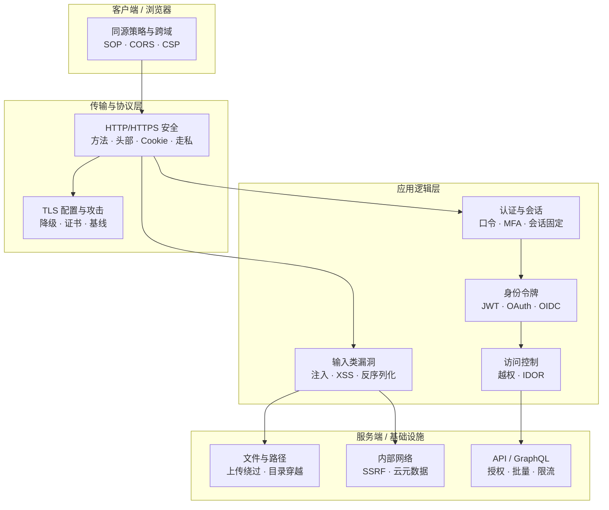
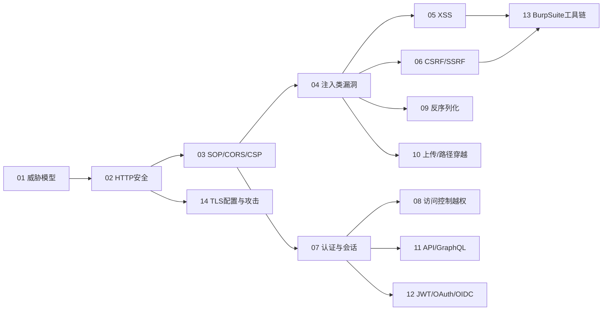

# Web与应用层安全 · 系列总览

> 应用层安全全景：从 HTTP 安全模型到注入/XSS/CSRF/SSRF、认证会话、反序列化与 API 安全。覆盖 OWASP Top 10 主要议题，从协议基础逐层深入到业务逻辑漏洞与高阶利用链，并最终落地到检测规则与加固实践。与 [[71.详解网络协议/18.HTTP-HTTPS协议|网络协议]] 和 [[29.Linux认证与登录编程/00.Linux认证与登录编程总览|认证系列]] 衔接。

> [!warning] 合规提醒与学习建议
> 本系列涉及的漏洞原理、Payload 与利用工具链，**仅限于自有资产、已获书面授权的测试环境，或 CTF/靶场（DVWA、pikachu、Juice Shop、Hack The Box 等）中实践**；对未授权系统开展测试属违法行为，须遵守《网络安全法》《数据安全法》及所在地法规。
>
> 系列整体以**防御视角**编排：理解攻击链路是为了更好地制定检测规则、加固基线与安全开发规范（SDL），而非单纯的攻击技巧堆砌。
>
> 学习建议：先通读 01～03 建立威胁模型与协议基础，再按业务场景选读 04～10 的具体漏洞类型，最后以 11～14 补齐认证体系、工具链与传输层加固；每章务必配合靶场动手复现，效果远胜纯理论阅读。

## 攻击面总览

## 篇目导航

| # | 章节 | 说明 |
| --- | --- | --- |
| 01 | [[01.Web安全全景与威胁模型]] | 信任边界、攻击面、STRIDE |
| 02 | [[02.HTTP协议安全]] | 方法/头/cookie 安全、走私，呼应系列 71 |
| 03 | [[03.同源策略与CORS与CSP]] | SOP、跨域、内容安全策略 |
| 04 | [[04.注入类漏洞：SQL与命令与模板]] | 注入原理、盲注、SSTI |
| 05 | [[05.XSS跨站脚本]] | 反射/存储/DOM、绕过与防护 |
| 06 | [[06.CSRF与SSRF]] | 跨站请求伪造、服务端请求伪造、云元数据 |
| 07 | [[07.认证与会话安全]] | 口令/多因素、会话固定、JWT 误用 |
| 08 | [[08.访问控制与越权]] | 水平/垂直越权、IDOR、RBAC 缺陷 |
| 09 | [[09.反序列化漏洞]] | Java/PHP/.NET 反序列化利用链 |
| 10 | [[10.文件上传与路径穿越]] | 校验绕过、解析漏洞、目录穿越 |
| 11 | [[11.API与GraphQL安全]] | REST/GraphQL 授权、批量、限流 |
| 12 | [[12.JWT与OAuth与OIDC安全]] | 签名绕过、令牌泄露、流程缺陷 |
| 13 | [[13.Web漏洞工具链：BurpSuite]] | 代理、扫描、插件、重放 |
| 14 | [[14.SSL与TLS配置与攻击]] | 降级、证书、配置基线，呼应系列 37/71 |

## 学习路径

## 与知识库既有体系的衔接

- 协议承接：[[71.详解网络协议/18.HTTP-HTTPS协议]]、[[71.详解网络协议/15.TLS协议]]
- 认证呼应：[[30.Windows认证与生物识别编程/08.WebAuthn与FIDO2与passkey编程]]
- 抓包呼应：[[72.抓包与协议分析实战/04.HTTP与HTTPS抓包与中间人分析]]
- 密码呼应：[[37.密码学/62.协议误用与密码工程]]
