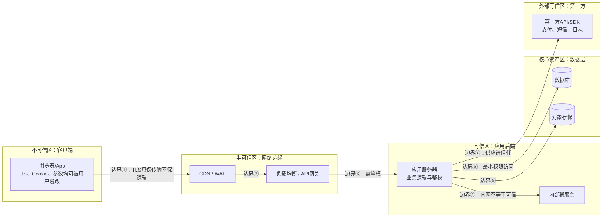
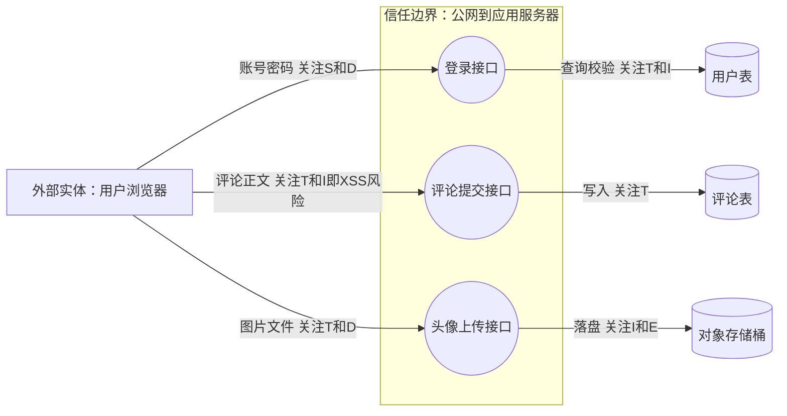
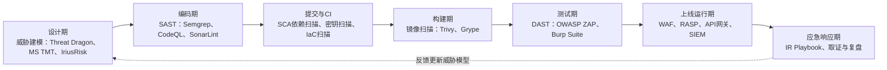

# Web与应用层安全（1）· Web安全全景与威胁模型

> [!abstract] TL;DR
> - Web安全的核心不是背漏洞清单，而是画出"信任边界"地图：数据或控制流从低信任区跨入高信任区（浏览器→服务器、公网→内网、租户A→租户B、依赖包→运行时）时若缺失校验，就是漏洞的诞生地。
> - 攻击面是系统暴露给潜在攻击者的全部输入/输出通道之和（路由、参数、上传口、第三方SDK、被遗忘的旧接口……），攻击面缩减（默认拒绝、最小权限、下线遗留功能）比事后打补丁性价比高一个数量级。
> - STRIDE（伪装/篡改/抵赖/信息泄露/拒绝服务/权限提升）把安全属性拆成六个可逐一审问的维度，与机密性/完整性/可用性/真实性/抗抵赖/授权六项安全属性一一对应，是给数据流图"拍X光片"的标准动作，而非一次性打钩表格。
> - DREAD、PASTA、攻击树、LINDDUN、VAST、OCTAVE是STRIDE的近亲/互补方法论，分别侧重优先级打分、攻击者叙事、目标导向枚举、隐私风险、规模化自动建模、组织级风险治理，选型取决于团队成熟度与关注点，不是互斥关系。
> - 后续13章（HTTP协议安全、同源与CORS/CSP、注入、XSS、CSRF/SSRF、认证会话、越权、反序列化、文件上传、API/GraphQL、JWT/OAuth/OIDC、BurpSuite工具链、TLS）本质上都是本章威胁分类学在某个具体信任边界或STRIDE维度上的显微展开，本章负责搭好统一坐标系。
> - 威胁建模是活文档而非一次性认证：系统迭代、新增第三方依赖、架构调整都要求重新过一遍相关子图，"建模完就归档"约等于没做过。

## 概述与定位

"Web安全"这个词在不同语境下所指的范围差异很大：有人把它等同于渗透测试报告里那十几条OWASP分类，有人把它简化为"给站点挂个WAF"，还有人把它等同于"HTTPS证书别过期"。这些理解都不算错，但都只摸到了大象的一部分。要在14篇的体量里把这个领域讲透，第一件事不是罗列漏洞类型，而是先把边界划清楚：本系列讨论的是**应用层**——具体到Web技术栈，就是HTTP/HTTPS承载的业务逻辑、身份认证、数据处理与客户端脚本执行——所暴露出的安全问题，而不是链路层的ARP欺骗、不是操作系统内核提权、也不是机房物理入侵。那些分别属于网络安全、系统安全、物理安全的范畴，虽然在真实攻击链里经常和Web层漏洞组合使用（例如先用SSRF从应用层跳进云元数据接口，再拿着换来的IAM临时凭证做云上横向移动），但本系列这台显微镜的焦平面始终固定在"运行在HTTP之上、由客户端与服务端交互构成的那套逻辑"上。这也是为什么本系列与同库的[[71.详解网络协议/18.HTTP-HTTPS协议|HTTP/HTTPS协议]]、[[71.详解网络协议/15.TLS协议|TLS协议]]是承接关系而非重复关系：那两篇讲的是协议本体如何工作，本系列讲的是运行在协议之上的应用逻辑如何被攻破。

Web的攻击面在过去二十年经历了近乎失控的膨胀，理解这个膨胀过程本身就是建立威胁直觉的第一步。最初的Web是文档分发系统：服务器吐静态HTML，浏览器只管渲染，彼时的"攻击"无非是篡改页面、目录遍历读源码。随后CGI/表单让服务器开始处理用户输入，SQL注入、命令注入应运而生。Web 2.0阶段，AJAX与富交互让浏览器里跑起了越来越复杂的JavaScript，Cookie承载会话状态成为标配，XSS、CSRF在这十年成为"黄金漏洞"。移动互联网普及后，后端逐渐API化，OAuth一类联邦身份协议兴起，越权与令牌劫持取代了纯页面漏洞成为新焦点。再往后是云原生与微服务：单体拆分成几十上百个服务，每一跳内部调用都是潜在信任边界，容器、Kubernetes、Serverless让"攻击面"从"几个路由"变成"整套云账号的IAM图谱"，SSRF因此从"让服务器多发一个请求"这种听起来无害的行为，升级成能打穿整个云账号的顶级威胁。近几年API-first与GraphQL让"该给谁看什么数据"这件事从前端渲染层的判断，被迫上升为后端接口必须显式处理的鉴权问题——历史上大量单页应用把权限判断留在前端，接口本身"裸奔"，这正是当下越权漏洞高发的结构性原因。而现在，大模型被集成进业务系统，又出现了全新的信任边界：模型的输出是否可信、能否被提示注入操纵，正在成为下一代威胁建模要回答的问题，这已经超出本系列范围，但值得读者带着同一套框架去审视。

理解了这条演进线，就能理解为什么攻击面会持续增长而不是趋于稳定：每一次架构演进都在增加新的组件、新的调用链、新的第三方依赖，而"新增的每一处，都需要重新问一遍它会不会被伪装、篡改、抵赖、窃听、打垮或者越权"——这正是本章要建立的思维框架，也是本章命名为"全景与威胁模型"而不是"漏洞入门"的原因。后续章节——[[02.HTTP协议安全]]、[[03.同源策略与CORS与CSP]]、[[04.注入类漏洞：SQL与命令与模板]]、[[05.XSS跨站脚本]]、[[06.CSRF与SSRF]]、[[07.认证与会话安全]]、[[08.访问控制与越权]]、[[09.反序列化漏洞]]、[[10.文件上传与路径穿越]]、[[11.API与GraphQL安全]]、[[12.JWT与OAuth与OIDC安全]]、[[13.Web漏洞工具链：BurpSuite]]、[[14.SSL与TLS配置与攻击]]——都是在某一个具体信任边界或某一类STRIDE威胁上做的"显微镜级"展开，本章不重复它们的技术细节，只负责把坐标系搭好。

在正式展开原理之前，先统一几个术语，后文会反复使用：**资产（Asset）**指值得保护的东西，可以是用户数据、会话凭证，也可以是"业务逻辑本身按预期执行"这件事；**威胁（Threat）**指可能对资产造成损害的潜在事件或行为者；**漏洞（Vulnerability）**指系统中可被威胁利用的具体缺陷；**风险（Risk）**是威胁利用漏洞对资产造成损害的可能性与影响的综合度量；**利用（Exploit）**是把漏洞变成实际攻击效果的具体手法；**攻击向量（Attack Vector）**是威胁抵达漏洞的路径。这条链可以简化成：

```
资产 Asset  →  威胁 Threat  →  利用漏洞 Vulnerability  →  攻击 Exploit  →  风险实现
 (用户数据)     (攻击者想窃取)    (SQL注入点)              (构造payload)      (数据泄露事件)
```

这条链的价值在于：安全工作可以在链条的任意一环发力——收窄资产暴露面、降低威胁发生概率、修补漏洞、检测利用行为、限制风险实现后的影响半径——威胁建模的产出，本质上就是针对这条链每一环列出的具体行动项。

## 原理与机制

### 安全属性与核心术语

经典的信息安全"CIA三元组"——机密性（Confidentiality）、完整性（Integrity）、可用性（Availability）——是所有安全工作的地基，但放到Web应用场景里通常需要再扩展三项：真实性（Authenticity，你是不是你声称的那个人）、抗抵赖性（Non-repudiation，你做过的事不能事后否认）、授权（Authorization，你能做的事是不是被明确允许的）。这六项属性两两之间会有交叉——比如未授权访问既是授权失效也常常导致机密性泄露——但把它们拆开来看，恰好能和后文的STRIDE六类威胁形成整齐的一一映射，这不是巧合，而是STRIDE框架本身就是按"每一类威胁破坏哪一项安全属性"设计出来的。

风险的粗略估算可以写成一个非正式的比例关系，它不是精确公式，但足以指导优先级判断：

```
风险(Risk) ≈ 威胁发生的可能性(Likelihood) × 一旦发生的影响(Impact)
             —— 该乘积会被现有安全控制(Existing Controls)进一步折减
```

这个式子说明两件事：第一，可能性极低但影响巨大的威胁（比如供应链投毒）依然值得投入，不能只按"历史上没发生过"来判断优先级；第二，安全控制是折减系数而不是开关，没有任何单一控制能把风险归零，这直接引出下文的纵深防御思想。

### 信任边界：从哪里开始必须校验

信任边界（Trust Boundary）是威胁建模里最核心也最容易被低估的概念：它指的是数据或控制流从一个信任级别跨入另一个信任级别的那条线，凡是跨越这条线的输入，理论上都必须重新校验，因为线的这一侧已经不再能替线的那一侧的正确性背书。一个典型的Web技术栈里，信任边界远比初学者想象的要多：



这张图里每一条边都值得单独讲一句。边界①提醒的是"HTTPS只解决传输层的窃听与篡改，不解决应用层逻辑对错"——用HTTPS提交的SQL注入payload一样能成功注入，这也是为什么"上了HTTPS就安全了"是本系列要在后面专门破解的误区之一。边界③④是最常被忽视的一类：很多团队默认"内网请求就是可信的"，于是内部微服务之间不做鉴权、不做输入校验，这个假设一旦被SSRF或者某个被攻陷的边缘服务打破，攻击者就能像正常内部调用者一样在整条调用链上横向移动——零信任架构（Zero Trust）正是针对这个假设提出的反命题，核心口号是"永不信任，始终校验"，无论请求来自公网还是内网，都要基于身份和上下文重新鉴权，这一思路可以追溯到Google内部的BeyondCorp实践，后来演变成整个行业的架构范式。边界⑤是最小权限原则的落地点：应用服务器连数据库的账号，理论上永远不应该拥有比业务所需更多的表权限或DDL权限，否则一次注入漏洞的影响半径会从"读某张表"扩大成"删库"。边界⑦常被完全遗忘：引入的第三方SDK、npm/pip依赖包、日志采集Agent，本质上都是把一部分信任交给了你不掌控代码的第三方，2020年SolarWinds供应链投毒事件——攻击者污染了Orion软件的构建流程，让下游数千家客户在"信任官方更新"的前提下引入了后门——就是这类信任边界被突破的典型案例，它告诉我们信任边界不只存在于网络拓扑图上，也存在于软件构建流水线里。

信任边界的判定标准可以归纳成一句话：**只要你不能百分之百控制线那一侧产生数据的逻辑，这条线就是信任边界，跨越它的数据必须被当作不可信输入重新校验**，哪怕那一侧是"内部系统""自己的移动端App""刚经过WAF过滤"。这条原则直接解释了为什么"客户端做的校验不算数、服务端必须重复校验一遍"不是啰嗦而是必需——客户端本身就活在攻击者可以完全控制的沙盒外部，浏览器里的JS、DevTools里能改的请求参数，都是攻击者的地盘，这也是"永远不信任客户端"这条铁律的由来。

### 攻击面：暴露了多少个入口

攻击面（Attack Surface）指的是系统暴露给潜在攻击者、可能成为攻击起点的全部输入/输出通道之和。学术上可以把它形式化为入口点（Entry Point）、出口点（Exit Point）、通道（Channel）与不可信数据项的集合，但工程实践里更常用的是枚举思维：

| 攻击面类别 | 常见入口 | 典型陷阱 |
|---|---|---|
| 网络暴露面 | 公网路由、开放端口、管理后台 | 遗留接口未下线、调试端点上线时忘记关闭 |
| 参数与协议面 | URL参数、请求体、HTTP头、Cookie、WebSocket帧 | 只校验了常见字段，忽略了不常用但同样可控的头部 |
| 身份与凭证面 | 登录口、找回密码口、Token刷新口 | 撞库/爆破缺少速率限制，找回流程比登录本身校验更弱 |
| 文件与内容面 | 上传接口、富文本编辑器、导入导出功能 | 文件类型只校验扩展名、导出功能变成SSRF/XXE入口 |
| 供应链面 | npm/pip依赖、第三方SDK、CI/CD流水线 | 传递依赖层数过深导致无人真正审计过 |
| 人为社工面 | 客服聊天、工单系统、企业邮箱 | 技术控制再严密，钓鱼邮件依然是最高性价比的入口 |

之所以要用列举而不是单一定义来理解攻击面，是因为攻击面的增长常常是"看不见"的：一个被遗忘但从未下线的旧版API（业内称为"影子API"或"僵尸API"）、一个测试环境遗留在生产网络里的调试端点、一个开发同学图方便临时放开的CORS通配符，这些都不会出现在任何架构图上，但它们都是真实存在的入口。2017年Equifax数据泄露事件的根因，正是一处已有公开补丁数月却未升级的Apache Struts组件（对应CVE-2017-5638的Jakarta Multipart解析器远程代码执行漏洞）——这不是什么高深的0day，而是"攻击面里有一个大家都知道该关但没人真去关"的窗口,最终导致上亿条记录泄露。这个案例给出的教训是：攻击面管理不是一次性梳理，而是需要持续资产清点（Asset Inventory）与依赖扫描的运营动作，本系列在"工具视角"一节会给出对应的自动化手段。

攻击面缩减（Attack Surface Reduction）的基本原则可以归纳为四条，且都指向同一个方向——让"默认状态"本身就是安全的：默认拒绝而非默认放行（新接口默认要求鉴权，而不是默认公开再补权限）；只暴露必需的方法和字段（GraphQL/REST接口不要因为"顺手"就把整个数据库模型透传出去）；及时下线不再使用的功能与环境（测试用的调试路由、废弃的API版本）；最小权限贯穿到每一层（应用账号、服务间调用凭证、云IAM角色都只给完成任务所需的最小权限集合）。这四条原则背后有一个共同的经济学逻辑：攻击面每增加一个入口，防御方就要为它多承担一份"必须永远不出错"的责任，而这份责任的维护成本是持续的，远高于一开始就不引入这个入口。

### 纵深防御与零信任

纵深防御（Defense in Depth）主张安全控制应该分层部署，每一层都假设前一层可能失效：网络层的防火墙/WAF、传输层的TLS、应用层的输入校验与身份鉴权、数据层的静态加密与数据库权限收敛、监控层的日志与异常检测、最后是应急响应层的处置预案。这种分层设计的必要性可以用一个反问来理解：如果只依赖WAF这一层，那么一旦攻击者找到WAF规则的绕过方式（编码变形、分块传输、协议层怪癖），后面就再无阻拦；但如果应用层本身也做了参数化查询、输出编码、严格的身份鉴权，WAF的失效就只是少了一道防线,而不是彻底沦陷。纵深防御和攻击面缩减是互补而非替代关系：前者假设"入口一定会被打穿，所以后面要有兜底"，后者假设"能不开的入口就不要开，从源头减少需要兜底的地方"，两者合起来才是完整的防御姿态。

零信任（Zero Trust）则是对"内网可信"这一传统边界防御假设的修正：不再以网络位置（是否在防火墙内）作为信任依据,而是对每一次访问都基于身份、设备状态、上下文动态做鉴权判断。放到Web应用场景中，零信任思想直接解释了为什么内部微服务之间也应该做身份校验（服务网格里的mTLS双向认证）、为什么已登录会话依然需要针对高危操作做二次校验（这正是CSRF类漏洞存在的结构性背景——"已经登录=后续所有请求都可信"这个假设本身就是攻击者要利用的漏洞，详见[[06.CSRF与SSRF]]）。理解零信任不需要等到部署具体产品，它首先是一种审视架构图的姿态：看到任何一条"因为是内部调用/因为已经登录/因为经过了网关"就被默认信任的连线，都应该多问一句"如果这个假设被打破,会发生什么"。

## 威胁建模与STRIDE详解

### 威胁建模四问与它在SDLC中的位置

威胁建模（Threat Modeling）是一套结构化地回答"这个系统哪里会出问题"的方法，其价值不在于产出一份文档，而在于强迫设计者在系统还只是白板上的方框和箭头时,就把攻击者视角引入进来。业内广泛引用的四个提问框架言简意赅：我们在构建什么（What are we building）、可能出什么问题（What can go wrong）、打算怎么应对（What are we going to do about it）、我们做得够不够好（Did we do a good enough job）。这四问对应到实践中的四个阶段：画出系统模型（通常是数据流图）、枚举威胁（STRIDE等方法论在此发力）、给出缓解措施并落实到需求/设计变更、复盘验证。

威胁建模应该介入的时间点是设计阶段,而不是上线前的"安全部门最后一道关卡"。原因是纯粹的经济账：在设计阶段发现"这个字段应该做权限隔离"，修改成本是画图时改一条线；等到编码完成才发现，成本是重构一个模块；等到测试阶段才发现，成本是回归测试全套用例；等到生产环境被外部研究者或者攻击者发现，成本是紧急补丁、对外公告、可能的数据泄露通报义务,以及最难挽回的用户信任损失。这条成本曲线并不需要精确的数字来证明,只要承认"越早发现修复范围越小"这个朴素事实,就足以支撑"威胁建模要前置到设计阶段"的结论。同时，威胁建模不是一次性的：系统每一次架构调整、每一次引入新的第三方依赖、每一次开放新的对外接口,都应该重新过一遍受影响的子图,这也是为什么成熟团队会把威胁建模嵌入需求评审和架构评审的固定环节,而不是只在项目立项时做一次然后归档。

### 数据流图：把系统画出来

STRIDE通常搭配数据流图（Data Flow Diagram, DFD）使用，DFD用四种图形元素描述系统：**外部实体**（External Entity，图形约定为矩形，代表系统边界之外的用户或其他系统）、**进程**（Process，圆角矩形或圆形，代表处理逻辑的功能单元）、**数据存储**（Data Store，双横线或圆柱，代表数据库、文件、缓存等静态存储）、**数据流**（Data Flow，带箭头的连线，代表元素之间流动的数据）,以及贯穿全图的**信任边界**（通常画成虚线，标出哪里发生了信任级别的切换）。DFD的价值在于强迫建模者把系统"摊开"成可枚举的元素集合，而不是停留在"大概长这样"的模糊印象里——STRIDE的下一步，正是对DFD中的每一个元素、或者每一条穿越信任边界的数据流,系统性地追问六类威胁是否成立。

不同类型的DFD元素并非平均地面临六类威胁，业内总结出一张适用性对照表,可以作为审查时的检查清单：

| DFD 元素 | 图形约定 | 适用的STRIDE类别 |
|---|---|---|
| 外部实体 | 矩形 | S、R（它是行为发起方，可被伪装身份，行为发生后也可能抵赖） |
| 进程 | 圆角矩形/圆 | S、T、R、I、D、E（六类全部适用，是审查重点，因为业务逻辑都在这里） |
| 数据流 | 带箭头的线 | T、I、D（传输中的数据可被篡改、窃听，或被打断导致不可用） |
| 数据存储 | 双横线/圆柱 | T、I、D，若该存储本身承担日志职责则还要考虑R |

这张表说明了一个实用原则：审查资源有限时，"进程"节点（尤其是跨越信任边界接收外部输入的那些进程）是投入产出比最高的审查对象，因为它是唯一六类威胁全部适用的元素类型。

### STRIDE六要素逐项拆解

STRIDE是微软在上世纪末提出、后来被写进安全开发生命周期（SDL）并被整个行业广泛采纲的威胁分类法，六个字母分别对应六类威胁,并且与前文的六项安全属性形成整齐映射：

| STRIDE类别 | 中文含义 | 破坏的安全属性 | 对应防御关键词 |
|---|---|---|---|
| **S**poofing | 伪装身份 | 真实性 Authenticity | 认证、多因素、证书/签名校验 |
| **T**ampering | 篡改数据或代码 | 完整性 Integrity | 输入校验、签名、参数化查询 |
| **R**epudiation | 抵赖已做过的操作 | 抗抵赖性 Non-repudiation | 审计日志、数字签名、防篡改时间戳 |
| **I**nformation Disclosure | 向无权限方泄露信息 | 机密性 Confidentiality | 加密、访问控制、字段最小化返回 |
| **D**enial of Service | 使系统不可用 | 可用性 Availability | 限流、容量规划、熔断降级 |
| **E**levation of Privilege | 获得超出授权的能力 | 授权 Authorization | 最小权限、RBAC/ABAC、鉴权中间件 |

**Spoofing（伪装）** 指攻击者冒充合法身份——可能是冒充某个用户，也可能是冒充某个服务。Web场景里最常见的表现是会话令牌被窃取后重放、诱导用户在不知情状态下以其身份发起请求（这正是CSRF的本质，本质是"服务器无法区分这次请求是用户本意还是被诱导发出"）、以及利用弱口令或撞库直接获得账号控制权。防御这一类威胁的核心是认证机制本身的强度与令牌管理，[[07.认证与会话安全]]与[[12.JWT与OAuth与OIDC安全]]会深入展开具体机制，本章只负责把它标记为"六类威胁之一"。

**Tampering（篡改）** 指对数据或代码完整性的破坏，覆盖面极广：SQL注入本质是篡改了本应是纯数据的输入,使其被当作查询逻辑执行；请求参数篡改可能导致越权（把订单号改成别人的）；反序列化漏洞是篡改了序列化对象的内部状态，让反序列化过程执行了攻击者构造的逻辑；中间人攻击篡改传输中的内容。这类威胁的对应章节最多，因为它几乎是"未经校验的输入跨越信任边界"这条核心叙事的直接体现,[[04.注入类漏洞：SQL与命令与模板]]、[[09.反序列化漏洞]]、[[14.SSL与TLS配置与攻击]]都是它的具体展开。

**Repudiation（抵赖）** 是六类里唯一没有独立成章的一类，因为它更多是横切关注点而非某个具体漏洞类型：如果系统没有留存操作日志，或者日志可以被执行操作的人自己删除/篡改，那么一旦发生纠纷或入侵事件，就无法证明"谁在什么时候做了什么"。这类威胁的防御措施是审计日志要与业务系统权限隔离（运维人员能看日志不代表能删日志）、关键操作要有不可否认的证据链（数字签名、区块链式的哈希链只是极端实现，多数场景下一份权限隔离良好、有完整性校验的日志系统就足够）。这也是[[09.反序列化漏洞]]之外，本章要求"日志与监控"必须被当作一等公民对待的原因——它是抵赖威胁唯一的对抗手段。

**Information Disclosure（信息泄露）** 指向无权限方暴露了本不该暴露的信息，表现形式非常多样：详细的报错信息里带出数据库结构或文件路径、目录遍历读到源码或配置文件、越权读取到他人的数据记录、XSS窃取当前用户的Cookie、而SSRF把服务器变成攻击者的代理去访问本不该被外部访问到的内网资源或云元数据接口。2019年Capital One的数据泄露事件是这类威胁与信任边界穿越结合的典型：一个配置不当的WAF被利用发起SSRF，请求打到了AWS EC2实例的元数据服务（这本身是一个只应被实例内部进程访问的本地地址），取得了一份具备S3访问权限的临时IAM凭证，再用这份凭证读取了大量存储桶中的数据——这条链路完整展示了"一次看似普通的信息泄露,如何借着云基础设施里一条被忽视的信任边界,升级成大规模数据外泄"。[[06.CSRF与SSRF]]、[[08.访问控制与越权]]、[[05.XSS跨站脚本]]分别覆盖了这一类威胁的不同侧面。

**Denial of Service（拒绝服务）** 指让系统或服务不可用，Web应用层的表现包括接口没有限流导致被刷爆资源、设计不当的正则表达式在特定输入下发生灾难性回溯（ReDoS）、允许无限制大小或数量的文件上传耗尽存储或内存、以及利用协议特性做放大攻击。这一类在本系列里没有独立成章，因为多数应用层DoS的具体成因会分散在其他章节里顺带提及（比如[[10.文件上传与路径穿越]]会提到解压炸弹类的资源耗尽问题），但作为STRIDE六要素之一，本章要求读者在做任何一处设计评审时,都单独问一句"这里有没有限流、有没有资源上限"。

**Elevation of Privilege（权限提升）** 指获得了超出被授予范围的能力，横向越权（访问另一个平级用户的数据）和纵向越权（普通用户获得管理员能力）是最常见的两种形态,此外JWT算法混淆（把签名算法从RS256降级成HS256、或者利用`alg: none`）伪造管理员令牌、条件竞争在授权判断和操作执行之间的窗口期完成提权，也都属于这一类。[[08.访问控制与越权]]、[[12.JWT与OAuth与OIDC安全]]是它的主战场。

### 迷你实战：给一个博客系统建模

用一个"登录、发表评论、上传头像"的迷你博客系统演练一遍完整流程,能把前面的方法论落到实处。第一步画DFD:



第二步对每个进程逐一过STRIDE，产出结构化的威胁记录。实践中常用的威胁建模工具（如OWASP Threat Dragon）导出的条目大致长这样：

```
Threat ID: TM-001
元素: 登录接口（Process）
STRIDE类别: Spoofing
描述: 攻击者可通过撞库/暴力破解伪装成合法用户登录
可能性: 高（若无速率限制）
影响: 高（账户完全接管）
缓解措施: 登录速率限制 + 失败次数锁定 + 弱口令检测 + 可选MFA
状态: 待评审

Threat ID: TM-002
元素: 评论提交接口（Process → 评论表 数据流）
STRIDE类别: Tampering / Information Disclosure
描述: 评论正文未做输出编码，攻击者提交的脚本会在其他用户浏览时执行（存储型XSS）
可能性: 高（富文本场景尤其常见）
影响: 中高（可窃取其他用户会话）
缓解措施: 输出编码 + 内容安全策略CSP + 富文本白名单过滤
状态: 待评审

Threat ID: TM-003
元素: 头像上传接口（Process）
STRIDE类别: Tampering / Elevation of Privilege
描述: 若仅校验扩展名，攻击者可能上传可执行脚本或触发服务端SSRF/XXE的特制文件（如恶意SVG）
可能性: 中
影响: 高（可能导致远程代码执行）
缓解措施: 校验真实文件类型、隔离存储域名、图片二次渲染、关闭SVG中的外部实体解析
状态: 待评审
```

这个迷你案例刻意覆盖了三种不同性质的威胁，是为了说明STRIDE分析不是套公式：登录接口的核心矛盾在Spoofing，评论接口的核心矛盾在Tampering引发的二次Information Disclosure（XSS本质是"评论内容"这条数据流被篡改后又被当作可信代码执行，进而侵犯了其他用户的机密性），头像上传接口则同时涉及Tampering（文件内容不受信任）和潜在的Elevation of Privilege（如果上传目录被解析执行）。三个进程,三种不同的威胁组合，这正是DFD+STRIDE方法论的价值所在：它不会漏掉某个进程,但也不会用同一套结论生搬硬套到所有进程上。

### STRIDE的近亲方法论：如何选型

STRIDE不是唯一的威胁建模方法论，理解它与近亲方法论的分工，有助于判断什么场景该用什么工具：

**DREAD**（Damage潜在损害、Reproducibility可复现性、Exploitability可利用性、Affected users影响用户数、Discoverability可被发现难度）最初被提出用于在STRIDE找出威胁之后给它们打分排优先级，五个维度各打0-10分求和或求平均。它的局限在于主观性强——尤其是Discoverability和Affected users两项，不同评审者给出的分数可能天差地别，导致同一个漏洞在不同团队里排出完全不同的优先级。业界后来更多转向CVSS这类有明确计算规则、跨组织可比的评分体系来做优先级排序，但DREAD的五个提问维度依然可以作为一份轻量的思考checklist使用，只是不必再执着于把它量化成一个精确分数。

**PASTA**（Process for Attack Simulation and Threat Analysis）是一套以攻击者为中心、风险驱动的七阶段流程，大致包括定义业务目标、定义技术边界、应用分解、威胁分析、弱点与漏洞分析、攻击模拟、以及风险与影响分析。相比STRIDE"这个系统结构上可能在哪里出问题"的系统中心视角，PASTA更强调"一个真实攻击者会如何组合利用这些弱点达成目标"的叙事,因此更适合需要向业务/管理层解释风险、需要做攻击链推演的成熟安全团队。

**攻击树（Attack Tree）**由Bruce Schneier提出，用根节点表示攻击者的最终目标，子节点表示达成目标的各种途径,并用AND/OR逻辑组织，每个叶子节点是一个具体的攻击步骤，可以标注成本、所需权限等属性。它是目标导向而非结构导向的方法，非常适合红队做场景推演,也适合和STRIDE配合——STRIDE负责"穷尽系统里有哪些薄弱点"，攻击树负责"把这些薄弱点串成一条条真实可行的攻击路径"。

**LINDDUN**（Linkability可关联性、Identifiability可识别性、Non-repudiation抗抵赖性被滥用为追踪、Detectability可探测性、Disclosure of information信息泄露、Unawareness用户不知情、Non-compliance不合规）是专注隐私风险的STRIDE变体，出自KU Leuven的研究工作，适合处理大量PII（个人身份信息）、需要考虑GDPR一类合规要求的系统。

**VAST**（Visual, Agile, and Simple Threat modeling）强调可视化与可规模化，目标是让威胁建模能嵌入敏捷开发流水线、由开发团队自己持续维护而不依赖安全专家逐个评审，通常区分"应用级威胁模型"与"操作级威胁模型"两条线。

**OCTAVE**（Operationally Critical Threat, Asset, and Vulnerability Evaluation）出自卡内基梅隆大学软件工程研究所，是组织级、资产与风险治理导向的方法论，视角比STRIDE更宏观，更常被风险管理/合规团队用来做组织级的风险评估，而不是工程师逐个组件做代码级建模。

选型建议可以归纳为一句话：**STRIDE适合工程师系统性覆盖每个组件"结构上可能错在哪"，PASTA和攻击树适合需要攻击者叙事去说服业务方或做红队推演的场景，DREAD和CVSS负责威胁找出来之后的优先级排序，LINDDUN负责隐私专项，OCTAVE负责组织级风险治理**——它们不是互斥的竞争关系，成熟团队往往组合使用：用STRIDE做设计评审时的系统扫描，用攻击树做重点资产的红队推演，用CVSS给已发现的漏洞定级。微软威胁建模工具（Microsoft Threat Modeling Tool）与开源的OWASP Threat Dragon都内置了STRIDE-per-element的自动化提示，能在画完DFD后自动为每个元素列出适用的STRIDE类别清单，大幅降低漏项概率；商业化的IriusRisk进一步把威胁库和合规映射（如与OWASP ASVS、PCI-DSS的映射）打包了进去，适合有合规审计需求的团队。

## 工具视角与实战

### 安全工具链与SDLC阶段映射

把安全工具按软件开发生命周期（SDLC）的阶段排开，能清楚看到"威胁建模"只是链条的起点而不是全部：



这条链最容易被误解的地方是"以为每个阶段的工具是互相替代的",实际上它们发现的问题类型基本不重叠：SAST（静态应用安全测试）在不运行代码的前提下分析源码/字节码找模式化缺陷，优点是能在提交阶段就拦截,缺点是对业务逻辑类漏洞（越权、竞态）基本无能为力；SCA（软件成分分析）扫描依赖树里的已知漏洞组件，直接对应"攻击面里的供应链一环"；DAST（动态应用安全测试）实际发起HTTP请求对运行中的应用做黑盒探测，能发现SAST看不到的运行时问题,但覆盖率依赖爬虫能不能走到所有功能点；WAF/RASP是运行时兜底，识别并拦截已知攻击特征。几个典型的命令行使用示例（均为CI流水线里的常规防御性用法，非利用性操作）：

```bash
# 提交前扫描代码库中是否有硬编码密钥/Token
gitleaks detect --source . --verbose

# 扫描容器镜像中已知的组件漏洞
trivy image myapp:latest

# 对自己/已获授权目标做被动信息收集，枚举常见的公开元信息路径
curl -s https://your-authorized-target.example/robots.txt
curl -s https://your-authorized-target.example/.well-known/security.txt
```

其中`.well-known/security.txt`（RFC 9116）值得单独一提：它是一个标准化的"如何联系我们报告安全问题"文件，体现的正是负责任披露生态的基础设施化——一个成熟的Web安全工程实践，不只是防住攻击者，也要为善意的安全研究者提供一条正规上报通道。

### OWASP Top 10：最常用的攻击面分类法

OWASP Top 10是业内引用率最高的Web漏洞分类清单，每隔几年基于大规模数据统计更新一次,2021版的十个类别恰好可以逐一映射回本系列的章节安排，这也是本章作为"全景"篇章要给出的一张总索引：

| OWASP Top 10 (2021) | 简述 | 对应本系列章节 |
|---|---|---|
| A01 Broken Access Control | 访问控制失效 | [[08.访问控制与越权]] |
| A02 Cryptographic Failures | 密码学相关缺陷 | [[14.SSL与TLS配置与攻击]] |
| A03 Injection | 注入类漏洞 | [[04.注入类漏洞：SQL与命令与模板]] |
| A04 Insecure Design | 不安全的设计 | 本章：威胁建模缺位是根因，横切全系列 |
| A05 Security Misconfiguration | 安全配置错误 | [[03.同源策略与CORS与CSP]]、[[14.SSL与TLS配置与攻击]] |
| A06 Vulnerable and Outdated Components | 存在漏洞的过时组件 | 本章工具视角：SCA/供应链管理 |
| A07 Identification and Authentication Failures | 身份识别与认证失效 | [[07.认证与会话安全]] |
| A08 Software and Data Integrity Failures | 软件与数据完整性失效 | [[09.反序列化漏洞]] |
| A09 Security Logging and Monitoring Failures | 安全日志与监控失效 | 本章：Repudiation对应措施，横切全系列 |
| A10 Server-Side Request Forgery | 服务端请求伪造 | [[06.CSRF与SSRF]] |

把这张表和前面的STRIDE表对照会发现一个有趣的现象：OWASP Top 10是"症状清单"（每一类都是可以直接在系统里指认出来的具体缺陷模式），而STRIDE是"病因分类法"（回答的是"这类症状本质上是哪种安全属性被破坏了"）。A04 Insecure Design之所以特殊，是因为它不指向任何具体的技术缺陷，而是直接点名"没有做威胁建模、没有把安全需求纳入设计"这件事本身就是根因——这也是本章存在的意义:先把这个根因解决了，后面十三章讨论的具体症状才有一个统一的分析框架可用。

### 实战演练：电商系统的攻击面清单

把方法论套用到一个更贴近真实业务的场景上——一个典型电商系统的功能清单——产出一份攻击面与优先级速览，是威胁建模在实际项目里最常见的产出形式：

| 功能模块 | 入口/攻击面 | 主要STRIDE关注点 | 优先级 |
|---|---|---|---|
| 登录注册 | 账号密码、短信验证码 | S（伪装/撞库）、D（验证码接口被刷） | 高 |
| 商品搜索 | 搜索关键词参数 | T（注入）、D（复杂查询拖垮数据库） | 中 |
| 购物车与下单 | 商品ID、数量、优惠券码 | E（改价/改数量越权）、T（篡改订单归属） | 高 |
| 支付回调Webhook | 第三方支付平台回调接口 | S（伪造回调）、T（篡改支付结果） | 高 |
| 优惠券兑换 | 兑换码接口 | E（批量枚举兑换码提权式薅羊毛） | 中 |
| 客服上传凭证图片 | 图片上传接口 | T（恶意文件）、I（图片EXIF泄露位置信息） | 中 |
| 管理后台 | 独立域名/路径的管理入口 | S、E（横向/纵向越权进入管理面） | 高 |

这张清单本身就是威胁建模四问里"我们打算怎么应对"的雏形：优先级为高的行,应该在下一次迭代计划里直接转化为具体的安全需求（比如支付回调必须校验签名与来源IP、必须做幂等处理防止重放）；优先级为中的行，可以留给常规的代码评审和自动化扫描去覆盖。值得强调的是，支付回调这一行经常被业务团队当作"内部对接、不算对外攻击面"而忽视，但从威胁建模的角度看，任何一个公网可达的HTTP端点，无论业务上认为它"应该"只被谁调用，技术上都必须假设它会被任何人调用——这正是信任边界原则在实战中最容易失守的地方。

### 众测与负责任披露生态

除了内部安全团队的评审与工具扫描，行业里还发展出了众测（Bug Bounty）与负责任披露（Responsible Disclosure）的生态位:企业通过HackerOne、Bugcrowd等国际平台，或补天、漏洞盒子等国内平台,邀请外部安全研究者对授权范围内的资产进行测试并按严重度获得奖励。这套生态运转的基础是CVSS（Common Vulnerability Scoring System）——一套跨组织通用的严重度评分体系，v3.1版本把评分拆成基础（Base：攻击向量、攻击复杂度、所需权限、用户交互、影响范围、机密性/完整性/可用性影响）、时间（Temporal：是否已有利用代码流通、是否已有官方补丁）、环境（Environmental：结合具体部署环境的修正）三组指标——它和前面提到的DREAD属于同一类"给已发现的威胁打分排序"的工具，但因为计算规则公开、跨厂商可比，已经事实上成为了漏洞定级的行业标准语言，很多众测平台的赏金梯度也直接和CVSS评分挂钩。理解这套生态，能帮助读者在后续研究具体漏洞类型时，建立起"发现了问题该如何走正规渠道处理"的完整闭环，而不是止步于"技术上如何触发"。

## 安全性与正确使用

### 常见误区与话术破解

工程实践中反复出现的几句"想当然"，值得逐条拆解为什么站不住脚。"上了HTTPS就安全了"——TLS只保证传输层的机密性与完整性，不解决应用层的逻辑对错，SQL注入、越权访问一样能通过一条完全合规的HTTPS连接发起，这一点在前文信任边界①处已经说明。"买了WAF/上了云安全组就不用管代码层"——WAF依赖特征匹配和规则集，对未知的编码变形、协议怪癖、纯业务逻辑漏洞（比如越权本身在HTTP层面看起来完全是一个"正常"的请求）基本无能为力，它是纵深防御里的一层,不是终点,过度依赖WAF而放松代码层校验,相当于把所有鸡蛋放进一个可以被绕过的篮子。"做过一次渗透测试通过了就永久安全"——系统持续在迭代，威胁模型对应的是某个时间点的系统快照，新功能上线、依赖升级、架构调整都可能引入渗透测试当时并不存在的问题,这也是本系列反复强调"威胁建模是活文档"的原因。"安全是安全团队的事,跟研发无关"——这条误区的代价最直接体现在成本曲线上：设计阶段发现的问题是画图时改一条线，生产环境发现的问题是紧急止血、补丁、公告、可能的监管通报，两者的成本不在一个数量级，"移左"（Shift Left，把安全活动尽量前移到设计与编码阶段）正是针对这条成本曲线提出的工程对策。

### 攻防不对称与威胁建模自身的坑

防御方和攻击方之间存在根本性的不对称：防御方必须在系统的每一个入口、每一次迭代都做对，而攻击方只需要找到一个被忽视的入口、成功一次即可。这个不对称直接推导出为什么攻击面缩减和纵深防御比"把某一个点做到极致"更重要——极致加固了登录接口，却在一个被遗忘的调试端点上栽了跟头，是真实世界里反复出现的剧本。威胁建模自身也有容易踩的坑：DFD画得不完整，漏掉了"看不见"的数据流（第三方SDK悄悄回传的遥测数据、日志管道本身的访问权限）；只对新功能建模而从不回顾遗留系统,而遗留系统往往因为年代久远、文档缺失,恰恰是攻击面最大的部分；STRIDE沦为形式主义的打钩表格，评审时只是把六个字母过一遍走过场,而没有真正针对具体元素展开讨论；威胁模型写完就归档进某个很少有人打开的文档系统,没有和迭代节奏挂钩；以及完全把"人"排除在DFD之外——社会工程和钓鱼从不出现在任何数据流图里，但现实中它们始终是性价比最高的入口之一。组织层面应对这些坑的常见做法包括：设立安全冠军（Security Champion）机制，在每个业务团队里培养一个对安全有基础敏感度、能在日常评审里提出正确问题的人；采用无指责事后复盘（Blameless Postmortem），把安全事件复盘的重点放在"流程哪里可以改进"而不是"追究谁的责任"，这样才能让一线工程师愿意主动报告可疑迹象而不是隐瞒。

> [!caution] 合规与授权边界
> 本系列涉及的所有威胁建模方法论、攻击面枚举思路与漏洞分类学，仅适用于以下场景：(1) 你自己拥有或已取得书面授权的系统；(2) CTF靶场、PortSwigger Web Security Academy一类专门设计的教学环境；(3) 出于安全研究或教学目的搭建的沙箱环境。对任何未取得明确书面授权的第三方系统进行探测、扫描或利用尝试，在绝大多数司法辖区都可能构成非法侵入计算机系统，需承担法律责任。本章及全系列始终采用防御与教育视角组织内容：讲清楚"攻击者会怎么想、系统结构上为什么会在这里失守"，目的是让你能够评审到位、修对地方、设计出更抗打的架构，而不是提供可以直接对准生产系统开火的武器化配方。若你在真实系统中发现了漏洞，请通过正规的众测/漏洞赏金平台或`security.txt`标注的联系方式，遵循负责任披露流程上报，而不是自行验证利用效果。

## 小结

本章没有讲任何一个具体的漏洞利用手法，因为这不是它的任务——它的任务是搭好一套能让后续十三章彼此不重复、又能互相印证的坐标系。这套坐标系由三个互相咬合的概念构成：**信任边界**回答"系统里哪些地方跨越了信任级别、因此必须重新校验"，**攻击面**回答"系统一共暴露了多少个可能的入口、可以从哪些方向缩减"，**STRIDE**回答"每一个跨越信任边界的元素,分别要防哪六类事、对应哪一项安全属性"。三者叠加起来，就是审视任何一个Web系统时该问的问题清单，也是读完本篇之后应该带进后续每一章的思维习惯——读[[02.HTTP协议安全]]时想它在信任边界①上做了什么，读[[05.XSS跨站脚本]]时想清楚它是Tampering引发的连锁Information Disclosure，读[[12.JWT与OAuth与OIDC安全]]时想清楚令牌是Spoofing防线的哪一环。

下一章[[02.HTTP协议安全]]会把视角收窄到承载几乎全部信任边界穿越的那个具体协议本身——理解HTTP的请求/响应结构、方法语义、状态管理机制,是本章所有抽象概念落地为具体字节流的第一站。

## 相关阅读

- [[71.详解网络协议/18.HTTP-HTTPS协议|HTTP/HTTPS协议]] —— 承载几乎全部信任边界穿越的协议本体，下一章直接在此基础上展开
- [[71.详解网络协议/15.TLS协议|TLS协议]] —— 传输层机密性与完整性保障，对应[[14.SSL与TLS配置与攻击]]
- [[30.Windows认证与生物识别编程/08.WebAuthn与FIDO2与passkey编程|WebAuthn与FIDO2与passkey编程]] —— 对抗Spoofing威胁的现代化方案，呼应[[07.认证与会话安全]]
- [[72.抓包与协议分析实战/04.HTTP与HTTPS抓包与中间人分析|HTTP与HTTPS抓包与中间人分析]] —— 攻击面枚举与流量分析的实操配套
- [[37.密码学/62.协议误用与密码工程|协议误用与密码工程]] —— Tampering与Information Disclosure两类威胁常见的密码学层面根因
- [[00.Web与应用层安全总览|系列总览]]
- 官方文档与规范：OWASP Top 10（2021）、OWASP Application Security Verification Standard（ASVS）、OWASP Threat Modeling Cheat Sheet、Microsoft SDL威胁建模文档、RFC 9116（security.txt）、NIST SP 800-154《Data-Centric System Threat Modeling》
- 书目：《Threat Modeling: Designing for Security》(Adam Shostack)、《The Web Application Hacker's Handbook》(Dafydd Stuttard & Marcus Pinto)

[[00.Web与应用层安全总览|⬆ 系列总览]] | [[02.HTTP协议安全|→ 下一章]]
