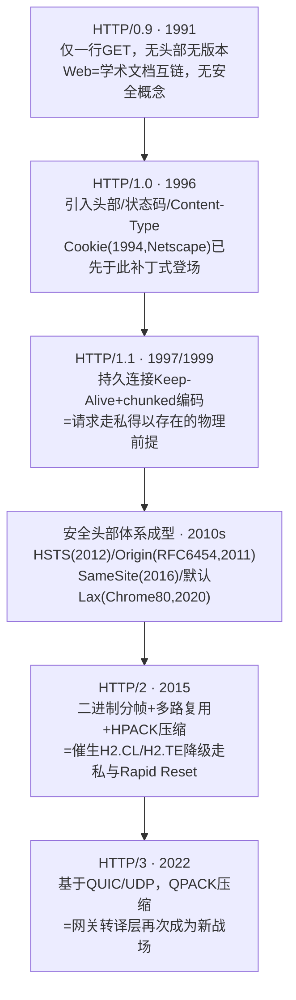
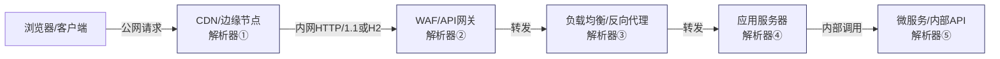
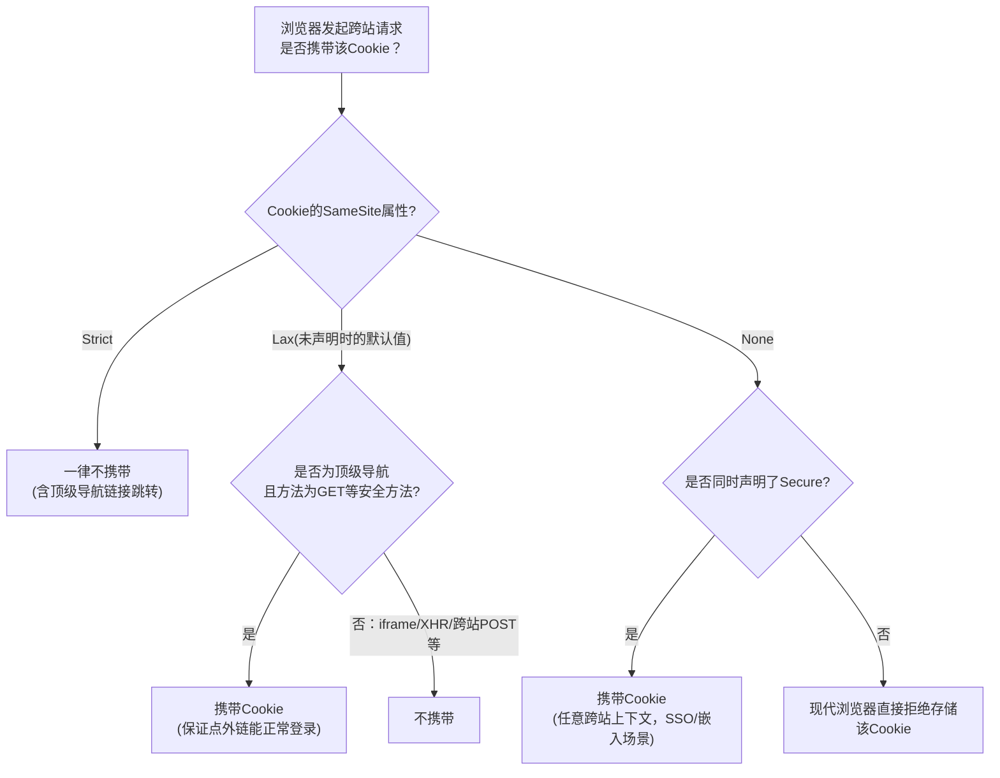
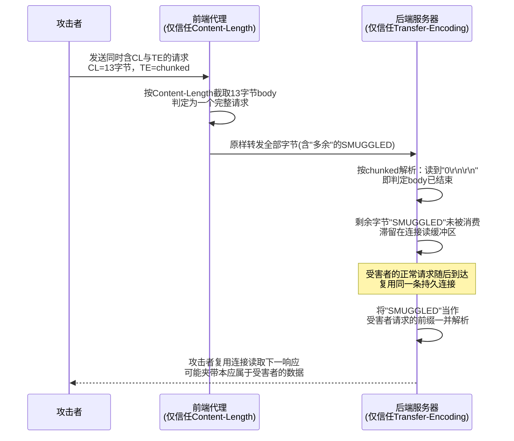
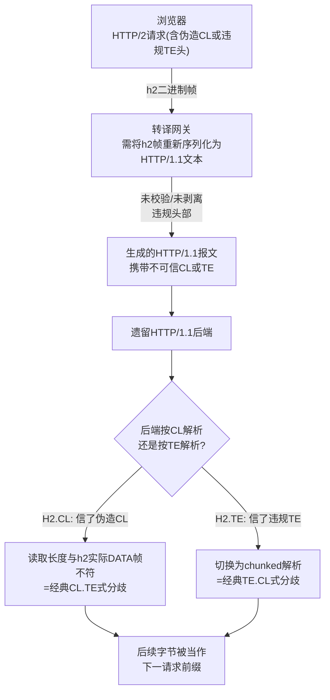

# Web与应用层安全（2）· HTTP协议安全
> [!abstract] TL;DR
> - HTTP 本身是明文、无状态的应用层协议，"安全"从来不是协议原生设计目标，而几乎全部由头部字段和实现细节的正确性后天补足——协议为兼容性做出的每一处妥协（如 Content-Length 与 Transfer-Encoding 允许共存）都会在此后数十年变成系统性攻击面的根源。
> - 方法的"安全性"（safe）与"幂等性"（idempotent）只是 RFC 定义的语义契约，协议机制本身并不强制服务端遵守——动词篡改、X-HTTP-Method-Override、TRACE 反射（XST）都是在利用"约定不是强制"这道缝隙。
> - Cookie 的 Secure / HttpOnly / SameSite 三个属性各自只防御一类攻击面（明文嗅探 / XSS 窃取 / CSRF），而 Cookie 的作用域模型（Domain+Path）比"同源"粗粒度得多——这是历史遗留，__Host-/__Secure- 前缀是把约束前移到浏览器解析层的结构性补丁。
> - HTTP 请求走私的本质是"两个解析器对同一段字节流达成了不同共识"：前端信 Content-Length、后端信 Transfer-Encoding（或反之），多出的字节被当作下一个请求的前缀，进而劫持同一连接上其他用户的请求或响应；HTTP/2 降级到 HTTP/1.1 的转译层让这个问题在新协议世代重演为 H2.CL/H2.TE。
> - Host 头注入、缓存投毒、参数污染看似互不相关，实则共享同一个防御收敛点：拒绝对"看起来合法但语义有歧义"的输入做出确定性假设，让所有解析环节在同一套规则下达成一致，而不是逐个漏洞打补丁。
> - 协议每一次为性能做出的演进（HTTP/2 多路复用、HPACK 压缩、HTTP/3 的 QUIC）都在引入新的 DoS/侧信道/走私变体——理解 HTTP 安全应该是一场持续的军备竞赛认知，而不是一次性加固清单。

## 概述与定位

HTTP 是几乎所有 Web 交互最终都要落地的线缆级契约：无论上层业务逻辑多么复杂，客户端与服务端之间交换的终究是一段按特定语法组织的 ASCII 文本（或 HTTP/2、HTTP/3 下的二进制帧），而这段文本如何被双方——以及中间所有代理、网关、缓存、WAF——解析，直接决定了安全边界画在哪里。本篇要处理的对象，正是这份"语法契约"本身：方法、头部、Cookie 的安全语义，以及最典型也最具系统性危害的后果——HTTP 请求走私。

在系列中的边界需要提前划清，避免与相邻篇幅重复：报文格式、连接管理、HTTP/HTTPS 关系等协议机制基础，已经在 [[71.详解网络协议/18.HTTP-HTTPS协议]] 中系统展开，本篇默认读者已具备这层认知，聚焦于"这些机制如何被滥用、又该如何设防"这一安全视角，不会重复讲解报文格式本身的基础定义。第 03 章《同源策略与CORS与CSP》讨论的是浏览器在客户端强制执行的跨源信任决策，是建立在 HTTP 头部之上的一层更高阶策略，本篇不涉及；第 07 章专门处理认证与会话的业务语义（Cookie 承载的"身份"是什么），本篇只谈 Cookie 作为 HTTP 状态载体的协议层属性与作用域安全；第 12 章覆盖 JWT/OAuth/OIDC，Authorization 头的令牌格式与流程细节留给那一章；第 14 章专攻 TLS 配置与降级攻击，本篇假定传输层加密与否是既定前提，只讨论 HTTP 语义层本身；第 13 章会系统介绍 Burp Suite 整条工具链，本篇"工具视角"部分只挑与本章主题直接相关的用法。

之所以把 HTTP 协议安全单列一章、且排在系列很靠前的位置，是因为它是几乎所有后续漏洞类型的地基：注入类漏洞需要通过某个 HTTP 参数或头部进入应用；XSS 的触发路径离不开 Content-Type 与响应头的配合；CSRF 的可利用性直接取决于 Cookie 的 SameSite 属性；SSRF 常常借道 Host 或转发类头部；访问控制绕过里很大一部分就是方法篡改。理解 HTTP 本身有哪些"灰色地带"，是理解上层一切具体漏洞的前提。

HTTP 的安全史本质上是一部"临时妥协变成长期负债"的历史。1991 年的 HTTP/0.9 只有一行 `GET /path`，没有头部也没有版本号——那时的 Web 只是学术文档互链系统，谈不上任何安全模型。1996 年 HTTP/1.0 引入了头部、状态码、Content-Type，但每个请求仍是独立的一次 TCP 连接。1994 年 Netscape 为了实现购物车，在协议之外"打补丁"式地发明了 Cookie——这是一次典型的"无状态协议需要状态化能力"的工程妥协，而 Cookie 的作用域模型（按 Domain/Path 而非按"源"）从那一刻起就与后来（2011 年 RFC 6454 才正式定义）的同源模型存在结构性错位，这个错位至今仍是若干 Cookie 攻击的根源。1997／1999 年的 HTTP/1.1 为了性能引入持久连接（Keep-Alive）与分块传输编码（chunked），这两个特性的组合恰恰是本篇重头戏——请求走私——得以存在的物理前提。安全头部体系（HSTS、CSP、SameSite 默认值收紧等）则一直拖到 2010 年代才逐步补齐。这条历史线索本身就是本篇反复出现的主题：协议每一代为兼容性或性能所做的让步，都会在多年后变成一类新的攻击面。

## 原理与机制

### HTTP 报文结构与两种分帧方式

一条 HTTP/1.x 报文由起始行（请求行或状态行）、若干头部字段、一个空行（CRLF CRLF）、以及可选的消息体组成：

```
POST /api/order HTTP/1.1\r\n
Host: shop.example\r\n
Content-Type: application/json\r\n
Content-Length: 27\r\n
\r\n
{"item":"A1","qty":2}
```

这份看似朴素的格式里，真正决定安全边界的是"消息体到底有多长"这件事如何被声明——HTTP/1.1 给出了两种彼此独立、理论上互斥但协议本身并不强制互斥的方式：`Content-Length`（显式声明字节数）与 `Transfer-Encoding: chunked`（消息体自身携带长度信息、以分块方式自界定结尾）。分块编码的字节布局如下：

```
<十六进制长度>\r\n
<对应长度的数据>\r\n
...（可重复多个数据块）...
0\r\n
\r\n
```

即每个数据块前置一个十六进制长度声明，长度为 0 的块标志消息体结束。RFC 9112 明确规定：若一份报文中 Content-Length 与 Transfer-Encoding 同时出现，接收方必须优先按 Transfer-Encoding 解析并拒绝该报文或将其视为不可信——但这是文本规范里的"MUST"，并不是 TCP 层会替你校验的东西。只要有任何一环的实现选择"宽容处理"而非"直接拒绝"（出于兼容旧客户端、性能考虑，或单纯的实现疏漏），这两种分帧方式之间就出现了可被利用的解释分歧，这正是本篇第三节请求走私的全部理论基础。

### 方法的安全性与幂等性：契约而非强制

RFC 9110 把方法划分为"安全"（safe，语义上只读、不改变服务端状态）与"幂等"（idempotent，同一个请求重复执行 N 次与执行 1 次效果相同）两个维度：

| 方法 | 安全 | 幂等 | 典型语义 |
| --- | --- | --- | --- |
| GET / HEAD | 是 | 是 | 只读获取资源（HEAD 只要头部） |
| OPTIONS / TRACE | 是 | 是 | 元信息查询 / 请求回显调试 |
| PUT | 否 | 是 | 整体替换资源 |
| DELETE | 否 | 是 | 删除资源 |
| POST | 否 | 否 | 创建资源 / 触发有副作用的操作 |
| PATCH | 否 | 否 | 部分修改资源 |
| CONNECT | 否 | 否 | 建立隧道（如通过代理转发 HTTPS） |

这张表格的价值不在于背诵，而在于理解它被谁、如何"信任"：浏览器的链接预取（prefetch）、搜索引擎爬虫、CDN 的重试逻辑、负载均衡器在连接失败时的自动重发，全都默认"安全方法不会产生副作用、幂等方法重复执行是无害的"，并据此做出自动化决策。一旦应用把状态变更逻辑挂在 GET 上（例如 `/delete?id=5`），这些自动化角色的假设就会被现实打破：爬虫抓取包含该链接的页面会无意中触发删除，浏览器的预加载机制会在用户尚未点击前就发出请求，负载均衡的乐观重试可能造成同一笔业务被执行两次。这与第 06 章要讲的 CSRF（尤其是基于 GET 的跨站请求伪造）在根源上是同一个问题——协议本身从不校验方法与语义是否匹配，一切全凭应用自律。

### 头部的分类与信任语义

头部按作用域可以分为通用头部（如 Date、Connection）、请求头部（如 Host、User-Agent）、响应头部（如 Server、WWW-Authenticate）与内容头部（如 Content-Type、Content-Length）。另一条更关键、却常被忽视的划分线是"逐跳"（hop-by-hop）与"端到端"（end-to-end）：`Connection` 头部本身会列出哪些头部只对当前这一跳有效、必须被中间代理在转发前剥离重建（典型如 `Connection: keep-alive`、`Transfer-Encoding` 本身也属于逐跳性质的框架信息）。这个设计的本意是让每个中间节点都能安全地重新协商自己与下一跳之间的连接细节，但它同时要求"中间节点必须诚实地扮演一个独立的协议参与者，而不是简单透传字节"——凡是没有严格做到这一点的代理，都会把攻击者精心构造的、本该被剥离的头部原样转发到下一跳，直接打穿本应存在的信任边界，这也是走私与 H2 降级类问题在实现上的共同病灶。

### 无状态协议与 Cookie 的代偿设计

HTTP 的每一次请求在协议规范上都是自包含、互相独立的，这是它最初为文档检索场景设计时的合理选择，但电商购物车这类"需要记住用户是谁"的场景很快暴露了这个设计的不足。Cookie（RFC 6265）就是为此打的一块协议外补丁：服务端通过响应头 `Set-Cookie` 下发一个键值对，浏览器此后在符合作用域条件的请求里自动通过 `Cookie` 头部带回。这里"符合作用域条件"用的是 Domain 与 Path，而不是我们今天默认的"源"（Origin = 协议 + 主机 + 端口）——因为 Cookie 机制比"源"这个概念早诞生了将近二十年，Origin 直到 2011 年才被 RFC 6454 正式定义。这种历史性错位意味着 Cookie 默认可以跨端口、跨协议（若无 Secure 属性）共享，也可以通过声明 Domain 主动扩大到整个子域集合，这比同源策略粗糙得多，也正是后文要讨论的子域 Cookie 覆盖（cookie tossing）与 SameSite 补丁的根本成因。





这张架构图想传达的核心事实是：一个"请求"从浏览器出发到最终业务代码，中间往往要经过四到五次独立的解析。每一跳都可能出自不同厂商、不同版本、不同语言实现的 HTTP 库，谁都不能保证对"Content-Length 和 Transfer-Encoding 同时存在该怎么办"这类边界情况给出完全一致的答案。安全边界不是画在某一个节点上，而是画在"所有节点必须对同一段字节流达成完全相同的理解"这条隐含假设上——这条假设一旦被打破，后面第三节的几乎所有攻击手法都会自然成立。

## 协议要素与请求走私详解

### 方法语义与动词篡改

除表格列出的语义外，几个方法值得单独展开安全含义：`OPTIONS` 常被用作 CORS 预检（第 03 章详述），但也常被遗忘在访问控制规则之外，成为绕过某些"只检查 GET/POST"的粗糙 ACL 规则的入口；`CONNECT` 用于让代理为客户端建立一条到目标主机的隧道（最典型的场景是代理转发 HTTPS 流量），如果开放的正向代理对 CONNECT 目标不做任何限制，就会退化成一个开放的内网跳板，这与第 06 章 SSRF 的部分利用面是共通的。

动词篡改（Verb Tampering）的成因非常朴素：很多访问控制中间件是按方法白名单/黑名单写的，例如 Web 服务器配置里只对 `<Limit GET POST>` 做了 Basic Auth 限制，而 RESTful 框架的路由层实际上把 `PUT`、`DELETE`、`PATCH` 都映射到了同一个业务处理器上——中间件的方法判断粒度与框架的路由粒度不一致，攻击者只需要把方法从被拦截的 GET/POST 换成同一路由能接受、却未被规则覆盖的方法，就能绕过原本的鉴权检查。历史上框架为了让只支持 GET/POST 的 HTML 表单能够表达 RESTful 语义，又发明了 `X-HTTP-Method-Override` 请求头或 `_method` 表单字段这类"方法覆盖"机制：应用层看到的有效方法与 TCP 报文起始行里写的方法可以不一致。如果前置 WAF/反向代理只按报文起始行的方法做过滤，而后端框架优先信任覆盖头，攻击者就能用一个"看起来无害"的 POST 请求外壳，运载一个本应被拦截的方法语义——这与请求走私"两个解析层对同一份输入得出不同结论"是完全同构的问题，只是发生在应用框架层而非传输层。

`TRACE` 方法的经典历史案例是跨站追踪（Cross-Site Tracing, XST，Jeremiah Grossman 于 2003 年提出）：服务器收到 TRACE 请求后，会把收到的请求（含全部头部，包括 Cookie）原样回显在响应体里。`HttpOnly` 属性能阻止 `document.cookie` 读取 Cookie 值，但它防的是"通过 JavaScript 属性直接读取"这一条路径，并不能阻止页面脚本通过 `XMLHttpRequest` 发起一个 TRACE 请求、再从响应体里把回显的 Cookie 头解析出来——同一枚令牌，被两条不同的读取路径分别绕过了一次防护。这个案例的教学价值超过它今天的实战价值（现代浏览器普遍限制跨域 TRACE，多数服务器也默认禁用该方法）：它精确地说明了"某个防护属性只堵住了它设计时想到的那一条路径"，而不是从根本上消除了数据的可读性。

### 请求头信任边界：Host、转发链与 CRLF 注入

`Host` 头部原本只是为了支持一台物理服务器上承载多个虚拟主机（同一个 IP、不同域名），但大量应用把它当成了"当前访问域名"的可信来源，用来拼接绝对 URL——最典型的是密码重置邮件里的链接：`https://{Host}/reset?token=xxx`。如果应用没有把 Host 与服务端配置的合法域名列表做比对，攻击者只需要在自己发起的密码重置请求里伪造 `Host: attacker.com`，应用生成的重置链接域名部分就会变成攻击者的域名，一旦受害者（或自动化审计系统、邮件预览机器人）点击这条链接，携带敏感令牌的请求就会打到攻击者控制的服务器日志里——这就是密码重置投毒（Password Reset Poisoning）。同样的信任错位如果发生在内部路由决策上，还可能被用来访问只对特定虚拟主机开放的内部路径，与 SSRF 存在利用面上的交集。

`X-Forwarded-For`、`X-Forwarded-Host`、`X-Real-IP` 这类转发类头部设计初衷是让每一跳代理把"上一跳来源"接力写入，最终应用能拼出真实客户端 IP 链条。问题在于，如果最外层边缘节点没有对客户端自带的这些头部做强制覆盖或清洗，攻击者只要直接把请求打到能接触的入口，就可以在自己的原始请求里随意填写 `X-Forwarded-For: 127.0.0.1` 或任何"看起来可信"的内网地址——只要应用侧用这个头部做访问控制、限流或审计，这层信任就形同虚设。正确的做法只能是"只信任由确定可信的最外层代理最后一次追加的那一段值"，而不是信任整条链上任何一环声称的内容。

CRLF 注入 / HTTP 响应拆分是另一类经典的头部信任问题：如果应用把用户可控的输入未经处理地拼进正在构造的头部值里（例如把某个查询参数直接写进一个自定义响应头，或拼进重定向用的 `Location`），攻击者只需要在输入里插入 `\r\n`，就能提前终止当前头部字段、伪造出额外的头部，甚至伪造出一个完整的"第二个响应"。这可以用来在页面本不反射输出的场景下实现反射型 XSS（纯靠头部注入而非页面正文）、伪造 `Set-Cookie` 实施会话固定，或者让位于链路中间的缓存把"第二个伪造响应"当作真实响应存起来，波及后续所有命中同一缓存键的用户。现代语言运行时（如 Java 较新版本的 `HttpServletResponse.setHeader`、Node.js 的 `http` 模块）已经普遍在头部设置 API 层面拒绝裸露的 CR/LF 字符作为语言级兜底，但历史遗留的字符串拼接式头部写入代码依然是一个长期潜伏的漏洞类别。

MIME 混淆与嗅探则是另一个方向的问题：早期浏览器（尤以旧版 IE 为甚）会主动"猜测"响应内容的真实类型，如果字节内容"看起来像"HTML/脚本，浏览器可能无视服务端声明的 `Content-Type`（比如 `text/plain` 或某个图片类型）而将其当作 HTML 解析执行——这意味着即便服务端刻意把用户上传的文件类型收窄为"安全"类型，具备嗅探行为的浏览器仍可能把它当脚本跑起来，形成存储型 XSS。响应头 `X-Content-Type-Options: nosniff` 的作用就是明确告诉浏览器"严格按我声明的 Content-Type 处理，不要自作主张"。

### Cookie 属性与作用域安全

一个完整的 Set-Cookie 声明可以携带 Domain、Path、Expires/Max-Age、Secure、HttpOnly、SameSite 等属性，外加较新的 Partitioned（CHIPS，用于第三方语境下的分区存储）。这些属性各自堵的是不同的攻击面，不能相互替代：

```
Set-Cookie: session=abc123; Domain=example.com; Path=/; Secure; HttpOnly; SameSite=Lax
```

`Secure` 只保证该 Cookie 不会经明文 HTTP 连接发出，防的是网络嗅探/中间人在降级到 HTTP 时窃取；`HttpOnly` 只阻止通过 `document.cookie` 这条 JavaScript API 路径读取，防的是常规 XSS 场景下的令牌窃取（但如前所述，不防 TRACE 反射这类旁路）；`SameSite` 防的是跨站请求自动携带 Cookie 从而被用于 CSRF。三者互不重叠、也互不替代，一份加固清单必须同时满足三者才算完整。

Cookie 的身份标识是（名称, Domain, Path）三元组，而不是"源"。这意味着任何一个子域——包括被遗忘的历史子域、存在子域接管风险的子域、或者本身就恶意的子域——只要能在自己的响应里下发 `Domain=example.com` 的 Cookie，就可以覆盖或"投毒"整个主域名下同名 Cookie 的取值，这就是 Cookie 投掷（cookie tossing）。浏览器的 Cookie 存储对同名 Cookie 的处理只按作用域"更具体者优先"这类宽松规则排序，并不会去校验"是不是应该由这个子域来设置这个名字的 Cookie"，因而攻击者即便完全无法在主站触发 XSS，也可能仅凭某个薄弱子域就实现对主站会话标识的固定攻击。`__Host-` 前缀正是针对这个问题的结构性修复：浏览器规定任何声称以 `__Host-` 开头的 Cookie，必须同时满足带 Secure、不带 Domain 属性（即隐式限定为设置它的那个精确主机、不能扩散到子域）、且 Path 必须为 `/`，否则浏览器直接拒绝存储这个 Cookie。这把"约束是否成立"从"寄望于开发者手工配置正确"变成了"浏览器解析层强制校验"，是明显更强的保证。`__Secure-` 前缀则较弱，只强制要求 Secure 属性。

`SameSite` 的演进本身是一段值得记住的历史：2016 年由浏览器率先引入作为可选属性，直到 Chrome 80（2020 年）才把未显式声明的 Cookie 默认行为从"总是携带"改为 `Lax`——这个默认值翻转很可能是浏览器厂商为 Web 生态整体注入过的规模最大的一次 CSRF 缓解，因为它把"要不要在跨站请求里带 Cookie"的默认失败模式从"开发者不设置就是不安全"整体反转为"开发者不设置反而默认相对安全"。`Lax` 允许跨站顶级导航（点击一个外链跳转过来）时携带 Cookie——这是为了不破坏"点一个外部链接能正常保持登录态"这种基本可用性，但会阻止跨站的子资源加载、iframe 嵌入、以及跨站发起的 POST 等请求携带 Cookie。这也意味着 `Lax` 并非万能：如果业务把状态变更逻辑挂在 GET 上（回到本篇反复强调的"方法语义只是约定"问题），依然可能在 `Lax` 模式下被跨站请求触发。`SameSite=None` 则是刻意保留的逃生舱——诸如单点登录跳转、第三方内嵌小组件这类合法的跨站场景仍然需要 Cookie 跨站携带，现代浏览器要求 `None` 必须同时搭配 `Secure` 才会被接受，但对这一类 Cookie 而言，CSRF 防护就必须依赖第 06 章要讲的 Token 校验等应用层手段，SameSite 本身在这里帮不上忙。

会话固定（Session Fixation）是另一类经典的 Cookie 生命周期问题：攻击者提前获得或能够预测一个"看起来合法"的会话标识，设法让受害者在这个既定标识下完成身份认证（历史上常见的手法是把会话 ID 拼进 URL 参数分享给受害者，如今更多是借助 XSS、子域 Cookie 投掷、或对非 Secure Cookie 的网络层篡改），如果应用在认证成功、权限发生变化这个关键节点没有重新生成会话标识，攻击者预先掌握的那个 ID 此刻就变成了一个已认证的有效会话。标准修复方式是：任何跨越认证边界（登录、权限提升）的时刻，都必须重新生成会话标识，绝不复用认证前的旧值。



### HTTP 请求走私：解析歧义的系统性后果

报文分帧的两种基础机制（Content-Length 与 chunked）已在"原理与机制"一节介绍，这里在此基础上专门展开"当链路上前后两个节点分别信任不同分帧方式时会发生什么"——这正是与 [[71.详解网络协议/18.HTTP-HTTPS协议]] 呼应的核心议题，也是本篇信息密度最高的部分。

请求走私最经典的三种命名方式（James Kettle / PortSwigger 于 2019 年系统化的研究奠定了这套分类与利用方法论）按"前端信什么、后端信什么"区分：

**CL.TE**：前端只认 Content-Length，后端只认 Transfer-Encoding。攻击者构造这样一份请求：

```
POST / HTTP/1.1
Host: lab.internal
Content-Length: 13
Transfer-Encoding: chunked

0

SMUGGLED
```

消息体部分按字节精确计算是 `0\r\n\r\nSMUGGLED`，正好 13 字节，与声明的 `Content-Length: 13` 吻合。前端代理只看 Content-Length，认定这 13 字节就是完整消息体，于是把整份请求原封不动转发给后端。后端却是按 `Transfer-Encoding: chunked` 来解析的：读到 `0\r\n\r\n` 就意味着遇到了长度为零的块，按分块编码语义这代表消息体已经结束，于是后端认为这个请求到此为止、已经处理完毕，而字面量 `SMUGGLED` 这几个字节完全没有被当作当前请求的一部分消费掉——它们会被后端留在这条持久化连接的读缓冲区里，当作"下一个请求"的开头。如果这条连接紧接着被复用来处理另一个真实用户的正常请求，后端就会把 `SMUGGLEDPOST /real-path HTTP/1.1...` 这样被污染的字节流当成一个合法请求解析，`SMUGGLED` 这段攻击者数据被拼接在了受害者请求的最前面——如果攻击者精心设计这段前缀（例如伪造出一个完整的伪造请求行），就可能让后端把受害者原本请求的一部分参数错误地解释成这个伪造请求的头部或方法，从而实现请求边界的整体劫持。

**TE.CL** 是镜像情况：前端信任并按 chunked 正确解析了完整消息体（含结尾的零长度块），把整段原始字节透传给后端；后端却只看 Content-Length，只读取声明的字节数，读到之后就认为请求结束，chunked 编码里剩余未被消费的字节（攻击者刻意构造成看起来像另一个请求起始行的内容）就成了下一个请求的污染前缀，机制与 CL.TE 对称，只是信任方向相反。

**TE.TE** 指前后端理论上都支持 Transfer-Encoding，但攻击者通过混淆头部值让其中一方"看不懂"这个头部、从而回退去信任 Content-Length，间接把问题降级为 CL.TE 或 TE.CL 的一种。常见混淆手法包括：在头部值里加入非常规空白或制表符（`Transfer-Encoding:\tchunked`）、故意拼错但仍可能被某些解析器容错识别的值（`Transfer-Encoding: xchunked`）、重复声明同一个头部两次且取值不同、或者在头部名和冒号之间插入空格（`Transfer-Encoding : chunked`，这在规范上是非法的，严格解析器会拒绝，宽松解析器可能仍然认账）。只要能让链路上两端对"这个头部到底算不算有效的 chunked 声明"给出不同答案，就足以构造出走私窗口。

比较新的一个变体是 **CL.0**：某些后端在完全没有收到 Content-Length（也没有 Transfer-Encoding）时，会把有效体长度默认当作 0 处理，即便前端实际上转发了一个后端本应该读取、却因特定路径（如静态资源类端点）被后端忽略 Content-Length 的请求——这类"隐式长度归零"行为同样会导致后续字节被错误地当成下一个请求的开头，是对经典三分法的补充，说明走私问题的根源（分帧方式不唯一）会随着实现细节的多样化持续演化出新变体，而不会随防御规则的完善而穷尽。

检测走私漏洞主要依靠两种思路：一是**时间盲注式探测**，构造一个刻意残缺的 chunked 请求（比如故意不发送结尾的零长度块），如果后端确实在按 chunked 解析、会一直阻塞等待更多数据直到超时，这个可观测的响应延迟差异就能反推出后端的分帧偏好；二是**差异化响应探测**，连续发送两个请求，如果第二个请求的响应内容明显被第一个请求"污染"或前缀异常，就直接证实了走私的存在。这两种方法论都要求攻击者/测试者能够精确控制原始字节，普通高层 HTTP 客户端库做不到这一点，这一点会在"工具视角"一节详细展开。

走私的实际危害并不停留在"把请求拼错"这个表面现象上：它可以用来绕过前置 WAF 或访问控制层完全无法感知的路径（因为 WAF 检查的是它自己解析出的请求，而后端执行的是另一份被污染后拼接出来的请求）；可以劫持同一条连接上紧随其后的其他用户的请求，窃取其请求体中的敏感信息或把攻击者的响应错误地返回给受害者（会话劫持的一种变体）；还可以配合缓存机制，把污染后的响应存进共享缓存，间接实现规模化的缓存投毒。



### HTTP/2 降级走私与协议转译层的宿命

HTTP/2 从设计上就不依赖 Content-Length 做分帧：请求体通过 DATA 帧携带，每一帧自带显式长度字段，并通过 `END_STREAM` 标志位显式标记流结束，理论上彻底消灭了"两种分帧方式并存"这个经典走私的根源。RFC 9113 也明确规定 `Transfer-Encoding`、`Connection`、`Keep-Alive` 这类逐跳性质、只对 HTTP/1.x 有意义的头部不应出现在 HTTP/2 请求里。

但现实中大量边缘节点、CDN 对外用 HTTP/2 与浏览器通信，对内却仍然用 HTTP/1.1 与遗留后端通信，这就产生了一个**协议转译层**：网关必须把 HTTP/2 的二进制帧重新序列化成 HTTP/1.1 的文本格式。这个转译过程本身就是一次"重新推导分帧信息"，一旦转译逻辑对输入校验不够严格，走私问题就会在新的协议世代原样重现：

- **H2.CL**：攻击者在 HTTP/2 请求里塞入一个与实际 DATA 帧长度不符的 `Content-Length` 头部（HTTP/2 本不依赖它，但作为普通头部字段网关未必会校验其真实性），转译网关如果照单全收，将其写入生成的 HTTP/1.1 报文首行之后，后端就会按这个被伪造的长度去读取消息体，从而制造出经典的 CL/实际长度不一致场景。
- **H2.TE**：攻击者在 HTTP/2 请求里塞入一个规范上禁止出现的 `Transfer-Encoding` 头部，如果转译网关没有按规范剥离它，直接透传进生成的 HTTP/1.1 报文，遗留后端一看到这个头部就会切换为按 chunked 解析，从而在转译边界上人为制造出前述 CL.TE/TE.CL 式的分歧。

这里想强调的是一个更普遍的规律，而不只是两个具体编号的漏洞变体：**任何一个协议转译网关，本质上都是在做"用第二套解析规则重新推导第一套解析规则已经算出的答案"这件事**，而这种"重新推导"天然就是分歧的温床。这个规律不只适用于 H2 到 H1，同样适用于未来 H3 到 H1 的网关、甚至 gRPC-Web 到 gRPC 的桥接层——每多一层协议转换，就多一次"两套解析器需要对同一语义达成一致"的隐含要求，也就多一分被打破的风险。

2022 年 James Kettle 提出的**浏览器驱动的客户端走私**（Client-Side/Browser-Powered Desync）进一步扩大了这个问题模型：以往的假设是"攻击者必须能直接向后端发起原始 TCP 连接才能构造出畸形报文"，但这个研究证明，攻击者可以利用浏览器自身对某些畸形/不规范响应的宽容解析行为（浏览器仍然选择复用这条连接），把走私攻击面从"攻击者的连接"转移到"受害者浏览器与存在缺陷的服务器之间的连接"——这意味着即便某个防御方案只堵住了"攻击者直连后端"这一条路径，也不足以彻底排除风险。



### 参数污染、缓存投毒与缓存欺骗

HTTP 参数污染（HPP）利用的是"同一个参数名出现多次时，不同技术栈选择哪一份值"这个未被规范统一定义的行为差异：面对 `?id=1&id=2`，有的语言/框架取第一个，有的取最后一个，有的用逗号拼接成 `1,2`，有的解析成数组。如果链路前端的 WAF 按一种规则理解这个参数（例如只检查第一个值、发现无害），而真正处理请求的应用框架按另一种规则理解（例如取最后一个值），攻击者就可以把恶意负载藏在 WAF 不会检查、但应用最终会使用的那个位置，达成绕过。

Web 缓存投毒的核心概念是"缓存键"（cache key）与"影响响应内容的实际输入集合"之间的不对等。缓存通常只按方法、URL、外加少数几个被显式列入键的头部（如 `Accept-Encoding`）来决定"这是不是同一个可复用的响应"，但源站生成响应内容时，实际读取的输入可能远不止这些——例如把 `X-Forwarded-Host` 反射进页面里的一个规范链接标签，或者根据 `X-Forwarded-Scheme` 拼接跳转地址。这些没有被纳入缓存键、却仍然影响响应内容的输入，就叫"未键入输入"（unkeyed input）。攻击者只要能找到一个未键入输入、且这个输入能以某种可被利用的方式改变响应内容，就可以发出一次精心构造的请求，让源站生成一个被污染的响应，而这个响应会被缓存层当成"这个 URL 对应的标准答案"存下来，后续所有请求同一缓存键的正常用户都会收到这份被污染的内容——一次攻击者请求，换来对所有后续访问者的持续影响，这是它比常规反射型问题危害大得多的原因。

Web 缓存欺骗则是相反方向的错位：缓存规则往往依据 URL 的表面形态（例如"看起来像是以 .css/.jpg 等静态资源后缀结尾"）来判断"这个响应可以安全缓存"，而不是依据源站真实声明的 `Content-Type`/`Cache-Control` 语义。如果后端框架的路由存在"未匹配到静态资源时会回退给动态处理器"这类宽松行为，攻击者就可以构造出一个"看起来是静态资源、实际上仍会命中包含敏感个人数据的动态处理器"的 URL（例如在真实的私密页面路径后面拼接一个看似静态文件的后缀），诱导受害者访问这个精心构造的链接，缓存层看到"静态后缀"就直接把这次响应（其中包含受害者的私密数据）存了下来，攻击者随后自己请求同一个 URL，就能从缓存里读到本该只属于受害者的内容——整个过程不需要任何代码执行，纯粹是路由规则与缓存规则的认知不一致导致的信息泄露。

这两类问题的防御收敛到同一个原则：缓存键必须覆盖所有确实会影响响应内容的输入（或者反过来，让不该影响响应的输入在到达业务逻辑之前就被规范化/剥离），源站路由也不应该让"看似不存在的资源"静默地回退到会返回敏感内容的处理器。

### 协议版本演进带来的新攻击面

Range 头部允许客户端只请求资源的一部分（返回 206 Partial Content），历史上的经典滥用案例是构造大量细碎且相互重叠的字节范围，迫使服务器为每个范围单独生成 multipart 响应片段，造成内存与 CPU 的浪费性消耗（2011 年前后流传的"Apache Killer"就是这一思路的具体实现），现代服务器普遍已对单次请求可声明的范围数量做出限制作为回应。

**HTTP/2 Rapid Reset**（CVE-2023-44487，2023 年 10 月披露）是多路复用特性带来的一类全新 DoS：HTTP/2 允许在同一条连接上并发打开大量流，客户端可以在每个流刚打开、服务端已经开始为其分配资源并把请求转发给后端的瞬间，立刻发送 `RST_STREAM` 取消这个流。由于服务端"分配资源、开始处理"这部分开销发生在"处理取消信号"之前，攻击者可以在完全不必等待任何响应返回的情况下，以极高频率反复"打开又立即取消"，实现远超传统请求速率限制能覆盖范围的放大式拒绝服务。这类攻击在 HTTP/1.1 的简单请求-响应模型下根本不可能存在——它是多路复用这项性能优化所附带的、结构性的新资源核算漏洞，是本篇反复强调的"协议进化=新攻击面"论断的一个教科书级例证。

**HPACK/QPACK 压缩侧信道**与 TLS/gzip 压缩场景下的 CRIME、BREACH 是同一类问题的不同实例：HPACK 使用一张动态表来对重复出现过的头部内容做压缩，如果攻击者能够影响的数据与某个秘密值（例如携带在头部里的认证令牌或 CSRF 令牌）共享同一个压缩上下文，攻击者就可以通过反复发送带有不同猜测值的请求、观测压缩后帧长度或耗时的细微变化，逐字节地把秘密值反推出来——这类问题的通用教训是：绝不能让攻击者可控的明文与秘密明文共享一个攻击者可观测的压缩上下文。

HTTP/3 把传输层整体迁移到基于 UDP 的 QUIC，加密握手与传输握手合二为一（不再有独立的"先 TLS 握手、再跑 HTTP"这个先后次序），QPACK 相比 HPACK 弱化了跨流的严格顺序依赖，缓解了压缩层本身引入的队头阻塞。但 UDP 天然缺乏 TCP 三次握手那种对源地址的隐式校验，反射放大类 DoS 在无连接协议上更容易发起，因此 QUIC 规范专门加入了"服务器在完成地址校验前，发给客户端的字节数不得超过收到字节数的三倍"这类抗放大限制。可以预见的是，随着 HTTP/3 逐步普及，"HTTP/3 到 HTTP/1.1 的转译网关"迟早会重演本节前面讨论过的降级走私问题——这不是某个具体实现的巧合缺陷，而是"存在协议转译层"这一架构选择的必然代价。

## 工具视角与实战

### 手工构造原始报文

高层 HTTP 客户端库（如 curl 的默认模式、Python `requests`）为了保证请求"格式良好"，通常会自动管理 Content-Length、拒绝重复设置某些头部、或对头部值做规范化——这恰恰是走私类测试最不需要的行为，因为测试需要的正是故意构造出"两种分帧方式同时存在"这种规范上有歧义的畸形报文。要精确控制每一个字节，通常需要退回到更底层的手段：

```bash
# 用 curl 做基础侦察：显式指定HTTP版本、附加原始头部、
# 关闭路径规范化以观察前后端对路径的处理是否一致
curl -i --http1.1 --path-as-is \
  -H "X-Test-Header: probe" \
  "http://lab.internal/some/../path"

# 用 openssl s_client 或 nc 建立原始连接后手工键入报文，
# 可以绕开任何客户端库的"自动纠错"行为，
# 是验证CL.TE/TE.TE这类畸形报文能否被目标接受的唯一可靠方式
nc lab.internal 80
```

Python 层面若需要脚本化构造，直接使用 `socket` 模块拼接原始字节（而不是 `requests`/`http.client` 这类会做规范化的高层封装），才能保证自己声明的 Content-Length 与实际发送的字节数是"故意不一致"的，不被库悄悄纠正。这类操作只应在自己搭建的实验环境（如本地起一个前端 Nginx + 后端 Node/Flask 的对照实验）或已获书面授权的测试范围内进行，目的是理解和验证机制本身，而不是针对任何生产系统。

### Burp Suite 与自动化探测

第 13 章会系统介绍 Burp Suite 全套工具链，这里只挑与本章主题直接相关的部分：Repeater 的原始/Inspector 视图允许逐字节编辑请求，包括故意写出不合规的头部语法（这正是普通客户端库会拒绝或纠正、而测试恰恰需要保留的能力）；HTTP Request Smuggler 插件（James Kettle 出品）把 CL.TE/TE.CL/TE.TE 以及 H2.CL/H2.TE 的探测流程自动化，并用时间差作为判定依据；Turbo Intruder 能编写脚本精确控制并发请求的发送时序，这是内建 Intruder 的固定模板难以表达的；Param Miner 插件专门用于自动发现"未键入输入"（缓存投毒线索）以及隐藏参数（HPP 线索）。

侦察阶段可以配合 `nmap --script http-methods,http-trace` 枚举目标（限于自有资产/授权范围）开放的方法集合，作为判断是否存在动词篡改或 TRACE 反射风险的第一步线索。

### 抓包与协议还原验证

走私类问题的本质是"实际传输的字节"与"某一层认为自己发送/接收到的内容"之间的落差，因此任何基于应用层日志的验证都可能被这层落差本身所欺骗——唯一值得完全信任的证据是抓包拿到的原始字节。Wireshark/tcpdump 抓包分析、结合 `SSLKEYLOGFILE` 环境变量导出会话密钥以解密自己实验环境里的 TLS 流量，是验证"我以为发出去的畸形报文，是否真的按我的预期原样落在了线缆上"的可靠方法，完整的抓包与中间人分析工作流见 [[72.抓包与协议分析实战/04.HTTP与HTTPS抓包与中间人分析]]。浏览器 DevTools 的 Application/存储面板同样值得利用：它展示的是浏览器实际解析并存储下来的 Cookie 属性，而不是服务端自称发送的头部文本——如果某个 `__Host-` 或 `SameSite` 属性因为格式问题被浏览器静默丢弃，只有在这个面板里才能直接观察到落差，比单纯看响应头文本更接近事实。

## 安全性与正确使用

> [!caution] 合规边界
> 本节及全篇涉及的请求走私构造、方法/头部/Cookie 探测、缓存投毒判定等技术，**仅限于自有系统、已获书面授权的测试环境，以及 CTF/靶场（如 PortSwigger Web Security Academy 的对应实验、DVWA 等）中实践**。文中出现的主机名（如 `lab.internal`、`shop.example`）均为示例占位，不指向任何真实生产目标；本文只讲解机制原理与防御方法，不提供、也不应被用于针对未授权真实系统的可复用攻击脚本。对未授权系统开展此类测试属于违法行为，请务必遵守《网络安全法》《数据安全法》及所在地相关法规。

### 防御设计的收敛原则

回顾本篇讨论过的全部问题——动词篡改、Host 注入、走私、参数污染、缓存投毒——会发现它们都能归约成同一句话："同一段输入，被链路上两个或更多组件按不同规则解析，而这种分歧恰好可以被攻击者控制。"因此最具杠杆效应的修复思路是架构性的，而不是逐个漏洞打补丁：尽量减少请求路径上独立解析器的数量；当 CDN、WAF、负载均衡、应用服务器这种多级链路无法避免时，强制它们在最靠外的信任边界处就完成规范化，并且对任何有歧义的报文选择直接拒绝，而不是让每一层各自按自己的理解继续往下传。具体到实现层面：严格执行"Content-Length 与 Transfer-Encoding 同时出现即拒绝"这条 RFC 的 MUST 规定；对不需要长连接复用的链路直接关闭持久连接假设；条件允许时让前后端统一采用 HTTP/2 端到端通信以从根源上消除降级转译层；如果转译层无法避免，尽量让前后端使用同源同版本的 HTTP 解析库；任何一次探测到畸形/有歧义的报文之后，都应该直接关闭并放弃复用这条连接，而不是乐观地继续沿用它去处理后续请求。

### Cookie 与头部加固清单

会话类 Cookie 应默认同时具备 `Secure`、`HttpOnly`，`SameSite` 至少设为 `Lax`（纯第一方场景可以收紧到 `Strict`，确需跨站场景才使用 `None`+`Secure` 并额外补充应用层 CSRF 校验）；条件允许时优先使用 `__Host-` 前缀，把作用域约束交由浏览器强制校验而非人工配置；任何认证边界（登录、权限提升）都必须重新生成会话标识；禁用 `TRACE` 方法；`Server`/`X-Powered-By` 这类版本信息横幅建议移除或泛化，这属于纵深防御范畴、本身并不构成一条真正的安全控制，只是降低攻击者侦察效率；`Strict-Transport-Security` 建议配置 `includeSubDomains` 与 `preload`；`X-Content-Type-Options: nosniff` 应作为所有响应的默认头部；任何依据 Host、`X-Forwarded-*` 做出的安全相关决策，都必须先经过一份服务端强制维护的可信代理/可信域名白名单过滤，绝不能直接信任请求本身声称的值。

### 走私类漏洞的测试与消除方法论

测试方法论上应当坚持"差异化验证"的思维习惯：不满足于单一请求"看起来"被正常处理，而是主动构造前后端可能存在分歧的边界报文，并结合时间盲注（观察是否出现异常等待）与响应污染（观察后续请求是否被异常拼接内容）两条独立证据链交叉确认，避免假阳性。这套方法论只应用于自己搭建的对照实验环境或已获授权的测试范围。

## 小结

| 维度 | 核心结论 |
| --- | --- |
| 方法 | safe/idempotent 只是语义约定而非强制，动词篡改与方法覆盖头利用的正是"约定不等于强制执行"这条缝隙 |
| 头部 | Host/XFF 等转发类头部的信任必须锚定在"确定可信的最后一跳"上；CRLF 注入与 MIME 嗅探都是"把不该信任的输入当成了可信的结构性数据"的变体 |
| Cookie | Secure/HttpOnly/SameSite 三足鼎立、互不替代；Domain+Path 的粗粒度作用域是历史遗留，`__Host-` 前缀把约束前移到浏览器强制校验层才算根治 |
| 请求走私 | 根源是分帧规则不唯一（CL vs TE）且缺乏强制的一致性校验；HTTP/2 降级转译只是把同一个根源问题带进了新协议世代 |
| 缓存与参数 | 缓存投毒/欺骗、HPP 本质都是"缓存键或校验规则覆盖的输入集合"与"实际影响响应/逻辑的输入集合"不对等 |

把全篇收束成一句话：HTTP 协议安全的核心命题，是"链路上每一个独立解析这段字节流的组件，能否对同一份输入达成完全一致的理解"——方法语义、头部信任、Cookie 作用域、分帧规则，本质上都是这同一个命题在不同维度上的具体投影。本篇处理的是服务端与中间链路如何解析"可信输入"这一侧的边界；下一章《同源策略与CORS与CSP》会转向硬币的另一面——浏览器如何在客户端强制执行跨源信任决策。两者合在一起，才是 Web 请求从发出到落地全过程的完整信任模型。

## 相关阅读

- 协议承接：[[71.详解网络协议/18.HTTP-HTTPS协议]]（报文格式、连接管理等协议机制基础）、[[71.详解网络协议/15.TLS协议]]（传输层加密，与本篇的 HTTP 语义层互补）
- 系列上下文：[[00.Web与应用层安全总览|系列总览]]、[[01.Web安全全景与威胁模型]]（威胁建模与信任边界的通用框架）、[[03.同源策略与CORS与CSP]]（浏览器端跨源信任决策，与本篇服务端解析边界互为表里）、[[06.CSRF与SSRF]]（SameSite 局限性与 Host/转发头信任问题在具体漏洞类型上的展开）、[[07.认证与会话安全]]（Cookie 承载的会话语义与会话固定的完整生命周期）、[[13.Web漏洞工具链：BurpSuite]]（本篇工具小节涉及插件的系统性介绍）、[[14.SSL与TLS配置与攻击]]（传输层安全配置基线）
- 认证呼应：[[30.Windows认证与生物识别编程/08.WebAuthn与FIDO2与passkey编程]]
- 抓包呼应：[[72.抓包与协议分析实战/04.HTTP与HTTPS抓包与中间人分析]]
- 密码呼应：[[37.密码学/62.协议误用与密码工程]]
- 权威规范：RFC 9110（HTTP Semantics）、RFC 9112（HTTP/1.1）、RFC 9113（HTTP/2）、RFC 9114（HTTP/3）、RFC 6265 及 RFC 6265bis 草案（Cookie 与 SameSite）、RFC 6454（The Web Origin Concept）；PortSwigger Web Security Academy 中 HTTP Request Smuggling / Host Header / Web Cache Poisoning / Web Cache Deception 各专题，及 James Kettle, *HTTP Desync Attacks* 与 *Browser-Powered Desync Attacks* 系列研究

[[00.Web与应用层安全总览|⬆ 系列总览]] | [[01.Web安全全景与威胁模型|← 上一章]] | [[03.同源策略与CORS与CSP|→ 下一章]]
