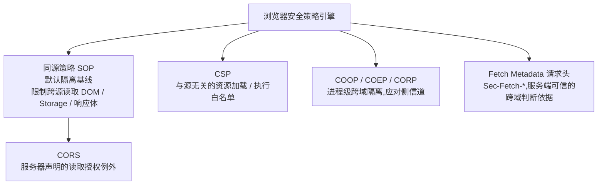
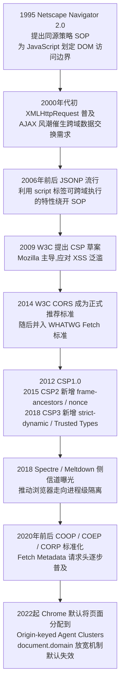
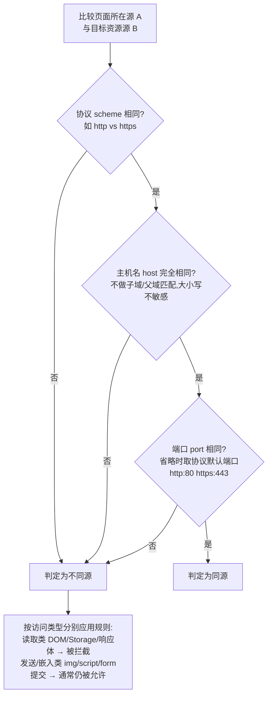
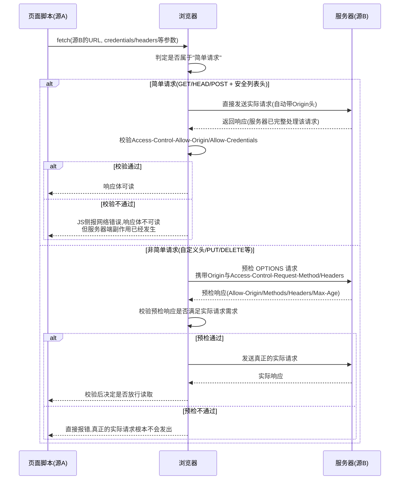
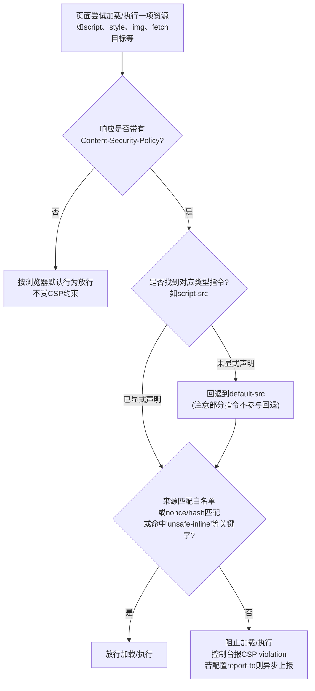

# Web与应用层安全（3）· 同源策略与CORS与CSP

> [!abstract] TL;DR
> - 同源策略（SOP）判定"源"只看协议、主机、端口三元组，且默认只限制**跨源读取**（DOM、Storage、响应体），并不限制**跨源发送**——``/`<form>`/`<script src>` 都能跨域把请求真实发出去，这正是 CSRF 长期存在的物理基础。
> - CORS 不是访问控制机制，而是浏览器单方面执行的"数据泄露闸门"：服务器用响应头声明谁能读，真正的强制方永远是浏览器；简单请求即便最终被 CORS 拦下响应，其副作用早已在服务端生效，"控制台报错"不等于"请求没有发生"。
> - 预检（preflight）只对非简单请求触发，用 `OPTIONS` + `Access-Control-Request-*` 头协商，结果可被 `Access-Control-Max-Age` 缓存，Chrome（v76+）硬上限 7200 秒、Firefox 硬上限 86400 秒，超过会被浏览器强制截断，未设置时默认仅 5 秒。
> - `Access-Control-Allow-Origin: *` 与携带凭证互斥；把请求 `Origin` 头原样反射回响应、同时打开 `Access-Control-Allow-Credentials: true`，等价于向任意网站开放"以受害者登录身份读取本站数据"的权限，是实战中最常见的高危误配置。
> - CSP 用 `script-src`/`object-src`/`base-uri`/`frame-ancestors` 等指令把资源加载与执行来源白名单化，是 XSS 的纵深防御层而非输出编码的替代品；`nonce`/`hash` 配合 `strict-dynamic` 的信任传递模型，被证明比传统域名白名单更难被绕过、也更不容易随时间"越开越松"。
> - COOP/COEP/CORP 是 Spectre 级侧信道攻击之后新增的"进程级跨域隔离"机制，与 SOP/CORS/CSP 分属不同防御维度；这一整套体系的强制方永远是浏览器本身，服务端独立的身份认证与授权任何时候都不可被它们替代。

## 概述与定位

Web 从一开始就是为"文档互联"设计的：任意一个页面都可以用 `<a>` 指向任意其他站点，用 `` 嵌入任意地方的图片，这种无边界的引用能力正是超文本的价值所在。但当浏览器在 1995 年之后陆续引入可执行的 JavaScript、能够记录登录状态的 Cookie、以及后来的本地存储之后，"任意页面可以自由访问任意资源"这条早期规则就变成了安全隐患：如果一个恶意页面里的脚本可以随意读取用户在银行网站上的登录态页面内容，或者随意代替用户操作其他已登录的站点，那么"超链接自由"就变成了"任意站点可以劫持任意其他站点"。同源策略（Same-Origin Policy, SOP）正是浏览器厂商为堵住这个口子引入的默认隔离规则；而 CORS 与 CSP，是在 SOP 之后陆续补充进来的、方向相反的两块拼图——CORS 负责在必要时"有控制地打开"SOP 关上的门，CSP 负责在门开不开之外，再加一层"即使门开着，也只能进出白名单里的东西"的资源级约束。三者共同构成浏览器端"策略引擎"的主体：理解它们，本质上是在理解**浏览器到底把用户的哪些东西保护起来了、又是通过谁的声明被打开的、打开之后还剩下什么约束**。

要把这套机制看透彻，有一个贯穿全文的三分框架很有用：把浏览器里任何一次"跨源交互"拆成三个独立动作——**发送（send）**、**执行/嵌入（execute / embed）**、**读取（read）**。这三个动作受到的约束完全不同，而绝大多数"CORS 为什么挡不住 CSRF""CSP 为什么不能替代输出编码"之类的困惑，根源都在于把这三个动作混为一谈。SOP 默认只管"读取"：跨源的 `fetch`/`XHR` 响应体、跨源 iframe 的 DOM、跨源的 Storage，这些"读"动作会被拦下；但"发送"几乎不受 SOP 限制——``、`<form action>`、`<script src>` 都可以毫无阻拦地把请求发到任何源，请求也会被目标服务器真实处理，这正是 CSRF 攻击链存在的物理基础（具体攻击手法见本系列第 06 篇）。"执行/嵌入"介于两者之间：跨源脚本、样式、图片默认可以被加载并生效（这正是 CDN、公共字体服务、第三方分析脚本能够工作的前提），但读取其内容（比如把跨域图片画到 canvas 上再导出像素）会触发"画布污染"限制。CORS 解决的是"读"的授权问题；CSP 解决的是"从哪加载"和"能不能执行"的白名单问题，且判断依据是**资源加载的目标地址**，与发起页面是否同源无关——哪怕是同源脚本，只要不满足 CSP 的语义规则（比如内联脚本没有 nonce），照样会被挡。

在系列定位上，本篇上承第 02 篇《HTTP协议安全》——那一篇已经建立了请求/响应头、Cookie 属性等基础设施认知，本篇要做的是在此基础上讲清楚浏览器如何**利用**这些头部字段做出放行或拦截的判断；本篇下启第 04 篇起的具体漏洞类型：第 05 篇《XSS跨站脚本》讲清楚注入手法本身，本篇提前把 CSP 作为 XSS 纵深防御第二道闸门的原理讲透，但不重复讨论注入点怎么找；第 06 篇《CSRF与SSRF》会展开利用"SOP 允许跨源发送"这一特性发起伪造请求的完整手法，本篇先把"CORS 配置正确 ≠ CSRF 免疫"这个前置认知讲清楚；第 07 篇《认证与会话安全》会深入 SameSite Cookie 在会话安全中的角色，本篇只在边界层面提及它和 SOP 处于不同隔离维度，不做展开。

图 1 展示了本篇要讲的几层机制在浏览器安全策略引擎里的位置关系：



这套体系不是一次成型的，而是随着 Web 攻击面演变逐步打补丁打出来的。图 2 梳理了关键节点，便于建立时间上的因果关系（后面出现的机制通常是为了弥补前面机制暴露出的问题）：



## 原理与机制

### 同源判定：三元组比较，没有模糊地带

同源策略的判定算法本身极其简单，简单到经常被低估：只比较**协议（scheme）**、**主机名（host）**、**端口（port）**三项，三项完全相同才算同源，任何一项不同都判定为不同源。这里有几个经常被忽视、但在实战中反复踩坑的细节值得展开。

第一，主机名比较是**完整字符串比较**，不做任何父域/子域层面的智能匹配。`https://example.com` 和 `https://api.example.com` 是不同源，`https://example.com` 和 `https://www.example.com` 也是不同源——哪怕它们背后是同一家公司、同一套业务。这与很多人对"域"的直觉不同：日常语境里说"这两个都是 example.com 的域名"，但浏览器眼里它们是完全独立的安全主体。

第二，端口比较时如果 URL 中省略了端口号，会按协议取默认端口（`http` 默认 80，`https` 默认 443，`ws` 默认 80，`wss` 默认 443）。所以 `http://example.com` 和 `http://example.com:80` 同源，但 `https://example.com` 和 `https://example.com:8443` 不同源。这个规则解释了本地开发时的一个常见困惑：`http://localhost:3000`（前端开发服务器）和 `http://localhost:8080`（后端 API）即使主机名完全一样，也因为端口不同判定为跨源，需要 CORS 或反向代理转发才能顺畅联调。

第三，`https://localhost` 与 `https://127.0.0.1` 虽然在网络层指向同一台机器，但作为主机名字符串并不相等，浏览器同样判定为不同源。渗透测试和联调环境中经常遇到"明明是同一台机器，为什么浏览器报跨域"的困惑，根源大多在这里。

第四，也是容易被旧资料误导的一点：`document.domain` 曾经是官方支持的、主动放宽 SOP 的手段——两个页面如果同属一个父域（比如 `a.example.com` 和 `b.example.com`），双方都执行 `document.domain = 'example.com'` 后就可以互相访问 DOM。但这个机制有个隐蔽副作用：一旦设置了 `document.domain`，端口号会被**忽略**，判定同源时不再比较端口，这本身就是在削弱隔离粒度；共享虚拟主机场景下，任何托管在同一父域下的子站点都可能被拉入同一信任域，多年来被证明是常见的安全隐患来源。因此现代浏览器正在改变默认行为：从 Chrome 106 起，页面默认被分配到"按源分组的 Agent 集群"（Origin-keyed Agent Clusters），这种分组下对 `document.domain` 赋值不会报错，但也不再产生任何效果（静默失效）；如果确实还需要旧行为，必须显式发送 `Origin-Agent-Cluster: ?0` 响应头主动退出新分组方式，且主页面与需要互相访问的子 frame 都要发送该头。这是一个"过去教材写的方法今天已经不生效"的典型案例，跨域通信应改用 `postMessage()` 或 Channel Messaging API。

### SOP 管的是"读"，不是"发"或"嵌入"

前面已经用三分框架点出了这一点，这里用一张对照表把常见场景过一遍，因为这是排查"为什么这个跨域行为没被挡住、那个又被挡住了"时最实用的速查依据。

| 场景/操作 | 是否受 SOP 限制 | 说明 |
|---|---|---|
| `<script src>` 跨域加载并执行 | 否（可执行） | 但运行时异常详情跨域时被脱敏为 `"Script error."`，除非标签加 `crossorigin` 属性且响应带 CORS 头 |
| `<link rel="stylesheet">` 跨域加载 | 否 | 样式生效不受限，但用 CSSOM（`styleSheet.cssRules`）读取跨域样式表的具体规则受限，除非有 CORS |
| ``/`<video>`/`<audio>` 跨域加载显示 | 否（可显示） | 画到 `<canvas>` 后调用 `getImageData`/`toDataURL` 会因"画布污染"（tainted canvas）抛 `SecurityError`，除非资源方给了 CORS 头且标签加 `crossorigin` |
| `<iframe>` 跨域嵌入 | 部分 | 可加载显示，但两端 `window` 互相只能访问极少数跨域安全属性（`location` 可写不可读、`postMessage`、`closed` 等），`document` 等其余属性一律被拒绝抛 `SecurityError` |
| `<form>` 跨域 `submit` | 否（可发送） | 请求真实发出并被服务器完整处理，这是 CSRF 存在的物理基础 |
| `fetch`/`XHR` 跨域请求 | 是（读取被拦截） | 请求本身可能已发出（简单请求场景），但响应体默认不可读，需 CORS 放行 |
| `localStorage`/`sessionStorage`/`IndexedDB` | 是（完全隔离） | 严格按"源"分区存储，不同源互不可见 |
| Cookie 读写 | 部分/不同维度 | 隔离边界是 `domain + path`，不含协议和端口，与 SOP 的"源"概念并不完全一致 |
| `window.postMessage` | 否（官方跨源通信通道） | 需要接收方显式校验 `event.origin`，否则形同虚设 |
| 顶层跳转 `window.location = ...` | 否（可发生） | 允许跨域导航，但导航后的页面内容无法被原页面脚本读取 |

这张表最容易被误读的一行是 `<form>` 跨域提交：很多人第一次听说"跨域也能提交表单"会觉得反直觉，但恰恰是这一条构成了 CSRF 存在的物理基础——浏览器从设计上就没有打算阻止"跨域发起一次写请求"，它只负责在写请求得到响应之后，决定这个响应内容能不能被发起方页面的脚本读到。对大多数 CSRF 场景，攻击者根本不关心响应内容，只关心"这次写操作有没有在服务器上生效"（比如修改密码、发起转账），所以 SOP 拦不拦响应读取，对 CSRF 是否成功毫无影响。

同样值得强调的是 Cookie 的隔离边界：它由 `Domain` + `Path` 决定，**不包含协议和端口**，这与 SOP 判定"源"的三元组不是同一套坐标系。`http://example.com:80` 和 `http://example.com:8080` 按 SOP 是不同源，但如果 Cookie 没设 `Secure` 且 `Domain=example.com`，两个端口是可以共享同一份 Cookie 的。这个"两套隔离边界不重合"的事实，是很多人调试跨端口联调环境时百思不得其解的根源，也是 SameSite 属性存在的背景之一（具体攻防细节见第 07 篇）。

### window 对象的部分暴露：postMessage 的由来

跨域 iframe 之间的确存在一个官方开放的白名单：`window` 对象上有一小撮属性/方法即使跨源也允许访问，包括 `location`（可写不可读，即可以让对方跳转但不能读取对方当前地址）、`closed`、`frames`、`length`、`opener`、`parent`、`self`、`top`，以及 `postMessage()`、`blur()`、`close()`、`focus()`。这个精心设计的极小暴露面背后的逻辑是：允许最基本的窗口管理操作（比如父页面关闭一个自己打开的弹出子窗口），同时完全杜绝任何数据读取通道。而 `postMessage` 正是在这个前提下被专门设计出来、作为"官方认可的跨源通信管道"：它允许双方在明确知情、且各自校验来源的前提下主动交换数据，弥补了"SOP 把所有跨源 DOM 访问都锁死"之后应用开发者仍然存在的合理跨域通信需求。但 `postMessage` 的安全性完全依赖调用方是否正确校验 `event.origin`——如果接收方的消息处理函数不检查消息来源就直接信任并处理 `event.data`，那么任何页面都可以伪造消息，这是实战中除 CORS 误配置外第二常见的跨域相关漏洞模式。

### CORS 的基本工作模型：谁声明，谁执行

理解 CORS 最重要的一句话是：**CORS 不是一种访问控制机制，而是浏览器单方面执行的"数据泄露闸门"**。这句话拆开讲有两层含义。第一层，"声明权"在服务器：服务器通过若干以 `Access-Control-` 开头的响应头告诉浏览器"我允许哪些源、以什么方式读取我的响应"。第二层，"执行权"完全在浏览器：读取这些响应头、比对发起请求的 `Origin`、决定是否把响应体交给页面里的 JavaScript，这一整套判断逻辑是浏览器代码里实现的，服务器端的 HTTP 服务本身对这件事毫不知情——服务器只是老老实实处理了这个请求（该查数据库查数据库，该扣库存扣库存），生成了响应，至于这个响应最终有没有被浏览器"放行"给页面脚本，服务器根本不关心，也控制不了。这也是为什么必须反复强调：**如果直接用 curl、Postman，或者写一个脱离浏览器的 HTTP 客户端去访问一个只配了 CORS、没做真正身份鉴权的接口，CORS 形同虚设**——因为 CORS 检查这一步压根不存在于服务器代码路径里，它只存在于浏览器内部。

正因如此，CORS 请求在浏览器侧被分成两类处理路径：**简单请求（simple request）**和需要**预检（preflight）**的复杂请求。简单请求需同时满足：方法只能是 `GET`、`HEAD`、`POST`；请求头除浏览器自动添加的之外，只允许 `Accept`、`Accept-Language`、`Content-Language`、`Content-Type` 这几个"CORS 安全列表头"；`Content-Type` 的值只能是 `application/x-www-form-urlencoded`、`multipart/form-data`、`text/plain` 三者之一；且请求体不能是 `ReadableStream`。满足以上条件的请求，浏览器会**直接把请求发出去**，服务器该怎么处理就怎么处理，浏览器只在响应回来之后做一次"能不能把这个响应交给 JS"的判断。不满足条件的请求（比如要发 `Content-Type: application/json`、要带自定义的 `Authorization` 头、要用 `PUT`/`DELETE` 方法），浏览器会先发一个 `OPTIONS` 方法的"预检"请求去问服务器"如果我发送这样一个请求，你允许吗"，服务器明确点头之后，浏览器才会真正发出那个业务请求。这个设计的深层用意在于：REST 风格 API 大量使用的 `PUT`/`DELETE`/自定义头/JSON body，在 CORS 出现之前的老式跨域请求方式（比如通过表单）里根本不存在，让这些"老服务器完全没有预期过会收到跨域请求"的请求方式必须先过一轮明确同意，避免"服务器代码原本只信任同源调用，却在毫无防备的情况下开始接收跨域写请求"这种被动局面；而 `GET`/`HEAD`/简单 `POST` 之所以可以豁免预检，是因为这几类请求本来就可以通过 `<form>`、`` 等标签跨域发出（早于 CORS 标准存在），预检对它们没有增量的保护价值。

这一点在实战排障中非常关键：**预检失败，实际的业务请求根本不会被发出**；但简单请求即使最终因 CORS 校验失败导致 JS 读不到响应，请求本身已经被服务器完整处理过一遍。也就是说，"浏览器控制台报了一堆 CORS 错误"不等于"服务器没有执行这次操作"——这是很多开发者调试时会踩的坑：看到红色报错就以为请求没发出去，实际上对简单 `POST` 请求，数据可能早就落库了，只是页面拿不到返回结果而已。图 3 把 SOP 的判定逻辑可视化，下一节的图 4 则把 CORS 两条路径的完整时序画出来。



## 指令与执行详解

上一节留下了两个尚未落地的问题——服务器具体怎么声明、浏览器具体凭什么头判断，本节把它们落到 CORS 与 CSP 每一个具体的指令/响应头上逐一讲透，并把 COOP/COEP/CORP、Fetch Metadata 一并纳入，因为它们都属于"用头部字段驱动浏览器策略判断"这同一套设计范式。

### CORS 响应头逐项精讲

| 响应头 | 作用 | 关键细节/易错点 |
|---|---|---|
| `Access-Control-Allow-Origin` | 声明允许读取响应的源 | 值为具体 origin 或 `*`；请求为 `credentials: 'include'` 模式时不能是 `*`，必须回显具体 origin |
| `Access-Control-Allow-Credentials` | 是否允许携带凭证（Cookie/HTTP 认证）的跨域读取 | 必须是字符串 `true`，且此时 `Allow-Origin` 不能是 `*` |
| `Access-Control-Allow-Methods` | 预检响应中声明允许的方法 | 只出现在预检响应中 |
| `Access-Control-Allow-Headers` | 预检响应中声明允许的自定义请求头 | 需覆盖 `Access-Control-Request-Headers` 里列出的每一项 |
| `Access-Control-Expose-Headers` | 声明哪些响应头可被前端 JS 通过 `response.headers.get()` 读取 | 默认只有 CORS 安全列表响应头可读，其余（如自定义 `X-Request-Id`）须显式暴露 |
| `Access-Control-Max-Age` | 预检结果缓存时长（秒） | Chrome（v76+）硬上限 7200 秒，Firefox 硬上限 86400 秒，未设置时默认仅 5 秒，设为 `-1` 则禁用缓存、每次都重新预检 |
| `Vary: Origin` | 告知缓存/CDN 该响应因 `Origin` 不同而不同 | 遗漏此头时，CDN/反向代理可能把为源 A 生成的 `Allow-Origin: 源A` 响应缓存后错误返回给源 B，造成跨源数据泄露 |

逐项之外，有几个原理性问题值得展开讲清楚"为什么这么设计"。为什么 `*` 和携带凭证互斥：如果允许 `Access-Control-Allow-Origin: *` 同时又允许携带 Cookie，那么任何网站都能用受害者的登录态读取该接口返回的私有数据，`*` 的语义就从"公开数据，谁都能读"演变成"任何页面都能冒充受害者身份读私有数据"，这在设计上不可接受，所以规范层面直接把两者做成互斥：只要请求是携带凭证模式，响应端就必须回显具体的 Origin 值，不能用通配符搪塞。为什么需要 `Access-Control-Expose-Headers`：默认情况下 `Response.headers` 只暴露七个 CORS 安全列表响应头（`Cache-Control`、`Content-Language`、`Content-Length`、`Content-Type`、`Expires`、`Last-Modified`、`Pragma`），这是因为响应头本身也可能携带敏感信息（内部系统版本号、限流剩余次数、请求追踪 ID 等），如果默认全部暴露，等于在"CORS 只放开了 body 读取"之外又意外放开一整个头部通道，所以规范选择默认最小暴露、需要时显式开放；一个常见的排障坑是：DevTools 的 Network 面板本身拥有特权，能看到完整响应头，但页面 JS 调不到未暴露的头，于是出现"明明网络面板里能看到这个头，代码里就是读不到"的困惑。`Vary: Origin` 的重要性也值得单独强调：如果后端对不同 Origin 返回不同的 `Access-Control-Allow-Origin` 值（精确白名单场景下的正常做法），但前面有一层 CDN 或反向代理按 URL 做缓存而没有把 `Origin` 纳入缓存 key，那么第一个请求的响应（比如 `Allow-Origin: https://a.example.com`）可能被缓存下来，原样返回给后续来自 `https://b.example.com` 的请求——如果这个响应恰好带了敏感数据，就等于把 A 源应该私有的数据通过缓存污染泄露给了 B 源。加上 `Vary: Origin` 后，缓存层会把 `Origin` 值本身也纳入缓存键，从根本上避免这种串号。

### CORS 的两个高危误配置模式

**反射 Origin + 开 Credentials**：常见于开发者图省事，直接把请求的 `Origin` 头读出来塞回 `Access-Control-Allow-Origin`，再无脑加一行 `Access-Control-Allow-Credentials: true`。效果上等价于对任意站点开放"用受害者登录身份读取本站任意接口数据"的权限——因为不管请求来自哪个源，响应头永远原样回显那个源，浏览器的同源校验形同虚设。

**字符串包含/正则误判**：一些实现不做精确集合匹配，而是用 `origin.indexOf('example.com') !== -1` 或者写得过于宽松的正则（比如 `/example\.com/` 没有锚定开头结尾）判断是否放行。这类逻辑会被 `https://example.com.attacker.com`（`indexOf` 能匹配到子串）或 `https://evilexample.com`（没有锚定边界）绕过。这类问题的本质和 SQL 注入、路径穿越是同一类问题：把"应该做结构化、精确边界匹配的判断"退化成了"字符串模糊匹配"。

以下用伪代码对比两种实现的差异，重点看匹配逻辑本身，而不是具体语言语法：

```text
// 危险写法:子串包含判断
function isAllowed(origin):
    return origin.contains("example.com")   // evil-example.com.attacker.net 也会命中

// 危险写法:未锚定正则
function isAllowed(origin):
    return /example\.com/.test(origin)      // 同样会被子串命中绕过

// 正确写法:精确集合匹配
ALLOW_LIST = { "https://app.example.com", "https://admin.example.com" }
function isAllowed(origin):
    return origin in ALLOW_LIST             // 只有完全相等才通过

// 正确写法:严格锚定的子域正则(且需评估每个子域是否真的可信)
function isAllowed(origin):
    return /^https:\/\/([a-z0-9-]+\.)?example\.com$/.test(origin)
```

**null Origin 陷阱**：sandboxed 的 `<iframe sandbox>`（没有 `allow-same-origin`）、`file://` 协议页面、某些重定向链的中间态，都会让浏览器发出 `Origin: null`。如果后端逻辑把 `null` 当作合法值放行（常见于"没有 Origin 就放行"这类偷懒判断的变种），攻击者只需要用一个 sandboxed iframe 包一层，就能拿到被信任的 `null` 身份发起跨域读取。

### CSP 指令族谱

CSP 的指令数量不少，但可以按语义分成四类，理清分类关系有助于记忆和排查（也是很多人写 CSP 时漏掉某个指令的原因——不知道该指令归属哪一类、会不会被 `default-src` 兜底）：

| 分类 | 指令 | 作用 |
|---|---|---|
| Fetch 类 | `default-src` | 未显式指定的 fetch 类指令的兜底值 |
| Fetch 类 | `script-src` / `script-src-elem` / `script-src-attr` | 控制 `<script>` 及动态脚本执行来源 |
| Fetch 类 | `style-src` / `style-src-elem` / `style-src-attr` | 控制样式来源 |
| Fetch 类 | `img-src` / `font-src` / `media-src` | 控制图片/字体/音视频来源 |
| Fetch 类 | `connect-src` | 控制 `fetch`/`XHR`/`WebSocket`/`EventSource`/`sendBeacon` 目标 |
| Fetch 类 | `object-src` | 控制 `<object>`/`<embed>`/`<applet>`，通常设为 `'none'` |
| Fetch 类 | `frame-src` / `worker-src` / `manifest-src` | 控制子 frame / worker / manifest 来源 |
| Document 类 | `base-uri` | 限制 `<base>` 标签可设的 href 基准 |
| Document 类 | `sandbox` | 对文档施加类似 iframe sandbox 的限制 |
| Navigation 类 | `form-action` | 限制表单提交的目标 URL |
| Navigation 类 | `frame-ancestors` | 限制本页面可被哪些源嵌入 iframe，取代 `X-Frame-Options`，**只能用 HTTP 头设置，`<meta>` 标签无效** |
| Reporting 类 | `report-to`（现行）/ `report-uri`（已废弃但仍广泛使用） | 违规上报端点 |
| 其他 | `upgrade-insecure-requests` | 自动把页面内 http 请求升级为 https |
| 其他 | `require-trusted-types-for` / `trusted-types` | 强制 DOM XSS 高危汇聚点必须经 Trusted Types 处理 |

对 `default-src` 的语义要单独强调：它只是**其他 fetch 类指令未显式声明时的兜底值**，不是"总闸"。像 `base-uri`、`form-action`、`frame-ancestors`、`sandbox` 这些 Document/Navigation 类指令，即使不显式声明也**不会**从 `default-src` 继承限制——这是新手写 CSP 时最容易漏掉的陷阱之一：以为写了 `default-src 'self'` 就万事大吉，实际上 `base-uri`、`frame-ancestors` 必须单独显式声明才会生效。另外要注意的是，`frame-ancestors`、`report-uri`/`report-to`、`sandbox` 这几个指令通过 `<meta http-equiv="Content-Security-Policy">` 标签设置时不受支持或效果受限，只有走真正的 HTTP 响应头才能保证全部指令生效，这也是为什么正式环境的 CSP 应优先由服务端/网关下发响应头，而不是依赖前端页面里的 `<meta>` 标签（`<meta>` 方式更多用于客户端渲染的单页应用做补充加固）。

`object-src` 通常应该直接设为 `'none'`：这条指令历史上用来限制 Flash/Java Applet/Silverlight 这类插件对象的加载来源，如今主流浏览器已不再支持这些插件技术，但设为 `'none'` 仍有意义——一方面兼容老旧浏览器或非标准环境，另一方面它同时约束 `<embed>` 标签，属于零成本收益的加固项。

`base-uri` 未设置时的隐患值得单独讲：`<base href="...">` 标签会改变整个页面里所有**相对路径**资源引用的解析基准。如果页面本身存在任意一个 XSS 注入点（哪怕只能注入一个标签、注入不了完整 `<script>`），攻击者插入一个 `<base href="https://attacker.example/">` 就可以让页面里所有用相对路径写的 `<script src="/app.js">`、`<link href="/style.css">` 全部被重新解析到攻击者的域名下——如果 CSP 的 `script-src`/`style-src` 恰好又比较宽松，这一记组合拳就能把"一个标签注入点"放大成"整页脚本被替换"。所以 `base-uri 'self'`（或更严格的 `'none'`）几乎应该是每份 CSP 策略的标配。

### nonce、hash 与 strict-dynamic：信任的产生与传递

`'unsafe-inline'` 的问题在于它是一把无差别开放的钥匙——只要是内联脚本，不管内容是什么、是谁写的，一律放行，这和完全不设 `script-src` 在防 XSS 的意义上几乎没有区别（因为几乎所有反射型/存储型 XSS 的载荷都以内联脚本或内联事件属性的形式出现）。CSP2 引入的 `nonce-<base64>` 和 `sha256-<base64>` 两种机制，思路是把"信任"从"来源类型"（内联 or 外链）切换到"内容本身"：nonce 方式要求每次 HTTP 响应生成一个密码学安全的随机数，写进响应头的 CSP 策略里，同时页面里每个被信任的 `<script>` 标签必须带上同样的 `nonce="..."` 属性值，浏览器只会执行 nonce 值匹配的内联脚本；hash 方式则是直接对内联脚本的字节内容取 SHA-256/384/512，把 hash 值写进策略，适合内容不常变化的固定脚本。这两种方式共同的好处是：即使页面存在 XSS 注入点，攻击者插入的恶意 `<script>` 标签因为不知道当次响应的 nonce 值（且下次请求 nonce 就会变）、也凑不出匹配的 hash，无法被浏览器执行。

但 nonce/hash 单独使用有个现实困难：现代前端页面往往会通过分析脚本、广告脚本、A/B 测试脚本等第三方代码**动态地**再插入更多 `<script>` 标签（比如 GTM 加载之后会继续拉一堆子脚本），如果每一个动态插入的子脚本都要求带 nonce 或匹配 hash，维护成本会迅速失控，很多团队因此被迫退回到域名白名单甚至 `unsafe-inline`。CSP3 引入的 `'strict-dynamic'` 关键字正是为了解决这个矛盾：语义是"任何由一个已被 nonce/hash 信任的脚本在运行时创建并插入的新 `<script>` 标签，自动继承信任，不需要再单独匹配 nonce/hash 或出现在域名白名单里"。这是一种**信任传递**模型——只要信任链的起点可信（被 nonce/hash 认可加载的第一个脚本），后续这个脚本自己拉起来的所有子脚本都被认为可信，不再需要为每个第三方域名单独开白名单口子。业内长期维护大规模 CSP 部署的安全团队公开分享的经验是：传统"域名白名单"式 CSP 因为要不断为各种第三方脚本拉长白名单列表，实际防护强度会随着时间推移被"越开越宽"逐渐稀释，相比之下 `nonce` + `strict-dynamic` 的组合把信任判断锚定在"内容/加载链"而不是"域名"上，更难被绕过，也更不容易随维护而腐化。需要注意的是，`'strict-dynamic'` 生效时，同一个 `script-src` 指令里写的域名白名单和 `'self'`/`'unsafe-inline'` 会被现代浏览器忽略（仅为了让不支持 `strict-dynamic` 的旧浏览器还能降级使用白名单，属于刻意设计的向后兼容）。

`'unsafe-hashes'` 和 `'wasm-unsafe-eval'` 是 CSP3 补的两个小口子：前者允许特定 hash 匹配的**内联事件处理器属性**（如 `onclick="doThing()"`）生效，用于历史遗留代码里到处是内联事件属性、一时半会儿改不完的场景；后者允许 WebAssembly 编译执行，而不需要为此放开更危险的 `'unsafe-eval'`（因为 Wasm 的执行模型和 `eval` 字符串执行 JS 代码在风险面上并不等价，把两者绑在一个开关上过于粗放）。

CSP 头的基本语法结构是分号分隔的指令列表，每条指令是"指令名 + 空格分隔的来源值列表"，理解这个结构本身有助于快速排查策略是否写错：

```text
Content-Security-Policy:
  default-src 'self';
  script-src 'self' 'nonce-r4nd0mBASE64Value' 'strict-dynamic';
  style-src 'self' 'unsafe-inline';
  img-src 'self' data: https://cdn.example.com;
  connect-src 'self' https://api.example.com;
  object-src 'none';
  base-uri 'self';
  frame-ancestors 'none';
  form-action 'self';
  report-to csp-endpoint;
  upgrade-insecure-requests
```

图 4 展示了 CORS 简单请求与预检请求两条路径的完整时序，图 5 展示了浏览器加载一项资源时如何依据 CSP 各指令做出放行/拦截决策。





### CSP 绕过手法一览（防御视角）

理解绕过手法的目的是让防御者在写策略时提前堵上这些口子，而不是提供可直接使用的攻击配方，这里只讲原理性的模式类别。

**白名单域上的开放功能被滥用**：如果 `script-src` 白名单里包含某个域，而这个域本身提供了类似 JSONP 的服务（把 URL 查询参数原样拼接成可执行 JS 返回），那么攻击者可以直接用该白名单域的 URL 拼出一段任意 JS 执行——因为 CSP 检查的只是"脚本从哪个源加载"，并不检查"这个源返回的内容是不是这个网站本来该有的正常脚本"。这提醒我们：白名单里的域名如果自己提供了内容可控的输出接口（不只是 JSONP，还包括允许用户上传静态文件、生成回显内容的任何功能），就相当于把这个域名的"内容可信度"下放给了该域名上所有功能的总和，而不只是网站主页那么简单。

**开放重定向绕过**：CSP 判断资源是否命中白名单，检查的是**发起加载的目标 URL**，不会跟踪该 URL 后续是否发生了服务端重定向。如果白名单域上存在一个开放重定向端点，攻击者构造的脚本标签在 CSP 层面检查时命中的是受信任域，会被放行，实际加载执行的内容却来自重定向之后的攻击者域名。

**通配符子域配合子域接管**：`*.example.com` 这种子域通配符写法如果覆盖了一个早已废弃、但 DNS 记录还指向某个第三方云服务（对象存储、静态站点托管等）的僵尸子域，一旦该第三方服务上的名字被释放，攻击者注册同名资源即可"接管"这个子域，在 CSP 白名单范围内合法地托管恶意脚本。

**`unsafe-eval` 配合框架侧漏洞**：如果策略里开了 `'unsafe-eval'`（一些历史遗留的前端框架、模板引擎在特定用法下依赖 `eval`/`new Function`），攻击者只要能控制传入 `eval` 的字符串内容（哪怕只是通过一个看似无害的模板绑定表达式），就能拿到完整脚本执行能力。这类问题在早期版本的一些前端框架表达式沙箱里出现过，后来各框架都在往"默认不需要 `unsafe-eval` 也能跑"的方向重构。

这几类模式共同的教训是：**CSP 的白名单强度取决于白名单里每一个域名/关键字背后"内容可控性"的总和，而不是白名单条目数量的多少**——一条允许了错误对象的白名单，比十条严格限定路径的白名单更危险。

### COOP / COEP / CORP：进程级隔离，第四层防线

2018 年公开的 Spectre/Meltdown 一类利用 CPU 推测执行的侧信道攻击，揭示出即使 JavaScript 引擎层面严格遵守了 SOP，只要跨源的数据被加载进了**同一个操作系统进程/同一段地址空间**，恶意脚本理论上仍可能通过精心构造的内存访问时序，侧信道式地推测出本不该读到的跨源数据内容。这暴露出此前策略引擎没有覆盖到的维度：SOP/CORS/CSP 管的都是"逻辑层面"能不能读、能不能执行，但没有管"物理层面"数据有没有被隔离到不同进程里。为此浏览器厂商（以 Chrome 的 Site Isolation 项目为代表）开始推进更细粒度的进程级隔离，并配套设计了三个可由页面自主声明的头部：

**COOP**（`Cross-Origin-Opener-Policy`）控制当前页面是否愿意与打开它的窗口（`window.opener`）共享同一个"浏览上下文组"。设为 `same-origin` 后，跨源的 `opener` 引用会被切断——这不仅是内存隔离的前提，也顺带堵上了一类叫 XS-Leaks（跨站信息泄露）的攻击面：攻击者页面 `window.open` 打开目标站点后，即使拿不到目标页面的 DOM，也可能通过探测 `opener` 相关的少量可读属性、页面导航行为等侧面信息，推断出受害者在目标站点的登录状态或其他敏感状态。

**COEP**（`Cross-Origin-Embedder-Policy`）设为 `require-corp` 后，页面里凡是要嵌入的跨源资源（图片、脚本、iframe 等）都必须显式声明"我允许被嵌入"（通过下面的 CORP 头，或携带有效的 CORS 响应头），否则加载直接失败。这相当于把"能不能被嵌入"的默认值从"允许"反转成了"拒绝"，需要资源提供方主动开口子。

**CORP**（`Cross-Origin-Resource-Policy`）是资源提供方用来回答"我允许被谁嵌入"的头，取值 `same-origin`（仅同源可嵌入）、`same-site`（同站点，含子域可嵌入）、`cross-origin`（任何源都可嵌入）。它和 COEP 是一对配合关系：COEP 是消费方（嵌入别人东西的页面）的声明，CORP 是提供方（被嵌入的资源）的声明。

三个头同时正确配置后，页面会进入"跨域隔离"（cross-origin isolated）状态，此时才被允许使用 `SharedArrayBuffer`、高精度 `performance.now()` 等此前因可能被用作侧信道高精度计时器而被限制或降级精度的 API。这也说明了一个更宏观的趋势：浏览器安全策略正在从纯"内容层"（谁能读什么数据）向"系统层"（数据在物理内存里是否被隔离）延伸，COOP/COEP/CORP 是这个延伸方向目前最成熟的落地。

### Fetch Metadata：比 Origin/Referer 更可靠的服务端判断依据

传统上服务端想判断"这个请求是不是从我自己的页面发起的跨域/同域请求"，只能依赖 `Origin` 或 `Referer` 头，但这两者都有历史包袱：`Referer` 可能因为用户隐私设置、`Referrer-Policy` 配置、HTTPS 到 HTTP 的跳转等原因被裁剪或完全不发送；`Origin` 只在部分请求类型下才会自动带上。近几年逐步普及的 **Fetch Metadata 请求头**提供了一套浏览器强制写入、网页脚本无法覆盖或伪造的元信息：

| 头 | 取值示例 | 含义 |
|---|---|---|
| `Sec-Fetch-Site` | `cross-site` / `same-origin` / `same-site` / `none` | 发起请求的源与目标源的关系 |
| `Sec-Fetch-Mode` | `cors` / `navigate` / `no-cors` / `same-origin` / `websocket` | 请求模式 |
| `Sec-Fetch-Dest` | `document` / `script` / `image` / `iframe` / `empty` 等 | 请求由哪种元素/上下文发起 |
| `Sec-Fetch-User` | `?1`（存在即为真） | 是否由用户主动激活（如点击）触发的顶层导航 |

因为这几个头是浏览器内核在网络层直接写入、JS 层面完全没有 API 可以修改，服务端可以把它们当作比 `Origin`/`Referer` 更值得信赖的判断依据，例如：对于一个只应该被自己站内页面通过 `<script>` 加载的接口，可以直接拒绝所有 `Sec-Fetch-Site: cross-site` 的请求，作为 CSRF/资源盗用防护的补充层。但要注意，这类判断同样只对遵守规范的浏览器有效，不能替代身份鉴权，这一点会在下一节反复强调。

## 工具视角与实战

### 用浏览器 DevTools 定位跨域问题

浏览器控制台的 CORS 报错文案本身就是一份诊断依据，值得逐条读懂：`"No 'Access-Control-Allow-Origin' header is present on the requested resource"` 意味着响应压根没带这个头——常见于后端根本没配 CORS，或者配了但反向代理层被吞掉了；一个容易被忽视的陷阱是，很多 CORS 中间件只在"正常业务响应"路径加头，一旦请求触发了 500/404 走了另一条异常处理分支，跨域头就丢了，前端表面看到的是 CORS 报错，真实原因其实是后端异常。`"...contains multiple values"` 意味着这个头被加了不止一次，常见于 Nginx 父子 `location` 块各自 `add_header`、或 CDN 和源站各自加了一份导致重复。`"...it does not have HTTP ok status"` 意味着预检 `OPTIONS` 请求本身返回了非 2xx 状态码，常见于反向代理没有对 `OPTIONS` 方法做特殊处理、直接转发给业务代码，而业务路由压根没实现 `OPTIONS`，返回了 404/405。

Network 面板里筛选 `Method=OPTIONS` 能单独看到预检请求，点开可以逐项对比 Request Headers 里的 `Access-Control-Request-Method`/`Access-Control-Request-Headers` 和响应头是否匹配；Timing 小节能看到预检请求带来的额外 RTT，这是评估"要不要通过 `Access-Control-Max-Age` 延长预检缓存"的直接依据。CSP 违规信息则会直接出现在 Console，典型文案形如 `"Refused to load the script '...' because it violates the following Content Security Policy directive: \"script-src 'self'\""`；如果配置了 `report-to`，违规报告会异步发到指定端点，便于在不阻断用户的前提下（配合 Report-Only 模式）收集真实流量中的策略缺口。

### 用 curl 手工复现 CORS 判定

curl 的价值在于完全脱离浏览器的自动纠错行为，直接看服务器在特定 `Origin` 下到底回了什么头：

```bash
curl -i -X OPTIONS "https://api.example.com/v1/orders" \
  -H "Origin: https://test-probe.example.net" \
  -H "Access-Control-Request-Method: PUT" \
  -H "Access-Control-Request-Headers: authorization,content-type"

curl -i "https://api.example.com/v1/orders" \
  -H "Origin: https://test-probe.example.net" \
  -H "Cookie: session=..." 
# 观察响应头里 Access-Control-Allow-Origin 是否原样反射了任意 Origin 值,
# 以及是否同时出现 Access-Control-Allow-Credentials: true
```

把 `Origin` 换成任意值（包括明显不属于自己业务的域名）观察响应变化，是审计"是否存在反射 Origin 漏洞"最快的验证手段——但这类主动探测只应在自己拥有或已获授权的目标上进行，具体合规边界见下一节。

### CSP Evaluator 与策略强度审计

CSP Evaluator 是谷歌安全团队公开提供的策略分析工具，把一份 CSP 策略字符串粘贴进去，能自动标注出高危模式（比如白名单里包含已知具备 JSONP 风格开放端点的域、`'unsafe-inline'` 未被 nonce 覆盖导致失效、缺少 `object-src`/`base-uri` 等）。它的检测规则本质上是把"业内公开的 CSP 绕过模式知识库"工具化，适合作为策略上线前的自动化关卡之一纳入 CI 流程。

### Burp Suite / ZAP 在 CORS/CSP 审计中的用法

用 Burp Repeater 手动改写请求的 `Origin` 头、观察响应里 `Access-Control-Allow-Origin`/`Allow-Credentials` 的变化规律，是判断白名单具体实现方式（精确匹配、正则、字符串包含、还是无脑反射）最直接的手段；Burp 的被动扫描器能自动标记出格式上一望即知的高危组合（如通配符与 Credentials 共存），社区也有专门做 CORS 测试的扩展，会自动尝试常见的绕过变体（`null` 来源、大小写变体、特殊后缀拼接等）并汇总结果。ZAP 的被动扫描规则里同样内置了对 CSP 头缺失、策略过宽（允许 `'unsafe-inline'`/`'unsafe-eval'`、缺少 `object-src` 等）的检测项，属于标准的 Web 安全基线扫描内容。

### 常见网关/框架的配置落地

Nginx 层面实现"精确白名单 + 动态回显 Origin"，不能无脑用 `*`（一旦要支持 Credentials 就不能用通配符），也要注意 `OPTIONS` 单独短路返回，避免预检请求被转发到后端消耗业务资源、或因后端路由没实现 `OPTIONS` 而返回错误：

```nginx
location /api/ {
    set $cors_origin "";
    if ($http_origin ~* "^https://(app|admin)\.example\.com$") {
        set $cors_origin $http_origin;
    }
    add_header Access-Control-Allow-Origin $cors_origin always;
    add_header Access-Control-Allow-Credentials true always;
    add_header Access-Control-Allow-Methods "GET, POST, PUT, DELETE, OPTIONS" always;
    add_header Access-Control-Allow-Headers "Authorization, Content-Type, X-Requested-With" always;
    add_header Vary Origin always;

    if ($request_method = OPTIONS) {
        add_header Access-Control-Max-Age 7200 always;
        add_header Content-Length 0;
        return 204;
    }
}
```

Node.js/Express 生态里，`cors` 中间件的 `origin` 回调函数模式能做到"精确白名单 + 动态多域名支持"，而不是硬编码一个 `*`：

```js
const cors = require('cors');
const allowList = ['https://app.example.com', 'https://admin.example.com'];

app.use(cors({
  origin(origin, callback) {
    // 注意:同源请求/服务端到服务端调用等场景下 origin 可能是 undefined,
    // 是否放行需结合业务场景单独评估,不能与"精确匹配白名单"混为一谈
    if (!origin || allowList.includes(origin)) {
      callback(null, true);
    } else {
      callback(new Error('Not allowed by CORS'));
    }
  },
  credentials: true,
  methods: ['GET', 'POST', 'PUT', 'DELETE'],
  allowedHeaders: ['Authorization', 'Content-Type'],
  maxAge: 7200,
}));
```

CSP 的 nonce 必须每次响应动态生成，用密码学安全随机数生成器（不能用可预测的伪随机实现），否则"一次性"这个属性就失去意义——如果 nonce 值固定不变，攻击者只要观察到一次页面源码里的 nonce 值，就能在自己注入的 payload 标签上原样抄一份：

```js
const crypto = require('crypto');

app.use((req, res, next) => {
  const nonce = crypto.randomBytes(16).toString('base64');
  res.locals.cspNonce = nonce;
  res.setHeader('Content-Security-Policy', [
    "default-src 'self'",
    `script-src 'self' 'nonce-${nonce}' 'strict-dynamic'`,
    "style-src 'self' 'unsafe-inline'",
    "object-src 'none'",
    "base-uri 'self'",
    "frame-ancestors 'none'",
    "form-action 'self'",
    "report-to csp-endpoint",
    "upgrade-insecure-requests",
  ].join('; '));
  next();
});
```

CSP 上线的稳妥路径是先只发 `Content-Security-Policy-Report-Only` 头（不阻断，只上报），观察至少覆盖一个完整业务周期的真实流量违规日志，把日志里出现的"合法但没写进白名单"的资源来源逐一纳入策略，确认违规日志趋于干净后，再切换成正式的 `Content-Security-Policy` 头强制生效。这条灰度路径的价值在于：CSP 策略如果一次性以强制模式上线，几乎必然因为遗漏某个不常触发的功能路径（比如某个很少访问的后台页面用了一个被遗忘的内联脚本）而在生产环境"炸"出功能性故障，Report-Only 模式把这种风险发现提前到了上线之前。

### 一个容易被忽视的细节：浏览器扩展与 CSP 的关系

Chrome/Firefox 扩展的 content script 运行在一个叫"隔离世界"（isolated world）的独立 JS 执行环境里，它和页面共享 DOM，但拥有独立的 JS 全局对象，这意味着扩展注入的脚本在执行层面并不完全受页面 CSP 的 `script-src` 约束（不同浏览器、不同扩展 manifest 版本这里的具体豁免范围有差异，比如 Manifest V3 对扩展自身的 CSP 有单独更严格的要求）。这个细节在安全评估中容易被问到："页面 CSP 配置得很严格，为什么装了某个恶意/被篡改的浏览器扩展还是能执行任意代码"——答案是 CSP 从设计上就假设浏览器本身和已安装的扩展是可信计算基的一部分，它防的是"页面本身被注入的内容"，不是"用户主动安装的扩展"。这划清了 CSP 的能力边界：它是内容层防线，不是终端可信计算基防线。

## 安全性与正确使用

把前面分散提到的误区集中梳理，形成一份可以直接对照自查的清单。

**误区一：配置了 CORS，接口就安全了**。这是混淆了"读授权"和"访问控制"。CORS 影响的只是"浏览器要不要把响应给页面脚本"，不影响服务器是否执行了这次调用，更不代表调用者经过了身份验证。一个没有做任何鉴权的接口，哪怕 CORS 配置得再精确，依然可以被 curl、Postman、任何自己写的 HTTP 客户端无限制访问——因为 CORS 的强制方是浏览器，不是服务器，离开浏览器语境这层防护完全不存在。

**误区二：CORS 配好了，就不用管 CSRF**。这是把"读"授权和"写"防护搞反了方向。CORS 负责拦截"跨域读响应"，CSRF 利用的却是"跨域发请求时浏览器自动带上身份凭证"这个 SOP 从未限制过的能力，二者是两条独立防线，配置 CORS 不解决 CSRF，加了 CSRF Token 也不解决 CORS 该管的数据泄露问题，两者需要分别正确配置。

**误区三：`Access-Control-Allow-Origin: *` 到处抄**。对于真正公开、不带身份的静态数据（无需登录的公开信息接口），`*` 确实是合适的选择；但对涉及登录态、涉及用户私有数据的接口，`*` 意味着任何网站的脚本都能读到该接口返回的内容。心法是：`*` 应该只用于确认该资源对所有互联网访客都同等公开、且不因请求方身份变化而变化内容的场景。

**误区四：反射 Origin + 开 Credentials**。这个组合等价于对全网开放"以任意已登录用户身份读取本站接口数据"的权限，攻击者只需诱导受害者点开一个自己控制的页面即可批量窃取受害者的私有数据，危害面通常不亚于存储型 XSS。

**误区五：字符串包含/未锚定正则判断 Origin，以及信任 null Origin**。正确做法是维护一个精确的域名集合并做严格相等匹配，或使用严格锚定边界的正则；`null` 永远不应被当作合法可信的 Origin 值放行，除非有非常明确、经过安全评审的理由。

**误区六：CSP 用了 `'unsafe-inline'` 导致名存实亡**。一旦 `script-src` 里有 `'unsafe-inline'` 且没有同时提供 nonce/hash 让浏览器忽略它，这份 CSP 对内联脚本注入型 XSS（目前最主流的 XSS 载荷形态）基本没有拦截力，只对外部脚本加载来源还有限制价值。

**误区七：CSP 白名单域过宽**。公共 CDN 允许任意路径、把允许用户上传内容的域名放入白名单，本质上都在稀释"白名单强度 = 每个条目内容可控性总和"这条心法。

**最根本的一条：把浏览器策略当唯一防线，后端毫无独立鉴权**。SOP/CORS/CSP/COOP/COEP/CORP/Fetch Metadata，所有这些机制无一例外都是**浏览器自己实现并强制执行**的行为约束，它们保护的对象是"运行在浏览器里、被恶意页面滥用了登录身份的受害者"，而不是"服务器自身"。任何不经过浏览器 JS 引擎的请求方式（直接构造 HTTP 请求的脚本、抓包重放、命令行工具）天然不受这些策略约束。这意味着服务端的身份认证与授权永远是第一道、也是唯一真正意义上"服务器自己能控制"的防线，浏览器端策略是纵深防御里针对"合法用户的浏览器被恶意页面当枪使"这一特定攻击面的补充层，顺序和权重不能颠倒。

正确实践可以归纳为三条主线：CORS 上，精确白名单（集合而非模式匹配）、`Vary: Origin`、最小化开放的 methods/headers、非必要不开 Credentials（优先考虑用请求头携带的 token 替代自动携带的 Cookie 做鉴权，从架构层面减少对"CORS + Credentials"组合的依赖）、定期审计通配符和正则规则；CSP 上，优先 `nonce`/`hash` + `strict-dynamic` 而非域名白名单、`object-src 'none'` 与 `base-uri 'self'` 作为标配、`frame-ancestors` 按需配置防点击劫持、涉及 DOM 操作的高危汇聚点考虑上 Trusted Types、先 Report-Only 观察真实流量再切强制模式、上线后用 CSP Evaluator 类工具定期复查避免策略腐化；架构层面上，服务端独立鉴权不依赖浏览器策略、跨域相关配置纳入代码评审清单、把常见误配置模式写进团队安全编码规范与静态检查规则。

> [!caution] 合规边界
> 本文对 CORS 误配置模式、CSP 绕过思路的描述，目的是让防御者理解攻击面从而做出正确的配置决策，均为业内公开讨论的防御性知识（如 OWASP Cheat Sheet、CSP Evaluator 等公开资料收录的模式），不包含任何针对真实生产系统的武器化步骤或成品 payload。实际验证、探测、复现测试仅可在**自己拥有或已获得书面授权的系统**、专门的 CTF/安全学习靶场环境中进行；不得对未授权的第三方网站发起 CORS/CSP 绕过测试，不得将本文内容用于突破他人系统的访问控制或窃取真实用户数据，也不为绕过任何商业软件、商业服务的授权校验提供武器化步骤。所有涉及"如何配置"的内容均以防御和正确加固为目的。

## 小结

同源策略、CORS、CSP 这三者理解起来最容易出偏差的地方，都在于把"发送、执行/嵌入、读取"这三个动作混为一谈：SOP 默认只锁"读"，``/`<form>`/`<script src>` 该发出去的跨域请求照样发出去，这是 CSRF 存在的物理基础；CORS 是服务器通过响应头声明、由浏览器单方面强制执行的"读取授权"，不是访问控制，服务器本身对"这次请求有没有被放行给页面 JS"完全不知情也无法控制——脱离浏览器语境（curl、Postman、自定义 HTTP 客户端）访问，CORS 形同虚设；预检请求失败会让真正的业务请求根本不发出，但简单请求哪怕最终被拦下响应，其写入副作用往往早已在服务端生效，"控制台报错"绝不等于"请求没有发生"。CSP 解决的是另一个维度的问题——资源从哪加载、能不能执行，判断依据是目标地址而非发起页面是否同源，`nonce`/`hash` 配合 `strict-dynamic` 的信任传递模型是当前公认更难被绕过、也更不容易随时间腐化的实现方式，优于传统的域名白名单。COOP/COEP/CORP 是 Spectre 之后新增的进程级隔离维度，与内容层的 SOP/CORS/CSP 互为补充；Fetch Metadata 请求头则提供了比 `Origin`/`Referer` 更值得信赖的服务端判断依据。贯穿全文最根本的一条认知是：这一整套机制的强制方永远是浏览器本身，它们保护的是"浏览器里被恶意页面利用了登录身份的受害者"，而不是服务器——服务端独立、完整的身份认证与授权，任何时候都不可被这些浏览器端策略替代。这个认知框架也是理解下一篇《注入类漏洞：SQL与命令与模板》以及后续 XSS、CSRF 各篇具体攻防细节的必要前提。

## 相关阅读

- MDN Web Docs: Same-origin policy
- MDN Web Docs: Cross-Origin Resource Sharing (CORS)
- MDN Web Docs: Content Security Policy (CSP)
- WHATWG Fetch Standard（CORS protocol 相关章节）
- W3C Content Security Policy Level 3（Candidate Recommendation）
- RFC 6454: The Web Origin Concept
- OWASP Cheat Sheet Series: CORS / Content Security Policy
- [[02.HTTP协议安全]]
- [[05.XSS跨站脚本]]
- [[06.CSRF与SSRF]]
- [[07.认证与会话安全]]
- [[71.详解网络协议/18.HTTP-HTTPS协议]]
- [[71.详解网络协议/15.TLS协议]]
- [[30.Windows认证与生物识别编程/08.WebAuthn与FIDO2与passkey编程]]
- [[72.抓包与协议分析实战/04.HTTP与HTTPS抓包与中间人分析]]
- [[37.密码学/62.协议误用与密码工程]]

[[00.Web与应用层安全总览|⬆ 系列总览]] | [[02.HTTP协议安全|← 上一章]] | [[04.注入类漏洞：SQL与命令与模板|→ 下一章]]
