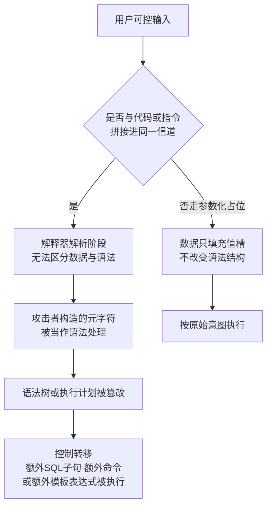
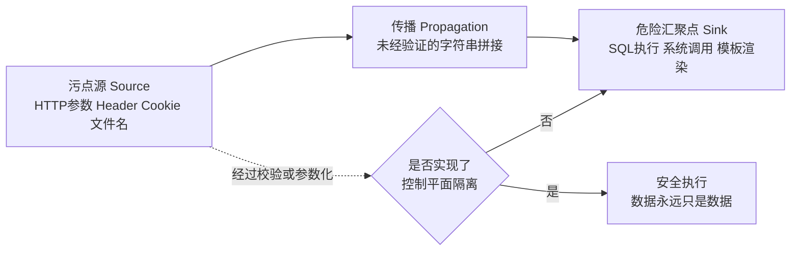
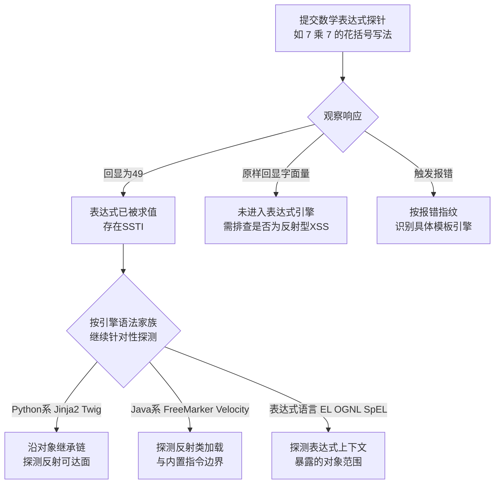
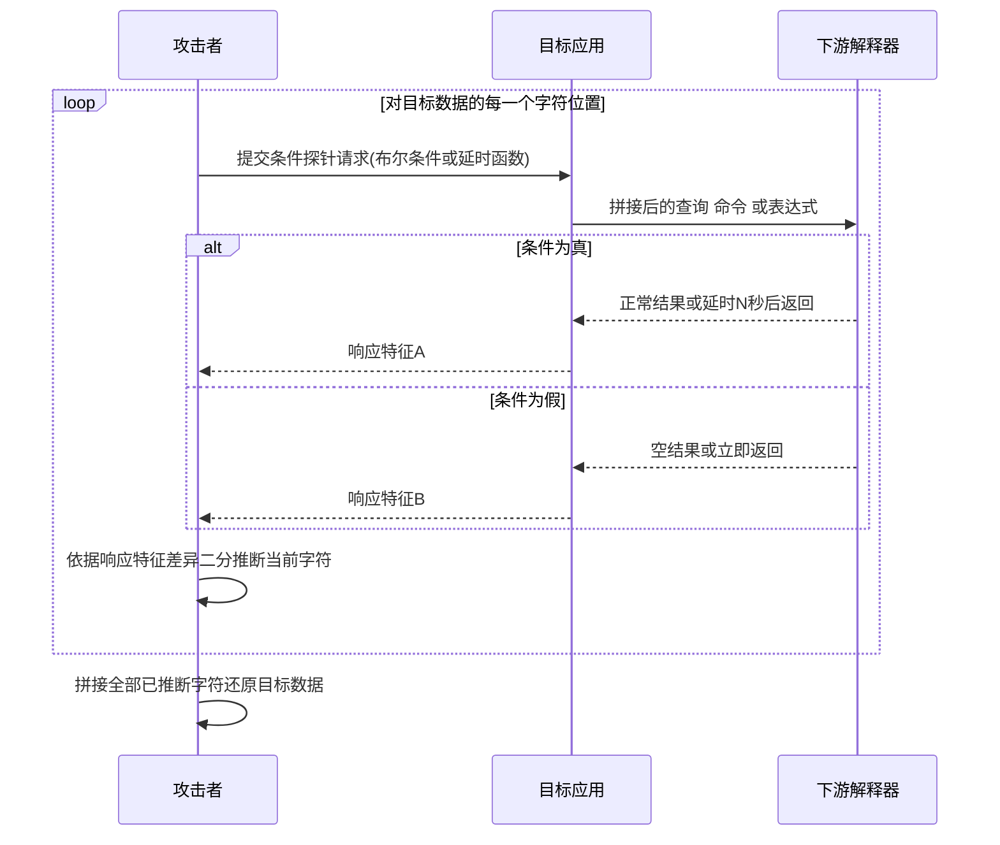
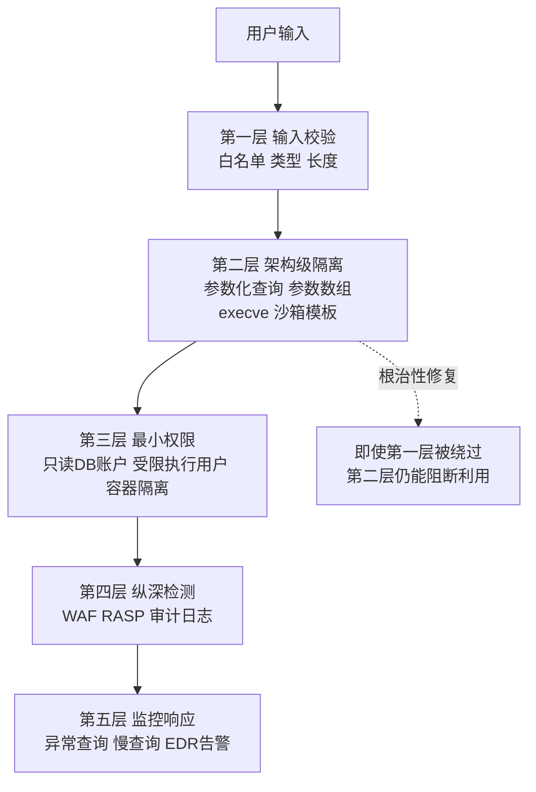

# Web与应用层安全（4）· 注入类漏洞：SQL与命令与模板
> [!abstract] TL;DR
> - 注入的本质是"数据平面"侵入了"控制/语法平面"：下游解释器在解析阶段无法区分用户输入是字面量还是语法元素，攻击者借此篡改语法树、劫持执行流。SQL注入、命令注入、模板注入（SSTI）是同一失效模式在数据库引擎、Shell解释器、模板表达式引擎上的三种具现，原理同构，payload细节不同。
> - 盲注不是SQL的专属技巧，而是一套通用的"单比特信道"提取协议：布尔盲注靠响应差异、时间盲注靠可控延时、带外盲注靠诱导目标主动外连，三者都是把"看不到直接回显"转化为可逐位判定的边信道，能迁移到SQL、命令执行、SSTI乃至更多注入场景。
> - SSTI的杀伤力上限取决于模板引擎的表达能力：图灵完备的逻辑模板（Jinja2/Twig/FreeMarker）能沿宿主语言的对象反射链一路走到任意代码执行，逻辑无关模板（Mustache）从语法设计上就排除了这条路径——这是"设计阶段消灭一整类漏洞"而非"运行时靠黑名单堵漏洞"的范例。
> - 唯一能根治注入的手段是控制平面与数据平面的架构级隔离（预编译语句的值槽机制、exec系列的参数数组、沙箱化的模板渲染上下文），转义和黑名单过滤永远是概率性防御，会被编码变形、上下文误判、反射能力残留等方式绕过。
> - sqlmap、tplmap、commix 等工具的核心价值不是"payload字典"，而是把"探针注入→响应差分→技术路线决策"这套流程自动化了，理解这套流程比背诵某一句payload更能迁移到新场景和新过滤规则。
> - 防御必须分层：输入校验收窄攻击面、架构隔离根治漏洞本身、最小权限限制爆炸半径、纵深检测提供可观测性，四层缺一不可，把WAF当作唯一防线是最常见的架构性错误。

## 概述与定位

注入类漏洞（Injection）指的是应用程序把不可信输入未经充分隔离地传递给下游解释器——数据库引擎、操作系统Shell、模板渲染引擎、LDAP目录服务、XML解析器、日志表达式求值器——而解释器本身没有能力区分"这段字符是需要原样保留的数据字面量"还是"这段字符是需要被解析并执行的语法/指令"。攻击者正是利用这种区分能力的缺失，以数据的名义夹带语法，篡改程序原本的执行意图。这不是某一个具体的漏洞点，而是一整个漏洞家族共享的失效模式（failure mode），理解了这个失效模式，SQL注入、命令注入、模板注入看起来像是同一道题目换了三次皮肤。

在漏洞分类体系里，CWE-74"特殊元素中和不当"（Improper Neutralization of Special Elements）是这个家族的顶层节点，向下派生出CWE-89（SQL注入）、CWE-78（OS命令注入）、CWE-943（NoSQL命令元素注入）、CWE-1336（模板引擎注入）等子类。OWASP Top 10的历次改版也印证了这一分类演进：2010/2013/2017版本里"Injection"长期单独占据A1第一名的位置，到2021版修订为A03:2021-Injection，并把跨站脚本并入这个大类之下——这是分类学层面的合并，因为XSS本质上也是"把数据错当语法喂给了解释器"，只不过解释器换成了浏览器里的HTML/JS引擎。本系列出于教学颗粒度的考虑，仍然把XSS放到独立的第5章处理，本章聚焦服务端的三类解释器：SQL、Shell、模板引擎。

放到本系列的坐标系里看，第2章[[02.HTTP协议安全]]处理的是传输层与协议层的攻击面——即便HTTP被安全地实现、TLS握手无懈可击，应用层业务逻辑对输入的处理仍然可能千疮百孔，这正是本章要往下走的下一层问题。第3章的同源策略、CORS、CSP划定的是浏览器执行环境里"谁能读到谁的数据"这条边界，而本章划定的是服务端"谁的输入能够变成谁的指令"这条边界，两者是完全不同的信任模型，互相不能替代：CSP再严格也挡不住SQL注入，预编译语句用得再彻底也不会顺带获得同源保护。往后看，第5章XSS本质上是"HTML/JavaScript解释器版"的注入——浏览器的DOM解析器和JS引擎在这里扮演了本章说的"下游解释器"角色，只是执行环境从服务端挪到了客户端，原理完全同构，因此XSS独立成章而不在本章重复展开；理解完本章建立的统一模型之后再读XSS一章，会有明显的降维体验。第9章反序列化漏洞讨论的是另一条"数据变代码"的路径，但走的不是文本语法解析而是对象图/字节码重建，触发机制和payload构造方式都不同，本章不涉及，留给专篇处理。

本章的范围界定为三条主线：SQL注入（附带NoSQL注入作横向参照）、操作系统命令注入（含参数注入这一边界情形）、服务端模板注入SSTI（附带与客户端模板注入CSTI的对比）。贯穿三条主线的是盲注方法论——它不是第四条独立主线，而是当SQL、命令、模板三种注入都"看不到直接回显"时共用的信息提取协议，因此单独成节讲清楚它的通用性和可迁移性。

一个值得追问的问题是：注入类漏洞的原理如此清晰、修复方案（参数化、数组传参、沙箱渲染）二十多年前就已确立，为什么它至今仍然稳居各类安全报告的高危榜单？原因大致有四类：教学惯性（大量入门教程和面试题至今还在演示字符串拼接SQL的"能跑就行"写法）；遗留系统改造成本高（老代码里散落的拼接点难以枚举完全，重构涉及回归测试成本）；ORM带来的"安全幻觉"（开发者误以为用了ORM就自动免疫，却忽略了`.raw()`/`.extra()`一类原生SQL逃生舱口）；新技术不断引入新的解释器（每多一种模板引擎、查询DSL、表达式语言，就多一类潜在注入面，模板注入正是Web框架"表达能力膨胀"的副产品，而不是一个旧漏洞的简单重演）。

## 原理与机制

### 解释器、语法与数据的边界

任何解释器——SQL引擎、Shell、模板渲染器——本质上都在执行"词法分析→语法分析→求值"这条流水线：读入一段字符流，尝试从中识别出符合自身语法（grammar）的记号（token）。当应用程序把"数据"和"程序指令"拼接进同一个字符流再交给解释器时，解释器没有任何办法从字符流本身分辨出哪部分是开发者原本想表达的固定语法、哪部分应当被当作不透明的字面量——它只能机械地按自己的语法规则识别token，字符串边界之外没有任何"这是数据、请别当语法看"的元信息传递过去。

这正是LangSec（语言理论安全，Language-theoretic Security）流派反复强调的核心论点：大量"输入验证类"漏洞的根因，不是校验逻辑写得不够严，而是校验发生的位置和解释器真正的解析过程，是两套彼此独立、可能互相不一致的语法实现——校验代码用的是它自己对"合法输入"的理解（往往是一条不完整或过度简化的正则表达式），而真正拥有最终解释权的是下游解释器自身的parser。两者的语法定义只要存在一丝偏差（比如校验只拦截了半角引号却没考虑数据库连接字符集下的宽字节等价形式，或者只拦截了`SELECT`关键字却没考虑大小写混排和内联注释拆词），就是可利用的缝隙。这也是为什么"黑名单过滤特殊字符"这条防线在历史上屡战屡败：黑名单本质上是在用应用层的语法理解去猜测下游解释器的真实语法，猜测和现实之间的每一处偏差都是攻击面。

### 拼接模型与污点传播



这张图可以用经典的污点分析（taint analysis）三元组来精确刻画：source（数据从哪个不可信通道进入——HTTP请求的query string、body、header、cookie、文件名，甚至上游第三方接口的返回值，很多审计只盯着表单字段却忽视了header和上游服务的返回同样是不可信输入）、propagation（数据在函数调用链上如何流转，中途是否经过了任何有效的净化处理）、sink（数据最终被送进了哪个危险API：数据库的`execute`、Shell的`system`/`exec`、模板引擎的渲染函数）。安全审计工具和人工代码审查本质上都在追踪这条source-to-sink路径上是否存在一条未经消毒的边。



### 为什么参数化能从根子上解决问题

预编译语句（prepared statement）把"这条SQL长什么样"和"这次要填什么值"拆成两个独立阶段提交给数据库引擎：先发送只含占位符（如`?`或`:name`）的语句模板，数据库引擎完成词法/语法分析并生成执行计划，此时语法树已经定型；第二阶段发送的参数值不再经过SQL的语法解析器，而是直接按数据类型绑定进已经生成好的执行计划对应的槽位。即便参数值里包含单引号、分号、注释符，它们也只是字符串这个数据类型里的普通字符，根本没有机会被送进语法分析器重新解析——不是"转义掉了危险字符"，而是这些字符从一开始就没有获得被当成语法看待的通道。这个区别很关键：转义是"先污染、再清洗"，参数化是"物理上从未给污染留出通道"。

命令执行的对应做法是使用exec系列函数的数组参数重载（如Python的`subprocess.run(["ls", user_input])`而不是`os.system("ls " + user_input)`）：传入参数数组时，操作系统直接把每个数组元素作为一个不可分割的参数传给目标进程，压根不经过Shell的语法解析，也就不存在分号、管道被重新解释的可能。模板引擎的对应做法是把用户数据当作渲染上下文里的一个变量值传入，而不是把用户数据本身拼接成模板源码字符串再编译执行——这条边界一旦被打破（把用户输入直接喂给`render_template_string()`或`Template(user_input)`这类"以字符串为模板源"的API，而不是作为渲染变量传入固定模板），无论模板引擎设计得多精巧都难以幸免。三种技术栈用的手段名字不同，但骨子里是同一个思路：把"值槽"和"语法结构"从物理上分开提交，让求值器压根不给数据翻身做语法的机会。

### 信任边界穿越与二阶注入

注入常常发生在数据"跨语境"的那一刻——同一份数据在被写入时可能是安全的（比如经过了当前上下文匹配的转义或参数化），但被读出后在另一个完全不同的解释器上下文里使用时，之前做的处理不再适用甚至从未针对新场景生效，这就是二阶注入（second-order injection）。举例：用户注册时填写的昵称先被参数化安全地写入了数据库；某个后台报表脚本之后把这个昵称字段读出来，又拼进另一条动态构造的统计SQL或者一条要执行的Shell归档命令里——写入路径的"安全"给了开发者错误的信心，真正的风险出现在完全不同的第二次使用现场。理解了这一点，安全审计就不能只问"这个字段有没有做参数化"，而要追问这个字段在整个生命周期里流经的每一处sink，是否都做了与该sink语境匹配的隔离处理，这也是很多"看起来做了防护却依然被打穿"的案例的共同根因。

## 注入向量与利用技术详解

### SQL注入深度剖析

按能否直接观察到查询结果，SQL注入通常分为六类。联合查询注入（UNION-based）利用`UNION SELECT`把攻击者选定的数据拼接进原查询的结果集里直接回显；报错注入（error-based）利用数据库在处理格式错误的函数调用时会把内部计算结果暴露在报错信息里这一特性，例如MySQL经典的`extractvalue()`/`updatexml()`在xpath参数格式非法时会把子查询结果打印在错误消息里；布尔盲注和时间盲注见下一节统一讲解；带外注入（OOB）通过DNS或HTTP协议让数据库主动把子查询结果编码进域名或URL发起出站请求，常见于具备网络能力的内建过程（如MSSQL的`xp_dirtree`、Oracle的`UTL_HTTP`/`UTL_INADDR`）；堆叠查询（stacked queries）用分号分隔，在同一次请求里注入并执行完全独立的第二条语句，杀伤力最大，因为不再受限于第一条语句必须是`SELECT`等特定类型，可以是任意DDL/DML甚至用来调用具备系统命令执行能力的存储过程；二阶注入见上一节。

不同数据库方言在语法细节上差异明显，这也是同一份payload换个数据库就失效的常见原因：

| 数据库 | 行内注释 | 字符串拼接 | 时间延迟函数 | 堆叠查询 |
|---|---|---|---|---|
| MySQL | `-- `（注意尾随空格）、`#`、`/* */` | `CONCAT(a,b)` | `SLEEP(5)` | 取决于驱动，PDO多语句需显式开启，多数Web层默认单语句 |
| PostgreSQL | `--`、`/* */` | `a \|\| b` | `pg_sleep(5)` | 原生支持，`;`分隔 |
| MSSQL | `--`、`/* */` | `a + b` | `WAITFOR DELAY '0:0:5'` | 原生支持 |
| Oracle | `--`、`/* */` | `a \|\| b` | `DBMS_LOCK.SLEEP(5)`（需权限）或`DBMS_PIPE.RECEIVE_MESSAGE` | 不支持（单语句限制） |
| SQLite | `--`、`/* */` | `a \|\| b` | 无内建sleep，常用大数据量递归查询模拟延时 | 取决于调用API |

数字型注入与字符型注入的语法差异同样值得厘清：当参数在原始SQL里以不带引号的数字上下文出现（如`WHERE id=1`）时，payload不需要先闭合任何引号就能直接追加逻辑；当参数出现在带引号的字符串上下文（如`WHERE name='admin'`）时，payload必须先用一个引号把原本的字符串字面量闭合掉，否则后续注入的语法会被解释器当成字符串内容的一部分而失效。这也是为什么教学示例里经典的`' OR '1'='1`能生效，前提是它假设了参数处在字符串上下文；如果目标恰好是数字上下文，正确的探测payload反而应该是不带引号的`OR 1=1`——理解这层语境差异，比死记某一句payload重要得多，这也是本章反复强调"统一模型优先于具体payload"的原因。

ORM（对象关系映射）框架的初衷是让开发者以面向对象的方式操作数据库而避免手写SQL，标准用法（如Django的`Model.objects.filter()`、SQLAlchemy的`session.query()`、Hibernate的Criteria API）确实天然走参数化路径。但几乎所有主流ORM都留了"原生SQL逃生舱口"以应对复杂查询场景：Django的`.raw()`和`.extra()`、SQLAlchemy的`text()`配合手工字符串拼接、Hibernate的HQL/原生SQL查询接口、Rails ActiveRecord的`find_by_sql`和字符串插值写法的`where`子句。这些逃生舱口一旦被误用为字符串拼接，ORM提供的保护会被完全绕开，而开发者往往因为"用了ORM"而放松警惕，形成典型的审计盲区。

NoSQL数据库同样存在结构注入面，值得横向参照理解。以MongoDB为代表的文档数据库用JSON/BSON文档表达查询条件，当应用把用户输入直接反序列化进查询对象而不做类型/结构校验时，攻击者可以构造包含`$ne`、`$gt`、`$regex`等查询操作符的输入（例如一个原本期望是字符串密码的字段被传入等价于"不为空"的操作符结构），使比较逻辑从"字符串相等"退化为永真式判断，从而绕过身份校验；如果目标还开放了允许内嵌JavaScript表达式的查询子句，则可以直接注入任意JS逻辑，破坏力与SQL的堆叠查询相当。这说明"不是关系型数据库"不等于"没有注入面"，只要存在"用户输入能够影响查询结构本身"这个模式，注入就有可能发生。

### 命令注入深度剖析

当应用需要调用外部程序完成某个功能（转码图片、执行网络诊断、调用系统工具处理文件）时，如果实现方式是把用户可控字符串拼接进一条完整的命令行文本再交给Shell解释执行（C的`system()`、PHP的`shell_exec()`/反引号、Python的`os.system()`或`subprocess.run(cmd, shell=True)`、Java的`Runtime.exec(String)`单字符串重载），Shell在解释这条命令行文本时会完整按照自身语法规则处理所有元字符——这些元字符原本是Shell提供给交互式用户的批处理能力，此刻却被攻击者用来在预期的单条命令之外拼接执行任意的第二条命令。

| 元字符 | Shell语义 |
|---|---|
| `;` | 顺序执行下一条命令 |
| `&&` / `\|\|` | 前一命令成功/失败后再执行下一条 |
| `\|` | 管道，前一命令输出作为后一命令输入 |
| 反引号或`$()` | 命令替换，先执行内层命令再把输出拼回外层 |
| `&` | 后台执行 |
| 换行符 | 等价于开始新的一条命令 |
| `>`、`>>`、`<` | 输出、追加、输入重定向 |

命令注入与参数注入（argument injection）是需要区分的两种情形。命令注入指攻击者注入了全新的命令；参数注入则是更隐蔽的变体——即便应用严格使用数组参数重载调用exec系列函数（完全不经过Shell解析，看似安全），如果用户输入被原样作为其中某一个参数值传入，而这个参数恰好被目标程序自身解释为一个"选项/开关"而非"数据"，同样可以造成越权行为。典型例子是把用户可控文件名传给`git`、`curl`、`tar`等命令行工具时，如果输入以短横线开头，会被目标程序自身的参数解析器当成命令行选项而非文件名处理，某些选项本身就具备读写任意文件甚至间接执行命令的能力。这提示我们：数组参数重载解决的是"Shell语法层"的注入，解决不了"目标程序自身参数语法层"的注入，防御时还需要对用户可控参数做前缀校验，或显式插入`--`分隔符告知目标程序后续内容一律按位置参数处理。

命令执行的结果往往不会直接体现在HTTP响应里——很多触发点是异步的后台任务、日志处理、定时脚本——这种情况下时间盲注和带外技术是主要的探测手段：通过让注入的命令产生一次可被外部观测的副作用（可控延时造成响应时间的规律性变化，或诱导目标主动发起一次DNS/HTTP出站请求），间接确认命令确实被执行。

与SQL注入相比，命令注入的破坏力量级明显更高：SQL注入即便升级到最严重的堆叠查询/存储过程调用，执行权限也天然被限制在数据库账户的权限边界内（理论上可以配置为最小权限，尽管实践中很多系统图省事直接用了拥有者甚至管理员账户）；命令注入则直接落地到操作系统层面，执行权限等同于运行该服务进程的操作系统用户，一旦得手往往直接对应远程代码执行这个最高等级的后果，这也是命令注入在CVSS评分体系里几乎总是拿到临界满分的常见原因。

### 模板注入 SSTI 深度剖析

模板引擎存在两种设计哲学。逻辑完备（logic-full）模板引擎把模板语言设计成一门功能齐全、图灵完备的表达式语言，支持变量运算、条件分支、循环，甚至直接调用宿主语言对象的方法——Jinja2（Python）、Twig（PHP）、FreeMarker/Velocity（Java）、ERB（Ruby）都属于此类，选择这条路线是为了让模板作者能直接在模板里完成复杂的展示逻辑而不必每次都改动后端代码。逻辑无关（logic-less）模板引擎反其道而行——以Mustache为代表，刻意在语法层面移除复杂条件表达式和任意方法调用能力，只保留最基础的变量替换、区块、循环这几种受限结构，理念是"表现层不应该有能力表达任意逻辑"。这不是能力不足，而是安全与关注点分离两方面共同驱动的设计选择，从语法上直接切断了SSTI能够利用的表达式求值通道，是典型的"通过设计消灭一整类漏洞"而非"依赖运行时过滤器堵漏洞"的思路。

SSTI与CSTI需要严格区分。服务端模板注入（SSTI）发生在服务端渲染阶段，攻击者输入被当成模板源码的一部分参与服务端的模板编译/求值，后果通常直接是服务端远程代码执行；客户端模板注入（CSTI）则是前端框架（历史上最著名的是早期AngularJS的双花括号表达式绑定）在浏览器里对用户可控字符串做二次表达式求值，本质是一种JS沙箱逃逸而非服务端代码执行，后果通常停留在XSS这个量级。两者探测语法看起来相似，但根本原理和后果完全不在一个量级，审计时必须先确认求值究竟发生在服务端还是客户端。

| 模板引擎 | 语言 | 表达式定界符 | `{{7*7}}`探针典型表现 |
|---|---|---|---|
| Jinja2 | Python | `{{ }}` | 渲染为`49` |
| Twig | PHP | `{{ }}` | 渲染为`49` |
| FreeMarker | Java | `${ }` | 渲染为`49` |
| Velocity | Java | `#set`/`$` | 需写成`#set($x=7*7)$x`形式 |
| Smarty | PHP | `{ }` | 渲染为`49`，但花括号也是原生语法，容易和普通文本冲突 |
| ERB | Ruby | `<%= %>` | 渲染为`49` |



最经典也最通用的探测手段是数学表达式探针：向所有可疑输入点（不只是表单，也包括会被后台用来生成报表、发送邮件、渲染PDF、拼接文件名等"看不见但确实会被模板渲染"的字段）提交类似`{{7*7}}`（或按目标语言习惯尝试`${7*7}`、`#{7*7}`、`<%= 7*7 %>`等变体）的探针，纯粹依据数学运算这一事实：如果响应里出现运算结果`49`，说明这段文本确实进入了某个具备表达式求值能力的引擎并被执行；如果原样出现字面量未被改动，说明这段文本要么完全没有进入任何模板渲染流程，要么进入的是不支持表达式的纯文本占位符替换；如果触发服务端报错，报错信息本身的措辞（不同模板引擎的异常类名、调用栈风格都不一样）往往能反过来帮助指纹识别具体是哪一种引擎，从而决定后续该按哪一种引擎的语法继续深入探测。

从表达式执行升级到远程代码执行的路径，其原理值得讲清楚而不必给出可直接复制粘贴的成品链条。以Jinja2为例，其"沙箱"环境即便移除了`__import__`等被列入黑名单的名字，Python对象体系仍然保留完整的自省能力：任意对象都能通过特殊属性拿到自己的类型对象，类型对象又能沿继承链拿到几乎所有类最终收敛到的顶层基类，而这个顶层基类具备枚举"当前进程里所有已加载子类"的能力，相当于一份粒度极细的全局对象索引。攻击者要做的只是在这份索引里找到一个用得上的类——例如某个初始化时会执行子进程、读写文件或调用系统调用的类，再通过其构造函数或某个方法间接触发。因为整条链路全部由属性访问和函数调用组成，不包含任何被沙箱显式拦截的关键字标识符，纯粹基于字符串关键字的黑名单天然拦不住它。这也是为什么Jinja2官方文档明确说明其沙箱环境只是"降低意外错误的门槛"而不是一个可信的安全边界——只要目标语言的反射/内省能力没有被真正切断，这条路径理论上总能找到出口，只是"具体能用上哪一个类"因运行时已加载的模块集合而异。

Java生态里的等价物是OGNL（Object-Graph Navigation Language，因Struts2一系列CVE如S2-045/S2-046/S2-057而广为人知）和Spring表达式语言SpEL，它们的暴露面往往不是"用户输入直接变成了模板文件本身"，而是框架把某个本应只做数据绑定的表达式上下文暴露给了用户可控输入（例如把HTTP参数名或文件上传的某个请求头拼接进了内部表达式上下文求值），原理和Jinja2的对象图遍历高度相似——只要表达式语言具备访问宿主语言反射/内省能力的通道，安全边界就要靠宿主语言层面真正切断反射能力或者物理隔离渲染环境，而不能指望在表达式字符串上做关键字黑名单过滤。

顺带一提日志处理场景下的表达式注入。2021年披露的Log4Shell（CVE-2021-44228）虽然不是传统意义上的模板注入，但共享同一套底层危险模式：某广泛使用的Java日志库的查找功能允许日志内容里出现一段类似目录服务查找的表达式并在记录日志时被自动求值发起网络查找，攻击者只需要让任意会被记入日志的字段（User-Agent头、用户名，甚至一次登录失败携带的参数）包含这个表达式，就能在日志框架内部触发一次远程类加载，后果等同于远程代码执行。它提醒我们注入面不止存在于"看得见的模板渲染函数"，任何嵌入了表达式求值能力的组件（日志库、序列化库、报表引擎、规则引擎）都可能是潜在注入点，审计时要有意识地追问"这个组件是否会对我不完全信任的字符串做二次求值"。

### 盲注：跨注入类型的统一提取协议

当注入点存在，但应用的响应不会把查询/命令的执行结果直接回显出来时——页面固定返回同一模板、只是内容或状态码/响应时间发生了难以察觉的变化，或者干脆没有任何同步响应——攻击者不能再用"直接读结果"的方式提取数据，需要退化为一套更原始但普适的方法：把每一次请求都设计成回答一个是/否问题，靠多次请求逐比特地把目标数据重建出来。这套方法论不关心底层是SQL、Shell命令还是模板表达式，只要能构造出"条件为真"和"条件为假"两种可观察差异的payload，就能套用，这正是它值得单独成节、而不是被塞进SQL注入子节里的原因。

布尔盲注构造一对逻辑等价但真值相反的条件表达式注入进原查询/命令/表达式里，观察应用对两种情况是否呈现出可稳定复现的响应差异——可能是页面内容的细微不同、可能是HTTP状态码不同、也可能是响应体长度的固定几字节差异。一旦确认存在这种可观察的差异信道，就可以把"某个字符是否等于某个猜测值"转成一个条件表达式，通过二分查找不断缩小猜测范围来逐字符重建目标字符串。

时间盲注用于两种真值情况在内容、状态码、长度上完全没有可观察差异的场景（这种"完全盲"并不少见，尤其是写入型注入点或异步处理场景）：在条件为真的分支里插入一个已知耗时的函数调用（数据库的延时函数、命令执行里的`sleep`），条件为假则没有额外延时，通过测量响应耗时的统计分布（而非单次测量，因为网络抖动、服务端负载波动都可能造成假阳性，需要多次采样取中位数或设置足够大的时间差保证信噪比）来推断条件真假。

带外盲注用于连响应时间都无法稳定观察的场景（比如注入点在一个完全异步的消息队列消费者里，HTTP请求早已返回，真正的查询在几秒后的后台任务里才执行，前端连接早就断开无从测量）：把要外带的数据编码进一个域名标签（DNS查询几乎不受任何出站防火墙限制，是最常用的OOB信道）或一个HTTP请求的URL路径里，一旦攻击者控制的服务器收到了这次回连请求，其中编码的内容就是要提取的数据本身——这一步依赖的HTTP请求-响应模型细节可参见[[71.详解网络协议/18.HTTP-HTTPS协议]]。本质上是把"我看不到你的响应"转化为"我让你自己把结果发给我"。



盲注的效率可以量化：

```
设字符集大小为 K（如可打印ASCII约94个字符，十六进制字符K=16）
定位单个字符最坏情况需要 ceil(log2(K)) 次二分查询
提取长度为 N 的字符串总请求数约为 N × ceil(log2(K))
示例：提取一枚32位十六进制MD5哈希
    32 × log2(16) = 32 × 4 = 128 次请求起步
    实际还需叠加：探测字符串总长度的开销、时间盲注对抗网络抖动的重复采样开销、
    以及触发限流或WAF拦截后的规避重试开销
```

这也是为什么盲注场景几乎离不开自动化工具——手工执行成百上千次带精确时间控制的请求并统计响应是不现实的，这直接引出下一节的工具视角。

## 工具视角与实战

### sqlmap：把盲注的二分查找自动化

sqlmap的核心流程可以拆成三个阶段。第一阶段是指纹识别：通过发送一组无害的探测请求，根据报错措辞、函数支持情况、版本查询结果确定目标数据库的类型和版本。第二阶段是技术选择：通过`--technique`参数控制启用哪些注入技术的组合（布尔盲注、报错注入、联合查询、堆叠查询、时间盲注、内联查询），工具会按照优先级依次尝试，找到第一种能稳定复现真假差异的技术后固定下来复用，这一步本质上就是把上一节讲的"响应差分"判定逻辑自动化了。第三阶段是数据提取：一旦确定了可用技术，后续对`information_schema`等元数据表的遍历、对目标数据的逐字符提取，都是重复调用同一套差分判定逻辑，区别只是每次构造的条件表达式不同——这正是布尔盲注复杂度公式在实践中的样子。`--risk`和`--level`两个参数分别控制探测的"烈度"（是否尝试可能修改数据或有更强副作用的payload）和"广度"（是否测试更多注入点位置，如Header、Cookie、少见的参数组合），`tamper`脚本则用于把payload做编码或空白符替换等变形以绕过基于特征签名的检测——这里需要澄清一个常见误解：tamper脚本变的是payload的"外观"，不是漏洞的"本质"，它绕过的是签名匹配这一层检测，注入点是否真实存在这件事不会因为加了tamper脚本而改变。理解了这三段流程，就能明白sqlmap不是一个"payload字典"，而是一台把响应差分判定自动化、循环执行的状态机。

### commix 与 tplmap：同一思路在不同解释器上的复刻

commix面向命令注入，同样区分经典回显型、基于求值的、基于时间的、基于文件写入的盲打几种探测技术，架构思路和sqlmap高度一致，只是把"下游解释器"从数据库换成了Shell。tplmap面向SSTI，自动化了上一节讲的探针提交与引擎指纹识别流程，并在确认引擎类型后尝试沿着已知的表达式语言特性升级到代码执行。三者放在一起对照，能更直观地体会本章反复强调的"统一模型"：探针注入、响应差分、技术路线决策这套流程是不变的，变的只是目标解释器的语法方言。

### 手工验证与流量分析

自动化工具擅长大范围扫描，但精确的手工验证仍然离不开对原始请求/响应的直接观察——用代理工具拦截并重放请求、逐字节比对不同payload下响应体的差异、观察响应时间的分布，这部分实战技巧和抓包分析是共通的，可参见[[72.抓包与协议分析实战/04.HTTP与HTTPS抓包与中间人分析]]中间人分析部分。Burp Suite在其中承担的角色（Intruder做payload位置爆破与响应差分聚类、Repeater做手工请求重放验证、被动扫描识别常见注入特征）会在第13章[[13.Web漏洞工具链：BurpSuite]]专篇详细展开，本章不重复。

### 白盒代码审计视角

代码审计定位注入点时，核心是搜索"字符串拼接"与"危险sink API"的交汇处：SQL方向重点检查是否存在把请求参数直接嵌入SQL文本再传给`Statement`（而非`PreparedStatement`）、`cursor.execute()`传入已拼接好的字符串（而非传参数元组）、ORM的`.raw()`/`.extra()`/`text()`等原生SQL逃生舱口是否被拼接调用；命令执行方向重点检查`Runtime.exec(String)`单字符串重载、`subprocess`系列函数是否显式传了`shell=True`、`os.system()`/`os.popen()`的调用点；模板方向要特别注意区分"用户输入是渲染上下文里的一个变量值"还是"用户输入本身被当成了模板源码字符串"——后者典型表现为`render_template_string(request.args.get(...))`或`Template(user_input).render()`这类API调用模式，这是SSTI审计中最值得优先排查的信号，因为它意味着用户输入已经越过了"数据"和"模板代码"之间本应存在的边界。

### SAST与污点分析工具

Semgrep、CodeQL一类静态分析工具把上面讲的人工审计经验形式化为source/sink/sanitizer三元组规则：定义哪些API是source（如各类Web框架读取请求参数的入口）、哪些API是sink（数据库执行、命令执行、模板渲染）、哪些函数调用可以视为有效的sanitizer（参数化占位符函数、白名单校验函数），再做过程间（inter-procedural）数据流分析，判断是否存在一条从source到sink、且中途未经过sanitizer的路径。这类工具的价值在于能在CI流水线里对每一次代码提交做自动化拦截，比人工审计更适合覆盖大型代码库和高频迭代场景，代价是规则集需要针对项目实际使用的框架和ORM做持续维护，否则会有大量误报或漏报。

### 模糊测试与差分测试视角

把注入检测抽象成差分测试会更容易理解工具的底层逻辑：对同一个输入点发送一组变体（基线值、单引号、双引号、反斜杠、百分号、花括号等元字符），用响应的状态码、长度、渲染内容做聚类，自动标记出"响应显著偏离基线"的位置作为疑似注入点——这正是sqlmap/tplmap底层探测逻辑的简化模型。理解到这一层，就能看清所有这些工具本质上都是同一套"差分测试+自动化状态机"思路的不同外壳，工具之间的差异更多在于对目标解释器语法方言的覆盖广度，而不是探测思路本身有什么根本不同。

## 安全性与正确使用

### 防御分层



五层防御各司其职，缺一不可，且顺序不能颠倒着理解。输入校验（第一层）用白名单而不是黑名单约束类型、格式、长度，作用是收窄攻击面、提前拒绝明显异常的输入，但它不能替代下一层，因为校验代码对"合法输入"的理解和下游解释器的真实语法之间永远可能存在偏差。架构级隔离（第二层）是真正根治漏洞本身的一层：预编译语句/参数化ORM查询、exec系列的参数数组传参、模板引擎的沙箱化渲染环境，把控制平面和数据平面在物理上分开，即便第一层校验被绕过，这一层依然能阻断利用——这也是为什么它被标注为"根治性修复"。最小权限（第三层）假设前两层都可能失守，通过按功能拆分数据库账户（只读、只写、管理分离）、用受限系统用户或容器/沙箱运行外部命令，把万一被利用后的爆炸半径压到最小。纵深检测（第四层）包括WAF、RASP、审计日志，提供的是检测和缓释能力，签名可以被编码变形绕过（前面SSTI一节也提到过黑名单可以被对象图遍历绕过），因此不能替代代码层面的修复，只能作为额外的一道防线争取响应时间。监控与响应（第五层）通过数据库审计日志、异常查询模式识别（如非预期的`information_schema`查询、异常的联合查询结构、慢查询突增）、命令执行的系统调用监控，提供事后可观测性和取证能力。

### 常见误区与陷阱

有几类误区在实际项目里反复出现。第一是"用了ORM就天然安全"的错觉，前面已经讲过ORM的原生SQL逃生舱口同样可以被拼接误用。第二是转义不完整导致的历史陷阱，其中最经典的是宽字节注入：当数据库连接层使用GBK等宽字节字符集，而转义函数只是简单地在单引号前加一个反斜杠时，攻击者可以构造一个高字节，配合紧随其后的反斜杠恰好被GBK解码器"吃掉"、拼成一个双字节汉字，这样紧跟其后的单引号就重新恢复了闭合字符串的能力——这是字符编码层和转义逻辑层"对语法理解不一致"的经典案例，和前面LangSec的论点完全对应，也提醒我们转义必须和连接层实际使用的字符集匹配，而不能想当然地按照单字节ASCII的假设去写转义函数。第三是把校验完全放在客户端，服务端不做任何二次校验，任何客户端校验都只是用户体验优化，不能作为安全边界。第四是部署了WAF就当作根治方案、告警日志无人查看，前面已强调WAF是纵深防御的一层而非替代品。第五是遇到SQL标准本身不支持参数化的场景（动态表名、动态列名——SQL的参数绑定机制只能替换值，不能替换标识符）时，退回到直接拼接标识符，正确做法是维护一份严格的白名单枚举，只允许命中白名单的标识符通过，再配合目标数据库方言的标识符转义规则处理，而不是自造一套转义逻辑。

> [!caution] 合规边界
> 本文所述的探测方法、payload结构、工具原理，仅可用于你自己拥有或已获得书面授权的系统、CTF靶场（如DVWA、sqli-labs、PortSwigger Web Security Academy等专门用于安全学习的实验环境）与安全研究场景。文中出现的示例（如经典的条件恒真判断、数学表达式探针、对象反射链的原理性描述）均以教学为目的，用于说明漏洞成因和检测方法论，不构成可直接对真实生产系统或他人系统使用的完整武器化利用链，本文也不为绕过任何商业软件的授权机制提供帮助。将这些技术用于未经授权的系统属于违法行为，请始终在合法、授权的边界内开展安全研究和测试工作。

## 小结

SQL注入、命令注入、模板注入表面上分属三个完全不同的技术栈，但共享同一个病根：数据平面侵入了控制/语法平面，下游解释器无法分辨用户输入的意图边界。理解了这一个统一模型，再看三种注入的具体payload只是"同一道题目在不同语法方言下的表达"，比逐一记忆各类payload更能举一反三，也更能迁移到未来出现的新解释器、新框架。盲注方法论进一步说明，即便攻击面被压缩到"看不到直接回显"，信息论意义上的单比特信道依然存在，布尔、时间、带外三种手段只是在不同的可观察性约束下选择不同的边信道。修复优先级上，架构级隔离永远应该排在输入校验和纵深防御之前——校验和过滤只能降低触发概率，唯有把控制平面和数据平面在物理上分开，才能让漏洞类别本身不复存在。下一章要讲的XSS，本质上是这套原理在浏览器端HTML/JS解释器上的镜像，带着本章建立的心智模型去看，会发现绝大多数概念可以直接复用。

## 相关阅读

- [[01.Web安全全景与威胁模型]]
- [[02.HTTP协议安全]]
- [[05.XSS跨站脚本]]
- [[09.反序列化漏洞]]
- [[11.API与GraphQL安全]]
- [[13.Web漏洞工具链：BurpSuite]]
- [[71.详解网络协议/18.HTTP-HTTPS协议]]
- [[71.详解网络协议/15.TLS协议]]
- [[30.Windows认证与生物识别编程/08.WebAuthn与FIDO2与passkey编程]]
- [[72.抓包与协议分析实战/04.HTTP与HTTPS抓包与中间人分析]]
- [[37.密码学/62.协议误用与密码工程]]
- OWASP Top 10:2021 — A03:2021 Injection
- OWASP Testing Guide — SQL Injection / Command Injection / Server Side Template Injection 相关测试用例
- CWE-89（SQL注入）、CWE-78（OS命令注入）、CWE-943（NoSQL命令元素注入）、CWE-1336（模板引擎注入）
- PortSwigger Web Security Academy — SQL injection / OS command injection / Server-side template injection 专题实验室
- 《SQL注入攻击与防御》（SQL Injection Attacks and Defense）

[[00.Web与应用层安全总览|⬆ 系列总览]] | [[03.同源策略与CORS与CSP|← 上一章]] | [[05.XSS跨站脚本|→ 下一章]]
