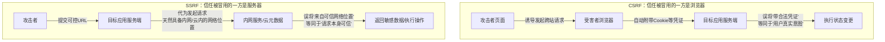
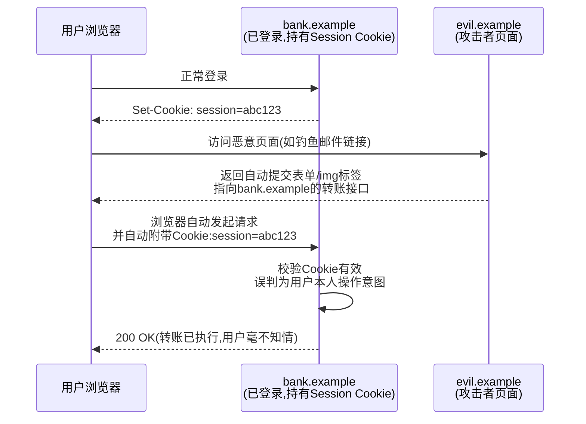
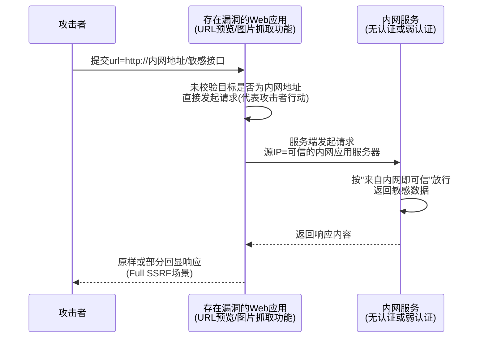
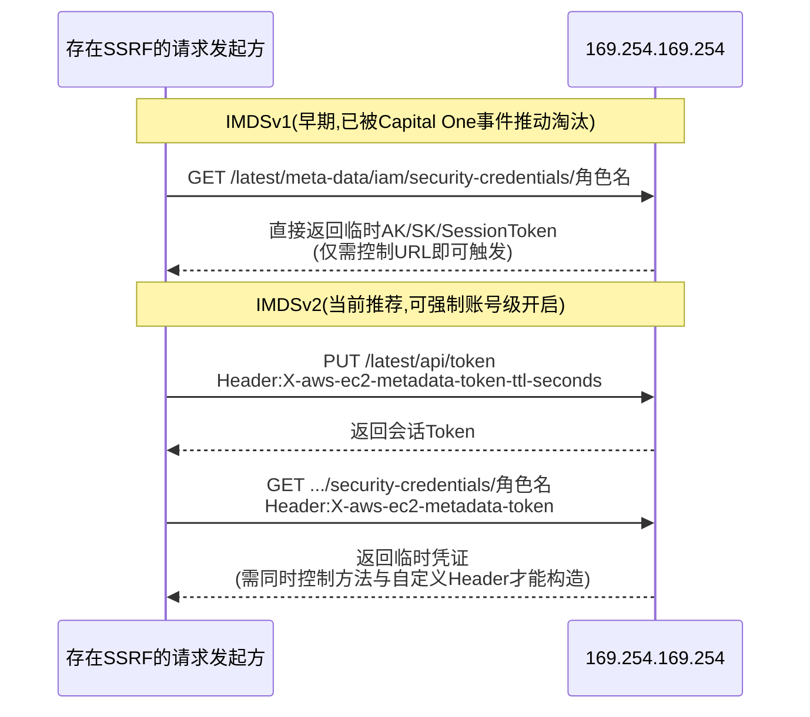
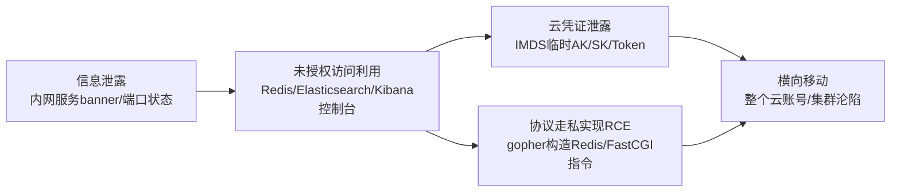
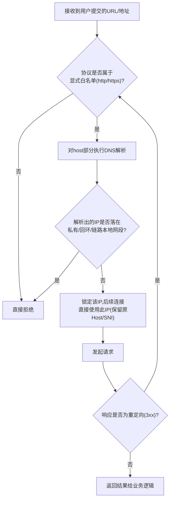

# Web与应用层安全（6）· CSRF与SSRF
> [!abstract] TL;DR
> - CSRF 与 SSRF 共享同一个底层逻辑缺陷——把"请求的发起来源"误当成"可信身份"本身，只是被冒用的信任载体不同：CSRF 冒用的是浏览器自动附带的用户身份凭证（Cookie），SSRF 冒用的是服务器自身的网络位置（"能连到我=你是自己人"）。
> - 同源策略从一开始就只管跨域"读"、不管跨域"发"——`<form>`/``/`<script>` 天生就能跨域发起请求，这个设计缺口是 CSRF 存在的根本原因；SameSite Cookie（Chrome 80 起默认 Lax）是二十多年后才补上的浏览器层默认防线，但防不住同站攻击，也防不住业务自己把状态变更逻辑挂在 GET 上。
> - SSRF 的黑名单防御几乎注定失效：同一个 IP 至少有十进制整数、八进制、十六进制、省略段、IPv6 映射地址等五六种等价书写法，DNS Rebinding 还能让"校验时"和"连接时"解析出完全不同的 IP——协议白名单+DNS解析后按IP校验+连接锁定IP，是目前唯一站得住脚的方案。
> - 云元数据服务把"进程能连通 169.254.169.254（阿里云是 100.100.100.200）"当作唯一的信任凭证，这个假设一旦被 SSRF 击穿就能直接拿到实例的临时云凭证；2019 年 Capital One 逾一亿条记录泄露，正是 WAF 组件的 SSRF 漏洞与 IMDSv1 协同作案的后果，直接推动了 AWS 对 IMDSv2（PUT 取 Token、强制自定义 Header、跳数限制）的强制普及。
> - IMDSv2 式"要求 PUT/自定义 Header"的防护本质是抬高攻击者对请求方法与 Header 的可控粒度门槛，能挡住绝大多数只能控制 URL 的"傻瓜式" SSRF/CSRF/XXE，但对能完整模拟 HTTP 客户端行为的高阶 SSRF 并非银弹。
> - gopher 协议能把 URL 编码的任意字节流原样发给目标 TCP 端口，让 SSRF 从"看得到内网"升级为"能对内网服务下达任意协议指令"，是打穿 Redis/FastCGI 实现 RCE 的关键跳板，这正是 SSRF 防御必须把协议收窄到 http/https 白名单、而不能沿用 HTTP 客户端库默认支持的一整套协议列表的原因。

## 概述与定位

跨站请求伪造（Cross-Site Request Forgery, CSRF/XSRF）与服务端请求伪造（Server-Side Request Forgery, SSRF）经常被并列在同一章讲授，不是因为两者的攻击载荷或利用手法相似，而是因为它们是同一类逻辑缺陷在两个不同信任主体上的复现：**把"请求从哪里发出、携带了什么凭证"当成了"这个请求代表谁的真实意图"**。这类问题在安全工程理论里有一个更早、更通用的名字——"受骗的代理人问题"（confused deputy problem，Norm Hardy 于 1988 年提出）：一个拥有合法权限的中间角色被外部输入诱导，用自己的权限去执行了本不该执行、也未经真正授权方同意的操作。CSRF 里这个"受骗的代理人"是用户的浏览器——它诚实地执行了"跨站请求要带上对应域的 Cookie"这条规则，却不负责判断这次请求是不是用户本人真正想做的事；SSRF 里这个代理人是服务器本身——它诚实地执行了"用户给了一个 URL，我就去请求它"这条业务逻辑，却不负责判断这个 URL 最终指向的是外部资源还是本该被隔离的内部资产。

两者的作案手法因此有一个根本性的分野：CSRF **需要受害者参与**——必须有一个已经登录、且被诱导访问恶意页面或点击恶意链接的真实用户，攻击链条挂靠在"浏览器"和"用户行为"上；SSRF 往往**不需要任何受害者**——攻击者直接把恶意 URL 提交给存在漏洞的服务端功能（图片抓取、Webhook、URL 预览、PDF 生成……），服务器自己就是那个会发起请求的"受害者"。这个差异直接决定了两者的可利用性和危害量级：CSRF 的影响范围受限于"能骗到多少用户点击"，且往往局限在应用自身的业务操作范围内；SSRF 一旦触发就是服务器视角的网络访问，天然具备访问内网、绕过防火墙、触及云基础设施控制面的能力，随着云原生、容器编排、微服务架构的普及，SSRF 的危害半径被显著放大——这也是本章把"云元数据"作为与 CSRF、SSRF 并列的第三个核心议题单独强调的原因：云元数据服务是当下 SSRF 造成实际重大损失最集中的落点。

这一走向在 OWASP Top 10 的编年史里能看到清晰的印证：CSRF 曾是 2007、2010 年版的 A5，2013 年版的 A8，是历史上的"常驻成员"；但到 2017 年版，OWASP 直接把它从独立条目中移除——理由是彼时主流框架（Rails、Django、Spring、ASP.NET）已经普遍内置默认开启的 CSRF 防护，加上现实扫描数据显示的暴露率已经降到很低，作为独立分类继续保留的边际教育价值下降。SSRF 则恰恰相反：它在 2017 版里根本不存在，却在 2021 版里作为全新的 A10 首次登场——官方说明特别提到这是社区调研投票的结果，行业从业者主动把它标记为"数据显示暴露率不高、但一旦命中危害极高、且随基础设施演进持续恶化"的类型，云托管、容器化、微服务之间大量的内部 HTTP 调用正是这个判断的现实依据。一升一降之间，讲的是同一个故事：能被框架默认配置兜底的应用层漏洞在退潮，而根植于基础设施信任模型、无法单靠框架默认值解决的漏洞在涨潮。

在系列中划定边界：同源策略如何限制跨域"读"、CORS 如何协商跨域授权，属于 [[03.同源策略与CORS与CSP]] 已经系统讲过的内容，本篇直接复用"SOP 只管读不管发"这个结论作为 CSRF 成因的起点，不重复推导 SOP/CORS 本身的机制；Cookie 的 Secure/HttpOnly/SameSite 属性语义、Chrome 80 默认 Lax 的历史、`__Host-` 前缀、cookie tossing 等内容已经在 [[02.HTTP协议安全]] 详细展开，本篇只从"这些属性如何构成 CSRF 防线、又在哪些场景失效"这个应用视角复用结论，不重新推导 Cookie 属性本身；XSS 如何窃取 Token、如何彻底击穿 CSRF 防御是本章会提到的关键交叉点，但 XSS 自身的注入原理、绕过手法留给 [[05.XSS跨站脚本]]；反序列化与 XXE（XML 外部实体）常常是触发"隐式 SSRF"的入口之一，本章只在成因分类里点出这个交叉面，具体的 XML 解析利用链留给 [[09.反序列化漏洞]]；文件上传、URL 导入类功能是 SSRF 的常见载体，具体的文件校验绕过技术留给 [[10.文件上传与路径穿越]]；API/Webhook 场景下的 SSRF 是 [[11.API与GraphQL安全]] 会进一步展开的业务场景，本篇聚焦通用机制；认证与会话标识本身的生命周期管理留给 [[07.认证与会话安全]]，本篇只把 Cookie 当作 CSRF 冒用的对象来讨论，不涉及会话体系的完整设计。

## 原理与机制

两类漏洞在具体的技术触发条件上截然不同，值得拆开来看各自的成立前提——理解"为什么它能被触发"，才能理解"为什么某种防御有效、另一种防御无效"这条贯穿全篇的主线。



### CSRF：借道浏览器自动凭证

CSRF 之所以能存在，根子上是三个条件同时满足：第一，目标应用存在一个会产生"状态变更"的请求端点（转账、改密码、发帖、删除数据……只读的 GET 查询即便被伪造通常也没有实际危害，除非业务本身违反了"GET 应为安全方法"的约定）；第二，这个端点的身份验证完全依赖浏览器会"自动"重新提交的凭证——最典型是 Cookie，此外 HTTP Basic 认证的凭证浏览器也会在同源下自动重新携带、TLS 客户端证书同样如此，只要是浏览器不经用户二次确认就会自动附加的凭证，都具备被 CSRF 利用的基础；第三，请求里除了这份自动凭证之外，不存在任何攻击者无法预先获知或构造的参数。这三条同时成立，攻击者就能在自己控制的页面上预先拼好一份指向目标应用的完整请求，让受害者的浏览器在毫不知情的情况下把它发送出去，而目标应用因为看到了合法的身份凭证，会把这次请求当成受害者本人的真实操作意图去执行。

真正值得深挖的是第三条为什么会同时被满足——同源策略的设计从一开始就只限制"跨域读取响应内容"，完全不限制"跨域发起请求"这个动作本身。原因并不难理解：`<form action="https://other-site.com">`、`` 这类跨域请求是万维网从诞生之初就依赖的基础能力，图片托管、CDN 加速、第三方表单提交在"CSRF"这个术语被发明之前就已经是互联网的日常用法，如果同源策略连"发起请求"都限制，会直接破坏掉这些正常场景。于是规范做出的取舍是：请求可以随便跨域发，但发起请求的那个页面**读不到**响应的内容（除非目标服务器通过 CORS 显式授权）。这个取舍本身完全合理，问题出在很多应用把"收到了一个带合法 Cookie 的请求"直接等同于"这是用户本人主动想做的事"——这两者其实是两个独立的判断维度，浏览器只负责回答"这个域名下我有没有存 Cookie"，从不负责回答"发起这次跨站跳转/提交的意图是否出自用户本人"。



### SSRF：借道服务器的网络位置

如果说 CSRF 冒用的是"浏览器愿意自动携带的凭证"，SSRF 冒用的就是"服务器所在的网络位置本身"。绝大多数内网服务在设计认证机制时，隐含了一个从未被写进任何正式文档、却被几乎所有传统防火墙/安全组规则严格执行的假设——"能连通我的流量，本来就应该是来自受信任的内网机器"，基于这个假设，大量内网管理后台、内部 API、消息队列管理界面要么完全不设认证，要么只做极弱的认证，因为设计者默认"外部流量根本到不了这里"。SSRF 的本质，就是让一个具备"从内网发起请求"这一天然网络位置优势的服务端组件，代替外部攻击者去发起原本因为网络隔离而发不出去的请求——攻击者自己一次都没有真正接触到内网，全部动作都是"指挥"目标服务器替自己完成的，是 confused deputy 模型里最纯粹的体现：服务器是那个手握"内网通行证"的代理人，攻击者不需要偷到这张通行证，只需要说服代理人替自己跑一趟腿。

SSRF 按"攻击者能不能看到请求结果"分为两大类：**回显型（Full SSRF）**——服务端把发起请求得到的响应内容原样或部分返回给攻击者，例如"URL 预览"功能把抓到的网页标题、Meta 描述展示出来，攻击者可以直接读取到内网服务返回的数据；**盲打型（Blind SSRF）**——服务端确实发起了请求，但响应内容不会以任何形式回显（比如一个纯粹触发内部通知的 Webhook 校验逻辑），这种情况下危害是否可利用高度依赖能否找到带外（Out-of-Band, OOB）验证手段，也依赖目标内网服务本身是否存在"哪怕看不到响应也能造成实际后果"的操作。此外 SSRF 完全可能不止一跳——服务器 A 存在 SSRF，被诱导请求了内网里同样存在设计缺陷的服务器 B，B 又进一步发起请求 C，这种"SSRF 打 SSRF"的链式利用在复杂的微服务拓扑里并不罕见。



## 攻击面与绕过技术详解

### CSRF 的防线与失效边界

同步令牌模式（Synchronizer Token Pattern）是最经典、目前框架默认实现最多的方案：服务端在会话中生成一个密码学安全的随机值（必须使用 CSPRNG，绝不能是自增 ID、时间戳或任何可预测的派生值），渲染表单时把它作为隐藏字段下发，提交时服务端比对表单携带的值与会话中存储的值是否一致。这个方案之所以有效，根本原因在于 Token 存放在响应体里，而不是像 Cookie 那样被浏览器无条件自动携带——攻击者的恶意页面虽然能让浏览器发出跨站请求，却读不到目标站点响应体里的这个 Token 值（这正是同源策略在"读"这一侧发挥作用的地方），也就拼不出一份能通过校验的完整请求。一个容易被忽视的实现细节是：Token 要么绑定到整个会话生命周期使用同一个值（实现简单，多标签页/后退按钮体验更好），要么每个请求刷新一次（更安全，但要处理好竞态），选择哪种要结合业务可用性代价权衡。另外 Token 绝不能放进 URL 查询参数——会被浏览器历史、代理日志、Referer 头泄露，只应放在请求体或自定义 Header 里。

Double Submit Cookie 是一种不依赖服务端存储会话状态的替代方案：服务端下发一个随机值同时作为 Cookie 和响应体的一部分，前端 JS 读取这个 Cookie 的值，在真正发起状态变更请求时把它同时放进请求体或自定义 Header，服务端只需要比较两处的值是否一致，不需要额外维护会话状态。原理上它能生效，是因为跨站攻击者虽然能让浏览器自动带上这个 Cookie，却读不到这个 Cookie 的具体值——除非发生了同源 XSS，或者攻击者能在同一注册域下的某个子域设置/覆盖同名 Cookie（即前一章讨论过的 cookie tossing）。一旦这类"同域写入"能力被攻击者获得，朴素版 Double Submit Cookie 就会被绕过。签名版（Signed Double Submit Cookie）在这个值上加一层服务端密钥的 HMAC 签名并绑定会话标识，即使攻击者能在子域下写入任意 Cookie 值，缺少服务端密钥也无法伪造出能通过签名校验的值，安全性明显更高，是值得优先采用的变体。

SameSite Cookie 属性的三态语义、Chrome 80 起未声明即按 Lax 处理的默认值翻转、`__Host-` 前缀的强制约束已经在 [[02.HTTP协议安全]] 详细展开，这里只从 CSRF 防御视角复用结论并补充边界：SameSite=Lax 能挡住绝大多数经典 CSRF（跨站 iframe、跨站表单自动提交、img/script 等子资源请求都不会带 Cookie），但它有三个不能替代 Token 方案的缝隙——其一，"同站"（same-site，只看注册域）不等于"同源"（same-origin，还要看协议和端口），一个存在漏洞的子域完全可以对同注册域下的其他子域发起"同站"请求且正常携带 Cookie，SameSite 对此完全没有防护能力；其二，Lax 模式下"顶级导航 + 安全方法"仍然放行，如果业务违反 HTTP 语义约定、把状态变更逻辑做成 GET 可触发，跨站的一个 `<a href>` 点击跳转依然能在 Lax 下把 Cookie 带过去；其三，需要兼容旧浏览器、或需要跨站携带 Cookie 的第三方登录/嵌入场景（此时必须用 SameSite=None）时，保护责任完全落回应用层。业界共识是 SameSite 应该作为**默认兜底层**而不是唯一防线，关键状态变更操作仍应叠加 Token 校验。

Origin/Referer 校验是另一层辅助防线：现代浏览器在跨域的 fetch/XHR 请求上都会自动带上 Origin 头，且这个头不像 Referer 那样容易因为隐私设置（`Referrer-Policy: no-referrer`）、企业代理、浏览器隐私扩展被整体剥离，因此 Origin 通常被认为比 Referer 更可靠。但校验逻辑本身容易埋雷：如果用"请求里的 Origin/Referer 字符串是否**包含**目标域名"这种子串匹配去判断，`https://evil.com/?x=victim.com` 或 `https://victim.com.evil.com` 都能让粗糙的包含判断误判为合法——正确做法是把 Origin 解析成结构化的 (scheme, host, port) 三元组，与一份显式维护的允许列表做精确匹配。更隐蔽的一种升级路径是：如果目标站点的 CORS 配置错误地把请求方 Origin 原样反射进 `Access-Control-Allow-Origin`、同时打开了 `Access-Control-Allow-Credentials: true`，跨站页面不仅能发起带凭证的请求，还能**读到**响应内容——CSRF 在这种配置下直接升级为能够窃取任意响应数据的更严重漏洞。

JSON 格式的现代 API 天然具备一定的 CSRF 抵抗力：浏览器把带有 `Content-Type: application/json` 的跨站请求视为"复杂请求"，会先发起 CORS 预检，如果目标没有显式允许这个跨站 Origin，真实请求根本不会被发出，原生 HTML 表单也没有办法把自己的 `enctype` 设为 `application/json`。但这道防线依赖后端严格校验 Content-Type，如果后端为了"兼容性"用宽松方式解析请求体（不检查声明的 Content-Type，或者接受被视为"简单请求"、不触发预检的 `text/plain` 之后自行按 JSON 解析），攻击者就能用一份 `enctype="text/plain"` 的表单拼出一段近似 JSON 的 body 绕过预检，这是实战中一个经常被忽视的绕过点。最后两类特殊场景值得一提：登录 CSRF（Login CSRF）——攻击者伪造一个让受害者以攻击者账号登录的请求，受害者此后不知情地把敏感数据写入了攻击者账号，这类场景因为"登录前没有会话"，需要用提前签发的匿名 Token 特殊处理；登出 CSRF 危害相对较低，但可作为更复杂攻击链的前置步骤。

### SSRF 的协议滥用与地址混淆

SSRF 的触发场景可以按"攻击者对最终请求 URL 的控制粒度"分成三类：**全量 URL 控制**——用户直接提交一个完整地址，常见于 Webhook 回调配置、RSS/链接订阅、"从 URL 导入"功能、短链展开预览；**部分 URL 控制**——用户只能控制 host、path 或 query 的一部分，看起来风险更低，但如果拼接逻辑存在路径穿越、或允许注入会改变 URL 语义的字符，依然可能被扩大成完整地址控制；**隐式 SSRF**——用户不直接填写任何 URL，而是通过间接方式触发服务端发起请求，典型如 XML 文档声明外部实体（XXE，利用链详见 [[09.反序列化漏洞]]）、PDF/文档生成器渲染包含远程图片引用的 HTML、Office 文档的远程模板注入。隐式 SSRF 的检测难度通常显著高于前两类，接口文档里根本不会出现"URL"这个参数名，纯参数级别的黑盒扫描很容易漏掉。

真正让 SSRF 危害封顶大幅提高的是**协议滥用**：绝大多数 HTTP 客户端库默认支持的协议远不止 http(s)。`file://` 可以直接读取服务器本地文件系统内容，Java 生态尤其值得警惕，因为 `java.net.URL` 默认就注册了 file 协议处理器，很多开发者做"URL 校验"时只考虑了 http/https 语义，完全没想到同一个 URL 类天然可以解析并读取本地文件。`gopher://` 危害等级最高：Gopher 协议本身早已被互联网淘汰，但它的 URL 格式允许把任意字节流经过编码后塞进地址里，逐字节发送给目标 TCP 端口——这意味着存在 SSRF 的服务器可以被诱导"扮演"任何基于文本行协议的客户端，向内网的 Redis、Memcached、FastCGI 等服务发送构造好的原始协议指令，SSRF 因此从"只能访问、看响应"一举升级为"能对内网服务下达任意写操作乃至远程代码执行"，历史上 Redis 未授权访问结合 gopher 写入定时任务/主从复制拿 Shell、FastCGI 协议直接触发 PHP-FPM 执行任意代码，都是这条升级路径的具体案例。`dict://` 常被用作端口探测/服务 banner 抓取的轻量手段。可利用的具体协议清单完全取决于目标使用的 HTTP 客户端库注册了哪些协议处理器，这也是防御必须显式收紧协议白名单、而不能假设"我的业务只会用到 http"就万事大吉的原因。

如果防御方选择用黑名单方式过滤 IP，几乎必然会被 IP 地址的多种等价编码方式绕过——这是一条纯粹由"计算机如何表示一个 32 位整数"这件事本身决定的系统性缺陷，不是某个库的实现疏漏：

```
十进制整数形式:  http://2130706433/          等价于127.0.0.1(把四段拼成一个32位整数)
八进制形式:      http://0177.0.0.1/          等价于127.0.0.1(0开头按八进制解析首段)
十六进制形式:    http://0x7f000001/          等价于127.0.0.1
混合进制形式:    http://0x7f.0.0.1/          部分解析器允许各段使用不同进制混合书写
省略段形式:      http://127.1/               等价于127.0.0.1(省略中间的0段)
IPv6回环地址:    http://[::1]/               等价于127.0.0.1的IPv6形式
IPv4映射地址:    http://[::ffff:127.0.0.1]/  IPv6地址空间里嵌入的IPv4回环地址
特殊地址:        http://0.0.0.0/             在多数系统里同样路由到本机
```

这些写法之所以都成立，是因为 URL 规范对 host 部分留下了相当大的解析自由度，不同语言/库对"怎样才算一个合法 IPv4 字面量"的实现宽松程度并不统一。防御方如果用字符串比较去匹配黑名单，本质上是在用一份不完整的"已知别名列表"去堵一个有无穷多种等价写法的口子，永远存在遗漏；唯一可靠的做法是先把 host 解析、规范化成标准的数值型 IP 地址，再用真正的网段判断（是否落在 `127.0.0.0/8`、`10.0.0.0/8`、`172.16.0.0/12`、`192.168.0.0/16`、`169.254.0.0/16` 以及对应的 IPv6 私有/链路本地/唯一本地地址段）去比较，而不是对着字符串做等值判断。

DNS Rebinding 是比 IP 编码混淆更隐蔽的一类绕过，本质是网络版的 TOCTOU（Time-of-Check to Time-of-Use）竞态问题：攻击者掌控一个域名的权威 DNS，把这个域名的 TTL 设置得极短。服务端在"校验阶段"对这个域名发起一次 DNS 解析，拿到的是一个完全合法的公网 IP，顺利通过防御方的校验；但真正发起 HTTP 连接是"使用阶段"，如果这中间存在时间差，或者 HTTP 客户端库内部本来就会为建立连接重新做一次域名解析，攻击者只需要让第二次解析返回内网地址，请求实际发送的目标就和校验通过的地址完全不是同一个。更棘手的变体是"多值 DNS 响应"——一次解析同时返回多个 IP，如果校验逻辑只检查了第一个值，而实际建连时 HTTP 库选择了列表里的另一个值，同样能造成校验与使用不一致。唯一可靠的防御是**连接锁定（pinning）**：校验阶段确认某个 IP 合法之后，后续真正发起的 TCP 连接必须显式使用这个已校验的 IP（同时保留原始 Host 头/SNI 以保证虚拟主机路由和证书校验正常），而不是把 hostname 原样交给底层库任由其重新解析。

重定向绕过同样常见：防御方对用户提交的初始 URL 做了完整校验，随后用标准 HTTP 客户端发起请求；但如果客户端库默认自动跟随 3xx 重定向，而目标服务器返回一个指向内网地址或云元数据地址的 `Location`，校验逻辑如果只在最初那一次请求前执行、不会在每一跳重定向后重新触发，整个校验就形同虚设。正确做法是禁用客户端库的自动重定向功能，手工介入每一跳、对每一个新的 `Location` 重新执行完整校验，并对总跳转次数设置上限。URL 解析器之间的不一致则是过滤绕过里最容易被忽视、却在真实漏洞里反复出现的根因：很多防护实现里，"做校验的那次 URL 解析"和"真正发起请求时 HTTP 客户端内部做的 URL 解析"根本不是同一份代码，两者对同一个字符串完全可能给出不同的 host 判断结果。经典案例是 userinfo 语法：`http://expected-host@attacker.com/` 里，`expected-host` 只是 URL 的用户信息部分，真正的 host 是 `attacker.com`——如果校验逻辑天真地用字符串包含/前缀判断，会完全被这个语法结构绕过；反斜杠混淆、多余的斜杠、CRLF 注入进 host 部分、Unicode 规范化差异同属此类问题。这类绕过没有单一的补丁，唯一根治方式是让校验逻辑和发起请求的逻辑复用**同一次**解析结果，而不是分别独立调用两次解析。

### 云元数据：SSRF 危害的最终落点

云服务商的实例元数据服务（Instance Metadata Service, IMDS）是当下 SSRF 造成实际重大损失最集中的落点，值得单独展开。几乎所有主流公有云都选择了同一个技术方案：在虚拟机内部，通过一个只有本机才能路由到的特殊地址提供一个纯 HTTP 接口，返回实例 ID、内网/公网 IP、用户自定义的启动脚本（user-data / cloud-init，里面经常直接含有初始化用的密钥或配置）、以及最敏感的部分——绑定给这台实例的 IAM 角色/托管身份对应的临时安全凭证。这个方案的设计初衷合理且巧妙：`169.254.0.0/16` 是 IETF 保留的链路本地地址段（RFC 3927），路由器在设计上就不会转发这个网段的流量到其他子网，因此理论上只有与元数据服务"同一链路"（也就是这台虚拟机自己）才能访问到它——云厂商据此做出了"能连通=就是这台实例自己的进程=默认可信"的判断，免去了在虚拟机内部再单独做一轮身份认证的麻烦。这个假设在没有 SSRF 的世界里是成立的；一旦服务端存在能被外部诱导发起任意 HTTP 请求的漏洞，这个"能连通即可信"的假设就被完整地放到了攻击者手上。

AWS EC2 的元数据地址是 `http://169.254.169.254/latest/meta-data/`。早期版本（IMDSv1）只需要一次朴素的 GET 请求即可拿到全部内容，包括 `iam/security-credentials/<角色名>` 这个路径直接返回的临时 AccessKey/SecretKey/SessionToken——这意味着任何只能控制目标 URL、完全无法控制请求方法或自定义 Header 的"傻瓜式" SSRF 都足以拿到这组凭证。2019 年披露的 Capital One 数据泄露事件是这条利用链最著名的实战案例：攻击者利用该公司一个反向代理/WAF 组件中存在的 SSRF 漏洞，诱导它向 `169.254.169.254` 发起请求拿到了绑定在该实例上的 IAM 角色临时凭证，再用这组凭证访问 S3，导出了超过一亿条个人客户记录——这起事件是 SSRF 危害等级评估从"能看到内网 banner"跃升到"能直接击穿整个云账号"的转折点，也直接推动了 AWS 此后大力推广 IMDSv2。



IMDSv2 把朴素的 GET 改成了两步：第一步用 PUT 请求并携带自定义 Header 声明会话时长，拿到一个会话 Token；第二步才能用这个 Token 作为 Header 去请求真正的元数据路径，不带这个 Header 或方法不对直接拒绝。这个设计的防御思路非常清晰：绝大多数 SSRF 漏洞的实际能力边界，是"服务端把攻击者提供的字符串原样拼进了自己代码里已经写死方法（通常是 GET）和 Header 的 HTTP 请求"里，攻击者能控制的只是 URL 本身，控制不了请求方法、更没有能力附加一个值需要从上一步响应里读出来的自定义 Header——IMDSv2 通过强制"PUT + 自定义 Header + 两步交互"，把利用门槛从"能拼一个 URL"抬高到"能完全模拟一个 HTTP 客户端的完整交互逻辑"，能挡住绝大多数现实中的 SSRF/CSRF/XXE 场景。但必须强调这不是银弹：如果 SSRF 漏洞本身的形态足够灵活（比如是一个允许攻击者自定义方法和任意 Header 的通用请求代理型漏洞），IMDSv2 依然可以被完整地模拟绕过，它提高的是门槛而非彻底消灭风险。IMDSv2 还引入了一个经常被忽视、但对容器化场景至关重要的加固点：可以为元数据请求的响应设置 IP 层跳数限制（hop limit，默认路径下这个值通常是 1），在 ECS/EKS 这类一台宿主机上跑多个容器、容器网络到宿主机网络之间往往天然要经过一次网桥/NAT（算作一跳）的场景下，把跳数限制设为 1 能让容器内部的进程即便存在 SSRF，也无法穿过这一跳拿到宿主机级别的元数据，从而把凭证泄露的爆炸半径限制在容器自身。

GCP Compute Engine 的元数据接口在 `http://metadata.google.internal/computeMetadata/v1/`（同样可以通过 `169.254.169.254` 访问），其防护思路与 AWS IMDSv2 异曲同工，但推出得更早：所有请求必须携带 `Metadata-Flavor: Google` 这个自定义 Header，缺失直接拒绝，同样是靠"要求自定义 Header"这个最朴素也最有效的手段过滤掉不能控制 Header 的简单 SSRF。拿到访问权限后可以通过服务账号对应路径获取 OAuth2 访问令牌。Azure 的实例元数据服务地址是 `http://169.254.169.254/metadata/instance?api-version=<版本号>`，同样要求携带 `Metadata: true` Header，并严格校验 `api-version` 查询参数必须是官方公布过的合法版本号，托管身份（Managed Identity）的令牌可以通过对应的 identity 路径获取。

值得特别记住的一个细节差异是国内云厂商的地址选择并不完全遵循 AWS/GCP/Azure 的默认习惯：阿里云 ECS 的元数据地址是 `http://100.100.100.200/latest/meta-data/`，而不是 `169.254.169.254`——这个地址差异如果不了解，很容易在做资产测绘或编写 SSRF 内网地址黑名单时被漏掉；阿里云同样提供了类似 IMDSv2 思路的"安全增强模式"（需要先获取 Token 才能访问）。腾讯云 CVM、华为云则仍然使用业界通用的 `169.254.169.254`。无论具体地址是什么，判断某个环境是否托管在云上、进而值得针对性尝试元数据接口，本身就是渗透测试/SSRF 利用链里一个标准的侦察步骤。

Kubernetes 场景把云元数据的风险面进一步复合化：Node 上运行的 kubelet API 如果未做认证或认证配置不当，本身就是一个可以直接列出该节点全部 Pod、读取日志、甚至执行命令的高危未授权访问点，SSRF 打到这个端口和打 Redis/Memcached 属于同一利用范式；每个 Pod 内挂载的 Service Account Token 文件虽然不是网络请求，但如果 SSRF 漏洞恰好支持 `file://` 协议，同样可以被读出用于访问 kube-apiserver；集群内部未加认证暴露的 etcd（默认存储了整个集群的全部 Secret）也是内网 SSRF 常见的进攻目标；更关键的是，云托管 Kubernetes 的 Node 本身仍然运行在云厂商的虚拟机之上，节点自己一样可以访问云厂商的实例元数据接口，如果集群网络策略没有专门拦截 Pod 对 `169.254.169.254` 的访问，跑在某个业务 Pod 里的 SSRF 依然可以一路访问到宿主 Node 绑定的 IAM 权限，形成"容器逃逸级别"的权限提升——这是云原生架构下 SSRF 危害被反复强调"显著放大"的核心原因：过去只是"拿下一台机器"，现在可能是"拿下这台机器所在节点的云账号权限，进而横向控制整个集群甚至整个云账号"。



## 工具视角与实战

### 检测与验证

CSRF 方面，Burp Suite 的"Engagement tools → Generate CSRF PoC"能基于一次抓到的请求自动拼出对应的自动提交表单/HTML PoC，是验证一个端点是否真的缺乏 Token 校验最快的手工方式；更进一步的验证思路是"跨会话重放"——用会话 A 拿到的 Token 尝试提交到会话 B 的同一个端点，如果服务端接受，说明 Token 根本没有和会话正确绑定，退化成了一个形同虚设的固定值。SameSite 属性是否真的按预期生效，最可靠的验证位置不是看响应头文本，而是浏览器 DevTools 的 Application/存储面板——它展示的是浏览器实际解析并存储下来的属性，如果因格式问题被浏览器静默丢弃或降级，只有在这里才能直接观察到落差。

SSRF 方面，最核心的工具是 Burp Collaborator（或同类自建的带外验证平台）：它提供一个每次探测都唯一的子域名/端点，把这个地址作为待测参数的值提交给目标，如果目标服务端确实发起了请求（哪怕响应完全没有回显），Collaborator 也能记录到对应的 DNS 查询或 HTTP 回连，这是验证 Blind SSRF 是否存在最可靠的手段，也是判断某个参数究竟是"看起来像 URL 却根本没被使用"还是"确实触发了服务端请求"的唯一依据。市面上存在一些把常见协议 payload 自动化生成的开源工具，这类工具的教育价值在于帮助理解"URL 如何编码成一段原始字节流"这件事本身，本篇不展开具体的载荷构造细节。云环境下，判断目标是否强制要求 IMDSv2、hop-limit 配置是否收紧，通常不是靠手工逐台探测，而是依赖云厂商自带的配置审计能力或第三方云安全态势管理（CSPM）工具做批量核查，这类基础设施层面的核查更适合纳入持续的合规扫描流程，而不是一次性的渗透测试动作。

### 防御工具与框架集成

几乎所有主流 Web 框架都内置了开箱即用的 CSRF 防护，应当优先复用而不是自造轮子：Django 的 `CsrfViewMiddleware` 结合模板里的 ``；Ruby on Rails 的 `protect_from_forgery` 与自动注入的 `authenticity_token`；Spring Security 的 `CsrfFilter`；ASP.NET Core 的 Antiforgery 中间件与 Tag Helper 自动注入的隐藏字段；Express 生态里早期常用的 `csurf` 中间件已被官方标记为不再维护，社区目前推荐迁移到基于双重提交 Cookie 思路实现的替代包。SSRF 没有一个类似"装上就自动生效"的通用中间件，因为"哪些地址应该被允许访问"是高度业务相关的判断，更现实的工程实践是把"发起出站 HTTP 请求"这件事封装成统一的内部客户端/代理层，在这一层集中实现协议白名单、DNS 解析后 IP 校验、连接锁定、重定向拦截这套逻辑，业务代码一律通过这个封装层发起请求，而不是各处散落地直接调用原始 HTTP 库——这样任何一处新增的"从 URL 抓取内容"的业务需求，都能自动继承同一套过滤规则，不需要每个开发者重新推导一遍前一节列出的全部绕过点。Burp Suite 的完整能力矩阵留给 [[13.Web漏洞工具链：BurpSuite]] 系统展开，这里只挑与本章直接相关的用法。

## 安全性与正确使用

> [!caution] 合规边界
> 本节及全篇涉及的 Token 机制、SameSite 边界、IP 编码绕过原理、DNS Rebinding、协议滥用、云元数据访问路径等内容，**仅用于自有系统、已获书面授权的测试环境，以及 CTF/靶场（如 PortSwigger Web Security Academy 对应实验、DVWA 及各类云安全靶场）中的学习与研究**。文中出现的地址、路径均为通用协议/云厂商公开文档描述的机制说明，不针对任何真实生产目标给出可直接复用的攻击载荷或利用脚本；本篇坚持防御与教育视角，理解攻击链路是为了知道该在哪里设卡，而不是去打真实系统或绕过商业授权限制。对未授权系统开展此类测试属于违法行为，请务必遵守《网络安全法》《数据安全法》及所在地相关法规。

### 纵深防御设计

CSRF 的纵深防御不应该依赖任何单一机制：SameSite=Lax/Strict 作为浏览器层默认兜底、成本几乎为零，应当作为每一个会话 Cookie 的标配；Synchronizer Token（或签名版 Double Submit Cookie）作为应用层主防线，覆盖 SameSite 力所不及的同站攻击和历史遗留浏览器场景；对改密码、改邮箱、大额资金操作这类高价值状态变更，再叠加一层业务层的二次确认（重新输入密码、短信/邮件验证码），即便前两层防线都因为某个未知漏洞被绕过，业务层这道闸门依然独立生效；Origin/Referer 校验可以作为廉价的辅助过滤，快速拦掉大批自动化攻击流量，但不能替代 Token 成为唯一防线。

SSRF 的纵深防御原则也是层层叠加：输入侧优先用协议+host 白名单而不是黑名单，能明确列出"只允许访问这几个已知域名"的场景就不要用"排除已知恶意地址"这种永远不完整的思路；DNS 解析后必须重新对拿到的真实 IP 做私网段判断，并把这个已校验的 IP 锁定用于后续实际发起的连接，避免出现校验和使用分属两次独立解析的时间窗口；HTTP 客户端库要显式关闭自动跟随重定向，或在每一跳都重新执行完整校验；显式只启用 http/https 两个协议，废弃客户端库默认注册的 file/gopher/dict/ftp 等所有用不到的协议处理器；网络层面把"服务端发起的出站请求"集中收敛到统一的出站代理/网关，实现应用服务器到内网管理端口之间默认拒绝的最小连通性；云平台层面强制开启 IMDSv2、把 hop-limit 收紧到 1、给应用绑定的 IAM 角色/服务账号严格执行最小权限原则——即便前面所有过滤都被绕过，凭证泄露后能造成的实际损失也应该被这最后一层兜底控制在可接受范围内。

### 常见误区

常见误区值得单独列出，因为它们在真实代码审计中反复出现：只做 Referer 校验、且校验逻辑是子串包含判断；CSRF Token 生成时用了可预测的值，或者压根没有和会话绑定，退化成一个所有人共享的固定摆设；只在前端 JS 里做校验（必须服务端强制校验，前端校验最多算用户体验优化）；把 `X-Requested-With` 这类曾经"简单请求无法设置"的自定义 Header 当作唯一的 CSRF 防线——这个旧观念的前提是 CORS 配置正确、不允许跨站携带任意 Header，一旦 CORS 配置本身存在缺陷，这道防线同样会失守；SSRF 过滤只做了字符串层面的 host 黑名单，没有在 DNS 解析后对真实 IP 做二次校验；为了图方便把所有 Cookie 统一设置成 `SameSite=None`（常见于急于解决第三方嵌入报错的场景），结果连本该收紧的会话 Cookie 也一并放弃了这层保护。



## 小结

| 维度 | 核心结论 |
| --- | --- |
| 共同本质 | CSRF/SSRF 都是"confused deputy"问题的具体实例：把请求的发起路径误当成发起意图本身的凭证 |
| CSRF | 冒用浏览器自动携带的身份凭证；SameSite 是免费的浏览器层兜底，Token（同步令牌/签名双提交）才是覆盖同站攻击的应用层主防线 |
| SSRF | 冒用服务器的网络位置信任；黑名单几乎必然被 IP 多重编码、DNS Rebinding、重定向、解析器不一致绕过，白名单+解析后校验+连接锁定是唯一可靠路径 |
| 协议滥用 | gopher/file 等协议把 SSRF 从"看得到"升级为"能执行"，协议白名单收紧到 http/https 是最具性价比的加固 |
| 云元数据 | AWS/GCP/Azure 均用 169.254.169.254(阿里云是100.100.100.200)，"能连通即可信"的假设是这套体系的根本弱点，IMDSv2 式的强制 Header/方法只是抬高门槛而非彻底消除风险 |
| 纵深防御 | 任何单一机制都不足够，必须叠加浏览器层默认值、应用层校验、业务层二次确认(CSRF)或输入过滤、网络隔离、云平台加固、最小权限(SSRF) |

把两条主线收束成一句话：CSRF 教会我们"浏览器愿意自动做的事"不能被服务端当成"用户主动想做的事"；SSRF 教会我们"服务器所在的网络位置"不能被内网服务当成天然的身份证明。两者都不是孤立的漏洞类型，而是分布式信任模型里"某个环节把位置/凭证误当成意图"这一根本性缺陷，在浏览器-服务器边界与服务器-内网边界这两个不同信任交界处的复现。下一章《认证与会话安全》会转向这套信任模型更底层的部分——会话标识本身是如何生成、传递、失效的，这是本章讨论的 Cookie 凭证得以存在的前提。

## 相关阅读

- 系列上下文：[[00.Web与应用层安全总览|系列总览]]、[[01.Web安全全景与威胁模型]]（confused deputy 与信任边界的通用框架）、[[02.HTTP协议安全]]（Cookie 属性、SameSite 完整语义、请求走私与 Host 头信任问题）、[[03.同源策略与CORS与CSP]]（SOP 只限制"读"不限制"发"的机制基础、CORS 凭证与通配符的组合风险）、[[05.XSS跨站脚本]]（XSS 如何彻底击穿 Token 防御）、[[07.认证与会话安全]]（会话标识生命周期与登录/登出语义）、[[09.反序列化漏洞]]（XXE 触发隐式 SSRF 的具体利用链）、[[10.文件上传与路径穿越]]（URL 导入/缩略图等 SSRF 常见载体的文件侧校验）、[[11.API与GraphQL安全]]（Webhook/批量接口场景下的 SSRF）、[[13.Web漏洞工具链：BurpSuite]]（CSRF PoC 生成、Collaborator 带外验证的完整工具链）
- 协议承接：[[71.详解网络协议/18.HTTP-HTTPS协议]]、[[71.详解网络协议/15.TLS协议]]
- 认证呼应：[[30.Windows认证与生物识别编程/08.WebAuthn与FIDO2与passkey编程]]
- 抓包呼应：[[72.抓包与协议分析实战/04.HTTP与HTTPS抓包与中间人分析]]
- 密码呼应：[[37.密码学/62.协议误用与密码工程]]
- 权威规范与研究：RFC 6265bis（Cookie 与 SameSite 草案）、RFC 3927（链路本地地址）、OWASP CSRF Prevention Cheat Sheet、OWASP SSRF Prevention Cheat Sheet、OWASP Top 10 2021 A10:2021-Server-Side Request Forgery、AWS《Instance Metadata Service Version 2 (IMDSv2)》官方文档、PortSwigger Web Security Academy 中 CSRF / SSRF 各专题

[[00.Web与应用层安全总览|⬆ 系列总览]] | [[05.XSS跨站脚本|← 上一章]] | [[07.认证与会话安全|→ 下一章]]
