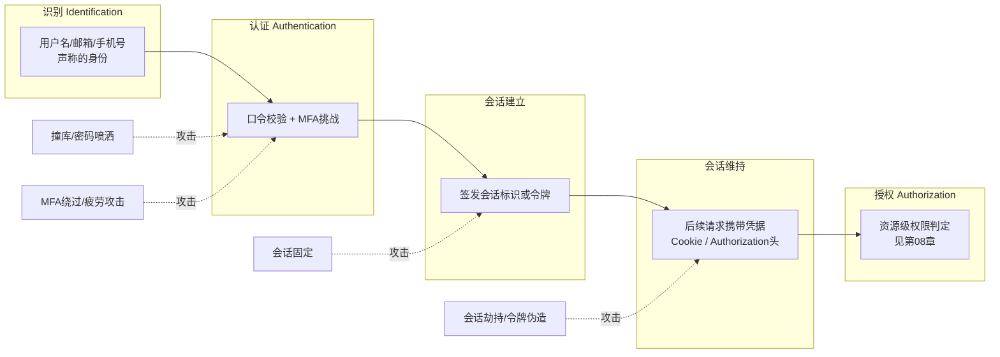
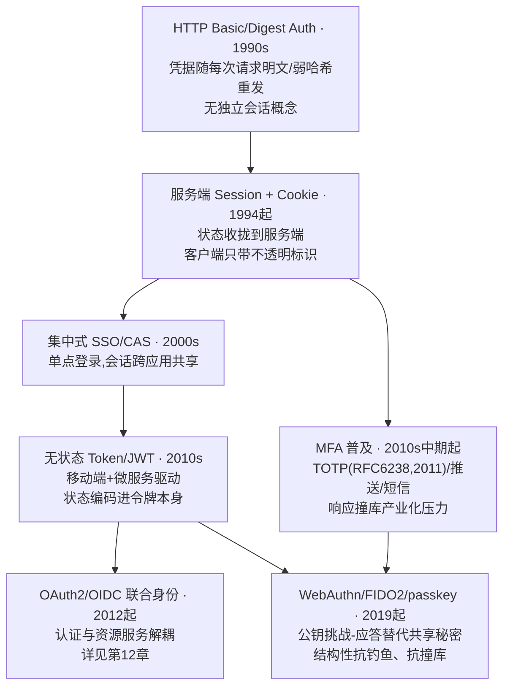
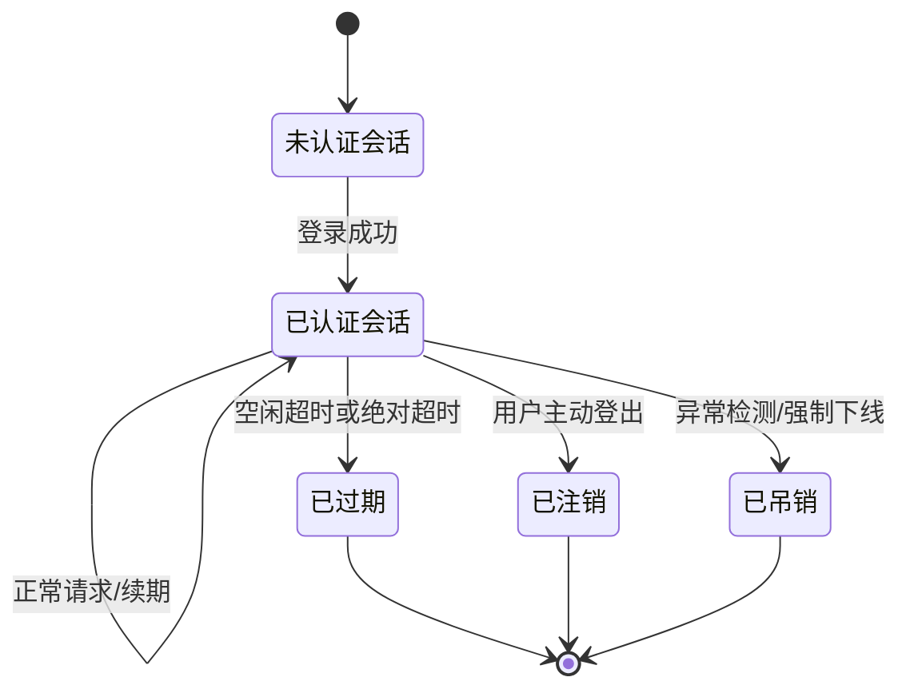
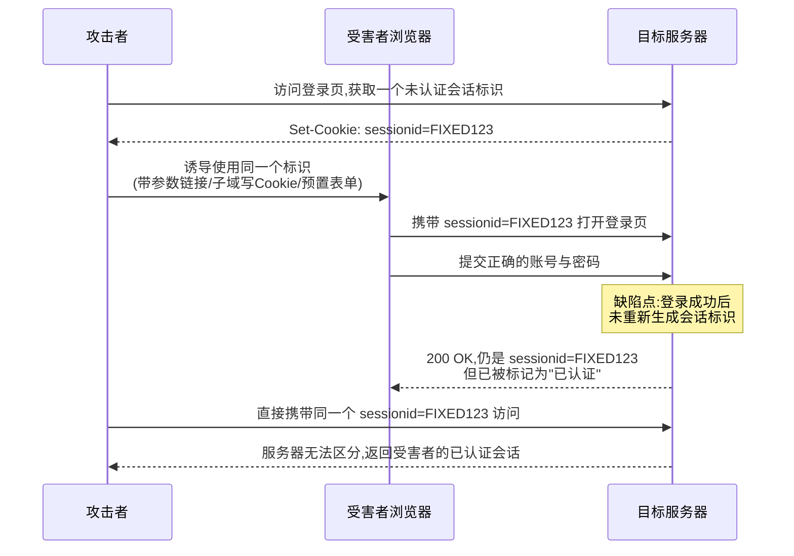
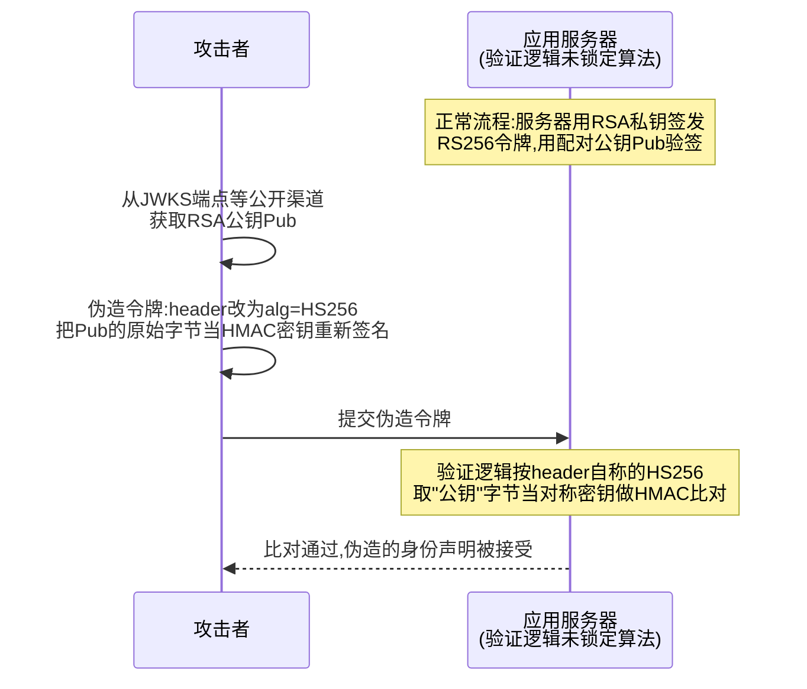

# Web与应用层安全（7）· 认证与会话安全

> [!abstract] TL;DR
> - 认证解决"你是谁"、会话管理解决"HTTP 无状态协议下接下来如何记住你是谁"，二者常被同一段登录代码顺手处理却是完全不同的攻击面：本章不展开 JWT/OAuth 的具体协议流程（详见[[12.JWT与OAuth与OIDC安全]]），也不展开权限判定逻辑（详见[[08.访问控制与越权]]），只聚焦"证明身份"与"维持身份"这两步本身如何被绕过。
> - 密码哈希的核心矛盾是"验证要快、破解要慢"：bcrypt/scrypt/Argon2 通过刻意抬高时间或内存成本对抗 GPU/ASIC 并行暴力破解，选错算法（MD5/SHA 系列一次哈希甚至无盐）或成本因子配置过低，等于把用户密码的真实强度拱手让给撞库产业链。
> - 会话固定的本质不是"偷会话"而是"提前埋会话"：攻击者在登录发生前就把一个自己已知的会话标识塞给受害者，若服务端在登录成功后不重新生成标识，攻击者手里那份旧标识就自动继承了新的认证态——修复点只有一处，任何权限提升都必须换发新标识。
> - JWT 的多数误用（alg:none、RS256/HS256 密钥混淆、kid/jwk 头注入、弱密钥爆破）共享同一个根因：验证方对令牌自己声称的算法或密钥来源给予了过度信任；即便签名逻辑完全正确，用 JWT 直接取代服务端会话还会带来"无法主动吊销"的结构性代价。
> - MFA 不是非黑即白的开关：TOTP 与推送通知防不住实时中继钓鱼（AiTM），短信验证码存在 SIM 卡劫持与信令层系统性弱点，只有基于公钥挑战-应答、天生绑定请求来源域名的 WebAuthn/passkey 才具备真正的抗钓鱼属性。
> - 撞库与账户锁定之间存在真实的工程两难：锁得太松等同没有防护，锁得太死会被攻击者反过来当拒绝服务武器（故意用错误密码把受害账户锁死）——业界正从"硬锁定"转向渐进延迟与风险自适应限速。

## 概述与定位

认证（Authentication）、会话管理（Session Management）与授权（Authorization）是三个经常被同一段登录代码顺手处理、但攻击面完全不同的问题。认证回答"你是谁"：一次性地校验一个身份声明是否成立，通常靠口令、多因素凭据或密码学挑战完成；会话管理解决的是 HTTP 天生无状态这件事本身——认证只发生在登录那一刻，但用户接下来还要发出成百上千个请求，服务端必须有办法在不要求每次都重新认证的前提下，记住"这个请求是刚才认证过的那个人发出的"；授权则回答"这个已经确认身份的人，被允许对哪些资源做哪些操作"，是下一章的主题。三者环环相扣：认证被攻破，攻击者能够冒充任意用户；会话管理被攻破，攻击者不需要破解任何凭据也能直接"继承"一个已登录用户的身份；授权被攻破，则是即便认证与会话都无懈可击，用户依然可能访问到不该访问的资源。本章只处理前两个问题。



在系列中的边界需要提前划清。第 06 章《CSRF与SSRF》已经从协议属性角度讲过 Cookie 的 SameSite 如何影响跨站请求的可信度，本章不再重复 Cookie 的协议层属性定义，而是聚焦 Cookie/Token 作为"会话载体"本身的生命周期安全——谁能拿到它、它何时应该换发、何时应该失效。本章会大量提到 JWT，但只从"JWT 被当作会话令牌使用时如何被误用"这个角度展开，JWT 完整的结构规范、签名算法族、OAuth2 授权码/客户端凭证等流程细节、OIDC 身份层留给第 12 章《JWT与OAuth与OIDC安全》专题处理，本章不做重复的协议级铺陈。第 08 章《访问控制与越权》建立在"认证已经解决"这个前提之上，讨论认证之后的权限判定问题，与本章是纵向的上下游关系而非重叠关系。第 13 章会系统介绍 Burp Suite 整条工具链，本章"工具视角"部分只挑与会话/凭据测试直接相关的用法。第 30 章《WebAuthn与FIDO2与passkey编程》则是本章 MFA 部分在客户端实现层面的延伸读物，本章只讲清楚它的安全原理，不展开具体的浏览器 API 编程细节。

认证机制本身经历了一条清晰的演进主线：从早期 HTTP Basic/Digest 认证的"每次请求都重发一遍凭据"，到服务端 Session + Cookie 时代把状态收拢到服务端、客户端只携带一个不透明标识，到移动端与微服务架构催生的无状态 Token/JWT 把状态重新编码进令牌本身随身携带，再到近年 WebAuthn/passkey 把"验证的秘密"从"用户记住了什么"彻底转移到"设备能够证明拥有什么"的公钥模型。



这条演进线索是理解本章几乎所有攻击手法的坐标系——每一次架构演进在解决上一代问题的同时，都会引入一类新的攻击面：Session+Cookie 解决了凭据重复传输的问题，却带来了会话固定与会话劫持；无状态 Token 解决了服务端存储压力，却带来了"无法主动吊销"的结构性代价；MFA 抬高了单一凭据泄露的危害，却催生了推送轰炸与实时中继钓鱼这类专门针对第二因素的新手法。

从攻击者视角看，几乎所有认证/会话类攻击的终点都是账户接管（Account Takeover, ATO），具体路径大致分为四类：直接破解或撞库拿到明文凭据；绕过或降级多因素认证；不去碰凭据、直接窃取或提前固定一个已认证的会话标识；伪造或篡改一个签名薄弱、验证逻辑有缺陷的令牌。这四条路径分别对应下文"原理与机制"与"认证绕过与令牌伪造技术详解"两节要展开的具体技术，也是贯穿全篇的分析框架。

## 原理与机制

### 认证三要素：所知、所有、所是

认证的本质是让一个声称拥有某个身份的主体，证明这个声称是真的。密码学与安全工程里把可用于证明的凭据分成三个类别：所知（Something you know，如口令、PIN、安全问题答案）、所有（Something you have，如手机里的动态令牌、硬件安全密钥、被信任设备本身）、所是（Something you are，如指纹、面容、虹膜等生物特征）。真正意义上的多因素认证要求跨越至少两个不同类别，而不是同一类别内的叠加——用密码加一个"安全问题"看似是两道关卡，但两者本质上都是"所知"，而安全问题的答案（母亲的姓氏、第一所小学）往往比密码本身更容易通过社工或公开信息拿到，这是多因素认证设计里最常见、也最容易被合规检查表忽略的一个误区。三要素模型不仅用来设计 MFA，也是评估任何单一认证机制强度的起点：口令认证只用到了"所知"这一个维度，这决定了它天然存在上限，也是本章要花大量篇幅讨论密码存储与撞库的原因。

### 密码认证与存储方式的演进

口令认证的安全性由两段独立的环节共同决定：传输环节（是否在 TLS 之上传输，避免被网络嗅探，属于第 14 章 TLS 的范畴）与存储环节（服务端如何保存用于校验的凭据）。存储环节的演进本身就是一部对抗算力增长的军备竞赛史：最早的明文存储意味着数据库一旦泄露，所有用户密码原样落入攻击者手中；随后出现的无盐哈希（对密码直接做一次 MD5/SHA1/SHA256）解决了"存储介质可读"的问题，但相同密码总是产生相同哈希值，攻击者可以预先计算一张彩虹表批量查表破解，也可以在多个泄露库之间直接比对哈希值找出复用密码的用户；加盐哈希（为每条记录附加一个随机 salt 参与运算）让相同密码在不同用户之间产生不同哈希，粉碎了彩虹表与跨库比对这两种批量攻击，但哈希函数本身（MD5/SHA 系列）设计目标是"快"，这对文件校验、数字签名是优点，对密码存储反而是缺点——现代 GPU 集群每秒可以尝试数十亿次 SHA256 运算，加盐只能防批量攻击，防不住针对单条记录的高速离线暴力破解。真正的解决方案是专门为密码存储设计的慢哈希算法（下一节详细展开），通过人为抬高每次校验所需的计算成本或内存成本，把"离线暴力破解一条密码平均要花多久"从毫秒级拉高到数年甚至数十年级别。

### 会话状态管理：为 HTTP 的无状态本质打补丁

HTTP 协议在设计上是无状态的：每一次请求-响应在协议规范层面都是独立、自包含的，服务端默认不记得上一次请求发生过什么。这个设计对最初的文档检索场景是合理的，但任何需要"记住用户已登录"的业务场景（购物车、后台管理、个性化内容）都必须在协议之外补上一层状态管理，会话（Session）就是这层补丁的通用名字。实现会话状态主要有两条路线：有状态会话（服务端在内存/Redis/数据库里维护一张"会话标识 → 用户身份及其他上下文"的映射表，客户端只携带一个随机、不透明、自身不包含任何语义信息的标识符，通常通过 Cookie 传递）与无状态令牌（服务端把身份与必要的上下文直接编码进令牌本身，用密码学签名保证令牌未被篡改，验证时只需要验签、不需要查询任何存储，JWT 是这条路线最常见的落地形式）。两条路线的核心权衡在于：有状态会话把"能否让某个会话立即失效"这个能力留在服务端手里，代价是每次请求都要付出一次存储查询；无状态令牌把这次查询省掉了，代价是签发出去的令牌在到期之前天然有效、服务端无法单方面提前收回——这组权衡会在第三节 JWT 误用部分被反复引用，是理解那一整类问题的钥匙。

无论走哪条路线，会话的生命周期都要经过创建、维持、失效三个阶段，其中每一次跨越信任边界（尤其是权限提升）都是攻击者最感兴趣的时刻：



这张状态图里最容易被实现忽视的一条边是"登录成功"这条转移——它不应该只是简单地把已有的未认证会话打上已认证标记，而应该销毁旧标识、创建一枚全新的会话标识，原因会在下一节会话固定小节详细展开。同样容易被忽视的是"已注销"这条边：很多实现的登出逻辑只是让浏览器清除本地 Cookie，服务端那份会话记录（或者更糟，一枚尚未过期的 JWT）实际上完好无损地继续有效，一旦这个 Cookie 之前已经泄露给了攻击者，用户自以为的"登出"完全不会影响攻击者手里那一份的有效性。

### 会话固定与会话劫持：一对经常被混为一谈的概念

会话劫持（Session Hijacking）与会话固定（Session Fixation）都以拿到一个"已认证"的会话标识为目标，但发生的时序和防御点完全不同，这是本章要特别澄清的一组概念。会话劫持是"事后窃取"：攻击者通过 XSS 读取 Cookie、嗅探未加密的网络流量、恶意代理、服务端日志泄露、或是 Referer 头把 URL 中的令牌带到第三方站点等途径，拿到一个受害者已经登录、已经存在的会话标识，不需要提前做任何埋伏。会话固定是"事前埋伏"：攻击者根本不需要窃取任何东西，而是设法提前把一个自己已知的会话标识"种"给受害者，诱导受害者用这个标识完成登录动作。



两者的防御点也因此完全不同：会话劫持主要靠 HttpOnly（阻止脚本读取）、Secure 配合强制 TLS（阻止网络嗅探）、避免把标识放进 URL（阻止通过 Referer 或访问日志泄露）来防；会话固定则只有一个根治点——任何认证状态发生变化时，服务端必须销毁旧标识、签发一枚全新的会话标识，使得攻击者提前埋入的那份标识在登录动作完成的瞬间就自动作废。这一处理逻辑在 PHP 中对应 `session_regenerate_id(true)`，在 Java Servlet 中对应 `HttpServletRequest#changeSessionId()`（Spring Security 默认开启 session-fixation-protection），在 Node/Express 生态对应 `req.session.regenerate()`——几乎所有主流框架都已经内置或默认启用了这一机制，但自定义会话管理代码、以及从旧版本升级上来但未重新审视这段逻辑的遗留系统，仍然是会话固定漏洞长期存活的重灾区。

### 多因素认证的原理概览

多因素认证在"所知"之外叠加至少一个独立维度，常见的两种实现原理差异很大，值得在这里先建立概念，具体的攻击与防御强度对比放到下一节。TOTP（Time-based One-Time Password，RFC 6238，在 HOTP/RFC 4226 基础上引入时间维度）的原理是服务端与客户端（通常是手机上的 Authenticator App）事先共享一个密钥，双方各自独立地用这个密钥与当前时间戳（按固定时间步长，通常 30 秒取整）做一次 HMAC 运算，取运算结果的一部分转换成 6 位数字，只要两边时钟基本同步、密钥一致，算出来的数字就应该相同。WebAuthn/FIDO2（W3C 标准，2019 年发布）走的是完全不同的公钥密码学路线：注册时客户端设备本地生成一对公私钥，私钥永远不离开设备（通常存放在安全芯片、TPM 或系统级 Secure Enclave 里），只把公钥上传给服务端；认证时服务端下发一个一次性的随机挑战（challenge），设备在本地用私钥对这个挑战、连同当前请求的来源域名（origin）一起签名后返回。这个"把来源域名一起签进去"的设计，正是下一节要反复引用的抗钓鱼能力的根源，与 TOTP 那种"一串数字复制到哪个页面都能用"的机制有本质区别。

## 认证绕过与令牌伪造技术详解

### 密码哈希算法横向对比

专门为密码存储设计的慢哈希算法目前主流有四种，理解它们的差异需要抓住"攻击者破解密码的成本由什么决定"这条主线——不是哈希函数本身多复杂，而是每计算一次候选密码的哈希，攻击者的硬件要为此付出多少时间和多少内存。

| 算法 | 核心思路 | 可调参数 | 优势与局限 |
| --- | --- | --- | --- |
| PBKDF2（RFC 2898，2000） | 对 HMAC 做大量次数迭代 | 迭代次数 | 几乎不占内存，FIPS 140-2 合规场景常见选择；面对 GPU 大规模并行时是四者中最弱的，只应在受合规限制、无法换用其他算法时使用，且迭代次数需推高到数十万级 |
| bcrypt（1999，基于 Blowfish 密钥调度 EksBlowfish） | 可调 cost factor 的自适应哈希 | cost（work factor），每 +1 耗时翻倍 | 部署最广泛、经受时间考验最久；已知限制是密码输入通常被截断在 72 字节（部分实现更短），且不是内存困难型，大规模专用硬件仍能获得一定加速 |
| scrypt（2009，Colin Percival，最初为 Tarsnap 备份服务设计） | 内存困难（memory-hard） | N（内存/CPU 成本）、r（块大小）、p（并行度） | 大内存占用让 ASIC/GPU 并行化的硬件成本急剧上升，是最早专门对抗专用破解硬件的密码哈希算法；参数调优比 bcrypt 复杂，配置不当容易适得其反 |
| Argon2（2015 Password Hashing Competition 冠军） | 内存困难 + 可调时间/并行度，分 Argon2d/Argon2i/Argon2id 三个变种 | 内存成本、时间成本（迭代次数）、并行度 | Argon2id（2d 抗 GPU 与 2i 抗旁道的混合）是 OWASP 密码存储速查表当前的首选推荐；参数需要结合服务器实际内存预算调优，内存设置过低会削弱其内存困难特性 |

OWASP 给出的选型优先级是 Argon2id 优先，其次 scrypt，再次 bcrypt，PBKDF2 仅在受合规强制、别无选择时使用——这个排序背后的经济学逻辑是：内存困难型算法让攻击者堆算力破解的边际成本上升得比纯计算密集型算法快得多，因为大容量高速内存在专用破解硬件（FPGA/ASIC）上远比逻辑门昂贵，等于是把"密码破解"这件事从攻击者最擅长砸钱的战场（并行计算单元）逼到了攻击者相对不擅长砸钱的战场（内存带宽与容量）。

盐（salt）与胡椒（pepper）经常被混淆，但作用层面不同：盐是随机生成、逐条记录唯一、与哈希结果存在一起的值，不需要保密，作用是让相同密码在不同用户之间产生不同哈希，粉碎彩虹表与跨库批量比对；胡椒是一个全局共享的秘密值，刻意不与哈希存放在同一处（放在应用配置、环境变量或 HSM 里），作用是即便数据库整体泄露，攻击者拿不到胡椒就依然无法离线破解——胡椒引入的代价是多了一层密钥管理问题，常见做法是先用胡椒对密码做一次 HMAC 预处理，再把结果交给慢哈希函数。

### 会话标识的熵与随机数来源

会话标识作为身份的临时代理，其安全性完全建立在"攻击者无法猜出或预测出一个有效标识"这条假设之上，这本质上是一个纯粹的随机数质量问题。OWASP 会话管理速查表建议会话标识至少具备 128 bit 的随机熵，且必须来自密码学安全的伪随机数生成器（CSPRNG，如操作系统提供的 `/dev/urandom`、Java 的 `SecureRandom`、Python 的 `secrets` 模块），而不是普通的伪随机数生成器（如种子可预测或用当前时间戳播种的 `rand()`/`Math.random()`）——普通 PRNG 的内部状态在观测到足够多输出后可以被反推，一旦攻击者能够预测下一个即将签发的会话标识，就不再需要窃取或固定任何东西，直接枚举即可命中一个尚未过期的合法会话。历史上出现过的反面案例包括：早期 PHP 的会话 ID 生成质量取决于 `session.entropy_file`/`session.hash_function` 等配置项，配置不当会显著削弱熵；一些框架曾用 UUID v1（内部编码了 MAC 地址与时间戳，理论熵远低于表面上看到的 128 bit）直接当会话令牌使用，这类问题都指向同一个教训——不能想当然地认为"看起来像一串随机字符"就等于"具备密码学意义上的不可预测性"。

### 会话固定的三种注入手法

会话固定的核心机制已在上一节讲清楚，这里展开攻击者实际让"自己已知的标识"进入受害者浏览器的三条常见路径。第一种是历史上的 URL 传递型：早期为了兼容禁用 Cookie 的客户端，部分框架支持通过 URL 重写传递会话标识（形如 `;jsessionid=xxx` 拼在路径里），攻击者只需要把一条带着自己已知标识的链接发给受害者点击即可，这条路径在现代框架里已基本被移除，但了解它有助于理解为什么"绝不把会话标识放进 URL"会被反复强调为一条底线原则——放进 URL 的标识不仅面临这里的固定风险，还会经浏览器历史记录、代理日志、Referer 头一并泄露。第二种是 Cookie 注入型：如果攻击者能够在目标域或其可写的子域上设置 Cookie（配合某个注入点，例如一处反射型 XSS、一个可被接管的子域、或是中间人位置），由于 Cookie 的作用域模型按 Domain/Path 划分而非按同源模型划分，攻击者可以直接通过响应头或脚本强行给受害者浏览器下发一枚固定的会话标识，这也是 `__Host-` Cookie 前缀（强制 Secure、禁止声明 Domain、Path 必须为 `/`）在防会话固定语境下比在防 CSRF 语境下更值得强调的原因——它从浏览器解析层面直接堵死了子域覆盖这条注入路径。第三种是服务端预先分配型，也是最容易被工程师忽视的一种：不少应用在用户尚未登录时就已经为其签发了一枚会话标识（用于购物车、埋点、A/B 分流等目的），如果登录成功后复用这枚"预登录"标识而不换新，等于应用自己制造了一个天然的固定窗口——只要攻击者能够以某种方式获知这个预登录阶段的标识值，就足以构成会话固定，这也是为什么"登录后必须换发新标识"要被表述为无条件规则，而不是"仅在检测到可疑登录前状态时才换发"。

### JWT 结构回顾与误用逐条详解

JWT（JSON Web Token，RFC 7519）的完整规范细节、与 OAuth2/OIDC 的配合方式留给第 12 章，这里只回顾理解误用所必须的最小结构：

```
header:    {"alg":"HS256","typ":"JWT"}              base64url 编码
payload:   {"sub":"1234","role":"admin","exp":...}  base64url 编码，注意只是编码，不是加密
signature: HMAC-SHA256(base64url(header)+"."+base64url(payload), secret)
三段以 "." 连接： <header>.<payload>.<signature>
```

理解这个结构后，绝大多数真实世界的 JWT 误用都可以归结为同一句话：验证方对令牌自己声称的算法、密钥来源或有效性属性给予了不该有的信任。逐条展开：

- **alg=none 绕过签名**：JWT 规范本身允许一个 `none` 算法用于无需签名的场景，意味着 signature 段可以留空。如果验证逻辑"看 header 声称什么算法就用什么算法去验证"而不是显式拒绝 `none`，攻击者只需要把 header 的 `alg` 改成 `none`、去掉签名段，就能提交一枚自己随意篡改过 payload（例如把 `role` 改成 `admin`）却不带任何签名的令牌蒙混过关。主流库目前默认已拒绝 `none`，但自定义验证逻辑、老旧版本库、以及"只解码读取 payload、从不校验签名"这种误用依然长期出现在真实测试报告里。
- **RS256/HS256 密钥混淆（algorithm confusion）**：如果服务端本应使用非对称算法 RS256 签发（私钥签名、公钥验签），但验证代码没有强制锁定期望算法，而是"看到 header 里写的是什么算法就走对应的验证逻辑"，攻击者可以拿到本应公开的 RSA 公钥（很多系统会把它暴露在 JWKS 端点，这本身并不是问题，问题出在验证端），将令牌 header 改写成 `HS256`，用这个公钥的原始字节内容当作 HMAC 的对称密钥重新计算签名。此时服务端按 `HS256` 流程校验，被同一份"公钥"字节填入了本应是对称密钥的变量位置，HMAC 比对随即通过，伪造令牌被接受。根治点是验证时由服务端显式指定一个算法白名单，绝不从令牌自身读取应使用哪种算法或到哪里取密钥。
- **kid 头注入**：header 可以携带一个 `kid`（key id）字段，告知验证方该用哪一把密钥或证书验证。如果服务端直接拿 `kid` 的值去拼接文件路径、拼接 SQL 查询，或者直接信任 `kid` 里内嵌的密钥材料本身，就分别对应路径穿越读取任意文件当密钥、SQL 注入、以及攻击者直接指定一把自己已知密钥这几种变体。
- **jwk/jku 头注入**：header 还可以携带 `jwk`（直接内嵌一个公钥 JSON）或 `jku`（指向一个远程 JWKS 地址）。如果验证方没有把 `jku` 严格限制在自己受信任的域名列表内，攻击者可以让 `jku` 指向自己控制的服务器，该服务器返回攻击者自己生成的公私钥对里的公钥，验证自然通过——因为令牌本来就是攻击者用与之配对的私钥签的。
- **弱密钥/默认密钥暴力破解**：`HS256` 的对称密钥如果是弱口令、教程示例里抄来的默认字符串、或框架默认值未被覆盖，可以用 jwt_tool、hashcat 内置的 JWT 模式做离线暴力破解，一旦拿到密钥即可任意签发令牌。
- **exp/iss/aud 校验缺失**：签名有效只能说明"这份内容没被篡改过"，不代表令牌没有过期、也不代表这个令牌是签给"当前这个服务"使用的。很多实现只做了签名校验就认为通过，遗漏了对 `exp`（过期时间）、`iss`（签发者）、`aud`（受众）等声明的显式检查——微服务场景下，若签发给服务 A 使用的令牌未被服务 B 校验 `aud`，就可能被跨服务重放。
- **敏感信息塞进 payload**：header 和 payload 只是 base64url 编码，不是加密，任何拿到令牌的一方（浏览器开发者工具、中间代理日志、抓包记录）都能直接解码读出明文。把手机号、内部角色 ID、临时密码这类敏感字段直接放进 JWT payload 是一个基础但极常见的误区。
- **用 JWT 完全取代服务端会话导致无法主动吊销**：这是结构性问题而非某个具体的实现错误。传统有状态会话的优势是服务端随时可以删除一条记录让它立即失效（用户登出、管理员强制下线、检测到账户异常）；无状态 JWT 的设计初衷恰恰是服务端不必查库/查缓存即可验证，一旦签发，在到期之前天然自证有效，除非额外维护一份吊销名单，否则无法提前收回——而一旦引入吊销名单，JWT 相对传统会话的性能优势也基本作废，变成了"多了一次查询、只是换了个令牌格式的传统会话"。工程上常见的折中是把 JWT 有效期设得很短（几分钟到十几分钟），配合一枚存储在服务端、可随时吊销的长效刷新令牌（refresh token）换发新的短期 JWT；登出或检测到异常时只需吊销 refresh token，已经签发出去的短期 JWT 等待自然过期即可，把"不可撤销的窗口"压缩到可接受范围，而不是假装这个问题不存在。



### 多因素认证的绕过模式

MFA 显著抬高了攻击门槛，但并非不可绕过，真实世界里反复出现的绕过模式集中在以下几类。TOTP 暴力破解：6 位数字只有一百万种组合，如果 MFA 校验接口没有像登录接口一样受到限速与失败次数保护，理论上可以在一个验证码的有效窗口内被高速枚举完，这类问题的根源是团队只顾着给"第一因素"加限速，却忘了第二因素同样需要；"记住此设备"（remember this device）机制设计不当：为了体验，很多实现在完成一次 MFA 后签发一枚长期甚至永久有效的设备令牌，后续同一设备免 MFA，一旦这枚令牌的生成算法可预测、或未绑定设备指纹与异常 IP 检测、或与普通会话令牌共用同一套薄弱防护，相当于给 MFA 开了一扇长期敞开的后门；账户恢复流程降级：多数系统"丢失手机怎么办"的恢复通道（邮箱验证码、安全问题、人工客服核实）安全强度往往远低于 MFA 本身，攻击者绕过 MFA 最短的路径经常不是攻击 TOTP 算法，而是直接攻击恢复流程——这提醒我们整条认证链的强度取决于最弱的一环，MFA 本身再强，恢复通道弱也无济于事；推送疲劳/MFA 轰炸（MFA Fatigue / Push Bombing）：适用于以推送方式确认登录的 MFA 方案，攻击者在已经掌握第一因素（密码）的前提下，短时间内连续发起大量登录尝试，向受害者手机连环推送确认请求，利用"被打扰到随手点了批准"或"误以为系统故障而点了批准"的心理弱点得手，这一手法在近年多起大型入侵事件的复盘报告中反复出现，防御手段包括限制单位时间内的推送次数、引入号码匹配（number matching，要求用户在 App 内手动输入登录页显示的一组数字才算确认）、以及异常地理位置的额外提醒；实时中继钓鱼（Adversary-in-the-Middle, AiTM）：攻击者搭建一个反向代理钓鱼站点，实时转发受害者与真实站点之间的全部流量，包括账号密码和当次生效的 TOTP 动态码，代理站点在受害者完成认证的瞬间直接窃取刚刚建立的会话 Cookie——这种手法能够绕过 TOTP 和大多数推送类 MFA，因为凭据本身并没有被破解，只是被实时中继了一次，但对 WebAuthn/FIDO2 完全无效，因为 WebAuthn 的签名与发起请求的 origin 强绑定，钓鱼域名与真实域名不一致会直接导致签名校验失败——这正是本章反复强调"WebAuthn 具备结构性抗钓鱼能力"这一结论最核心的论据。

### 撞库、密码喷洒与账户锁定的两难

撞库（credential stuffing）利用的是其他网站历史数据泄露产生的"邮箱:密码"库，批量在目标网站尝试登录，命中的是用户跨站复用密码的习惯，不针对单一账户做暴力破解，而是广撒网；密码喷洒（password spraying）则反过来，固定几个极常见的弱密码（如"公司名+年份""Password123"），对大量账号各只尝试一两次，专门规避"同一账号连续失败即触发锁定"这类传统防护。两者共同的防御思路是把限速判断从单一维度扩展到多维联合：单账号失败次数、单 IP/单 ASN 的请求速率、设备与浏览器指纹的异常程度、以及尝试的密码是否命中已知泄露库（可对接 Have I Been Pwned 的 Pwned Passwords API，在用户设置新密码时就拒绝已泄露密码，从源头压缩撞库的可用弹药）。

账户锁定策略本身存在一个真实的工程两难：锁得太松等于没有防护，撞库脚本可以对每个账号无限重试；锁得太死则会被攻击者反过来当作拒绝服务武器——攻击者明知密码是错的，故意对受害者账号连续提交错误密码，把受害者自己先锁死在门外，这在客服、电商等场景中是真实发生过的骚扰手段。业界目前的共识正从"硬锁定"转向两个方向：渐进式延迟（指数退避，每次失败后要求等待的时间越来越长，但不会彻底锁死账户）与风险自适应（综合 IP 声誉、设备指纹、地理位置速度异常等因素动态提升验证强度，例如触发一次额外的人机校验或短信确认，而不是一刀切锁定账号）。

## 工具视角与实战

会话与凭据类问题的测试工具链，核心目标是回答三个问题：这个会话标识是否真的不可预测？这枚令牌的验证逻辑是否真的按预期锁定了算法与密钥来源？登录与二次验证接口是否真的具备限速保护？

Burp Suite 的 Sequencer 模块专门用于评估会话标识、CSRF Token 等"看起来随机"的值的真实随机性：抓取大量样本后，对比特级相关性、字符分布等做统计学随机性检验，从而判断会话标识的生成算法是否可预测——这是 Sequencer 众多功能中与本章主题直接相关的一项，工具链的系统性介绍留给第 13 章。jwt_tool 是 JWT 安全测试的事实标准工具之一，可以针对一份样本令牌自动化探测 `alg=none`、RS/HS 密钥混淆、`kid`/`jwk`/`jku` 注入面、弱密钥离线爆破等一整套已知误用模式；jwt.io 或本地部署的 jwt-cli 则适合交互式手工解码、修改、重新签名令牌，用来快速验证一个具体思路是否成立。hashcat、John the Ripper 常被用来对"己方系统导出的密码哈希样本"做强度审计——例如安全团队定期抽样自查：在当前 bcrypt cost factor 配置下，给定一份合理的算力预算，平均破解一条哈希需要多久，以此决定成本因子是否需要上调；这类使用方式的前提始终是审计自己的数据，而不是拿他人系统泄露的哈希去尝试破解。OWASP ZAP 的认证测试辅助功能可以记录一整套登录序列并在后续自动化扫描中自动维持会话状态，避免扫描器因为会话过期而产生大量误报。

验证会话固定问题的最小实验步骤，是渗透测试报告里最常见的一类 PoC：在两个独立的浏览器隐私窗口中分别模拟攻击者与受害者，先在窗口一记录下未登录状态的 `Set-Cookie` 值，再用同一个值在窗口二完成登录，最后回到窗口一直接访问业务页面，观察是否能够以受害者身份成功访问——如果能，就证明登录动作没有换发新标识。这类实验只应该针对自己搭建的靶场或已获授权的测试环境进行，例如：

```
# 在本地靶场环境中,对比登录前后的会话标识是否变化(示例,非针对真实目标)
curl -i http://localhost:8080/login -c cookies_before.txt
# 记录 cookies_before.txt 中的会话标识,携带同一标识提交登录表单
curl -i http://localhost:8080/login -b cookies_before.txt \
     -d "username=test&password=test" -c cookies_after.txt
# 对比 cookies_before.txt 与 cookies_after.txt 中的会话标识是否发生变化
diff cookies_before.txt cookies_after.txt
```

针对 MFA 与登录接口限速表现的测试同样可以用 curl/Postman 连续发起请求，观察是否在合理次数内触发 429 状态码或验证码升级；如果连续数百次尝试都没有任何限速迹象，就是一处需要修复的发现。

## 安全性与正确使用

### 现代密码策略：NIST SP 800-63B 的几条反直觉结论

NIST SP 800-63B《数字身份指南》确立的现代密码策略，纠正了不少延续多年却适得其反的"传统"要求。不再强制定期轮换密码，除非有证据表明凭据已泄露——强制定期轮换会诱导用户采用可预测的递增模式（如把 `Passw0rd1` 改成 `Passw0rd2`），真实熵反而下降；优先强调长度而非复杂度规则，不强制要求必须同时包含大小写、数字、特殊字符，因为用户在这类规则下往往选择"刚好满足规则"的最省力密码（如 `Password1!`），复杂度规则带来的强度提升被使用习惯抵消；不应阻止密码管理器的粘贴操作，禁止粘贴是一个常见反模式，直接惩罚了使用密码管理器生成高强度随机密码的用户；建议在用户设置新密码时比对已知泄露密码库，拒绝命中的密码；密码最大长度不应设置得过短，历史上不少系统曾把上限设在 8～16 位，这本身就是一种安全反模式，应当支持更长的口令短语（passphrase）。

### 会话生命周期管理清单

结合本章讨论，会话管理的工程清单应包括：登录成功必须重新生成会话标识，覆盖所有权限提升场景而不仅是初次登录；登出必须由服务端主动销毁会话状态，而不能只依赖客户端清除 Cookie；应同时设置空闲超时（idle timeout）与绝对超时（absolute timeout）两条相互独立的过期线，前者应对长时间无操作但未关闭浏览器的场景，后者兜底"标识本身被动泄露但受害者仍在正常使用"的场景；修改密码、变更绑定邮箱、大额转账等高敏感操作前应要求重新认证（re-authentication / step-up auth），不能假设"当前会话有效"等同于"可以做任何事情"；应明确并发会话策略，包括是否允许同一账户多设备同时登录、新设备登录时是否通知或踢出旧会话。

### MFA 部署优先级与 JWT 会话令牌的正确姿势

综合抗钓鱼能力与部署成本，MFA 方案的推荐优先级是：WebAuthn/passkey（硬件安全密钥或平台认证器，如系统内置的生物识别）优先，TOTP App 次之，推送通知需配合号码匹配后再考虑，短信/邮件一次性验证码只应作为最后备选或找回通道，不建议作为唯一的第二因素。若确实需要用 JWT 承担会话职能，工程上的正确姿势是：验证时由服务端强制指定算法白名单，绝不从令牌自身读取应使用的算法或密钥位置；采用短有效期加服务端可控的刷新令牌轮换机制；跨服务场景下必须校验 `aud`/`iss`；不在 payload 中放置敏感信息；为应对密钥泄露等紧急场景，额外维护一份短 TTL 的吊销名单作为兜底，而不是完全依赖"到期自然失效"。

> [!caution] 合规与授权边界
> 本章涉及的密码存储分析、会话标识随机性评估、JWT 结构性缺陷、MFA 绕过原理，仅适用于以下场景：(1) 你自己拥有或已取得书面授权的系统；(2) CTF 靶场、PortSwigger Web Security Academy 一类专门设计的教学环境；(3) 出于安全研究或教学目的搭建的沙箱环境。对任何未取得明确书面授权的第三方系统尝试破解密码、伪造令牌、绕过 MFA 或固定会话，在绝大多数司法辖区都可能构成非法侵入计算机系统，需承担法律责任；本章及全系列使用的所有工具与技术描述均以防御与教育视角组织，目的是帮助读者识别并修复自身系统里的薄弱环节，不构成针对真实生产系统或他人账户的可执行攻击配方，也不为绕过任何商业授权机制提供武器化步骤。若在真实系统中发现相关问题，请通过正规的众测/漏洞赏金平台或目标站点公开的安全联系渠道，遵循负责任披露流程上报。

## 小结

| 维度 | 核心结论 |
| --- | --- |
| 密码存储 | 慢哈希（Argon2id 优先，scrypt/bcrypt 次之）通过刻意抬高时间/内存成本对抗离线暴力破解，无盐或快哈希等于把真实密码强度拱手让给撞库产业链 |
| 会话生命周期 | 登录成功、权限提升必须无条件换发新会话标识；登出必须服务端主动销毁状态；空闲超时与绝对超时缺一不可 |
| 会话固定 vs 劫持 | 固定是"事前埋标识、诱导登录"，劫持是"事后窃取已登录标识"，防御点分别落在"登录时换发"与"HttpOnly/Secure/避免URL传参"上，不可互相替代 |
| JWT 误用 | 几乎所有具体漏洞（alg none、密钥混淆、kid/jwk 注入）都源于验证方信任了令牌自称的算法或密钥来源；用 JWT 取代会话还带来结构性的"无法主动吊销"代价 |
| MFA | 强度并不均质：短信/推送可被 AiTM 实时中继与轰炸绕过，唯有 WebAuthn/passkey 凭借 origin 绑定的公钥签名具备结构性抗钓鱼能力 |
| 撞库与锁定 | 硬锁定可被攻击者反向利用做拒绝服务，渐进延迟与风险自适应限速是更稳健的工程折中 |

认证解决"你是谁"，会话管理解决"接下来如何记住你是谁"，本章沿着这两条主线，从密码存储的算法选型一路讲到会话固定的三种注入手法、JWT 的八类具体误用、MFA 的五种绕过模式，试图说明的核心事实是：这个领域里几乎所有具体漏洞，拆解到底都是"验证方对某个本不该无条件信任的输入给予了信任"——无论这个输入是密码哈希的计算速度、会话标识的可预测性、令牌自称的算法、还是一次推送确认的来源。下一章《访问控制与越权》会在"身份已经确认无误"这个前提之上继续展开：即便认证与会话环节都无懈可击，系统依然需要正确回答"这个已确认身份的人，到底被允许做什么"这个同样容易出错的问题。

## 相关阅读

- 系列上下文：[[00.Web与应用层安全总览|系列总览]]、[[06.CSRF与SSRF]]（Cookie 的协议层属性与跨站请求可信度，与本章会话生命周期互为表里）、[[08.访问控制与越权]]（认证之后的权限判定，本章的直接下游）、[[12.JWT与OAuth与OIDC安全]]（JWT 完整结构、签名算法族与 OAuth2/OIDC 流程的专题展开）、[[13.Web漏洞工具链：BurpSuite]]（Sequencer 等工具的系统性介绍）、[[14.SSL与TLS配置与攻击]]（会话安全的传输层前提）
- 协议承接：[[71.详解网络协议/18.HTTP-HTTPS协议]]、[[71.详解网络协议/15.TLS协议]]
- 认证呼应：[[30.Windows认证与生物识别编程/08.WebAuthn与FIDO2与passkey编程]]
- 抓包呼应：[[72.抓包与协议分析实战/04.HTTP与HTTPS抓包与中间人分析]]
- 密码呼应：[[37.密码学/62.协议误用与密码工程]]
- 权威规范与书目：RFC 6238（TOTP）、RFC 4226（HOTP）、RFC 7519（JWT）、RFC 6265（Cookie）、W3C WebAuthn Level 2/3 规范、NIST SP 800-63B《Digital Identity Guidelines - Authentication and Lifecycle Management》、OWASP Authentication Cheat Sheet、OWASP Session Management Cheat Sheet、OWASP Password Storage Cheat Sheet、OWASP Credential Stuffing Prevention Cheat Sheet

[[00.Web与应用层安全总览|⬆ 系列总览]] | [[06.CSRF与SSRF|← 上一章]] | [[08.访问控制与越权|→ 下一章]]
