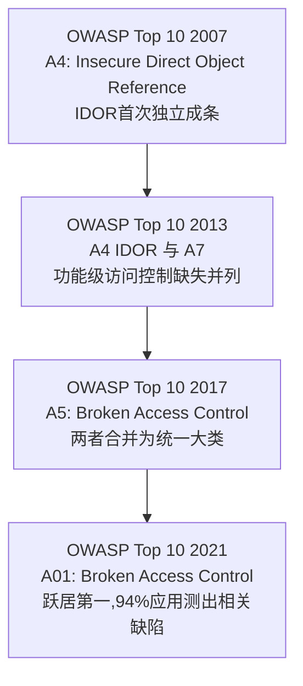
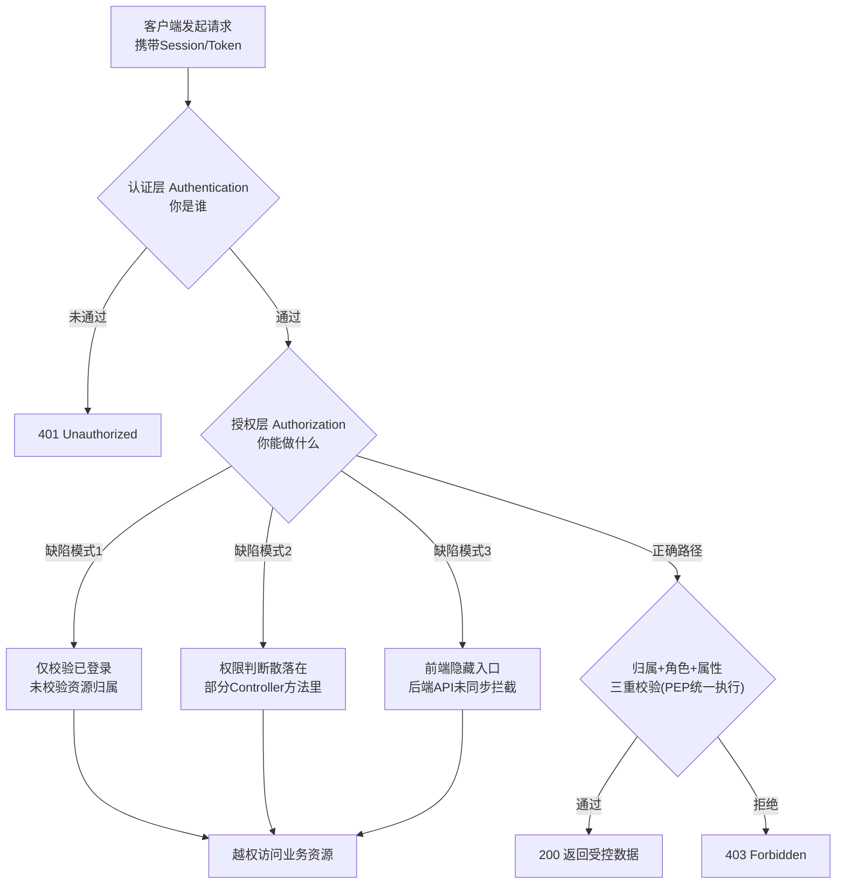
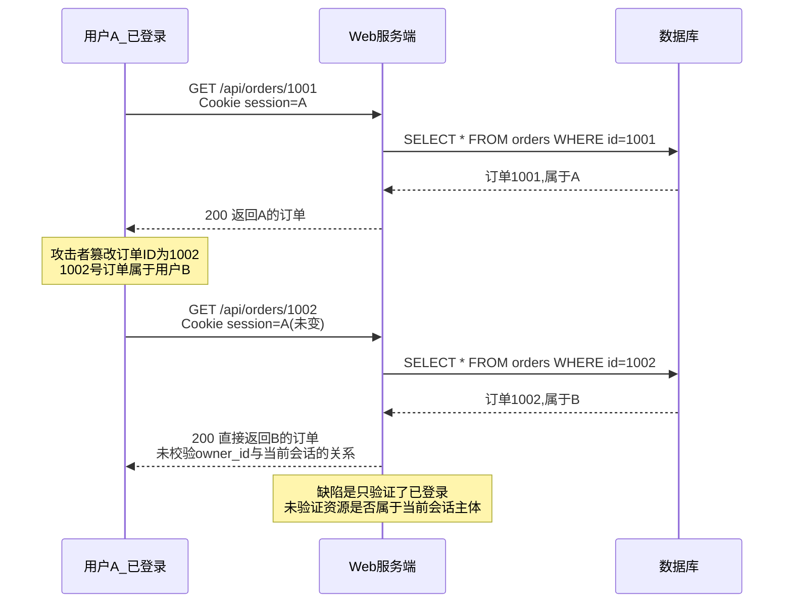
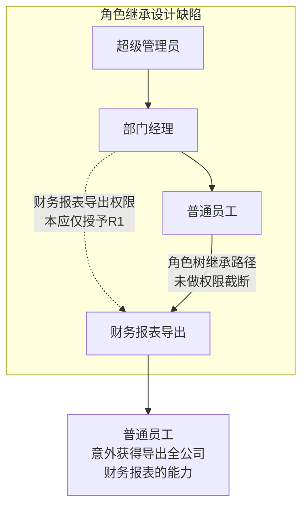
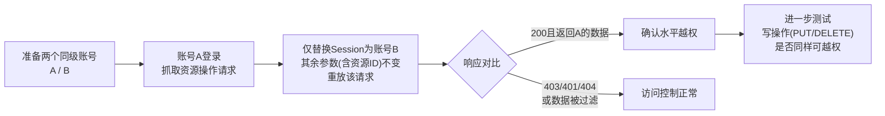

# Web与应用层安全（8）· 访问控制与越权

> [!abstract] TL;DR
> - 访问控制解决的是"认证之后"的问题——你是谁（Authentication）已经确定，但你能对哪个资源做什么操作（Authorization）必须逐次重新裁决，混淆两者是几乎所有越权漏洞共同的思维根源。
> - 越权分两条轴线：水平越权（同级用户跨资源）与垂直越权（低权限跨级到高权限功能），IDOR是水平越权中"直接对象引用未校验归属"的经典子类，OWASP早在2007年就将其单列为条目。
> - RBAC只回答"能不能做这类操作"，回答不了"对哪一条具体数据做"——这个能力鸿沟不用数据域/所有权校验补上，角色设计得再精细也会越权，多租户场景下的`tenant_id`遗漏尤其致命。
> - 越权是业务逻辑漏洞而非技术实现漏洞，天然对SQLi/XSS式的自动化扫描免疫，双账号差分测试至今仍是最可靠的发现手段。
> - 修复的本质是把访问控制判断收敛到一个集中、默认拒绝的执行点（PEP），对每次资源访问做"归属+角色+属性"三重校验，而不是散落在各Controller里各写各的。
> - OWASP Top 10 2021中 Broken Access Control 从2017年的第5位跃升至第1位，94%的受测应用至少存在一种访问控制缺陷，是当前覆盖面最广的一类Web漏洞。

## 概述与定位

访问控制（Access Control）与越权（Privilege Escalation / Broken Access Control）是Web安全里最容易被低估、却在实际渗透测试与代码审计中命中率最高的一类问题。要理解它在整个安全体系中的位置，必须先把"认证"（Authentication）和"授权"（Authorization）这两个经常被口语混用、但语义完全不同的概念彻底分开。[[07.认证与会话安全]]处理的是"你是谁"——用户名密码、多因素、Session、Token，这些机制解决的是主体身份的证明与维持问题；而本篇处理的是身份已经确定之后的下一个问题："你（这个已经被认证的主体）现在，对着这一个具体的资源，执行这一个具体的操作，是否被允许"。这是两个独立的裁决维度，认证成功只回答了第一个问题，完全不涉及第二个问题的答案——但现实中绝大多数越权漏洞，根源都是开发者在心智上把二者合并成了一件事："只要你登录了、持有合法Token，你就有权限"，而遗漏了"权限是与具体资源、具体角色绑定的，需要针对每一次请求单独裁决"这一层。即便认证环节强大到采用了[[30.Windows认证与生物识别编程/08.WebAuthn与FIDO2与passkey编程]]这类基于硬件密钥、抗钓鱼的强认证方案，解决的也只是"证明你确实是你"这一个正交问题，与"你能碰哪些数据"完全无关——强认证从不构成授权判断的替代品，这一点在架构设计时极易被忽略。

访问控制漏洞在漏洞分类学上还有一个特殊之处：它几乎不依赖任何"技术性"缺陷（不像SQL注入需要拼接不当、XSS需要转义缺失），而纯粹是"业务逻辑"层面对权限边界的疏漏。一个存在访问控制缺陷的接口，其HTTP协议使用、参数编码、字符转义可以全部正确，代码在功能测试里表现完全正常——因为它确实完成了"该做的事"（返回订单详情、允许修改资料），只是没有回答"这件事该不该对这个请求方做"。这个本质决定了它是自动化漏洞扫描器最难覆盖的一类：扫描器不知道"订单1001归属于用户A"这个业务事实，也就无法判断"用A的身份查询1002号订单"是否越界，它能看到的只是一个返回200的正常响应。这也解释了为什么在各类漏洞赏金平台的历年统计中，IDOR/越权类问题长期占据高位——它需要人工介入去理解业务语义，或者至少需要双账号这样的"差分测试"手段才能被系统性发现。

从行业统计口径看，这类问题的重要性近年被显著重新评估：OWASP Top 10 2017版中，"Broken Access Control"排在第5位；到2021版，它跃升至第1位，官方给出的数据是94%的受测应用中至少能找到一种访问控制类缺陷，覆盖面在全部类别中最广。这个排名变化的完整脉络可以追溯得更早：



这条演进线不是因为访问控制突然变得"更容易被攻破"，而是因为随着微服务化、前后端分离、API优先架构的普及，"每一个功能点都单独暴露成一个可被直接调用的接口"这种架构趋势，把原本可能被页面跳转逻辑、菜单可见性"顺带"掩护住的越权点，变成了赤裸暴露的攻击面——前端路由再怎么隐藏一个管理页面的入口，只要后端对应的API没有独立做权限裁决，攻击者用开发者工具或抓包代理找到那个URL之后就能直接绕过。这也是为什么本篇要与[[11.API与GraphQL安全]]、[[12.JWT与OAuth与OIDC安全]]明确划清边界：本篇建立的是访问控制的通用模型与越权的分类学，后两篇分别在API/GraphQL的具体载体形式、以及权限声明如何被编码进Token这两个更专项的角度做深入延展。

## 原理与机制

理解越权为何发生，需要先建立一个通用的访问控制模型骨架。经典访问控制理论（可追溯到XACML等策略语言标准）把一次授权裁决拆成四个要素：主体（Subject，发起请求的用户/服务）、客体（Object/Resource，被访问的资源，如一条订单记录）、操作（Action，读取/修改/删除/导出）、环境（Context，访问时间、来源IP、当前会话的信任等级）。一次完整的授权裁决，理论上必须在这四个要素齐全的情况下才能做出——"用户A（主体）能否对订单1002（客体）执行删除（操作）"，这个问题的答案不仅取决于A是谁，还取决于订单1002归属于谁、A和1002之间有没有业务关系。绝大多数越权漏洞的直接成因，就是这个四元判断在实现时被裁剪掉了其中一到两个维度——最常见的是只判断了"主体是否存在有效会话"（即认证是否通过），完全没有加入客体归属这一维度。

沿着策略执行的架构视角，还可以把"谁来做裁决"和"谁来执行裁决"分开看：策略决策点（Policy Decision Point, PDP）负责基于规则计算出"允许/拒绝"，策略执行点（Policy Enforcement Point, PEP）负责在业务代码路径上真正拦下不合规的请求。理想架构下，一个应用应该只有少数几个、甚至一个统一的PEP（网关层的鉴权中间件、框架级的AOP切面、或者所有Controller方法共用的基类校验逻辑），所有请求路径都必须流经它、无法绕过；PDP则可以是硬编码的角色判断，也可以外置成独立的策略引擎。越权高发的项目，往往是PEP散落在几十上百个Controller/Handler里，每个开发者各自手写一遍权限判断——这种模式下，只要有一个新增接口的开发者忘记复制这段判断（这在快速迭代的业务代码里极其常见），这个接口就天然处于"裸奔"状态，且不会在功能测试中被发现，因为功能测试通常只用一个"最高权限"的测试账号跑通全部路径。

在一次典型的[[71.详解网络协议/18.HTTP-HTTPS协议|HTTP]]请求处理管线里，可以清晰看到认证与授权各自的断点位置，以及越权具体是在哪个环节被引入的：



这张图揭示了一个关键事实：认证层的401拦截和授权层的403拦截，是两道完全独立的闸门，中间那个"授权层"内部又天然容易出现三种典型缺陷模式，它们各自对应不同的根因，也需要不同的修复手段（分别是补齐归属校验、统一收敛校验点、前后端权限模型联动）。值得强调的是图中的"隐式信任"陷阱——很多开发者把"用户已经登录"本身当作一种权限证明，这是一个认知上的偷懒：Session/Token的存在只证明了"这个请求确实来自一个已知身份"，从未回答过"这个身份有没有权限碰这条数据"。同理，"前端做了权限判断、隐藏了按钮或菜单项"也只是用户体验层面的引导，从来不构成安全边界——任何在浏览器里能被JavaScript读到、能被DevTools改写、能被抓包代理拦截的判断逻辑，本质上都只是把决定权交给了客户端，而客户端是攻击者完全可控的环境。这个"客户端不可信"原则贯穿整个Web安全领域，在访问控制场景下的具体推论就是：所有权限裁决必须在服务端、且在每一次请求中重新执行，不能有任何一条路径依赖"前端应该不会发出这个请求"的假设。

## 越权模式与访问控制模型详解

### 访问控制模型谱系：从DAC到ReBAC

在深入越权的具体模式之前，有必要梳理访问控制的几种主流模型，因为RBAC缺陷的根源往往正是"模型能力边界"被误用导致的，理解模型谱系能帮助判断一个系统"选错了模型"还是"模型用对了但实现有漏洞"这两类完全不同的问题。

**自主访问控制（DAC, Discretionary Access Control）**：资源的拥有者自行决定谁能访问，典型如操作系统文件权限（chmod）、云存储的对象级ACL、协作文档的"添加协作者"功能。DAC的粒度可以做到很细，但管理成本随资源数量线性甚至更快增长，权限散落在每个资源自己的ACL里，难以做全局审计——这也是很多SaaS产品"分享链接"类功能容易越权的原因，访问控制逻辑分散在每一条分享记录里，稍有遗漏就会出现"分享链接的权限校验和常规访问路径的权限校验不一致"。

**强制访问控制（MAC, Mandatory Access Control）**：由系统统一按安全标签强制裁决，用户自身无权更改，典型如SELinux、军用系统的Bell-LaPadula（保密性，禁止高密级信息向低密级流动）与Biba（完整性，禁止低完整性数据污染高完整性数据）模型。MAC在Web应用层较少见，更多出现在底层操作系统/容器隔离场景，但其"标签化+强制不可覆盖"的思路启发了后来的属性访问控制。

**基于角色的访问控制（RBAC, Role-Based Access Control）**：这是绝大多数Web后台系统事实上的标准模型，NIST定义了RBAC0到RBAC3四个递进层级，从最基础的"用户-角色-权限"三元关联，到支持角色层级继承（RBAC1）、静态/动态职责分离约束（RBAC2），再到二者的合并（RBAC3）。RBAC的核心优势是把权限管理从"每个用户单独授权"降维成"角色批量授权"，管理成本大幅下降，这也是几乎所有中后台管理系统都采用RBAC的原因。但RBAC有一个经常被忽视的能力边界：**它天然只能回答"这个角色能不能执行这一类操作"，回答不了"对哪一条具体的数据记录执行"**——"订单管理员"这个角色能"查看订单"，但RBAC模型本身不包含"只能查看自己客户的订单"这层语义，这层语义必须由业务代码在RBAC判断通过之后，额外叠加一次数据归属校验才能补上。大量RBAC缺陷类越权，本质就是开发者做了角色判断、却误以为角色判断能替代数据域判断。

**基于属性的访问控制（ABAC, Attribute-Based Access Control）**：以XACML为代表的标准化实现，裁决依据从"角色"扩展成任意主体属性、客体属性、操作属性、环境属性的组合策略，例如"部门经理 且 目标订单所属部门等于当前用户所属部门 且 当前时间在工作时间内，才允许导出"。ABAC天然把RBAC缺失的"数据域"维度纳入了策略本身，粒度更细，但策略数量会随维度组合爆炸式增长，且策略之间的冲突消解（哪条规则优先）本身是一个不简单的工程问题，实践中通常需要专门的策略引擎来管理。

**基于关系的访问控制（ReBAC, Relationship-Based Access Control）**：由Google在Zanzibar论文中系统化，核心思路是把权限判断建模成图上的可达性问题——"用户能否查看文档D"取决于"用户与D之间是否存在一条满足策略的关系路径"（比如"用户是D所在文件夹的编辑者"或"用户是D的共享收件人的下属"）。ReBAC特别适合"权限随组织架构/社交关系动态派生"的场景（云盘分享、协作文档、社交网络可见性），开源实现如OpenFGA、Ory Keto都直接对标Zanzibar的模型。相比RBAC/ABAC的"策略即规则"，ReBAC是"策略即关系图"，查询复杂度和实现门槛更高，但表达力也更强。

| 模型 | 裁决依据 | 典型场景 | 在越权语境下的特点 |
|---|---|---|---|
| DAC | 资源属主自主授权 | 文件系统权限、协作文档分享 | 粒度可细但难以全局审计,分享类功能易与常规鉴权路径不一致 |
| MAC | 系统强制安全标签 | SELinux、军用分级系统 | Web应用层少见,强制不可覆盖但灵活性差 |
| RBAC | 用户-角色-权限映射 | 后台管理系统的绝大多数场景 | 只回答"能否做这类操作",不含数据域,需叠加归属校验 |
| ABAC | 主体/客体/操作/环境属性组合策略 | 精细化企业权限、动态策略场景 | 天然可表达数据域,但策略易随维度组合爆炸增长 |
| ReBAC | 主体与客体间的关系图可达性 | 云盘分享、社交可见性、协作文档 | 表达力最强,适合权限随组织/社交关系派生的场景 |

理解这个谱系后再看越权，会发现一个规律：**很多"RBAC缺陷"其实是"该用ABAC/ReBAC的场景被硬套成了RBAC"**——多租户SaaS的"租户隔离"本质是一种数据域约束，社交网络的"仅好友可见"本质是一种关系约束，如果系统只有角色而没有对应维度的策略补充，越权几乎是必然结果，不是"代码写得不仔细"，而是模型选型从一开始就没有覆盖这层语义。

### 水平越权与垂直越权

越权按"权限落差的方向"可以清晰分成两类，这个二分法是理解一切具体案例的坐标系。

**水平越权（Horizontal Privilege Escalation）**指两个主体处于同一权限层级（比如都是普通注册用户），但A通过篡改请求中的某个标识符，访问或操纵了本应只属于B的资源。这是最常见、也最容易被忽视的一类，因为从"角色"的粒度看，A和B权限完全相同——传统的RBAC判断（"当前用户是不是普通用户角色"）在这里永远返回"是"，无法拦截，必须依赖数据域/归属校验。典型场景包括：用一个用户的会话读取或修改另一个用户的个人资料、订单、地址、聊天记录、账单；电商场景里修改他人购物车或收货地址；在线教育系统里查看他人的考试成绩单；企业协作工具里读取他人私有文档。水平越权的破坏面往往极大，因为一旦确认存在，攻击者只需要遍历标识符即可对全体用户的数据做批量操作，这是很多真实数据泄露事件背后的技术原理之一——它不需要攻破数据库、不需要注入，只需要通过前台合法接口逐个改写ID，本质上是把一个为"单用户查询自己数据"设计的合法通道，用脚本变成了"遍历全体用户数据"的导出工具。

**垂直越权（Vertical Privilege Escalation）**指低权限主体获得了本应只属于更高权限角色的能力，权限层级被"跨级突破"。这又可以细分两种情形：一种是**未授权的垂直越权**，完全未登录/未认证的访客直接访问了需要管理员权限的接口（后台管理API没有做任何认证检查，仅仅因为"路径没有被公开链接到"就以为安全）；另一种是**已认证的垂直越权**，一个已登录但权限较低的普通用户，通过直接调用管理端点、篡改角色相关参数（比如注册接口里多传一个角色字段被后端不加过滤地采纳）、或者复用管理端点遗留的调试接口，获得了管理员才有的能力。垂直越权造成的危害通常比单条水平越权更严重，因为管理端点往往具备批量操作、系统配置修改、权限授予等更高杀伤力的能力，一次成功的垂直越权可能直接导致整个系统的完全沦陷。

需要额外指出的是，水平和垂直这两个轴并不互斥，实际漏洞常常是复合的：比如一个"部门经理"角色（相对普通员工是垂直方向的高权限）如果没有做"部门"这个数据域的限制，就能看到其他部门经理（同级）管理的数据，这条路径同时具备"错误的垂直权限判断"和"同级角色间发生水平越权"的双重性质，划分为哪一类往往取决于分析视角而非漏洞本身的单一属性。

下图展示了水平越权最典型的攻击时序：



### IDOR：不安全的直接对象引用

IDOR（Insecure Direct Object Reference）是水平越权里最经典、最高频的具体实现形式，这个术语由OWASP在2007年的Top 10里首次独立列为条目（当时编号A4），此后虽然2017版把它并入了更宽泛的Broken Access Control大类，但IDOR作为一个具体的漏洞模式名称，至今仍被业界（尤其是漏洞赏金社区）广泛单独使用，因为它精确描述了一种非常具体的代码级成因：**应用直接把内部对象的引用（通常是数据库主键、文件路径、或其他内部标识符）暴露给客户端，并且信任客户端传回的这个引用值，而没有在服务端二次校验"这个引用指向的对象，是否确实与当前会话主体存在合法关系"**。

一个典型的IDOR请求形态如下，攻击者要做的仅仅是把URL或请求体中的一个数字改掉：

```
# 正常请求：用户A查看自己的订单
GET /api/orders/1001 HTTP/1.1
Cookie: session=eyJ1c2VyIjoiQSJ9...

# 越权请求：仅修改路径参数,session未变
GET /api/orders/1002 HTTP/1.1
Cookie: session=eyJ1c2VyIjoiQSJ9...
```

如果服务端的处理逻辑只是"根据传入的ID去数据库查一条记录并返回"，而没有在查询条件或查询之后加入"该记录的owner_id字段是否等于当前会话对应的用户ID"这一步判断，上面第二个请求就会原样返回属于用户B的订单——这正是水平越权最原始、最直接的代码级体现。伪代码对比能非常清楚地展示这一差别：

```
# 存在IDOR的实现——只校验了"是否登录"
def get_order(order_id, current_user):
    if current_user is None:
        raise Unauthorized()
    order = db.query("SELECT * FROM orders WHERE id = ?", order_id)
    return order   # 缺失:未校验 order.owner_id == current_user.id

# 正确的实现——补上归属校验
def get_order(order_id, current_user):
    if current_user is None:
        raise Unauthorized()
    order = db.query(
        "SELECT * FROM orders WHERE id = ? AND owner_id = ?",
        order_id, current_user.id
    )
    if order is None:
        raise Forbidden()   # 记录存在但不属于当前用户,统一返回403/404
    return order
```

这段对比揭示了IDOR修复的核心：把归属校验直接写进查询条件（或者查询后立即比对），使得"记录不存在"和"记录存在但不属于你"在代码路径上被同等对待——这里还有一个经常被讨论的细节，返回403还是404：返回403会向攻击者确认"这个ID确实存在，只是你无权访问"，等于泄露了ID空间的有效性，为进一步的ID遍历提供了信号；返回统一的404则能让攻击者无法区分"不存在"和"无权限"，是更保守的做法，具体取舍要结合业务是否需要给合法用户更友好的错误提示来决定。

围绕IDOR还有一个必须澄清的常见误解：**标识符的"不可预测性"不等于访问控制**。很多团队把自增主键（1001、1002……极易被顺序遍历）换成UUID或哈希短链之后，就认为IDOR问题"已经解决"，这是一个危险的误判。UUID/哈希只是让攻击者难以"盲猜"出下一个有效ID，属于隐蔽性（Obscurity）层面的缓解，一旦这个UUID通过任何其他渠道被泄露——例如它出现在另一个列表接口的返回结果里、出现在分享链接、出现在邮件通知、被搜索引擎收录、或者干脆通过一次未授权的批量查询接口被枚举出来——之后针对这个已知UUID的直接访问依然会因为同样缺失的归属校验而越权成功。换句话说，ID的可预测性谱系（自增ID最弱、短哈希/Hashid次之、UUIDv4最强）只影响"攻击者找到一个有效目标ID的难度"，完全不影响"找到之后能不能访问"这个真正的核心问题，把改用UUID当作访问控制的解决方案，是本领域最常见的"伪修复"之一。

此外还需要区分**读取型IDOR**和**写入型IDOR**：前者（GET请求读取到他人数据）造成的是信息泄露，后者（PUT/POST/DELETE请求修改或删除他人数据，或者在批量接口里携带他人的ID一并处理）造成的是数据完整性破坏，危害等级通常更高——一个能被越权调用的删除接口或转账接口，其后果可能是不可逆的数据丢失或资金损失，修复的优先级理应高于单纯的信息读取类越权。

### RBAC缺陷的具体表现

如果说IDOR是"数据域校验缺失"在水平越权上的体现，那么RBAC缺陷则是角色模型本身设计或实现不当导致的一系列问题，常见模式包括：

**角色粒度过粗**：系统只设计了寥寥几个角色（典型如仅有admin/user两级），导致本该属于"中间业务角色"的功能被迫复用管理员角色，或者反过来把本该受限的功能开放给全体普通用户，越权判断退化成非黑即白的0/1开关，无法表达"客服能看订单但不能改价格"这类真实业务需求。

**角色继承关系设计混乱**：RBAC1允许角色层级继承（子角色自动获得父角色的权限），如果继承方向或继承范围设计错误，会导致某个本意"只是权限更聚焦的子集角色"意外继承了不该有的敏感权限。下图展示了一种典型的继承缺陷：



**数据域缺失（多租户越权）**：这是RBAC缺陷里危害最集中的一种，在多租户SaaS架构下尤其致命——系统里所有租户共用同一套代码和数据库表结构（行级隔离而非物理隔离），每条记录靠一个tenant_id字段区分归属，如果查询逻辑只做了RBAC角色校验（"你是不是本租户的管理员"）却漏掉了tenant_id过滤条件，攻击者只需要注册一个自己的租户账号（拿到一个合法、权限完整的管理员身份），就能通过篡改资源ID越权读取甚至修改其他租户的全部数据——这本质上是IDOR的一个变体，但因为发生在"租户"这个更大的数据域边界上，一次成功利用的影响面是"另一整个客户组织的数据"，而不是"另一个用户的一条记录"，是SaaS产品安全审计里的头号重点检查项。

**前后端权限模型不同步**：前端根据角色隐藏了菜单入口、禁用了按钮，但对应的后端API独立部署、独立编写，权限判断被开发者认为"前端已经挡住了、没必要在后端重复写"，于是后端接口对任何已登录用户一视同仁地放行。这类问题在前后端分离架构、以及把接口顺手暴露给移动端/小程序（同一套后端API被多端复用，但只有Web前端做了隐藏）的场景里格外常见，因为攻击者根本不需要绕过前端UI，直接对着抓包得到的API做请求即可。

**权限检查点散落、遗漏个别接口**：如前一节机制部分所述，如果项目没有统一的PEP，权限判断需要每个Controller方法自己手写，那么随着接口数量增长，"某个新增接口的开发者忘记加权限判断"几乎是统计必然事件，尤其容易发生在"从内部管理后台快速拆出一个对外接口"这种改造场景里。

**默认角色/新建资源权限过宽**：新注册用户默认被赋予了超出预期的角色，或者新创建的资源（新建的分享链接、新建的团队空间）默认对所有人可见/可写，直到用户手动收紧权限为止——这违反了默认拒绝（Deny by Default）原则，把安全边界的初始状态设置成了"开"而不是"关"。

最后简单厘清两个会在后续篇章深入的相邻术语，避免与本篇内容重复：API安全领域把水平越权在API语境下的具体表现称为**BOLA**（Broken Object Level Authorization，OWASP API Security Top 10长期位居第1），把垂直越权在功能/端点层面的表现称为**BFLA**（Broken Function Level Authorization）——这两个术语本质上是本篇"水平/垂直越权"在RESTful API这一特定载体下的重新命名，[[11.API与GraphQL安全]]会结合GraphQL字段级授权、批量查询接口等API专属场景做更深入的展开；另外，权限声明（角色、scope）被编码进JWT之后如何被信任、如何被篡改验证，属于[[12.JWT与OAuth与OIDC安全]]的范畴，本篇只需要知道"角色判断的数据来源本身也可能被污染"这一点，不再重复其签名校验机制。

## 工具视角与实战

越权检测的方法论核心只有一句话：**差分测试（Differential Testing）**——准备两个（或多个）处于不同身份、不同权限层级的账号，用账号A建立或发现一个资源，然后尝试用账号B的会话去访问、修改这个资源，观察响应是否被正确拒绝。这个方法之所以是目前最可靠、也最难被自动化完全取代的手段，正是因为前面反复强调的"越权是业务逻辑漏洞"这一本质——工具不知道哪个ID属于谁，但持有两个真实账号的测试者知道。

具体到手工/半自动化操作层面，常见的实战技术包括：

- **双账号重放测试**：用Burp Suite的Repeater或Postman，把账号A的合法请求完整抓下来（包含所有Cookie/Header），只替换Session/Token为账号B的，其余参数（包括资源ID）保持不变，观察是否仍能拿到A的数据——这个手法能测出"是否存在归属校验"，且不需要猜测任何ID。抓包与请求重放的具体操作可参见[[72.抓包与协议分析实战/04.HTTP与HTTPS抓包与中间人分析]]。
- **强制浏览（Forced Browsing）**：直接尝试访问没有出现在任何页面链接、菜单中，但根据接口命名规律推测可能存在的路径，配合目录/接口字典做批量探测；这与[[10.文件上传与路径穿越]]要讲的文件系统路径穿越是不同层面的问题——这里探测的是Web路由/接口是否存在且未授权可达，不涉及文件系统穿越语义。
- **HTTP方法篡改（Verb Tampering）**：有些权限校验只对GET做了拦截，却遗漏了同一路径下的PUT/DELETE/PATCH，这在权限判断写在路由层而非方法层时尤其容易发生，逐一尝试同一端点的不同HTTP方法是常规检查项。
- **参数污染与ID遍历**：用Burp Intruder对路径参数或请求体里的ID字段做区间遍历，配合响应体关键字匹配功能标记出现的敏感字段（如另一用户的手机号、邮箱），批量发现哪些ID能被越权访问，同时观察响应长度、状态码的细微差异——很多系统对"越权"和"资源不存在"返回了不同的状态码或错误信息，这个差异本身就是一个可探测的信号（这也是为什么前一节强调"越权应统一返回404而非区分403"的实战原因）。
- **角色声明篡改**：修改请求体、请求头或Token中携带的角色/scope字段，测试后端是否对这些客户端可控字段做了白名单过滤——这类问题本质上和后面会讲到的Mass Assignment（批量赋值）问题同源：后端把客户端传入的字段不加甄别地整体映射进了数据库实体。

在专用工具层面，Burp Suite生态里有两个针对访问控制场景的知名插件值得专门介绍：**Autorize**的工作原理是维持一个低权限账号的Session，自动拦截高权限账号在浏览过程中发出的每一个请求，用低权限Session原样重放一遍，并根据响应的相似度/长度自动标记出"可能存在越权"的接口，把原本需要人工逐条重放的差分测试自动化成了一个后台常驻的被动检测流程；**AuthMatrix**则用于构建一个"角色×接口"的权限矩阵，把多个角色的Session都配置好之后，对每一个请求批量测试所有角色的响应，最终生成一张矩阵表，直观展示每个角色对每个接口的实际可达性，特别适合在RBAC体系复杂、角色数量较多的系统里做系统性的权限矩阵审计。此外OWASP ZAP的强制浏览功能（基于字典的路径探测）、以及一些专注参数发现的开源脚本（用于先找出接口有哪些隐藏参数，再逐一测试）也是实战中常用的辅助工具，但都只能起到"缩小排查范围"的作用，最终"这条数据到底该不该被这个身份看到"的判断，仍然依赖测试者对业务逻辑的理解。

代码审计视角下，定位访问控制缺陷通常从两个方向入手：一是在源码里搜索权限校验相关的注解或装饰器（比如Spring生态的`@PreAuthorize`、`@Secured`，Django的`@permission_required`，各类框架自定义的鉴权中间件挂载点），把"有校验"和"无校验"的接口列表分别导出，再逐一核对每一个没有校验的接口是否真的应该公开访问；二是反向搜索所有直接使用路径参数/请求体字段拼接数据库查询而没有携带当前会话主体标识的代码位置，这类模式往往是IDOR最直接的代码指纹。

防御工具链方面，近年的趋势是把访问控制规则从业务代码里剥离出来，交给独立的策略引擎统一管理、集中审计。以Casbin为例，它把模型定义与策略数据分离成两个文件，业务代码只需要调用一次统一的`Enforce`判断，而不必在每个接口里重复手写角色判断逻辑：

```
# Casbin RBAC模型定义(model.conf)
[request_definition]
r = sub, obj, act

[policy_definition]
p = sub, obj, act

[role_definition]
g = _, _

[policy_effect]
e = some(where (p.eft == allow))

[matchers]
m = g(r.sub, p.sub) && r.obj == p.obj && r.act == p.act

# 策略数据(policy.csv)
p, order_manager, order, read
g, alice, order_manager
```

这种"模型与策略解耦"的做法，本质上是把前文强调的PEP统一收敛落到了工程实践上——策略变更不需要改动业务代码、可以独立做单元测试、也便于安全团队做集中审计。同类工具还包括**OPA（Open Policy Agent）**，使用专用的Rego语言描述策略，可作为Sidecar或库嵌入应用，是云原生生态（尤其是Kubernetes准入控制）里的事实标准之一；以及**AWS Cedar**、**Oso**等近几年出现的、目标同样是"策略即代码、与业务逻辑解耦"的授权框架。这类工具解决的核心问题正是前文反复强调的架构病灶——把散落在各处的权限判断收敛成集中、可审计、可单元测试的一层，从根本上降低"某个新接口忘记加校验"的概率。

差分测试的完整方法论可以概括为下图：



## 安全性与正确使用

修复访问控制缺陷，需要同时在架构层面和实现细节层面双管齐下，单纯"哪里报了漏洞就在哪里补一行判断"的补丁式修复，几乎必然会在下一个新接口里重蹈覆辙。

在架构层面，最根本的原则是把授权判断收敛到**集中、默认拒绝**的执行点：所有需要保护的路由都必须显式声明允许访问的角色/属性条件，任何没有显式声明的路径默认拒绝而不是默认放行（白名单思维而非黑名单思维）；这个执行点应该以中间件、网关插件或框架级AOP切面的形式存在，而不是要求每个业务开发者在每个Controller方法开头手写一遍判断——人是不可靠的，架构约束才是可靠的。

在实现细节层面，几个具体的正确做法值得展开：

**归属校验必须内嵌进数据访问层，而不是停留在角色判断这一层**——如前文伪代码所示，任何按ID查询单条记录的操作，查询条件里都应该同时带上"当前会话主体"这一约束（无论是直接作为SQL WHERE条件，还是在ORM层查询后立即比对），确保"记录存在"与"记录属于当前主体"被合并成同一次判断，不给"先查出来、忘记比对"这种中间状态留下发生的机会。

**间接引用映射（Indirect Reference Map）**是OWASP长期推荐的一种纵深防御手段：不直接把内部主键暴露给客户端，而是为每个会话维护一张"临时短索引→真实内部ID"的映射表，客户端始终只持有和操作这个临时索引，服务端在映射表里查不到对应关系时直接拒绝——这个方法能有效防御批量ID遍历攻击，因为攻击者拿到的临时索引在会话之间不可复用、不构成可预测序列，但必须清楚地认识到，这只是**增加了攻击者构造有效请求的成本**，并不能替代归属校验本身：如果映射表的生成逻辑本身没有绑定当前用户（比如映射表是全局共享而非会话隔离的），间接引用照样可以被越权利用。同理，前文已详细辨析过的"改用UUID"也只是提高ID空间的不可预测性，同样不能替代归属校验，这两点都属于纵深防御的一层，而不是问题的根本解法，混淆"降低被发现/被遍历的概率"和"从根本上阻止未授权访问"是本领域最常见的认知误区，必须在方案设计阶段就明确区分。

**最小权限原则（Principle of Least Privilege）与职责分离（Separation of Duties）**：角色设计时默认赋予完成工作所需的最小权限集合，避免"因为省事就统一给高权限角色"；对涉及资金、权限授予等高敏感操作，考虑引入双人复核或职责分离约束（RBAC2定义的静态/动态职责分离），单一角色不应同时具备"发起"和"审批"同一类操作的能力。

**测试左移**：把差分测试写进自动化回归测试里——每个新增接口的测试用例集，除了验证"合法用户能否正常使用"，也应该包含"另一个同级用户的会话是否被正确拒绝"这一断言，把权限矩阵测试常态化而不是只在渗透测试/代码审计阶段才被动发现。

**警惕Mass Assignment这一相邻但不同的问题**：即便对象级别的归属校验做对了（用户确实只能修改属于自己的记录），如果更新接口对请求体里的字段不加白名单过滤、直接整体映射进数据库实体，攻击者依然可以在合法的"修改自己资料"请求里夹带角色、余额、认证状态这类本不该由客户端控制的字段，达成事实上的垂直越权——这不是同一个漏洞，但经常和IDOR/越权成对出现在同一次代码审计报告里，修复思路是对每个写接口显式声明允许被客户端修改的字段白名单。

> [!caution] 合规与授权边界
> 本篇所述的一切差分测试手法、ID遍历、强制浏览、角色声明篡改等技术，仅可用于以下场景：自己拥有完整所有权的系统、已获得书面授权的渗透测试/众测项目、专门搭建的CTF靶场与安全研究实验环境。在此边界之外，对任何生产系统或他人系统执行未经授权的越权测试、批量ID遍历或权限绕过，无论是否造成实际损害，都可能触犯《中华人民共和国网络安全法》及《刑法》第285、286条（非法获取计算机信息系统数据罪、破坏计算机信息系统罪）等相关规定。本篇通篇采用防御与检测视角讲解原理，不提供针对任何真实生产环境、他人系统或商业授权机制的可直接复用的攻击载荷或武器化步骤；文中出现的请求示例均为教学性质的最小化伪代码，不构成、也不应被理解为可执行的攻击工具。

## 小结

访问控制与越权的核心矛盾，可以归纳成一句话：认证只回答"你是谁"，而每一次资源访问都需要独立回答"你能不能碰这一个具体的东西"，把两者混为一谈是几乎所有水平越权、垂直越权、IDOR漏洞共同的思维根源。水平越权的解法落在"数据归属校验"，垂直越权的解法落在"角色/功能边界的强制收敛"，而RBAC作为最主流的权限模型，其"只管操作类型、不管具体数据"的能力边界决定了它必须与数据域/属性校验配合使用才算完整——多租户场景下的tenant_id遗漏就是这条边界被突破的典型代价。由于越权本质上是业务逻辑漏洞而非技术实现漏洞，它对传统自动化扫描天然免疫，双账号差分测试至今仍是最可靠的发现手段，而修复的根本出路在于把分散的权限判断收敛进一个集中、默认拒绝的执行点，辅以归属校验、间接引用映射、最小权限、测试左移等纵深防御措施——切忌把"用了UUID"或"前端隐藏了入口"这类只提高攻击成本、不构成真正边界的手段误当作解决方案本身。

## 相关阅读

- [[07.认证与会话安全]]
- [[09.反序列化漏洞]]
- [[10.文件上传与路径穿越]]
- [[11.API与GraphQL安全]]
- [[12.JWT与OAuth与OIDC安全]]
- [[71.详解网络协议/18.HTTP-HTTPS协议]]
- [[72.抓包与协议分析实战/04.HTTP与HTTPS抓包与中间人分析]]
- [[30.Windows认证与生物识别编程/08.WebAuthn与FIDO2与passkey编程]]
- [[37.密码学/62.协议误用与密码工程]]

[[00.Web与应用层安全总览|⬆ 系列总览]] | [[07.认证与会话安全|← 上一章]] | [[09.反序列化漏洞|→ 下一章]]
