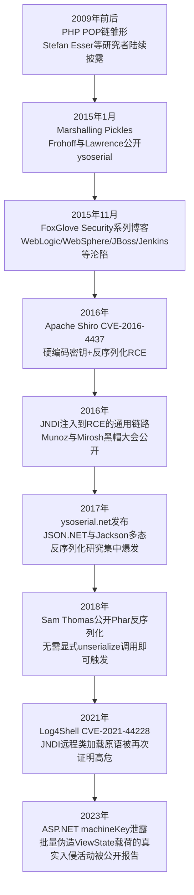
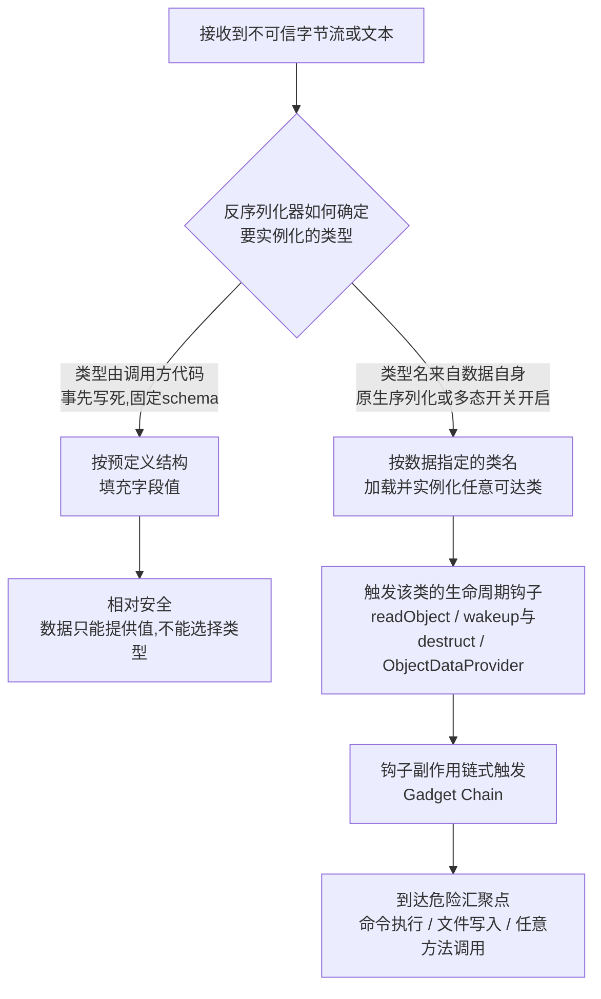
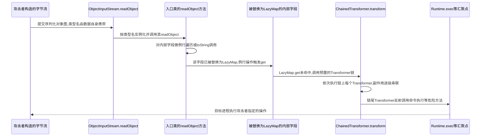
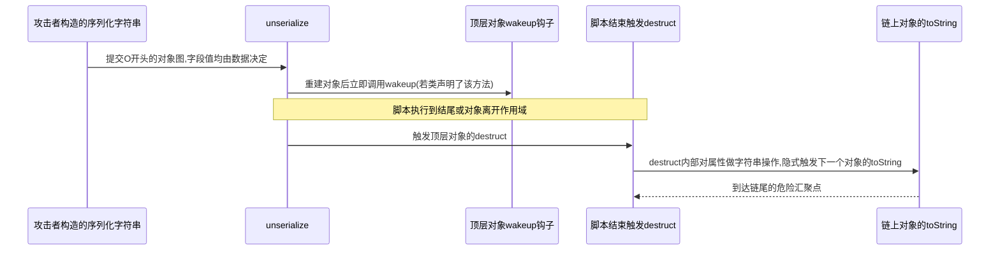
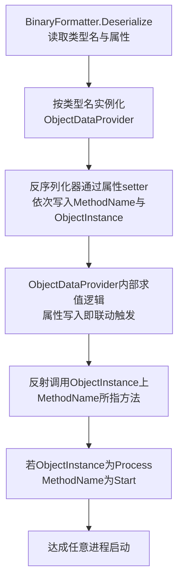

# Web与应用层安全（9）· 反序列化漏洞

> [!abstract] TL;DR
> - 反序列化漏洞与第4章的SQL/命令/模板注入同属"数据侵入控制平面"的失效模式，但路径不同：注入是文本被解释器错误地当语法解析，反序列化是攻击者直接指定"重建哪个类、填哪些字段"——类型解析权从可信代码转移到了不可信字节流手中，这是理解一切具体利用链的总纲。
> - Gadget Chain本质是应用层的ROP/JOP：不注入一行新代码，只挑选目标依赖树里已存在的"无害"类，把它们在生命周期钩子（Java的readObject、PHP的\_\_wakeup/\_\_destruct、.NET的ObjectDataProvider）里的副作用首尾相接，拼出一条通向命令执行的路径。
> - 二进制/文本从来不是安全边界，"类型名是否由不可信数据决定"才是：Protobuf是二进制却因schema编译期固定而安全，Jackson/Fastjson/JSON.NET打开多态类型解析开关后的JSON却和Java原生序列化一样危险——安全与否是同一个变量的两种载体形式。
> - 签名/加密不能替代类型白名单：Apache Shiro曾经的硬编码AES密钥、泄露或默认的ASP.NET machineKey，证明"防篡改"与"防止攻击者构造出你愿意反序列化的恶意对象图"是两个独立问题，密钥一旦泄露签名验证形同虚设。
> - 黑名单在这里同样数学必输——Jackson-databind多年来近乎一个CVE对应一个新发现的gadget类，Fastjson autoType黑白名单拉锯战贯穿数个大版本，结构性解法只有禁用多态类型解析或迁移到固定schema格式，穷举式打补丁永远慢半拍。
> - ysoserial/phpggc/ysoserial.net把"利用链目录"工具化，但其中如URLDNS这类链本身不能RCE，只触发一次DNS查询，专门用作确认目标是否存在反序列化入口的探针（canary）——检测和利用是两个独立的工程问题，不应混为一谈。

## 概述与定位

序列化（Serialization）与反序列化（Deserialization）是几乎所有现代应用都在使用、却极少被开发者当作"安全边界"来审视的一对基础设施能力：把内存中的对象图（object graph）转换成一段可以落盘、可以在网络上传输的字节流或文本，再在需要的时候原样重建出来。它的应用场景极其广泛——远程过程调用（RPC）的参数与返回值传递、HTTP会话状态在Cookie或服务端存储里的持久化、跨进程/跨语言的缓存（Redis里存一份序列化后的对象）、消息队列里流转的任务负载、桌面/富客户端框架的数据绑定、甚至像Java RMI、.NET Remoting这类以"让远程调用感觉和本地调用一样"为设计目标的技术，其底层传输的每一次参数都在做序列化与反序列化。正因为这套机制如此基础、如此"看不见"，它在漏洞分类体系里对应的CWE-502"不可信数据的反序列化"（Deserialization of Untrusted Data）才格外容易被忽视——大多数开发者从未把`ObjectInputStream.readObject()`、PHP的`unserialize()`、.NET的`BinaryFormatter.Deserialize()`这类调用和"正在解析一段可能被攻击者精心构造的恶意输入"联系起来，因为它们看起来只是一个"把字节还原成对象"的机械动作，不像`eval()`或拼接SQL那样直观地"看起来很危险"。

本篇在系列坐标系里的位置，第4章[[04.注入类漏洞：SQL与命令与模板]]已经提前埋下了伏笔：那一章在收尾时明确指出"反序列化漏洞讨论的是另一条'数据变代码'的路径，但走的不是文本语法解析而是对象图/字节码重建，触发机制和payload构造方式都不同"——这句话精确地划定了本篇与注入类漏洞的边界，也点明了本篇要展开的核心矛盘：注入类漏洞里，攻击者操纵的是字符串，下游解释器需要重新做词法/语法分析才会"上当"；反序列化里，攻击者操纵的是一段自描述的对象图数据，反序列化器不需要做任何语法解析，只需要按照数据自己声明的类型名去加载类、用反射填充字段、调用生命周期钩子，这条路径完全绕开了文本解释器的语法分析层，直接作用在运行时的类型系统与反射机制之上。与其它相邻章节的边界也需要提前厘清：[[08.访问控制与越权]]讨论的是"这个已认证身份能不能碰这条数据"，本篇讨论的是"这段数据本身在被还原成对象的过程中会不会执行代码"，二者正交；[[10.文件上传与路径穿越]]中提到的恶意载荷投递手段（上传接口、归档条目名）常常正是反序列化payload抵达服务端的运输方式，本篇只讨论载荷一旦被解析会发生什么；[[11.API与GraphQL安全]]会涉及序列化数据在API请求体/响应体中的具体载体形式；[[12.JWT与OAuth与OIDC安全]]处理的JWT本身也是一种"结构化、可跨系统传递的令牌数据"，但JWT的设计从一开始就明确区分了"载荷"（Payload，纯数据字段）与"算法声明"（Header里的alg字段仅用于选择验证签名的算法，不会导致任意类型被实例化），这与本篇要讨论的"数据自己决定实例化哪个类"是完全不同的信任模型，二者的对比会在原理部分具体展开。

三大主流生态各自独立地发展出了这类问题，又各自在不同的时间点被系统性地武器化：



这条时间线揭示的规律并非"某个语言天生更不安全"，而是同一个失效模式在三种完全不同的类型系统、反射模型与生态依赖习惯上分别找到了各自的落地方式；本篇后续会依次拆解Java、PHP、.NET三条主线各自的机制细节，再回到一个统一的防御框架收尾。

## 原理与机制

### 反射驱动的对象重建：为何反序列化天然绕过业务校验

理解反序列化为何危险，必须先理解它在设计目标上就与"正常创建对象"背道而驰。日常业务代码创建一个对象，走的是构造函数、走的是setter方法，这些入口通常携带着开发者手写的合法性校验（参数非空检查、取值范围校验、状态机约束）。而反序列化器要解决的问题是"如何通用地还原出任意一个曾经被序列化过的对象"，它并不知道、也不关心某个具体类的构造函数里写了什么校验逻辑——它需要的是一种能绕开这些校验、直接摆布对象内部状态的手段，这正是反射（reflection）机制存在的意义之一。Java的`ObjectInputStream`在反序列化时可以不经过任何构造函数直接分配内存并逐个字段赋值；PHP的`unserialize()`同样是先分配对象再回填属性；.NET的`BinaryFormatter`也遵循相同的思路。这个"绕过正常入口，直接摆布内部状态"的设计选择，对反序列化机制的存在价值而言是必需的，但也正是安全问题的根源：反射赋予的能力远不止"填几个字段"，它同样可以触发类型自身声明的生命周期钩子——Java的`readObject`/`readResolve`、PHP的`__wakeup`/`__destruct`/`__toString`、.NET的`OnDeserializing`/`OnDeserialized`回调以及属性setter的副作用。这些钩子在设计时的隐含假设是"能够触发它的数据一定来自己方写出的、可信的序列化器"，一旦这个假设被打破——数据来自网络另一端的攻击者——钩子就从"生命周期便利机制"变成了攻击者可以远程摆布的执行入口。

### 类型解析权：贯穿全篇的核心变量

反序列化和注入类漏洞共享同一个上位失效模式——都是"数据"侵入了"控制/语法平面"——但走的是完全不同的技术路径。注入是文本被拼接进另一段文本，交给一个文本解释器重新做词法/语法分析，攻击者操纵的是字符串本身；反序列化不经过任何"解析成语法树再求值"的过程，它直接根据字节流里携带的类型名去加载对应的类、构造对象。**类型名本身就是数据的一部分，"用哪个类型来重建这段数据"这个决定权，在没有防护的反序列化器里完全交给了字节流的内容，而不是运行这段代码的开发者**——这是理解本篇一切具体利用链的总纲。只要反序列化器允许数据自己声明"我是什么类型"并据此直接实例化，攻击者就不需要向目标系统注入任何新代码：目标系统classpath/依赖树/自动加载路径上已经存在的类，就是攻击者的全部武器库。这个视角下，反序列化漏洞的杀伤力和目标应用的依赖复杂度成正比——依赖树越庞大，可被滥用的候选类就越多，这也解释了为什么Apache Commons Collections这样一个几乎所有Java项目都会间接依赖、自身却"看起来人畜无害"的工具库，会成为过去十年杀伤力最大的反序列化利用链的核心构件：它从未打算提供任何危险能力，是它的通用性和被广泛依赖这一事实本身，把它变成了攻击者最容易取用的那把武器。

一个常见但不准确的直觉是"二进制格式=危险，文本格式=安全"，这个直觉部分来自Java原生序列化、.NET的BinaryFormatter都是二进制协议，而广为人知的"安全替代品"又常常是JSON这样的文本格式。但这条分界线本身是错的：真正决定安全与否的变量是"反序列化器在恢复对象时，用来决定实例化哪个类的类型名，来自开发者写死在代码里的固定schema，还是来自这段不可信数据自身携带的字段"，这个变量与编码是二进制还是文本正交。

| 维度 | 固定schema（相对安全） | 类型名随数据传递（危险） |
|---|---|---|
| 类型决定者 | 编译期/代码里写死的DTO类型 | 数据流自身携带的类名/`@type`/`$type`字段 |
| 数据能做什么 | 只能填值，不能选类型 | 既能填值，也能指定实例化哪个类 |
| 典型代表 | Protobuf、FlatBuffers、手写DTO的JSON反序列化 | Java原生序列化、.NET BinaryFormatter、PHP `unserialize()`、开启多态的Jackson/Fastjson/JSON.NET |
| 攻击面来源 | 无（数据无法触达类型系统） | 目标classpath/自动加载路径上的任意可达类 |

Protobuf、FlatBuffers、Cap'n Proto这类格式同样是二进制，但它们的"类型"在编译期就已经通过`.proto`/`.fbs`schema文件固定下来，写入数据流的只是按照预先约定的字段编号与线格式（wire format）排布的值，接收方从来不会"根据数据里的某个字段决定实例化一个数据里指定名字的类"——数据只能填值，不能选择类型，这才是它们相对安全的根本原因，而不是因为它们凑巧是二进制。反过来，Jackson的多态反序列化（`@JsonTypeInfo`开启"default typing"）、Fastjson的`autoType`、Newtonsoft.Json的`TypeNameHandling`，都是框架在JSON这个本来只是纯数据格式之上，额外叠加了一层"允许数据自己在`@type`/`@class`/`$type`字段里指定要实例化的类名"的便利功能——一旦打开，JSON就获得了和Java原生序列化完全相同的"类型解析权旁落"问题，只是载体从二进制字节流换成了人类可读的文本。判断一次反序列化调用是否危险，要检查的不是"这是JSON还是二进制"，而是"这次反序列化的目标类型，是不是完全由调用方代码事先写死的，还是数据自己说了算"。



### Gadget Chain：应用层的ROP/JOP

从"类型解析权旁落"这个根因往下走一步，就会遇到本篇最核心的技术概念——Gadget Chain（利用链）。它的命名与思路直接借用自二进制漏洞利用领域的Return-Oriented Programming（ROP，参见[[33.二进制漏洞与利用基础/06.ROP入门]]）：在开启了NX/DEP、不能直接注入并执行shellcode的前提下，攻击者转而在目标进程已经加载的合法代码里寻找一小段以`ret`结尾的指令序列（gadget），把大量这样"合法但零碎"的片段依次拼接，用栈上精心构造的返回地址序列驱动执行流从一个gadget跳到下一个gadget，最终拼出任意代码执行——整个过程不需要注入一个字节的新代码，用到的全部是目标进程本来就有的、各自看起来完全无害的指令。反序列化的Gadget Chain是同一个思路在应用层的重演：攻击者不需要向目标注入一个新的`.class`/`.php`/`.dll`文件，只需要在目标已加载的类库（往往是和业务逻辑毫无关系的基础工具库）里，找到一小段"合法但零碎"的副作用——某个类的`equals()`、`hashCode()`、`toString()`、`get()`方法在被调用时会顺带调用它内部持有的另一个对象的某个方法——把这些副作用依次串联，用序列化数据本身编码的对象图结构（而不是ROP里的栈返回地址）驱动执行流从一个gadget类的某个方法流转到下一个gadget类的某个方法，最终落到真正危险的汇聚点（命令执行、文件写入、反射任意方法调用）。

这个类比不是修辞意义上的比喻，而是结构上的同构，甚至可以进一步细化：如果说经典ROP更接近"线性拼接"，那么Jump-Oriented Programming与Call-Oriented Programming（JOP/COP，参见[[33.二进制漏洞与利用基础/13.JOP与COP面向跳转与调用编程]]）里"通过一个分发器gadget反复跳转调用不同功能gadget"的模式，其驱动结构其实和反序列化Gadget Chain更加神似——分发器的角色由反序列化器自身的对象图遍历逻辑来扮演（每还原一层属性就调用一次getter/setter，进而触发下一层对象的方法），功能gadget则是各个库类暴露出的、彼此独立编写却恰好能首尾相接的方法。两者共同满足的范式是：防御者已经堵死了直接注入执行体的路径，攻击者退而求其次利用目标自带的合法代码碎片拼出等价效果，唯一的区别是ROP/JOP的"指令序列"发生在CPU取指层面、驱动结构是栈帧或跳转表，Gadget Chain的"指令序列"发生在对象方法调用层面、驱动结构是对象引用图。这也解释了为什么二进制利用与Web安全两个社区分别独立地把"利用链"称作gadget——这个词精确抓住了"零碎、无害、被借用"这一共同核心特征。

## 三大生态Gadget链详解

### Java：ObjectInputStream、readObject与CommonsCollections

Java的序列化机制围绕`Serializable`标记接口（本身不含任何方法，仅作为"允许被序列化"的声明）与`ObjectOutputStream`/`ObjectInputStream`展开。类可以声明私有方法`writeObject(ObjectOutputStream)`/`readObject(ObjectInputStream)`来自定义序列化行为，这两个方法虽然是私有的，却会被序列化框架通过反射按精确签名匹配调用；此外`readResolve()`/`writeReplace()`用于实现序列化代理模式（Serialization Proxy Pattern），`serialVersionUID`用于版本兼容性校验。反序列化时，`ObjectInputStream.readObject()`读到一个对象的类型名后，会加载对应的类、分配内存、如果该类声明了自定义的`readObject`方法就调用它——这个调用点就是绝大多数Java反序列化利用链的入口。

真正让Java反序列化"闻名"的是Commons Collections这条链（在ysoserial工具里编号为CommonsCollections1等，即"CC链"）。它的核心构件是`org.apache.commons.collections.functors`包下的几个`Transformer`实现类：`InvokerTransformer`的`transform(Object input)`方法内部执行`input.getClass().getMethod(方法名, 参数类型).invoke(input, 参数)`——也就是说，这一个类的正常职责就是"对传入对象反射调用一个指定方法"，本身是Commons Collections提供的合法功能（用于函数式风格的集合转换），却天然构成了"任意反射方法调用"的原语；`ChainedTransformer`则可以把多个`Transformer`串成一条链，依次执行；`ConstantTransformer`只是简单返回一个预置的常量对象。三者组合起来，就能构造出"先拿到`Runtime`类，再获取其`getRuntime`方法并调用，再获取`exec`方法并调用"这样一条纯粹由`Transformer`副作用拼出的调用序列，而这条链真正被触发的时机，落在`LazyMap`这个类身上——它的`get(key)`方法在键不存在时会调用预置的`factory.transform(key)`来生成默认值；只要有任何代码路径以某种方式调用了`LazyMap.get()`（例如通过`TiedMapEntry`的`toString()`/`hashCode()`/`equals()`间接触发），预置好的`Transformer`链就会被执行。而"任何代码路径"具体落在哪里，早期版本利用的是JDK内部`sun.reflect.annotation.AnnotationInvocationHandler`的`readObject`方法——它在反序列化后会对内部持有的Map做一次例行遍历（本意是校验注解成员类型是否匹配），如果这个Map被替换成了`LazyMap`，这次"校验遍历"本身就会触发`LazyMap.get()`，进而拉出预先埋好的整条`Transformer`链，最终反射调用到命令执行。需要指出的是，JDK 8u71之后Oracle修改了`AnnotationInvocationHandler`的内部校验逻辑，使得这条原始入口不再可靠触发，ysoserial后续新增的CommonsCollections5/6/7等变体改用`javax.management.BadAttributeValueExpException`的`readObject`（它会对内部字段调用`toString()`）作为新的入口——这段演化史本身就是一个很好的例证：**利用链依赖的是"恰好存在的副作用"这种偶然性，而不是设计上的必然性，一旦上游任何一个环节的实现细节发生变化，整条链就可能失效，需要重新寻找新的入口点**，这也是为什么ysoserial会为同一个"最终效果"（命令执行）收录十几条名字不同的链——它们的差异主要在于"从readObject到LazyMap.get()之间具体经过哪些类"。



这条链在2015年1月由Chris Frohoff与Gabriel Lawrence在"Marshalling Pickles"演讲中首次系统公开并配套发布ysoserial工具，同年11月FoxGlove Security团队发布系列博客，实证了这条链可以直接命中WebLogic、WebSphere、JBoss、Jenkins、OpenNMS等一大批依赖了Commons Collections的真实商业与开源系统，这波集中爆发是Java反序列化从"学术趣味"变成"行业级紧急事件"的转折点。此后围绕Java反序列化还形成了若干重要的旁支：Apache Shiro的"记住我"（RememberMe）功能把用户身份信息序列化后用AES加密、Base64编码存入Cookie，CVE-2016-4437的根因是早期版本使用了一个文档示例里出现、后来变成事实默认值的固定AES密钥——攻击者只要知道这把密钥，就能自行加密一段包含Commons Collections链的恶意序列化数据，伪造成合法的RememberMe Cookie提交给服务端，服务端解密后原样反序列化触发RCE，这个案例后续会在"安全性与正确使用"一节里作为"签名/加密不能替代类型白名单"的核心例证展开。另一条重要旁支是JNDI注入：安全研究者Alvaro Muñoz与Oleksandr Mirosh在2016年的黑帽大会上系统公开了"从JNDI/LDAP操纵到远程代码执行"的通用链路——如果一条反序列化链的终点是调用`javax.naming.InitialContext.lookup()`一类JNDI查询接口，指向攻击者控制的LDAP/RMI服务，该服务可以返回一个携带远程Reference的对象，驱动目标从远程加载一个"工厂类"并实例化，从而达成代码执行，这个原语后来在2021年的Log4Shell（CVE-2021-44228）中以完全不同的触发方式再次成为焦点——需要特别澄清的是，**Log4Shell本身并不是一个反序列化漏洞**，它的根因是Log4j的消息查找替换（Lookup）功能会对日志内容里`${jndi:...}`这样的字符串做变量替换求值，属于字符串插值/表达式求值类问题，更接近第4章讨论的注入范畴；但它触发RCE所依赖的最后一环——JNDI远程类加载——与部分以JNDI查询为终点的反序列化利用链完全相同，二者是"殊途同归"而非"同一个漏洞"，这个区分在技术评估和漏洞归类时必须讲清楚，避免把两类性质不同的问题混为一谈。除此之外，WebLogic在2015年至2019年间围绕其私有T3/IIOP协议反复爆出多个反序列化RCE，其中CVE-2017-10271涉及的`wls-wsat`组件使用`java.beans.XMLDecoder`解析请求，XMLDecoder读取的XML本身就可以直接描述"调用某个构造函数、再调用某个方法"，不需要借助任何gadget链的偶然副作用即可达成任意方法调用，是一种更直接、但同样属于反序列化范畴的变体；Jackson-databind在开启"default typing"多态反序列化后，多年来近乎以"一个CVE对应一个新发现的gadget类"的节奏被持续报告（例如涉及c3p0数据源、Xalan等具体gadget类各自单独编号CVE），这个模式本身就是黑名单式修复注定失败的活教材。

### PHP：unserialize、魔术方法与POP链

PHP的序列化格式是一种自描述的文本格式，`serialize()`产出的字符串结构直观可读：

```text
O:8:"ClassName":2:{s:4:"name";s:5:"admin";s:3:"age";i:30;}
```

其中`O`表示对象，`8`是类名字节长度，`ClassName`是类名，`2`是属性个数，花括号内交替给出属性名与属性值，`s:`开头表示字符串（后跟字节长度）、`i:`表示整数、`b:`表示布尔、`a:`表示数组、`N;`表示null。这里有一个经常成为陷阱的细节：非public属性在序列化后并不是原样写出属性名——private属性的属性名会被加上`\0类名\0`前缀，protected属性会被加上`\0*\0`前缀，这些空字节（`\0`）都要计入`s:`声明的字节长度里，手工阅读或构造序列化数据时如果没有意识到这一点，很容易因为长度对不上而导致`unserialize()`直接报"Error at offset"解析失败——这也是为什么现实中的PHP反序列化利用几乎不靠手写字符串，而是靠工具根据目标类的真实属性可见性自动生成。

PHP反序列化的攻击面来自一组"魔术方法"（Magic Methods）：`__wakeup()`在`unserialize()`重建对象后立即被调用，通常用于恢复对象状态（如重新建立数据库连接）；`__destruct()`在对象离开作用域或脚本执行结束时被调用——这个特性意味着即便应用代码对反序列化得到的对象什么都不做，只要脚本正常结束，`__destruct`依然会被触发，是POP链里最常见的"自动触发点"；`__toString()`在对象被用在字符串上下文（拼接、`echo`、类型转换）时隐式调用，是POP链里最常见的"链尾"；此外`__get`/`__set`/`__call`/`__invoke`也都是潜在的钩子。安全社区把利用这些魔术方法副作用串联出攻击路径的技巧称为POP（Property-Oriented Programming，面向属性编程）——这个命名同样直接呼应了ROP（Return-Oriented Programming）的命名传统，两个语言社区各自独立地得出了"用现有代码的副作用拼出攻击链"这同一个思路，本身就说明这个模式具有跨语言的普适性，而不是某一门语言实现细节的偶然产物。

一个最小化的POP链结构可以用三个不涉及任何真实框架的抽象类说明：

```php
// 仅用于说明POP链结构的最小玩具示例,非任何真实框架代码
class Sink {
    public $cmd;
    public function __toString() {
        return "would use: " . $this->cmd; // 真实场景中此处可能是危险汇聚点
    }
}
class Bridge {
    public $target;
    public function __destruct() {
        echo $this->target; // 字符串上下文隐式触发__toString,链条在此转移
    }
}
// 攻击者构造的顶层对象是Bridge,其属性target指向一个Sink实例
// unserialize()重建对象图后,脚本结束时自动调用Bridge::__destruct
// echo将target转换为字符串,继而调用Sink::__toString
// 全程只是两个"看起来无害"的类各自默认行为的自然结果,没有注入任何新代码
```



围绕`__wakeup()`还有一段值得记录的历史陷阱：CVE-2016-7124显示，如果序列化字符串里声明的属性个数（`O:8:"ClassName":`后面紧跟的数字）大于对象实际拥有的属性个数，早期PHP版本会跳过`__wakeup()`的调用——这曾被用来绕过一些"在`__wakeup`里做校验、试图阻止反序列化恶意数据"的防御代码，因为校验逻辑本身也被这个解析层面的怪癖一并跳过了；该问题已在PHP 5.6.25与7.0.10中修复，但它提示了一个通用道理：**依赖某个魔术方法内部的业务校验来防御反序列化，其安全性完全取决于反序列化格式解析器自身的正确性，校验代码和它试图保护的解析器如果不在同一个信任层级上，校验本身就可能被绕过**。

另一个更隐蔽的攻击面是Phar反序列化，由安全研究者Sam Thomas于2018年系统公开。Phar归档文件（`.phar`）内部格式包含一段stub、一段manifest（清单）、文件内容与可选签名，其中manifest里存储着一个**序列化后的元数据对象**。关键在于：只要PHP代码把攻击者可控的文件路径传给了`file_exists()`、`is_file()`、`getimagesize()`、`fopen()`等一系列文件系统函数，并且这个路径以`phar://`流包装器可解析的形式指向了一个精心构造的phar文件，PHP在处理这个路径时会解析phar的manifest，进而触发对其中序列化元数据的反序列化，即便应用代码从未在任何地方显式调用过`unserialize()`。这是一种典型的"混淆代理"（Confused Deputy）式攻击面——开发者以为自己只是在做一次普通的文件存在性检查，实际上触发了一整条反序列化的生命周期钩子链。这个案例特别值得写进任何反序列化审计清单的原因是：它证明**反序列化的攻击面边界，比"代码里能搜到的`unserialize(`调用"要宽得多**，任何接受用户可控路径字符串的文件系统API调用都需要纳入审查范围。

在实战与研究工具层面，PHPGGC（PHP Generic Gadget Chains）扮演着PHP生态里ysoserial的角色，收录了针对Laravel、Symfony、CodeIgniter、Guzzle、Monolog、WordPress等主流框架与组件的数十条POP链，这些链条大多依托框架自身为了实现日志、缓存、事件分发等正当业务功能而定义的类与魔术方法——这一点和Java的CC链依赖"纯工具库的偶然副作用"略有不同：PHP的POP链更常见的形态是"借用应用框架本身为合法业务目的编写的魔术方法"，因为PHP项目的依赖结构相对Java更贴近具体框架而非海量传递依赖，攻击者能借用的"素材"很大程度上就是这个框架自己写的代码。

### .NET：BinaryFormatter、ObjectDataProvider与ViewState

.NET生态里`BinaryFormatter`、`SoapFormatter`、`NetDataContractSerializer`、`LosFormatter`这一族序列化器，和Java原生序列化属于同一类别——序列化流本身携带完整的类型信息，反序列化时按流内类型名直接实例化。微软近年官方明确将`BinaryFormatter`标记为过时并建议禁用，在较新的.NET版本中默认直接拒绝执行，这是官方级别上少见地承认"某个API无法被安全地使用，只能整体淘汰"而非"修复"的案例，原因会在下文的利用链细节里体现。

.NET反序列化链条里最具代表性的gadget是`System.Windows.Data.ObjectDataProvider`——这是WPF数据绑定基础设施提供的一个类，它的设计目的就是"根据配置的类型与方法名，在数据绑定求值时反射调用该方法"，对外暴露`ObjectInstance`（目标对象）与`MethodName`（要调用的方法名）等属性。当反序列化器按照正常流程通过属性setter依次回填这些属性时，`ObjectDataProvider`内部的求值逻辑会被联动触发，进而对`ObjectInstance`反射调用`MethodName`指定的方法——如果`ObjectInstance`被设置成一个`System.Diagnostics.Process`对象、`MethodName`设置成`Start`，效果就是任意进程启动。这个案例值得单独指出一个和Java/PHP的结构性差异：Java的CC链需要经过好几跳"偶然的副作用"才能拼出反射调用能力，PHP的POP链也往往需要经过多个中间类的属性传递；而`ObjectDataProvider`的"设计初衷"本身就是"数据决定调用哪个方法"，几乎不需要额外的跳转就能直接构成一个可用的gadget——这是因为WPF的数据绑定模型本身就需要这种"由配置驱动、反射执行"的能力，只是这项能力被建立在.NET没有对反序列化做类型限制的前提之上，才从"合法的数据绑定特性"变成了"现成的攻击原语"。ysoserial.net（由安全研究者Alvaro Muñoz与Oleksandr Mirosh开发并于2017年系统公开）收录了包括`ObjectDataProvider`、`TypeConfuseDelegate`（利用委托反序列化时的类型混淆达成任意方法调用）、`ActivitySurrogateSelector`（利用序列化代理选择器机制在类型过滤检查之外另辟蹊径）、`PSObject`（借助PowerShell对象模型）、`WindowsIdentity`等在内的多条链，对应不同的序列化器（`BinaryFormatter`/`SoapFormatter`/`NetDataContractSerializer`/`Json.Net`/`LosFormatter`等）与不同的.NET运行时版本组合。



与Java的Jackson、PHP的原生格式类似，.NET生态在JSON这个"本来安全"的格式上也重演了同样的问题：Newtonsoft.Json（JSON.NET）提供了`TypeNameHandling`设置项，一旦被设为`Auto`/`All`/`Objects`/`Arrays`，反序列化时会读取JSON里的`$type`字段来决定实例化哪个.NET类型，这与Jackson的"default typing"、Fastjson的`autoType`在原理上完全同构，三门语言生态各自独立地在自己的JSON库上开出了同一个安全豁口。它的攻击面形状可以抽象示意如下：

```jsonc
// 示意JSON多态类型攻击面的结构形状,字段名与嵌套关系为教学抽象,非可直接使用的载荷
{
  "$type": "<反序列化时会被实例化的目标类型全限定名>",
  "MethodName": "<该类型对外暴露、可被反射调用的方法>",
  "ObjectInstance": {
    "$type": "<链上下一跳的类型>",
    "...": "..."
  }
}
```

这段结构说明的是原理层面的攻击面形状——`$type`字段一旦被信任，嵌套的对象图就可以逐层指定"下一跳实例化谁"，与`ObjectDataProvider`的属性驱动机制结合就能拼出与二进制序列化场景完全等价的利用效果，只是把类型信息从二进制流搬进了一段JSON文本。

.NET生态里还有一个高度场景化、历史上造成过大规模真实入侵的变体：ASP.NET WebForms的`__VIEWSTATE`隐藏字段。ViewState本质上是页面控件状态经`LosFormatter`序列化、Base64编码后塞进表单的一段数据（解码后的原始字节常以`FF 01`开头，对应到Base64文本上表现为很多样本以`/wEP`开头，这是识别ViewState载荷的常见特征）。ASP.NET通常会用`<machineKey>`配置的验证密钥对ViewState做MAC签名（`EnableViewStateMac`），理论上未持有该密钥就无法伪造合法签名；但如果这把密钥因配置文件泄露、使用了框架历史版本里过窄的默认密钥集合，或`EnableViewStateMac`被显式关闭，攻击者一旦拿到密钥就可以自行签发一段包含`ObjectDataProvider`链的ViewState，服务端验证签名通过后照常反序列化触发RCE——这类由machineKey泄露驱动的批量利用活动在2023年被安全社区与厂商公开报告为真实发生的入侵事件，再次印证了"签名验证的是数据完整性，不是数据的安全性"这一在Shiro案例中已经出现过的教训。历史上.NET也曾尝试用`SerializationBinder`白名单、`FormatterAssemblyStyle`/`TypeFilterLevel`等机制在反序列化层面做类型过滤，但`ActivitySurrogateSelector`这类利用序列化代理机制、绕开常规类型检查点的手法证明了"事后打补丁式的白名单"依然可能被绕过——这正是微软最终选择彻底废弃`BinaryFormatter`而不是持续打补丁的根本原因：一个攻击面如果连"自己的官方维护者"都无法穷举清楚所有绕过路径，唯一彻底的解法是取消这个攻击面本身。

### 跨语言横向对比

| 维度 | Java | PHP | .NET |
|---|---|---|---|
| 典型载体 | `ObjectInputStream`二进制流；Jackson/Fastjson多态JSON | `serialize()`文本格式；Phar归档元数据 | `BinaryFormatter`等二进制流；JSON.NET多态JSON；ViewState |
| 类型决定方式 | 类名写入字节流，`readObject`按名反射实例化 | `O:len:"ClassName"`标签，`unserialize`按名实例化 | 类型全限定名写入流或`$type`字段 |
| 生命周期钩子 | `readObject`/`readResolve`/间接的`equals`/`hashCode`/`toString` | `__wakeup`/`__destruct`/`__toString`/`__get`/`__call` | 属性setter副作用（如ObjectDataProvider）/`OnDeserializ*`回调 |
| 链条形态 | 多跳，依赖库类之间偶然存在的方法副作用 | 多跳POP链，常借用框架自身业务用途的魔术方法 | 常为单跳或极短链，`ObjectDataProvider`本身即"调用即服务" |
| 代表工具 | ysoserial | phpggc | ysoserial.net |
| 代表历史事件 | CommonsCollections链+2015年FoxGlove系列RCE | 2018年Phar反序列化 | 2023年ViewState machineKey泄露批量利用 |
| 官方长期应对 | JEP 290 `ObjectInputFilter`白名单 | `unserialize()`的`allowed_classes`参数（PHP 7起） | 官方弃用`BinaryFormatter`，新版本默认拒绝执行 |

这张表格背后有一层更深的原因值得展开：.NET链条普遍更短，是因为`ObjectDataProvider`这类WPF基础设施类的设计初衷就自带"数据驱动反射调用"的语义，几乎不需要额外拼接；Java链条依赖的是纯工具库（Commons Collections等）里各个方法之间纯属巧合的副作用组合，这些类的作者从未设想过它们会被这样使用，所以链条通常更长、更脆弱（一次不相关的实现细节调整就可能打断整条链，如前文提到的JDK 8u71变更）；PHP的POP链介于两者之间，因为PHP应用/框架代码经常出于日志、缓存、队列等正当业务目的自行定义魔术方法，这些"业务魔术方法"往往比纯工具库的偶然副作用更直接地通向危险操作（文件写入、命令拼接），链条长度和链条来源的"业务相关性"通常比Java更高。

### 变体：其它语言生态的同构重现

这套失效模式并非Java/PHP/.NET三门语言独有，而是"通用序列化格式一旦被设计成可以携带可执行语义"这条规律的反复重现：Python的`pickle`模块里，任何类只要定义了`__reduce__`/`__reduce_ex__`方法就可以在反序列化时指定"用什么可调用对象、传什么参数来重建自己"，这是Java`readObject`/PHP`__wakeup`思路的直接对应物，也是Python官方文档明确警告"永远不要对不可信数据调用`pickle.load`"的原因；PyYAML的`yaml.load()`如果不显式传入`Loader=SafeLoader`，同样支持`!!python/object/apply:`标签在反序列化时实例化并调用任意可调用对象；Ruby的`Marshal.load`与`Psych`（Ruby的YAML库）历史上也出现过对应的CVE（如Rails生态曾经的YAML反序列化问题）；Node.js生态里曾经流行的`node-serialize`包用一个可识别的字符串前缀标记"这是一段函数体"，反序列化时直接对其求值。这些变体不是本篇的重点，但足以说明反序列化漏洞是一类**跨语言的结构性问题**，而不是某三门语言各自实现细节上的偶然巧合。

## 工具视角与实战

### 利用链生成工具：ysoserial、phpggc、ysoserial.net

三个生态各自沉淀出了扮演"利用链目录"角色的工具，它们的核心价值不是某一条具体payload，而是把大量已知gadget链的构造过程代码化、可复现化。ysoserial（Java）的典型调用形态是：

```text
java -jar ysoserial.jar <GadgetChainName> "<在自建靶场里验证的命令>" > payload.bin
```

其中`<GadgetChainName>`对应工具源码里为某一条具体链单独实现的一个类（如前文提到的CommonsCollections系列、Groovy、ROME、Spring、Clojure等，各自依赖目标classpath上存在对应的库）。这里有一个经常被忽视但非常重要的细节：`URLDNS`这条"链"本身并不能执行任意命令，它的效果仅仅是构造一个会在反序列化过程中触发一次DNS解析的对象（利用`java.net.URL`的`hashCode()`会触发DNS查询这一行为）——它存在的意义不是攻击，而是**探测**：在还不确定目标classpath上到底有哪些可用库、无法判断该用哪条具体RCE链之前，先投递`URLDNS`payload并观察是否发生一次可控的DNS回连，只需要确认"目标是否存在反序列化入口、且会真正执行到危险的方法调用点"这一个是非问题，而不需要一次性赌中某条具体的RCE链——这是一个很好的例证：**检测（这里到底有没有洞）和利用（洞打出什么效果）是两个独立的工程问题，混为一谈会让排查效率大打折扣**。这种通过诱导目标发起一次可被己方观测的网络请求来判断内部状态的方法论，与第4章讨论的带外盲注（OOB Blind Injection）在方法论层面完全同构，都是把"看不到直接回显"的判断问题转化为"诱导目标主动发起一次可观测的网络事件"这一可检测信号，可以配合Burp Collaborator或interactsh一类带外协作服务器使用。

phpggc的调用形态类似：

```text
phpggc <Framework/ChainName> <目标函数> "<自建靶场里验证的参数>" -b
```

`-b`表示直接输出Base64编码后的载荷，便于放进Cookie或表单字段里做验证性测试。ysoserial.net（.NET）则通常需要同时指定gadget与目标使用的序列化器：

```text
ysoserial.exe -g <Gadget> -f <Formatter> -o base64 -c "<自建靶场里验证的命令>"
```

其中`-f`参数体现了.NET场景一个特有的复杂度——同一个gadget在`BinaryFormatter`/`SoapFormatter`/`NetDataContractSerializer`/`Json.Net`等不同序列化器下的具体字节布局不同，需要分别适配；工具还提供`-t`测试模式，可以在本地完成一次不依赖真实网络目标的序列化/反序列化闭环验证，纯粹用于理解payload结构而不需要打向任何服务；`-p ViewState`插件模式则专门用于在**已经掌握目标的machineKey验证与解密密钥**（例如授权测试中客户主动提供，或己方实验环境自行配置）的前提下，直接生成一段签名合法的ViewState载荷，这个前提条件本身就说明该功能设计定位是"验证密钥泄露的实际影响"而非"破解密钥"。

### 静态可达性分析：从已知链到未知链

除了复现已公开的链，更进一步的研究方向是自动化寻找尚未被公开报告过的新链，这类工具的思路是构建一张"从反序列化生命周期钩子出发，沿方法调用关系能到达哪些方法"的可达性图（reachability graph），再在图上搜索能落到危险汇聚点（反射调用、命令执行、文件操作）的路径——gadgetinspector是这类思路在Java生态的代表性实现，它对目标classpath上的所有jar做静态字节码分析，构建方法间的数据流与调用关系，再做可达性搜索；Serianalyzer是另一个类似方向的早期工具；GadgetProbe则走黑盒路线，通过逐一探测特定候选类名是否存在于目标classpath（利用类不存在时反序列化会抛出`ClassNotFoundException`、类存在但字段不匹配时抛出不同异常这一响应差异）来推断目标依赖了哪些库，进而缩小可用gadget的搜索范围。这套"静态构建可达性图、再在图上搜索到达汇聚点的路径"的方法论，与二进制利用里[[33.二进制漏洞与利用基础/22.利用开发工具链：pwntools与ROPgadget]]扫描一个二进制文件、索引出所有以`ret`结尾的指令序列供后续拼接使用，在思路上完全一致——一个是在字节码/类文件里找方法级别的gadget，一个是在机器码里找指令级别的gadget，工具解决的是同一类"给定一堆现成的合法碎片，自动找出能拼成攻击链的组合"问题。

### 检测特征与被动扫描

反序列化载荷在字节/文本层面通常带有可识别的特征，是被动检测的第一道信号来源：Java原生序列化流以固定的魔数开头（`AC ED 00 05`，对应`java.io.ObjectStreamConstants`里定义的`STREAM_MAGIC`与`STREAM_VERSION`），这段字节经Base64编码后固定以`rO0`开头，出现在Cookie值或请求参数里的`rO0`前缀是判断"这里可能藏着一段Java序列化数据"最常用的启发式signal；PHP序列化数据以`O:`（对象）/`a:`（数组）/`s:`（字符串）等标签字符开头，文本形态本身可读；.NET的ViewState载荷Base64解码后常以`FF 01`开头，对应Base64文本的`/wEP`前缀。Burp Suite生态里的Java Deserialization Scanner、检测Fastjson/Jackson等JSON库反序列化风险的Freddy插件，都是把这类字节/文本特征匹配和主动投递`URLDNS`一类探测型payload结合起来的被动+半主动混合检测工具。但必须强调：**特征匹配注定滞后于新发现的gadget链**——WAF/RASP如果只匹配已知的类名黑名单或固定的魔数前缀，编码变体（例如对魔数做二次编码、把载荷拆分到多个参数）与新发现的gadget类都可能绕过，这与第4章、第10章反复强调的"黑名单在数学上必输"是同一条规律在检测层面的体现。

### 代码审计视角

白盒代码审计定位反序列化风险，核心是搜索一组已知高危API的调用点作为审计起点：Java的`ObjectInputStream`/`readObject(`/`XMLDecoder`、Jackson的`@JsonTypeInfo`/`enableDefaultTyping`、Fastjson的`autoType`相关配置；PHP的`unserialize(`（尤其要注意第二个参数是否设置了`allowed_classes`）；.NET的`BinaryFormatter`/`SoapFormatter`/`NetDataContractSerializer`/`TypeNameHandling`。找到调用点之后，需要向上追溯这段字节流/文本的来源是否可信（是己方系统内部生成的，还是直接来自HTTP请求体、Cookie、消息队列消息体等外部输入），这是一次典型的source-sink污点追踪，CodeQL、Semgrep等静态分析工具都内置了针对CWE-502的规则包，可以把这套追踪过程自动化；但和前面章节强调过的类似，工具容易漏报"校验逻辑写在辅助函数里、但真正的反序列化调用走了另一条完全没经过该校验的代码路径"这类跨函数、依赖业务上下文的逻辑缺陷，人工复核在这类审计里依然不可替代。

## 安全性与正确使用

### 根治方案：消灭数据决定类型的可能性

反序列化漏洞的结构性解法，是让"类型解析权"永远留在可信代码一侧：对任何跨越信任边界（网络请求、外部消息队列、用户可控的Cookie/表单字段）的数据，优先选用schema在编译期/部署期就已固定、反序列化器不会根据数据自身内容决定实例化哪个类的格式——Protobuf、FlatBuffers，或者手写DTO类、关闭一切多态类型解析开关的JSON反序列化。这不是"换一种编码"这么简单的操作，而是从架构设计阶段就消除攻击面存在的前提条件，比任何运行时过滤都更彻底。

### 退而求其次：白名单过滤器

如果历史包袱导致原生序列化机制短期内无法完全移除，三个生态都提供了不同成熟度的类型白名单能力。Java自JEP 290（JDK 9，并回溯到8u121/7u131/6u141）起提供`java.io.ObjectInputFilter`：

```java
ObjectInputFilter filter = ObjectInputFilter.Config.createFilter(
    "com.example.dto.*;!*"   // 仅允许己方DTO包下的类,其余一律拒绝
);
ObjectInputStream ois = new ObjectInputStream(in);
ois.setObjectInputFilter(filter);
```

也可以通过`jdk.serialFilter`系统属性设置进程级的全局兜底过滤器；JDK 17引入的JEP 415进一步支持按上下文（比如区分RMI调用与普通反序列化）配置差异化的过滤策略。PHP的方案更为直接，`unserialize()`自PHP 7.0起接受第二个参数：

```php
// 显式禁止实例化任何对象,仅还原标量与数组
$data = unserialize($raw, ['allowed_classes' => false]);
// 或仅放行明确需要的类
$data = unserialize($raw, ['allowed_classes' => ['App\\Dto\\OrderDto']]);
```

值得强调的是，现实中相当比例的PHP反序列化事故，根因并非"没有防御手段"，而是这个参数长期停留在默认值`true`（允许任意类）、或开发者根本不知道它的存在——这是一个"武器已经发到手里却没有使用"的典型案例。.NET可以通过自定义`SerializationBinder`实现类似效果：

```csharp
// 自定义SerializationBinder,仅允许显式登记的类型
public sealed class AllowListBinder : SerializationBinder {
    private static readonly HashSet<string> Allowed = new() {
        "MyApp.Dto.OrderDto"
    };
    public override Type BindToType(string assemblyName, string typeName) {
        if (!Allowed.Contains(typeName))
            throw new SerializationException($"类型不在白名单: {typeName}");
        return Type.GetType($"{typeName}, {assemblyName}");
    }
}
```

但前文已经指出，`ActivitySurrogateSelector`一类利用序列化代理机制、绕开常规类型检查点的手法证明了白名单Binder本身也并非绝对可靠——这提示白名单过滤应当被定位为纵深防御的一层，而不是可以完全替代"根治方案"的银弹，这也是微软最终选择整体废弃`BinaryFormatter`而不是持续打补丁的根本原因：一个攻击面如果连官方维护者都无法穷举清楚所有绕过路径，唯一彻底的解法是取消这个攻击面本身。

### 签名与加密不能替代类型白名单

Apache Shiro的硬编码密钥、ASP.NET machineKey泄露这两个案例反复出现在本篇的历史叙事里，是因为它们共同指向同一个必须被反复强调的认知陷阱：**对序列化数据做签名或加密，防御的是"篡改"，不是"反序列化本身携带的执行风险"**。签名验证能确保的是"这段数据没有被不知道密钥的人修改过"，一旦攻击者以任何方式获得了密钥（硬编码、默认值、配置泄露、弱密钥被爆破），他们完全可以用这把合法密钥自己签发一段包含恶意对象图的、签名完全有效的数据——服务端的签名校验会顺利通过，之后原样反序列化，前面讨论的所有利用链机制照常生效。这个陷阱的根源在于开发者把"完整性保护"和"内容安全性"当成了同一件事，而它们其实是两个独立的安全属性，同样的推理也出现在[[37.密码学/62.协议误用与密码工程]]讨论的密钥管理与协议误用问题里——密码学原语本身的正确性，从来不能弥补它所保护的上层协议在设计上存在的其它缺陷。与之形成鲜明对比的是[[30.Windows认证与生物识别编程/08.WebAuthn与FIDO2与passkey编程]]描述的现代认证协议：WebAuthn的assertion是一段经过签名的结构化数据，服务端校验的是签名与挑战值，全程不存在"服务端把一段自称携带类型信息的数据按该类型反序列化重建"这个动作，这正是"数据格式设计上根本不携带可执行语义"这一原则在认证协议里的具体体现，也是为什么现代认证/令牌类协议（同样可参见[[12.JWT与OAuth与OIDC安全]]）普遍转向JSON这类固定字段结构、而不是语言原生序列化格式的深层原因。

### 纵深防御清单

- **依赖最小化**：更少的第三方库意味着更少的候选gadget类，移除未使用的传递依赖是一条真实有效的安全控制，而不只是工程卫生——Commons Collections广泛存在于几乎不打算使用它的项目depndency tree里，正是Java反序列化影响面如此之广的直接原因；
- **持续升级依赖**：即使应用自身的反序列化调用点因历史原因无法移除，及时升级Commons Collections、Jackson-databind、XStream等"gadget库"本身的版本同样能斩断已知链条——Commons Collections在3.2.2与4.1之后的版本里，已经对`InvokerTransformer`等高危`Transformer`实现类默认禁止反序列化，除非显式设置系统属性重新启用，这是"补丁打在gadget库、而不是应用自身调用点"的现实案例，提示依赖升级本身就是一种有效的反序列化风险缓解手段；
- **最小权限与沙箱隔离**：处理不可信反序列化输入的进程/服务应当以最低必要权限运行，配合容器化、seccomp、AppArmor等操作系统级隔离，作为gadget链万一利用成功之后限制爆炸半径的最后一道防线；
- **CI阶段静态扫描门禁**：把针对`ObjectInputStream`/`unserialize(`/`BinaryFormatter`裸调用、以及`TypeNameHandling`/`autoType`/`enableDefaultTyping`等危险配置项的规则接入代码提交流水线，在新代码引入这类调用时即时拦截，而不是等到渗透测试或事故复盘阶段才发现；
- **WAF/RASP作为兜底而非主防线**：基于魔数/类名黑名单的检测规则天然滞后于新发现的gadget链，价值在于提供纵深防御的一层与可观测性（告警、审计日志），不能替代前述架构层面的根治与白名单方案。

> [!caution] 合规与授权边界
> 本篇涉及的ysoserial/phpggc/ysoserial.net等工具用法、Gadget Chain构造原理、Phar反序列化触发方式等技术，仅可用于自己拥有完整所有权的系统、已获得书面授权的渗透测试/众测项目，以及专门搭建的CTF靶场与安全研究实验环境。文中出现的命令与代码均为教学性质的最小化示意（占位符命令、抽象玩具类），不构成、也不应被理解为可直接用于任何真实生产系统、他人系统或商业软件授权机制的可复用攻击载荷。在此边界之外，对任何未授权系统投递反序列化探测或利用载荷，无论是否造成实际损害，都可能触犯《中华人民共和国网络安全法》及《刑法》第285、286条等相关规定。本篇通篇采用防御与检测视角组织内容，原理讲透是为了让读者能够识别、修复、审计自己负责的系统，而非提供针对真实目标的成品攻击配方。

## 小结

反序列化漏洞的核心矛盾可以归纳为一句话：反序列化器为了能够通用地重建任意历史对象，天然需要绕开构造函数与setter方法通常携带的业务校验，直接用反射摆布对象状态并触发生命周期钩子——这个"绕过"能力一旦被不可信数据触达，"用哪个类型重建这段数据"的决定权就从可信代码转移到了攻击者手中，这与第4章讨论的注入类漏洞共享同一个"数据侵入控制平面"的上位失效模式，却走的是对象图重建而非文本语法解析这条完全不同的技术路径。Gadget Chain是这个根因在利用手法上的具体呈现，其思路与二进制利用领域的ROP/JOP结构同构：不注入新代码，只是把目标依赖树里现成的、各自无害的类的副作用首尾相接。Java的CommonsCollections链证明了海量传递依赖会把工具库变成武器库，PHP的POP链证明了框架自身的业务魔术方法同样是天然的链条素材，.NET的ObjectDataProvider证明了"数据驱动反射调用"一旦缺少类型限制就是现成的单跳gadget——三个生态的具体机制不同，但结构性教训完全一致：二进制/文本编码从来不是安全边界，类型解析权是否留在可信代码一侧才是；签名与加密解决的是篡改问题而非类型安全问题；黑名单式的补丁必然滞后于新发现的gadget，唯一的结构性解法是从架构上消灭"数据决定类型"这个前提，退而求其次才是白名单过滤与纵深防御。

## 相关阅读

- CWE-502（不可信数据的反序列化）
- OWASP Deserialization Cheat Sheet
- Oracle官方文档：Java Object Serialization Specification、JEP 290、JEP 415
- PHP官方手册：unserialize()与`allowed_classes`选项说明
- Microsoft官方文档：BinaryFormatter安全指南与弃用说明
- [[04.注入类漏洞：SQL与命令与模板]]
- [[08.访问控制与越权]]
- [[10.文件上传与路径穿越]]
- [[11.API与GraphQL安全]]
- [[12.JWT与OAuth与OIDC安全]]
- [[33.二进制漏洞与利用基础/06.ROP入门]]
- [[33.二进制漏洞与利用基础/13.JOP与COP面向跳转与调用编程]]
- [[33.二进制漏洞与利用基础/22.利用开发工具链：pwntools与ROPgadget]]
- [[71.详解网络协议/18.HTTP-HTTPS协议]]
- [[71.详解网络协议/15.TLS协议]]
- [[72.抓包与协议分析实战/04.HTTP与HTTPS抓包与中间人分析]]
- [[30.Windows认证与生物识别编程/08.WebAuthn与FIDO2与passkey编程]]
- [[37.密码学/62.协议误用与密码工程]]

[[00.Web与应用层安全总览|⬆ 系列总览]] | [[08.访问控制与越权|← 上一章]] | [[10.文件上传与路径穿越|→ 下一章]]
