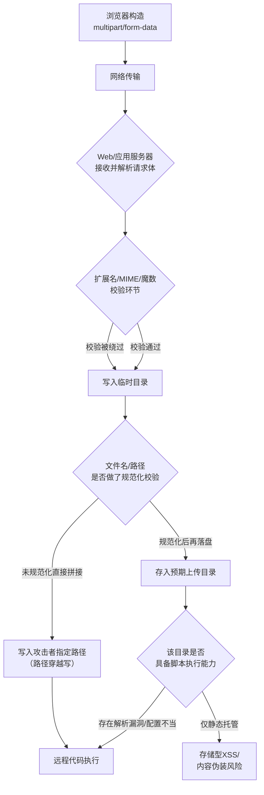
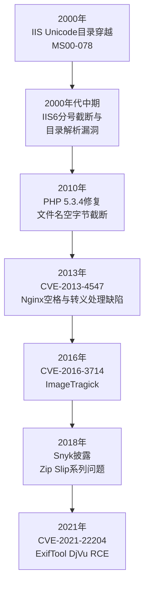
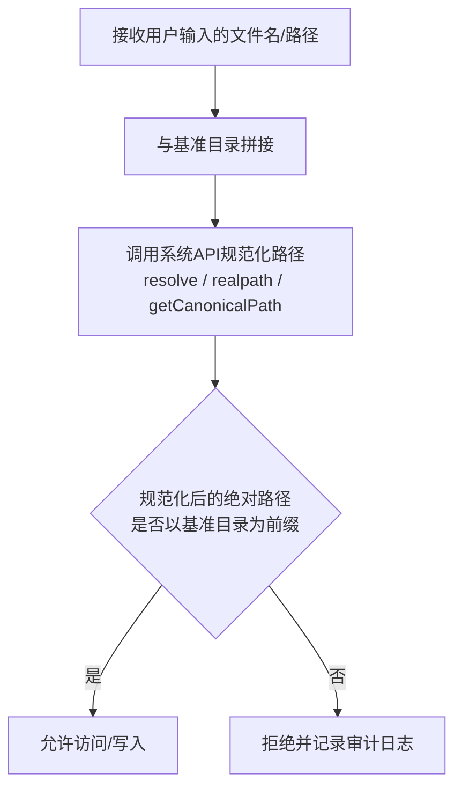

# Web与应用层安全（10）· 文件上传与路径穿越

> [!abstract] TL;DR
> - 文件上传漏洞的本质是"写原语"——只要文件名、路径、内容三者之一被攻击者控制且服务器信任过度，就可能从任意写升级为任意代码执行；路径穿越同时覆盖"读原语"与"写原语"，二者在实战中经常耦合成同一条利用链。
> - 黑名单扩展名校验必然存在遗漏（.phtml/.pht/.phar、大小写变体、IIS分号截断等），白名单+MIME嗅探+文件头魔数三重校验是相对可靠的组合，但仍可被多态文件（polyglot）和元数据注入（如CVE-2021-22204）绕过。
> - 中间件解析歧义（IIS目录解析、Apache多后缀从右向左扫描、Nginx与PHP-FPM的PATH_INFO配置错位）往往比代码层校验遗漏更隐蔽——"代码没错、配置要命"是这类漏洞的典型写照。
> - 路径穿越防御的唯一正确顺序是"先规范化（canonicalize），后做前缀校验"；任何在规范化之前做的字符串黑名单过滤都存在编码变体（单/双重URL编码、Unicode溢出编码、空字节截断、单次替换不动点绕过）可以突破。
> - Zip Slip证明路径穿越不是孤立漏洞点，而是任何"拼接用户可控字符串构造文件系统路径"的场景（归档解压、模板路径、对象存储key）都会重演的通用缺陷类别；根治方案是消除信任（随机文件名、间接引用、存储与执行分离），而不是穷举堵漏洞。

## 概述与定位

文件上传漏洞（Unrestricted File Upload，对应CWE-434）和路径穿越/目录穿越（Path Traversal，对应CWE-22，有时还牵涉CWE-59符号链接跟随问题）经常被放在同一篇讨论，原因不是它们表面相似，而是它们共享同一个根因：**应用把不可信的用户输入当成了文件系统操作的一部分**。文件上传关心的是"写入的内容是什么"，路径穿越关心的是"读或写发生在哪个位置"，二者是同一个信任边界问题的两个投影面——上传接口的`filename`字段本身就可以携带`../`序列，这一事实决定了本篇讨论的两个主题在实战中几乎从不独立出现。

在漏洞分类体系里，文件上传对应CWE-434"不受限制的危险文件类型上传"，路径穿越对应CWE-22"路径遍历"，涉及符号链接时进一步对应CWE-59。在OWASP Top 10（2021版）里，这两类问题不再作为独立条目出现，而是分别落入A01（Broken Access Control——路径穿越本质是访问控制在文件系统维度的失效）和A03（注入——畸形文件名与文件内容也是一种注入载体）。分类合并并不意味着风险下降，恰恰相反：CMS富文本编辑器插图、用户头像与简历上传、发票与报销凭证扫描件、在线图片压缩/格式转换服务、CI/CD制品仓库、压缩包批量导入、API附件字段、"从URL导入头像"类功能，都是这类漏洞现实存在的攻击面，而且新框架、新语言、新存储后端还在不断制造新的攻击面变体。

本篇与系列内其它章节的边界划分如下：[[08.访问控制与越权]]讨论的是"谁有权限访问某个资源"，本篇讨论的是"文件系统层面这次访问实际落在了哪里"——如果上传后的访问路径直接暴露自增ID或原始文件名，导致攻击者无需任何路径穿越技巧就能枚举访问他人文件，那是纯粹的越权问题，请参见第08章；[[09.反序列化漏洞]]中提到的恶意载荷常常正是通过文件上传功能作为投递手段，本篇只讨论"载荷如何被投递到文件系统",载荷本身的反序列化利用原理见第09章；XML外部实体（XXE）、服务端模板注入（SSTI）虽然常常借助上传的文件（SVG/DOCX/XLSX、模板路径）触发，但其解析/注入原理属于[[04.注入类漏洞：SQL与命令与模板]]的范畴，本篇只在与文件系统边界交叉处点到为止；上传接口若支持"从URL抓取"，其网络层风险属于[[06.CSRF与SSRF]]讨论的SSRF范畴。

## 原理与机制

### HTTP文件上传的协议基础

浏览器上传文件依赖`multipart/form-data`编码（RFC 7578，取代了早期的RFC 2388），请求体按`boundary`分隔成若干部分，文件对应的部分携带`Content-Disposition: form-data; name="file"; filename="xxx.jpg"`和一个`Content-Type`声明。这里必须建立一个贯穿全篇的认知：**`filename`和`Content-Type`都是客户端自行填写的字符串，本质上和查询参数没有任何区别，服务器没有任何理由信任它们**。很多真实系统的漏洞根源就在于把这两个字段当作了"服务器已验证的元数据"而非"用户输入"——这是一个心智模型错误，而不是简单的疏忽：因为它们在协议层面"看起来像"元数据（有专门的字段名、固定的位置），容易让开发者产生错觉。唯一可信的东西只有两样：请求体里的原始字节流本身，以及服务器自己观察、计算得到的结果（比如自己读取文件头判断格式）。

### 服务端处理文件的典型流水线与信任边界

一次上传请求从进入服务器到最终可被访问，通常经历"接收→（可能落地临时文件）→校验（扩展名/MIME/大小/内容）→重命名或路径规范化→持久化存储→后续被读取/处理/对外提供访问"这样一条流水线。这条流水线上的每一步都是一个独立的信任边界：只要有任何一步重新信任了用户输入而不是复用前一步已经验证过的结果，前面所有的校验都可能被绕过或失去意义，这就是文件上传领域常见的TOCTOU（Time-Of-Check-Time-Of-Use）问题——校验时看到的是一个东西，实际使用时经过某个环节的重新解释又变成了另一个东西（典型例子就是后文要讲的中间件解析歧义）。



### 路径穿越的文件系统原理

操作系统解析相对路径时，`.`代表当前目录，`..`代表上一级目录，这是POSIX和Windows都遵循的通用约定。只要应用把用户可控的字符串直接拼接进文件路径而不加约束，攻击者就可以用足够多的`../`逐级向上直到文件系统根目录，再向下指定任意可读（或可写）路径。**规范化（canonicalization）**是指把一个可能包含`.`、`..`、多重斜杠、符号链接的路径字符串，转换成唯一确定的绝对路径表示；绝大多数路径穿越漏洞的直接成因，是"先做字符串层面的黑名单过滤，后做（或者根本不做）规范化"这一顺序错误——过滤发生在字符串还没有被解析成"真实路径含义"之前，攻击者只需要构造一个过滤规则没见过、但底层解析器仍然认得的等价写法就能绕过。

Windows与Linux在路径语义上的差异，是跨平台Web应用一个经常被忽视的陷阱：分隔符上Windows的API对`\`和`/`都兼容，Linux只认`/`；Windows有盘符（`C:`）和UNC路径（`\\server\share`）这类Linux没有的寻址方式；Windows文件名默认大小写不敏感而Linux敏感；Windows保留了`CON`/`PRN`/`AUX`/`NUL`等设备名，用作文件名会触发特殊行为；NTFS支持备用数据流（Alternate Data Stream，写作`file.txt::$DATA`）；Windows API会自动剥离文件名结尾的多余点号和空格。这意味着**同一段在Linux上验证"安全"的过滤代码，部署到Windows上可能凭空多出好几种新的绕过面**，这不是代码写错了，而是过滤规则的心智模型天生就是单平台的。

除了纯字符串层面的穿越，符号链接（symlink）是路径穿越的另一种载体，对应CWE-59：即使某次请求传入的文件名字符串本身完全干净，只要上传目录里存在（或者能被攻击者以某种方式创建）一个指向敏感位置的符号链接，后续"看起来安全"的路径拼接在文件系统层面实际解析后依然会跳出预期边界。这也是为什么真正严谨的路径校验，规范化步骤必须走会解析符号链接的系统调用（如`realpath`），而不能停留在纯字符串处理。

### 路径穿越的两种基本形态：读穿越与写穿越

路径穿越经常被简化理解为"任意文件读取"，但实际上分成对称的两种形态，防御原理一致，sink不同：**读穿越**是应用用用户输入拼接出"要读取/包含/下载"的路径，例如`?file=report.pdf`被替换成`?file=../../../../etc/passwd`，后果是任意文件读取，如果配合本地文件包含（LFI）机制，甚至可以读到之前通过上传功能投递的恶意内容并借由包含被解释执行，这正是历史上大量"PHP LFI + 上传"组合拳取得代码执行的根因；**写穿越**是应用用用户输入（通常是上传接口的`filename`字段，或归档条目名）拼接出"要写入"的目标路径，后果是任意文件写入/覆盖，是本篇讨论的主线。代码审计时应当对所有涉及用户可控字符串的文件系统API调用（不论是`read`类还是`write`类）一视同仁地检查是否存在规范化与边界校验。

## 校验绕过与解析漏洞详解

### 前端校验与"信任客户端"的幻觉

`<input accept="image/*">`和JavaScript里对扩展名的判断，只是用户体验优化，任何人用Burp Suite的Repeater直接改包就能绕过，前端校验的安全价值严格等于零。之所以要专门强调这一点，是因为现实中相当比例的系统止步于此，把"前端拦住了大部分用户的误操作"误当成了"防住了攻击者"，这是把可用性设计和安全边界混为一谈的典型认知错误。

### 后端扩展名黑名单绕过全谱系

黑名单思路本身就有一个数学上的缺陷：防御者要穷举所有危险后缀，攻击者只需要找到一个遗漏项。常见绕过手法包括：

- **大小写变体**：`.PHP`/`.pHp`，在文件系统大小写不敏感的Windows部署上，或者Web服务器对处理器映射本身大小写不敏感的配置下依然有效；
- **同族小众后缀**：PHP系的`.phtml`/`.php3`/`.php4`/`.php5`/`.pht`/`.phar`，旧版ASP系的`.asa`/`.cer`/`.cdx`（历史上IIS将这些后缀也映射到脚本解释器，常用于包含文件因而被默认允许执行），Java系的`.jspx`/`.jspa`，这些都是黑名单里"想不全"的典型代表；
- **单次替换不动点绕过**：形如`str_replace(".php", "", filename)`这种只做一次替换的朴素代码，攻击者用`"1.pphphp"`这样的构造，中间的`.php`被删除后剩余部分重新拼成`.php`，原理与后文路径穿越里的`....//`技巧完全一致；
- **Windows尾随点/空格绕过**：上传`shell.php.`或`shell.php `（结尾带点或空格），字符串校验函数看到的是"不以`.php`结尾"因而放行，但Windows的文件系统API在真正创建文件时会自动剥离这些尾随字符，落盘后得到的就是一个货真价实的`shell.php`；
- **IIS分号截断**：`shell.asp;.jpg`这一历史技巧的关键在于IIS的脚本引擎判断逻辑只看分号之前的部分（`.asp`），而很多上传校验代码只检查最后一个点之后的部分（`.jpg`），两套逻辑对同一个字符串得出了不同结论；
- **NTFS备用数据流绕过**：`shell.asp::$DATA`会被一些基于精确后缀匹配的校验函数判定为"不以`.asp`结尾"从而放行，但NTFS创建文件时`::$DATA`只是默认数据流的显式限定符，实际落盘文件名就是`shell.asp`。

### 白名单与内容嗅探层面的绕过

白名单在原则上远比黑名单可靠，但白名单本身若包含`.html`/`.svg`/`.xml`这类"格式合法但内容可执行"的类型，风险维度会从服务端RCE转向客户端XSS/XXE，这是另一个必须单独考虑的失守点（与第05章讨论的存储型XSS呼应）。`Content-Type`头由客户端在multipart的每个part里自行声明，服务端如果只信这个字段，等同于没做校验，必须依靠服务端自己嗅探文件头魔数（Magic Number）来判定真实格式：

```text
常见文件头魔数（十六进制）：
JPEG          FF D8 FF
PNG           89 50 4E 47 0D 0A 1A 0A
GIF87a/89a    47 49 46 38 37 61 / 47 49 46 38 39 61
PDF           25 50 44 46            （即 %PDF）
ZIP容器族     50 4B 03 04            （ZIP/DOCX/XLSX/JAR/APK等均基于此容器）
```

但魔数校验只解决了"文件头是否符合声明格式"这一个维度的问题，并不能阻止**多态文件（Polyglot）**：攻击者构造一个文件，其开头字节严格符合GIF89a的魔数要求（因而通过魔数校验、也能被图片查看器正常渲染），但在文件体后半部分嵌入了一段PHP代码。只要这个文件后续能通过任何途径（本地文件包含、或者前面提到的中间件解析歧义）被当作脚本解释执行，嵌入的代码就会生效——这说明魔数校验解决的是"格式头合不合法"，完全没有解决"内容会不会在某个环节被以危险方式解释执行"，必须与"存储目录禁止脚本执行"这一纵深防御手段配合才真正有意义。更隐蔽的变体是**元数据注入**：把攻击载荷藏进JPEG的EXIF Comment/Copyright等字段，文件整体（包括魔数和图像结构）完全合法，只有当处理链路中某个环节把元数据当作可执行内容对待时才会触发。2021年披露的CVE-2021-22204就是真实案例——ExifTool在解析特制的DjVu文件元数据时会错误地求值其中嵌入的Perl代码，导致远程代码执行，该漏洞因被用于攻击GitLab头像上传处理链路而受到广泛关注，充分说明"解析漏洞"不只存在于Web容器层，也大量存在于处理链路调用的第三方内容处理库中。

### 中间件/Web容器解析歧义谱系

这一类漏洞最具迷惑性的地方在于：**应用代码本身的黑白名单逻辑可能完全正确，但Web服务器/脚本引擎判断"这个文件该由谁来处理"的逻辑，与校验代码判断"这是不是危险文件"的逻辑并不是同一套逻辑**，二者之间的认知偏差就是漏洞所在，也就是"代码没错、配置要命"。

- **IIS**：除前述分号截断外，历史上的IIS6目录解析漏洞（对应MS00-078所在系列问题的后续变体）表现为：只要路径中某一级目录名以`.asp/`结尾，该目录下的任何文件不论自身后缀都会被当作ASP解析执行，例如`/upload/evil.asp/pic.jpg`——这是IIS按目录名而非最终文件名判断脚本引擎的设计缺陷。
- **Apache**：`mod_mime`对包含多个点号的文件名，会从右向左扫描后缀，遇到第一个已注册处理器（Handler）的后缀就采用该处理器处理，未被识别的后缀会被跳过而不是导致拒绝——于是`shell.php.xxx`这样的命名，只要`.xxx`没有被注册处理器，Apache仍然会用`.php`对应的处理器解释执行整个文件。另外，如果上传目录允许`.htaccess`覆盖（`AllowOverride`开启），攻击者上传自己的`.htaccess`并写入`AddType application/x-httpd-php .jpg`之类指令，就能让该目录下任意后缀都被当作PHP执行——这是"业务文件上传逻辑本身没有漏洞，但允许上传控制文件"造成的次生漏洞，提示校验必须覆盖`.htaccess`/`web.config`这类控制文件本身，不能只盯着业务文件。
- **Nginx**：这里有两类常被混为一谈但机制完全不同的问题。其一是业界广泛引用的CVE-2013-4547，早期Nginx版本对URI中出现空格后跟随未转义字符的处理存在缺陷，构造特定的空格与字节组合可以让location匹配阶段判断的"扩展名"与实际最终取用的文件产生偏差，从而绕过基于后缀做的访问限制；其二是更常见的运维配置错误——当PHP-FPM的`cgi.fix_pathinfo=1`且Nginx的`fastcgi_split_path_info`未正确约束`PATH_INFO`时，请求`/uploads/avatar.jpg/x.php`会被Nginx按正则拆分成`SCRIPT_FILENAME=avatar.jpg`、`PATH_INFO=/x.php`转发给PHP-FPM，PHP-FPM在`fix_pathinfo`开启时会沿路径"向前查找"到真实存在的`avatar.jpg`并以PHP方式执行它。这不是Nginx或PHP单独的缺陷，而是"文件是否存在"的判断和"扩展名是否安全"的判断用了两条互不知情的逻辑链路，这种配置层面的组合缺陷比代码层面的校验遗漏更难被常规代码审计发现，因为审计者根本看不到这段隐藏在部署配置里的逻辑。

这类解析漏洞给防御的核心启示是：任何"某个文件是否会被当作脚本执行"的判断，最终必须以Web服务器实际生效的路由/处理器配置为准，而不能只依赖应用代码层面的字符串校验；理想方案是让上传目录在物理层面就不具备脚本解释执行能力（见后文纵深防御清单）。



### 路径穿越编码与过滤器绕过全谱系

最朴素的形式是`../../../etc/passwd`，多级向上加目标文件。围绕它的编码变体和过滤器绕过手法构成了一个相当完整的谱系：

- **URL编码变体**：`%2e%2e%2f`、`%2e%2e/`、`..%2f`、`..%5c`（反斜杠编码，在Windows部署下有效）；
- **二次编码（double encoding）**：`%252e%252e%252f`，如果前置的WAF只解码一次而后端应用框架又解码一次，两次解码之间的差异窗口就是绕过点，常用于突破只拦截`../`字面量的规则；
- **Unicode溢出编码（overlong UTF-8）**：`%c0%ae%c0%ae%c0%af`，这正是2000年IIS Unicode目录穿越漏洞（MS00-078，对应CVE-2000-0884）的核心手法——合法UTF-8里`.`和`/`只需要1字节表示，但一些宽松的解码器会接受用2字节表示这些字符的"过长编码"，而IIS自身对`..`/`/`的黑名单过滤只检查了单字节的规范形式，没有检查这种非规范但底层解码器仍然认得的等价变体，是"过滤发生在解码之前"这一顺序错误的经典例证；
- **空字节截断**：`avatar.jpg\x00../../etc/passwd`，PHP 5.3.4之前，底层C字符串以`\0`结尾，PHP字符串对象本身允许包含`\0`，但传给libc的文件操作函数时会在`\0`处被截断，可以借此让"看起来合法的后缀检查"通过而实际操作的是`\0`之前的路径；PHP官方在5.3.4修复了相关函数的这一行为，但历史遗留系统、以及其它同样依赖C库做文件操作的语言运行时仍需要警惕类似问题；
- **过滤器单次替换绕过**：形如`str_replace("../", "", input)`的朴素代码只做一次替换。攻击payload是`....//`——中间恰好构成的`../`子串被替换掉之后，剩下的两个点和一个斜杠重新拼接成了新的`../`。这个技巧反直觉但极具代表性：过滤器设计者没有意识到"移除一个子串"这一操作本身可能在原字符串的其余部分制造出新的匹配，唯一根治方式是循环替换直到不动点，或者干脆放弃字符串过滤、改走规范化+前缀校验的路线；
- **绝对路径注入**：如果程序直接拼接用户输入而不判断其是否已经是绝对路径，攻击者直接传入`/etc/passwd`或Windows下的`C:\Windows\win.ini`，可以整体跳过原本设计的相对路径拼接逻辑；
- **路径参数/分号绕过（Java生态）**：老版本Servlet容器把URL中分号之后的内容当作"路径参数"处理（历史上用于在无Cookie场景下传递`jsessionid`），一些访问控制过滤器与实际资源定位逻辑对分号的处理方式不一致，`/admin/..;/public/x`这类路径曾被用于让安全校验组件与真实路由解析出不同的目标路径，从而绕过基于URL前缀的访问控制。这与纯文件系统层面的路径穿越原理相通：都是两套解析逻辑面对同一字符串得出了不同结果。

### 从穿越/上传到代码执行的武器化链路

把前面的校验绕过与解析歧义串起来，实战中常见的落地路径包括：**直写型**——上传接口的`filename`字段本身可控且未经校验，直接传入`../../../var/www/html/shell.php`，一步到位在Web根目录之外写入可执行脚本，是路径穿越与文件上传合流的最直接形态；**归档解压型**——见下文Zip Slip；**覆盖控制文件型**——即便目标目录本身不允许直接落地脚本，若能穿越写入`.htaccess`/`web.config`/Nginx配置片段等控制文件，同样能改变该目录后续的解析行为；**覆盖凭据/计划任务型**——在自有环境或CTF场景中，进阶目标还可能包括`authorized_keys`、crontab片段、systemd unit文件等，这些已经超出"文件上传"漏洞本身的范畴，而是"任意文件写"这一原语被获取之后攻击者选择的后续落点。从防御视角看，这提示我们**任意文件写本身就必须被当作高危漏洞对待，不能因为"写不到Web目录就没事"而放松警惕**。

### Zip Slip：归档解压场景下的路径穿越

ZIP/TAR等归档格式的每个条目（entry）都自带一个"条目内路径名"字符串，格式规范本身并不强制要求这个字符串一定是合法的相对子路径。很多解压库（尤其是2018年之前Java生态里为数不少的归档处理库）在解压时直接用"目标目录 + 条目路径名"做字符串拼接得到输出路径，不检查条目路径名是否包含`../`或本身就是绝对路径。攻击者只需要构造一个条目名为`../../../../etc/cron.d/persist`的压缩包，解压程序自以为只是把内容释放到指定的解压目录内，实际上文件被写到了完全在预期目录之外的系统路径——这不折不扣就是路径穿越，只是"用户可控路径字符串"的来源从URL参数换成了归档条目名。2018年Snyk安全研究团队系统性披露了这一模式广泛存在于多种语言生态（Java、JavaScript/Node、.NET、Go、Ruby、Python等）的归档处理库中，并正式命名为"Zip Slip"。这个案例的意义在于证明**路径穿越不是一个孤立的漏洞点，而是任何"拼接用户可控字符串构造文件系统路径"的地方都会重演的通用缺陷类别**——防御必须落在解压逻辑内部，对每一个条目在写出之前都执行与本篇讨论完全相同的规范化+前缀校验，不能假设归档格式本身会保证条目名的安全性。


以下时序图展示了扩展名/MIME校验被绕过、叠加中间件解析歧义之后，一次上传如何最终演变为远程代码执行：

```mermaid
sequenceDiagram
    participant Client as 攻击者/客户端
    participant Web as Web服务器
    participant App as 应用逻辑
    participant FS as 文件系统

    Client->>Web: POST /upload (multipart/form-data; boundary=X)
    Web->>App: 转发请求体并解析boundary与字段
    App->>App: 读取filename、声明的Content-Type
    App->>App: 扩展名/MIME/魔数校验（可能被绕过）
    App->>FS: 以用户可控文件名落盘
    FS-->>App: 写入完成
    App-->>Client: 200 OK，返回访问URL
    Client->>Web: GET /uploads/shell.php
    Web->>FS: 按中间件解析规则匹配处理器
    FS-->>Web: 返回脚本执行结果而非静态内容
    Web-->>Client: 命令执行回显
```

## 工具视角与实战

### 手工测试与Burp Suite工作流

日常测试的基本套路是用Repeater对单个请求做精细化改造——修改`filename`扩展名、篡改声明的`Content-Type`、直接编辑二进制文件内容插入不同的文件头，逐项验证服务端到底依据什么做判断；再用Intruder把payload位置设在文件名后缀处，配合SecLists一类字典（如常见Web脚本后缀列表）做批量爆破，观察响应长度/状态码的差异来判断哪些后缀被接受。Burp生态里的Upload Scanner这类插件会自动化尝试前文列举的大部分黑名单绕过组合（大小写变体、双扩展名、空字节、特殊后缀、内容与声明类型不一致等），显著提高测试效率。关于multipart请求本身的手工构造、边界字符的精确控制、以及如何在抓包工具里逐字节核对请求体，可以参考[[72.抓包与协议分析实战/04.HTTP与HTTPS抓包与中间人分析]]中更底层的报文解读方法；更系统的BurpSuite实战方法论见[[13.Web漏洞工具链：BurpSuite]]。

### 专用路径穿越模糊测试工具

DotDotPwn是一款经典的目录穿越模糊测试工具（Perl编写），可以针对HTTP、FTP、TFTP等多种协议，按可配置的深度和编码方式自动生成大量穿越payload变体并观察响应差异；日常也可以直接用ffuf/wfuzz配合SecLists中的穿越专用字典对参数做深度模糊测试，验证服务端是否真的过滤了任意深度的`../`以及各种编码变体，而不是只堵住了测试者第一次尝试的那一种写法。

### 白盒代码审计视角：污点分析

代码审计路径穿越/上传类问题的核心方法论是**污点分析（Taint Analysis）**：先定位source（用户可控输入，如某个框架里获取上传文件原始名的API、请求参数里的路径片段），再定位sink（真正执行文件系统操作的调用，如`new File(...)`、`fs.readFile`/`fs.writeFile`、Python的`open(...)`、`Files.newOutputStream(...)`等），判断从source到sink之间是否存在可靠的规范化与边界校验。现代静态分析工具（Semgrep、CodeQL等）都内置了路径穿越相关的规则包，本质就是把这套source-sink污点传播模型自动化；人工审计的核心价值在于识别那些工具容易漏报的逻辑缺陷——比如校验逻辑写在了一个辅助函数里，但真正落盘的代码路径调用的是另一条完全没有经过该校验的分支，这种"校验存在但没长在真正的sink前面"的问题，纯粹的模式匹配工具往往难以可靠捕捉。

### 运行时检测与取证

WAF/RASP对路径穿越的检测本质上是对请求参数做模式匹配，如果只匹配未解码的字面量`../`，就会被本篇列举的各类编码变体绕过，因此规则本身也必须遵循"先规范化、后匹配"的原则，而不能停留在简单的字符串黑名单。对于已经落地的Webshell，现实中主要依靠上传目录的文件完整性监控（FIM）配合定期YARA规则扫描来发现；常见Webshell管理工具在网络层通常带有可被识别的请求特征（固定的参数命名习惯、特定的编码或加密方式），这些特征是很多安全设备检测规则的来源——这里只从"防御方需要了解可检测特征存在"的角度提及，不展开任何具体工具的构造或使用方式。

## 安全性与正确使用

### 上传侧纵深防御清单

- 扩展名**白名单**而非黑名单是底线，但要审视白名单是否包含`.html`/`.svg`/`.xml`这类"格式合法但内容可执行"的类型，如业务确需支持，需要单独在XSS/XXE维度补充防护（参见[[05.XSS跨站脚本]]）；
- MIME校验基于**服务端自行嗅探的文件头魔数**，绝不信任客户端声明的`Content-Type`；
- 对图片类内容做一次强制**重新编码**（用图形库重新生成一份新图片而非直接持久化原始字节），能有效破坏依附在图片数据尾部或部分元数据字段中的载荷，但需要注意重新编码本身调用的库（如ImageMagick）如果自身存在解析漏洞，反而会引入新的攻击面——ImageTragick就是前车之鉴，防御链条上的每一环都可能成为新的攻击面，需要持续跟踪所依赖库的安全公告；
- **文件名彻底替换为服务端生成的随机值**（UUID或CSPRNG），不保留、不信任原始文件名的任何字符，从根本上同时消除路径穿越和解析歧义两类风险的载体；
- **存储与执行分离**：上传目录在文件系统权限层面就不具备脚本解释执行能力，最彻底的方式是存到独立的对象存储或静态托管域名（与主站不同源），退而求其次是在Web服务器配置层面移除该目录下的所有脚本处理器映射（Nginx不为该location配置`fastcgi_pass`、IIS移除该目录的脚本映射、Apache用`<Directory>`块关闭PHP引擎）；
- 对外提供下载时固定`Content-Disposition: attachment`并显式设置`Content-Type`（不依赖服务器自动推断），配合`X-Content-Type-Options: nosniff`阻止浏览器MIME嗅探把用户上传的"图片"当HTML解释执行，这是防止"文件上传演变为存储型XSS"的关键一步；
- 大小限制、并发/频率限制，有条件时接入杀毒引擎或沙箱扫描内容，压缩包要限制递归解压层数与解压后总大小以避免Zip Bomb类拒绝服务；
- "从URL导入"类上传功能必须对目标地址做SSRF维度的校验（参见[[06.CSRF与SSRF]]），不能只在"落盘"这一步做文件类型防御而忽视了"抓取"这一步本身的网络层风险。

### 路径穿越侧纵深防御清单

- 首选方案是**完全不用用户输入拼接路径**，改用间接引用：数据库里存一个不透明ID，实际路径由服务端根据ID查表生成，用户输入的"文件名"只是展示用的元数据，不参与任何文件系统操作；
- 如果业务确实需要用户可控的相对路径（如网盘类应用），必须遵循"**先规范化，后做前缀校验**"：调用平台提供的规范化API（Java的`Path.normalize()`/`File.getCanonicalPath()`，Python的`os.path.realpath()`，Node.js的`path.resolve()`）得到绝对路径后，再检查该路径是否以预期的基准目录（同样经过规范化）为前缀，顺序不能颠倒；
- 明确处理符号链接风险：规范化API通常会解析symlink，如果不希望允许跳出边界的符号链接生效，需要确保校验用的是`realpath`之后的最终结果，而不能停留在字符串层面的`..`过滤；
- 容器化/chroot/jail等操作系统级隔离，是应用层逻辑万一有遗漏时的最后一道防线，体现了纵深防御思想在文件系统安全上的具体应用，但不能作为唯一防线，容器逃逸、挂载卷配置不当同样可能使这道防线失效；
- 优先使用平台/语言标准库里已经处理过各种边界情况的规范化函数，而不是手写字符串处理——历史上绝大多数路径穿越漏洞都源于"手写了一个自认为安全的过滤函数"，而没有复用已经趟过这些坑的标准库实现。



### 一个体现上述原则的最小实现骨架

```python
ALLOWED_EXT = {"jpg", "jpeg", "png", "pdf"}
ALLOWED_MIME = {"image/jpeg", "image/png", "application/pdf"}
UPLOAD_ROOT = os.path.realpath("/data/uploads")  # 该目录已在Web服务器配置层面禁用脚本执行

def handle_upload(file_bytes, original_name, declared_mime):
    ext = original_name.rsplit(".", 1)[-1].lower()
    if ext not in ALLOWED_EXT:
        raise Rejected("扩展名不在白名单")

    sniffed_mime = sniff_by_magic_bytes(file_bytes)   # 服务端自行嗅探，不信任declared_mime
    if sniffed_mime not in ALLOWED_MIME:
        raise Rejected("文件头与声明类型不符")

    safe_name = f"{uuid4().hex}.{ext}"                # 彻底丢弃原始文件名的其余部分
    dest = os.path.realpath(os.path.join(UPLOAD_ROOT, safe_name))

    if not dest.startswith(UPLOAD_ROOT + os.sep):      # 规范化之后再做前缀校验，顺序不能反
        raise Rejected("路径越界")

    with open(dest, "wb") as f:
        f.write(file_bytes)
    return safe_name
```

这段骨架把前文讨论的四条防御原则落到了实处：扩展名走白名单而非黑名单；类型判定依赖服务端自行嗅探的魔数而不是客户端声明；文件名整体替换为随机值，杜绝原始文件名参与任何路径拼接；即便如此仍然对最终路径做了一次规范化后的前缀校验，作为纵深防御的最后一道闸门——即使`safe_name`的生成逻辑未来被改动引入了缺陷，这道闸门依然能兜底。

### 常见误区

"前端做了校验就够了"——安全价值为零，前端校验只解决用户体验问题；"检查了`Content-Type`头"——该头完全由客户端自称，等同于没检查；"黑名单挡住了`.php`/`.jsp`/`.asp`就够了"——前文的解析漏洞谱系证明黑名单永远存在中间件特定的遗漏项，且新框架、新语言还在不断引入新的可执行后缀；"用了随机文件名就不用做目录权限隔离了"——随机文件名只解决了穿越/覆盖问题，不解决"目录本身允许脚本执行"这一根因，二者必须同时做；"只过滤了一次`../`就够了"——如前所述单次替换存在不动点绕过，必须循环处理直到不动点，或者干脆放弃字符串过滤走规范化路线。

> [!caution] 合规与授权边界
> 本文所述的校验绕过、解析漏洞、编码穿越等技术仅用于自有系统、已获书面授权的渗透测试环境，以及CTF/靶场类安全研究场景。全文始终从防御和检测视角组织内容，不提供针对真实生产系统或第三方系统可直接使用的攻击载荷或自动化脚本，也不提供绕过任何商业软件授权机制的技术细节。在未获授权的系统上尝试本文提到的任何技术都可能违反计算机安全相关法律法规，请严格在合法合规边界内开展安全研究与测试。

## 小结

文件上传与路径穿越本质上是同一个"文件系统信任边界"问题的两个侧面：一个操心"写入的内容是什么"，一个操心"读写发生在哪个位置"，实战中二者经常在同一条利用链里首尾相接。校验绕过的全谱系告诉我们黑名单在数学上必输，白名单加内容嗅探只是相对更可靠的底线而非绝对安全；解析漏洞谱系告诉我们代码正确不等于系统安全，Web容器与运行时的配置同样是不可忽视的攻击面；路径穿越的编码变体告诉我们过滤必须发生在规范化之后而不是之前；Zip Slip告诉我们这套原理会在任何"拼接用户可控字符串构造文件系统路径"的场景里重演，归档解压只是其中一种载体。防御的终极思路不是穷举堵漏洞，而是从设计上消除信任——随机文件名、间接引用、存储与执行分离、规范化后再校验、纵深隔离，这几条原则组合起来，才能让这一类问题从"依赖攻防对抗的猫鼠游戏"变成"结构性不可利用"。

## 相关阅读

- OWASP File Upload Cheat Sheet（文件上传专项防护清单）
- OWASP Path Traversal（路径穿越条目）
- CWE-434（不受限制的危险文件类型上传）、CWE-22（路径遍历）、CWE-59（符号链接跟随）
- RFC 7578《Returning Values from Forms: multipart/form-data》
- [[04.注入类漏洞：SQL与命令与模板]]
- [[05.XSS跨站脚本]]
- [[06.CSRF与SSRF]]
- [[08.访问控制与越权]]
- [[09.反序列化漏洞]]
- [[13.Web漏洞工具链：BurpSuite]]
- [[71.详解网络协议/18.HTTP-HTTPS协议]]
- [[71.详解网络协议/15.TLS协议]]
- [[72.抓包与协议分析实战/04.HTTP与HTTPS抓包与中间人分析]]
- [[37.密码学/62.协议误用与密码工程]]

[[00.Web与应用层安全总览|⬆ 系列总览]] | [[09.反序列化漏洞|← 上一章]] | [[11.API与GraphQL安全|→ 下一章]]
