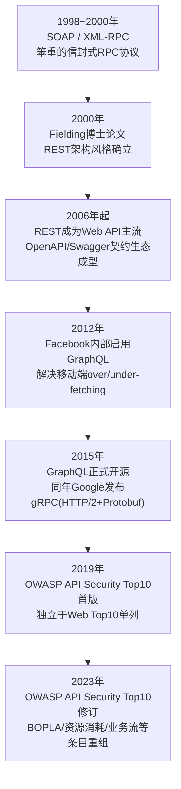
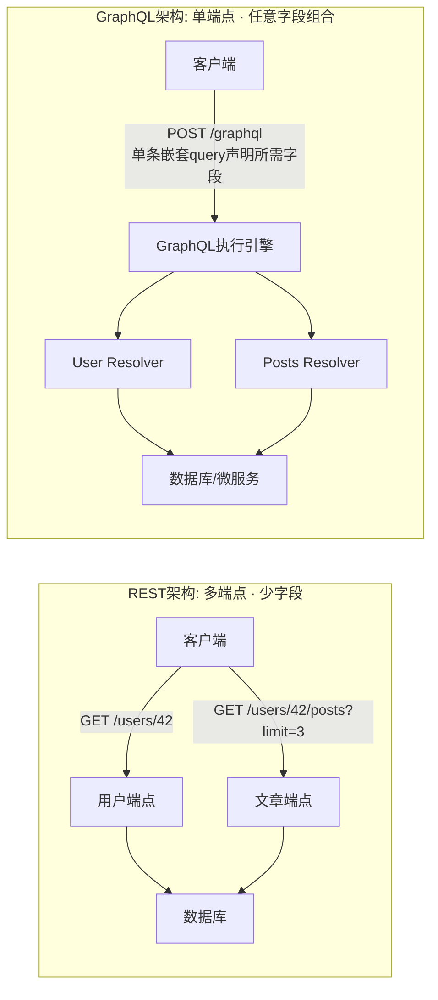
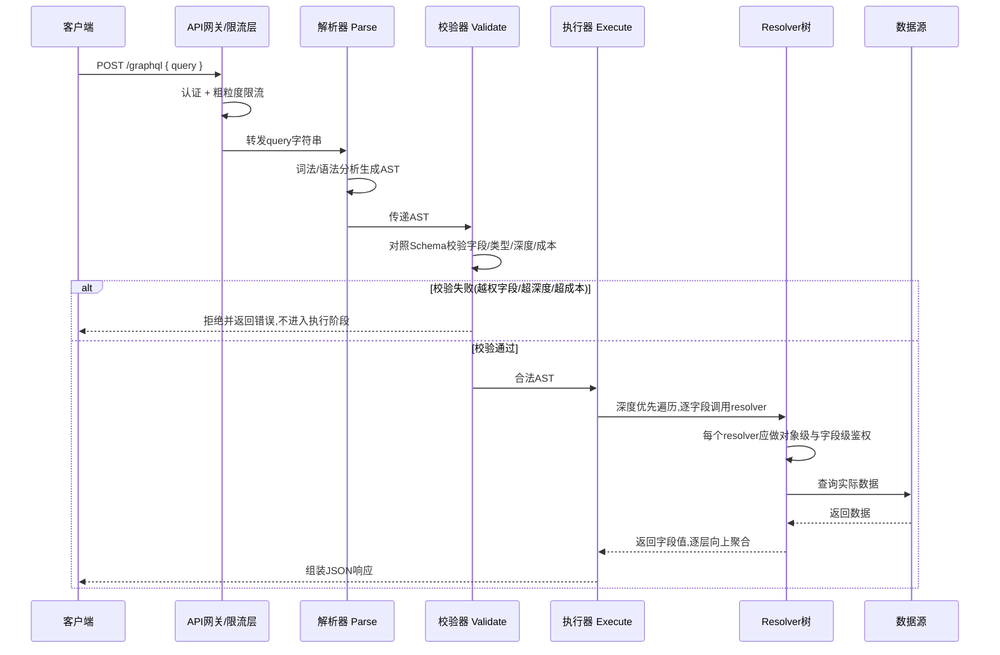
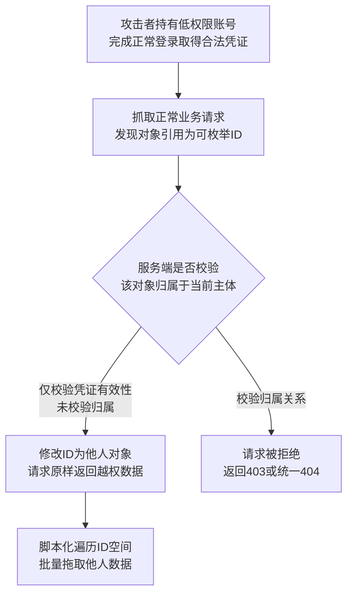
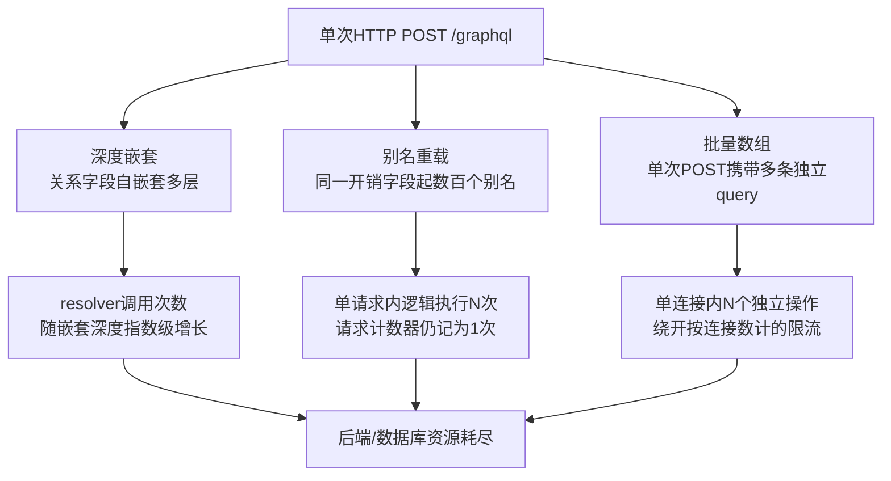
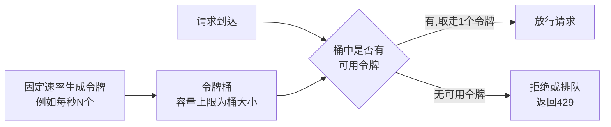
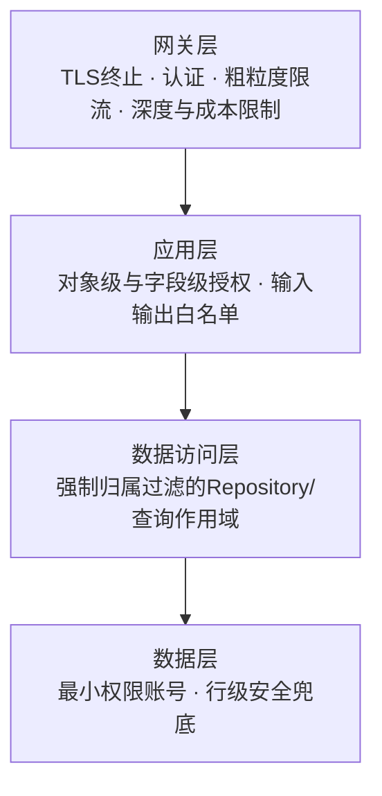

# Web与应用层安全（11）· API与GraphQL安全

> [!abstract] TL;DR
> - API和GraphQL把大量授权判定下放到业务逻辑层，OWASP API Security Top10里近半数条目（BOLA/BOPLA/BFLA）本质上都是第08章"访问控制与越权"通用模型在API这一具体协议载体上的重新展开，而不是全新的漏洞类别。
> - REST的攻击面形态是"多端点、少字段"，GraphQL是"单端点、任意字段组合"——后者把over-fetching问题转移成了客户端的自由裁量，内省（introspection）一旦在生产环境开启，相当于免费奉送一份精确到字段级的攻击面地图。
> - GraphQL因查询即客户端定义的执行计划，天生带三种独有DoS向量——深度嵌套、别名重载（aliasing）、批量提交（batching），均能让一次HTTP请求触发远超请求计数所反映的后端逻辑操作次数，必须靠查询成本（cost）分析而非请求计数来限流。
> - 批量端点和GraphQL数组参数的mutation，几乎必然重演"外层鉴权只做一次、循环体内部信任每一个元素"这个模式性错误，是对象级越权测试里最容易被常规功能测试忽视的盲区。
> - 限流算法的选型（固定窗口、滑动窗口日志、滑动窗口计数器、令牌桶、漏桶）本质是在计数精度、存储开销、是否允许突发流量三者之间取舍，分布式部署下还必须靠原子化脚本解决多节点竞态计数问题。
> - 生产环境防御的核心是把对象级、字段级授权判断下沉到统一的数据访问层或持久化查询白名单机制，而不是指望每一个resolver、每一个批量处理循环体都被开发者正确地重新实现一遍。

## 概述与定位

API（Application Programming Interface）安全讨论的是"程序与程序对话"这个信任边界上的安全问题，它和前面几章讨论的"浏览器与服务器对话"存在一个微妙但决定性的差异：浏览器场景下还有同源策略、CSP这类平台级护栏兜底（参见[[03.同源策略与CORS与CSP]]），而API的调用方可以是移动端App、第三方开发者的服务端代码、内部微服务、自动化脚本——这些调用方不受浏览器沙箱约束，同源策略在这里完全不适用，能拦住不合规请求的只剩服务端自己写的鉴权逻辑。这个差异决定了API安全的核心命题：一旦请求打到接口上，它是否被允许执行，完全取决于服务端有没有把该做的判断做全，没有任何"平台"替你兜底。

当前主流的API设计范式有三条并行的谱系：REST（Representational State Transfer，Roy Fielding于2000年博士论文提出的架构风格，此后二十余年占据Web API的绝对主流）、GraphQL（Facebook自2012年起在内部使用、2015年正式开源的查询语言与运行时，目标是解决REST长期存在的over-fetching/under-fetching问题）、以及gRPC（Google 2015年发布，基于HTTP/2与Protocol Buffers的高性能RPC框架，主要活跃在服务间内部通信场景）。本篇聚焦前两者——REST与GraphQL，这也是绝大多数对外暴露、直接面向第三方开发者与前端应用的API所采用的形态；gRPC通常运行在服务网格内部、很少直接对公网暴露，其安全模型更多依赖mTLS与服务网格层面的策略，不是本篇的展开重点。

要理解API安全在本系列里的坐标，必须先厘清和相邻章节的边界，这也是为什么把这一篇安排在[[08.访问控制与越权]]之后：[[08.访问控制与越权]]已经系统建立了访问控制的通用模型——DAC/MAC/RBAC/ABAC/ReBAC几种模型谱系、水平越权与垂直越权的二分法、IDOR的代码级成因——这些模型本身不会在本篇重新推导。本篇要做的，是把这套通用模型套进API、尤其是GraphQL这个具体的协议载体里，回答一个更具体的问题：同样是"归属校验缺失"，为什么在GraphQL里格外容易发生、格外难被发现？同样是"角色判断该做的事"，为什么在一个所有请求都打向同一个`/graphql`端点、共享同一份Schema的架构里更容易被绕过？这也是为什么API安全语境下，水平越权、垂直越权分别有了更具体的专有名字——BOLA（Broken Object Level Authorization）与BFLA（Broken Function Level Authorization），本质上就是08章讲的两个概念在API这个具体载体上的重新命名，只是多了一层"这份API/GraphQL的设计本身给攻击者提供了多少便利"的新维度。此外，本篇还会引入08章没有覆盖、但对API而言极其关键的两个专属维度——批量操作与限流，这正是本篇标题下"REST/GraphQL 授权、批量、限流"三个关键词里后两个的来源。

认证与授权令牌的具体格式与流程——JWT的结构、签名与校验、OAuth2的多种授权模式、OIDC的身份层——留给[[12.JWT与OAuth与OIDC安全]]专题处理，本篇只需要认可一个背景事实：现代API普遍是无状态的，这意味着每一次请求都必须自带完整的身份凭证（通常是某种Token），服务端不维护跨请求的会话记忆，这个设计选择进一步放大了"每次请求都要重新做一遍完整鉴权判断"这件事的重要性——不存在"这个会话之前验证过就不用再验证"这种捷径。HTTP协议层面的方法语义、头部处理、CORS机制已在[[02.HTTP协议安全]]与[[03.同源策略与CORS与CSP]]详细展开，本篇只在涉及GraphQL如何利用或绕过这些机制的具体场景（例如GraphQL CSRF）时直接复用结论，不重复底层推导。

从行业视角看，API安全独立成为一个专门的风险画像，本身就是一条值得梳理的演进线——它解释了为什么OWASP要在通用的Web Top10之外，另起一个专门的API Security Top10项目：



这条线索背后有一个共同的驱动力：架构每往"每个功能点独立暴露成一个可被程序化调用的接口"这个方向演进一步，原本可能被页面跳转、菜单可见性、人工操作节奏顺带掩护住的问题，就被剥离得更加赤裸——GraphQL把这个趋势推到了极致：整个后端的数据图谱通过一份Schema和一个端点暴露出来，客户端拥有前所未有的查询自由度，而这份自由度默认不附带任何权限边界，这正是本篇要展开的核心矛盾。

## 原理与机制

### REST的资源模型与信任假设

REST不是一个协议而是一种架构风格，其核心约束包括：以资源（Resource）为中心，每个资源有唯一的URI；用HTTP动词（GET/POST/PUT/PATCH/DELETE）表达对资源的操作语义，动词本身携带幂等性与安全性（safe）的隐含契约（GET不应产生副作用，PUT整体替换是幂等的，POST创建新资源通常不是幂等的）；无状态（Stateless），服务端不为单个客户端保留跨请求的会话上下文。这最后一条对安全的影响常被低估：既然服务端不记忆"你上一次请求做了什么"，鉴权判断就不能依赖任何隐式的会话历史，每一次请求都必须携带足够的信息（身份凭证、目标资源标识）供服务端独立做出裁决——这也是为什么Token（无论是简单的API Key还是结构化的JWT）在REST生态里地位如此核心，它是无状态约束下唯一能承载身份的载体。REST本身还有一条常被忽视的约束叫HATEOAS（Hypermedia as the Engine of Application State），要求响应里包含指向下一步可执行操作的链接；但现实中绝大多数所谓"RESTful API"并未真正实现这一条，多数只是"资源+HTTP动词"的松散风格，不过这个理论分歧不影响安全讨论——无论是否严格遵循HATEOAS，"每个资源独立URI、无状态、依赖Token做身份判断"这几条核心事实是一致的。

OpenAPI规范（前身是Swagger，2016年后由Linux Foundation旗下的OpenAPI Initiative维护）扮演着双重角色：对开发者和自动化工具链而言它是API的机器可读契约，驱动代码生成、文档站点、自动化测试；但对渗透测试者和攻击者而言，同一份文档就是一张现成的攻击面地图——它列出了每一个端点、每一个参数、每一种预期的请求/响应结构，省去了黑盒探测的大量成本。这个"文档等于地图"的性质在GraphQL的内省机制上体现得更加极致，会在后文详细展开。

### GraphQL的类型系统与执行引擎

GraphQL和REST最根本的区别，不是"用了不同的URL风格"这么表面，而是查询能力的性质发生了变化：REST里，每个端点对应的响应结构是服务端预先固定好的，客户端只能选择调用哪个端点，不能定制返回哪些字段；GraphQL里，客户端在请求体里编写一段声明式的查询语句，精确指定需要哪些类型的哪些字段、以及这些字段之间如何嵌套，服务端严格按照这份声明返回对应结构的JSON，不多不少。这个转变解决了REST长期存在的两个对称问题：over-fetching（拿到一堆用不上的字段，因为响应结构是服务端固定的）与under-fetching（一个页面需要的数据分散在多个资源上，必须发起多次请求才能拼齐）。

```graphql
# REST: 拿到用户及其最近3篇文章标题, 需要多次请求且每次都可能返回大量多余字段
# GET /api/users/42            -> 返回用户全部字段(可能远超前端所需)
# GET /api/users/42/posts?limit=3  -> 再发一次请求补齐文章标题

# GraphQL: 一次请求精确声明所需字段
query {
  user(id: "42") {
    name
    posts(first: 3) { title }
  }
}
```

GraphQL的类型系统用Schema定义语言（SDL）描述：`type`定义对象类型及其字段，`Query`/`Mutation`/`Subscription`是三个特殊的根类型，分别对应读取、写入、以及基于WebSocket等长连接的实时订阅；`interface`和`union`表达多态，`enum`表达枚举，标量类型（`Int`/`String`/`Boolean`/`ID`及自定义标量）是类型树的叶子节点。一次GraphQL请求的执行遵循规范定义的三段式流水线：**解析（Parse）**把查询字符串做词法与语法分析，生成抽象语法树（AST）；**校验（Validate）**把这棵AST和服务端的Schema逐字段比对，检查字段、参数类型是否合法——这一步是纯静态的，完全不涉及真实数据访问，因此也是插入深度限制、成本分析等防御措施的天然位置；**执行（Execute）**从根类型开始对AST做深度优先遍历，每遇到一个字段就调用其绑定的**解析函数（Resolver）**，父字段resolver的返回值作为参数传给子字段resolver，层层向下、再层层向上聚合，最终拼出和请求结构同形的JSON响应。





这个"resolver树、父子传参"的执行模型，是GraphQL诸多安全特性（无论是问题还是解法）的技术根源。它直接导致了著名的N+1查询问题——如果一个"文章列表"resolver返回100篇文章，"作者"这个子字段的resolver会针对每篇文章各自触发一次数据库查询，DataLoader之类的批量合并机制正是为解决这个性能问题而生；但这个"每个字段独立resolver、独立数据访问"的设计同时意味着：**权限校验如果只在网关层做一次"这个operation允许被调用吗"的粗粒度判断，根本无法覆盖到每一个具体字段实际访问的每一条具体记录**，字段级、对象级的授权判断天然只能下沉到每一个resolver内部去做，下一节会具体展开这为什么是GraphQL场景下鉴权格外容易遗漏的结构性原因。

### 三种授权粒度及其分散性

结合[[08.访问控制与越权]]已经建立的框架，一次完整的授权判断至少要在三个粒度上分别成立，且互不可替代：**对象级（Object-level）**——这条具体的记录是否归属/关联当前调用者，是08章讲的水平越权、IDOR在API语境下的直接对应，专称BOLA；**功能级（Function/Operation-level）**——这个接口/这个query或mutation本身，当前调用者的角色是否有权调用，是08章讲的垂直越权在API语境下的直接对应，专称BFLA；**属性/字段级（Property/Field-level）**——即便调用者有权访问这条记录、有权调用这个操作，记录里的某个具体字段（身份证号、内部备注、他人手机号）是否也在授权范围内，这是2023版OWASP API Top10新增强调的维度，专称BOPLA（Broken Object Property Level Authorization），下一节详细展开。

这三个粒度在REST架构里，很大程度上可以靠"端点粒度"天然对齐——一个端点通常只返回一种资源的一组固定字段，网关或框架层面按路由做的角色校验，覆盖面基本等于功能级校验，只要再补上对象级归属校验，三层基本闭环。但GraphQL从根本上打破了这种自然对齐：一个query可以在同一次请求里，同时访问用户、订单、支付记录、内部审计日志等任意组合的类型与字段，网关拿到的只是一整段查询字符串，除非引入后文的静态查询成本分析，否则很难在真正执行之前就穷举出"这个query最终会touch哪些具体对象、哪些具体字段"。这意味着GraphQL架构下，**功能级校验依然可以在入口做，但对象级和字段级的校验被结构性地压给了每一个resolver自己承担**，如果resolver的作者假设"外层已经拦过了、这里不用重复判断"，越权就在这个resolver上原地发生，且往往不会在功能测试中暴露，因为功能测试通常只用具备完整权限的账号跑通路径。

### 批量与限流：API的两个结构性痛点

除了授权的三重粒度，本篇标题特别点出的另外两个关键词——批量（Batch）与限流（Rate Limiting）——之所以被单独拎出来，是因为它们同样源自API这个载体的结构性特征，而非某一次具体的编码失误。批量操作（不管是REST的`/bulk-update`端点还是GraphQL天然支持的数组输入/多别名查询）之所以是授权测试的高危盲区，根本原因在于：单元测试和人工验收测试几乎总是覆盖"用户操作自己的一条数据"这条最常规的路径，而"数组参数里混入一个不属于自己的ID会发生什么"这个问题，只有专门设计的差分测试才会触及。限流则是另一重结构性问题：传统限流实现假设"一次HTTP请求大致对应一次业务操作"，按请求次数计数就能近似控制业务操作的频率，但GraphQL的执行模型（一次请求里可以嵌套、可以用别名重复、部分实现还支持批量提交多条独立查询）从根本上打破了这条假设——请求次数和实际执行的业务操作次数不再一一对应，这正是下一部分要重点展开的内容。

## 漏洞类型与攻击面详解

### OWASP API Security Top 10（2023）逐条详解

OWASP API Security Project在2019年发布首版Top10，2023年做了一次实质性修订而不只是排名微调——多个条目被合并、拆分或新增：

| 2023编号 | 名称 | 与2019版的关系 |
|---|---|---|
| API1:2023 | Broken Object Level Authorization | 与API1:2019同名,长期稳居第一 |
| API2:2023 | Broken Authentication | 对应API2:2019 Broken User Authentication |
| API3:2023 | Broken Object Property Level Authorization | 合并API3:2019 Excessive Data Exposure + API6:2019 Mass Assignment |
| API4:2023 | Unrestricted Resource Consumption | 对应API4:2019 Lack of Resources & Rate Limiting,范围扩大 |
| API5:2023 | Broken Function Level Authorization | 与API5:2019同名 |
| API6:2023 | Unrestricted Access to Sensitive Business Flows | 新增条目 |
| API7:2023 | Server Side Request Forgery | 新增为独立条目 |
| API8:2023 | Security Misconfiguration | 对应API7:2019同名条目 |
| API9:2023 | Improper Inventory Management | 对应API9:2019 Improper Assets Management |
| API10:2023 | Unsafe Consumption of APIs | 新增条目 |

**API1:2023 Broken Object Level Authorization**本质就是08章讲的IDOR在API场景的重现：服务端按客户端传入的ID查询记录，却没有校验这条记录是否归属于当前调用者。它在GraphQL里的表现形式和REST几乎一样直白——把query里的id参数换成另一个值：

```graphql
# 正常: 查询自己的订单
query { order(id: "1001") { total status } }

# 越权测试: 仅替换id参数,鉴权凭证不变
query { order(id: "1002") { total status items { sku price } } }
```

但GraphQL会把这个问题放大一层：因为一次请求可以嵌套访问多种关联类型，攻击者可以顺着关系链（比如从一个自己有权访问的对象出发，嵌套查询它关联的另一类对象）间接触达本应受保护的数据，即使"直接查询"那个对象类型的入口本身做了校验，经由关系嵌套的间接路径也可能被遗漏——这是GraphQL场景下BOLA测试必须覆盖所有可达路径、而不能只测每个类型顶层查询入口的原因。



**API2:2023 Broken Authentication**——API密钥硬编码、弱密码策略、Token未设置合理过期时间等问题，其协议层细节已是[[07.认证与会话安全]]与[[12.JWT与OAuth与OIDC安全]]的专题范围，本篇不再重复，只强调一点API场景的特殊性：很多系统的用户界面认证足够健壮，但同一套后端暴露给移动端或第三方的API却使用更宽松的认证路径，造成事实上的认证降级旁路。

**API3:2023 Broken Object Property Level Authorization**是2023版修订里信息量最大的一次合并，把2019版各自独立的**过度数据暴露（Excessive Data Exposure）**和**批量赋值（Mass Assignment）**归并成同一条目，因为二者是同一枚硬币的两面，只是方向相反：过度数据暴露发生在**读**方向，服务端习惯性地把内部数据模型整体序列化返回，指望前端只挑选需要展示的字段，但攻击者直接查看HTTP响应原始JSON即可拿到前端从未渲染、却确实包含在响应体里的敏感字段；批量赋值发生在**写**方向，客户端提交的输入对象被整体映射进后端数据模型，若无显式的可写字段白名单，攻击者只需在请求体里多塞一个字段就可能改写不该由自己控制的属性。这两种问题在GraphQL里都有更隐蔽的呈现：GraphQL的字段选择机制看似天然"按需返回"，很多团队因此误以为GraphQL自动免疫了过度数据暴露——但如果resolver是"先查出完整的ORM对象、再由GraphQL层按客户端请求的字段做投影"，没有对每个字段单独做权限判断，客户端只要在query里显式写出敏感字段名就能拿到它们：

```graphql
query { user(id: "1") { name email ssn internalRiskScore } }
```

只要`ssn`、`internalRiskScore`这些字段的resolver没有单独校验调用者是否有权读取，它们就会被正常返回——这不是Schema设计的失误，而是"字段存在于Schema里"和"字段应该对当前调用者可见"被错误地当成了同一件事。批量赋值则集中体现在GraphQL的`input`类型上，mutation常见签名形如`updateProfile(input: ProfileInput!)`，如果`ProfileInput`里包含`role`、`isVerified`、`balance`这类本不该由客户端写入的字段，而resolver把`input`整体bind进数据库实体：

```graphql
mutation {
  updateProfile(input: { nickname: "test", role: "admin" }) {
    id
    role
  }
}
```

一旦服务端没有对`input`做逐字段的白名单过滤，`role`字段就会被原样写入，一次看似普通的"改昵称"请求就升级成了垂直越权。

**API4:2023 Unrestricted Resource Consumption**把2019版的"Lack of Resources & Rate Limiting"重新命名并扩大了范围——不再局限于请求次数这一个维度，还包括分页大小、请求体大小、文件上传大小，以及GraphQL特有的查询深度与查询成本。这是本篇限流小节和GraphQL DoS小节共同对应的条目，留到后面展开。

**API5:2023 Broken Function Level Authorization**对应08章讲的垂直越权在API上的重现——低权限调用者调用了本应只对高权限角色开放的操作。它在GraphQL架构下的隐蔽性尤其值得强调：管理员和普通用户很可能共用同一个`/graphql`端点、同一份Schema，管理端专属的mutation（如`deleteUser`、`promoteToAdmin`）如果仅仅是"前端菜单不渲染对应按钮"，攻击者通过内省拿到完整Schema后会发现这些mutation依然客观存在、依然可以被直接调用——REST架构下这类端点至少还需要攻击者猜测或爆破出一个独立URL，GraphQL则是把整份操作清单主动摆在了内省响应里，省去了这一步侦察成本。

**API6:2023 Unrestricted Access to Sensitive Business Flows**是全新条目，讨论的不是传统技术漏洞，而是自动化脚本对正常业务流程的滥用——抢购接口被脚本刷光库存、优惠券接口被批量小号注册薅空、社交产品的关注/私信接口被用作批量爬虫或骚扰工具。这类问题的特殊性在于：涉事接口本身权限校验、参数校验可能完全正确，问题出在没有识别并限制"这是不是一个真人在正常节奏下操作"，需要设备指纹、行为频率分析、人机验证等业务风控手段配合，单纯的技术性限流或访问控制无法覆盖。

**API7:2023 Server Side Request Forgery**与[[06.CSRF与SSRF]]讲过的SSRF原理完全一致，本篇不重复攻击原理，只强调API场景下几个特别高发的触发点：Webhook注册（客户端提交一个回调URL，服务端在事件发生时对该URL发起请求）、"从URL导入头像/附件"类字段、第三方OAuth集成的回调地址，以及GraphQL里常见的"按用户传入的URL做单点数据聚合"型resolver。

**API8:2023 Security Misconfiguration**在API场景下的典型表现包括：CORS配置为允许任意来源同时又允许携带凭证（这个组合在规范层面本应被禁止，但配置错误依然常见）、GraphQL的交互式调试工具（GraphiQL/GraphQL Playground）在生产环境未关闭、详细的错误堆栈信息（GraphQL默认错误响应经常携带内部文件路径、SQL片段、依赖库版本）被直接返回给客户端。

**API9:2023 Improper Inventory Management**关注"影子API"（Shadow API，从未被记录在案、可能是某次临时改动遗留的端点）与"僵尸API"（Zombie API，业务早已下线但端点仍可达）——这两类资产因不在安全团队的可视范围内，往往缺少和主线API同等强度的防护。GraphQL的单端点特性在这里制造了一种特殊的认知误区：因为对外只暴露一个`/graphql`地址，团队容易产生"资产清单很简单"的错觉，而真正需要盘点的其实是Schema内部成百上千个类型与字段所对应的逻辑操作——资产清单的颗粒度必须下沉到Schema层面，而不能停留在URL层面。

**API10:2023 Unsafe Consumption of APIs**视角发生了反转——讨论"自己的后端作为客户端去调用第三方API"时的风险：对第三方返回的数据缺乏校验就直接信任并拼接使用、没有为第三方调用设置合理的超时与熔断导致自身被拖垮、第三方API的认证凭证硬编码或权限过大。这一条提醒安全评审不能只盯着"别人怎么攻击我的API"，也要审视"我的系统作为API消费者时，是否对下游给了过多的隐式信任"。

值得一提的是，2019版独立列出的**API8:2019 Injection**和**API10:2019 Insufficient Logging & Monitoring**在2023版都不再作为独立条目——前者是因为注入类问题的原理与防御已被通用Web安全知识体系覆盖（呼应[[04.注入类漏洞：SQL与命令与模板]]），不需要在API专项列表里重复列出；后者的相关建议被分散融入到其它条目各自的检测建议中。这个"做减法"的调整本身也是一个信号：OWASP API Security Top10希望聚焦在真正**API这个载体所独有或被放大**的风险上，而不是简单堆砌所有可能出现在API里的漏洞类型。

### GraphQL专属攻击向量详解

除了前面结合Top10逐条提到的部分，GraphQL因查询语言本身的表达力，还存在几类在REST架构里几乎不会出现、或危害程度低得多的专属攻击向量。

**内省（Introspection）信息泄露**是GraphQL最具标志性的双刃剑特性：规范内建了`__schema`、`__type`这类元查询，允许客户端在运行时查询整个类型系统的完整定义——所有类型、字段、参数、返回类型，包括标记为`@deprecated`但尚未真正下线、往往还能被正常调用的字段。对于公开给第三方开发者调用的API（如大型平台的开放GraphQL API），保留内省是刻意为之的产品决策，方便开发者用工具自动生成客户端代码；但对于只应内部使用、包了一层GraphQL网关的内部服务而言，生产环境保留内省相当于免费提供了一份详尽到字段级的攻击面地图，省去了攻击者绝大部分的黑盒侦察工作。

**建议字段泄露（Suggestion Leak）**是内省被关闭后依然可能存在的一条侧信道：主流GraphQL实现在字段名拼写错误时，出于开发者友好的考虑，默认会计算该字段名与Schema中已有字段名的编辑距离，给出"Did you mean 'xxx'？"这样的提示。攻击者即使拿不到完整内省结果，也可以通过反复提交不存在的字段名、观察建议提示，一点一点重建出Schema的字段结构，本质上是把"内省被关闭"这道防线绕了个弯路，这也是为什么正确的加固不仅要关闭内省，还要在生产环境同步关闭这类建议提示。

**深度攻击、别名重载、批量攻击**是GraphQL最典型的三种拒绝服务向量，它们共同的本质是打破了"一次HTTP请求约等于一次业务操作"这个传统限流赖以成立的假设：



深度攻击利用的是关系型字段可以任意层级自嵌套这一特性——如果A类型有一个返回同类型列表的关联字段（比如社交关系里的"关注列表"），理论上可以嵌套任意多层，若字段返回的是一对多关系且没有做深度限制，每多嵌套一层，需要触发的resolver调用次数可能呈指数级增长，最终表现为数据库连接耗尽或服务响应超时。别名重载利用的是GraphQL规范为支持"同一字段用不同参数各取一次"这个合法场景而设计的别名（alias）机制——语法上允许给同一字段起任意多个不同别名，在同一次请求里重复调用：一次HTTP请求在网络层和常规请求计数器眼里只是"1次"，但如果被重复调用的字段本身开销较大，后端实际执行的逻辑操作次数会远超请求计数所反映的数字，直接绕开了"每分钟限制N次请求"这类朴素限流策略。批量攻击则源自不少GraphQL服务端实现（并非规范强制要求，而是社区形成的事实约定）允许一次POST请求体是一个JSON数组，数组里每个元素都是一条独立的query或mutation，服务端逐一执行后把结果打包成数组返回——同样是一次HTTP连接、一次请求计数，却对应了任意多次独立的业务操作，如果某个操作有副作用（如提交一次验证码校验、尝试一次登录），批量提交能在一次网络往返内把可尝试次数从1次放大到成百上千次。

针对这三种向量，传统的、基于HTTP请求次数或客户端IP的限流完全无效，必须转向后文详细展开的**查询成本分析（Cost/Complexity Analysis）**，在执行之前静态估算整棵查询树的"代价"，超过阈值直接在校验阶段拒绝，这也解释了为什么前文执行流水线一节要特别强调校验阶段是插入这类防御的天然位置。

**循环片段（Circular Fragments）**是一种更少见但同样值得了解的向量：GraphQL支持用`fragment`复用一段查询片段，如果两个片段互相引用对方，理论上可以在查询字符串本身不算长的情况下，让展开后的实际查询树无限膨胀。现代主流实现基本都会在校验阶段检测并拒绝这种循环引用，但老版本库或配置不当的自定义实现依然可能中招，这也是本篇反复强调"防御要落在协议引擎层面而不是寄望于业务代码自觉"的又一个例证。

**GraphQL CSRF**建立在[[03.同源策略与CORS与CSP]]已经讲过的CORS机制之上：不少GraphQL服务端为兼容缓存、方便调试，同时接受GET和POST两种方式提交查询（GET时query作为URL参数），如果鉴权仅依赖Cookie而没有额外的CSRF Token或SameSite防护，一个GET形式的query就可以通过经典CSRF载体被跨站触发；即便端点严格只接受POST，如果服务端解析请求体时不严格校验声明的`Content-Type`，攻击者用CORS安全列表里的简单内容类型伪装一个实际内容是GraphQL查询的POST请求，同样可能绕过预检检查——这正是[[03.同源策略与CORS与CSP]]里讲过的预检机制被绕过的一个具体应用案例，本篇不重复推导预检本身的原理。

**GraphQL注入**说明GraphQL本身只是一个新的、结构化程度更高的输入入口，不是漏洞的根源——如果resolver拿到参数后用字符串拼接的方式构造SQL、NoSQL查询语句或系统命令，那么[[04.注入类漏洞：SQL与命令与模板]]讨论的注入原理照样成立，防御手段（参数化查询、最小权限数据库账号）也完全一致，唯一区别只是输入现在是从query的某个字段参数里取出来的。

### 批量操作与对象级越权详解

这里要与前文API3讨论的Mass Assignment（字段级批量赋值）区分开——本节讨论的是另一种同样常见、但成因不同的批量问题：单次请求携带多个对象ID时，对象级归属校验的遗漏。一个常见的REST批量端点形如`POST /api/items/bulk-update`，请求体是对象数组，服务端遍历数组、逐条处理：

```text
外层:  校验"当前会话是否登录/是否具备bulk-update这个操作权限" —— 只做了一次
循环体: for item in items: db.update(item.id, item.fields)  —— 未对每个item.id单独做归属校验
```

这个模式性错误的心理根源是"鉴权已经在外层做过一次了"这种错觉——外层判断回答的是功能级问题（"你有没有权限调用这个批量接口"），循环体内部需要回答的却是对象级问题（"这个数组里的第N个ID是否也归属于你"），两者是完全独立的判断维度，外层的通过不能替代内层的缺失，这正是前面"三种授权粒度互不可替代"这条原理在批量场景下的具体体现。GraphQL里的批量以另一种形态出现——mutation直接接受一个ID数组作为参数：

```graphql
mutation { updateManyPosts(ids: ["101", "102", "103"], fields: { hidden: true }) { id } }
```

如果resolver内部同样是简单的循环加更新、没有对`ids`数组里每一个元素单独校验归属，就是同一个模式性错误换了一层语法外壳。这类问题在真实代码审计中高发，是因为开发者测试时几乎总是构造"数组里全是自己的ID"这种最自然的用例，"数组里混入一个别人的ID"这种测试用例需要专门设计才会被想到，属于典型的测试盲区而非技术难度问题。

修复这类问题的正确姿势，不是在循环体里补一个`if`判断（容易在下一次重构时被遗漏），而是把归属校验做成数据访问层无法绕过的强制条件——比如把SQL更新语句本身写成按ID列表加归属字段联合过滤的形式，即便循环体逻辑出现遗漏，SQL语句本身也不会影响到不属于当前用户的行；ORM场景下等价的做法是让所有数据访问都必须经过一个预先绑定了当前用户作用域的Repository/查询对象，而不是让业务代码可以直接拿到未限定作用域的原始查询接口。这个思路本质上是把"归属校验"从"程序员记得写的一行判断"升级成"数据访问路径的结构性属性"，即使写循环体的人完全没有安全意识也不会犯这个错误——这与08章讲过的"把权限判断收敛到集中执行点"是同一种工程哲学在不同层面的应用。

### 限流算法详解

限流存在的意义不止是防御传统认知里的暴力破解，还包括控制资源消耗、防御业务滥用（对应前面API6/API4两个条目）、以及为按调用量计费的第三方API控制成本。要设计一套有效的限流方案，首先要理解几种主流算法各自的取舍——它们本质上都是在计数精度、实现开销、是否允许突发流量三个维度之间做工程权衡。

| 算法 | 边界突刺问题 | 存储开销 | 是否允许突发 | 典型实现场景 |
|---|---|---|---|---|
| 固定窗口计数器 | 明显,窗口边界处最多可放行2倍配额 | O(1),一个计数器 | 否,窗口内严格均分 | Redis INCR + EXPIRE |
| 滑动窗口日志 | 无,精确计数 | O(n),与窗口内请求数成正比 | 否 | Redis有序集合(ZSET) |
| 滑动窗口计数器(加权) | 很小,近似值 | O(1) | 否 | CDN/网关类产品的常见实现 |
| 令牌桶 | 无 | O(1) | 是,桶容量范围内允许突发 | 云厂商API网关、支付类API |
| 漏桶 | 无 | O(1)到O(队列长度) | 否,强制输出速率恒定 | Web服务器请求限流模块 |

**固定窗口计数器**实现最简单——把时间切成固定长度的窗口（比如每分钟一个），用一个计数器统计当前窗口内的请求数，超过阈值即拒绝，窗口结束时计数器归零。它的缺陷是"边界突刺"：如果限额是每分钟100次，攻击者可以在窗口末尾发出100次请求耗尽当前窗口配额，再在下一个窗口刚开始时立即再发100次，两秒钟内实际通过了200次请求，是配置限额的整整两倍，因为算法完全没有"记忆"窗口切换前后请求的时间连续性。

**滑动窗口日志**是精度最高的方案——为每个限流主体维护一个时间戳集合，记录该主体在最近一个完整窗口周期内每一次请求的精确时间，每次新请求到达时先清除窗口之外的旧时间戳，再统计剩余数量是否超限。它彻底消除了边界突刺问题，但存储开销和请求频率成正比：一个被允许每分钟1000次请求的主体，理论上要在存储里维护多达1000个时间戳，高并发场景下这个开销会变得不可忽视。

**滑动窗口计数器（加权近似）**是前两者的工程折中，思路是：仍按固定窗口维护计数器，但在计算"当前是否超限"时，把上一个窗口的计数按"当前时刻在新窗口内的位置"做加权，近似出一个连续滑动的效果，只需要两个计数器（当前窗口、上一窗口），存储开销是常数级别，同时把边界突刺问题压缩到一个可以接受的很小误差范围内，是目前大规模网关/CDN产品里最常见的实现思路。

**令牌桶（Token Bucket）**换了一个完全不同的心智模型：系统以固定速率往一个容量有限的桶里放入令牌，每次请求需要先从桶里取走一个（或多个）令牌才能被放行，桶空了则拒绝或排队。它的核心特性是**允许突发**——只要桶里存量充足，客户端可以短时间内发出远超平均速率的请求，长期来看仍然被令牌的填充速率约束在设定的平均值以内，这个"允许突发但控制长期均值"的特性非常契合真实业务场景里请求本来就是一阵一阵到来而非均匀分布的现实，因此是云厂商API网关、支付类接口最常采用的模型。

**漏桶（Leaky Bucket）**则反过来，追求**强制输出速率恒定**：请求先进入一个队列，系统按固定速率从队列头部取出请求处理，队列满了则拒绝新请求。和令牌桶不同，漏桶不允许突发被放行，它会把任何突发流量强行削峰、摊平成恒定速率再交给后端处理，更适合保护对突发流量特别敏感的下游资源，代价是可能给合法的突发请求带来额外排队延迟。



分布式场景下（多台应用服务器共享同一个限流配额），朴素的"每台机器各自本地计数"会导致总配额被服务器数量放大，必须引入集中式存储做计数协调，Redis是最常见的选择，但要特别注意原子性问题：如果读取当前计数、判断是否超限、写回新计数这三步不是原子操作，高并发下多个请求可能同时读到"未超限"的旧值一起放行，造成计数被绕过。正确做法是用Redis的Lua脚本把这几步打包成一次原子执行（Redis单线程执行Lua脚本的特性保证了脚本内部不会被其它命令打断）：

```lua
-- Redis Lua脚本: 原子化令牌桶(防御性实现示意,而非攻击工具)
local key = KEYS[1]
local capacity = tonumber(ARGV[1])       -- 桶容量
local refill_rate = tonumber(ARGV[2])    -- 每秒填充速率
local now = tonumber(ARGV[3])

local bucket = redis.call("HMGET", key, "tokens", "ts")
local tokens = tonumber(bucket[1]) or capacity
local last_ts = tonumber(bucket[2]) or now

local elapsed = math.max(0, now - last_ts)
tokens = math.min(capacity, tokens + elapsed * refill_rate)

if tokens >= 1 then
    tokens = tokens - 1
    redis.call("HMSET", key, "tokens", tokens, "ts", now)
    redis.call("EXPIRE", key, 3600)
    return 1   -- 放行
else
    redis.call("HMSET", key, "tokens", tokens, "ts", now)
    return 0   -- 拒绝
end
```

这段脚本把"计算经过多久该补充多少令牌"和"判断并扣减令牌"合并进同一次原子执行，避免了"先GET再SET"这种非原子模式下的竞态窗口。

回到GraphQL场景，前面反复强调传统按请求次数的限流对深度/别名/批量三种向量无效，真正有效的手段是**查询成本分析**，在校验阶段（真正执行、真正访问数据库之前）静态遍历AST，为每个字段赋予一个成本权重（可以是默认值，也可以通过自定义指令显式声明），对返回列表的字段按预期返回条数（通常取自该字段的分页参数）放大子树成本，递归累加得到整棵查询树的总成本，超过阈值则直接拒绝、不进入执行阶段：

```javascript
// 查询成本估算思路示意(防御性伪代码,在Validate阶段对AST递归执行)
function estimateCost(node, schema) {
  let cost = getFieldCost(node);                   // 字段静态权重,默认1,可用@cost指令覆盖
  const pageSize = node.arguments?.first ?? node.arguments?.limit ?? 1;
  if (isListType(node, schema)) {
    cost *= pageSize;                               // 返回列表的字段按预估条数放大自身成本
  }
  for (const child of node.selectionSet ?? []) {
    cost += estimateCost(child, schema) * pageSize; // 子字段成本随父级列表大小级联放大
  }
  return cost;
}
// 执行前: 若 estimateCost(查询根节点) 超过阈值, 直接拒绝, 不进入Execute阶段
```

这个思路能同时覆盖深度攻击（层数越多、乘积项越多，成本呈指数增长）和别名重载（每个别名都是AST上独立的节点，各自贡献一份成本，总成本随别名数量线性增长后很快超过阈值）——这也是为什么成本分析要在AST层面做而不是在字段名去重之后做，否则数百个别名会被误当成"重复的同一个字段"只计一次成本，起不到防御效果。字段级的静态深度限制（简单统计AST嵌套层数，不做成本加权）作为一道更简单、开销更低的前置闸门，通常与成本分析配合使用，两道防线互相补位。

## 工具视角与实战

### REST API测试工具链

REST场景下的授权与限流测试，核心工具仍然是Burp Suite——用Repeater做单点的差分测试（前一章详细介绍的双账号重放手法在API场景同样适用），用Intruder对路径参数或请求体里的ID字段做区间遍历，配合响应长度/状态码的细微差异定位越权点；Postman和Insomnia更多用于API的日常调试与Collection管理，也能承担基础的手工测试职责。资产发现层面，Kiterunner是一款专门针对API设计的路径爆破工具，它没有使用通用的目录字典，而是从公开的Swagger/OpenAPI文档、常见框架的默认路由规律中提炼出一套"API专属"字典，命中率显著高于把Web目录字典直接套用在API场景；Arjun专注于HTTP参数发现，能找出接口实际接受、但没有出现在任何文档里的隐藏参数，这些隐藏参数经常是权限校验遗漏的重灾区。自动化层面，Schemathesis能读取一份OpenAPI（或GraphQL）Schema，基于属性测试（Property-Based Testing）的思路自动生成大量边界值、类型错误、超出预期范围的请求，用来发现服务端对输入校验不充分导致的崩溃或不一致行为；OWASP ZAP的自动化扫描和42Crunch这类商业化API安全平台，则更多用于把"Schema是否规范、是否存在过度暴露的字段声明"这类静态检查纳入CI流程，尽早在设计阶段拦截问题而不是等到渗透测试阶段才发现。

### GraphQL专用工具

GraphQL因协议形态特殊，衍生出一套独立的专用工具生态。Burp Suite生态里的InQL插件能自动对目标端点发起内省查询、根据拿到的Schema批量生成可直接编辑测试的query模板，把手工逐字段构造查询的重复劳动自动化；GraphQL Voyager把内省结果渲染成一张可交互的类型关系图，对理解一个陌生Schema里对象之间的关联路径（进而判断BOLA可能存在的间接访问路径）非常直观；GraphQL Cop是一个轻量的命令行工具，针对目标端点跑一遍常见安全配置项的自检清单（内省是否开启、是否允许批量提交、是否存在明显的深度/成本限制缺失、错误信息是否过于详细等），几分钟内给出一份初步的配置健康度报告；当目标关闭内省时，Clairvoyance这类工具能利用前面提到的建议字段泄露侧信道，通过反复提交不存在的字段名、收集建议提示，逐步重建出Schema的字段结构；graphw00f专注于GraphQL引擎指纹识别——不同实现（Apollo Server、Hasura、Graphene、Ariadne、AWS AppSync等）在错误信息格式、对非法输入的处理方式上有细微但可辨识的差异，识别出具体引擎有助于判断该引擎在默认配置下的安全基线。针对本篇重点讨论的批量/别名绕过限流场景，也有专门工具把"用batching或别名在一次请求内并发尝试大量输入"这个测试动作自动化，用于验证目标的限流是否真的按逻辑操作次数计数——这类工具的正当用途是安全团队对自有系统做限流有效性验证，不应被用于未授权目标。

### 授权测试方法论

无论REST还是GraphQL，一套系统性的API授权测试流程大致遵循以下顺序：先做资产发现，找到所有可达的端点或GraphQL入口；再获取契约，能内省就直接内省，内省关闭则尝试建议字段爆破或从前端打包代码里翻找残留的query字符串；基于拿到的契约画出对象关系图，标注每个字段的敏感级别，识别哪些路径是直接访问、哪些是可能被遗漏校验的间接嵌套访问；针对每一个query/mutation，用"低权限账号+他人对象ID"的组合做差分测试，脚本化遍历ID区间观察响应差异；针对GraphQL额外测试字段级越权——用低权限账号尝试在query里显式请求高敏感字段，观察是否被正确拦截；再针对GraphQL测试前文详细展开的三种DoS向量，观察服务端是否有深度/成本层面的拒绝机制；最后测试限流本身的有效性，用别名或批量在单次请求内重复调用同一个计数敏感的操作，观察限流计数依据的到底是HTTP请求数还是实际的逻辑调用次数。这套方法论本质上是把前文"三种授权粒度"和"三种DoS向量"的原理框架，转译成了一份可执行的测试清单。

### 代码审计视角

白盒审计GraphQL场景下的授权问题，核心方法论仍是08章提到的**污点分析**，只是source和sink的位置发生了变化：source是每一个resolver函数收到的`args`参数（对应query里客户端传入的字段参数）；sink是resolver内部真正发起的数据访问调用。审计的关键问题变成——对于每一个resolver，从`args`到最终数据访问调用之间，是否存在"当前登录主体是否有权访问这条记录/这个字段"的校验，还是直接假设了"能调用到这个resolver就等于有权限"？由于GraphQL的resolver数量往往是REST端点数量的数倍（一个类型有多少字段就有多少潜在resolver），单纯靠人工逐个审计的成本很高，比较务实的做法是优先审计所有标记为敏感的resolver以及所有mutation类的resolver（写操作的危害通常高于读操作），同时检查项目是否存在一个统一的、resolver们都会经过的鉴权中间层（类似08章介绍的Casbin/OPA思路在GraphQL场景下的对应实现，如专门为GraphQL resolver提供声明式权限规则的库），有统一中间层的项目遗漏概率显著低于每个resolver各自为战的项目。

## 安全性与正确使用

### 纵深防御分层设计



把前面各节讨论的防御要点归纳成一套分层体系：网关层承担认证凭证校验、粗粒度的功能级限流与GraphQL查询深度/成本限制——这一层的判断不依赖具体业务数据，可以在请求真正进入业务逻辑之前就拦掉明显异常的请求，成本最低、见效最快；应用层承担对象级和字段级的授权判断以及输入输出的白名单校验——每个mutation显式声明允许客户端写入的字段集合，每个敏感query的DTO显式声明允许返回的字段集合，而不是依赖ORM/序列化框架的默认行为把整个数据模型透传出去；数据访问层承担归属校验的最终落地，理想情况下所有数据访问都必须经过一个预先绑定当前用户作用域的查询接口，业务代码没有能力绕过这层强制过滤直接拿到全量数据；数据层作为最后一道兜底，应用连接数据库使用的账号本身遵循最小权限原则，有条件的场景可以把归属过滤直接下沉到数据库引擎层面（如行级安全机制），即使上层所有代码判断都失守，数据库自己也不会返回不该返回的行。这套纵深体系的设计哲学是——不要指望任何单一一层做到完美，每一层都只需要比"完全没有防护"好很多，多层叠加之后系统的整体韧性会远高于把全部信任押注在某一层。

### GraphQL特定加固清单

生产环境是否关闭内省，需结合API的定位判断：面向第三方开发者的公开GraphQL API通常刻意保留内省作为文档能力的一部分，但需要额外做好功能级/对象级/字段级的授权，不能指望"信息隐藏"顶替真正的鉴权；纯内部使用、通过网关代理给前端调用的GraphQL端点，则应在生产环境对未认证或非内部来源的请求关闭内省与建议字段提示，减少攻击侦察面。**持久化查询（Persisted Queries）**是大规模GraphQL API常用的一种更彻底的加固思路——客户端不再随请求发送完整的查询字符串，而是预先把所有合法查询在构建阶段注册到服务端（或CDN边缘），每个查询对应一个哈希值，运行时客户端只发送这个哈希值，服务端只执行哈希命中的、预先审核过的查询，任何不在白名单里的临时查询一律拒绝。这个方案从根本上消除了深度攻击、别名重载、批量攻击三种向量的作用空间——因为攻击者已经不能再自由构造任意形态的查询，所有能被执行的查询在上线前就已经过静态成本评估，是大规模GraphQL API的常见实践，代价是牺牲了GraphQL"客户端自由声明查询"这一核心灵活性，更适合有固定客户端而非任意第三方随意查询的场景。折中方案是引入查询深度限制中间件与查询成本分析中间件（前文详细展开的算法思路，业界已有对应的开源实现库可直接使用），在保留一定查询灵活性的前提下设定硬性上限。此外，生产环境的错误处理必须做裁剪——GraphQL默认的错误响应格式很容易把内部堆栈、依赖库版本、数据库报错原文暴露给客户端，需要在错误格式化环节统一替换成脱敏后的通用错误信息，内部细节只写入服务端日志；基于WebSocket的Subscription因为是长连接，还需单独设置连接数上限与消息频率限制，避免被用作另一条资源耗尽路径。

### 限流最佳实践

有效的限流策略几乎总是分层组合而非单一策略：按来源IP的粗粒度限流用于防御基础的爬取和撞库，按认证身份（用户ID/API Key）的限流用于控制业务层面的合理调用频率，针对特定高价值端点（登录、验证码、密码重置、支付）设置远比普通端点严格的独立阈值——因为这类端点即便只是较小幅度的限流绕过，也可能被转化为密码喷洒或账户枚举的温床；GraphQL场景在以上基础上再叠加按查询成本的精细限流。触发限流时返回429状态码（对应RFC 6585）配合`Retry-After`头告知客户端何时可以重试，是相对成熟的实践，同时要注意响应体不应过度暴露内部限流阈值的精确数值和当前计数，避免帮攻击者精确摸清边界后贴着边界持续压测；业界也在推动把限流相关的响应头标准化（IETF已有专门的RateLimit系列头部字段草案），便于客户端库自动感知并做退避，这类标准化努力值得关注但目前仍处于草案阶段，各厂商的具体头部命名尚不完全统一。

### 监控与检测

即便前置防御环节都到位，持续的运行时监控依然必要——对单个身份短时间内访问大量不同ID、且响应模式呈现明显"逐一遍历"特征的行为做异常检测规则，这类模式往往是BOLA探测或批量拖库的早期信号；GraphQL的查询日志应当同时记录操作名与查询哈希，而不只是记录"访问了/graphql这个端点"，否则事后追溯时完全无法区分具体访问了哪些类型和字段，失去了日志本该提供的取证价值；定期对Schema变更做安全评审，新增的类型、字段、mutation在合并前就应该有人工确认其访问权限设置是否符合预期，防止"临时加的内部调试字段"在下一次发布里被无意间暴露给外部调用者——这个习惯本质上是把访问控制的检查点前移到了开发流程里，而不是完全依赖上线后的渗透测试才被动发现。

> [!caution] 合规与授权边界
> 本篇涉及的内省探测、字段级越权测试、批量/别名绕过限流验证、Schema侧信道重建等一切技术，仅可用于自己拥有完整所有权的系统、已获得书面授权的渗透测试/众测项目，以及专门搭建的CTF靶场与安全研究实验环境（如DVGA一类专门的GraphQL漏洞靶场）。在此边界之外，对任何生产系统或他人系统尝试内省探测、越权遍历、限流绕过或批量拖取数据，无论是否造成实际损害，都可能违反《中华人民共和国网络安全法》《数据安全法》及《刑法》第285、286条相关规定。本篇通篇采用防御与检测视角组织内容，文中出现的请求/响应示例均为教学性质的最小化片段，不构成可直接用于攻击真实生产环境或他人系统的完整载荷，也不为绕过任何商业授权机制提供技术支持；限流实现代码为防御性参考实现，不是绕过限流的工具。

## 小结

API与GraphQL安全，归根结底是08章"访问控制与越权"这套通用模型在一个特定协议载体上的重新展开，同时叠加了这个载体自身独有的结构性风险。REST把攻击面切成了"多端点、少字段"的形态，权限判断有端点粒度天然做锚点；GraphQL把攻击面压缩成了"单端点、任意字段组合"的形态，客户端第一次拥有了对返回数据形状的完全控制权，而这份控制权默认没有对应的权限边界——这正是OWASP API Security Top10里近半数条目、以及GraphQL专属的深度/别名/批量三种DoS向量共同的根源：协议给了极大的表达自由度，但这份自由度从设计上就没有被要求配套一份同等精细的权限声明，一切都取决于业务代码有没有把该补的判断补全。三种授权粒度——对象级、功能级、字段/属性级——彼此不可替代，批量操作是三者中对象级校验最容易被遗漏的重灾区，而限流从"按请求次数计数"演进到"按查询成本计数"这条技术路线的转变，本质上也是在追认同一个事实：一次HTTP请求早已不再等价于一次业务操作。防御的核心思路并不神秘——把对象级、字段级授权判断下沉到统一的中间层或数据访问层，而不是指望每一个resolver、每一个批量处理循环体都被开发者正确地重新想起来一遍；配合网关层的粗粒度限流与查询成本分析、以及持续的运行时监控与Schema变更评审，才能把这套体系从"依赖每个开发者时刻保持警惕"变成"结构上默认安全"。

## 相关阅读

- [[08.访问控制与越权]]
- [[06.CSRF与SSRF]]
- [[04.注入类漏洞：SQL与命令与模板]]
- [[07.认证与会话安全]]
- [[12.JWT与OAuth与OIDC安全]]
- [[13.Web漏洞工具链：BurpSuite]]
- OWASP API Security Top 10（2023版官方项目文档）
- GraphQL官方规范（spec.graphql.org，GraphQL Foundation维护）
- RFC 6585《Additional HTTP Status Codes》（429 Too Many Requests的原始定义，相关状态码现已并入RFC 9110）
- RFC 9110《HTTP Semantics》
- [[71.详解网络协议/18.HTTP-HTTPS协议]]
- [[71.详解网络协议/15.TLS协议]]
- [[72.抓包与协议分析实战/04.HTTP与HTTPS抓包与中间人分析]]
- [[30.Windows认证与生物识别编程/08.WebAuthn与FIDO2与passkey编程]]
- [[37.密码学/62.协议误用与密码工程]]

[[00.Web与应用层安全总览|⬆ 系列总览]] | [[10.文件上传与路径穿越|← 上一章]] | [[12.JWT与OAuth与OIDC安全|→ 下一章]]
