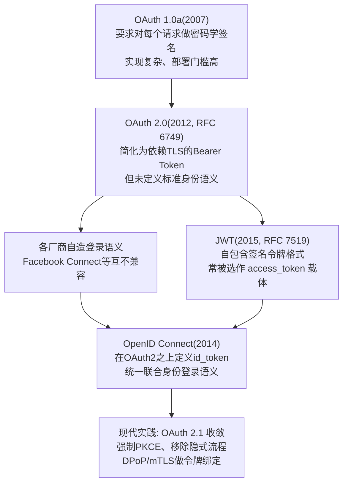
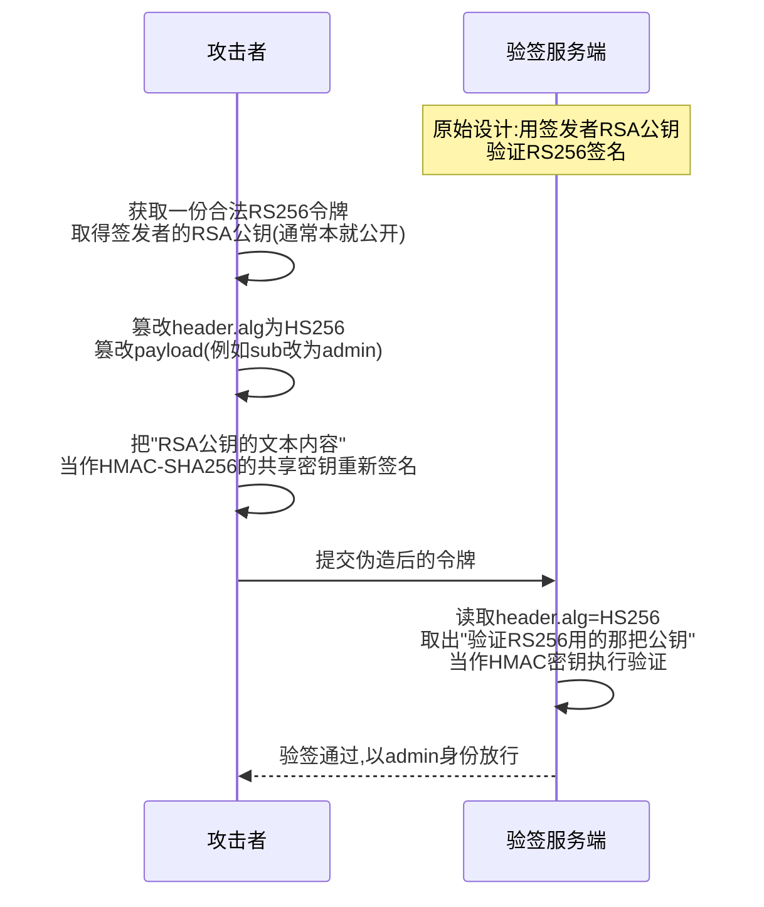
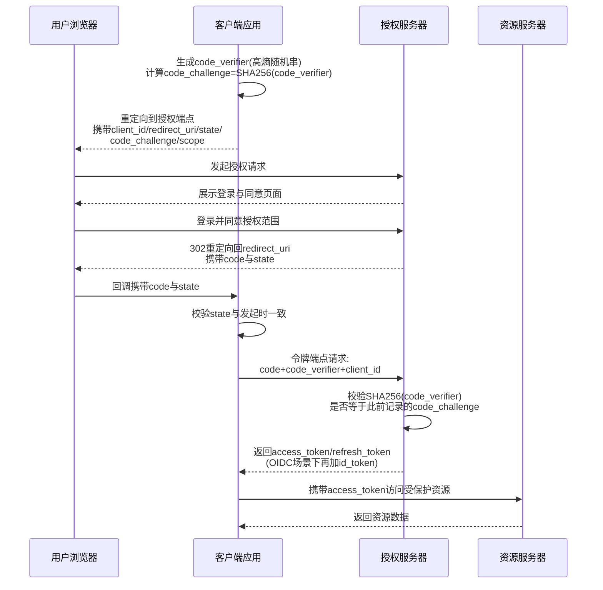
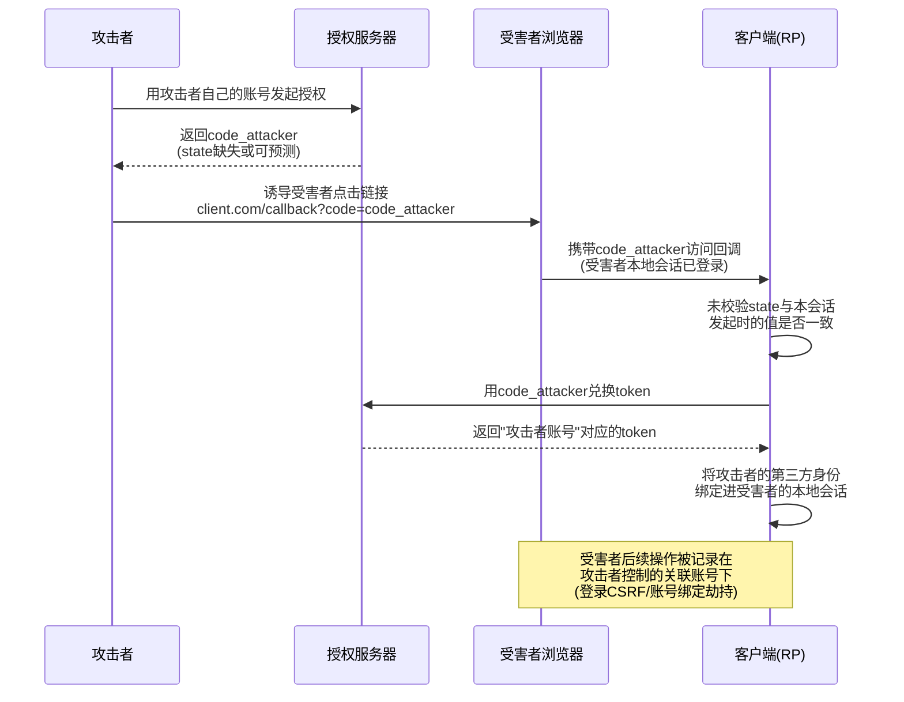
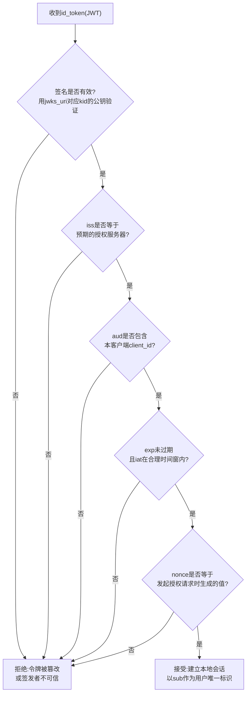

# Web与应用层安全（12）· JWT与OAuth与OIDC安全
> [!abstract] TL;DR
> - JWT 只是"签名+编码"的令牌容器：Base64URL 不是加密，payload 明文任何人都能解出，机密数据不应塞进 claim。
> - JWT 安全的核心永远是"验签"这一步：`alg=none`、RS256→HS256 算法混淆、`jwk`/`jku`/`x5u` 头注入、`kid` 路径穿越或 SQL 注入，本质都是诱使服务端用错误的密钥或算法完成验证。
> - OAuth 2.0 是"委托授权"框架而非登录协议；直接拿 access_token 当身份凭证、不引入 OIDC 校验 id_token，是历史上最常见、也最容易被忽视的误用。
> - `state` 防跨站请求伪造、`PKCE` 防授权码截获、`nonce` 防 ID Token 重放——三个随机数分别堵住授权码流程里三类不同的攻击面，混用或省略任一个都会开口子。
> - `redirect_uri` 校验不严格（子域名放过、路径拼接、开放重定向串联）是把授权码/令牌真正"送出大门"的头号真实世界漏洞，出现频率远高于签名类攻击。
> - OIDC 用 id_token 补上"这是谁"的身份语义，但大量 RP 只拿 access_token 调 UserInfo、从不真正校验 id_token 的签名与 `aud`/`iss`/`nonce`，导致"联合登录"名存实亡。

## 概述与定位

### 三者的层次关系：格式、协议、身份层

JWT、OAuth 2.0、OIDC 经常被并列提及，但它们所处的抽象层级完全不同，混为一谈正是大量安全事故的认知起点。JWT（JSON Web Token，RFC 7519）只是一种**令牌的编码格式**：它规定了如何把一组声明（claims）打包成一个自包含、可验证真伪的字符串，本身不涉及"谁能访问什么"这类授权语义。OAuth 2.0（RFC 6749）是一个**委托授权协议**：它定义了资源所有者、客户端、授权服务器、资源服务器四个角色如何协作，让第三方应用在不知道用户密码的前提下，代表用户访问受限资源。OIDC（OpenID Connect）则是**建立在 OAuth 2.0 之上的身份认证层**：OAuth 2.0 本身只负责发放"能干什么"的令牌，并不标准化"这个令牌背后的人是谁"，OIDC 通过引入强制为 JWT 格式的 `id_token`、`openid` 作用域和标准化的用户信息端点，把"登录"这件事补齐。

三者的组合关系可以这样理解：access_token（OAuth2 发的授权令牌）**经常**采用 JWT 格式，但规范上并不强制——它也可以是一个不透明的引用令牌，资源服务器通过令牌内省（RFC 7662）向授权服务器查询其有效性；而 id_token（OIDC 发的身份令牌）**规范上必须**是 JWT，因为其自包含、可离线验证的特性正是身份令牌所需要的。理解这层区别，才能定位每一类漏洞真正发生在哪一层：签名绕过是 JWT 层的信任问题，重定向流程缺陷是 OAuth2 层的多方协议问题，身份声明校验缺失是 OIDC 层的语义问题。

### 历史脉络

这套体系不是一次性设计出来的，而是在真实工程压力下逐步演化的产物：



OAuth 1.0a 用请求签名保证完整性，安全性不差，但要求客户端对每个请求参数排序、拼接、签名，实现复杂到几乎每个接入方都会踩坑，于是 OAuth 2.0 选择彻底放弃请求级签名，把安全性押注在"全程 TLS + 短生命周期 Bearer Token"这一更简单的模型上——这个简化本身就是后续一系列 Bearer Token 被窃取即被冒用问题的根源。OAuth 2.0 发布之初完全没有标准化"登录"这件事，于是每家厂商都发明了一套自己的语义去拼凑登录功能，直到 2014 年 OIDC 发布才统一了这件事。JWT 几乎与 OIDC 同期成熟，因为 OIDC 恰好需要一种自包含、可验证、可携带身份声明的令牌格式，两者一拍即合。

### 现实工程场景

这套协议族在今天的工程实践里几乎无处不在：社交账号一键登录（微信/GitHub/Google 登录第三方站点）、企业内部统一身份认证（Okta、Azure AD、Keycloak、Auth0 这类 IdP 产品）、微服务之间的服务间调用鉴权、移动端/单页应用与后端 API 的通信、开放平台的第三方授权（"允许此应用访问你的网盘"）。正因为覆盖面如此之广，协议本身任何一处设计缺陷或任何一次工程实现偏差，影响半径都会非常大。

### 与相邻章节的边界

本章与系列内几篇高度相关的章节存在明确分工。[[07.认证与会话安全]] 讨论的是以 session/cookie 为核心的传统认证与会话管理机制——口令、多因素、会话固定与劫持；本章则聚焦"委托授权 + 联合身份"这一特定协议族，可以视为认证会话主题在多方、跨域、第三方场景下的协议级延伸。[[08.访问控制与越权]] 讨论权限模型本身与水平/垂直越权的通用模式；本章里 `scope`/`aud` 校验缺失导致的令牌跨服务滥用，可以理解为越权问题在协议层的一种特殊表现，但本章更关注协议流程与令牌可信度本身，而非越权后的业务影响。[[11.API与GraphQL安全]] 讨论 API 通用攻击面（限流、批量操作、内省查询），而 JWT/OAuth 往往正是这些 API 背后的鉴权手段——本章补上的是"承载这些请求的凭证本身是否可信"这一环。至于浏览器同源边界，OAuth 的重定向跳转与 `postMessage` 令牌传递会触及 [[03.同源策略与CORS与CSP]] 讨论的机制，但本章不重复其原理，只讲协议流程本身。

## 原理与机制

### JWT 的结构：自包含、可验证、但绝不是加密

JWT 的物理形态是一个由两个点分隔的三段 Base64URL 字符串：

```
JWT = Base64URL(Header) + "." + Base64URL(Payload) + "." + Base64URL(Signature)

Header（JOSE头）示例:
{
  "alg": "RS256",       // 签名算法
  "typ": "JWT",         // 类型
  "kid": "key-2024-01"  // 密钥标识,多密钥轮换场景下用于定位验签公钥
}

Payload（Claims，声明集合）示例:
{
  "iss": "https://auth.example.com",   // 签发者(Issuer)
  "sub": "user-12345",                  // 主体,通常是用户唯一ID
  "aud": "api.example.com",             // 受众,该令牌被授权使用的目标资源
  "exp": 1735689600,                    // 过期时间(Unix时间戳,秒)
  "iat": 1735686000,                    // 签发时间
  "nbf": 1735686000,                    // 生效时间(Not Before)
  "jti": "a1b2c3d4-...",                // 令牌唯一ID,用于防重放/黑名单
  "scope": "read:profile write:orders"  // 自定义claim,业务自行扩展
}

Signature（签名,以RS256/HS256为例）:
RS256: RSASSA-PKCS1-v1_5( SHA256(Base64URL(Header)+"."+Base64URL(Payload)), 签发者RSA私钥 )
HS256: HMAC-SHA256( Base64URL(Header)+"."+Base64URL(Payload), 共享密钥 )
```

必须反复强调的一点是：**Base64URL 是编码，不是加密**。任何拿到 JWT 字符串的人，哪怕完全不知道签名密钥，也能把 Header 和 Payload 原样解出明文——浏览器控制台一行 `atob()` 就够了。这意味着 JWT 天生不适合携带口令、身份证号这类真正需要保密的数据；它能保证的只是**完整性与来源可信**（只要签名验证通过，payload 内容就一定是签发者原样写入、未被篡改的），而不是机密性。如果确实需要机密性，规范里对应的是 JWE（JSON Web Encryption，RFC 7516）而不是普通签名 JWT——JWE 是五段式结构（多了加密密钥与初始向量两段），会对 payload 做真正的对称加密，但由于实现复杂、生态支持弱，实践中绝大多数场景见到的"JWT"其实都是只签名不加密的 JWS（JSON Web Signature，RFC 7515）。这也是为什么"JWT 里存了敏感信息被人读出来"在渗透测试里是一个高频、却常被开发者误以为"签名了就安全"的低级失误。

JWT 的"自包含"特性是一把双刃剑：资源服务器验证一个请求的合法性，不需要回源查一次数据库或调一次会话存储，只要拿签发者的公钥（或共享密钥）验一次签名、检查几个 claim 就能就地判断，这对分布式、无状态的微服务架构极具吸引力。但代价是**令牌一旦签发就无法被主动收回**——不像 session id 那样服务端删一条记录就能让它立刻失效，一个 JWT 只要没到 `exp`，无论后台如何处置对应的用户或权限，它在密码学意义上依然"有效"，这个矛盾会在后文"流程缺陷"与"安全性与正确使用"中反复出现。

### 签名算法家族：对称与非对称的信任模型差异

JWS 支持的签名算法大致分三族，理解它们信任模型的本质差异，是理解后文"算法混淆攻击"为什么如此致命的前提：

- **HMAC 家族**（`HS256`/`HS384`/`HS512`）：对称算法，签名和验证用**同一把密钥**。这意味着任何持有"验证能力"的一方，天然也拥有"签发能力"——如果这把密钥被多个服务共享（比如为了让每个微服务都能独立验签），任何一个微服务出问题都等于密钥泄露，且这些服务本来就有能力伪造任意令牌。
- **RSA 家族**（`RS256`/`RS384`/`RS512`，PKCS#1 v1.5 填充）与 **RSA-PSS**（`PS256` 等，更安全的填充方案）：非对称算法，私钥签名、公钥验证。公钥可以放心公开分发给任意数量的验证方，因为拥有公钥并不能反推出伪造能力。
- **ECDSA**（`ES256` 等）与 **EdDSA**（`Ed25519`，RFC 8037）：同样是非对称算法，基于椭圆曲线，签名更短、计算更快，是近年新系统的首选。
- **`none`**：JWS 规范里确实定义了显式"不签名"这个值，用于 JWT 已经嵌套在另一层已被保护的传输通道内、无需二次签名的边缘场景。但绝大多数业务系统根本不该出现这个值——它的存在本身就是后文头号攻击手法的合法性来源。

这里的关键认知是：**对称与非对称不是"哪个更安全"的问题，而是"密钥应该被谁持有"的问题**。一个设计为用 RSA 公钥验证 RS256 令牌的系统，隐含的信任假设是"只有握有私钥的授权服务器能签发令牌，其余各方都只能验证"；一旦验证逻辑被诱导误当成 HMAC 去处理，就等于把一个理应公开、无害的公钥，错当成本应保密的对称密钥去使用——这正是本文第三部分要详细展开的算法混淆攻击的根本原理，此处先建立好这个"角色反转"的直觉。

### OAuth 2.0 的四角色与抽象协议流程

OAuth 2.0 定义了四个协议角色：**资源所有者**（Resource Owner，通常是用户本人）、**客户端**（Client，请求访问资源的第三方应用）、**授权服务器**（Authorization Server，负责认证用户并签发令牌）、**资源服务器**（Resource Server，持有受保护资源、接受令牌访问的 API）。抽象流程可以概括为一句话：客户端向授权服务器证明自己获得了资源所有者的授权，换取一个令牌，再拿这个令牌去资源服务器换取资源，资源服务器全程不需要知道用户的密码，也基本不需要和授权服务器实时通信（除非走令牌内省）。

这里必须点出 OAuth 2.0 采用的 **Bearer Token** 语义（RFC 6750）：谁持有这个令牌，谁就能使用它对应的权限，资源服务器不会额外验证"出示令牌的人是否就是令牌本该发给的人"。这个设计选择直接决定了本章后续大量"令牌泄露"类问题的严重性——Bearer Token 在安全属性上更接近现金而非记名支票：一旦落入他人之手，无需任何额外凭证即可直接使用，这也是后文要讲的 DPoP/mTLS 令牌绑定机制存在的意义。

### 授权许可类型（Grant Types）全景

OAuth 2.0 及其扩展定义了多种"许可类型"，对应不同的客户端能力与使用场景：

- **Authorization Code（授权码模式）**：最标准的流程，适合有后端的 Web 应用；授权码通过前端重定向传递，真正的令牌兑换发生在后端到授权服务器的直连通道，浏览器全程接触不到最终令牌。
- **Authorization Code + PKCE（RFC 7636）**：在授权码模式基础上增加"证明拥有原始请求发起权"的挑战-验证机制，专为无法安全保存 client_secret 的公共客户端（SPA、移动 App）设计，OAuth 2.1 草案已将其定为所有客户端类型的标配，不再仅限公共客户端。
- **Implicit（隐式模式）**：令牌直接通过 URL 片段返回给浏览器，省去了授权码兑换这一步，是早期为"不方便做后端兑换"的纯前端应用设计的捷径，但由于令牌暴露面过大，已被 OAuth 2.1 正式移除。
- **Client Credentials（客户端凭证模式）**：没有用户参与，客户端用自己的身份直接向授权服务器换取令牌，用于服务间调用（机器对机器）。
- **Resource Owner Password Credentials（密码模式）**：客户端直接收集用户名密码去换令牌，等于让第三方客户端接触到用户原始凭证，与 OAuth"不暴露密码给第三方"的初衷相悖，现已不推荐使用，仅在高度受信的第一方客户端迁移场景中偶尔可见。
- **Device Authorization Grant（设备码模式，RFC 8628）**：为电视、IoT 这类没有便利文本输入或浏览器的设备设计，设备展示一个短码，用户在另一台设备上输入完成授权。
- **Refresh Token Grant（刷新令牌模式）**：用长生命周期的刷新令牌换取新的短生命周期访问令牌，避免用户反复重新登录。
- 更新的扩展还包括 **CIBA**（Client-Initiated Backchannel Authentication，客户端发起的后端信道认证，适合语音助手、柜台终端等无法直接跳转浏览器的场景）与 **Token Exchange**（RFC 8693，用于服务间令牌委托转换，比如网关把用户令牌换成下游服务专用的窄权限令牌）。

### OIDC：在 OAuth 2.0 之上补齐身份语义

OIDC 的做法是在 OAuth 2.0 的骨架上做最小侵入式扩展：请求授权时加入 `openid` 作用域，授权服务器除了返回 access_token，额外返回一个规范强制为 JWT 格式的 **id_token**，其中携带 `iss`、`sub`、`aud`、`exp`、`iat` 等身份声明，以及请求时若携带了 `nonce` 就必须原样回显的 `nonce` 声明。此外 OIDC 还标准化了 **UserInfo 端点**（用 access_token 换取用户详细资料）、**Discovery 文档**（`/.well-known/openid-configuration`，用一个固定 URL 声明该身份提供方所有端点地址与能力）、**JWKS 端点**（发布用于验证 id_token 签名的公钥集合）以及一组标准作用域（`profile`、`email`、`address`、`phone`）。理解这一层的关键是：**access_token 回答"这个请求被允许做什么"，id_token 回答"这次登录背后是谁"**，两者语义完全不同却经常被开发者混为一谈，这正是后文要展开的一类经典缺陷的根源。

## 协议与流程详解：签名绕过、令牌泄露与流程缺陷

### 签名绕过：让服务端"验错"的六类手法

JWT 安全问题里最广为人知的一族，本质都是同一件事：**想办法让服务端用错误的密钥或错误的算法完成"验证"这一步**，从而使攻击者能够自己签发一个被服务端认可为合法的令牌。

**`alg=none` 攻击**是最直接的一种。JWS 规范允许 `none` 作为合法算法值，含义是"此令牌无需签名"，本是为某些已经处于其他保护层内的嵌套场景准备的。但相当一部分早期 JWT 库的验证逻辑是"读取 header 里的 alg 字段，据此决定用什么方式验证"——如果库作者没有为"验证方在业务上到底期望什么算法"做强制约束，攻击者只需把 header 的 `alg` 改成 `none`、把签名部分留空，某些实现就会照单全收。这类漏洞在 2015 年前后由安全研究者对多个语言的 JWT 库做批量审计后被大范围曝光，此后主流库大多默认拒绝 `none`，但历史遗留代码、内部自研的"精简版"JWT 处理逻辑仍时常中招；一个常见的变体是绕过某些只做大小写敏感黑名单检查的防御——把值写成 `None`、`NONE`、`nOnE` 从而绕过一个只匹配小写字符串 `"none"` 的简陋过滤器。

**算法混淆攻击（RS256 → HS256 降级）**是危害最大也最经典的一种，其原理正好呼应上一节讲的"角色反转"：



服务端本来的设计是"用授权服务器的 RSA 公钥去验证 RS256 签名"，这把公钥往往本身就是公开的（挂在 JWKS 端点、甚至写进客户端代码）。如果验证函数的实现是"读 header.alg 决定调用哪个验证算法，再拿配置里那同一个'密钥'去用"，那么当 alg 被改成 HS256 时，程序就会把那把本该只用于非对称验证的公钥字符串，错当成对称算法所需的共享密钥去计算 HMAC——而这把"密钥"攻击者本来就能拿到，伪造签名自然畅通无阻。修复方式必须是验证端**显式声明自己只接受哪一种或哪几种算法**（且区分密钥的用途），绝不能让 token 自己的 header 反过来决定服务端该用什么方式验证自己。

**`jwk` 头参数注入**：JWS 规范允许在 header 中通过 `jwk` 字段直接内嵌一份公钥（RFC 7515 4.1.3 节），本意是给某些无法预先分发密钥的场景使用。如果验证逻辑天真地信任令牌自带的这个 `jwk` 字段去验证自己的签名，那攻击者完全可以自己生成一对密钥，用自己的私钥签名，再把自己的公钥塞进 `jwk` 头——这是一次自证自签的伪造，服务端等于在用攻击者提供的钥匙去开攻击者自己上的锁。

**`jku`/`x5u` 头注入**：`jku`（JWK Set URL）指向一个应由验证方去拉取公钥集合的 URL，`x5u` 则指向一个 X.509 证书。如果服务端没有把这个 URL 严格限制在自己信任的域名范围内，攻击者可以在自己控制的服务器上托管一份自制的 JWKS，把 `jku` 指向那里，服务端便会去获取攻击者提供的"合法密钥"来验证攻击者自己签名的令牌——这类问题同时也是一个货真价实的 SSRF 入口，因为服务端会对 token 里指定的任意 URL 发起出站请求，值得对照 [[06.CSRF与SSRF]] 中 SSRF 部分的通用防护思路。

**`kid` 注入**：`kid`（Key ID）告诉验证方该去哪个密钥库里取哪一把公钥或密钥，实现上往往是文件路径拼接、数据库查询或 KMS 调用。如果 `kid` 值未经清洗就直接拼进查询或路径，就会出现路径穿越（例如把 `kid` 设为指向 `/dev/null` 之类的空文件，诱导系统读到一个空字符串当密钥，再用空字符串重新计算 HMAC 伪造签名）或 SQL 注入（`kid` 直接拼进 `SELECT key FROM keys WHERE id = '<kid>'` 这类语句，让查询返回攻击者已知或可控的值）。这类问题本质上是把经典的 Web 输入校验漏洞（详见 [[04.注入类漏洞：SQL与命令与模板]]、[[10.文件上传与路径穿越]]）搬进了 JWT 验签这个特定语境。

**弱密钥爆破**：如果 HS256 使用的共享密钥过短、是默认值或字典词汇，攻击者拿到一枚合法令牌后即可离线用 hashcat（对应模式号 16500）或 `jwt_tool`/`jwt_cracker` 配合字典对密钥做暴力破解，一旦破出密钥，就能签发任意内容的合法令牌，其影响与拿到私钥泄露等价。

以上是狭义的"签名绕过"，还有一类紧邻但性质略有不同的问题是**claim 校验缺失**——签名本身验证无误，但服务端压根没检查 `exp`（令牌永不过期）、没检查 `aud`（发给服务 A 的令牌被服务 B 也照单全收）、没检查 `iss`（接受来自非预期签发者的令牌）。这不是"验错"而是"没验"，后果同样是任意伪造或跨服务重放，且在真实代码审计中出现频率其实高于前面几类精巧的签名攻击，因为它只需要开发者少写一行校验代码。

### 令牌泄露：令牌是怎么"跑出去"的

签名再牢固，如果令牌本身在传输或存储环节被泄露，攻击者根本不需要伪造，直接拿走使用即可——现实世界里，令牌泄露类问题的出现频率其实高于签名破解类问题。

**隐式模式的 URL 片段泄露**是这类问题的历史原型：隐式模式把 access_token 直接附着在重定向 URL 的片段（`#access_token=...`）中返回给浏览器。URL 片段虽然不会被发往服务器（因此不会出现在服务端访问日志里），但依然会被完整写入浏览器历史记录，也可能被页面上执行的第三方脚本、浏览器扩展通过读取 `window.location` 获取，还可能在页面存在开放重定向或后续跳转逻辑时被间接带出。正是因为泄露面难以彻底封死，OAuth 2.1 才干脆废弃了隐式模式，统一要求哪怕是纯前端 SPA 也走"授权码 + PKCE"，把令牌兑换这一步收敛到一次性的、不出现在地址栏里的后端请求（或至少是不经过完整页面跳转的 fetch 请求）中完成。

**日志与中间设备**：access_token/id_token 一旦被当作普通 URL 查询参数或请求头记录进 Web 服务器访问日志、CDN 日志、APM 链路追踪系统、错误上报平台，就相当于把凭证明文留存在大量运维人员日常可及的地方，参考 [[72.抓包与协议分析实战/04.HTTP与HTTPS抓包与中间人分析]] 中讨论的中间人抓包视角，这些日志本身就是一种"事后可重放"的抓包记录。

**浏览器端不当存储引发的 XSS 连锁**：把 access_token/id_token 存进 `localStorage` 或 `sessionStorage` 是前端工程里极常见的做法，问题在于这两者对页面内任意运行的 JavaScript 完全透明——一旦站点存在任何一处 XSS（参考 [[05.XSS跨站脚本]]），攻击者注入的脚本可以直接读取并回传令牌，危害等同于直接窃取了用户身份。这也是后文要强调"优先用 httpOnly Cookie 承载令牌"这条建议的直接动因。

**开放重定向与 `redirect_uri` 校验不严的串联**是当前真实世界里出现频率最高的令牌泄露路径。授权服务器在下发授权码或令牌时，会重定向到客户端预先注册的 `redirect_uri`；如果授权服务器对这个地址的校验只做了域名匹配、前缀匹配甚至只校验了协议头，攻击者就能构造出一个"技术上匹配但实际指向别处"的地址：比如客户端注册的是 `client.com`，而授权服务器允许任意子域名，攻击者只要控制一个 `evil.client.com`（在有子域名接管漏洞或允许自助建站的平台上并不罕见）就能截获授权码；又或者客户端自己的域名下存在一个开放重定向端点（例如 `client.com/redirect?next=`），攻击者把 `redirect_uri` 设为这个开放重定向地址、再让它二次跳转到攻击者服务器，只要授权服务器的校验逻辑没有精确匹配到完整路径，这条"合规但可控"的链路就能把授权码原样送到攻击者手上。移动端还有一类变体：多个 App 可以争抢注册同一个自定义 URL Scheme，如果没有使用更安全的 App Link/Universal Link（域名验证过的深链接），恶意 App 完全可能截获本该唤起正牌 App 的回调。

**过度授权与同意钓鱼（Consent Phishing）**也是一种广义的"泄露"——攻击者注册一个外观正规、名称近似知名品牌的第三方应用，申请远超实际需要的作用域（比如邮件读取、云盘完全访问），诱导用户在授权同意页上一键点"允许"，这类针对 OAuth 同意流程本身的社会工程攻击在企业办公套件（如仿冒 Office 365 应用）的钓鱼活动中曾被大规模利用，本质是利用了用户"看到官方登录跳转就默认信任"的心理，而非利用协议实现漏洞。

### 流程缺陷：授权码流程里的经典设计缺陷

除了令牌本身的签名与存储问题，OAuth 授权码流程作为一个横跨多方、多次重定向的多步协议，其**流程完整性**本身就是一大类攻击面，通常统称为 OAuth 流程缺陷。在逐一拆解这些缺陷之前，先看一遍"授权码 + PKCE"这套现代标准流程本该如何正确运转，后面每一类缺陷都可以理解为对图中某一步校验的破坏：



正常流程里，`state` 在第一步生成、最后一步比对，贯穿客户端自己的会话；`code_challenge`/`code_verifier` 在两端各出示一半，只有真正发起过请求的那个客户端实例才能在兑换时提供匹配的原始值；`code` 本身只在浏览器重定向这一段"跑一次"，真正的令牌兑换发生在客户端后端到授权服务器的直连信道上，浏览器全程看不到最终令牌。下文的每一类流程缺陷，几乎都能对应到这张图里"某一步该做的校验没有做"。

**缺失或可预测 `state` 引发的登录 CSRF**是最经典的一类：



`state` 参数的作用是把"发起授权请求的会话"与"接收授权回调的会话"绑定在一起，防止攻击者伪造一次跨站请求，把自己账号的授权码"塞给"受害者的浏览器会话。如果客户端没有校验 `state`（或 `state` 是可预测的固定值、时间戳），攻击者可以先用自己的账号走一遍授权流程拿到自己的授权码，再诱导受害者直接访问带着这个授权码的回调 URL——受害者的客户端会话会误以为是自己完成了授权，把攻击者的第三方身份绑定到受害者本地账号上。这类攻击的实际危害因业务而异：轻则受害者账号被强行关联了一个攻击者可控的第三方登录方式（进而攻击者可以用这个第三方身份登录受害者账号），重则如果客户端是"用第三方账号信息直接创建/合并本地账号"的简单实现，可能直接导致账号信息混淆或被接管。

**授权码注入/重放**是与上述场景高度相关但触发路径不同的一类问题：攻击者通过某种渠道（钓鱼、恶意应用日志、中间人）获得了一个本应发给别人客户端实例的合法授权码，如果客户端在兑换令牌这一步没有把授权码与最初发起请求时的上下文（包括 `code_verifier`、`state`、甚至客户端实例标识）强绑定，这枚授权码就可以被注入进另一个受害者的会话中完成兑换，效果与上面的 CSRF 图示类似，但触发方式不依赖 `state` 缺失，而是依赖兑换步骤缺乏上下文校验。

**PKCE 降级攻击**：PKCE 的设计是客户端在发起授权请求前生成一个随机的 `code_verifier`，把它的哈希值 `code_challenge` 带在授权请求里，兑换令牌时再把原始 `code_verifier` 提交给授权服务器核对——这样即便授权码在重定向途中被截获，攻击者没有 `code_verifier` 也无法完成兑换。但如果授权服务器只是"支持"PKCE 而不是"强制"PKCE，也就是说，对于同一个公共客户端类型，仍然允许在请求里不带 `code_challenge`、兑换时不带 `code_verifier` 也能走通，那么截获了授权码的攻击者只需要绕开 PKCE、走"裸"授权码兑换即可，PKCE 形同虚设。这也是为什么现代实践与 OAuth 2.1 都要求授权服务器对公共客户端**强制**要求 PKCE，而不是把它当作客户端可自愿选择的加分项。

**Mix-up 攻击**出现在客户端同时对接多个授权服务器的场景（比如页面上并列放着"用 Google 登录"和"用某企业 IdP 登录"两个按钮）。如果客户端没有在收到回调时明确区分这次响应到底来自哪一个授权服务器，攻击者可以诱导客户端错把发给可信 AS 的授权码或凭证发送到攻击者搭建的恶意 AS，或者反过来让客户端误将攻击者 AS 签发的授权码当作可信 AS 的结果去处理，从而造成 `client_secret` 泄露给错误的一方，或错误签发的令牌被当作合法结果接受。RFC 9207 引入的 `iss` 响应参数正是为了解决这个问题——让每次授权响应显式携带"我是谁签发的"，客户端据此判断这次回调到底该拿去哪个授权服务器的令牌端点兑换。

**跨服务令牌透传与"混淆代理"问题**：在微服务架构里，网关或某个内部服务经常会直接把从上游拿到的 access_token 原样透传给下游服务调用，如果每一跳都不做 `aud` 收窄，任何一个下游服务其实都能拿着这枚令牌去调用它本不该有权限调用的其他服务——这正是经典的"confused deputy"（受骗的代理人）问题在微服务鉴权场景下的翻版：某个服务本身拥有合法权限，却因为无法区分"这次调用到底代表谁、被授权做到什么程度"而被诱导滥用自己的权限。RFC 8693 定义的 Token Exchange 正是为了让每一跳都能把令牌"换成"权限更窄、`aud` 更精确的下游专用令牌，而不是无脑透传原始令牌。

**客户端类型混淆**：把只适合"机密客户端"（能安全保存 `client_secret` 的后端服务）的授权模式，套用到"公共客户端"（SPA、移动 App，代码本身会分发到不受信任的终端设备上）身上，是另一类常见的实现误区——`client_secret` 硬编码进前端 JS 包或反编译可得的 APK 里，本质上等于这个"秘密"从未真正保密过。这正是公共客户端必须依赖 PKCE 而非 `client_secret` 来完成身份证明的根本原因。

**刷新令牌缺乏轮换与重用检测**：刷新令牌生命周期长、价值高，如果每次用它换新 access_token 时不同步签发一枚新的刷新令牌并作废旧的（即"轮换"），一枚被窃取的刷新令牌就能被无限期使用而不被察觉；进一步，如果授权服务器不对"同一枚已作废的刷新令牌被再次使用"这种异常情况做检测和响应（这通常意味着有两方在使用同一枚令牌，其中一方一定是攻击者），就丧失了本可以及时发现泄露、联动吊销整条令牌链的机会。

### OIDC 特有的身份层风险

OIDC 在 OAuth2 基础上叠加的身份语义，也带来了专属这一层的风险，核心都围绕"id_token 到底有没有被认真校验"。规范（OIDC Core 1.0 第 3.1.3.7 节）要求依赖方（RP）对收到的 id_token 完整走完一条校验链：



现实中大量集成第三方登录的业务代码，实际只做了"拿 access_token 调一次 UserInfo 接口，返回 200 就当登录成功"这一件事，从头到尾没有解析过 id_token，更谈不上校验其中任何一项声明——这种实现方式表面上"能用"，却完全丧失了 OIDC 想要提供的密码学级别身份保证，退化成了一个只要能构造出一个"看起来像成功"的 HTTP 响应就能被绕过的薄弱环节，尤其是在自建或非标准 IdP 对接场景下风险更突出。

**`nonce` 与 `state` 的区别**经常被搞混，但二者保护的对象层级完全不同：`state` 保护的是 OAuth 重定向这一次 HTTP 交互本身，校验发生在客户端应用的业务代码里，本质是一次 CSRF token 校验；`nonce` 保护的是 id_token 这个 JWT 对象本身，它作为一项 claim 被签名保护在令牌内部，校验的是"这枚身份令牌是不是专门为这一次登录会话签发的，而不是此前某次登录被截获后拿来重放的"。规范里 `nonce` 在隐式/混合模式下是强制的，在纯授权码模式下技术上可选，但省略它会让 id_token 本身失去防重放能力，一旦 id_token 在传输链路上被截获，理论上就可能被重放进另一个会话。

**Discovery 文档与 `jwks_uri` 的签发者混淆**：多租户 OIDC 集成场景下，如果客户端根据用户输入或某个不受信任来源提供的 `iss` 值去动态拼接 Discovery 文档地址（`{iss}/.well-known/openid-configuration`），而不是把 `iss` 锁定在预先配置好的可信列表里，攻击者就能把 `iss` 指向一个完全由自己搭建的伪 OIDC 提供方，让客户端去读取攻击者自定义的 `jwks_uri`、`authorization_endpoint` 等一整套端点配置，从而实现完全可控的身份伪造。这与前文签名绕过一节里 `jku` 头注入是同一类信任模型问题在更高层级（整个 Discovery 文档而不只是一个 header 字段）的重演，本质仍是"验证一方绝不能让被验证一方来指定验证所需的信任锚点"。

**id_token 与 access_token 的混用**：两者外观上都是字符串（甚至都可能是 JWT），但语义完全不同——access_token 的受众是资源服务器，id_token 的受众是发起登录的客户端本身。如果资源服务器没有通过 `typ` 头（RFC 9068 建议 OAuth 访问令牌显式标注 `at+jwt`）或专属 `aud` 值来做区分，一枚本该只用于"证明登录"的 id_token，如果经由前述任一种泄露渠道流出，可能被错误地当作 access_token 提交给某个疏于校验的 API 并被接受，形成一次跨协议层的令牌误用。

**登出令牌校验**：OIDC 会话管理规范定义了前端信道登出（通过隐藏 iframe 通知各依赖方登出）与后端信道登出（授权服务器直接向各依赖方的后端推送一枚"登出令牌"，同样是签过名的 JWT，携带 `sub`/`sid` 与固定的 `events` 声明）。前端信道登出近年来因为浏览器第三方 Cookie 限制、隐私沙盒策略而越来越不可靠，后端信道登出正成为主流，但它同样是一枚需要完整校验签名、`iss`、`aud` 与 `events` 声明的 JWT——如果依赖方对登出令牌校验草率甚至完全不校验，就可能被伪造的登出请求钓鱼，或者反过来，真实的登出事件因校验逻辑写错而被丢弃，导致该失效的会话continue 存活。

## 工具视角与实战

### 侦察：定位协议涉及的全部端点

对一个使用了 OAuth/OIDC 的目标做安全测试，第一步永远是把协议涉及的全部端点摸清楚：如果是标准 OIDC 提供方，直接访问 `/.well-known/openid-configuration` 就能拿到一份 JSON，里面列全了 `authorization_endpoint`、`token_endpoint`、`userinfo_endpoint`、`jwks_uri`、`end_session_endpoint`、支持的 `response_types`/`grant_types`/`scopes_supported` 等关键信息，相当于一份协议侧的"接口文档"。没有标准 Discovery 文档的自建实现，则需要通过抓包（配合 [[72.抓包与协议分析实战/04.HTTP与HTTPS抓包与中间人分析]] 中的中间人分析方法）走一遍完整登录流程，人工记录每一次跳转经过的地址与参数。

### 常用工具箱

- **`jwt_tool`**（ticarpi 开发的 Python 工具）是 JWT 专项测试的事实标准，一条命令（`-M at`，all-tests 模式）就能自动跑一遍 `alg=none`、算法混淆、弱密钥爆破等一整套已知手法，也支持手工模式下按需篡改任意 claim 并用指定密钥/算法重新签名，是验证"服务端到底有没有做对校验"的首选。
- **`jwt.io`（网页版）与 `jwt-cli`（命令行）**用于快速解码、肉眼检查一枚 JWT 的 header 与 payload，是最基础但最常用的第一步。
- **Burp Suite 扩展**：`JSON Web Tokens`（即 JOSEPH 的后继实现，能在请求经过时自动识别 JWT 并提供重签名面板）、`Autorize`（自动化对比同一请求换用不同权限令牌后的响应差异，用于批量发现越权，天然适合验证 `aud`/`scope` 校验是否到位）、`Auth Analyzer` 都是审计 OAuth/JWT 场景的常备件。
- **`hashcat`（模式 16500）与 `john` 的 JWT 格式插件**用于对已获取的合法 HS256 令牌做离线弱密钥爆破，是"弱密钥爆破"这一手法在工具链上的具体落地。
- 用代理（Burp/`mitmproxy`）完整拦截一遍 OAuth 重定向链，逐跳检查 URL、Referer、响应头里是否意外携带了授权码或令牌明文，是发现"令牌泄露"类问题最直接有效的手段，往往比任何自动化扫描器都可靠。

### 一套可复用的测试方法论

面对一个具体目标，比较高效的排查顺序是：先解码 JWT 三段，记录其 `alg` 与是否存在 `jwk`/`jku`/`x5u`/`kid` 头；再逐一尝试 `alg=none`、算法混淆、`kid` 注入等已知手法（`jwt_tool` 的自动化模式可以一次性跑完大半）；接着检查 claim 校验是否到位——篡改 `aud` 后令牌是否仍被接受、过期令牌能否复用、发给 A 服务的令牌能否直接用于 B 服务；然后转向 OAuth 流程本身——`state` 是否存在、是否真正与发起会话绑定、授权码能否被重放第二次、`redirect_uri` 校验是否精确匹配到完整路径而非仅域名、PKCE 是否被强制要求而非可选；再检查刷新令牌是否轮换、旧令牌被重用时是否触发整条链路吊销；最后针对 OIDC 部分，重点检查客户端代码是否真正解析并校验了 id_token 的签名、`iss`、`aud`、`exp`、`nonce`，还是仅仅调用了 UserInfo 接口就草率认定登录成功——这一步在实战中命中率出奇地高。

### 代码审计视角：各语言 JWT 库的典型误用模式

静态审计比黑盒测试更能一次性定位系统性问题，几个语言生态里常见的踩坑点值得重点关注：Node.js 的 `jsonwebtoken` 库在调用 `jwt.verify(token, key)` 时，如果没有显式传入 `algorithms: ['RS256']` 这样的允许列表，且配置里用于验证的 `key` 变量恰好也能被当作字符串使用，就存在被降级为对称验证的风险，历史上这一疏漏曾造成多起真实漏洞；Python 的 `PyJWT` 近年版本已经要求 `jwt.decode()` 显式传入 `algorithms=` 参数（这是一个积极的安全默认值改进），但不少旧教程、旧代码库里仍能找到当年为了"调试方便"写下的 `verify=False`，且这类临时代码有相当比例最终被遗忘着提交进了生产分支；Java 生态的 `jjwt`/`java-jwt` 如果自定义了 `SigningKeyResolver` 却没有让它感知算法类型、只根据 `kid` 盲目返回密钥，同样会在无意中为算法混淆开门。审计时可以直接在代码里搜索"是否存在裸的 `verify=False`/`verify: false`""是否每一处 `decode`/`verify` 调用都显式锁定了算法白名单""密钥解析逻辑是否区分了对称/非对称场景"这几类模式，命中率通常远高于纯黑盒测试。

## 安全性与正确使用

> [!caution] 合规与使用边界
> 本节及全文涉及的签名绕过、令牌伪造、流程劫持等技术细节，仅用于**自有系统、已获书面授权的评估目标，以及 CTF/靶场等封闭安全研究环境**。文中所有攻击原理均以防御与教育为目的展开，旨在帮助读者识别并修复自身系统中的同类缺陷，不构成、也不应被用于针对任何真实生产系统或他人系统的攻击操作，更不得用于绕过任何商业软件的授权或计费机制。将本文内容用于未授权系统属于违法行为，请读者严格遵守所在地法律法规与目标系统的授权协议。

### 签名与算法层面的加固

最核心的一条原则是：**验证方必须自己决定期望的算法，绝不能让令牌自身的 `alg` 头反过来指挥验证逻辑**。具体到实现层面，应当在初始化验证器时就显式传入一个固定的算法白名单（例如只接受 `["RS256"]`），并且对称密钥与非对称公钥要在代码里用不同的变量、不同的密钥管理命名空间隔离存放，避免出现"同一个配置项既可能被当 HMAC 密钥又可能被当 RSA 公钥使用"的歧义结构；`jwk`/`jku`/`x5u` 这类允许令牌自带信任锚点的头一律不予信任，密钥来源必须是服务端自己预先配置、写死的地址或本地密钥库；`kid` 一旦用于查找密钥，必须做严格的白名单校验或参数化查询，绝不能拼接进路径或 SQL。

### 令牌生命周期管理

Access token 应当保持短生命周期（分钟到小时级），把"长期有效"的责任转移给刷新令牌，并配合刷新令牌轮换——每次使用后签发新的、作废旧的，一旦检测到某个已作废的刷新令牌被再次提交，说明该令牌链已经泄露，应当立即联动吊销整条令牌链而不仅仅是拒绝这一次请求。对于确实需要"随时可吊销"能力、又不想放弃 JWT 自包含优势的场景，一个务实的折中是保留短 TTL 的 JWT 作为常态，同时维护一份基于 `jti` 的服务端黑名单只用于"紧急吊销"这种低频场景；如果吊销诉求非常核心（比如金融级场景），更彻底的方案是干脆放弃自包含 JWT，改用不透明的引用令牌配合令牌内省端点（RFC 7662），用一次额外的网络往返换取随时可控的吊销能力——这是"无状态换性能"与"有状态换可控性"之间的经典权衡，没有免费的选择。

### OAuth/OIDC 流程层面的加固

`state` 与 `nonce` 都必须使用密码学安全的随机数生成，长度足够，且要与发起请求时的服务端会话强绑定（存入服务端 session 或 httpOnly Cookie），回调时严格比对、一次性使用后立即失效；公共客户端必须强制 PKCE，机密客户端也建议同步启用，不应把它当作可选加分项；`redirect_uri` 必须在授权服务器一侧做**精确字符串匹配**（而非域名/前缀/通配符匹配），所有合法回调地址提前逐一注册；每一次令牌验证都要做完整的 `aud`/`iss`/`exp`/`nbf` 校验，跨服务场景下坚持"网关处收窄 `aud`、下游只信任自己名下的令牌"，避免透传裸令牌造成的混淆代理问题；对接多个授权服务器时启用 RFC 9207 定义的 `iss` 响应参数以防 Mix-up 攻击。更进一步的加固手段包括 **PAR**（Pushed Authorization Requests，RFC 9126，客户端先把授权请求参数通过后端信道推送给授权服务器换回一个 `request_uri`，浏览器端只携带这个不可篡改的引用，从根本上防止授权请求参数在前端被篡改或用于构造钓鱼链接）与 **JAR**（JWT-Secured Authorization Request，把整个授权请求本身打包签名成一枚 JWT）。这些机制加上强制 PKCE、`mTLS`/`private_key_jwt` 客户端认证，正是 **FAPI**（Financial-grade API）这类面向开放银行等高安全要求场景的 OAuth 加固档位（profile）的核心构成，值得作为"把本章所有加固点一次性落地"的参考范本。

### 存储与传输层面的加固

浏览器端应尽量避免把 access_token/id_token 存入 `localStorage`/`sessionStorage`，因为任何一处 XSS 都能让攻击者直接读取；更稳妥的模式是采用 **BFF**（Backend For Frontend）架构，把令牌完全留在服务端 session 中，浏览器只持有一枚 `httpOnly + Secure + SameSite` 的会话 Cookie，令牌本身永远不出现在前端 JavaScript 可及的范围内。全部流程必须建立在 [[71.详解网络协议/18.HTTP-HTTPS协议]] 与 [[71.详解网络协议/15.TLS协议]] 所讨论的传输层加密之上，任何一段明文 HTTP 传输都会让前面所有的签名与流程加固失去意义。

### 令牌绑定与检测响应

Bearer Token"谁持有谁使用"的模型是本章大量令牌泄露问题的根源，真正意义上的解法是**令牌绑定**：**DPoP**（Demonstrating Proof-of-Possession，RFC 9449）要求客户端在每次请求时额外提交一份用自己私钥签名的证明，资源服务器据此确认"出示令牌的确实是当初申请令牌的那个客户端实例"；**mTLS 客户端证书绑定**则是把令牌与 TLS 层的客户端证书直接关联。两者都能让一枚被窃取的裸令牌脱离原设备后直接失去可用性，是对抗令牌泄露危害的最终手段，代价是部署复杂度上升，目前更多见于金融级或高价值 API 场景。此外，`jwks_uri`/Discovery 文档的获取必须限制在预先配置的可信域名白名单内，并对内网元数据地址（如云环境常见的 `169.254.169.254`）做出站阻断，防止被当作 SSRF 跳板；生产环境应对令牌的颁发、刷新、吊销行为记录审计日志（关联 IP、User-Agent、地理位置），对异常刷新模式（同一刷新令牌短时间内从相距很远的 IP 使用）建立告警；面向用户的授权同意页应清晰展示所申请的作用域含义，坚持最小权限申请，降低被同意钓鱼利用的空间。

## 小结

JWT、OAuth 2.0、OIDC 三者分处格式、授权协议、身份层三个不同抽象层级，却经常在同一套业务系统里叠在一起使用，因此本章反复强调的其实是三条独立又彼此关联的信任边界：**签名验证**决定了一枚令牌的内容是否真的出自可信签发者之手，任何允许令牌自身的 `alg`/`jwk`/`jku`/`kid` 反过来指挥验证逻辑的实现都会让这条边界形同虚设；**重定向与令牌交换流程**决定了令牌在多方多次跳转之间能否被安全、专一地传递，`state`/`nonce`/PKCE 三个随机数各自锁定不同的攻击面，`redirect_uri` 精确匹配则是最基础也最易被忽视的一道闸门；**身份声明校验**决定了一次"联合登录"是否真正验证了对方身份，而不是仅凭一次 UserInfo 调用成功就草率放行。三条边界任何一处松动，前面做得再扎实的另外两条也无法独立兜底整个系统的安全性。下一章将转向承载这些测试手法的具体工具链——BurpSuite 的代理、扫描与插件体系，把本章"侦察-构造-验证"的手工方法论进一步自动化、系统化。

## 相关阅读

- 核心规范：RFC 7519（JWT）· RFC 7515（JWS）· RFC 7516（JWE）· RFC 8725（JSON Web Token Best Current Practices）· RFC 9068（JWT Profile for OAuth 2.0 Access Tokens）。
- OAuth 系列规范：RFC 6749（OAuth 2.0）· RFC 6750（Bearer Token Usage）· RFC 7636（PKCE）· RFC 7009（Token Revocation）· RFC 7662（Token Introspection）· RFC 8628（Device Authorization Grant）· RFC 8693（Token Exchange）· RFC 9126（PAR）· RFC 9207（授权响应 iss 参数）· RFC 9449（DPoP）· RFC 9700（OAuth 2.0 Security Best Current Practice）· OAuth 2.1 草案。
- 身份层规范：OpenID Connect Core 1.0 · OpenID Connect Discovery 1.0 · OpenID Connect RP-Initiated Logout / Front-Channel / Back-Channel Logout 1.0。
- 同系列：[[00.Web与应用层安全总览|系列总览]] · [[07.认证与会话安全]]（session/口令/多因素与本章的协议级延伸关系）· [[08.访问控制与越权]]（scope/aud 缺陷与越权的关系）· [[11.API与GraphQL安全]]（承载本章令牌的 API 攻击面）· [[04.注入类漏洞：SQL与命令与模板]]（`kid` 注入的通用原理）· [[05.XSS跨站脚本]]（`localStorage` 令牌泄露的触发源）· [[06.CSRF与SSRF]]（`state` 缺失即登录 CSRF、`jku`/Discovery 场景下的 SSRF）。
- 协议承接：[[71.详解网络协议/18.HTTP-HTTPS协议]] · [[71.详解网络协议/15.TLS协议]]。
- 认证呼应：[[30.Windows认证与生物识别编程/08.WebAuthn与FIDO2与passkey编程]]（无密码、公钥绑定的认证范式与本章 Bearer Token 模型的对照）。
- 抓包呼应：[[72.抓包与协议分析实战/04.HTTP与HTTPS抓包与中间人分析]]。
- 密码呼应：[[37.密码学/62.协议误用与密码工程]]（算法混淆攻击背后的密码学误用通性）。

[[00.Web与应用层安全总览|⬆ 系列总览]] | [[11.API与GraphQL安全|← 上一章]] | [[13.Web漏洞工具链：BurpSuite|→ 下一章]]