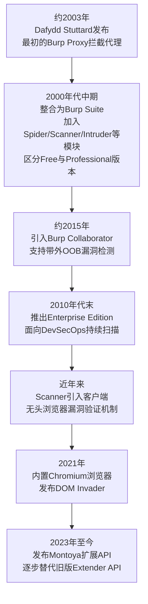
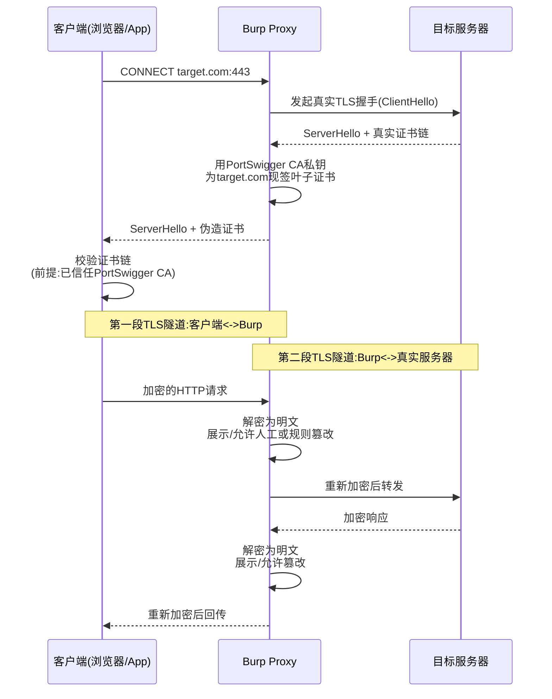
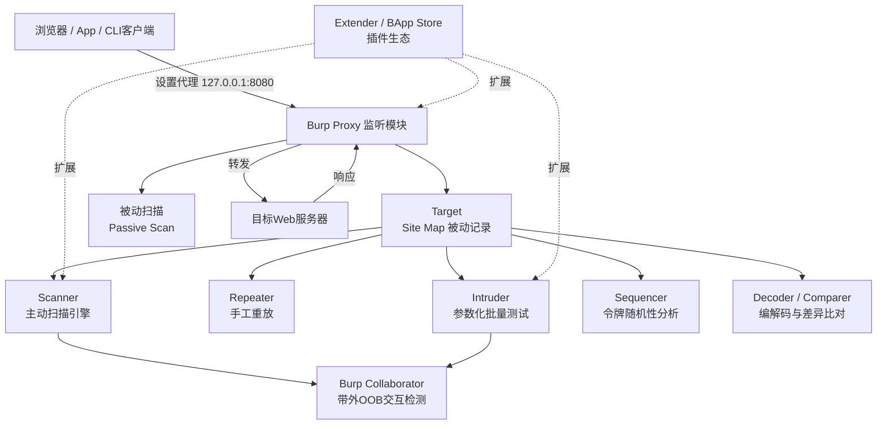
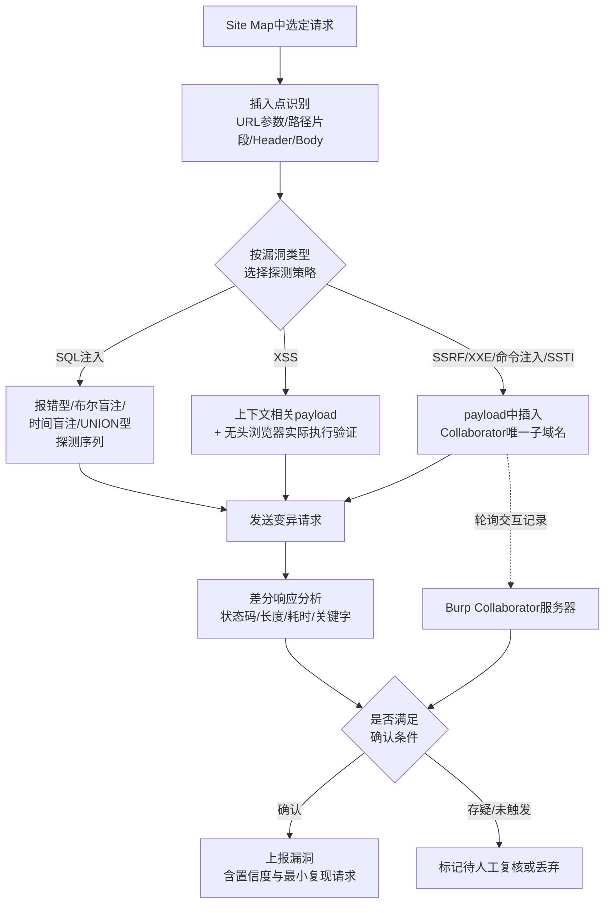

# Web与应用层安全（13）· Web漏洞工具链：BurpSuite

> [!abstract] TL;DR
> - Burp Suite的一切能力都建立在"拦截式代理"这一个原点之上：所有模块本质是复用同一条代理链路上截获的HTTP请求/响应，而不是彼此独立的工具堆砌。
> - 对HTTPS流量的可见性来自TLS中间人(MITM)：Burp自签CA + 逐域名动态签发叶子证书，形成"客户端-Burp"和"Burp-服务器"两段独立TLS隧道；HSTS与证书锁定是这套机制的天然边界。
> - 主动扫描不是简单的payload字典轰炸：插入点识别、语法感知的payload变异、差分响应分析、无头浏览器客户端验证、Collaborator带外(OOB)确认，共同构成一套多阶段降误报的检测流水线。
> - Intruder的Sniper/Battering ram/Pitchfork/Cluster bomb四种攻击类型对应四种不同的payload-插入点组合算法，选错类型会让爆破效率和覆盖面南辕北辙。
> - Burp本身不产生漏洞知识，它是把前12篇讲的每一类漏洞原理转化为可执行测试动作的操作平台；机器擅长的穷举统计与人擅长的语义判断分工协作，是它相对纯自动化扫描器的核心优势。
> - 工具本身也是攻击面与合规风险点：项目文件里明文留存的敏感流量、公有Collaborator的第三方可见性、非官方渠道破解版的供应链风险，都要求"正确使用"和"发现漏洞"同等重视。

## 概述与定位

Burp Suite是英国PortSwigger公司出品的一体化Web应用安全测试平台，最初由Dafydd Stuttard（网名与公司同名PortSwigger）在约2003年以一个单纯的HTTP拦截代理(Burp Proxy)起家，此后逐步扩展成今天涵盖代理、爬取、扫描、爆破、重放、令牌分析、插件生态在内的完整工具箱。经过二十余年演进，它已经事实上成为Web渗透测试与漏洞研究领域的"操作系统级"工具——不是说它取代了其他专项工具，而是说绝大多数测试者的一天工作是从打开Burp、把浏览器代理指向它开始的，其余专项工具（sqlmap、ffuf、ysoserial、Nuclei……）大多是作为Burp流程中的补充或下游环节存在。

理解Burp在本系列里的位置很重要：前12篇讲的是"漏洞本身"——SQL注入的语法层面原理、XSS的DOM执行模型、CSRF/SSRF的信任边界问题、认证会话的状态管理缺陷、越权的权限校验缺失、反序列化的对象重建风险、文件上传的内容校验绕过、API/GraphQL的接口层暴露面、JWT/OAuth/OIDC的令牌信任链问题，这些都是"世界上存在什么样的洞"的知识。而这一篇要回答的是另一个层面的问题："在一个真实或授权的目标上，用什么工具、以什么流程，把这些原理转化为可以观察、篡改、批量测试、并最终验证的具体动作"。这是从漏洞原理到实战能力之间必须跨过的一座桥，Burp就是这座桥上最常被踩的那块砖——也正因如此，本篇不再重复展开任何具体漏洞的成因，而是聚焦"怎么用工具发现它、验证它"。

Burp Suite有三条产品线，定位完全不同：Community Edition是免费版，具备核心代理、Repeater、Decoder、Comparer等手工分析能力，但没有主动扫描器、Intruder被限速到几乎不可用于真实测试，主要用于学习和轻量级手工分析；Professional是渗透测试者的标配付费版，解锁完整的Scanner、无限速Intruder、Collaborator客户端、工程保存等能力，按年订阅；Enterprise Edition则面向企业DevSecOps场景，提供基于角色的Web管理界面、可编排的定时扫描任务、与CI/CD流水线对接的能力，本质上是把Professional的扫描引擎包装成可以无人值守运行的服务化产品。三者共享同一套扫描/检测核心，区别主要在交互形态和运营场景。

横向看整个工具生态，Burp的直接竞品是OWASP ZAP——开源免费、社区驱动、功能定位与Burp高度重合（代理、被动/主动扫描、Fuzzer、脚本引擎），常被视为"没有预算时的Burp平替"，但在扫描算法的成熟度、误报控制、插件生态规模上，业界共识是Burp Pro仍处于领先位置。Fiddler、Charles这类工具虽然同样基于MITM代理原理，但定位偏向通用网络调试（前端开发者、API联调排障），缺乏面向攻防的扫描/爆破/漏洞验证能力。mitmproxy是Python生态里程序员友好的可编程MITM代理，适合写自动化脚本批量处理流量，但没有Burp那样开箱即用的图形化漏洞工作台。Postman/Insomnia本质是API调试和文档工具，不是安全测试工具。而sqlmap、Nuclei、ffuf这类命令行工具则是垂直领域的自动化利器，往往需要先用Burp观察清楚业务流程、拿到有效会话，再把目标URL/请求模板喂给它们做深度自动化，二者是互补而非替代关系——这种"通用交互平台 + 垂直自动化工具"的分工，也是理解整个Web安全工具链生态的一把钥匙。

Burp Suite用Java编写，天然跨平台，本质上是一个运行在测试者本机的守护进程：它监听一个本地端口，等待客户端把流量导进来，然后在这条流量链路上做尽可能多的事情——查看、篡改、记录、变异、重放、统计。理解这个"单一代理、多个视图"的核心心智模型，是后面所有模块原理的基础，也是它区别于"浏览器F12面板 + 一堆零散命令行工具"这种松散组合的根本所在。



## 原理与机制

Burp所有能力的原点是**拦截式代理(intercepting proxy)**。具体运作方式是：Burp在本机监听一个端口（默认`127.0.0.1:8080`），测试者把浏览器、移动设备、命令行工具（甚至另一个安全工具如sqlmap）的HTTP(S)代理设置指向这个地址。此后所有出站请求都先抵达Burp，再由Burp转发给真实的目标服务器；响应沿相反方向经过Burp再回传给客户端。这一原理本身并不新鲜，各类抓包代理都基于同样的机制，Burp的独特之处在于它把"截获的流量"当作一等公民数据对象，让所有后续分析、变异、重放模块都能直接复用而不需要重新抓包。

对纯HTTP流量，这个过程是天然透明的：请求和响应都是明文，Burp可以直接读取和修改字节流。但现代Web几乎全站HTTPS，加密之后代理默认是"看不见"内容的——这正是Burp必须做**TLS中间人（MITM）**的原因。具体分为几步：首先，Burp会生成一个自签名的根CA证书（俗称PortSwigger CA），测试者需要手动把这张CA证书安装进浏览器、操作系统或移动设备的受信任证书存储；其次，当客户端要访问某个HTTPS站点（比如通过`CONNECT`方法建立到`target.com:443`的隧道后发起TLS握手）时，Burp代表客户端与真实服务器完成一次完整的TLS握手，拿到目标站点真实的证书信息、协商好的密码套件；与此同时，Burp**即时动态签发**一张CN/SAN字段填的是`target.com`、但由PortSwigger CA私钥签名的"叶子证书"，把这张伪造证书发给客户端去完成第二段TLS握手。最终形成的拓扑是两条独立的TLS隧道——"客户端↔Burp"和"Burp↔真实服务器"，Burp在两条隧道的连接点上持有完整明文，可以任意查看和篡改后再重新加密转发。这个原理不是Burp独有，而是所有中间人抓包分析工具（Fiddler、Charles、mitmproxy等）的通用做法，区别只在证书管理和后续处理流水线的丰富程度。



这套机制天然有边界。第一，它要求客户端信任那张自签CA——如果目标是一台没有装Burp CA的设备（比如没有root权限、无法安装用户CA的移动设备，或者做了证书透明度/证书锁定校验的App），中间人就会在TLS握手阶段直接失败，浏览器会报证书不受信任的错误，App则可能直接拒绝连接或静默失败。第二，HSTS（HTTP Strict Transport Security）本身不针对证书链做额外强校验，但结合浏览器内置的证书透明度检查、以及越来越普及的App级证书锁定（Certificate Pinning，把服务端证书或公钥指纹硬编码在客户端里，握手时逐字节比对），会让"装了CA就能通吃"这个假设在移动端经常失效，这也是为什么移动端渗透测试经常需要额外配合Frida、Xposed等运行时插桩手段去绕过锁定逻辑——这已经超出Burp自身能力范围，是抓包实战方法论需要延伸的部分。第三，这套机制本质上依赖测试者对客户端有配置权限（能装CA、能改代理设置），这也直接决定了它只能用在自己控制或者被授权的测试环境里，这一点会在"安全性与正确使用"一段展开。

在代理这个原点之上，Burp把功能拆成了一组围绕"同一份HTTP请求/响应数据"运作的模块，理解它们之间的数据流转关系，比单独记忆每个模块的按钮功能更重要：

- **Proxy**：拦截开关(Intercept)控制是否暂停每一条流量等待人工编辑，实战中通常只对特定条件（如仅POST请求、仅包含某关键字的请求）开启拦截规则，否则每一次静态资源加载都要手工放行，效率会低到不可用；HTTP History则完整记录所有经过的流量，是后续几乎所有操作的取材来源。Proxy还提供Match and Replace规则引擎，可以基于正则表达式对经过的请求/响应做自动化改写，典型用法是自动附加自定义Header做灰度分流测试、或者自动去掉前端的某些客户端校验脚本。
- **Target/Site map**：被动地把观察到的所有请求整理成站点树状结构，附带参数清单、技术栈指纹等信息，这是后续Scope配置（划定哪些主机/路径允许被扫描和测试）的依据。
- **Scanner**：分被动扫描（只分析已有流量，不发新请求，可以放心跑在敏感环境）和主动扫描（主动发送变异payload，属于有一定破坏性/干扰性的操作）两种模式，详细算法在下一段展开。
- **Repeater**：把某个请求单拎出来反复手工编辑、发送、观察响应，是手工验证漏洞、构造利用链最核心的工作台，支持多标签页并行调试、请求历史回溯、直接在响应面板里渲染HTML方便XSS/CSRF类PoC的即时验证。
- **Intruder**：把请求里的若干位置标记为可替换点，配合payload集合做参数化批量测试，本质是一个通用的HTTP fuzzing引擎。
- **Sequencer**：对token类数据做随机性/可预测性的统计分析。
- **Decoder/Comparer**：分别是编解码换算工具和请求响应差异比对工具，属于辅助分析类。
- **Extender（及BApp Store）**：插件挂载点，可以在上述任意环节插入自定义逻辑。

这套架构背后的设计哲学是"一份数据、多个视图、共享上下文"：所有模块操作的是同一个项目里的同一份Site map、同一套Scope配置、同一组已建立的会话状态，而不是把浏览器抓包、命令行改包、手写脚本爆破这些各自独立的动作拼凑起来。这正是它相对于"F12 Network面板 + curl + 自己写Python脚本"这套组合拳的根本优势：上下文不会在工具切换之间丢失，一次测试会话里发现的问题可以随时回溯到最初的那次请求。



## 核心引擎与检测算法详解

这一段深入几个真正决定Burp"好不好用、准不准"的核心引擎内部机制。

### 主动扫描的多阶段判定流水线

主动扫描器不是简单地把payload字典怼进参数里看看响应变没变，而是一条有明确阶段划分的流水线。

第一步是**插入点识别**。Scanner会解析请求的URL查询参数、路径片段（现代框架大量使用RESTful路径参数）、请求体（表单编码、JSON、XML、multipart文件上传字段都有各自的解析器）、以及部分Header（Cookie值、User-Agent、Referer、X-Forwarded-For等常被后端逻辑读取的头），把每一处标记为潜在的测试点。这一步决定了扫描的覆盖面——如果后端从一个自定义Header或JSON嵌套字段里取值做SQL拼接，而插入点识别没有覆盖到，这处漏洞就会被完全漏掉，这也是为什么面对结构复杂的API（尤其是GraphQL这种把所有参数塞进一个POST body的JSON字段里的场景）经常需要配合专项插件或手工介入。

第二步是**payload生成与探测策略选择**，这一步是"语法感知"而非纯字典匹配的关键体现。以SQL注入检测为例，Scanner通常会先发送一些边界探测payload（比如单引号、反斜杠等特殊字符），观察后端是否报错、是否做了转义处理，据此判断走报错型、布尔盲注型、时间盲注型还是UNION型的后续深度探测；不同数据库方言（MySQL/MSSQL/Oracle/PostgreSQL）的时间延迟函数、报错关键字都不同，探测payload序列也随之切换。XSS检测则会先尝试一组带唯一标识的探测字符串，观察其在响应中的反射位置（HTML标签内、属性值内、JS字符串内、URL上下文），据此决定后续payload应该如何做上下文相关的编码/闭合处理才能真正触发执行。

第三步是**差分响应分析**：对baseline请求（原始未修改的请求）和每一个变异请求的响应做状态码、内容长度、关键字出现、响应耗时的对比，用统计学手段（比如对多次baseline请求的响应时间做基线采样，排除网络抖动噪音后再判断变异请求的时间差是否显著）过滤偶然因素。

第四步，也是2016年之后Burp Scanner相对早期版本、也相对多数同类扫描器的关键差异化能力：**客户端漏洞验证**。对XSS这类"payload必须真的在浏览器里执行了JS才算数"的漏洞类型，仅凭"响应里原样出现了`<script>`标签"去判定存在漏洞，会产生大量误报（很多情况下前端框架会对输出做转义，或者payload出现的上下文根本不会被解析执行）。Burp内嵌了一个基于Chromium的无头浏览器实例，会把疑似触发点的响应实际渲染出来，并监听是否真的执行了注入的探测代码，只有观测到确实执行才会上报为确认漏洞，否则降级为"可能"或直接不报。这套机制大幅拉低了传统"纯特征匹配"扫描器广受诟病的高误报率，也是很多团队愿意为Professional版付费的核心原因之一。

第五步是**带外(OOB)检测**，用于处理前四步完全无能为力的一类漏洞——盲打场景。像blind SSRF、外部实体未回显的XXE、盲命令注入、部分SSTI，服务端处理payload后不会在HTTP响应里留下任何可观察的差异（不报错、内容不变、耗时也可能没有显著差异），这时候唯一能确认漏洞存在的方法是让目标服务器主动发起一次能被测试者观测到的外部网络交互，这正是下一小节Collaborator要解决的问题。



### Burp Collaborator：带外交互检测的基础设施

Collaborator本质上是PortSwigger在公网托管（企业客户也可以私有化部署Collaborator Server）的一台多协议服务器，同时监听DNS查询、HTTP(S)请求和SMTP连接。每次需要做OOB探测时，Burp客户端会为这次测试生成一个随机且全局唯一的子域名（形如`<随机串>.oastify.com`），把这个域名嵌入到payload中一切可能触发外部网络交互的位置——SSRF场景里作为被请求的URL主机名、XXE场景里作为外部实体声明的URL、命令注入场景里拼进`nslookup`/`curl`一类的命令参数、SSTI场景里作为模板引擎执行的HTTP请求目标。例如一次针对疑似SSRF参数的探测请求可能长这样：

```
POST /api/fetch-preview HTTP/1.1
Host: target.example
Content-Type: application/json

{"url": "http://a1b2c3d4e5f6.oastify.com/probe"}
```

之后Burp客户端会定期轮询Collaborator服务器，查询有没有收到与这个唯一标识相关的交互记录。一旦收到（哪怕只是一次DNS解析请求），就能确凿证明"目标服务器在处理我构造的输入时，确实执行了这段代码/确实发起了这次网络访问"，这是一种比"猜测响应时间差是否显著"可靠得多的确认手段——时间盲注类的判断本质上是概率性的，网络抖动、服务端负载都可能造成假阳性或假阴性，而OOB交互只要收到一次记录就是确定性的证据。

这个机制也带来一个不能忽视的实际问题：默认走公有Collaborator，意味着"目标服务器对某个随机子域名发起了一次DNS查询"这条信息会经过PortSwigger的第三方基础设施，对数据合规要求高（金融、政务、涉密行业）的测试场景，这可能构成不可接受的数据出境/第三方可见性风险，这也是为什么Enterprise客户经常选择私有部署Collaborator Server，把整条OOB确认链路收敛在自己的网络边界内。

### Intruder：payload与插入点的组合算法

Intruder是一个通用的参数化HTTP请求批量发送引擎，核心概念是先在请求里标记若干"插入点"（Burp用一对`§`符号包裹要替换的字段），再配置一组或多组payload，由攻击类型(Attack type)决定payload和插入点如何组合。一个标记好插入点的登录请求大致是这样：

```
POST /login HTTP/1.1
Host: target.example
Content-Type: application/x-www-form-urlencoded

username=§admin§&password=§123456§
```

四种攻击类型对应四种完全不同的组合算法：

- **Sniper**：只用一组payload，每次只替换一个插入点、其余位置保持原始值，逐个插入点轮转，总请求数等于"插入点数 × payload数"。适合逐参数做模糊测试，是最常用、开销也相对最小的模式。
- **Battering ram**：只用一组payload，但每次把同一个payload值**同时**填进所有插入点。适合"同一个值需要在多处保持一致"的场景，比如某个用户名同时出现在URL路径和请求体里，必须两处联动替换才有意义。
- **Pitchfork**：允许多组payload，每组各自对应一个插入点，按相同的索引位置并行推进，总请求数等于"最短那一组payload的长度"。适合已知几个参数之间存在一一对应关系的场景，比如"用户名字典"和"该用户名对应的已知密码"这种成对数据的撞库测试。
- **Cluster bomb**：允许多组payload，各组之间做笛卡尔积穷举所有组合，总请求数等于"各组长度的乘积"。适合完全不知道参数间对应关系、需要穷举覆盖的经典场景，比如传统的用户名字典×密码字典暴力破解。

选错攻击类型会直接导致测试要么覆盖不全、要么产生大量无意义的请求量——这不是一个可以随便选的选项，而是需要根据具体测试目标的参数关系提前想清楚的策略问题。除了攻击类型，Intruder的另一半价值在于结果过滤：Grep-Match/Grep-Extract允许从成千上万条响应里按关键字自动标记或提取感兴趣的内容（比如爆破成功的那条往往响应长度、状态码、特定关键字都和大批失败请求不同，肉眼在几千行结果里很难发现，但配置好Grep规则后一目了然）；并发线程数和请求间隔（含随机抖动）的控制则直接关系到测试是否会触发目标的速率限制或WAF行为检测，这也是Turbo Intruder这类第三方扩展存在的意义——原生Intruder线程模型在需要极高并发（比如竞态条件测试要求在毫秒级窗口内打出成百请求）时性能不够，Turbo Intruder用更底层的网络栈实现重写了发送引擎。

### Sequencer：令牌随机性的统计学评估

Session token、CSRF token、密码重置token、验证码这类"安全性完全取决于不可预测性"的数据，仅凭肉眼看起来"像是随机的"是不够的，Sequencer提供的是量化评估。测试者提供一批样本（可以是实时抓取到的连续多次生成的token，也可以离线导入已收集的样本），Sequencer会做两个维度的分析：字符级分析（每个字符位置上出现的取值是否近似均匀分布，比如某个位置总是固定几个字符，说明这个位置携带的随机性远低于表面长度暗示的水平）和位级分析（把token序列当作比特流，跑一系列源自FIPS 140-2/NIST SP 800-22随机数检验标准的统计检验，包括单比特频率测试、块内频率测试、游程测试Runs Test等），最终综合给出一个以bit为单位的"有效熵"估计。这个数值直观地回答了"攻击者要猜中/爆破出一个有效token，理论上需要覆盖多大的搜索空间"，本质上和密码学里评估伪随机数生成器(PRNG)质量的方法论是同一套思路，只是应用对象从底层密钥生成换成了应用层的会话令牌。一个看起来"一堆乱七八糟字符"的token，如果底层实现只是简单的时间戳加自增序号做了某种编码，Sequencer的位级测试通常能把这种伪随机暴露出来。

### 辅助工具与扩展体系

Decoder提供可链式叠加的编解码转换（URL编码、HTML实体、Base64、十六进制、八进制、二进制、GZIP等可以自由组合），并提供"Smart Decode"尝试自动识别多层编码逐层脱壳，在处理层层包裹过的payload或者混淆过的响应内容时非常实用。Comparer做逐词或逐字节级别的diff，典型用途是把"低权限账号"和"高权限账号"分别发起同一个请求得到的两份响应拿来比对，或者把payload变异前后的响应拿来比对，本质上是用类似经典diff算法（最长公共子序列思路）把肉眼难以发现的细微差异可视化出来，这个能力在越权测试里尤其关键。

插件体系上，早期Burp Extender API是纯Java接口（如`IBurpExtender`），同时内嵌了Jython和JRuby运行时，使得社区可以用Python 2或Ruby编写插件，这也是历史上BApp Store里大量插件用Python写成的原因；2023年PortSwigger发布了新一代Montoya API，是完全重新设计的纯Java接口，提供更细粒度的HTTP处理钩子、更好的类型安全和运行性能，官方推荐新插件开发迁移到这套API上，但出于对存量插件生态的兼容考虑，旧Extender API仍会长期并存——这是软件工具演进中"新旧API长期共存过渡"的典型例子。

Session Handling Rules（配合录制的"宏"Macro）解决的是自动化测试绕不开的一个工程难题：Scanner和Intruder要发出成百上千个请求，但大多数应用的会话/CSRF token会过期或者一次性使用，一旦失效，后续所有测试请求都会因为"未登录"或"token校验失败"而全部作废，测试结果毫无意义。做法是先手工录制一段"宏"——比如完整的登录请求序列，或者一个获取最新CSRF token的GET请求——然后配置规则："当发给Scanner/Intruder的请求收到401、被重定向到登录页等特征时，先自动执行一遍这段宏，从宏的响应里提取新的Cookie/token，再用提取到的最新凭据重发原始请求"。这个机制本质上是让全自动化流程能够跨越"会话状态会过期"这一天然障碍，是Burp能够真正做到"大批量无人值守测试"而不只是"手工点几下"的关键基础设施之一。

## 工具视角与实战

一次典型的授权渗透测试/漏洞挖掘工作流，大致沿着这样的路径展开：先在Target > Scope里明确划定被测资产的主机和路径范围（这一步既是效率考虑——避免扫描器把时间浪费在无关的第三方域名或CDN资源上，也是合规考虑——避免代理不小心把授权范围外的流量也一并主动扫描了，这一点在"安全性与正确使用"里会进一步展开）；然后把浏览器代理指向Burp，正常地手工点击、注册、登录、走完业务主流程，让Site map被动地把站点结构、参数清单积累起来，被动扫描顺带识别出安全响应头缺失、Cookie属性不当等低垂果实；接下来对Scope内、尤其是处理用户输入的高价值端点（登录、支付、搜索、文件上传、任何带ID参数的详情接口）用Repeater做手工深挖，对参数密集、组合空间大的接口开主动扫描或者手工上Intruder批量测试；对涉及会话状态的token跑一遍Sequencer；每发现一个问题就在Repeater里固化出一个最小化的复现请求，作为报告和验证的依据。

把这套流程和前12篇讲过的具体漏洞类型对应起来，能更直观地看到Burp各模块的用武之地——这里的重点是"怎么用工具去发现和验证"，具体的漏洞成因不再重复：

**注入类漏洞**（对应第04篇）：Scanner的主动扫描能自动识别大部分插入点并跑完报错/布尔/时间/UNION型的探测序列，覆盖面广但对业务语义复杂的场景（比如受限字符集下的二次注入、需要先满足前置业务状态才能触发的注入点）容易漏判，这时候需要退回Repeater手工构造并肉眼观察报错信息或计时差异；对模板注入(SSTI)，可以先用Intruder把各主流模板引擎的探测payload（数学表达式类的`${7*7}`、`{{7*7}}`等）批量跑一轮，根据哪个引擎的探测特征被触发来缩小范围，再针对性地手工深入利用。

**XSS**（对应第05篇）：Repeater里改参数、观察payload是否原样反射到响应的哪个上下文，是最基础的手工验证方式；DOM Invader（Burp内置Chromium浏览器上的扩展能力）能自动化追踪DOM型XSS的Source到Sink传播链路，也能检测postMessage处理不当、DOM Clobbering、原型污染这类需要在真实DOM执行环境里才能观察到的问题；Scanner的客户端无头浏览器验证机制则大幅降低了存储型/反射型XSS的误报。

**CSRF与SSRF**（对应第06篇）：Burp对选中的请求提供一键"Generate CSRF PoC"功能，自动生成一个会自动提交对应请求的HTML表单，直接拿这个PoC去验证目标应用是否真的缺少CSRF防护；SSRF场景（尤其是响应里完全看不出回显的盲打SSRF）的标准打法是把疑似发起服务端请求的参数替换成Collaborator分配的唯一域名，靠OOB交互记录做确定性确认，这是纯靠观察响应内容完全做不到的。

**认证与会话安全**（对应第07篇）：Sequencer用于评估session id、密码重置token的可预测性；Intruder的Pitchfork/Cluster bomb模式配合Session Handling Rule可以做密码喷洒(password spraying)或撞库测试，同时自动处理登录后的跳转与token刷新。

**访问控制与越权**（对应第08篇）：最经典的打法是用两个不同权限级别的账号各走一遍相同操作流程分别抓包，然后在Comparer里逐字节diff两份响应；这个手工比对过程可以用社区插件Autorize自动化——插件会自动记录高权限用户发出的每一个请求，并用测试者指定的低权限身份逐一重放，自动标红"本应该被拒绝、却仍然返回了200和正常数据"的越权点，把原本需要人工逐条核对的重复劳动变成持续性的自动化监控。

**反序列化漏洞**（对应第09篇）：Burp本身不负责生成反序列化利用链（这是ysoserial一类专用工具的领域），但作为传输层配合使用——把外部工具生成的序列化payload通过Repeater发送、通过Intruder做批量的gadget链探测，并结合Collaborator的OOB交互判断"看起来毫无响应差异"的反序列化调用是否真的被服务端执行了。

**文件上传与路径穿越**（对应第10篇）：Repeater可以直接改请求里的`Content-Type`、文件扩展名、文件内容开头的魔术字节，测试前后端各层校验能否被绕过（比如把带可执行代码的文件伪装成图片类型的`Content-Type`但保留可执行的文件头）；Intruder可以批量跑路径穿越的各种编码变体字典（`../../`、`%2e%2e%2f`、双重URL编码、混合编码等），系统性地探测过滤规则的覆盖盲区。

**API与GraphQL安全**（对应第11篇）：InQL一类插件能自动对GraphQL端点做内省(introspection)查询、把完整schema可视化、批量构造query/mutation去测试字段级越权；对传统REST API，Burp能直接导入OpenAPI规范或Postman Collection一次性生成完整Site map，批量对每个端点做对象级越权(BOLA)测试。

**JWT/OAuth/OIDC**（对应第12篇）：JWT Editor一类插件提供JWT三段式结构（`header.payload.signature`）的可视化解析和篡改能力，可以一键切换`alg=none`攻击、生成测试用的RSA/HMAC密钥对做算法混淆测试；OAuth/OIDC测试中，Proxy拦截授权码回调和`redirect_uri`跳转环节是必经步骤，用于验证`state`参数校验、`redirect_uri`白名单匹配规则是否存在可绕过的宽松匹配逻辑。

除了内置能力，BApp Store（Burp官方插件商店）里数百个社区插件是实战效率的重要放大器，几个高价值的例子：**Autorize**（前面提到的越权自动化检测）、**Turbo Intruder**（基于Python脚本定义请求逻辑、用更底层网络实现重写发送引擎，性能远超原生Intruder，尤其适合竞态条件Race Condition这类需要极短时间窗口内打出大量并发请求的场景）、**Param Miner**（自动爆破发现应用实际会读取但文档里没写的隐藏参数和Header，对HTTP缓存投毒、缓存欺骗类问题的挖掘尤其重要）、**Logger++**（增强型请求日志，支持复杂条件过滤和结构化导出）、**JS Link Finder / GAP**（从前端JS打包文件里正则提取隐藏的API端点和路径）、**Backslash Powered Scanner**（不依赖特征库、而是从语法层面判断输入是否被目标当作代码/表达式解析，理论上能发现常规特征扫描器漏掉的注入变体）。

Burp也并非孤立工作：sqlmap可以通过`--proxy=http://127.0.0.1:8080`把自己的探测流量导入Burp，方便实时观察和复用已经建立好的会话状态；其他扫描器（如Nuclei）批量跑出来的疑似发现，通常会导回Burp做Repeater级别的手工复核确认；Burp（尤其是新版Professional和Enterprise）提供REST API，可以纳入CI/CD流水线，配合Jenkins/GitLab CI在每次构建后跑一轮基线安全扫描，这也是PortSwigger推出轻量级CLI版DAST工具Dastardly的动机——把原本面向人工操作的GUI工具能力，逐步下沉成可以嵌入DevSecOps流水线的自动化组件，这是行业内渗透测试工具演进的一个明显趋势。移动端和桌面客户端（尤其是基于Electron/WebView的应用）的抓包分析，本质上复用的还是同一套代理+TLS中间人方法论，只是需要把设备网络代理指向Burp监听地址、并处理好证书信任问题，具体的抓包排障细节可以参照抓包与协议分析实战部分的中间人分析方法论。值得一提的是Burp对WebSocket的支持——现代Web应用大量使用WebSocket做实时通信，Proxy可以拦截、Repeater的WebSocket消息编辑面板可以重放单条消息，这部分的攻击面（比如WebSocket握手阶段的身份校验缺失、消息内容缺少和HTTP同等强度的校验）经常被只关注传统请求/响应模型的测试者忽略。

## 安全性与正确使用

> [!caution]
> Burp Suite的拦截、篡改、批量爆破能力，只应在**自己拥有所有权的系统**、**已获得书面授权的渗透测试目标**，以及CTF/靶场等专门设计的练习环境中使用。本节介绍的一切原理均为防御与安全研究视角：帮助读者理解工具能力边界、正确评估风险、审查自身系统是否存在同类问题。本文不提供、也不应被用于对不在授权范围内的真实生产系统或他人系统发起测试的具体操作步骤，更不为绕过任何商业软件的授权机制提供帮助。

正确使用Burp，首先要认识到工具自身也会成为风险载体。Burp的项目文件（`.burp`工程文件，或旧版的state文件）会完整保留测试过程中经过的所有请求和响应，如果测试流程覆盖了包含真实用户凭据、身份证号、银行卡信息等敏感数据的业务流程，这份项目文件本身就变成了一份高度敏感的数据资产——它不是"工具生成的中间产物可以随便丢"，而是需要加密存储、限制访问权限、并按照约定的数据保留策略在测试结束后及时销毁的真实资产，这一点经常被测试者忽视，却是渗透测试工程管理里非常现实的合规要求。

其次是Collaborator带来的第三方可见性问题。默认使用PortSwigger公有Collaborator服务意味着"目标服务器对某个特定域名发起了DNS查询/HTTP请求"这条信息，会经过PortSwigger运营的第三方基础设施中转，对金融、政务、涉密等数据合规要求严格的场景，这可能构成不可接受的风险敞口，正确的做法是评估是否需要切换到私有部署的Collaborator Server，把整条OOB确认链路收敛在自己可控的网络边界内。

第三是工具本身的供应链完整性问题。网络上流传的所谓"破解版"Burp Suite Professional，历史上多次被发现植入后门或数据回传模块——渗透测试者手里往往握有客户的高价值凭据、内网拓扑信息、未公开漏洞细节，本身就是极具吸引力的攻击目标，使用来路不明的破解版工具，相当于主动把这些敏感数据的处理环节交给了一个不受信的第三方代码，这在风险量级上和"直接在目标系统种后门"没有本质区别。正确做法是通过官方渠道获取授权，机构用户应优先考虑企业采购和许可管理，个人学习可以使用功能受限但完全干净的Community版本。

第四，主动扫描和Intruder的高并发请求，本质上是一种可控但确实存在的准DoS流量。对资源有限、没有做好压测准备的目标系统（尤其是测试环境本身配置就弱于生产），无节制的并发扫描可能造成服务响应显著变慢甚至直接宕机，这不是"漏洞发现"的合理代价，而是需要通过Burp的Resource Pool机制显式限制并发数和请求速率来规避的操作风险。规范的测试项目应当在开始前就和目标方明确约定Rules of Engagement——允许的测试时间窗口、速率上限、出现异常时的紧急联系人和叫停机制，这是流程规范，不是可选项。

最后，不能对自动化结果照单全收。尽管客户端漏洞验证等机制已经把Scanner的误报率拉低了很多，但业务逻辑类、需要多步骤组合才能触发的漏洞（比如需要先完成A操作改变系统状态、再用特定顺序触发B操作才会越权），机器目前依然很难可靠识别，这类问题永远需要有经验的测试者结合业务语境去手工挖掘；反过来，自动化报出的高危发现也需要人工复核确认后才能写进报告——机器擅长的是穷举和统计，人擅长的是语义判断，这种分工不是Burp的短板，而是它从一开始就被设计成"人机协作平台"而不是"一键出报告的黑盒"的必然结果。

## 小结

Burp Suite的核心并不是某一个具体功能点，而是"拦截式代理"这一个原点向外辐射出的一整套围绕同一份流量数据运作的分析工具集：TLS中间人机制让加密流量变得可观测可篡改，Scanner的多阶段流水线（插入点识别、语法感知payload、差分响应分析、客户端验证、Collaborator带外确认）把"发现漏洞"从单纯的字典轰炸升级为有层次的确认体系，Intruder/Sequencer/Repeater/Comparer则分别提供了批量测试、随机性评估、手工深挖、差异比对这几种互补的分析视角，Extender/BApp Store让第三方能力可以无缝接入这条流水线。放在整个系列的脉络里看，前12篇建立的是"识洞"的知识体系，这一篇提供的是把这些知识转化为可执行动作的工具方法论——理解SQL注入的语法原理和真正在一个授权目标上用Burp把它挖出来、验证出来、构造出最小复现PoC，是两件同样重要但完全不同的能力，前者是理论基础，后者是工程实践，Burp就是连接这两者最常用的那座桥。与此同时，工具的强大伴随着相应的责任：授权边界、数据保管、供应链完整性、对目标系统的影响控制，这些"正确使用"层面的考量，和"如何发现漏洞"本身同等重要，是本篇希望反复强调的另一条主线。

## 相关阅读

- [[71.详解网络协议/18.HTTP-HTTPS协议]]——理解Burp解析、篡改的HTTP报文结构与HTTPS握手细节的协议基础
- [[71.详解网络协议/15.TLS协议]]——Burp实现TLS中间人所依赖的握手流程、证书链校验机制的完整原理
- [[72.抓包与协议分析实战/04.HTTP与HTTPS抓包与中间人分析]]——中间人抓包的通用方法论，可与本篇的Burp专属实现细节互相印证
- [[30.Windows认证与生物识别编程/08.WebAuthn与FIDO2与passkey编程]]——现代无密码认证机制，是Sequencer类token爆破/会话劫持打法逐渐失效后的演进方向
- [[37.密码学/62.协议误用与密码工程]]——Sequencer随机性评估背后的密码学统计检验方法论的延伸阅读
- 官方文档：PortSwigger Web Security Academy 与 Burp Suite官方文档，是理解各模块最新特性与检测项覆盖范围的第一手资料
- 书目：《The Web Application Hacker's Handbook》（Dafydd Stuttard等著）——Burp Suite作者本人撰写的Web渗透测试经典教材，与本工具的设计理念一脉相承
- 同系列关联章节：[[00.Web与应用层安全总览]]、[[04.注入类漏洞：SQL与命令与模板]]、[[08.访问控制与越权]]、[[12.JWT与OAuth与OIDC安全]]

[[00.Web与应用层安全总览|⬆ 系列总览]] | [[12.JWT与OAuth与OIDC安全|← 上一章]] | [[14.SSL与TLS配置与攻击|→ 下一章]]
