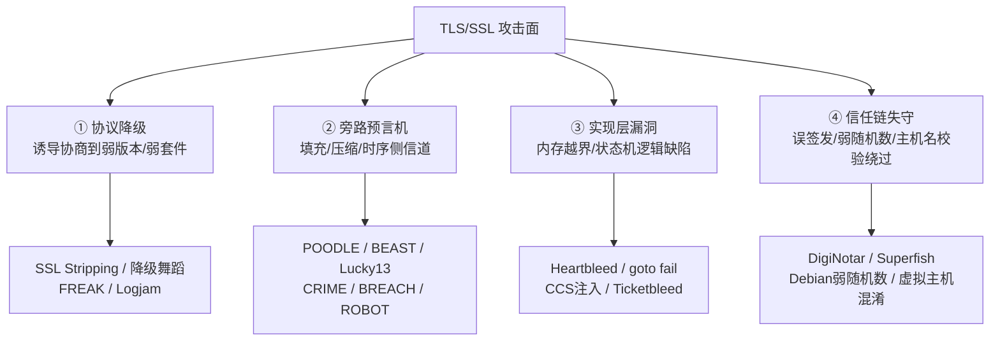
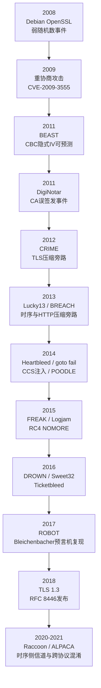
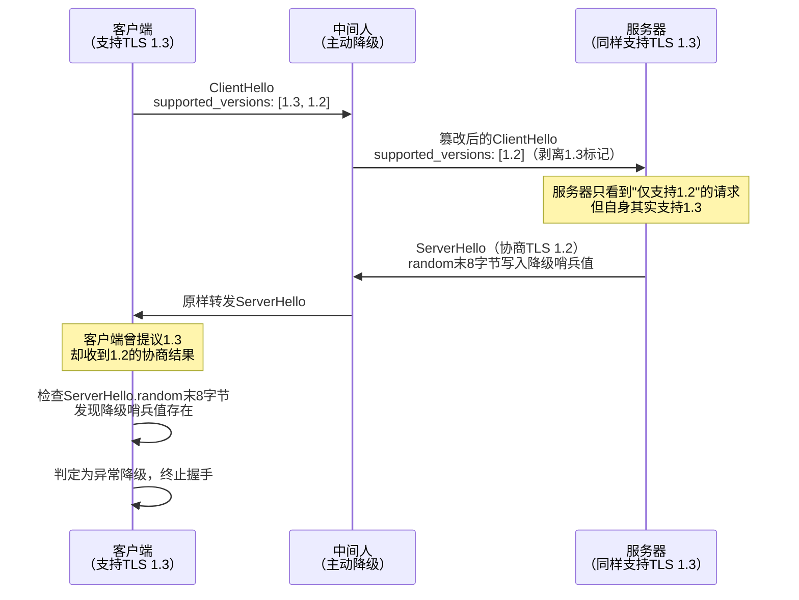
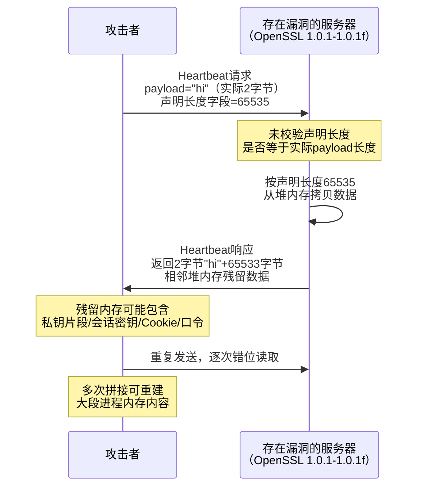
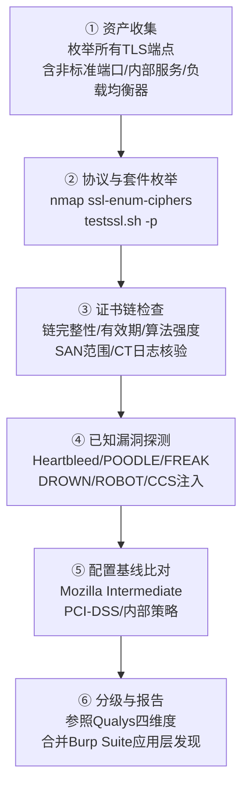

# Web与应用层安全（14）· SSL与TLS配置与攻击

> [!abstract] TL;DR
> - TLS/SSL 攻击可归为四类：**协议降级**（诱导协商到弱版本/弱套件）、**旁路预言机**（填充/压缩/时序侧信道逐字节还原明文）、**实现层内存与逻辑漏洞**（Heartbleed、goto fail 等）、**证书信任链失守**（误签发、弱随机数、共享私钥、主机名校验绕过）。
> - 降级之所以结构性可行，根源在于版本与密码套件协商发生在**任何身份认证建立之前**——TLS 1.3 用 ServerHello.random 末 8 字节的哨兵值堵死了这个协商期窗口，但存量系统里 SSLv3/TLS1.0/RSA 密钥交换/弱 DH 依然是长期隐患。
> - POODLE、BEAST、Lucky13、CRIME、BREACH、ROBOT 本质都是同一种"预言机"套路的变体：攻击者反复发送可控请求，借助错误信息、响应长度或时间差这一比特一比特地还原密文背后的秘密，AEAD 从构造上直接掐断了这条路。
> - 配置基线不是"越新越好"的单一答案，而是 Mozilla Modern / Intermediate / Old 三档在**兼容性与安全性**之间的权衡；HSTS、OCSP Stapling、CAA、证书透明度是纵深防御的四件套，缺一不可。
> - testssl.sh / SSLyze / nmap NSE / Qualys SSL Labs 是审计 TLS 配置的标准工具链，与 Burp Suite（第13章）分工互补：前者审计传输层，后者审计应用层，报告应合并输出。
> - 证书信任链的历史事故（DigiNotar 误签发、Superfish 共享私钥、Debian OpenSSL 弱随机数）提醒我们：TLS 的安全边界不只在密码学正确性，更在工程实现与治理流程。

## 概述与定位

前 13 章讨论的所有内容——HTTP 头安全、CORS/CSP、注入、XSS、CSRF/SSRF、认证会话、访问控制、反序列化、文件上传、API 安全、JWT/OAuth，乃至用 Burp Suite 做的每一次拦截与重放——都建立在一个几乎从不被明说的前提之上：**客户端与服务器之间的信道是机密、完整且身份可信的**。这个前提由 TLS（历史上也称 SSL）提供。Burp Suite 作为 MITM 代理工作时，本身就要终止一次 TLS 再重新发起一次 TLS（见 [[13.Web漏洞工具链：BurpSuite]] 与 [[72.抓包与协议分析实战/04.HTTP与HTTPS抓包与中间人分析]]），但那次操作默认"目标服务器的 TLS 是可信的"，测试者关心的是应用逻辑。本章要做的，是把这个默认前提本身当作攻击面来审视：**当 TLS 层被降级、被旁路、被实现缺陷击穿、或信任链本身出了问题时，上面 13 章建立的所有安全假设会以什么方式坍塌**。这也是本系列收官章的定位——不是再讲一种新的应用层漏洞类型，而是回过头审视应用层安全赖以立足的地基。

需要先划清与本库另外两篇姊妹文章的分工，避免重复造轮子：**协议机制**（记录层结构、握手逐消息推导、PRF/HKDF 密钥派生、会话恢复、PKI 与 CT/OCSP 细节）已经在 [[71.详解网络协议/15.TLS协议]] 中做了完整推导，本篇不再重复，只在需要支撑攻击原理时做最小引用；**密码工程实践**（CSPRNG、密钥全生命周期管理、libsodium/Tink 选型、密码敏捷性）已经在 [[37.密码学/62.协议误用与密码工程]] 中系统总结，本篇聚焦的是**Web 安全测试者/攻击者视角**——即在一次授权渗透测试或红队评估中，如何识别、验证、并正确解读 TLS 层的弱点，以及作为防御方应该落地的配置基线。术语上，行业里"SSL"和"TLS"仍在口语和工具命名（`openssl`、SSLyze、SSL Labs、`sslscan`）中混用，但自 SSLv3 于 2015 年被 RFC 7568 正式弃用后，现网真正在跑的协议只剩 TLS 1.0–1.3，本文沿用行业习惯统称"SSL/TLS"，具体版本会明确标注。

TLS/SSL 的攻击面可以归纳为四大类，彼此根因不同、防御手段也不同：



这四类攻击的完整时间线跨越了十余年，也大致对应了 TLS 生态从"能用就行"到"默认安全"演进的历史：



可以看到 2014 年是分水岭：Heartbleed、goto fail、POODLE、CCS 注入密集爆发，直接推动了 TLS 1.3 的激进重设计（砍掉压缩、砍掉 RSA 密钥交换、砍掉 CBC、强制 AEAD、强制前向保密）。理解这条时间线，本质上就是理解 TLS 1.3 每一条"看似激进"的设计决策背后对应的历史教训。

## 原理与机制

### 降级为何在结构上可行：协商发生在认证之前

TLS 握手存在一个无法回避的"先有鸡还是先有蛋"问题：客户端和服务器必须先就协议版本、密码套件达成一致，才能建立起后续消息完整性保护所需的密钥；但协商过程本身，在密钥建立之前，是**没有完整性保护**的明文交换（ClientHello/ServerHello 本身不可能用尚未协商出的密钥来保护）。这意味着一个具备中间人位置的攻击者原则上可以在协商阶段篡改双方交换的能力列表——把 ClientHello 里的 `TLS 1.3` 悄悄抹掉、把密码套件列表替换成只剩弱套件，双方看起来"协商一致"，实际上是被攻击者摆布的结果。

TLS 1.2 及更早版本仅依靠握手末尾的 `Finished` 消息（对全部握手消息的摘要）做事后校验，但如果攻击者从一开始就同时篡改了双方看到的版本，两边算出的摘要"自洽"，`Finished` 校验反而会通过——协议本身没有机制让客户端知道"服务器其实支持更高版本，只是被人拦截了"。

TLS 1.3 引入了一个精巧但廉价的对策：**降级哨兵值（Downgrade Sentinel）**。当一个支持 TLS 1.3 的服务器因协商结果落到 TLS 1.2 或更低版本时，无论原因是什么，它都必须在 `ServerHello.random` 的**最后 8 个字节**写入固定的特殊值（针对从 1.3 降级填一组值，针对从 1.2 降级到更低再填另一组值）。客户端如果自己在 ClientHello 中声明过支持 TLS 1.3，收到降级后的 ServerHello 时会检查这 8 个字节；一旦发现哨兵值存在却协商结果却是低版本，就意味着"服务器明明支持 1.3，却达成了低版本协商"——这只可能是攻击者篡改所致（或极罕见的实现错误），客户端直接以致命告警中止连接。



这个机制的巧妙之处在于**不需要额外的往返**——哨兵值就"顺路"编码在本来就要发送的随机数字段里，不增加握手开销，却把"协商期无完整性保护"这个结构性漏洞在客户端侧堵上了。但它只保护"支持 1.3 的两端"这一组合；如果服务器本身就只支持 TLS 1.2 甚至更低（大量存量系统的真实情况），哨兵机制无从谈起，降级依然是真实存在的风险，这也是本篇后面要讲的一系列具名攻击的立足点。

### 预言机攻击的通用范式

CRIME、BREACH、POODLE、Lucky13、ROBOT 表面上分属不同层次（压缩、填充、时序），但拆开看是同一种攻击范式的四次变奏：**攻击者控制或部分控制明文的一部分，被测系统对"猜测是否命中"给出了某种可观测的差异信号（响应长度、错误类型、处理时间），攻击者据此把一个理论上不可行的暴力搜索，退化成可行的逐字节自适应搜索**。这类"可观测差异信号"在密码学里统称为**预言机（Oracle）**——攻击者向系统提问"这个猜测对不对"，系统即使不直接回答，也会通过某个旁路无意间泄露答案。

预言机攻击得以成立，需要三个条件同时满足：① 攻击者能够诱导受害者（或系统本身）反复发送大量结构相似、仅有少量比特不同的请求（Web 场景下常见手法是诱导受害者浏览器加载恶意页面，用 JavaScript 静默发起海量跨域请求）；② 系统对每次请求的处理会产生一个可被攻击者观测到的旁路信号，且该信号与"猜测是否正确"存在统计相关性；③ 该信号的可观测粒度（长度、耗时、错误码）足够细，能在合理次数的查询内把搜索空间收窄到可穷举的程度。AEAD 密码套件（TLS 1.3 强制）之所以能一次性终结这一整类攻击，是因为它把"完整性校验"和"解密"合并成一次原子操作，任何篡改都在早期以**统一、常量时间**的方式失败，不再有"填充对不对""压缩后多长"这类中间态可供窥探。

### 信任链的最弱环模型

X.509 证书信任链的安全性遵循"木桶效应"：客户端信任的根 CA 有上百个，只要其中**任意一个**被攻破、被诱导误签发、或自身实现有缺陷，攻击者就能为**任意域名**签出一张在所有依赖该信任库的客户端上都畅通无阻的"合法"证书——防御强度取决于信任链中最弱的那一环，而不是网站自己配置得多严谨。这与协议降级、预言机攻击的性质完全不同：后两者攻击的是"这一次连接"，信任链攻击攻击的是"信任模型本身"，一旦得手影响面是全局性的（第三节 j 小节会展开具体历史事故）。

## 攻击手法详解：降级、填充预言机与实现漏洞

### SSL Stripping 与降级舞蹈

**SSL Stripping**（Moxie Marlinspike，2009 年 Black Hat 演讲提出的 `sslstrip` 工具）攻击的不是 TLS 协议本身，而是"用户如何进入 HTTPS"这个前置环节。用户在地址栏输入裸域名（不带 `https://`）或点击一个 `http://` 链接时，浏览器会先发出一次明文 HTTP 请求，正常情况下服务器用 `301/302` 跳转到 HTTPS。中间人只需拦截这第一次明文请求，自己与真实服务器建立正常的 HTTPS 连接取得内容，再把内容中所有 `https://` 链接和跳转目标改写成 `http://` 后原样转发给受害者——受害者的浏览器**从头到尾都没有发起过一次真正的 TLS 握手**，也就没有任何证书告警可供警觉，这正是它比"伪造证书骗过用户点确认"更隐蔽、更早期就极为有效的原因。

**HSTS**（见 [[71.详解网络协议/15.TLS协议]] 第 10.1 节机制说明）是主要克星：一旦浏览器缓存过某域名的 `Strict-Transport-Security` 记录，此后哪怕用户手输 `http://`，浏览器也会在网络层之前就自行改写为 `https://`，SSL Stripping 无从下手。但 HSTS 存在一个"先信任窗口"（Trust On First Use）缺口——如果受害者从未访问过该站点、本地没有缓存记录，第一次请求仍会走明文，仍可被剥离。**HSTS Preload List** 正是为填补这个缺口而生：把域名连同其所有子域直接编译进浏览器二进制，做到"哪怕从未访问过也强制 HTTPS"。因此站点提交预加载列表（`hstspreload.org`）在防降级层面是实质性加固，但需注意其**不可逆性**：一旦提交生效，撤销需要走浏览器厂商的下线流程，周期常以月计，且期间该域名及**全部子域**必须持续可用 HTTPS，误提交或子域规划不当会造成大范围不可访问。降级家族还有一个历史注脚：早期浏览器为兼容"版本不宽容"（version-intolerant，收到不认识的高版本号直接拒绝握手而非按规范降级协商）的服务器，会在握手失败后自动用更低版本重试——这个本为兼容性设计的"降级舞蹈"（downgrade dance）行为本身就是攻击面，攻击者只需主动干扰高版本握手使其失败，就能诱使客户端"自愿"降级。**RFC 7507 定义的 `TLS_FALLBACK_SCSV`** 是对此的直接反制：客户端在因重试而发起的低版本 ClientHello 中附带这个特殊套件值，服务器若发现自己其实支持更高版本却看到了这个标记，即可判定发生了不正常的降级，以 `inappropriate_fallback` 致命告警拒绝连接。

### CBC 填充预言机家族：BEAST、POODLE、Lucky13

这三个攻击共享同一个根：TLS 1.2 及更早版本对 CBC 模式采用"先算 MAC 再加密"（MAC-then-Encrypt）构造，且填充（padding）字段的校验方式在不同版本里留下了不同粗细的缝隙。

**BEAST**（CVE-2011-3389，Duong & Rizzo，2011）利用的是 TLS 1.0 里 CBC **记录间隐式链接 IV** 的问题：按规范，本记录的 IV 就是上一条记录的最后一个密文块，这意味着**下一次加密要用的 IV 在当前时刻就已经可预测**。攻击者若能同时具备"嗅探密文"和"诱导受害者浏览器向同一 TLS 连接反复发起可控请求"两个条件（典型手法是恶意页面用 JS 发起大量同源 XHR），就可以针对 Cookie 等敏感值所在的密文块，逐字节猜测明文——猜一个候选字节、用已知的下一条记录 IV 做异或对齐，若产生的密文块与目标块相同即猜中。TLS 1.1 起把 IV 改为**每记录显式随机**，从根子上消除了这个可预测性；无法立即升级的老系统当时普遍采用"1/n-1 记录分片"作为临时缓解（把待发送数据切成 1 字节 + 剩余部分两条记录，打乱攻击者可控的边界对齐）。

**POODLE**（CVE-2014-3566，Möller/Duong/Kotowicz，Google，2014）是这一家族里最具教学意义的一个：SSLv3 的 CBC 填充规定只约束填充**长度**字段必须正确，填充**内容**本身完全不参与 MAC 校验，服务器解密后根本不检查这些字节的实际取值。攻击者借助前面提到的降级舞蹈，先把连接强行拉到 SSLv3（哪怕客户端和服务器都更愿意用高版本），再利用 CBC 分组间"移动密文块、观察是否被服务器接受"的可延展性，反复调整密文使得目标字节恰好落在"填充末尾"的位置——如果服务器没有报错（意味着凑巧构造出了长度合法的填充，发生概率约 1/256），攻击者就获得了一比特信息。配合恶意页面自动重放大量请求，可在数千次请求量级内逐字节还原 Cookie 等敏感数据。修复方式简单直接：**彻底禁用 SSLv3**（不是"设为最低优先级"，而是从密码套件协商列表中整体移除），配合 `TLS_FALLBACK_SCSV` 防止降级舞蹈把连接拖回 SSLv3。

**Lucky13**（CVE-2013-0169，AlFardan & Paterson，2013）把同样的 MAC-then-Encrypt 构造从"错误消息"这种粗粒度旁路，精细化到了**时序**旁路：服务器处理一条记录时，"当作多少字节的明文去算 MAC"这一步骤耗时会随记录里实际填充长度的不同产生纳秒级差异，即使服务器对填充错误和 MAC 错误统一返回同一个 `bad_record_mac` 告警（这正是当年为回避 POODLE 类错误消息旁路而做的"补丁"），精确的时序测量依然能把这个信息重新泄露出来。这也是这三个攻击里最难彻底靠"打补丁"解决的一个——真正的解法不是修补 CBC 构造，而是**换用 AEAD 完全绕开这类构造**，TLS 1.3 强制 AEAD 正是釜底抽薪。

### 压缩旁路家族：CRIME 与 BREACH

**CRIME**（CVE-2012-4929，同样是 Duong & Rizzo，2012）攻击的是**TLS 记录层可选的压缩功能**。DEFLATE 等压缩算法的核心特征是消除重复子串——如果把攻击者可控的一段明文（如攻击者能操纵的请求路径参数）和攻击者想要窃取的秘密（如会话 Cookie）压缩进**同一个压缩上下文**，那么当攻击者的猜测字节恰好与秘密的对应字节相同时，重复子串变多，压缩后的密文会**更短**；不同则更长。攻击者只需要在暴露给受害者浏览器的恶意页面里，用 JS 自动化地尝试所有候选字节并观察每次请求对应密文长度的变化，即可逐字节复原秘密——这是"压缩比即预言机"的经典范例。修复方式是**默认禁用 TLS 层压缩**（现今几乎所有实现出厂默认已如此）。

**BREACH**（Prado/Harris/Gluck，2013）把同样的思路平移了一层：不再依赖 TLS 压缩（已被普遍禁用），转而利用**HTTP 响应体的 gzip 压缩**——只要页面里同时包含"反射了攻击者可控输入的内容"（例如搜索关键词回显）和"攻击者想窃取的秘密"（例如页面里内嵌的 CSRF Token），且这段响应体被 gzip 压缩后经由同一条 TLS 连接传输，长度旁路依然成立。由于同源策略阻止攻击者的 JS 直接读取跨域响应内容，实践中攻击者是通过测量**加密后的 TCP 报文段数量/字节数**这种更间接的信道来推断长度差异,同样需要诱导受害者浏览器发起大量请求。防御没有"关掉一个开关"这么简单，因为业务上通常离不开压缩：常见做法包括对含敏感值的响应关闭压缩、给敏感值加随机长度的噪声填充、限制单会话内的请求速率，以及最优雅的一种——**对每次输出的秘密值做一次性掩码**（例如把 CSRF Token 与请求级随机数异或后再嵌入页面，每次响应里 Token 的"外观"都不同，压缩比不再与真实 Token 值相关），这一手法现在已被不少 Web 框架内置为 CSRF Token 输出的默认行为。

### 弱密钥交换降级：FREAK 与 Logjam

这两个攻击都源自 1990 年代美国出口管制政策留下的历史包袱——当年规定出口版加密软件的非对称密钥长度不得超过 512 位，即所谓"导出级"（export-grade）密码套件；这些套件早已没有实际使用场景，但相关代码几十年后仍残留在协议栈里，成为可被"借壳"利用的降级目标。

**FREAK**（CVE-2015-0204，2015）发现于 OpenSSL、Apple SecureTransport 等多家实现的客户端状态机中：即便客户端从未在 ClientHello 里提出使用导出级 RSA 套件，一个中间人依然可以在 `ServerKeyExchange` 阶段插入一个未经协商的导出级 512 位 RSA 临时公钥，而存在缺陷的客户端会"来者不拒"地接受并使用它。512 位 RSA 在彼时的云计算算力下数小时即可分解，攻击者算出临时私钥后即可解密该次握手协商出的会话密钥，完成中间人窃听。**Logjam**（CVE-2015-4000，2015）是同一套路在 **Diffie-Hellman** 密钥交换上的对应版本，且危害面更大：研究发现互联网上相当比例的服务器共用了极少数几个标准 DH 素数（不少直接沿用了各软件的出厂默认参数），一旦攻击者把连接降级到导出级 DHE_EXPORT（512 位），并针对某个被**海量服务器共享**的素数完成一次性预计算（数论筛法，学术团队复现约需一周超算时间），此后针对使用同一素数的**任意**服务器几乎可以实时破解密钥交换——论文因此推测，具备国家级算力的对手完全可能已经针对少数几个被广泛复用的 1024 位素数完成了预计算,形成大规模被动监听能力。两者的修复方案高度一致：从根子上移除导出级套件支持、DH 参数改用 2048 位以上且**服务器专属**（不复用公共默认值）的素数，或干脆全面转向 ECDHE——这也是 TLS 1.3 索性把 RSA 密钥交换和自定义 DH 参数一并踢出协议、只保留 (EC)DHE 命名组的直接动因（PFS 数学原理见 [[71.详解网络协议/15.TLS协议]] 第 7 节）。

### 跨协议 RSA 填充预言机：DROWN 与 ROBOT

**DROWN**（CVE-2016-0800，Aviram 等，2016）是一次教科书级的"跨协议攻击"：只要**同一张证书/同一把 RSA 私钥**被任何一个服务（哪怕是完全不同端口上一个很少有人关注的旧邮件服务器）用来提供 SSLv2 服务，攻击者就能利用 SSLv2 协议本身固有的 Bleichenbacher 式填充预言机缺陷,反推出该私钥参与的 **TLS** 会话中用 RSA 密钥交换加密的预主密钥——因为底层私钥是共享的，"弱协议上的弱点"直接污染了"强协议上的强会话"。配合 OpenSSL 某版本一个额外的实现漏洞（CVE-2016-0703，即所谓 special DROWN）,攻击成本可以从数千次连接、数小时压缩到几分钟内完成。修复的教训很直接：**一把私钥只要在任何地方暴露给了 SSLv2，就相当于该私钥在所有地方都不再安全**，必须在证书/私钥所服务的**全部**监听端口上禁用 SSLv2，而不只是主 HTTPS 端口。

**ROBOT**（"Return Of Bleichenbacher's Oracle Threat"，Böck/Somorovsky/Young，2017）则是 1998 年 Daniel Bleichenbacher 提出的原始 RSA PKCS#1 v1.5 填充预言机攻击的"复活"：RFC 5246 早就规定了标准对策——服务器解密 `ClientKeyExchange` 中的 RSA 密文时,不管填充是否合法,都必须构造一个随机的伪造预主密钥继续走完整个握手流程,把"填充错误"这一分支从可观测的旁路里彻底抹平(等到 Finished 校验环节自然失败,而不是提前用明显不同的错误码或行为暴露差异)。但研究者在 2017 年复测时发现,包括 F5、Citrix 在内的多家厂商的实现里,这一对策要么没做全,要么引入了新的可观测时序差异,使得沉寂近 20 年的 Bleichenbacher 自适应查询攻击在现代 TLS 栈上依然可行,足以恢复一次会话的密钥或伪造服务器签名。ROBOT 最有力的警示在于：**"填充预言机对策"是一类极易在实现中悄悄失效的防御**——本质解法不是把对策打得更细,而是像 TLS 1.3 那样**彻底移除 RSA 密钥交换这条路径**,只用结构上天然不存在该问题的 (EC)DHE。

### 分组密码与流密码的统计攻击：Sweet32 与 RC4 NOMORE

**Sweet32**（CVE-2016-2183，Bhargavan & Leurent，2016）利用的是生日悖论：3DES、Blowfish 这类**64 位分组**密码,在 CBC 模式下用同一把密钥加密的数据量一旦逼近 2^32 个分组（约 32GB）,两个分组产生相同密文（碰撞）的概率就会显著上升,而碰撞一旦发生就会泄露对应两段明文的异或值——对于结构已知、内容部分固定的 HTTP 流量（例如反复出现的 Cookie）,这足以支撑起又一次逐字节还原。防御非常直接：现网禁用 3DES 与所有 64 位分组密码,统一使用 128 位分组的 AES-GCM(生日界推高到 2^64)或干脆用无分组概念的流式 AEAD（ChaCha20-Poly1305）。**RC4 NOMORE**（Vanhoef & Piessens,2015,承接 AlFardan 等 2013 年的统计分析）则是对 RC4 流密码密钥流中已知统计偏差（尤其是 Fluhrer-McGrew 类偏差）的实战化利用:借助恶意页面诱导受害者浏览器向同一端点发起海量重复请求(论文演示约 52 小时、约 2^27 数量级的加密样本),对同一位置字节做统计聚合即可高置信度还原一段固定明文（如 Cookie）。RC4 曾长期被当作"用来规避 BEAST 的安全选项"推荐使用,NOMORE 彻底终结了这个建议——**RFC 7465（2015）明确禁止在 TLS 中使用 RC4**,是极少数由学术攻击直接催生 IETF 协议级"拉黑"某个算法的案例。

### 会话与重协商：Renegotiation、Raccoon、Ticketbleed

**TLS 重协商攻击**（CVE-2009-3555，Ray & Dispensa，2009）源于早期协议未把"重协商"这一步骤与之前已建立的会话做密码学绑定。攻击者可以先与服务器建立一条连接、注入一段自己构造的明文请求前缀,再把受害者的一次合法重协商"嫁接"到同一条底层 TCP 连接上——服务器会把攻击者的前缀和受害者重协商后发来的、带有真实身份认证的请求拼在一起,当成同一个逻辑请求流处理,从而实现"请求走私"式的越权(例如让服务器在受害者的认证身份下,执行攻击者预先注入的操作)。**RFC 5746 安全重协商扩展（`renegotiation_info`）**通过让每次重协商都携带对前序握手 `Finished` 值的密码学摘要,彻底切断了这种拼接的可能性。**Raccoon**（CVE-2020-1968，Merget 等，2020）是一个更晦涩的时序旁路：当 DH 计算出的共享密钥恰好带有前导零字节时（发生概率 1/256、1/65536 依次递减）,部分实现在把共享密钥送入后续哈希前会先剥离这些前导零,这个额外步骤引入的极细微时序差异,在服务器**复用同一 DH 私钥**（不符合规范推荐的"每次握手都用全新临时密钥"）的场景下,理论上可支撑起类似 Bleichenbacher 的自适应恢复。该攻击对测量精度要求极高,实战门槛主要停留在实验室条件,但它直接推动了各实现把"共享密钥编码为固定长度、不作前导零剥离"写成强制要求。**Ticketbleed**（CVE-2016-9244,Filippo Valsorda 发现于 F5 BIG-IP,2016）则是"Heartbleed 的近亲":会话票据（Session Ticket）恢复流程里一处缺失的边界检查,导致服务器会把攻击者构造的畸形票据请求,错误地用堆内存里的邻接数据填充响应,单次泄露至多 31 字节,可通过反复请求拼接出更大范围的内存内容——它提醒我们"长度字段校验缺失"这一类漏洞形态会在不同功能、不同厂商的代码里反复重现,不是 Heartbleed 一次性修完就可以高枕无忧的孤立事件。

### 实现层内存与逻辑漏洞：Heartbleed 深度剖析与 goto fail

如果说前面几类攻击考验的是协议设计的严谨性,**Heartbleed**（CVE-2014-0160,2014）考验的则纯粹是实现层的边界检查是否到位——这是过去十年 TLS 生态里影响面最大、修复成本最高的一次事故（涉及全网重新签发证书、吊销旧证书、轮换密钥的规模,至今仍是行业案例教学的标准素材）。

TLS 的心跳扩展（Heartbeat Extension，RFC 6520,本用于在空闲连接上做保活探测）允许一方发送一段任意载荷,并声明该载荷的长度,对方原样把这段载荷连同长度回显回来。存在漏洞的 OpenSSL 版本（1.0.1–1.0.1f）在处理这条消息时,直接信任了请求方**自己声明**的长度字段,却从未校验这个声明值是否等于请求中**实际携带**的载荷字节数——于是攻击者可以只发送 2 字节的真实载荷,却把长度字段谎报成 65535,服务器会老老实实按 65535 字节从内存里紧跟在载荷指针之后的位置拷贝数据并原样返回,这块"额外"拷贝出来的内存,是进程堆上**紧邻**的、原本属于其他用途的残留数据——可能是刚刚处理过的其他用户的会话 Cookie、Basic Auth 明文口令,极端情况下甚至是服务器自己的 **TLS 私钥片段**。因为心跳请求可以不断重放、每次读到的偏移会随内存布局漂移,攻击者通过大量重复探测可以逐步"扫描"出一大段进程内存,而这整个过程在服务器日志里几乎不留痕迹（心跳消息通常不计入应用层访问日志）。



Heartbleed 的教训不是"多加一个 if"这么简单,而是提醒我们:**任何"由请求方声明长度、服务端据此驱动内存拷贝"的模式,只要缺一次长度一致性校验,就是一个天然的越界读取漏洞**——这个模式在协议设计里反复出现（会话票据、扩展字段、自定义二进制协议都有类似结构),Ticketbleed 正是在完全不同的代码路径里重演了同一形态的错误。同年爆出的 **`goto fail;goto fail;`**（CVE-2014-1266,Apple SecureTransport）则是另一种典型的实现层错误:`SSLVerifySignedServerKeyExchange` 函数里一行意外重复的 `goto fail;` 语句,导致控制流在执行完第一个校验后就无条件跳到了"成功"标签,后面本该校验 `ServerKeyExchange` 数字签名的代码整段变成死代码——受影响版本的 iOS/macOS 会**接受任意签名**（包括完全错误或伪造的签名),中间人可以随意伪造密钥交换参数而不会触发任何证书或握手告警,这类"校验逻辑被跳过"的 Bug 往往比密码学设计缺陷更隐蔽、也更难通过协议层面的补丁修复。同一年的 **CCS 注入**（CVE-2014-0224,Masashi Kikuchi 发现于 OpenSSL）同属此类:实现错误地接受了本该在密钥交换完成后才出现的 `ChangeCipherSpec` 消息提前到达,导致某些代码路径下双方切换到了一把可预测（甚至全零）的主密钥,中间人据此可解密会话——这也是本文后面工具章节里 `ssl-ccs-injection` 这个 NSE 检测脚本的由来。

### 跨协议应用层混淆：ALPACA

**ALPACA**（Brinkmann/Dresen/Merget 等,2021）代表了这类攻击最新的一次演化:不再攻击密码学构造本身,而是利用**证书复用**制造协议层面的身份混淆。很多组织出于省事或成本考虑,会在同一台服务器、同一个泛域名证书下同时运行 HTTPS（443）、FTPS（990）、SMTPS（465）、IMAPS（993）等多种应用协议服务——TLS 握手本身只校验"这张证书是否对应这个域名",并不天然校验"这次握手最终服务的是哪个应用层协议"。如果攻击者能够诱使受害者浏览器把原本指向 HTTPS 服务的连接重定向到同一域名下的 FTPS 或 SMTPS 端口（例如通过 DNS 层面的操纵或恶意页面构造的跨端口请求）,TLS 握手会**正常成功**（证书、域名都对得上,浏览器不会有任何告警),但真正在解析这段"看起来像 HTTP 请求"的明文数据的,其实是完全不理解 HTTP 语义的 FTP 或 SMTP 服务端——某些服务在响应格式上的边界处理不当,可能被诱导"回显"出攻击者可控的内容,进而拼出反射型 XSS 或窃取本该只属于 HTTPS 会话的 Cookie。防御的核心是**让 TLS 握手本身知道自己在为哪个应用协议服务**:严格校验 ALPN（应用层协议协商）扩展、确保声明的协议与实际监听服务一致，以及最根本的——**不同应用协议使用独立证书**，避免"一证多用"制造出攻击者可操纵的跨协议信任捷径。

### 证书信任链攻击：误签发、共享私钥与校验绕过

与前面各类"攻击这一次握手"的手法不同，信任链攻击瞄准的是"谁有资格代表某个域名说话"这件事本身，一旦得手往往是平台级、长期性的失守。

**误签发（Mis-issuance）**是最直接的信任链失守方式。**DigiNotar 事件**（2011）中,一家荷兰 CA 被入侵,攻击者签出了针对 `*.google.com` 等域名的**完全合法**的流氓证书,并被证实用于针对伊朗用户的大规模中间人监听,事件最终导致 DigiNotar 被所有主流浏览器集体拉黑、公司随即破产——这也是**证书透明度（CT）**（机制详见 [[71.详解网络协议/15.TLS协议]] 第 8.5 节）被提出的直接动因:如果每一张公开信任的证书都必须记录在公开可审计的日志里,域名所有者就能主动监控是否有人未经授权为自己的域名签发了证书。**Symantec 系（含 GeoTrust、Thawte、RapidSSL）事件**（2017-2018）则是另一种模式:并非遭黑客入侵,而是被发现长期存在验证流程不规范、批量签发测试证书等治理问题,最终被 Chrome、Firefox 集体宣布分阶段停止信任,倒逼 Symantec 出售整个 CA 业务给 DigiCert——说明"大到不能倒"的老牌 CA 一样会因治理失职被逐出信任列表,信任是持续审计的结果而非一次性资质认证。**CAA（Certification Authority Authorization）DNS 记录**是对误签发的技术性收口:自 CA/Browser Forum 基线要求（2017 年起强制）,所有公开信任的 CA 在签发前都必须查询目标域名的 CAA 记录,只有记录中明确列出的 CA 才被允许签发——域名所有者可以借此显式声明"只有 Let's Encrypt 能给我签证书",从制度上收窄可能出错的 CA 范围。

**共享私钥**是另一种极端而现实的失守方式。**Superfish / eDellRoot 事件**（2015）中,联想、戴尔为了在预装软件里给用户"注入购物推荐广告"这类需求做 HTTPS 内容篡改,预置了一张自签名根 CA 证书——问题在于,这张 CA 证书对应的**私钥在同型号所有出厂设备上完全相同**,一旦有人从任意一台受影响设备里提取出这把私钥（做法并不复杂),就可以用它为**任意域名**签发能被所有同型号设备无警告信任的证书,对该批次全部设备发起无感知的中间人攻击。这一事件是"为什么绝不应该往系统信任库里安装无法保证私钥隔离的根证书"最有力的反面教材,也与企业内网 TLS 检测代理（同样需要给终端安装自定义根 CA）存在同源风险——差别只在于运维方是否能保证每台设备/每个环境使用**互不相同**的私钥、以及私钥本身是否被妥善保护。**弱随机数生成证书私钥**是第三种典型模式，2008 年 Debian OpenSSL 事件（补丁误删了熵源采集代码,私钥的可能取值空间坍缩到仅由进程 PID 决定的数万种可能）虽然核心是密钥生成问题而非 TLS 协议问题,但后果直接体现在 TLS 证书私钥上——受影响期间生成的所有证书私钥都应被视为可枚举、不可信,完整的密钥管理实践参见 [[37.密码学/62.协议误用与密码工程]]。

最后一类是**校验实现本身的缺陷**：早期 Java、部分移动端 SDK 的证书主机名校验代码历史上多次出现过"只校验证书链是否可信、忘记比对 SAN/CN 与实际请求域名是否一致"的实现漏洞,后果等价于完全不做主机名校验——任何一张来自受信任 CA 的、哪怕是为**别的域名**签发的合法证书都能拿来冒充目标站点。与之相关的是**虚拟主机混淆（Virtual Host Confusion）**：当一台服务器用同一个多域名（SAN）证书通过 SNI 承载多个虚拟主机,而**会话恢复**（Session ID/Ticket/PSK,机制详见 [[71.详解网络协议/15.TLS协议]] 第 9 节）没有把恢复的会话与最初协商时的目标域名（SNI）做绑定校验,攻击者理论上可以先与域名 A 建立一次完整握手,再用该会话的恢复票据向服务器请求域名 B 的内容,诱导服务器在**错误的域名上下文**里复用会话状态——这类攻击在具体利用条件上要求苛刻,但作为一种"配置正确性"层面的陷阱,值得渗透测试时对多租户/共享证书场景保持警惕。

### 攻击手法速查表

| 攻击 | 年份 | 编号/来源 | 根因 | 防御 |
| --- | --- | --- | --- | --- |
| 重协商攻击 | 2009 | CVE-2009-3555 | 重协商未绑定前序会话 | RFC 5746 安全重协商扩展 |
| BEAST | 2011 | CVE-2011-3389 | CBC 隐式 IV 可预测 | TLS 1.1+ 显式 IV / 1-n 分片 |
| CRIME | 2012 | CVE-2012-4929 | TLS 层压缩泄露长度 | 禁用 TLS 压缩 |
| Lucky13 | 2013 | CVE-2013-0169 | MAC-then-Encrypt 时序差 | 常量时间校验，改用 AEAD |
| BREACH | 2013 | - | HTTP 响应体压缩泄露长度 | 禁用敏感响应压缩/随机掩码 |
| CCS 注入 | 2014 | CVE-2014-0224 | 提前接受乱序 CCS 消息 | 补丁修复状态机 |
| Heartbleed | 2014 | CVE-2014-0160 | 心跳扩展缺少长度一致性校验 | 升级 OpenSSL，边界检查 |
| goto fail | 2014 | CVE-2014-1266 | 重复 goto 跳过签名校验 | 补丁修复 |
| POODLE | 2014 | CVE-2014-3566 | SSLv3 填充字节不受 MAC 保护 | 禁用 SSLv3 + FALLBACK_SCSV |
| FREAK | 2015 | CVE-2015-0204 | 客户端误接受导出级 RSA | 移除导出套件支持 |
| Logjam | 2015 | CVE-2015-4000 | 共享弱 DH 素数可预计算 | 2048 位+专用 DH 组/ECDHE |
| RC4 NOMORE | 2015 | - | RC4 密钥流统计偏差 | RFC 7465 禁用 RC4 |
| DROWN | 2016 | CVE-2016-0800 | 跨协议共享 RSA 密钥的 SSLv2 预言机 | 全局禁用 SSLv2 |
| Sweet32 | 2016 | CVE-2016-2183 | 64 位分组密码生日碰撞 | 禁用 3DES/Blowfish |
| Ticketbleed | 2016 | CVE-2016-9244 | 会话票据处理越界读 | 厂商补丁 |
| ROBOT | 2017 | 因厂商而异 | Bleichenbacher 预言机复现 | AEAD/ECDHE，规避 RSA 密钥交换 |
| Raccoon | 2020 | CVE-2020-1968 | DH 共享密钥前导零时序差 | 禁止复用 DH 私钥 |
| ALPACA | 2021 | - | 跨协议共用证书导致会话混淆 | ALPN 强制校验+协议专用证书 |

## 工具视角与实战

### 手工探测：openssl s_client

任何自动化扫描之前，`openssl s_client` 都是理解一个 TLS 端点最直接的手工工具，第 13 章介绍的 Burp Suite 更擅长应用层，而下面这类命令是它力所不及的传输层探测：

```bash
# 基本握手信息 + 完整证书链
openssl s_client -connect target.example.com:443 -servername target.example.com

# 强制指定协议版本，探测是否仍接受已弃用版本
openssl s_client -connect target.example.com:443 -tls1
openssl s_client -connect target.example.com:443 -tls1_1

# 强制指定密码套件，验证服务器是否仍接受弱套件
openssl s_client -connect target.example.com:443 -cipher 'DES-CBC3-SHA'

# 检查 OCSP Stapling 是否生效
openssl s_client -connect target.example.com:443 -status 2>/dev/null | grep -A 20 "OCSP Response"

# 只取证书并查看有效期、颁发者、SAN
echo | openssl s_client -connect target.example.com:443 -servername target.example.com 2>/dev/null \
  | openssl x509 -noout -dates -subject -issuer -ext subjectAltName
```

`-servername` 对应 SNI，省略它常常会导致服务器返回默认虚拟主机的证书而非目标域名证书，是新手最容易踩的坑；`-tls1`/`-tls1_1` 在较新版本 OpenSSL 上可能需要额外的 `-legacy` 或改用编译了旧协议支持的 OpenSSL 才能测试（发行版为了自身安全早已默认砍掉了这些老协议的编译支持，这本身也是一种耐人寻味的"生态级配置基线收紧"）。

### 自动化扫描器：testssl.sh、SSLyze、sslscan、nmap NSE

单靠手工命令逐项核对效率太低，实战里几乎都用专门的扫描器批量出具报告：

```bash
# testssl.sh —— 目前最全面的开源 TLS 审计脚本，纯 Bash + OpenSSL，无需安装
./testssl.sh --severity HIGH https://target.example.com
./testssl.sh -p -h -H -S --vulnerable target.example.com
#   -p 协议枚举  -h HTTP头检查  -H HSTS检查  -S 会话恢复检查  --vulnerable 已知CVE专项检测

# SSLyze —— Python 实现，易于纳入 CI，支持 JSON 输出
pip install sslyze
sslyze --regular target.example.com:443
sslyze --json_out=result.json target.example.com:443

# sslscan —— C 实现，速度快，适合大批量资产的初筛
sslscan --show-certificate --no-failed target.example.com:443

# nmap NSE —— 已集成在常规资产扫描流程里，无需额外工具链
nmap --script ssl-enum-ciphers -p 443 target.example.com
nmap --script ssl-cert,ssl-date,ssl-heartbleed,ssl-poodle,ssl-ccs-injection,ssl-dh-params -p 443 target.example.com
```

四者各有侧重，横向对比能帮助选型：`testssl.sh` 检测项最全（涵盖本文列出的几乎所有具名攻击），但单目标全量扫描耗时可达数分钟，适合逐个深挖；`SSLyze` 的 Python API 和结构化 JSON 输出最适合写进自动化流水线做基线回归；`sslscan` 胜在轻量快速，适合先对大批量资产做一轮初筛再对可疑项深挖；`nmap` NSE 脚本的优势是"已经在做端口扫描的同时顺手拿到 TLS 信息"，不需要额外维护一套工具链，但脚本更新速度通常滞后于专用扫描器。一个常见的实战陷阱是**只跑一次就下结论**：负载均衡后面的多台真实服务器完全可能配置不一致（新旧机器混跑、灰度发布中的差异配置），单次扫描命中的只是其中一台，稳妙的做法是在扫描窗口内多次执行或直接对每个后端 IP 分别探测。

### Qualys SSL Labs 评级方法论

Qualys 的 **SSL Server Test**（`ssllabs.com/ssltest`）是业界事实标准的公开评级工具，其评分模型由四个维度加权构成：

| 维度 | 权重 | 说明 |
| --- | --- | --- |
| 证书 Certificate | 30% | 密钥长度、签名算法、有效期、链完整性、吊销状态 |
| 协议支持 Protocol Support | 30% | 是否支持 TLS 1.2/1.3；是否仍开启 SSLv3/TLS 1.0/1.1 |
| 密钥交换 Key Exchange | 30% | 是否强制前向保密、DH 参数强度、是否存在已知预言机漏洞 |
| 密码强度 Cipher Strength | 10% | 是否支持强 AEAD 套件、是否残留 RC4/3DES/NULL |

四项加权只决定基础分，真正决定最终字母等级的往往是**上限封顶规则**：命中本文列出的任一已知实现漏洞（Heartbleed、POODLE、DROWN、FREAK……）直接封顶为 F；不支持前向保密封顶 B；证书链不受信或域名不匹配直接判定 T（Trust Fail，不参与常规字母评级）；仅支持 SSLv3 或更早版本封顶 F。这套"先加权、后封顶"的设计哲学本身值得借鉴：它承认"总体配置不错但有一个致命硬伤"不该被平均分掩盖。

> [!warning] 陷阱：公开扫描器会把结果登上公共榜单
> Qualys SSL Labs 默认会把每次扫描结果**公开发布**在其结果页面（即便勾选"Do not show the results on the boards"隐藏在榜单列表，扫描记录本身也未必能保证零留痕）。对**尚未上线、内部系统、客户非公开资产**做评估时，绝不应该用这类公开在线服务，而应改用本地部署的 testssl.sh / SSLyze——这是渗透测试授权范围管理里一个极容易被忽视、却可能直接构成信息泄露的细节。

### 与 Burp Suite 的分工，以及指纹识别辅助

回到第 13 章的工具链定位：Burp Suite 的核心能力在 HTTP 语义层——拦截、重放、模糊测试、扫描应用逻辑漏洞，它作为代理会与目标建立自己的出站 TLS 连接，但**默认不会主动审计目标服务器的协议版本、密码套件强度、证书链健康度**，这部分工作天然属于本章介绍的专用扫描器。成熟的渗透测试流程里，两者是并行而非替代关系：资产收集阶段先用 testssl.sh/SSLyze 对所有 HTTPS 端点批量出具传输层报告，与 Burp Suite 的应用层扫描结果分别归档，最终合并进同一份报告的不同章节。此外，被动/主动 TLS 指纹（JA4 客户端指纹、JARM 服务端指纹）也常被用作侦察阶段的辅助手段——例如通过 JARM 快速判断目标是否为某类知名 CDN/WAF/负载均衡设备（从而调整测试策略），这部分算法细节已在 [[72.抓包与协议分析实战/16.TLS指纹进阶JA4与JARM与HASSH]] 中详细展开，此处不再重复。

### 渗透测试审计流程

一次规范的 TLS 配置审计通常遵循固定的六步流程，OWASP 测试指南（WSTG）中"Testing for Weak SSL/TLS Ciphers"一节也大致遵循同样的骨架：



第一步最容易被低估：很多组织的 TLS 加固只覆盖了浏览器直接访问的主站域名，却遗漏了内部管理后台、旧版 API 网关、开发/测试环境残留的公网监听端口——这些"影子资产"往往是配置最陈旧、最先被 DROWN/ROBOT 这类跨协议或跨服务攻击盯上的目标，全面的端口与子域枚举是审计质量的前提，而不只是密码学层面的问题。

### CI/CD 集成

配置基线一旦确立，防止未来"悄悄劣化"（例如运维排障时临时开了个旧协议忘记关回去）比第一次达标更考验工程纪律，做法是把扫描器嵌进流水线做回归门禁：

```bash
# 示例：SSLyze JSON 输出 + 简单策略校验（伪代码逻辑）
sslyze --json_out=scan.json target.example.com:443
python check_baseline.py scan.json \
  --min-tls-version 1.2 \
  --forbid-ciphers RC4,3DES,NULL,EXPORT \
  --require-forward-secrecy \
  --max-cert-days-to-expiry 30
# 校验不通过时非零退出码，CI 直接标红拦截发布
```

这类门禁的价值不在于取代人工渗透测试，而在于把"已经踩过的坑"固化成自动化红线——协议版本、弱密码套件、证书临期这几类问题一旦出现回归，应该在合并请求阶段就被拦下，而不是等到下一次年度安全评估才被发现。

## 安全性与正确使用

### Mozilla 配置基线三档

在实际落地时，与其从上百个密码套件里手动挑选，不如直接采用 Mozilla SSL Configuration Generator 维护的三档预设，它们把"协议版本+套件列表+兼容性"打包成了经过社区持续验证的组合：

| 档位 | 协议范围 | 密码套件特点 | 最老兼容客户端 | 适用场景 |
| --- | --- | --- | --- | --- |
| Modern | 仅 TLS 1.3 | 仅 AEAD 套件，无需额外协商 | 现代浏览器（Firefox 63+/Chrome 70+），不支持旧版 IE | 内部服务、双方均可控的 API 对接 |
| Intermediate | TLS 1.2 + 1.3 | ECDHE + AEAD 为主，保留少量 CBC 套件兼容旧客户端 | Firefox 27+/Chrome 31+/Win7 IE11 | 通用公网 Web 服务，推荐默认档位 |
| Old | TLS 1.0 起 | 含 3DES 等遗留套件 | Windows XP IE8、Java 6 等 | 历史遗留系统对接，强烈不建议新建服务采用 |

`Intermediate` 是绝大多数公网站点的合理默认——`Modern` 虽然安全性最强，但会直接拒绝仍有相当比例存量份额的老客户端，`Old` 档位里的很多套件本身就是本文第三节列出的攻击目标（3DES 对应 Sweet32），除非有极特殊的存量系统兼容需求，否则不应该在新建服务里选它。以 nginx 落地 `Intermediate` 档位大致如下：

```nginx
ssl_protocols TLSv1.2 TLSv1.3;
ssl_ciphers ECDHE-ECDSA-AES128-GCM-SHA256:ECDHE-RSA-AES128-GCM-SHA256:ECDHE-ECDSA-AES256-GCM-SHA384:ECDHE-RSA-AES256-GCM-SHA384:ECDHE-ECDSA-CHACHA20-POLY1305:ECDHE-RSA-CHACHA20-POLY1305;
ssl_prefer_server_ciphers off;   # 现代客户端的默认排序已足够安全，交由客户端选择反而减少互操作问题

ssl_session_timeout 1d;
ssl_session_cache shared:MozSSL:10m;
ssl_session_tickets off;         # 会话票据密钥若不轮换会削弱前向保密，不确定运维能力时索性关闭

ssl_stapling on;
ssl_stapling_verify on;
ssl_trusted_certificate /path/to/chain.pem;

add_header Strict-Transport-Security "max-age=63072000; includeSubDomains; preload" always;
```

`ssl_prefer_server_ciphers` 是否开启是一个随时间推移在社区里发生过立场变化的参数：早期普遍建议开启（避免老客户端主动选中弱套件），但既然基线套件列表本身已经过筛选、且现代客户端自身的排序通常更懂本机硬件加速情况（例如是否有 AES-NI），不少现行指南转向了"关闭、交给客户端选"——具体取值应对照部署时 Mozilla 生成器的最新建议，而不是照抄某一年的固定配置。

### HSTS、OCSP Stapling、CAA、证书透明度：纵深防御四件套

单一的协议/套件加固只解决了"这次握手用不用弱算法"，围绕握手之外还需要四层配合：**HSTS** 防的是握手之前的 SSL Stripping（本文第三节已展开，`preload` 的不可逆性需要谨慎评估后再提交）；**OCSP Stapling**（`ssl_stapling on`）让服务器主动把吊销状态证明"装订"进握手过程，避免客户端单独发起 OCSP 查询带来的延迟与隐私泄露（吊销机制细节见 [[71.详解网络协议/15.TLS协议]] 第 8.4 节，2025 年 8 月起 Let's Encrypt 已停止提供独立 OCSP 服务、转为仅 CRL，落地时需确认所用 CA 的当前吊销机制）；**CAA 记录**从签发源头收窄可能出错的 CA 范围（本文第三节已展开机制），配置示例：

```
example.com.  CAA 0 issue "letsencrypt.org"
example.com.  CAA 0 issuewild ";"    ; 禁止任何CA签发通配符证书
example.com.  CAA 0 iodef "mailto:security@example.com"   ; 发现违规签发时的告警联系方式
```

**证书透明度监控**则是事后审计的最后一道网——即便 CAA 被绕过或某个 CA 本身失职误签，域名所有者只要定期查询 `crt.sh` 等 CT 日志聚合服务，或订阅针对自身域名的 CT 监控告警，依然有机会在攻击者真正利用之前发现异常签发记录。

### 证书与密钥管理、合规要求

证书本身的技术参数上，公钥长度应遵循 RSA ≥ 2048 位（新建议 3072 位起步）或改用 ECDSA P-256（体积更小、握手更快），签名算法禁用 SHA-1（主流浏览器已直接拒绝），证书有效期上限自 2020 年 9 月起被 CA/Browser Forum 基线要求收紧到 **398 天**，客观上倒逼了自动化续期（[[71.详解网络协议/15.TLS协议]] 第 8.3 节已介绍 ACME/Let's Encrypt 的自动化流程）。私钥本身的保护属于密钥全生命周期管理范畴，包括文件权限收紧（`chmod 600`，仅服务账户可读）、高价值场景使用 HSM/云 KMS 托管、以及泄露后的应急响应流程——完整方法论见 [[37.密码学/62.协议误用与密码工程]]，本文不再重复。合规层面，PCI-DSS 自 3.2.1 版本起明确要求支付相关系统最低使用 TLS 1.2（TLS 1.0/1.1 已于 2018 年 6 月被强制下线），是少数把"不得使用某协议版本"直接写进强制合规条款的行业标准，审计时应对照具体行业监管要求核实基线是否达标。

展望上，随着"现在采集、未来解密"（Harvest Now, Decrypt Later）威胁模型日益被重视，Chrome、Cloudflare 等已开始在 TLS 1.3 的 `key_share` 扩展中试点部署 X25519 与 ML-KEM 的**混合密钥交换**，为后量子迁移提前布局——这与配置基线的关系在于：审计工具与基线标准本身也需要持续跟进算法演进，密码敏捷性设计理念（见 [[37.密码学/62.协议误用与密码工程]]）同样适用于 TLS 部署层面，而非仅是应用代码层面的问题。

> [!caution] 合规边界
> 本篇涉及的降级、填充预言机、内存越界、信任链等攻击原理，仅用于**自有资产、书面授权的渗透测试范围、CTF/靶场环境**下的学习与验证；文中列出的工具命令（testssl.sh、SSLyze、nmap NSE、openssl s_client）均为**检测/审计**用途，不构成、也不提供针对生产环境或他人系统的武器化利用步骤（例如 Heartbleed 内存泄取的原始心跳报文构造、Bleichenbacher 自适应查询的完整自动化实现均未给出）。发现真实系统存在上述问题时，应遵循负责任披露流程上报，而非自行利用；对企业内网 TLS 检测/MITM 代理的部署，必须有明确的法律授权与员工告知。全文以防御与教育视角组织：理解攻击原理是为了正确选择检测工具、设定配置基线、评估修复优先级，不用于绕过他人系统的访问控制或规避商业软件的授权限制。

## 小结

TLS/SSL 的攻击面本质上只有四类根因——协商阶段缺乏认证导致的降级、密码构造留下的旁路预言机、实现代码里的边界与逻辑缺陷、信任链治理上的失守——本文覆盖的近二十个具名攻击，逐一拆开都能归入这四类之一，理解了根因就不需要死记硬背每个漏洞的名字。TLS 1.3 的一系列"激进"设计（强制 AEAD、删除压缩、删除 RSA 密钥交换、删除 CBC、降级哨兵）几乎是针对这份清单逐条给出的结构性回答，这也是为什么"尽快启用 TLS 1.3 并逐步淘汰 1.2 以下版本"始终是配置基线里优先级最高的一条。但协议再先进也替代不了工程纪律：Heartbleed、goto fail 属于实现层，DigiNotar、Superfish 属于治理层，都不是升级协议版本号能自动解决的问题，需要配置基线、自动化审计、密钥管理三者协同。

回到本系列的起点：[[07.认证与会话安全]] 里 Cookie 的 `Secure` 属性假设了 HTTPS 存在，[[12.JWT与OAuth与OIDC安全]] 里重定向 URI 的校验假设了中间人无法伪造 HTTPS 跳转，[[30.Windows认证与生物识别编程/08.WebAuthn与FIDO2与passkey编程]] 里 WebAuthn 之所以能提供比密码更强的抗钓鱼能力，根本原因是它把"这是不是正确的网站"这一判断完全交给浏览器基于 TLS 验证过的 Origin 去做，而不再信任人眼对地址栏的判断——但这也意味着，如果浏览器自身的证书信任库被污染（无论是恶意软件植入的流氓根证书，还是企业强制下发的检测代理证书），WebAuthn 依赖的这层"浏览器说了算"的信任基础本身就会被动摇。这正是本章作为系列收官章的意义：前 13 章建立的所有应用层防线，最终都站在 TLS 这一层地基之上，地基不稳，上层设计得再精巧也无从谈起。

## 相关阅读

- [[71.详解网络协议/15.TLS协议]]——协议机制全景：记录层结构、握手逐消息推导、PKI 与 CT/OCSP、会话恢复
- [[71.详解网络协议/18.HTTP-HTTPS协议]]——HTTPS 作为 HTTP over TLS 的应用层承载关系
- [[37.密码学/62.协议误用与密码工程]]——密钥全生命周期管理、密码库选型、密码敏捷性
- [[72.抓包与协议分析实战/04.HTTP与HTTPS抓包与中间人分析]]——MITM 代理原理、证书固定绕过、透明代理实现
- [[72.抓包与协议分析实战/05.TLS握手与解密分析]]——SSLKEYLOGFILE、前向保密对抓包解密的影响
- [[72.抓包与协议分析实战/16.TLS指纹进阶JA4与JARM与HASSH]]——JA4/JARM 主被动 TLS 指纹识别
- [[30.Windows认证与生物识别编程/08.WebAuthn与FIDO2与passkey编程]]——依赖 TLS Origin 验证的强认证机制
- [[13.Web漏洞工具链：BurpSuite]]——应用层代理工具与本章传输层审计工具的分工
- [[07.认证与会话安全]]、[[12.JWT与OAuth与OIDC安全]]——依赖 HTTPS 前提的会话与令牌安全机制
- RFC 8446——The Transport Layer Security (TLS) Protocol Version 1.3
- RFC 7457——Summarizing Known Attacks on Transport Layer Security (TLS) and Datagram TLS (DTLS)
- RFC 9325（取代 RFC 7525）——Recommendations for Secure Use of TLS and DTLS
- RFC 7507——TLS Fallback Signaling Cipher Suite Value (SCSV) for Preventing Protocol Downgrade Attacks
- RFC 7465——Prohibiting RC4 Cipher Suites
- RFC 6520——Transport Layer Security (TLS) and Datagram Transport Layer Security (DTLS) Heartbeat Extension
- RFC 6962——Certificate Transparency
- OWASP Web Security Testing Guide——Testing for Weak SSL/TLS Ciphers, Insufficient Transport Layer Protection
- Mozilla SSL Configuration Generator——Modern/Intermediate/Old 基线预设

[[00.Web与应用层安全总览|⬆ 系列总览]] | [[13.Web漏洞工具链：BurpSuite|← 上一章]]
