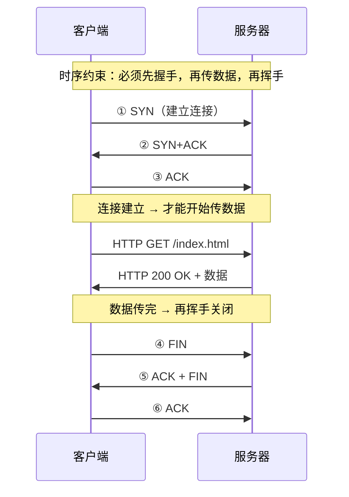
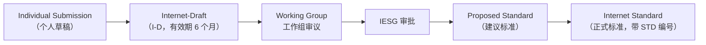
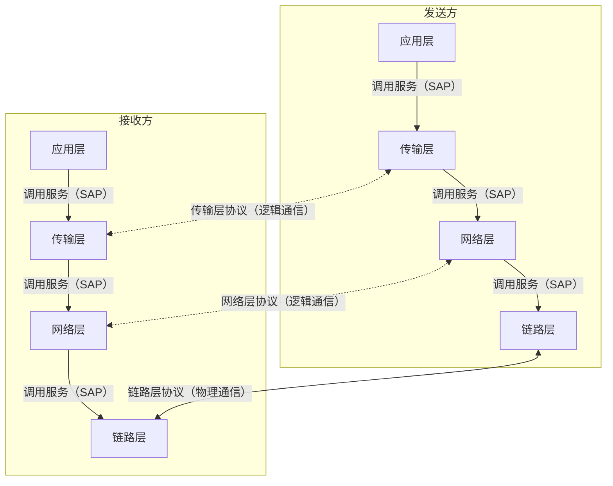
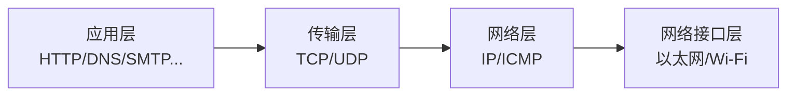

# 详解网络协议(一)基本概念

> [!abstract] 速览
> 这是「详解网络协议」系列的开篇。一句话：**网络协议 = 通信双方必须共同遵守的一套规则**。本篇讲清六个地基概念——**协议三要素、标准与标准化组织、核心术语（PDU/SDU/SAP/服务原语）、分层思想（收益与代价）、封装与解封装、一次打开网页发生了什么**——后续每一篇都建立在它们之上。完整目录见 [[00.网络协议详解总览]]。

## 1. 什么是网络协议

两台机器要通信，就像两个人对话必须用同一种语言、守一定礼节。**网络协议**就是这套约定：数据长什么样、每个字段什么意思、谁先说谁后说、出错了怎么办。

更正式的定义来自教科书：**网络协议（Network Protocol）** 是为网络中的数据交换而建立的规则、标准或约定的集合，由**语法、语义、时序**三个要素构成（见下节）。

> [!note] 协议 ≠ 软件实现
> 协议是一份规范文档（通常以 RFC 或标准号的形式存在），同一协议可以有多种实现（如 Linux 内核 TCP 栈、Windows TCP 栈、lwIP 等）。**协议本身和实现它的软件是两个不同的东西**，这是初学者最常混淆的点。

## 2. 协议三要素（最经典的定义）

| 要素 | 英文 | 回答的问题 | 例子 |
| --- | --- | --- | --- |
| **语法** | Syntax | 数据**长什么样**（格式、结构、编码） | TCP 头部前 16 位是源端口 |
| **语义** | Semantics | 每段数据**是什么意思**、该做什么动作 | `SYN=1` 表示请求建立连接 |
| **时序** | Timing | 事件的**先后顺序与速度** | 先三次握手，再传数据 |

> 记住这三个词，几乎所有协议都能套这个框架去拆解。

### 2.1 语法（Syntax）——数据长什么样

语法规定的是**报文的格式**：字段的顺序、每个字段占多少位、用什么编码方式。几个具体例子：

| 协议 | 语法约定 |
| --- | --- |
| **TCP 头部** | 固定 20 字节：源端口(16 bit) → 目的端口(16 bit) → 序列号(32 bit) → 确认号(32 bit) → … 字段位置与长度不得随意调换 |
| **IP 头部字节序** | 所有多字节字段按**大端序（Big-Endian / Network Byte Order）**传输，主机读写前需调用 `htonl()`/`ntohl()` 转换 |
| **HTTP/1.1 请求行** | `METHOD SP Request-URI SP HTTP/1.1 CRLF`，三段之间必须是空格，行结束必须是 `\r\n` |
| **DNS 报文** | 前 12 字节是固定首部，之后是 Question/Answer/Authority/Additional 区，每个域名字段以 `\x00` 结尾 |

> [!tip] 字节序是语法细节中的大坑
> 网络字节序是大端序（高字节在低地址）；x86/ARM 主机默认小端序。忘记转换会导致端口号或 IP 地址解析出"奇怪的数"，是 C 网络编程最常见的低级 bug。

### 2.2 语义（Semantics）——每段数据是什么意思

语义规定字段值的**含义**及接收方看到这个值后**应当执行的动作**：

| 字段 / 值 | 语义含义 | 接收方动作 |
| --- | --- | --- |
| TCP `SYN=1, ACK=0` | 请求建立连接 | 分配资源，回复 `SYN+ACK` |
| TCP `FIN=1` | "我的数据发完了" | 进入半关闭，最终回 `FIN` |
| HTTP `404 Not Found` | 服务器找不到请求的资源 | 客户端展示错误页，不重试同一 URL |
| HTTP `301 Moved Permanently` | 资源已永久迁移 | 客户端**缓存**新 URL，以后直接去新地址 |
| ICMP `Type=8, Code=0` | Echo Request（ping 请求） | 目标主机回复 Echo Reply |

> [!note] 语义决定状态机
> 协议的语义约定往往对应一张**状态机**：收到某个报文（语义），从当前状态跳转到下一个状态，并执行相应动作。TCP 的 11 个状态（CLOSED / LISTEN / SYN_SENT / … / TIME_WAIT）就是语义驱动的典型。

### 2.3 时序（Timing）——先后顺序与速度匹配

时序规定**事件的先后顺序**以及**收发速率的匹配**：

**先后顺序示例：**



**速率匹配示例：**

- TCP 的**流量控制**（滑动窗口）：发送方速率不得超过接收方的缓冲能力，防止接收方来不及处理。
- TCP 的**拥塞控制**（慢启动、拥塞避免）：发送速率不得超过网络的承载能力，防止网络过载。
- PPP 链路协商时，双方必须先对齐**波特率、数据位、停止位、校验方式**，否则乱码。

> [!tip] 一句话口诀
> **语法管"长相"，语义管"含义"，时序管"顺序与节奏"。** 设计或排查任何协议问题，先问自己这三个问题。

## 3. 标准与标准化组织

> [!note] 为什么要标准化？
> 如果各厂商各自定义协议，设备之间就无法互通。标准化让"任意品牌的路由器都能和任意品牌的交换机对话"成为可能——这正是互联网能连接数十亿设备的根本原因。

### 3.1 主要标准化组织一览

| 组织 | 全称 | 负责领域 | 典型成果 |
| --- | --- | --- | --- |
| **ISO** | International Organization for Standardization | 国际综合标准 | OSI 七层模型（ISO 7498）、ASN.1 |
| **ITU-T** | ITU Telecommunication Standardization Sector | 电信网络 | H.323（VoIP）、X.509（证书）、G.711（语音编解码） |
| **IEEE** | Institute of Electrical and Electronics Engineers | 物理层与链路层 | 802.3（以太网）、802.11（Wi-Fi）、802.1Q（VLAN） |
| **IETF** | Internet Engineering Task Force | 互联网协议 | RFC 系列（TCP、IP、HTTP、TLS、DNS 等） |
| **W3C** | World Wide Web Consortium | Web 标准 | HTML、CSS、WebSocket |
| **IANA** | Internet Assigned Numbers Authority（ICANN 旗下） | 数字资源分配 | IP 地址块分配、端口号注册（知名端口 0–1023）、协议号 |

> [!tip] IANA 端口分类
> - **知名端口（Well-Known Ports）**：0–1023，需 root/管理员权限绑定，如 HTTP:80、HTTPS:443、SSH:22、DNS:53。
> - **注册端口（Registered Ports）**：1024–49151，由应用向 IANA 登记，如 MySQL:3306、Redis:6379。
> - **动态/私有端口（Ephemeral Ports）**：49152–65535，操作系统动态分配给客户端。

### 3.2 IETF 与 RFC 流程

**RFC（Request for Comments）** 是 IETF 发布的系列文档，涵盖互联网标准、最佳实践、信息性说明等。



**RFC 文档分类：**

| 类别 | 说明 | 示例 |
| --- | --- | --- |
| **Standards Track** | 走标准化流程，最终成为 Internet Standard | RFC 9293（TCP）、RFC 9110（HTTP 语义） |
| **BCP（Best Current Practice）** | 当前最佳实践，不一定是正式标准 | BCP 14（RFC 2119，关键字 MUST/SHOULD/MAY） |
| **Informational** | 信息性说明，不要求遵循 | RFC 1925（网络的 12 条真理）|
| **Historic** | 已废弃的旧标准 | RFC 793（已被 RFC 9293 取代） |
| **Experimental** | 实验性协议 | — |

> [!important] RFC 号永久不变，但可以被 Obsolete
> RFC 编号一经发布永不复用；若有新版本，旧 RFC 状态变为 **Obsoleted by**，而不是删除或覆盖。例如经典的 RFC 793（TCP，1981年）已被 RFC 9293（2022年）取代，但 RFC 793 依然可查阅。

### 3.3 法定标准 vs 事实标准

| 类型 | 定义 | 例子 |
| --- | --- | --- |
| **法定标准（De Jure Standard）** | 由权威机构正式发布、经过严格流程的标准 | OSI 七层模型（ISO）、以太网（IEEE 802.3） |
| **事实标准（De Facto Standard）** | 因广泛使用而成为业界默认，不一定经过正式标准化 | TCP/IP（先被广泛部署，后才成为 RFC 正式标准）、PDF（后来才成为 ISO 标准） |

> [!warning] 常见误区：标准 ≠ 唯一实现
> OSI 是法定标准，但互联网实际运行的是 TCP/IP（工程落地的事实标准），两者并不冲突——OSI 适合**理论学习与分层分析**，TCP/IP 是**实际工程**的基础。

## 4. 核心术语速查

这些术语在后续各篇反复出现，集中在此解释一次：

### 4.1 实体与对等实体

| 术语 | 定义 |
| --- | --- |
| **实体（Entity）** | 通信系统中能发送或接收信息的任何硬件或软件进程（如一个进程、一块网卡、一段协议栈代码） |
| **对等实体（Peer Entity）** | 通信两端**同一层**的实体，如发送方的传输层与接收方的传输层互为对等实体 |

对等实体之间通过**协议**通信（逻辑通信），实际数据通过下层接口**向下传递**物理传输。

### 4.2 服务（Service）vs 协议（Protocol）

这是最常被混淆的一对概念：

| 概念 | 定义 | 谁看见 |
| --- | --- | --- |
| **服务（Service）** | 下层向上层**提供的能力**，通过服务访问点（SAP）调用 | 上层实体（垂直关系） |
| **协议（Protocol）** | **同层对等实体**之间通信的规则 | 同层实体（水平关系） |

形象类比：快递公司（下层）向客户（上层）提供"快递服务"（服务），快递员之间用对讲机沟通的规则是"协议"，客户只需知道"能寄包裹"，不必了解快递员间怎么沟通。



### 4.3 SAP（服务访问点）

**SAP（Service Access Point，服务访问点）** 是相邻层之间的接口"插槽"，上层通过 SAP 调用下层服务。常见对应：

| 层间接口 | 对应 SAP |
| --- | --- |
| 应用层调用传输层 | **端口号（Port Number）**：标识某主机上的某个进程 |
| 传输层调用网络层 | **套接字（Socket）** 内部接口 |
| 网络层调用链路层 | **以太网类型字段（EtherType）**：如 `0x0800` = IPv4、`0x86DD` = IPv6 |

### 4.4 PDU 与 SDU

| 术语 | 全称 | 含义 |
| --- | --- | --- |
| **SDU**（Service Data Unit，服务数据单元） | 上层交给本层的**原始数据负荷**（payload） | 应用层的 HTTP 消息就是传输层的 SDU |
| **PDU**（Protocol Data Unit，协议数据单元） | 本层加上**自己头部（PCI）**后的完整数据单位，也是交给下层的 SDU | TCP 报文段 = 头部（PCI）+ 应用数据（SDU） |

关系：`PDU = PCI（Protocol Control Information，协议控制信息）+ SDU`

各层 PDU 有固定名称：

| 层 | PDU 名称 |
| --- | --- |
| 应用层 | 消息（Message）/ 报文 |
| 传输层 | 段（Segment，TCP）/ 数据报（Datagram，UDP） |
| 网络层 | 包（Packet）/ 数据报（Datagram） |
| 链路层 | 帧（Frame） |
| 物理层 | 位（Bit）/ 符号（Symbol） |

### 4.5 服务原语（Service Primitive）

上层调用下层服务的"指令类型"，OSI 定义四种：

| 原语类型 | 方向 | 含义 | 类比 |
| --- | --- | --- | --- |
| **Request（请求）** | 上层 → 下层 | 上层请求下层执行某服务 | 客户打电话下单 |
| **Indication（指示）** | 下层 → 上层 | 下层通知上层某事件发生 | 快递员敲门通知到货 |
| **Response（响应）** | 上层 → 下层 | 上层对 Indication 的回应 | 客户签收确认 |
| **Confirm（确认）** | 下层 → 上层 | 下层通知 Request 的执行结果 | 下单成功通知 |

TCP 连接建立可以套用：应用层 `CONNECT.request` → TCP 发 SYN → 对端 TCP 收到后向对端应用 `CONNECT.indication` → 对端应用 `CONNECT.response` → 本端 TCP 收到 `CONNECT.confirm`。

### 4.6 面向连接 vs 无连接

| 维度 | 面向连接（Connection-Oriented） | 无连接（Connectionless） |
| --- | --- | --- |
| 通信前 | 需要建立连接（握手） | 直接发送 |
| 资源预留 | 双端维护连接状态 | 无状态 |
| 可靠性保障 | 通常有（但不绑定，ATM 也面向连接但不可靠） | 通常不保证 |
| 典型协议 | TCP、电话 PSTN | UDP、IP |
| 适用场景 | 大文件传输、Web、SSH | 短消息、实时音视频、DNS |

> [!warning] 易错：面向连接 ≠ 可靠
> 面向连接只说明**通信前先建立逻辑通道**，不代表一定可靠。ATM（异步传输模式）是面向连接的，但没有 TCP 那样的重传机制。**可靠性**是独立的服务特性。

### 4.7 带内信令 vs 带外信令

| 类型 | 含义 | 示例 |
| --- | --- | --- |
| **带内信令（In-Band Signaling）** | 控制信息与数据**走同一条信道** | FTP 的控制命令（PORT/STOR）与数据走同一 TCP 连接（早期）；HTTP 头部与 Body 同一连接 |
| **带外信令（Out-of-Band Signaling）** | 控制信息走**独立的信道** | FTP 主动模式：命令走 21 端口，数据走另一个 TCP 连接（20 端口）；TCP URG 紧急指针（逻辑带外）；SS7（电话信令网独立于语音网） |

## 5. 分层思想

直接设计一个"无所不包"的协议太复杂，于是把通信拆成若干**层**：每层只解决一类问题、只依赖下层服务、只向上层提供接口。两套经典模型：

- **理论参照**：[[02.OSI七层参考模型]]（七层，分得最细，适合学习）
- **工程落地**：[[10.TCP-IP四层模型]]（四层，实际互联网在跑）



### 5.1 分层的收益

| 收益 | 说明 |
| --- | --- |
| **解耦** | 各层独立演化，改 Wi-Fi 驱动不影响 TCP，改 HTTP 版本不影响 IP |
| **标准化** | 定义好层间接口（SAP），不同厂商的实现可以互通 |
| **可替换** | 同层协议可以互换：TCP 与 UDP 同处传输层，应用可选择 |
| **易于排错** | 出问题先定位是哪一层：ping 通说明网络层 OK，能建立 TCP 连接说明传输层 OK |
| **易于学习与理解** | 复杂问题分而治之，每层聚焦单一职责 |

### 5.2 分层的代价

| 代价 | 说明 |
| --- | --- |
| **封装开销** | 每层都要加头部，数据越小、层越多，overhead 比例越高（小 UDP 包头部比数据还大） |
| **跨层信息缺失** | 传输层默认看不到网络层的拥塞信号（RTT、带宽），只能从丢包间接推测；应用层看不到链路质量 |
| **跨层优化受阻** | 严格的分层阻止了某些整体优化。现实中常有**跨层设计（Cross-layer Design）**：如 Wi-Fi 驱动将信号质量暴露给传输层，让 TCP 区分"无线丢包（不是拥塞）"与"拥塞丢包" |
| **性能损耗** | 数据在内核态跨层拷贝（虽然零拷贝技术可缓解）；层间上下文切换 |

> [!note] "分层是逻辑划分，不是物理"
> OSI/TCP-IP 的层仅是**逻辑上的职责划分**，物理实现中多个层可能合并在同一块芯片或同一段代码里（如 NIC 固件同时处理物理层与链路层）。不要把层理解成一块独立的硬件板卡。

## 6. 封装与解封装

数据下行时每层**加上自己的头部**（封装），上行时每层**剥掉对应头部**（解封装）——这是分层协作的核心机制。

### 6.1 封装过程与各层头部大小

```mermaid
flowchart TB
    subgraph 发送方（封装）
        direction TB
        App["应用数据<br/>例：HTTP Body = 1000 字节"]
        TCP["TCP 头部（≥20 字节）+ 应用数据<br/>→ TCP 段（Segment）"]
        IP["IP 头部（≥20 字节）+ TCP 段<br/>→ IP 包（Packet）"]
        ETH["以太网头（14 B）+ IP 包 + 以太网尾（4 B FCS）<br/>→ 以太网帧（Frame）"]
        PHY["物理层：将帧转为比特流/电信号/光信号发出"]
        App --> TCP --> IP --> ETH --> PHY
    end
```

**各层典型头部开销：**

| 层 | 头部大小 | 备注 |
| --- | --- | --- |
| 以太网头 | 14 字节（目的 MAC 6 + 源 MAC 6 + EtherType 2） | 另有 4 字节 FCS 尾部 |
| IP 头 | 20 字节（无选项）～60 字节 | 含 TTL、协议号、源/目的 IP 等 |
| TCP 头 | 20 字节（无选项）～60 字节 | 含端口、序号、确认号、标志位等 |
| UDP 头 | 8 字节固定 | 轻量，无连接管理 |
| **合计（TCP 场景）** | **≥54 字节** | 1500 字节 MTU 下，纯 TCP 有效载荷最多约 1460 字节 |

### 6.2 MTU 与 MSS 的由来

- **MTU（Maximum Transmission Unit）**：链路层**帧**能承载的最大**IP 包**大小。以太网 MTU = 1500 字节（帧总大小 ≤ 1518 字节含 FCS）。
- **MSS（Maximum Segment Size）**：TCP 一个**段**能携带的最大**应用数据**大小。
  - 计算：`MSS = MTU − IP 头（20 B）− TCP 头（20 B）= 1500 − 20 − 20 = 1460 字节`
  - MSS 在 TCP **三次握手**时协商（各方在 SYN/SYN-ACK 的选项字段声明自己的 MSS）。
  - 发送方取双方 MSS 的**较小值**，确保 IP 层不分片。

> [!tip] 为什么尽量避免 IP 分片？
> IP 分片由路由器执行，重组由目的主机负责；任何一片丢失就要重传整个包。现代网络尽量让 TCP 通过 MSS 协商避免分片，或借助**路径 MTU 发现（PMTUD，RFC 1191）**动态调整。

### 6.3 解封装过程

```mermaid
flowchart TB
    subgraph 接收方（解封装）
        direction TB
        PHY2["物理层：接收比特流，识别帧边界"]
        ETH2["链路层：验证 FCS，去以太网头尾，交出 IP 包"]
        IP2["网络层：验证 IP 校验和、目的 IP，去 IP 头，交出 TCP 段"]
        TCP2["传输层：验证 TCP 校验和，重排序，去 TCP 头，交出应用数据"]
        App2["应用层：HTTP 解析 Body，渲染页面"]
        PHY2 --> ETH2 --> IP2 --> TCP2 --> App2
    end
```

每层只拆自己负责的头部，拿到 PDU 的 payload 交给上层——这就是**封装/解封装机制使不同层的实现完全解耦**的原因。

## 7. 一次打开网页发生了什么（端到端预告）

这是对全系列最好的"实战预告"：在浏览器里输入 `https://www.example.com` 并按回车，背后发生了什么？


| 步骤 | 涉及协议/机制 | 本系列对应篇章 |
| --- | --- | --- |
| URL 解析 | URL 规范（RFC 3986） | [[18.HTTP-HTTPS协议]] |
| DNS 解析 | DNS（UDP/53，偶尔 TCP/53） | [[09.应用层\|DNS]] |
| TCP 三次握手 | TCP（RFC 9293） | [[13.TCP协议]] |
| TLS 握手 | TLS 1.3（RFC 8446） | [[15.TLS协议]] |
| HTTP 请求/响应 | HTTP/1.1（RFC 9110）、HTTP/2（RFC 9113） | [[18.HTTP-HTTPS协议]] |
| 数据在网络中路由 | IP（RFC 791）、BGP、OSPF | [[11.IP协议]] · [[12.支持地址分类和子网划分]] |
| 数据到达物理网卡 | 以太网（IEEE 802.3）、Wi-Fi（IEEE 802.11） | [[04.数据链路层]] · [[03.物理层]] |

> [!note] 这张图是全系列的"骨架"
> 每一步都对应本系列的一篇或几篇文章。当你读完全系列，再回头看这张图，就能把所有协议串联成一个完整的故事。

## 8. 常见误区辨析

| 误区 | 正确理解 |
| --- | --- |
| **"协议就是软件"** | 协议是规范文档，软件是实现；同一协议有多套实现（如 Linux 与 Windows 的 TCP 栈） |
| **"标准就是唯一实现"** | 标准定义行为规范，具体参数（如缓冲区大小、初始 cwnd）各实现可自行调优 |
| **"OSI 和 TCP/IP 是一套模型"** | 两套独立模型：OSI 七层（理论/法定标准）vs TCP/IP 四层（工程/事实标准），不能混用层号 |
| **"分层就是物理隔离"** | 分层是**逻辑职责划分**，多层可在同一硬件/进程中实现 |
| **"面向连接就是可靠"** | 两个独立概念，ATM 面向连接但不保证可靠；UDP 无连接但上层（如 QUIC）可做可靠保障 |
| **"TCP 比 UDP 一定更好"** | 各有适用场景：对时延敏感、允许少量丢包的场景（音视频、游戏）UDP 更合适 |
| **"端口是机器的属性"** | 端口是**进程**的标识，同一台机器的不同进程监听不同端口；TCP 和 UDP 的端口空间独立 |

## 9. 怎么读这个系列

| 想了解 | 看这几篇 |
| --- | --- |
| 分层框架 | [[02.OSI七层参考模型]] · [[10.TCP-IP四层模型]] |
| 各层职责 | [[03.物理层]] → [[09.应用层]] |
| 寻址与路由 | [[11.IP协议]] · [[12.支持地址分类和子网划分]] |
| 可靠 vs 高效传输 | [[13.TCP协议]] · [[16.UDP协议]] |
| 安全 | [[14.SSL协议]] · [[15.TLS协议]] |
| 应用协议 | [[18.HTTP-HTTPS协议]] · [[19.websocket协议]] · [[20.FTP-TFTP-SFTP协议]] · [[21.SSH协议]] · [[22.Telnet协议]] |

## 延伸阅读

- 分层框架详解：[[02.OSI七层参考模型]] · [[10.TCP-IP四层模型]]
- RFC 文档查阅：[https://www.rfc-editor.org](https://www.rfc-editor.org)（全文免费，支持 HTML/PDF/TXT）
- IANA 端口注册表：[https://www.iana.org/assignments/service-names-port-numbers](https://www.iana.org/assignments/service-names-port-numbers)
- 推荐书目：《计算机网络：自顶向下方法》（Kurose & Ross）第 1 章；《TCP/IP详解 卷一》（W. Richard Stevens）第 1 章

> 🏠 [[00.网络协议详解总览]] ｜ [[02.OSI七层参考模型]] ➡️
