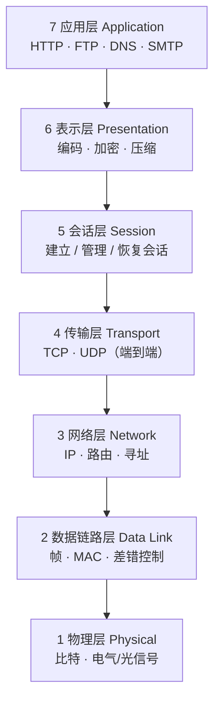
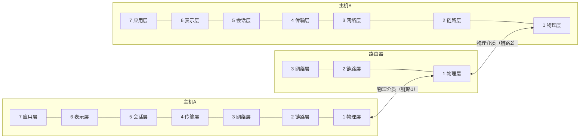
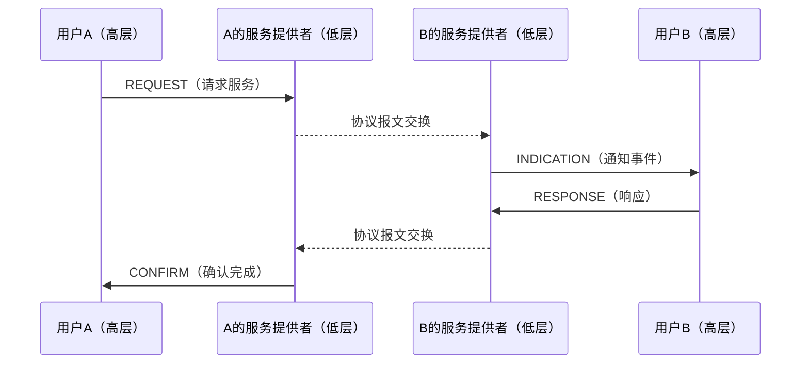
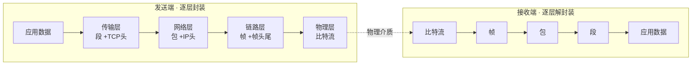
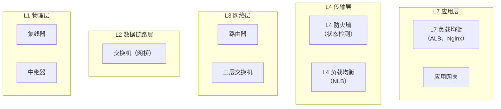
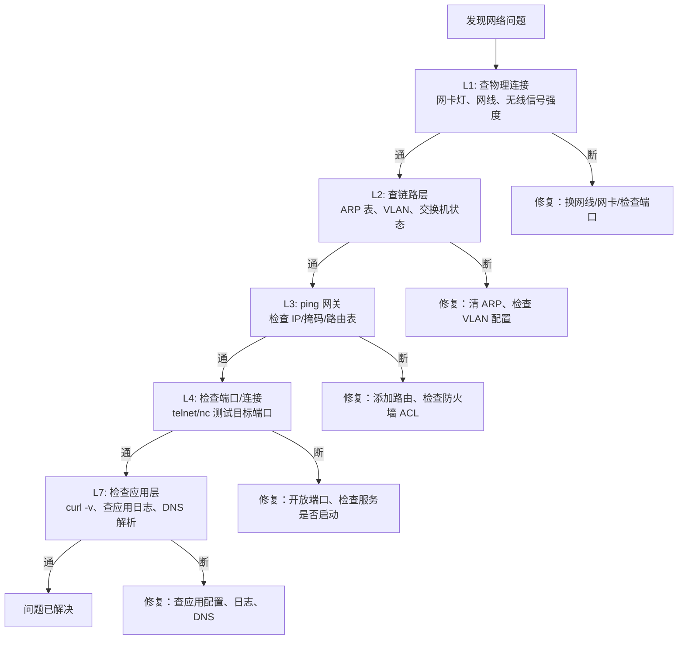

# 详解网络协议(二)OSI七层参考模型

> [!abstract] 速览
> **OSI（Open Systems Interconnection，开放系统互连）参考模型** 是 ISO 于 1984 年提出的**七层**网络通信概念框架（标准号 ISO 7498）。它把"两台主机如何通信"这件复杂的事，**分层解耦**为七个各司其职、上下层通过接口协作的层次。现实里真正落地的是 [[10.TCP-IP四层模型|TCP/IP 模型]]，但 OSI 因**分层最清晰**，至今是理解网络、排查故障、技术面试的通用语言。
>
> 记忆口诀（七 → 一）：**应表会传网数物** —— 应用、表示、会话、传输、网络、数据链路、物理。
>
> 记忆口诀（一 → 七）：**物数网传会表应** —— 物理、数据链路、网络、传输、会话、表示、应用。

## 1. 为什么要分层？

网络通信牵涉电信号、寻址、路由、可靠传输、加密、应用语义……若揉成一坨则无从下手。分层的价值在于：

- **解耦**：每层只干一件事，只依赖下层提供的服务、只向上层暴露接口；
- **可替换**：换 Wi-Fi 还是网线（物理层）不影响上面的 TCP、HTTP；
- **易排错**：能按层定位——"ping 通但网页打不开"，问题多半在传输层以上；
- **标准化互通**：不同厂商遵循同层标准即可互联；
- **技术演进**：某一层协议升级换代（如 HTTP/1.1 → HTTP/2）不需要动其他层。

### 分层的代价

分层并非免费午餐，需要权衡：
- **协议开销（overhead）**：每层都要在数据前后加头部，有效载荷比例下降；
- **跨层优化受限**：严格分层禁止越层直接访问，而现实中某些优化恰恰需要跨层信息（如 QUIC 把传输层与加密合并到应用层正是突破了这一限制）；
- **处理时延**：每层都有封装/解封装的 CPU 开销，对极低时延场景有影响。

## 2. 七层全景图



### 两端通信的对等层视角



> [!note] 关键洞察
> 路由器只需要实现到第 3 层（网络层），因为它只关心"把包往哪里转"，不关心上面的传输/应用语义。这就是分层解耦的直接价值：路由器不需要理解 HTTP，HTTP 服务器不需要理解路由协议。

## 3. 七层职责速查表

| 层 | 名称 | 核心职责 | 数据单位（PDU） | 典型协议 / 标准 | 典型设备 |
| --- | --- | --- | --- | --- | --- |
| 7 | 应用层 | 直接面向用户/应用，提供网络服务接口 | 数据 Data | [[18.HTTP-HTTPS协议\|HTTP]]、FTP、SMTP、DNS、[[22.Telnet协议\|Telnet]] | 主机 / 应用 |
| 6 | 表示层 | 编码、加密/解密、压缩 | 数据 Data | [[15.TLS协议\|TLS]]、JPEG、ASCII | — |
| 5 | 会话层 | 建立、管理、同步、恢复会话 | 数据 Data | RPC、NetBIOS | — |
| 4 | 传输层 | 端到端、端口寻址、可靠性/流控 | 段 Segment / 数据报 Datagram | [[13.TCP协议\|TCP]]、[[16.UDP协议\|UDP]] | 防火墙（L4） |
| 3 | 网络层 | 逻辑寻址（IP）、路由选择、转发 | 包 Packet | [[11.IP协议\|IP]]、ICMP、ARP、OSPF | 路由器、三层交换机 |
| 2 | 数据链路层 | 成帧、MAC 寻址、差错检测、介质访问 | 帧 Frame | 以太网、PPP、HDLC | 交换机、网桥 |
| 1 | 物理层 | 在介质上传输原始比特、电气/机械特性 | 比特 Bit | EIA/TIA-232、IEEE 802.3 | 集线器、中继器、网卡 |

## 4. 服务、协议与原语

这是 OSI 模型最常被忽视、但对深入理解至关重要的一节。

### 4.1 服务与协议的区别

| 概念 | 定义 | 类比 |
| --- | --- | --- |
| **服务（Service）** | 某层向**上层**提供的功能承诺（接口契约） | 餐厅"提供餐饮服务" |
| **协议（Protocol）** | **同层实体**之间通信时遵守的规则（报文格式、交互顺序） | 厨师之间的暗语 |
| **接口（Interface）** | 相邻层之间的**服务访问点（SAP）** | 服务员与厨师的窗口 |

> [!tip] 一句话区分
> 协议是**水平**的（同层实体之间），服务是**垂直**的（下层提供给上层）。

### 4.2 两类服务

| 类型 | 描述 | OSI 举例 | TCP/IP 举例 |
| --- | --- | --- | --- |
| **面向连接（Connection-Oriented）** | 通信前先建立连接，通信后释放；有序、可靠 | X.25 虚电路 | TCP |
| **无连接（Connectionless）** | 每个数据单元独立路由，不保序不保达 | 数据报服务 | UDP、IP |

每种服务还可分为**可靠**（有确认）与**不可靠**（无确认）两小类，共四种组合：
1. 可靠面向连接（文件传输）
2. 不可靠面向连接（IP 电话，允许偶尔丢包）
3. 可靠无连接（带确认的数据报）
4. 不可靠无连接（UDP 广播）

### 4.3 四类服务原语

服务原语（Service Primitive）描述**上层如何请求下层服务**、**下层如何通知上层**。OSI 定义四种：

| 原语 | 方向 | 含义 | 典型场景 |
| --- | --- | --- | --- |
| **REQUEST（请求）** | 上层 → 下层 | 请求启动某服务 | 应用层请求建立 TCP 连接 |
| **INDICATION（指示）** | 下层 → 上层 | 通知上层某事件发生 | 网络层通知传输层"包已到达" |
| **RESPONSE（响应）** | 上层 → 下层 | 上层对 INDICATION 的回答 | 被叫方接受连接请求 |
| **CONFIRM（确认）** | 下层 → 上层 | 告知 REQUEST 已完成 | 连接已成功建立的回调 |



### 4.4 PDU 与 SDU 的关系

这是分层模型的核心数学关系：

| 术语 | 全称 | 含义 |
| --- | --- | --- |
| **PDU** | Protocol Data Unit | 某层完整的数据单元（含本层头部） |
| **SDU** | Service Data Unit | 来自上层、本层需要传递的净数据 |
| **PCI** | Protocol Control Information | 本层添加的控制信息（头部/尾部） |

**关系式：`PDU = PCI + SDU`，即：上层的 PDU = 下层的 SDU**

```
应用层  数据
        ↓ 传给传输层，成为传输层的 SDU
传输层  [TCP头 | 数据]  ← 这是传输层的 PDU（段 Segment）
        ↓ 传给网络层，成为网络层的 SDU
网络层  [IP头 | TCP头 | 数据]  ← 这是网络层的 PDU（包 Packet）
        ↓ 传给链路层，成为链路层的 SDU
链路层  [帧头 | IP头 | TCP头 | 数据 | 帧尾]  ← 这是链路层的 PDU（帧 Frame）
```

> [!tip] 口诀
> **上层的 PDU，就是下层的 SDU**。封装时加头（PCI），解封装时剥头，层层嵌套如俄罗斯套娃。

### 4.5 服务访问点 SAP

SAP（Service Access Point，服务访问点）是上下层之间的**逻辑接口点**，相当于"门牌号"，让下层知道把数据交给上层的哪个实体：

- 以太网帧中的 **EtherType** 字段（如 `0x0800` = IPv4）就是网络层 SAP；
- IP 头中的 **Protocol** 字段（如 `6` = TCP，`17` = UDP）就是传输层 SAP；
- TCP/UDP 中的**端口号**就是应用层 SAP。

## 5. 逐层详解

### 第 1 层 · 物理层 → [[03.物理层]]

**核心任务：** 把比特 0/1 变成能在介质上传播的**物理信号**（电压、光、电磁波），并在接收端还原。

**四大特性规范：**

| 特性 | 描述 | 举例 |
| --- | --- | --- |
| **机械特性** | 连接器形状、引脚数量与排列 | RJ-45 水晶头、BNC 接头 |
| **电气特性** | 电压范围、阻抗、最大传输距离 | RS-232: ±3V～±15V |
| **功能特性** | 各引脚信号含义 | 数据引脚、时钟引脚、控制引脚 |
| **规程特性** | 事件序列（如何建立连接、传输、断开） | 握手信号顺序 |

**关键技术要点：**

1. **信号编码**：数字信号需要编码方案才能在物理介质上传输。常见编码：
   - **曼彻斯特编码（Manchester Encoding）**：每个比特中间有跳变（0 = 高→低，1 = 低→高），自带时钟同步，以太网 10Mbps 使用；
   - **差分曼彻斯特编码**：边界有无跳变表示比特值，抗干扰更强，令牌环使用；
   - **NRZ（Non-Return to Zero）**：高电平=1，低电平=0，简单但需单独时钟；
   - **4B/5B**：每 4 位数据编为 5 位，确保不出现连续 0（用于 100Base-TX）。

2. **比特同步**：发送方与接收方必须以相同速率采样，否则会"漏位"或"重读"。解决方案：同步时钟线、或在编码中内嵌时钟信息（如曼彻斯特编码）。

3. **传输介质**：
   - **双绞线（Twisted Pair）**：Cat5e（百兆）、Cat6/6A（千兆/万兆），成本低，干扰略高；
   - **光纤（Fiber Optic）**：单模（长距离，激光）、多模（短距离，LED），抗电磁干扰，带宽极高；
   - **无线（Wireless）**：电磁波在自由空间传播，共享介质，受障碍物/干扰影响。

4. **信道容量（Shannon 定理）**：最大数据率 = B × log₂(1 + S/N)，B 为带宽（Hz），S/N 为信噪比。这是物理层的理论天花板。

### 第 2 层 · 数据链路层 → [[04.数据链路层]]

**核心任务：** 在**同一链路（一跳之内）**提供可靠（或尽力而为）的帧传输，解决物理层"只会传比特"留下的乱序、错误、冲突问题。

**两个子层架构（IEEE 802 标准）：**

```
┌─────────────────────────────────┐
│  LLC（Logical Link Control）    │  ← 屏蔽下层差异，向网络层提供统一接口
│  IEEE 802.2                     │    处理流控、错误通知
├─────────────────────────────────┤
│  MAC（Medium Access Control）   │  ← 控制谁能在何时使用共享介质
│  IEEE 802.3 / 802.11 等         │    处理帧格式、MAC 地址寻址
└─────────────────────────────────┘
```

**关键技术要点：**

1. **成帧（Framing）**：物理层只知道比特，链路层必须把比特流切割成有边界的帧。常见成帧方法：
   - **字节计数**：帧头包含帧长度，简单但一旦出错后续全乱；
   - **字节填充（Byte Stuffing）**：用特殊标志字节（FLAG）划界，内容若含 FLAG 则转义；
   - **比特填充（Bit Stuffing）**：连续 5 个 1 后强制插入一个 0，HDLC 使用；
   - **物理层违规编码**：用无效信号（如曼彻斯特中不出现的电平组合）表示帧边界。

2. **差错检测 CRC（Cyclic Redundancy Check）**：发送方对帧数据做多项式除法，余数作为校验和（FCS）附在帧尾；接收方同样计算，余数为零则认为无误。以太网使用 CRC-32（4 字节）。**注意：CRC 只能检错，不能纠错；以太网不做重传，丢帧由上层（TCP）处理**。

3. **介质访问控制（MAC）**：当多台主机共享同一介质时，必须协调谁能发送：
   - **CSMA/CD**（Carrier Sense Multiple Access / Collision Detection）：以太网使用，先听后发，冲突则停止并退避（现代全双工交换式以太网已不存在冲突）；
   - **CSMA/CA**（Collision Avoidance）：Wi-Fi（IEEE 802.11）使用，无线无法边发边听，改为碰撞避免；
   - **令牌环（Token Ring）**：持有令牌才能发送，无冲突但令牌丢失会导致网络停顿。

4. **MAC 地址**：48 位（6 字节）全球唯一硬件地址，前 24 位为 OUI（厂商标识），后 24 位由厂商分配。交换机按 MAC 地址转发帧，学习"哪个端口对应哪个 MAC"存入 **MAC 地址表**（CAM 表）。

### 第 3 层 · 网络层 → [[05.网络层]]

**核心任务：** 解决**跨越多个异构网络**的端到端路径问题——逻辑寻址、路由选择、分组转发。

与第 2 层的一句话区别：**MAC 管"同一局域网内的下一跳"，IP 管"跨越整个互联网的端到端路径"**。

**关键技术要点：**

1. **逻辑寻址（IP 地址）**：与物理 MAC 地址不同，IP 地址是**可配置的逻辑地址**，体现网络拓扑结构（网络号+主机号），支持层次化路由聚合。详见 [[11.IP协议]]。

2. **路由（Routing）与转发（Forwarding）**：
   - **路由**：控制平面，计算最优路径，更新路由表（运行 OSPF、BGP 等路由协议）；
   - **转发**：数据平面，按路由表查找出口、修改 TTL、转发包，是高速操作（硬件实现）。
   - 路由算法分两类：**距离矢量（RIP，按跳数）** 和 **链路状态（OSPF，按完整拓扑图计算最短路径）**。

3. **IP 分片（Fragmentation）**：当 IP 包大小超过下层链路的 MTU（最大传输单元，以太网通常 1500 字节），网络层负责将其切分为多个片段，在目的端重组。**分片会增加开销并可能加剧丢包**，现代网络倾向于路径 MTU 发现（PMTUD）避免分片。

4. **拥塞控制**：网络层可感知拥塞（路由器队列满）并采取措施：
   - **RED（Random Early Detection）**：队列未满就开始随机丢包，让 TCP 提前降速；
   - **ECN（Explicit Congestion Notification）**：路由器在包头打拥塞标记，不丢包地通知端点。

5. **ICMP**：网络层的"诊断协议"，承载错误消息（目标不可达、TTL 超时）和探测请求（`ping`、`traceroute`）。

### 第 4 层 · 传输层 → [[06.传输层]]

**核心任务：** 提供**进程到进程（端到端）**的通信，屏蔽下层网络的复杂性。

**关键技术要点：**

1. **端口号**：16 位整数（0～65535），标识同一主机上的不同进程。`<源IP, 源端口, 目的IP, 目的端口>` 四元组唯一标识一条连接。端口分三类：
   - **知名端口（0～1023）**：HTTP=80、HTTPS=443、FTP=21、SSH=22、DNS=53；
   - **注册端口（1024～49151）**：应用向 IANA 申请；
   - **动态端口（49152～65535）**：客户端临时使用。

2. **可靠传输**：[[13.TCP协议|TCP]] 用序号、确认、超时重传、SACK（选择确认）保证数据不丢、不重、有序到达。[[16.UDP协议|UDP]] 不提供可靠性，由应用层自行决定是否需要。

3. **流量控制（Flow Control）**：防止发送方淹没接收方的缓冲区。TCP 用**滑动窗口（rwnd）** 实现，接收方在 ACK 中广告自己还能接收多少数据。

4. **拥塞控制（Congestion Control）**：防止发送方淹没网络。TCP 维护**拥塞窗口（cwnd）**，通过慢启动、拥塞避免、快重传、快恢复算法动态调整发送速率。Linux 默认使用 **CUBIC**，Google 提出了基于带宽测量的 **BBR**。

5. **多路复用/解复用（Multiplexing/Demultiplexing）**：多个应用进程可以同时使用网络，传输层用端口号把数据分发给正确的进程——这就是多路复用（发送方）和解复用（接收方）。

### 第 5 层 · 会话层 → [[07.会话层]]

**核心任务：** 管理两端应用之间的**会话（Session）**——超越单次数据交换，维护一个持续的交互上下文。

**关键技术要点：**

1. **对话控制（Dialog Control）**：管理数据交换的模式：
   - **全双工（Full-Duplex）**：双方随时可发，互不等待（如电话）；
   - **半双工（Half-Duplex）**：同一时刻只有一方发送，需要令牌（如对讲机）；
   - **单工（Simplex）**：只有一方发送（如广播）。

2. **同步点（Synchronization Point）**：会话层可在数据流中插入**检查点（Checkpoint）**。若传输中断，只需从最近的检查点重传，而非从头开始。这正是大文件断点续传的理论基础。

3. **会话建立与释放**：有序建立（协商参数）和有序释放（双方都同意结束），区别于连接的突然中断（异常释放）。

4. **现实地位**：在 TCP/IP 实现中，会话层功能通常被合并到应用层（如 HTTP Cookie 维持会话状态、SSH 的会话管理）。OSI 会话层协议如 X.225 几乎无人使用。

### 第 6 层 · 表示层 → [[08.表示层]]

**核心任务：** 解决"双方以不同格式存储数据"的**语法（Syntax）**问题，确保一方能正确理解另一方发来的数据。

**关键技术要点：**

1. **字符编码转换**：ASCII（7位英文）、ISO-8859（欧洲扩展）、UTF-8/UTF-16/UTF-32（Unicode，支持全球语言）。跨系统通信时必须协商统一编码。

2. **数据格式/序列化**：将高级语言对象转换为字节序列（序列化），以及反向操作（反序列化）。常见格式：
   - 文本：JSON、XML、YAML（可读性好，体积大）；
   - 二进制：Protocol Buffers（Protobuf）、ASN.1（OSI 原生）、MessagePack（体积小，速度快）；
   - ASN.1（Abstract Syntax Notation One）是 OSI 定义的数据描述语言，X.509 证书使用 ASN.1 编码（DER/PEM）。

3. **压缩（Compression）**：减少传输数据量，提升有效吞吐：
   - 无损：DEFLATE（zlib/gzip/zip）、LZ4、Zstandard（zstd）；
   - 有损：JPEG（图片）、MP3/AAC（音频）、H.264/H.265（视频）；
   - HTTP/2 使用 HPACK 压缩头部，HTTP/3 使用 QPACK。

4. **加密/解密**：[[15.TLS协议|TLS]] 在逻辑上对应表示层（加密数据格式），但实现上位于传输层与应用层之间。对称加密（AES）处理数据，非对称加密（RSA/ECDH）交换密钥。

### 第 7 层 · 应用层 → [[09.应用层]]

**核心任务：** 直接为用户程序提供网络服务接口，承载真正有**业务语义**的协议。

应用层不是"应用程序"本身，而是应用程序使用网络的**协议接口**——浏览器是应用，HTTP 是应用层协议。

**典型协议分类：**

| 类别 | 协议 | 说明 |
| --- | --- | --- |
| Web | [[18.HTTP-HTTPS协议\|HTTP/HTTPS]] | 超文本传输，RESTful API 主力 |
| 文件传输 | [[20.FTP-TFTP-SFTP协议\|FTP/SFTP/TFTP]] | FTP 明文，SFTP 加密，TFTP 用于设备引导 |
| 邮件 | SMTP/POP3/IMAP | 发送/接收/管理邮件 |
| 域名 | DNS | 域名→IP 的分布式数据库，关键基础设施 |
| 远程登录 | [[22.Telnet协议\|Telnet]]/[[21.SSH协议\|SSH]] | Telnet 明文（已淘汰），SSH 加密隧道 |
| 时间同步 | NTP | 网络时间协议，误差可低至毫秒级 |
| 网络管理 | SNMP | Simple Network Management Protocol |

## 6. 数据的封装与解封装

发送端自顶向下逐层**加头部**（封装），接收端自底向上逐层**剥头部**（解封装）——每层只认自己那层的头部，这正是分层解耦的体现。



## 7. 封装开销实例：一个 HTTP 请求的字节账单

以一个简单的 HTTP GET 请求为例，计算各层累计的封装开销：

假设 HTTP 请求正文（应用数据）为 **1000 字节**。

| 层次 | 添加内容 | 大小 | 累计大小 |
| --- | --- | --- | --- |
| 应用层（HTTP） | HTTP 请求头 | ~200 字节（典型） | 1200 字节 |
| 传输层（TCP） | TCP 头部（固定 20B + 选项） | 20～60 字节 | ~1240 字节 |
| 网络层（IP） | IP 头部（固定 20B + 选项） | 20 字节 | ~1260 字节 |
| 数据链路层（以太网） | 帧头（14B）+ FCS（4B） | 18 字节 | ~1278 字节 |
| 物理层（前导码+帧间隙） | Preamble 7B + SFD 1B + IPG 12B | 20 字节 | ~1298 字节 |

**MTU 关系**：以太网标准 MTU = **1500 字节**（数据链路层帧的数据部分上限）。

若 IP 包（IP 头 + TCP 头 + 数据）超过 1500 字节，则触发分片：

```
1500（MTU）
  - 20（IP头）  = 1480（IP 可用于 TCP 段的空间）
  - 20（TCP头） = 1460（MSS，Maximum Segment Size，TCP 最大段数据量）
```

这就是为什么 TCP 协商 MSS 时通常为 **1460 字节**——恰好让 IP 包 = 1500 字节，不触发分片。

> [!warning] 实际情况更复杂
> - VLAN 标签（802.1Q）再加 4 字节，有效 MSS 降为 1456 字节；
> - VPN/GRE/IPSec 隧道还会额外消耗数十字节头部，需要设置更小的 MTU 或 MSS Clamping；
> - Jumbo Frame（巨帧）允许 MTU 达到 9000 字节，用于数据中心内部通信，大幅减少开销比。

## 8. 设备与层映射

网络设备工作在不同层次，决定了它们能"看到"和"处理"什么信息：

| 设备 | 工作层 | 核心能力 | 局限 |
| --- | --- | --- | --- |
| **中继器（Repeater）** | L1 物理层 | 放大、整形信号，延长传输距离 | 只处理比特，不隔离冲突域 |
| **集线器（Hub）** | L1 物理层 | 多端口中继器，广播所有端口 | 共享带宽，冲突域大，已淘汰 |
| **网桥（Bridge）** | L2 链路层 | 按 MAC 地址隔离冲突域，选择性转发 | 端口少，已被交换机取代 |
| **交换机（Switch）** | L2 链路层 | 多端口网桥，维护 MAC 地址表，按端口转发 | 只看 MAC，无法跨子网路由 |
| **三层交换机（L3 Switch）** | L2+L3 | 硬件实现路由，高速跨 VLAN 转发 | 路由功能弱于专业路由器 |
| **路由器（Router）** | L3 网络层 | 按 IP 路由，连接不同网络，NAT、防火墙 | 速度慢于交换机（软件查表） |
| **L4 防火墙** | L4 传输层 | 检查 TCP/UDP 端口、连接状态，访问控制 | 看不到应用层内容 |
| **L7 负载均衡（ALB）** | L7 应用层 | 解析 HTTP/HTTPS 内容，按 URL/Cookie 调度 | 需要 TLS 卸载，有延迟 |
| **应用网关（Gateway）** | L4～L7 | 协议转换，如 HTTP ↔ SMTP | 针对特定协议，通用性低 |



## 9. OSI vs TCP/IP

| OSI 七层 | TCP/IP 四层 | 代表协议 |
| --- | --- | --- |
| 应用层 / 表示层 / 会话层 | 应用层 | HTTP、DNS、FTP、SMTP |
| 传输层 | 传输层 | TCP、UDP |
| 网络层 | 网际层 | IP、ICMP、ARP |
| 数据链路层 / 物理层 | 网络接口层 | 以太网、Wi-Fi |

→ 详见 [[10.TCP-IP四层模型]]

**为何 TCP/IP 把三层合并为一？**
- OSI 的会话层（X.225）和表示层（ASN.1）在 TCP/IP 世界里几乎没有对应实现；
- 这些功能（会话管理、数据格式、加密）被应用层协议自行承担（HTTP Cookie 管会话，JSON/Protobuf 管格式，TLS 管加密）；
- TCP/IP 先于 OSI 普及，不需要迁就 OSI 的分层粒度。

## 10. OSI 为何没能落地

OSI 是一个精心设计的"伟大标准"，但在现实中输给了 TCP/IP。原因是多方面的：

| 原因 | 详情 |
| --- | --- |
| **标准出台太晚** | OSI 标准在 1984 年才正式发布，而 ARPANET 的 TCP/IP 早在 1970 年代末就已运行，RFC 793（TCP）1981 年发布 |
| **协议过于复杂庞大** | OSI 协议栈完整实现需要大量代码，调试极难；光会话层协议就有数百页规范 |
| **实现昂贵** | 复杂性导致商业实现成本极高，只有 IBM、DEC 等大厂有能力做，且互操作性差 |
| **TCP/IP 先占山头** | Unix 内核直接集成 BSD TCP/IP 协议栈，每所大学、研究机构都能免费使用，形成网络效应 |
| **学术与政治博弈** | OSI 由政府/标准机构推动，而 TCP/IP 由工程师驱动，前者决策慢、后者迭代快 |
| **市场选择** | 互联网爆炸式增长时，企业选择已经成熟的 TCP/IP 而非尚未完善的 OSI |

> [!quote] Tanenbaum 的评价
> "OSI 模型在正确的时间出现在了错误的地方，或者说，在错误的时间出现在了正确的地方。" OSI 贡献了**概念框架**，TCP/IP 赢得了**工程落地**。今天学习 OSI 主要是为了获得分析网络的思维工具，而非遵照其实现。

## 11. 按 OSI 分层排查网络故障

OSI 七层模型的最大实用价值之一：**系统化地按层排查网络故障**，避免无头苍蝇式乱试。

**排查原则：自底向上（L1 → L7），先确认下层正常再往上排查。**

| 层 | 排查对象 | 常用工具/命令 | 典型症状 |
| --- | --- | --- | --- |
| **L1 物理层** | 网线、光纤、网卡、端口灯、无线信号 | 查网卡灯（绿灯=连通）、换网线、`ethtool eth0` | 网卡灯不亮、接口 DOWN |
| **L2 链路层** | MAC 地址、VLAN、ARP、交换机端口 | `arp -n`、`ip neigh`、`tcpdump -e`、交换机 MAC 表 | ARP 无响应、VLAN 配置错误、MAC 地址冲突 |
| **L3 网络层** | IP 地址、路由表、子网掩码、防火墙 ACL | `ping`、`ip route`、`traceroute`/`tracert`、`route -n` | ping 不通、路由缺失、TTL 超时 |
| **L4 传输层** | TCP/UDP 端口、连接状态、防火墙规则 | `ss -tnp`、`netstat -an`、`telnet host port`、`nmap` | 端口未监听、防火墙拦截、连接超时 |
| **L5 会话层** | 会话建立、TLS 握手 | `openssl s_client -connect host:443` | TLS 握手失败、会话超时 |
| **L6 表示层** | 编码格式、证书有效性、数据解析 | 查浏览器证书信息、抓包看数据格式 | 乱码、证书错误、解析异常 |
| **L7 应用层** | HTTP 响应码、DNS 解析、应用日志 | `curl -v`、`dig`/`nslookup`、`wget`、应用日志 | 404/500、DNS 解析失败、应用报错 |

**标准排查流程（实战清单）：**



> [!tip] 面试常考
> "网页打不开怎么排查？" —— 按 OSI 自底向上：先看网卡灯（L1）→ ping 网关（L2/L3）→ ping DNS 服务器（L3）→ nslookup 域名（L7 DNS）→ curl -v 访问 URL（L7 HTTP）→ 查应用日志。

## 12. 模型优势与现实定位

- **优势**：标准化、模块化、互操作、故障隔离、技术演进互不影响。
- **现实**：OSI 是"理论参照系"，工业界实际跑的是更精简的 [[10.TCP-IP四层模型|TCP/IP 模型]]——OSI 的会话层、表示层职责被合并进了应用层。学习时用 OSI 理解分层，工程中按 TCP/IP 落地。

> [!tip] 一句话记住每层
> 物理层送**比特**、链路层送**帧**（MAC / 同链路）、网络层送**包**（IP / 跨网）、传输层送**段**（端口 / 进程）、会话·表示·应用层处理**会话 · 格式 · 业务**。

## 13. 记忆口诀大全

| 方向 | 口诀 | 助记说明 |
| --- | --- | --- |
| **七 → 一**（上至下） | **应表会传网数物** | 应用·表示·会话·传输·网络·数据链路·物理 |
| **一 → 七**（下至上） | **物数网传会表应** | 物理·数据链路·网络·传输·会话·表示·应用 |
| **英文七 → 一** | **All People Seem To Need Data Processing** | Application, Presentation, Session, Transport, Network, Data Link, Physical |
| **英文一 → 七** | **Please Do Not Throw Sausage Pizza Away** | Physical, Data Link, Network, Transport, Session, Presentation, Application |
| **数字层号记法** | 1物2数3网4传5会6表7应 | 按数字顺序背，层号与汉字绑定 |

> [!note] 哪个口诀最好用？
> - 快速回忆层号：**"1物2数3网4传"**，前四层最常考，牢记层号与名称的对应；
> - 排查故障：记住**自下而上（物→应）**的顺序；
> - 面试说出来：**"应表会传网数物"**（七到一，倒背如流显专业）。

## 14. 常见误区辨析

> [!warning] 易错点清单

**误区 1：ARP 属于第几层？**
ARP（Address Resolution Protocol）功能上服务于网络层（把 IP 地址解析为 MAC 地址），但报文直接封装在以太网帧中，不含 IP 头——所以 ARP 横跨 L2/L3 边界。不同教材分类不同，面试时说明即可。

**误区 2：交换机只在 L2 工作？**
普通二层交换机确实只看 MAC（L2），但**三层交换机**具备 L3 路由能力，能跨 VLAN 路由。区分时需说明"几层"交换机。

**误区 3：ping 通就说明 TCP 端口没问题？**
ping 使用 ICMP（L3 网络层），ping 通只证明 L3 可达。防火墙可能放行 ICMP 但阻断 TCP 80/443——还需要用 `telnet`/`nc` 测试具体端口（L4）。

**误区 4：TLS/HTTPS 属于表示层（L6）？**
从功能（加密/格式）看，TLS 对应表示层；但在 TCP/IP 协议栈中，TLS 工作在 TCP 之上、HTTP 之下，实现上更像"传输层与应用层之间的附加层"。说"TLS 对应 OSI 的表示/会话层功能"是正确的，但别说"TLS 是传输层协议"。

**误区 5：OSI 七层等于 TCP/IP 七层？**
TCP/IP 没有七层，只有四层（或五层，若把数据链路层和物理层分开）。七层是 OSI 专属，两者是**不同的参考框架**，只是有对应关系。

**误区 6：封装头部只在发送端加，接收端不处理？**
每一跳的中间节点（如路由器）都会解封装到自己能处理的那层，处理完再重新封装。路由器解封装到 L3 看 IP 头做路由决策，然后重新封装成 L2 帧发出——L2 帧头（源/目的 MAC）**每跳都会改变**，但 IP 头中的源/目的 IP **全程不变**（NAT 除外）。

**误区 7：层越高越重要？**
层次高低不代表重要性，而代表**抽象级别**。应用层对用户最直接，物理层是一切的基础——每层都不可缺少。

## 延伸阅读

- 上一篇基础：[[01.基本概念]]
- 逐层细看：[[03.物理层]] · [[04.数据链路层]] · [[05.网络层]] · [[06.传输层]] · [[07.会话层]] · [[08.表示层]] · [[09.应用层]]
- 工程落地模型：[[10.TCP-IP四层模型]]

> ⬅️ [[01.基本概念]] ｜ 🏠 [[00.网络协议详解总览]] ｜ [[03.物理层]] ➡️
