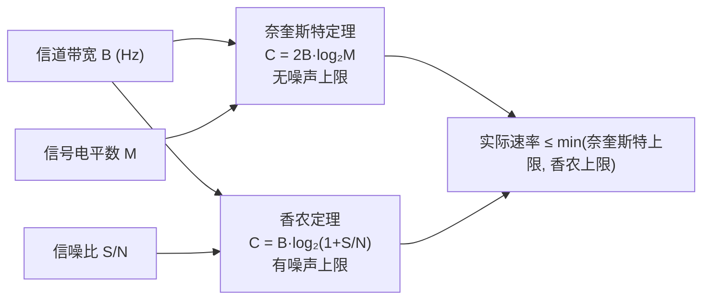
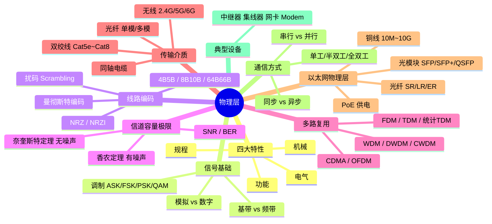

# 详解网络协议(三)物理层

> [!abstract] 速览
> **物理层（Physical Layer）** 是 [[02.OSI七层参考模型|OSI]] 的**第 1 层**，也是唯一**直接接触传输介质**的层。它的职责只有一件：把上层（[[04.数据链路层]]）交下来的**比特流 0/1**，变成能在双绞线/光纤/无线上传播的**物理信号**，并在对端还原回比特——它**不理解比特的含义**。
> 数据单位（PDU）：**比特（Bit）**。关键词：**机械 / 电气 / 功能 / 规程**四大特性。
> 本篇覆盖：四大特性 → 信号基础（模拟/数字、调制） → 线路编码 → 信道容量极限（奈奎斯特/香农） → 多路复用 → 传输介质（双绞线/光纤/无线详表） → 以太网物理层标准 → 通信方式 → 典型设备 → 常见误区辨析。

---

## 1. 物理层到底做什么

把它想成"信号的搬运工"：上层不关心你用网线还是 Wi-Fi、用电信号还是光信号，只要能把一串 0/1 可靠送到对端即可。物理层正是负责这层抽象——定义"一个比特如何用物理量表示、如何发出去、如何收回来、传多快"。


> [!tip] 一句话口诀
> **物理层管"怎么传"，数据链路层管"传给谁"，网络层管"走哪条路"。** 物理层既不看地址，也不看内容，只管把比特变成信号、再从信号还原比特。

---

## 2. 四大特性

| 特性 | 规定什么 | 举例 |
| --- | --- | --- |
| **机械特性** | 接口形状、尺寸、引脚数与排列 | RJ45 水晶头、光纤接口 LC/SC |
| **电气特性** | 电压/电流范围、阻抗、信号电平 | 高电平=1、低电平=0；RS-232 ±12V |
| **功能特性** | 每根线/每个引脚的作用 | 发送（TX）、接收（RX）、地线（GND） |
| **规程特性** | 信号的时序与事件顺序 | 先建立链路再传数据；握手时序 |

> [!note] 记忆口诀
> **机（接插件形状）电（电平范围）功（引脚功能）规（时序流程）** —— 从外到内，从硬件到逻辑。

---

## 3. 信号基础

理解物理层的前提是弄清楚"信号"是什么。

### 3.1 模拟信号 vs 数字信号

| 维度 | 模拟信号（Analog） | 数字信号（Digital） |
| --- | --- | --- |
| 取值 | 连续（无穷多个值） | 离散（有限个值，通常 2 个）|
| 代表 | 声波、传统电话、AM/FM 广播 | 以太网、USB、光纤数字链路 |
| 噪声积累 | 每次放大同时放大噪声 | 可以"再生"（Regeneration），截断噪声 |
| 传输距离 | 衰减后失真难以恢复 | 中继器可完整恢复信号 |

**核心区别**：模拟信号放大时噪声一起放大（每跳噪声叠加）；数字信号通过中继器"再生"——判决门限以上视为 1、以下视为 0，从头产生干净信号，所以长距离表现更好。

### 3.2 周期、频率、振幅、相位

一个正弦波由三个参数完全描述：

```
s(t) = A · sin(2πft + φ)
```

- **振幅 A**：信号的峰值大小，影响信号强弱（可区分高低电平）。
- **频率 f**（单位 Hz）：每秒振荡次数，$f = 1/T$（$T$ 为周期）。
- **相位 φ**：波形起点的偏移角度（0°～360° 或 0～2π）。

调制技术（见 3.4）正是通过改变这三个参数来携带数字信息的。

### 3.3 基带传输 vs 频带（宽带）传输

| 维度 | 基带（Baseband） | 频带/宽带（Broadband） |
| --- | --- | --- |
| 信号形式 | 直接传数字信号（方波） | 把数字信号**调制**到高频载波上 |
| 占用频谱 | 从 0 Hz 起的低频段 | 特定载频附近的一段频段 |
| 多路复用 | 依赖时分复用（TDM） | 可频分复用（FDM），多路共享介质 |
| 典型场景 | 局域网（以太网 10BASE-T） | 有线电视（Cable）、ADSL、Wi-Fi |

> [!note] 点睛
> 以太网走的是**基带**，数字信号直接在双绞线上传；而家庭宽带 ADSL/光猫走的是**频带**，把数字信号调制到特定频段再传。二者的"宽带"含义不同——生活里说的"宽带"特指高速互联网接入，不等于物理层的"宽带传输"。

### 3.4 调制方式（Modulation）

调制是把数字 0/1 映射到模拟载波参数变化的过程。

#### 幅移键控（ASK，Amplitude Shift Keying）

用不同振幅表示不同比特值。最简单：OOK（On-Off Keying）用"有信号=1、无信号=0"。抗噪声能力弱，实际中少单独使用。

#### 频移键控（FSK，Frequency Shift Keying）

用不同频率表示比特。早期 Modem（如 Bell 103，300 bps）大量使用，抗干扰比 ASK 强，但频谱效率低。

#### 相移键控（PSK，Phase Shift Keying）

用不同相位表示比特：
- **BPSK**（Binary PSK）：0°=0，180°=1；每个符号 1 bit。
- **QPSK**（Quadrature PSK）：4 个相位（0°/90°/180°/270°），每个符号 2 bit。

#### 正交振幅调制（QAM，Quadrature Amplitude Modulation）

同时改变振幅和相位，用**星座图（Constellation Diagram）** 表示所有可能的符号点：

```
16-QAM：星座图有 4×4=16 个点，每符号 4 bit
64-QAM：8×8=64 个点，每符号 6 bit
256-QAM：16×16=256 个点，每符号 8 bit
1024-QAM：每符号 10 bit（Cable DOCSIS 3.1、Wi-Fi 6 采用）
4096-QAM：每符号 12 bit（Wi-Fi 7 部分场景）
```

> [!tip] QAM 的直觉
> 星座图上的点越密集，每个符号携带的比特数越多（频谱效率越高），但对噪声越敏感——相邻点之间的"容错距离"越小。这就是为什么信噪比高的场景（光纤近端、良好环境 Wi-Fi）才能用高阶 QAM。

| 调制方式 | 每符号比特数 | 频谱效率 | 抗噪声能力 | 典型应用 |
| --- | --- | --- | --- | --- |
| BPSK | 1 bit | 低 | 强 | 卫星、Wi-Fi 控制帧 |
| QPSK | 2 bit | 中 | 较强 | 3G/LTE、DVB-S |
| 16-QAM | 4 bit | 高 | 中 | LTE、Wi-Fi |
| 64-QAM | 6 bit | 高 | 一般 | Cable、Wi-Fi |
| 256-QAM | 8 bit | 很高 | 较低 | Wi-Fi 5/6、DOCSIS |
| 1024-QAM | 10 bit | 极高 | 低 | Wi-Fi 6、DOCSIS 3.1 |

---

## 4. 线路编码（Line Coding）

调制解决了"如何把比特搭到载波上"的问题，线路编码解决的是"比特序列如何直接映射到物理电平序列"的问题。两者是不同阶段的转换，通常基带传输只需要线路编码、不需要载波调制。

### 4.1 为什么需要线路编码

原始 NRZ（Non-Return-to-Zero，非归零）信号有三个问题：
1. **直流分量**：全 0 或全 1 序列会产生直流漂移，交流耦合的信道无法传输。
2. **长游程（Long Run）**：连续的 0 或 1 导致长时间无电平变化，接收端**时钟无法同步**。
3. **极性不确定**：差分传输时，翻转接线会导致 0/1 含义颠倒。

线路编码的目的就是：**时钟恢复、直流均衡（DC Balance）、限制游程长度（Run Length）**。

### 4.2 各类线路编码详解

#### 归零码（RZ，Return-to-Zero）

每个码元中间回到零电平。优点是每个码元有两次跳变（自同步好），缺点是占用带宽是 NRZ 的两倍，效率低，现代高速链路已不单独使用。

#### 非归零码（NRZ，Non-Return-to-Zero）

- **NRZ-L（Level）**：电平直接表示值。高电平=1，低电平=0。编码效率 100%，但无自同步，有直流分量。光接口 STM-N（SDH）大量使用。
- **NRZI（NRZ-Inverted）**：**跳变表示 0，不变表示 1**（或反之，具体取决于协议）。USB 2.0 采用此编码——遇到 1 电平不变，遇到 0 电平翻转；长连 1 时无跳变，需结合位填充（Bit Stuffing，每 6 个连续 1 插入 1 个 0）来保证同步。

#### 曼彻斯特编码（Manchester Encoding）

每个码元中间强制跳变：
- **曼彻斯特（IEEE 802.3）**：中间从低到高跳变=1，从高到低跳变=0。
- **差分曼彻斯特（Differential Manchester，IEEE 802.5 Token Ring）**：中间始终跳变（提供同步），**码元开始时是否跳变**决定 0/1（开始跳变=0，不跳变=1）。差分版本优点是极性无关——接错两根线也能正确解码。

两者的共同特点：**每比特必有一次中间跳变，自带时钟同步**，不含直流分量；缺点是码元中间额外跳变导致**带宽翻倍**，编码效率仅 **50%**，只适合 10 Mbps 以太网时代。

#### 4B/5B 编码

用 5 bit 编码组替代 4 bit 数据，从 32 种 5-bit 组合中挑选 16 种，要求：每个码组不以超过 1 个连续 0 开头，且不以超过 2 个连续 0 结尾——确保游程足够短，接收端能恢复时钟。编码效率 **80%**。

4B/5B 通常与 NRZI 配合使用（100BASE-TX 快速以太网、FDDI），不需要曼彻斯特编码那么高的带宽。

#### 8B/10B 编码

用 10 bit 替代 8 bit，编码效率 **80%**。引入"运行差异（Running Disparity，RD）"机制跟踪已发 1 和 0 的数量差，自动选择两种编码变体之一使 RD 趋向 0 —— 实现直流均衡。保证最长游程不超过 5 个相同电平，时钟恢复稳定。

典型应用：千兆以太网（1000BASE-X）、光纤通道（Fibre Channel）、PCIe Gen1/2、SATA、DisplayPort 1.x。

#### 64B/66B 编码

解决 8B/10B 效率仅 80% 的问题（高速链路浪费 20% 带宽代价太高）。每 64 bit 数据加 2 bit 同步头，编码效率 **64/66 ≈ 96.97%**。直流均衡不靠查表，而是靠**加扰（Scrambling）**——将数据与伪随机序列（PRBS）做异或，使输出接近随机分布，自然实现直流均衡和游程限制。

典型应用：10G 以太网（10GBASE-R）、25G/40G/100G 以太网、InfiniBand、Thunderbolt。

#### 扰码（Scrambling）

独立于编码存在的一种技术：发端用伪随机序列与原始数据异或后发出，收端用相同序列异或还原。目的是打散周期性数据模式（如全 0 帧或重复字节），使频谱接近白噪声，改善信号质量。64B/66B 大量依赖扰码，而 8B/10B 则主要靠查表编码。

### 4.3 线路编码对比总览

| 编码方式 | 编码效率 | 自同步 | 直流均衡 | 最长游程限制 | 典型应用 |
| --- | --- | --- | --- | --- | --- |
| NRZ-L | 100% | 无 | 差 | 无 | SDH 光接口 |
| NRZI | ~100% | 弱（需位填充） | 一般 | 需填充 | USB 2.0 |
| 曼彻斯特 | 50% | 强（中间跳变） | 好 | 1 | 10BASE-T 以太网 |
| 差分曼彻斯特 | 50% | 强（中间跳变） | 好 | 1 | Token Ring |
| 4B/5B | 80% | 好 | 中 | ≤3 | 100BASE-TX、FDDI |
| 8B/10B | 80% | 好 | 优（RD 控制） | ≤5 | 1000BASE-X、PCIe Gen1/2 |
| 64B/66B | 96.97% | 好（依赖扰码） | 优（扰码） | 扰码保证 | 10G/25G/100G 以太网 |

---

## 5. 信道容量极限

### 5.1 奈奎斯特定理（Nyquist Theorem）——无噪声极限

> **奈奎斯特定理**：在**无噪声**的理想信道中，若信道带宽为 $B$（Hz），信号有 $M$ 个离散电平，则最大数据传输速率为：
> $$C = 2B \cdot \log_2 M \quad \text{（bps）}$$

**数值例子**：某无噪声信道带宽 3000 Hz，采用 4 电平（M=4）信号。

$$C = 2 \times 3000 \times \log_2 4 = 2 \times 3000 \times 2 = 12000 \text{ bps} = 12 \text{ kbps}$$

**含义**：即使没有噪声，增加电平数也无法无限提升速率——因为信道带宽有限，码元速率（波特率）最大只有 2B Baud，多余的电平数会越来越难以区分。奈奎斯特给出了**信号层面的理论上限**，与噪声无关。

### 5.2 香农定理（Shannon's Theorem）——有噪声极限

> **香农定理**：在存在**高斯白噪声**的信道中，若信道带宽为 $B$（Hz），信噪比为 $S/N$，则信道容量极限为：
> $$C = B \cdot \log_2\!\left(1 + \frac{S}{N}\right) \quad \text{（bps）}$$

**信噪比（SNR）**：通常用分贝（dB）表示：
$$\text{SNR(dB)} = 10 \cdot \log_{10}\!\left(\frac{S}{N}\right)$$

例：SNR = 30 dB → $S/N = 10^{30/10} = 1000$。

**数值例子**：电话线信道带宽 3000 Hz，SNR = 20 dB。

$$S/N = 10^{20/10} = 100$$
$$C = 3000 \times \log_2(1 + 100) \approx 3000 \times 6.658 \approx 19974 \text{ bps} \approx 20 \text{ kbps}$$

这就是为什么早期 56K Modem 的 56 kbps 已接近传统电话线的香农极限（实际线路 SNR 约 38 dB，极限约 38 kbps 下行）。

**误码率（BER，Bit Error Rate）**：实际信道中每传输多少比特会出现 1 个错误。典型要求：光纤链路 BER < $10^{-12}$，无线链路 BER < $10^{-6}$（上层协议补偿）。

### 5.3 两个定理的配合使用



> [!warning] 辨析
> - 奈奎斯特告诉你：**信号电平再多也无济于事，带宽限制了码元速率**。
> - 香农告诉你：**噪声是终极瓶颈，无论用什么编码方式都突破不了**。
> - 工程实践：两个上限都要满足，实际取较小值。

---

## 6. 多路复用（Multiplexing）

当一条物理链路的容量超过单个用户的需求时，可以用**多路复用**技术让多个信号共享同一介质。

| 技术 | 英文全称 | 划分维度 | 典型场景 |
| --- | --- | --- | --- |
| FDM | Frequency Division Multiplexing | 频率（每路占不同频段） | 传统有线电视、FM 广播、ADSL |
| TDM | Time Division Multiplexing | 时隙（轮流占用固定时隙） | T1/E1 电路、SONET/SDH |
| 统计 TDM | Statistical TDM / ATDM | 时隙（按需动态分配） | 分组交换（ATM 虚电路） |
| WDM | Wavelength Division Multiplexing | 波长（光纤，多色光同传） | 骨干光网络 |
| DWDM | Dense WDM | 波长（密集，间隔 ≤0.8 nm） | 长距离骨干光纤（100+波长） |
| CWDM | Coarse WDM | 波长（稀疏，间隔 20 nm） | 城域网接入，成本低 |
| CDMA | Code Division Multiple Access | 扩频码（所有用户同频同时） | 3G 移动通信 |
| OFDM | Orthogonal FDM | 正交子载波（频域分割） | Wi-Fi 4/5/6、LTE、5G NR |

**FDM（频分复用）**：各路信号调制到不同中心频率上，互不重叠；接收端用带通滤波器分离。适合模拟信道，实现简单，但频段固定、利用率低。

**TDM（时分复用）**：把时间切成固定帧，每帧内每路信号占一个时隙，周期性轮转。**同步 TDM** 即使某路没数据也占用时隙（E1 的 32 个时隙始终轮转）；**统计 TDM** 只有有数据的路才占时隙，提升效率。

**WDM/DWDM**：光纤里同时传送多个不同波长（颜色）的光信号，每个波长是独立的"虚拟光纤"。DWDM 可在一根光纤上传 80～160 个波长，每波长 100G，总容量达数十 Tbps。

**OFDM（正交频分复用）**：把宽带信道分成数百到数千个正交窄子载波，每个子载波速率低、抗多径衰落，整体吞吐量高；Wi-Fi 6 （802.11ax）进一步引入 OFDMA，多用户共享子载波。

---

## 7. 传输介质

### 7.1 双绞线（Twisted Pair）

两根绝缘导线相互缠绕，缠绕减少电磁干扰（EMI）和近端串扰（NEXT）——对称扭绞让两根线感受到的干扰相互抵消。

#### UTP vs STP

| 类型 | 说明 | 优点 | 缺点 |
| --- | --- | --- | --- |
| **UTP**（Unshielded） | 无屏蔽，只靠扭绞 | 成本低、施工方便、弯曲性好 | 抗 EMI 较弱 |
| **STP**（Shielded） | 线对或整缆有金属屏蔽 | 抗 EMI 强、串扰小 | 成本高、需接地、不易弯曲 |
| **SFTP / S/FTP** | 每对线对独立屏蔽 + 整体屏蔽 | 抗干扰最强 | Cat7/Cat8 常用，施工最复杂 |

#### 双绞线类别速查表

| 类别 | 带宽（频率） | 最大速率 | 最大距离 | 屏蔽 | 典型用途 |
| --- | --- | --- | --- | --- | --- |
| **Cat5e** | 100 MHz | 1 Gbps | 100 m | UTP/STP | 家庭/办公千兆以太网 |
| **Cat6** | 250 MHz | 1 Gbps（100 m）\| 10 Gbps（55 m） | 100 m | UTP/STP | 办公室；入门级万兆（55 m 内）|
| **Cat6a** | 500 MHz | 10 Gbps | 100 m | UTP/STP | 企业万兆首选；10GBASE-T 全程 |
| **Cat7** | 600 MHz | 10 Gbps（100 m）\| 100 Gbps（15 m）| 100 m | SSTP（双层屏蔽）| 工业/高抗扰环境 |
| **Cat8** | 2000 MHz | 25 Gbps（Cat8.1）\| 40 Gbps（Cat8.2）| 30 m | SFTP | 数据中心短距离互联 |

> [!tip] 选型口诀
> **家用 Cat5e/Cat6，企业万兆 Cat6a，数据中心短跳线 Cat8。** Cat7 价贵实际优势不如 Cat6a 明显（非 IEEE 标准），实际采购中 Cat6a 性价比更高。

### 7.2 同轴电缆（Coaxial Cable）

铜芯 → 绝缘层 → 金属编织网 → 外皮，同心结构使外层导体屏蔽电磁干扰。

| 类型 | 特性阻抗 | 典型应用 |
| --- | --- | --- |
| 粗同轴（10BASE5）| 50 Ω | 早期以太网（"黄色粗缆"，已淘汰）|
| 细同轴（10BASE2）| 50 Ω | 早期廉价以太网（已淘汰）|
| 75 Ω 同轴 | 75 Ω | 有线电视（CATV）、DOCSIS 宽带 |

同轴电缆在局域网中已被双绞线 + 交换机替代，但有线电视（Cable TV）和 DOCSIS 接入网中仍大量使用 75 Ω 同轴。

### 7.3 光纤（Fiber Optic）

利用**全内反射**原理，光信号在玻璃或塑料纤芯中传播，不受电磁干扰，衰减极低，带宽极高。

#### 单模 vs 多模

| 维度 | 单模光纤（SMF） | 多模光纤（MMF）|
| --- | --- | --- |
| 纤芯直径 | 9 µm | 50 µm / 62.5 µm |
| 护套颜色 | 黄色 | 橙色（OM3）/ 水绿色（OM4/OM5）|
| 模式数量 | 仅 1 个模式（近乎平行光）| 多个模式（不同角度反射）|
| 典型波长 | 1310 nm / 1550 nm | 850 nm（OM3/OM4）|
| 最大距离 | 10 km～200 km（甚至更远）| ≤ 400 m（OM3）/ ≤ 400 m（OM4，100G SR4）|
| 成本 | 光源贵（激光），纤芯精密 | 光源便宜（VCSEL），成本低 |
| 典型场景 | 城域网、骨干网、长距离 WAN | 数据中心内部（机架间）|

**多模光纤分级（OM 等级）**：

| 等级 | 带宽（850 nm 下 EMB）| 10G 距离 | 25G 距离 | 100G 距离 |
| --- | --- | --- | --- | --- |
| OM3 | 2000 MHz·km | 300 m | 70 m | 70 m（SR4）|
| OM4 | 4700 MHz·km | 400 m | 100 m | 100 m（SR4）|
| OM5 | 28000 MHz·km | 400 m | 100 m | 支持 SWDM（波分）|

#### 常用波长与损耗

| 波长 | 适用光纤 | 衰减（典型）| 主要应用 |
| --- | --- | --- | --- |
| **850 nm** | 多模 | ~3.5 dB/km | 数据中心短距 10G/25G/100G |
| **1310 nm** | 单模 / 多模 | ≤ 0.4 dB/km | 城域接入，SMF 最小色散点 |
| **1550 nm** | 单模 | ≤ 0.3 dB/km | 长距骨干，DWDM C 波段（最低损耗）|

> [!tip] 记忆口诀
> **850 短距多模；1310 色散最小；1550 损耗最低走长途。**

#### 常见接口类型

| 接口 | 特点 | 常见场景 |
| --- | --- | --- |
| **LC**（Lucent Connector） | 小型卡扣，1.25 mm ferrule | 数据中心（SFP/SFP+ 模块标配）|
| **SC**（Standard Connector） | 方形推拉，2.5 mm ferrule | 工程布线、运营商机房 |
| **FC**（Ferrule Connector） | 螺旋固定，高精密 | 测试仪器、配线架 |
| **MPO/MTP** | 多芯（12/24 芯）一次插拔 | 100G/400G 并行光路，数据中心主干 |

#### 光模块封装规格

| 封装 | 典型速率 | 说明 |
| --- | --- | --- |
| **SFP** | 1 Gbps | 千兆以太网、千兆 FC |
| **SFP+** | 10 Gbps | 万兆以太网（10G BASE-SR/LR）|
| **SFP28** | 25 Gbps | 25G 以太网（数据中心服务器上行）|
| **QSFP+** | 40 Gbps | 40G 以太网（4×10G）|
| **QSFP28** | 100 Gbps | 100G 以太网（4×25G）|
| **QSFP-DD / OSFP** | 400 Gbps | 400G 以太网（数据中心核心）|

### 7.4 无线传输（电磁波）

| 频段 | 频率范围 | 特点 | 典型应用 |
| --- | --- | --- | --- |
| **2.4 GHz** | 2.4～2.5 GHz | 穿透力强，覆盖广，但频段拥挤（微波炉/蓝牙同频），信道仅 3 个不重叠 | Wi-Fi 2.4G、蓝牙、Zigbee |
| **5 GHz** | 5.15～5.85 GHz | 带宽宽，干扰少（23 个不重叠信道），但穿透力弱、覆盖范围小 | Wi-Fi 5G（802.11ac/ax）|
| **6 GHz** | 5.925～7.125 GHz | Wi-Fi 6E/7 新频段，干净无遗留设备干扰，1.2 GHz 可用带宽 | Wi-Fi 6E、Wi-Fi 7 |
| **毫米波** | 24～100 GHz | 极高带宽，但衰减极快、绕射弱 | 5G NR 毫米波、短距高速 |
| **微波** | 1～30 GHz | 定向视距传输，需对准 | 点对点微波链路、卫星 |
| **红外** | ~300 GHz | 短距、不穿墙 | 遥控器、IrDA（已过时）|

> [!note] 2.4G vs 5G vs 6G 选择口诀
> **穿墙远距选 2.4G，高速近距选 5G，无干扰旗舰选 6G。**

---

## 8. 以太网物理层标准

以太网（Ethernet）物理层标准命名格式：`速率BASE-介质类型`，例如 `1000BASE-T`（千兆，基带，双绞线）。

### 8.1 铜线以太网标准

| 标准 | 速率 | 介质 | 距离 | 编码 |
| --- | --- | --- | --- | --- |
| **10BASE-T** | 10 Mbps | Cat3 UTP | 100 m | 曼彻斯特编码 |
| **100BASE-TX** | 100 Mbps | Cat5e UTP | 100 m | 4B/5B + NRZI + MLT-3 |
| **1000BASE-T** | 1 Gbps | Cat5e UTP（4 对）| 100 m | PAM-5，4 对同时双向 |
| **10GBASE-T** | 10 Gbps | Cat6a UTP | 100 m（Cat6：55 m）| LDPC + PAM-16 |
| **2.5GBASE-T** | 2.5 Gbps | Cat5e UTP | 100 m | 向下兼容，中间档位 |
| **5GBASE-T** | 5 Gbps | Cat5e/Cat6 UTP | 100 m | 用于接入点上行 |

**自协商（Auto-Negotiation，IEEE 802.3u）**：两端设备在物理层通过快速链路脉冲（FLP）交换能力列表，自动协商出双方都支持的最高速率和全双工/半双工模式。生产环境一般固定速率和双工，避免协商结果不一致（如一端全双工，另一端半双工，导致丢包）。

**PoE 供电（Power over Ethernet，IEEE 802.3af/at/bt）**：通过以太网双绞线同时传输数据和电力，为 IP 摄像头、AP、IP 电话等供电。

| PoE 标准 | 最大功率（端口）| 线对使用 | 典型用途 |
| --- | --- | --- | --- |
| 802.3af（PoE）| 15.4 W | 2 对 | IP 电话、低功耗摄像头 |
| 802.3at（PoE+）| 30 W | 2 对 | 企业 AP、PTZ 摄像头 |
| 802.3bt（PoE++）| 60 W / 90 W | 4 对 | 视频会议终端、LED 照明 |

### 8.2 光纤以太网标准

| 标准 | 速率 | 光纤类型 | 最大距离 | 光模块 |
| --- | --- | --- | --- | --- |
| **1000BASE-SX** | 1 Gbps | 多模 850 nm | 550 m（OM2）| SFP |
| **1000BASE-LX** | 1 Gbps | 单模 1310 nm | 10 km | SFP |
| **10GBASE-SR** | 10 Gbps | 多模 850 nm | 300 m（OM3）| SFP+ |
| **10GBASE-LR** | 10 Gbps | 单模 1310 nm | 10 km | SFP+ |
| **10GBASE-ER** | 10 Gbps | 单模 1550 nm | 40 km | SFP+ |
| **40GBASE-SR4** | 40 Gbps | 多模 850 nm（4×10G）| 150 m（OM4）| QSFP+ |
| **100GBASE-SR4** | 100 Gbps | 多模 850 nm（4×25G）| 100 m（OM4）| QSFP28 |
| **100GBASE-LR4** | 100 Gbps | 单模 1310 nm | 10 km | QSFP28 |
| **400GBASE-DR4** | 400 Gbps | 单模（4×100G）| 500 m | QSFP-DD |

> [!note] 命名规律
> - **SR**（Short Reach）：多模，数百米。
> - **LR**（Long Reach）：单模，10 km。
> - **ER**（Extended Reach）：单模，40 km。
> - **ZR**（eXtreme Reach / Zero Reach）：单模，80 km 以上，一般带 EDFA 光放大器。
> - 数字后缀（如 SR**4**）：表示几条并行光路聚合。

---

## 9. 通信方式

### 9.1 单工 / 半双工 / 全双工

| 方式 | 传输方向 | 同时传输？ | 例子 |
| --- | --- | --- | --- |
| **单工（Simplex）** | 固定单向 | 不可能双向 | 广播、遥控器、键盘→主机 |
| **半双工（Half-Duplex）** | 双向，但不同时 | 不能同时 | 对讲机、早期 Hub 以太网、RS-485 |
| **全双工（Full-Duplex）** | 双向，可同时 | 可以同时 | 电话、现代交换机以太网、USB 3.x |

> [!warning] 误区
> 集线器（Hub）使所有端口共享介质，**本质是半双工**——同一时刻只有一个节点能发送，其他节点只能等待（CSMA/CD）；交换机为每个端口独立提供带宽，支持**全双工**，无冲突域。

### 9.2 串行 vs 并行传输

| 维度 | 串行（Serial） | 并行（Parallel）|
| --- | --- | --- |
| 信号线数 | 1 对（差分）或 1 根 | 多根（8/16/32 位同时传）|
| 速度 | 早期慢，现代高速串行（SerDes）超越并行 | 低频时快 |
| 成本/距离 | 成本低，距离可很长 | 线多、成本高、同步难，距离短 |
| 典型 | USB、SATA、PCIe、以太网 | 旧并口打印机、内存总线（短距）|

> [!tip] 反直觉点
> 现代接口全面转向串行：**USB 3.x / PCIe 4.0/5.0 / SATA** 都是串行的。原因是在高频下，多根并行线之间的**时钟偏斜（Skew）和串扰**使并行难以扩展；而高速差分串行（如 PCIe 每条通道 16 GT/s）加上编码反而能做到更高的实际吞吐。

### 9.3 同步 vs 异步传输

| 维度 | 同步传输（Synchronous）| 异步传输（Asynchronous）|
| --- | --- | --- |
| 时钟机制 | 发收两端共享时钟（嵌入信号或单独时钟线）| 每字符自带起始/停止位，无共享时钟 |
| 效率 | 高（无起止位开销）| 较低（每字符 2～3 bit 开销）|
| 适用 | 高速块数据传输（以太网、USB、SATA）| 低速终端、传统串口（RS-232 UART）|
| 例子 | SDH/SONET 帧同步、以太网帧间隔填充 | 串口通信（9600 baud 8-N-1）|

---

## 10. 典型设备

| 设备 | 所在层 | 作用 | 特点 |
| --- | --- | --- | --- |
| **中继器（Repeater）** | 物理层 | 放大/再生信号，延长距离 | 只处理信号波形，不看地址，两端是同一冲突域 |
| **集线器（Hub）** | 物理层 | 多端口中继器 | **共享带宽、同一冲突域**，已被交换机淘汰 |
| **网卡（NIC）** | 物理层 + 数据链路层 | 主机接入网络的物理接口 | 含 MAC 控制器（链路层）+ PHY 芯片（物理层）|
| **调制解调器（Modem）** | 物理层 | 数字↔模拟信号转换 | 接入电话线（DSL Modem）/同轴电缆（Cable Modem）|
| **光纤收发器（媒体转换器）** | 物理层 | 电信号↔光信号互转 | 用于延长网络或连接不同介质 |
| **交换机（Switch）** | 数据链路层 | 基于 MAC 地址转发帧 | **隔离冲突域**，全双工，见 [[04.数据链路层]] |
| **路由器（Router）** | 网络层 | 基于 IP 地址路由 | 隔离广播域，见 [[05.网络层]] |

---

## 11. 常见误区辨析

> [!warning] 误区全集

**① 带宽 ≠ 速率 ≠ 吞吐量**

- **带宽（Bandwidth）**：信道能传输的信号频率范围（Hz）；在工程口语中也指"最大传输速率"（bps）。
- **速率（Rate / Line Speed）**：物理层协商确定的比特传输速度（如 1 Gbps）。
- **吞吐量（Throughput）**：应用层实际测到的有效数据速率（通常远低于线速，扣除协议头、重传、拥塞、编码开销）。

三者关系：带宽（Hz 含义）决定速率上限 → 速率是物理层能力 → 吞吐量是用户感受到的实际效果。

**② 编码 ≠ 加密**

线路编码（如曼彻斯特编码、8B/10B）的目的是**时钟同步、直流均衡**，与保密无关；加密发生在更高层（TLS 在传输层及以上）。将编码误解为加密是错误认知。

**③ 集线器（Hub）不是交换机（Switch）**

Hub 是多端口中继器，所有端口在同一冲突域，收到任何信号都广播到所有口；Switch 每个端口独立，基于 MAC 地址单播，支持全双工。将 Hub 误称为交换机是常见错误。

**④ 中继器（Repeater）不能连接不同网络**

中继器只放大再生信号，不理解任何地址或协议，仅延长同类型网络的物理距离；不同网络类型的连接需要网桥（Bridge）或路由器（Router）。

**⑤ 物理层"速率"是双向速率**

说一块网卡"1 Gbps"，通常指**全双工**下每个方向各 1 Gbps，总吞吐可达 2 Gbps（如服务器存储 I/O）。半双工时才是共享 1 Gbps。

**⑥ 光纤不是无限距离**

单模光纤虽然衰减小，但仍有损耗（1550 nm 约 0.3 dB/km），超过一定距离（通常 80 km 分段）需要 **EDFA（掺铒光纤放大器）** 或光再生中继，并非无限延伸。

**⑦ 集线器连接的是"共享冲突域"，不是"共享广播域"**

广播域由第 2 层（VLAN）和第 3 层（路由器）划分；冲突域由第 1 层划分。集线器合并冲突域，但不能合并/分割广播域——广播帧在 Hub 上同样广播到所有端口。

**⑧ 高阶 QAM 不是"更先进的技术"，而是"更苛刻的要求"**

1024-QAM 每符号 10 bit，频谱效率高，但要求极低噪声（高 SNR）；恶劣信道上反而要降阶（如从 1024-QAM 退到 QPSK），这是自适应调制（Adaptive Modulation）的核心逻辑。

---

## 12. 本章知识脉络总览



---

## 延伸阅读

- 上层：[[04.数据链路层]]（比特 → 帧）
- 模型定位：[[02.OSI七层参考模型]] · [[10.TCP-IP四层模型]]

> ⬅️ [[02.OSI七层参考模型]] ｜ 🏠 [[00.网络协议详解总览]] ｜ [[04.数据链路层]] ➡️
