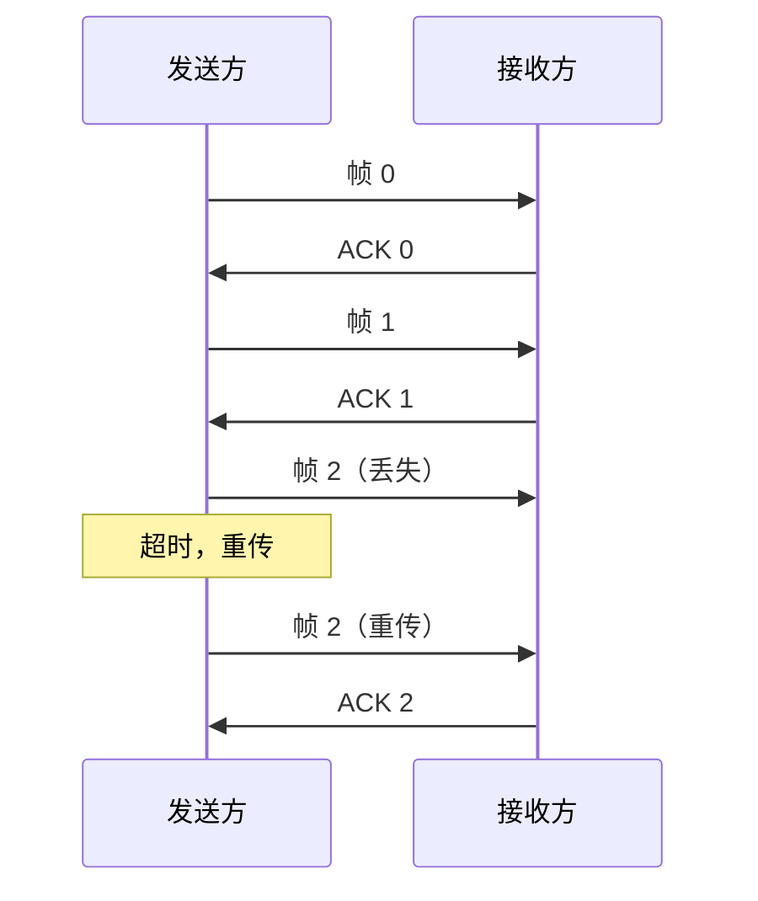
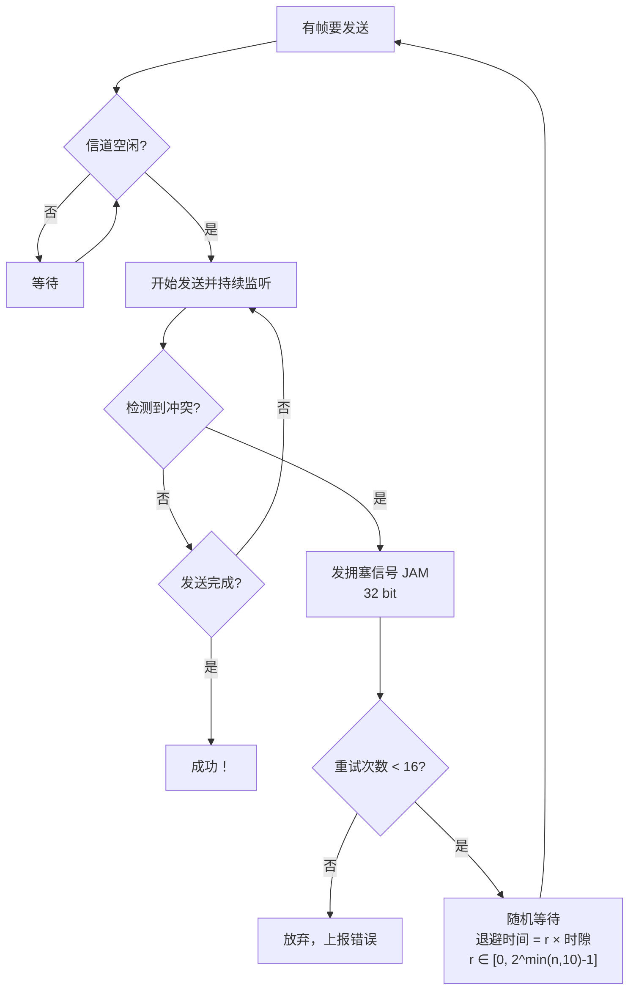
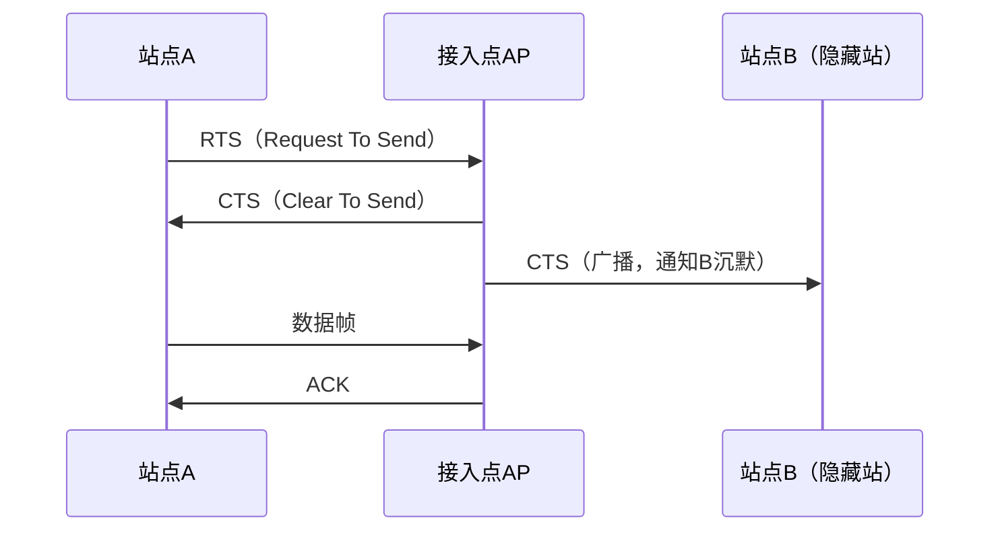
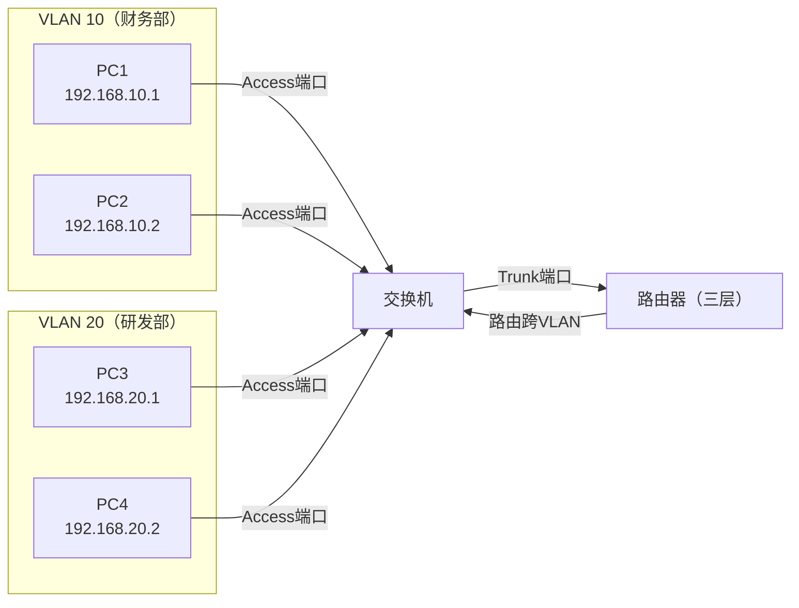
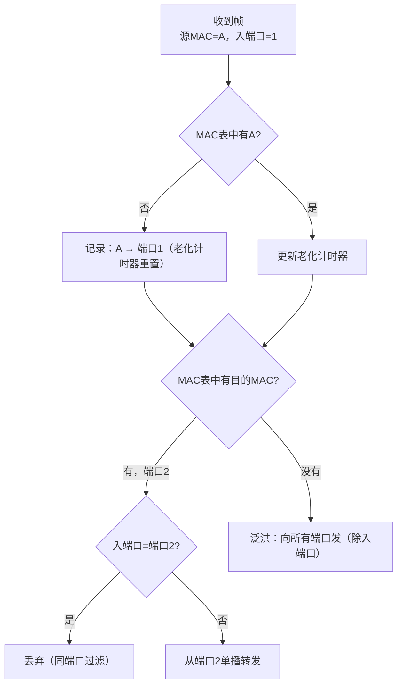
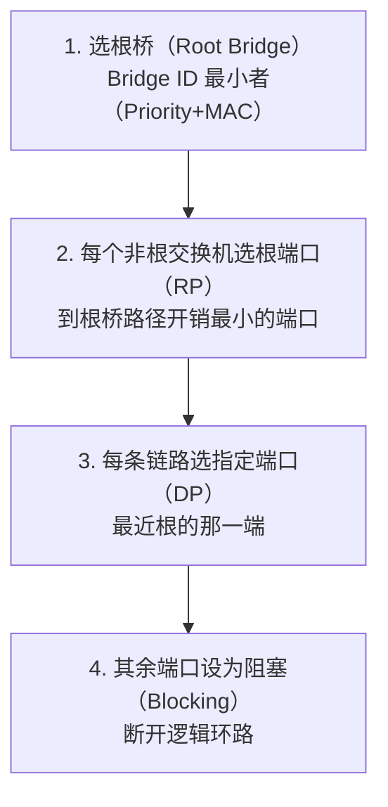
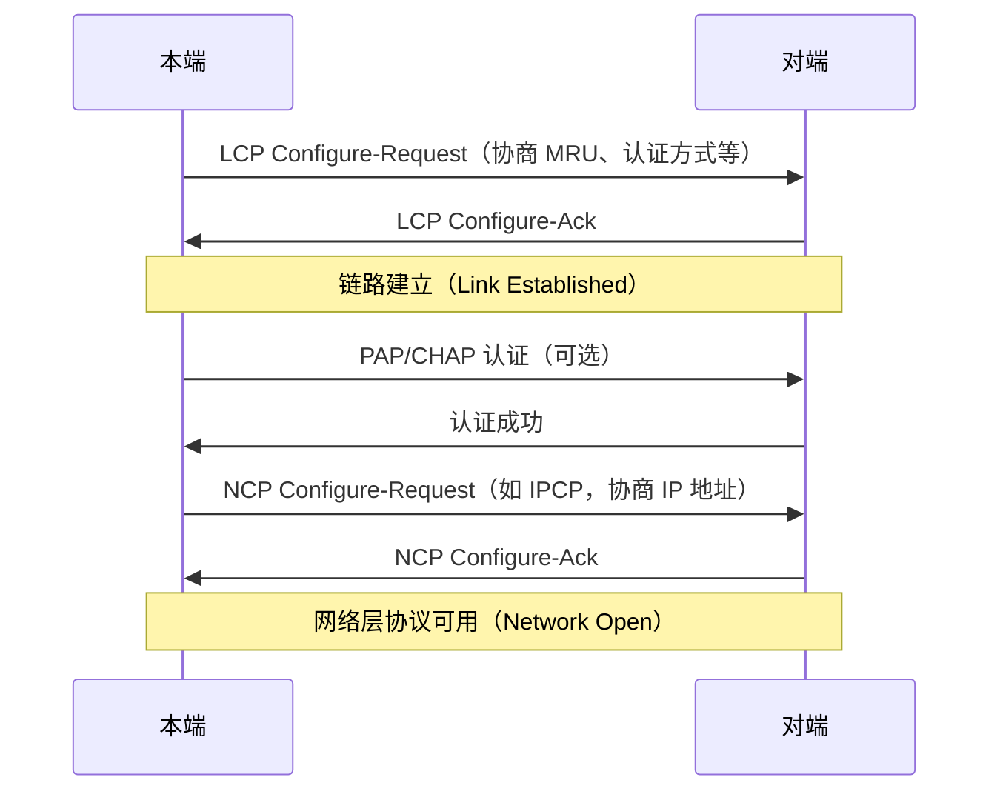

# 详解网络协议(四)数据链路层

> [!abstract] 速览
> **数据链路层（Data Link Layer）** 是 OSI 第 2 层，职责是把 [[03.物理层]] 的裸比特流组织成**帧（Frame）**，在**同一条链路 / 局域网内**用 **MAC 地址**寻址，并提供**成帧、差错检测、流量控制、介质访问控制**。分 **LLC** 与 **MAC** 两个子层。
> PDU：**帧**。点睛：**MAC 管"同一链路内的下一跳"，[[11.IP协议|IP]] 管"跨越互联网的端到端"。**

## 1. 核心职责

物理层只保证"尽量把比特送到对面"，但比特可能出错、且没有边界。数据链路层在其上补三件事：

- **成帧（Framing）**：给比特流划边界，封装成一个个帧，接收方才知道一帧从哪开始、到哪结束。
- **差错检测**：帧尾带 **CRC（循环冗余校验）**，接收方重算比对，出错就**丢弃**（以太网只检错不纠错，纠错靠上层重传）。
- **介质访问控制（MAC）**：多设备共享介质时，决定"谁什么时候能发"，避免或处理冲突。

完整职责体系：

| 职责 | 具体机制 | 关键词 |
| --- | --- | --- |
| 成帧 | 字符计数、字节填充、比特填充、编码违例 | Framing |
| 差错控制 | CRC 检错、海明码纠错、ARQ 重传 | Error Control |
| 流量控制 | 停止-等待、滑动窗口 | Flow Control |
| 介质访问控制 | 信道划分、随机访问、轮流访问 | MAC |
| 寻址 | MAC 地址（48 bit） | Addressing |

## 2. 两个子层

| 子层 | 全称 | 职责 | 标准 |
| --- | --- | --- | --- |
| **LLC** | 逻辑链路控制 | 向上层（网络层）提供统一接口、复用多种网络层协议 | IEEE 802.2 |
| **MAC** | 介质访问控制 | 管 MAC 地址、控制介质访问（如 CSMA/CD） | IEEE 802.3 等 |

> [!tip] 口诀
> **LLC 朝上连网络层，MAC 朝下碰物理线。** LLC 负责"协议复用"，让以太网帧既能载 IPv4 也能载 IPv6；MAC 负责"抢频道"，决定谁先发。

## 3. 成帧方法

成帧（Framing）解决"一帧在哪开始、在哪结束"的边界问题。共有四种主流方法：

### 3.1 字符计数法（Character Count）

在帧头用一个字段记录本帧的**总字节数**（含该计数字段本身）。接收方读到这个数字后，往后数相应字节即为一帧。

**致命缺陷**：若计数字段本身出错（如 5 变成 7），接收方的边界就错位，后续所有帧都会失步，恢复极难。现代协议几乎不单独使用。

### 3.2 字节填充法（Byte Stuffing / Character Stuffing）

用特殊字节作**定界符（Flag）**标记帧的开始与结束。数据中如果出现与定界符相同的字节，就在前面插入一个**转义字节（ESC）**。

**PPP 协议示例**（RFC 1662）：

| 特殊字节 | 十六进制 | 作用 |
| --- | --- | --- |
| `FLAG` | `0x7E` | 帧开始 / 结束定界符 |
| `ESC` | `0x7D` | 转义前缀 |

转义规则：
- 数据中出现 `0x7E` → 替换为 `0x7D 0x5E`（`0x5E = 0x7E XOR 0x20`）
- 数据中出现 `0x7D` → 替换为 `0x7D 0x5D`（`0x5D = 0x7D XOR 0x20`）

```
原始数据：  ... 0x7E 0xAB 0x7D 0xCD ...
填充后：    ... 0x7D 0x5E 0xAB 0x7D 0x5D 0xCD ...
```

**缺点**：仅适用于面向字节的协议；若数据含大量特殊字节，帧会膨胀。

### 3.3 比特填充法（Bit Stuffing）

面向比特的协议（如 **HDLC**、PPP 异步模式）用**标志序列 `01111110`**（即 `0x7E`）定界。为防止数据中出现同样的 6 个连续 1，发送方在**数据中每遇到连续 5 个 `1`，就插入一个 `0`**；接收方看到连续 5 个 `1` 后，若下一位是 `0` 就删除它（数据），若是 `1` 则视为标志。

```
原始比特：  0 1 1 1 1 1 1 0 1 0
填充后：    0 1 1 1 1 1 [0] 1 0 1 0   ← 第6个1前插入0
```

**优点**：与具体字节值无关，适用于任意二进制数据（透明传输）；帧开始/结束对齐在比特级别。

### 3.4 物理层编码违例法（Physical Layer Coding Violation）

利用物理层编码规则中**不会正常出现的码型**来标记帧边界。例如曼彻斯特编码中，每个比特周期必然有跳变，"无跳变"就是非法码，可用于标记帧开始/结束。**无需在数据中插入任何额外字节**，开销为零。

以太网前导码 + SFD（`10101011`）就借助了物理编码特征来同步。

### 3.5 四种方法对比

| 方法 | 边界标记 | 透明性 | 典型协议 | 主要缺点 |
| --- | --- | --- | --- | --- |
| 字符计数 | 计数字段 | 好 | 早期协议 | 计数出错即失步 |
| 字节填充 | `FLAG` 字节 + `ESC` | 面向字节 | PPP（同步） | 仅字节流；数据膨胀 |
| 比特填充 | `01111110` + 插 0 | 任意比特 | HDLC、PPP | 略增实现复杂度 |
| 编码违例 | 非法物理码型 | 任意 | 以太网 | 依赖物理层编码 |

## 4. 差错控制

### 4.1 检错 vs 纠错

| 能力 | 原理 | 典型方法 | 代价 |
| --- | --- | --- | --- |
| **检错（Error Detection）** | 接收方能判断"帧是否出错" | 奇偶校验、CRC、校验和 | 冗余位少；出错只能丢弃或重传 |
| **纠错（Error Correction）** | 接收方能判断"哪些位出错并自动修复" | 海明码（Hamming Code）、Reed-Solomon、Turbo 码 | 冗余位多；无需重传（适合单向/高延迟链路） |

> [!tip] 口诀
> **检错便宜能发现，纠错贵重能自愈。** 有线以太网误码率低，用 CRC 检错 + ARQ 重传足够；卫星/深空探测等高延迟、单向链路才大量使用 FEC 纠错。

### 4.2 奇偶校验（Parity Check）

在数据后追加 1 位奇偶位，使全部比特中 `1` 的个数为奇数（奇校验）或偶数（偶校验）。

- **优点**：极简，1 bit 开销。
- **缺点**：只能检出**奇数位**出错；若同时翻转 2 bit，奇偶不变，漏检。
- **二维奇偶校验（Checkered Parity）**：对行和列都做校验，可检出所有 1、2、3 位错，并能纠正 1 位错。

### 4.3 CRC（循环冗余校验）

CRC 是数据链路层最主流的检错手段。以太网 FCS 字段就是 **CRC-32**（生成多项式 `G(x) = x³² + x²⁶ + x²³ + x²² + x¹⁶ + x¹² + x¹¹ + x¹⁰ + x⁸ + x⁷ + x⁵ + x⁴ + x² + x + 1`）。

**核心思想**：把帧数据看作一个二进制多项式 `M(x)`，用约定的**生成多项式 `G(x)`** 去除（模 2 除法，无借位/进位），余数就是 **FCS（帧校验序列）**，附在帧尾发出。接收方用同样的 `G(x)` 去除收到的整帧（含 FCS），若余数为 0 则认为正确。

**模 2 运算规则**：加法 = XOR，乘法 = AND，无借位、无进位。

**小例子**（生成多项式 `G(x) = x³ + x + 1`，即 `1011`，数据 `M = 101100`）：

1. 数据后补 3 个 0（`G(x)` 阶数为 3）：`101100 000`
2. 模 2 除以 `1011`：

```
101100000 ÷ 1011
1011
────
  001000
    1011
    ────
    0011 0
      1011
      ────
      0010  ← 余数（FCS）= 010
```

3. 发送帧：`101100 010`（原数据 + FCS）
4. 接收方用 `1011` 除 `101100010`，若余数为 0 则正确。

**检错能力**：
- 检出所有**单位错**
- 检出所有**双位错**（若多项式含 `x+1` 因子）
- 检出所有**奇数位错**（若多项式含 `x+1` 因子）
- 检出所有**突发错误**（长度 ≤ `G(x)` 的阶数）

CRC-32 在以太网上实践中误检率极低（约 `2⁻³²`）。

### 4.4 海明码（Hamming Code）与 FEC

**海明距离（Hamming Distance）**：两个编码字中不同位的数量。若最小汉明距离为 `d`，则：
- 能检出 `d-1` 位错
- 能纠正 `⌊(d-1)/2⌋` 位错

**海明码**在数据位中**插入校验位**（位置为 2 的幂次：1、2、4、8……），每个校验位覆盖特定数据位，使得发生单位错时，错误位的编号可直接从校验结果算出。

| 数据位数 `k` | 最少校验位数 `r`（满足 `2ʳ ≥ k + r + 1`） |
| --- | --- |
| 1 | 2 |
| 4 | 3 |
| 11 | 4 |
| 26 | 5 |

**FEC（前向纠错，Forward Error Correction）**：发送端提前编入足够冗余，接收端无需重传即可自行纠错。Wi-Fi、光纤、蓝牙、卫星通信广泛使用 Reed-Solomon、LDPC、Turbo 等 FEC 编码。

### 4.5 以太网的差错策略

以太网属于**"只检错、不纠错"**的设计：
- 接收方的 NIC 验算 CRC-32，出错直接**静默丢弃**（不发 NACK）。
- 上层协议（TCP）负责超时重传，最终保证可靠性。
- **理由**：以太网以太传输环境下误码率极低，FEC 引入的冗余开销不划算；且有线环境出错多因严重干扰，纠错码也救不了。

## 5. 流量控制与 ARQ

### 5.1 为何需要流量控制

发送方速率 > 接收方处理速率 → 接收缓冲区溢出 → 帧丢失。流量控制让发送方"节流"，不要超出接收方能力。

### 5.2 停止-等待协议（Stop-and-Wait）

每发一帧就**停下来等 ACK**，收到 ACK 再发下一帧。



- **优点**：简单，实现容易。
- **缺点**：信道利用率极低。若传播延迟为 `Tp`，帧发送时间为 `Tf`，信道利用率 `U = Tf / (Tf + 2Tp)`。长距离高速链路上 `Tp ≫ Tf`，`U` 趋近于 0。

### 5.3 滑动窗口协议（Sliding Window）

允许发送方在未收到 ACK 的情况下，连续发送最多 **W 帧**（窗口大小）。接收方对收到的帧进行**累计确认（Cumulative ACK）**。

```
发送窗口（W=4）：
帧编号：  0  1  2  3  4  5  6
          [已确认][已发未确认][可发][不可发]
                  └───W=4──┘
```

- **信道利用率**：`U = W × Tf / (Tf + 2Tp)`，W 足够大时可达 100%。
- **窗口大小 W** 由**接收方缓冲区**（流量控制）和**网络拥塞**（拥塞控制）共同约束。

### 5.4 ARQ（自动重传请求）三类协议

ARQ（Automatic Repeat reQuest）是差错控制与流量控制的结合：出错帧自动触发重传。

| 协议 | 发送窗口 W | 接收窗口 | 出错时重传 | 信道利用率 | 接收方缓冲 |
| --- | --- | --- | --- | --- | --- |
| **停等 ARQ（SAW）** | 1 | 1 | 重传 1 帧 | 低 | 最小 |
| **回退 N 帧（GBN）** | N | 1 | 重传出错帧及其后所有帧 | 中等 | 1 帧 |
| **选择重传（SR）** | ≤ 2^(n-1) | ≤ 2^(n-1) | 仅重传出错帧 | 高 | 较大 |

> [!note] GBN vs SR 核心区别
> **GBN（Go-Back-N）**：接收方只维护 1 个缓冲位，乱序到达的帧全部丢弃、等待重传，实现简单但带宽浪费。
> **SR（Selective Repeat）**：接收方可缓存乱序帧，只请求重传丢失的那一帧，带宽利用率高，但接收方需要更大缓冲区和更复杂的重组逻辑。

**序号位数限制**（n 位序号，序号范围 `0 ~ 2ⁿ-1`）：
- GBN：发送窗口 W ≤ `2ⁿ - 1`（留 1 个序号防歧义）
- SR：发送/接收窗口 W ≤ `2^(n-1)`（各留一半防歧义）

## 6. 介质访问控制（MAC）

多设备共享同一物理介质时，需要协调"谁什么时候发"。三大类方法：

### 6.1 信道划分（Channel Partitioning）

预先把信道资源静态分给各用户，**无冲突**，但资源利用率固定。

| 方法 | 全称 | 划分维度 | 特点 |
| --- | --- | --- | --- |
| **FDMA** | 频分多路复用 | 频率 | 各用户占不同频段；同时发送；模拟/数字均可 |
| **TDMA** | 时分多路复用 | 时间 | 各用户占不同时隙；轮流发送；数字为主 |
| **CDMA** | 码分多路复用 | 码字（扩频序列） | 各用户使用正交码；同时同频发；抗干扰强（3G/4G LTE） |
| **WDMA** | 波分多路复用 | 光波长 | 光纤专用，等同于光域 FDMA |

**适用场景**：用户数量固定、每个用户持续有数据发送时效率最高。若用户间歇性发送，分配到的时隙/频段会大量空闲，**利用率低**。

### 6.2 随机访问（Random Access）

不预先分配，需要时就发；冲突后用随机退避重试。利用率高但需处理冲突。

#### ALOHA 协议

- **纯 ALOHA**：有帧即发，冲突后随机等待再重发。最大吞吐 `S ≈ 0.184`（约 18.4%）。
- **时隙 ALOHA**：只在时隙开始时发帧，冲突概率减半。最大吞吐 `S ≈ 0.368`（约 36.8%）。

#### CSMA（载波侦听多路访问）

发前先**侦听信道（Carrier Sense）**：
- **1-坚持 CSMA**：信道忙则等，空闲立刻发。积极但冲突概率高。
- **非坚持 CSMA**：信道忙则随机等一段时间后再听。冲突少但延迟大。
- **p-坚持 CSMA**：信道空闲以概率 `p` 发送，以 `1-p` 推迟一个时隙。折中方案。

#### CSMA/CD（冲突检测）—— 有线以太网

**Carrier Sense Multiple Access with Collision Detection**：在 CSMA 基础上增加**边发边听**，检测到冲突立即停止并强化冲突信号。



**二进制指数退避（Binary Exponential Backoff）**：

第 `n` 次碰撞后，从 `[0, 2^min(n,10) - 1]` 中随机取整数 `r`，等待 `r × 时隙时间`（以太网时隙 = 512 bit 时间 = 51.2 μs，即最小帧发送时间）。

| 碰撞次数 `n` | 候选值范围 | 最大退避时隙 |
| --- | --- | --- |
| 1 | 0 ∼ 1 | 1 |
| 2 | 0 ∼ 3 | 3 |
| 3 | 0 ∼ 7 | 7 |
| 10 | 0 ∼ 1023 | 1023 |
| 11～15 | 0 ∼ 1023 | 1023（上限封顶） |
| 16 | — | 放弃 |

**CSMA/CD 必要条件**：发送方在发完最后一位前就能检测到冲突。这要求**最小帧长**满足：`Tf ≥ 2Tp`（帧发送时间 ≥ 2 倍传播时延）。以太网规定最小帧长 64 字节（512 bit），对应 100 m 内的网段长度限制。

> [!warning] CSMA/CD 仅用于半双工
> 现代全双工以太网（交换机点对点链路）每条链路只有一个发送方，**不存在冲突**，CSMA/CD 不再运行，链路利用率可达理论最大值。

#### CSMA/CA（冲突避免）—— 无线 Wi-Fi

无线介质**无法边发边听**（自己的信号淹没对方），改为**事先预约**：

1. **DCF（分布式协调功能）** —— 基础模式：
   - 发前等信道空闲 **DIFS**（DCF 帧间间隔）时长。
   - 执行**随机退避**（退避计时器归零才发）。
   - 若发生冲突，等待 **DIFS + 退避** 后重试。

2. **RTS/CTS 握手**（解决隐藏站问题）：



   - **RTS** 包含发送时长，周围所有站点据此设置 **NAV（网络分配向量）** 推迟发送。
   - **SIFS**（短帧间间隔）< **DIFS**，ACK/CTS 优先级高于数据帧。

### 6.3 轮流访问（Taking Turns）

轮流控制发送权，无冲突、公平，适合负载均衡场景。

| 方法 | 原理 | 优点 | 缺点 |
| --- | --- | --- | --- |
| **轮询（Polling）** | 主节点轮流邀请从节点发送 | 无冲突，可控延迟 | 主节点单点故障；轮询开销 |
| **令牌传递（Token Passing）** | 持令牌者才能发帧，发完传给下家 | 无冲突，公平，适合高负载 | 令牌丢失/重复需恢复机制 |

令牌环（Token Ring，IEEE 802.5）和 FDDI 使用令牌传递，但已被以太网基本取代。工业控制领域（PROFIBUS 等）仍广泛使用令牌机制。

## 7. 以太网帧结构详解

### 7.1 DIX Ethernet II vs IEEE 802.3

两种帧格式至今并存，区别在于"类型/长度"字段含义：

| 字段位置 | Ethernet II（DIX） | IEEE 802.3 |
| --- | --- | --- |
| 前导码 + SFD | 7 + 1 字节（同） | 7 + 1 字节（同） |
| 目的/源 MAC | 6 + 6 字节（同） | 6 + 6 字节（同） |
| **类型/长度字段** | **Type（2 字节）**：值 > 1500（0x05DC），表示上层协议 | **Length（2 字节）**：值 ≤ 1500，表示数据字段字节数；后跟 LLC 子层头 |
| 数据/载荷 | 46 ∼ 1500 字节 | 46 ∼ 1500 字节（含 LLC 头 3 字节后，净数据 43～1497 字节） |
| FCS | 4 字节 CRC-32（同） | 4 字节 CRC-32（同） |

**区分规则**（IEEE 802.3-2022 已标准化）：
- 字段值 **> 1500**（`0x0600` 以上）→ **Type**，表示上层协议（如 `0x0800` = IPv4，`0x86DD` = IPv6，`0x0806` = ARP，`0x8100` = VLAN Tag）。
- 字段值 **≤ 1500** → **Length**，表示 802.3 帧数据长度。

现代 IP 网络几乎只用 **Ethernet II**（Type 字段）。

### 7.2 完整帧结构（Ethernet II）

| 字段 | 长度 | 作用 |
| --- | --- | --- |
| 前导码（Preamble） | 7 字节 | `0xAA...AA`（`10101010` 重复），用于接收方 PLL 时钟同步 |
| 帧起始符 SFD | 1 字节 | `0xAB`（`10101011`），最后两个 `11` 标志帧数据开始 |
| 目的 MAC | 6 字节 | 接收方物理地址 |
| 源 MAC | 6 字节 | 发送方物理地址 |
| 类型（Type） | 2 字节 | 上层协议标识 |
| 数据（Payload） | 46 ∼ 1500 字节 | 网络层的包；不足 46 字节填充 0 到最小长度 |
| FCS（CRC-32） | 4 字节 | 帧校验序列，检错 |

> [!note] 前导码与 SFD 是否计入帧长？
> 通常说以太网帧最小 **64 字节、最大 1518 字节**，**不含**前导码和 SFD（这 8 字节由物理层处理，驱动层不感知）。含 VLAN Tag 时最大 **1522 字节**。

### 7.3 帧间隙（IFG）

连续两帧之间，发送方必须等待至少 **96 bit 时间**（在 1 Gbps 以太网上为 96 ns）的空闲时间，称为 **IFG（InterFrame Gap）**。作用：让接收方恢复、避免连续帧粘在一起导致解析错误。

### 7.4 最小帧与最大帧

| 限制 | 值 | 原因 |
| --- | --- | --- |
| 最小帧长 | **64 字节**（含 MAC 头、FCS） | 保证 CSMA/CD 发送期间能检测到最远冲突（`Tf ≥ 2Tp`） |
| 最小载荷 | **46 字节**（不足则填充 PAD） | 64 - 14（头）- 4（FCS）= 46 |
| 最大帧长 | **1518 字节**（不含 VLAN Tag）/ **1522 字节**（含 4 字节 VLAN Tag） | 防止单帧占用信道过长；限定 MTU = 1500 字节 |
| 巨型帧（Jumbo Frame） | **9000 字节**（非标准，但广泛支持） | 减少大文件传输中的帧数/帧头开销；需链路两端都配置支持 |

**Jumbo Frame** 常用于数据中心存储网络（iSCSI、NFS over 10GbE），可降低 CPU 中断频率、提升吞吐。但中途有不支持 Jumbo Frame 的设备就会被分片或丢弃，需谨慎规划。

## 8. MAC 地址详解

- **48 bit（6 字节）**，常写成 `AA:BB:CC:DD:EE:FF`（冒号分隔）或 `AA-BB-CC-DD-EE-FF`（中划线）或 `AABB.CCDD.EEFF`（Cisco 风格）。
- **OUI（厂商标识符）**：前 24 位由 IEEE 分配给各厂商；后 24 位厂商自行分配。
- **第 1 字节的第 0 位（LSB）**：0 = 单播，1 = 组播（含广播）。
- **第 1 字节的第 1 位**：0 = 全局唯一（烧录 OUI），1 = 本地管理（软件修改）。

| 地址类型 | 示例 | 说明 |
| --- | --- | --- |
| 单播 | `00:1A:2B:3C:4D:5E` | 发给单个接口 |
| 广播 | `FF:FF:FF:FF:FF:FF` | 发给本网段**所有**设备 |
| 组播 | `01:00:5E:xx:xx:xx`（IPv4 组播） | 发给订阅了该组播组的设备 |

MAC 地址烧录在网卡 ROM，但**可被软件伪造**（MAC Spoofing），不能用于强认证。

## 9. 介质访问控制（加深版已在第 6 节，本节补充以太网 MAC 发展）

（本节见第 6 节完整内容，此处不重复。）

## 10. VLAN 与 IEEE 802.1Q

### 10.1 为何需要 VLAN

交换机默认一个广播域：任何 ARP 请求、DHCP 发现等广播帧，会泛洪到所有端口。设备越多，广播风暴风险越高，安全性越低。

**VLAN（Virtual LAN）** 在一台或多台物理交换机上划分**多个逻辑广播域**：同一 VLAN 内可二层通信，跨 VLAN 需经路由器（或三层交换机）。

### 10.2 802.1Q Tag 格式

在以太网帧的源 MAC 之后、类型字段之前插入 **4 字节 VLAN Tag**：

```
+--------+--------+--------+--------+--------+--------+
| 目的MAC（6B）  | 源MAC（6B）    | 802.1Q Tag（4B）| Type/Len ...
+--------+--------+--------+--------+--------+--------+

802.1Q Tag 详细：
 15      12 11  10  9     0
+----------+----+---+--------+
| TPID(16) | PCP(3) \| DEI(1) \| VID(12) |
+----------+----+---+--------+
```

| 子字段 | 位数 | 含义 |
| --- | --- | --- |
| **TPID** | 16 bit | Tag 协议标识符，固定为 `0x8100`，表示这是 802.1Q 帧 |
| **PCP** | 3 bit | 优先级代码点（Priority Code Point），0～7，用于 QoS（CoS） |
| **DEI** | 1 bit | 丢弃合适指示（Drop Eligible Indicator），拥塞时优先丢弃标记为 1 的帧 |
| **VID** | 12 bit | VLAN ID，范围 `0～4095`；0 和 4095 保留；**有效 VLAN ID：1～4094** |

含 VLAN Tag 的帧最大长度变为 **1522 字节**（原 1518 + 4 字节 Tag）。

### 10.3 Access 端口 vs Trunk 端口

| 端口类型 | 场景 | 行为 |
| --- | --- | --- |
| **Access（接入）端口** | 连接终端设备（PC、服务器） | 发出帧时**去掉**Tag（终端不感知 VLAN）；收到帧时**打上**本端口所属 VLAN 的 Tag |
| **Trunk（干道）端口** | 连接交换机之间 / 交换机到路由器 | 发出帧时**保留**Tag（携带 VID 信息）；允许多个 VLAN 的帧在同一物理链路上传输 |
| **Hybrid 端口**（部分厂商） | 灵活配置 | 可对某些 VLAN 发出有 Tag 的帧，对其他 VLAN 去 Tag |

**Native VLAN**：Trunk 端口上有一个"原生 VLAN"（Cisco 默认 VLAN 1），属于 Native VLAN 的帧**不打 Tag** 就在 Trunk 上传输。双端 Native VLAN 必须一致，否则 VLAN 跳跃攻击风险。

### 10.4 QinQ（IEEE 802.1ad）

在运营商网络中，为区分不同客户的 VLAN，在客户 802.1Q Tag 外面再套一层运营商 Tag：

```
外层 Tag（S-Tag，TPID=0x88A8）+ 内层 Tag（C-Tag，TPID=0x8100）+ 原始载荷
```

允许 VID 空间扩展：外层 4094 × 内层 4094 ≈ 1600 万个 VLAN，满足大规模多租户场景。

### 10.5 VLAN 隔离广播域示例



VLAN 10 的广播帧不会传到 VLAN 20，安全隔离；跨 VLAN 通信需经路由器或三层交换机。

## 11. 二层设备详解

### 11.1 交换机工作原理

交换机（Switch）是现代局域网的核心设备，每个端口独立冲突域，按 MAC 地址转发帧。

**自学习（Self-Learning）过程**：



**四种转发动作**：

| 动作 | 触发条件 | 说明 |
| --- | --- | --- |
| **转发（Forward）** | 目的 MAC 在 MAC 表中，且与入端口不同 | 从目标端口发出 |
| **泛洪（Flood）** | 目的 MAC 不在 MAC 表中，或目的 = 广播/组播 | 向除入端口外所有端口发 |
| **过滤（Filter）** | 目的 MAC 在 MAC 表中，但与入端口相同 | 源和目的在同一网段，丢弃 |
| **老化（Aging）** | MAC 表条目超过老化时间（默认 300 秒）未活动 | 从 MAC 表删除，下次再泛洪学习 |

### 11.2 冲突域 vs 广播域

| 设备 | 冲突域 | 广播域 |
| --- | --- | --- |
| **集线器（Hub）** | 所有端口共享 1 个 | 所有端口共享 1 个 |
| **网桥（Bridge）** | 每个端口独立 | 所有端口共享 1 个 |
| **交换机（Switch）** | 每个端口独立 | 默认全机 1 个（VLAN 可隔离） |
| **路由器（Router）** | 每个端口独立 | 每个端口独立（三层隔离） |

> [!tip] 口诀
> **交换机隔冲突、不隔广播；路由器冲突广播都隔。** 要隔广播域，不加路由器就用 VLAN。

### 11.3 生成树协议 STP/RSTP/MSTP

**问题：** 为了冗余，网络中常设置多条路径；但多路径在二层会造成**广播风暴**（帧在环路中无限循环）和 MAC 表翻动。

**STP（Spanning Tree Protocol，IEEE 802.1D）** 通过选举，逻辑上**阻断冗余链路**，保留一棵无环的生成树。

**STP 选举过程**：



**STP 端口状态**（传统 802.1D）：Blocking → Listening（15s）→ Learning（15s）→ Forwarding，总收敛时间约 **50 秒**，切换缓慢。

**RSTP（Rapid STP，IEEE 802.1w）**：引入 Proposal/Agreement 握手机制，收敛时间降至 **1～2 秒**，是目前主流。

**MSTP（Multiple STP，IEEE 802.1s）**：多实例 STP，不同 VLAN 可运行不同 STP 实例，实现负载均衡（VLAN 10 走链路 A 为主，VLAN 20 走链路 B 为主）。

**STP 关键参数**：

| 参数 | 默认值 | 说明 |
| --- | --- | --- |
| Bridge Priority | 32768 | 越小越优先成为根桥 |
| Path Cost（1G 链路） | 4 | 链路速率越快开销越低 |
| Hello Time | 2 秒 | 根桥发送 BPDU 的周期 |
| Forward Delay | 15 秒 | Listening/Learning 各持续时间 |
| Max Age | 20 秒 | BPDU 最大老化时间 |

### 11.4 链路聚合（LACP / 802.3ad）

将**多条物理链路捆绑**为一条逻辑链路，提升带宽与冗余。

**LACP（Link Aggregation Control Protocol，IEEE 802.3ad/802.1ax）** 动态协商聚合，自动检测并恢复故障成员链路。

- **LAG（Link Aggregation Group）** / **Port-Channel** / **Bond**：逻辑聚合口。
- **负载分担（Load Balancing）**：按源/目的 MAC、IP、端口等哈希到成员链路。
- **故障切换**：一条成员链路故障，流量自动转到其他成员，**秒级**恢复（比 STP 快）。

典型场景：服务器双网卡 Bond、交换机上行 Trunk、数据中心核心交换机互联。

## 12. PPP 协议

### 12.1 PPP 概述

**PPP（Point-to-Point Protocol，RFC 1661）** 是最常用的点对点链路协议，运行于拨号线路、DSL、SONET/SDH 等广域网链路。它解决了 HDLC 等协议只面向单一网络层协议的局限。

PPP 帧格式：

```
+------+------+------+------+--------+------+------+
| Flag | Addr | Ctrl | Protocol | Data | FCS | Flag |
| 0x7E | 0xFF | 0x03 |  2字节   |      | 2/4 | 0x7E |
+------+------+------+------+--------+------+------+
```

| 字段 | 值 | 说明 |
| --- | --- | --- |
| Flag | `0x7E` | 帧定界符 |
| Address | `0xFF` | 广播地址（点对点链路无实际意义） |
| Control | `0x03` | 无编号帧（UI） |
| Protocol | 如 `0x0021`=IP，`0xC021`=LCP | 上层协议标识 |
| Data | 可变 | 载荷 |
| FCS | 2 或 4 字节 | CRC 校验 |

### 12.2 LCP 与 NCP

PPP 建链分两个阶段：



- **LCP（链路控制协议）**：协商链路参数（最大接收单元 MRU、认证方式、压缩等），建立/测试/释放物理链路。
- **NCP（网络控制协议）**：为不同网络层协议各自有一个 NCP（如 **IPCP** 配置 IP 地址，**IPv6CP** 配置 IPv6）。

### 12.3 PPP 认证

| 协议 | 全称 | 机制 | 安全性 |
| --- | --- | --- | --- |
| **PAP** | Password Authentication Protocol | 明文发送用户名+密码；两次握手 | 低（可被截获） |
| **CHAP** | Challenge Handshake Authentication Protocol | 三次握手；服务器发挑战值，客户端用密码 MD5 哈希响应；**密码不在网上传输** | 中等（防重放） |

**CHAP 流程**：
1. 服务器→客户端：`Challenge`（随机值 + ID）
2. 客户端→服务器：`Response`（MD5(ID + 密码 + 随机值)）
3. 服务器→客户端：`Success` 或 `Failure`

### 12.4 PPPoE

**PPPoE（PPP over Ethernet，RFC 2516）** 把 PPP 封装在以太网帧里，常用于 ADSL/光猫宽带接入（家用"宽带拨号"）。

TPID = `0x8863`（发现阶段）/ `0x8864`（会话阶段）。

- **发现阶段**：客户端广播 PADI，服务器响应 PADO，协商建立 Session ID。
- **会话阶段**：用 Session ID 封装 PPP 帧，进行 LCP/NCP/数据传输。
- **应用**：电信宽带（PPPoE + IPCP 获取公网 IP），家用路由器的 WAN 口配置。

## 13. 常见误区与面试陷阱

> [!warning] 常见误区

**1. 交换机隔离冲突域，但不隔离广播域**

交换机每个端口是独立冲突域（全双工点对点，根本无冲突），但广播帧默认泛洪到所有端口。要隔离广播域，需 VLAN 或路由器（三层）。

**2. 全双工以太网没有冲突，不需要 CSMA/CD**

CSMA/CD 仅在半双工共享介质（如集线器连接的老式以太网）下才生效。现代交换机接入的全双工链路无冲突，CSMA/CD 不运行，但最小帧长限制仍保留（为兼容性）。

**3. MAC 可被伪造，不能做强认证**

MAC 是烧录在网卡里的，但操作系统可轻易修改（MAC Spoofing）。仅凭 MAC 做准入控制（如 MAC 白名单）安全性很低，应结合 802.1X 端口认证。

**4. MTU 1500 字节是以太网的数据载荷上限，不含帧头**

1518 字节是以太网帧最大总长（含 14 字节 MAC 头 + 4 字节 FCS），**净载荷（MTU）= 1500 字节**。IP 包 > 1500 字节时需在 IP 层分片，链路层不分片。

**5. ARP 是二层还是三层？**

ARP（RFC 826）工作在**二层与三层之间的边界**——它使用以太网帧传输（Type = `0x0806`），但查询的是 IP 到 MAC 的映射，常被归为"二层半"或"网络层辅助协议"。

**6. STP 收敛慢的根本原因**

802.1D STP 的 Listening + Learning 各等 15 秒（Forward Delay），是为等待 BPDU 传播和 MAC 表稳定。RSTP 改用主动握手（Proposal/Agreement），点对点链路上可**立即**切换，不依赖计时器。

**7. VLAN 不等于子网，但通常一一对应**

VLAN 是二层概念（隔离广播域），IP 子网是三层概念（逻辑地址范围）。实践中通常一个 VLAN 对应一个 IP 子网，但这不是技术强制，而是管理惯例。

**8. 停等 ARQ 信道利用率极低**

链路带宽 1 Gbps，RTT = 100 ms，最大帧 1500 字节（12000 bit）：`U = 12000 / (12000 + 100,000,000) ≈ 0.012%`。必须用滑动窗口才能充分利用高带宽长延迟链路。

**9. CRC 只检错，不纠错，且不防篡改**

CRC 能极高概率检出随机误码，但**不能定位错误位，故不能纠错**。且 CRC 不是密码学哈希，攻击者可重新计算正确的 CRC 附在篡改的帧后，因此也**不能防篡改**（需 MAC/HMAC 等密码学方法）。

## 延伸阅读

- 下层：[[03.物理层]]（帧 → 比特）
- 上层：[[05.网络层]]（帧载荷里装的是 [[11.IP协议|IP]] 包）
- 寻址对比：MAC（本层，物理/局域）↔ IP（[[05.网络层]]，逻辑/全局）
- 差错控制深入：ARQ → TCP 的可靠传输机制见 [[13.TCP协议]]
- 无线链路层：CSMA/CA → Wi-Fi（IEEE 802.11）详见 [[05.网络层]] 及无线网络专题

> ⬅️ [[03.物理层]] ｜ 🏠 [[00.网络协议详解总览]] ｜ [[05.网络层]] ➡️
