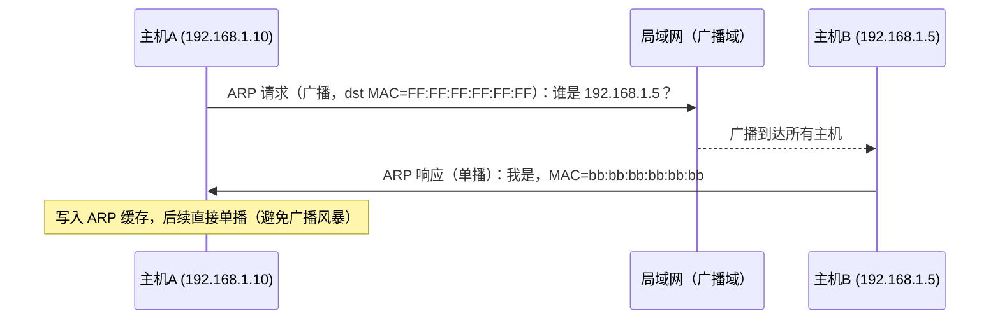
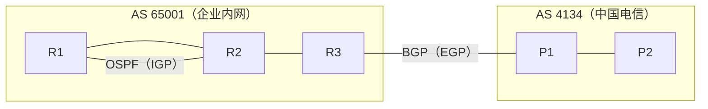
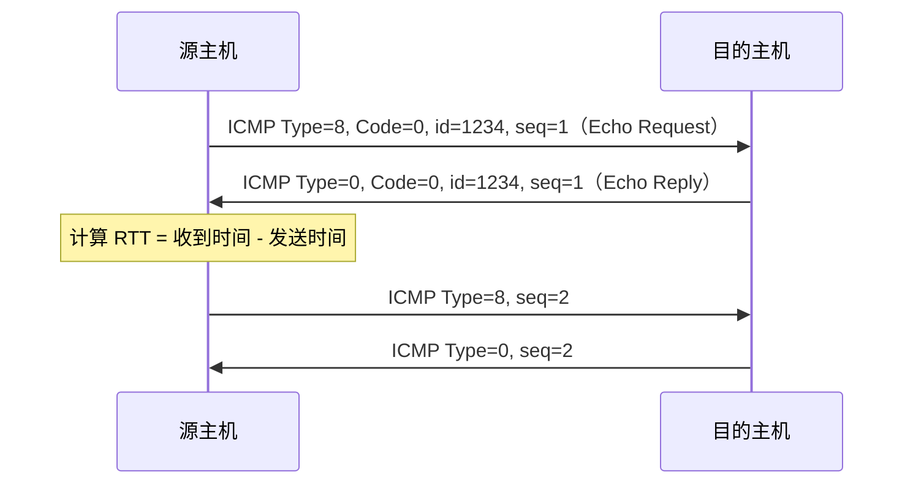
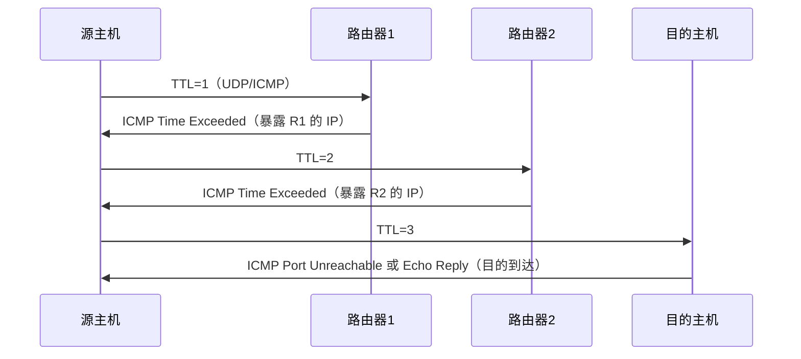

# 详解网络协议(五)网络层

> [!abstract] 速览
> **网络层（Network Layer）** 是 OSI 第 3 层，解决**跨越多个网络**的"从源主机到目的主机"问题：用 **IP 逻辑地址**全局寻址，靠**路由**选路、**逐跳转发**数据包。核心协议 [[11.IP协议|IP]]、ICMP、ARP；核心设备**路由器**。
> PDU：**包（Packet）**。点睛：[[04.数据链路层|链路层]]管"一段链路"，网络层把多段链路**串成端到端的路径**。
> 口诀：**链路管一跳，网络管全程；路由算路径，转发跑数据；ICMP 报差错，ARP 查 MAC，NAT 换地址。**

## 1. 核心职责

- **逻辑寻址**：给每台主机一个全局可路由的 **IP 地址**（详见 [[11.IP协议]]、[[12.支持地址分类和子网划分]]）。
- **路由选择**：在众多可能路径中算出"下一跳"。
- **转发**：根据路由表把包从一个接口送到下一跳。
- **分片与重组**：当包超过链路 MTU 时分片（IPv4）；IPv6 不允许中间节点分片，由源端负责。

## 2. 转发 vs 路由（最容易混的两件事）

| | 路由（Routing） | 转发（Forwarding） |
| --- | --- | --- |
| 平面 | **控制平面**（Control Plane） | **数据平面**（Data Plane） |
| 做什么 | **算**路由表（跑 OSPF/BGP 等协议） | **查**表把包送往下一跳 |
| 频率 | 较慢、周期性或事件驱动 | 每个包都做，硬件级别极快 |
| 执行者 | 路由协议进程（CPU） | 转发引擎（ASIC/FIB） |

> [!tip] 控制平面 vs 数据平面
> SDN（软件定义网络）的核心思想正是将两个平面**解耦**：控制平面集中到外部控制器，数据平面保留在硬件，路由器退化为"哑"的转发设备。

### 2.1 路由表结构

路由器维护一张**路由表（Routing Table）**，每条表项包含：

| 字段 | 含义 | 示例 |
| --- | --- | --- |
| 目的网络（Destination） | 目的地的网络地址 | `192.168.10.0` |
| 子网掩码（Mask） | 结合目的网络确定地址范围 | `255.255.255.0` |
| 下一跳（Next Hop） | 下一个路由器的 IP | `10.0.0.1` |
| 出接口（Interface） | 从哪个本地接口发出 | `eth0` |
| 度量值（Metric） | 路径优先级（越小越优先） | `1`（跳数）或 `100`（cost） |
| 来源（Proto） | 路由来源（静态/OSPF/BGP…） | `OSPF` |

### 2.2 最长前缀匹配（Longest Prefix Match）

路由器查表时不是精确匹配，而是找**掩码最长（最精确）的那条路由**：

```
目的地址：192.168.10.25

路由表：
  192.168.0.0/16   → 出口 A
  192.168.10.0/24  → 出口 B   ← 掩码更长（24>16），优先匹配
  0.0.0.0/0        → 出口 C（默认路由）
```

命中 `192.168.10.0/24`，从出口 B 转发。若没有任何匹配，才走 `0.0.0.0/0` 默认路由。

> [!note] 口诀
> "掩码越长越具体，越具体越优先"。默认路由（`/0`）是最后的兜底。

## 3. 配套协议

| 协议 | 作用 | RFC |
| --- | --- | --- |
| [[11.IP协议\|IP]] | 寻址与逐跳转发（无连接、不可靠） | RFC 791（v4）/ RFC 8200（v6） |
| ICMP | 差错与控制报文（`ping`、`traceroute` 的基础） | RFC 792 |
| ARP | 把 IP 解析成 MAC（见下） | RFC 826 |
| RIP | 内部距离向量路由协议（IGP） | RFC 2453 |
| OSPF | 内部链路状态路由协议（IGP） | RFC 2328 |
| BGP | 外部路径向量路由协议（EGP） | RFC 4271 |

## 4. ARP：IP → MAC 的桥梁

要把 IP 包装进以太网帧发出去，必须先知道下一跳的 **MAC**。同网段内通过 **ARP 广播**询问：



### 4.1 ARP 缓存与老化

ARP 学到的 IP→MAC 映射**缓存在本地**（`arp -a` 可查看），避免每次通信都广播。缓存条目有**老化时间**（Linux 默认约 60s，Windows 约 60～120s），超时后自动删除，下次通信再重新 ARP。

### 4.2 免费 ARP（Gratuitous ARP）

**发送方将目的 IP 也填成自己的 IP**，用途：
1. **IP 冲突检测**：发出后若收到响应，说明 IP 已被占用。
2. **通知 MAC 变更**：网卡更换后广播新 MAC，让邻居更新 ARP 缓存。
3. **VRRP/HSRP 主备切换**：新主设备用免费 ARP 宣告虚拟 IP 的 MAC 已改变。

### 4.3 代理 ARP（Proxy ARP）

路由器替**不同网段的主机**回答 ARP 请求：主机 A 要找 192.168.2.1，但它错误地认为对方在同一网段发出广播；路由器识别出目的 IP 是另一个网段，代替目标回复自己的 MAC，使流量经过路由器转发。

> [!warning] 代理 ARP 隐患
> 代理 ARP 会模糊网络边界，增加路由器负担。现代网络**不推荐**使用，应通过正确的子网规划替代。

### 4.4 RARP（逆向 ARP）

RARP 是 ARP 的逆过程：已知 MAC，查 IP。早期无盘工作站启动时使用，现已被 **DHCP** 取代。

### 4.5 ARP 欺骗与防护

**ARP 协议无认证机制**，攻击者可发送伪造的 ARP 响应（含自己的 MAC 对应受害者 IP），污染邻居的 ARP 缓存，实施**中间人攻击（MITM）**：

```
正常：  主机A ──→ 路由器（真实 MAC）
被骗后：主机A ──→ 攻击者（伪造 MAC）──→ 路由器（流量劫持）
```

**防护手段**：

| 方法 | 说明 |
| --- | --- |
| 动态 ARP 检测（DAI） | 交换机校验 ARP 包，与 DHCP Snooping 绑定表比对 |
| 静态 ARP 绑定 | 手工将关键 IP-MAC 写死（管理成本高） |
| ARPWatch / XArp | 监控 ARP 变化，异常告警 |
| VLAN 隔离 | 缩小广播域，限制攻击范围 |
| 加密通信（TLS/IPsec） | 即使流量被劫持，内容也无法解读 |

## 5. 路由

- **路由来源**：直连路由（Directly Connected）、静态路由（Static）、动态路由（Dynamic）。
- **TTL**：每经一跳减 1，减到 0 就丢弃并发 ICMP 超时报文——防止包在环路里无限打转。

## 6. 路由算法

路由协议背后的核心是**路由算法**，决定如何计算最优路径。两大类：

### 6.1 距离向量（Distance Vector）

基于 **Bellman-Ford 算法**。每台路由器只知道"到达各目的地的距离（度量值）和方向（下一跳）"，周期性地把自己的路由表发给**直连邻居**，邻居再更新自己的表。

**好消息传得快，坏消息传得慢（Slow Convergence）**：

```
拓扑：  A --- B --- C
正常：  C 到 A 的跳数 = 2（经过 B）
故障：  A 链路断了
        B 发现 A 不可达（度量=∞），但 C 之前告诉 B 说"我到 A 只要 2 跳"
        B 以为可以绕道 C → A，更新为 3 跳
        C 收到 B 的更新：3+1=4 跳
        B 收到 C 的更新：4+1=5 跳
        …… 无限增大，直到达到最大值（RIP 限 16）才判定不可达 ← 计数到无穷
```

**解决手段**：

| 机制 | 原理 |
| --- | --- |
| **水平分割（Split Horizon）** | 从某接口学到的路由，不再从该接口通告回去 |
| **毒性逆转（Poison Reverse）** | 从某接口学到的路由，从该接口通告时将度量值设为无穷大（显式宣告不可达） |
| **触发更新（Triggered Update）** | 路由变化时立即发更新，不等周期计时器 |
| **抑制定时器（Holddown Timer）** | 收到某条路由度量变大时，暂时忽略来自其他邻居的更新，等待收敛稳定 |
| **最大跳数限制** | RIP 限跳数 ≤ 15，16 = 无穷大，防止无限计数 |

### 6.2 链路状态（Link State）

基于 **Dijkstra/SPF（Shortest Path First）算法**。每台路由器泛洪 **LSA（Link State Advertisement）** 给全网，所有路由器都得到完整的网络拓扑图，各自独立运行 Dijkstra 算出最短路。

**收敛快**（知全局拓扑，故障后重算一次即可），**占用内存和 CPU 更多**（存储完整拓扑）。

### 6.3 两类算法对比

| 维度 | 距离向量（DV） | 链路状态（LS） |
| --- | --- | --- |
| 算法 | Bellman-Ford | Dijkstra（SPF） |
| 信息范围 | 只知邻居的路由表 | 知道全局拓扑（LSA 泛洪） |
| 收敛速度 | 慢（坏消息传播慢） | 快（拓扑变化即触发 SPF） |
| 环路风险 | 高（计数到无穷） | 低（全局视图，自洽） |
| 带宽消耗 | 低（只发路由表） | 高（LSA 泛洪） |
| CPU/内存 | 少 | 多（存拓扑、算 SPF） |
| 代表协议 | RIP | OSPF、IS-IS |
| 适用场景 | 小型/简单网络 | 大型企业网络 |

## 7. 动态路由协议

### 7.1 自治系统（AS）与 IGP/EGP 分界

**自治系统（Autonomous System，AS）**：由同一组织管理、使用统一路由策略的一组网络，用 **ASN（AS Number）** 标识（如 ASN 4134 是中国电信）。

- **IGP（Interior Gateway Protocol，内部网关协议）**：AS 内部运行，关注**最短路径**。代表：RIP、OSPF、IS-IS、EIGRP。
- **EGP（Exterior Gateway Protocol，外部网关协议）**：AS 之间运行，关注**策略路由**。代表：BGP。



### 7.2 RIP（Routing Information Protocol）

- **算法**：距离向量，Bellman-Ford。
- **度量**：**跳数（Hop Count）**，最大有效值 **15**，16 = 不可达。
- **更新**：每 **30 秒**广播全路由表，路由老化 180 秒，清除 240 秒。
- **版本**：RIPv1（有类，广播）→ RIPv2（无类，组播 224.0.0.9，支持 CIDR）→ RIPng（IPv6）。
- **局限**：收敛慢，不适合大型网络（通常 15 跳即"天花板"）。

### 7.3 OSPF（Open Shortest Path First）

- **算法**：链路状态，Dijkstra/SPF。
- **度量**：**Cost**（通常 = 参考带宽 / 接口带宽，10G 接口 Cost=1，100M Cost=10）。
- **协议号**：IP 协议号 **89**，直接封装在 IP 之上（不走 TCP/UDP）。
- **多播地址**：`224.0.0.5`（所有 OSPF 路由器）、`224.0.0.6`（DR/BDR）。
- **区域（Area）**：大型网络划分多个区域，必须有 **Area 0（骨干区域）**，其他区域通过 ABR（Area Border Router）连接骨干区。减少 LSA 泛洪范围，提升扩展性。
- **邻居关系**：通过 Hello 报文发现邻居，选举 **DR（指定路由器）/ BDR（备份 DR）** 减少 LSA 交换量。

### 7.4 IS-IS（Intermediate System to Intermediate System）

- 与 OSPF 同为链路状态协议，但直接运行在**数据链路层**（而非 IP 层），天然支持 IPv4/IPv6 双栈。
- 常见于 ISP 骨干网（因为协议号不依赖 IP，IP 故障也能收敛路由）。

### 7.5 EIGRP（Enhanced Interior Gateway Routing Protocol）

- 思科私有（后部分开放），**混合型**协议：兼有距离向量的轻量和链路状态的快速收敛。
- 使用 **DUAL（扩散更新算法）** 保证无环路，支持非等价负载均衡。

### 7.6 BGP（Border Gateway Protocol）

BGP 是互联网的"大脑"——全球 AS 之间靠 BGP 交换路由，决定跨洲际的流量走向。

- **算法**：**路径向量（Path Vector）**。通告时携带完整 **AS_PATH** 属性（经过的 AS 列表），天然防止路由环路（收到含自己 AS 的路由直接丢弃）。
- **传输**：基于 **TCP 179 端口**，可靠传输。
- **类型**：iBGP（同一 AS 内部）vs eBGP（不同 AS 之间）。
- **选路属性（部分）**：

| 属性 | 含义 | 优先规则 |
| --- | --- | --- |
| Weight | 思科私有，本地出方向优先 | 越大越优先 |
| LOCAL_PREF | AS 内出方向首选 | 越大越优先 |
| AS_PATH | 经过的 AS 列表（防环 \| 选路） | 越短越优先 |
| MED | 告知邻居 AS 优选哪条入口 | 越小越优先 |
| NEXT_HOP | 下一跳 IP | — |

- **策略路由**：BGP 可根据商业协议（transit/peer/customer）灵活控制流量方向，这是 IGP 做不到的。

### 7.7 协议横向对比

| 协议 | 类型 | 算法 | 度量 | 传输 | 适用场景 |
| --- | --- | --- | --- | --- | --- |
| RIP | IGP / DV | Bellman-Ford | 跳数（≤15） | UDP 520 | 小型网络、教学 |
| OSPF | IGP / LS | Dijkstra | Cost（带宽） | IP 89 | 企业、园区网 |
| IS-IS | IGP / LS | Dijkstra | Metric | 链路层直接 | ISP 骨干 |
| EIGRP | IGP / 混合 | DUAL | 复合度量 | IP 88 | 思科网络 |
| BGP | EGP / PV | 路径向量 | 策略属性 | TCP 179 | 互联网 AS 间 |

## 8. ICMP：差错与控制报文

**ICMP（Internet Control Message Protocol，RFC 792）** 是 IP 的"伴侣协议"，封装在 IP 包内（协议号 **1**），**不保证可靠传输**，用于在路由器和主机之间传递**差错通知和网络诊断**信息。

### 8.1 报文格式

```
 0                   1                   2                   3
 0 1 2 3 4 5 6 7 8 9 0 1 2 3 4 5 6 7 8 9 0 1 2 3 4 5 6 7 8 9 0 1
+-+-+-+-+-+-+-+-+-+-+-+-+-+-+-+-+-+-+-+-+-+-+-+-+-+-+-+-+-+-+-+-+
|     Type      |     Code      |          Checksum             |
+-+-+-+-+-+-+-+-+-+-+-+-+-+-+-+-+-+-+-+-+-+-+-+-+-+-+-+-+-+-+-+-+
|                       （内容依类型而定）                        |
+-+-+-+-+-+-+-+-+-+-+-+-+-+-+-+-+-+-+-+-+-+-+-+-+-+-+-+-+-+-+-+-+
|         原始 IP 头 + 原始数据报前 8 字节（用于定位出错的包）      |
+-+-+-+-+-+-+-+-+-+-+-+-+-+-+-+-+-+-+-+-+-+-+-+-+-+-+-+-+-+-+-+-+
```

### 8.2 常见报文类型

| Type | Code | 含义 | 典型触发场景 |
| --- | --- | --- | --- |
| 0 | 0 | Echo Reply（回显应答） | `ping` 响应 |
| 3 | 0 | Destination Unreachable：Net unreachable | 路由器找不到目的网络 |
| 3 | 1 | Destination Unreachable：Host unreachable | 目的主机不可达 |
| 3 | 2 | Destination Unreachable：Protocol unreachable | 目的主机不支持该协议 |
| 3 | 3 | Destination Unreachable：Port unreachable | 目的端口未开放（UDP 常见） |
| 3 | 4 | Destination Unreachable：Fragmentation needed & DF set | PMTUD 核心信号 |
| 5 | 0/1 | Redirect（重定向） | 路由器通知主机更优路径 |
| 8 | 0 | Echo Request（回显请求） | `ping` 发出 |
| 11 | 0 | Time Exceeded：TTL=0 in transit | `traceroute` 的核心 |
| 11 | 1 | Time Exceeded：TTL=0 during reassembly | 分片重组超时 |
| 12 | 0 | Parameter Problem | IP 头部字段错误 |

### 8.3 ping 原理

`ping` 使用 **ICMP Echo Request（Type 8）/ Echo Reply（Type 0）**：



`ping` 统计输出：往返时延 RTT、丢包率；TTL 字段可估算路径跳数（Windows 默认 TTL=128，Linux 默认 TTL=64）。

### 8.4 traceroute 原理（TTL 递增法）

`traceroute`（Windows 下为 `tracert`）利用 **TTL 逐渐递增 + ICMP 超时报文** 逐跳探测路径：

```
发送 TTL=1 → 第1跳路由器丢包，回 ICMP Type=11（超时），暴露自身 IP
发送 TTL=2 → 第2跳路由器丢包，回 ICMP Type=11，暴露自身 IP
……
发送 TTL=n → 目的主机收到，回 ICMP Type=0（Echo Reply）或 UDP Port Unreachable（Type=3 Code=3）
```



> [!note] Linux vs Windows 实现差异
> Linux `traceroute` 默认发 **UDP 包**（目的端口 33434+），目的主机回 Port Unreachable（Type 3 Code 3）表示到达。Windows `tracert` 默认发 **ICMP Echo Request**，目的主机直接回 Echo Reply。两者效果相同，但防火墙对 UDP 和 ICMP 的过滤策略不同，可能导致星号（`*`）的位置不同。

### 8.5 路径 MTU 发现（PMTUD）

当 IP 包超过链路 MTU 且设置了 **DF（Don't Fragment）位**，中间路由器无法分片，会丢弃并返回：

**ICMP Type=3, Code=4（Fragmentation needed and DF set）**，同时告知该链路的 MTU 值。

发送方据此调小包大小，重新发送——这就是 **PMTUD（Path MTU Discovery）**。TCP 利用 PMTUD 自动发现路径 MTU，避免分片带来的性能损耗。

## 9. NAT：网络地址转换

私网地址（见 [[12.支持地址分类和子网划分]]）借 NAT 共享公网 IP 上网，缓解 IPv4 枯竭。

### 9.1 三种基础类型

| 类型 | 映射方式 | 典型场景 |
| --- | --- | --- |
| **静态 NAT（Static NAT）** | 一个私网 IP ↔ 一个公网 IP，一对一固定映射 | 服务器对外发布 |
| **动态 NAT（Dynamic NAT）** | 私网 IP 从公网地址池中动态分配，用完归还 | 地址池较小 |
| **PAT / NAPT（端口复用）** | 多个私网 IP:Port ↔ 一个公网 IP 的不同 Port | 家庭/企业出口（最常用） |

PAT（Port Address Translation）又称 NAPT（Network Address Port Translation），是绝大多数家用路由器的实现方式。

### 9.2 SNAT vs DNAT

| | SNAT（源 NAT） | DNAT（目的 NAT） |
| --- | --- | --- |
| 修改字段 | 源 IP（+ 端口） | 目的 IP（+ 端口） |
| 典型方向 | 内网→外网出口 | 外网→内网服务器入口 |
| 典型场景 | 家庭路由器上网 | 端口映射（Port Forwarding）、负载均衡 |

### 9.3 NAT 类型（影响 P2P 穿透）

由 RFC 3489 定义，根据映射和过滤规则的严格程度：

| NAT 类型 | 映射规则 | 过滤规则 | P2P 穿透难度 |
| --- | --- | --- | --- |
| **全锥型（Full Cone）** | 同一内部端口始终映射同一公网端口 | 任何外部主机均可发包 | 最易（直接通） |
| **受限锥型（Restricted Cone）** | 同上 | 仅曾通信过的**外部 IP** 可发包 | 较易 |
| **端口受限锥型（Port Restricted Cone）** | 同上 | 仅曾通信过的**外部 IP:Port** 可发包 | 中等 |
| **对称型（Symmetric）** | 同一内部端口对不同目的地映射**不同**公网端口 | 仅对应目的地可发包 | 最难（STUN 无效） |

### 9.4 NAT 穿透（P2P 打洞）

P2P 应用（视频通话、游戏、WebRTC）需要绕过 NAT，主要手段：

| 技术 | 原理 | 适用 NAT 类型 |
| --- | --- | --- |
| **STUN** | 客户端向公网 STUN 服务器查询自己的公网 IP:Port，再把这个地址告知对方，双方尝试直连（打洞） | Full Cone / Restricted / Port Restricted |
| **TURN** | 无法直连时，通过公网 TURN 中继服务器转发所有媒体流 | 所有类型（包括 Symmetric），是最终保障 |
| **ICE（RFC 8445）** | 综合框架，自动收集候选地址（直连地址、STUN 地址、TURN 地址），优先尝试直连，失败后降级 TURN | 自适应所有类型 |

### 9.5 NAT 的优缺点

**优点**：
- 缓解 IPv4 地址枯竭（核心价值）。
- 隐藏内部网络拓扑，一定程度上增加安全性。

**缺点**：
- **破坏端对端通信模型**：外部无法主动连入内网主机。
- **P2P 复杂**：需 STUN/TURN 辅助穿透。
- **部分协议不兼容**：FTP 主动模式、SIP、IPsec AH 等在 NAT 下需特殊处理（ALG）。
- **状态维护开销**：NAT 表需要追踪连接状态，高并发时是瓶颈。
- **IPv6 时代目标是消除 NAT**：全球单播地址充足，端对端通信回归本质。

## 10. 网络层进阶专题

### 10.1 VPN 与隧道协议

**VPN（Virtual Private Network）** 在公网上建立加密的"虚拟专用通道"，常见隧道协议：

| 协议 | 层次 | 特点 |
| --- | --- | --- |
| **GRE（Generic Routing Encapsulation）** | 网络层 | 轻量封装，可在 IP 隧道中携带任意三层协议，但**无加密** |
| **IPsec** | 网络层 | 提供认证（AH）+ 加密（ESP），常配合 GRE 使用（GRE over IPsec） |
| **L2TP over IPsec** | 链路层+网络层 | 先 L2TP 建隧道，再 IPsec 加密，Windows 内建支持 |
| **WireGuard** | 网络层 | 现代轻量 VPN，内核级实现，性能优于 OpenVPN |

### 10.2 MPLS（多协议标签交换）

MPLS 在传统 IP 路由（逐跳查表）与以太网交换之间插入一层"标签转发"：

- 入口路由器（Ingress LER）给包打上 **标签（Label）**。
- 中间路由器（LSR）仅查标签表转发，**不看 IP 头**，速度极快。
- 出口路由器（Egress LER）弹出标签，恢复正常 IP 转发。
- 支持 **流量工程（TE）** 和 **VPN**（MPLS L3 VPN / L2 VPN）。

### 10.3 SDN（软件定义网络）

SDN 将**控制平面与数据平面分离**：

- **控制器**（如 OpenDaylight、ONOS）统一管理全网路由决策，提供全局视图。
- **交换机/路由器**仅保留数据平面（执行流表），通过 **OpenFlow** 等协议接受控制器下发的规则。
- 优势：网络可编程、快速部署、集中优化；云数据中心大量采用。

### 10.4 QoS（服务质量）

网络层可对流量进行**优先级区分**，保障关键业务（VoIP、视频会议）的时延和带宽：

| 模型 | 机制 | 特点 |
| --- | --- | --- |
| **IntServ（集成服务）** | RSVP 预留带宽，逐流状态 | 精确，但扩展性差（流数爆炸） |
| **DiffServ（区分服务）** | IP 头 DSCP 字段标记优先级，按类调度 | 可扩展，主流方案 |

IP 头部的 **DSCP（Differentiated Services Code Point）** 字段（6 bit）用于标记流量优先级，路由器按此字段决定调度策略（优先转发/丢弃顺序）。

## 11. 常见误区与面试考点

> [!warning] 易错点汇总
> **误区 1：路由器隔离广播域——二层交换机不隔离**
> 路由器工作在网络层，每个接口是独立广播域；交换机工作在链路层，默认同一个广播域（VLAN 可分割）。
>
> **误区 2：IP 是逻辑地址（可变），MAC 是物理地址（固定）**
> 一次完整通信：**目的 IP 全程不变，目的 MAC 逐跳改变**。每经过一台路由器，源/目的 MAC 都被替换成该链路的 MAC。
>
> **误区 3：网络层不可靠**
> IP 提供"尽力而为"服务，不保证送达、不保证顺序，可靠性交给 [[13.TCP协议|TCP]]。
>
> **误区 4：ARP 只在同网段内有效**
> 跨网段时主机 ARP 查询的是**网关**的 MAC，而不是目的主机的 MAC；目的主机的 ARP 由网关（路由器）所在网段完成。
>
> **误区 5：NAT 提供了安全性**
> NAT 只是"隐藏"了内部 IP，本身并非防火墙；外部对内网的主动访问被阻止是副作用，不是安全机制。
>
> **误区 6：ping 不通一定是目标主机宕机**
> 可能是防火墙屏蔽了 ICMP、路由问题、ACL 限制，甚至中间路由器关闭了 ICMP 响应。
>
> **误区 7：traceroute 星号（*）表示该跳路由器不存在**
> 星号只表示**该跳没有响应 ICMP**（被防火墙过滤或路由器配置了不回 TTL 超时），路由器实际存在并在正常转发包。
>
> **误区 8：BGP 选最短 AS 路径一定是最优路由**
> BGP 选路还考虑 LOCAL_PREF、MED、策略等多个属性，AS 跳数短不代表物理链路短或带宽大。

## 12. 面试高频问题速查

| 问题 | 要点 |
| --- | --- |
| 路由 vs 转发的区别？ | 路由=控制平面算表；转发=数据平面查表送包 |
| 最长前缀匹配是什么？ | 查路由表时选掩码最长（最精确）的条目 |
| 为什么需要 ARP？ | IP 是逻辑地址，以太网帧需要 MAC 地址，ARP 做转换 |
| 免费 ARP 的作用？ | IP 冲突检测、MAC 变更通知、VRRP 切换 |
| ARP 欺骗怎么防？ | DAI（动态 ARP 检测）、静态绑定、VLAN 隔离 |
| ping 和 traceroute 的原理？ | ping=ICMP Echo；traceroute=TTL 递增+ICMP 超时 |
| PMTUD 是什么？ | 利用 ICMP Type 3 Code 4 逐步发现路径最小 MTU |
| RIP 的计数到无穷怎么解决？ | 水平分割、毒性逆转、触发更新、最大跳数 16 |
| OSPF 和 RIP 最大的区别？ | OSPF 链路状态+Dijkstra，收敛快；RIP 距离向量+B-F，收敛慢 |
| BGP 和 OSPF 能互相替代吗？ | 不能；OSPF 是 IGP 关注最短路，BGP 是 EGP 关注 AS 间策略 |
| NAT 有哪些缺点？ | 破坏端对端、P2P 穿透难、部分协议不兼容、状态开销大 |
| STUN/TURN/ICE 各自作用？ | STUN 发现公网地址；TURN 中继流量；ICE 自动选最优路径 |

## 延伸阅读

- 下层：[[04.数据链路层]]　上层：[[06.传输层]]
- 深入：[[11.IP协议]] · [[12.支持地址分类和子网划分]]

> ⬅️ [[04.数据链路层]] ｜ 🏠 [[00.网络协议详解总览]] ｜ [[06.传输层]] ➡️
