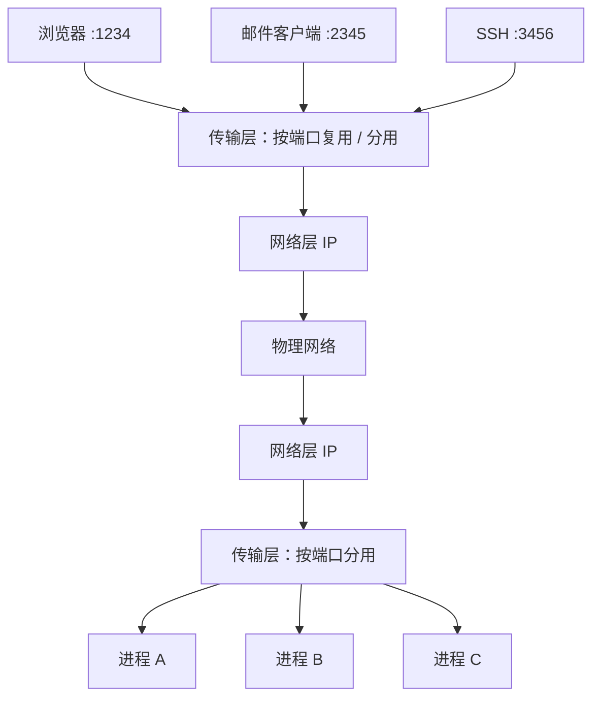
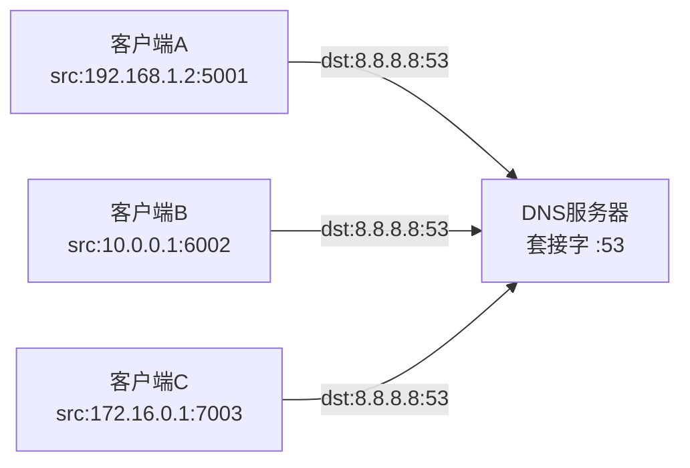
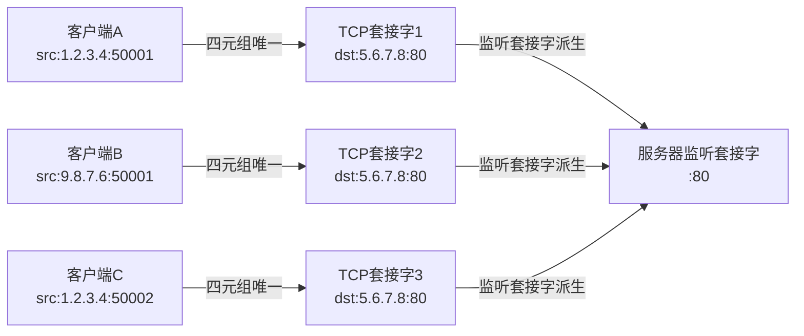
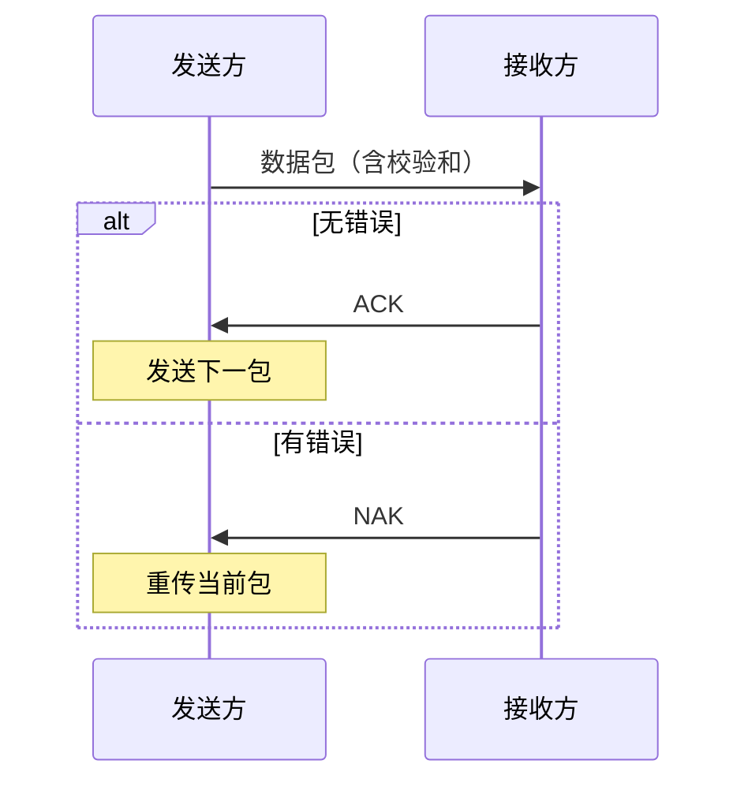
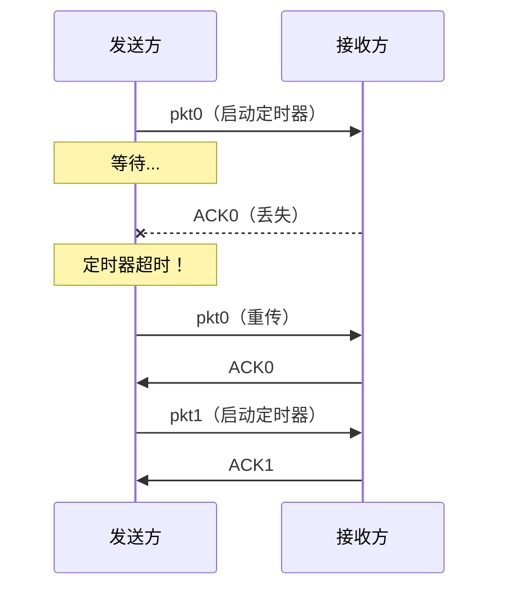
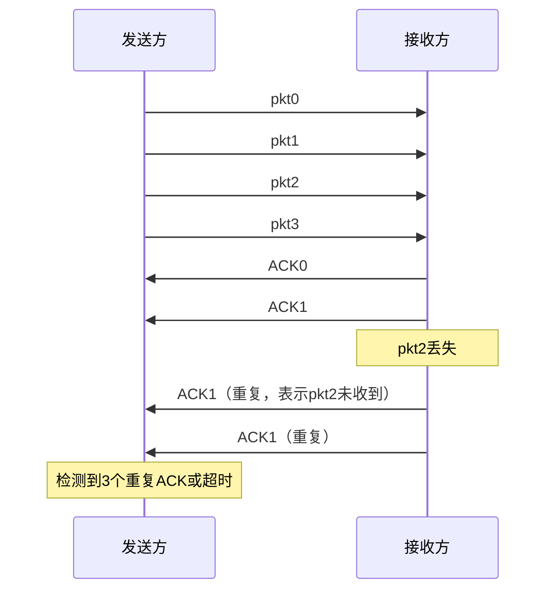
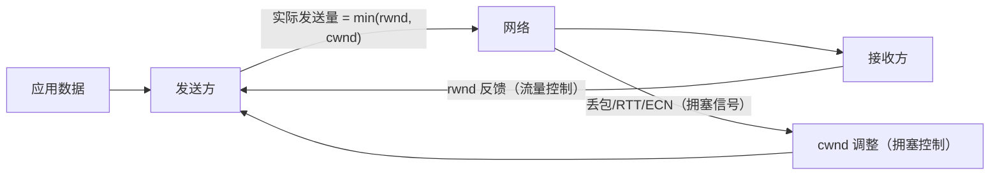
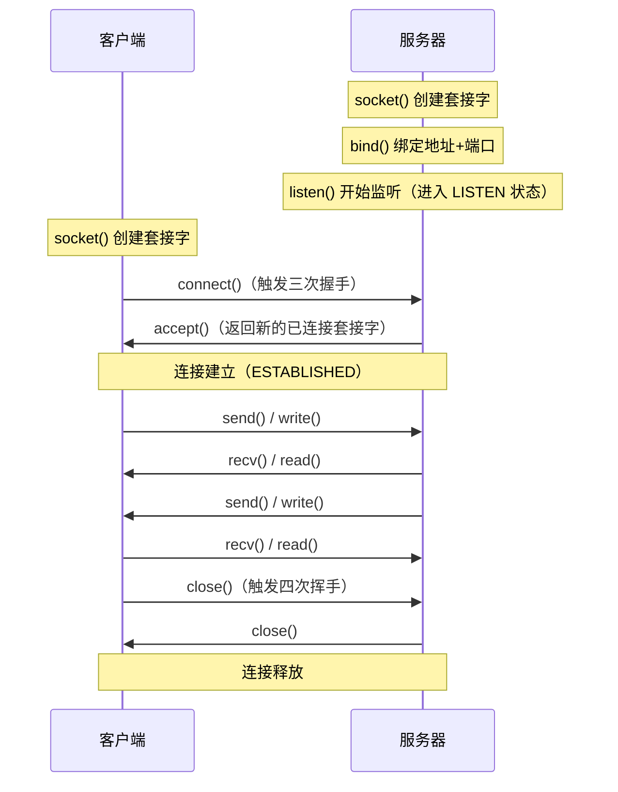
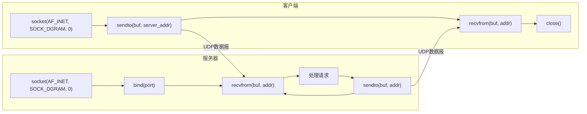
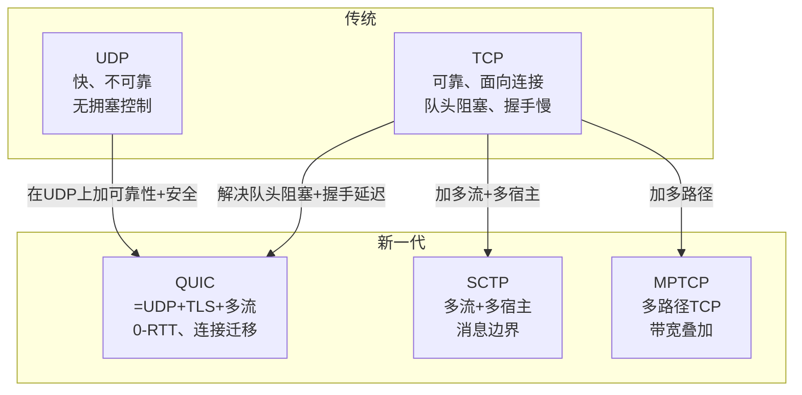

# 详解网络协议(六)传输层

> [!abstract] 速览
> **传输层（Transport Layer）** 是 OSI 第 4 层，提供**进程到进程（端到端）**的通信：用**端口号**区分同一主机上的不同应用（**复用 / 分用**），并按需提供可靠性。两条路线——[[13.TCP协议|TCP]]（面向连接、可靠）与 [[16.UDP协议|UDP]]（无连接、低时延）。
> PDU：**段（Segment，TCP）/ 数据报（Datagram，UDP）**。
> 点睛：[[05.网络层|网络层]]把包送到**主机**，传输层把数据送到**具体进程**。
> 口诀："**IP 到门，传输到人**"——IP 负责找房子，端口号负责找房间里的人。

## 1. 复用与分用

一台主机同时跑浏览器、邮件、SSH……网络层只认 IP（只能送到主机），靠**端口号**才能区分送给哪个进程：发送端把多个应用的数据**复用（multiplexing）**到 IP 之上，接收端按端口**分用（demultiplexing）**给对应进程。

### 1.1 无连接分用（UDP）

UDP 分用时只看**目的端口**：凡目的端口相同，无论源 IP / 源端口是谁，数据都交给同一个 UDP 套接字。

- 一个 UDP 套接字（绑定特定端口）可同时接收来自**任意多个客户端**的数据报。
- 典型场景：DNS 服务器 53 端口——无数客户端都往同一个 53 发查询，服务器凭源 IP+源端口区分要回复的对象。

### 1.2 面向连接分用（TCP）

TCP 分用时看完整**四元组** `(源IP, 源端口, 目的IP, 目的端口)`：每个四元组对应一个**独立的 TCP 套接字**。

- 服务器 80 端口可以同时维护**成千上万条**TCP 连接，每条连接有自己独立的读写缓冲区和状态机。
- 这就是同一台 Web 服务器能用同一个 80 端口服务海量客户端的秘密——目的端口相同，但源 IP / 源端口各不相同，四元组各异，套接字也各异。

> [!tip] 口诀
> - UDP 分用：**"认门不认人"**——只看目的端口。
> - TCP 分用：**"四元组定身份"**——源 IP + 源端口 + 目的 IP + 目的端口，四者全同才是同一条连接。

### 1.3 分用对照表

| 维度 | UDP 分用 | TCP 分用 |
| --- | --- | --- |
| 分用依据 | 目的端口（2 元组） | 四元组（源IP+源端口+目的IP+目的端口） |
| 同一端口可服务多客户端 | 是（同一套接字） | 是（不同套接字，各自独立） |
| 典型场景 | DNS、DHCP | HTTP、SSH、FTP |
| 内核数据结构 | 一个 socket 绑定一端口 | 每条连接对应一个 socket |

## 2. 端口

端口号（Port Number）是一个 **16 位无符号整数**，范围 **0–65535**，由 IANA（互联网号码分配机构）划分为三段。

| 范围 | 名称 | 说明 |
| --- | --- | --- |
| 0–1023 | **知名端口（Well-Known Ports）** | 系统/标准服务，分配给常见网络协议，Unix 系统需 root 权限才能绑定 |
| 1024–49151 | **注册端口（Registered Ports）** | 厂商或应用注册使用，需向 IANA 登记，无需 root |
| 49152–65535 | **动态/临时端口（Ephemeral Ports）** | 客户端建立连接时由 OS 随机分配，连接结束即释放 |

> [!note] 临时端口（Ephemeral Port）
> 客户端每发起一条连接，OS 从动态范围里随机选一个临时端口作为源端口，与服务端的固定端口配合组成四元组。Linux 默认范围 `32768–60999`，可通过 `/proc/sys/net/ipv4/ip_local_port_range` 调整；Windows 默认 `49152–65535`（与 IANA 定义一致）。

### 2.1 常见端口速查表

| 端口 | 协议 | 服务 | 层 |
| --- | --- | --- | --- |
| 20 | TCP | FTP 数据传输 | 应用层 |
| 21 | TCP | FTP 控制 | 应用层 |
| 22 | TCP | SSH 安全Shell \| SCP \| SFTP | 应用层 |
| 23 | TCP | Telnet（明文，已不推荐） | 应用层 |
| 25 | TCP | SMTP 邮件发送 | 应用层 |
| 53 | TCP/UDP | DNS 域名解析（短查询用UDP，区域传输用TCP） | 应用层 |
| 67/68 | UDP | DHCP（67=服务端，68=客户端） | 应用层 |
| 80 | TCP | HTTP | 应用层 |
| 110 | TCP | POP3 邮件接收 | 应用层 |
| 123 | UDP | NTP 时间同步 | 应用层 |
| 143 | TCP | IMAP 邮件访问 | 应用层 |
| 161/162 | UDP | SNMP 网络管理（161=查询，162=Trap上报） | 应用层 |
| 179 | TCP | BGP 路由协议 | 应用层 |
| 389 | TCP | LDAP 目录服务 | 应用层 |
| 443 | TCP | HTTPS（HTTP over TLS） | 应用层 |
| 445 | TCP | SMB 文件共享（Windows） | 应用层 |
| 465 | TCP | SMTPS（SMTP over TLS） | 应用层 |
| 587 | TCP | SMTP 提交（需认证，推荐替代25） | 应用层 |
| 993 | TCP | IMAPS（IMAP over TLS） | 应用层 |
| 995 | TCP | POP3S（POP3 over TLS） | 应用层 |
| 3306 | TCP | MySQL 数据库 | 应用层 |
| 3389 | TCP | RDP 远程桌面（Windows） | 应用层 |
| 5432 | TCP | PostgreSQL 数据库 | 应用层 |
| 6379 | TCP | Redis 缓存 | 应用层 |
| 8080 | TCP | HTTP 备用端口（常用于开发/代理） | 应用层 |
| 8443 | TCP | HTTPS 备用端口 | 应用层 |

> [!tip] 记忆口诀
> **"20传文件，22安全壳，25发邮件，53解域名，80看网页，443加密看"**

## 3. TCP vs UDP

| 维度 | [[13.TCP协议\|TCP]] | [[16.UDP协议\|UDP]] |
| --- | --- | --- |
| 连接 | 面向连接（三次握手） | 无连接 |
| 可靠性 | 可靠、按序、不重复 | 不保证 |
| 流量控制 | 有（滑动窗口 rwnd） | 无 |
| 拥塞控制 | 有（cwnd，慢启动等） | 无 |
| 头部 | 20～60 字节 | 8 字节 |
| 传输单位 | 字节流（无消息边界） | 数据报（有边界） |
| 速度 | 较慢（建连+控制开销） | 快、低时延 |
| 广播/组播 | 不支持 | 支持 |
| 场景 | 网页、文件、邮件、SSH | DNS、音视频、游戏、直播、DHCP |

**选型一句话**：要"对、不丢、不乱"用 TCP；要"快、实时、丢一点无所谓"用 UDP。

## 4. 可靠数据传输原理（rdt）

> [!note] 为什么要了解 rdt？
> rdt（Reliable Data Transfer）是《计算机网络：自顶向下方法》中系统讲解可靠传输机制演进的理论框架，从最简单的假设逐步放开，一步步推导出 TCP 中各种机制的必要性。理解这个演进过程，能让你彻底明白 TCP 为何这样设计，而不是死记硬背。

### 4.1 rdt 1.0 — 完全可靠信道

**假设**：底层信道完全可靠（不出错、不丢包）。

**结论**：发送方直接发，接收方直接收，不需要任何反馈机制。

这是理想情况，现实中不存在，但给出了分析基线。

### 4.2 rdt 2.0 — 有比特错误的信道

**假设**：信道可能产生比特翻转（bit error），但不丢包。

**引入机制**：
- **校验和（Checksum）**：检测比特错误；
- **ACK（Acknowledgment）**：接收方收到正确数据后告知发送方；
- **NAK（Negative Acknowledgment）**：接收方检测到错误后要求重传。

**协议流程**（停等协议，Stop-and-Wait）：

**致命缺陷**：如果 ACK/NAK 本身也出错了怎么办？发送方无法区分"收到 ACK"还是"收到错误的 NAK"——rdt 2.0 在此崩溃。

### 4.3 rdt 2.1 — 应对 ACK/NAK 出错（引入序号）

**新增机制**：**序号（Sequence Number）**，对于停等协议只需 0/1 两个序号（比特交替）。

**思路**：发送方对每个包编号 0 或 1；若 ACK/NAK 出错，发送方无条件重传；接收方通过序号判断是新包还是重传包，重复包直接丢弃并重发 ACK。

| 发送方状态 | 行为 |
| --- | --- |
| 收到正确 ACK | 发送下一个包（序号翻转 0→1 或 1→0） |
| 收到损坏的 ACK/NAK | 重传当前包 |
| 收到正确 NAK | 重传当前包 |

### 4.4 rdt 2.2 — 用 ACK 替代 NAK

**优化**：去掉 NAK，改用**带序号的 ACK**——"ACK 0"表示"0号包收到了"，"ACK 1"表示"1号包收到了"。发送方收到与期望序号不符的 ACK，就等同于 NAK，触发重传。这正是 TCP 的确认机制：TCP 只有 ACK，没有 NAK。

### 4.5 rdt 3.0 — 有丢包的信道（比特交替协议）

**假设**：信道既有比特错误，也可能丢包（数据包或 ACK 都可能丢）。

**新增机制**：**超时重传定时器（Timeout/Retransmission Timer）**。

**协议流程**：
- 发送方发包后启动定时器；
- 若定时器超时仍未收到 ACK → 重传（无论包是否真的丢失，超时就重传）；
- 若 ACK 迟到（网络延迟而非丢包），序号机制确保接收方能识别重复包并丢弃。

**性能瓶颈**：停等协议信道利用率极低。设 RTT=30ms，包大小=1000B，带宽=1Gbps，则利用率仅约 0.027%——几乎是在浪费带宽。

### 4.6 流水线协议：GBN 与 SR

为提高信道利用率，允许发送方**连续发出多个未确认的包**，即**流水线（Pipeline）**协议。

**回退 N（Go-Back-N，GBN）**：

| 特性 | 说明 |
| --- | --- |
| 发送窗口 | 最大 N 个未确认包 |
| 确认方式 | 累计确认（ACK n = "n之前全部收到"） |
| 丢包处理 | 丢包点及其后所有包全部重传（"回退"） |
| 接收方缓冲 | 不需要缓冲乱序包，直接丢弃 |
| 适用 | 接收方缓冲有限、网络错误率低时 |

**选择重传（Selective Repeat，SR）**：

| 特性 | 说明 |
| --- | --- |
| 发送/接收窗口 | 各最大 N/2 个包 |
| 确认方式 | 逐包确认（SACK） |
| 丢包处理 | 仅重传丢失的包，已收到的不重传 |
| 接收方缓冲 | 需要缓冲乱序到达的包 |
| 适用 | 错误率高、带宽宝贵时，避免无谓重传 |

**与 TCP 的对应关系**：

| rdt 机制 | TCP 对应实现 |
| --- | --- |
| 校验和 | TCP 首部校验和（含伪首部） |
| 序号 | 32 位字节流序号（SEQ） |
| ACK（带序号） | 确认号（ACK Number），累计确认 |
| 超时重传 | RTO（基于 RTT 动态计算） |
| 流水线 GBN/SR | 滑动窗口 + SACK 选项 |

> [!tip] 一句话总结 rdt 演进
> rdt 1.0→2.0：加检错+反馈；2.1→2.2：加序号、去 NAK；3.0：加定时重传；流水线：提效率。TCP 是这条演进路线的工程实现，细节见 [[13.TCP协议]]。

## 5. 流量控制 vs 拥塞控制

这是传输层两个容易混淆的概念，必须清晰区分：

| 维度 | 流量控制（Flow Control） | 拥塞控制（Congestion Control） |
| --- | --- | --- |
| **保护对象** | **接收方**（防止接收缓冲区溢出） | **网络**（防止路由器/链路过载） |
| **信息来源** | 接收方通过 `rwnd` 字段反馈 | 发送方通过丢包/RTT变化/ECN推断 |
| **控制变量** | 接收窗口 `rwnd` | 拥塞窗口 `cwnd` |
| **实际发送量** | `min(rwnd, cwnd)` | 同左 |
| **类比** | 喝水速度不超过杯子容量 | 喝水速度不超过水管流量 |
| **UDP 有吗？** | 无（UDP 不管接收方死活） | 无（UDP 不管网络死活） |

> [!warning] 常见混淆
> **流量控制**是端到端的，只涉及发送方和接收方；**拥塞控制**涉及整个网络，中间路由器的状态才是真正的约束。两者都用窗口机制实现，但窗口来源和调整逻辑完全不同。

**在 TCP 中的协同**：

流量控制与拥塞控制的具体算法（慢启动、拥塞避免、快重传、快恢复、CUBIC、BBR）详见 [[13.TCP协议]]。

## 6. 套接字编程模型

套接字（Socket）是操作系统提供给应用程序的传输层 API，是应用层与传输层之间的接口抽象。

### 6.1 TCP 套接字编程流程

**关键调用说明**：

| 调用 | 作用 | 备注 |
| --- | --- | --- |
| `socket(AF_INET, SOCK_STREAM, 0)` | 创建 TCP 套接字 | `SOCK_STREAM` 代表字节流（TCP） |
| `bind(fd, addr, addrlen)` | 绑定本地 IP + 端口 | 服务器必须调用；客户端可不调用（OS 自动分配临时端口） |
| `listen(fd, backlog)` | 开始监听，设置半连接队列上限 | 服务器专用 |
| `accept(fd, addr, addrlen)` | 阻塞等待并返回已连接套接字 | 返回的是**新的** fd，原监听 fd 不变 |
| `connect(fd, addr, addrlen)` | 客户端发起连接（三次握手） | 客户端专用 |
| `send/recv` | 发送/接收数据 | TCP 是字节流，需自行处理消息边界 |
| `close(fd)` | 关闭套接字（触发 FIN） | 两端各自调用 |

### 6.2 UDP 套接字编程流程

**关键调用说明**：

| 调用 | 作用 | 备注 |
| --- | --- | --- |
| `socket(AF_INET, SOCK_DGRAM, 0)` | 创建 UDP 套接字 | `SOCK_DGRAM` 代表数据报（UDP） |
| `bind(fd, addr, addrlen)` | 绑定端口（服务器必须） | 客户端可省略 |
| `sendto(fd, buf, len, flags, dest_addr, addrlen)` | 发送数据报（含目的地址） | 每次都要指定目的地址 |
| `recvfrom(fd, buf, len, flags, src_addr, addrlen)` | 接收数据报（同时获取来源地址） | 可通过 `src_addr` 知道是谁发来的 |
| `close(fd)` | 关闭套接字 | 不触发握手/挥手 |

### 6.3 TCP vs UDP 套接字对比

| 维度 | TCP 套接字 | UDP 套接字 |
| --- | --- | --- |
| 类型 | `SOCK_STREAM` | `SOCK_DGRAM` |
| 连接 | 需建连（connect/accept） | 无需建连 |
| 服务器额外调用 | `listen()` + `accept()` | 仅需 `bind()` |
| 数据传输 | `send/recv`（字节流） | `sendto/recvfrom`（数据报） |
| 消息边界 | 无（需应用层自行划定） | 有（每次调用是一个完整数据报） |
| 一个套接字服务多客户端 | 否（每个连接一个 fd） | 是（同一个 fd 收所有客户端数据） |

## 7. 可靠性从哪来（概览）

TCP 用「序号 + 确认 + 重传 + 滑动窗口（流控）+ 拥塞控制」实现可靠传输，这正是 rdt 理论框架的工程落地（见第 4 节）。UDP 则把这些全部交给应用层自行处理——音视频编解码、QUIC 等在应用层或新协议层实现自定义的可靠机制。

完整 TCP 机制详见 [[13.TCP协议]]；UDP 特性与应用详见 [[16.UDP协议]]。

## 8. 新一代传输协议

传统 TCP/UDP 已不能满足所有现代场景，一批新一代传输协议应运而生：

### 8.1 协议全景表

| 协议 | 基于 | 核心特性 | 典型场景 |
| --- | --- | --- | --- |
| **QUIC** | UDP | 内建 TLS 1.3、多路复用、0-RTT、连接迁移、消除队头阻塞 | HTTP/3、Google 服务、现代 CDN |
| **SCTP** | 独立（IP之上） | 多流、多宿主、消息边界、更安全的握手 | 电信信令（SS7/Diameter）、WebRTC |
| **DCCP** | 独立（IP之上） | 有拥塞控制的不可靠数据报 | 实时媒体（已较小众） |
| **MPTCP** | TCP 扩展 | 多路径同时传输、路径故障自动切换 | 移动设备（Wi-Fi+4G并用）、数据中心 |
| **ECN** | TCP/IP 扩展 | 路由器主动通知拥塞（不等丢包） | 配合 TCP/QUIC 减少拥塞引起的丢包 |

### 8.2 QUIC 深入

QUIC（Quick UDP Internet Connections，RFC 9000，2021）是目前最重要的新一代传输协议，是 HTTP/3 的底层承载（见 [[18.HTTP-HTTPS协议]]）。

**QUIC 解决的核心痛点——TCP 的两大问题**：

1. **队头阻塞（Head-of-Line Blocking, HOL Blocking）**：TCP 是字节流，单个包丢失会阻塞后续所有数据；HTTP/2 虽然多路复用，但底层共用一条 TCP 连接，丢包仍会阻断所有流。QUIC 在一条 UDP 连接上实现独立多流，某流丢包不影响其他流。
2. **握手延迟**：TCP 三次握手 + TLS 1.2 四次握手 = 至少 3 个 RTT 才能传数据。QUIC 把传输和加密握手合并，首次连接 **1-RTT**，会话恢复甚至 **0-RTT**（复用之前握手参数）。

**QUIC 主要特性**：

| 特性 | 说明 |
| --- | --- |
| 基于 UDP | 绕过内核 TCP 实现，可在用户空间快速迭代 |
| 内建 TLS 1.3 | 传输加密不可分离，不存在未加密的 QUIC |
| 连接 ID | 连接不再由四元组标识，而是用 64 位连接 ID；切换网络（Wi-Fi→4G）连接不断 |
| 多路复用 | 同一连接内多个独立流，互不阻塞 |
| 0-RTT 恢复 | 会话恢复时可立即发数据（需防重放攻击） |
| 改进的丢包检测 | Packet Number 单调递增，区分重传和原始包，避免重传歧义 |

### 8.3 SCTP 深入

SCTP（Stream Control Transmission Protocol，RFC 4960）是专为电信信令设计的传输协议：

- **多流（Multi-Stream）**：一条 SCTP 关联内有多条独立流，单条流丢包不阻塞其他流（比 TCP 早解决队头阻塞）；
- **多宿主（Multi-Homing）**：端点可绑定多个 IP 地址，一条链路故障自动切换，提高可靠性；
- **消息边界**：SCTP 有明确的消息边界，不像 TCP 是字节流；
- **四次握手**：比 TCP 多一次握手（INIT → INIT-ACK → COOKIE-ECHO → COOKIE-ACK），天然防 SYN Flood。

### 8.4 MPTCP 深入

MPTCP（Multipath TCP，RFC 8684）是 TCP 的扩展，允许同一连接跨多条路径传输：

- **多路径**：手机同时用 Wi-Fi 和 4G 传同一条 TCP 连接，带宽叠加；
- **无缝切换**：从 Wi-Fi 走到没信号区域自动切到 4G，连接不断（苹果 Siri 大量使用）；
- **向后兼容**：中间路由器不支持 MPTCP 时自动降级为普通 TCP。

### 8.5 ECN（显式拥塞通知）

ECN（Explicit Congestion Notification，RFC 3168）是 IP+TCP 的协同扩展：

- 路由器检测到队列即将满时，不丢包，而是在 IP 头部打 **CE（Congestion Experienced）**标记；
- 接收方把 CE 信息通过 TCP `ECE` 标志位反馈给发送方；
- 发送方像遇到丢包一样减小 cwnd，**但因为没有实际丢包，吞吐量更稳定**；
- QUIC 也支持 ECN，HTTP/3 的拥塞控制可以不依赖丢包信号。

### 8.6 新老协议对比

## 9. 常见误区与面试要点

> [!warning] 高频误区
> **误区 1：端口属于应用层**
> 错。端口号是传输层的概念，TCP/UDP 报头里都有源端口和目的端口字段。应用层协议只是"约定使用某个端口"，但端口本身属传输层。
>
> **误区 2：UDP 不安全**
> 错。UDP 是"无连接、不保证可靠"，但这与安全性无关。可以在 UDP 之上运行 DTLS（Datagram TLS）来提供加密和完整性保护——QUIC 就是这么做的。UDP 本身"不安全"和 TCP 本身也不加密是同一性质的问题，安全由上层 TLS/DTLS 提供。
>
> **误区 3：TLS 属于传输层**
> 错。TLS（Transport Layer Security）名字里有"传输层"，但它实际运行在传输层**之上**，是应用层的一部分（或者说是第5.5层的会话安全协议）。TLS 调用 TCP 的 socket，而不是实现在 TCP 内部。详见 [[15.TLS协议]]。
>
> **误区 4：同一端口只能有一个连接**
> 错（TCP 情况下）。服务器 80 端口可以同时维护成千上万条 TCP 连接，因为每条连接由**四元组**唯一标识，而不是仅由端口标识。
>
> **误区 5：QUIC 是应用层协议**
> 错。QUIC 运行在 UDP 之上，提供可靠传输、流量控制、拥塞控制等传输层功能，是**传输层协议**。HTTP/3 运行在 QUIC 之上，HTTP/3 才是应用层。
>
> **误区 6：流量控制和拥塞控制是同一回事**
> 错。流量控制保护接收方缓冲区不溢出（端到端），拥塞控制保护网络中的路由器不过载（全局）。两者都用窗口机制，但窗口来源（rwnd vs cwnd）和调整依据完全不同。

### 9.1 面试高频问题速查

| 问题 | 要点 |
| --- | --- |
| 传输层的作用是什么？ | 进程到进程通信；复用/分用；按需提供可靠性 |
| 端口号范围和分类？ | 0-1023 知名；1024-49151 注册；49152-65535 动态临时 |
| TCP 和 UDP 最本质的区别？ | 连接+可靠 vs 无连接+不保证；字节流 vs 数据报 |
| 为什么 UDP 服务器只需一个套接字？ | UDP 分用只看目的端口，一个套接字可接收所有客户端数据报 |
| 为什么 TCP 服务器每个连接一个套接字？ | TCP 分用看四元组，每条连接状态独立，需要独立 fd 维护 |
| rdt 中为什么需要序号？ | 应对 ACK/NAK 出错时的重传，让接收方区分新包和重传包 |
| 流量控制 vs 拥塞控制区别？ | 前者保护接收方，后者保护网络；窗口来源不同 |
| QUIC 怎么解决队头阻塞？ | 多流独立，某流丢包不阻塞其他流；底层 UDP 无序传输 |
| QUIC 的 0-RTT 是什么意思？ | 会话恢复时复用之前的握手密钥，连接建立即可发数据 |
| TLS 属于哪一层？ | 传输层之上，通常归入应用层（运行在 TCP socket 之上） |

## 延伸阅读

- 下层：[[05.网络层]]　上层：[[07.会话层]]
- 两大协议：[[13.TCP协议]] · [[16.UDP协议]]
- 安全扩展：[[14.SSL协议]] · [[15.TLS协议]]
- 新一代协议承载：[[18.HTTP-HTTPS协议]]（HTTP/3 基于 QUIC）

> ⬅️ [[05.网络层]] ｜ 🏠 [[00.网络协议详解总览]] ｜ [[07.会话层]] ➡️
