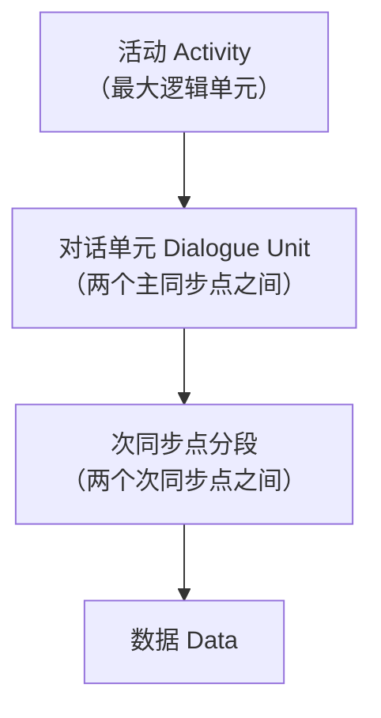
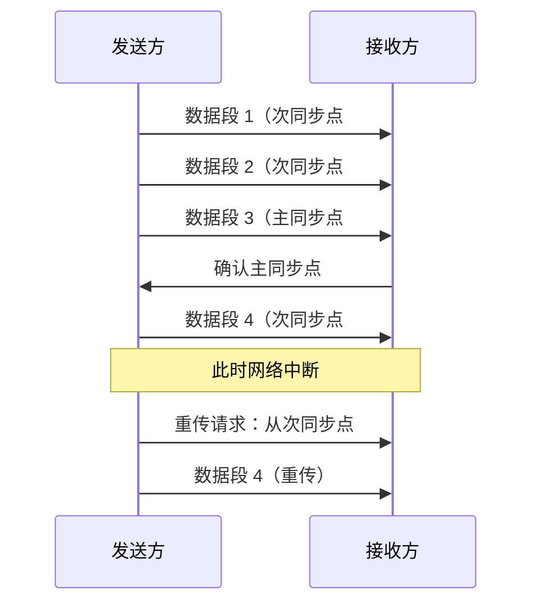
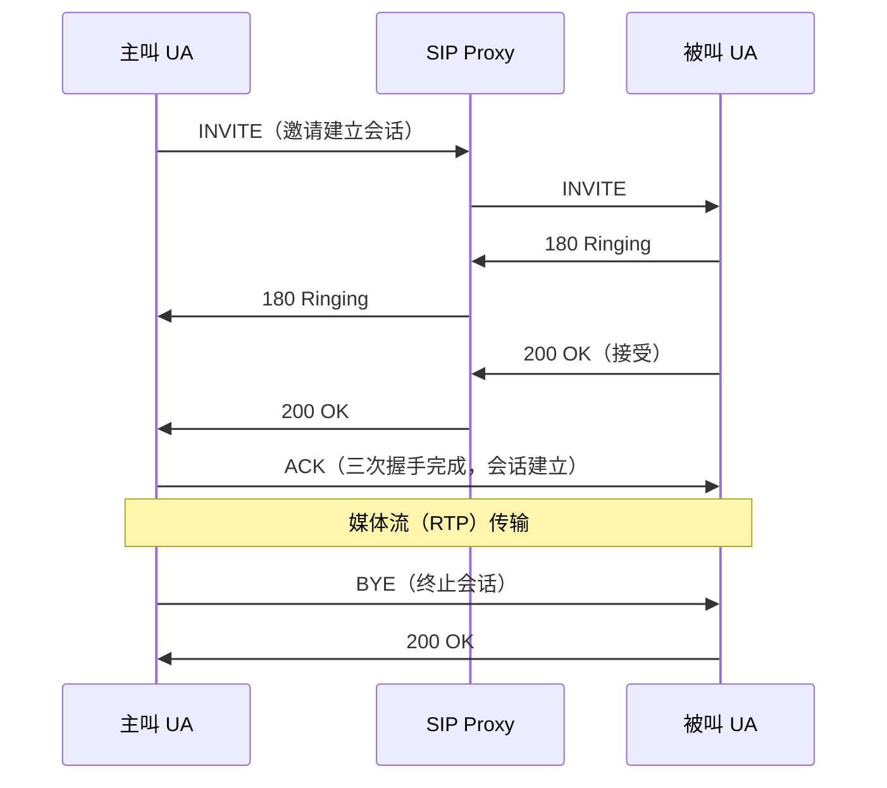
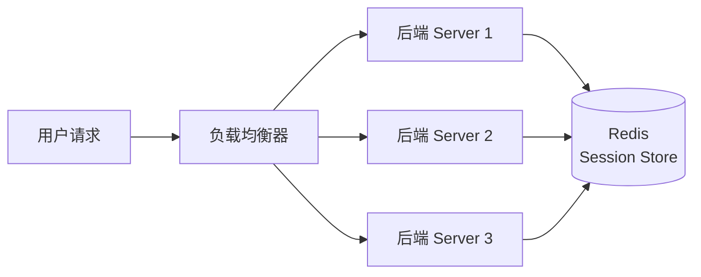

# 详解网络协议(七)会话层

> [!abstract] 速览
> **会话层（Session Layer）** 是 OSI 第 5 层，负责在两端应用之间**建立、维护、同步、有序释放会话**。在现实的 [[10.TCP-IP四层模型|TCP/IP]] 协议栈里，它**没有独立实现**，职责被并入应用层。
> PDU：**数据**。
> 关键词：对话控制（全/半双工 + 令牌）、同步点（检查点）、会话标识、断点续传思想来源。

## 1. 三大职责

会话层在 OSI 模型中承担三类核心任务，下文逐一深化。

### 1.1 对话控制（Dialogue Control）

会话层首先要商定两端的**通信模式**：

| 模式 | 说明 | 典型场景 |
| --- | --- | --- |
| **全双工（Full-Duplex）** | 双方可同时发送，无需轮转 | TCP 连接（[[13.TCP协议]]） |
| **半双工（Half-Duplex）** | 某一时刻只能一方发，需要协调 | 对讲机、早期 X.25 会话 |
| **单工（Simplex）** | 仅一个方向 | 广播（[[17.广播与组播]]） |

**半双工下的令牌管理（Token Management）**

半双工时，OSI 会话层用**令牌（Token）**裁决"谁可以说话"，共定义了四种令牌，互相独立、可同时存在：

| 令牌名称 | 控制权限 | 说明 |
| --- | --- | --- |
| **数据令牌（Data Token）** | 数据传输 | 持有者才能发送正常数据 |
| **释放令牌（Release Token）** | 会话释放 | 持有者才能发起会话关闭请求 |
| **次同步点令牌（Minor Sync Token）** | 设置次同步点 | 持有者才能请求插入次同步点 |
| **主同步点令牌（Major Sync Token）** | 设置主同步点 / 活动管理 | 持有者才能发起活动结束、主同步点请求 |

> [!tip] 口诀
> 数据·释放·次同步·主同步——四令牌各司其职，"谁拿牌谁说话，谁拿牌谁划线"。

令牌可以通过"令牌请求（Token Request）"在对端之间转让；持有令牌的一方不动作时，对方不得抢占，这保证了半双工通信的有序性。

### 1.2 同步（Synchronisation）

长时间、大数据量的传输随时可能中断（网络抖动、系统崩溃）。会话层通过在数据流中插入**同步点（Sync Point / 检查点，Checkpoint）**，使通信在中断后能从最近检查点恢复，而非从零开始。

**同步层次体系**

| 同步概念 | 说明 | 类比 |
| --- | --- | --- |
| **活动（Activity）** | 会话内可独立完成的逻辑任务，有开始/结束标记 | 一次文件传输任务 |
| **对话单元（Dialogue Unit）** | 两个相邻**主同步点**之间的数据段；完整确认后才可丢弃 | 书的一章 |
| **主同步点（Major Sync Point）** | 两端双向确认、**永久性**边界；跨主同步点不可回退 | 每章末的"存档" |
| **次同步点（Minor Sync Point）** | 单向确认、**可选性**边界；可在对话单元内任意插入 | 章节中的"自动存档" |

**失败恢复流程**

> [!note] 核心价值
> 主同步点之前的数据**已永久确认**，可从缓冲区释放；次同步点提供细粒度恢复锚点。这是现代**断点续传**技术的思想根源（见第 5 节）。

### 1.3 会话管理（Session Management）

会话层负责端到端会话的完整生命周期：

**建立（Establishment）**

- 发起方发出会话连接请求（S-CONNECT.req），包含：会话标识（Session ID）、服务质量参数（QoS）、同步点功能协商。
- 响应方接受或拒绝，协商最终参数后进入数据传输阶段。

**维持（Maintenance）**

- 定期刷新会话心跳，防止空闲超时被中间节点切断。
- 管理令牌的当前归属，确保半双工下的有序对话。

**有序释放（Orderly Release）**

不同于传输层的强制中断，会话层采用**协商式释放**：双方都同意终止后，才完成会话关闭——即使某一方数据还未发完，也不会被单方面掐断。这一思想与 [[13.TCP协议]] 的四次挥手有异曲同工之处，但层级更高。

**异常恢复（Exception Recovery）**

- 传输连接故障时，会话层可请求重建底层传输连接，并从最近同步点继续，对上层应用透明。
- 会话标识（Session Identifier）在重连后仍可复用，无需重新协商全部参数。

## 2. OSI 会话层服务与协议

### 2.1 会话连接与传输连接的映射

OSI 模型中，会话层与传输层之间的连接关系并非 1:1，而是灵活的**多路复用/分用**：

| 映射模式 | 说明 | 适用场景 |
| --- | --- | --- |
| **1:1** | 一个会话连接对应一个传输连接 | 最常见，简单直接 |
| **多会话 : 1 传输** | 多个会话连接串行共享同一传输连接 | 节省传输资源，后一个会话等前一个结束后复用 |
| **1 会话 : 多传输** | 单个会话在底层传输连接故障后，切换到新的传输连接继续 | 异常恢复，对上层会话透明 |

> [!info] 关键洞察
> **串行复用（Multiplexing）** 是会话层真正的价值之一：传输层连接的建立成本高（三次握手等），会话层通过串行复用让多次逻辑会话共用一条传输通道，减少开销。

### 2.2 ISO 8327 协议简述

OSI 会话层由 **ISO 8327**（等同 ITU-T X.225）规范定义，提供以下服务原语：

| 服务原语 | 功能 |
| --- | --- |
| `S-CONNECT` | 建立会话连接 |
| `S-RELEASE` | 有序释放会话 |
| `S-ABORT` | 异常中止会话（单方面） |
| `S-DATA` | 传输普通数据 |
| `S-SYNC-MINOR` | 插入次同步点 |
| `S-SYNC-MAJOR` | 插入主同步点 |
| `S-RESYNC` | 请求重同步（回滚或前滚到某个同步点） |
| `S-TOKEN-PLEASE` | 请求对端转让令牌 |
| `S-TOKEN-GIVE` | 主动将令牌转让给对端 |
| `S-ACTIVITY-START/END` | 活动开始/结束标记 |

> [!note]
> ISO 8327 / X.225 在实际互联网中几乎没有独立部署。它的价值更多在于为后世协议设计提供了概念参照框架，而非直接在网络设备中运行。

## 3. 为什么现代协议栈很少单独实现它

### 3.1 端到端原则

互联网设计遵循**端到端原则（End-to-End Principle）**：复杂性应放在端系统（应用层），网络核心保持简单。将会话语义上移到应用层，让每个应用按需实现，避免为所有流量强加会话层开销。

### 3.2 TCP/IP 的三合一

[[10.TCP-IP四层模型|TCP/IP]] 把 OSI 第 5-7 层（会话层 / [[08.表示层|表示层]] / [[09.应用层|应用层]]）合并成一个**应用层**。于是"会话"的概念散落到了具体协议中：

| 现代"会话"机制 | 实际所在 | 说明 |
| --- | --- | --- |
| Cookie / Session / JWT | 应用层（HTTP） | 为**无状态** [[18.HTTP-HTTPS协议\|HTTP]] 维持登录态 |
| TLS Session Resumption | 安全层（TLS） | 复用密钥、省去完整握手，见 [[15.TLS协议]] |
| RPC / gRPC | 应用层 | 远程调用框架自行管理请求-响应上下文 |
| SIP 会话 | 应用层（VoIP） | Session Initiation Protocol 管理语音/视频通话建立与释放 |
| 数据库会话 | 应用层 | 连接池中的 connection 承载事务上下文 |
| SSH 会话 | 应用层 | 通道复用（channel multiplexing），见 [[21.SSH协议]] |
| WebSocket 长连接 | 应用层 | 一次 HTTP 升级后保持持久双向通道，见 [[19.websocket协议]] |

> [!tip] 一句话概括
> 现代应用层"自给自足"地实现了会话语义，OSI 会话层成了概念层而非实现层。

## 4. 现代协议里的"会话"深度对照

### 4.1 HTTP 无状态 + 会话维持

[[18.HTTP-HTTPS协议|HTTP]] 协议天生**无状态**——每个请求独立，服务器不记得上一次请求的上下文。为了在无状态协议之上构建"有状态的会话"，出现了三种主流方案：

| 方案 | 工作原理 | 存储位置 | 优缺点 |
| --- | --- | --- | --- |
| **Cookie + Server Session** | 服务器生成 Session ID 写入 Cookie，请求时带回；服务器靠 Session ID 查内存/缓存 | 服务器端（内存/Redis） | 简单直观；水平扩展需共享 Session 存储 |
| **Cookie + 签名 Cookie** | 把状态直接序列化在 Cookie 值中，HMAC 签名防篡改 | 客户端 | 无服务端存储压力；Cookie 大小有限（~4 KB） |
| **JWT（JSON Web Token）** | 状态编码在 Token Payload，服务器签名；客户端存 localStorage 或 Cookie | 客户端（无服务端状态） | 无状态、易水平扩展；令牌吊销困难 |

### 4.2 TLS 会话恢复（Session Resumption）

完整 TLS 握手开销大（1-2 个 RTT + 密钥协商），会话恢复机制让已建立会话的客户端再次连接时跳过部分步骤，详见 [[15.TLS协议]]：

| 机制 | 原理 | TLS 版本 |
| --- | --- | --- |
| **Session ID** | 服务器缓存会话参数，客户端用 ID 查缓存复用 | TLS 1.2 |
| **Session Ticket** | 服务器将加密的会话参数发给客户端保存，无需服务器缓存 | TLS 1.2 |
| **PSK（Pre-Shared Key / 0-RTT）** | 基于上次会话的密钥材料派生，可实现 0-RTT 恢复（有重放攻击风险） | TLS 1.3 |

### 4.3 SIP 会话（VoIP）

**SIP（Session Initiation Protocol，RFC 3261）** 是最接近 OSI 会话层语义的现代协议——它只负责**建立、修改、终止**多媒体会话（语音/视频通话），实际的媒体流由 RTP/RTCP 承载：

### 4.4 SSH 与 WebSocket 的会话复用

[[21.SSH协议|SSH]] 在单条 TCP 连接上通过**通道复用（Channel Multiplexing）** 支持多个独立的逻辑会话（shell、端口转发、X11 转发同时并行）。

[[19.websocket协议|WebSocket]] 则通过一次 HTTP Upgrade 握手将 HTTP 连接升级为持久双向通道，由此在应用层模拟出 OSI 会话层的"维持长连接"能力。

## 5. 负载均衡中的会话保持

当服务器集群水平扩展后，"会话"带来了一个棘手问题：**同一用户的后续请求可能被路由到不同服务器**，而那台服务器上没有用户的 Session 数据。

### 5.1 Sticky Session（会话粘滞）

让同一用户的所有请求始终路由到**同一台后端服务器**：

| 实现方式 | 原理 | 优点 | 缺点 |
| --- | --- | --- | --- |
| **源 IP 哈希（Source IP Hash）** | 对客户端 IP 取哈希，映射到固定后端 | 无需额外 Cookie | NAT 后多用户打到同一后端；IP 变动丢失粘滞 |
| **Cookie 插入（Cookie Insertion）** | 负载均衡器向响应写入标记 Cookie，后续请求按 Cookie 路由 | 粒度精确到用户 | 依赖客户端支持 Cookie |
| **URL 重写** | 在 URL 中嵌入后端标识 | 不依赖 Cookie | URL 泄露后端信息，美观度差 |

### 5.2 外置 Session 存储（Session Sharing）

更彻底的方案：把 Session 从服务器本地内存移到**集中式存储**（如 Redis、Memcached），所有后端节点共享同一份 Session 数据，任何节点都能处理任何用户请求：

| 对比维度 | Sticky Session | 外置 Session |
| --- | --- | --- |
| 水平扩展 | 受限（热点问题） | 自由扩展 |
| 节点故障 | Session 丢失 | 无影响（Session 在 Redis） |
| 复杂度 | 低 | 中（引入 Redis） |
| 性能 | 本地内存访问，极快 | 额外网络 IO（可用本地缓存优化） |

> [!warning] 注意
> Sticky Session 给水平扩展带来的最大挑战是：某台服务器宕机后，该服务器上的所有会话状态**全部丢失**，用户体验直接中断。外置 Session 存储解决了这个单点问题，但引入了对 Redis 的可用性依赖。

## 6. 断点续传与检查点的现代体现

OSI 会话层同步点（检查点）的思想，在现代系统中有多种具体实现：

| 场景 | 现代实现 | 类比 OSI 概念 |
| --- | --- | --- |
| **大文件分块上传** | 前端将文件切片，服务端记录已收分片，失败后只补传缺失片 | 次同步点 |
| **HTTP Range 请求** | `Range: bytes=500-999` 从指定偏移续传，服务器返回 `206 Partial Content` | 从次同步点恢复 |
| **消息队列消费位点** | Kafka consumer 的 offset checkpoint、RabbitMQ 的 ACK | 主同步点（确认后可丢弃） |
| **流式处理 checkpoint** | Flink/Spark Streaming 定期保存算子状态快照，失败后从快照恢复 | 活动 + 主同步点 |
| **数据库事务 savepoint** | `SAVEPOINT sp1` 可回滚到中间点而非整个事务 | 次同步点 |

> [!tip] 口诀
> "传文件找 Range，消息找 offset，流计算找 checkpoint"——本质都是 OSI 同步点思想的应用层变体。

## 7. 常见误区与面试要点

> [!warning] 常见误区
>
> **误区 1：Web 的 Session 就是 OSI 会话层**
> 不准确。Web Session 是**应用层**用 Cookie 等手段实现的会话概念，借用了"会话"这个词，但并不在 OSI 第 5 层运行。HTTP Session 的本质是：服务端持有状态 + 客户端带 Session ID 的 Cookie。
>
> **误区 2：TCP 连接 = 会话**
> TCP 连接是**传输层**的概念（[[13.TCP协议]]）。OSI 会话层的会话在传输连接**之上**，且一个会话可以跨越多个传输连接（传输连接故障时切换，会话照常维持）。反之，一个传输连接也可以承载多个串行的会话。
>
> **误区 3：OSI 七层全部在实际网络中有对应实现**
> 会话层和[[08.表示层|表示层]]在现代协议栈里**基本没有独立实现**，是 OSI 模型相对"理论化"的两层。实际设计一律参考更务实的 [[10.TCP-IP四层模型|TCP/IP 四层模型]]。
>
> **误区 4：令牌（Token）只有一种**
> OSI 会话层定义了四种独立的令牌，各自控制不同权限（见 1.1 节），而非只有一个统一的"发言权"令牌。

**面试要点**

| 问题 | 关键答案 |
| --- | --- |
| 会话层 PDU 叫什么？ | **数据（Data）** |
| 会话层三大职责？ | 对话控制、同步（检查点）、会话管理 |
| 为什么现代协议不单独实现会话层？ | 端到端原则 + TCP/IP 把上三层合并为应用层；应用自行管理会话 |
| HTTP 如何补充会话层功能？ | Cookie/Session/JWT 维持状态；TLS Session Resumption 节省握手 |
| 断点续传的原理来自哪一层的思想？ | OSI 会话层的同步点（检查点）机制 |
| Sticky Session 的缺点？ | 节点宕机导致 Session 丢失；流量倾斜；扩展性受限 |

## 延伸阅读

- 下层：[[06.传输层]]　上层：[[08.表示层]]
- 相关：[[09.应用层]] · [[15.TLS协议]] · [[18.HTTP-HTTPS协议]] · [[19.websocket协议]] · [[21.SSH协议]]

> ⬅️ [[06.传输层]] ｜ 🏠 [[00.网络协议详解总览]] ｜ [[08.表示层]] ➡️
