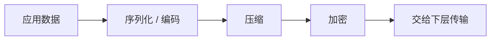
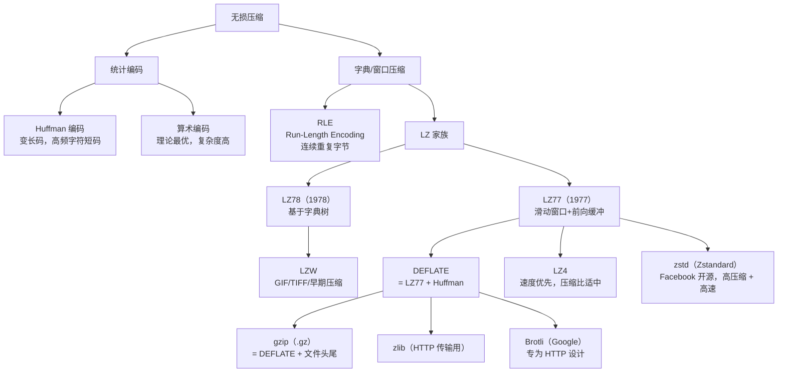

# 详解网络协议(八)表示层

> [!abstract] 速览
> **表示层（Presentation Layer）** 是 OSI 第 6 层，解决"**通信双方如何理解同一份数据**"：**编码转换、压缩、加密 / 解密**。在 TCP/IP 中它同样被并入应用层，其中"加密"职责现实里主要由 [[15.TLS协议|TLS]] 承担。
> PDU：**数据**。
>
> 一句话口诀：**"我说的你要听懂" —— 表示层负责让对端「看得懂」数据：统一语言（编码）、压缩体积（压缩）、保护内容（加密）。**

## 1. 三大职责（处理流水线）



表示层的处理本质上是一条数据变换流水线：

| 阶段 | 作用 | 现实归属 |
| --- | --- | --- |
| **序列化 / 编码** | 将内存中的结构化对象转换为字节序列，并统一字符集 | 应用层协议（JSON、Protobuf 等） |
| **压缩** | 减小数据体积，降低传输带宽 | HTTP `Content-Encoding`、gzip 等 |
| **加密 / 解密** | 保证数据保密性与完整性 | TLS（位于传输层之上、应用层之下） |

> [!info] 现实定位
> OSI 模型中表示层是独立的第 6 层，但在 TCP/IP 四层模型里**并不存在独立的表示层**——编码、压缩、加密的工作全部下放给了应用层协议（HTTP、gRPC 等）和 TLS 来承担。考试按 OSI 答，实战按 TCP/IP 理解。

---

## 2. 字符编码

字符编码解决的问题是：**如何把"字符"（人类可读的文字符号）映射成字节（计算机存储的二进制数字）**。

### 2.1 ASCII：一切的起点

- **全称**：American Standard Code for Information Interchange（美国信息交换标准码）
- **位宽**：7 位，共 **128** 个码点（0x00–0x7F）
- **覆盖**：控制字符（0–31）+ 标点、数字、大小写英文（32–127）
- **局限**：完全不包含非英语字符

| 十进制 | 十六进制 | 字符 | 说明 |
| --- | --- | --- | --- |
| 65 | 0x41 | A | 大写字母 A |
| 97 | 0x61 | a | 小写字母 a |
| 48 | 0x30 | 0 | 数字 0 |
| 10 | 0x0A | LF | 换行（Line Feed） |
| 13 | 0x0D | CR | 回车（Carriage Return） |

### 2.2 扩展 ASCII 与 ISO-8859-1

各国在 ASCII 的第 8 位（0x80–0xFF）填入本国字符，形成"扩展 ASCII"。**ISO-8859-1（Latin-1）** 是其中最广泛使用的版本，覆盖西欧语言（法、德、西班牙语等）。HTTP/1.1 默认字符集即为 ISO-8859-1，这也是早期网页乱码的重要根源之一。

### 2.3 Unicode：统一字符集

**Unicode** 是一个**字符集**（character set），不是编码方案。它为地球上几乎所有文字系统的每个字符分配一个唯一的整数编号，称为**码点（code point）**，写作 `U+XXXX`（十六进制）。

> [!tip] 关键区分
> - **字符集（charset）**：字符与整数编号的映射关系，例如 Unicode 规定"汉字'中'的码点是 U+4E2D"。
> - **编码方案（encoding）**：将码点转换成具体字节序列的规则，例如 UTF-8、UTF-16、UTF-32。
> - **同一个字符集可以有多种编码方案**。

Unicode 目前定义了超过 **14 万**个字符，分布在 17 个**平面（Plane）**中：

| 平面 | 码点范围 | 名称 | 典型内容 |
| --- | --- | --- | --- |
| 0 | U+0000–U+FFFF | 基本多文种平面（BMP） | 绝大多数常用字符，含中、日、韩 |
| 1 | U+10000–U+1FFFF | 多文种补充平面（SMP） | 历史文字、音乐符号、Emoji |
| 2 | U+20000–U+2FFFF | 表意文字补充平面（SIP） | 罕见汉字 |
| 3–13 | — | 未分配 | — |
| 14 | U+E0000–U+EFFFF | 特殊用途补充平面 | 标签字符 |
| 15–16 | U+F0000–U+10FFFF | 私用区（PUA） | 自定义字符 |

### 2.4 UTF-8：变长编码，Web 主流

**UTF-8** 是 Unicode 最主流的编码方案，由 Ken Thompson 和 Rob Pike 于 1992 年设计。其设计精髓在于**变长（1–4 字节）且向下兼容 ASCII**。

**按码点范围的字节模式（记忆核心）**：

| 码点范围 | 字节数 | 字节序列模式（`x` 为码点比特位） |
| --- | --- | --- |
| U+0000 – U+007F | 1 字节 | `0xxxxxxx` |
| U+0080 – U+07FF | 2 字节 | `110xxxxx 10xxxxxx` |
| U+0800 – U+FFFF | 3 字节 | `1110xxxx 10xxxxxx 10xxxxxx` |
| U+10000 – U+10FFFF | 4 字节 | `11110xxx 10xxxxxx 10xxxxxx 10xxxxxx` |

**举例：汉字"中"（U+4E2D）的 UTF-8 编码**

1. 码点 0x4E2D = 二进制 `0100 1110 0010 1101`，属于 U+0800–U+FFFF，用 3 字节模式。
2. 模板：`1110xxxx 10xxxxxx 10xxxxxx`，填入 16 位码点比特：`0100 111000 101101`
3. 结果：`11100100 10111000 10101101` = `0xE4 0xB8 0xAD`

```
U+4E2D → E4 B8 AD（十六进制）→ 3 字节
```

**UTF-8 的优势**：
- 与 ASCII 完全兼容（码点 < 128 的字符编码与 ASCII 完全相同）
- 自同步：任意字节处截断后，可通过前缀位（`10xxxxxx` 开头是续字节，不是首字节）快速找到下一个字符边界
- 无字节序问题（不需要 BOM）
- 网络传输友好，是 HTTP、HTML、JSON 等 Web 技术的默认编码

### 2.5 UTF-16：固定为主，代理对扩展

UTF-16 用 2 字节（16 位）表示 BMP 字符，用 4 字节（两个代理对）表示 BMP 以外的字符。

**代理对（Surrogate Pair）**：
- BMP 中 U+D800–U+DFFF 是专门为 UTF-16 代理对保留的码点，共 2048 个。
- 高代理（High Surrogate）：U+D800–U+DBFF（1024 个）
- 低代理（Low Surrogate）：U+DC00–U+DFFF（1024 个）
- 两者各取 10 位，合计 20 位，可表示 U+10000–U+10FFFF 共 1,048,576 个补充字符

**编码举例：Emoji 😀（U+1F600）的 UTF-16 编码**

```
U+1F600 - 0x10000 = 0xF600
高代理：0xD800 + (0xF600 >> 10) = 0xD800 + 0x3D = 0xD83D
低代理：0xDC00 + (0xF600 & 0x3FF) = 0xDC00 + 0x200 = 0xDE00
UTF-16BE: D8 3D DE 00（4 字节）
```

UTF-16 主要用于 Windows 内核（`wchar_t`）、Java 字符串（`String` 底层）、JavaScript（ECMAScript）。

### 2.6 UTF-32：简单但浪费

每个字符固定占 **4 字节**，直接存储 Unicode 码点值。优点是随机访问 O(1)，缺点是存储效率低（英文文本膨胀 4 倍）。主要用于内部处理，极少用于网络传输。

### 2.7 BOM（字节顺序标记）

**BOM（Byte Order Mark）**是文件/流开头的特殊字节序列，用于标识编码方式和字节序：

| 编码 | BOM 字节 | 说明 |
| --- | --- | --- |
| UTF-8 | `EF BB BF` | 可选，不推荐（Unix 下可能引发脚本解析错误） |
| UTF-16 BE | `FE FF` | 大端 |
| UTF-16 LE | `FF FE` | 小端 |
| UTF-32 BE | `00 00 FE FF` | 大端 |
| UTF-32 LE | `FF FE 00 00` | 小端 |

> [!warning] UTF-8 BOM 的坑
> Windows 记事本保存的 UTF-8 文件默认带 BOM（`EF BB BF`），在 Linux/macOS 上可能导致脚本执行失败、JSON 解析报错（JSON 规范要求无 BOM）。建议统一使用**无 BOM 的 UTF-8**。

### 2.8 中文编码：GB2312 / GBK / GB18030

| 编码 | 发布年份 | 字符数 | 说明 |
| --- | --- | --- | --- |
| **GB2312** | 1981 | ~7,000 汉字 + 符号 | 最早中文国标，不含繁体 |
| **GBK** | 1993 | ~21,000 字符 | GB2312 超集，含繁体，Windows 中文版默认（CP936） |
| **GB18030** | 2000/2005/2022 | ~7 万+ 字符 | 国家强制标准，GBK 超集，支持 Unicode 全部码点，4 字节变长 |

**GBK 编码规则**：每个汉字用 2 字节，第一字节范围 0x81–0xFE，第二字节范围 0x40–0xFE（排除 0x7F）。

> [!warning] 中文乱码（Mojibake）的根源
> **Mojibake**（文字化け，日语"乱码"）指用错误的编码解读字节流产生的乱字符。典型场景：
>
> - **GBK 当 UTF-8 读**：汉字"中"的 GBK 字节 `D6 D0` 被 UTF-8 解码 → 非法序列 → `??` 或替换字符 `<EFBFBD>`
> - **UTF-8 当 GBK 读**：汉字"中"的 UTF-8 字节 `E4 B8 AD` 被 GBK 解码 → 两个 GBK 字符（如"涓"+"??"）
> - **Latin-1 当 UTF-8 读**：HTTP 响应 `Content-Type` 未声明字符集，浏览器默认 Latin-1 → 中文变乱码
>
> **排查步骤**：
> 1. 用十六进制查看器确认实际字节序列
> 2. 判断字节模式：`E4 B8` 等开头是 UTF-8 三字节序列，`D6 D0` 是典型 GBK 字节
> 3. 对症选择正确解码方式

---

## 3. 字节序（Byte Order / Endianness）

当一个多字节数值（如 32 位整数）存储到内存或传输到网络时，需要规定**字节排列顺序**。

### 3.1 大端与小端

以 `0x12345678` 为例（4 字节整数，最高有效字节为 `0x12`）：

```
内存地址:   0x1000  0x1001  0x1002  0x1003
大端（BE）:   12      34      56      78    ← 高位字节在低地址
小端（LE）:   78      56      34      12    ← 低位字节在低地址
```

| 特性 | 大端（Big-Endian） | 小端（Little-Endian） |
| --- | --- | --- |
| 高位字节位置 | 低地址（"先来"） | 高地址（"后来"） |
| 直观性 | 与十六进制书写顺序一致 | 与书写顺序相反 |
| 代表平台 | 网络、SPARC、PowerPC、Motorola 68k | x86/x86-64（Intel/AMD）、ARM（默认） |
| 记忆口诀 | **大端=网络序，高位在前** | **小端=x86，低位在前** |

> [!tip] 巧记口诀
> **"大头朝前"** = 大端（Big-Endian）= 最重要的字节（Most Significant Byte）排在最前面，就像书写阿拉伯数字一样从大到小。

### 3.2 网络字节序

**网络字节序（Network Byte Order）= 大端**。RFC 规范明确要求所有网络协议的多字节数值（IP 地址、端口号、TCP 序列号等）均以**大端**顺序传输，这样不同架构的主机可以互通而无需知道对方的硬件架构。

### 3.3 主机字节序转换函数（C 标准库）

| 函数 | 全称 | 方向 | 数据宽度 |
| --- | --- | --- | --- |
| `htonl()` | host to network long | 主机序 → 网络序 | 32 位 |
| `htons()` | host to network short | 主机序 → 网络序 | 16 位 |
| `ntohl()` | network to host long | 网络序 → 主机序 | 32 位 |
| `ntohs()` | network to host short | 网络序 → 主机序 | 16 位 |

**使用示例（C 语言）**：

```c
#include <arpa/inet.h>

// 发送端：将端口号从主机序转换为网络序
uint16_t port = 8080;
struct sockaddr_in addr;
addr.sin_port = htons(port);  // 0x1F90 → 网络中为 1F 90（大端）

// 发送端：将 IPv4 地址转换
uint32_t ip = 0xC0A80101;     // 192.168.1.1
addr.sin_addr.s_addr = htonl(ip);

// 接收端：将网络序转回主机序
uint16_t received_port = ntohs(addr.sin_port);
```

> [!note] x86 主机上 `htonl(0x12345678)` 的效果
> x86 是小端，内存里存的是 `78 56 34 12`；`htonl` 转成大端后变成 `12 34 56 78`，即字节被翻转。在大端机器上 `htonl` 是空操作（no-op）。

---

## 4. 加密概览（细节见 [[15.TLS协议]]）

表示层概念上负责加密，现实中由 TLS 实现。以下是各类加密原语的一句话速记：

| 类型 | 典型算法 | 核心特点 | 一句话定位 |
| --- | --- | --- | --- |
| **对称加密** | AES-256-GCM、ChaCha20-Poly1305 | 同一密钥加解密，速度快 | 用于**批量数据加密**（数据体） |
| **非对称加密** | RSA-2048、ECDH（P-256） | 公钥加密、私钥解密（或反向），慢 | 用于**密钥协商与身份认证** |
| **哈希** | SHA-256、SHA-3 | 单向、定长摘要，不可逆 | 用于**完整性校验**（数字指纹） |
| **数字签名** | RSA-PSS、ECDSA | 私钥签名、公钥验签 | 用于**身份认证与防抵赖** |
| **MAC/HMAC** | HMAC-SHA256 | 带密钥的消息认证码 | 用于**消息完整性 + 来源认证** |
| **AEAD** | AES-GCM、ChaCha20-Poly1305 | 同时提供加密+认证（Authenticated Encryption with Associated Data） | TLS 1.3 的主力密码套件 |

> TLS 1.3 握手、证书（X.509/DER）、密钥协商（ECDHE）的细节请见 [[15.TLS协议]]。

---

## 5. 压缩

### 5.1 无损压缩 vs 有损压缩

| 维度 | 无损压缩 | 有损压缩 |
| --- | --- | --- |
| 数据还原 | **完全还原**原始数据 | 只能近似还原，有信息丢失 |
| 压缩比 | 较低（通常 2:1–5:1） | 很高（图像可达 100:1） |
| 适用场景 | 文本、代码、可执行文件、数据库 | 图片、音频、视频 |
| 典型算法 | gzip、zstd、Brotli、LZ4 | JPEG、MP3、H.264 |

### 5.2 无损压缩算法谱系



**主流无损算法对比**：

| 算法 | 压缩比（文本） | 压缩速度 | 解压速度 | 主要用途 |
| --- | --- | --- | --- | --- |
| **RLE** | 差（非重复数据反而膨胀） | 极快 | 极快 | BMP 位图、传真 |
| **Huffman** | 中 | 中 | 快 | 常作为其他算法的后处理阶段 |
| **LZ77** | 好 | 中 | 快 | DEFLATE 的基础 |
| **DEFLATE** | 好 | 中 | 快 | ZIP、gzip、PNG、zlib |
| **gzip** | 好 | 中 | 快 | HTTP `Content-Encoding: gzip`，服务端响应压缩 |
| **Brotli** | 更好（比 gzip 好 15–25%） | 慢 | 快 | HTTP `Content-Encoding: br`，静态资源 |
| **zstd** | 很好 | 很快 | 极快 | 数据库、日志、Docker 镜像层 |
| **LZ4** | 一般 | 极快 | 极快 | 实时流、内存压缩 |

> [!note] 与 [[18.HTTP-HTTPS协议]] 的关联
> HTTP/1.1 和 HTTP/2 通过 `Accept-Encoding` / `Content-Encoding` 头部协商压缩：
> ```http
> → 请求
> Accept-Encoding: gzip, deflate, br
>
> ← 响应
> Content-Encoding: br
> ```
> 优先级通常：**Brotli（br）> gzip > deflate**。gzip 兼容性最广，Brotli 压缩效果更好但仅限 HTTPS 连接（避免中间件误处理）。

### 5.3 有损压缩算法

| 媒体类型 | 算法 | 核心原理 | 说明 |
| --- | --- | --- | --- |
| **图像** | JPEG | DCT（离散余弦变换）+ 量化 | 去除人眼不敏感的高频细节；压缩比可调（质量 1–100） |
| **图像** | WebP | VP8 预测编码（有损）+ DEFLATE（无损） | Google 开发，比 JPEG 小 25–34%，浏览器广泛支持 |
| **图像** | AVIF | AV1 Intra 帧编码 | 比 WebP 更小，新兴格式 |
| **音频** | MP3（MPEG-1 Layer III） | 心理声学模型，去除不可感知频率 | 历史最广，128 kbps 接近 CD 质量 |
| **音频** | AAC | 改进 MP3 的心理声学模型 | iTunes、流媒体默认格式 |
| **音频** | Opus | 混合 CELT（宽带）+ SILK（语音） | WebRTC 默认音频编解码器 |
| **视频** | H.264（AVC） | 帧内预测 + 帧间预测 + 熵编码 | 目前最广泛的视频编码 |
| **视频** | H.265（HEVC） | 改进的 H.264，CTU 替代 MB | 同画质比 H.264 小约 40%，专利收费高 |
| **视频** | AV1 | 开放免版权（AOMedia 联盟） | YouTube/Netflix 采用，比 H.265 更小 |

> [!tip] 压缩比的权衡
> 有损压缩的核心是利用**人类感知的局限性**（HVS，人类视觉系统；HAS，人类听觉系统）——人眼对高频细节不敏感，人耳对某些频率范围不敏感，因此可以丢弃这些信息而用户几乎察觉不到。代价是**不可逆**，原始数据永久丢失。

---

## 6. 数据序列化 / 数据表示

**序列化（Serialization）**：将内存中的对象/结构体转换成可存储或传输的字节序列。
**反序列化（Deserialization）**：逆过程。

### 6.1 ASN.1 与 BER/DER

**ASN.1（Abstract Syntax Notation One）** 是 ITU-T X.680 定义的接口描述语言，用于描述数据结构。常见的编码规则：

| 编码规则 | 全称 | 特点 | 主要用途 |
| --- | --- | --- | --- |
| **BER** | Basic Encoding Rules | 允许多种编码形式，变长 | 通用 ASN.1 数据 |
| **DER** | Distinguished Encoding Rules | BER 的子集，每种结构有唯一编码 | **X.509 证书、TLS**（见 [[15.TLS协议]]） |
| **CER** | Canonical Encoding Rules | 另一种规范化 BER | 流式传输 |
| **PER** | Packed Encoding Rules | 极紧凑，适合带宽受限 | 电信协议（SNMP v1 早期） |
| **XER** | XML Encoding Rules | 输出 XML | 互操作调试 |

**DER 的 TLV 结构**：每个字段由三部分组成——
- **T（Tag）**：1+ 字节，标识数据类型（INTEGER、SEQUENCE、BIT STRING 等）
- **L（Length）**：1+ 字节，标识值的字节数
- **V（Value）**：实际数据

> [!example] X.509 证书中的 DER
> 当你运行 `openssl x509 -in cert.pem -inform PEM -outform DER -out cert.der` 时，输出的 `.der` 文件就是 ASN.1 DER 编码的二进制证书。PEM 格式是在 DER 上套了一层 Base64 编码。

### 6.2 XDR（外部数据表示）

**XDR（External Data Representation，RFC 4506）** 是 Sun Microsystems 为 RPC（NFS 等）设计的序列化格式：
- 所有整数均为大端 32 位
- 字符串以 4 字节对齐（不足补零）
- 类型系统固定，无 schema 版本

### 6.3 现代序列化格式对比

| 格式 | 类型 | 是否需要 Schema | 可读性 | 体积 | 速度 | 主要场景 |
| --- | --- | --- | --- | --- | --- | --- |
| **JSON** | 文本 | 否 | 极高 | 大 | 慢 | REST API、配置文件、前后端通信 |
| **XML** | 文本 | 可选（XSD） | 高 | 最大 | 最慢 | SOAP、企业集成、HTML |
| **Protobuf** | 二进制 | 是（.proto） | 无（需 schema 解码） | 小（比 JSON 小 3–10 倍） | 很快 | gRPC、Google 内部、移动端 API |
| **MessagePack** | 二进制 | 否 | 无 | 较小 | 快 | JSON 的紧凑替代，Redis、MessageBroker |
| **Thrift** | 二进制 | 是（.thrift） | 无 | 小 | 很快 | Facebook 内部 RPC |
| **Avro** | 二进制 | 是（JSON Schema） | 无 | 最小（无字段名） | 快 | Apache Kafka、Hadoop 生态 |
| **CBOR** | 二进制 | 否 | 无 | 小 | 快 | IoT（RFC 7049），JSON 超集 |
| **ASN.1 DER** | 二进制 | 是（ASN.1） | 无 | 小 | 快 | PKI/X.509/TLS |

```mermaid
flowchart LR
    subgraph 文本格式
        J[JSON<br/>可读\|灵活\|最广泛]
        X[XML<br/>标签繁\|SOAP]
    end
    subgraph 二进制格式需Schema
        P[Protobuf<br/>gRPC主力]
        T[Thrift<br/>Facebook]
        A[Avro<br/>Kafka生态]
    end
    subgraph 二进制格式无Schema
        M[MessagePack<br/>JSON紧凑版]
        C[CBOR<br/>IoT/RFC]
    end
    subgraph 历史标准
        ASN[ASN.1 DER<br/>TLS证书]
        XDR[XDR<br/>NFS/RPC]
    end
```

---

## 7. MIME 类型

**MIME（Multipurpose Internet Mail Extensions）** 最初为电子邮件设计（RFC 2045），后被 HTTP 采用作为**内容类型标识符**，现已成为 Web 的通用媒体类型系统。

### 7.1 MIME 类型格式

```
type/subtype[; parameter=value]
```

例如：`text/html; charset=utf-8`、`application/json`、`image/webp`

### 7.2 常见 MIME 类型速查

| 类别 | MIME 类型 | 说明 |
| --- | --- | --- |
| **文本** | `text/html` | HTML 页面 |
| **文本** | `text/css` | CSS 样式表 |
| **文本** | `text/javascript` | JavaScript（历史；标准推荐 `application/javascript`） |
| **文本** | `text/plain` | 纯文本 |
| **应用** | `application/json` | JSON 数据 |
| **应用** | `application/xml` | XML 数据 |
| **应用** | `application/octet-stream` | 任意二进制（下载默认） |
| **应用** | `application/pdf` | PDF 文档 |
| **应用** | `application/x-www-form-urlencoded` | HTML 表单默认提交格式 |
| **应用** | `multipart/form-data` | 文件上传表单 |
| **应用** | `application/protobuf` | Protobuf 二进制 |
| **图像** | `image/jpeg` | JPEG 图像 |
| **图像** | `image/png` | PNG 图像 |
| **图像** | `image/webp` | WebP 图像 |
| **图像** | `image/avif` | AVIF 图像 |
| **图像** | `image/svg+xml` | SVG 矢量图 |
| **音频** | `audio/mpeg` | MP3 |
| **音频** | `audio/opus` | Opus |
| **视频** | `video/mp4` | MP4 / H.264 |
| **视频** | `video/webm` | WebM / VP8/AV1 |

### 7.3 MIME 与 HTTP Content-Type 的关系

MIME 类型通过 HTTP `Content-Type` 头部传递，告知接收端如何解析响应体：

```http
HTTP/1.1 200 OK
Content-Type: application/json; charset=utf-8
Content-Encoding: gzip
Content-Length: 1234
```

- `Content-Type`：数据的逻辑类型（MIME）
- `Content-Encoding`：传输层面的压缩（gzip/br），解压后才是 `Content-Type` 描述的内容
- `charset=utf-8`：在 `text/*` 类型中必须声明字符集，避免乱码

> [!note] Content-Type vs Content-Encoding
> 这两个头经常被混淆：**Content-Type 说的是"这是什么数据"，Content-Encoding 说的是"数据是怎么压缩的"**。接收方先根据 Content-Encoding 解压，再根据 Content-Type 解析。

---

## 8. 常见误区与面试要点

> [!warning] 常见误区（扩充版）
>
> **误区 1：编码 ≠ 加密**
> UTF-8、GBK、Base64 都是**编码（Encoding）**——可逆、无密钥、不提供保密性，任何人拿到字节都能解码。加密（Encryption）需要密钥，未持有密钥者无法读取内容。Base64 "看起来乱"只是因为用了 A–Z/a–z/0–9/+/= 的字母表，本质是明文的另一种表示形式。
>
> **误区 2：Base64 是压缩**
> Base64 实际上会让数据**膨胀约 1/3**（每 3 字节原始数据变成 4 个 ASCII 字符）。它的用途是将二进制数据安全嵌入只支持文本的协议（邮件 MIME、JSON 中嵌入图片、HTTP Basic 认证等），不是为了减小体积。
>
> **误区 3：UTF-8 和 ASCII 不兼容**
> 完全错误。UTF-8 的设计目标之一就是**向下兼容 ASCII**——对于 U+0000–U+007F 的字符，UTF-8 编码与 ASCII 编码**完全相同（都是 1 字节，且最高位为 0）**。所有纯 ASCII 文本无需任何处理即可作为 UTF-8 使用。
>
> **误区 4：表示层在 TCP/IP 中是独立存在的**
> TCP/IP 协议栈只有四层（网络接口层、网络层、传输层、应用层），**不存在独立的表示层和会话层**。OSI 模型中表示层的三大职责（编码、压缩、加密）在 TCP/IP 中全部由应用层协议和 TLS 承担。
>
> **误区 5：gzip 和 DEFLATE 是一回事**
> DEFLATE 是压缩算法（LZ77 + Huffman），gzip 是在 DEFLATE 之上加了文件头、校验和（CRC32）、文件元数据的**文件格式**。zlib 是另一种使用 DEFLATE 的格式（HTTP `Transfer-Encoding: deflate` 实际传的是 zlib 封装的 DEFLATE）。
>
> **误区 6：Unicode 码点 = UTF-8 字节**
> Unicode 为"汉字'中'"分配了码点 U+4E2D（十进制 20013），但其 UTF-8 编码是 3 字节 `E4 B8 AD`，其 UTF-16 编码是 2 字节 `4E 2D`，其 UTF-32 编码是 4 字节 `00 00 4E 2D`。码点只是逻辑编号，编码方案决定字节表示。
>
> **误区 7：压缩一定能减小文件大小**
> 对随机数据或已经压缩过的数据（如 JPEG、MP3、AES 加密输出），再次压缩往往会让文件**变大**（因为加上了压缩头部，而内容熵已经很高无法进一步压缩）。这也是为什么 HTTPS 传输 JPEG 图片通常不再开启 gzip。

### 8.1 面试高频问题速答

| 问题 | 简答 |
| --- | --- |
| UTF-8 最多几个字节表示一个字符？ | **4 字节**（覆盖 U+10000–U+10FFFF） |
| 网络字节序是大端还是小端？ | **大端（Big-Endian）** |
| `htonl` 在大端机器上做什么？ | **空操作（no-op）**，字节顺序已正确 |
| Base64 编码后数据量变化？ | 增大约 **1/3**（4/3 倍） |
| gzip 和 Brotli 哪个压缩效果更好？ | **Brotli（br）**，尤其对文本好 15–25% |
| Protobuf 相比 JSON 的优势？ | **体积小 3–10 倍，解析速度快**，但可读性差，需 schema |
| X.509 证书用什么编码？ | **ASN.1 DER**（PEM 是 DER 的 Base64 封装） |
| 乱码（Mojibake）的根本原因？ | **编码与解码使用了不同的字符集** |

---

## 延伸阅读

- 下层：[[07.会话层]]　上层：[[09.应用层]]
- 加密专题：[[14.SSL协议]] · [[15.TLS协议]]

> ⬅️ [[07.会话层]] ｜ 🏠 [[00.网络协议详解总览]] ｜ [[09.应用层]] ➡️
