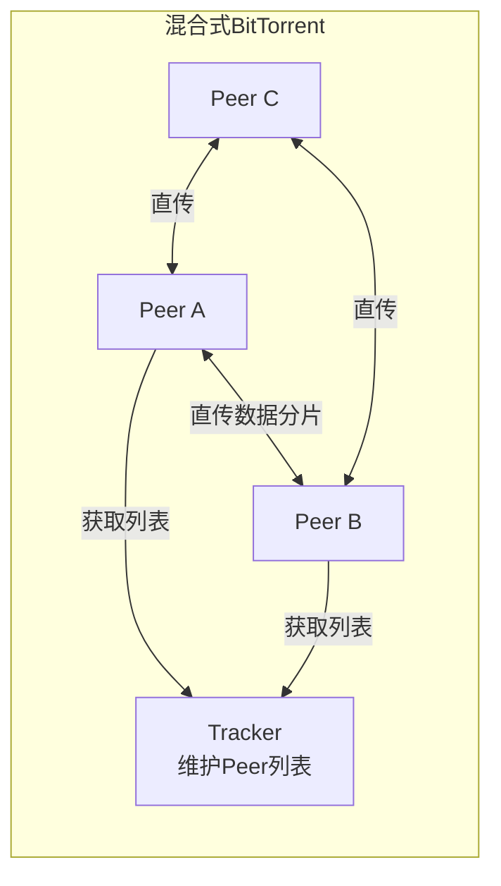
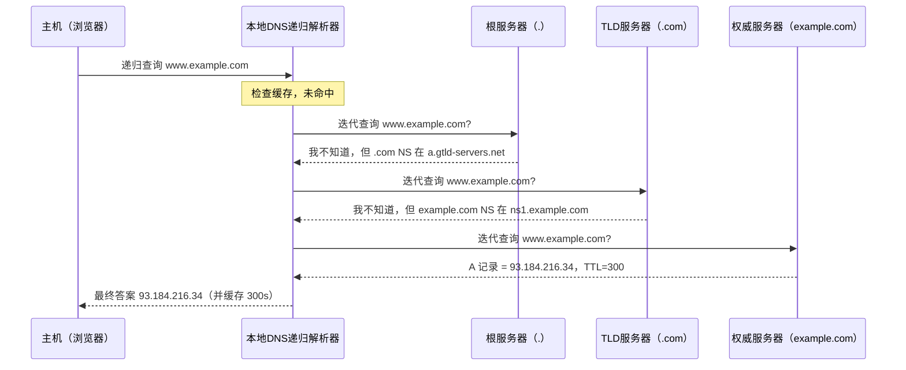
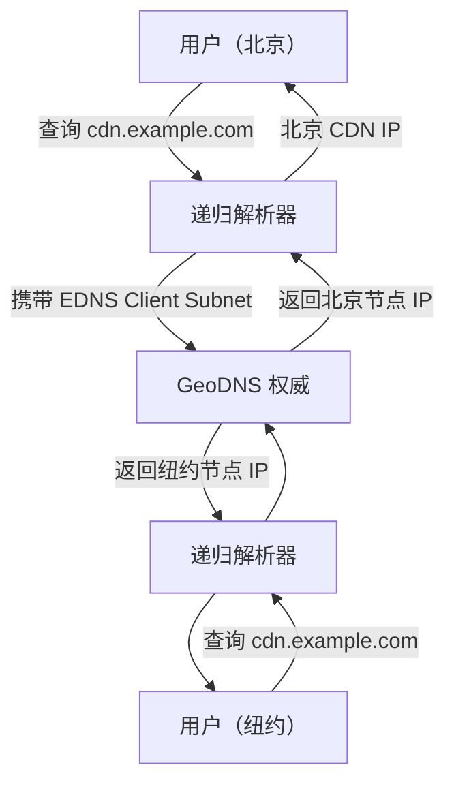
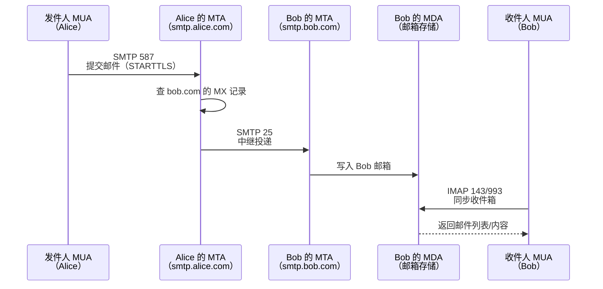
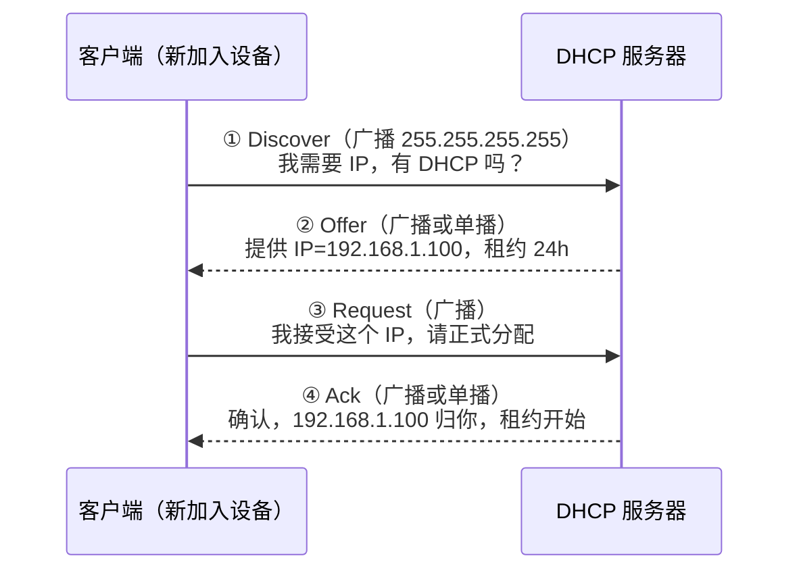
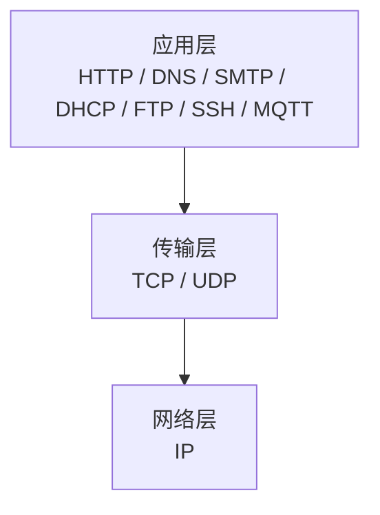

# 详解网络协议(九)应用层

> [!abstract] 速览
> **应用层（Application Layer）** 是 OSI 第 7 层（也是 [[10.TCP-IP四层模型|TCP/IP]] 四层的最上层，合并了 OSI 的会话 / 表示 / 应用），**直接面向用户程序**，承载真正有业务语义的协议：[[18.HTTP-HTTPS协议|HTTP]]、DNS、[[20.FTP-TFTP-SFTP协议|FTP]]、SMTP、[[21.SSH协议|SSH]]……
> PDU：**报文 / 数据**。
> 本文同时承担 **DNS 详解**，涵盖记录类型、递归/迭代查询、DoT/DoH、DNSSEC、GeoDNS 等内容。

## 1. 通信模型

### 1.1 三种基础模型对比

| 模型 | 特点 | 代表协议 / 场景 | 优缺点 |
| --- | --- | --- | --- |
| **C/S（Client/Server）** | 服务器集中提供服务，客户端发起请求 | 数据库、DNS、SMTP | 管理简单，但服务器单点故障、扩展成本高 |
| **B/S（Browser/Server）** | 浏览器作通用客户端，服务器提供 Web 服务 | HTTP/HTTPS Web 应用 | 部署升级方便，重度依赖 HTTP/HTTPS |
| **P2P（Peer-to-Peer，对等）** | 节点既是客户端又是服务器 | BitTorrent、早期 Skype、区块链 | 无中心单点、弹性强，发现/协调复杂 |

### 1.2 P2P 的两种拓扑

**非结构化 P2P**（Gnutella 风格）：节点随机互连，搜索靠洪泛（flooding），开销大、命中不保证。

**结构化 P2P——DHT（Distributed Hash Table，分布式哈希表）**：节点和资源都映射到同一逻辑环（如 Chord）或树，查找 O(log N) 跳可定位，代表实现有 Kademlia（BitTorrent DHT 使用）。

**混合式 P2P**（BitTorrent + Tracker）：
- Tracker 服务器集中维护"谁在下载这个种子"的 Peer 列表（中心化发现）；
- 实际文件数据在 Peer 之间直传，支持"分片并行从多源下载"；
- 后来加入 DHT 扩展，使 Tracker 宕机后仍能找 Peer（去中心化发现）。



> [!tip] 口诀
> **C/S：客问服答；B/S：浏览器敲门；P2P：人人即是服务器。**

---

## 2. 应用层协议的设计维度

在学习具体协议前，先理解"设计一个应用层协议要做哪些决策"，有助于一眼看穿协议本质。

### 2.1 文本协议 vs 二进制协议

| 维度 | 文本协议（HTTP/1.1、SMTP） | 二进制协议（HTTP/2、Protobuf、MQTT） |
| --- | --- | --- |
| 可读性 | 人类可直接阅读、调试简单 | 需专用工具解析 |
| 效率 | 体积大、解析慢 | 体积小、解析快、对齐友好 |
| 扩展性 | 添加头字段即可 | 需版本字段或 TLV 扩展 |
| 典型代表 | HTTP/1.1、FTP 控制、SMTP | HTTP/2、DNS wire format、MQTT |

### 2.2 交互模式

| 模式 | 说明 | 代表 |
| --- | --- | --- |
| **请求-响应（Request/Response）** | 客户端发请求，服务器回一个响应 | HTTP、DNS、FTP |
| **发布-订阅（Pub/Sub）** | 生产者发布到主题，订阅者异步收到 | MQTT、AMQP |
| **流式（Streaming）** | 建连后持续双向推送数据 | WebSocket、RTP、gRPC streaming |
| **推送（Push）** | 服务器主动推消息给客户端 | APNS、FCM、Server-Sent Events |

### 2.3 有状态 vs 无状态

- **无状态**：服务器不保存请求上下文，每次请求完全独立。优点是易水平扩展、易容灾（HTTP 本质无状态）。
- **有状态**：服务器记住会话（如 FTP 命令连接、SSH 会话、数据库连接）。优点是交互更自然，代价是扩展复杂、需要会话粘连（Sticky Session）。

> [!note] HTTP "无状态"不代表用户无状态
> HTTP 靠 Cookie/Session/Token 在无状态协议上**模拟**了有状态的登录态，这是应用层自己的工作，与协议本身无关。

### 2.4 选 TCP 还是 UDP

| 场景 | 推荐传输层 | 原因 |
| --- | --- | --- |
| 文件传输、邮件、Web、SSH | TCP | 需要可靠、有序的字节流 |
| DNS 查询（正常情况） | UDP | 单包来回，快；99% 情况 < 512 字节 |
| 实时音视频、在线游戏 | UDP | 低时延优先，少量丢帧可接受 |
| DNS 区域传送、长响应 | TCP | 数据量大，需可靠 |
| QUIC / HTTP/3 | UDP（QUIC 自带可靠层） | 0-RTT、多路复用、无头阻塞 |

### 2.5 知名端口约定

端口号属于**传输层**，但应用层协议约定了"默认停靠哪个港口"。IANA 把端口分三段：

- **0–1023（Well-Known Ports）**：系统保留，需 root / 管理员权限绑定。
- **1024–49151（Registered Ports）**：第三方应用注册。
- **49152–65535（Dynamic / Private）**：临时端口，客户端随机使用。

---

## 3. 常见应用层协议总览

| 用途类别 | 协议 | 传输层 | 默认端口 | 加密版 / 替代 |
| --- | --- | --- | --- | --- |
| **Web** | [[18.HTTP-HTTPS协议\|HTTP]] | TCP | 80 | HTTPS（443） |
| **Web 加密** | [[18.HTTP-HTTPS协议\|HTTPS]] | TCP（TLS） | 443 | — |
| **Web 全双工** | [[19.websocket协议\|WebSocket]] | TCP | 80/443 | WSS（TLS） |
| **HTTP/3** | HTTP/3（QUIC） | UDP（QUIC） | 443 | — |
| **文件传输** | [[20.FTP-TFTP-SFTP协议\|FTP]] | TCP | 21（控制）/20（数据） | SFTP（SSH）、FTPS |
| **简单文件** | TFTP | UDP | 69 | — |
| **邮件发送** | SMTP | TCP | 25（中继）/ 587（提交）/ 465（SSL） | — |
| **邮件收取** | POP3 | TCP | 110 | POP3S（995） |
| **邮件同步** | IMAP | TCP | 143 | IMAPS（993） |
| **域名解析** | DNS | UDP / TCP | 53 | DoT（853）、DoH（443） |
| **动态地址** | DHCP | UDP | 67（服务器）/ 68（客户端） | — |
| **远程登录** | [[21.SSH协议\|SSH]] | TCP | 22 | — |
| **远程明文** | [[22.Telnet协议\|Telnet]] | TCP | 23 | 已被 SSH 取代 |
| **目录服务** | LDAP | TCP / UDP | 389 | LDAPS（636） |
| **网络管理** | SNMP | UDP | 161（查询）/ 162（Trap） | SNMPv3（加密） |
| **时间同步** | NTP | UDP | 123 | — |
| **实时音视频流** | RTP / RTCP | UDP | 动态 | SRTP（加密） |
| **流媒体控制** | RTSP | TCP / UDP | 554 | — |
| **VoIP 信令** | SIP | TCP / UDP | 5060 / 5061（TLS） | — |
| **IoT 消息** | MQTT | TCP | 1883 | MQTTS（8883） |
| **IoT 受限环境** | CoAP | UDP | 5683 | CoAPs（5684，DTLS） |
| **企业消息队列** | AMQP | TCP | 5672 | — |

> [!tip] 记忆口诀（端口）
> **DNS=53，HTTP=80，HTTPS=443，SMTP=25/587，SSH=22，FTP=21，DHCP=67/68**——把这几个背熟，其余考场查表即可。

---

## 3.5 六类协议核心概念补强

本节对汇总表中仅一行概述的六个协议做最低限度的核心概念梳理，帮助理解其工作原理与适用场景。

### MQTT：轻量发布-订阅消息协议

> 完整详解见 [[23.MQTT协议]]，本节只做核心要点速览。

**MQTT（Message Queuing Telemetry Transport）** 是基于 TCP 的二进制协议，采用**发布-订阅（Pub/Sub）模型**，通信双方均不直接连接，而是通过中间的 **Broker（消息代理）** 转发消息。

**核心机制：**

- **主题（Topic）**：消息路由的地址字符串，支持通配符（`+` 单级，`#` 多级），如 `sensors/+/temperature`。
- **QoS 三级**：
  - QoS 0（At most once）：发后不管，可能丢失；
  - QoS 1（At least once）：至少到达一次，可能重复，需 PUBACK 确认；
  - QoS 2（Exactly once）：四步握手（PUBLISH→PUBREC→PUBREL→PUBCOMP）保证恰好一次。
- **遗嘱消息（Last Will and Testament, LWT）**：客户端连接时预设遗嘱；若异常断线，Broker 自动发布该消息，通知其他订阅者节点下线。
- **保留消息（Retained Message）**：Broker 缓存最新一条消息，新订阅者立刻收到最近状态，无需等待下一次发布。

默认端口：**1883（明文）/ 8883（MQTTS，TLS）**。适用于 IoT 设备、移动端推送等低带宽、不稳定网络场景。

---

### CoAP：受限设备的类 REST 协议

**CoAP（Constrained Application Protocol，受限应用协议）** 由 RFC 7252 定义，专为 MCU 级 IoT 设备（ROM/RAM 极为有限）设计，运行在 **UDP** 之上（加密版 CoAPs 基于 DTLS，端口 5684）。

**设计理念：**

CoAP 在语义上模仿 HTTP REST，但极度精简——固定头仅 4 字节，支持 **GET / POST / PUT / DELETE** 四种方法，响应码体系（2.xx/4.xx/5.xx）与 HTTP 类似，且与 HTTP 可通过代理（Proxy）双向映射。

**消息类型：**

| 类型 | 缩写 | 说明 |
| --- | --- | --- |
| 可确认消息 | CON | 需对端回 ACK；超时重传，保证送达 |
| 非确认消息 | NON | 发后不管，适合低重要性传感数据 |
| 确认 | ACK | 对 CON 的应答，可携带响应数据（Piggybacked） |
| 重置 | RST | 拒绝无法处理的消息 |

**Observe 机制（RFC 7641）**：客户端在 GET 请求中携带 Observe 选项，服务端资源变化时主动推送通知，避免轮询——IoT 场景的"订阅推送"。

**与 HTTP 对比：** HTTP 基于 TCP、头部开销大，不适合资源极度受限的节点；CoAP 基于 UDP、头部仅 4 字节，天然适合嵌入式 IoT 设备（如温湿度传感器、智能电表）。

---

### SNMP：网络设备管理协议

> 完整详解见 [[27.SNMP协议]]，本节只做核心要点速览。

**SNMP（Simple Network Management Protocol）** 是管理网络设备（路由器、交换机、服务器）的标准协议，基于 UDP（查询端口 161，Trap 端口 162）。

**核心概念：**

- **MIB（Management Information Base，管理信息库）**：以树状结构（ASN.1 OID）组织的管理对象定义集合，描述"可查询/设置哪些变量"。
- **OID（Object Identifier）**：如 `1.3.6.1.2.1.1.1.0`（sysDescr）唯一标识某个管理对象。
- **PDU 操作类型**：
  - `GetRequest`：管理端读取指定 OID 的值；
  - `SetRequest`：管理端设置 OID 的值；
  - `GetNextRequest`：遍历 MIB 树；
  - `Trap`（v1）/ `InformRequest`（v2c）：被管设备主动通知管理端（告警、状态变更）。

**版本安全演进：**

| 版本 | 认证机制 | 加密 | 说明 |
| --- | --- | --- | --- |
| v1 | 社区字符串（明文） | 无 | 安全性极差，仅在隔离内网使用 |
| v2c | 社区字符串（明文） | 无 | 增加了 Bulk 操作和 Inform，认证仍弱 |
| v3 | 用户名 + HMAC-MD5/SHA | DES/AES | 提供认证（authNoPriv）或认证+加密（authPriv）两种安全级别 |

生产环境中如必须使用 SNMP，应**强制使用 v3**，并配置 `authPriv` 模式。

---

### NTP：网络时间同步协议

> 完整详解见 [[26.NTP与PTP协议]]，本节只做核心要点速览。

**NTP（Network Time Protocol）** 用于通过网络将计算机时钟与权威时间源同步，基于 UDP 端口 123，精度可达毫秒级（广域网），局域网内更可达微秒级。

**Stratum 层级结构：**

- **Stratum 0**：直接连接的高精度时源（GPS 接收机、原子钟），不直接联网；
- **Stratum 1**：直接从 Stratum 0 获取时间的服务器（一级时间服务器）；
- **Stratum 2**：从 Stratum 1 同步的服务器；以此类推，最多 15 级（16 表示不可达）。
- 层级越低，精度越高；一般企业内网用 Stratum 2~3 即可。

**四时间戳偏移计算：**

NTP 报文包含四个时间戳：T1（客户端发送）、T2（服务端接收）、T3（服务端发送）、T4（客户端接收），利用这四个时间戳计算：

```
往返延迟 RTT  = (T4 - T1) - (T3 - T2)
时钟偏移 offset = ((T2 - T1) + (T3 - T4)) / 2
```

客户端据此调整本地时钟，补偿网络传播延迟，实现高精度同步。

---

### SIP：会话发起协议

> SIP 工作在 OSI 会话层/应用层，与 [[07.会话层]] 中的会话控制概念高度相关。

**SIP（Session Initiation Protocol，会话发起协议）** 由 RFC 3261 定义，是 VoIP、视频会议、WebRTC 的核心**信令协议**，负责会话的建立、修改与终止（SIP 只管信令，媒体数据另由 RTP/RTCP 承载）。

**核心方法（Method）：**

| 方法 | 作用 |
| --- | --- |
| `INVITE` | 发起会话邀请（呼叫对端） |
| `ACK` | 确认 INVITE 的最终响应，完成三次握手 |
| `BYE` | 终止已建立的会话（挂断） |
| `CANCEL` | 取消尚未完成的 INVITE |
| `REGISTER` | 向 SIP 注册服务器注册当前位置（用户代理的 URI 绑定） |
| `OPTIONS` | 查询对端能力 |

**SDP（Session Description Protocol）**：SIP 的 INVITE 报文体中携带 SDP，描述媒体会话参数：IP 地址、端口、编解码格式（G.711/G.729/Opus）、媒体类型（audio/video）等，双方通过 SDP Offer/Answer 协商参数。

**与 WebRTC 的关系：** WebRTC 信令层可使用 SIP，也可使用自定义 WebSocket 信令；媒体传输同样基于 RTP/SRTP。SIP 是运营商级 VoIP 的事实标准，WebRTC 则面向浏览器端实时通信。

典型流程：Caller 发 `INVITE`（含 SDP Offer）→ Callee 回 `180 Ringing` → 接听后回 `200 OK`（含 SDP Answer）→ Caller 发 `ACK` → 双向 RTP 媒体流建立。

---

### AMQP：企业级消息队列协议

**AMQP（Advanced Message Queuing Protocol，高级消息队列协议）** 是面向企业消息中间件的开放标准协议，基于 TCP 端口 5672（加密版 5671）。RabbitMQ 是最广泛使用的 AMQP Broker 实现。

**核心模型：**

- **Exchange（交换机）**：消息的入口，生产者将消息发布到 Exchange，而非直接发队列。Exchange 根据路由规则将消息分发到绑定的队列。Exchange 类型：
  - `direct`：精确匹配 routing-key；
  - `topic`：通配符匹配（`*` 单词，`#` 多词），如 `log.error.#`；
  - `fanout`：广播到所有绑定队列，忽略 routing-key；
  - `headers`：按消息头属性匹配。
- **Queue（队列）**：消息的存储与投递单元，消费者从队列消费消息。
- **Binding（绑定）**：Queue 与 Exchange 之间的关联规则，附带 routing-key。
- **Routing Key（路由键）**：生产者发布消息时指定，Exchange 据此路由。

**可靠投递机制：**
- Publisher Confirm：Broker 收到消息后向生产者回 ACK；
- Consumer ACK/NACK：消费者处理完毕回 ACK，否则回 NACK 触发重新投递；
- 持久化（durable queue + persistent message）：防止 Broker 重启丢消息。

**AMQP vs MQTT 定位差异：**

| 维度 | MQTT | AMQP |
| --- | --- | --- |
| 设计目标 | 轻量 IoT、低带宽不稳定网络 | 企业消息中间件、高可靠、丰富路由 |
| 协议复杂度 | 极简（固定头 2 字节） | 复杂（Exchange/Queue/Binding 模型） |
| 典型场景 | 传感器数据上报、移动推送 | 微服务解耦、任务队列、事件驱动架构 |
| 代表实现 | EMQ X、Mosquitto | RabbitMQ、ActiveMQ |

---

## 4. DNS：互联网的"电话簿"

> DNS（Domain Name System，域名系统）把人类可读的域名翻译成机器可路由的 IP 地址，是互联网最关键的基础设施之一。RFC 1034/1035 奠基，后经数十个 RFC 补充扩展。

### 4.1 层级结构：树形命名空间

```
.（根，Root）
├── com
│   ├── example
│   │   └── www   ← www.example.com
│   └── google
├── cn
│   └── baidu
└── org
    └── wikipedia
```

- **根域（Root）**：用 `.` 表示，逻辑上在顶端，由 ICANN 管理，全球 13 组根服务器（A–M），每组多台任播（Anycast）节点，实际超过 1500 台物理机器。
- **顶级域 TLD（Top-Level Domain）**：`.com`、`.cn`、`.org`、`.io` 等，由各注册局管理。
- **二级域**：如 `example.com`，由注册人控制。
- **子域**：如 `www.example.com`，由二级域所有者自行划分。

### 4.2 DNS 记录类型

| 记录类型 | 全称 | 作用 | 示例 |
| --- | --- | --- | --- |
| **A** | Address | 域名 → IPv4 地址 | `www.example.com. 300 IN A 93.184.216.34` |
| **AAAA** | IPv6 Address | 域名 → IPv6 地址 | `www.example.com. 300 IN AAAA 2606:2800:220:1::93` |
| **CNAME** | Canonical Name | 别名 → 规范名 | `blog.example.com. CNAME example.com.` |
| **MX** | Mail Exchanger | 邮件服务器，含优先级 | `example.com. MX 10 mail.example.com.` |
| **NS** | Name Server | 区域的权威服务器 | `example.com. NS ns1.example.com.` |
| **TXT** | Text | 任意文本，常用于 SPF/DKIM/DMARC | `example.com. TXT "v=spf1 include:..."` |
| **PTR** | Pointer | IP → 域名（反向解析） | `34.216.184.93.in-addr.arpa. PTR www.example.com.` |
| **SOA** | Start of Authority | 区域元数据（主 NS、邮箱、序列号、刷新间隔等） | 每个区域必有一条 |
| **SRV** | Service | 服务位置（主机 + 端口），常用于 SIP/XMPP | `_sip._tcp.example.com. SRV 0 5 5060 sip.example.com.` |
| **CAA** | Certification Authority Authorization | 限定哪些 CA 可签发证书 | `example.com. CAA 0 issue "letsencrypt.org"` |

> [!warning] CNAME 注意事项
> - CNAME 指向的目标**必须是域名，不能是 IP**。
> - 域的 **apex（裸域，如 `example.com`）不能设 CNAME**（因为 apex 必须有 SOA/NS），这就是 CDN 服务商发明 ALIAS / ANAME 记录来绕过的原因。
> - 一条域名路径上只能有一个 CNAME（不能 CNAME 套 CNAME 套 A 超过链路长度限制）。

### 4.3 递归查询 vs 迭代查询

**递归查询**：客户端把"找到最终答案"的任务全权委托给本地 DNS 解析器（Recursive Resolver），解析器负责从头追问到底，客户端只等结果。
**迭代查询**：解析器每次向权威服务器问路，权威只告诉"下一步去问谁"，解析器自己一步步追踪。

**实际工作流程（混合）**：客户端对本地解析器用递归；本地解析器对根/TLD/权威用迭代。



> [!tip] 三级服务器口诀
> **根服务器管"去哪个 TLD"；TLD 管"去哪个权威"；权威管"真正的 IP 是什么"。**

### 4.4 缓存与 TTL

- 每条 DNS 记录都有 **TTL（Time to Live，生存时间）**，单位秒，表示解析器最多缓存这条记录多久。
- 缓存层次：操作系统 DNS 缓存 → 浏览器 DNS 缓存 → 本地解析器缓存。
- **TTL 设短**（如 60s）：切换 IP 时生效快，但查询量翻倍，增加权威服务器压力。
- **TTL 设长**（如 86400s）：缓存命中率高、延迟低，但 IP 变更后老缓存持续时间久。
- 迁移服务器前最佳实践：提前将 TTL 降至 60–300s，迁移完成稳定后再调高。

### 4.5 正向解析 vs 反向解析（PTR）

| 类型 | 方向 | 记录类型 | 用途 |
| --- | --- | --- | --- |
| 正向解析 | 域名 → IP | A / AAAA | 绝大多数场景 |
| 反向解析 | IP → 域名 | PTR | 邮件反垃圾（验证发件服务器）、日志审计、SSH 登录主机名展示 |

反向解析域：IPv4 地址 `1.2.3.4` 的 PTR 查询域为 `4.3.2.1.in-addr.arpa.`（字节序倒转）；IPv6 同理使用 `ip6.arpa.`。

### 4.6 DNS 何时用 TCP

DNS 默认用 **UDP 53**，但以下情况切换到 **TCP 53**：

1. 响应超过 **512 字节**（传统限制）或超过 EDNS0 协商的大小（通常 4096 字节）；
2. **区域传送（Zone Transfer，AXFR/IXFR）**：主从 DNS 同步整个区域数据；
3. 客户端收到 UDP 响应带 **TC（Truncated）标志**，表示响应被截断，需改用 TCP 重试。

### 4.7 加密 DNS：DoT / DoH

传统 DNS 查询**明文传输**，ISP、中间人可任意窥探、篡改（DNS 劫持）。

| 方案 | 全称 | 传输协议 | 端口 | 特点 |
| --- | --- | --- | --- | --- |
| **DoT** | DNS over TLS | TCP + TLS | 853 | 独立端口，易被防火墙识别/封锁 |
| **DoH** | DNS over HTTPS | HTTPS | 443 | 混在 Web 流量里，防火墙难区分；浏览器原生支持（Chrome、Firefox） |
| **DoQ** | DNS over QUIC | QUIC | 853 | 最新标准，低延迟 |

> [!note] DoH 争议
> DoH 使 DNS 查询"隐藏"在 HTTPS 流量中，对企业网络过滤（家长控制、安全策略）带来挑战。Chrome 的 DoH 默认行为曾引发企业管理员强烈反弹。

### 4.8 DNSSEC：防篡改签名

DNSSEC（DNS Security Extensions）在 DNS 数据上加**数字签名**，解析器可验证记录真实性，防止中间人替换应答（DNS 投毒 / 缓存污染）。

关键记录类型：
- **RRSIG**：对资源记录集的签名。
- **DNSKEY**：公钥，用于验证 RRSIG。
- **DS（Delegation Signer）**：子区域的 DNSKEY 哈希，存在父区域，构成信任链。
- **NSEC / NSEC3**：证明"某域名不存在"（已认证否定存在）。

信任链：根域的 KSK（Key Signing Key）由 ICANN 管理，作为最终信任锚。

> [!warning] DNSSEC 并不加密内容
> DNSSEC 只做**真实性验证**（防篡改），DNS 内容仍然明文传输，隐私需另加 DoT/DoH。

### 4.9 GeoDNS / 智能解析与 CDN 调度

**GeoDNS / 智能解析**：权威服务器根据查询来源 IP 的地理位置（或 EDNS Client Subnet 字段携带的客户端子网），返回**不同的 A/CNAME 记录**：
- 将用户引导到最近的 CDN 节点或就近数据中心；
- 实现全球就近接入，降低延迟；
- CDN 服务商（Cloudflare、Akamai、阿里云 CDN）大量使用此机制。

**DNS 负载均衡（DNS Round Robin）**：同一域名返回多个 A 记录，客户端随机选一个，从而粗粒度分流请求。缺点是不感知服务器真实健康状态，需配合健康检查（Anycast 或 GTM 全流量管理）。



---

## 5. 电子邮件系统

### 5.1 三类角色

| 角色 | 全称 | 说明 | 代表软件 |
| --- | --- | --- | --- |
| **MUA** | Mail User Agent，邮件用户代理 | 用户撰写/阅读邮件的客户端 | Outlook、Thunderbird、网页邮箱 |
| **MTA** | Mail Transfer Agent，邮件传输代理 | 在服务器间中继传送邮件 | Postfix、Sendmail、Exchange |
| **MDA** | Mail Delivery Agent，邮件投递代理 | 把邮件写入用户邮箱 | Dovecot（也兼 IMAP/POP3 服务） |

### 5.2 协议与端口

| 协议 | 用途 | 端口 | 说明 |
| --- | --- | --- | --- |
| **SMTP** | 发送 / 中继 | 25（MTA↔MTA）/ 587（MUA→MTA 提交）/ 465（SMTPS，旧） | 25 端口常被 ISP 封锁以阻止垃圾邮件 |
| **POP3** | 下载邮件（离线） | 110 / 995（TLS） | 邮件下载后从服务器删除（可选保留），不支持多设备同步 |
| **IMAP** | 同步邮件（在线） | 143 / 993（TLS） | 邮件保留在服务器，多设备状态同步，支持文件夹、搜索 |

> [!tip] POP3 vs IMAP 选哪个
> 现代多设备场景一律选 **IMAP**（或直接用网页/API），POP3 只在离线存档、磁盘带宽受限等特殊场景使用。

### 5.3 完整收发流程



### 5.4 MIME：多媒体邮件

原始 SMTP 只支持 ASCII 文本。**MIME（Multipurpose Internet Mail Extensions）** 扩展了邮件格式，支持：
- 非 ASCII 字符（UTF-8，Subject: 用 `=?UTF-8?B?...?=` 编码）；
- 附件（`Content-Type: application/octet-stream`）；
- HTML 正文（`Content-Type: text/html`）；
- 多部分混合（`Content-Type: multipart/mixed`）。

### 5.5 反垃圾三件套：SPF / DKIM / DMARC

| 机制 | 作用 | 配置位置 | 验证方式 |
| --- | --- | --- | --- |
| **SPF**（Sender Policy Framework） | 声明哪些 IP 可以代表此域发邮件 | 发件域 TXT 记录 | 收件 MTA 查发件域 SPF，验证 SMTP MAIL FROM 的 IP |
| **DKIM**（DomainKeys Identified Mail） | 对邮件头+体签名，防篡改 | 发件域 TXT 公钥 + MTA 私钥签名 | 收件 MTA 取公钥验签 |
| **DMARC**（Domain-based Message Authentication, Reporting & Conformance） | 组合 SPF/DKIM，规定验证失败的处置策略（none/quarantine/reject）并收集报告 | 发件域 `_dmarc` TXT 记录 | 基于 SPF/DKIM 结果执行策略 |

> [!tip] 为什么三个都要配
> SPF 防 IP 伪造；DKIM 防内容篡改；DMARC 将两者绑定到"From"域并报告异常。三者缺一，垃圾邮件过滤评分都会下降，极可能进垃圾箱。

---

## 6. DHCP：动态分配 IP

**DHCP（Dynamic Host Configuration Protocol）** 让设备接入网络时自动获取 IP 地址、子网掩码、默认网关、DNS 服务器等配置，无需手动输入。

### 6.1 DORA 四步握手

DHCP 使用 **UDP**（客户端 → 广播，DHCP 服务器端口 67，客户端端口 68）。



口诀：**D-O-R-A = Discover → Offer → Request → Ack**

### 6.2 租约（Lease）与续租

- **租约**：DHCP 分配的 IP 不是永久的，有到期时间（Lease Time）。
- **续租（Renew）**：到租约期 50% 时，客户端向原 DHCP 服务器单播发 DHCP Request 请求续租；到 87.5% 时若未成功，再广播尝试；到期仍未续则放弃 IP，重走 DORA。
- **DHCP Relay**：大型网络中，每个子网部署一台 DHCP 代理，把本地广播转为单播转发给中央 DHCP 服务器，无需每子网都部署一台服务器。

---

## 7. 与下层的关系

应用层协议几乎都跑在 [[13.TCP协议|TCP]] 或 [[16.UDP协议|UDP]] 之上：要可靠用 TCP（HTTP、FTP、SMTP、SSH），要快用 UDP（DNS 查询、实时音视频）。



> [!note] QUIC 的特殊地位
> HTTP/3 跑在 **QUIC** 上，QUIC 基于 UDP 但自带可靠传输、多路复用、0-RTT 握手。可以理解为"UDP + 自带 TCP 可靠性 + TLS 1.3"的新型传输层。HTTP/3 与 HTTP/2 相比，消除了 TCP 的队头阻塞。

---

## 8. 常见误区辨析

> [!warning] 常见误区
> - **HTTP 是"无状态"的**：协议本身不记得上次请求，"登录态"靠应用层 Cookie / Session 维持（见 [[07.会话层]]）。
> - **端口号属于传输层**，应用层只是约定俗成地使用它们。
> - **DNS 主要用 UDP**（快、单包搞定），响应过大（TC 标志）或区域传送时改用 TCP。
> - **DHCP 用广播**（D/R 步骤），这就是为什么同子网才能直接收到 DHCP Offer，跨子网需要 DHCP Relay。
> - **SMTP 端口 25 和 587 不同**：25 是 MTA↔MTA 中继（多被 ISP 封）；587 是 MUA→MTA 提交（需 STARTTLS + 认证），客户端发邮件应用 587。
> - **CNAME 不能用于裸域（apex）**：`example.com` 不能设 CNAME，需用 A/AAAA 或 CDN 提供的 ALIAS/ANAME 记录。
> - **DNSSEC 不加密**：只保证真实性，不保护隐私；隐私需另加 DoT/DoH。
> - **POP3 和 IMAP 都是收件协议，发件是 SMTP**：混淆方向是高频笔误。
> - **DNS TTL 是"最大"缓存时间**：解析器可以比 TTL 更早丢弃缓存，但不能超过 TTL 缓存。
> - **DHCP 是无连接 UDP**，即使 IP 还没分配也可以用广播通信，因为 DHCP 用的是链路层广播，不依赖 IP 路由。

---

## 9. 面试高频考点速查

| 问题 | 要点 |
| --- | --- |
| DNS 查询流程？ | 浏览器缓存 → OS 缓存 → 本地递归解析器 → 根 → TLD → 权威，递归+迭代混合 |
| DNS 为什么用 UDP？什么时候改 TCP？ | 快、单包；响应超大（TC=1）或区域传送时用 TCP |
| DoH vs DoT？ | 都加密 DNS；DoH 走 443 混在 HTTPS 里难被过滤，DoT 走 853 独立端口 |
| SMTP 25/465/587 区别？ | 25=中继；587=客户端提交（STARTTLS）；465=旧版 SMTPS（SSL） |
| POP3 vs IMAP？ | POP3 下载删除、单设备；IMAP 服务器保留、多设备同步 |
| DHCP DORA 流程？ | Discover（广播）→ Offer → Request（广播）→ Ack |
| SPF/DKIM/DMARC 作用？ | SPF=IP白名单；DKIM=签名防篡改；DMARC=组合策略+报告 |
| DNSSEC 防什么、不防什么？ | 防记录篡改/缓存投毒；不加密，不防隐私泄露 |
| GeoDNS 原理？ | 权威服务器按来源 IP 地理位置返回不同 A 记录，实现就近访问 |
| 什么是 CNAME Flattening？ | CDN 用 ALIAS/ANAME 在 apex 域实现 CNAME 语义，规避 apex 不能用 CNAME 的限制 |

---

## 延伸阅读

- 下层：[[08.表示层]]　模型：[[10.TCP-IP四层模型]]
- 应用协议详解：[[18.HTTP-HTTPS协议]] · [[19.websocket协议]] · [[20.FTP-TFTP-SFTP协议]] · [[21.SSH协议]] · [[22.Telnet协议]]

> ⬅️ [[08.表示层]] ｜ 🏠 [[00.网络协议详解总览]] ｜ [[10.TCP-IP四层模型]] ➡️
