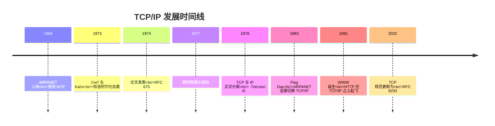
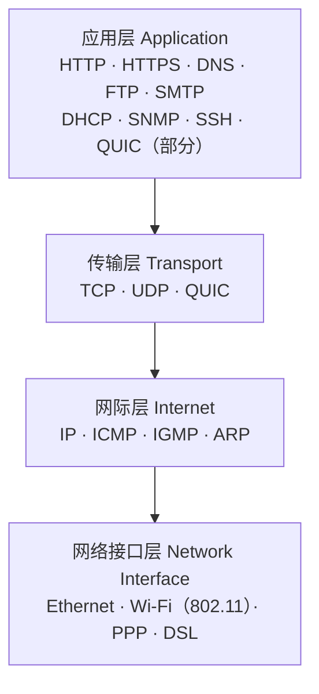
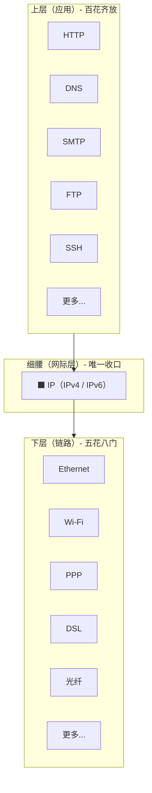
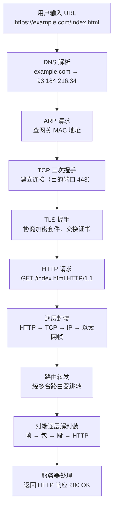
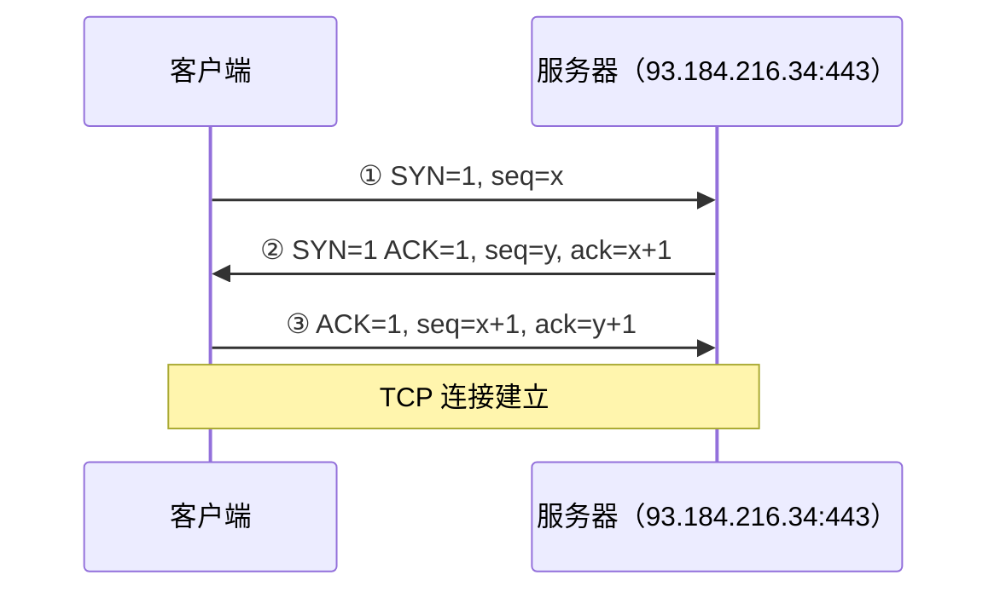
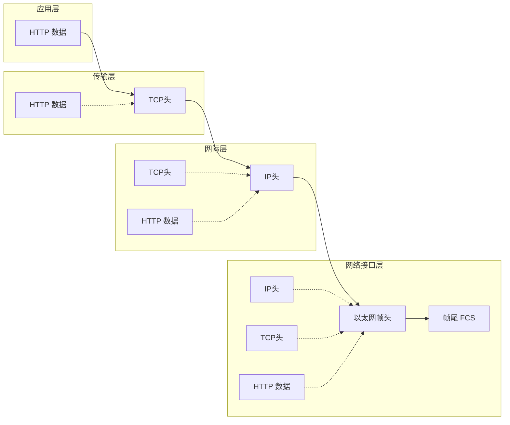

# 详解网络协议(十) TCP/IP四层模型

> [!abstract] 速览
> **TCP/IP 四层模型**是**真正运行在互联网上**的协议体系，比 [[02.OSI七层参考模型|OSI 七层]]更精简实用：自上而下为**应用层、传输层、网际层、网络接口层**。它把 OSI 的会话/表示/应用合三为一，把数据链路/物理合二为一。名字取自其两大核心协议——[[13.TCP协议|TCP]] 与 [[11.IP协议|IP]]。诞生于 ARPANET 时代，1983 年"旗帜日"正式统一互联网，此后半个世纪始终是全球互联网的基石。

## 1. 历史：从 ARPANET 到 Flag Day

### 1.1 背景：NCP 的局限

1960 年代末，ARPANET 使用的是 **NCP（Network Control Protocol，网络控制协议）**。NCP 天生只为 ARPANET 一张网设计，无法跨越不同网络——数据包一旦出了 ARPANET 边界便无所适从。与此同时，世界各地的分组交换网络（卫星网、无线电网等）如雨后春笋般涌现，彼此互不相通，成了"巴别塔"困境。

### 1.2 Cerf 与 Kahn：1973 年的那次会面

1973 年春，**Vint Cerf**（时任斯坦福教授）与 **Bob Kahn**（DARPA 项目主任）在帕洛阿尔托一家酒店相遇，在白板前用数月时间勾画出一套能让不同网络互联的协议架构。核心思路是：**网络内部的细节由各自网络负责，跨网络的统一胶水由新协议承担**——这就是 TCP/IP 的灵魂。

### 1.3 1974 年论文：TCP 诞生

**1974 年 5 月**，IEEE《通信汇刊》刊出 Cerf 与 Kahn 的论文《A Protocol for Packet Network Intercommunication》，首次正式描述了 **TCP（Transmission Control Protocol）**。同年 12 月，Cerf、Yogen Dalal 与 Carl Sunshine 在斯坦福完成了规范草稿（**RFC 675**），随后 Stanford、BBN、UCL（伦敦大学学院）三地同步开始实现。

> [!note] 点睛
> 1974 年的 TCP 是一体化的——把今天 TCP 与 IP 的职责都装在了一个协议里。那时"分层"的思想还在演化中。

### 1.4 TCP 与 IP 的分离（1978）

1977 年，Kahn 团队完成了一次跨四张网（加州无线电包网、挪威卫星、ARPANET 东部、有线网关）的演示，证明统一协议确实可行。随后在 1978 年（**Version 4** 重构），受到法国 CYCLADES 项目和 Xerox PARC 的 Bob Metcalfe 的启发，原先的大一统 TCP 被**拆分为两层**：

- **IP（Internet Protocol）**：负责跨网络寻址与数据报转发（不可靠）；
- **TCP（Transmission Control Protocol）**：在 IP 之上提供可靠传输。

这一"分离"奠定了今天 TCP/IP 模型的分层哲学：**网络层只管转发，传输层管可靠性**。

### 1.5 1983-01-01：Flag Day（旗帜日）

经过超过两年的大规模准备——为每一台 ARPANET 主机重写 TCP/IP 协议栈、培训操作员、测试再测试——**1983 年 1 月 1 日**，DARPA 要求 ARPANET 所有主机全面切换：**以 TCP/IP 取代 NCP**。这一天被业界称为 **"Flag Day（旗帜日）"**，切换不可逆，当日生效。到 1983 年 6 月迁移全部完成；到 1984 年，已有 100 余所高校和科研机构通过 TCP/IP 互联。



## 2. 四层结构



### 2.1 各层职责与核心协议（详表）

| 层 | 职责 | 核心协议 | 对应 OSI |
| --- | --- | --- | --- |
| **应用层** | 面向应用的语义、格式与业务逻辑 | HTTP/HTTPS、DNS（见 [[09.应用层]]）、FTP、SMTP、DHCP、SNMP、SSH、QUIC（HTTP/3） | 应用层 + 表示层 + 会话层 |
| **传输层** | 进程到进程、端口复用/解复用、可靠性（TCP）或低延迟（UDP） | [[13.TCP协议\|TCP]]、[[16.UDP协议\|UDP]]、QUIC | 传输层 |
| **网际层** | 逻辑寻址（IP 地址）、跨网络路由、数据报转发、差错报告 | [[11.IP协议\|IP]]（IPv4/IPv6）、ICMP、IGMP、ARP（严格说属链路/网际边界） | 网络层 |
| **网络接口层** | 同一链路上的成帧、介质访问控制（MAC）、物理信号编码与传输 | Ethernet（IEEE 802.3）、Wi-Fi（IEEE 802.11）、PPP、DSL、光纤 | 数据链路层 + 物理层 |

> [!tip] 各层协议一句话助记
> - **应用层**：用户能"看见"或"用到"的服务——浏览、传文件、发邮件、获 IP、远程管理。
> - **传输层**："快递员"——TCP 是签收快递（可靠），UDP 是撒传单（快但不管到没到）。
> - **网际层**："地图 + 导航"——IP 地址是门牌号，路由表是导航图，ICMP 是回执单（ping/traceroute）。
> - **网络接口层**："公路 + 车辆"——帧是货车，MAC 地址是车牌，信号编码是道路规则。

### 2.2 各层 PDU / 地址 / 设备对照表

| 层 | PDU 名称 | 地址类型 | 典型设备 |
| --- | --- | --- | --- |
| 应用层 | 消息 / 报文（Message） | URL、域名 | 服务器、代理 |
| 传输层 | 段（Segment，TCP）/ 数据报（Datagram，UDP） | 端口号（16 bit） | 防火墙（L4）、负载均衡 |
| 网际层 | 包（Packet） | IP 地址（32/128 bit） | 路由器 |
| 网络接口层 | 帧（Frame）→ 比特流（Bits） | MAC 地址（48 bit） | 交换机、网卡、AP |

> [!note] 口诀：从上到下，**消息-段-包-帧-比特**；从下到上，**比特-帧-包-段-消息**。

## 3. 与 OSI 的对应

| OSI 七层 | TCP/IP 四层 |
| --- | --- |
| 应用层 / 表示层 / 会话层 | 应用层 |
| 传输层 | 传输层 |
| 网络层 | 网际层 |
| 数据链路层 / 物理层 | 网络接口层 |

→ 模型本身详见 [[02.OSI七层参考模型]]。

### 3.1 四层 vs 五层 vs OSI 七层——三方对照大表

教科书（尤其《计算机网络》谢希仁版）常使用**五层模型**，将 TCP/IP 的网络接口层细分为物理层与数据链路层，方便讲解；工程界则以 TCP/IP 四层为实际标准；国际标准化组织（ISO）推行 OSI 七层。三者对照如下：

| OSI 七层（ISO 标准） | TCP/IP 四层（工程实际） | 五层模型（教科书） | 主要协议举例 |
| --- | --- | --- | --- |
| 7. 应用层 | 应用层 | 5. 应用层 | HTTP、DNS、FTP、SMTP、SSH |
| 6. 表示层 | ↑（同上） | ↑（同上） | TLS/SSL（加解密编解码） |
| 5. 会话层 | ↑（同上） | ↑（同上） | RPC、NetBIOS |
| 4. 传输层 | 传输层 | 4. 传输层 | TCP、UDP、QUIC |
| 3. 网络层 | 网际层 | 3. 网络层 | IP、ICMP、IGMP |
| 2. 数据链路层 | 网络接口层 | 2. 数据链路层 | Ethernet（MAC）、PPP、ARP |
| 1. 物理层 | ↑（同上） | 1. 物理层 | 电信号、光信号、802.11 无线 |

> [!tip] 如何区分
> - **面试/工程**：默认说 TCP/IP **四层**，或 OSI **七层**（当做参考模型讲原理）。
> - **教材/课堂**：常见**五层**（谢希仁教材），把物理与链路分开讲，方便理解。
> - 三者并无本质矛盾，只是**粒度不同**，核心分层思想完全一致。

## 4. IP 沙漏 / 细腰模型（深化）

> [!tip] 沙漏 / 细腰模型
> TCP/IP 的精髓在于**网际层只有 IP 这一个"细腰"**：上面的应用协议百花齐放、下面的链路技术五花八门，但都必须**收敛到 IP**。所谓 "IP over everything, everything over IP"——这正是互联网能无限扩展、不断容纳新技术（新应用、新链路）的关键。

### 4.1 为什么细腰必须是 IP？



细腰的精妙在于**三个解耦**：

1. **上层与下层解耦**：HTTP 程序员不需要知道数据包最终跑在以太网还是 Wi-Fi 上；链路硬件工程师不需要关心上面跑的是什么应用。
2. **创新独立演化**：上层可以随时发明新应用（WebSocket、gRPC……），下层可以随时引入新链路（5G、量子通信……），只要各自能"和 IP 对话"，就能接入互联网。
3. **"异构网络互联"的唯一前提**：任何网络，只要能承载 IP 数据包，就能接入互联网——这是"网络的网络（network of networks）"能成立的数学基础。

### 4.2 IP 细腰的代价

细腰不是没有代价。把所有复杂性押注在 IP 上，意味着 IP 本身必须极简——**只管转发、不管可靠性**（best-effort）。可靠性、安全性、QoS 等高级特性全部向上推到传输层或应用层解决。这也是 TCP、TLS、HTTP/2 流量控制等存在的根本原因。

## 5. 一次完整网页访问的端到端封装实例

以访问 `https://example.com/index.html` 为例，展示从 URL 到比特流的完整旅程。

### 5.1 全流程概览



### 5.2 分步详解

**① DNS 解析（应用层）**

浏览器首先需要把域名 `example.com` 解析为 IP 地址。DNS 查询走 UDP（通常端口 53），若本地缓存命中则直接使用，否则递归查询直到获得 `93.184.216.34`。DNS 相关细节见 [[09.应用层]]。

**② ARP 求网关 MAC（网络接口层 ↔ 网际层边界）**

数据包目的 IP 在不同子网，需经过默认网关（路由器）转发。本机先在 ARP 缓存中查找网关 IP 对应的 MAC 地址；若无缓存，广播发出 **ARP Request**，网关回复自己的 MAC 地址。

**③ TCP 三次握手（传输层）**



**④ TLS 握手（传输层之上、应用层之下）**

TCP 建立后，由于是 HTTPS，还需要 TLS 握手：协商加密算法、服务器发送证书、双方生成会话密钥。之后的 HTTP 通信全部加密。详见 [[15.TLS协议]]。

**⑤ HTTP GET 请求（应用层）**

TLS 建立后，浏览器发出：

```
GET /index.html HTTP/1.1
Host: example.com
```

**⑥ 逐层封装（加头过程）**

| 层 | 操作 | PDU | 新增头部关键字段 |
| --- | --- | --- | --- |
| 应用层 | 构造 HTTP 请求 | HTTP 消息 | Method、Host、Path |
| 传输层 | 加 TCP 头 | TCP 段（Segment） | 源端口（随机高位）、目的端口 443、SEQ/ACK |
| 网际层 | 加 IP 头 | IP 包（Packet） | 源 IP（本机）、目的 IP（93.184.216.34）、TTL |
| 网络接口层 | 加以太网帧头/帧尾 | 以太网帧（Frame） | 源 MAC（本机网卡）、目的 MAC（网关）、类型 0x0800 |



**⑦ 路由转发（网际层）**

以太网帧在本地链路传给网关路由器；路由器**剥掉帧头**，根据 IP 包的目的地址查路由表，选下一跳；**重新加上新帧头**（目的 MAC 换成下一跳的 MAC）再转发。如此**逐跳（hop-by-hop）**，直到到达目标服务器所在局域网。每经过一台路由器，**IP 头中的 TTL 减 1**；若 TTL 归零，路由器丢包并发 ICMP 超时报文（traceroute 就利用了这个机制）。

**⑧ 对端逐层解封装**

服务器网卡收到帧后，**逆序剥头**：

```
以太网帧 → 剥帧头 → IP 包 → 剥 IP 头 → TCP 段 → 剥 TCP 头 → TLS 解密 → HTTP 请求
```

服务器处理 HTTP 请求，返回 `200 OK` 响应，同样经过逐层封装回传给客户端。

> [!note] 关键总结
> - **每层只看自己的头部**，不关心其他层的内容——这正是分层解耦的精髓。
> - **路由器工作在网际层**（剥到 IP 头就决策），**交换机工作在网络接口层**（只看 MAC 地址），**防火墙通常工作在传输层**（看端口号做过滤）。

## 6. 为什么 TCP/IP 战胜了 OSI

OSI 七层模型由 ISO（国际标准化组织）在 1984 年正式发布，背后有各国政府与电信巨头背书，远比 TCP/IP"正统"。然而最终互联网选择了 TCP/IP，原因如下：

### 6.1 先实现后标准

TCP/IP 在 OSI 标准草案还在委员会里争论时，已经有了**可运行的代码和真实的网络**。1983 年 Flag Day 发生时，OSI 还没有完整的参考实现。"先有可用的东西，再写标准文档"——这是 IETF（互联网工程任务组）通过 RFC 推进协议的一贯风格，与 ISO 漫长的委员会流程形成鲜明对比。

### 6.2 随 BSD Unix 免费分发

DARPA 资助 BBN 为 BSD Unix 编写 TCP/IP 协议栈，并委托 Bill Joy（后来 Sun 的联合创始人）设计了 **Socket API**——直到今天仍是所有语言网络编程的基础接口。BSD Unix 免费流向各大学和研究机构，TCP/IP 就这样**随操作系统免费搭车传播**，而 OSI 的实现要么没有，要么昂贵。

### 6.3 务实简洁

| 维度 | TCP/IP | OSI |
| --- | --- | --- |
| 层数 | 4 层（实用） | 7 层（细致但繁琐） |
| 规范文档 | RFC（简短、可读、可争论） | ISO 正式标准（冗长、昂贵购买） |
| 设计哲学 | 够用即可、边跑边改 | 追求完美、大而全 |
| 有无参考实现 | 有（BSD、Linux） | 基本没有 |
| 成本 | 免费开放 | 高昂（设备与授权） |

### 6.4 政府与学术的关键推力

DARPA 的资金支持与 1983 年强制切换令（所有 ARPANET 主机**必须**在 Flag Day 前完成迁移）为 TCP/IP 打下了制度基础。大学采用 BSD Unix 后，毕业生把 TCP/IP 带进了企业，企业又推动了商业互联网的兴起——正向循环滚雪球，到 1990 年代中期互联网爆发时，TCP/IP 已是无可撼动的事实标准。

> [!quote] 历史评价
> OSI 被批评者形容为"largely unimplementable"（基本无法实现）——产自从未写过生产网络代码的学者之手。TCP/IP 赢得不是靠"设计最完美"，而是靠"**好到足够用、出现得足够早、传播得足够广**"。

## 7. 常见误区与面试要点

> [!warning] 易错点
> 1. **"网络接口层"不等于"数据链路层 + 物理层"**：TCP/IP 的网络接口层是一个整体，不细分。五层教科书模型才显式拆成两层。这是**粒度不同**，不是谁错了。
> 2. **模型 ≠ 协议**：TCP/IP 是一套协议族（Protocol Suite），四层模型是对它的**分层描述框架**。不要把"TCP/IP 模型"和"TCP 协议"混为一谈。
> 3. **ARP 属于哪层？**：ARP 工作在网际层与网络接口层的边界。TCP/IP 四层模型通常将它归入**网际层**（RFC 826 和 IP 都在网际层），但 OSI 视角下它在**数据链路层**。面试时说清楚"在 TCP/IP 四层模型中归网际层"即可。
> 4. **QUIC 算哪层？**：QUIC 运行在 UDP 之上，自带可靠传输与加密，HTTP/3 直接用 QUIC。从分层角度，QUIC 横跨传输层与（部分）应用层，是"打破分层边界"的设计——但互联网就是这样务实的。
> 5. **TCP/IP 不"等于"互联网**：互联网还包括 DNS、BGP、DHCP、CDN 等大量基础设施，TCP/IP 是其底座，不是全部。
> 6. **四层与五层只是粒度不同，不矛盾**：五层模型是四层模型的细化，两者描述的本质一样，不要在面试中说"五层模型是错的"或"四层才是对的"。

### 面试高频问题速查

| 问题 | 要点 |
| --- | --- |
| TCP/IP 四层是哪四层？ | 应用层、传输层、网际层（Internet）、网络接口层 |
| 和 OSI 七层的对应？ | 应用=应用+表示+会话；传输=传输；网际=网络；接口=链路+物理 |
| 为什么叫"TCP/IP"而不是"IP/TCP"？ | TCP 提出更早（1974），IP 是后来分离出来的；命名沿用了历史习惯 |
| Flag Day 是哪天？ | 1983 年 1 月 1 日，ARPANET 全面切换到 TCP/IP |
| IP 为什么是细腰？ | 所有上层协议和下层链路都必须经过 IP，IP 使不同网络互联成为可能 |
| TCP/IP 为什么胜过 OSI？ | 先实现后标准 + BSD 免费传播 + 务实简洁 + DARPA 强制推行 |
| 数据从发送到接收经历了什么？ | 逐层封装（加头）→ 路由转发 → 逐层解封装（剥头） |

## 延伸阅读

- 对照模型：[[02.OSI七层参考模型]]
- 两大核心协议：[[13.TCP协议]] · [[11.IP协议]]
- 各层细节：[[09.应用层]] · [[06.传输层]] · [[05.网络层]] · [[04.数据链路层]]

> ⬅️ [[09.应用层]] ｜ 🏠 [[00.网络协议详解总览]] ｜ [[11.IP协议]] ➡️
