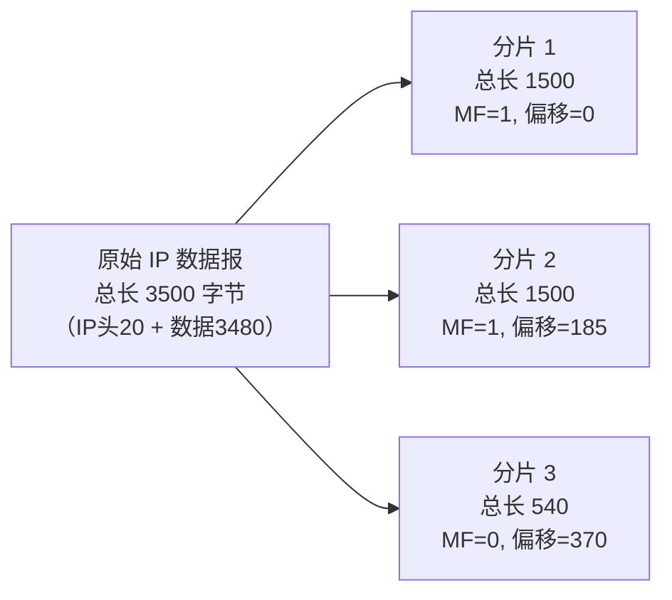
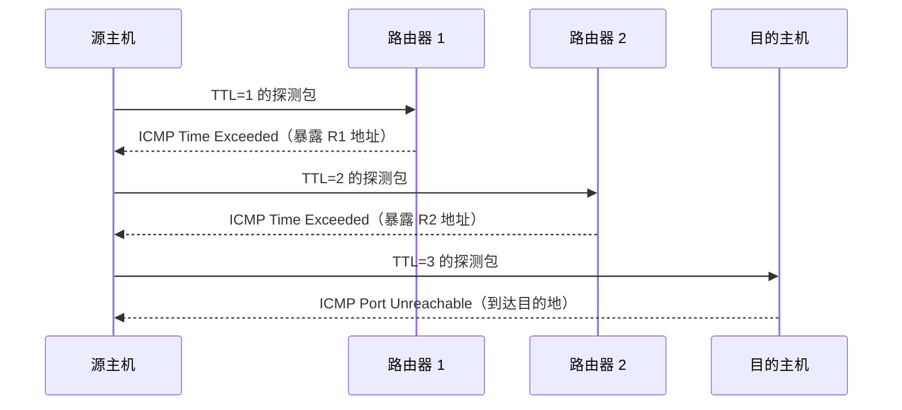
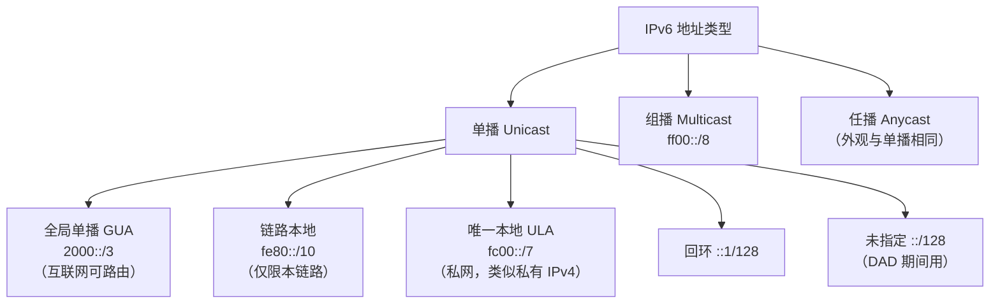
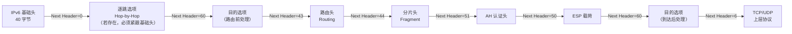
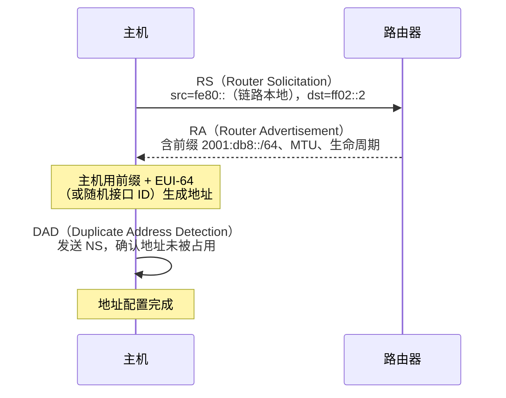
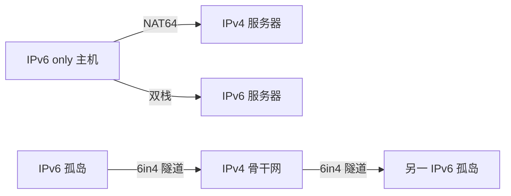
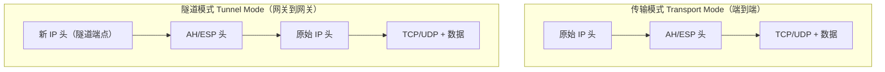

# 详解网络协议(十一)IP协议

> [!abstract] 速览
> **IP（Internet Protocol，网际协议）** 是 [[05.网络层|网络层]]的核心，给每台主机一个全局**逻辑地址**并负责**逐跳转发**。它的服务是**无连接、不可靠、尽力而为**——可能丢、可能乱、可能重，可靠性交给上层 [[13.TCP协议|TCP]]。两个版本：**IPv4（32 位，RFC 791）** 与 **IPv6（128 位，RFC 8200）**。
> PDU：**包 / 数据报（Packet）**。

## 1. 三大特征

- **无连接**：每个包独立路由，不事先建立通路。
- **不可靠**：不保证送达、不保证顺序、不去重——出了问题不负责。
- **尽力而为（best-effort）**：尽量送，仅此而已。

> 这"三不"是**故意**的：把网络层做薄、做简单，复杂的可靠性留给端系统（[[13.TCP协议|TCP]]）——这正是互联网"端到端原则"的体现。

**口诀**："IP 只管把包扔出去，丢了乱了不管你。"

## 2. IPv4 头部

### 2.1 头部结构总览

IPv4 头部固定部分 **20 字节**，含 Options 时最长 **60 字节**，格式以 32 bit（4 字节）为行对齐：

```
 0                   1                   2                   3
 0 1 2 3 4 5 6 7 8 9 0 1 2 3 4 5 6 7 8 9 0 1 2 3 4 5 6 7 8 9 0 1
+-+-+-+-+-+-+-+-+-+-+-+-+-+-+-+-+-+-+-+-+-+-+-+-+-+-+-+-+-+-+-+-+
|Version|  IHL  |    DSCP   |ECN|          Total Length         |
+-+-+-+-+-+-+-+-+-+-+-+-+-+-+-+-+-+-+-+-+-+-+-+-+-+-+-+-+-+-+-+-+
|         Identification        |Flags|      Fragment Offset    |
+-+-+-+-+-+-+-+-+-+-+-+-+-+-+-+-+-+-+-+-+-+-+-+-+-+-+-+-+-+-+-+-+
|  Time to Live |    Protocol   |         Header Checksum       |
+-+-+-+-+-+-+-+-+-+-+-+-+-+-+-+-+-+-+-+-+-+-+-+-+-+-+-+-+-+-+-+-+
|                       Source Address                          |
+-+-+-+-+-+-+-+-+-+-+-+-+-+-+-+-+-+-+-+-+-+-+-+-+-+-+-+-+-+-+-+-+
|                    Destination Address                        |
+-+-+-+-+-+-+-+-+-+-+-+-+-+-+-+-+-+-+-+-+-+-+-+-+-+-+-+-+-+-+-+-+
|                    Options (可变)         |    Padding        |
+-+-+-+-+-+-+-+-+-+-+-+-+-+-+-+-+-+-+-+-+-+-+-+-+-+-+-+-+-+-+-+-+
```

### 2.2 逐字段详解

| 字段 | 长度 | 作用与要点 |
| --- | --- | --- |
| **Version（版本）** | 4 bit | IPv4 固定为 `4`（二进制 `0100`），路由器据此决定后续头部的解析方式 |
| **IHL（头部长度）** | 4 bit | 以 **4 字节**为单位；最小值 `5`（20 字节无选项），最大值 `15`（60 字节含选项） |
| **DSCP（差分服务代码点）** | 6 bit | 前 6 bit，取代旧 ToS 字段（RFC 2474），用于 QoS 分类；EF（46）用于语音、AF 类用于视频等 |
| **ECN（显式拥塞通知）** | 2 bit | 后 2 bit（RFC 3168）；路由器检测到拥塞时标记包而非丢弃，让端点主动降速，需 TCP 配合 |
| **Total Length（总长度）** | 16 bit | 整个 IP 包（头部 + 数据）的字节数；最大 **65535 字节**；以太网帧通常限制在 1500 字节（MTU） |
| **Identification（标识）** | 16 bit | 同一原始数据报的所有分片共享同一标识值，用于重组时归类；RFC 6864 规范了其在无分片场景下的取值 |
| **Flags（标志）** | 3 bit | bit 0 保留（须为 0）；**DF（Don't Fragment）= bit 1**，置 1 禁止中途分片；**MF（More Fragments）= bit 2**，置 1 表示后续还有分片 |
| **Fragment Offset（片偏移）** | 13 bit | 本片数据在原始数据报中的偏移量，以 **8 字节**为单位；最大偏移 = 8191 × 8 = 65528 字节 |
| **TTL（生存时间）** | 8 bit | 每过一跳路由器减 1，减到 0 路由器丢弃并回 ICMP Time Exceeded；Windows 默认 128，Linux 默认 64 |
| **Protocol（协议）** | 8 bit | 指明上层协议：ICMP=**1**、IGMP=**2**、TCP=**6**、UDP=**17**、OSPF=**89**、ESP=**50**、AH=**51** |
| **Header Checksum（头部校验和）** | 16 bit | **仅覆盖 IP 头部**（不含数据），采用一补数求和；每跳路由器修改 TTL 后须重新计算；IPv6 已废弃此字段 |
| **Source / Destination IP** | 各 32 bit | 发送方与接收方的逻辑地址；NAT 设备会修改这两个字段 |
| **Options + Padding** | 0～40 字节 | 可选，若存在须用 Padding 补齐到 4 字节边界；常见选项见 §2.3 |

> [!tip] 点睛
> IHL 字段就是为了应对 Options 可变长度而存在的——没有它，接收方不知道头部在哪里结束、数据从哪里开始。

### 2.3 IPv4 Options 常见类型

| 选项 | 类型值 | 作用 |
| --- | --- | --- |
| **Record Route** | 7 | 沿途每个路由器将自己的出口 IP 写入包中，用于网络诊断 |
| **Timestamp** | 68 | 沿途路由器记录时间戳，分析转发时延 |
| **Loose Source Route** | 131 | 发送方指定一组必须经过的路由器（路由器间可以有其他跳） |
| **Strict Source Route** | 137 | 发送方精确指定全路径的每一跳（路由器必须完全遵从） |
| **NOP** | 1 | 单字节填充/对齐 |
| **End of Option** | 0 | 标记选项结束 |

> [!warning] 注意
> Options 字段在现代互联网中几乎不再使用；松散/严格源路由在很多运营商网络中已被过滤，因为它们可被用于绕过访问控制或发动反射攻击。

## 3. 分片与重组

### 3.1 MTU 与分片触发

**MTU（Maximum Transmission Unit，最大传输单元）** 是链路层一帧能携带的最大 IP 数据报大小：

| 链路类型 | 典型 MTU |
| --- | --- |
| 以太网（IEEE 802.3） | **1500 字节** |
| PPPoE（ADSL 宽带） | **1492 字节**（含 8 字节 PPPoE 头） |
| Wi-Fi（802.11） | 2304 字节（实际受 AP 配置） |
| 回环接口（Linux lo） | 65536 字节 |
| IPv6 最小要求 | 1280 字节 |

当 IP 数据报大于出口链路的 MTU 时，若 DF=0，路由器将其**分片**；若 DF=1，则丢弃并向源端发送 ICMP `Fragmentation Needed` 消息（PMTU 发现的基础）。

### 3.2 分片字段机制

- **标识（Identification）**：源端为每个原始数据报分配，同一数据报的所有分片共用同一标识。
- **MF（More Fragments）**：除最后一片外，所有分片 MF=1；最后一片 MF=0。
- **片偏移（Fragment Offset）**：以 **8 字节**为单位，表示本片数据在原始数据部分的起始偏移。因此除最后一片外，每片的数据部分长度必须是 **8 的倍数**。



### 3.3 完整分片计算示例

**场景**：源端发送一个总长度 3500 字节的 IP 数据报（IP 头 20 字节 + 数据 3480 字节），经过一段 MTU = 1500 字节的以太网链路，路由器需要分片。

每片可携带的数据量 = 1500 − 20 = **1480 字节**（须为 8 的倍数，1480 = 8 × 185，满足）

| 分片 | IP 头（字节） | 数据（字节） | 总长（字节） | MF | 片偏移（×8 字节） |
| --- | --- | --- | --- | --- | --- |
| 第 1 片 | 20 | 1480 | **1500** | **1** | **0**（0×8=0） |
| 第 2 片 | 20 | 1480 | **1500** | **1** | **185**（185×8=1480） |
| 第 3 片 | 20 | 520 | **540** | **0** | **370**（370×8=2960） |

验证：1480 + 1480 + 520 = **3480** ✓（与原数据长度一致）

### 3.4 重组由目的主机完成

IP 分片的**重组发生在目的主机**，而非中间路由器。目的主机根据「标识相同 + 源 IP 相同 + 协议相同」将分片归组，再按片偏移顺序拼合，等待 MF=0 的最后一片到达后完成重组。

若等待超时（Linux 默认 30 秒）仍有分片未到，已接收的分片被丢弃并向源端发送 ICMP `Fragment Reassembly Time Exceeded`。

### 3.5 分片的弊端

> [!warning] 分片的代价
> 1. **效率低**：每个分片都携带独立的 IP 头开销，网络带宽利用率下降。
> 2. **丢一片即重传整包**：TCP 层的重传单位是整个原始数据报，而非单个分片，导致不必要的重传。
> 3. **防火墙状态跟踪困难**：只有第一片含 TCP/UDP 端口号，防火墙对后续分片难以做访问控制。
> 4. **乱序重组压力**：分片可能乱序到达，目的主机须在内存中缓冲等待，消耗资源。
> 5. **安全漏洞**：**Teardrop 攻击**通过构造重叠偏移的恶意分片，使目标系统在重组时崩溃（已被现代 OS 修复）。

**最佳实践**：现代应用通过 **Path MTU Discovery（PMTUD，RFC 1191）** 探测路径上最小 MTU，设置 DF=1，由源端在应用层或传输层控制数据大小，完全避免中途分片。

## 4. TTL 与 traceroute

### 4.1 TTL 的本质

TTL 的字面意思是"生存时间（Time To Live）"，但在 IP 协议的实现中它是**跳数计数器**，而非时间：每经过一台路由器减 1，到 0 时路由器丢弃该包并向源端发送 **ICMP Time Exceeded（类型 11）** 消息。

| 操作系统 | TTL 默认值 |
| --- | --- |
| Linux / Android | 64 |
| Windows | 128 |
| macOS / iOS | 64 |
| Cisco IOS（路由器） | 255 |

### 4.2 traceroute 原理

`traceroute`（Linux）/ `tracert`（Windows）利用 TTL 逐跳探测路径：



1. 发送 TTL=1 的包 → 第 1 跳路由器丢弃，回 ICMP Time Exceeded，源端得知第 1 跳 IP。
2. 发送 TTL=2 的包 → 第 2 跳路由器丢弃，回 ICMP，源端得知第 2 跳 IP。
3. 依此类推，直到包到达目的主机，后者回 ICMP Port Unreachable（UDP 探测）或 Echo Reply（ICMP 探测）。

> [!note] `*` 的含义
> traceroute 输出中的 `*` 表示该跳未在超时内收到 ICMP 响应——可能是防火墙过滤了 ICMP、该路由器不回 Time Exceeded，或路由不对称（回包走了不同路径）。`*` 不代表该跳不存在。

## 5. IPv4 vs IPv6

| 维度 | IPv4 | IPv6 |
| --- | --- | --- |
| 地址长度 | 32 位（约 43 亿） | 128 位（近乎无限） |
| 表示 | 点分十进制 `192.168.1.1` | 冒号十六进制 `2001:db8::1` |
| 头部 | 变长 20～60 字节，有校验和，可中途分片 | 固定 **40 字节**，无校验和，不中途分片 |
| 地址类型 | 单播 / 广播 / 组播 | 单播 / 组播 / **任播**（**无广播**） |
| 地址自动配置 | 依赖 DHCP | SLAAC 无状态自动配置 + DHCPv6 |
| 地址解析 | ARP（广播） | NDP（组播，更高效） |
| 分片 | 源端与中途路由器均可 | **仅源端**（Path MTU Discovery） |
| 安全 | IPsec 可选 | IPsec 原生支持（IPv6 设计之初强制，RFC 6434 后变可选） |

## 6. IPv6 深度解析

### 6.1 地址表示与压缩规则

IPv6 地址 128 bit，分为 8 组，每组 16 bit，用冒号分隔，每组写成 4 位十六进制：

```
完整形式：2001:0db8:0000:0000:0000:ff00:0042:8329
```

**两条压缩规则**：
1. **前导零可省略**：`0db8` → `db8`，`0042` → `42`，`0000` → `0`。
2. **连续全零组可用 `::` 替换，但 `::` 在一个地址中只能出现一次**（否则无法确定省略了多少组）。

```
压缩后：2001:db8::ff00:42:8329
```

**典型地址举例**：

| 含义 | 完整形式 | 压缩形式 |
| --- | --- | --- |
| 回环地址 | `0000:0000:0000:0000:0000:0000:0000:0001` | `::1` |
| 未指定地址 | `0000:0000:0000:0000:0000:0000:0000:0000` | `::` |
| 链路本地示例 | `fe80:0000:0000:0000:0217:f2ff:fe07:ed62` | `fe80::217:f2ff:fe07:ed62` |
| 文档/示例专用 | `2001:0db8:0000:0001:0000:0000:0000:0001` | `2001:db8:0:1::1` |

> [!warning] 易错
> `2001:db8::1::2` 是**非法**地址——`::` 出现了两次，无法唯一解析。

### 6.2 IPv6 地址类型



| 地址类型 | 前缀 | 说明 |
| --- | --- | --- |
| **全局单播（GUA）** | `2000::/3` | 全球唯一，互联网可路由；目前 IANA 已分配范围 `2000::` ～ `3fff:…` |
| **链路本地** | `fe80::/10` | 接口自动生成，仅在同一链路内有效；NDP、SLAAC 均依赖它；不可跨路由器 |
| **唯一本地（ULA）** | `fc00::/7`（实际用 `fd00::/8`） | 类似 IPv4 私有地址；`fd` 后跟随机 40 bit Site ID，减少冲突概率 |
| **组播** | `ff00::/8` | 取代 IPv4 广播；`ff02::1`=链路本地所有节点，`ff02::2`=所有路由器，`ff02::1:ffxx:xxxx`=请求节点组播 |
| **任播** | 与单播同段 | 同一地址分配给多台设备，路由到"最近"的那台；典型用途：DNS 根服务器、CDN |
| **回环** | `::1/128` | 等价于 IPv4 的 `127.0.0.1` |
| **未指定** | `::/128` | 地址尚未分配时用作源地址（DAD 重复地址检测期间） |

> [!note] 关键点：IPv6 **没有广播地址**
> 广播功能由特定组播地址替代（如所有节点 `ff02::1`、请求节点组播 `ff02::1:ff00:0/104`）。

### 6.3 IPv6 固定 40 字节头部逐字段

| 字段 | 长度 | 说明 |
| --- | --- | --- |
| **Version** | 4 bit | 固定为 `6` |
| **Traffic Class** | 8 bit | 与 IPv4 DSCP+ECN 含义相同（前 6 bit DSCP，后 2 bit ECN） |
| **Flow Label** | 20 bit | 标记同一流的包，让路由器可对同一流做一致处理（无需深度解析），0 表示不使用 |
| **Payload Length** | 16 bit | **40 字节基础头之后**的数据长度（含扩展头）；超级数据报（Jumbogram）用逐跳选项扩展头携带长度 |
| **Next Header** | 8 bit | 指向下一个扩展头或上层协议（TCP=6，UDP=17，ICMPv6=58，无下一头=59） |
| **Hop Limit** | 8 bit | 等价于 IPv4 TTL，每跳减 1，到 0 丢弃 |
| **Source Address** | 128 bit | 16 字节 |
| **Destination Address** | 128 bit | 16 字节 |

**合计**：4+8+20+16+8+8+128+128 = **320 bit = 40 字节** ✓

> IPv6 **取消了头部校验和**：链路层（以太网 FCS）和传输层（TCP/UDP 伪首部校验和）已提供足够检错，去掉头部校验和让路由器每跳无需重算，显著提升转发速度。

### 6.4 IPv6 扩展头链

IPv4 的 Options 嵌在头部内导致头部变长；IPv6 将可选功能移到**扩展头（Extension Header）**，用链式结构插在基础头与上层协议之间。每个扩展头都有自己的 **Next Header** 字段指向下一个。

RFC 8200 推荐的扩展头顺序：



| 扩展头 | Next Header 值 | 作用 |
| --- | --- | --- |
| 逐跳选项（Hop-by-Hop Options） | 0 | 路径上每个节点都须处理；若存在须立即跟在基础头后 |
| 路由头（Routing） | 43 | 类似 IPv4 源路由，指定中间节点 |
| 分片头（Fragment） | 44 | 仅源端分片时使用，携带标识/偏移/MF |
| AH | 51 | IPsec 认证头 |
| ESP | 50 | IPsec 加密与认证 |
| 目的选项（Destination Options） | 60 | 仅目的端处理 |
| 无下一头 | 59 | 链结束 |

### 6.5 SLAAC——无状态地址自动配置

**SLAAC（Stateless Address AutoConfiguration，RFC 4862）** 让主机无需 DHCP 服务器即可自动获得全局 IPv6 地址：



**EUI-64 接口 ID 生成**：将 48 bit MAC 地址中间插入 `FF:FE`，并翻转第 7 bit（U/L 位），得到 64 bit 接口 ID。（出于隐私考虑，RFC 8981 引入了临时随机接口 ID。）

### 6.6 NDP——邻居发现协议（取代 ARP）

**NDP（Neighbor Discovery Protocol，RFC 4861）** 基于 ICMPv6，替代了 IPv4 中的 ARP、ICMP 路由器发现等多种功能：

| NDP 消息 | ICMPv6 类型 | 功能 |
| --- | --- | --- |
| RS（Router Solicitation，路由器请求） | 133 | 主机启动时向 `ff02::2` 请求路由器信息 |
| RA（Router Advertisement，路由器通告） | 134 | 路由器定期或响应 RS，通告前缀、MTU、默认网关 |
| NS（Neighbor Solicitation，邻居请求） | 135 | 解析邻居 MAC（等价于 ARP Request）；也用于 DAD |
| NA（Neighbor Advertisement，邻居通告） | 136 | 响应 NS，通告自己的 MAC（等价于 ARP Reply） |
| Redirect（重定向） | 137 | 路由器通知主机有更好的下一跳 |

**ARP vs NDP 对比**：

| 维度 | ARP（IPv4） | NDP（IPv6） |
| --- | --- | --- |
| 底层 | 以太网广播 | ICMPv6 组播（请求节点组播） |
| 安全 | 易受 ARP 欺骗 | Hop Limit=255 检查，难以远程伪造 |
| 附加功能 | 仅地址解析 | 地址解析 + 路由器发现 + 前缀发现 + DAD + 重定向 |

### 6.7 IPv6 过渡技术

纯 IPv6 部署需要时间，实践中三类过渡技术并行：

| 技术 | 类型 | 原理 |
| --- | --- | --- |
| **双栈（Dual Stack）** | 共存 | 节点同时运行 IPv4 和 IPv6 协议栈，优先使用 IPv6 |
| **6in4 隧道（RFC 4213）** | 隧道 | 将 IPv6 包封装在 IPv4 协议号 41 的包内，穿越 IPv4 网络 |
| **6to4（RFC 3056）** | 隧道 | 自动用 `2002:v4addr::/48` 生成 IPv6 前缀，无需手动配置 |
| **Teredo（RFC 4380）** | 隧道 | 把 IPv6 封装在 UDP 包内，可穿越 NAT（Windows 内置） |
| **NAT64 + DNS64（RFC 6146/6147）** | 翻译 | IPv6 客户端访问 IPv4 服务器；DNS64 合成 AAAA 记录，NAT64 做协议翻译 |
| **ISATAP** | 隧道 | 站内自动隧道，将 IPv4 地址嵌入 IPv6 接口 ID |



## 7. IPsec——网络层安全

> [!info] 与 TLS 的层次对比
> [[15.TLS协议|TLS]] 在**传输层之上**保护应用数据；**IPsec 在网络层**保护 IP 数据报本身，对上层协议透明——应用程序无需修改代码即可享受加密。

### 7.1 两个核心协议

| 协议 | IP 协议号 | 提供 | 不提供 | 适合 NAT？ |
| --- | --- | --- | --- | --- |
| **AH（Authentication Header，RFC 4302）** | **51** | 完整性 + 数据源认证（含 IP 头部分字段） | 加密（明文传输） | **否**（AH 保护 IP 头，NAT 修改 IP 头导致校验失败） |
| **ESP（Encapsulating Security Payload，RFC 4303）** | **50** | 机密性 + 完整性 + 数据源认证 | 不保护外层 IP 头（隧道模式除外） | **是**（配合 NAT-T，封装在 UDP 4500） |

> [!tip] 实践口诀
> "要加密用 ESP，要穿 NAT 也用 ESP；AH 不加密、不穿 NAT，现代场景几乎只用 ESP。"

### 7.2 两种工作模式



| 模式 | 适用场景 | 特点 |
| --- | --- | --- |
| **传输模式** | 主机到主机端到端加密 | 保留原始 IP 头，仅保护 IP 载荷；开销小 |
| **隧道模式** | VPN 网关到网关、远程访问 VPN | 整个原始 IP 数据报成为内层，加套新 IP 头；可隐藏内网拓扑 |

### 7.3 IKEv2 密钥协商

IPsec 需要双方协商加密算法和密钥，由 **IKEv2（RFC 7296）** 完成，工作在 **UDP 500 端口**（NAT 穿越时切换到 **UDP 4500**）：

1. **IKE_SA_INIT**：双方协商 DH（Diffie-Hellman）参数、加密算法、哈希算法，生成会话密钥，建立 IKE SA（安全关联）。
2. **IKE_AUTH**：双方互相认证（预共享密钥 / 数字证书 / EAP），协商 Child SA（即 IPsec SA），确定哪些流量需要保护。

**安全关联（SA）**：SA 是单向的，双向通信需一对 SA；由 `<目的 IP, SPI, 协议>` 三元组唯一标识。

> [!info] 与 TLS 对比速记
> \| 维度 \| TLS \| IPsec \|
> \| --- \| --- \| --- \|
> \| 层次 \| 传输层以上 \| 网络层 \|
> \| 透明性 \| 应用须适配 \| 应用透明 \|
> \| 典型场景 \| HTTPS、SMTP over TLS \| VPN、站点间加密 \|
> \| 密钥协商 \| TLS Handshake \| IKEv2 \|

## 8. 配套协议与机制

| 名称 | IPv4 对应 | IPv6 对应 | 作用 |
| --- | --- | --- | --- |
| **ICMP / ICMPv6** | ICMPv4（RFC 792） | ICMPv6（RFC 4443） | 差错报告（目的不可达、超时、分片需要）与诊断（ping/traceroute）；ICMPv6 还承载 NDP、MLD |
| **ARP / NDP** | ARP（RFC 826） | NDP（RFC 4861） | IP → MAC 地址解析；NDP 还包含路由发现、DAD |
| **DHCP / DHCPv6** | DHCPv4（RFC 2131） | DHCPv6（RFC 8415） | 自动分配 IP、DNS、网关等配置；IPv6 还有 SLAAC 作为无状态替代 |
| **NAT** | IPv4 广泛使用 | IPv6 设计上不需要 | 私网共享公网 IP；会破坏端到端原则（详见 [[12.支持地址分类和子网划分]]） |
| **IGMP / MLD** | IGMP（RFC 3376） | MLD（RFC 3810） | 主机向路由器注册/退出组播组 |
| **IPsec** | 可选 | 原生支持 | 网络层加密与认证（见 §7） |

### 8.1 ICMP 常见消息类型

| 类型 | 代码 | 含义 | 触发场景 |
| --- | --- | --- | --- |
| 0 | 0 | Echo Reply | ping 回包 |
| 3 | 0/1/2/3 | Destination Unreachable | 目的网络/主机/协议/端口不可达 |
| 3 | 4 | Fragmentation Needed | 链路 MTU 不足且 DF=1（PMTUD 关键） |
| 8 | 0 | Echo Request | ping 发包 |
| 11 | 0 | Time Exceeded | TTL=0，路由器丢包（traceroute 利用） |
| 11 | 1 | Fragment Reassembly Time Exceeded | 重组超时 |
| 12 | 0 | Parameter Problem | 头部字段错误 |

## 9. 常见误区与面试视角

> [!warning] 常见误区（扩充版）

**误区 1：IP 不可靠 = IP 不重要**
IP 是整个互联网的基石，"不可靠"是设计选择而非缺陷——把可靠性的责任留给端系统（TCP），让网络层保持简单，正是互联网能规模化到全球的原因。

**误区 2：IPv4 头部校验和保护了数据**
IPv4 头部校验和**只覆盖头部**，数据的完整性由 TCP/UDP 的校验和负责。IPv6 更是直接去掉了头部校验和。

**误区 3：TTL 是"时间"单位**
TTL 是**跳数**计数器，每经过一台路由器减 1，与实际时间无关。RFC 791 原始定义是秒，但现代实现全部用跳数。

**误区 4：NAT 等于防火墙**
NAT 隐藏了内网 IP、缓解了地址短缺，但不是安全设备。防火墙基于策略过滤流量，二者目的不同。详见 [[12.支持地址分类和子网划分]]。

**误区 5：IPv6 地址有广播**
IPv6 **没有广播**，广播功能由特定组播地址（如 `ff02::1` 全节点组播）替代。

**误区 6：`::` 可以在一个地址里出现多次**
`::` 在一个 IPv6 地址中只能出现**一次**，否则无法唯一确定省略了多少组全零段。

**误区 7：分片由目的主机和路由器共同完成**
IPv4 中**路由器和源端都可以分片**，但**重组只在目的主机**完成；IPv6 中**只有源端可以分片**，中间路由器不参与。

**误区 8：ARP 和 NDP 都靠广播**
ARP 使用以太网**广播**（目的 MAC `ff:ff:ff:ff:ff:ff`），会打扰链路上所有设备；NDP 使用 **ICMPv6 请求节点组播**（`ff02::1:ffxx:xxxx`），仅打扰拥有该地址后 24 bit 的设备，效率更高。

**误区 9：IPsec 和 TLS 功能重复**
两者保护的层次不同：IPsec 在网络层保护 IP 数据报，对应用透明，常用于 VPN；TLS 在传输层之上保护应用数据，需应用程序主动适配（见 [[15.TLS协议]]）。

### 9.1 高频面试题

| 问题 | 关键答案 |
| --- | --- |
| IPv4 头部最小/最大多少字节？ | 最小 **20 字节**（无 Options），最大 **60 字节** |
| 分片重组在哪里完成？ | **目的主机**，中间路由器不重组 |
| 片偏移的单位是什么？ | **8 字节** |
| TTL 减到 0 路由器怎么处理？ | 丢弃并回 **ICMP Type 11**（Time Exceeded） |
| IPv6 头部为什么去掉校验和？ | 链路层和传输层已检错，去掉后路由器无需每跳重算，提升转发性能 |
| ARP 和 NDP 的核心区别？ | ARP 用以太网广播；NDP 用 ICMPv6 请求节点组播，且 Hop Limit=255 防远程伪造 |
| IPsec AH 为什么不适合 NAT？ | AH 保护了 IP 头中的地址字段，NAT 修改 IP 地址会导致 AH 校验失败 |
| SLAAC 的 EUI-64 是什么？ | MAC 地址中间插 `FF:FE` 并翻转 U/L 位，生成 64 bit 接口 ID |
| 什么是任播（Anycast）？ | 同一地址分配给多台设备，流量路由到拓扑上最近的那台；常用于 DNS 根服务器 |

## 延伸阅读

- 所在层：[[05.网络层]]
- 地址与子网：[[12.支持地址分类和子网划分]]
- 上层可靠性：[[13.TCP协议]] · [[16.UDP协议]]
- 网络层安全对比：[[15.TLS协议]]（传输层以上）

> ⬅️ [[10.TCP-IP四层模型]] ｜ 🏠 [[00.网络协议详解总览]] ｜ [[12.支持地址分类和子网划分]] ➡️
