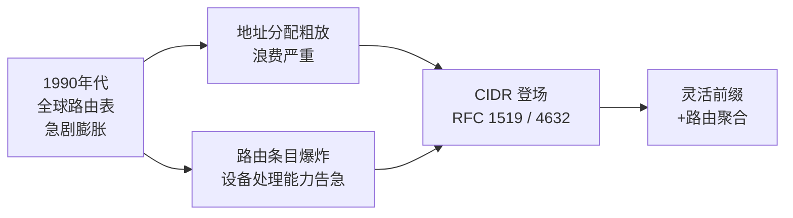
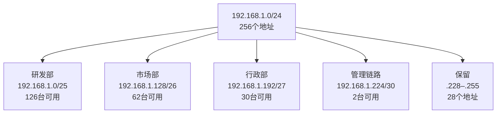

# 详解网络协议(十二)支持地址分类和子网划分

> [!abstract] 速览
> IPv4 地址 = **网络部分 + 主机部分**，用**子网掩码**划界。早期按 **A/B/C/D/E 分类**（classful）粗放分配，浪费严重，已被 **CIDR（无类别域间路由）** 取代——用 `IP/前缀长度`（如 `192.168.1.0/24`）灵活划界。子网掩码的本质是**按位 AND**：将 IP 地址与掩码做位与运算，即可提取网络号。**VLSM（可变长子网掩码）** 允许同一网络内按部门需求分配不同大小的子网，做到"按需、不浪费"。本篇系统讲清分类演进、掩码位运算、CIDR 路由聚合、VLSM 完整案例、IPv6 子网简述及常见误区。
> 配套阅读：[[11.IP协议]]。

---

## 1. 传统地址分类（已淘汰，但仍需理解）

### 1.1 五类地址一览

| 类 | 首字节范围 | 首字节最高位 | 默认掩码 | 网络/主机位 | 最大网络数 | 每网络最大主机数 | 用途 |
| --- | --- | --- | --- | --- | --- | --- | --- |
| A | 1–126 | `0xxxxxxx` | /8（255.0.0.0） | 8 / 24 | 126 | 16,777,214 | 超大型网络 |
| B | 128–191 | `10xxxxxx` | /16（255.255.0.0） | 16 / 16 | 16,384 | 65,534 | 中型网络 |
| C | 192–223 | `110xxxxx` | /24（255.255.255.0） | 24 / 8 | 2,097,152 | 254 | 小型网络 |
| D | 224–239 | `1110xxxx` | — | — | — | — | 组播（见 [[17.广播与组播]]） |
| E | 240–255 | `11110xxx` | — | — | — | — | 保留 / 实验 |

> `127.x.x.x` 是回环（本机测试），不属于可分配范围；`0.x.x.x` 表示"本网络"，也不可分配。

### 1.2 分类方案的根本缺陷

分类方案看似整齐，却有两大硬伤，最终被历史淘汰：

**1. 地址粒度太粗，浪费严重**

- 一个 B 类网络包含 65,534 个可用地址。如果一家公司只需要 1,000 台主机，多余的 64,000 多个地址就白白"占坑"，其他人无法使用。
- 一个 C 类只有 254 台，稍大的部门就不够用，但只能再申请整整一个 C 类——同样浪费。

**2. 路由表急剧膨胀**

- 每申请一个新网络号，骨干路由器就要多一条路由表条目。按分类方案，全球路由表条目数随时间呈爆炸式增长，路由器根本跟不上（这也是 CIDR 引入"路由聚合"的直接动机）。



> **口诀**：A 大 B 中 C 小用，D 是组播 E 保留；127 回环不分配，0 字节代表"本网络"。

---

## 2. 子网掩码的二进制本质

### 2.1 掩码是什么

子网掩码（Subnet Mask）是一串**高位连续为 1、低位连续为 0** 的 32 位二进制数。前面连续 1 的个数 `n` 就是前缀长度，记作 `/n`（CIDR 记法）。

**规则**：掩码必须是连续的 1 后接连续的 0，例如 `11111111.11111111.11111111.11000000`（即 `/26`，点分十进制 `255.255.255.192`）是合法掩码；`11111111.00000000.11111111.00000000`（`255.0.255.0`）是**非法掩码**——间断的 1 在任何场景下均不允许。

### 2.2 按位 AND 求网络号——完整演算示例

**题目**：已知主机地址 `192.168.10.130`，子网掩码 `/26`（`255.255.255.192`），求该主机所在的网络号。

第一步：写出 IP 地址的二进制（只看第 4 字节，前三字节 `192.168.10` 与掩码三 `255.255.255` 做 AND 后原样保留）：

```
IP  地址：192 . 168 . 010 . 130
                              ↓
第4字节 130 = 1000 0010

掩码 /26 = 255 . 255 . 255 . 192
第4字节 192 = 1100 0000

按位 AND：
  1000 0010   (130)
& 1100 0000   (192)
-----------
  1000 0000   = 128
```

**结论**：网络号 = `192.168.10.128`，即该主机属于 `192.168.10.128/26` 子网。

| 地址 | 第4字节二进制 | 十进制 |
| --- | --- | --- |
| 主机地址 | `1000 0010` | 130 |
| 子网掩码 | `1100 0000` | 192 |
| **AND 结果（网络号）** | **`1000 0000`** | **128** |

> **点睛**：掩码中"1"对应的位保留原 IP 位（提取网络号），"0"对应的位全部清零——这就是按位 AND 的几何含义。

### 2.3 主机数公式

$$\text{可用主机数} = 2^{(32-n)} - 2$$

减去的 2：一个是**网络号**（主机位全 0），一个是**广播地址**（主机位全 1），两者均不可分配给主机。

---

## 3. CIDR：无类别域间路由

### 3.1 基本概念

**CIDR（Classless Inter-Domain Routing，无类别域间路由）** 由 RFC 1519（1993 年）引入，RFC 4632 更新，彻底抛弃了 A/B/C 的类别概念，改用**前缀长度**（`/n`，取值 0～32）来任意划定"网络位 vs 主机位"的边界。

```
传统分类：  [固定8/16/24位网络号] [固定24/16/8位主机号]
CIDR：      [任意n位网络前缀    ] [32-n 位主机号      ]
```

这一改变带来两个直接好处：
1. **地址分配更精准**：需要 500 台主机？分个 `/23`（2^9−2 = 510 台），没有多余浪费。
2. **路由可以聚合**：多条相邻路由合并成一条，减少路由表条目——这就是**超网（Supernetting）**。

### 3.2 路由聚合 / 超网（Supernetting）

**场景**：ISP 手里有四个连续的 `/24` 网络需要通告给上游路由器：

```
203.0.113.0/24
203.0.114.0/24
203.0.115.0/24
203.0.116.0/24
```

如果逐条通告，上游路由器要维护 4 条路由表项。能否合并？

**聚合步骤**：

第一步，写出第 3 字节（关键差异字节）的二进制：

```
113 = 0111 0001
114 = 0111 0010
115 = 0111 0011
116 = 0111 0100
```

观察：这四个数字从 113 到 116，**公共前缀**为 `0111 00`（前 6 位相同），但 116（`0111 0100`）与 113–115 差异在第 6 位就出现了——它们并不连续到足以聚合为单一前缀。

> **换一个更适合演示的例子**：

**场景（修正）**：四个连续 `/24` 网络：

```
192.168.0.0/24    (0.0 → 第3字节 0 = 0000 0000)
192.168.1.0/24    (1   → 0000 0001)
192.168.2.0/24    (2   → 0000 0010)
192.168.3.0/24    (3   → 0000 0011)
```

第 3 字节二进制：

```
0 = 0000 0000
1 = 0000 0001
2 = 0000 0010
3 = 0000 0011
```

公共前缀：`0000 00`（前 6 位，即 `192.168.0–3` 的前三字节共 24 位 + 第 4 字节 0 位 = 24 位中第 3 字节再借 6 位）——实际上前 3 字节 `192.168.x` 中，`x` 的范围是 0–3，即第 3 字节高 6 位均为 `000000`，低 2 位为 `00/01/10/11`。

因此，聚合掩码 = 24 − 2 = **/22**：

```
203.0.113.0/24  ─┐
203.0.114.0/24  ─┤  聚合为 → 192.168.0.0/22
203.0.115.0/24  ─┤
203.0.116.0/24  ─┘
```

| 聚合前 | 聚合后 | 路由条目节省 |
| --- | --- | --- |
| 192.168.0.0/24、.1.0/24、.2.0/24、.3.0/24（4条） | 192.168.0.0/22（1条） | 减少 75% |

**聚合条件**：
- 待聚合的地址块必须**连续**（在地址空间上紧邻）；
- 数量必须是 **2 的幂次**（2、4、8……）；
- 第一个块的起始地址必须是聚合后块大小的**整数倍**（即对齐）。

### 3.3 CIDR 与传统分类的对比

| 维度 | 传统分类（Classful） | CIDR（Classless） |
| --- | --- | --- |
| 前缀长度 | 固定（8/16/24 位） | 任意（/0 ～ /32） |
| 地址利用率 | 低（粒度粗） | 高（按需分配） |
| 路由通告 | 每个网络号一条 | 可聚合多条为一条 |
| 路由表规模 | 随地址分配线性膨胀 | 聚合后大幅压缩 |
| 是否需要子网掩码字段 | 可从类别推断 | **必须显式携带前缀长度** |

---

## 4. 为什么要子网划分

分类地址太"粗"：给一个机构分一整个 B 类（6.5 万地址）往往用不完，但 C 类（254 台）又可能不够。**子网划分**通过**向主机位借位**，把一个网络切成多个小子网，从而：

- 控制**广播域**大小（一个子网一个广播域）；
- 提升**地址利用率**与**管理 / 安全性**；
- 为不同部门 / 楼层 / 业务划定逻辑隔离边界。

### 4.1 借位的两种需求驱动

| 划分出发点 | 方法 | 借位数 `k` 的确定 |
| --- | --- | --- |
| **按子网数量**划分 | 先确定需要几个子网 N，找最小的 k 使 2^k ≥ N | 向主机位借 k 位 |
| **按每子网主机数**划分 | 先确定每子网需要几台主机 H，找最小的 m 使 2^m − 2 ≥ H | 保留 m 位主机位，借走剩余位 |

---

## 5. 子网划分实例

### 5.1 按子网数量划分：把 `192.168.1.0/24` 划成 4 个子网

需 4 个子网 → 借 **2** 位（2² = 4）→ 新掩码 **/26**（255.255.255.192），每子网 2⁶ − 2 = **62** 台：

| 子网 | 网络号 | 可用主机范围 | 广播地址 |
| --- | --- | --- | --- |
| 1 | 192.168.1.0/26 | .1 – .62 | .63 |
| 2 | 192.168.1.64/26 | .65 – .126 | .127 |
| 3 | 192.168.1.128/26 | .129 – .190 | .191 |
| 4 | 192.168.1.192/26 | .193 – .254 | .255 |

> **二进制视角**：`/26` 即把第 4 字节的**高 2 位**当子网号 `00 / 01 / 10 / 11`，步长 64。

### 5.2 按主机数需求划分：每子网至少 30 台，从 `10.0.0.0/24` 划分

需求：每子网至少 30 台主机。

**步骤**：
- 需要 2^m − 2 ≥ 30，即 2^m ≥ 32 → m = 5（保留 5 位主机位）
- 借位数 k = 8 − 5 = 3（从 /24 的 8 位主机位借走 3 位）
- 新掩码：/24 + 3 = **/27**（255.255.255.224）
- 可划子网数：2³ = **8 个**
- 每子网可用主机：2⁵ − 2 = **30 台**
- 步长：2⁵ = **32**

| 子网 | 网络号 | 可用主机范围 | 广播地址 |
| --- | --- | --- | --- |
| 1 | 10.0.0.0/27 | .1 – .30 | .31 |
| 2 | 10.0.0.32/27 | .33 – .62 | .63 |
| 3 | 10.0.0.64/27 | .65 – .94 | .95 |
| 4 | 10.0.0.96/27 | .97 – .126 | .127 |
| 5 | 10.0.0.128/27 | .129 – .158 | .159 |
| 6 | 10.0.0.160/27 | .161 – .190 | .191 |
| 7 | 10.0.0.192/27 | .193 – .222 | .223 |
| 8 | 10.0.0.224/27 | .225 – .254 | .255 |

### 5.3 按子网数量（较多）划分：从 `172.16.0.0/16` 划出至少 100 个子网

需至少 100 个子网 → 找最小 k 使 2^k ≥ 100 → k = 7（2^7 = 128 ≥ 100）

- 新掩码：/16 + 7 = **/23**（255.255.254.0）
- 实际可划子网数：2⁷ = **128 个**
- 每子网可用主机：2⁹ − 2 = **510 台**
- 步长：256（第 3 字节每次 +1，即每步跨一个第 3 字节值对应的 /23 块）

| 子网（举例前3个） | 网络号 | 可用主机范围 | 广播地址 |
| --- | --- | --- | --- |
| 1 | 172.16.0.0/23 | 172.16.0.1 – 172.16.1.254 | 172.16.1.255 |
| 2 | 172.16.2.0/23 | 172.16.2.1 – 172.16.3.254 | 172.16.3.255 |
| 3 | 172.16.4.0/23 | 172.16.4.1 – 172.16.5.254 | 172.16.5.255 |
| … | … | … | … |
| 128 | 172.16.254.0/23 | 172.16.254.1 – 172.16.255.254 | 172.16.255.255 |

---

## 6. VLSM（可变长子网掩码）

### 6.1 概念与意义

**VLSM（Variable Length Subnet Masking，可变长子网掩码）** 允许在同一个网络内，对不同的子网使用**不同的前缀长度**，从而做到"按需、不浪费"。

传统等长子网划分是"一刀切"——所有子网大小相同，大部门和小部门分同样多的地址，势必造成浪费。VLSM 打破这一限制：

- 大部门用 `/25`（126 台）；
- 小部门用 `/27`（30 台）；
- 点对点链路用 `/30`（2 台）甚至 `/31`（RFC 3021，2 台，无需留网络/广播号）。

> **VLSM 的前提**：路由协议必须支持在路由通告中携带子网掩码（如 OSPF、EIGRP、RIPv2、BGP），不支持的 RIPv1 无法使用 VLSM。

### 6.2 VLSM 完整案例：按部门需求分配 `192.168.1.0/24`

**需求**：

| 部门 | 所需主机数 |
| --- | --- |
| 研发部 | 100 台 |
| 市场部 | 50 台 |
| 行政部 | 25 台 |
| 管理链路（路由器互联） | 2 台 |

**设计原则**：先分大的，再分小的；每次从剩余地址空间的"下一个对齐块"开始。

**分配过程**：

**① 研发部（100 台）**
- 需 2^m − 2 ≥ 100 → m = 7（2^7 − 2 = 126 ≥ 100），借 1 位 → **/25**
- 分配 `192.168.1.0/25`，步长 128

| 参数 | 值 |
| --- | --- |
| 网络号 | 192.168.1.0 |
| 子网掩码 | /25（255.255.255.128） |
| 可用主机范围 | 192.168.1.1 – 192.168.1.126 |
| 广播地址 | 192.168.1.127 |
| 实际可用 | 126 台 |

**② 市场部（50 台）**
- 从 `192.168.1.128` 开始（研发部用完 .0–.127）
- 需 2^m − 2 ≥ 50 → m = 6（2^6 − 2 = 62 ≥ 50），借 2 位 → **/26**
- 分配 `192.168.1.128/26`，步长 64

| 参数 | 值 |
| --- | --- |
| 网络号 | 192.168.1.128 |
| 子网掩码 | /26（255.255.255.192） |
| 可用主机范围 | 192.168.1.129 – 192.168.1.190 |
| 广播地址 | 192.168.1.191 |
| 实际可用 | 62 台 |

**③ 行政部（25 台）**
- 从 `192.168.1.192` 开始
- 需 2^m − 2 ≥ 25 → m = 5（2^5 − 2 = 30 ≥ 25），借 3 位 → **/27**
- 分配 `192.168.1.192/27`，步长 32

| 参数 | 值 |
| --- | --- |
| 网络号 | 192.168.1.192 |
| 子网掩码 | /27（255.255.255.224） |
| 可用主机范围 | 192.168.1.193 – 192.168.1.222 |
| 广播地址 | 192.168.1.223 |
| 实际可用 | 30 台 |

**④ 管理链路（2 台，路由器互联）**
- 从 `192.168.1.224` 开始
- 只需 2 台 → **/30**（2^2 − 2 = 2 台）
- 分配 `192.168.1.224/30`，步长 4

| 参数 | 值 |
| --- | --- |
| 网络号 | 192.168.1.224 |
| 子网掩码 | /30（255.255.255.252） |
| 可用主机范围 | 192.168.1.225 – 192.168.1.226 |
| 广播地址 | 192.168.1.227 |
| 实际可用 | 2 台 |

**⑤ 剩余地址空间**

`192.168.1.228 – 192.168.1.255`（28 个地址）保留，可供后续扩展。

**VLSM 分配全景图**



> **地址利用率对比**：
> - 等长划分（全用 /25）：分 2 个子网，市场/行政/链路各占 1 整块 = 3 块 × 126 = 大量浪费
> - VLSM 方案：总用 126+62+30+2 = **220 台**，利用率约 86%，高效得多

---

## 7. CIDR / 掩码 / 主机数速查表

| CIDR 前缀 | 点分十进制掩码 | 主机位数 | 总地址数 | **可用主机数** | 常见用途 |
| --- | --- | --- | --- | --- | --- |
| /8 | 255.0.0.0 | 24 | 16,777,216 | 16,777,214 | A 类传统大网 |
| /9 | 255.128.0.0 | 23 | 8,388,608 | 8,388,606 | 大型 ISP 分配 |
| /10 | 255.192.0.0 | 22 | 4,194,304 | 4,194,302 | CGN（100.64.0.0/10） |
| /12 | 255.240.0.0 | 20 | 1,048,576 | 1,048,574 | 私有 B（172.16.0.0/12） |
| /16 | 255.255.0.0 | 16 | 65,536 | 65,534 | B 类传统中型网 |
| /20 | 255.255.240.0 | 12 | 4,096 | 4,094 | 大型企业园区 |
| /22 | 255.255.252.0 | 10 | 1,024 | 1,022 | 中型企业 / 超网聚合 |
| /23 | 255.255.254.0 | 9 | 512 | 510 | 中型子网 |
| /24 | 255.255.255.0 | 8 | 256 | 254 | 最常见的小型局域网 |
| /25 | 255.255.255.128 | 7 | 128 | 126 | VLSM 大部门 |
| /26 | 255.255.255.192 | 6 | 64 | 62 | VLSM 中部门 |
| /27 | 255.255.255.224 | 5 | 32 | 30 | VLSM 小部门 |
| /28 | 255.255.255.240 | 4 | 16 | 14 | 小型子网 |
| /29 | 255.255.255.248 | 3 | 8 | 6 | 极小子网 |
| /30 | 255.255.255.252 | 2 | 4 | 2 | 路由器互联点对点链路 |
| /31 | 255.255.255.254 | 1 | 2 | 2（RFC 3021） | 点对点，无网络/广播号 |
| /32 | 255.255.255.255 | 0 | 1 | 1（单主机路由） | 主机路由、Loopback |

> **口诀**：每缩短 1 位前缀，地址数翻倍；每延长 1 位前缀，地址数减半。

---

## 8. 私有地址与特殊地址

### 8.1 标准私有地址

| 类型 | 范围 | 原属类别 | RFC |
| --- | --- | --- | --- |
| 私有 A | 10.0.0.0/8 | A 类 | RFC 1918 |
| 私有 B | 172.16.0.0/12 | B 类 | RFC 1918 |
| 私有 C | 192.168.0.0/16 | C 类 | RFC 1918 |

私有地址不能直接上公网，需经 **NAT** 转换（见 [[11.IP协议]]、[[05.网络层]]）。

### 8.2 其他特殊地址

| 地址 / 范围 | 用途 | RFC |
| --- | --- | --- |
| 127.0.0.0/8 | 本地回环（loopback），最常用 `127.0.0.1` | RFC 990 |
| 0.0.0.0/0 | 默认路由；`0.0.0.0` 单独表示"未指定/本主机" | — |
| 255.255.255.255/32 | 受限广播（不穿越路由器） | — |
| 169.254.0.0/16 | **APIPA（自动私有 IP 地址）**：主机无法获得 DHCP 地址时自动配置，链路本地范围，不可路由 | RFC 3927 |
| 192.0.2.0/24 | **TEST-NET-1（文档 / 示例地址）**，禁止用于真实网络 | RFC 5737 |
| 198.51.100.0/24 | TEST-NET-2，同上 | RFC 5737 |
| 203.0.113.0/24 | TEST-NET-3，同上 | RFC 5737 |
| 100.64.0.0/10 | **CGN（运营商级 NAT / Shared Address Space）**：ISP 内部使用，不同于 RFC 1918 私有地址 | RFC 6598 |
| 192.88.99.0/24 | 6to4 中继（已废弃） | RFC 7526 |
| 224.0.0.0/4 | 组播（D 类），见 [[17.广播与组播]] | RFC 5771 |
| 240.0.0.0/4 | 保留（E 类），实验用 | — |

> [!note] APIPA 的工程意义
> 当 Windows/macOS 主机无法联系 DHCP 服务器时，会自动从 `169.254.0.0/16` 随机选一个地址（通过 ARP 探测确认未被占用），并每 5 分钟重试 DHCP。网络故障排查中，看到主机 IP 在 `169.254.x.x` 范围，**几乎可以直接断定 DHCP 失联**。

> [!note] CGN（100.64.0.0/10）的特殊性
> RFC 6598 专为 ISP 内部大规模 NAT 预留，它**不是 RFC 1918 私有地址**，但同样不可路由到公网。技术上介于"运营商内网私有"与"公网"之间，常见于移动数据网络的 CG-NAT 场景。

---

## 9. 综合练习题与解答

### 9.1 题目

某公司获得 `172.20.0.0/22` 地址块，需要划分出以下子网：

| 需求 | 所需主机数 |
| --- | --- |
| 生产网 | 200 台 |
| 办公网 | 100 台 |
| 测试网 | 50 台 |
| 服务器区 | 20 台 |
| 管理链路（2条，各连2台路由器） | 各 2 台 |

请给出 VLSM 划分方案（含网络号、掩码、可用范围、广播地址）。

**`172.20.0.0/22` 的地址空间**：32 − 22 = 10 位主机位，共 2^10 = **1024 个地址**（`172.20.0.0` 至 `172.20.3.255`）。

### 9.2 解答

**① 生产网（200 台）**
- 2^m − 2 ≥ 200 → m = 8（2^8 − 2 = 254），前缀 /24
- 从 `172.20.0.0` 开始，步长 256

| 参数 | 值 |
| --- | --- |
| 网络号 | 172.20.0.0/24 |
| 掩码 | 255.255.255.0 |
| 可用范围 | 172.20.0.1 – 172.20.0.254 |
| 广播 | 172.20.0.255 |

**② 办公网（100 台）**
- 2^m − 2 ≥ 100 → m = 7（126 台），前缀 /25
- 从 `172.20.1.0` 开始

| 参数 | 值 |
| --- | --- |
| 网络号 | 172.20.1.0/25 |
| 掩码 | 255.255.255.128 |
| 可用范围 | 172.20.1.1 – 172.20.1.126 |
| 广播 | 172.20.1.127 |

**③ 测试网（50 台）**
- 2^m − 2 ≥ 50 → m = 6（62 台），前缀 /26
- 从 `172.20.1.128` 开始

| 参数 | 值 |
| --- | --- |
| 网络号 | 172.20.1.128/26 |
| 掩码 | 255.255.255.192 |
| 可用范围 | 172.20.1.129 – 172.20.1.190 |
| 广播 | 172.20.1.191 |

**④ 服务器区（20 台）**
- 2^m − 2 ≥ 20 → m = 5（30 台），前缀 /27
- 从 `172.20.1.192` 开始

| 参数 | 值 |
| --- | --- |
| 网络号 | 172.20.1.192/27 |
| 掩码 | 255.255.255.224 |
| 可用范围 | 172.20.1.193 – 172.20.1.222 |
| 广播 | 172.20.1.223 |

**⑤ 管理链路 1（2 台）**
- 前缀 /30，步长 4
- 从 `172.20.1.224` 开始

| 参数 | 值 |
| --- | --- |
| 网络号 | 172.20.1.224/30 |
| 掩码 | 255.255.255.252 |
| 可用范围 | 172.20.1.225 – 172.20.1.226 |
| 广播 | 172.20.1.227 |

**⑥ 管理链路 2（2 台）**
- 从 `172.20.1.228` 开始

| 参数 | 值 |
| --- | --- |
| 网络号 | 172.20.1.228/30 |
| 掩码 | 255.255.255.252 |
| 可用范围 | 172.20.1.229 – 172.20.1.230 |
| 广播 | 172.20.1.231 |

**剩余**：`172.20.1.232 – 172.20.3.255`（约 537 个地址）保留供未来扩展。

> **总结**：172.20.0.0/22 共 1024 个地址，本次分配使用 256 + 128 + 64 + 32 + 4 + 4 = **488 个**，利用率约 47.7%，剩余空间充足。

---

## 10. IPv6 子网简述

IPv6 地址长 **128 位**，子网划分的基本概念与 IPv4 相同（前缀 + 接口标识），但有几个关键差异：

| 维度 | IPv4 | IPv6 |
| --- | --- | --- |
| 地址长度 | 32 位 | 128 位 |
| 标准子网前缀 | /24（最常见） | **/64**（强制标准，下半 64 位为接口标识 EUI-64 或随机） |
| 站点前缀 | /8 ～ /24 | **/48**（ISP 通常给用户分配 /48） |
| 家庭/小型机构 | /24 ～ /28 | **/56**（不少 ISP 对家庭用户分配 /56，用户可划出 256 个 /64） |
| 主机数公式 | 2^(32−n) − 2 | **不减 2**（IPv6 没有广播，不保留广播地址；::0 表示网络号可路由，::1 是第一个主机） |
| 无状态地址配置 | 不支持 | SLAAC：主机用前缀 + EUI-64 自动生成全球单播地址 |

**典型层级**：

```
/32  ── ISP 分配给企业的块
  /48  ── 企业站点（Site），每站点 65536 个 /64 子网
    /56  ── 家庭用户（256 个 /64）
      /64  ── 一个链路/子网，接口标识 64 位
        /128 ── 单个主机地址（相当于 IPv4 的 /32）
```

> /64 是 IPv6 子网的"原子单位"，**不应再细分**（SLAAC 要求主机位必须是 64 位才能生成 EUI-64 地址）。如果真的需要点对点链路也可用 /127（RFC 6164，类比 IPv4 的 /31）。

---

## 11. 常见误区与面试要点

> [!warning] 高频易错点汇总
>
> **误区 1：首尾地址都可以分配给主机**
> 每个子网的**第一个地址（主机位全 0）= 网络号**，**最后一个地址（主机位全 1）= 广播地址**，两者均不可分配。可用主机数 = 总地址数 − 2。唯一例外：/31（RFC 3021）点对点链路，只有 2 个地址，不留网络/广播号，两个都可用。
>
> **误区 2：子网掩码可以是任意形式**
> 掩码**必须是连续的 1 后接连续的 0**，不存在间断掩码（如 `255.0.255.0`）。CIDR 前缀长度（/n）隐含了这一约束。
>
> **误区 3：/31 与 /32 没有实际用途**
> - `/31`（RFC 3021）：专为**点对点链路**设计，两端各用一个地址，节省地址空间。现代路由器普遍支持。
> - `/32`：**单主机路由**，常用于 Loopback 接口、BGP 路由宣告单台主机（`ip route 1.2.3.4/32 next-hop`）。
>
> **误区 4：私有地址只有 RFC 1918 那三段**
> 还有 APIPA `169.254.0.0/16`（链路本地）、CGN `100.64.0.0/10`（运营商级 NAT）等，它们同样不能路由到公网，但来源和用途不同。
>
> **误区 5：VLSM 和 CIDR 是同一回事**
> - **CIDR** = 任意前缀长度 + 路由聚合（超网），是**地址分配与路由的框架**；
> - **VLSM** = 在已有网络块内部用不同前缀长度划子网，是**子网划分的技术手段**。两者相辅相成但概念不同。
>
> **误区 6：聚合后的超网"包含"的地址一定都属于我**
> 超网是路由层面的聚合，通告 `192.168.0.0/22` 意味着"去往这个范围的流量都转发给我"，但**具体哪些 /24 子块真正使用、哪些空着，只有内部知道**。不合理聚合可能引发"黑洞路由"——流量被超网捕获，却因某个子块未实际配置而被丢弃。
>
> **误区 7：IPv6 /64 子网也要减 2**
> 不对。IPv6 没有广播，::0 网络地址和 ::ff...ff 理论上也可分配（实践中 ::1 通常是网关），**主机数 = 2^64，不需要减 2**。

---

## 延伸阅读

- 基础：[[11.IP协议]] · [[05.网络层]]
- 组播地址（D 类）：[[17.广播与组播]]

> ⬅️ [[11.IP协议]] ｜ 🏠 [[00.网络协议详解总览]] ｜ [[13.TCP协议]] ➡️
