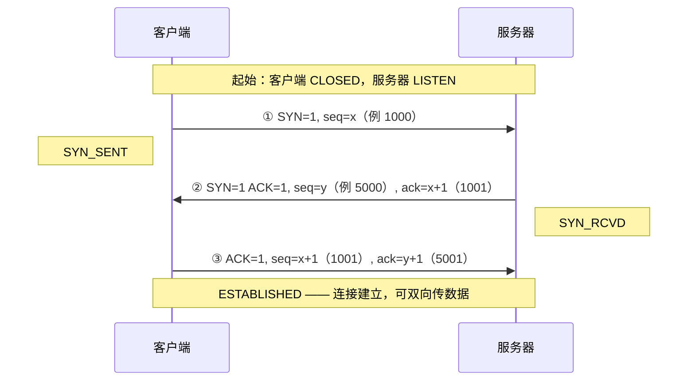
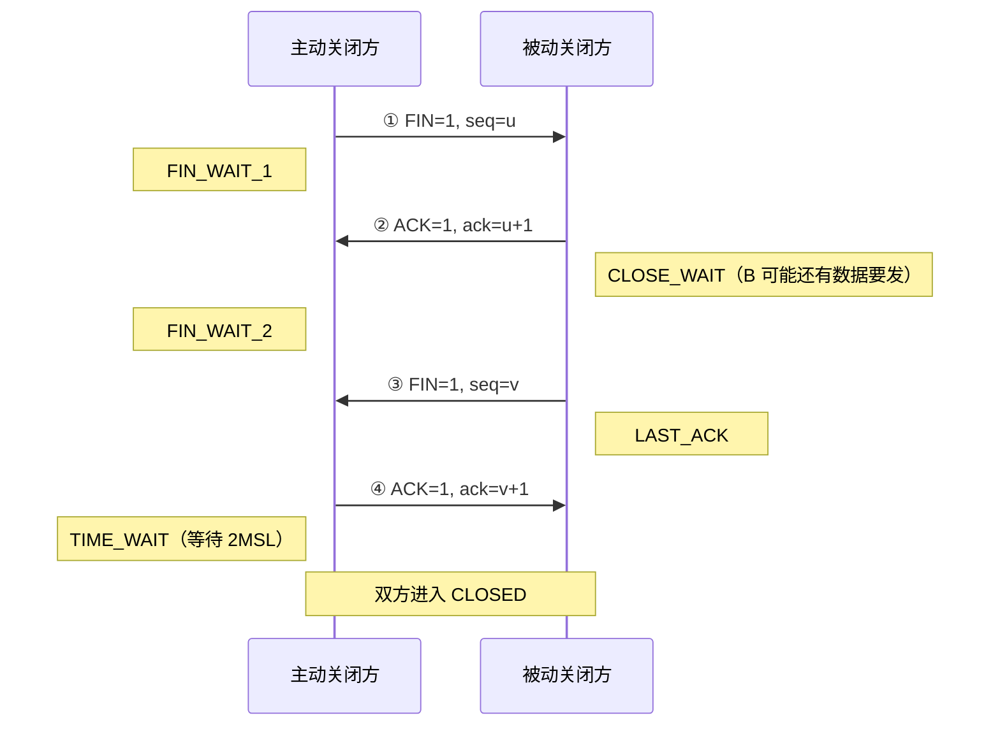
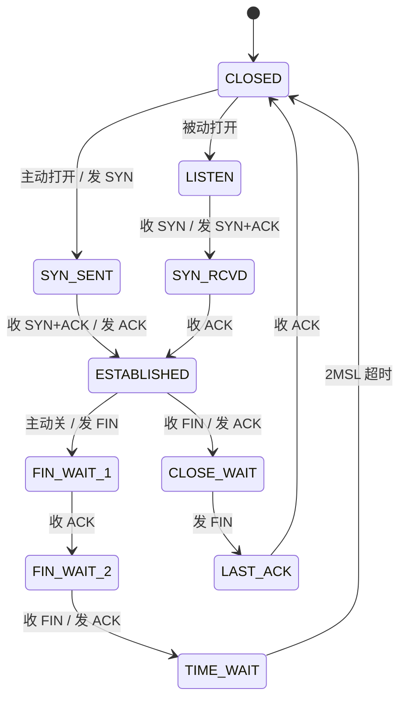
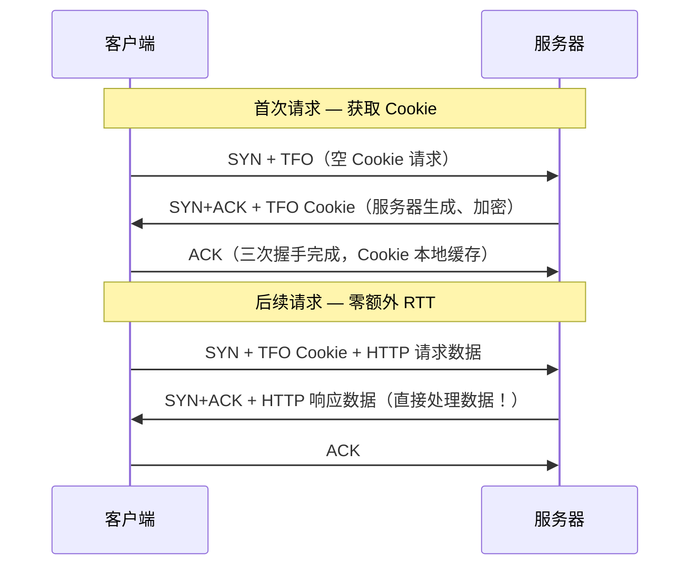
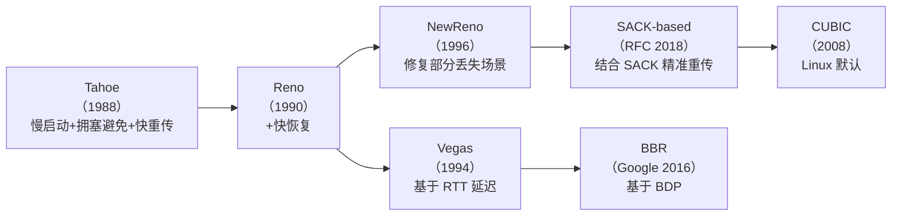
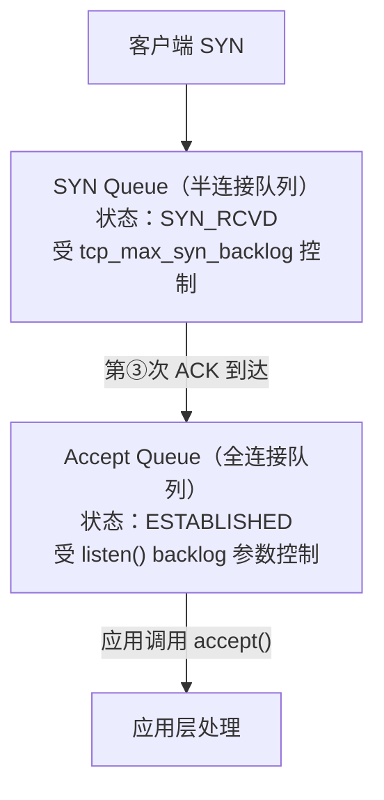
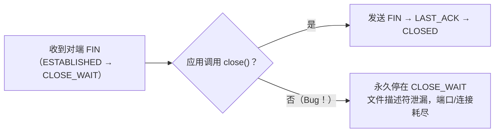
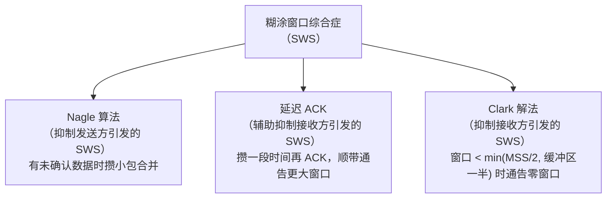

# 详解网络协议(十三)TCP协议

> [!abstract] 速览
> **TCP（Transmission Control Protocol，传输控制协议）** 是 [[06.传输层]] 的两大核心协议之一（另一个是 [[16.UDP协议]]），最新规范为 **RFC 9293**（2022 年发布，取代经典的 RFC 793）。它运行在不可靠的 [[11.IP协议|IP]] 之上，用「连接管理 + 确认重传 + 序号排序 + 流量/拥塞控制」把 IP 的"尽力而为"包装成**面向连接、可靠、按序、全双工**的**字节流**服务。
> 一句话：**IP 负责"把包尽量送到"，TCP 负责"保证送到、不重复、不乱序"。**

## 1. 为什么需要 TCP：从 IP 的"不可靠"说起

[[11.IP协议|IP]] 提供的是 **尽力而为（best-effort）** 的数据报服务：尽量把包送到，但**可能丢失、乱序、重复、出错**。可绝大多数应用（网页、文件、邮件、远程登录）要的是"完整、有序、不重不漏"的数据流。TCP 就是在 IP 之上补齐这层可靠性的协议——它把上层看似连续的字节流切成报文段（segment）交给 IP，并在接收端还原成同样的字节流。

与它"性格相反"的是 [[16.UDP协议|UDP]]：

| 维度 | TCP | UDP |
| --- | --- | --- |
| 连接 | 面向连接（先握手） | 无连接 |
| 可靠性 | 可靠：确认 + 重传 | 不保证 |
| 顺序 | 按序交付 | 不保证 |
| 传输单位 | 字节流（无消息边界） | 数据报（有边界） |
| 头部开销 | 20～60 字节 | 8 字节 |
| 时延 | 有握手与拥塞控制开销 | 低时延、快 |
| 典型场景 | [[18.HTTP-HTTPS协议\|HTTP]]、文件传输、邮件、[[21.SSH协议\|SSH]] | DNS、音视频、游戏、直播 |

## 2. TCP 报文段结构

头部固定 **20 字节**，带选项时最长 **60 字节**。各字段：

| 字段 | 长度 | 作用 |
| --- | --- | --- |
| 源端口 / 目的端口 | 各 16 bit | 标识两端进程；与源/目的 IP 合称**四元组**，唯一确定一条连接 |
| 序列号 SEQ | 32 bit | 本段**首字节**在整个字节流中的编号（初始值 ISN 随机选取，防伪造） |
| 确认号 ACK | 32 bit | **期望收到**的下一个字节序号，即"此前字节已全部收到"（累计确认） |
| 数据偏移 | 4 bit | 头部长度（以 4 字节为单位），故头部 20～60 字节 |
| 标志位 | 8 bit | 见下表 |
| 窗口大小 | 16 bit | 接收窗口 `rwnd`，流量控制核心（配合窗口缩放选项可超过 64 KB） |
| 校验和 | 16 bit | 覆盖伪首部 + 头部 + 数据，检错（**不防篡改**） |
| 选项 | 0～40 字节 | MSS、窗口缩放、SACK、时间戳等 |

**标志位（Flags）**：

| 标志 | 含义 |
| --- | --- |
| `SYN` | 同步序号，建立连接时使用 |
| `ACK` | 确认号有效（连接建立后基本恒为 1） |
| `FIN` | 发送方数据已发完，请求释放连接 |
| `RST` | 复位连接（出现异常 / 拒绝连接） |
| `PSH` | 提示接收方尽快把数据交给应用，不必等缓冲区满 |
| `URG` | 紧急指针有效 |
| `CWR` / `ECE` | 配合 ECN 显式拥塞通知 |

> SYN、FIN **各消耗一个序号**（即使不携带数据），这正是握手/挥手里 `ack = seq + 1` 的原因。

## 3. 三次握手：建立连接

**为什么是三次，而不是两次？** 核心是要让**双方都确认"对方的发送能力、自己的接收能力都正常"**：

1. 第 ① 次：服务器确认"能收到客户端的包"；
2. 第 ② 次：客户端确认"能收到服务器的包"，且服务器具备收发能力；
3. 第 ③ 次：服务器确认"客户端能收到自己的包"。

若只有两次，服务器无法确认客户端是否收到了第 ② 次响应。更糟的是会被**历史重复 SYN** 坑——一个早已失效、却滞留网络的旧 SYN 迟到到达服务器，两次握手下服务器会**直接建连、分配资源、开始发数据**，而客户端根本没想连接，白白浪费资源；三次握手下，客户端对这个意外的 SYN+ACK 会回 `RST` 拒绝，连接不会建立。

## 4. 四次挥手：释放连接

**为什么是四次（而握手只要三次）？** 因为 TCP 是**全双工**，两个方向的数据通道要**各自独立关闭**。被动方收到 FIN 后，可能**还有数据没发完**，所以先单独回一个 `ACK`（"我知道你要关了"），等自己的数据发完再发自己的 `FIN`——于是 ACK 与 FIN 分成两步，无法像握手那样把"SYN+ACK"合并。

**为什么主动方最后要 `TIME_WAIT` 等 2MSL（MSL = 报文最大生存时间）？** 两个目的：

1. **确保最后一个 ACK 能到达对方**：万一这个 ACK 丢了，对方会重发 FIN，主动方还在 TIME_WAIT 就能重发 ACK；若直接 CLOSED 便无法响应。
2. **让本连接的旧报文在网络中自然消散**，避免它们"借尸还魂"污染后续相同四元组的新连接。

## 5. TCP 状态机

## 6. 可靠传输：序号 + 确认 + 重传

- **累计确认**：确认号 = 期望的下一个字节，表示"此前都收到了"。
- **超时重传（RTO）**：发出段即启动定时器，超时未确认就重传；RTO 由 RTT 的平滑估计动态计算（Jacobson 算法），网络越抖动 RTO 越大。
- **快重传**：收到 **3 个重复 ACK** 即立即重传丢失段，不必干等 RTO 超时，恢复更快。
- **SACK（选择确认）**：用选项告诉发送方"哪些不连续的段已收到"，避免把已到的段也重传，提高效率。

## 7. 流量控制：滑动窗口

接收方在每个 ACK 里用**窗口大小字段（rwnd）**告诉发送方"我的缓冲区还能收多少"，发送方"在途未确认数据"不得超过这个窗口——这就是**滑动窗口**，防止**快发送方淹没慢接收方**。

当 `rwnd = 0` 时发送方暂停，并启动**坚持定时器（persist timer）**定期发**零窗口探测**，避免"接收方腾出空间的通知丢失 → 双方互等"的死锁。

> 注意区分：**流量控制**保护的是"接收方"；下面的**拥塞控制**保护的是"网络"。

## 8. 拥塞控制：慢启动 / 拥塞避免 / 快重传 / 快恢复

发送方额外维护一个**拥塞窗口 `cwnd`**，实际能发的数据量 = `min(rwnd, cwnd)`。

- **慢启动**：`cwnd` 从 1 个 MSS 起步，**每收到一个 ACK 就 +1 个 MSS**——效果是**每经过一个 RTT，cwnd 翻倍（指数增长）**，直到达到阈值 `ssthresh`。
- **拥塞避免**：达到 `ssthresh` 后改为**每个 RTT 只 +1 个 MSS（线性增长）**，谨慎试探带宽上限。
- **丢包即拥塞信号**：
    - 超时（严重）→ `ssthresh = cwnd/2`，`cwnd` 直接打回 1，重新慢启动；
    - 收到 3 个重复 ACK（轻微）→ **快重传 + 快恢复**：`ssthresh = cwnd/2`，`cwnd` 减半后直接进入拥塞避免，不必从 1 重来。

> [!note] 对原文的修正
> 慢启动并非"窗口大小指数增长"那么含糊——准确说是"**每个 ACK 让 cwnd 增加 1 个 MSS，从而每个 RTT 翻倍**"。现代 Linux 默认拥塞控制算法已是 **CUBIC**，Google 还提出了基于带宽时延积的 **BBR**。

## 9. 性能优化机制

| 机制 | 作用 | 注意 |
| --- | --- | --- |
| **MSS 协商** | 握手时商定最大段长，避免 IP 分片 | 通常 = MTU − 40 |
| **窗口缩放** | 用选项扩展窗口上限，突破 16 bit 的 64 KB | 高带宽时延网络必备 |
| **Nagle 算法** | 攒小包合并发送，减少"小包风暴" | 与**延迟 ACK** 同开可能引入卡顿，交互式应用常用 `TCP_NODELAY` 关闭 |
| **延迟 ACK** | 攒一会儿再确认，减少纯 ACK 包 | 同上 |

## 10. TCP 选项（Options）详解

TCP 头部固定 20 字节之外，最多可附加 **40 字节选项**（以 4 字节对齐），在握手或通信中协商高级能力。

| 选项名 | Kind | 长度 | 作用 |
|---|---|---|---|
| **EOL**（End of Option List） | 0 | 1 byte | 选项列表结束标志，补齐对齐 |
| **NOP**（No-Operation） | 1 | 1 byte | 填充对齐，各选项间常插入 |
| **MSS**（Max Segment Size） | 2 | 4 bytes | 握手时声明本端愿意接收的**最大段载荷**；通常 = MTU − 40 |
| **Window Scale**（窗口缩放） | 3 | 3 bytes | 含 `shift count`（0～14），实际窗口 = `rwnd << shift`，突破 64 KB 上限至最大 1 GB |
| **SACK-Permitted** | 4 | 2 bytes | 握手时声明"我支持 SACK"，双方均声明才生效 |
| **SACK**（Selective ACK） | 5 | 变长 | 告知发送方已收到的**不连续块**（最多 4 个块），避免重传已到达的数据 |
| **Timestamps** | 8 | 10 bytes | 含 `TSval`（发送时刻）与 `TSecr`（回显对端时刻），用于精确 RTT 测量；同时实现 **PAWS**（见下） |
| **TCP Fast Open (TFO)** | 34 | 变长 | 携带 TFO Cookie，允许在 SYN 包中附带应用数据，减少一个 RTT（见下） |

### PAWS（Protection Against Wrapped Sequence numbers）

32 位序列号在高带宽链路上可能**快速回绕**（10 Gbps 链路约 3.4 秒即可绕一圈），旧包重出后会被错误接受。PAWS 利用 Timestamps 选项的 `TSval` 作为单调时间戳：**收到的段时间戳必须 ≥ 最近一次有效段的时间戳**，否则视为旧包直接丢弃，从根本上防回绕。

### TCP Fast Open（TFO）

> [!note]
> TFO 使客户端在第一个 SYN 包里就携带应用数据，服务器验证 Cookie 后立即处理，**减少一个完整 RTT 的连接建立开销**，对短连接高频场景（如 HTTP/1.1 短轮询）效果显著。Linux 内核 3.7+ 支持，需 `tcp_fastopen` 参数开启。

---

## 11. 拥塞控制算法谱系

现代 TCP 拥塞控制已从最初的 Tahoe 发展出两大流派。

### 算法演进时间线

### 两大流派对比

| 维度 | 基于丢包（Loss-based） | 基于延迟/带宽（Delay/BDP-based） |
|---|---|---|
| 代表算法 | Tahoe、Reno、NewReno、CUBIC | Vegas、BBR |
| 拥塞信号 | 丢包（超时或 3 dup-ACK） | RTT 增大（Vegas）\| 带宽时延积 BDP（BBR） |
| 优点 | 实现简单、兼容性好 | 不依赖丢包即可感知拥塞，更早减速 |
| 缺点 | 必须先丢包才反应，带宽利用率低 | 与丢包类算法共存时可能被"欺负"（BBR vs CUBIC 公平性问题） |
| 典型场景 | 通用 Internet | 高带宽低时延（数据中心）、卫星链路 |

### CUBIC

CUBIC 是 **Linux 2.6.19 以后的默认算法**。它抛弃了 Reno 线性增长的保守策略，用**三次函数（cubic function）** 来控制 `cwnd` 增长：

- 距上次拥塞事件越远，增速越慢（"学聪明了"）；
- 接近历史峰值时放慢，越过后再加速探测；
- 与其他流共存时公平性好，高带宽时延网络（BDP 大）尤为高效。

### BBR（Bottleneck Bandwidth and RTT）

Google 2016 年提出，**不把丢包当首要拥塞信号**，而是实时估算：

- **BtlBw**：瓶颈带宽（Bottleneck Bandwidth）；
- **RTprop**：最小传播 RTT。

发送速率 ≈ `BtlBw × RTprop`（即 **BDP**），同时限制在途数据量，使管道"刚好装满"而不溢出。对**高丢包（如卫星链路）** 和**高带宽时延积**场景收益显著；但与 CUBIC 混合时存在公平性争议（BBR 可能抢占更多带宽）。

---

## 12. 连接队列：半连接队列与全连接队列

服务器在 `LISTEN` 状态下，内核维护**两个独立队列**来管理握手过程中的连接：

| 队列 | 存储内容 | 溢出后果 | 关键参数 |
|---|---|---|---|
| **SYN queue**（半连接队列） | 已收到 SYN、尚未完成三次握手的连接 | 新 SYN 被丢弃（或触发 SYN Cookie） | `tcp_max_syn_backlog` |
| **Accept queue**（全连接队列） | 三次握手完成、等待 `accept()` 的连接 | 服务器发 RST 拒绝该连接（或静默丢弃） | `listen()` 的 `backlog` 参数、`somaxconn` |

### SYN Cookie：无状态防 SYN Flood

**SYN Flood** 攻击者大量发 SYN 但故意不回第 ③ 次 ACK，耗尽 SYN queue。**SYN Cookie** 的思路是：

1. 收到 SYN 时，**不分配任何连接状态**（SYN queue 零消耗）；
2. 把连接四元组 + 时间戳等信息编码成 `ISN`（初始序列号）发回 SYN+ACK；
3. 收到合法的第 ③ 次 ACK 时，从 ACK 号反向解码恢复连接状态，直接进入 ESTABLISHED。

> [!note]
> SYN Cookie 启用后，握手期间**无法使用 SACK、窗口缩放等需要 SYN queue 存储选项信息的特性**，连接性能略降；但在遭受 SYN Flood 时能保证服务可用性。Linux 通过 `tcp_syncookies` 参数控制（`0=关闭`、`1=半连接队列溢出时自动启用`、`2=始终启用`）。

> [!warning]
> Accept queue 满时的行为受 `tcp_abort_on_overflow` 控制：默认 0 表示**静默丢弃**（等客户端超时重连），改为 1 则发 RST 快速告知客户端拒绝。高并发场景若 `accept()` 处理不过来，应**加大 backlog 并优化应用处理速度**，而非单纯调 `somaxconn`。

---

## 13. TCP Keepalive 保活

TCP 连接长时间无数据交换时，中间设备（NAT、防火墙）可能静默销毁映射，导致连接"名存实亡"。TCP Keepalive 由内核定时发送**探测包**检测对端存活。

### 三个核心内核参数

| 参数 | 默认值 | 含义 |
|---|---|---|
| `tcp_keepalive_time` | 7200 秒（2 小时） | 连接空闲**多久**后开始发第一个探测包 |
| `tcp_keepalive_intvl` | 75 秒 | 每次探测包之间的**间隔** |
| `tcp_keepalive_probes` | 9 次 | 连续探测失败**多少次**后判定对端失效，关闭连接 |

即：默认需要 `7200 + 75 × 9 = 7875 秒`（约 2.2 小时）才能发现死连接，对短命 NAT 映射来说太慢，生产环境常调小 `tcp_keepalive_time`（如 60 秒）。

应用层需通过 `SO_KEEPALIVE` socket 选项开启，或用 `TCP_KEEPIDLE`/`TCP_KEEPINTVL`/`TCP_KEEPCNT` 逐连接覆盖内核默认值。

### Keepalive vs 应用层心跳

| 维度 | TCP Keepalive | 应用层心跳 |
|---|---|---|
| 实现层 | 内核自动 | 应用代码主动发消息 |
| 粒度 | 整条 TCP 连接 | 可到单个会话/通道（如 WebSocket ping） |
| 中间件感知 | 透明探测，L4 层 | 应用层可自定义格式与频率 |
| 检测能力 | 仅检测"TCP 连接存活" | 可检测"应用逻辑是否正常响应" |
| 推荐 | 基础兜底 | 分布式系统、微服务必须自建 |

> [!note]
> **只靠 TCP Keepalive 不够**——它仅证明 TCP 连接未断，不能证明对端应用还在正常处理请求。高可用系统应双管齐下：TCP Keepalive 快速清理死连接，应用层心跳检测业务健康状态。

---

## 14. CLOSE_WAIT 堆积

### 成因

`CLOSE_WAIT` 是**被动关闭方**收到对方 FIN、回了 ACK 之后进入的状态。此时 TCP 层已通知应用层"对端已关闭发送"，应用层**必须调用 `close()` / `shutdown()`** 发出自己的 FIN，连接才能最终关闭。

**如果应用层没有调用 `close()`**，连接将永远停在 `CLOSE_WAIT`——这是 **Bug，不是 TCP 本身的问题**。

### 与 TIME_WAIT 的区别

| 维度 | CLOSE_WAIT | TIME_WAIT |
|---|---|---|
| 出现方 | **被动关闭方** | **主动关闭方** |
| 成因 | 应用未调用 `close()` | 四次挥手正常完成后等待 2MSL |
| 是否正常 | **不正常（通常是 Bug）** | 正常现象，短暂存在 |
| 解决方向 | 修复应用代码（找未 `close` 的连接/异常路径） | 可调参缓解，通常无需处理 |
| 风险 | 文件描述符耗尽、端口耗尽 | 端口暂时占用，大量时影响新连接速率 |

> [!warning]
> `netstat -an | grep CLOSE_WAIT` 若有**大量积压**，几乎可以断定是应用层资源泄漏：线程/协程处理连接时抛了异常、没有在 finally 块里 `close()`，或者连接池未正确回收。**调内核参数无法根治 CLOSE_WAIT 堆积**。

---

## 15. 糊涂窗口综合症（Silly Window Syndrome）

### 问题描述

**糊涂窗口综合症（SWS，Silly Window Syndrome）** 指发送方或接收方的行为导致 TCP 持续传输**极小的数据段**，有效载荷远小于头部开销，浪费带宽、增加时延。

SWS 有两种来源：

| 来源 | 场景 | 后果 |
|---|---|---|
| **发送方引发** | 应用每次只 `write()` 1 字节，发送方立即发出 | 每段只有 1 字节数据却有 40 字节头，带宽利用率 < 2.5% |
| **接收方引发** | 接收缓冲区几乎满，每次只通告极小窗口（如 1 字节） | 发送方被迫发微小段，同样低效 |

### 解决方案与三者关系

**Nagle 算法规则**（发送方）：
- 若当前**没有未确认的在途数据**，立即发送（哪怕只有 1 字节）；
- 若有未确认数据，则**攒积数据直到凑满一个 MSS 或收到 ACK** 再发。

**Clark 解法**（接收方）：接收方仅在**可用缓冲区 ≥ min(MSS/2, 接收缓冲区总量/2)** 时才通告非零窗口，否则强制通告零窗口，避免诱使发送方发微小段。

### Nagle + 延迟 ACK 的"死锁"陷阱

> [!warning]
> Nagle 算法与延迟 ACK **同时开启时可能相互等待**：
> - 发送方在等"收到 ACK 后再发剩余数据"（Nagle）；
> - 接收方在"等凑到 2 个数据段再一起 ACK"（延迟 ACK）。
>
> 双方互等，直到延迟 ACK 定时器（通常 40～200 ms）超时才解锁，**引入可感知的卡顿**。
>
> **对策**：交互式应用（如 [[21.SSH协议|SSH]]、在线游戏）在 socket 上设置 `TCP_NODELAY`（关闭 Nagle），或在应用层合并好数据再一次性 write，避免既依赖 Nagle 又依赖延迟 ACK。

---

## 16. 扩展专题：D-SACK 与 PLPMTUD

### D-SACK（Duplicate SACK，RFC 2883）

SACK 的扩展，允许接收方用第一个 SACK 块报告**已接收但重复的数据范围**，帮助发送方区分：

- **包丢失**（对端没收到 → 重传正确）
- **ACK 丢失**（对端其实已收到，只是 ACK 丢了 → 避免不必要的重传）
- **包乱序**（包迟到被误判为丢失 → 避免过早重传）

D-SACK 使发送方能更精准地调整拥塞窗口，减少"误重传"导致的带宽浪费。

### PLPMTUD（Packetization Layer Path MTU Discovery，RFC 4821）

传统 PMTUD（RFC 1191）依赖 ICMP "Fragmentation Needed" 消息，但许多防火墙过滤 ICMP，导致**黑洞路由（PMTUD Black Hole）**。PLPMTUD 在传输层（Packetization Layer）主动探测：

- 发送不同大小的探测包，根据是否收到 ACK 来判断路径 MTU；
- 不依赖 ICMP，穿透防火墙友好；
- **QUIC 协议原生使用 PLPMTUD**，TCP 的实现由操作系统内核处理（如 Linux `tcp_mtu_probing` 参数）。

---

## 17. 常见误区与面试要点

> [!warning] 易错点
> - **三次握手能携带数据吗？** 第 ① 次 SYN 一般不带数据；第 ③ 次 ACK 可以带数据。
> - **"粘包/拆包"不是 TCP 的 bug**：TCP 是**字节流、无消息边界**，所谓"粘包"是应用层没定界。需应用层协议自己划分边界（**固定长度 / 长度字段 / 分隔符**）。[[16.UDP协议|UDP]] 有边界，不存在此问题。
> - **大量 `TIME_WAIT` 堆积**：通常出现在"主动关闭方"（如高并发短连接的客户端/代理），可用连接复用、`SO_REUSEADDR`、调参缓解，而非盲目消灭 TIME_WAIT。
> - **`SYN Flood`**：攻击者只发 SYN 不回第 ③ 次 ACK，耗尽服务器半连接队列；防御用 **SYN Cookie**（先不分配资源）。
> - **ACK（标志位）≠ ack（确认号）**，面试常混。

## 18. 安全考虑

- **SYN 洪泛**：限制半连接数、缩短 SYN 超时、启用 **SYN Cookie**。
- **RST 伪造 / 序号猜测**：随机化 ISN 提高伪造难度。
- **校验和只能检错、不能防篡改**：机密性与完整性需叠加 [[14.SSL协议|SSL]] / [[15.TLS协议|TLS]]（[[18.HTTP-HTTPS协议|HTTPS]] 即 HTTP over TLS）。

## 延伸阅读

- 所属层：[[06.传输层]]
- 对照协议：[[16.UDP协议]]（无连接、低时延）
- 承载下层：[[11.IP协议]] · [[12.支持地址分类和子网划分]]
- 之上的安全层：[[14.SSL协议]] · [[15.TLS协议]]
- 典型应用：[[18.HTTP-HTTPS协议]] · [[19.websocket协议]] · [[21.SSH协议]] · [[20.FTP-TFTP-SFTP协议]]

> ⬅️ [[12.支持地址分类和子网划分]] ｜ 🏠 [[00.网络协议详解总览]] ｜ [[14.SSL协议]] ➡️
