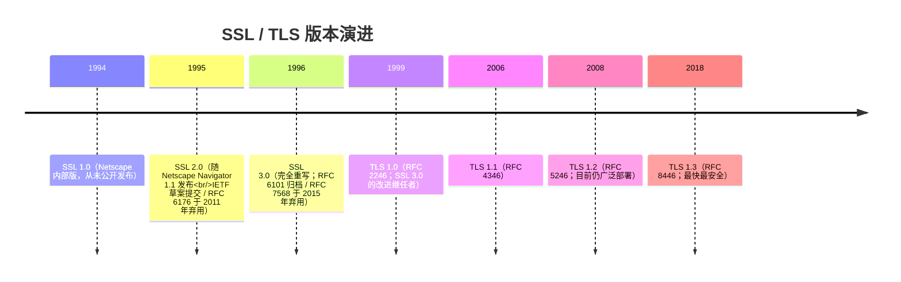
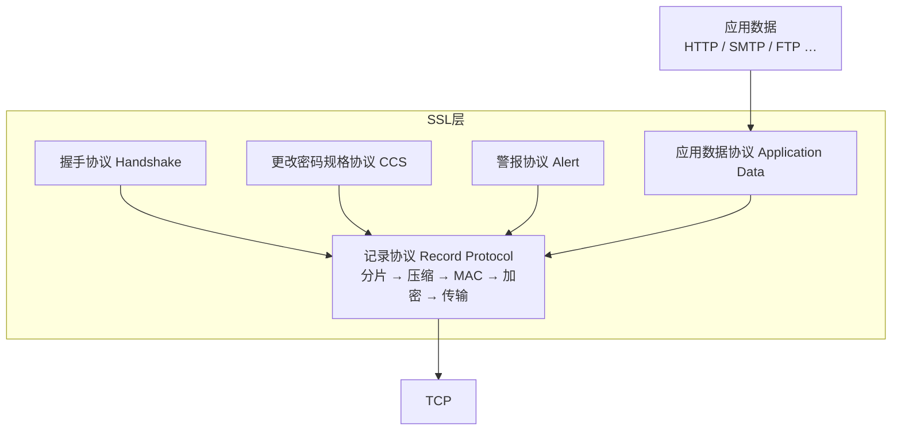
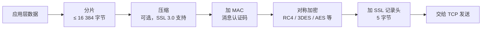
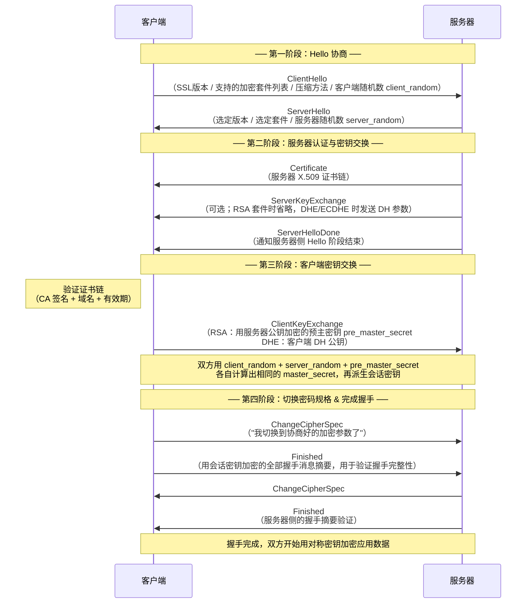

# 详解网络协议(十四)SSL协议

> [!abstract] 速览
> **SSL（Secure Sockets Layer，安全套接层）** 是网景公司（Netscape Communications）1990 年代开发的加密协议，是 [[18.HTTP-HTTPS协议|HTTPS]] 的鼻祖，提供**机密性、身份认证、完整性**三大保障。但 **SSL 全部版本（2.0/3.0）今已弃用**，被 [[15.TLS协议|TLS]] 取代——现实中说的"SSL 证书""SSL 加密"，底层其实都是 TLS。
> 读这篇是为了理解历史与原理基础；实战配置请直接看 [[15.TLS协议]]。
> **口诀**：SSL 奠基，TLS 传承；协议已死，名字永存。

## 1. SSL 解决什么

在明文的 [[13.TCP协议|TCP]] 之上加一层"安全外壳"，让窃听者看不懂、篡改者改不了、冒充者装不像：

| 目标 | 手段 | 说明 |
| --- | --- | --- |
| 机密性（Confidentiality） | 对称加密应用数据 | 握手阶段协商密钥，之后对称加密 |
| 身份认证（Authentication） | 数字证书 | 验证服务器是不是它声称的那个 |
| 完整性（Integrity） | 消息摘要 / MAC | 防止传输中被篡改 |

> [!note] 为什么不直接在 TCP 上写业务加密？
> SSL/TLS 把安全逻辑集中在一层，**应用层（HTTP、SMTP、FTP…）几乎不需要改动**，只要把 "连到 TCP 端口" 换成 "连到 TLS 层" 即可——这也是 "近乎透明" 的工程美学。

---

## 2. 版本与历史

### 2.1 时间线



### 2.2 各版本详细说明

**SSL 1.0（约 1994 年末，Netscape 内部）**

Netscape 工程师 Taher Elgamal 主导设计了最初版本，但因安全缺陷严重（缺乏消息完整性保护、密码机制存在根本性漏洞）从未对外发布，只在内部使用。它是 SSL 系列的"零号原型"。

**SSL 2.0（1995 年，随 Netscape Navigator 1.1 发布）**

首次公开落地，带来了现代 TLS 仍在使用的若干基础概念：

- SSL 握手流程的雏形
- X.509 数字证书 + 服务器身份验证
- 对称加密 + MAC 的记录层结构

但它有严重缺陷：
- 握手消息**未做完整性保护**，攻击者可降级到更弱的加密套件
- 消息认证与加密使用**同一密钥**，设计上不安全
- 仅支持 MD5 做消息认证，强度不足
- 缺乏对出口级弱密钥的防护（40-bit 密钥可被暴力破解）

IETF 在 2011 年通过 RFC 6176 正式弃用 SSL 2.0。

**SSL 3.0（1996 年，Paul Kocher、Phil Karlton、Alan Freier 完全重写）**

从头重写，是 SSL 家族中最成熟的版本，也是 TLS 的直接前身：

- 分离了数据传输层与消息层
- 引入 Diffie-Hellman 密钥交换和 Fortezza 套件
- 支持真正的 128-bit 密钥长度
- 增加了 MAC 对握手消息的保护

SSL 3.0 从未正式由 IETF 发布为 RFC，直到 2011 年才以 **RFC 6101（Historic 类别）** 归档留存。2014 年 POODLE 攻击披露后，IETF 于 2015 年通过 **RFC 7568** 正式弃用 SSL 3.0。

> [!tip] 记忆口诀
> **1.0 未出生，2.0 先天残，3.0 传 TLS，全族已退场。**

### 2.3 SSL 与 TLS 版本全貌对照

| 协议版本 | 年份 | 规范 | 当前状态 | 备注 |
| --- | --- | --- | --- | --- |
| SSL 1.0 | 1994 | 无（内部草稿） | 已弃用（从未发布） | Netscape 内部，缺陷严重 |
| SSL 2.0 | 1995 | RFC 6176（弃用文档） | **已弃用** | RFC 6176 于 2011 年宣告弃用 |
| SSL 3.0 | 1996 | RFC 6101（Historic） | **已弃用** | RFC 7568 于 2015 年宣告弃用；POODLE 要害 |
| TLS 1.0 | 1999 | RFC 2246 | **已弃用** | 2021 年 RFC 8996 弃用；BEAST 要害 |
| TLS 1.1 | 2006 | RFC 4346 | **已弃用** | 2021 年 RFC 8996 弃用 |
| TLS 1.2 | 2008 | RFC 5246 | 广泛使用（推荐保留） | 目前大多数服务器默认版本 |
| TLS 1.3 | 2018 | RFC 8446 | **推荐，最新最安全** | 握手 1-RTT，强制前向保密 |

---

## 3. 体系结构

SSL 分两大层次：底层**记录协议（Record Protocol）**负责分片、可选压缩、MAC 计算、加密；其上四个子协议负责协商与控制。

### 3.1 协议分层示意



### 3.2 四大子协议详解

| 子协议 | 职责 | 关键消息 |
| --- | --- | --- |
| 握手协议（Handshake） | 协商版本与套件、验证证书、交换密钥；整个安全通信的"大脑" | ClientHello、ServerHello、Certificate、ServerKeyExchange、ClientKeyExchange、Finished |
| 记录协议（Record） | 接收上层数据 → 分片（最大 16 KB）→ 可选压缩 → 计算 MAC → 对称加密 → 封装成记录 | ContentType、ProtocolVersion、Length、Data |
| 更改密码规格（CCS） | 发送方通知对方"接下来切换到协商好的加密参数"；仅含 1 字节 `0x01` | ChangeCipherSpec |
| 警报协议（Alert） | 传递告警（warning）与错误（fatal）；fatal 级别直接终止连接 | close_notify、bad_record_mac、handshake_failure 等 |

### 3.3 记录协议的处理流水线



> [!warning] 压缩的双刃剑
> SSL 记录层支持压缩，本意是节省带宽，但正是这一特性导致了 CRIME 攻击（见第 5 节）。TLS 1.3 已彻底移除压缩支持。

---

## 4. SSL 握手流程

> [!note] 学习价值
> SSL 握手是理解 [[15.TLS协议|TLS]] 握手的原理基础。TLS 1.2 握手与此流程高度相似，TLS 1.3 进行了大幅简化。

### 4.1 完整握手序列图（SSL 3.0 / TLS 1.2 参考实现）



### 4.2 握手要点拆解

| 阶段 | 关键操作 | 安全目的 |
| --- | --- | --- |
| ClientHello | 客户端发送支持的版本、套件、client_random | 告知能力上限；随机数防重放 |
| ServerHello | 服务器从客户端列表中选定版本与套件 | 降级到双方都支持的最高版本 |
| Certificate | 发送 X.509 证书链 | 客户端验证服务器身份（是否 CA 签发、域名是否匹配、是否过期） |
| ServerKeyExchange | DHE/ECDHE 时发送 DH 公钥参数 | 支持前向保密的密钥协商 |
| ClientKeyExchange | 发送预主密钥（RSA）或 DH 公钥 | 建立共享秘密材料 |
| master_secret 计算 | `PRF(pre_master_secret, client_random, server_random)` | 两个随机数确保每次会话密钥唯一 |
| ChangeCipherSpec | 各自通知对方切换密码参数 | 分隔"协商阶段"与"加密阶段" |
| Finished | 加密后的全部握手消息哈希 | 双方互验"握手过程中没有被篡改" |

### 4.3 与 TLS 1.2 / 1.3 对比

| 特征 | SSL 3.0 握手 | TLS 1.2 握手 | TLS 1.3 握手 |
| --- | --- | --- | --- |
| RTT 数 | 2-RTT | 2-RTT | **1-RTT**（会话恢复 0-RTT） |
| 密钥派生函数 | 自定义 PRF（MD5+SHA-1） | PRF（SHA-256/384） | HKDF（更安全） |
| 前向保密 | 可选（需选 DHE 套件） | 可选 | **强制**（仅 ECDHE） |
| 握手加密 | Finished 前明文 | Finished 前明文 | **握手消息全部加密** |
| 支持的套件 | RC4、MD5、弱 DES 等 | 范围宽，含 AES-GCM | 仅 AEAD（ChaCha20、AES-GCM） |

> [!tip] 学习路径
> 理解 SSL 握手 → 阅读 [[15.TLS协议]] 中的 TLS 1.2 握手 → 再看 TLS 1.3 的优化，三步递进。

---

## 5. 针对 SSL / 早期 TLS 的经典攻击

> [!danger] 这些攻击是 SSL 退场的直接原因
> 每一个攻击都暴露了 SSL/TLS 在设计或实现上的缺陷，是安全工程史上的重要教训。

### 5.1 攻击全景表

| 攻击名称 | CVE | 发现年份 | 目标版本 | 攻击类型 | 根本原因 |
| --- | --- | --- | --- | --- | --- |
| BEAST | CVE-2011-3389 | 2011 | TLS 1.0 / SSL 3.0 | CBC IV 可预测 | CBC 模式使用链式 IV，上一个密文块作为下一记录的 IV |
| CRIME | CVE-2012-4929 | 2012 | SSL/TLS（开启压缩） | 压缩侧信道 | 压缩后密文长度泄露明文信息 |
| BREACH | CVE-2013-3587 | 2013 | HTTPS + HTTP 压缩 | HTTP 层压缩侧信道 | HTTP 响应体压缩泄露敏感字段长度 |
| POODLE | CVE-2014-3566 | 2014 | SSL 3.0 | CBC 填充 Oracle | SSL 3.0 CBC 填充不完整规范可被 Oracle |
| FREAK | CVE-2015-0204 | 2015 | SSL/TLS（EXPORT 套件） | 弱密钥降级 | 出口级 RSA 512-bit 密钥可被分解 |
| Logjam | CVE-2015-4000 | 2015 | TLS（DHE_EXPORT） | DH 弱参数降级 | 512-bit Diffie-Hellman 可被离散对数破解 |
| DROWN | CVE-2016-0800 | 2016 | 共享密钥的 TLS 服务器 | 跨协议攻击 | 服务器仍支持 SSLv2，攻击者用 SSLv2 解密 TLS 流量 |
| Heartbleed | CVE-2014-0160 | 2014 | **OpenSSL 实现**（非协议） | 内存越界读取 | OpenSSL heartbeat 扩展未校验长度字段 |

### 5.2 逐攻击详解

#### POODLE（Padding Oracle On Downgraded Legacy Encryption）

**CVE-2014-3566** \| 发现者：Google 安全团队（Bodo Möller、Thai Duong、Krzysztof Kotowicz）\| 披露：2014-10-14

**根本原因**：SSL 3.0 的 CBC 模式填充规范不明确——标准只规定填充字节的最后一字节为填充长度，其余字节可以是任意值，且接收方不校验它们。攻击者利用这一 "Padding Oracle"（填充 Oracle），通过大量（平均每字节 256 次）请求逐字节推断出明文。

**攻击前提**：
1. 攻击者能在受害者浏览器中注入恶意 JavaScript（如公共 Wi-Fi 下的 MitM）
2. 攻击者能观测并操纵加密网络流量
3. 目标服务器支持 SSL 3.0 回退

**影响**：可解密 SSL 3.0 会话中的 Cookie 等敏感信息。

**防御**：禁用 SSL 3.0（服务器侧）；部署 `TLS_FALLBACK_SCSV`（RFC 7507，防止主动降级）。

> 延申：2015 年又发现 **POODLE for TLS**，部分服务器在 TLS CBC 实现中也犯了同样的填充不校验错误。

---

#### BEAST（Browser Exploit Against SSL/TLS）

**CVE-2011-3389** \| 发现者：Juliano Rizzo、Thai Duong \| 披露：2011

**根本原因**：TLS 1.0（及 SSL 3.0）使用 **CBC 链式模式（Chained IV）**——上一条记录的最后一个密文块作为下一条记录的 IV。攻击者只要能预测 IV（前一密文块是已知的），就可以构造"选择明文"来验证猜测。

**与 POODLE 的区别**：POODLE 攻击接收方的填充校验；BEAST 攻击发送方对 IV 的使用方式。

**防御**：升级到 TLS 1.1+（使用显式 IV）；优先选用 RC4（短期绕过，但 RC4 本身已不安全）；现代推荐：直接禁用 TLS 1.0，升级到 TLS 1.2/1.3。

---

#### CRIME（Compression Ratio Info-leak Made Easy）

**CVE-2012-4929** \| 发现者：Juliano Rizzo、Thai Duong \| 披露：2012 年 ekoparty 安全大会

**根本原因**：SSL/TLS 记录层可选地支持 Deflate 压缩。压缩算法（如 gzip）利用**重复字符消除**——明文中重复内容越多，压缩后越短。攻击者通过注入不同猜测字符串，观察压缩后的密文长度变化，进而逐字节推断出被压缩的秘密（如 Cookie）。

**特点**：不攻击加密算法本身，而攻击压缩带来的"长度侧信道"。

**防御**：禁用 SSL/TLS 层压缩（现代 TLS 1.3 已彻底移除）；

---

#### BREACH（Browser Reconnaissance and Exfiltration via Adaptive Compression of Hypertext）

**CVE-2013-3587** \| 发现者：Angelo Prado、Neal Harris、Yoel Gluck \| 披露：2013 年 Black Hat USA

**与 CRIME 的区别**：CRIME 针对 **SSL/TLS 层**的压缩；BREACH 针对 **HTTP 响应体**的 gzip/deflate 压缩——即使 TLS 层不压缩，只要 HTTP 服务器对响应体压缩，BREACH 就有效。

**攻击特点**：绕过了禁用 TLS 压缩的修复，影响范围更广；2013 年 Black Hat 披露时，据估计影响数百万 HTTPS 网站。

**防御**：禁用 HTTP 响应体压缩；对敏感字段（CSRF Token 等）添加随机 padding；将秘密与用户可控输入分离。

---

#### FREAK（Factoring RSA Export Keys）

**CVE-2015-0204** \| 披露：2015

**历史背景**：1990 年代美国出口管制法规（Export Administration Regulations）规定，出口软件中的加密强度不得超过 40-bit（RSA 密钥不超过 512-bit）。这些"出口级套件"（EXPORT ciphers）被硬编码进 OpenSSL 等实现，法规废除后仍未清除。

**攻击过程**：MitM 攻击者将客户端的 ClientHello 中的套件列表替换为仅含 EXPORT 套件，强迫服务器选用 512-bit RSA 密钥；512-bit RSA 可在数小时内用商用计算资源分解，攻击者随即恢复会话密钥，解密全部流量。

**防御**：服务器禁用所有 `_EXPORT` 加密套件；客户端不支持 EXPORT 套件。

---

#### Logjam

**CVE-2015-4000** \| CVSS 4.3 \| 披露：2015

**根本原因**：与 FREAK 同源——出口级 DH 套件（DHE_EXPORT）限制 Diffie-Hellman 参数为 512-bit，攻击者可 MitM 降级后，利用离散对数算法（Number Field Sieve）在有限时间内破解 512-bit DH 参数，恢复会话密钥。

**额外风险**：即使不是 EXPORT 套件，很多服务器使用**标准预置的 1024-bit DH 群**（相同的参数被数百万服务器共用），国家级攻击者预计算攻击（预计算特定群的离散对数）可大幅降低破解成本。

**防御**：
- 禁用所有 DHE_EXPORT 套件
- 使用 ECDHE（椭圆曲线 DH）替代传统 DHE
- 若保留 DHE，生成唯一的 **2048-bit 以上**自定义 DH 参数

---

#### DROWN（Decrypting RSA with Obsolete and Weakened Encryption）

**CVE-2016-0800** \| 披露：2016 年 3 月

**攻击类型**：**跨协议攻击（Cross-Protocol Attack）**——即使服务器的 TLS 配置无懈可击，只要服务器（或**同一私钥的其他服务器**）仍支持 SSLv2，攻击者就可以利用 SSLv2 的 RSA 解密 Oracle，恢复 TLS 会话的会话密钥。

**条件**：
1. 服务器仍监听 SSLv2（或共享私钥的服务器支持 SSLv2）
2. 被攻击的 TLS 会话使用 RSA 密钥交换（非 DHE/ECDHE）

**影响范围**：2016 年披露时，约 25% 的全球 HTTPS 顶级域名受到影响。

**防御**：**彻底禁用 SSLv2**（这不仅保护自身，还保护共享同一私钥证书的其他服务器）；对 TLS 优先使用 ECDHE/DHE 套件（避免 RSA 密钥交换）。

---

#### Heartbleed（需特别辨析：这是实现 Bug，不是协议缺陷）

**CVE-2014-0160** \| 披露：2014 年 4 月

> [!danger] 常见误解纠正
> **Heartbleed 是 OpenSSL 库的内存越界 Bug，不是 SSL/TLS 协议本身的设计缺陷。** NSS、GnuTLS 等其他 TLS 实现不受此漏洞影响。区分"协议缺陷"与"实现 Bug"是安全分析的基本功。

**背景**：TLS 有一个"心跳（Heartbeat）"扩展（RFC 6520），允许连接双方定期发送心跳请求以保持连接活跃。心跳请求包含"有效载荷数据"和"声称的载荷长度"。

**漏洞位置**：OpenSSL 的 heartbeat 扩展实现（`ssl/d1_both.c` 等）**未校验声称的载荷长度与实际载荷长度是否一致**——攻击者发送一个只有 1 字节数据、但声称长度为 65535 字节的心跳请求，OpenSSL 就会从内存中读取并返回 65535 字节，其中包含堆内存上的敏感数据。

**危害**：
- 可从受害者服务器内存中读取**最多 64 KB 的任意内存内容**，每次请求可重复
- 可能泄露：服务器私钥、会话密钥、用户名/密码、Cookie、任何内存中的明文

**影响范围**：大量主流网站（Yahoo、GitHub、OkCupid 等）受影响，估计影响 17% 的 HTTPS 服务器。

**修复**：升级 OpenSSL 到 1.0.1g 及以上；重新签发所有受影响服务器的证书和私钥（因为私钥可能已经泄露）；吊销旧证书。

**与协议攻击的对比**：

| 维度 | 协议攻击（如 POODLE）| Heartbleed |
| --- | --- | --- |
| 攻击对象 | SSL/TLS 协议的设计缺陷 | OpenSSL 的代码实现 Bug |
| 影响范围 | 所有实现该协议版本的系统 | 仅 OpenSSL 0.1 ≤ 版本 < 1.0.1g |
| 修复方式 | 弃用该协议版本 | 打补丁升级 OpenSSL |
| 协议责任 | 是 | 否 |

---

## 6. 与 TLS 的关系

- **TLS 1.0 ≈ SSL 3.0 的改进版**（RFC 2246 明确表述差异不剧烈，但足以导致不兼容，故改名）。
- 习惯上"SSL/TLS"混着叫，但**现网运行的全是 TLS**。
- SSL 3.0 与 TLS 1.0 的主要差异：

| 差异点 | SSL 3.0 | TLS 1.0 (RFC 2246) |
| --- | --- | --- |
| 伪随机函数 | 自定义 PRF（MD5 + SHA-1 拼接） | 标准化 HMAC-based PRF |
| 消息认证 | HMAC-MD5 / HMAC-SHA1 | 仅 HMAC（算法由套件决定） |
| 填充方式 | 任意填充字节 | 填充字节必须全部等于填充长度 |
| 握手协议 | 略有差异 | 增加了 `no_renegotiation` 告警 |
| 互操作性 | 不能与 TLS 直接互操作 | 可与 SSL 3.0 协商降级（这正是 POODLE 的入口） |

> [!warning] 常见误区
> - **"SSL 证书"是历史叫法**，实际是 X.509 证书 + TLS 协议。证书本身与 SSL/TLS 协议无关，X.509 v3 证书在 SSL、TLS 乃至更多场景下通用。
> - **SSL 所有版本都不安全**，服务器务必只保留 TLS 1.2/1.3、禁用 SSL 2.0/3.0 乃至 TLS 1.0/1.1。
> - **Heartbleed 是 OpenSSL 实现 Bug，不是 SSL/TLS 协议缺陷**——修复了 OpenSSL 就修好了，与协议版本无关。
> - **"禁用 SSL"≠"禁用了 HTTPS"**：禁用的是 SSL 协议版本，HTTPS 继续通过 TLS 1.2/1.3 工作。
> - **启用了 TLS 并不意味着安全**：还要看证书是否有效、套件是否安全、是否支持前向保密。

---

## 7. 迁移与加固建议

### 7.1 服务器配置最佳实践

```
# Nginx 推荐配置示例（仅保留 TLS 1.2/1.3）
ssl_protocols TLSv1.2 TLSv1.3;
ssl_ciphers ECDHE-ECDSA-AES128-GCM-SHA256:ECDHE-RSA-AES128-GCM-SHA256:ECDHE-ECDSA-AES256-GCM-SHA384:ECDHE-RSA-AES256-GCM-SHA384:ECDHE-ECDSA-CHACHA20-POLY1305:ECDHE-RSA-CHACHA20-POLY1305;
ssl_prefer_server_ciphers off;  # TLS 1.3 下让客户端选择
```

### 7.2 加固检查清单

| 检查项 | 推荐状态 | 对应攻击 |
| --- | --- | --- |
| SSL 2.0 | 禁用 | DROWN |
| SSL 3.0 | 禁用 | POODLE |
| TLS 1.0 | 禁用（兼容性要求除外） | BEAST |
| TLS 1.1 | 禁用 | — |
| TLS 1.2 | 保留（配合强套件） | — |
| TLS 1.3 | 优先启用 | — |
| EXPORT 套件 | 全部禁用 | FREAK、Logjam |
| RC4 套件 | 禁用 | RC4 弱点攻击 |
| 3DES/DES 套件 | 禁用 | SWEET32 |
| DHE 参数 ≥ 2048-bit | 必须 | Logjam |
| 优先 ECDHE | 是 | — |
| TLS_FALLBACK_SCSV | 启用 | 降级攻击 |
| HTTP 响应压缩 + 含秘密 | 需随机 padding 或拆分 | BREACH |
| HSTS 头部 | 开启 | 中间人攻击 |

### 7.3 与证书体系（X.509）的关系

SSL/TLS 的身份认证依赖 **X.509 v3 数字证书**：

- 证书绑定"域名 ↔ 公钥"关系，由 **CA（证书颁发机构）** 用自己的私钥签名
- 操作系统/浏览器内置**根 CA 列表**，验证时逐级上溯到可信根
- **证书 ≠ SSL**：X.509 证书是独立标准，在 TLS、代码签名、S/MIME 邮件加密等多场景使用
- "SSL 证书"这一叫法已约定俗成，但准确说法是 "TLS/X.509 证书"

详见 [[15.TLS协议]] 的"证书与信任链"章节。

---

## 8. 面试要点与常见陷阱

> [!warning] 高频考点

**Q：SSL 和 TLS 有什么区别？**
A：SSL 是 TLS 的前身，由 Netscape 开发；TLS 1.0 是对 SSL 3.0 的标准化改进（RFC 2246）。SSL 全部版本（2.0/3.0）已弃用，当前网络运行的全是 TLS。日常说"SSL"通常指 TLS。

**Q：为什么 SSL 3.0 不安全？POODLE 具体攻击什么？**
A：SSL 3.0 的 CBC 模式填充规范允许任意填充内容，接收方不全部校验，攻击者可利用这一"填充 Oracle"逐字节恢复明文（平均 256 次请求/字节）。此外 SSL 3.0 的 PRF 用 MD5+SHA-1 拼接，强度不足。

**Q：Heartbleed 是 SSL 协议漏洞吗？**
A：**不是**。Heartbleed（CVE-2014-0160）是 OpenSSL 对 TLS Heartbeat 扩展的实现中存在的内存越界读取 Bug，与 SSL/TLS 协议规范无关，其他 TLS 实现（如 GnuTLS、NSS）不受影响。

**Q：CRIME 和 BREACH 有何区别？**
A：CRIME 利用 **TLS/SSL 记录层**的压缩侧信道；BREACH 利用 **HTTP 响应体**的压缩侧信道。关闭 TLS 层压缩不能防御 BREACH。

**Q：DROWN 为何影响了很多 TLS 1.2 服务器？**
A：DROWN 是跨协议攻击——即使 TLS 配置无误，只要同一私钥的任一服务器还支持 SSLv2，攻击者就可以借助 SSLv2 的 RSA Oracle 解密该私钥加密的 TLS 流量。核心教训：**禁 SSLv2 是必要的，不仅仅为了自己，也为了所有共享该私钥的其他服务**。

---

## 延伸阅读

- 继任者（重点）：[[15.TLS协议]]
- 应用：[[18.HTTP-HTTPS协议]]
- 加密基础：[[08.表示层]]
- 承载传输：[[13.TCP协议]]

> ⬅️ [[13.TCP协议]] ｜ 🏠 [[00.网络协议详解总览]] ｜ [[15.TLS协议]] ➡️
