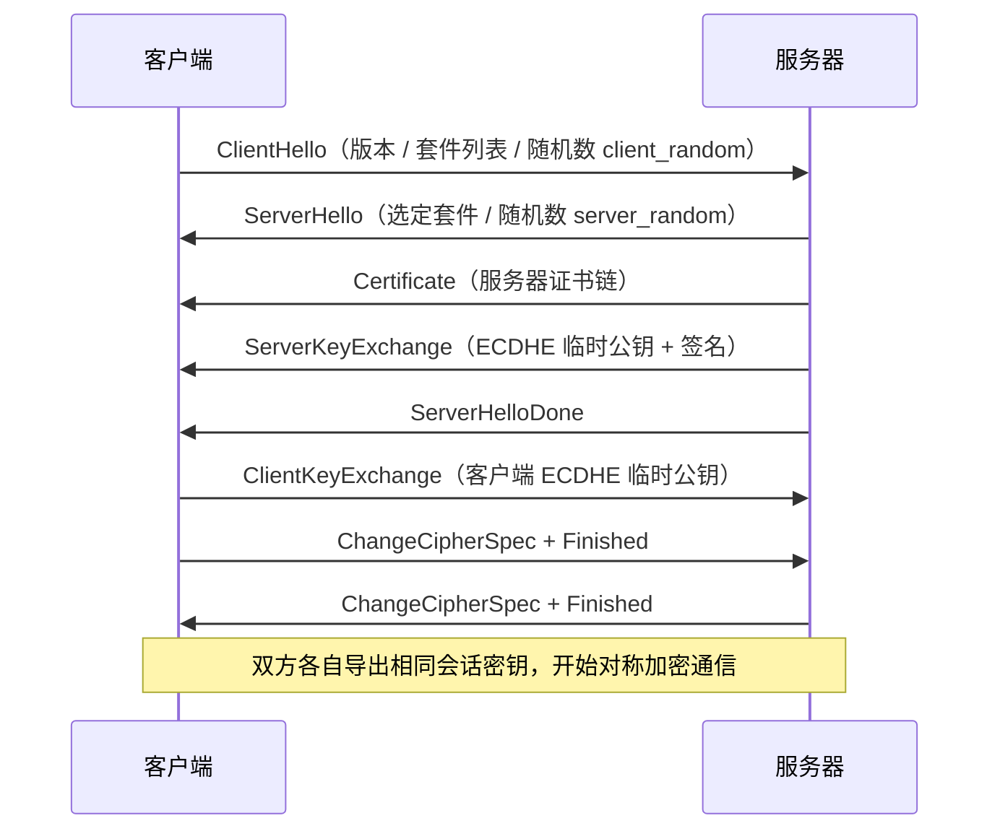
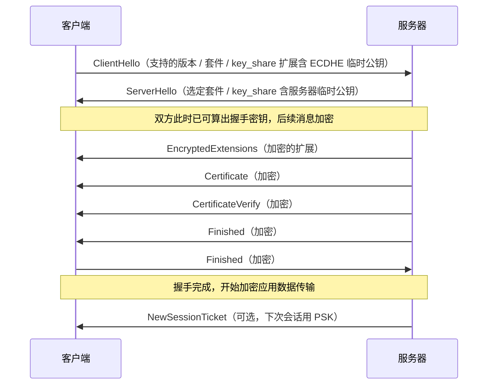
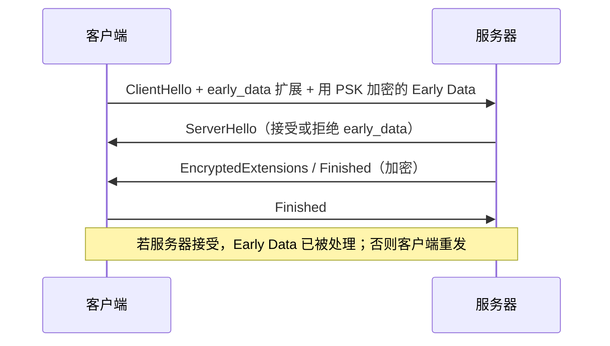
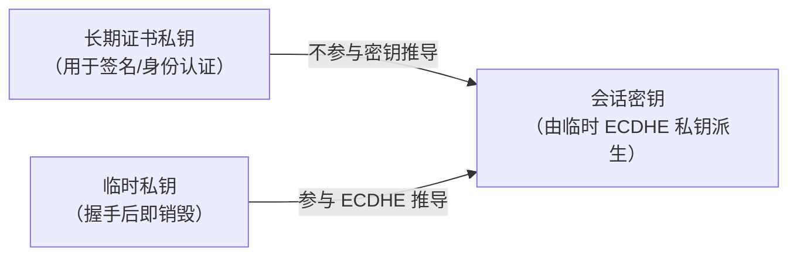
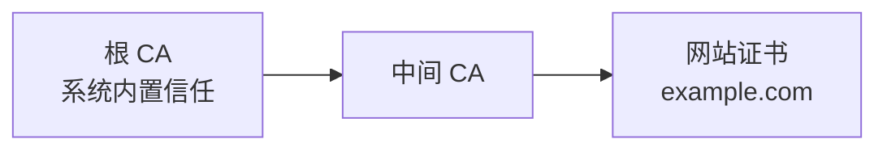
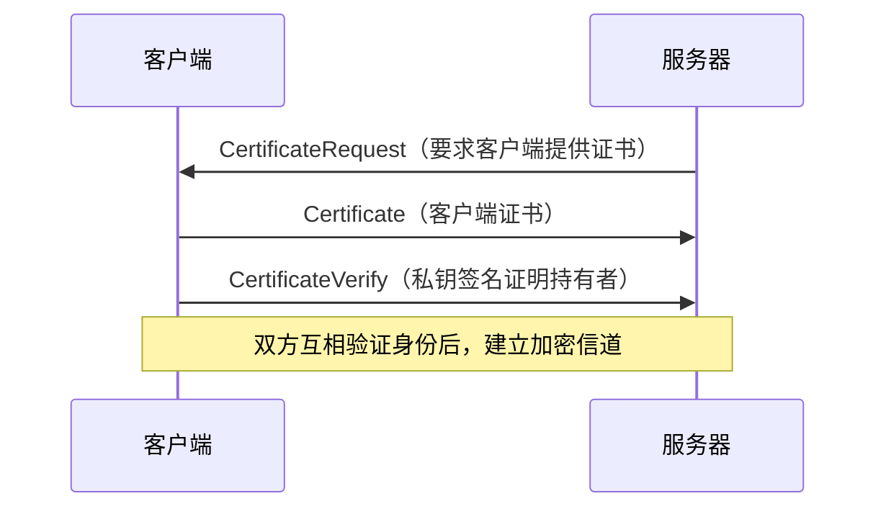

# 详解网络协议(十五)TLS协议

> [!abstract] 速览
> **TLS（Transport Layer Security，传输层安全）** 是 [[14.SSL协议|SSL]] 的继任者，在 [[13.TCP协议|TCP]] 之上、应用层之下加一层安全外壳，提供**机密性 + 完整性 + 身份认证**。[[18.HTTP-HTTPS协议|HTTPS]] 就是 "HTTP over TLS"。当前主流 **TLS 1.2 / 1.3**（1.3 见 RFC 8446）。
> 核心思想：**用非对称加密协商出对称密钥，再用对称加密高速传输**（混合加密）。

## 1. TLS 提供什么

| 安全目标 | 实现 |
| --- | --- |
| 机密性 | 握手协商对称密钥，之后用 AES / ChaCha20 加密 |
| 身份认证 | X.509 证书 + CA 信任链验证服务器身份 |
| 完整性 | AEAD / MAC 防篡改 |

位置：**应用数据 → TLS 加密 → TCP → IP**，对应用近乎透明（HTTP 几乎不用改）。

> [!note] 口诀
> **"三保一透"**：保密、保真、保身份，对上层应用透明。TLS 不保证匿名——IP 地址与 SNI 中的域名在标准配置下仍可见。

## 2. 版本

| 版本 | 规范 | 状态 |
| --- | --- | --- |
| TLS 1.0 / 1.1 | RFC 2246 / 4346 | 已弃用（RFC 8996，2021 年正式废止） |
| TLS 1.2 | RFC 5246 | 广泛使用，仍是过渡期主流 |
| TLS 1.3 | RFC 8446 | 最新、最快、最安全；2018 年发布 |

> SSL 2.0/3.0 已被证明存在协议级漏洞（POODLE 等），现代部署不应支持。

---

## 3. TLS 记录协议与子协议

TLS 分为两层：**记录协议（Record Protocol）** 是底层传输骨架，上层四个子协议复用它：

### 3.1 记录协议结构

每条 TLS Record 由 5 字节头部 + 载荷组成：

| 字段 | 长度 | 说明 |
| --- | --- | --- |
| Content Type | 1 字节 | 子协议类型（见下表） |
| Version | 2 字节 | 协议版本（TLS 1.2 为 `0x0303`；TLS 1.3 外层仍写 `0x0303` 以兼容中间件） |
| Length | 2 字节 | 载荷长度，最大 2¹⁴ = 16 384 字节 |
| Payload | 变长 | 明文或密文 |

四种 Content Type：

| 值 | 子协议 | 作用 |
| --- | --- | --- |
| 20 | ChangeCipherSpec | 通知对方切换到协商好的加密规范 |
| 21 | Alert | 警告（warning）或致命错误（fatal），收到 fatal 必须关闭连接 |
| 22 | Handshake | 握手消息（ClientHello、ServerHello 等） |
| 23 | ApplicationData | 加密后的业务数据 |

### 3.2 分片与 AEAD 保护

1. **分片**：上层数据被切成不超过 2¹⁴ 字节的 fragment，每片单独封装为一条 Record。
2. **AEAD 加密**：TLS 1.2 可选 AEAD（如 AES-GCM）；TLS 1.3 **强制 AEAD**，记录携带 `nonce` + 密文 + 16 字节 Auth Tag，同时对 Content Type 也加密（外层 type 统一为 23）。
3. **完整性**：Auth Tag 由 AEAD 算法计算，覆盖密文 + 关联数据（头部），任何篡改都会导致解密失败。

> [!warning]
> AEAD **严格禁止**用相同 key+nonce 加密不同明文，否则加密体系直接被攻破。TLS 通过序列号递增来保证 nonce 唯一。

### 3.3 TLS 1.3 的简化

TLS 1.3 中，ServerHello 之后所有握手消息已加密（包裹在 ApplicationData 记录内）；ChangeCipherSpec 消息被保留仅用于兼容中间件，本身无实际密码意义。

---

## 4. TLS 1.2 握手（约 2-RTT）



**流程要点**：① 协商加密套件 → ② 客户端验证服务器证书（信任链 + 域名 + 有效期）→ ③ 用 ECDHE 交换密钥材料 → ④ 双方各自算出**相同的会话密钥** → ⑤ 之后全程对称加密。注意：**私钥从不在网络上传输**。

### 4.1 每一步细节深挖

**① ClientHello / ServerHello 随机数的作用**

- `client_random`（32 字节）和 `server_random`（32 字节）各自独立生成，**防重放攻击**的关键：即便使用相同 PSK，每次握手的随机数不同，派生的会话密钥也不同，历史录制的握手记录无法被重用。
- 两个随机数一起参与后续的 PRF 密钥派生，消除对单一随机源的信任依赖（"两个不可靠的随机数合在一起比一个可靠"）。

**② 证书验证四要素**

客户端收到服务器证书链后，须验证：

| 要素 | 内容 |
| --- | --- |
| 签名链可信 | 从叶证书逐级验签，直到系统/浏览器内置的根 CA |
| 域名匹配 | SAN（Subject Alternative Name）中必须包含所请求的域名或通配符 |
| 有效期 | `notBefore ≤ 当前时间 ≤ notAfter` |
| 未被吊销 | 查 CRL 或 OCSP（详见第 6 节） |

**③ ECDHE：不传私钥如何算出共享密钥**

ECDHE（Elliptic Curve Diffie-Hellman Ephemeral）利用椭圆曲线上乘法的"单向性"：

1. 双方事先约定同一条椭圆曲线和基点 G（公开参数，如 curve25519、P-256）；
2. 服务器随机生成临时私钥 `d_s`，计算临时公钥 `Q_s = d_s · G`，在 `ServerKeyExchange` 中发出（并用证书私钥签名防中间人篡改）；
3. 客户端随机生成临时私钥 `d_c`，计算临时公钥 `Q_c = d_c · G`，在 `ClientKeyExchange` 中发出；
4. 双方分别计算：`d_c · Q_s = d_c · d_s · G = d_s · Q_c`——**两边结果相同，即 pre-master secret**；
5. 任何第三方只能看到 `Q_s`、`Q_c`，从椭圆曲线离散对数问题的难度上，无法反推出私钥，也无法还原共享密钥。

> [!tip] 口诀
> **"交换公钥、各乘私钥、结果相同"**——交换律让两端各自算出同一个点，而不需要把秘密数字通过网络传输。

**④ Master Secret 与会话密钥派生（PRF）**

```
pre_master_secret  (ECDHE 算出的 x 坐标)
       ↓ PRF("master secret", client_random + server_random)
master_secret  (48 字节，固定)
       ↓ PRF("key expansion", server_random + client_random)
key_block → client_write_key / server_write_key / client_IV / server_IV / MAC keys
```

PRF（Pseudo-Random Function）基于 HMAC-SHA256（TLS 1.2 默认），把"不可靠的随机数 + 不可靠的 pre-master secret"混合成高熵的 master secret，再扩展出双向不同的会话密钥。

**⑤ Finished 消息：握手完整性校验**

`Finished` 是握手中**第一条加密消息**，内容是对**迄今所有握手消息**（从 ClientHello 到 ChangeCipherSpec 之前）的 PRF 摘要，双方各自计算后互相验证。这一步保证握手未被篡改——哪怕中间人修改了套件协商，Finished 校验立即失败。

---

## 5. TLS 1.3 握手（1-RTT，0-RTT）

### 5.1 1-RTT 握手：ClientHello 即带 key_share



**与 TLS 1.2 的关键差异**：

| 维度 | TLS 1.2 | TLS 1.3 |
| --- | --- | --- |
| RTT | 2-RTT | 1-RTT（首次），0-RTT（会话恢复） |
| key_share | 分两步（ServerKeyExchange + ClientKeyExchange） | ClientHello 就带上，一步完成 |
| 握手加密 | 仅 Finished 加密 | ServerHello 之后全部加密（含证书） |
| 密钥派生 | PRF | HKDF（更强、分层派生） |
| 密钥交换算法 | RSA / DHE / ECDHE 均支持 | **只保留 (EC)DHE**，删除 RSA 密钥交换 |

### 5.2 0-RTT / Early Data

当客户端持有上次握手服务器下发的 PSK（通过 `NewSessionTicket`），可在 **ClientHello 中同时携带应用数据**（Early Data），实现真正的 0 次往返：



**0-RTT 的重放攻击风险（RFC 8446 §E.1.3 明确警告）**：

- Early Data 仅由 PSK 派生密钥加密，**不依赖 ServerHello 的新随机数**，攻击者可截获并**多次重放**相同的 0-RTT 数据包。
- 服务器无法区分"合法的第二次请求"与"攻击者重放的第一次请求"。

**防御建议**：

1. 0-RTT 只用于**幂等操作**（HTTP GET），拒绝用于支付、转账等有副作用的接口；
2. 服务器维护近期接收过的 `ClientHello` 哈希，拒绝重复；
3. 设置时间窗口（`obfuscated_ticket_age`），超窗丢弃。

> [!warning]
> RFC 8446 原话："0-RTT 数据的安全属性弱于其他 TLS 数据"。生产环境应**谨慎开启**，非幂等 API 坚决禁用。

---

## 6. 加密套件：1.2 vs 1.3

### 6.1 TLS 1.2 套件（以 `ECDHE-RSA-AES128-GCM-SHA256` 为例）

| 段 | 含义 |
| --- | --- |
| ECDHE | 密钥交换（临时椭圆曲线 DH，带前向保密） |
| RSA | 身份认证（证书签名算法） |
| AES128-GCM | 对称加密（AEAD 模式） |
| SHA256 | 哈希（完整性 / 密钥派生） |

### 6.2 TLS 1.3 套件：只剩 AEAD + 哈希

TLS 1.3 把密钥交换和身份认证**移出套件名称**，改由握手扩展（`supported_groups`、`signature_algorithms`）独立协商。套件只描述**对称加密（AEAD）和哈希算法**：

| 套件名称 | AEAD 算法 | 哈希 |
| --- | --- | --- |
| `TLS_AES_128_GCM_SHA256` | AES-128-GCM | SHA-256 |
| `TLS_AES_256_GCM_SHA384` | AES-256-GCM | SHA-384 |
| `TLS_CHACHA20_POLY1305_SHA256` | ChaCha20-Poly1305 | SHA-256 |

TLS 1.3 同时**砍掉**：RC4、3DES、MD5、SHA-1、CBC 模式、所有 export 级弱算法、RSA 密钥交换、静态 DH。

> [!tip] 口诀
> **"1.3 套件只关心怎么加密，不关心怎么换密钥、谁来签名"**——密钥交换和认证各有独立扩展负责。

---

## 7. 密钥交换与前向保密

### 7.1 RSA 密钥交换（无 PFS，TLS 1.3 已删除）

在 TLS 1.2 的 RSA 密钥交换模式下：
1. 客户端随机生成 pre-master secret；
2. 用服务器**证书公钥**加密后发送；
3. 服务器用**证书私钥**解密还原 pre-master secret。

**致命缺陷**：如果攻击者事先录制了所有历史流量，日后一旦拿到服务器私钥，就能解密**所有历史会话**——没有前向保密（No PFS）。

### 7.2 (EC)DHE：前向保密的实现

(EC)DHE 中每次握手都生成**临时密钥对**，握手完成即销毁：
- 会话密钥由临时私钥推导，**不依赖**长期证书私钥；
- 即使未来证书私钥泄露，攻击者也无法还原历史会话密钥；
- 这就是**前向保密（Forward Secrecy / Perfect Forward Secrecy, PFS）**。



### 7.3 TLS 1.3 为何删除 RSA 密钥交换

1. RSA 密钥交换无前向保密，与"强制 PFS"的设计目标冲突；
2. 依赖长期私钥直接参与密钥协商，私钥泄露后历史流量全灭；
3. TLS 1.3 通过**强制 (EC)DHE**，从协议层面杜绝无 PFS 的配置可能。

> [!note] 辨析
> **RSA 证书签名 ≠ RSA 密钥交换**。即使部署了 RSA 证书，TLS 1.3 也只用 RSA 做身份认证（对 ServerKeyExchange 的签名），密钥协商仍走 (EC)DHE。两者独立，不要混淆。

用**临时密钥**（ECDHE）协商会话密钥，即使将来服务器私钥泄露，**也无法解密此前抓取的流量**——每次会话的密钥都"用完即弃"。

---

## 8. 证书与 PKI

### 8.1 X.509 证书主要字段

| 字段 | 说明 |
| --- | --- |
| Version | v3（当前标准） |
| Serial Number | CA 分配的唯一序号，吊销时按此标识 |
| Issuer | 签发者的 DN（Distinguished Name） |
| Validity | `notBefore` / `notAfter`，行业惯例域名证书 ≤ 398 天 |
| Subject | 持有者 DN |
| Subject Public Key Info | 公钥算法 + 公钥内容 |
| SAN | Subject Alternative Name，列出所有受保护域名（取代老式 CN 匹配） |
| Key Usage / EKU | 密钥用途（数字签名、密钥加密）/ 扩展用途（TLS 服务端认证） |
| Authority Key Identifier | 上级 CA 的密钥标识，用于快速定位签发者 |
| OCSP / CRL 分发点 | 吊销信息查询地址 |
| CT SCT | Certificate Transparency 签名时间戳列表 |
| CA 签名 | 上级 CA 用私钥对上述所有字段的哈希签名 |

### 8.2 信任链：根 CA / 中间 CA / 叶证书

浏览器/系统内置一批**根 CA**；网站证书由中间 CA 签发，验证时层层上溯到可信根：



验证内容：**签名链可信 + 域名匹配 + 在有效期内 + 未被吊销**。

- **根 CA**：自签名，安装在操作系统或浏览器信任库，数量有限（约百余个）；
- **中间 CA**：根 CA 签发，用于实际签发叶证书；隔离根 CA 私钥，减少风险；
- **自签名证书**：Issuer = Subject，无法被公共信任链认可，浏览器强制告警；适用于内网、开发测试。

### 8.3 Let's Encrypt 与 ACME 自动签发

Let's Encrypt 是全球最大的免费公共 CA，基于 **ACME（Automatic Certificate Management Environment）** 协议（RFC 8555）自动完成"域名所有权验证 → 签发 → 续期"的全流程：

1. 客户端（如 Certbot）向 ACME 服务器注册账号；
2. 服务器下发 **Challenge**（如在 `/.well-known/acme-challenge/` 放置特定文件，或修改 DNS TXT 记录）；
3. Let's Encrypt 服务器访问域名验证；
4. 验证通过后签发证书，有效期 90 天；
5. 客户端定期（建议到期前 30 天）自动续期，**无需人工干预**。

### 8.4 证书吊销机制

| 机制 | 工作方式 | 优点 | 缺点 |
| --- | --- | --- | --- |
| CRL | CA 定期发布已吊销序号列表，客户端下载检查 | 离线可用 | 更新有延迟；列表体积大 |
| OCSP | 客户端实时查询 CA 的 OCSP 服务器 | 响应及时，体积小 | 额外网络延迟；暴露访问记录（隐私问题）；软失败（Soft-Fail）有漏洞 |
| OCSP Stapling | 服务器预取 OCSP 响应，在 TLS 握手时"装订"发给客户端 | 消除客户端额外请求；保护隐私；CA 签名不可伪造 | 需服务器实现 |
| CRLite | 浏览器本地维护布隆过滤器，覆盖全量吊销证书 | 零网络开销；覆盖全量 | 需定期增量更新 |

> **OCSP 软失败漏洞**：若攻击者阻断客户端访问 OCSP 服务器，大多数浏览器默认"查不到就当未吊销"，导致已泄露的证书仍被信任。OCSP Stapling 是主要缓解手段。

> **Let's Encrypt 动向**：2025 年 8 月起，Let's Encrypt 关闭其 OCSP 服务器，改为仅通过 CRL 提供吊销信息。

### 8.5 证书透明度（Certificate Transparency, CT）

CT 是防止 CA 误签的审计机制（RFC 6962）：

- 所有公开信任的 CA 签发证书时，必须将证书提交到**公开可审计的 CT 日志**（Append-Only Log）；
- CA 将日志服务器返回的 **SCT（Signed Certificate Timestamp）** 嵌入证书；
- 浏览器在握手时验证 SCT，若证书未登记到 CT 日志，Chrome 等浏览器会拒绝信任；
- 域名所有者可监控 CT 日志，发现未授权签发的证书（如 CA 被入侵或误操作）。

### 8.6 SNI 与 ECH

**SNI（Server Name Indication）**：TLS 握手开始时，ClientHello 的扩展字段携带目标域名，服务器据此选择对应证书（支持一台服务器、一个 IP 上部署多个 HTTPS 域名）。

**问题**：SNI 字段在 TLS 1.2/1.3 标准配置下**明文传输**，网络中间节点（ISP、防火墙）可直接读取用户访问的域名。

**ECH（Encrypted Client Hello）**：TLS 1.3 生态的隐私扩展，将整个 ClientHello（包含 SNI）用服务器预先发布的公钥加密后传输，仅服务器能解密。中间人只看到外层的"空壳 ClientHello"，无法得知真实域名。

---

## 9. 会话恢复

完整握手代价较高（2-RTT，加密运算）。TLS 提供三种会话恢复机制跳过重复协商：

### 9.1 Session ID（TLS 1.2，有状态）

服务器在 ServerHello 中下发一个随机 Session ID，同时在服务端内存中缓存对应的会话状态（master secret + 套件等）。客户端下次连接时在 ClientHello 携带该 ID，服务器找到缓存后直接复用，跳过密钥交换，握手压缩到 1-RTT。

**缺点**：服务器必须存储状态；多机集群中需共享内存（Redis 等），扩展性差。

### 9.2 Session Ticket（TLS 1.2，无状态）

服务器用自持的 **Ticket Key** 对会话状态加密，生成 Session Ticket 发给客户端存储。客户端下次连接时在 ClientHello 携带 Ticket，服务器解密还原会话状态，无需本地存储。

**优点**：服务端无状态，天然适合集群。  
**缺点**：Ticket Key 是长期密钥，**泄露则历史 Ticket 对应的会话全暴露**（破坏前向保密）；须定期轮换。

### 9.3 TLS 1.3：PSK（预共享密钥）

TLS 1.3 废弃 Session ID 和 Session Ticket，统一使用 **PSK** 机制：

1. 首次握手完成后，服务器发送 `NewSessionTicket` 消息，内含 PSK（由会话密钥派生，携带 `ticket_nonce` 保证唯一）；
2. 客户端下次连接，在 ClientHello 的 `pre_shared_key` 扩展中携带 PSK；
3. 双方基于 PSK 快速建立连接（1-RTT），或开启 Early Data（0-RTT）。

| 特性 | Session ID | Session Ticket | TLS 1.3 PSK |
| --- | --- | --- | --- |
| 服务端状态 | 有状态 | 无状态 | 无状态 |
| 多机集群 | 需共享存储 | 共享 Ticket Key 即可 | 共享 Ticket Key 即可 |
| 前向保密 | 有限 | 需定期轮换 | 需定期轮换 |
| 0-RTT 支持 | 不支持 | 不支持 | 支持（含重放攻击风险） |

---

## 10. 其他安全机制

### 10.1 HSTS（HTTP Strict Transport Security）

服务器在 HTTPS 响应头中返回：`Strict-Transport-Security: max-age=31536000; includeSubDomains`

- 浏览器在 `max-age` 期内**强制所有对该域名的请求走 HTTPS**，即使用户输入 `http://`；
- 防止**SSL 剥离攻击**（攻击者把 HTTPS 降级为 HTTP）；
- `preload` 参数可将域名提交到浏览器内置 HSTS 预加载列表，首次访问即 HTTPS。

### 10.2 降级攻击防护

早期 TLS 实现允许协商更低版本，攻击者可中间人干预强制降到存在漏洞的版本（如 SSLv3）。防御手段：

- TLS 1.3 中 ClientHello.random 的末 8 字节若协商结果为 1.2，会填入特殊值，服务器检测到可拒绝假冒的降级；
- 服务器配置最低版本（如不允许 TLS 1.0/1.1）。

### 10.3 双向认证 mTLS

标准 TLS 只有服务端出示证书；**mTLS（Mutual TLS）** 要求客户端也出示 X.509 证书，服务端验证客户端身份。常见场景：微服务间通信、API 网关、零信任架构、设备认证（IoT）。



### 10.4 HPKP（HTTP Public Key Pinning，已废弃）

HPKP 允许网站在响应头中声明"只信任这几个公钥"，防止 CA 误签。但因配置错误可致**网站自毁**（所有用户被锁门外），Chrome 已于 2018 年移除支持，现代替代方案为 CT 日志监控。

---

## 11. 常见误区与面试要点

> [!warning] 易错点
> - **HTTPS 不隐藏你访问的域名**：证书、SNI 仍可见（需 ECH / Encrypted Client Hello 才隐藏）。
> - **证书验证的是"身份"不是"善恶"**：钓鱼站也能申请到合法证书，绿锁 ≠ 网站可信。
> - **自签名证书**不被公共信任链认可，浏览器会告警。
> - **HTTPS 不隐藏 IP 地址与端口**：IP 和端口在 TCP 层明文传输，TLS 只加密应用层载荷，流量分析仍可推断访问行为。
> - **RSA 证书签名 ≠ RSA 密钥交换**：部署 RSA 证书的服务器在 TLS 1.3 下仍用 (EC)DHE 做密钥交换，RSA 私钥只用于证书签名验证身份；两者完全独立。
> - **绿锁不代表连接安全到终点**：TLS 只保护"你"和"目标服务器"之间的通道，若目标服务器被攻击或转发到第三方，TLS 对此无能为力。
> - **0-RTT ≠ 完全安全**：Early Data 无防重放保证，生产环境应限制使用场景。
> - **Session Ticket 并非等价于 PFS**：Ticket Key 如果不定期轮换，握手历史可被追溯解密。

---

## 延伸阅读

- 前身：[[14.SSL协议]]
- 应用：[[18.HTTP-HTTPS协议]]（HTTPS = HTTP + TLS）
- 承载层：[[13.TCP协议]]　加密基础：[[08.表示层]]

> ⬅️ [[14.SSL协议]] ｜ 🏠 [[00.网络协议详解总览]] ｜ [[16.UDP协议]] ➡️
