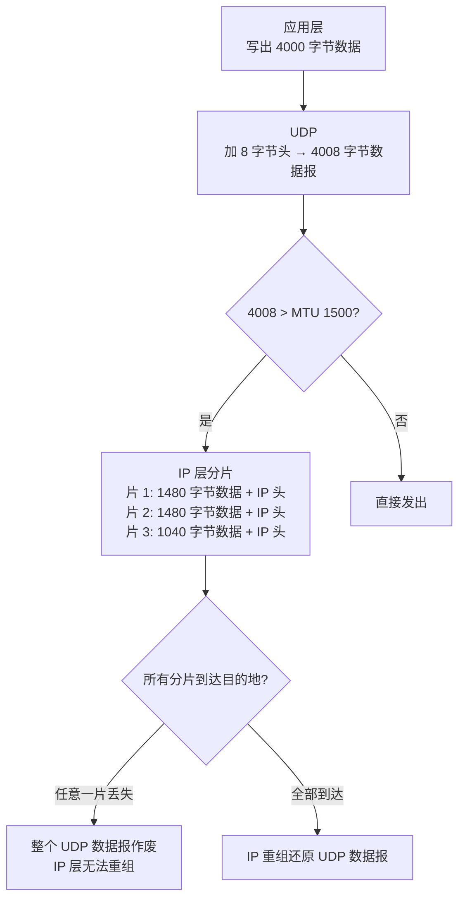
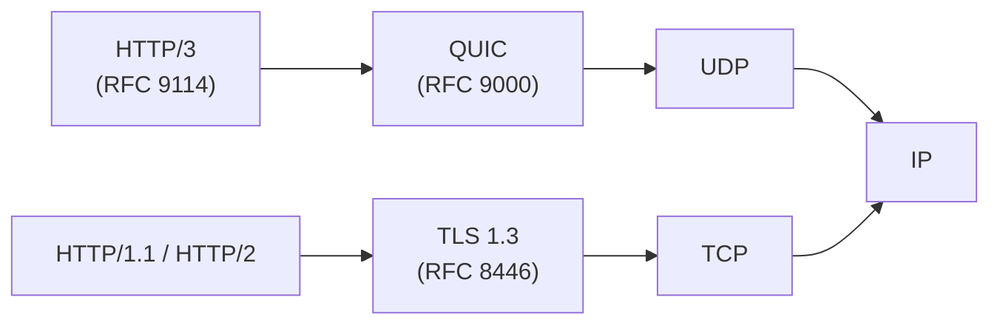
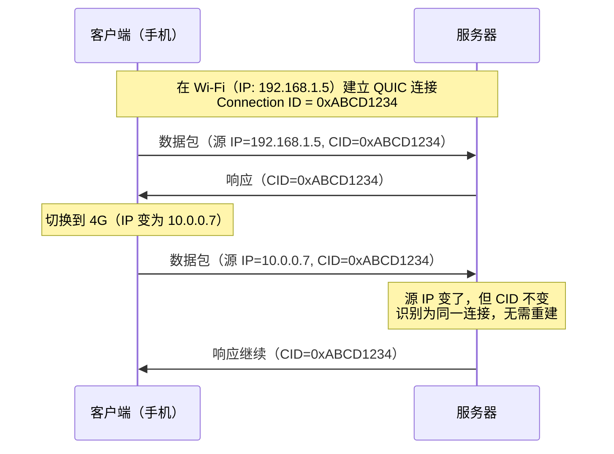
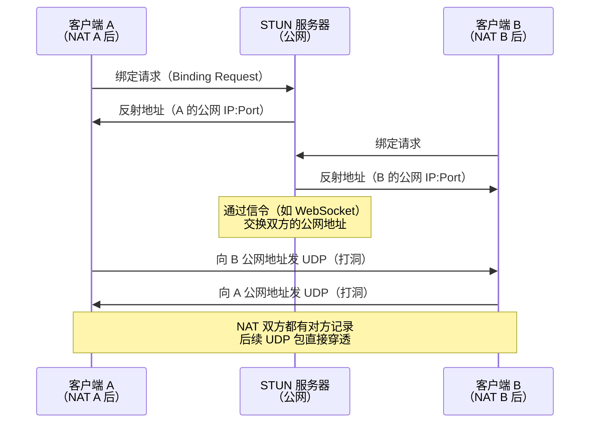
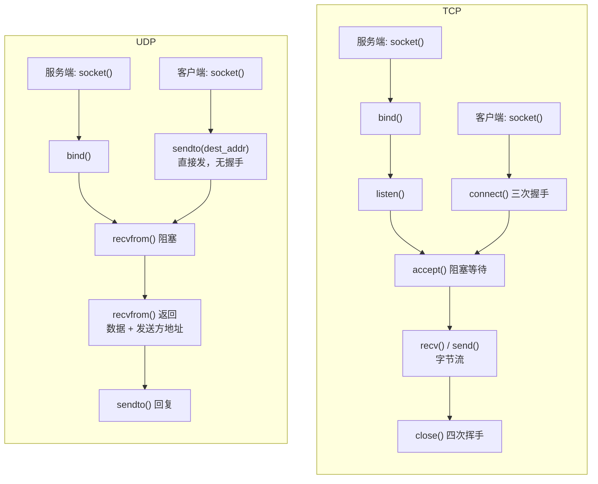
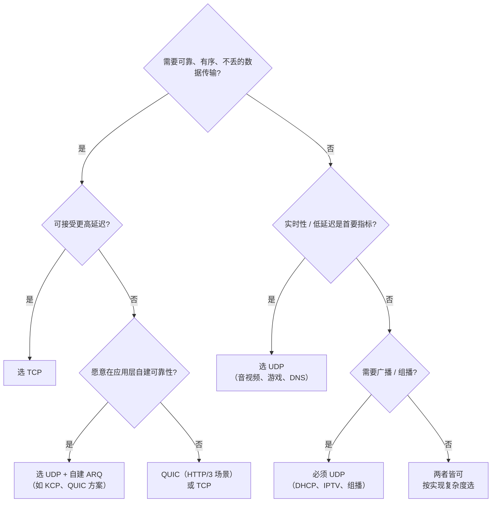

# 详解网络协议(十六)UDP协议

> [!abstract] 速览
> **UDP（User Datagram Protocol，用户数据报协议）** 是 [[06.传输层|传输层]]的无连接协议（RFC 768），只有 **8 字节**头部，**不保证可靠**——不握手、不确认、不重传、不排序、不流控，换来**极低时延与开销**。它是个"瘦"协议，把"要不要可靠"交给应用自己定。对照 [[13.TCP协议|TCP]]。
> PDU：**数据报（Datagram）**。
>
> 一句话口诀：**UDP 是个"传话筒"——把消息递出去就走，送没送到不管；但快，且有消息边界不粘包。**

## 1. 核心特点

- **无连接**：发了就走，不建连不拆连。
- **不可靠**：可能丢、可能乱、可能重，UDP 一概不管。
- **低开销**：8 字节头 vs TCP 的 20~60 字节。
- **支持单播 / 广播 / 组播**（见 [[17.广播与组播]]）。
- **有消息边界**：每次 `sendto` 发出的数据报在接收端是独立的一条消息，不存在 [[13.TCP协议|TCP]] 字节流那样的"粘包"问题。

## 2. UDP 头部（仅 8 字节）

| 字段 | 长度 | 详解 |
| --- | --- | --- |
| 源端口 | 16 bit | 发送方端口；若不需要对方回复（如单向日志推送），可填 **0** |
| 目的端口 | 16 bit | 接收方端口；与目的 IP 定位上层服务 |
| 长度 | 16 bit | **头部 8 字节 + 数据字节数**之和，最小值 8（纯头无数据） |
| 校验和 | 16 bit | 检错；计算时覆盖 **IP 伪首部 + UDP 头 + 数据**；IPv4 可选，**IPv6 必填** |

```
 0      7 8     15 16    23 24    31
+--------+--------+--------+--------+
|   源端口 (16)    |  目的端口 (16)  |
+--------+--------+--------+--------+
|   UDP 长度 (16)  |  校验和 (16)   |
+--------+--------+--------+--------+
|           数据 (可变)              |
+------------------------------------+
```

> [!tip] 口诀
> "源目长校"——源端口、目的端口、长度、校验和，刚好 4 个 16-bit 字段，共 8 字节。

### 2.1 伪首部与校验和计算

UDP 校验和并不仅仅保护 8 字节头部，而是覆盖一个**虚构的"伪首部（Pseudo Header）"**——它从 IP 层借来关键信息，用来防止数据报被错误投递（如地址字段损坏却通过了 IP 校验）。

**IPv4 伪首部（12 字节）：**

```
+--------+--------+--------+--------+
|       源 IP 地址 (32 bit)          |
+--------+--------+--------+--------+
|      目的 IP 地址 (32 bit)         |
+--------+--------+--------+--------+
|  全零  |  协议=17|  UDP 长度 (16)  |
+--------+--------+--------+--------+
```

**IPv6 伪首部（40 字节）：** 包含 128-bit 源/目的 IPv6 地址、UDP 长度（32-bit）、下一头部（Next Header = 17）。

**计算步骤（RFC 1071 方法）：**
1. 将伪首部 + UDP 头 + 数据（不足 16-bit 末尾补零）按 **16-bit 字**累加。
2. 进位折叠（carry wrap-around）。
3. 对结果取**反码（one's complement）**，写入校验和字段。
4. 若计算结果恰好为全零，IPv4 **写 0x0000 表示"不校验"**；接收方若收到 0x0000 视为跳过校验。IPv6 下若计算结果为零则写 **0xFFFF**（全一），因为 IPv6 强制校验，0x0000 保留为"零校验和模式"需 RFC 6936 特殊授权。

> [!note] 校验和特殊值
> - UDP（IPv4）校验和 = **0x0000**：发送方选择不校验，接收方不检查。
> - UDP（IPv6）校验和 **必须非零**（正常计算为零时写 0xFFFF）。
> - 校验和是**检错**而非纠错，且不防篡改（完整性保护需 DTLS/QUIC 的加密层）。

## 3. TCP vs UDP

| 维度 | [[13.TCP协议\|TCP]] | UDP |
| --- | --- | --- |
| 连接 | 面向连接（三次握手） | 无连接 |
| 可靠性 | 可靠、按序 | 不保证 |
| 头部 | 20~60 字节 | **8 字节** |
| 消息边界 | **无**（字节流，需应用划界） | **有**（数据报有边界） |
| 粘包问题 | 存在 | **不存在** |
| 流控 / 拥塞控制 | 有 | 无（应用自律） |
| 时延 | 较高（握手 + 确认 + 重传） | **低** |
| 广播 / 组播 | 不支持 | **支持** |
| 场景 | 网页、文件、邮件、SSH | DNS、音视频、游戏、直播、QUIC |

## 4. UDP 与 IP 分片

UDP 自身**不分段**——它把数据报交给 IP 层就完事了。若数据报超过链路 MTU（以太网通常 1500 字节），**由 IP 层负责分片（Fragmentation）**（见 [[11.IP协议]]）。



**关键推论：**

| 情形 | 风险 |
| --- | --- |
| UDP 数据报 > MTU | IP 分片，**任一分片丢失 → 整报作废**，丢包率随分片数**倍增** |
| UDP 数据报 ≤ MTU - 28（IPv4）| 单片传输，最优 |
| 路径 MTU 未知 | 可能遭遇中间路由器的更小 MTU，触发分片或 DF 置位后被丢弃 |

> [!warning] 实践准则
> 应用层应将 UDP 净载荷控制在 **MTU - 28 字节**以内（IPv4：1500 - 20 - 8 = **1472 字节**；IPv6：1500 - 40 - 8 = **1452 字节**），避免 IP 分片，从而降低丢包率。DNS、游戏协议等均遵循此原则。

## 5. 典型应用

| 场景 | 协议示例 | 为何选 UDP |
| --- | --- | --- |
| DNS 查询 | DNS（53/UDP） | 一问一答、单包搞定，省去 TCP 握手；响应 > 512 字节才回退 TCP |
| 实时音视频 / 会议 | RTP over UDP、WebRTC | 宁可丢帧也不卡顿，重传反而添乱；FEC 在应用层补偿 |
| 在线游戏 | KCP、RUDP | 低时延优先；丢一帧可外插值，不能等重传 |
| 直播 / IPTV | RTP、RTMP over UDP | 配合组播高效分发（见 [[17.广播与组播]]） |
| NTP / DHCP / SNMP | NTP（123）、DHCP（67/68）、SNMP（161） | 轻量查询、广播发现、无需维护连接状态 |
| 现代 HTTP | QUIC / HTTP/3 | 内置可靠+加密，彻底绕开 TCP 队头阻塞 |
| 隧道 / VPN | WireGuard、VXLAN | UDP 封装上层协议，穿透 NAT，利用自身加密层 |

## 6. UDP 之上构建的可靠/实时协议

UDP 的"不管"正是其价值所在：它给上层留下了**完全的控制权**，让各类应用协议可以按需定制可靠性、顺序、加密和拥塞控制。

### 6.1 QUIC（RFC 9000）——HTTP/3 的底座

QUIC 是目前最重要的"UDP 上层可靠协议"，完全重新设计了传输层。



**QUIC 核心特性对照：**

| 特性 | TCP + TLS | QUIC |
| --- | --- | --- |
| 建连延迟 | TCP 握手（1 RTT）+ TLS 握手（1 RTT）= **2 RTT** | 首次 **1 RTT**，再次连接 **0 RTT** |
| 加密 | TLS 叠加在 TCP 上，连接元数据可见 | TLS 1.3 **内嵌**，几乎所有字段加密（RFC 9001） |
| 多路复用 | HTTP/2 多流共一 TCP 连接，**TCP 队头阻塞**（一个包丢失卡所有流） | 独立流（Stream），**流内有序、流间无阻塞** |
| 连接迁移 | 依赖四元组（IP+端口），网络切换即断连 | **Connection ID** 标识连接，切换 Wi-Fi/4G **无感迁移** |
| 拥塞控制 | 内核实现（CUBIC/BBR） | 用户态实现，**可热升级、可定制** |
| 头部阻塞 | 存在（TCP 层） | **解决** |

**QUIC 连接迁移（Connection Migration）原理：**



> [!tip] QUIC 要点口诀
> **"快安全不阻塞，换网不断连"**——0-RTT 快建连、内置 TLS 1.3 安全、流独立不阻塞、Connection ID 换网不掉线。

**0-RTT 注意事项：** 0-RTT 数据（Early Data）不具备**防重放（Replay）**保护，不应用于副作用操作（如支付、删除）。

### 6.2 DTLS（Datagram TLS）

DTLS（RFC 6347 / RFC 9147）是 TLS 在 UDP 上的变体，为 UDP 提供加密、身份认证与消息完整性，同时保留 UDP 的无连接特性。WebRTC 用 DTLS 协商密钥，再用 SRTP 传媒体。

### 6.3 RTP / RTCP——实时音视频

| 协议 | 作用 |
| --- | --- |
| **RTP**（Real-time Transport Protocol，RFC 3550） | 传媒体数据；头部含序列号、时间戳、SSRC，供接收方重排序、计算延迟、对齐播放 |
| **RTCP**（RTP Control Protocol） | 控制通道；发送 SR（Sender Report）/ RR（Receiver Report）反馈丢包率、抖动、往返延迟，供发送方调整码率 |

RTP 不负责可靠传输；丢包处理由应用层用**前向纠错（FEC）**或**插值**完成。

### 6.4 SCTP（Stream Control Transmission Protocol）

SCTP（RFC 4960）原生在 IP 上运行（协议号 132），也可封装在 UDP 内（UDP-encapsulated SCTP，RFC 6951），兼具：

- **消息边界**（像 UDP）
- **多流多宿（multi-stream / multi-homing）**
- **可靠传输 + 按序交付**（像 TCP）

WebRTC 的数据通道（DataChannel）底层使用 SCTP over DTLS over UDP。

### 6.5 KCP / RUDP——游戏加速

| 名称 | 特点 |
| --- | --- |
| **KCP** | 开源、纯算法库；ARQ（自动重传请求）+ 选择确认；可配置"以带宽换延迟"；大量游戏、代理软件使用 |
| **RUDP** | 泛指在 UDP 上自实现的可靠传输，各家实现有差异 |
| **ENet** | 游戏常用，提供可靠/不可靠/按序三种通道，延迟敏感场景首选 |

**协议对比总览：**

| 协议 | 可靠性 | 加密 | 多路复用 | 消息边界 | 典型场景 |
| --- | --- | --- | --- | --- | --- |
| 原生 UDP | 无 | 无 | 无 | 有 | DNS、NTP、简单查询 |
| QUIC | 有 | TLS 1.3 内置 | 有（流） | 有 | HTTP/3、通用传输 |
| DTLS | 无（保留 UDP 语义） | TLS over UDP | 无 | 有 | WebRTC 信令、IoT |
| RTP/RTCP | 无（FEC 补偿） | 配合 SRTP | 无 | 有 | 音视频、直播 |
| SCTP | 有 | 需叠加 DTLS | 有（流） | 有 | WebRTC DataChannel |
| KCP | 有（ARQ） | 无（需自加） | 无 | 有 | 游戏、低延迟代理 |

## 7. UDP 与 NAT 穿透

### 7.1 问题背景

绝大多数终端设备位于 NAT（网络地址转换）设备后，没有公网 IP。两台 NAT 后的设备若要直接通信（P2P），需要**打洞（Hole Punching）**。

UDP 天然比 TCP 更容易打洞：NAT 设备通常为 UDP 数据报维护一张映射表（源 IP:Port → 公网 IP:Port），只要双方能"同时"向对方发包，NAT 就会放行。

### 7.2 UDP 打洞（UDP Hole Punching）流程



### 7.3 STUN / TURN / ICE

| 协议 | 全称 | 作用 |
| --- | --- | --- |
| **STUN** | Session Traversal Utilities for NAT（RFC 8489） | 发现自身公网 IP:Port（反射地址），判断 NAT 类型 |
| **TURN** | Traversal Using Relays around NAT（RFC 8656） | 打洞失败时通过中继服务器转发数据（保底方案，带宽成本高） |
| **ICE** | Interactive Connectivity Establishment（RFC 8445） | 候选地址收集（本地、STUN 反射、TURN 中继）→ 优先级排序 → 连通性检测 → 选最优路径 |

WebRTC 的媒体通道完整依赖 **ICE + DTLS + SRTP** 完成 NAT 穿透与加密传输。

## 8. UDP 套接字编程模型

### 8.1 UDP 与 TCP 流程对比



### 8.2 关键系统调用

| 系统调用 | TCP | UDP |
| --- | --- | --- |
| `connect()` | 必须（触发握手） | **可选**（仅记录默认目标地址，不发包；之后可用 `send`/`recv`） |
| 发送数据 | `send(fd, buf, len, flags)` | `sendto(fd, buf, len, flags, addr, addrlen)` |
| 接收数据 | `recv(fd, buf, len, flags)` | `recvfrom(fd, buf, len, flags, &addr, &addrlen)` |
| 消息边界 | 无（应用自划） | 每次 `recvfrom` 对应一条完整数据报 |
| 缓冲区溢出行为 | 等待（流控） | **数据报被丢弃**（无重传） |

> [!tip] UDP `connect()` 的妙用
> 对 UDP socket 调用 `connect()` 后，内核记录了目标地址，可以直接用 `send`/`recv` 而不用每次 `sendto`/`recvfrom`；同时内核会过滤非来自该地址的数据报。常用于"固定通信对端"的场景（如 DNS 客户端），但本质上**没有建立连接**，不发任何包。

## 9. 何时该选 UDP

> [!question] 决策指南：UDP 还是 TCP？



**一句话口诀：**
- 要快不要可靠 → UDP
- 要可靠不在乎延迟 → TCP
- 又要快又要可靠 → UDP + 上层可靠协议（QUIC / KCP）

## 10. TCP vs UDP 全维度对照（增强版）

| 维度 | [[13.TCP协议\|TCP]] | UDP |
| --- | --- | --- |
| 连接 | 面向连接 | 无连接 |
| 可靠性 | 可靠、按序 | 不保证 |
| 头部 | 20~60 字节 | **8 字节** |
| 流控 / 拥塞控制 | 有 | 无 |
| 时延 | 较高 | **低** |
| 消息边界 | 无（字节流） | **有（数据报）** |
| 粘包 | 存在 | **不存在** |
| 广播 / 组播 | 不支持 | **支持** |
| 分片 | TCP 层分段（MSS） | IP 层分片（有丢失风险） |
| 错误恢复 | 内置重传 | 靠应用层 |
| 典型场景 | 网页、文件、邮件、SSH | DNS、音视频、游戏、QUIC |

## 11. 常见误区与面试要点

> [!warning] 常见误区
> - **UDP "不可靠" ≠ "没用"**：很多场景正是要它的快；可靠性可在应用层自建（QUIC、KCP 都是例子）。
> - **UDP 无拥塞控制，滥发可能挤垮网络**——大流量 UDP 应用需自律，否则会"欺负"TCP 连接（TCP 遇拥塞会退让，UDP 不会）。
> - **校验和**在 IPv4 下**可选**（填 0 表示跳过）、在 **IPv6 下必填**（零校验和需 RFC 6936 特殊授权）。
> - **UDP 有消息边界，不存在粘包**：`sendto` 一次发出的数据报在 `recvfrom` 侧是完整的一条；而 [[13.TCP协议|TCP]] 是字节流，应用需自行划界。
> - **IP 分片的隐患**：UDP 本身不分段，超 MTU 由 IP 层分片；任一分片丢失整个数据报作废，所以大 UDP 包比大 TCP 段（TCP 自行控制 MSS）更容易丢失。
> - **UDP "源端口 = 0" 是合法的**：单向推送（如 syslog 客户端不需要回包）可将源端口置 0，节省 NAT 映射资源。
> - **QUIC 跑在 UDP 上并不意味着 QUIC 不可靠**：QUIC 在 UDP 之上自行实现了序号、确认、重传、流控、拥塞控制，**可靠性高于普通 TCP+TLS**（额外具备 0-RTT、连接迁移等）。

**面试高频问题汇总：**

| 问题 | 要点答案 |
| --- | --- |
| UDP 为什么快？ | 无握手、无确认、无流控，最小 8 字节头，直接发 |
| UDP 有没有粘包？ | **没有**。每个数据报有独立边界，`recvfrom` 一次返回一条完整数据报 |
| UDP 校验和覆盖什么？ | 伪首部（IP 地址 + 协议号 + UDP 长度）+ UDP 头 + 数据 |
| 为什么 IPv6 要求必填校验和？ | IPv6 头部取消了头部校验和字段，数据传输的完整性完全依赖上层（UDP/TCP）校验和 |
| QUIC 为何用 UDP 而不是 TCP？ | 绕过操作系统内核对 TCP 的控制（无法修改 TCP 协议栈），UDP 可在用户态完全定制；还能绕过 TCP 的队头阻塞与固化的握手流程 |
| UDP 能实现可靠传输吗？ | 可以，在应用层加 ARQ（序号 + ACK + 重传），如 KCP、QUIC；代价是额外带宽和复杂度 |
| 什么情况会触发 IP 分片？ | UDP 数据报 > 路径 MTU 时 IP 分片；任一分片丢失整报作废，应将净载荷控制在 MTU-28 内 |

## 延伸阅读

- 对照：[[13.TCP协议]]　所属层：[[06.传输层]]
- IP 分片相关：[[11.IP协议]]
- 组播 / 广播：[[17.广播与组播]]
- QUIC 应用：[[18.HTTP-HTTPS协议]]

> ⬅️ [[15.TLS协议]] ｜ 🏠 [[00.网络协议详解总览]] ｜ [[17.广播与组播]] ➡️
