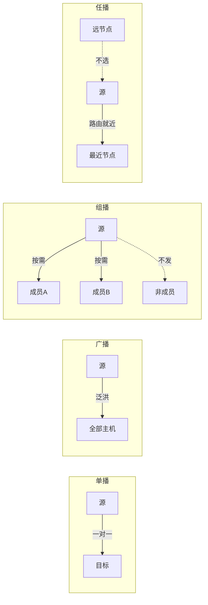
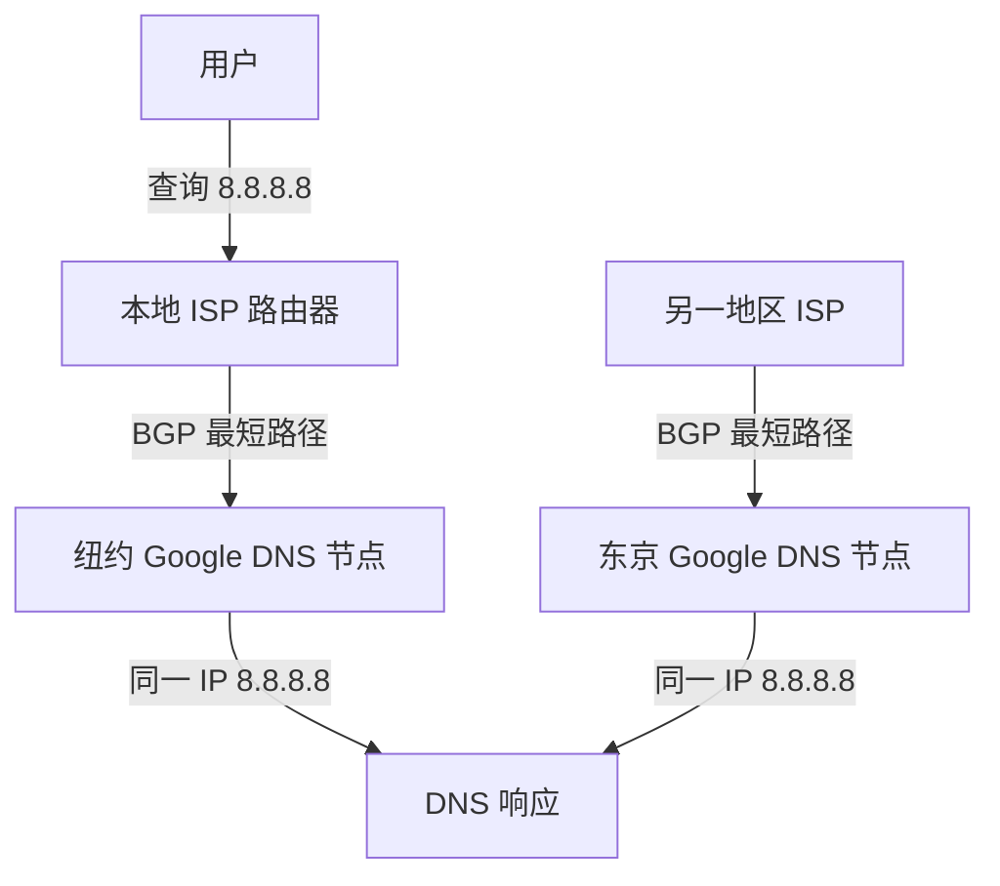
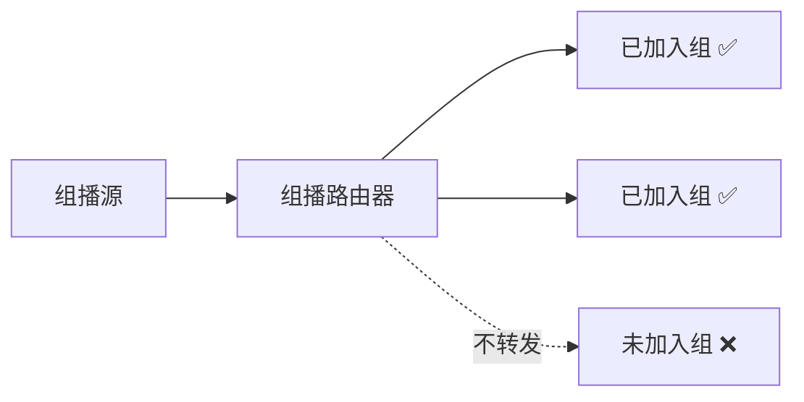
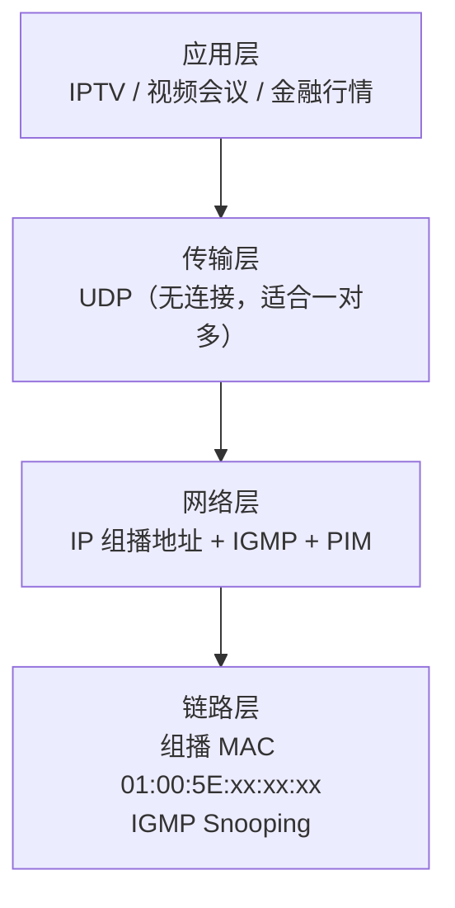
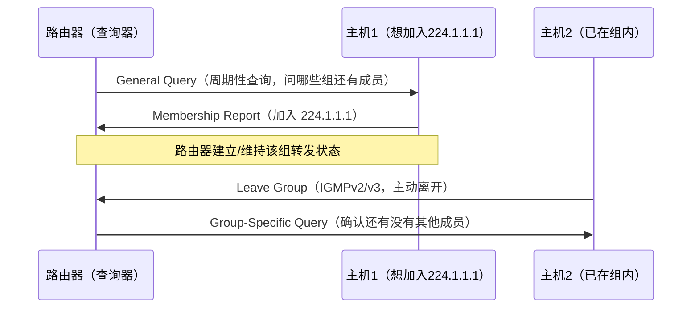
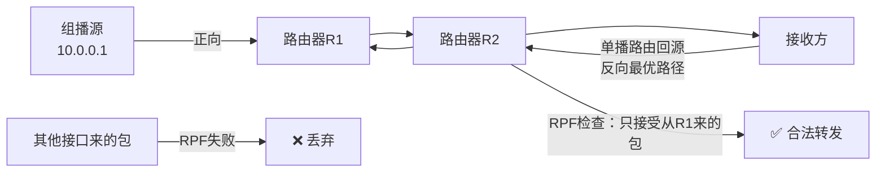
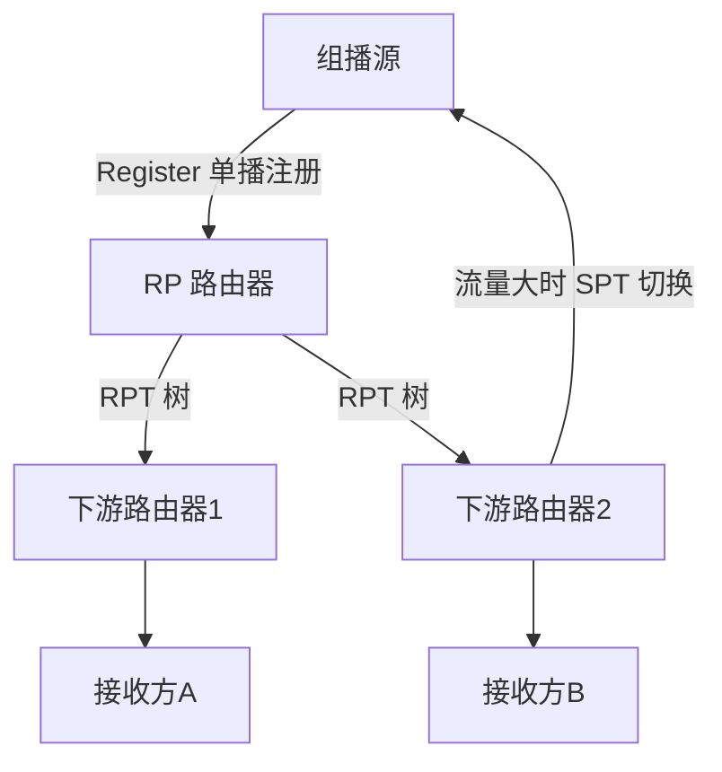
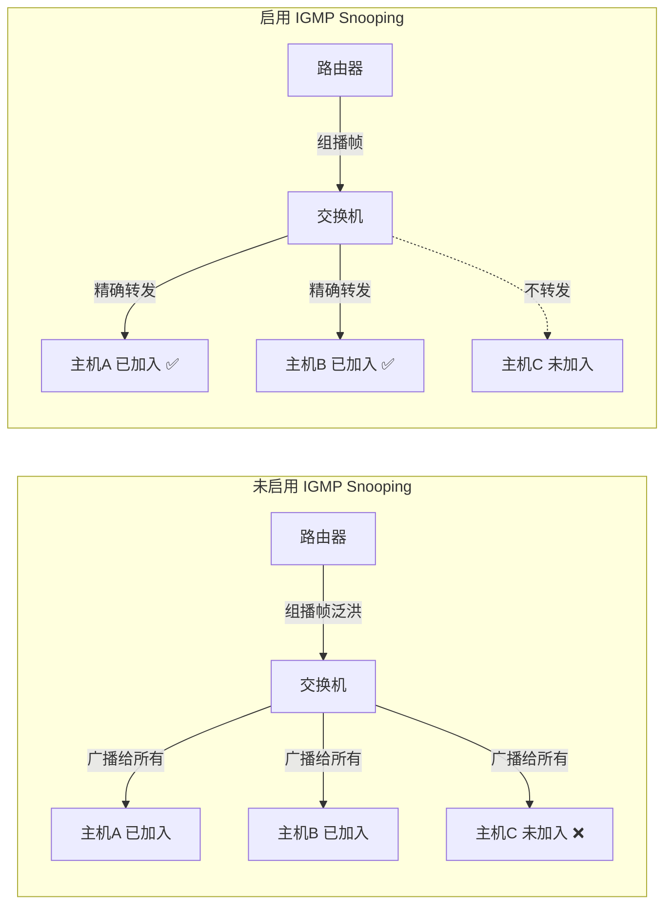

# 详解网络协议(十七)广播与组播

> [!abstract] 速览
> 数据要发给"谁"，有四种范式：**单播**（一对一）、**广播**（一对所有）、**组播 / 多播**（一对一组）、**任播**（一对最近的一个）。本篇聚焦**广播**与**组播**——它们多基于 [[16.UDP协议|UDP]]，常用于发现、直播、行情分发等场景。组播还需要 IGMP 成员管理、PIM 组播路由和 IGMP Snooping 二层优化三重机制协同工作。

## 1. 四种通信方式

| 方式 | 含义 | 目标 | 典型 |
| --- | --- | --- | --- |
| 单播 Unicast | 一对一 | 单个主机 | 绝大多数通信 |
| 广播 Broadcast | 一对所有 | 本网段全部设备 | ARP、DHCP 发现 |
| 组播 Multicast | 一对一组 | 加入组的成员 | IPTV、视频会议 |
| 任播 Anycast | 一对最近 | 最近的一个 | DNS 根、CDN |



### 1.1 任播 Anycast 详解

> [!tip] 点睛
> 任播的核心魔法：**同一个 IP 地址同时在多个地理位置通告路由，路由协议自动把流量引到拓扑距离最近的那个节点**，发送方完全无感知。

**任播工作原理：**

1. 多个服务器共享同一个 IP 地址（如 `8.8.8.8`）。
2. 每台服务器所在的网络通过 BGP 向全球路由表通告该前缀。
3. 互联网路由器按 BGP 最优路径选择（AS-PATH 最短 / MED 最低等）把报文引向"最近"节点。
4. 客户端始终感觉自己在和固定 IP 通信，实际服务的物理机器可能在不同大洲。



**典型应用场景：**

| 场景 | 例子 | 说明 |
| --- | --- | --- |
| 公共 DNS | `8.8.8.8`（Google）、`1.1.1.1`（Cloudflare） | 全球数十个节点共享同一 IP，就近响应 |
| DNS 根服务器 | A–M 根，共 13 组 IP | 物理节点超过 1000 个，均靠 Anycast 分布 |
| CDN 调度 | Cloudflare、Akamai | Anycast 就近入网，再内部负载均衡 |
| DDoS 防护 | 流量分散到多节点吸收 | 单节点被打垮，路由自动切换 |
| BGP Anycast | 企业跨区部署 | 多 AS 同时通告同一前缀 |

**任播 vs 组播辨析：**

| 维度 | 任播 Anycast | 组播 Multicast |
| --- | --- | --- |
| 接收节点数 | **只有最近的一个** | **所有加入组的成员** |
| 路由机制 | BGP 等单播路由协议 | PIM 等组播路由协议 |
| 服务端配置 | 多台服务器共享同一 IP | 接收方主动加入组 |
| 典型协议 | BGP Anycast | IGMP + PIM |
| IPv6 支持 | RFC 4291 原生定义 | `ff00::/8` 原生支持 |

> [!note] IPv6 中 Anycast 是一等公民
> Anycast 最早正式定义于 IPv6 规范（RFC 4291）。IPv6 Anycast 地址格式与单播地址完全相同，仅在语义上标注"分配给多个接口，送达最近的那个"。

---

## 2. 广播（Broadcast）

### 2.1 广播地址类型

| 类型 | 地址 | 作用范围 | 路由器转发？ |
| --- | --- | --- | --- |
| 受限广播 | `255.255.255.255` | 本本地网段，不跨路由器 | ❌ 绝不转发 |
| 定向广播 | 网络号 + 主机位全 1（如 `192.168.1.255`） | 特定网络，可跨路由器（默认禁止） | 需手动开启 |
| 子网广播 | 子网号 + 主机位全 1 | 特定子网内 | ❌ 默认禁止 |

**L2 广播帧：** 以太网广播目的 MAC 为 `FF:FF:FF:FF:FF:FF`，交换机将该帧从**所有端口（除入端口）泛洪**，这是 ARP 等协议正常工作的基础。

### 2.2 路由器为何默认不转发广播

路由器是**广播域的边界**。若路由器转发广播：

- 一个广播包将扩散到整个互联网；
- 攻击者可用**Smurf 攻击**：向定向广播地址发大量 ICMP，让目标网段所有主机同时回复给受害者。

因此 RFC 2644 明确规定路由器**默认禁止转发定向广播**。DHCP 中继（`ip helper-address`）是个例外——它把广播请求"单播转发"给 DHCP 服务器，并非真正的广播转发。

### 2.3 广播风暴

> [!warning] 广播风暴成因
> 交换网络中出现**环路**时，广播帧会被无限复制转发：帧沿环路不断循环，迅速消耗全部带宽，导致网络瘫痪。
>
> **防护手段：**
> - **STP / RSTP / MSTP**：生成树协议逻辑断开环路；
> - **VLAN 隔离**：把大广播域拆成多个小 VLAN，广播范围缩小；
> - **端口安全**：限制 MAC 地址数量，抑制异常流量；
> - **风暴抑制（Storm Control）**：交换机按阈值限速广播帧。

依赖广播的协议（见 [[05.网络层|ARP]]、DHCP）必须有广播，但量大时开销显著——这正是**组播**替代广播的核心动机。

---

## 3. 组播（Multicast）

### 3.1 组播核心概念

- **地址**：D 类 `224.0.0.0 – 239.255.255.255`（见 [[12.支持地址分类和子网划分]]）。
- **成员管理**：主机用 **IGMP** 加入 / 离开组；只有组成员才收。
- **跨网段**：靠 **PIM** 等组播路由协议构建分发树，可跨路由器。
- **MAC 映射**：IPv4 组播映射到 `01:00:5E` 开头的组播 MAC。



**组播的三层模型：**



### 3.2 IPv4 组播地址详细分配

IPv4 组播地址空间为 `224.0.0.0/4`（D 类），IANA 按用途细分为若干区间：

| 地址段 | 名称 | 说明 |
| --- | --- | --- |
| `224.0.0.0/24` | 本地链路控制块（Local Network Control） | 路由器**不转发**（无论 TTL），用于本链路协议 |
| `224.0.1.0/24` | 互联网控制块 | 可被路由器转发，用于全球控制协议 |
| `232.0.0.0/8` | SSM 块（源特定组播） | 与 IGMPv3 配合，接收方可指定源 IP |
| `233.0.0.0/8` | GLOP 块 | 按 ASN 分配，`233.X.Y.0/24` 对应 ASN=X×256+Y |
| `239.0.0.0/8` | 管理范围块（私有/内部） | 类似私有单播地址，不应路由到公网 |

**`224.0.0.0/24` 常见 Well-Known 地址：**

| 地址 | 用途 |
| --- | --- |
| `224.0.0.1` | 所有主机（All Hosts on subnet） |
| `224.0.0.2` | 所有路由器（All Routers） |
| `224.0.0.5` | 所有 OSPF 路由器 |
| `224.0.0.6` | OSPF 指定路由器（DR/BDR） |
| `224.0.0.9` | RIPv2 路由器 |
| `224.0.0.12` | DHCP 服务器 / 中继 |
| `224.0.0.18` | VRRP |
| `224.0.0.251` | mDNS（Bonjour/Avahi） |
| `224.0.0.252` | LLMNR |

> [!tip] 口诀
> **"5 是 OSPF 全，6 是 DR，9 是 RIP，12 是 DHCP，18 是 VRRP，251 是 mDNS"**——`224.0.0.X` 一网段 Well-Known 记法。

### 3.3 组播 IP → MAC 映射（32:1 重叠问题）

以太网组播帧的目的 MAC 格式由 IANA 规定：

```
01:00:5E:[0XXXXXXX]:[XXXXXXXX]:[XXXXXXXX]
高24位固定       ↑第25位固定为0  低23位来自 IPv4 组播地址低23位
```

**映射示意（以 `224.1.2.3` 为例）：**

```
IP:  1110 0000 . 0000 0001 . 0000 0010 . 0000 0011
         ↑D类前4位丢弃    ↑第25位丢弃   低23位保留
MAC: 01:00:5E : 0000 0001 . 0000 0010 . 0000 0011
             = 01:00:5E:01:02:03
```

**32:1 重叠问题：** IPv4 组播地址有 28 位可变（D 类前 4 位固定），但 MAC 只取低 23 位，丢失了 5 位信息。因此 **32 个不同的 IPv4 组播地址会映射到同一个组播 MAC**（例如 `224.0.1.1`、`224.128.1.1`、`225.0.1.1` 等都对应 `01:00:5E:00:01:01`）。

> [!warning] 32:1 重叠的实际影响
> 网卡/驱动层收到该组播 MAC 帧后，必须由**上层 IP 软件再次过滤**，确认目的 IP 是否真的是本机加入的组播组。网络规划时应尽量避免将共享同一 MAC 的多个组播组同时部署在同一二层网络中。

### 3.4 IPv6 组播地址结构

IPv6 **没有广播**，广播的功能全部由组播承担（如 ARP 被 NDP + 被请求节点组播替代）。IPv6 组播前缀固定为 `ff00::/8`：

```
|← 8位 FF →|← 4位 Flags →|← 4位 Scope →|← 112位 组ID →|
```

**Flags 字段（4位，从高到低）：**

| 位 | 名称 | 含义 |
| --- | --- | --- |
| bit 8 | 保留 | 必须为 0 |
| bit 9 | R | 嵌入 RP 地址（RFC 3956） |
| bit 10 | P | 基于前缀分配（RFC 3306） |
| bit 11 | T | 0=永久（IANA 分配），1=临时/动态 |

**Scope 字段（4位）：**

| 值 | 范围 |
| --- | --- |
| `1` | 接口本地 |
| `2` | 链路本地（Link-local） |
| `5` | 站点本地（Site-local） |
| `8` | 组织范围 |
| `E` | 全球 |

**常见 IPv6 组播地址：**

| 地址 | 范围 | 对应 IPv4 | 用途 |
| --- | --- | --- | --- |
| `ff02::1` | 链路本地 | `224.0.0.1` | 全节点（所有 IPv6 设备自动加入） |
| `ff02::2` | 链路本地 | `224.0.0.2` | 全路由器 |
| `ff02::5` | 链路本地 | `224.0.0.5` | OSPFv3 所有路由器 |
| `ff02::6` | 链路本地 | `224.0.0.6` | OSPFv3 DR/BDR |
| `ff02::16` | 链路本地 | — | 支持 MLDv2 的路由器 |
| `ff02::1:2` | 链路本地 | — | DHCPv6 中继代理和服务器 |
| `ff02::1:ffXX:XXXX` | 链路本地 | — | 被请求节点组播（替代 ARP） |

> [!note] 被请求节点组播地址（Solicited-Node）
> 每个 IPv6 单播/任播地址都对应一个前缀 `ff02::1:ff00:0/104` + 末 24 位的组播地址。NDP 邻居发现用它替代 IPv4 的 ARP 广播，精准定位目标主机，大幅减少不必要的广播范围。

---

## 4. 广播 vs 组播

| 维度 | 广播 | 组播 |
| --- | --- | --- |
| 接收者 | 网段内所有设备 | 仅加入组的成员 |
| 跨网段 | 不支持 | 支持（需组播路由） |
| 网络效率 | 低（人人都收） | 高（按需分发） |
| 典型协议 | ARP、DHCP | IGMP、PIM |
| IPv6 支持 | ❌ IPv6 无广播 | ✅ IPv6 原生支持 |
| 二层优化 | STP/VLAN | IGMP Snooping |

---

## 5. 成员管理：IGMP 与 MLD

### 5.1 IGMP 三个版本对比

IGMP（Internet Group Management Protocol）运行在**主机与直连路由器之间**，负责告知路由器"本网段有没有某组播组的成员"。



| 特性 | IGMPv1 | IGMPv2 | IGMPv3 |
| --- | --- | --- | --- |
| RFC | 1112 | 2236 | 3376 |
| 查询器选举 | 依赖 PIM 等外部协议 | 自动选举（IP 最小的路由器） | 自动选举 |
| 离开方式 | 静默（超时，最长 ~180 s 延迟） | 主动发 Leave 报文 | 主动发 Leave 报文 |
| 特定组查询 | ❌ | ✅ | ✅ |
| 源过滤（SSM） | ❌ | ❌ | ✅（INCLUDE / EXCLUDE 模式） |
| 主要缺陷 | 离开延迟大 | 无法指定源 | 无明显缺陷 |

> [!tip] 口诀
> **v1 只能加入不说走；v2 会主动说"我走了"；v3 还能指定"我只要某个源的"**。

### 5.2 IGMPv3 源过滤模式

IGMPv3 引入了 `(S, G)` 概念，主机可以精确控制：

| 模式 | 含义 |
| --- | --- |
| `INCLUDE(S1, S2, …)` | 只接收来自指定源列表的数据 |
| `EXCLUDE(S1, S2, …)` | 接收除指定源外所有源的数据 |
| `EXCLUDE()` 空列表 | 等价于 IGMPv2 的"加入组" |

### 5.3 IPv6 对应：MLD

IPv6 的组播成员管理协议为 **MLD（Multicast Listener Discovery）**，承载于 ICMPv6，功能与 IGMP 一一对应：

| MLD 版本 | 对应 IGMP | RFC |
| --- | --- | --- |
| MLDv1 | IGMPv2 | RFC 2710 |
| MLDv2 | IGMPv3 | RFC 3810 |

---

## 6. 组播路由：PIM 协议族

IGMP 只负责本地成员管理，**跨路由器的组播分发**需要组播路由协议——最广泛使用的是 **PIM（Protocol Independent Multicast，协议无关组播）**。"协议无关"指 PIM 不依赖特定单播路由协议，直接复用单播路由表（FIB）做 RPF 校验。

### 6.1 RPF（逆向路径转发）

RPF 是所有组播路由协议的基础防环机制：

> **当路由器收到一个组播包时，查单播路由表，看"去往该组播源的出接口"是哪个——只有从那个接口收到的包才合法（在通往源的反向路径上），否则丢弃。**



### 6.2 PIM-DM（密集模式）

**适用场景：** 组播成员密集、几乎每个网段都有接收者的小型网络。

**工作原理（推模式 + 剪枝）：**

1. 组播数据先向全网**扩散（Flood）**。
2. 没有成员的下游路由器发送**剪枝（Prune）**消息，上游停止往该方向转发。
3. 每 60 秒状态刷新，若有新成员加入可发**嫁接（Graft）**恢复。
4. 构建的分发树为 **SPT（最短路径树，以源为根）**。

**缺点：** 成员稀疏时周期性扩散产生大量无效流量。

### 6.3 PIM-SM（稀疏模式）

**适用场景：** 组播成员稀疏、分布广泛的大型网络（互联网级别，最常用）。

**核心概念：RP（汇聚点，Rendezvous Point）**

PIM-SM 以 RP 为核心，构建 **RPT（汇聚点树，以 RP 为根）**：



**关键流程：**

1. 接收方路由器向 RP 发 Join，加入 RPT。
2. 组播源的 DR 把数据**封装为 Register 单播**发给 RP。
3. RP 解封后沿 RPT 向成员分发。
4. 流量大时，接收方路由器可向源发 Join，切换到 **SPT（更短路径）**。

**RP 发现机制：** 静态配置 或 **BSR（Bootstrap Router）** 动态选举。

### 6.4 PIM-SSM（源特定组播模式）

SSM 与 IGMPv3 配合，跳过 RP，**直接在接收方和指定源之间构建 SPT**：

- 接收方加入 `(S, G)` 而非 `(*, G)`。
- 无需 RP，减少单点故障，安全性更高。
- 使用 `232.0.0.0/8` 地址段（IPv4）。

| 维度 | PIM-DM | PIM-SM | PIM-SSM |
| --- | --- | --- | --- |
| 适用场景 | 成员密集 | 成员稀疏 | 指定源组播 |
| 分发树 | SPT | RPT → 可切 SPT | SPT |
| 需要 RP | ❌ | ✅ | ❌ |
| 工作模式 | 推（扩散 + 剪枝） | 拉（加入 RPT） | 直接加入源 SPT |
| RPF 基准 | 组播源地址 | RP 地址 / 源地址 | 组播源地址 |
| 搭配 IGMP | v1/v2/v3 | v1/v2/v3 | **v3（必须）** |

---

## 7. ASM vs SSM：任意源组播 vs 指定源组播

| 对比维度 | ASM（Any-Source Multicast） | SSM（Source-Specific Multicast） |
| --- | --- | --- |
| 成员模式 | 加入 `(*, G)`，接受任意源 | 加入 `(S, G)`，指定源 |
| 使用 IGMP | v1 / v2 / v3 均可 | **必须 IGMPv3 / MLDv2** |
| 使用 PIM | PIM-SM（需 RP）或 PIM-DM | **PIM-SSM（无 RP）** |
| 地址段（IPv4） | `224.0.0.0/4`（非 SSM 部分） | `232.0.0.0/8` |
| 安全性 | 低（任意主机可成为源） | 高（接收方精确控制源） |
| 复杂度 | 高（需 RP 管理） | 低（无 RP，无单点故障） |
| 典型场景 | 企业内部组播、传统 IPTV | 互联网直播、视频点播（iQIYI、Netflix 组播） |

> [!tip] 发展趋势
> SSM + IGMPv3 是现代组播网络的推荐方案，规避了 ASM 中 RP 单点故障和任意源注入的安全风险。

---

## 8. 二层优化：IGMP Snooping

### 8.1 为什么需要 IGMP Snooping

默认情况下，二层交换机不理解三层 IP 协议，收到组播 MAC 帧时**找不到对应的 MAC 表项，会向所有端口泛洪**——组播退化为广播，浪费带宽并影响安全。



### 8.2 IGMP Snooping 工作原理

IGMP Snooping 让交换机**侦听（Snooping）主机与路由器之间的 IGMP 报文**，从中学习哪些端口有哪些组的成员，维护一张**二层组播转发表**。

**关键端口类型：**

| 端口类型 | 朝向 | 作用 |
| --- | --- | --- |
| 路由器端口（Router Port） | 上游组播路由器 | 接收 Query，转发 Report |
| 成员端口（Member Port） | 下游组播成员主机 | 仅将该组流量转发到此端口 |

**学习流程：**

1. 路由器发送 IGMP General Query → 交换机识别并记录该端口为"路由器端口"。
2. 主机回复 IGMP Report（加入 `224.1.1.1`）→ 交换机记录：该端口属于组 `224.1.1.1`。
3. 主机发送 Leave → 交换机转发给路由器，路由器发 Group-Specific Query → 无响应则删除表项。

> [!note] IGMP Snooping vs IGMP
> IGMP 运行在三层（路由器↔主机），IGMP Snooping 运行在二层（交换机上"旁听"），两者互补而非替代。

---

## 9. 可靠组播简述

标准组播基于 UDP，本质上是**不可靠**的（无确认、无重传）。对于需要数据完整性的场景，有以下方案：

| 机制 | 原理 | 优点 | 缺点 |
| --- | --- | --- | --- |
| **NACK 反馈**（NORM 协议） | 接收方发现丢包后向发送方发送否定确认（NACK），请求重传 | 无丢包时零开销 | 大量接收方同时 NACK 会产生反馈爆炸 |
| **FEC 前向纠错** | 发送端添加冗余包（如 RS 码），接收端可自行恢复 | 无需重传，单向信道可用 | 带宽开销固定，轻微丢包也要付代价 |
| **NACK + FEC 联合** | FEC 恢复轻微丢包，严重时触发 NACK 重传 | 兼顾效率与可靠性 | 实现复杂 |
| **PGM 协议** | IETF 标准可靠组播协议（RFC 3208） | 标准化，有 NACK 抑制 | 部署不广泛 |

> [!note]
> 实时音视频（IPTV、视频会议）通常接受少量丢包（用 FEC 补偿），不追求 100% 可靠；金融行情等关键数据则使用可靠组播机制（如 NACK + 应用层序号）。

---

## 10. 应用场景

### 10.1 广播
- **ARP 请求**：`who has 192.168.1.1? tell 192.168.1.100`
- **DHCP 发现**：主机广播 DHCP Discover 找服务器
- **局域网设备发现**：UPnP、mDNS（虽用组播，但常误称"广播发现"）

### 10.2 组播
| 场景 | 协议/技术 | 说明 |
| --- | --- | --- |
| IPTV 直播 | IGMPv3 + PIM-SM/SSM | 一路流服务数千用户，带宽节省显著 |
| 视频会议 | RTP over UDP 组播 | 多点会议，一发多收 |
| 股票行情推送 | 组播 UDP | 证券交易所 Level 2 行情实时分发 |
| 企业批量分发 | 组播文件传输 | OS 镜像、配置批量下发到数千台设备 |
| 路由协议 | OSPF、RIPv2、PIM | 使用 Well-Known 组播地址替代广播 |
| 时间同步 | NTPv4 | `224.0.1.1` 组播 NTP 服务器 |

### 10.3 任播（Anycast）
- DNS 解析加速（`8.8.8.8`、`1.1.1.1`）
- CDN 边缘节点调度
- DDoS 流量分散吸收
- 根服务器高可用（全球 1000+ 个物理节点共 13 个 IP）

---

## 11. 常见误区与面试要点

> [!warning] 常见误区
> - **广播风暴**：环路或异常会让广播帧无限复制、瘫痪网络；用 VLAN、STP 防护。
> - **IPv6 没有"广播"**：其功能由**组播**（如全节点组播 `ff02::1`）替代。ARP 也被 NDP + 被请求节点组播地址替代。
> - **组播需全链路设备支持**（交换机 IGMP Snooping、路由器组播路由），否则退化为广播或丢失。
> - **任播 ≠ 负载均衡**：Anycast 选的是路由拓扑"最近"的节点，而非服务器负载最轻的节点；单会话始终打到同一节点（若路由稳定）。
> - **组播 MAC 32:1 不是 bug**：是 IANA 有意设计，上层过滤即可；但规划时应避免把共享 MAC 的多个组播组同时用于同一 VLAN。
> - **`224.0.0.0/24` 不过路由器**：这些 Well-Known 地址无论 TTL 多大，路由器都不转发——这是刻意设计，防止路由协议报文泄漏。
> - **IGMP Snooping 不替代 IGMP**：前者在二层交换机上"旁听"，后者在三层路由器与主机之间运行，两者协同才能实现完整的组播精确转发。
> - **PIM-SM 的 RP 是单点故障**：生产环境需配置 Anycast RP 或 BSR 冗余机制。

---

## 延伸阅读

- 承载：[[16.UDP协议]]（广播 / 组播多基于 UDP）
- 地址：[[12.支持地址分类和子网划分]]（D 类）· [[05.网络层]]

> ⬅️ [[16.UDP协议]] ｜ 🏠 [[00.网络协议详解总览]] ｜ [[18.HTTP-HTTPS协议]] ➡️
