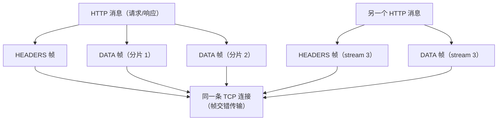
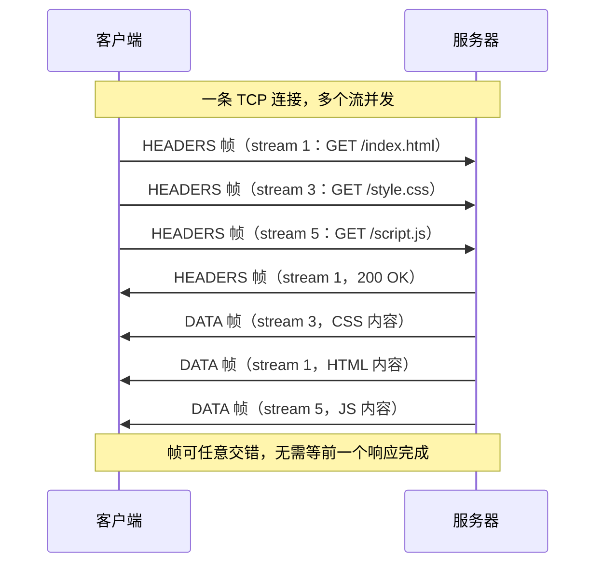
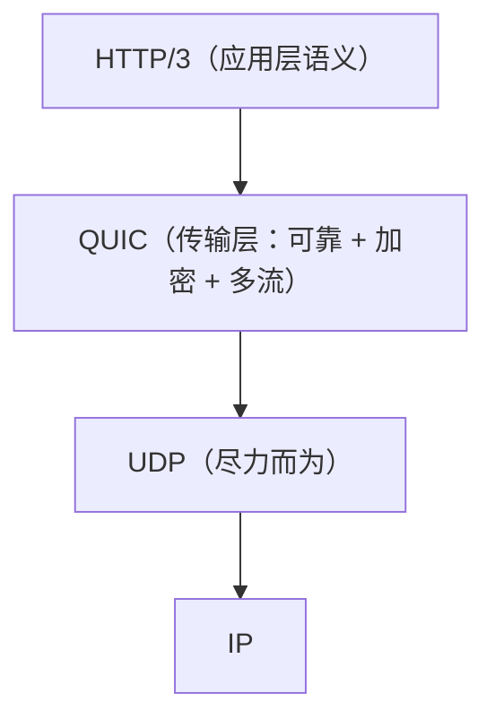
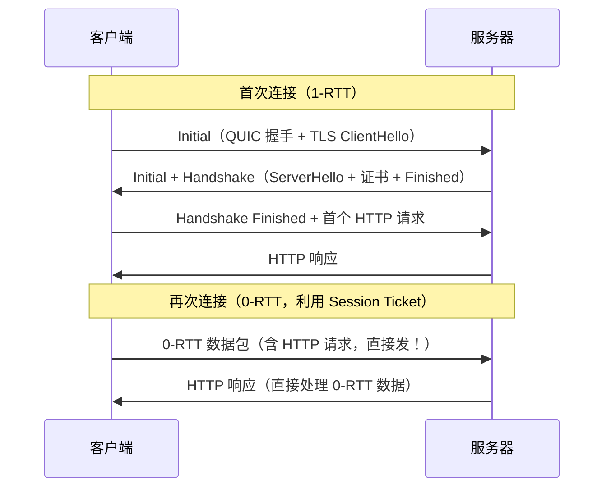
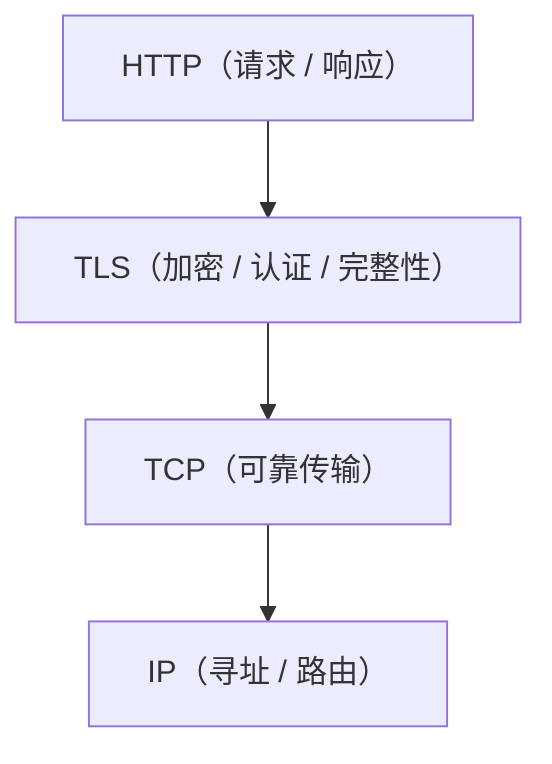
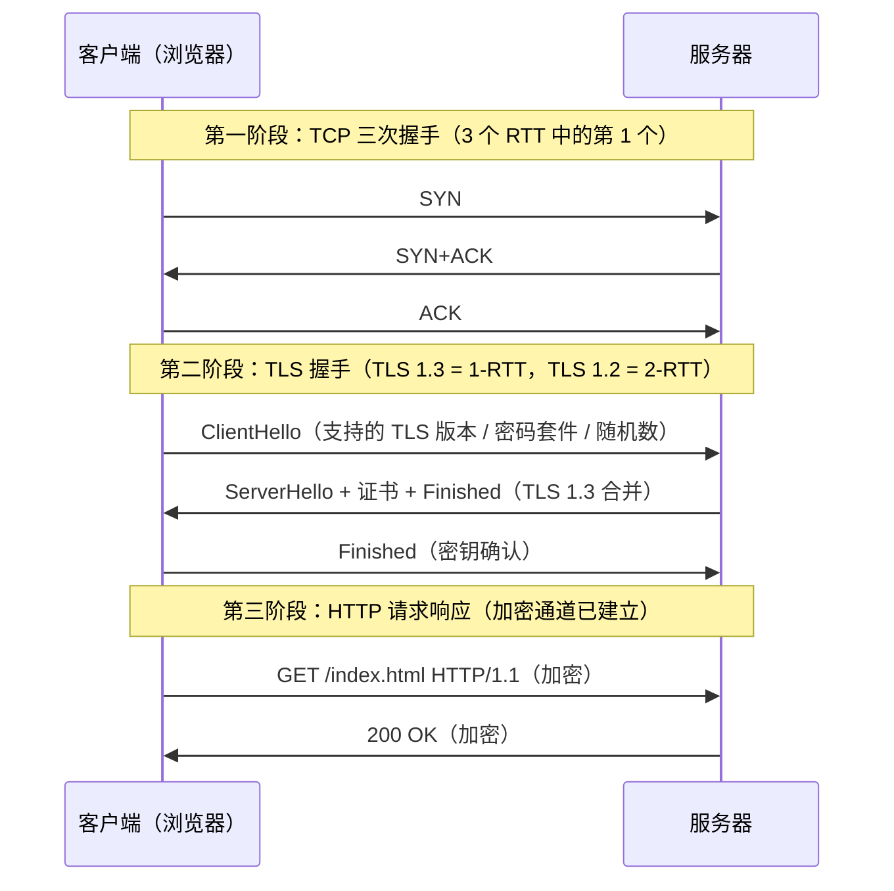
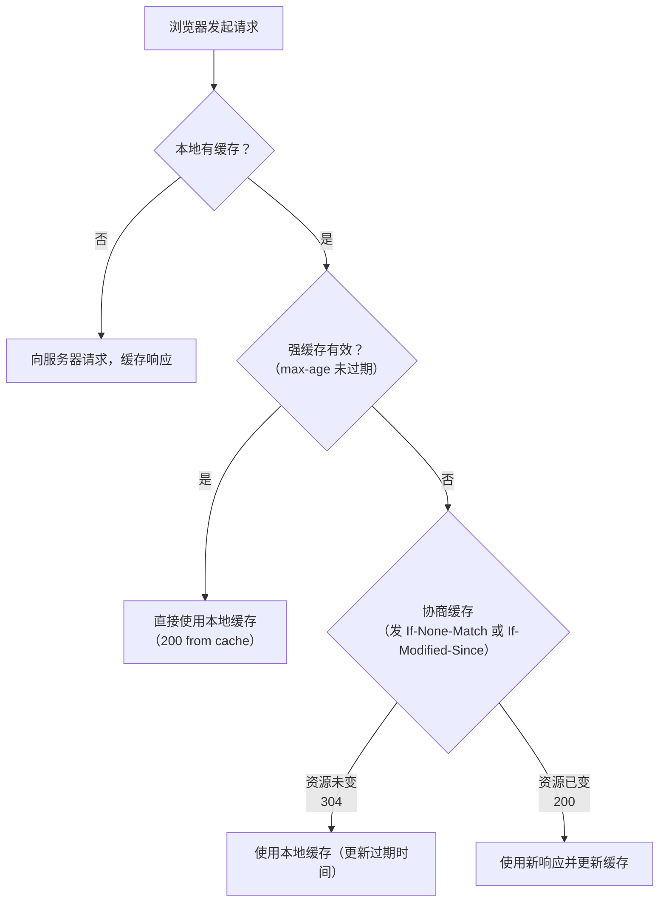
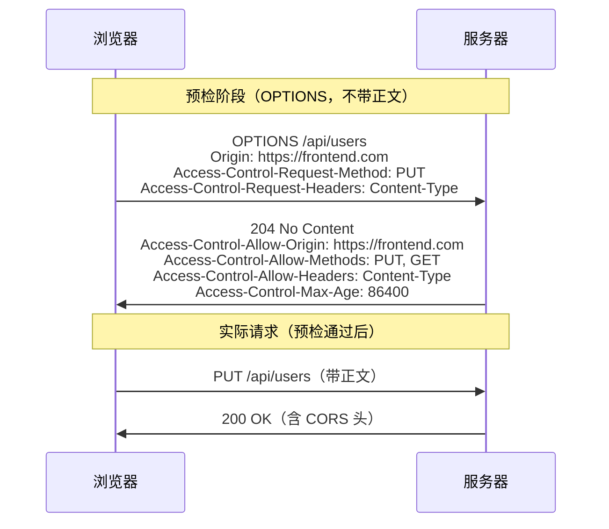

# 详解网络协议(十八)HTTP/HTTPS协议

> [!abstract] 速览
> **HTTP（超文本传输协议）** 是 Web 的基石——[[09.应用层|应用层]]、**请求-响应**模式、**无状态**。**HTTPS = HTTP over [[15.TLS协议|TLS]]**，在 HTTP 下塞一层加密。端口 **80 / 443**。从 HTTP/1.0 到 **HTTP/3** 的演进，主线就是一句话：**不断和"队头阻塞"与延迟作斗争**。
> 规范：RFC 9110（语义）/ 9112（HTTP/1.1）/ 9113（HTTP/2）/ 9114（HTTP/3）。

## 1. HTTP 是什么

客户端发**请求**、服务器回**响应**，一问一答。**无状态**——协议本身不记得你上次干了啥；"登录态"靠应用层的 **Cookie / Session / Token** 维持（见 [[07.会话层]]）。

HTTP 运行于 [[13.TCP协议|TCP]] 之上（HTTP/3 除外），本身是**纯文本协议**（HTTP/2 起改为二进制）。它定义了：
- **语义**：方法（做什么）、URI（对谁做）、状态码（结果如何）
- **报文结构**：头部 + 空行 + 可选正文
- **连接管理**：短连接 / 长连接 / 复用

> 口诀：**HTTP = 无状态 + 请求-响应 + 应用层文本协议**，HTTPS 就是给它穿上 TLS 盔甲。

---

## 2. 报文结构

### 2.1 基本格式

**请求报文**：

```
请求行：方法 URL HTTP版本      （如 GET /index.html HTTP/1.1）
请求头：Host、User-Agent、Content-Type ...
空行
请求体：POST 数据等（可选）
```

**响应报文**：

```
状态行：HTTP版本 状态码 原因短语   （如 HTTP/1.1 200 OK）
响应头：Content-Type、Server、Cache-Control ...
空行
响应体：HTML / JSON / 二进制 ...
```

### 2.2 常见请求头

| 类别 | 头部字段 | 作用 |
|---|---|---|
| **目标与身份** | `Host` | 虚拟主机必须，指明目标域名（HTTP/1.1 强制要求） |
| | `User-Agent` | 浏览器/客户端标识 |
| | `Referer` | 当前请求来源页面 URL（拼写历史错误，标准如此） |
| | `Origin` | CORS 场景标明请求来源（只含协议+域名+端口） |
| **内容协商** | `Accept` | 客户端能接受的响应媒体类型，如 `text/html,application/json` |
| | `Accept-Encoding` | 可接受的内容编码，如 `gzip, br` |
| | `Accept-Language` | 语言偏好，如 `zh-CN,zh;q=0.9` |
| **认证与授权** | `Authorization` | 携带凭据，如 `Bearer <token>` / `Basic <base64>` |
| | `Cookie` | 向服务器回送 Cookie |
| **正文描述** | `Content-Type` | 请求体的媒体类型，如 `application/json` |
| | `Content-Length` | 请求体字节数（非分块时必须） |
| **条件/缓存** | `If-None-Match` | 配合 ETag 做协商缓存 |
| | `If-Modified-Since` | 配合 Last-Modified 做协商缓存 |
| | `Cache-Control` | 客户端缓存指令，如 `no-cache` |
| **范围请求** | `Range` | 请求部分内容，如 `bytes=0-1023` |

### 2.3 常见响应头

| 类别 | 头部字段 | 作用 |
|---|---|---|
| **服务器信息** | `Server` | 服务器软件标识，生产环境建议隐藏/精简 |
| **正文描述** | `Content-Type` | 响应体媒体类型，含字符集，如 `text/html; charset=UTF-8` |
| | `Content-Length` | 响应体字节数 |
| | `Content-Encoding` | 响应体压缩方式，如 `gzip` |
| | `Transfer-Encoding` | 传输编码，`chunked` 表示分块传输 |
| **缓存控制** | `Cache-Control` | 缓存策略指令（见第 9 节） |
| | `ETag` | 资源版本标识符（强/弱 ETag） |
| | `Last-Modified` | 资源最后修改时间 |
| | `Expires` | 过期时间（HTTP/1.0 遗留，已被 Cache-Control 取代） |
| **重定向** | `Location` | 3xx 重定向目标 URL |
| **跨域** | `Access-Control-Allow-Origin` | 允许的来源（CORS） |
| | `Access-Control-Allow-Methods` | 允许的方法 |
| | `Vary` | 告知代理/CDN：按哪个请求头区分缓存版本 |
| **Cookie** | `Set-Cookie` | 向客户端写入 Cookie |

---

## 3. 请求方法

| 方法 | 作用 | 安全 | 幂等 | 说明 |
|---|---|---|---|---|
| GET | 获取资源 | 是 | 是 | 参数放 URL，不应有副作用 |
| POST | 提交数据 | 否 | 否 | 参数在请求体，可能每次创建新资源 |
| PUT | 整体更新 / 创建 | 否 | 是 | 完整替换，不存在则创建 |
| DELETE | 删除资源 | 否 | 是 | 重复删除效果相同 |
| HEAD | 只取响应头 | 是 | 是 | 同 GET 但无响应体，用于探测资源 |
| PATCH | 局部更新 | 否 | 否 | 只修改部分字段，与 PUT 有别 |
| OPTIONS | 查询支持的方法 | 是 | 是 | CORS 预检使用此方法 |
| TRACE | 请求回显 | 是 | 是 | 调试用，服务器原样回显请求；因 XST 攻击风险，几乎都被禁用 |
| CONNECT | 建立隧道 | 否 | 否 | HTTPS 代理场景：先 CONNECT 建 TCP 隧道，再跑 TLS |

> **安全** = 不改服务器状态；**幂等** = 重复执行结果一致。
>
> **CONNECT 详解**：浏览器向代理服务器发 `CONNECT example.com:443 HTTP/1.1`，代理回 `200 Connection Established`，此后浏览器直接在这条 TCP 连接上做 TLS 握手——代理只转发字节，看不到加密内容。

---

## 4. 状态码

### 4.1 分类速览

| 类 | 含义 | 常见 |
|---|---|---|
| 1xx | 信息 | 100 Continue、101 Switching Protocols |
| 2xx | 成功 | 200 OK、201 Created、204 No Content、**206 Partial Content** |
| 3xx | 重定向 | **301 永久**、**302 临时**、303 See Other、304 Not Modified、**307 临时（保持方法）**、**308 永久（保持方法）** |
| 4xx | 客户端错误 | 400、401、403、404、405、409、410、413、415、**429** |
| 5xx | 服务器错误 | 500、501、502、503、504 |

### 4.2 高频状态码详解

| 状态码 | 名称 | 要点 |
|---|---|---|
| **200** | OK | 最常见的成功响应 |
| **201** | Created | POST/PUT 创建资源成功，响应头含 `Location` |
| **204** | No Content | 成功但无响应体（如 DELETE 成功、OPTIONS 预检响应） |
| **206** | Partial Content | 范围请求成功，配合 `Content-Range` 头 |
| **301** | Moved Permanently | **永久重定向**，浏览器/搜索引擎长期缓存，**方法可能变 GET** |
| **302** | Found | **临时重定向**，**方法可能变 GET**（历史遗留问题） |
| **303** | See Other | 明确要求**改用 GET** 访问新 URL（POST 后重定向常用） |
| **304** | Not Modified | 协商缓存命中，无响应体，客户端用本地缓存 |
| **307** | Temporary Redirect | 临时重定向，**严格保持原方法**（POST 仍 POST） |
| **308** | Permanent Redirect | 永久重定向，**严格保持原方法** |
| **400** | Bad Request | 客户端请求语法错误 |
| **401** | Unauthorized | **未认证**（没登录或 token 无效），需携带凭据重试 |
| **403** | Forbidden | **已认证但无权限**（服务器拒绝访问） |
| **404** | Not Found | 资源不存在 |
| **405** | Method Not Allowed | 方法不被该 URL 支持，响应含 `Allow` 头 |
| **409** | Conflict | 资源冲突（如创建重名资源） |
| **410** | Gone | 资源永久删除（比 404 更明确，告知爬虫不必再来） |
| **413** | Content Too Large | 请求体超出服务器限制 |
| **415** | Unsupported Media Type | 服务器不支持请求体的 `Content-Type` |
| **429** | Too Many Requests | 限流（Rate Limiting），常含 `Retry-After` 头 |
| **500** | Internal Server Error | 服务器端未预期错误 |
| **501** | Not Implemented | 服务器不支持该请求方法 |
| **502** | Bad Gateway | 网关/代理从上游收到无效响应 |
| **503** | Service Unavailable | 服务暂时不可用（过载/维护），常含 `Retry-After` |
| **504** | Gateway Timeout | 网关/代理等待上游超时 |

### 4.3 易混辨析

> [!note] 301 vs 302 vs 307 vs 308
> - **301**（永久）/ **302**（临时）：历史上浏览器实现允许把 POST 变成 GET，行为不标准。
> - **307**（临时）/ **308**（永久）：RFC 7231 引入，**严格保持请求方法**，POST 还是 POST。
> - **301 vs 308**：都是永久，但 301 可能改方法，308 不改；SEO 场景用 308 更严谨。
> - **302 vs 307**：都是临时，但 307 保持方法；表单提交后跳转应优先用 303（显式改 GET）。

> [!note] 401 vs 403
> - **401**：我不认识你（未认证），带上凭据再来。响应含 `WWW-Authenticate` 头说明认证方案。
> - **403**：我认识你，但你没权限（已认证但无权限），换号再来也没用。

---

## 5. 连接管理

### 5.1 短连接 vs 长连接

| 维度 | 短连接（HTTP/1.0 默认） | 长连接 Keep-Alive（HTTP/1.1 默认） |
|---|---|---|
| 连接生命周期 | 一个请求-响应后立即断开 | 多个请求复用同一条 TCP 连接 |
| TCP 握手开销 | 每次请求都有 3 次握手 + 4 次挥手 | 握手只做一次 |
| 服务器资源 | 连接关闭快，但建立频繁 | 连接保持占用资源，需设置超时 |
| 控制头部 | `Connection: close` | `Connection: keep-alive`（HTTP/1.1 默认无需显式声明） |
| 超时控制 | — | `Keep-Alive: timeout=5, max=100` |

HTTP/1.1 默认开启持久连接，请求完毕后连接不立即关闭，等待下一次复用。若服务器想关闭，在响应头加 `Connection: close`。

### 5.2 浏览器并发连接数限制

由于 HTTP/1.1 在一条连接上**串行**处理请求（管道化形同虚设，见 5.3），浏览器通过**对同一域名开多条 TCP 连接**来并行获取资源：

| 浏览器 | 同域名最大并发连接数 |
|---|---|
| Chrome / Edge | **6** |
| Firefox | **6** |
| Safari | **6** |
| IE11 | 6~13（视版本） |

> 超过限制的请求在客户端排队等待，这正是 HTTP/1.1 时代"域名分片（Domain Sharding）"优化的来源——把静态资源分散到多个子域，绕过单域名连接数限制。HTTP/2 多路复用出现后，域名分片反而有害，应废弃。

### 5.3 HTTP 层队头阻塞与管道化的失败

HTTP/1.1 管道化（Pipelining）允许不等响应就连续发多个请求，但**服务器必须按请求顺序返回响应**。一旦排队靠前的响应处理慢，后面的响应全部被卡住——这就是 **HTTP 层队头阻塞**。

管道化在实践中几乎失败：
- 服务器/代理实现不一致，经常出错
- 只允许幂等方法（GET/HEAD）管道化
- HOL 阻塞实际上让性能更差
- Firefox 已彻底移除支持，Chrome 从未默认启用

结论：**HTTP/1.1 靠多条并发 TCP 连接、而非管道化来提升并发性能**。

---

## 6. 版本演进（主线：对抗队头阻塞与延迟）

| 版本 | 年代 | 关键改进 | 承载 |
|---|---|---|---|
| HTTP/1.0 | 1996 | 每个请求一条新连接 | TCP |
| HTTP/1.1 | 1997 | **持久连接**（Keep-Alive）、管道化（实际失败）、Host 头、分块传输 | TCP |
| HTTP/2 | 2015 | **二进制分帧**、**多路复用**、头压缩 HPACK、服务器推送（已废弃） | TCP |
| HTTP/3 | 2022 | 基于 **QUIC（UDP）**，消除 **TCP 层**队头阻塞、0-RTT | QUIC/[[16.UDP协议\|UDP]] |

> **队头阻塞的两层**：HTTP/2 用多路复用解决了"HTTP 层"的队头阻塞，但多路复用跑在一条 TCP 上，**TCP 丢一个包仍会卡住所有流**（TCP 层队头阻塞）；HTTP/3 改用 [[16.UDP协议|UDP]] 上的 QUIC，每条流独立，才彻底解决。

---

## 7. HTTP/1.1 深入

### 7.1 分块传输 `Transfer-Encoding: chunked`

当响应体大小在发送时未知（如动态生成的流式内容），HTTP/1.1 使用**分块传输编码**：

```
HTTP/1.1 200 OK
Transfer-Encoding: chunked

7\r\n          ← 块大小（16 进制）
Mozilla\r\n   ← 块数据
9\r\n
Developer\r\n
0\r\n          ← 大小为 0 表示结束
\r\n
```

- 与 `Content-Length` **互斥**，不能同时使用
- 允许服务器边生成边发送，适合大文件、SSE（Server-Sent Events）
- 最后一个 chunk 大小为 `0`，后面可附 **Trailer 头**

### 7.2 范围请求与断点续传

客户端在请求头加 `Range: bytes=<start>-<end>`，服务器支持则返回 **206 Partial Content**：

```
请求：Range: bytes=0-1023
响应：
  HTTP/1.1 206 Partial Content
  Content-Range: bytes 0-1023/65536
  Content-Length: 1024
```

| 场景 | 说明 |
|---|---|
| 断点续传 | 下载中断后从中断点继续，避免从头下载 |
| 视频 Seek | 直接跳转到视频某个时间点 |
| 多线程下载 | 分多段并行下载，最后合并 |

若服务器不支持范围请求，响应 `200 OK` 并返回完整内容（不返回 206）。响应头含 `Accept-Ranges: bytes` 表示支持。

### 7.3 内容协商

HTTP/1.1 支持客户端声明偏好，服务器据此选择最合适的响应版本：

| 请求头 | 协商维度 | 示例 |
|---|---|---|
| `Accept` | 媒体类型 | `text/html,application/json;q=0.9` |
| `Accept-Encoding` | 压缩方式 | `gzip, br, deflate` |
| `Accept-Language` | 语言 | `zh-CN,zh;q=0.9,en;q=0.8` |
| `Accept-Charset` | 字符集 | `UTF-8,ISO-8859-1` |

`q` 值（quality factor）范围 0–1，越大优先级越高，默认 1。服务器根据协商结果选择版本，并在响应中用 `Vary` 头告知代理"按哪个请求头缓存不同版本"。

### 7.4 虚拟主机与 Host 头

HTTP/1.1 **强制要求** `Host` 头——一台服务器可通过一个 IP 托管多个域名（虚拟主机），服务器靠 `Host` 区分请求归属。HTTP/1.0 没有此头，每个域名需要独立 IP。

---

## 8. HTTP/2 深入

### 8.1 二进制分帧层

HTTP/2 最根本的变化：将 HTTP 消息分解为**二进制帧（Frame）**在一条 TCP 连接上传输。



**核心概念三层**：
- **连接（Connection）**：一条 TCP 连接，客户端与服务器之间只建一条
- **流（Stream）**：连接上的双向逻辑通道，每个流有唯一 ID（客户端奇数、服务器偶数）
- **消息（Message）**：完整的请求或响应，由一或多个帧组成
- **帧（Frame）**：HTTP/2 通信的最小单位，含帧头（9 字节，含流 ID、帧类型、标志位）

### 8.2 多路复用：彻底解决 HTTP 层队头阻塞



流与流之间**互不阻塞**：stream 3 的 DATA 可在 stream 1 响应未完成时传输。

### 8.3 HPACK 头部压缩

HTTP/1.1 头部是明文重复发送（每次请求都带 `User-Agent`、`Cookie` 等），HTTP/2 的 **HPACK**（RFC 7541）解决了这个问题：

- **静态表**：预定义 61 个常用头部（如 `:method: GET`、`:status: 200`），用索引号代替完整字符串
- **动态表**：运行时双方维护的"已发送过的头部"表，后续请求只发索引号
- **哈夫曼编码**：对头部值进行哈夫曼压缩

实测头部压缩率约 **85–95%**，对 Cookie 重型请求效果尤其显著。

### 8.4 流优先级

每个流可声明**权重（1–256）**和**依赖关系**，服务器据此分配带宽和处理顺序，如先发 CSS/JS 再发图片。RFC 9113 已将优先级标记为"建议性"，实际实现差异较大。

### 8.5 服务器推送（已主流废弃）

HTTP/2 允许服务器在客户端请求之前**主动推送**资源（如请求 HTML 时顺带推 CSS）：

```
Server → Client: PUSH_PROMISE 帧（stream 2，/style.css）
Server → Client: HEADERS + DATA 帧（stream 2，CSS 内容）
```

**实践中几乎失败**：
- 服务器无法知道客户端缓存中已有什么，频繁推送重复资源浪费带宽
- Chrome 106+（2022 年 10 月）彻底移除 HTTP/2 Push 支持
- Firefox 132（2024 年 10 月）亦完全移除
- RFC 9113 将其标注为"难以有效使用"
- 替代方案：**103 Early Hints** + `Link: rel=preload` 头

### 8.6 流量控制

HTTP/2 在**流级别**和**连接级别**各有独立流量控制窗口（类似 TCP 的滑动窗口），通过 `WINDOW_UPDATE` 帧通告可接收字节数，防止快发送方淹没慢接收方。

### 8.7 HTTP/2 的局限：TCP 层队头阻塞

HTTP/2 将所有流复用在**同一条 TCP 连接**上。TCP 保证有序交付——一旦网络丢包，后续已到达的帧必须在内核缓冲区等待重传，**所有流全部被卡住**。这正是"TCP 层队头阻塞"，HTTP/2 无法在协议层面解决，只能由 HTTP/3 解决。

---

## 9. HTTP/3 + QUIC 深入

### 9.1 为什么需要新协议

HTTP/2 的多路复用在 **TCP 层队头阻塞**面前形同虚设。网络越差（如移动网络，丢包率 1–2%），HTTP/2 因为共享 TCP 反而比 HTTP/1.1 + 多连接更慢。解法只有一个：**换掉 TCP**。

### 9.2 QUIC 是什么

QUIC（RFC 9000，2021 年）是 Google 设计、IETF 标准化的新传输协议，运行于 [[16.UDP协议|UDP]] 之上：



QUIC 内置 TLS 1.3，**连接建立与 TLS 握手合并**——首次连接只需 **1-RTT**（vs TCP+TLS 1.3 的 2-RTT），重连支持 **0-RTT**。

### 9.3 彻底消除队头阻塞

QUIC 的每条流（Stream）在传输层独立实现可靠有序交付：

| 维度 | TCP + HTTP/2 | QUIC + HTTP/3 |
|---|---|---|
| 共享连接 | 所有流共享一条 TCP 字节流 | 所有流共享一条 QUIC 连接，但**流级别独立** |
| 丢包影响 | 一个包丢失，**所有流**等待重传 | 一个包丢失，只影响**该包所在的流** |
| 队头阻塞 | HTTP 层已解决，**TCP 层仍有** | **彻底消除** |

### 9.4 0-RTT 连接恢复



> [!warning] 0-RTT 的安全限制
> 0-RTT early data **不防重放攻击**：攻击者可截获并重放早期数据。因此：
> - 0-RTT 数据应只用于**幂等**请求（GET）
> - POST/支付等操作不应放入 0-RTT

### 9.5 连接迁移

传统 TCP 连接由**四元组（源 IP + 源端口 + 目标 IP + 目标端口）**标识，IP 变化（如手机从 Wi-Fi 切换到 4G）必须重新建立连接。

QUIC 使用**连接 ID（Connection ID）**标识连接：

```
QUIC 连接 = Connection ID（双方维护）
≠ IP + 端口组合
```

网络切换时，Connection ID 不变，**连接无缝迁移**，正在进行的请求不中断。这对移动设备尤其重要。

### 9.6 HTTP/3 核心改进汇总

| 特性 | HTTP/3（QUIC） | 说明 |
|---|---|---|
| 底层传输 | UDP（QUIC） | 绕过 TCP 队头阻塞 |
| 加密 | 内置 TLS 1.3（强制） | QUIC 层原生加密，无明文 |
| 连接建立 | 首次 1-RTT，恢复 0-RTT | 比 TCP + TLS 快一倍以上 |
| 多路复用 | 流级别独立 | 丢包不影响其他流 |
| 头部压缩 | **QPACK**（RFC 9204） | HPACK 的 QUIC 适配版，解决动态表的乱序问题 |
| 连接迁移 | Connection ID | 网络切换不断连 |
| 服务器推送 | 协议支持，实践废弃 | 同 HTTP/2 推送的命运 |

---

## 10. HTTPS = HTTP + TLS

### 10.1 分层结构

HTTPS 不是新协议，而是把 HTTP "套"进 [[15.TLS协议|TLS]] 加密层：



由此获得**机密性**（防窃听）、**身份认证**（防冒充）、**完整性**（防篡改）。

### 10.2 完整建链流程



TLS 握手与证书细节见 [[15.TLS协议]]。HTTP/2 在 HTTPS 下才能使用（浏览器实践），HTTP/3 的 QUIC 内置 TLS 1.3，三次握手合并进 QUIC 握手。

---

## 11. Cookie 与会话管理

### 11.1 Cookie 工作原理

HTTP 是无状态协议，Cookie 是服务器通过响应头在客户端种植的"身份标记"，下次请求自动携带回去。

```
服务器响应：Set-Cookie: session_id=abc123; Path=/; Secure; HttpOnly
客户端请求：Cookie: session_id=abc123
```

### 11.2 Set-Cookie 属性详解

| 属性 | 类型 | 说明 |
|---|---|---|
| `Domain` | 字符串 | Cookie 有效的域名范围，默认当前域名（不含子域） |
| `Path` | 字符串 | Cookie 有效的 URL 路径，默认 `/` |
| `Expires` | 日期 | 绝对过期时间（UTC），不设则为会话 Cookie（关浏览器消失） |
| `Max-Age` | 秒数 | 相对过期时间，优先级高于 `Expires` |
| **`HttpOnly`** | 布尔 | **禁止 JS 通过 `document.cookie` 读取**，防 XSS 盗 Cookie |
| **`Secure`** | 布尔 | **只通过 HTTPS 传输**，HTTP 明文下不发送 |
| **`SameSite`** | 枚举 | 控制跨站请求是否携带 Cookie，防 CSRF |

`SameSite` 三个值：

| 值 | 行为 | 说明 |
|---|---|---|
| `Strict` | 仅同站请求携带 | 最严格，连从外部链接跳转都不带 |
| `Lax` | 顶级导航 GET 携带，其他跨站不带 | 浏览器现代默认值，兼顾安全与可用性 |
| `None` | 所有跨站都携带 | **必须同时设置 `Secure`**，否则被忽略 |

> 口诀：**Cookie 三件套 = HttpOnly（防 XSS）+ Secure（防监听）+ SameSite=Lax（防 CSRF）**

### 11.3 Session、Token 与 JWT

| 方案 | 存储位置 | 优点 | 缺点 |
|---|---|---|---|
| **Session** | 服务器内存/Redis | 服务器可随时撤销 | 有状态，分布式需要共享存储 |
| **Token（不透明）** | 客户端（Cookie/LocalStorage） | 无状态，可跨域 | 无法主动撤销（需黑名单） |
| **JWT** | 客户端（Cookie/Header） | 自包含（用户信息内嵌），跨服务 | 签名后不可修改，撤销困难；payload 可被 base64 解码 |

JWT 结构：`Header.Payload.Signature`（Base64Url 编码），签名用 HMAC-SHA256 或 RSA，见 [[07.会话层]]。

> [!warning] LocalStorage 存 Token 的风险
> LocalStorage 可被**任意同源 JS 读取**，XSS 漏洞下会被盗。**敏感 Token 应存 HttpOnly Cookie**，JS 无法读取，XSS 无法窃取。

---

## 12. 缓存机制

### 12.1 缓存分类与决策树



### 12.2 强缓存：Cache-Control 指令全表

| 指令 | 适用方 | 说明 |
|---|---|---|
| `max-age=<秒>` | 请求/响应 | 资源最长缓存时间（秒），从响应时刻起算 |
| `no-cache` | 请求/响应 | **不是"不缓存"**，而是"每次用前必须向服务器验证"（可能命中 304） |
| `no-store` | 请求/响应 | **真正不缓存**，不存储任何响应内容（敏感数据用此） |
| `private` | 响应 | 只允许浏览器缓存，**CDN/代理不缓存**（如个人账户页） |
| `public` | 响应 | 允许任何缓存（含 CDN），即使是需认证的响应也可缓存 |
| `s-maxage=<秒>` | 响应 | 仅对共享缓存（CDN）有效，覆盖 `max-age` |
| `must-revalidate` | 响应 | 缓存过期后，**必须**向服务器验证，不得使用陈旧副本 |
| `immutable` | 响应 | 明确告知缓存此资源在 `max-age` 内不会变（如带哈希的静态资源） |
| `stale-while-revalidate=<秒>` | 响应 | 允许使用陈旧缓存同时后台刷新（异步更新策略） |

**Expires vs Cache-Control**：`Expires` 是 HTTP/1.0 遗留，为绝对时间字符串，受客户端时钟偏差影响；`Cache-Control: max-age` 是相对时间，更可靠，优先级更高。

### 12.3 协商缓存

| 请求头 | 响应头 | 验证依据 |
|---|---|---|
| `If-None-Match: "abc123"` | `ETag: "abc123"` | **内容哈希**，精确（强 ETag）；弱 ETag 格式 `W/"abc"` |
| `If-Modified-Since: Thu, 01 Jan 2026 00:00:00 GMT` | `Last-Modified: Thu, 01 Jan 2026 00:00:00 GMT` | **修改时间**，精度为秒，可能不准确 |

ETag 优先于 Last-Modified（若两者都有，服务器应以 ETag 为准）。

### 12.4 Vary 与 CDN 缓存

`Vary` 告诉代理/CDN：**对于相同 URL，按照指定请求头分别缓存不同版本**。

```
Vary: Accept-Encoding
```

表示：`gzip` 版本和 `br` 版本、不压缩版本分别存储。常见组合：`Vary: Accept-Encoding, Accept-Language`。

> [!warning] Vary 与缓存命中率
> `Vary: *` 表示每个请求都不同，等于禁止代理缓存。`Vary: Cookie` 会让 CDN 无法缓存（每个用户 Cookie 不同），慎用。

---

## 13. 同源策略与 CORS

### 13.1 同源策略（SOP）

浏览器的安全基石：**不同源的页面不能随意读取对方的资源**。

**同源 = 协议 + 域名 + 端口 完全相同**：

| URL 对比（vs `https://example.com:443/`） | 是否同源 | 原因 |
|---|---|---|
| `https://example.com/path` | 同源 | 协议/域名/端口相同 |
| `http://example.com/` | **跨源** | 协议不同（http vs https） |
| `https://api.example.com/` | **跨源** | 域名不同（子域也算跨源） |
| `https://example.com:8080/` | **跨源** | 端口不同 |

同源策略限制的是 JS **读取**跨域响应，而非禁止发送请求（CSRF 攻击正是利用这一点）。

### 13.2 CORS 工作机制

CORS（跨域资源共享）通过 HTTP 头部，允许服务器声明"哪些来源可以访问我"。

**简单请求**（满足：GET/HEAD/POST、且 Content-Type 限于 `text/plain`/`application/x-www-form-urlencoded`/`multipart/form-data`）：

```
请求：
  Origin: https://frontend.com

响应（服务器允许）：
  Access-Control-Allow-Origin: https://frontend.com
```

**预检请求（Preflight）**——非简单请求（如 `PUT`、自定义头、`Content-Type: application/json`）先发 `OPTIONS` 探路：



`Access-Control-Max-Age` 指定预检结果缓存时间，避免每次都发 OPTIONS。

### 13.3 CORS 关键响应头

| 头部 | 说明 |
|---|---|
| `Access-Control-Allow-Origin` | 允许的来源（具体域名或 `*`，携带 Cookie 时不能用 `*`） |
| `Access-Control-Allow-Methods` | 允许的方法 |
| `Access-Control-Allow-Headers` | 允许的请求头 |
| `Access-Control-Allow-Credentials` | 是否允许携带 Cookie（需配合 `withCredentials: true`） |
| `Access-Control-Expose-Headers` | 允许 JS 读取的额外响应头 |
| `Access-Control-Max-Age` | 预检结果缓存秒数 |

---

## 14. 常见安全响应头

### 14.1 HSTS：强制 HTTPS

```
Strict-Transport-Security: max-age=31536000; includeSubDomains; preload
```

- 告诉浏览器：在 `max-age` 期间内，对该域名的所有请求**强制使用 HTTPS**，即使输入 `http://` 也自动升级
- `includeSubDomains`：子域名也生效
- `preload`：提交到浏览器预加载列表，**首次访问即受保护**（无需先访问一次 HTTP）
- 规范：RFC 6797（2012）

> [!warning] HSTS 设错难撤销
> 一旦浏览器记住 HSTS，在 `max-age` 内强制 HTTPS，即使删除响应头也无法立即解除。调试 HSTS 先设短 `max-age=300`，确认无误再增大。

### 14.2 CSP：内容安全策略

```
Content-Security-Policy: default-src 'self'; script-src 'self' https://cdn.example.com; img-src *; report-uri /csp-report
```

- 限制页面可加载哪些来源的资源，防止 XSS 和注入攻击
- `default-src 'self'`：默认只允许同源资源
- `script-src`：单独控制脚本来源
- `report-uri` / `report-to`：违规时上报（可先用 `Content-Security-Policy-Report-Only` 仅报告不拦截）

### 14.3 X-Frame-Options

```
X-Frame-Options: DENY       ← 禁止在任何 iframe 中嵌入
X-Frame-Options: SAMEORIGIN ← 只允许同源 iframe
```

防止**点击劫持（Clickjacking）**：恶意页面把目标网站嵌入透明 iframe，诱骗用户点击。CSP 的 `frame-ancestors` 指令是更现代的替代，功能更灵活。

### 14.4 X-Content-Type-Options

```
X-Content-Type-Options: nosniff
```

禁止浏览器对响应进行 **MIME 类型嗅探**（Content-Type Sniffing），防止将恶意文件（如上传的图片实为 HTML/JS）被执行。

### 14.5 安全头部速查表

| 头部 | 防御目标 | 推荐值 |
|---|---|---|
| `Strict-Transport-Security` | SSL 剥离、降级攻击 | `max-age=31536000; includeSubDomains` |
| `Content-Security-Policy` | XSS、注入 | 按需定制，从 `Report-Only` 模式起步 |
| `X-Frame-Options` | 点击劫持 | `DENY`（或用 CSP `frame-ancestors`） |
| `X-Content-Type-Options` | MIME 嗅探攻击 | `nosniff` |
| `Referrer-Policy` | Referer 信息泄露 | `strict-origin-when-cross-origin` |
| `Permissions-Policy` | 摄像头/麦克风等权限 | 按需限制，如 `camera=(), microphone=()` |

---

## 15. 常见误区与面试要点

> [!warning] 常见误区
> **GET vs POST 的本质是语义**（安全 / 幂等），不是"谁更安全"——两者明文下都不安全，安全靠 HTTPS。GET 参数在 URL 里，被记录在 access log、浏览器历史、Referer 头，**隐私性比 POST 差**。
>
> **301（永久）vs 302（临时）**：301 会被浏览器/搜索引擎长期缓存，用错难纠正。SEO 迁移用 301；A/B 测试用 302。注意两者**都可能将 POST 变 GET**，如需保持方法用 308/307。
>
> **HTTPS ≠ 网站可信**：它只保证"传输安全"和"对端身份（CA 签名的证书）"，钓鱼站也能上 HTTPS，域名验证型（DV）证书只验证域名所有权，不验证机构真实性。
>
> **HTTP/2 仍受 TCP 队头阻塞**，这正是 HTTP/3 改用 QUIC 的原因——HTTP/2 多路复用在高丢包网络下可能比 HTTP/1.1 更差。
>
> **no-cache ≠ no-store**：`no-cache` 是"缓存但每次要验证"，`no-store` 才是"完全不缓存"。敏感信息（如密码页）用 `no-store`。
>
> **401 ≠ 403**：401 是"你是谁？"（未认证），403 是"我知道你是谁，但你没权限"（已认证但无权）。前者应提示登录，后者提示权限不足。
>
> **Cookie 的 HttpOnly 不防 CSRF**，它防的是 XSS 盗 Cookie；防 CSRF 靠 `SameSite` 属性或 CSRF Token。
>
> **CORS 限制的是浏览器 JS 读取响应**，不能防止服务器端的 CSRF——跨域请求仍然到达服务器，CORS 头只是告诉浏览器"能不能让 JS 读到响应"。
>
> **HTTP/2 Server Push 在主流浏览器中已废弃**（Chrome 106+ 和 Firefox 132 均已移除），新项目不应依赖，应改用 `103 Early Hints`。

---

## 延伸阅读

- 安全层：[[15.TLS协议]] · [[14.SSL协议]]
- 全双工升级：[[19.websocket协议]]　承载：[[13.TCP协议]] / [[16.UDP协议]]（HTTP/3）
- 所属层：[[09.应用层]]

> ⬅️ [[17.广播与组播]] ｜ 🏠 [[00.网络协议详解总览]] ｜ [[19.websocket协议]] ➡️
