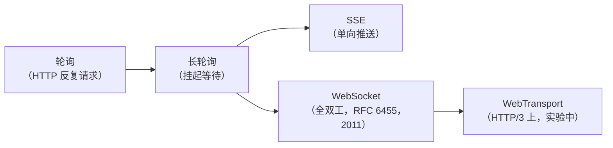
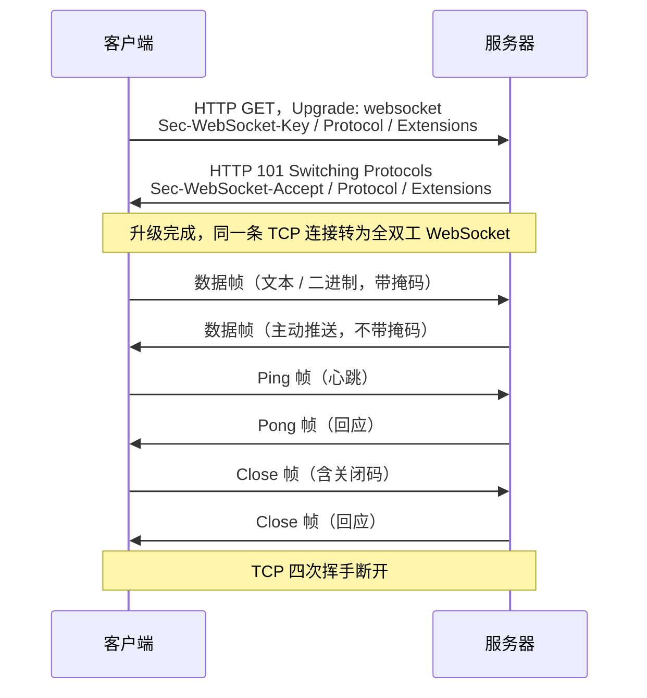
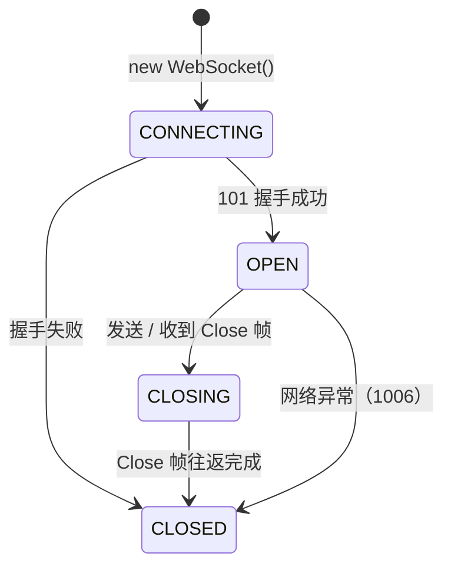
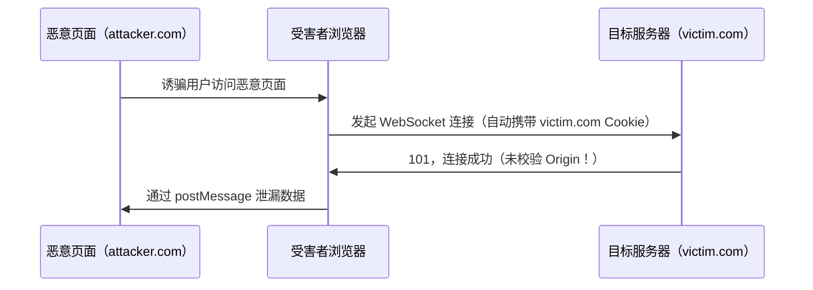
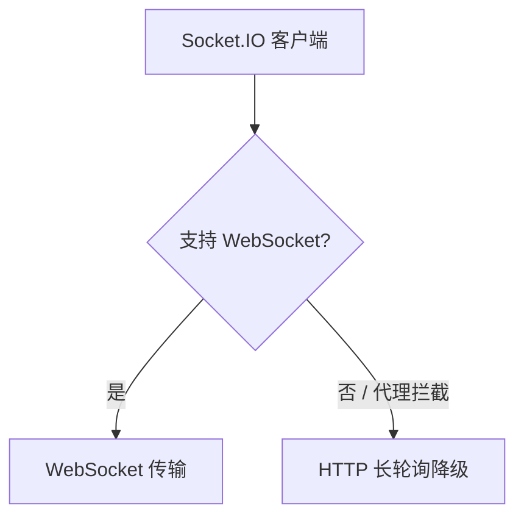

# 详解网络协议(十九)WebSocket协议

> [!abstract] 速览
> **WebSocket（RFC 6455）** 在**单条 [[13.TCP协议|TCP]] 连接**上实现**全双工、持久、低开销**通信。它借 [[18.HTTP-HTTPS协议|HTTP]] 握手（`101 Switching Protocols`）完成后**升级**为 WebSocket，从此服务器可**主动推送**，彻底解决 HTTP 轮询的实时性痛点。`ws://`（明文）/ `wss://`（over [[15.TLS协议|TLS]]）。
> PDU：**帧（Frame）**。
> 口诀：**"借 HTTP 手，换 WebSocket 身，帧来帧往，全双工常通。"**

---

## 1. 为什么需要 WebSocket

[[18.HTTP-HTTPS协议|HTTP]] 是请求-响应的，**服务器无法主动推送**。要实时更新只能：

- **轮询（Polling）**：客户端定时狂问"有新消息吗"——带宽浪费、延迟高；
- **长轮询（Long Polling）**：请求挂起到有数据才返回——稍好，但仍是一来一回，且并发连接数居高不下；
- **SSE（Server-Sent Events）**：服务器单向推送，无法上传数据，适合只读场景。

WebSocket 只握手一次，之后**双向常通**，实时性与开销都最优。典型场景：在线聊天、协作文档、实时行情、多人游戏、IoT 遥测。

### 技术演进视角



---

## 2. 握手：从 HTTP 升级

WebSocket 握手完整依赖 [[18.HTTP-HTTPS协议|HTTP/1.1]] 的 `Upgrade` 机制（RFC 7230 §6.7）。

### 2.1 握手报文示例

客户端请求：

```
GET /chat HTTP/1.1
Host: server.example.com
Upgrade: websocket
Connection: Upgrade
Sec-WebSocket-Key: dGhlIHNhbXBsZSBub25jZQ==
Sec-WebSocket-Version: 13
Sec-WebSocket-Protocol: chat, superchat
Sec-WebSocket-Extensions: permessage-deflate; client_max_window_bits
Origin: http://example.com
```

服务器响应：

```
HTTP/1.1 101 Switching Protocols
Upgrade: websocket
Connection: Upgrade
Sec-WebSocket-Accept: s3pPLMBiTxaQ9kYGzzhZRbK+xOo=
Sec-WebSocket-Protocol: chat
Sec-WebSocket-Extensions: permessage-deflate
```



### 2.2 Sec-WebSocket-Accept 计算（重点）

> [!note] 握手安全校验算法
> 目的：**证明服务器真正理解 WebSocket 协议**，防止不支持 WebSocket 的 HTTP 服务器或代理意外完成握手。

计算步骤（RFC 6455 §4.2.2）：

1. 取客户端发来的 `Sec-WebSocket-Key`（一个随机 16 字节的 Base64 字符串）；
2. 拼接固定魔法字符串（Magic GUID）：`258EAFA5-E914-47DA-95CA-C5AB0DC85B11`；
3. 对拼接结果做 **SHA-1**，得到 20 字节摘要；
4. 将摘要做 **Base64 编码**，填入 `Sec-WebSocket-Accept`。

| 步骤 | 值 |
|---|---|
| 客户端 Key | `dGhlIHNhbXBsZSBub25jZQ==` |
| 拼接后字符串 | `dGhlIHNhbXBsZSBub25jZQ==258EAFA5-E914-47DA-95CA-C5AB0DC85B11` |
| SHA-1（hex） | `b3 7a 4f 2c c0 62 4f 16 90 f6 46 06 cf 38 59 45 b2 be c4 ea` |
| Base64（即 Accept） | `s3pPLMBiTxaQ9kYGzzhZRbK+xOo=` |

```js
// Node.js 示例：服务器端计算 Sec-WebSocket-Accept
const crypto = require('crypto');
const key = req.headers['sec-websocket-key'];
const GUID = '258EAFA5-E914-47DA-95CA-C5AB0DC85B11';
const accept = crypto.createHash('sha1').update(key + GUID).digest('base64');
```

> [!warning] 常见误区
> GUID 与 SHA-1 不是为了加密，而是**协议合规性校验**。只有代码里写死了这个 GUID 的服务器才能正确响应，防止任意 HTTP 服务器误当 WebSocket 服务器使用。

### 2.3 子协议协商（Sec-WebSocket-Protocol）

客户端在请求头里列出**自己支持的子协议**（逗号分隔），服务器**选择其中一个**回填。子协议是应用层约定，如 `chat`、`stomp`、`graphql-ws`、`mqtt`，**WebSocket 协议层不做解析**，只是透传协商结果。

| 角色 | 行为 |
|---|---|
| 客户端 | 发送 `Sec-WebSocket-Protocol: chat, superchat` |
| 服务器 | 选一个回填 `Sec-WebSocket-Protocol: chat`；若不支持任何一个则**省略该头**或拒绝握手 |

### 2.4 扩展协商（Sec-WebSocket-Extensions）

扩展修改 WebSocket 帧的处理方式（如压缩）。最常见的是 **`permessage-deflate`**（RFC 7692）——对消息内容做 DEFLATE 压缩，利用 RSV1 位标识压缩帧。

```
Sec-WebSocket-Extensions: permessage-deflate; client_max_window_bits
```

- `client_max_window_bits`：客户端 DEFLATE 窗口位数（8–15），省略默认由服务器决定。
- 服务器回填协商后的参数；不支持则省略该头。

---

## 3. 数据帧格式逐字段详解

WebSocket 数据以**帧（Frame）**为单位传输（RFC 6455 §5.2）。帧头最小 2 字节，最大 14 字节。

### 3.1 帧结构（bit 级）

```
 0                   1                   2                   3
 0 1 2 3 4 5 6 7 8 9 0 1 2 3 4 5 6 7 8 9 0 1 2 3 4 5 6 7 8 9 0 1
+-+-+-+-+-------+-+-------------+-------------------------------+
|F|R|R|R| opcode|M| Payload len |    Extended payload length    |
|I|S|S|S|  (4)  |A|     (7)    |             (16/64)           |
|N|V|V|V|       |S|             |   (if payload len==126/127)   |
| |1|2|3|       |K|             |                               |
+-+-+-+-+-------+-+-------------+ - - - - - - - - - - - - - - -+
|     Extended payload length continued, if payload len == 127  |
+ - - - - - - - - - - - - - - -+-------------------------------+
|                               |Masking-key, if MASK set to 1  |
+-------------------------------+-------------------------------+
| Masking-key (continued)       |          Payload Data         |
+-------------------------------- - - - - - - - - - - - - - - -+
:                     Payload Data continued ...                :
+---------------------------------------------------------------+
```

### 3.2 各字段说明

| 字段 | 位数 | 说明 |
|---|---|---|
| **FIN** | 1 bit | `1` = 这是消息的**最后一帧**（或唯一帧）；`0` = 还有后续分片 |
| **RSV1** | 1 bit | 保留；`permessage-deflate` 扩展用此位标识**压缩帧** |
| **RSV2** | 1 bit | 保留，必须为 `0`（未协商扩展时） |
| **RSV3** | 1 bit | 保留，必须为 `0`（未协商扩展时） |
| **opcode** | 4 bit | 帧类型，见下表 |
| **MASK** | 1 bit | `1` = 帧已掩码（客户端→服务器必须为 `1`）；`0` = 未掩码 |
| **Payload len** | 7 bit | `0–125`：直接是载荷长度；`126`：接下来 2 字节（16 bit）为实际长度；`127`：接下来 8 字节（64 bit）为实际长度 |
| **Masking-key** | 0 或 32 bit | 仅当 MASK=1 时存在；4 字节随机值，用于 XOR 掩码运算 |
| **Payload Data** | 变长 | 应用数据（掩码时 = 原始数据 XOR 掩码循环） |

### 3.3 帧类型（opcode）完整表

| opcode | 类型 | 分类 | 说明 |
|---|---|---|---|
| `0x0` | Continuation | 数据帧 | 分片消息的续帧（不含首帧） |
| `0x1` | Text | 数据帧 | UTF-8 文本数据 |
| `0x2` | Binary | 数据帧 | 任意二进制数据 |
| `0x3–0x7` | 保留 | — | 未来数据帧使用 |
| `0x8` | Close | 控制帧 | 关闭连接；可携带 2 字节关闭状态码 + 原因字符串 |
| `0x9` | Ping | 控制帧 | 心跳探测；对端必须回 Pong |
| `0xA` | Pong | 控制帧 | 回应 Ping；也可主动发送（Unsolicited Pong） |
| `0xB–0xF` | 保留 | — | 未来控制帧使用 |

### 3.4 分片消息（Message Fragmentation）

大消息可拆分为多帧传输，便于流式处理、避免阻塞控制帧：

```
帧1：FIN=0, opcode=0x1（Text），payload="Hello "
帧2：FIN=0, opcode=0x0（Continuation），payload="World"
帧3：FIN=1, opcode=0x0（Continuation），payload="!"
```

- **首帧**：`FIN=0`，opcode 为实际类型（`0x1` 或 `0x2`）；
- **中间帧**：`FIN=0`，opcode=`0x0`（Continuation）；
- **末帧**：`FIN=1`，opcode=`0x0`。
- **控制帧**（Close/Ping/Pong）**不可分片**，载荷 ≤ 125 字节，必须能插入分片消息之间处理。

> [!tip] 点睛
> FIN=1 且 opcode≠0 → 不分片的完整消息（最常见）。
> FIN=0 → 一定是分片中的非末帧。
> 末帧：FIN=1 且 opcode=0x0。

---

## 4. 掩码（Masking）机制深解

### 4.1 规则

- **客户端 → 服务器**：帧的 MASK 位 **必须为 1**，携带 4 字节随机 Masking-key，Payload 与之做循环 XOR。
- **服务器 → 客户端**：MASK 位 **必须为 0**，不做掩码。

掩码运算（RFC 6455 §5.3）：

```
masked_byte[i] = original_byte[i] XOR masking_key[i % 4]
```

### 4.2 为什么客户端帧必须掩码

> [!note] 设计动机：防止缓存投毒（Cache Poisoning）
> 如果没有掩码，恶意网页可以精心构造 WebSocket 数据，使其看起来像一个 HTTP 响应（例如 `HTTP/1.1 200 OK\r\n...`）。中间透明代理将该数据错误缓存，后续其他用户请求时被返回假数据——这就是**缓存投毒攻击**。
> 掩码的 4 字节随机 key 由**客户端每帧随机生成**，使攻击者无法预测 XOR 结果，从根本上打乱了可构造特定字节序列的可能性。

> [!warning]
> 掩码不是加密，不提供保密性。明文 `ws://` 传输时，中间人可以拿到 Masking-key（帧头明文携带），轻易还原 Payload。**加密必须用 `wss://`**（over [[15.TLS协议|TLS]]）。

---

## 5. 控制帧详解

### 5.1 Close 帧（0x8）与关闭状态码

关闭握手：任一方发 Close 帧 → 对端回 Close 帧 → 发起方关闭 TCP 连接。

Close 帧 Payload 格式：
- **前 2 字节**（可选）：16 bit 大端无符号整数，为**关闭状态码**；
- **后续字节**（可选）：UTF-8 关闭原因文本（≤ 123 字节，与 2 字节码共享 ≤125 字节限制）。

| 状态码 | 名称 | 含义 |
|---|---|---|
| `1000` | Normal Closure | 正常关闭，任务完成 |
| `1001` | Going Away | 端点离开（浏览器导航离开 / 服务器重启） |
| `1002` | Protocol Error | 协议层错误（如收到非法帧） |
| `1003` | Unsupported Data | 收到不支持的数据类型（如纯文本端点收到二进制） |
| `1005` | No Status（保留） | 不可在帧中发送，仅本地使用（表示无状态码） |
| `1006` | Abnormal Closure（保留） | **不可在帧中发送**，连接异常断开时本地产生 |
| `1007` | Invalid Frame Payload Data | 数据不符合类型约定（如 Text 帧含非法 UTF-8） |
| `1008` | Policy Violation | 违反策略（通用错误） |
| `1009` | Message Too Big | 消息超出端点处理上限 |
| `1010` | Mandatory Extension | 客户端要求的扩展未被服务器支持 |
| `1011` | Internal Server Error | 服务器遇到意外情况无法完成请求 |

> [!note] 1006 特殊说明
> 状态码 `1006` **永远不出现在 Close 帧里**——它是本地生成的虚拟码，表示连接在没有 Close 帧的情况下异常断开（TCP 直接断了）。排查日志时见到 1006 基本等于"网络中断或进程崩溃"。

### 5.2 Ping / Pong 帧（0x9 / 0xA）

- 任一端均可发 Ping；收到 Ping **必须尽快回 Pong**，Pong 的 Payload 须与 Ping 相同；
- Pong 也可**主动发送**（Unsolicited Pong），仅用于通知存活，无需 Ping 触发；
- Ping/Pong 载荷 **≤ 125 字节**，不可分片。

---

## 6. 连接管理与状态机

### 6.1 状态转换



| 状态 | readyState | 含义 |
|---|---|---|
| `CONNECTING` | 0 | 正在建立连接（握手中） |
| `OPEN` | 1 | 连接已建立，可收发数据 |
| `CLOSING` | 2 | 关闭握手进行中 |
| `CLOSED` | 3 | 连接已关闭 |

### 6.2 心跳与重连

**为什么需要应用层心跳？**  
NAT/防火墙对长时间无数据的 TCP 连接会**静默超时清除映射**，WebSocket 连接看似 OPEN 实际已死（Half-Open）。[[13.TCP协议|TCP]] Keepalive 默认 2 小时，对短命 NAT（30 秒–5 分钟）来说太慢。

**推荐做法：Ping/Pong 探活**

```
服务端每 30 秒向客户端发 Ping 帧
    → 客户端自动回 Pong（浏览器原生支持）
    → 超过 N 次未回应 → 判定连接死亡 → 关闭并重连
```

**客户端指数退避重连（Exponential Backoff）**

```js
let retryDelay = 1000; // 初始 1 秒
const MAX_DELAY = 30000;

function connect() {
    const ws = new WebSocket('wss://example.com/ws');
    ws.onclose = (e) => {
        if (e.code !== 1000) { // 非正常关闭才重连
            setTimeout(() => {
                retryDelay = Math.min(retryDelay * 2, MAX_DELAY);
                connect();
            }, retryDelay + Math.random() * 1000); // 加随机抖动防雪崩
        }
    };
    ws.onopen = () => { retryDelay = 1000; }; // 连接成功后重置
}
```

> [!tip] 口诀
> **Ping 探活，Pong 回答，超时重连加退避，随机抖动防雪崩。**

---

## 7. 子协议与扩展

### 7.1 常用子协议

| 子协议 | 场景 | 说明 |
|---|---|---|
| `chat` | 聊天室 | 自定义，示例用 |
| `stomp` | 消息队列 | STOMP over WebSocket，兼容 ActiveMQ/RabbitMQ |
| `graphql-ws` | GraphQL 订阅 | Apollo/Hasura 使用 |
| `mqtt` | IoT 设备 | MQTT over WebSocket（端口 443） |
| `v10.stomp` | Spring WebSocket | Spring Boot 默认 |

### 7.2 permessage-deflate 压缩扩展（RFC 7692）

该扩展用 RSV1 位标识"此帧 Payload 经过 DEFLATE 压缩"：

- 每条消息（可跨多帧）做 DEFLATE 压缩；
- 双方可选择**保留 DEFLATE 上下文**（`no_context_takeover` 参数控制），跨消息复用窗口，压缩率更高但内存占用更大；
- 对 JSON 文本效果显著（通常压缩率 60–80%）；对已压缩的二进制（图片、视频）无效。

协商示例：

```
# 客户端请求：
Sec-WebSocket-Extensions: permessage-deflate; client_max_window_bits

# 服务器接受（不限制窗口大小）：
Sec-WebSocket-Extensions: permessage-deflate
```

---

## 8. 安全

### 8.1 wss:// — WebSocket over TLS

`wss://` 即 WebSocket 运行在 [[15.TLS协议|TLS]] 之上，与 `https://` 共享加密握手机制：
- 先完成 TLS 握手 → 再做 WebSocket HTTP 握手 → 升级为加密 WebSocket；
- 所有 WebSocket 帧均在 TLS Record 层加密传输，中间人无法读取 Payload，也无法伪造或篡改；
- 生产环境**必须使用 wss://**，`ws://` 明文在 HTTPS 页面中会被浏览器拒绝（混合内容限制）。

### 8.2 Origin 校验

WebSocket 握手**不受同源策略（SOP）保护**——浏览器可以向任意域发起 WebSocket 连接，并携带该域的 Cookie/Session。服务器必须在握手时**主动验证 `Origin` 头**：

```python
# FastAPI / Python 示例
@app.websocket("/ws")
async def ws_endpoint(websocket: WebSocket):
    origin = websocket.headers.get("origin")
    if origin not in ALLOWED_ORIGINS:
        await websocket.close(code=1008)  # Policy Violation
        return
    await websocket.accept()
```

### 8.3 跨站 WebSocket 劫持（CSWSH）

**CSWSH（Cross-Site WebSocket Hijacking）** 是 CSRF 的 WebSocket 版本：



防御：
1. **服务器校验 `Origin` 头**（最关键）；
2. 握手时验证 Token（放 query string 或子协议头，见下节）；
3. 避免仅凭 Cookie 做鉴权。

### 8.4 鉴权方式

浏览器发起 WebSocket 握手时**无法自定义请求头**（`fetch`/`XMLHttpRequest` 可以，WebSocket API 不行），因此不能直接传 `Authorization: Bearer <token>`。常见变通方案：

| 方式 | 做法 | 优缺点 |
|---|---|---|
| **Query String** | `wss://example.com/ws?token=xxx` | 简单；Token 可能出现在日志/代理中（安全性稍差） |
| **子协议头** | `Sec-WebSocket-Protocol: token-value` | 不出现在 URL 日志中；需服务端解析 |
| **Cookie（Session）** | 依赖 `Cookie` 自动携带 | 适合传统 Web；必须配合 CSRF/Origin 校验 |
| **首条消息鉴权** | 连接后立即发含 Token 的 JSON 消息 | 最灵活；未鉴权窗口极短，需服务端超时断连 |

---

## 9. 穿过反向代理与负载均衡

### 9.1 Nginx 配置要点

Nginx 默认使用 HTTP/1.0，**不透传 `Upgrade`/`Connection` 头**，需显式配置：

```nginx
location /ws {
    proxy_pass http://backend;
    proxy_http_version 1.1;
    proxy_set_header Upgrade $http_upgrade;
    proxy_set_header Connection "Upgrade";
    proxy_set_header Host $host;
    proxy_read_timeout 3600s;   # 长连接不要被 60s 超时断掉
    proxy_send_timeout 3600s;
}
```

- `proxy_http_version 1.1`：HTTP/1.0 不支持 `Upgrade`，必须升级；
- `proxy_read_timeout`：默认 60 秒，WebSocket 长连接必须调大（或靠心跳刷新）；
- Nginx 1.3.13+ 原生支持 WebSocket 代理。

### 9.2 负载均衡与粘性会话（Sticky Session）

WebSocket 是有状态的**持久连接**，每个连接分配给一台后端实例后**不能切换**。若负载均衡器每次请求都重新路由，连接会被断开。

解决方案：

| 策略 | 实现方式 | 说明 |
|---|---|---|
| **IP Hash** | Nginx `ip_hash` | 同 IP 固定到同一后端；NAT 场景负载不均 |
| **Cookie 粘性** | HAProxy `cookie`、AWS ALB stickiness | 更精准；推荐方式 |
| **共享状态** | Redis Pub/Sub 等 | 后端无状态，消息广播走消息总线，最可扩展 |

> [!note]
> 水平扩展 WebSocket 服务的最佳实践：用 Redis Pub/Sub 或 Kafka 做消息总线，各节点只维护本机连接池，跨节点消息通过总线转发，从根本上消除对粘性会话的依赖。

### 9.3 Socket.IO 与 WebSocket 的关系

**Socket.IO 不是协议，是库**。它在 WebSocket 之上封装了：

- **握手降级（Fallback）**：先尝试 WebSocket，若被代理拦截则自动降为 HTTP 长轮询；
- **命名空间（Namespace）/ 房间（Room）**：逻辑分组；
- **自动重连**、**事件 ACK 机制**。



> [!warning]
> Socket.IO 的握手路径（`/socket.io/`）和协议头与纯 WebSocket 不兼容，不能用原生 `WebSocket` 对象直接连 Socket.IO 服务器。选型时需统一。

---

## 10. 与同类技术对比

| 技术 | 方向 | 实时性 | 开销 | 全双工 | 浏览器支持 | 备注 |
|---|---|---|---|---|---|---|
| HTTP 轮询 | 客户端拉 | 差 | 高（频繁请求） | 否 | 全部 | 最简单，不推荐实时场景 |
| 长轮询 | 客户端拉（挂起） | 中 | 中 | 否 | 全部 | 无 WebSocket 时的兜底 |
| SSE（Server-Sent Events） | 服务器→客户端（单向） | 好 | 低 | 否 | IE 不支持 | 适合只读推送（新闻、日志流） |
| **WebSocket** | **双向** | **最好** | **低（持久连接）** | **是** | **IE10+** | 通用实时双向通信首选 |
| HTTP/2 Server Push | 服务器→客户端（单向） | 好 | 低 | 否 | 现代浏览器 | 用于推送关联资源，非通用推送 |
| WebTransport | 双向 | 极好 | 极低（基于 QUIC） | 是 | Chrome 97+（实验） | HTTP/3 上，支持多路复用流 \| 数据报，未全面普及 |

---

## 11. 常见误区辨析

> [!warning] 常见误区
> 1. **"握手用 HTTP，之后也是 HTTP"** — 错。握手完成后帧格式是 WebSocket 私有帧，与 HTTP 无关，`Content-Type` 等 HTTP 语义消失。
> 2. **"客户端帧必须掩码是为了加密"** — 错。掩码仅防止恶意数据污染中间代理缓存（缓存投毒），掩码 key 是明文传输的，无保密性。
> 3. **"ws:// 也安全，只要用内网"** — 弱假设。内网不代表没有恶意代理或抓包工具，生产环境统一 `wss://`。
> 4. **"只要建立 WebSocket 就不需要鉴权"** — 错。连接建立后仍需鉴权（握手 Token 或首条消息鉴权），防止未授权客户端接入。
> 5. **"Origin 校验可以放在应用层消息里做"** — 不够及时，应在握手阶段（HTTP 层）就拒绝，避免 TCP 资源被占用。
> 6. **"状态码 1006 出现在 Close 帧里"** — 错。1006 是本地产生的保留码，永远不在帧中传输。
> 7. **"Socket.IO = WebSocket"** — 错。Socket.IO 是封装库，含降级逻辑，与原生 WebSocket 不兼容。

---

## 12. 面试高频考点

| 问题 | 要点 |
|---|---|
| WebSocket 握手为什么用 HTTP？ | 借用 HTTP 的端口（80/443）穿防火墙，复用 HTTP 升级机制（RFC 7230）；握手后立刻脱离 HTTP |
| Sec-WebSocket-Accept 如何计算？ | Key + Magic GUID → SHA-1 → Base64；防止非 WebSocket HTTP 服务器误响应 |
| 为什么客户端帧要掩码？ | 防缓存投毒；服务器收到未掩码帧应关闭连接（1002） |
| WebSocket 如何实现心跳？ | 服务器定期发 Ping，客户端自动回 Pong；超时未收 Pong 则主动关闭重连 |
| WebSocket 与 SSE 如何选型？ | 需要上行数据（如聊天）→ WebSocket；纯服务器推送（如通知流）→ SSE 更简单 |
| 大消息如何处理？ | 分片帧（首帧非 0x0 opcode + FIN=0，续帧 opcode=0x0，末帧 FIN=1）|
| WebSocket 如何鉴权？ | Query String Token / Cookie + Origin 校验 / 首条消息鉴权；握手阶段无法自定义请求头 |
| Nginx 代理 WebSocket 必须配什么？ | `proxy_http_version 1.1`，转发 `Upgrade` 和 `Connection` 头，调大 `proxy_read_timeout` |

---

## 延伸阅读

- 握手所依赖：[[18.HTTP-HTTPS协议]]
- 加密：[[15.TLS协议]]（wss）　承载：[[13.TCP协议]]
- 所属层：[[09.应用层]]

> ⬅️ [[18.HTTP-HTTPS协议]] ｜ 🏠 [[00.网络协议详解总览]] ｜ [[20.FTP-TFTP-SFTP协议]] ➡️
