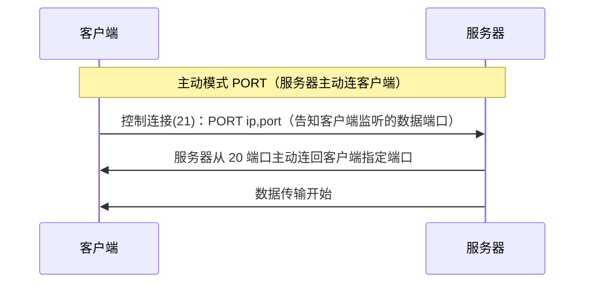
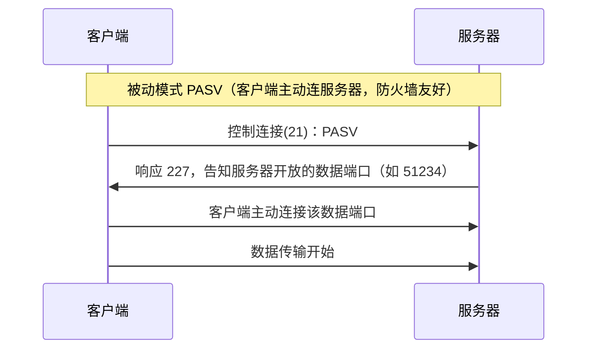
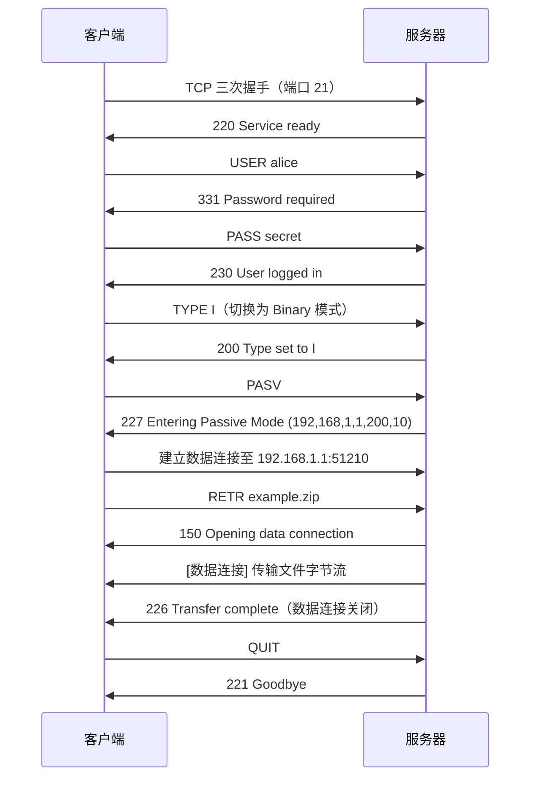
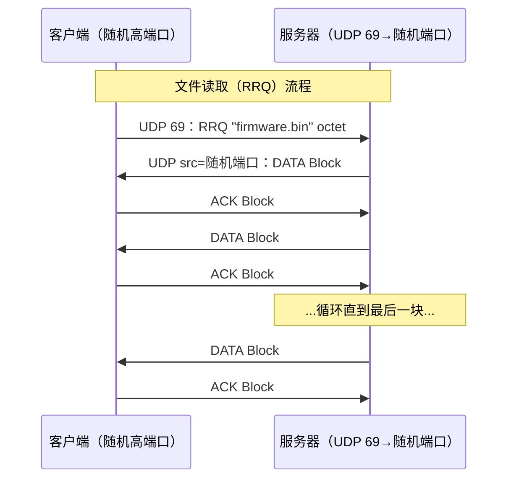
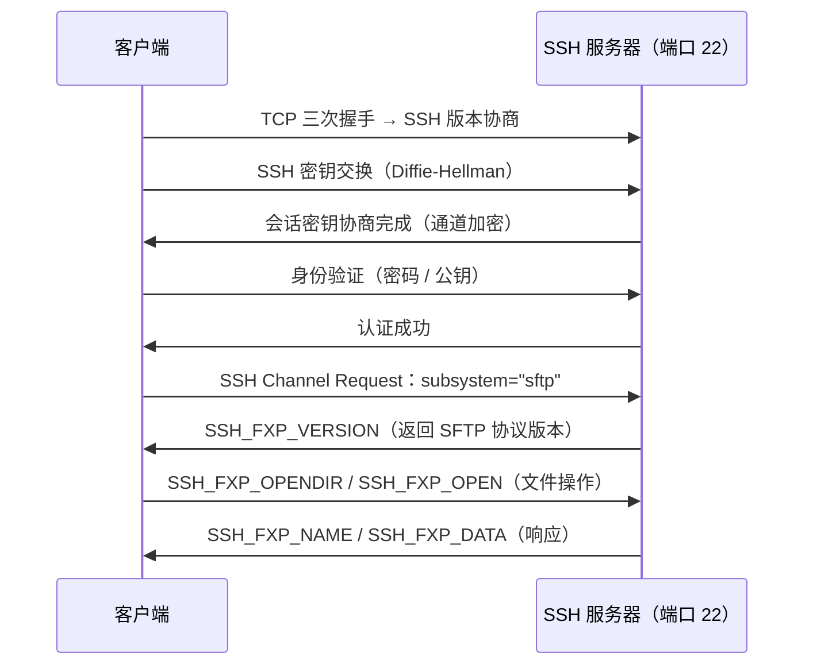
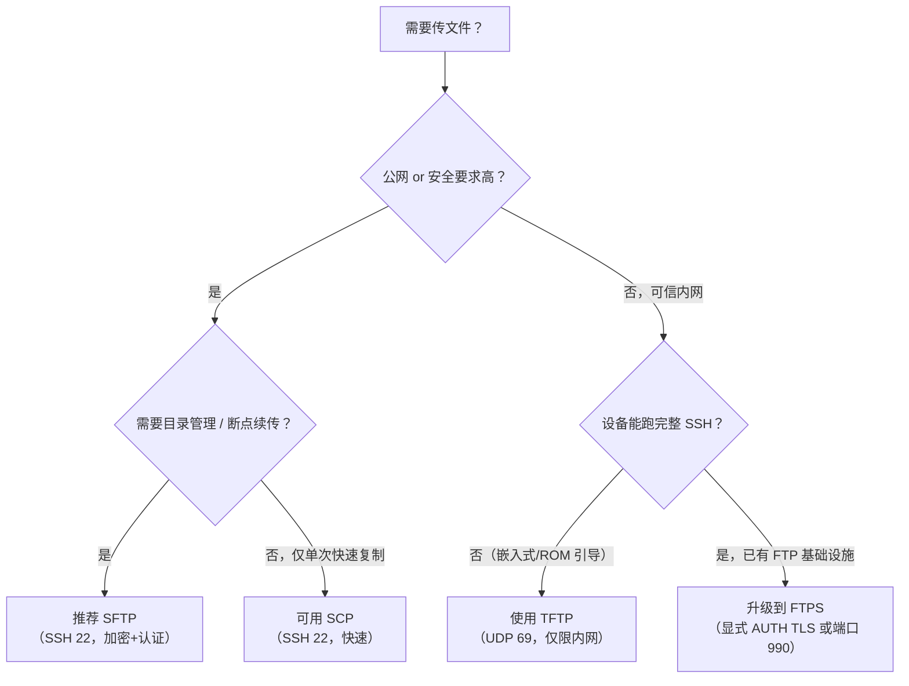

# 详解网络协议(二十)FTP/TFTP/SFTP协议

> [!abstract] 速览
> 三种文件传输协议，定位迥异：**FTP**（TCP、双连接、功能全但**明文**）、**TFTP**（UDP、极简、无认证，用于固件/引导）、**SFTP**（跑在 [[21.SSH协议|SSH]] 之上，**加密 + 强认证**）。
> ⚠️ 关键：**SFTP ≠ FTPS**——SFTP 是 SSH 的子系统，与 FTP **毫无血缘**；FTPS 才是"FTP + [[15.TLS协议|TLS]]"。

## 1. 三者速览

| 特性 | FTP | TFTP | SFTP |
| --- | --- | --- | --- |
| 传输层 | [[13.TCP协议\|TCP]] | [[16.UDP协议\|UDP]] | TCP（经 [[21.SSH协议\|SSH]]） |
| 端口 | 21（控制）/ 20（数据） | 69 | 22 |
| 安全 | 明文 | 明文 | 加密 |
| 认证 | 用户名/密码 | 无 | 强（密码 / 公钥） |
| 复杂度 | 复杂 | 简单 | 中等 |
| 场景 | 通用文件传输 | 固件升级 / PXE | 安全文件传输 |

## 2. FTP：控制连接 + 数据连接

FTP（File Transfer Protocol，RFC 959）最特别之处是**两条 [[13.TCP协议|TCP]] 连接并行工作**：

- **控制连接（端口 21）**：全程保持，传输命令与响应，纯文本交互。
- **数据连接（端口 20 或动态端口）**：按需建立，专门传输文件本体或目录列表，传输完成后关闭。

> [!tip] 点睛口诀
> "21 管命令，20 传数据；命令活到底，数据用完关。"

### 2.1 主动模式（PORT）与被动模式（PASV）

两种连接模式的区别在于**数据连接由谁发起**：





> **为什么常用被动模式？** 主动模式下服务器要反向连客户端，常被客户端的防火墙 / NAT 拦截；被动模式改为"客户端主动连服务器"，更友好。

### 2.2 IPv6 扩展：EPRT / EPSV（RFC 2428）

原始的 `PORT` 和 `PASV` 命令只支持 IPv4 地址（32 位固定长度）。RFC 2428 引入了两个扩展命令以支持 IPv6 和 NAT 穿越：

| 旧命令 | 新命令 | 模式 | 格式示例 |
| --- | --- | --- | --- |
| `PORT` | `EPRT` | 主动模式 | `EPRT \|2\|::1\|5282\|`（AF=2 表示 IPv6） |
| `PASV` | `EPSV` | 被动模式 | 响应码 229，只返回端口号 |

`EPRT` 格式：`EPRT |<AF编号>|<地址>|<端口>|`，AF 编号 1=IPv4，2=IPv6。`EPSV` 响应只含端口，地址隐式复用控制连接的地址，NAT 友好性更佳。

### 2.3 传输模式：ASCII 文本模式 vs Binary 二进制模式

| 维度 | ASCII 模式（Type A） | Binary / Image 模式（Type I） |
| --- | --- | --- |
| 适用对象 | 纯文本文件 | 二进制文件、图片、压缩包 |
| 换行处理 | 自动转换（`\r\n` ↔ `\n`） | 原样传输，不做任何转换 |
| 跨平台风险 | Windows ↔ Unix 换行可自动适配 | 文本文件跨平台可能出现乱行 |
| 文件完整性 | 可能改变字节内容 | 字节完全一致，推荐默认 |
| FTP 命令 | `TYPE A` | `TYPE I` |

> [!warning] 误区警示
> 用 ASCII 模式传二进制文件（如 `.exe`、`.zip`、图片）会导致文件损坏，因为协议会把所有 `0x0D 0x0A` 字节序列当成换行符处理。**上传二进制文件务必切换到 Binary 模式**。

### 2.4 常用命令与响应码

**常用客户端命令**：

| 命令 | 作用 |
| --- | --- |
| `USER` / `PASS` | 发送用户名 / 密码 |
| `PORT` / `PASV` | 切换主动 / 被动模式 |
| `EPRT` / `EPSV` | IPv6 扩展的主动 / 被动模式 |
| `TYPE A` / `TYPE I` | 切换为 ASCII / Binary 传输模式 |
| `LIST` / `NLST` | 列目录（详细 / 仅文件名） |
| `RETR` | 从服务器下载文件（Retrieve） |
| `STOR` | 向服务器上传文件（Store） |
| `APPE` | 追加上传（不覆盖，附加到末尾） |
| `REST` | 断点续传，指定偏移量 |
| `CWD` / `PWD` | 切换目录 / 查看当前目录 |
| `MKD` / `RMD` | 创建 / 删除目录 |
| `DELE` | 删除远程文件 |
| `RNFR` / `RNTO` | 重命名（From / To 分两步） |
| `QUIT` | 退出连接 |
| `AUTH TLS` | 升级到 TLS 加密（FTPS 显式模式） |

**FTP 响应码体系**（三位数字，首位决定大类）：

| 首位 | 类别 | 含义 |
| --- | --- | --- |
| 1xx | 初步回复 | 命令已接受，请继续（动作尚未完成） |
| 2xx | 成功完成 | 命令成功执行 |
| 3xx | 中间状态 | 命令被接受，但需要进一步信息 |
| 4xx | 暂时失败 | 命令未执行，可稍后重试 |
| 5xx | 永久失败 | 命令未执行，不要重试 |

**高频响应码举例**：

| 响应码 | 英文含义 | 典型触发场景 |
| --- | --- | --- |
| `220` | Service ready for new user | 连接建立，服务器就绪欢迎消息 |
| `331` | User name okay, need password | `USER` 命令后，等待密码 |
| `230` | User logged in, proceed | `PASS` 正确，登录成功 |
| `226` | Closing data connection, transfer OK | 文件传输成功，数据连接关闭 |
| `227` | Entering Passive Mode (h1,h2,h3,h4,p1,p2) | `PASV` 响应，含服务器数据端口 |
| `229` | Entering Extended Passive Mode | `EPSV` 响应，含端口号 |
| `350` | Requested file action pending further info | `REST` 断点续传偏移已接受 |
| `421` | Service not available, closing connection | 服务器忙或关闭中 |
| `425` | Can't open data connection | 无法建立数据连接 |
| `550` | Requested action not taken (file unavailable) | 文件不存在或无权限 |
| `553` | Requested action not taken (file name not allowed) | 文件名非法 |

### 2.5 断点续传：REST 命令

FTP 通过 `REST`（Restart）命令支持断点续传：

```
客户端：REST 1048576          ← 告知服务器从第 1 MB（字节偏移）处继续
服务器：350 Restart position accepted
客户端：RETR largefile.iso   ← 紧接着发起下载
服务器：150 Opening data connection...
         226 Transfer complete
```

`REST` 本身不传数据，只是设置偏移量；后续紧跟 `RETR`（下载）或 `STOR`（上传）才真正传输。

### 2.6 FTPS：给 FTP 加上 TLS 外套（RFC 4217）

FTPS（FTP Secure）是在 FTP 基础上叠加 [[15.TLS协议|TLS]] / [[14.SSL协议|SSL]] 加密的方案，**与 SFTP 完全无关**。

| 维度 | 显式模式（FTPES / Explicit） | 隐式模式（Implicit） |
| --- | --- | --- |
| 控制端口 | **21**（与原始 FTP 相同） | **990** |
| 数据端口 | 20 / 动态（可选加密） | 989 / 动态（全程加密） |
| 激活方式 | 先建立明文连接，客户端发送 `AUTH TLS` 升级 | 连接建立即自动 TLS 握手 |
| RFC 标准 | **RFC 4217** 正式定义 | 未在 RFC 中正式定义，属于旧有实现 |
| 向后兼容 | 兼容普通 FTP 客户端 | 必须支持 TLS 的专用客户端 |
| 当前推荐 | **推荐**（RFC 标准、兼容性好） | 不推荐（非标准、逐渐淘汰） |

> [!note] FTPS 显式握手流程（简化）
> 1. 客户端连接 21 端口，服务器返回 `220`；
> 2. 客户端发送 `AUTH TLS`，服务器返回 `234`；
> 3. TLS 握手完成，控制通道加密；
> 4. 客户端可发送 `PBSZ 0` + `PROT P` 要求数据通道也加密；
> 5. 后续所有 FTP 命令均在加密信道上传输。

### 2.7 FTP 完整登录传输时序



## 3. TFTP：极简的 UDP 文件传输

TFTP（Trivial File Transfer Protocol，RFC 1350）是一个刻意简化到极致的文件传输协议，目标是让**极小的嵌入式设备**（ROM 启动引导程序）也能实现文件传输，代码量通常只有几 KB。

基于 **[[16.UDP协议|UDP]] 端口 69**，采用**停止-等待（Stop-and-Wait）**协议：每发一个数据块必须收到 ACK 才能发下一块，任何时刻最多只有一个数据块在网络中"飞行"。

> [!tip] 点睛口诀
> "UDP 69，512 字节一块，收 ACK 再发；最后一块不足 512，传输结束。"

### 3.1 报文格式与操作码

TFTP 只有 5 种报文类型，均以 2 字节操作码开头：

| 操作码 | 报文类型 | 全称 | 用途 |
| --- | --- | --- | --- |
| 1 | **RRQ** | Read Request | 读取文件请求 |
| 2 | **WRQ** | Write Request | 写入文件请求 |
| 3 | **DATA** | Data | 传输数据块 |
| 4 | **ACK** | Acknowledgment | 确认数据块 |
| 5 | **ERROR** | Error | 传输错误通知 |

**各报文格式**：

```
RRQ / WRQ：  | 2B Opcode | Filename\0 | Mode\0 |
             Mode：netascii / octet / mail

DATA：        | 2B Opcode | 2B Block# | 0~512B Data |

ACK：         | 2B Opcode | 2B Block# |
              WRQ 的初始确认块号为 0

ERROR：       | 2B Opcode | 2B ErrorCode | ErrMsg\0 |
```

**常见错误码**：

| 错误码 | 含义 |
| --- | --- |
| 0 | 未定义，见错误消息 |
| 1 | 文件未找到（File not found） |
| 2 | 访问被拒绝（Access violation） |
| 3 | 磁盘满或超过分配限额 |
| 4 | 非法 TFTP 操作 |
| 5 | 未知传输 ID |
| 6 | 文件已存在 |
| 7 | 无此用户 |
| 8 | 选项协商终止（RFC 2347 扩展） |

### 3.2 传输时序图



> [!note] 端口细节
> 客户端将 RRQ/WRQ 发送到服务器 UDP 69 端口，但服务器回复时会从一个**新的随机临时端口**发送，后续所有数据包都在这个临时端口对之间交换，避免 69 端口被多个传输占用。

### 3.3 "魔法师学徒综合症"（Sorcerer's Apprentice Syndrome）

这是 TFTP 早期版本（RFC 783）中一个经典的设计缺陷：

**触发场景**：网络延迟导致 DATA 包迟到 → 发送方超时重传 DATA → 接收方收到重复 DATA，发送重复 ACK → 发送方收到重复 ACK，误判为下一块已确认，再次发送 → 数据包数量**指数级翻倍**，形成"雪崩"。

**RFC 1350 修复方案**：收到重复 ACK 时**不再重发**数据块，只在自身超时计时器触发时才重传。一句话：**"忽略重复 ACK，只认超时重传"**。

### 3.4 选项扩展（RFC 2347 / 2348 / 2349）

原始 TFTP 固定 512 字节块大小在高速网络下效率极低；三个扩展 RFC 引入了**选项协商**机制，向后兼容：

| RFC | 选项名 | 作用 | 典型值 |
| --- | --- | --- | --- |
| RFC 2347 | 框架 | 定义选项协商机制与 **OACK** 包类型 | — |
| RFC 2348 | `blksize` | 协商数据块大小（仅数据部分，不含4B头） | 8~65464 字节 |
| RFC 2349 | `timeout` | 协商超时重传间隔 | 1~255 秒 |
| RFC 2349 | `tsize` | 预告文件大小（RRQ 填 0，服务器 OACK 中返回实际值） | 字节数 |

**选项协商流程**：

```
客户端：RRQ "kernel.img" octet blksize=1468 tsize=0
服务器：OACK blksize=1468 tsize=5242880   ← 服务器确认选项，返回文件大小
客户端：ACK Block#0                        ← 确认 OACK，开始传输
服务器：DATA Block#1（1468 字节）
...
```

服务器在 OACK 中**只能包含客户端明确请求的选项**，不可自行添加。不支持的选项直接省略，而非报错。

> [!tip] 性能效益
> 将块大小从 512 字节提升到 1468 字节（接近以太网 MTU 1500 - 20B IP - 8B UDP - 4B TFTP头），数据包数量降为原来的 1/3，ACK 往返次数同比减少，传输速度大幅提升。

### 3.5 TFTP 适用场景与局限

**适合**：

- 网络设备固件升级（交换机、路由器、AP 等）
- PXE（Preboot eXecution Environment）无盘网络引导
- 嵌入式系统无法负担 FTP/SSH 代码体积时
- 可信内网的轻量文件分发

**局限**：

- **无认证、无加密**，任何人都能读写（若服务器未限制来源 IP）
- 停止-等待机制吞吐率受限于延迟（即使加 `blksize` 扩展，仍无滑动窗口）
- 块号 2 字节最大 65535，默认 512B 块下最大传 65535×512≈32 MB；用 `blksize` 扩展后可突破此限（RFC 2347 未限制重绕处理，实现有差异）

## 4. SFTP：基于 SSH 的安全传输

SFTP（SSH File Transfer Protocol）作为 [[21.SSH协议|SSH]] 的一个**具名子系统（named subsystem）**运行在 **22** 端口，完全复用 SSH 的加密通道与认证体系。其规范来自 IETF 草案 `draft-ietf-secsh-filexfer`（未正式成为 RFC，但版本 3 是事实标准）。

> [!note] 架构关系
> SFTP 不是 FTP 的变体，它是一个**全新的二进制协议**，通过 SSH 通道的"子系统"机制启动（SSH `channel request` 中 `subsystem name = "sftp"`）。与 FTP 唯一的共同点是"都能传文件"。

### 4.1 SFTP 与 SCP 的对比

SCP（Secure Copy）同样基于 SSH，两者常被混淆：

| 对比维度 | SCP | SFTP |
| --- | --- | --- |
| 底层协议 | SSH | SSH |
| 加密认证 | 与 SSH 相同 | 与 SSH 相同 |
| **断点续传** | **不支持** | **支持**（单文件续传） |
| **目录操作** | 仅递归复制 | 完整增删改查（`ls`/`rm`/`mkdir`/`rename`...） |
| **交互式会话** | 无 | 类 FTP 的交互命令行 |
| 跨远程机复制 | 支持（`scp A B:path` 到 `C:path`） | 不支持 |
| 传输速度 | 通常较快（协议更简单） | 稍慢（完整的请求-响应协议） |
| 典型用途 | 快速单次文件复制 | 文件管理、自动化脚本、断点续传 |

### 4.2 SFTP 常用交互命令

SFTP 客户端提供类 FTP 的交互式会话（命令大小写不敏感）：

| 命令 | 作用 |
| --- | --- |
| `ls` / `dir` | 列出远程目录 |
| `cd <dir>` | 切换远程目录 |
| `pwd` | 显示远程当前目录 |
| `lcd` / `lpwd` | 切换/显示本地目录 |
| `get <remote> [local]` | 下载文件（`-r` 递归，`-P` 保留权限时间） |
| `put <local> [remote]` | 上传文件 |
| `reget` / `reput` | 断点续传（继续未完成的 get/put） |
| `rm <file>` | 删除远程文件 |
| `mkdir <dir>` | 创建远程目录 |
| `rmdir <dir>` | 删除远程目录 |
| `rename <old> <new>` | 重命名远程文件/目录 |
| `symlink <old> <new>` | 创建远程符号链接 |
| `chmod <mode> <file>` | 修改远程文件权限 |
| `chown` / `chgrp` | 修改所有者/组 |
| `df` | 查看远程磁盘使用 |
| `bye` / `exit` | 退出 SFTP 会话 |

### 4.3 SFTP 底层协议包类型（了解原理）

SFTP 使用二进制的请求-响应包，而非明文命令。每个包含有 1 字节的包类型代码，通过 SSH 加密通道传输：

| 包类型 | 代码 | 作用 |
| --- | --- | --- |
| `SSH_FXP_INIT` / `SSH_FXP_VERSION` | 1 / 2 | 版本协商 |
| `SSH_FXP_OPEN` / `SSH_FXP_CLOSE` | 3 / 4 | 打开/关闭文件句柄 |
| `SSH_FXP_READ` / `SSH_FXP_WRITE` | 5 / 6 | 读/写数据 |
| `SSH_FXP_OPENDIR` / `SSH_FXP_READDIR` | 11 / 12 | 目录操作 |
| `SSH_FXP_MKDIR` / `SSH_FXP_RMDIR` | 14 / 15 | 创建/删除目录 |
| `SSH_FXP_RENAME` / `SSH_FXP_REMOVE` | 18 / 13 | 重命名/删除文件 |
| `SSH_FXP_STAT` / `SSH_FXP_ATTRS` | 17 / 105 | 查询/返回文件属性 |
| `SSH_FXP_STATUS` | 101 | 操作结果状态响应 |

### 4.4 SFTP 连接建立流程（简化）



> [!tip] 防火墙友好
> SFTP 所有流量只走 **TCP 22** 一个端口，与 FTP 的多端口模型相比，只需在防火墙开放一个端口，运维负担大幅降低。

> [!warning] 常见误区
> - **SFTP 不是"FTP 的安全版"**：它是 SSH 子系统，和 FTP 没关系；"FTP + TLS"叫 **FTPS**，两者别混。
> - **FTP 明文传密码**，公网务必改用 SFTP / FTPS。
> - **TFTP 无任何安全**，绝不可暴露到公网。

## 5. FTP / FTPS / SFTP / TFTP / SCP 五者大对比

| 维度 | FTP | FTPS（显式） | FTPS（隐式） | SFTP | TFTP | SCP |
| --- | --- | --- | --- | --- | --- | --- |
| 底层协议 | [[13.TCP协议\|TCP]] | [[13.TCP协议\|TCP]] | [[13.TCP协议\|TCP]] | [[13.TCP协议\|TCP]]（SSH） | [[16.UDP协议\|UDP]] | [[13.TCP协议\|TCP]]（SSH） |
| 控制端口 | 21 | 21 | 990 | 22 | 69 | 22 |
| 数据端口 | 20 / 动态 | 20 / 动态 | 989 / 动态 | 22（复用） | 随机临时端口 | 22（复用） |
| 连接数 | 2（控制+数据） | 2 | 2 | **1** | 1（无连接） | **1** |
| 加密 | **无** | [[15.TLS协议\|TLS]] | [[15.TLS协议\|TLS]] | SSH | **无** | SSH |
| 认证 | 用户名/密码 | 用户名/密码 | 用户名/密码 | 密码 / **公钥** | **无** | 密码 / 公钥 |
| 断点续传 | **支持**（REST） | 支持（REST） | 支持（REST） | **支持** | 不支持 | **不支持** |
| 目录操作 | 完整 | 完整 | 完整 | **完整** | **无** | 仅递归复制 |
| 防火墙友好 | 差（多端口） | 差（多端口） | 差（多端口） | **好**（单端口） | 中等 | **好**（单端口） |
| RFC / 规范 | RFC 959 | RFC 4217 | 非标准 | draft-secsh-filexfer | RFC 1350 | 无独立 RFC |
| 典型场景 | 旧系统、内网 | FTP 过渡升级 | 旧式 FTPS 设备 | **安全文件管理** | 固件/PXE 引导 | 快速单次复制 |

## 6. 常见误区辨析

> [!warning] 六大常见误区

**误区一：SFTP 是 FTP 的安全版本**

SFTP 与 FTP 毫无血缘——SFTP 是 SSH 的子系统（子协议），使用 SSH 的加密机制，走 22 端口；FTP 是独立协议，走 21/20 端口。真正的"FTP 加密版"是 **FTPS**（FTP + TLS）。

**误区二：FTPS 和 SFTP 可以互换**

FTPS 服务器和 SFTP 服务器无法互相通信；客户端也不兼容——FileZilla 的"SFTP"连接选项和"FTPS"连接选项指向完全不同的协议栈。选型前务必确认服务端支持哪种协议。

**误区三：FTP 被动模式不安全**

被动模式的安全性与主动模式一致（都是明文 FTP）；被动模式的优势在于**防火墙穿透性更好**，不是更安全。真正提升安全性需要换用 FTPS 或 SFTP。

**误区四：TFTP 可以用于公网**

TFTP 无认证、无加密、无访问控制，任何能到达服务器 UDP 69 端口的客户端都可以读写文件。绝对不可将 TFTP 服务暴露到公网；即使内网也应限制来源 IP（通过防火墙规则）。

**误区五：FTP 主动模式是默认的更好选择**

现代网络环境中客户端往往处于 NAT 之后，主动模式下服务器反向连接客户端的数据端口极大概率被防火墙拦截，导致传输失败。**被动模式是现代 FTP 客户端的实际默认值**。

**误区六：SFTP 的 `reget` 与 FTP 的 `REST` 机制相同**

两者都实现断点续传，但底层不同：FTP 用 `REST N` 告知服务器跳过前 N 字节；SFTP 通过 `SSH_FXP_READ` 的 `offset` 参数直接指定读取偏移，协议层面更简洁，无需像 FTP 一样分两步（先 REST 后 RETR）。

## 7. 安全与选型建议

> [!tip] 选型决策树



**各场景推荐**：

| 场景 | 推荐协议 | 理由 |
| --- | --- | --- |
| 新系统安全文件传输 | **SFTP** | 单端口、强认证、支持公钥、断点续传 |
| 已有 FTP 基础设施，需加密 | **FTPS（显式）** | RFC 标准，兼容现有 FTP 工具 |
| 网络设备固件升级 / PXE 引导 | **TFTP** | 轻量，嵌入式设备可实现 |
| 脚本中快速一次性拷贝 | **SCP** | 命令简单，无需交互 |
| 跨平台大文件同步/备份 | **rsync over SSH** | 增量传输，网络中断可续 |
| 旧有系统、受控内网 | **FTP** | 尽快迁移，不推荐新建 |

**安全加固要点**：

1. **禁用匿名 FTP**：匿名 FTP 服务器允许任何人登录，是重大安全隐患。
2. **FTP 限制 PASV 端口范围**：在防火墙上只开放特定端口段（如 50000-51000），而非全部动态端口。
3. **SFTP 优先使用公钥认证**：禁用密码认证（`PasswordAuthentication no`）可防止暴力破解。
4. **TFTP 严格限制来源 IP**：通过 xinetd/systemd 或防火墙规则，只允许已知设备 IP 访问。
5. **FTPS 强制 `PROT P`**：确保数据通道也加密，而非仅加密控制通道（默认 `PROT C` 数据不加密）。
6. **定期审计 FTP 日志**：关注 550/553（权限）、421（服务中断）等异常响应码。

## 延伸阅读

- 安全基石：[[21.SSH协议]]（SFTP / SCP 的底座）
- 加密：[[15.TLS协议]] / [[14.SSL协议]]（FTPS）
- 所属层：[[09.应用层]]
- 承载协议：[[13.TCP协议]] / [[16.UDP协议]]

> ⬅️ [[19.websocket协议]] ｜ 🏠 [[00.网络协议详解总览]] ｜ [[21.SSH协议]] ➡️
