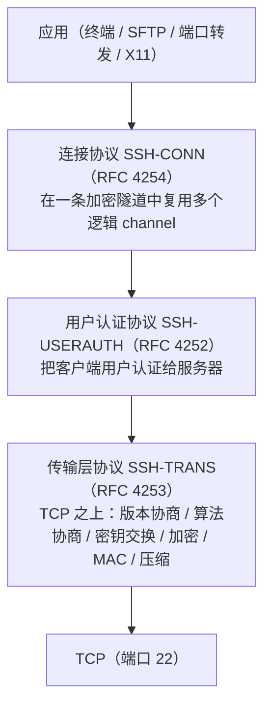
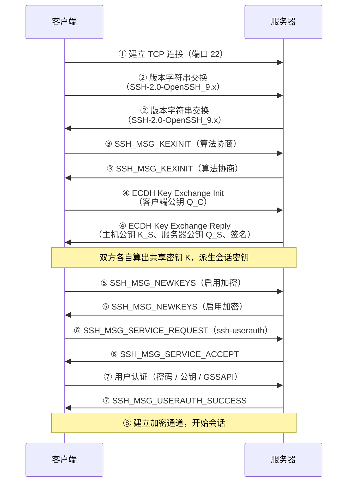
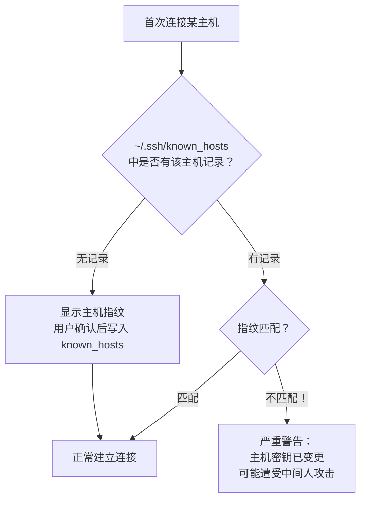
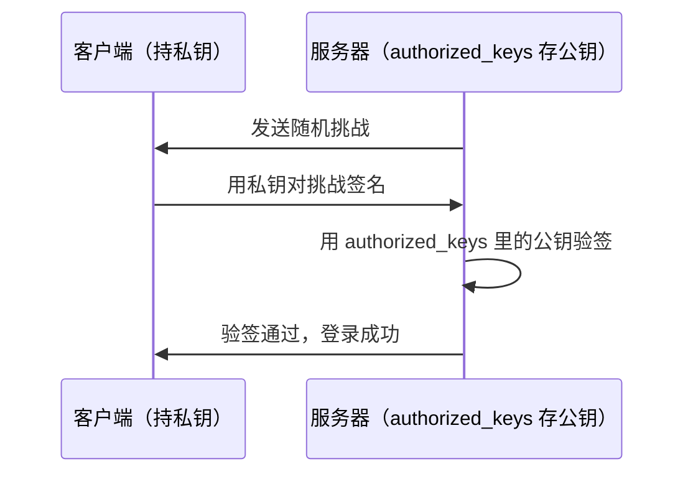
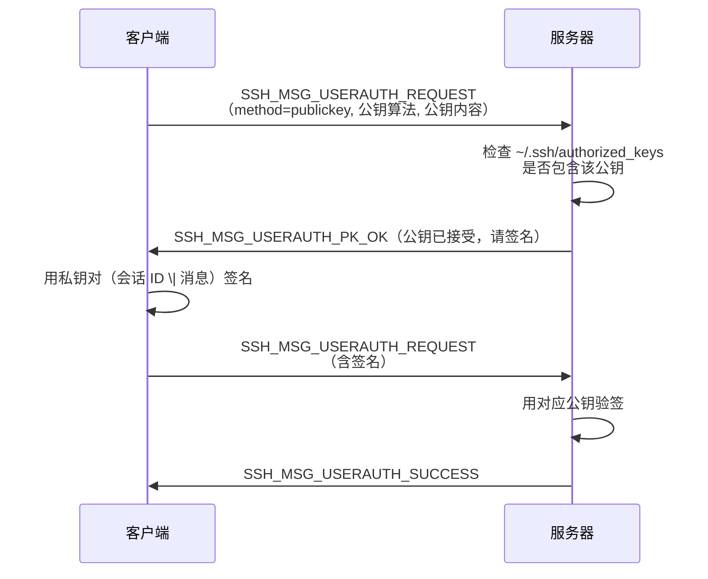
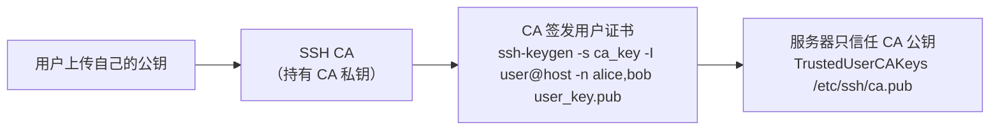
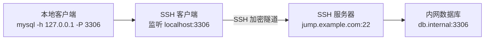
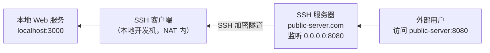
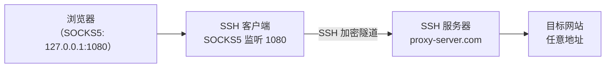

# 详解网络协议(二十一)SSH协议

> [!abstract] 速览
> **SSH（Secure Shell，安全外壳）** 在不安全的网络上提供**加密的远程登录、命令执行、文件传输（[[20.FTP-TFTP-SFTP协议|SFTP]]/SCP）、端口转发**。它是明文 [[22.Telnet协议|Telnet]] 的安全替代品，端口 **22**，当前标准为 **SSH-2**（RFC 4250–4256）。
> 思想与 [[15.TLS协议|TLS]] 相通：**非对称协商密钥 + 对称加密传输**，并提供前向保密。核心架构分三层：传输层协议负责加密与服务器认证、用户认证协议负责客户端身份验证、连接协议在单条加密隧道里复用多路逻辑通道。

## 1. SSH 能做什么

- **远程登录 / 执行命令**：服务器、网络设备、云主机管理；
- **安全文件传输**：SFTP、SCP、rsync over SSH；
- **端口转发 / 隧道**：把其他协议套进 SSH 加密通道（本地/远程/动态 SOCKS）；
- **X11 转发**：把远端图形界面通过 SSH 隧道显示到本地；
- **Git over SSH**：代码仓库的安全推拉通道；
- **跳板机 / 堡垒机**：通过 `ProxyJump` 多级跳转到内网主机。

---

## 2. 三层架构

SSH-2 由三个相互堆叠的子协议构成，各有独立 RFC 规范。



| 子协议 | RFC | 职责 |
| --- | --- | --- |
| **传输层协议** SSH-TRANS | 4253 | 服务器认证、密钥交换（DH/ECDH）、对称加密、消息认证码（MAC）、压缩 |
| **用户认证协议** SSH-USERAUTH | 4252 | 把客户端用户身份认证给服务器（密码/公钥/GSSAPI 等） |
| **连接协议** SSH-CONN | 4254 | 在一条加密隧道里复用多个逻辑 channel（shell/exec/端口转发/X11） |

> 口诀：**TRANS 负责"管道安全"，USERAUTH 负责"人的认证"，CONN 负责"管道复用"。**

### 连接协议：channel 复用

SSH 连接协议允许在同一条加密隧道里同时运行多个独立的**逻辑通道（channel）**：

| channel 类型 | 用途 |
| --- | --- |
| `session` | 交互式 shell 或远程命令执行（exec） |
| `direct-tcpip` | 本地端口转发（`-L`）：客户端请求转发到目标地址 |
| `forwarded-tcpip` | 远程端口转发（`-R`）：服务器端的转发通道 |
| `x11` | X11 图形转发 |
| `auth-agent@openssh.com` | ssh-agent 转发 |

---

## 3. 连接建立流程

### 3.1 整体序列图



### 3.2 各阶段详解

**① TCP 连接**：客户端向服务器 22 端口发起 TCP 三次握手（详见 [[13.TCP协议]]）。

**② 版本字符串交换**：双方以明文交换一行版本标识，格式 `SSH-2.0-软件名_版本`（末尾 `\r\n`）。版本不兼容则立即断开。

**③ 算法协商（`SSH_MSG_KEXINIT`）**：双方各发一个 `SSH_MSG_KEXINIT` 消息，其中列出自己支持的算法列表（取双方交集，优先级由列表顺序决定）：

| 协商字段 | 典型值（现代 OpenSSH） |
| --- | --- |
| kex_algorithms（密钥交换） | `curve25519-sha256`、`ecdh-sha2-nistp256`、`diffie-hellman-group14-sha256` |
| server_host_key_algorithms（主机密钥类型） | `ssh-ed25519`、`rsa-sha2-512`、`ecdsa-sha2-nistp256` |
| encryption_algorithms（对称加密） | `chacha20-poly1305@openssh.com`、`aes256-gcm@openssh.com`、`aes128-ctr` |
| mac_algorithms（消息认证码） | `hmac-sha2-256`、`hmac-sha2-512`（AEAD 模式下隐含 MAC，此字段被忽略） |
| compression_algorithms（压缩） | `none`（默认）、`zlib@openssh.com`（认证后压缩） |

**④ 密钥交换（ECDH）**：以 `curve25519-sha256` 为例——
- 客户端生成临时 ECDH 密钥对，发送公钥 `Q_C`；
- 服务器生成临时密钥对，用自身**主机私钥**对 `(Q_C, Q_S, K)` 签名，发送 `{主机公钥 K_S, Q_S, 签名}`；
- 双方用 ECDH 算出相同共享密钥 `K`，结合交换哈希 `H` 派生出**会话 IV、加密密钥、MAC 密钥**（各方向各一套，共 6 个派生值）；
- 客户端用 `known_hosts` 里存的主机公钥验证签名，确认服务器身份。

**⑤ `SSH_MSG_NEWKEYS`**：双方互发此消息，之后所有通信立即切换为协商好的加密/MAC 算法。此前所有消息（版本、算法协商）均为明文，之后全部加密。

**密钥交换用 (EC)DH**：双方算出**相同会话密钥**而不在网上传私钥材料，天然带**前向保密（Perfect Forward Secrecy）**——即使主机私钥日后泄露，历史会话也无法解密。

---

## 4. 主机密钥与信任（known_hosts）

### 4.1 TOFU 信任模型

SSH 默认采用 **TOFU（Trust On First Use，首次使用即信任）**：



> [!warning] TOFU 的局限
> TOFU 的安全性依赖"**第一次连接时信道干净**"。若首次连接时已被中间人劫持，后续都无法发现。因此对高安全要求场景，应通过带外渠道（如管理员发邮件告知指纹）提前核对指纹，而非无脑输 `yes`。

### 4.2 主机指纹

连接新主机时，OpenSSH 展示的指纹格式：

```
The authenticity of host 'example.com (1.2.3.4)' can't be established.
ED25519 key fingerprint is SHA256:abc123XYZ.../base64==.
```

指纹 = `SHA256( 主机公钥原始字节 )` 做 Base64 编码（RFC 4648）。老版本曾用 MD5 冒号十六进制，现代 OpenSSH 默认 SHA256 Base64 更安全。

### 4.3 `known_hosts` 文件格式

```
# 明文主机名
example.com ssh-ed25519 AAAA...base64公钥...
# 哈希主机名（-H 选项，隐藏主机名）
|1|hashedhostname==|hashsalt== ssh-ed25519 AAAA...
# 通配符 / IP
192.168.1.* ecdsa-sha2-nistp256 AAAA...
```

### 4.4 `SSHFP` DNS 记录

将主机公钥指纹发布到 DNS，客户端通过 DNSSEC 验证。`ssh_config` 中 `VerifyHostKeyDNS yes` 即可启用自动校验，无需首次手动确认。

```
; 格式：<主机> SSHFP <算法> <摘要类型> <十六进制指纹>
; 算法：1=RSA 2=DSA 3=ECDSA 4=Ed25519
; 摘要类型：1=SHA-1 2=SHA-256
example.com.  SSHFP  4  2  abc123def456...
```

> 口诀：**指纹变了必须核实，别图省事删 `known_hosts` 条目了事——变化本身就是告警信号。**

---

## 5. 认证方式

最常用两种——密码认证、**公钥认证**（更安全、可免密）：



> 口诀：**公钥放服务器、私钥留本地**；私钥绝不外传。

### 5.1 密码认证（`password`）

客户端将用户名和密码在加密信道内发送，服务器端 PAM 或 `/etc/shadow` 验证。简单易用，但密码可被爆破，强烈建议结合 2FA 或直接禁用。

### 5.2 公钥认证（`publickey`）——推荐

公钥认证完整流程：



`authorized_keys` 每行格式：`[选项] 算法名 base64公钥 注释`，常用选项：

| 选项 | 含义 |
| --- | --- |
| `from="1.2.3.4"` | 仅允许特定 IP 使用此公钥 |
| `command="backup.sh"` | 限定只能执行该命令（命令受限 shell） |
| `no-port-forwarding` | 禁止端口转发 |
| `no-pty` | 禁止分配伪终端 |
| `restrict` | 禁用所有特权，再按需用 `allow-*` 细粒度开启 |

### 5.3 键盘交互认证（`keyboard-interactive`）

服务器主动向客户端发送提示（prompt）并等待输入，灵活支持 OTP（一次性密码）、验证码等多因素认证。实现 2FA 的常见方式：密码 + Google Authenticator 的 TOTP 码。

### 5.4 基于主机的认证（`hostbased`）

由客户端主机向服务器出示主机公钥签名，适合受信内网主机间免密，生产环境较少使用。

### 5.5 GSSAPI / Kerberos

企业域环境下，用 Kerberos 票据完成单点登录（SSO）：用户一次登录域账户，SSH 自动使用 TGT 票据免密登录受信服务器。`GSSAPIAuthentication yes` 配合 `/etc/krb5.conf` 配置。

### 5.6 SSH 证书认证（CA 签发，企业规模推荐）

传统公钥认证需要把每个用户的公钥手动分发到每台服务器的 `authorized_keys`——百台服务器时运维成本极高。SSH 证书认证引入**证书颁发机构（CA）**：



| 对比维度 | 传统公钥 | SSH 证书 |
| --- | --- | --- |
| 分发方式 | 把每个用户公钥复制到每台服务器 | 服务器只需信任一个 CA 公钥 |
| 吊销 | 手动从 `authorized_keys` 删除 | 设置 `ValidPrincipals` + 有效期，过期自动失效 |
| 规模 | 10 台以下尚可 | 百台/千台服务器必选 |
| 审计 | 难以追踪谁的公钥何时访问 | 证书含 `key id`，日志可追踪到人 |

用户证书包含：公钥、有效期（`-V +1d` 限一天）、允许登录的用户名（`-n alice`）、扩展权限（`permit-pty` 等）。服务器验证：证书签名 → CA 可信 → 用户名在 `ValidPrincipals` 内 → 未过期。

### 5.7 配合 OTP 实现 2FA

```
# /etc/pam.d/sshd 中启用 TOTP
auth required pam_google_authenticator.so

# sshd_config
ChallengeResponseAuthentication yes
AuthenticationMethods publickey,keyboard-interactive
```

流程：用户先完成公钥认证，再通过 `keyboard-interactive` 输入 TOTP 码，两者均通过才登录成功。

---

## 6. 密钥类型对比

生成密钥对的命令 `ssh-keygen -t <类型> -b <位数> -C "注释"`:

| 类型 | 命令示例 | 密钥长度 | 安全性 | 性能 | 推荐度 |
| --- | --- | --- | --- | --- | --- |
| **RSA** | `ssh-keygen -t rsa -b 4096` | 2048–4096 bit | ≥3072 bit 安全；1024 bit**已不安全** | 慢（大整数运算） | 兼容旧系统时用 |
| **ECDSA** | `ssh-keygen -t ecdsa -b 256` | 256/384/521 bit | 依赖 NIST 曲线（曲线参数存疑） | 快 | 次选 |
| **Ed25519** | `ssh-keygen -t ed25519` | 固定 256 bit | 基于 Curve25519，当前最佳 | 最快 | **首选** |
| **DSA** | 已弃用 | 1024 bit | 已不安全 | — | **禁用** |

> [!tip] 点睛
> **Ed25519 是现代 SSH 的首选密钥类型**：密钥更短（公钥 68 字节 vs RSA-4096 的 725 字节）、签名更快、安全性基于成熟的椭圆曲线 Curve25519、实现抗侧信道攻击。若需兼容旧版 OpenSSH（< 6.5），才退而求其次选 RSA-4096。

```bash
# 生成 Ed25519 密钥对（推荐）
ssh-keygen -t ed25519 -C "alice@work-laptop-2026"
# 公钥复制到服务器
ssh-copy-id -i ~/.ssh/id_ed25519.pub user@server
```

---

## 7. 端口转发（隧道）

| 类型 | 选项 | 作用 |
| --- | --- | --- |
| 本地转发 | `-L` | 把本地端口的流量经 SSH 转到远端 |
| 远程转发 | `-R` | 把远端端口的流量转回本地 |
| 动态转发 | `-D` | 起一个 SOCKS 代理 |

### 7.1 本地转发 `-L`

场景：访问生产数据库，但数据库只对内网开放，需通过跳板机中转。

```bash
# 本地 3306 → 跳板机 → 内网 db.internal:3306
ssh -N -L 3306:db.internal:3306 user@jump.example.com
# 之后本地直接连 127.0.0.1:3306 即可访问内网数据库
```



### 7.2 远程转发 `-R`

场景：本地开发机在 NAT 后无公网 IP，需让外部服务器访问本地 Web 服务。

```bash
# 服务器 8080 → SSH 隧道 → 本地 localhost:3000
ssh -N -R 8080:localhost:3000 user@public-server.com
# 外部访问 public-server.com:8080 即到达本地 localhost:3000
```



> [!note]
> 服务器默认只监听 `127.0.0.1:8080`。若需监听所有接口，需设 `GatewayPorts yes`（或 `clientspecified`）。

### 7.3 动态转发 `-D`（SOCKS 代理）

场景：将所有流量通过 SSH 服务器路由，实现临时代理上网。

```bash
# 本地 1080 作为 SOCKS5 代理
ssh -N -D 1080 user@proxy-server.com
# 配置浏览器 SOCKS5 代理为 127.0.0.1:1080
```



---

## 8. 实用特性

### 8.1 `ssh-agent` 与 Agent Forwarding

`ssh-agent` 是一个在内存中持有**已解密私钥**的后台进程，在一次登录会话内自动提供签名，避免每次连接都输入私钥 passphrase。

```bash
# 启动 agent（通常 Shell 配置自动启动）
eval "$(ssh-agent -s)"
# 添加私钥（只需输一次 passphrase）
ssh-add ~/.ssh/id_ed25519
# 查看已加载的密钥
ssh-add -l
```

**Agent Forwarding（`-A` 或 `ForwardAgent yes`）**：允许在远程主机上继续使用本地 `ssh-agent` 的私钥，无需把私钥复制到远程主机。

> [!warning] Agent Forwarding 的风险
> 启用 `ForwardAgent` 后，**远程主机上的 root 用户（或同 UID 的进程）可以通过你 forward 过去的 agent socket 冒充你对其他主机发起 SSH 连接**，而你毫无察觉。
> - 只在**完全受信的堡垒机**上使用 `ForwardAgent`；
> - 对不受信的主机，改用 `ProxyJump`（见下），私钥留在本地不 forward；
> - `authorized_keys` 可用 `restrict,no-agent-forwarding` 禁止特定密钥触发 forwarding。

### 8.2 跳板机 `ProxyJump` / `-J`

无需在跳板机上存私钥，本地直接穿越：

```bash
# 单跳：通过 jump.example.com 到达 target.internal
ssh -J user@jump.example.com user@target.internal

# 多跳（逗号分隔）
ssh -J user@jump1,user@jump2 user@target.internal
```

`~/.ssh/config` 写法：

```
Host target.internal
    User alice
    ProxyJump jump.example.com
    IdentityFile ~/.ssh/id_ed25519
```

> ProxyJump 底层创建 `direct-tcpip` channel（而非 agent forwarding），私钥**全程留在本地**，安全性优于 `ProxyCommand`/Agent Forwarding 组合。

### 8.3 连接复用 `ControlMaster` / `ControlPersist`

重用已有 SSH 连接，消除重复的 TCP+密钥交换开销：

```
# ~/.ssh/config
Host *
    ControlMaster auto
    ControlPath ~/.ssh/ctrl-%r@%h:%p
    ControlPersist 10m
```

效果：首次 `ssh server` 建立主连接并监听 unix socket，后续所有 `ssh server`、`scp`、`rsync` 共用同一条 TCP 连接，延迟显著下降（无握手）。`ControlPersist 10m` 表示主连接在最后一个会话退出后仍保持 10 分钟。

### 8.4 X11 转发

```bash
# 客户端
ssh -X user@server
# 或信任模式（更宽松，性能稍好）
ssh -Y user@server
# 之后直接运行远端 GUI 程序，窗口显示在本地
firefox &
```

> [!warning]
> `-Y`（TrustedX11Forwarding）允许远端程序读取本地 X 显示器上的所有键盘输入和截图，对不受信服务器应用 `-X` 更安全（但可能功能受限）。

### 8.5 保活 `ServerAliveInterval`

长时间无数据时，NAT/防火墙可能静默关闭连接。SSH 层面的保活：

```
# ~/.ssh/config
Host *
    ServerAliveInterval 60    # 每 60 秒发一个保活包
    ServerAliveCountMax 3     # 连续 3 次无响应则断开
```

> 区分：`ServerAliveInterval` 是**客户端**发探测；`ClientAliveInterval` 是**服务端** sshd 向客户端发探测（配置在 `sshd_config`）。

### 8.6 `~/.ssh/config` 综合示例

```
# 基础连接参数
Host prod-web
    HostName 203.0.113.10
    User alice
    IdentityFile ~/.ssh/id_ed25519
    Port 2222

# 跳板机穿越
Host *.internal
    ProxyJump bastion.example.com
    IdentityFile ~/.ssh/id_ed25519

# 连接复用 + 保活（全局）
Host *
    ControlMaster auto
    ControlPath ~/.ssh/ctrl-%r@%h:%p
    ControlPersist 5m
    ServerAliveInterval 60
    ServerAliveCountMax 3
    AddKeysToAgent yes
```

---

## 9. sshd 服务端加固

| 配置项（`/etc/ssh/sshd_config`） | 推荐值 | 说明 |
| --- | --- | --- |
| `PermitRootLogin` | `no` 或 `prohibit-password` | 禁止 root 直接登录，防止暴力破解 |
| `PasswordAuthentication` | `no` | 只允许公钥认证，彻底杜绝密码爆破 |
| `PubkeyAuthentication` | `yes` | 开启公钥认证（默认即 yes） |
| `Port` | 非 22 端口 | 减少自动扫描流量（安全作用有限，但降低日志噪音） |
| `AllowUsers` | `alice bob` | 白名单，只允许指定用户登录 |
| `AllowGroups` | `sshusers` | 或用组来控制 |
| `MaxAuthTries` | `3` | 每次连接最多尝试 3 次认证 |
| `LoginGraceTime` | `30` | 30 秒内未完成认证则断开 |
| `ClientAliveInterval` | `300` | 服务器每 300 秒发保活 |
| `ClientAliveCountMax` | `2` | 无响应 2 次后断开僵尸连接 |
| `X11Forwarding` | `no` | 不需要时禁用（减少攻击面） |
| `AllowAgentForwarding` | `no` | 不需要时禁用 agent forward |
| `KexAlgorithms` | `curve25519-sha256,...` | 只允许现代 KEX 算法 |
| `Ciphers` | `chacha20-poly1305@openssh.com,...` | 禁用弱加密（如 arcfour、3des） |
| `MACs` | `hmac-sha2-256,...` | 禁用弱 MAC（如 hmac-md5） |

修改 `sshd_config` 后验证配置有效性，再重启服务：

```bash
# 检查配置语法
sshd -t
# 重载（不断开已有连接）
systemctl reload sshd
```

### 9.1 `fail2ban` 防暴力破解

```bash
# /etc/fail2ban/jail.local
[sshd]
enabled = true
port    = ssh
maxretry = 5        # 5 次失败
bantime  = 3600     # 封禁 1 小时
findtime = 600      # 在 10 分钟内
```

`fail2ban` 监控 `/var/log/auth.log`，对超过阈值的 IP 自动添加 `iptables` / `nftables` 封禁规则。

### 9.2 最小化安全核查清单

> [!tip] 加固口诀
> **禁 root、禁密码、换端口、限用户、装 fail2ban、限算法、启证书。**

---

## 10. SSH 之上的工具

### 10.1 SCP（Secure Copy）

```bash
# 本地 → 远端
scp localfile.txt user@server:/path/to/dest/
# 远端 → 本地
scp user@server:/path/to/file.txt ./
# 递归复制目录
scp -r localdir/ user@server:/dest/
```

SCP 基于 SSH 连接，调用远端的 `scp -t`（target）子进程接收数据。**新版 OpenSSH 已默认改用 SFTP 子系统实现 SCP**（更安全，修复了旧 SCP 协议的路径遍历漏洞）。

### 10.2 SFTP

SFTP（SSH File Transfer Protocol）是 SSH 连接协议上的独立子系统，与 FTP 无关。详见 [[20.FTP-TFTP-SFTP协议]]。

```bash
# 交互式 SFTP 会话
sftp user@server
# 常用命令
sftp> ls / put / get / cd / mkdir / rm
```

### 10.3 rsync over SSH

```bash
# 增量同步本地目录到服务器（只传变化部分）
rsync -avz --delete -e "ssh -p 2222" ./local/ user@server:/remote/
```

`-e "ssh ..."` 指定 rsync 使用 SSH 作为传输通道，结合增量算法，是大规模文件同步的标准方案。

### 10.4 Git over SSH

```bash
# 克隆 SSH 协议的仓库
git clone git@github.com:user/repo.git
# 底层原理：SSH 连接到 GitHub，执行 git-upload-pack/git-receive-pack
```

Git 通过 SSH 的 `exec` channel 运行服务端 git 命令，利用 SSH 的认证机制（公钥）完成权限控制。GitHub/GitLab 通过 `authorized_keys` 中的 `command=` 选项限定每个公钥只能执行 `git-shell`，不能获取完整 shell。

---

## 11. 协议版本

- **SSH-1**：有结构性缺陷（整数溢出、CRC 弱点），**已弃用**，现代 sshd 默认拒绝；
- **SSH-2**：当前唯一安全标准，更强的密钥交换（DH/ECDH）与消息完整性（HMAC/AEAD），支持多路复用 channel。

---

## 12. SSH vs Telnet 对比

| 维度 | SSH | [[22.Telnet协议\|Telnet]] |
| --- | --- | --- |
| 加密 | 全程加密（AES/ChaCha20） | 明文传输 |
| 认证 | 多种方式（公钥/证书/密码/GSSAPI） | 仅用户名+密码（明文） |
| 完整性 | HMAC / AEAD 保护 | 无 |
| 端口 | 22 | 23 |
| 端口转发 | 支持 | 不支持 |
| 文件传输 | SCP / SFTP | 无（需另起 FTP） |
| 现代使用 | **行业标准** | **已淘汰**（仅网络设备调试残余） |

---

## 13. 常见误区与面试要点

> [!warning] 易错点
> - **首次连接的"指纹确认"很重要**：第一次记录主机密钥到 `known_hosts`（TOFU 信任模型），后续变化会告警——这是防中间人的关键，别无脑 `yes`。
> - **公钥认证里"传到服务器的是公钥"**，私钥永远留本地；服务器不存私钥，存的是 `authorized_keys` 里的**公钥**。
> - **最佳实践**：禁 root 直接登录、禁密码登录（只留公钥）、改默认端口 + 防火墙。
> - **SSH-1 已不安全**，务必只用 SSH-2。
> - **`ForwardAgent yes` 存在安全风险**：远程主机 root 可滥用 agent socket 冒充你。只对完全受信主机开启，其余用 `ProxyJump`。
> - **Ed25519 优于 RSA-1024**：RSA-1024 已被破解，若仍在用，立即升级到 Ed25519 或至少 RSA-4096。
> - **TOFU 的局限**："首次信任"假设第一次连接干净，若首次已被中间人拦截，之后无法察觉。关键主机应带外核实指纹或使用 SSHFP+DNSSEC。
> - **SCP 旧协议有路径遍历漏洞**：现代 OpenSSH 默认 `scp` 已使用 SFTP 子系统实现，但若对端老旧，建议直接用 `sftp` 或 `rsync`。
> - **`PasswordAuthentication no` 设置前先确认公钥已传到服务器**，否则会把自己锁在门外。

---

## 延伸阅读

- 被它取代：[[22.Telnet协议]]（明文远程登录）
- 派生应用：[[20.FTP-TFTP-SFTP协议]]（SFTP / SCP）
- 同源思想：[[15.TLS协议]]（混合加密、前向保密）

> ⬅️ [[20.FTP-TFTP-SFTP协议]] ｜ 🏠 [[00.网络协议详解总览]] ｜ [[22.Telnet协议]] ➡️
