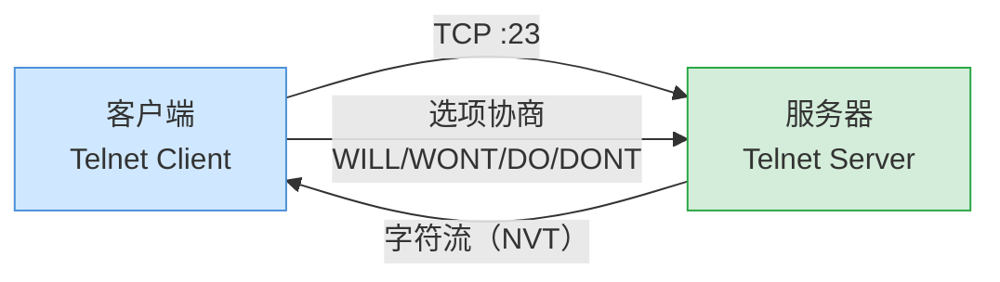
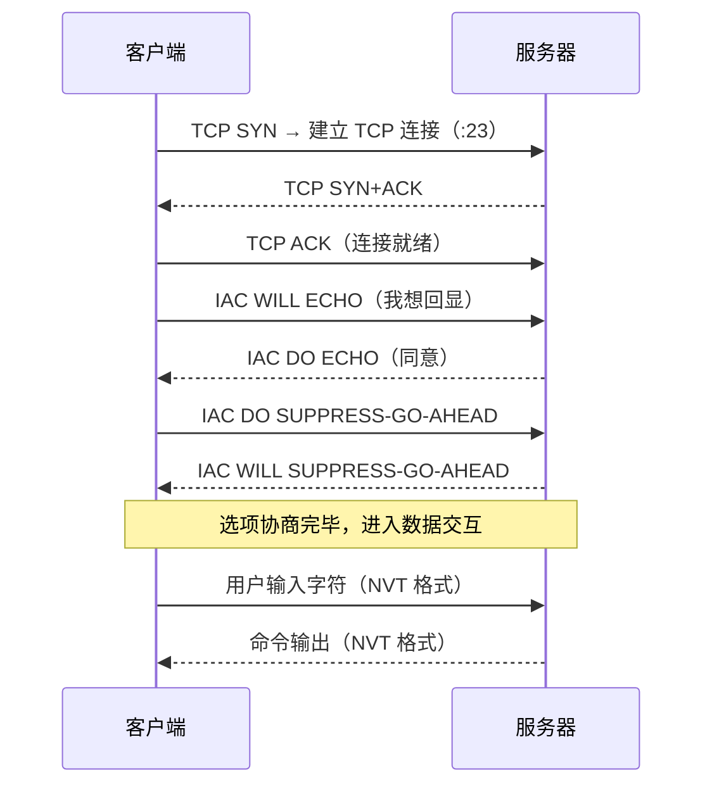
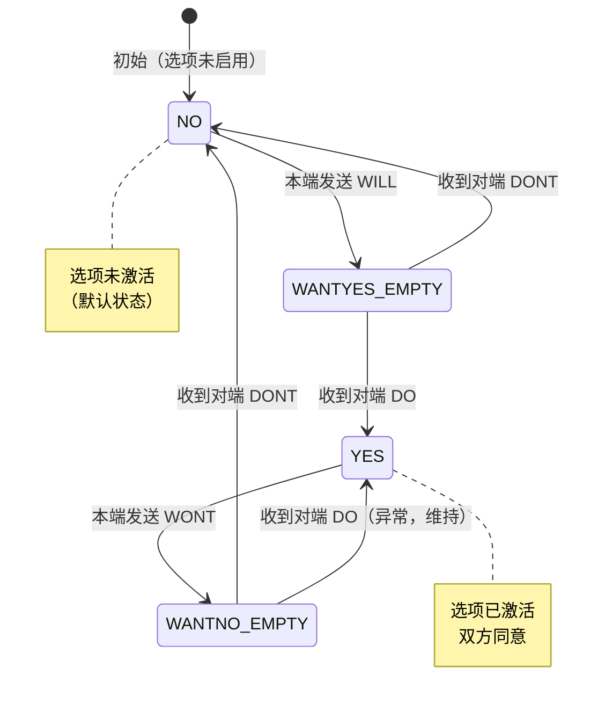

# 详解网络协议(二十二)Telnet协议

> [!abstract] 速览
> **Telnet** 是最早的远程登录协议（[[09.应用层|应用层]]，TCP **23**），通过 **NVT（网络虚拟终端）** 提供命令行远程访问。致命缺陷：**全程明文**（连密码都裸奔），早已被 [[21.SSH协议|SSH]] 取代。今天它主要的用途变成了——**探测某个 TCP 端口通不通**，以及手动调试纯文本协议（HTTP/SMTP）。
> 这是「详解网络协议」系列的**收官篇**。



---

## 1. 基本原理与 NVT

### 1.1 连接建立流程

客户端发起到服务器 **23/TCP** 的连接（承载于 [[13.TCP协议]]），建立后立即进入选项协商阶段，协商完毕后开始字符级双向交互——每敲一个键（或一行字）发一个字节（或一行字节）到服务器，服务器响应回显给客户端。



### 1.2 NVT（网络虚拟终端）深度解析

为屏蔽各种终端（VT100、ANSI、IBM 3270……）的差异，Telnet 定义了 **NVT（Network Virtual Terminal，网络虚拟终端）**——一套与具体设备无关的标准"虚拟终端"。

**NVT 抽象模型：**

| 组件 | 说明 |
| --- | --- |
| **NVT Printer（打印机）** | 负责接收并显示数据；只要能处理 NVT 字符即可，无需了解对端终端型号 |
| **NVT Keyboard（键盘）** | 负责产生输入数据；产生 NVT 标准字符序列，而非原始键码 |

**NVT ASCII（7 位）**：NVT 使用 **7-bit US-ASCII**（0x00–0x7F），最高位默认为 0。若双方协商 `BINARY` 选项（选项码 0，RFC 856），则可传输任意 8 位字节，NVT 的 CR 特殊处理随之禁用。

**行结束约定**：NVT 规定行结束符为 **`CR LF`（`\r\n`，0x0D 0x0A）**，不用 Unix 的单字节 `LF`，也不用旧 Mac 的单字节 `CR`——这与 HTTP、SMTP 等文本协议的行结束约定一脉相承，都来自 NVT 规范。

**NVT 控制码（部分）：**

| 码值（十进制） | 缩写 | 含义 |
| --- | --- | --- |
| 0 | NUL | 空字符 |
| 7 | BEL | 响铃 |
| 8 | BS | 退格 |
| 9 | HT | 水平制表 |
| 10 | LF | 换行 |
| 13 | CR | 回车 |
| 12 | FF | 换页（清屏） |
| 11 | VT | 垂直制表 |

> [!tip] 为什么需要 NVT？
> 1950–1970 年代终端种类极多，行结束符、控制码各有不同。NVT 提供了一层"翻译层"：客户端把本地终端格式转为 NVT，服务器把 NVT 转为服务器本地格式。这是早期网络互操作的核心思想。

---

## 2. 选项协商

### 2.1 四条协商指令

用转义字符 **IAC（0xFF，Interpret As Command）** 引出命令，双方用 **WILL / WONT / DO / DONT** 协商启用哪些能力：

| 命令 | 含义 | 场景 |
| --- | --- | --- |
| `WILL` | 我方"愿意"启用某选项 | 主动宣告意图，等待对方回 DO/DONT |
| `WONT` | 我方"不愿意"启用某选项 | 拒绝或关闭某选项 |
| `DO` | 请求对方"启用"某选项 | 向对端发起请求，等待 WILL/WONT |
| `DONT` | 请求对方"不启用"某选项 | 要求对端关闭某选项 |

每条协商消息格式：`IAC <命令码> <选项码>`，即 **3 字节**。

### 2.2 协商状态机思想

每个选项在每个方向（本端/对端）各有一个二值状态：**启用（YES）/ 禁用（NO）**。RFC 855 定义了严格的状态机，防止协商循环（A 发 WILL → B 回 DO → A 再发 WILL……）：



> [!note] 口诀
> **WILL/DO 是"提议+同意"，WONT/DONT 是"拒绝+要求停"。**
> 发 WILL → 等 DO（同意）或 DONT（拒绝）；发 DO → 等 WILL（同意）或 WONT（拒绝）。

### 2.3 子协商 `IAC SB ... IAC SE`

有些选项需要传递参数（如终端类型字符串、窗口尺寸数值），普通的三字节协商放不下。RFC 855 定义了**子协商（Subnegotiation）**格式：

```
IAC SB <选项码> <参数数据...> IAC SE
```

- `SB`（250）：子协商开始
- `SE`（240）：子协商结束
- 参数数据中若出现 `0xFF` 字节，必须发送两个 `0xFF`（`IAC IAC`）转义

**典型子协商示例：**

服务器询问客户端终端类型（TERMINAL-TYPE，选项码 24）：

```
服务器 → 客户端：IAC SB 24 SEND IAC SE
                （0xFF 0xFA 0x18 0x01 0xFF 0xF0）

客户端 → 服务器：IAC SB 24 IS "XTERM" IAC SE
                （0xFF 0xFA 0x18 0x00 0x58 0x54 0x45 0x52 0x4D 0xFF 0xF0）
```

客户端汇报窗口大小（NAWS，选项码 31，RFC 1073）：

```
客户端 → 服务器：IAC SB 31 <宽度高字节> <宽度低字节> <高度高字节> <高度低字节> IAC SE
示例（80列×24行）：
                0xFF 0xFA 0x1F 0x00 0x50 0x00 0x18 0xFF 0xF0
```

---

## 3. Telnet 命令码速查表

所有 Telnet 命令以 **`IAC`（0xFF = 255）** 开头。下表为 RFC 854 定义的全部命令码：

| 命令名 | 十进制 | 十六进制 | 说明 |
| --- | --- | --- | --- |
| `SE` | 240 | 0xF0 | 子协商结束（End of Subnegotiation） |
| `NOP` | 241 | 0xF1 | 空操作，仅保持连接活跃 |
| `DM` | 242 | 0xF2 | 数据标记（Data Mark），配合 TCP Urgent 做带外信令 |
| `BRK` | 243 | 0xF3 | 发送 Break 信号（模拟串口 Break，Ctrl+C 等） |
| `IP` | 244 | 0xF4 | 中断进程（Interrupt Process），等效 Ctrl+C |
| `AO` | 245 | 0xF5 | 放弃输出（Abort Output），清空服务器待发缓冲区 |
| `AYT` | 246 | 0xF6 | 你在吗？（Are You There），检测服务器存活 |
| `EC` | 247 | 0xF7 | 删除字符（Erase Character），退格一个字符 |
| `EL` | 248 | 0xF8 | 删除行（Erase Line），清除当前输入行 |
| `GA` | 249 | 0xF9 | 继续（Go Ahead），半双工模式下的"轮到你了"信号 |
| `SB` | 250 | 0xFA | 子协商开始（Subnegotiation Begin） |
| `WILL` | 251 | 0xFB | 我方愿意启用（或确认已启用）该选项 |
| `WONT` | 252 | 0xFC | 我方拒绝（或停止）该选项 |
| `DO` | 253 | 0xFD | 请求对方启用该选项 |
| `DONT` | 254 | 0xFE | 要求对方停止该选项 |
| `IAC` | 255 | 0xFF | 转义：数据中的 0xFF 必须发送两个 `IAC IAC` |

> [!tip] 记忆口诀
> **"SE/NOP/DM/BRK 是 240–243，IP/AO/AYT 是 244–246，EC/EL/GA 是 247–249，SB 是 250，WILL/WONT/DO/DONT 是 251–254，IAC 自身是 255。"**
> 数字从小到大：结束 → 控制 → 协商 → 转义。

---

## 4. 常见选项详解

下表整理 Telnet 最常用的选项，均来自 IANA 官方分配（RFC 1700 / IANA Telnet Options Registry）：

| 选项名 | 选项码 | RFC | 说明 |
| --- | --- | --- | --- |
| `BINARY` | 0 | RFC 856 | 二进制传输，禁用 NVT 对 CR 的特殊处理，允许全 8-bit 字节流 |
| `ECHO` | 1 | RFC 857 | 服务器端回显：服务器将收到的字符原样回传客户端（用于字符模式交互） |
| `SUPPRESS-GO-AHEAD`（SGA） | 3 | RFC 858 | 抑制 GA 信号，使连接行为如全双工；**几乎所有现代 Telnet 都协商此项** |
| `STATUS` | 5 | RFC 859 | 允许查询各选项当前状态 |
| `TIMING-MARK` | 6 | RFC 860 | 同步时序标记 |
| `TERMINAL-TYPE` | 24 | RFC 1091 | 客户端通过子协商告知终端类型（如 `XTERM`、`VT100`） |
| `NAWS`（窗口大小） | 31 | RFC 1073 | 客户端汇报当前窗口列数×行数，服务器据此调整输出格式（`stty cols/rows`） |
| `TERMINAL-SPEED` | 32 | RFC 1079 | 协商终端速率（波特率） |
| `LINEMODE` | 34 | RFC 1184 | 行模式：客户端在本地做行编辑后整行发送（默认字符模式是逐字符发送） |
| `X-DISPLAY-LOCATION` | 35 | RFC 1096 | X11 显示地址 |
| `NEW-ENVIRON` | 39 | RFC 1572 | 传递环境变量（取代旧版 ENVIRON 选项 36） |

**ECHO + SGA 组合**是现代 Telnet 的"必协商对"：

- 仅有 `ECHO` 无 `SGA`：连接是半双工，每发一段数据后需等 GA 信号，交互卡顿。
- **`ECHO` + `SGA` 同时启用**：模拟全双工字符终端，字符实时回显，体验接近本地终端。

---

## 5. 为什么不安全

### 5.1 三大安全缺陷

- **明文传输**：用户名、密码、命令、输出全程未加密；
- **易被嗅探**：链路上任意一点（交换机镜像端口、Wi-Fi 热点、中间路由器）抓包即可还原完整会话，包括密码；
- **认证弱**：仅依赖服务器侧的用户名/密码，无公钥指纹、无中间人防护——攻击者可做 ARP 欺骗劫持会话。

### 5.2 抓包演示（示意）

```
# Wireshark 过滤 Telnet 流量，Follow TCP Stream 可直接看到：
login: alice
Password: s3cr3t_p@ss   ← 密码裸奔！
$ ls /etc/passwd
root:x:0:0:root:/root:/bin/bash
...
```

→ 安全替代：**[[21.SSH协议|SSH]]**（加密 + 强认证），或用 TLS 隧道封装（如 telnet over stunnel）。

---

## 6. Telnet vs SSH

| 维度 | Telnet | [[21.SSH协议\|SSH]] |
| --- | --- | --- |
| 加密 | 无（全程明文） | 有（AES/ChaCha20 等） |
| 默认端口 | 23 | 22 |
| 认证方式 | 用户名/密码（明文） | 密码 + 公钥 + 证书等 |
| 数据完整性 | 无（仅 TCP 校验和） | HMAC 防篡改 |
| 中间人防护 | 无 | 主机密钥指纹验证 |
| 隧道/端口转发 | 无 | 支持本地/远程/动态转发 |
| 文件传输 | 无（需另装工具） | scp / sftp 内置 |
| 现状 | 仅测试/遗留设备 | 主流远程管理标准 |
| 规范 | RFC 854（1983） | RFC 4251–4254（2006） |

---

## 7. 今天还有什么用

### 7.1 最常见用途：探测 TCP 端口连通性

这是 Telnet 在现代最普遍的用法——作为一个便捷的 TCP 连接探针：

```bash
# 检测 web 服务器 80 端口是否可达
telnet example.com 80
# 若连通：显示 "Connected to example.com." → 端口开放
# 若不通：显示 "Connection refused" 或超时 → 端口关闭或被防火墙拦截

# 检测数据库端口
telnet db-server 3306

# 检测邮件服务器
telnet mail.example.com 25
```

> [!tip] 面试考点
> **面试官问"如何测试一个 TCP 端口是否开放"**，标准答案是 `telnet host port`。这也是为什么现在很多系统还保留 telnet 客户端（仅客户端，不开服务端）的原因。

### 7.2 手动调试纯文本协议

Telnet 建立的是普通 TCP 连接，连接到任意端口后你可以直接手敲应用层协议报文。

**示例一：手动发 HTTP/1.1 请求**

```bash
$ telnet example.com 80
Trying 93.184.216.34...
Connected to example.com.
Escape character is '^]'.
GET / HTTP/1.1
Host: example.com
Connection: close
                        ← 此处敲两次回车（空行标志请求头结束）
HTTP/1.1 200 OK
Content-Type: text/html; charset=UTF-8
...
```

**示例二：手动走 SMTP 会话（发邮件）**

```bash
$ telnet mail.example.com 25
220 mail.example.com ESMTP
EHLO myclient.example.com
250-mail.example.com Hello
250 AUTH LOGIN PLAIN
MAIL FROM:<alice@example.com>
250 OK
RCPT TO:<bob@example.com>
250 OK
DATA
354 End data with <CR><LF>.<CR><LF>
Subject: Test
From: alice@example.com

Hello Bob, this is a test.
.
250 Message accepted
QUIT
221 Bye
```

**示例三：POP3 收邮件（手动）**

```bash
$ telnet mail.example.com 110
+OK POP3 server ready
USER alice
+OK
PASS secret
+OK Logged in
LIST
+OK 2 messages
RETR 1
+OK 512 octets
...（邮件内容）...
QUIT
```

> [!note] 这些调试技巧对协议学习极有价值：你能清楚看到协议每一步的请求与响应，远比看文档直观。

### 7.3 MUD / BBS / 复古网络服务

- **MUD（Multi-User Dungeon）**：1990 年代的文字网络游戏，至今仍有活跃社区，标准接入方式就是 `telnet mud.example.com 4000`；
- **BBS（Bulletin Board System）**：台湾 PTT 等经典 BBS 仍以 Telnet 提供接入（`telnet ptt.cc`），保留浓厚的 ANSI 字符画文化；
- **天文台/气象数据服务**：部分老式公共数据服务仍用 Telnet 提供原始数据流。

### 7.4 网络设备 Console / 遗留嵌入式设备

- **交换机/路由器管理**：早期 Cisco/Juniper 设备管理接口默认开 Telnet（现代固件已默认关闭，改用 SSH）；
- **工控/嵌入式设备**：PLC、串口转网口模块、工业网关等出于资源限制（无法跑 SSH 加密）或历史遗留，仍可能只提供 Telnet；
- **测试设备/实验室环境**：内网隔离的测试床中，Telnet 因配置简单仍有一席之地。

> [!warning] 重要
> 无论哪种场景，**只要连接路径经过不受信任的网络（包括内网！），就不应使用 Telnet 进行身份认证**。生产网络应一律关闭 Telnet 服务端（`access-class` 拒绝、禁用 `telnetd`）。

### 7.5 现代替代探测工具

`telnet` 客户端并非测试端口的唯一选择，以下工具在 `telnet` 不可用时可替代：

| 工具 | 示例命令 | 特点 |
| --- | --- | --- |
| `nc` / `ncat` | `nc -zv host 80` | 功能更丰富，可发送任意数据，支持 UDP |
| `curl` | `curl -v telnet://host:80` | 直接用 curl 建立 TCP 连接并交互 |
| PowerShell `Test-NetConnection` | `Test-NetConnection host -Port 80` | Windows 原生，输出连通性与路由信息 |
| Python | `python3 -c "import socket; s=socket.create_connection(('host',80)); print('OK')"` | 跨平台，无需额外安装 |
| `curl --connect-timeout` | `curl -sv --connect-timeout 3 http://host:80/` | 顺带验证 HTTP 响应 |

```powershell
# Windows 下最常用（无需安装 telnet 客户端）
Test-NetConnection -ComputerName db-server -Port 3306
# 输出：TcpTestSucceeded : True / False
```

---

## 8. 常见误区与面试要点

> [!warning] 常见误区
> - **`telnet` 命令 ≠ Telnet 协议的本职**：如今多数人用 `telnet host port` 只是在**测 TCP 端口是否开放**，真正的 Telnet 登录会话已基本绝迹于生产环境。
> - **生产环境严禁用 Telnet 远程登录**：明文密码等于公开，网络中任何节点都可嗅探；请一律用 SSH，或在加密隧道内使用。
> - **Telnet 不只是命令，也是协议**：很多人以为 `telnet` 只是一个网络工具，但它背后有完整的 IAC / 选项协商 / NVT 规范（RFC 854 等一系列 RFC）。
> - **IAC（0xFF）在数据流中必须转义**：若应用数据中出现字节 `0xFF`，必须发送两个 `0xFF`（`IAC IAC`），否则接收方会误解为命令。
> - **Telnet 的端口 23 与测试用途的端口无关**：用 `telnet host 80` 时连接的是 80 端口，Telnet 协议的 23 端口此时没有任何关系——只是借用了 telnet 客户端的 TCP 建连能力。
> - **Go Ahead（GA）在现代连接中已无意义**：GA 是为半双工线路设计的，现代 TCP 全双工链路协商 `SUPPRESS-GO-AHEAD` 后 GA 永远不会发送。

---

## 9. 全系列回顾：从分层到协议的脉络

作为「详解网络协议」收官篇，这里用一张总览表串联全系列 22 篇的核心脉络，呼应 [[00.网络协议详解总览]]：

整个系列遵循"**从底层到顶层，从基础到应用，从原理到安全**"的路径：先理解分层模型（[[01.基本概念]]、[[02.OSI七层参考模型]]、[[10.TCP-IP四层模型]]），再逐层深入——物理层（[[03.物理层]]）、数据链路层（[[04.数据链路层]]）、网络层（[[05.网络层]]、[[11.IP协议]]、[[12.支持地址分类和子网划分]]）、传输层（[[06.传输层]]、[[13.TCP协议]]、[[16.UDP协议]]）、会话/表示/应用三层（[[07.会话层]]、[[08.表示层]]、[[09.应用层]]），最后是应用层协议群（[[18.HTTP-HTTPS协议]]、[[19.websocket协议]]、[[20.FTP-TFTP-SFTP协议]]、[[21.SSH协议]] 与本篇 Telnet）。

| 层次 | 代表协议（本系列） | 核心关键词 |
| --- | --- | --- |
| 应用层 | HTTP/HTTPS、WebSocket、FTP/SFTP、DNS、DHCP、SMTP/POP3/IMAP、SSH、**Telnet** | 用户可见服务、明文 vs 加密 |
| 安全层 | SSL、TLS | 加密握手、证书、HTTPS 基石 |
| 传输层 | TCP、UDP | 可靠 vs 低延迟、三次握手、拥塞控制 |
| 网络层 | IP、ICMP、路由协议 | 寻址、分片、TTL、路由 |
| 数据链路层 | MAC/ARP、以太网 | 帧、硬件地址、局域网 |
| 物理层 | 信号编码、介质 | 比特流、带宽 |

从 Telnet（RFC 854，1983 年）到 SSH（RFC 4251，2006 年）的演进，是网络协议安全意识觉醒的缩影——从"能用就行"到"安全第一"。整个协议栈的设计哲学也在这 22 篇中贯穿始终：**分层解耦、标准化接口、用最少的复杂度解决最多的问题**。

> [!success] 收官寄语
> 学完这 22 篇，你已经拥有了从物理信号到应用协议、从 IP 寻址到 TLS 加密、从 TCP 三次握手到 HTTP 状态码的完整知识图谱。网络协议的世界还远不止于此——QUIC、HTTP/3、MPLS、BGP、SD-WAN……每一个方向都值得深入探索。但有了这个基础，你已经有了看懂任何网络协议的钥匙。

---

## 延伸阅读

- 安全替代（强烈推荐）：[[21.SSH协议]]
- 所属层：[[09.应用层]]　承载：[[13.TCP协议]]
- 🏠 回到系列目录：[[00.网络协议详解总览]]
- RFC 854：Telnet Protocol Specification（1983，Postel & Reynolds）
- RFC 855：Telnet Option Specifications
- RFC 857：Telnet Echo Option
- RFC 858：Telnet Suppress Go Ahead Option
- RFC 1073：Telnet Window Size Option（NAWS）
- RFC 1091：Telnet Terminal-Type Option

> ⬅️ [[21.SSH协议]] ｜ 🏠 [[00.网络协议详解总览]] ｜ 🎉 全系列完
