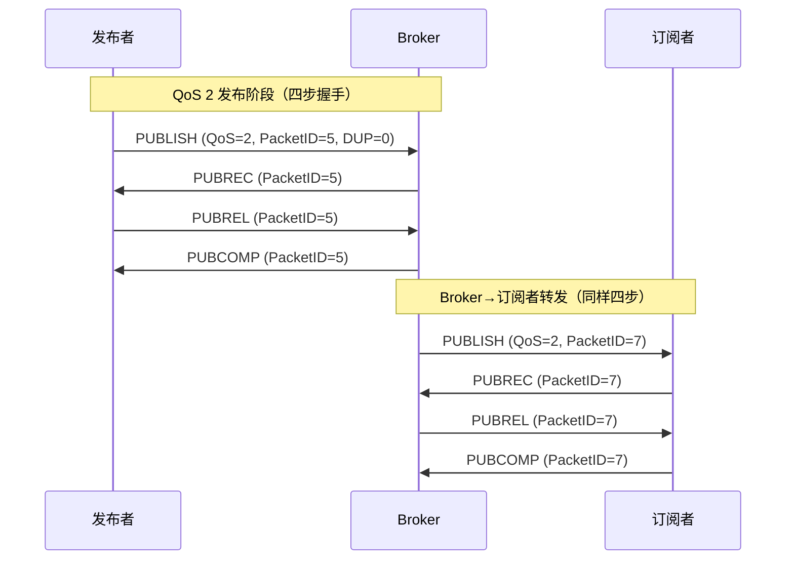

# 详解网络协议（23）· MQTT协议

> [!abstract] TL;DR
> **MQTT（Message Queuing Telemetry Transport）** 是专为低带宽、高延迟、不稳定网络设计的**轻量级发布-订阅消息协议**（ISO/IEC 20922），最初由 IBM 于 1999 年为石油管道 SCADA 系统设计，现由 OASIS 维护。它通过 **Broker（代理）** 将发布者与订阅者彻底解耦，控制报文最小仅 2 字节，是 **IoT/M2M** 领域事实标准。当前主要版本：MQTT 3.1.1（最广泛部署）和 MQTT 5.0（2019 年，大幅扩展语义）。

## 概述与定位

MQTT 的设计目标是**极简、低功耗、适应不可靠网络**。在 IoT 场景中，传感器节点可能仅有几十 KB RAM，网络可能是 2G/NB-IoT，连接随时中断——这种场景既不适合 HTTP 的请求-响应模型（每次都要完整握手与头部），也不适合 AMQP 的复杂路由逻辑。

MQTT 的核心思想是**三角解耦**：

- **发布者（Publisher）**：产生消息，向指定主题（Topic）发布，完全不关心有没有订阅者，也不关心订阅者在哪里。
- **代理（Broker）**：协议的核心枢纽，负责接收发布消息、管理订阅关系、路由转发、持久化保留消息、管理会话状态。主流实现有 **Mosquitto**（轻量，适合嵌入式）和 **EMQX**（高并发分布式，支持亿级连接）。
- **订阅者（Subscriber）**：向 Broker 声明对某主题的订阅，当有消息到达该主题时，Broker 主动推送。

这种三角关系的本质是**空间解耦**（发布者不知订阅者地址）、**时间解耦**（发布时订阅者可以离线，持久会话下消息排队等待）、**同步解耦**（发布不需要订阅者即时在线响应）。

与 HTTP 对比：HTTP 是客户端主动拉取，MQTT 是 Broker 主动推送；HTTP 每次连接都要握手，MQTT 保持长连接；HTTP 头部动辄几百字节，MQTT 最小报文 2 字节。

MQTT 默认运行在 **TCP 之上**（端口 1883 明文，8883 TLS），保证有序可靠传输。MQTT 本身不加密，安全性依赖 TLS 层。

## 原理与机制

### 主题（Topic）与通配符

主题是一个 UTF-8 字符串，用 `/` 分层，例如 `home/floor1/room3/temperature`。层次结构完全由应用自定义，Broker 不解析含义。

订阅时可使用通配符：

- **`+`（单层通配）**：匹配一个层级中的任意内容。`home/+/room3/temperature` 可匹配 `home/floor1/room3/temperature` 和 `home/floor2/room3/temperature`，但不匹配 `home/floor1/wing2/room3/temperature`。
- **`#`（多层通配）**：必须位于主题末尾，匹配其后任意数量的层级。`home/floor1/#` 匹配 `home/floor1/room1/temperature`、`home/floor1/room2/humidity` 等所有子路径，包括 `home/floor1` 本身（零层）。

以 `$` 开头的主题（如 `$SYS/`）是 Broker 内部保留主题，通配符 `#` 或 `+` 不会匹配这些系统主题，避免客户端意外监听内部状态。

### QoS（服务质量等级）

MQTT 定义了三个 QoS 级别，覆盖从"尽力而为"到"精确一次"的不同可靠性需求：

**QoS 0（最多一次，At Most Once）**：发布者发出 PUBLISH，不等待 ACK，Broker 收到后立即转发给订阅者，也不等 ACK。消息可能因网络丢失，但开销最小。适用于传感器高频采样数据（丢几条无所谓）。

**QoS 1（至少一次，At Least Once）**：发布者发出 PUBLISH（携带 Packet ID），等待 Broker 返回 PUBACK；若超时未收到 PUBACK，则将 PUBLISH 的 DUP 标志置 1 重发。Broker 转发给订阅者后，也需等订阅者 PUBACK。消息保证到达，但可能重复。应用层需做幂等处理。

**QoS 2（恰好一次，Exactly Once）**：通过四步握手消除重复。发布者发 PUBLISH → Broker 返回 PUBREC → 发布者发 PUBREL → Broker 返回 PUBCOMP，才算完成一次发布。每一步都有 Packet ID 对应。Broker 向订阅者转发时同样走四步握手。适用于计费、控制指令等不允许重复执行的场景，代价是四倍报文交互。



注意：QoS 是**发布者到 Broker** 和 **Broker 到订阅者**两段独立协商的，订阅时声明的 QoS 是下行最大等级（Broker 会取发布 QoS 与订阅 QoS 中的较小值执行）。

### 保留消息（Retained Message）

PUBLISH 报文的 RETAIN 标志置 1 时，Broker 会将该消息（最新一条）保存起来。后续有新客户端订阅该主题时，Broker 立即将保留消息推送给它，无需等待下一次发布。常用于设备状态广播（如灯的开关状态），让新订阅者立即获得当前值，而非等到下次状态变化。发布一条 payload 为空（零字节）的保留消息可清除保留状态。

### 遗嘱消息（Last Will and Testament，LWT）

客户端在 CONNECT 报文中可以预置一条"遗嘱"，指定主题、QoS、内容和是否保留。当 Broker 检测到该客户端**异常断开**（网络中断，超时未收到 PINGREQ，而非正常 DISCONNECT）时，自动向遗嘱主题发布遗嘱消息。这是 MQTT 实现设备离线检测的标准机制。正常断开时 Broker 不发遗嘱。

MQTT 5.0 新增了**遗嘱延迟发布**（Will Delay Interval），让 Broker 等一段时间再发遗嘱，给设备重连留出窗口，避免因短暂掉线触发误报。

### Keep-Alive 与 PINGREQ

客户端在 CONNECT 时协商 Keep-Alive 时间（单位秒，0 表示禁用）。若在 1.5 倍 Keep-Alive 时间内没有任何报文往来，Broker 断开该连接并触发遗嘱。客户端空闲时主动发 PINGREQ，Broker 回 PINGRESP，维持连接活性。

### 持久会话（Persistent Session）

MQTT 3.1.1 通过 CONNECT 的 `cleanSession` 标志控制：
- `cleanSession=0`：持久会话。客户端 ID 唯一标识会话，Broker 记住该客户端的订阅列表和未确认的 QoS 1/2 消息，客户端重连后继续接收离线期间的消息。
- `cleanSession=1`：每次连接都是全新会话，断开时 Broker 清除一切。

MQTT 5.0 将其改为更灵活的 `cleanStart`（标志是否从新开始）加 `sessionExpiryInterval`（会话有效期，秒），0 表示断开即清除，0xFFFFFFFF 表示永不过期，实现了更细粒度的控制。

## 结构/算法/伪代码详解

### 报文格式总体结构

每个 MQTT 控制报文由三部分组成：

```
┌─────────────────────────────────────────────────────┐
│ 固定头（Fixed Header）         必选，最少 2 字节      │
│   Byte 1: [7:4] 报文类型(4bit) + [3:0] 标志位(4bit) │
│   Byte 2+: 剩余长度（可变长编码，1~4 字节）          │
├─────────────────────────────────────────────────────┤
│ 可变头（Variable Header）      按报文类型可选        │
│   内容因报文类型而异，可包含 Packet ID、协议名等     │
├─────────────────────────────────────────────────────┤
│ 载荷（Payload）                按报文类型可选        │
│   实际内容：客户端 ID、主题列表、应用消息等          │
└─────────────────────────────────────────────────────┘
```

### 固定头详解

Byte 1 高 4 位是报文类型（0~15，0 保留），低 4 位是标志：

| 报文类型值 | 名称 | 方向 | 标志位用途 |
|---|---|---|---|
| 1 | CONNECT | 客→Broker | 保留全 0 |
| 2 | CONNACK | Broker→客 | 保留全 0 |
| 3 | PUBLISH | 双向 | DUP[3], QoS[2:1], RETAIN[0] |
| 4 | PUBACK | 双向 | 保留全 0 |
| 5 | PUBREC | 双向 | 保留全 0 |
| 6 | PUBREL | 双向 | 固定 0010 |
| 7 | PUBCOMP | 双向 | 保留全 0 |
| 8 | SUBSCRIBE | 客→Broker | 固定 0010 |
| 9 | SUBACK | Broker→客 | 保留全 0 |
| 10 | UNSUBSCRIBE | 客→Broker | 固定 0010 |
| 11 | UNSUBACK | Broker→客 | 保留全 0 |
| 12 | PINGREQ | 客→Broker | 保留全 0 |
| 13 | PINGRESP | Broker→客 | 保留全 0 |
| 14 | DISCONNECT | 客→Broker | 保留全 0 |
| 15 | AUTH（5.0新增） | 双向 | 保留全 0 |

**剩余长度（Remaining Length）编码**是 MQTT 的一个精巧设计：每个字节低 7 位存数据，最高位（MSB）为 1 表示后面还有字节，为 0 表示这是最后一个字节。这种变长编码（类似 LEB128）使得 127 字节以内只需 1 字节长度字段，128~16383 字节用 2 字节，最大支持 256 MB 的报文（4 字节编码）。例如 321 字节剩余长度编码为 `0xC1 0x02`（二进制：`11000001 00000010`，拼合为 `0b0000010_1000001 = 65 + 256 = 321`）。

### CONNECT 报文关键字段

可变头包含协议名（`MQTT`）、协议级别（3.1.1 为 4，5.0 为 5）、连接标志字节（用户名标志、密码标志、遗嘱保留、遗嘱 QoS、遗嘱标志、cleanSession、保留）、Keep-Alive（2 字节）。载荷依次包含客户端 ID、遗嘱主题、遗嘱消息、用户名、密码（各自前缀 2 字节长度）。

### PUBLISH 报文关键字段

可变头：主题名（2 字节长度前缀 + UTF-8 字符串）；QoS 1/2 时还有 Packet ID（2 字节）。QoS 0 无 Packet ID。载荷：应用消息内容（二进制，无固定格式，由应用解释）。

MQTT 5.0 在可变头与载荷之间插入了**属性（Properties）区**，以 TLV 形式携带扩展信息（消息过期时间、内容类型、响应主题等）。

## 工具视角与实战

### Mosquitto 实战

Mosquitto 是最广泛使用的开源 MQTT Broker（Eclipse 基金会），单机部署极为简便：

```bash
# 安装（Ubuntu）
sudo apt install mosquitto mosquitto-clients

# 订阅主题（终端1）
mosquitto_sub -h localhost -p 1883 -t "home/+/temperature" -v

# 发布消息（终端2）
mosquitto_pub -h localhost -p 1883 -t "home/floor1/temperature" -m "25.3"

# 发布带 QoS 1 的保留消息
mosquitto_pub -h localhost -p 1883 -t "device/status" -m "online" -q 1 -r

# 带用户名密码连接
mosquitto_pub -h broker.example.com -p 8883 \
  --cafile /etc/ssl/certs/ca.crt \
  -u myuser -P mypassword \
  -t "sensor/data" -m '{"temp":22.5}' --tls-version tlsv1.3
```

`mosquitto.conf` 关键配置：

```ini
listener 1883 0.0.0.0
allow_anonymous false
password_file /etc/mosquitto/passwd
acl_file /etc/mosquitto/acl

# TLS 监听
listener 8883
cafile /etc/ssl/ca.crt
certfile /etc/ssl/server.crt
keyfile /etc/ssl/server.key
require_certificate false   # 是否强制客户端证书
```

### EMQX 关键特性

EMQX 是面向生产的高性能 MQTT Broker，基于 Erlang/OTP，单节点支持百万连接。核心优势：
- 内置 Dashboard（Web UI），可实时查看连接数、消息速率、订阅树。
- 规则引擎（Rule Engine）：消息到达时可触发 SQL 语句处理，并将结果转发到数据库（InfluxDB、Redis、Kafka）。
- 支持 MQTT 5.0、MQTT-SN（传感器网络简化版）、CoAP、LwM2M 多协议接入。
- 水平扩展：多节点组成集群，通过 Mnesia 分布式数据库同步状态。

### Python paho-mqtt 示例

```python
import paho.mqtt.client as mqtt

def on_connect(client, userdata, flags, rc, properties=None):
    print(f"Connected, rc={rc}")
    # 连接成功后订阅（在 on_connect 里订阅可自动在重连后恢复）
    client.subscribe("home/+/temperature", qos=1)

def on_message(client, userdata, msg):
    print(f"[{msg.topic}] {msg.payload.decode()} (QoS={msg.qos})")

client = mqtt.Client(mqtt.CallbackAPIVersion.VERSION2, client_id="py-demo")
client.on_connect = on_connect
client.on_message = on_message

# TLS 配置
client.tls_set(ca_certs="/etc/ssl/certs/ca.crt")
client.username_pw_set("user", "pass")

# 遗嘱消息
client.will_set("device/py-demo/status", payload="offline", qos=1, retain=True)

client.connect("broker.example.com", 8883, keepalive=60)
client.loop_forever()  # 阻塞，内部自动重连
```

### MQTT over WebSocket

浏览器不能直接建 TCP 连接，但可以用 WebSocket 作为传输层。MQTT Broker 开放 WebSocket 端口（通常 9001 或 443），浏览器端用 MQTT.js 库连接：

```javascript
import mqtt from 'mqtt';

const client = mqtt.connect('wss://broker.example.com:8084/mqtt', {
  clientId: 'web-' + Math.random().toString(16).slice(2),
  username: 'user',
  password: 'pass',
  clean: true,
  connectTimeout: 4000,
});

client.on('connect', () => {
  client.subscribe('home/#', { qos: 0 });
});

client.on('message', (topic, payload) => {
  console.log(topic, payload.toString());
});
```

MQTT 报文完整地封装在 WebSocket 帧的数据部分，WebSocket 只是替换了 TCP 裸连接这一层。子协议协商时需声明 `mqtt`（MQTT 3.1.1）或 `mqttv5`。

## 安全性与正确使用

### 传输安全（TLS）

明文 1883 端口在生产环境绝对不可用于公网。应启用 **TLS（端口 8883）**：Broker 配置服务端证书，客户端验证 CA；如需双向验证，客户端也提供证书（`require_certificate true`），Broker 验证客户端身份，无需再用用户名密码。

TLS 1.3 相对 1.2 握手轮次更少，1-RTT 完成，适合频繁重连的 IoT 设备。

### 认证与授权

**认证**：CONNECT 报文携带用户名/密码，Broker 验证。MQTT 5.0 新增增强认证（AUTH 报文），支持 SCRAM-SHA-256 等挑战-响应机制，避免密码明文传输（需结合 TLS）。

**授权（ACL，访问控制列表）**：控制哪个客户端可以发布/订阅哪些主题。典型规则：
```
# Mosquitto ACL 格式
user sensor-node-01
topic write home/floor1/+/temperature   # 只能发布这些主题
topic read  home/floor1/commands        # 只能订阅指令主题
```

EMQX 支持动态 ACL（从数据库/HTTP 接口查询权限），比文件 ACL 更灵活。

### 常见陷阱

**陷阱 1：客户端 ID 冲突**。同一 Broker 上两个客户端使用相同 Client ID，后登录的会踢掉前一个，造成连接循环（踢了又重连，重连又踢）。生产环境 Client ID 必须全局唯一（UUID 或设备序列号）。

**陷阱 2：QoS 语义误解**。QoS 2 的"恰好一次"是**端到端**语义，但它保证的是消息传递次数，而非业务幂等性——应用层仍需处理服务端副作用。例如一条"打开阀门"的消息传递了恰好一次，但如果业务逻辑不幂等，两次调用同一 API 还是可能有问题。

**陷阱 3：保留消息过期**。MQTT 3.1.1 没有消息过期机制，一条旧的保留消息会永久存在于 Broker，新订阅者总是收到这条旧数据。MQTT 5.0 的 `Message Expiry Interval` 属性解决了此问题。

**陷阱 4：通配符订阅的性能影响**。大量客户端订阅 `#` 或宽泛的 `+/#` 模式，会导致 Broker 需要将每条消息与大量订阅模式匹配，产生显著 CPU 开销。生产环境应尽量精确订阅，避免滥用多层通配符。

**陷阱 5：clean session 与持久化的误用**。QoS 1/2 消息离线排队依赖持久会话（`cleanSession=0`），若使用 `cleanSession=1` 而期望离线消息，消息会静默丢失。Broker 的持久会话存储有上限，长期离线设备可能堆积大量消息。

### MQTT 5.0 新特性速览

| 特性 | 描述 |
|---|---|
| 原因码（Reason Code） | 每个 ACK 报文携带具体成功/失败原因，而非只有 0/1 |
| 用户属性（User Property） | 键值对附加在任意报文，传递自定义元数据 |
| 共享订阅（`$share`） | `$share/group/topic`，同组内多个订阅者负载均衡接收，实现消费者组语义 |
| 主题别名（Topic Alias） | 用数字 ID 替代长主题名，减少重复报文中的主题字段开销 |
| 请求-响应模式 | PUBLISH 携带 `ResponseTopic` 和 `CorrelationData`，实现 RPC 语义 |
| 订阅选项 | 可配置 `noLocal`（不接收自己发的）、`retainAsPublished`、`retainHandling` |
| 流量控制 | CONNECT/CONNACK 中协商 `ReceiveMaximum`，限制未确认 QoS 1/2 消息数量 |

## 小结

MQTT 用极简的协议设计（最小 2 字节报文）解决了 IoT 场景的核心矛盾：资源受限设备在不可靠网络上实现可靠的消息传递。三个 QoS 等级覆盖不同可靠性需求，保留消息和遗嘱消息填补了设备状态同步的空白，持久会话解决了离线设备的消息不丢失问题。MQTT 5.0 在保持轻量的前提下补齐了原因码、共享订阅、请求-响应等生产级特性，进一步巩固了其 IoT 领域的统治地位。对于新建 IoT 系统，推荐直接采用 MQTT 5.0 + TLS，以 EMQX 或 Mosquitto 作为 Broker。

## 相关阅读

- [[00.网络协议详解总览]]
- [[13.TCP协议]]
- [[15.TLS协议]]
- [[22.Telnet协议]]
- [[24.gRPC协议]]

> ⬅️ [[22.Telnet协议]] ｜ 🏠 [[00.网络协议详解总览]] ｜ [[24.gRPC协议]] ➡️
