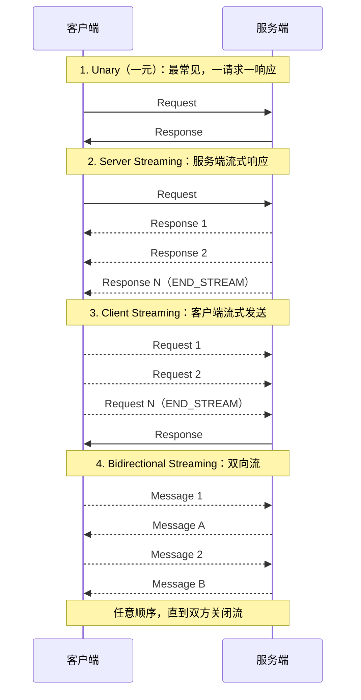

# 详解网络协议（24）· gRPC协议

> [!abstract] TL;DR
> **gRPC** 是 Google 于 2015 年开源的高性能、跨语言 **RPC（远程过程调用）框架**，以 **Protocol Buffers（protobuf）** 作为接口定义语言（IDL）和默认序列化格式，以 **HTTP/2** 作为传输层，支持**四种通信模式**（Unary、Server Streaming、Client Streaming、双向流）。它的核心价值在于强类型契约、高效二进制编码和原生流式支持，是微服务内部通信的主流选择之一。

## 概述与定位

在微服务架构中，服务间通信有两种主流范式：**REST/HTTP+JSON** 和 **RPC**。REST 对人友好（可读、可 curl 调试）但有结构性问题：无 IDL 强约束、JSON 序列化开销较大、没有内置流式支持。gRPC 走另一条路：用 `.proto` 文件定义接口契约，编译器生成客户端 Stub 和服务端骨架代码，调用方感觉像调本地函数，而实际发生的是跨进程的网络通信。

gRPC 的核心优势：

- **强契约**：`.proto` 文件是唯一真相来源，字段类型、必选/可选、版本兼容规则均由编译器保证，不依赖文档约定。
- **高效编码**：protobuf 二进制格式比 JSON 体积小 3~10 倍，解析速度快 5~10 倍（具体取决于数据结构）。
- **HTTP/2 原生多路复用**：同一 TCP 连接上并发多个 RPC 调用，无队头阻塞（相对 HTTP/1.1）。
- **四种流模式**：从简单的请求-响应到双向实时流，一个框架统一处理。
- **跨语言**：官方支持 Go、Java、C++、Python、Node.js、Ruby、C#、Kotlin 等，`.proto` 文件是语言无关的契约。

gRPC 的局限：
- 二进制格式不可读，调试需要工具（grpcurl、grpc-web 调试器）。
- 浏览器原生不支持 HTTP/2 Trailer（gRPC 传状态码用 Trailer），需要通过 gRPC-Web 代理。
- `.proto` 文件的维护和团队共享需要工程规范（版本管理、代码仓库）。

## 原理与机制

### Protocol Buffers 基础

protobuf 是 gRPC 的 IDL 和序列化格式。`.proto` 文件用声明式语法定义消息结构和服务接口：

```protobuf
syntax = "proto3";

package user;
option go_package = "github.com/example/user/pb";

// 消息定义：每个字段有类型、名称、唯一字段号
message GetUserRequest {
  int64 user_id = 1;
}

message User {
  int64   id       = 1;
  string  name     = 2;
  string  email    = 3;
  repeated string roles = 4;   // repeated = 数组
}

// 服务定义：四种 RPC 模式
service UserService {
  rpc GetUser(GetUserRequest) returns (User);                                      // Unary
  rpc ListUsers(ListUsersRequest) returns (stream User);                           // Server Streaming
  rpc BatchCreate(stream CreateUserRequest) returns (BatchCreateResponse);         // Client Streaming
  rpc Chat(stream ChatMessage) returns (stream ChatMessage);                       // Bidirectional
}
```

**字段号（Field Number）** 是 protobuf 向后兼容的核心：编码时字段用字段号而非字段名标识，接收方按字段号解析。因此：
- **字段号一旦分配给某个字段，永远不可复用**（即便该字段被删除，也需用 `reserved` 保留该字段号）。
- 已有字段只能修改名称（影响代码生成，不影响编码兼容），不能修改字段号和类型。
- 新增字段在 proto3 中都是可选的，老版本收到新消息时忽略未知字段（前向兼容）；新版本收到缺少新字段的消息时使用默认值（后向兼容）。

### protobuf 编码机制

protobuf 二进制格式是一系列 **Tag-Value 对**（无分隔符，长度由编码决定）。Tag 由字段号左移 3 位再 OR 上 wire type 组成：

| Wire Type | 值 | 适用类型 |
|---|---|---|
| Varint | 0 | int32/64, uint32/64, sint32/64, bool, enum |
| 64-bit | 1 | fixed64, sfixed64, double |
| Length-delimited | 2 | string, bytes, embedded message, repeated field |
| 32-bit | 5 | fixed32, sfixed32, float |

**Varint 编码**（变长整数）：小数值占少字节，大数值占多字节。每个字节低 7 位存数据，最高位 1 表示后面还有字节。数字 300（二进制 `100101100`）编码为 `10101100 00000010`（2 字节），而数字 1 仅需 `00000001`（1 字节）。

**ZigZag 编码**（sint32/sint64 专用）：将负数映射到正整数（-1 → 1，1 → 2，-2 → 3，2 → 4），使负数也能用小 varint 表示，解决了负数用普通 varint 总是 10 字节的问题。公式：`(n << 1) XOR (n >> 31)`。

**Length-delimited 编码**：先写 varint 表示后续字节数，再写实际内容。这使得 string、bytes、嵌套 message 都能安全解析（知道边界在哪里）。

### 四种通信模式

gRPC 支持四种 RPC 模式，均基于 HTTP/2 Stream 实现：



双向流模式下，客户端和服务端可以完全异步地互相发消息，适合实时聊天、协同编辑、游戏状态同步等场景。每个方向独立关闭（发送 `END_STREAM` 标志），允许半关闭状态。

### gRPC 与 HTTP/2 的映射

理解 gRPC 的关键是理解它如何映射到 HTTP/2 层：

**一个 gRPC 调用 = 一个 HTTP/2 Stream**，HTTP/2 Stream 是有 Stream ID 的逻辑通道，多个 Stream 复用同一 TCP 连接，互不阻塞。

请求头（HEADERS 帧）：
```
:method = POST
:scheme = https
:path = /user.UserService/GetUser
:authority = api.example.com
content-type = application/grpc
grpc-encoding = gzip          # 可选压缩
grpc-timeout = 5S              # deadline 传播
te = trailers                  # 必须，声明支持 Trailer
```

请求体（DATA 帧，gRPC Length-Prefixed Message 格式）：
```
Byte 0:    压缩标志（0=未压缩，1=已压缩）
Bytes 1-4: 消息长度（uint32，大端序）
Bytes 5+:  protobuf 序列化的消息体
```

响应同样是 HEADERS 帧（元数据）+ DATA 帧（消息）+ **Trailers**（HTTP/2 带 END_STREAM 标志的 HEADERS 帧），Trailers 携带：
```
grpc-status: 0            # 0=OK，非零=错误
grpc-message: ""          # 人类可读错误描述（URL-encoded）
```

这是 gRPC 区别于普通 HTTP API 的关键设计：**状态码在 Trailers 里，而非普通响应头**。这使得流式响应中途无法立即知道最终是否成功，需等流结束后才能拿到状态。

**HPACK 头压缩**：HTTP/2 使用 HPACK 算法压缩头部，静态表预定义常见头（如 `:method POST`），动态表记录此连接上出现过的头。对于 gRPC 服务，`:path`（包含服务名和方法名）在多次调用中可以复用动态表条目，大幅减少重复头的传输。

### gRPC 状态码

gRPC 定义了 17 个状态码（在 `google.golang.org/grpc/codes` 中），比 HTTP 状态码更细粒度：

| 状态码 | 值 | 含义 |
|---|---|---|
| OK | 0 | 成功 |
| CANCELLED | 1 | 调用方取消 |
| UNKNOWN | 2 | 未知错误 |
| INVALID_ARGUMENT | 3 | 参数无效（客户端问题） |
| DEADLINE_EXCEEDED | 4 | 超时 |
| NOT_FOUND | 5 | 资源不存在 |
| ALREADY_EXISTS | 6 | 资源已存在 |
| PERMISSION_DENIED | 7 | 无权限 |
| RESOURCE_EXHAUSTED | 8 | 资源耗尽（限流） |
| FAILED_PRECONDITION | 9 | 前提条件不满足 |
| ABORTED | 10 | 事务冲突等中止 |
| OUT_OF_RANGE | 11 | 超出有效范围 |
| UNIMPLEMENTED | 12 | 方法未实现 |
| INTERNAL | 13 | 服务端内部错误 |
| UNAVAILABLE | 14 | 服务暂不可用（可重试） |
| DATA_LOSS | 15 | 不可恢复的数据丢失 |
| UNAUTHENTICATED | 16 | 未认证 |

## 结构/算法/伪代码详解

### .proto 编译与代码生成流程

```
用户编写 service.proto
         │
         ▼
   protoc 编译器
   + grpc 插件
         │
    ┌────┴────┐
    ▼         ▼
service.pb.go   service_grpc.pb.go
（消息类型）      （服务接口+stub）
         │
    ┌────┴────┐
    ▼         ▼
Server 实现    Client 调用
（实现接口）    （调用stub）
```

生成的 Go 代码中，`UserServiceClient` 是自动生成的客户端 Stub，`UserServiceServer` 是服务端需要实现的接口，`RegisterUserServiceServer` 将实现注册到 gRPC Server。

### Deadline 传播

gRPC 使用 `Context` 传播 Deadline（超时截止时间）。客户端设置 5 秒超时后，这个 Deadline 以绝对时间戳（`grpc-timeout` 头计算为剩余时间）传递给服务端，服务端的 `ctx.Done()` 在 Deadline 到期时触发。若服务端调用了下游服务，应将同一个 ctx 传入，让 Deadline 自动沿调用链传播——避免"upstream 超时了但 downstream 还在跑"的资源浪费。

```go
// 客户端设置 deadline
ctx, cancel := context.WithTimeout(context.Background(), 5*time.Second)
defer cancel()
resp, err := client.GetUser(ctx, &pb.GetUserRequest{UserId: 123})

// 检查是否超时
if status.Code(err) == codes.DeadlineExceeded {
    log.Println("RPC 超时")
}
```

### 拦截器（Interceptor）

拦截器是 gRPC 的中间件机制，可在 RPC 调用前后执行逻辑：

```go
// Unary 服务端拦截器：记录日志
func loggingInterceptor(ctx context.Context, req interface{},
    info *grpc.UnaryServerInfo, handler grpc.UnaryHandler) (interface{}, error) {

    start := time.Now()
    resp, err := handler(ctx, req)
    log.Printf("method=%s duration=%v err=%v", info.FullMethod, time.Since(start), err)
    return resp, err
}

// 注册多个拦截器（链式执行）
server := grpc.NewServer(
    grpc.ChainUnaryInterceptor(
        authInterceptor,
        loggingInterceptor,
        rateLimitInterceptor,
    ),
)
```

流式 RPC 有对应的 `StreamInterceptor`，通过包装 `grpc.ServerStream` 接口拦截流操作。

### 元数据（Metadata）

元数据是附加在 RPC 调用上的键值对（类似 HTTP 头），用于传递认证 token、追踪 ID 等横切关注点：

```go
// 客户端发送元数据
md := metadata.Pairs("authorization", "Bearer "+token, "x-request-id", reqID)
ctx = metadata.NewOutgoingContext(ctx, md)

// 服务端读取元数据
md, ok := metadata.FromIncomingContext(ctx)
if tokens := md.Get("authorization"); len(tokens) > 0 {
    // 验证 token
}
```

### 负载均衡与服务发现

gRPC 支持**客户端侧负载均衡**：客户端持有多个服务端地址，按策略（轮询、权重等）分发请求，每个请求直连目标实例（无中间代理节点），减少一跳延迟。

架构：
1. **Name Resolver**：将服务名（如 `user-service.namespace.svc.cluster.local`）解析为地址列表。内置实现有 DNS，可扩展（Consul、Etcd、Kubernetes Endpoints）。
2. **Load Balancer Policy**：默认 `round_robin`（轮询），可自定义。

```go
conn, err := grpc.NewClient(
    "dns:///user-service:50051",
    grpc.WithDefaultServiceConfig(`{"loadBalancingPolicy":"round_robin"}`),
    grpc.WithTransportCredentials(creds),
)
```

对于服务网格（如 Istio），gRPC 的客户端 LB 可与 sidecar 代理协作，实现更复杂的流量策略（金丝雀发布、熔断）。

## 工具视角与实战

### grpcurl 命令行调试

`grpcurl` 是 gRPC 版的 `curl`，支持服务反射（Server Reflection，服务端动态暴露 .proto 信息）：

```bash
# 列出所有服务（需服务端开启 reflection）
grpcurl -plaintext localhost:50051 list

# 列出某服务的方法
grpcurl -plaintext localhost:50051 list user.UserService

# 调用 Unary RPC
grpcurl -plaintext -d '{"user_id": 123}' \
  localhost:50051 user.UserService/GetUser

# 带元数据（认证）
grpcurl -plaintext -H "authorization: Bearer mytoken" \
  -d '{"user_id": 123}' \
  localhost:50051 user.UserService/GetUser

# 调用服务端流式
grpcurl -plaintext -d '{"page_size": 10}' \
  localhost:50051 user.UserService/ListUsers
```

### gRPC-Web

原生 gRPC 要求 HTTP/2 Trailer，但浏览器 Fetch API 不暴露 Trailer（fetch 规范不支持），因此浏览器无法直接发起 gRPC 调用。**gRPC-Web** 通过协议转换解决此问题：

- 浏览器使用 gRPC-Web 客户端库（如 `@grpc/grpc-js` 配合 `grpc-web` 包）。
- 请求以 HTTP/1.1 或 HTTP/2 发出，但 Trailer 被编码为特殊的 DATA 帧（Trailers 帧，标志字节为 `0x80`）追加在响应体末尾。
- Envoy 代理（或 grpc-web-proxy）在服务端侧将 gRPC-Web 转为标准 gRPC。

```
Browser ──gRPC-Web/HTTP1.1──► Envoy ──gRPC/HTTP2──► gRPC Server
```

gRPC-Web 不支持客户端流和双向流（HTTP/1.1 不支持客户端流式）；服务端流可以支持。

### Go gRPC 完整示例

服务端（关键部分）：

```go
type userServer struct {
    pb.UnimplementedUserServiceServer  // 嵌入，保证未来新增方法不会 panic
}

func (s *userServer) GetUser(ctx context.Context, req *pb.GetUserRequest) (*pb.User, error) {
    if req.UserId <= 0 {
        return nil, status.Errorf(codes.InvalidArgument, "user_id 必须为正整数")
    }
    // ... 查询逻辑
    return &pb.User{Id: req.UserId, Name: "张三"}, nil
}

func (s *userServer) ListUsers(req *pb.ListUsersRequest, stream pb.UserService_ListUsersServer) error {
    for _, user := range users {
        if err := stream.Send(user); err != nil {
            return err  // 客户端取消或断开时 Send 返回错误
        }
    }
    return nil  // 返回 nil 表示流正常结束，框架发送 grpc-status: 0
}

func main() {
    lis, _ := net.Listen("tcp", ":50051")
    s := grpc.NewServer(
        grpc.Creds(credentials.NewTLS(tlsConfig)),
        grpc.ChainUnaryInterceptor(authInterceptor, loggingInterceptor),
    )
    pb.RegisterUserServiceServer(s, &userServer{})
    reflection.Register(s)  // 开启服务反射，供 grpcurl 使用
    s.Serve(lis)
}
```

## 安全性与正确使用

### 传输安全与认证

**TLS（mTLS）**：生产环境 gRPC 必须启用 TLS。微服务内部推荐 mTLS（双向 TLS），服务端和客户端均出示证书，实现零信任网络下的服务身份验证。服务网格（Istio）可自动为所有服务间通信注入 mTLS，无需业务代码感知。

**Token 认证（JWT/OAuth2）**：在 metadata 中传递 `authorization` 头，服务端拦截器统一验证。gRPC 框架的 `credentials.PerRPCCredentials` 接口可自动为每个 RPC 调用注入 token。

### 常见陷阱

**陷阱 1：忽略 Deadline**。gRPC 调用不设 Deadline 等于让请求可以无限等待，当下游服务异常时，所有 goroutine 都会被阻塞，最终 OOM。**任何对外 gRPC 调用都必须设 Deadline**，并正确传播 ctx。

**陷阱 2：字段号复用**。删除某个 proto 字段后，在同一 message 中将其字段号分配给新字段，会导致老版本客户端误解码新消息（因为它还以为那个字段号是旧字段的含义）。正确做法是 `reserved 5; reserved "old_field_name";` 永久保留。

**陷阱 3：proto3 默认值陷阱**。proto3 所有字段都有默认零值（int 为 0，string 为 ""，bool 为 false）且不区分"字段存在但为零值"与"字段不存在"。若业务逻辑需要区分，使用 `google.protobuf.Int64Value`（Wrapper 类型）或 proto3 的 `optional` 关键字（生成 `*int64` 指针）。

**陷阱 4：流式 RPC 中错误不立即体现**。对于服务端流，如果发生错误，客户端在遍历响应时才能通过最终 `Recv()` 的返回值感知，中间可能已处理了部分数据。应用逻辑需要处理流被中途终止的情况。

**陷阱 5：connection-level 错误 vs stream-level 错误**。HTTP/2 RST_STREAM 只重置单个 Stream（该 RPC 失败），GOAWAY 帧才是连接级别关闭。gRPC 客户端库处理 GOAWAY 时会将进行中的请求自动迁移到新连接，但应用层感知的是 `UNAVAILABLE` 错误，应实现带退避的重试。

**陷阱 6：负载均衡需连接池感知**。gRPC 在 HTTP/2 连接上多路复用，若只建一个连接到某个服务，则所有请求都发到同一实例。需使用 `round_robin` 策略 + 提供多个后端地址（或 DNS 返回多个 A 记录），确保请求真正分散到不同实例。

### 与 REST 的对比

| 维度 | gRPC | REST/JSON |
|---|---|---|
| 性能 | 二进制，体积小 3~10 倍，解析快 | 文本，可读但开销大 |
| 契约 | .proto 强约束，编译期检查 | OpenAPI 规范，运行时验证 |
| 流式 | 原生四种模式 | 需 SSE/WebSocket 单独处理 |
| 浏览器支持 | 需 gRPC-Web + 代理 | 原生支持 |
| 调试 | 需 grpcurl/grpcui 工具 | curl/Postman 即可 |
| 适用场景 | 微服务内部通信、性能敏感 | 公开 API、第三方集成、WebApp |

## 小结

gRPC 通过 protobuf（强类型契约 + 高效二进制编码）和 HTTP/2（多路复用 + 流式支持）的组合，在微服务 RPC 场景实现了性能与开发体验的双优。四种通信模式满足从简单请求响应到实时双向流的全部需求，Deadline 传播、拦截器、元数据机制使跨服务的横切关注点有章可循。关键设计原则：字段号不可复用确保 protobuf 向后兼容；所有外部调用必须设 Deadline；mTLS 是生产级微服务内部通信的安全基准。gRPC-Web 弥补了浏览器侧的空白，服务网格与 gRPC 客户端 LB 的结合则是大规模微服务部署的主流方案。

## 相关阅读

- [[00.网络协议详解总览]]
- [[18.HTTP-HTTPS协议]]
- [[15.TLS协议]]
- [[23.MQTT协议]]
- [[25.WebRTC协议]]

> ⬅️ [[23.MQTT协议]] ｜ 🏠 [[00.网络协议详解总览]] ｜ [[25.WebRTC协议]] ➡️
