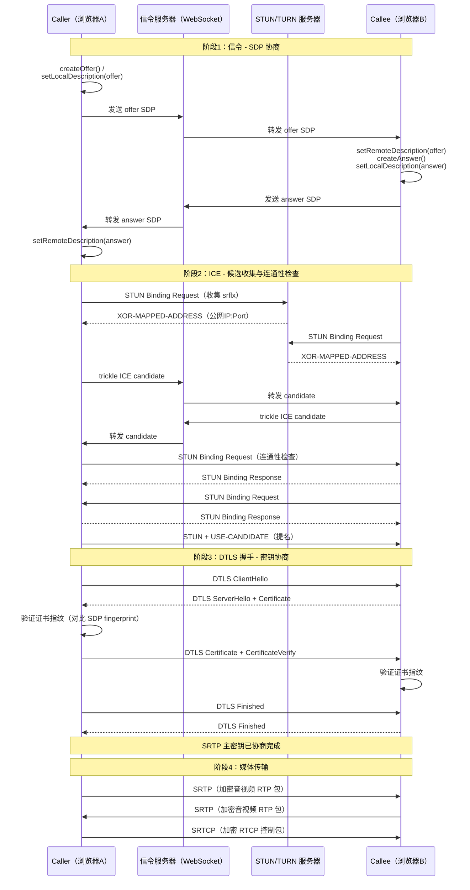

# 详解网络协议（25）· WebRTC协议

> [!abstract] TL;DR
> **WebRTC（Web Real-Time Communication）** 是由 W3C/IETF 联合制定的浏览器端到端实时音视频与数据通信框架，允许网页在**无需插件**的前提下建立点对点（P2P）媒体与数据通道。其协议栈自底向上为：**ICE**（穿透 NAT）→ **DTLS**（密钥协商）→ **SRTP/SRTCP**（媒体加密）/ **SCTP**（数据通道）。信令层由应用自定义，WebRTC 不规定，但定义了 **SDP offer/answer** 媒体协商模型。
>
> 一句话口诀：**WebRTC = 信令（你自定义）+ ICE（打洞）+ DTLS（密钥）+ SRTP（安全媒体）——每一层解决一个问题，合起来让浏览器端到端视频打通。**

## 概述与定位

### 为什么需要 WebRTC

在 WebRTC 出现之前，浏览器做实时音视频必须依赖 Flash 插件或专有客户端。2011 年 Google 将收购自 GIPS 的音视频引擎开源，联合 Mozilla 和 Opera 推动 W3C 标准化。2021 年 W3C 与 IETF 同步发布正式标准（RFC 8825–8836 系列）。

WebRTC 的目标是：
- **浏览器内置**：无需插件，JavaScript API（`RTCPeerConnection`、`MediaStream`、`RTCDataChannel`）直接调用。
- **端到端（P2P）优先**：媒体流尽可能直连，降低服务器带宽成本与延迟。
- **强制加密**：DTLS + SRTP，所有媒体和数据通道均加密，不允许明文传输。
- **自适应网络**：内置拥塞控制（GCC）、带宽估计（REMB/TWCC）、丢包重传（NACK）与前向纠错（FEC）。

### 典型应用场景

| 场景 | 说明 |
|------|------|
| 视频会议 | Google Meet、Zoom Web 客户端、Teams Web 端 |
| 在线直播互动 | 超低延迟（< 500 ms）的连麦、PK |
| 屏幕共享 | `getDisplayMedia()` 捕获桌面后通过 SRTP 传输 |
| P2P 文件传输 | DataChannel 传大文件，绕过服务器 |
| 在线游戏 | DataChannel 提供低延迟、部分可靠消息通道 |

### 与传统流媒体协议对比

| 维度 | WebRTC | RTMP | HLS/DASH |
|------|--------|------|----------|
| 延迟 | < 500 ms | 1–3 s | 3–30 s |
| 加密 | 强制 DTLS+SRTP | 可选 TLS | HTTPS |
| 拓扑 | P2P / MCU / SFU | 服务器中继 | CDN 分发 |
| 浏览器支持 | 原生 | 需插件（已弃用） | 原生 |
| 数据通道 | 支持 DataChannel | 否 | 否 |

---

## 原理与机制

### 协议栈总览

WebRTC 的协议栈是一个精心设计的分层体系，每层都有明确职责：

```
应用层（JS API）
    RTCPeerConnection / RTCDataChannel / MediaStream
         │
信令层（应用自定义，如 WebSocket）
    SDP offer/answer ← 协商媒体参数
         │
传输层（ICE + UDP/TCP）
    ICE ← 候选地址发现 + NAT穿透 + 连通性检查
         │
安全层
    DTLS（握手 + 密钥协商）← 基于 UDP 的 TLS
         │
媒体/数据层
    SRTP/SRTCP（音视频流）   SCTP over DTLS（DataChannel）
         │
网络层
    UDP（主路）/ TCP（回退）
```

整个建连流程分为三个阶段，缺一不可：
1. **信令交换**：通过应用服务器交换 SDP，协商编解码器、传输参数。
2. **ICE 过程**：双方收集候选地址，通过 STUN/TURN 探测可用路径，完成 NAT 穿透。
3. **DTLS 握手**：基于 ICE 建立的底层路径，完成证书交换与对称密钥协商。之后媒体走 SRTP，数据走 SCTP。

### 信令：SDP offer/answer 模型

WebRTC 不规定信令协议（不像 SIP 强制 SIP 信令），但规定媒体协商必须遵循 **JSEP（JavaScript Session Establishment Protocol，RFC 8829）** 定义的 **offer/answer 模型**，协商内容用 **SDP（Session Description Protocol，RFC 4566/8866）** 表达。

**SDP 的核心内容**

SDP 是纯文本格式，由一系列 `字母=值` 行组成：

```
v=0                              # 版本
o=- 1234567 2 IN IP4 0.0.0.0    # 会话 originator
s=-                              # 会话名
t=0 0                            # 时间（永久）
a=group:BUNDLE 0 1               # 媒体复用（同一 ICE 通道复用多路媒体）
a=msid-semantic: WMS             # 媒体流语义

m=audio 9 UDP/TLS/RTP/SAVPF 111  # 音频媒体块
c=IN IP4 0.0.0.0
a=rtcp-mux                       # RTP/RTCP 同端口
a=ice-ufrag:xxxx                 # ICE 用户名片段
a=ice-pwd:yyyyyyy                # ICE 密码
a=fingerprint:sha-256 AA:BB:...  # DTLS 证书指纹
a=setup:actpass                  # DTLS 角色（主动或被动）
a=rtpmap:111 opus/48000/2        # Opus 编解码器
a=fmtp:111 minptime=10;useinbandfec=1
a=candidate:...                  # ICE 候选地址（可在 trickle 时追加）

m=video 9 UDP/TLS/RTP/SAVPF 96
a=rtpmap:96 VP8/90000
a=rtcp-fb:96 nack                # 支持 NACK 重传
a=rtcp-fb:96 nack pli            # 支持图片丢失指示
a=rtcp-fb:96 goog-remb           # 支持 REMB 带宽估计
```

**offer/answer 过程**

```
Caller                      Signaling Server              Callee
  │  createOffer()              │                            │
  │  ──── offer SDP ──────────▶ │ ──── forward offer ──────▶ │
  │                             │        setRemoteDescription │
  │                             │        createAnswer()       │
  │  ◀─── answer SDP ──────────── ◀──── answer SDP ──────── │
  │  setRemoteDescription       │                            │
```

关键状态机（JSEP）：
- `createOffer()` → `setLocalDescription(offer)` → 发送给对端
- 收到 answer → `setRemoteDescription(answer)` → ICE 开始
- 任何一端调用 `setLocalDescription` 后，浏览器开始 ICE 候选收集，并通过 **ICE trickle**（RFC 8840）逐步将候选发送给对端，加快建连速度。

### ICE：NAT 穿透的核心

**ICE（Interactive Connectivity Establishment，RFC 8445）** 是 WebRTC 能穿越各种 NAT 拓扑的根本原因。

#### 候选地址类型

| 类型 | 英文 | 说明 |
|------|------|------|
| host | host | 本机网卡 IP（含 VPN 虚拟接口） |
| srflx | server-reflexive | 通过 STUN 服务器发现的公网映射地址（IP:Port） |
| prflx | peer-reflexive | 连通性检查中动态发现的对端反射地址 |
| relay | relay | 通过 TURN 服务器分配的中继地址（最保底） |

#### STUN 探测公网映射

STUN（RFC 5389）是一个轻量的请求/响应协议，Client 向 STUN 服务器发 `Binding Request`，服务器在响应中附带观察到的源地址（`XOR-MAPPED-ADDRESS`），Client 据此得知自己的公网 IP:Port（srflx 候选）。

#### TURN 中继

当对称 NAT（Symmetric NAT）两端都使用时，直连无法穿透，需要 TURN 服务器中继。TURN（RFC 5766）基于 STUN 扩展，Client 向 TURN 服务器申请 `Allocation`，服务器分配一个 relay 地址，双方通过服务器转发数据。TURN 是最后的保底手段，会增加延迟和服务器带宽消耗。

#### 连通性检查：配对与提名

ICE 将两端收集到的候选两两配对，形成 **候选对（Candidate Pair）**，然后按优先级（relay < srflx < host，同类按 IP 排序）排序，使用 **STUN Binding Request** 进行连通性检查：

```
控制端（Controller）                受控端（Controlled）
     │  STUN Binding Request          │
     │  ─────────────────────────────▶│
     │  ◀─────────────────────────────│
     │       STUN Binding Response    │
```

双向均能收到响应则该候选对 **Succeeded**。控制端选择一个成功的候选对发送 `USE-CANDIDATE` 属性的 STUN 请求，完成 **提名（Nomination）**。ICE 进入 `Completed` 状态，后续 DTLS/SRTP 走该路径。

#### NAT 类型与穿透能力

| 发起方 NAT | 目标方 NAT | 能否直连 |
|-----------|-----------|---------|
| Full Cone | 任意 | 可以 |
| Restricted Cone | Restricted Cone | 可以（需同时发包） |
| Port Restricted | Port Restricted | 可以（需同时发包） |
| Symmetric | Symmetric | 不能，需 TURN |
| Symmetric | Port Restricted | 不能，需 TURN |

---

## 结构/算法/伪代码详解

### WebRTC 完整建连时序



### DTLS 握手与 SRTP 密钥提取

DTLS（Datagram TLS，RFC 6347）本质是 TLS 1.2/1.3 在 UDP 上的适配版，增加了：
- **序列号与滑动窗口**：防止重放攻击，处理乱序。
- **重传计时器**：UDP 无可靠性保障，DTLS 自行重传握手消息。
- **记录层分片**：握手消息可跨多个 UDP 数据包分片。

DTLS-SRTP（RFC 5764）在 DTLS 握手中通过 `use_srtp` 扩展协商 SRTP 加密套件（如 `SRTP_AES128_CM_HMAC_SHA1_80`），握手完成后用 `TLS-PRF` 导出 SRTP 主密钥与主盐：

```
SRTP 主密钥（16 字节）和主盐（14 字节）= TLS-PRF(
    master_secret,
    "EXTRACTOR-dtls_srtp",
    client_random || server_random,
    所需长度
)
```

**证书指纹验证**是 WebRTC 防止中间人攻击的关键：SDP 中的 `a=fingerprint:sha-256 <hash>` 是通过信令通道（通常有 HTTPS 保护）传递的，DTLS 握手时对端证书的指纹必须与此匹配，否则连接拒绝。

### SRTP：媒体流加密

SRTP（Secure RTP，RFC 3711）在 RTP 包基础上添加：
- **加密**：默认 AES-128-CM（计数器模式），加密负载，不加密 RTP 头（便于中间设备处理）。
- **消息认证**：HMAC-SHA1-80（截断 80 bit），覆盖整包（含头部），防篡改。
- **重放保护**：滑动窗口（Sliding Window），拒绝处理已接收或过期的包。

**SRTP 包结构**（在原 RTP 包外层视图）：

```
 0                   1                   2                   3
 0 1 2 3 4 5 6 7 8 9 0 1 2 3 4 5 6 7 8 9 0 1 2 3 4 5 6 7 8 9 0 1
├─────────────────────────────────────────────────────────────────┤
│  V=2│P│X│  CC │M│       PT        │       Sequence Number       │  ← RTP 头（明文）
├─────────────────────────────────────────────────────────────────┤
│                           Timestamp                             │
├─────────────────────────────────────────────────────────────────┤
│                     SSRC（流标识符）                              │
├─────────────────────────────────────────────────────────────────┤
│                   加密的 RTP 负载（Encrypted Payload）            │
├─────────────────────────────────────────────────────────────────┤
│              SRTP MKI（可选，密钥标识）                            │
├─────────────────────────────────────────────────────────────────┤
│          认证标签（Authentication Tag，80 bit / 10 字节）          │
└─────────────────────────────────────────────────────────────────┘
```

SRTCP 对 RTCP 包做类似处理，额外增加一个 32 位的 **SRTCP Index**（最高位 E 标志表示是否加密）。

### DataChannel：基于 SCTP 的数据通道

RTCDataChannel 底层使用 **SCTP（Stream Control Transmission Protocol）over DTLS over ICE/UDP**。相比 TCP，SCTP 提供：

| 特性 | SCTP | TCP |
|------|------|-----|
| 多流（Streams） | 单连接内多条独立流 | 单流 |
| 消息边界 | 保留（类似 UDP） | 字节流（无边界） |
| 头阻塞 | 流间无头阻塞 | 全局头阻塞 |
| 可靠性 | 可配置：完全可靠 / 部分可靠（maxRetransmits / maxPacketLifeTime） | 强制完全可靠 |
| 乱序发送 | 可选 | 不支持 |

DataChannel 的 **部分可靠（Partially Reliable）** 模式（RFC 3758 SCTP PR-SCTP）特别适合游戏状态同步：允许丢弃过期的游戏帧，无需等待重传，避免延迟积累。

创建 DataChannel 时可指定参数：
```javascript
const dc = pc.createDataChannel("game-state", {
    ordered: false,           // 允许乱序
    maxRetransmits: 0,        // 最多重传 0 次（完全不可靠）
    // 或 maxPacketLifeTime: 100 // 100ms 内有效，超时丢弃
});
```

### 带宽自适应与拥塞控制

WebRTC 在网络质量变化时能自动调整发送码率，核心机制：

**1. REMB（Receiver Estimated Maximum Bitrate）**

接收端通过 RTCP 扩展反馈包向发送端报告估计的最大可接收带宽。发送端据此调整编码器码率。REMB 精度较低（依赖接收端估计），已逐渐被 TWCC 取代。

**2. TWCC（Transport-Wide Congestion Control，draft-ietf-rmcat-transport-wide-cc）**

接收端记录每个 RTP 包的到达时间，通过 RTCP 扩展（`transport-cc`）将到达时间序列反馈给发送端。发送端在本地运行 **GCC（Google Congestion Control）** 算法，根据延迟梯度（Delay Gradient）和丢包率估计可用带宽：

```
delay_gradient = (到达时间差) - (发送时间差)
若 delay_gradient 持续增大 → 网络排队增多 → 减小发送码率
若 delay_gradient 稳定 / 减小 → 网络有余量 → 缓慢增大发送码率
```

GCC 内部分为两个控制器：
- **基于延迟的控制器（Delay-based controller）**：通过卡尔曼滤波器估计链路延迟趋势，生成带宽上限 `A_s`。
- **基于丢包的控制器（Loss-based controller）**：根据 RTCP RR 的 fraction_lost 字段调整码率。
- 最终码率 = min(A_s, 基于丢包码率)。

**3. 前向纠错（FEC）与 NACK**

- **RED（Redundant Encoding，RFC 2198）+ ULPFEC**：发送端在 RTP 包中冗余携带前一帧数据，接收端单包丢失时无需重传即可恢复。
- **NACK（Negative Acknowledgment）**：接收端检测到序列号跳变，通过 RTCP 反馈请求发送端重传特定包，适合低延迟场景（时延容忍 > 100 ms）。

---

## 工具视角与实战

### chrome://webrtc-internals

Chrome/Edge 内置 WebRTC 调试页面，是排查 WebRTC 问题最强大的工具：

- **ICE candidates**：查看 host/srflx/relay 候选是否收集完整，最终使用的候选对类型（若为 relay 说明 P2P 穿透失败）。
- **Stats graphs**：实时查看 `packetsSent`、`packetsLost`、`jitter`、`roundTripTime`、`availableOutgoingBitrate` 等关键指标。
- **SDP**：查看 offer/answer 原始文本，确认编解码器协商结果。

```
打开方式：地址栏输入 chrome://webrtc-internals
          Edge：edge://webrtc-internals
```

### 常见排查步骤

**问题1：ICE 连接失败（iceConnectionState = failed）**

```
排查步骤：
1. 检查 webrtc-internals → ICE candidates：
   - host 候选是否有？（没有说明 getUserMedia 或网卡异常）
   - srflx 候选是否有？（没有说明 STUN 服务器不可达）
   - relay 候选是否有？（没有且对称 NAT 环境必须有 TURN）
2. 检查 TURN 服务器凭据是否过期（RTCIceServer 的 username/credential）
3. 检查防火墙是否封锁 UDP 3478（STUN/TURN 端口）
4. 考虑添加 TURN over TCP（端口 443）作为回退
```

**问题2：视频质量差 / 卡顿**

```
排查步骤：
1. webrtc-internals → packetLoss > 3% → 考虑开启 FEC 或降码率
2. jitter > 50ms → 接收端抖动缓冲区满，考虑增大 jitter buffer
3. roundTripTime > 200ms → 网络路径过长，检查 TURN 地理位置
4. availableOutgoingBitrate 持续低于目标码率 → 网络拥塞，GCC 在限速
```

**问题3：DataChannel 不稳定**

```
排查步骤：
1. 检查 SCTP 连接状态（pc.sctp.state）
2. 大文件传输需手动实现流控：datachannel.bufferedAmount > threshold 时暂停发送
   dc.onbufferedamountlow = () => { resumeSending(); };
   dc.bufferedAmountLowThreshold = 65536; // 64KB
```

### 典型 JavaScript 建连代码结构

```javascript
// 1. 创建 PeerConnection
const pc = new RTCPeerConnection({
    iceServers: [
        { urls: 'stun:stun.example.com:3478' },
        {
            urls: 'turn:turn.example.com:3478',
            username: 'user',
            credential: 'pass'
        }
    ],
    iceTransportPolicy: 'all'  // 'relay' 强制走 TURN
});

// 2. 添加本地媒体轨道
const stream = await navigator.mediaDevices.getUserMedia({ video: true, audio: true });
stream.getTracks().forEach(track => pc.addTrack(track, stream));

// 3. ICE candidate 通过信令发送给对端
pc.onicecandidate = (event) => {
    if (event.candidate) {
        signalingChannel.send(JSON.stringify({ type: 'candidate', candidate: event.candidate }));
    }
};

// 4. 创建 offer 并设置本地描述
const offer = await pc.createOffer();
await pc.setLocalDescription(offer);
signalingChannel.send(JSON.stringify({ type: 'offer', sdp: offer.sdp }));

// 5. 收到 answer 后设置远端描述
signalingChannel.onmessage = async (msg) => {
    const data = JSON.parse(msg.data);
    if (data.type === 'answer') {
        await pc.setRemoteDescription(new RTCSessionDescription(data));
    } else if (data.type === 'candidate') {
        await pc.addIceCandidate(new RTCIceCandidate(data.candidate));
    }
};
```

### SFU 与 MCU 架构

在多人会议场景，纯 P2P（全网状拓扑）会导致每个客户端同时上传 N-1 路视频，带宽消耗 O(N²)，不可扩展。常用服务器辅助架构：

| 架构 | 全称 | 原理 | 优点 | 缺点 |
|------|------|------|------|------|
| SFU | Selective Forwarding Unit | 服务器转发，不解码 | 低延迟、服务器 CPU 消耗低 | 带宽仍需 O(N) 上行 |
| MCU | Multipoint Control Unit | 服务器混流解码再编码 | 客户端只需 1 路上行+1 路下行 | 服务器 CPU 消耗极高、延迟增大 |

Mediasoup、Janus、Jitsi 均基于 SFU 架构。

---

## 安全性与正确使用

### 强制加密的保障

WebRTC 从规范层面强制要求：
- **DTLS + SRTP**：媒体传输必须加密，浏览器实现不允许明文 RTP（RFC 8827 明确禁止）。
- **证书指纹绑定**：SDP 中 `a=fingerprint` 与 DTLS 证书绑定，防止中间人替换 DTLS 证书。
- **信令通道保护**：WebRTC 本身不保护信令，应用必须将信令通道架设在 HTTPS/WSS 上，否则 SDP 被篡改会导致密钥协商失效或流量被劫持。

### 隐私风险：IP 泄露

WebRTC 默认收集所有网络接口的 host 候选，包括 VPN 虚拟接口和本地局域网 IP，可能导致：
- VPN 用户的真实 IP 被泄露（WebRTC IP Leak）。
- 内网拓扑信息暴露。

**缓解措施**：
1. 浏览器设置 `RTCIceTransportPolicy: 'relay'` 仅使用 relay 候选（强制走 TURN，不暴露 host）。
2. Chrome/Edge 默认已对非公共接口的候选做 mDNS 匿名化（`abc123.local` 替代真实 IP）。
3. Firefox 默认不收集 VPN 接口之外的候选。

### TURN 凭据安全

TURN 服务器凭据（username/credential）通常通过后端动态生成（Time-limited HMAC 凭据，RFC 5766 附录 B），有效期设置为 1 小时左右，防止凭据泄露后被滥用：

```
username = timestamp:userid
password = base64(HMAC-SHA1(shared_secret, username))
```

### SDP 注入防御

若信令通道不安全（HTTP WebSocket），攻击者可能修改 SDP 中的 `a=fingerprint`，导致 DTLS 握手使用攻击者证书。务必：
- 信令走 WSS（WebSocket over TLS）。
- 服务端对 SDP 内容做基本验证（格式合法性），拒绝异常大或格式错误的 SDP。

---

## 小结

WebRTC 是目前浏览器实时通信的事实标准，其核心设计哲学是**职责分离**：

- **信令层**：由应用自定义，灵活适配各种业务协议（SIP、专有 WebSocket 协议等），WebRTC 只定义媒体协商的 SDP 格式与 offer/answer 模型。
- **传输层（ICE）**：解决 NAT 穿透这一互联网通信最棘手的问题，通过 STUN 发现、TURN 中继和连通性检查逐步收敛到最优路径。
- **安全层（DTLS）**：为 UDP 上的通信提供类 TLS 的安全保障，证书指纹绑定在 SDP 中防止中间人攻击。
- **媒体层（SRTP/SRTCP）**：基于协商好的密钥对 RTP/RTCP 包加密认证，兼顾性能（不加密 RTP 头以支持中间设备）与安全。
- **数据层（DataChannel/SCTP）**：提供灵活的可靠/不可靠消息通道，弥补了 WebSocket 在 P2P 数据传输上的空白。

理解 WebRTC 的关键是掌握建连四阶段（信令→ICE→DTLS→SRTP）的依赖关系，以及每层协议解决的具体问题。在生产环境中，NAT 穿透成功率、TURN 服务容量规划和拥塞控制调优是影响用户体验的三大核心因素。

---

## 相关阅读

- [[24.gRPC协议]] — gRPC 的流式 RPC 模型与 WebRTC DataChannel 流传输的对比
- [[16.UDP协议]] — WebRTC 底层依赖 UDP，理解 UDP 特性有助于理解 WebRTC 的设计取舍
- [[15.TLS协议]] — DTLS 是 TLS 在 UDP 上的适配，TLS 握手原理与 DTLS 高度相似
- [[13.TCP协议]] — DataChannel 可靠模式与 TCP 的可靠保障机制对比
- [[17.广播与组播]] — 组播在视频分发中的应用，与 WebRTC P2P 模型的对比
- [[00.网络协议详解总览]] — 本系列总览

> ⬅️ [[24.gRPC协议]] ｜ 🏠 [[00.网络协议详解总览]] ｜ [[26.NTP与PTP协议]] ➡️
