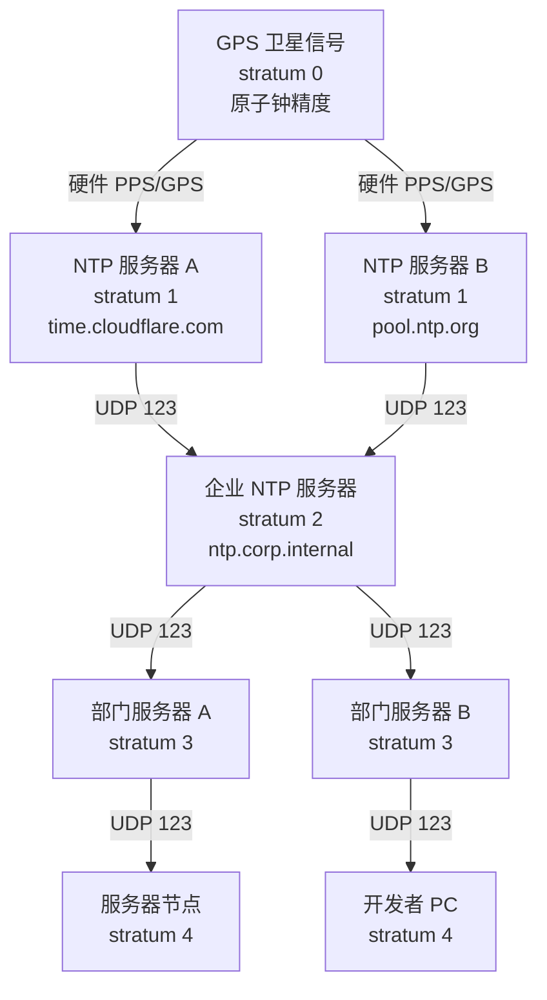
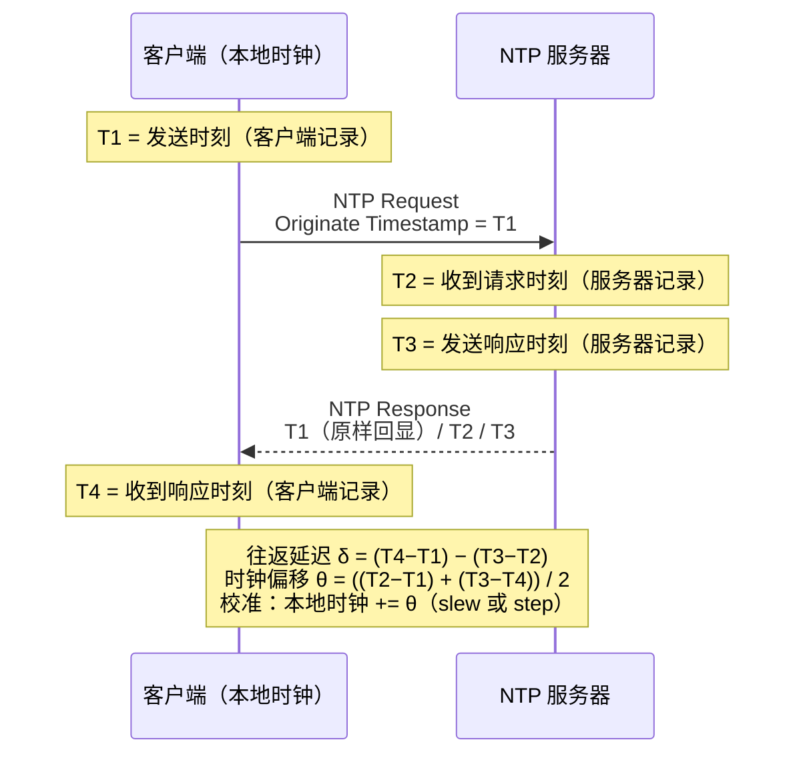

# 详解网络协议（26）· NTP与PTP协议

> [!abstract] TL;DR
> **NTP（Network Time Protocol）** 和 **PTP（Precision Time Protocol / IEEE 1588）** 是网络时间同步的两大标准。NTP 运行在应用层，通过 stratum 层次结构将时间从原子钟溯源到互联网终端，典型精度为局域网内 < 1 ms、广域网内 1–50 ms；PTP 借助硬件时间戳将精度压到亚微秒乃至纳秒级，广泛用于金融交易、工业控制和 5G 基站授时。NTS（RFC 8915）为 NTP 加装了密码学认证，解决长期以来 NTP 易被欺骗的安全短板。
>
> 一句话口诀：**NTP 是"互联网对表"——层层校准到毫秒；PTP 是"工厂精密仪器"——硬件打时间戳，亚微秒级同步；两者本质都是测量往返延迟来估算时钟偏差。**

## 概述与定位

### 为什么时间同步如此重要

在单机系统中，时间只是"几点几分"，精度需求不高。但在分布式系统中，时间是**因果关系的基础**：

| 场景 | 时间依赖 |
|------|---------|
| 分布式日志 | 跨节点日志排序：哪条消息先发生？ |
| 数据库事务 | 快照隔离（MVCC）、全局事务排序（Spanner TrueTime）|
| TLS/PKI 证书 | 证书有效期校验，时钟偏差大则无法建立 HTTPS |
| Kerberos 认证 | 默认容忍 5 分钟时钟偏差，超出则认证失败 |
| 金融交易 | 监管要求交易时间戳精度达 1 μs（MiFID II） |
| 5G 基站 | 基站间同步误差 < 1.5 μs（3GPP TS 36.133）|
| 工业控制 | 运动控制网络（EtherCAT/Profinet RT）要求 < 100 ns |

时间不同步会引发诸多诡异问题：
- 分布式数据库中"后写"的数据看起来比"先写"的旧（时钟回拨）。
- 证书突然失效（客户端时钟超前，服务端证书看起来已过期）。
- 日志条目的时间戳不可信，排障困难。

### NTP vs PTP 定位

| 维度 | NTP | PTP（IEEE 1588） |
|------|-----|-----------------|
| 精度目标 | 毫秒到亚毫秒 | 亚微秒到纳秒 |
| 硬件依赖 | 无（纯软件） | 支持硬件时间戳（精度大幅提升）|
| 拓扑 | stratum 树 | 主时钟/边界时钟/透明时钟 |
| 网络 | UDP 123（互联网适用）| UDP 319/320 或以太网（局域网）|
| 部署复杂度 | 低 | 中到高（需硬件支持）|
| 典型场景 | 服务器/PC/手机对时 | 金融交易所、5G 基站、工厂自动化 |
| 安全 | 历史上脆弱（NTS 改善）| 通常在受控专网，安全模型不同 |

---

## 原理与机制

### NTP：stratum 层次结构

NTP（RFC 5905，第四版）使用 **stratum（层级）** 概念组织时间溯源链路：

```
stratum 0   原子钟 / GPS 接收机 / 铷钟
    │           （硬件参考时钟，不直接参与网络）
stratum 1   直连 stratum 0 的 NTP 服务器（时间源头）
    │           示例：time.cloudflare.com、pool.ntp.org 中的服务器
stratum 2   从多个 stratum 1 同步的服务器
    │           示例：企业内网 NTP 服务器
stratum 3   从 stratum 2 同步的服务器
    │           示例：部门级 NTP 服务器
    ...
stratum 15  合法最大层级
stratum 16  表示"未同步"（Kiss-of-Death 包中出现）
```

**设计原则**：
- 每个客户端从多个服务器（通常 3–5 个）获取时间，通过算法选出可信时间源，对抗单点错误。
- stratum 越低越接近参考时钟，但不代表精度一定更好（网络路径质量同样关键）。
- 服务器对客户端来说也是客户端（相对其上游），形成树形溯源结构。

### NTP 报文格式

NTP v4 使用 **UDP 端口 123**，固定 48 字节（不含扩展字段）：

```
 0                   1                   2                   3
 0 1 2 3 4 5 6 7 8 9 0 1 2 3 4 5 6 7 8 9 0 1 2 3 4 5 6 7 8 9 0 1
├──┬──┬───────┬───────────────┬───────────────────────────────────┤
│LI│VN│ Mode  │    Stratum    │      Poll     │    Precision      │  4 字节
├─────────────────────────────────────────────────────────────────┤
│                       Root Delay（32 bit）                       │  4 字节
├─────────────────────────────────────────────────────────────────┤
│                      Root Dispersion（32 bit）                   │  4 字节
├─────────────────────────────────────────────────────────────────┤
│                     Reference ID（32 bit）                       │  4 字节
├─────────────────────────────────────────────────────────────────┤
│                   Reference Timestamp（64 bit）                  │  8 字节
├─────────────────────────────────────────────────────────────────┤
│                    Originate Timestamp（T1，64 bit）              │  8 字节
├─────────────────────────────────────────────────────────────────┤
│                     Receive Timestamp（T2，64 bit）               │  8 字节
├─────────────────────────────────────────────────────────────────┤
│                    Transmit Timestamp（T3，64 bit）               │  8 字节
└─────────────────────────────────────────────────────────────────┘
```

各字段含义：

| 字段 | 长度 | 说明 |
|------|------|------|
| LI（Leap Indicator） | 2 bit | 闰秒预警：00=正常，01=最后一分钟 61 秒，10=最后一分钟 59 秒，11=时钟未同步 |
| VN（Version Number） | 3 bit | NTP 版本，当前为 4 |
| Mode | 3 bit | 0=保留，1=对称主动，2=对称被动，3=客户端，4=服务器，5=广播，6=NTP 控制，7=私有 |
| Stratum | 8 bit | 0=未指定/KoD，1=参考时钟，2–15=层级 |
| Poll | 8 bit | 轮询间隔的 log₂ 值（秒），通常 6=64s 到 10=1024s |
| Precision | 8 bit | 系统时钟精度的 log₂ 值（秒），如 -20 表示约 1 μs |
| Root Delay | 32 bit | 到 stratum 0 参考时钟的往返路径总延迟（16.16 定点数，秒） |
| Root Dispersion | 32 bit | 到 stratum 0 的最大误差（离散度，16.16 定点数） |
| Reference ID | 32 bit | stratum 1 时为 4 字符 ASCII（如 "GPS "，"ATOM"）；stratum 2+ 时为上游服务器 IP 的低 32 位 |
| Reference Timestamp | 64 bit | 本地时钟最后一次同步时的时间 |
| Originate Timestamp（T1） | 64 bit | 客户端发送请求的时间（由服务器原样回显） |
| Receive Timestamp（T2） | 64 bit | 服务器收到请求的时间 |
| Transmit Timestamp（T3） | 64 bit | 服务器发送响应的时间 |

客户端收到响应后记录本地时间 **T4**，形成完整的四时间戳。

### NTP 四时间戳：偏移与延迟计算

这是 NTP 的核心数学原理，也是理解 NTP 精度来源的关键。

```
客户端                              服务器
  │                                   │
T1│ ─── Request ──────────────────── │T2
  │                                   │
  │                              T3  │
T4│ ◀── Response ─────────────────── │
```

假设网络路径对称（上行与下行延迟相等），则：

```
往返延迟（RTT / Round-trip delay）：
    δ = (T4 - T1) - (T3 - T2)
      = (客户端等待时间) - (服务器处理时间)

时钟偏移（Offset）：
    θ = ((T2 - T1) + (T3 - T4)) / 2
      = (上行偏差 + 下行偏差) / 2
```

**直觉解释**：
- `T2 - T1`：从客户端视角看，服务器时钟比本地"快"了多少（含网络单程延迟）。
- `T3 - T4`：从服务器视角看，服务器时钟比客户端"快"了多少（含网络单程延迟，符号相反）。
- 两者平均就消去了网络延迟（假设对称），得到纯时钟偏差 θ。

**对称假设的局限**：如果上下行延迟不对称（如非对称 ADSL 链路），NTP 的偏移估算会有误差。这也是 NTP 在广域网上精度有限（通常 1–50 ms）的根本原因，而 PTP 通过更精细的延迟测量来缓解此问题。

### 时钟过滤、选择与组合算法

NTP 从多个服务器收集样本，分多阶段处理：

**第一阶段：时钟过滤（Clock Filter）**

对每个服务器保留最近 8 个样本，选出往返延迟 δ 最小的样本作为该服务器的"最优样本"。延迟最小通常意味着网络路径最短、测量最准确。

**第二阶段：时钟选择（Clock Select，Marzullo 交集算法）**

从多个服务器的最优样本中，找出"真实时间"最有可能落入的区间交集：

```
每个服务器 i 提供一个区间：
    [θᵢ - εᵢ, θᵢ + εᵢ]
其中 εᵢ = ρᵢ（本机精度）+ φᵢ（服务器离散度）+ δᵢ/2（路径延迟上界）

Marzullo 算法求最大交集（intersection）：
    找到包含最多服务器区间的最小公共子区间
    区间内的服务器被标记为"一致（truechimer）"
    被排除在外的服务器被标记为"谎言者（falseticker）"
```

只有 truechimer 服务器参与后续计算，这使得 NTP 能容忍少数故障或被攻击的服务器。

**第三阶段：时钟组合（Clock Combine）**

对所有 truechimer 的偏移值进行加权平均（权重反比于方差/离散度），得到最终的综合偏移估计 Θ 和误差界。

**第四阶段：时钟纪律（Clock Discipline）**

根据估算偏移 Θ 调整本地时钟，采用 **PLL（锁相环）/ FLL（频率锁相环）** 混合算法：

```
if |Θ| > step_threshold（默认 128 ms）：
    step：直接跳变（立即设置时钟），快速收敛
    注意：跳变可能导致依赖单调时钟的程序出错
else：
    slew：慢慢调整时钟频率（最大 500 ppm = 0.5 ms/s），平滑收敛
    优点：时钟单调递增，对应用透明
```

生产系统通常设置 `-g`（允许首次启动时大步跳变），运行稳定后只 slew。Linux `ntpd` 和 `chrony` 均支持此模式，`chrony` 的收敛速度比传统 `ntpd` 更快（尤其在虚拟机和间歇网络环境）。

### SNTP：简化版 NTP

**SNTP（Simple NTP，RFC 4330）** 是 NTP 的简化子集，使用相同的报文格式，但：
- 只与单个服务器通信（不做多服务器选择/过滤）。
- 不运行时钟纪律 PLL，直接用偏移步跳时钟。
- 适合资源受限设备（嵌入式、IoT）。
- 精度通常比完整 NTP 低，但部署简单。

Windows 内置的 `w32tm` 本质上是 SNTP 客户端，精度通常在 200 ms 以内。

---

## 结构/算法/伪代码详解

### NTP stratum 层次与四时间戳流程



**四时间戳往返计算示意**：



### NTP 时钟纪律伪代码

```python
def clock_discipline(theta, delta, epsilon):
    """
    theta: 估算时钟偏移（秒）
    delta: 往返延迟（秒）
    epsilon: 误差界（秒）
    """
    STEP_THRESHOLD = 0.128  # 128ms
    MAX_SLEW_RATE = 500e-6  # 500 ppm = 0.5 ms/s

    if abs(theta) > STEP_THRESHOLD:
        # 偏差过大，直接步跳（危险操作，会使单调时钟后退）
        system_clock.step(theta)
        log("WARN: step clock by {:.3f}ms".format(theta * 1000))
    else:
        # 慢慢 slew：调整时钟频率，让时钟以 slew_rate 的速度收敛
        # slew_rate 单位：PPM（百万分之一），正数=加速，负数=减速
        slew_duration = abs(theta) / MAX_SLEW_RATE
        slew_rate = theta / slew_duration  # 方向性调整
        system_clock.adjust_frequency(slew_rate)
        # 经过 slew_duration 秒后，偏差消除
        log("INFO: slew at {:.1f}ppm, converges in {:.1f}s".format(
            slew_rate * 1e6, slew_duration))

    # 更新状态变量供下次 poll 使用
    update_statistics(theta, delta, epsilon)
```

### NTS：为 NTP 加密认证

**NTS（Network Time Security，RFC 8915）** 解决 NTP 历史上最大的安全弱点——任何人都可以伪造 NTP 响应包欺骗客户端（NTP 放大攻击 / 时间欺骗攻击）。

**NTS 架构**由两个子协议组成：

**1. NTS-KE（Key Establishment）**

在标准 TLS 1.3 连接上（TCP 端口 4460）进行密钥协商：
- 客户端验证服务器 TLS 证书（走系统信任链，与 HTTPS 相同）。
- 通过 TLS 导出密钥材料，生成一批 **Cookie** 和加密密钥（AEAD 密钥）。
- TLS 连接随后关闭，密钥材料用于后续 UDP NTP 包的认证。

**2. NTS 扩展字段（NTP 扩展字段，RFC 8915 Section 5）**

后续 NTP 包在标准 48 字节之后附加：
- **Unique Identifier**：防重放，每个请求携带随机 nonce，响应必须回显。
- **NTS Cookie**：服务器签发的不透明 Cookie，客户端不可解密，服务器用来恢复 AEAD 密钥。
- **NTS Authenticator and Encrypted Extension Fields**：使用 AEAD（如 AES-SIV-CMAC-256）对扩展字段和部分 NTP 头加密认证。

```
NTS 包结构（概念）：
┌─────────────────────────────────────┐
│   标准 NTP 头（48 字节，部分认证）    │
├─────────────────────────────────────┤
│   NTS Unique Identifier 扩展字段    │  防重放
├─────────────────────────────────────┤
│   NTS Cookie 扩展字段               │  密钥恢复
├─────────────────────────────────────┤
│   NTS Authenticator 扩展字段        │  AEAD 认证标签
└─────────────────────────────────────┘
```

**安全保障**：即使攻击者在网络上截获并修改 NTP 包，认证标签校验失败，客户端直接丢弃，无法被欺骗。时间戳字段 T1、T2、T3 均在认证保护范围内。

---

### PTP（IEEE 1588）：亚微秒级精密时间协议

**PTP（Precision Time Protocol）** 的核心洞察是：**软件时间戳**（操作系统记录包收发时间）有数十到数百微秒的不确定性，而**硬件时间戳**（网卡在发出/收到第一个字节时打时间戳）误差在几十纳秒以内。通过消除软件时间戳的不确定性，PTP 能实现软件 NTP 无法企及的精度。

#### 时钟角色

| 角色 | 说明 |
|------|------|
| Grandmaster Clock（GM） | 主时间源，连接 GPS/原子钟，向网络分发时间 |
| Boundary Clock（BC） | 有多个 PTP 端口：一个端口同步上游，其余端口作为主时钟同步下游。用于跨网段传播，消除交换机延迟不一致的影响 |
| Transparent Clock（TC） | 交换机不参与时间同步，但测量每个 PTP 包在交换机内的驻留时间（Residence Time），并修正 PTP 包中的 Correction Field，消除交换机引入的延迟不确定性 |
| Ordinary Clock（OC） | 只有一个 PTP 端口，作为终端设备（要么是主时钟，要么是从时钟） |

#### BMCA：最佳主时钟算法

网络中多个设备可能声称自己是主时钟，PTP 用 **BMCA（Best Master Clock Algorithm）** 通过 Announce 报文自动选举：优先比较 **clockClass**（精度等级）→ **clockAccuracy**（准确度）→ **offsetScaledLogVariance**（稳定性）→ **clockIdentity**（唯一 MAC 派生 ID）。clockClass 越小越优，6 表示 GPS 溯源，135 表示未溯源。

#### PTP 四报文同步机制

PTP 同步使用四种报文（类似 NTP 四时间戳，但更精细）：

```
从时钟                              主时钟
  │                                   │
  │  ◀── Sync（T1：发送时间戳）──────── │  主→从，携带 T1（发送瞬间硬件打戳）
  │  ◀── Follow_Up（T1 精确值）──────── │  若为双步模式（Two-Step），Follow_Up 携带精确 T1
  │  T2：收到 Sync 的硬件时间戳         │
  │                                   │
  │  ─── Delay_Req ────────────────── │  从→主，T3：发送时间戳
  │  ◀── Delay_Resp（T4）─────────────  │  主回复 T4：收到 Delay_Req 的时间戳
```

计算（与 NTP 相同的数学原理）：

```
往返路径延迟：
    mean_path_delay = ((T2 - T1) + (T4 - T3)) / 2

时钟偏移：
    offset = T2 - T1 - mean_path_delay
           = (T2 - T1) - ((T2 - T1) + (T4 - T3)) / 2
           = ((T2 - T1) - (T4 - T3)) / 2
```

**关键差异与 NTP**：T1、T2、T3、T4 全部是**网卡硬件时间戳**，消除了操作系统调度抖动（Linux 调度延迟可达 100 μs），因此 PTP 精度远超软件时间戳的 NTP。

#### 透明时钟的 Correction Field

普通交换机会引入不确定的排队延迟（可能从 1 μs 到数毫秒不等），是 PTP 精度的杀手。透明时钟通过在 PTP 包的 **Correction Field**（64 bit，纳秒单位）累加每跳驻留时间来消除此影响：

```
透明时钟处理流程：
1. 收到 Sync 包，记录入口时间戳 t_in（硬件）
2. 发出 Sync 包，记录出口时间戳 t_out（硬件）
3. 驻留时间 = t_out - t_in
4. Correction Field += 驻留时间
从时钟收到 Sync 包时，T2 - T1 - Correction Field 即为网络传播延迟（不含交换机处理时间）
```

#### PTP 精度与应用场景

| 配置 | 典型精度 | 场景 |
|------|---------|------|
| 软件时间戳 PTP | 1–100 μs | 轻量化部署，精度要求不苛刻 |
| 硬件时间戳 + 边界时钟 | 100 ns – 1 μs | 金融交易所、数据中心 |
| 硬件时间戳 + 透明时钟 | 10–100 ns | 工业自动化、5G 前传（fronthaul）|
| 白兔协议（White Rabbit，CERN）| < 1 ns | 粒子物理实验（LHC）|

---

## 工具视角与实战

### NTP 运维工具

**查看当前同步状态（Linux）**：

```bash
# chrony（现代推荐）
chronyc tracking        # 查看当前时钟偏移、频率误差、RMS 误差
chronyc sources -v      # 查看所有时间源及状态（* 表示选中的主源，+ 表示参与，- 被排除）
chronyc sourcestats     # 查看每个源的统计信息（偏移历史、频率漂移）

# ntpd（传统）
ntpq -p                 # 查看 peer 列表（* 选中，+ 候选，- 被排除，x falseticker）
ntpstat                 # 简短同步状态（是否同步，到 UTC 偏差）
timedatectl             # systemd 系统时间状态
```

**典型 chronyc tracking 输出解读**：

```
Reference ID    : A29FC201 (162.159.200.1)   ← 当前时间源 IP
Stratum         : 3                           ← 本机 stratum
Ref time (UTC)  : Wed Jul  2 01:00:00 2026
System time     : 0.000023456 seconds slow    ← 当前偏移
Last offset     : -0.000012345 seconds        ← 上次更新偏移
RMS offset      : 0.000034567 seconds         ← 历史 RMS 误差
Frequency       : 12.345 ppm slow             ← 时钟频率误差
Residual freq   : 0.001 ppm                   ← 残余频率误差
Skew            : 0.123 ppm                   ← 频率估计不确定性
Root delay      : 0.005678901 seconds         ← 到参考时钟的往返延迟
Root dispersion : 0.001234567 seconds         ← 到参考时钟的离散度
Update interval : 64.3 seconds               ← 上次 poll 间隔
Leap status     : Normal
```

**排查时钟同步问题**：

```bash
# 测试某 NTP 服务器可达性（不修改本地时钟）
ntpdate -q pool.ntp.org        # 仅查询，不修改
chronyc -a makestep            # 强制立即 step 修正（跳变，慎用）

# 检查防火墙
sudo tcpdump -i any udp port 123 -n   # 观察 NTP 包收发
sudo ss -ulnp | grep 123              # 确认 ntpd/chronyd 在监听

# 测量网络到 NTP 服务器的延迟
ping -c 20 pool.ntp.org | tail -1     # RTT 越低，同步精度越高
```

**Windows 时间服务**：

```cmd
:: 查看同步状态
w32tm /query /status

:: 强制重新同步
w32tm /resync /force

:: 配置 NTP 服务器
w32tm /config /manualpeerlist:"pool.ntp.org" /syncfromflags:manual /reliable:YES /update
```

### PTP 运维工具（Linux）

```bash
# 安装 linuxptp
apt install linuxptp

# 启动 ptp4l（PTP 守护进程）
ptp4l -i eth0 -f /etc/ptp4l.conf -m   # -m 输出到 stdout

# 启动 phc2sys（将 PTP 硬件时钟同步到系统时钟）
phc2sys -a -rr -m

# 查看 PTP 同步状态
pmc -u -b 0 'GET TIME_STATUS_NP'       # 查看 masterOffset（主时钟偏移，单位 ns）
pmc -u -b 0 'GET CURRENT_DATA_SET'     # 查看 offsetFromMaster
```

**判断网卡是否支持硬件时间戳**：

```bash
ethtool -T eth0
# 若输出包含 SOF_TIMESTAMPING_TX_HARDWARE / SOF_TIMESTAMPING_RX_HARDWARE
# 表示支持硬件时间戳，PTP 可达最高精度
```

### NTP 安全配置最佳实践

```ini
# /etc/chrony.conf 生产配置示例

# 使用 NTS（需要 chrony ≥ 4.0，服务器支持 NTS）
server time.cloudflare.com iburst nts   # 启用 NTS 认证
server nts.netnod.se iburst nts

# 普通 NTP（回退）
pool pool.ntp.org iburst

# 访问控制（只允许本地网络客户端查询）
allow 192.168.0.0/16
deny all

# 防止大偏差的 step（首次启动允许大步跳，运行后拒绝）
makestep 1.0 3         # 前 3 次同步允许 step，之后仅 slew
maxdistance 1.5        # 到参考时钟误差超过 1.5s 时拒绝使用
maxupdateskew 100.0    # 频率估计不确定性超过 100ppm 时告警
```

---

## 安全性与正确使用

### NTP 的历史安全弱点

传统 NTP v3/v4（无认证）面临多种攻击：

**1. 时间欺骗（Time Spoofing）**

攻击者发送伪造的 NTP 响应，将受害者时钟拨快或拨慢：
- 将时钟拨快使 TLS 证书看起来"已过期"，导致 HTTPS 连接失败。
- 将时钟拨慢使过期证书看起来"仍有效"，可绕过证书吊销机制。
- 破坏 Kerberos 认证（5 分钟容忍窗口）。

**2. NTP 放大 DDoS 攻击**

NTP 的 `monlist` 命令（记录最近 600 个访问过该服务器的客户端地址）：
- 请求包很小（仅 8 字节），响应包巨大（6000 字节）。
- 放大倍数约 550:1，是历史上最严重的放大攻击向量之一。
- **缓解**：禁用 `monlist`（现代 ntpd 默认禁用），限制仅允许本地查询。

**3. 正确防护措施**

```
- 使用 NTS（chrony ≥ 4.0 + 支持 NTS 的服务器如 time.cloudflare.com）
- 防火墙限制入站 UDP 123 仅允许信任的 NTP 服务器
- 禁用 ntpd 的 monlist / mode 7
- 从多个独立服务器（不同 ISP/地理位置）同步，防止单点被攻击
- 监控时钟偏移：异常大的偏移可能是攻击迹象
```

### PTP 安全注意事项

PTP 通常部署在受控专用网络（金融内网、工厂 OT 网络），主要风险：
- 非法设备宣称自己是 Grandmaster（更低的 clockClass 值），劫持网络时间。
- 缓解：在网络设备上开启 **PTP Port Security**，仅允许预定义端口接收 Announce 报文；启用 IEEE 1588-2019 引入的 **TESLA 认证扩展**。

### 时钟回拨的程序设计影响

无论 NTP step 还是手动调整时钟，**单调时钟（Monotonic Clock）** 必须与**挂钟（Wall Clock）** 区分：

```python
import time

# 错误：用 time.time() 测量时间间隔（受 NTP 调整影响，可能跳变或回退）
start = time.time()
do_work()
elapsed = time.time() - start  # 危险：若中途 NTP step，可能为负数

# 正确：用 time.monotonic() 测量时间间隔（保证单调递增，不受 NTP 影响）
start = time.monotonic()
do_work()
elapsed = time.monotonic() - start  # 安全
```

分布式系统中更要注意：不同节点的挂钟即使都同步了 NTP，仍有毫秒级偏差，**不能用时间戳判断跨节点事件的先后顺序**，应使用逻辑时钟（Lamport Clock、向量时钟）或类似 Google Spanner TrueTime 的置信区间方案。

---

## 小结

NTP 和 PTP 共享同一数学核心：通过测量**四个时间戳（T1–T4）** 计算往返延迟和时钟偏移。两者的根本差异在于精度来源：

- **NTP** 依靠统计学方法（多服务器、Marzullo 交集算法、PLL 时钟纪律）在软件层面对抗网络抖动，将互联网范围内的时间同步精度稳定在毫秒级。stratum 层次结构将原子钟精度逐层传递到数十亿台设备，以工程可行的方式覆盖整个互联网。NTS 为其补上了密码学认证，解决了 30 年来的安全短板。

- **PTP** 以**硬件时间戳**消除软件栈的不确定性，配合边界时钟和透明时钟彻底解决交换机引入的延迟问题，在本地网络内实现亚微秒精度，满足金融监管、5G 基站和工业控制的严苛需求。

理解这两个协议的关键是掌握四时间戳计算模型，以及各自为什么适合各自的场景：NTP 是互联网规模的"够用就好"，PTP 是局域网专用的"极致精确"。

---

## 相关阅读

- [[25.WebRTC协议]] — WebRTC 的 ICE 过程、DTLS 握手也涉及精确时间戳概念
- [[13.TCP协议]] — TCP 的 RTT 测量与 NTP 四时间戳方法论相通
- [[06.传输层]] — NTP 基于 UDP 传输，PTP 同样依赖 UDP（或原始以太网）
- [[15.TLS协议]] — NTS 的密钥协商通过 TLS 1.3 完成，TLS 证书有效期依赖准确时钟
- [[00.网络协议详解总览]] — 本系列总览

> ⬅️ [[25.WebRTC协议]] ｜ 🏠 [[00.网络协议详解总览]] ｜ [[27.SNMP协议]] ➡️
