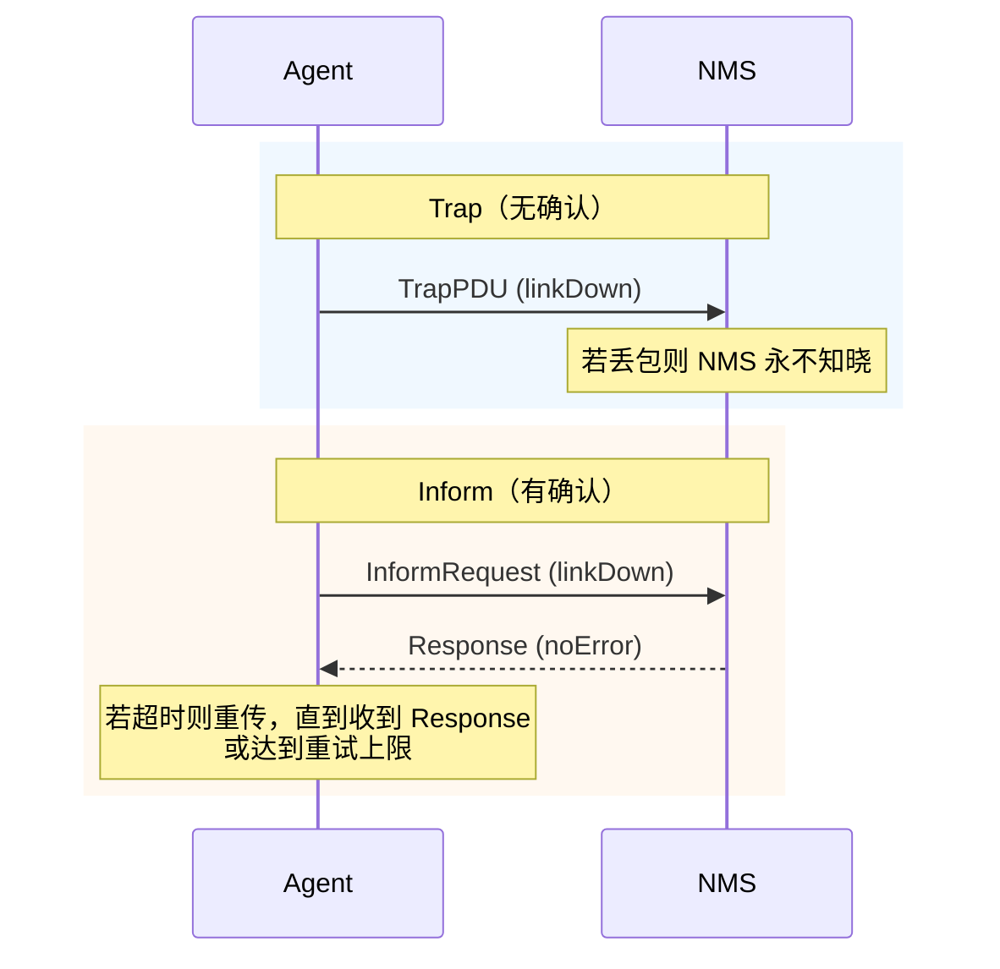

# 详解网络协议（27）· SNMP协议

> [!abstract] TL;DR
> **SNMP（Simple Network Management Protocol，简单网络管理协议）** 是运行在 UDP 之上的应用层协议，专为网络设备监控与管理而设计。管理站（NMS）通过 Get/Set/Walk 操作查询或修改代理（Agent）维护的 **MIB**（管理信息库），代理以 **Trap/Inform** 主动上报异常事件。v1/v2c 仅靠社区字符串（community string）明文鉴权，v3 引入 **USM**（用户安全模型）提供认证与加密，**VACM** 细粒度控制访问视图。
> 核心口诀：**SNMP 是"问卷调查员"——NMS 问、Agent 答，Trap 主动报警；v3 之前答卷明文可窃改，v3 才算安全。**

## 概述与定位

网络中往往有路由器、交换机、防火墙、服务器、打印机、UPS 等数十乃至数千台设备，管理员需要实时掌握接口流量、CPU 负载、错误计数、链路状态等指标，并在故障时第一时间收到告警。**SNMP** 正是为满足这一需求而生的标准化管理平面协议。

SNMP 定义在 RFC 1157（v1）、RFC 1901/1905（v2c）、RFC 3410–3418（v3）。传输层默认使用 **UDP**：

| 方向 | 端口 |
| --- | --- |
| NMS → Agent（Get/Set） | 161/UDP |
| Agent → NMS（Trap） | 162/UDP |

选用 UDP 而非 TCP 是因为：管理流量对延迟不敏感；设备在高负载或故障时 TCP 握手可能超时，UDP 仍可响应；若需可靠传输，v2c/v3 的 **Inform** 机制在应用层补充确认。

SNMP 生态包含三个核心角色：

1. **NMS（Network Management Station，管理站）**：运行 HP OpenView、Zabbix、Cacti、LibreNMS、SolarWinds 等软件的监控主机，主动发起查询或配置变更。
2. **Agent（代理）**：嵌入在被管设备中的守护进程（或固件模块），负责维护本地 MIB 数据并响应 NMS 请求；部分设备还支持 **Sub-Agent**（通过 AgentX 协议扩展 MIB）。
3. **MIB（Management Information Base，管理信息库）**：描述可管理对象的层次化数据库定义，不是真正的数据库，而是一套规范。

---

## 原理与机制

### NMS-Agent 交互模型

SNMP 采用**请求-响应（Request-Response）**加**异步通知（Trap/Inform）**的混合模型。

```
NMS                          Agent
 |  ---GetRequest(OID)-------> |
 |  <--Response(OID,Value)---  |
 |  ---SetRequest(OID,Value)-> |
 |  <--Response(noError)-----  |
 |  <--Trap(linkDown)--------  |  （主动，无需请求）
```

**拉取（Poll）**：NMS 定期发送 GetRequest 收集性能数据，间隔通常为 30 秒到 5 分钟。
**推送（Push）**：Agent 在事件发生时立即发送 Trap，无需等待 NMS 轮询。

### MIB 与 OID

**MIB** 是对"哪些对象可以被管理"的抽象描述，使用 **SMI（Structure of Management Information）** 语言（ASN.1 子集）书写。每个可管理对象对应一个 **OID（Object Identifier，对象标识符）**，以点分整数表示其在全局树中的唯一位置。

MIB 树（简化）：

```
iso(1)
└── org(3)
    └── dod(6)
        └── internet(1)
            ├── mgmt(2)
            │   └── mib-2(1)          ← 标准 MIB-II (RFC 1213)
            │       ├── system(1)     ← sysDescr, sysUpTime, sysContact …
            │       ├── interfaces(2) ← ifTable, ifInOctets, ifOutOctets …
            │       ├── ip(4)
            │       ├── tcp(6)
            │       └── udp(7)
            └── enterprises(4)        ← 企业私有 MIB
                ├── cisco(9)
                ├── huawei(2011)
                └── …
```

常用标准 OID 举例：

| OID | 含义 |
| --- | --- |
| `1.3.6.1.2.1.1.1.0` | sysDescr（设备描述字符串） |
| `1.3.6.1.2.1.1.3.0` | sysUpTime（系统运行时间，单位 1/100 s） |
| `1.3.6.1.2.1.2.2.1.10.1` | ifInOctets（接口 1 入流量字节数） |
| `1.3.6.1.2.1.2.2.1.16.1` | ifOutOctets（接口 1 出流量字节数） |

**SMI 数据类型**（v2 扩展后常用）：

| 类型 | 说明 |
| --- | --- |
| `INTEGER` | 有符号 32 位整数，常用于枚举（如接口状态 1=up/2=down） |
| `Counter32` | 32 位单调递增计数器（溢出归零） |
| `Counter64` | 64 位计数器（高速接口必须用此避免频繁翻滚） |
| `Gauge32` | 当前值（可增可减，有上限） |
| `TimeTicks` | 时间刻度（1/100 秒） |
| `OctetString` | 字节串（IP 地址、MAC 地址、字符串均可用） |
| `OID` | 对象标识符 |
| `IpAddress` | IPv4 地址（4 字节） |

### 版本演进

| 特性 | SNMPv1 | SNMPv2c | SNMPv3 |
| --- | --- | --- | --- |
| 鉴权机制 | 社区字符串（明文） | 社区字符串（明文） | USM（HMAC 认证） |
| 加密 | 无 | 无 | DES/AES |
| 批量操作 | 无 | GetBulkRequest | GetBulkRequest |
| 可靠通知 | Trap（无确认） | Trap + Inform（有确认） | Trap + Inform（有确认） |
| 错误处理 | 简单 | 细化（Counter64 等） | 细化 |
| 状态管理 | 标准 RFC 1157 | RFC 1905 | RFC 3412–3418 |

---

## 结构/算法/伪代码详解

### PDU 格式

所有 SNMP 消息都封装为 **BER（Basic Encoding Rules）编码的 ASN.1** 结构，在 UDP 数据包内传输。v2c 消息整体结构：

```
SNMPv2c Message
├── version          INTEGER (1 = v2c)
├── community        OCTET STRING  ← 社区字符串（明文！）
└── data             PDU
    ├── request-id   INTEGER       ← 匹配请求与响应
    ├── error-status INTEGER       ← 0=noError, 1=tooBig, 2=noSuchName…
    ├── error-index  INTEGER
    └── variable-bindings
        ├── VarBind(OID, value)
        └── VarBind(OID, value) …
```

### PDU 类型详解

| PDU 类型 | 方向 | 说明 |
| --- | --- | --- |
| **GetRequest** | NMS→Agent | 按 OID 列表精确查询指定对象的值 |
| **GetNextRequest** | NMS→Agent | 查询 OID 树中给定 OID 的"下一个"对象（用于表遍历） |
| **GetBulkRequest** | NMS→Agent（v2c+） | 批量获取多个 OID 及其后续 N 行；`non-repeaters` 控制不重复字段数，`max-repetitions` 控制每列最多返回行数 |
| **SetRequest** | NMS→Agent | 写入/修改 Agent 上的 MIB 对象值 |
| **Response** | Agent→NMS | 对 Get/Set/Bulk/Inform 的统一应答 |
| **Trap** | Agent→NMS | 主动通知，无确认；v2c Trap 携带 sysUpTime 与 snmpTrapOID |
| **InformRequest** | Agent/NMS→NMS（v2c+） | 有确认的 Trap；接收方须回 Response，发送方有重试计时器 |

**GetBulkRequest 伪代码（遍历 ifTable）：**

```
request = GetBulkRequest(
    non_repeaters = 0,
    max_repetitions = 10,
    varbinds = [ OID("1.3.6.1.2.1.2.2.1") ]   # ifTable 起始 OID
)
response = send(request)
while response.varbinds not empty:
    for varbind in response.varbinds:
        if not varbind.oid.starts_with("1.3.6.1.2.1.2.2.1"):
            break  # 已越出 ifTable 范围
        process(varbind)
    # 以最后一个 OID 继续请求
    request = GetBulkRequest(max_repetitions=10,
                             varbinds=[last_oid])
    response = send(request)
```

### Walk 操作

**snmpwalk** 是遍历 MIB 子树的惯用操作，内部使用 GetNextRequest（v1）或 GetBulkRequest（v2c）循环，直到返回的 OID 超出目标子树范围。

```
snmpwalk -v2c -c public 192.168.1.1 1.3.6.1.2.1.2.2.1
# 等价于循环 GetNextRequest，直到 OID 前缀不再匹配
```

### Trap vs Inform 对比



### SNMPv3 安全框架

SNMPv3 在消息层引入完整的安全基础设施，核心由两部分组成：

#### USM（User-based Security Model，用户安全模型）

USM 以**用户名**为主键，每个用户可独立配置：

- **认证（Authentication）**：对消息计算 HMAC，防篡改与重放。支持 HMAC-MD5-96 和 HMAC-SHA-96（及后续 SHA-256/SHA-512）。消息中携带 **msgAuthenticationParameters**（12 字节 HMAC 摘要）。
- **加密（Privacy/Encryption）**：对 PDU 负载加密，防窃听。支持 **CBC-DES**（已弱化，不推荐）和 **CFB-AES-128**（推荐）。

**引擎 ID（engineID）**：每个 SNMP 实体有唯一 engineID（通常由企业号 + MAC/IP 生成），用于防重放攻击的时钟同步（msgAuthoritativeEngineTime + msgAuthoritativeEngineBoots）。

**防重放机制**：USM 维护时间窗口（±150 秒），超出窗口的消息直接丢弃，避免录制重放攻击。

v3 消息结构（简化）：

```
SNMPv3 Message
├── msgVersion       3
├── msgGlobalData
│   ├── msgID        INTEGER   ← 唯一消息 ID
│   ├── msgMaxSize   INTEGER   ← 最大 PDU 大小
│   ├── msgFlags     OCTET STRING  ← reportable|priv|auth 标志位
│   └── msgSecurityModel INTEGER (3 = USM)
├── msgSecurityParameters  ← USM 参数
│   ├── msgAuthoritativeEngineID
│   ├── msgAuthoritativeEngineBoots
│   ├── msgAuthoritativeEngineTime
│   ├── msgUserName
│   ├── msgAuthenticationParameters  ← HMAC 摘要
│   └── msgPrivacyParameters         ← 加密 IV
└── msgData (ScopedPDU, 可能已加密)
    ├── contextEngineID
    ├── contextName
    └── data (实际 PDU)
```

#### VACM（View-based Access Control Model，基于视图的访问控制模型）

VACM 定义了"谁可以访问哪些 MIB 视图"的细粒度策略，基于三个核心概念：

| 概念 | 说明 |
| --- | --- |
| **安全组（securityGroup）** | 将用户/社区映射到一个组 |
| **访问条目（accessEntry）** | 定义组在特定安全级别下的读/写/通知视图 |
| **MIB 视图（mibView）** | 允许或排除的 OID 子树集合 |

示例策略：运营人员组只能读 `1.3.6.1.2.1.1`（system），无法访问 `enterprises` 下的私有 MIB；管理员组可读写所有视图。

---

## 工具视角与实战

### 常用命令行工具（net-snmp 套件）

```bash
# 查询单个 OID
snmpget -v2c -c public 192.168.1.1 sysUpTime.0

# 遍历接口表
snmpwalk -v2c -c public 192.168.1.1 1.3.6.1.2.1.2.2.1

# 批量获取（更快）
snmpbulkwalk -v2c -c public 192.168.1.1 ifTable

# SNMPv3 认证+加密查询
snmpget -v3 -l authPriv \
  -u adminUser -a SHA -A "authPassword" \
  -x AES -X "privPassword" \
  192.168.1.1 sysDescr.0

# 发送 Trap（测试用）
snmptrap -v2c -c public 192.168.1.254 '' \
  1.3.6.1.6.3.1.1.5.3   # linkDown Trap
```

### 使用 Python 的 pysnmp 库

```python
from pysnmp.hlapi import *

# SNMPv3 Get 示例
errorIndication, errorStatus, errorIndex, varBinds = next(
    getCmd(SnmpEngine(),
           UsmUserData('adminUser',
                       authKey='authPassword', privKey='privPassword',
                       authProtocol=usmHMACSHAAuthProtocol,
                       privProtocol=usmAesCfb128Protocol),
           UdpTransportTarget(('192.168.1.1', 161)),
           ContextData(),
           ObjectType(ObjectIdentity('SNMPv2-MIB', 'sysDescr', 0)))
)
if not errorIndication and not errorStatus:
    for varBind in varBinds:
        print(f'{varBind[0]} = {varBind[1]}')
```

### 企业 MIB 应用

厂商会在 `1.3.6.1.4.1.<enterpriseNum>` 下扩展私有 MIB，例如 Cisco 的 `CISCO-PROCESS-MIB`（CPU 使用率）、Huawei 的 `HUAWEI-ENTITY-EXTENT-MIB`（风扇/温度）。使用前需从厂商下载 `.mib` 文件并加载到 NMS：

```bash
# 加载自定义 MIB 文件
export MIBDIRS=/usr/share/snmp/mibs:/opt/vendor-mibs
snmpwalk -v2c -c public -m +CISCO-PROCESS-MIB 192.168.1.1 \
    cpmCPUTotal5minRev
```

### MIB 浏览器与监控平台集成

| 工具 | 特点 |
| --- | --- |
| MIB Browser（iReasoning） | 图形化 OID 浏览、实时轮询 |
| Zabbix | 模板化 SNMP 监控，内置大量厂商模板 |
| LibreNMS | 自动发现设备，自动选择 MIB |
| Prometheus + SNMP Exporter | 将 SNMP 数据转换为 Prometheus 指标 |
| Grafana | 与上述平台联动，绘制流量/负载趋势图 |

---

## 安全性与正确使用

### v1/v2c 的本质安全缺陷

v1 和 v2c 的"鉴权"机制是在 UDP 消息中携带**社区字符串（community string）**——一串明文口令，默认值通常是 `public`（只读）和 `private`（读写）。

缺陷如下：

1. **无加密**：网络抓包（Wireshark）即可直接读取社区字符串和所有 MIB 数据。
2. **无强认证**：任何知道社区字符串的主机均可伪造 SNMP 包（UDP 源 IP 可伪造）。
3. **SetRequest 危险**：若 `private` 社区暴露，攻击者可修改路由表、关闭接口、修改设备配置。
4. **信息泄露**：`public` 社区暴露后，攻击者可 snmpwalk 全设备获取拓扑、ARP 表、路由表、软件版本信息，为横向移动提供情报。

**历史案例**：多次网络扫描研究显示，互联网上大量路由器仍开放 UDP 161，使用默认社区字符串，导致设备信息被批量采集。

### SNMPv3 安全级别

| 安全级别（secLevel） | 认证 | 加密 | 适用场景 |
| --- | --- | --- | --- |
| `noAuthNoPriv` | 否 | 否 | 仅内网只读监控（不推荐） |
| `authNoPriv` | 是（HMAC） | 否 | 内网，防篡改但不防窃听 |
| `authPriv` | 是（HMAC） | 是（AES） | 生产推荐，防窃听+防篡改+防重放 |

### 部署加固建议

- **禁用 v1/v2c**，强制使用 SNMPv3 `authPriv`（认证+AES 加密）。
- **修改默认社区字符串**；若必须保留 v2c，使用随机高熵字符串。
- **ACL 限制访问来源**：仅允许 NMS IP 访问 161/UDP，防火墙 DROP 其他来源。
- **只读原则**：监控账号只分配读视图，禁止 Set 权限；运维操作通过 SSH/NETCONF。
- **使用 SHA-256/AES-128 以上**：避免 MD5/DES（已有实际攻击）。
- **定期审计 MIB 视图**：确保企业 MIB 中无敏感配置字段暴露给读视图。
- **监控 161 端口异常流量**：异常 snmpwalk 扫描可能是侦察行为前兆。

---

## 小结

SNMP 以简洁的 UDP+ASN.1 架构实现了跨厂商设备管理的统一接口，MIB/OID 树提供了标准化的数据模型，Get/Set/Walk/Trap/Inform 操作覆盖了轮询监控与事件告警的全部需求。v1/v2c 以明文社区字符串为代价换来了简单部署，在封闭内网尚可接受；但面向互联网或多租户场景，必须升级至 SNMPv3，启用 USM 的 `authPriv` 级别并配合 VACM 视图控制，方能满足基本安全要求。现代网络管理趋向 NETCONF/YANG + RESTCONF，但 SNMP 凭借其成熟度与广泛支持仍是运营商与企业网不可或缺的监控基础。

## 相关阅读

- [[26.NTP与PTP协议]] — 网络时间同步，SNMP 中 sysUpTime 依赖准确的系统时钟
- [[28.SMB与NFS协议]] — 网络文件共享协议，与 SNMP 同属应用层管理/服务协议
- [[00.网络协议详解总览]] — 系列索引

> ⬅️ [[26.NTP与PTP协议]] ｜ 🏠 [[00.网络协议详解总览]] ｜ [[28.SMB与NFS协议]] ➡️
