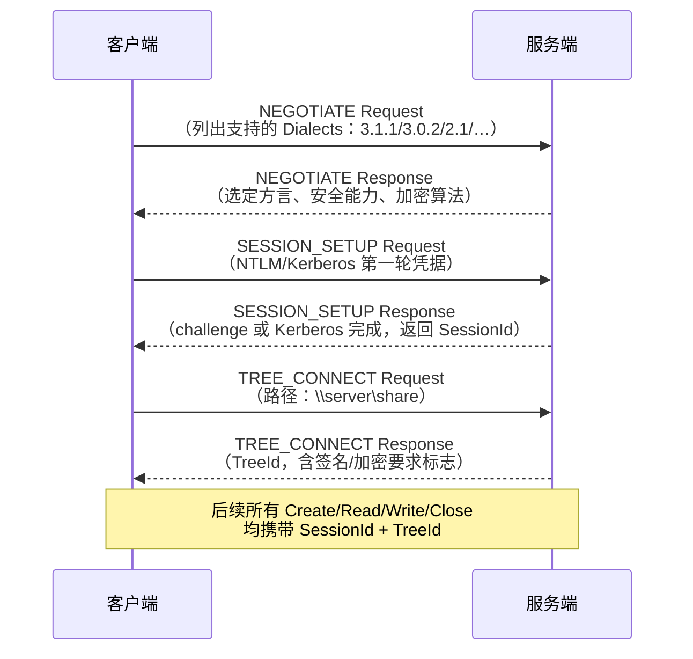

# 详解网络协议（28）· SMB与NFS协议

> [!abstract] TL;DR
> **SMB（Server Message Block）** 与 **NFS（Network File System）** 是两大主流网络文件共享协议：SMB 起源于 Windows 世界，经 SMB2/SMB3 大幅演进，引入签名、加密、多通道绑定；NFS 出身 Unix/Linux，v4 转型有状态并深度集成 Kerberos。两者都能挂载远端目录，让客户端像访问本地磁盘一样读写服务器文件。
> 核心口诀：**SMB 是 Windows 世界的"文件网线"——加密可选但应强制；NFS 是 Unix 的"远程磁盘"——v4 前信 IP 不信人，v4 起 Kerberos 才算可信。**

## 概述与定位

**文件共享协议**解决的是"如何让多台主机透明地共享同一组文件"的问题。与对象存储（HTTP/S3）或块存储（iSCSI）不同，文件共享协议维护文件系统语义：目录层次、文件权限、锁、文件属性（atime/mtime/ctime）、硬链接，应用程序无需改动即可访问。

两大阵营的历史背景：

| 协议族 | 诞生背景 | 当前主流版本 | 默认端口 |
| --- | --- | --- | --- |
| **SMB** | 1983 年 IBM/Microsoft，Windows 网络文件共享标准 | SMB 3.1.1（Windows 10/Server 2016+） | 445/TCP |
| **NFS** | 1984 年 Sun Microsystems，Unix 文件系统网络化 | NFS v4.1/v4.2 | 2049/TCP（v4 固定） |

SMB 历史上也经由 NetBIOS over TCP（端口 139）传输，现代实现已直接运行在 TCP 445 之上。NFS v2/v3 依赖 RPC 端口映射（portmapper/rpcbind，111/TCP+UDP），实际数据端口动态分配，给防火墙带来麻烦；v4 将所有操作统一到单一 2049/TCP 连接，彻底解决了这一问题。

---

## 原理与机制

### SMB 版本演进

**SMB 1.0（CIFS，Common Internet File System）**
- 1990 年代微软与行业共同推进，定义了大量命令码（Command）：SMB_COM_OPEN/READ/WRITE 等超过 100 条。
- 一个 TCP 连接一次只能处理一条请求（同步串行），高延迟环境（WAN）性能极差。
- **安全性低**：LM/NTLMv1 哈希弱、无强制签名、无加密。
- **EternalBlue（MS17-010）** 漏洞利用了 SMB1 的事务处理缺陷，允许远程无认证代码执行，被 WannaCry/NotPetya 勒索软件大规模利用（2017 年）。Microsoft 已在 Windows 10 1709 后默认禁用 SMB1，强烈建议生产环境彻底关闭。

**SMB 2.0/2.1（Vista/Windows 7/Server 2008）**
- 命令集从 100+ 条精简为 **19 条**，设计更正交、扩展性更好。
- 引入**管道（Pipeline）**：同一 TCP 连接可同时发出多个未完成请求，不必等前一请求返回。
- **Compound（复合请求）**：将多条命令打包为一个网络包，减少往返延迟。
- **客户端缓存机制**改进：opportunistic lock（oplock）升级为更细粒度的 **lease**（租约），减少不必要的锁通知。
- SMB 2.1 新增 MTU 协商、BranchCache 支持。

**SMB 3.0/3.0.2/3.1.1（Windows 8/Server 2012 → Windows 10/Server 2016）**
- **端到端加密（Encryption）**：AES-128-CCM（SMB 3.0）/AES-128-GCM（SMB 3.1.1），在 TCP 层之上对 SMB PDU 加密，防止网络路径上的中间人窃听。
- **多通道绑定（Multichannel）**：客户端与服务端可同时使用多块 NIC 建立多条 TCP 连接，带宽叠加、路径冗余。
- **RDMA 支持（SMB Direct）**：通过 iWARP/RoCE/InfiniBand 实现零拷贝传输，适合高性能计算场景。
- **持久句柄（Persistent Handle）与透明故障转移**：网络中断后客户端可重连并恢复文件句柄，用于 Hyper-V CSV（集群共享卷）等高可用场景。
- **SMB 3.1.1** 引入预认证完整性保护（AES-128-CMAC 对协商阶段签名），防止降级攻击；加密算法协商升级为 AES-GCM。

### SMB 会话建立流程



**签名（Signing）**：在消息头的 `Signature` 字段填入 AES-128-CMAC（SMB2+）摘要，防止路径上的数据篡改。可在服务端或客户端强制要求（Required），也可协商（Enabled）。生产环境应设为 Required。

**加密（Encryption）**：SMB 3.0+ 可在 TREE_CONNECT 或 SESSION_SETUP 阶段协商，对 PDU 负载（包括头部之后的数据）整体加密；签名在加密情况下已被 AEAD 认证标签取代，无需额外签名。

### NFS 架构

NFS 建立在 **ONC RPC（Open Network Computing Remote Procedure Call）** 之上，使用 **XDR（External Data Representation）** 统一编码跨平台数据类型。

**NFS v2/v3：无状态设计**
- 服务端不保存客户端连接状态，每次操作均自包含（幂等设计）。
- 优点：服务端崩溃重启后，客户端透明重试即可，无需恢复状态。
- 缺点：无法支持文件级锁（需额外的 NLM/NSM 协议）；OPEN 操作不存在，文件句柄直接指向 inode，服务端无法跟踪"谁打开了哪个文件"。
- v3 新增：`ACCESS` 操作（客户端检查权限）；`READDIRPLUS`（批量返回目录+属性，减少往返）；大文件支持（64 位偏移）；UDP 或 TCP 传输。

**NFS v4/v4.1/v4.2：有状态设计**
- 引入 `OPEN`/`CLOSE`/`LOCK`/`UNLOCK` 等有状态操作，服务端追踪每个客户端的打开文件与锁。
- **Compound 操作**：将多个操作打包为一个 RPC 调用，减少往返（类似 SMB2 的 Pipeline）。例如 `PUTFH + OPEN + READ` 一次完成。
- **委派（Delegation）**：服务端将读或写的"本地缓存权"临时授给客户端。读委派允许客户端本地缓存文件无需询问服务端；写委派允许客户端本地写入并延迟刷回，服务端在其他客户端访问时发送 **CB_RECALL** 召回。
- **文件系统迁移与复制（Migration/Replication）**：v4.1 新增，支持文件系统在服务端间透明迁移，客户端自动跟随。
- **pNFS（并行 NFS，v4.1）**：客户端可直接访问后端存储设备（块/对象/文件布局），绕过 NFS 服务端 I/O 路径，实现横向扩展。
- **v4.2** 引入服务端复制（`COPY` 操作，zero-copy）、稀疏文件支持、标签感知访问控制（MAC）等。

---

## 结构/算法/伪代码详解

### SMB2 帧结构

SMB2 消息分为**头部（Header）** 和 **正文（Body）**，所有字段小端序：

```
SMB2 Header (64 字节)
├── ProtocolId       0xFE534D42 (LE: "\xFEsMB")
├── StructureSize    64
├── CreditCharge     UINT16  ← 本请求消耗的"信用"数（流控）
├── Status/ChannelSequence
├── Command          UINT16  ← 0=NEGOTIATE, 1=SESSION_SETUP, 3=TREE_CONNECT,
│                              5=CREATE, 8=READ, 9=WRITE, 0xE=IOCTL …
├── CreditRequest/Response
├── Flags            UINT32  ← SERVER_TO_REDIR | ASYNC | RELATED | SIGNED | PRIORITY | DFS | REPLAY
├── NextCommand      UINT32  ← Compound 链中下一命令的偏移（0=末尾）
├── MessageId        UINT64  ← 请求唯一 ID（响应须匹配）
├── AsyncId/Reserved+TreeId
├── SessionId        UINT64
└── Signature        128-bit ← AES-128-CMAC（Signed 标志置位时有效）
```

**信用（Credit）机制**：SMB2 采用令牌桶式流控，服务端授予客户端一定数量的 Credit，每条请求消耗若干 Credit，大型 I/O 消耗更多。服务端据此限制并发负载。

### NFS v4 RPC/XDR 概览

NFS v4 的每个操作被编码为 XDR（Big-Endian），核心数据结构：

```
NFS4 Compound Call
├── tag            UTF8String   ← 调试标签
├── minorversion   uint32       ← 0=v4.0, 1=v4.1, 2=v4.2
├── argarray<>     ← 操作列表（可包含多个 op）
│   ├── op = PUTFH
│   │   └── object = filehandle (opaque bytes)
│   ├── op = OPEN
│   │   ├── seqid, share_access, share_deny
│   │   ├── owner (clientid + owner string)
│   │   └── openhow (OPEN4_CREATE / OPEN4_NOCREATE)
│   └── op = READ
│       ├── stateid
│       ├── offset  uint64
│       └── count   uint32
```

**文件句柄（File Handle）**：v4 使用 **volatile filehandle**（可能在服务端重启后失效）或 **persistent filehandle**。客户端在 `OPEN` 完成时获得 **stateid**（带序号的状态令牌），后续 READ/WRITE/LOCK 操作均携带此 stateid，服务端凭此追踪并发状态。

### Opportunistic Lock / Lease 对比

```
                SMBv1 oplock        SMBv2/3 lease
---------------------------------------------------
粒度            文件级              文件级 + 目录级（SMB2.1+）
缓存类型        read/write/excl     R(Read)/W(Write)/H(Handle)
中断响应        Break 通知          Lease Break 通知，可批量延迟
状态维护        服务端              服务端（leaseKey 标识）
跨会话共享      否                  是（同一 client GUID 下可共享）
```

### EternalBlue 漏洞机制简述

MS17-010 利用了 SMBv1 中 `SMB_COM_TRANSACTION2` 命令的一个整数溢出：

1. 客户端发送超大的 `SetupCount`，导致服务端在计算缓冲区大小时整数溢出，分配过小的内核池缓冲区。
2. 后续数据写入时产生**堆溢出（Pool Overflow）**，覆盖内核结构。
3. 结合 `SMB_COM_NT_TRANSACT` 的另一条路径，最终实现**环 0 级任意代码执行（SYSTEM）**，无需认证。

关闭 SMBv1（`Set-SmbServerConfiguration -EnableSMB1Protocol $false`）是根本性防御，任何安全补丁都无法替代彻底禁用。

---

## 工具视角与实战

### SMB 挂载与访问

**Windows（PowerShell）：**

```powershell
# 映射网络驱动器
New-SmbMapping -LocalPath Z: -RemotePath \\fileserver\share `
    -UserName domain\user -Password 'P@ssword'

# 查看当前连接信息（含方言、签名、加密状态）
Get-SmbConnection

# 强制服务端要求签名
Set-SmbServerConfiguration -RequireSecuritySignature $true

# 强制服务端要求加密（SMB 3.0+）
Set-SmbServerConfiguration -EncryptData $true

# 禁用 SMB1
Set-SmbServerConfiguration -EnableSMB1Protocol $false -Force
```

**Linux（cifs-utils）：**

```bash
# 挂载 SMB3 共享，启用加密
mount -t cifs //fileserver/share /mnt/share \
    -o username=user,password=P@ssword,vers=3.1.1,seal,sign

# 永久挂载（/etc/fstab）
//fileserver/share /mnt/share cifs credentials=/etc/samba/.creds,vers=3.1.1,seal,sign 0 0
```

### NFS 挂载与访问

**服务端配置（Linux /etc/exports）：**

```bash
# NFSv4 只读共享，Kerberos 认证（krb5p=加密）
/data/shared    192.168.1.0/24(ro,sync,sec=krb5p,no_subtree_check)

# NFSv4 读写共享，基于主机名
/home           nfsclient.example.com(rw,sync,no_root_squash,fsid=0)
```

**客户端挂载：**

```bash
# NFSv4.1 挂载，Kerberos 加密保护
mount -t nfs4 -o sec=krb5p,vers=4.1 \
    nfsserver:/data/shared /mnt/nfs

# 查看 NFS 挂载状态
nfsstat -m

# 检查 NFSv4 委派状态
cat /proc/net/rpc/nfs4.xdr/contents
```

**常用诊断工具：**

```bash
# 抓 SMB 流量（Wireshark 过滤）
smb2 && smb2.cmd == 0x0005    # SMB2 CREATE 命令

# 检查 NFS RPC 服务
rpcinfo -p nfsserver

# NFS 性能分析
nfsiostat 5       # 每 5 秒输出 IOPS/延迟统计
```

### SMB vs NFS 功能对比

| 维度 | SMB 3.1.1 | NFS v4.2 |
| --- | --- | --- |
| **主流平台** | Windows（原生），Linux（cifs-utils） | Linux/Unix（原生），Windows（NFS client） |
| **连接状态** | 有状态（会话 + 树 + 文件 ID） | v4 有状态（clientid + stateid） |
| **传输层** | TCP 445 | TCP 2049（v4，固定） |
| **签名/完整性** | AES-128-CMAC（可强制） | RPCSEC_GSS（Kerberos，可强制） |
| **加密** | AES-GCM（SMB 3.0+，可强制） | Kerberos krb5p（RPCSEC_GSS Privacy） |
| **认证** | NTLM、Kerberos（AD 域） | Kerberos（RPCSEC_GSS），AUTH_SYS（UID/GID） |
| **文件锁** | 内置（oplock/lease） | NLM（v3），内置（v4）|
| **ACL 模型** | Windows ACL（SID） | POSIX ACL（v3），NFSv4 ACL（v4，类 Windows） |
| **多路径** | SMB Multichannel（原生多 NIC） | pNFS（v4.1，并行 I/O 到后端存储） |
| **典型场景** | 企业文件服务器、Hyper-V 存储、Windows 桌面共享 | Linux 集群 home 目录、HPC 存储、容器 PV |

---

## 安全性与正确使用

### SMB 主要威胁面

**1. SMB1 相关漏洞（历史最严重）**

除 EternalBlue 外，SMB1 还受到多类攻击：
- **Pass-the-Hash**：NTLM 协议允许在不知道明文密码的情况下使用哈希认证，结合 SMB 可横向移动。
- **NTLM 中继（Relay）**：攻击者在客户端与服务端之间中继 NTLM 认证，代替客户端向第三方服务认证。使用 SMB 签名（Required）可彻底防御此类攻击，因为 NTLM Relay 无法通过签名校验。

**2. 未强制加密导致的中间人窃听**

即使启用了签名，SMB 3.0 之前的版本和未启用加密的 SMB 3.x 在传输中数据仍可被抓包阅读。文件内容、凭据挑战-响应均在明文或仅签名的链路上流动。

**3. NFS AUTH_SYS 的信任问题**

NFS v2/v3 默认使用 **AUTH_SYS**（也称 AUTH_UNIX）：客户端只需在 RPC 头中声明 UID/GID，服务端默认信任。攻击者在同一网段可伪造任意 UID（包括 UID=0），直接绕过权限控制。这是为什么"不对互联网暴露 NFS" 是基本原则。

**4. NFS root_squash 与 no_root_squash**

`root_squash`（默认）：将客户端 root（UID=0）映射为匿名用户（nfsnobody），防止客户端 root 权限升级为服务端 root。`no_root_squash` 在高性能计算或容器场景有时被设置，但极危险，仅在完全信任客户端主机时使用。

### 加固建议

**SMB：**
- 关闭 SMB1（服务端 + 客户端均关闭）。
- 开启 SMB 签名（`RequireSecuritySignature = true`）防止 NTLM Relay。
- 开启 SMB 加密（`EncryptData = true`，SMB3+）防止窃听。
- 强制使用 Kerberos 认证（域环境），避免 NTLMv1。
- 防火墙仅对授信网段开放 445/TCP，对互联网完全封闭。

**NFS：**
- 使用 NFSv4 + Kerberos（`sec=krb5p`），完全替代 AUTH_SYS。
- 绝不在 `/etc/exports` 中使用 `*`（允许所有客户端），精确指定允许的主机/子网。
- 保持 `root_squash` 默认开启，除非有明确业务需求。
- 防火墙仅允许信任主机访问 2049/TCP（v4），NFSv3 还需限制 portmapper（111）。
- 定期审计 exports 配置（`exportfs -v`）。

---

## 小结

SMB 和 NFS 分别代表了 Windows 与 Unix/Linux 阵营在网络文件共享上的不同设计哲学。SMB 从早期单请求串行、无加密的 CIFS 演进为支持 AES-GCM 加密、多通道绑定、持久句柄的 SMB 3.1.1；NFS 从简洁的无状态 RPC 演进为支持委派、pNFS 并行 I/O 和 Kerberos 全程加密的 v4.2。两者在现代企业中都扮演不可替代的角色——SMB 主导 Windows 环境和混合办公场景，NFS 主导 Linux 集群和高性能计算存储。从安全角度，SMB1 与 NFS AUTH_SYS 的历史遗留问题至今仍是许多组织的隐患，及时升级协议版本并强制签名与加密，是缩减攻击面的首要步骤。

## 相关阅读

- [[27.SNMP协议]] — 网络管理协议，与 SMB/NFS 同属应用层服务协议
- [[15.TLS协议]] — TLS 是 SMB 加密的密码学基础之一，Kerberos 也依赖对称加密
- [[00.网络协议详解总览]] — 系列索引

> ⬅️ [[27.SNMP协议]] ｜ 🏠 [[00.网络协议详解总览]]
