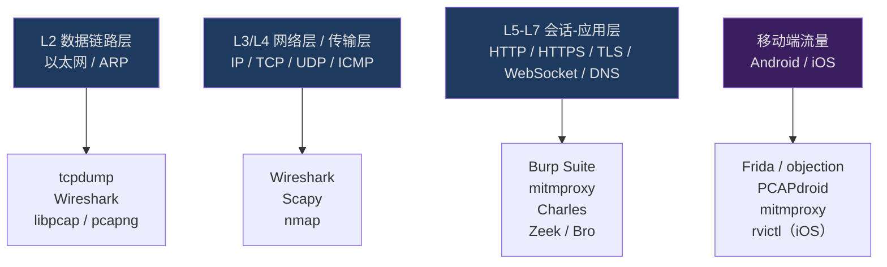
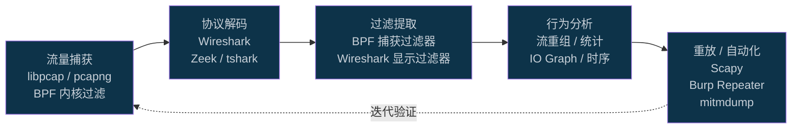

---
tags:
  - network
  - protocol-analysis
  - tier3
created: 2026-06-30
---
# 抓包与协议分析实战总览

本系列聚焦**网络流量捕获、协议解码与分析**的完整技术链路，从 libpcap 底层原理到 Wireshark/Scapy 实战，覆盖 HTTP/TLS/DNS/WebSocket/HTTP2 等主流协议，兼顾移动端抓包与 CTF 实战场景。

---

## 协议层次与抓包工具映射

---

## 协议分析流程图

---

## 系列章节目录

| # | 章节 | 核心主题 |
|---|------|---------|
| 01 | [[01.网络协议栈与抓包原理]] | OSI/TCP-IP 模型；libpcap；BPF；AF_PACKET |
| 02 | [[02.Wireshark深度使用与过滤器语法]] | 显示过滤器；捕获过滤器；流追踪；Lua dissector |
| 03 | [[03.tcpdump与命令行抓包]] | BPF 语法；snaplen；pcap 文件读写；tshark |
| 04 | [[04.HTTP与HTTPS抓包与中间人分析]] | mitmproxy；Burp Suite；Charles；透明代理 |
| 05 | [[05.TLS握手与解密分析]] | TLS 1.2/1.3 握手；SSLKEYLOGFILE；CT/HSTS |
| 06 | [[06.自定义协议逆向分析]] | 二进制协议识别；字段提取；Lua 解析器编写 |
| 07 | [[07.WebSocket与HTTP2分析]] | WS 帧格式；HTTP/2 多路复用；HPACK |
| 08 | [[08.DNS协议分析与操纵]] | 报文结构；DoH/DoT；DNSSEC；DNS 隧道 |
| 09 | [[09.移动端抓包Android与iOS]] | PCAPdroid；rvictl；SSL Pinning 绕过；Frida |
| 10 | [[10.Scapy网络包构造与重放]] | 包构造语法；send/sr/sniff；pcap 读写 |
| 11 | [[11.Zeek协议分析框架]] | 事件驱动；conn.log；Zeek 脚本；离线分析 |
| 12 | [[12.流量特征分析与检测绕过]] | 流量指纹；DPI 绕过；混淆技术；隐蔽信道 |
| 13 | [[13.抓包实战CTF与漏洞分析]] | pcap 取证；流量重放；漏洞 PoC 构造 |

---

> [!tip] 学习建议
> 1. **先跑起来再看原理**：第一步用 Wireshark 打开一个真实的 HTTP 会话，观察三次握手与数据帧，再回头读第01章原理。
> 2. **BPF 是核心技能**：tcpdump/Wireshark 捕获过滤器共用 BPF 语法，第03章务必熟练掌握后再进阶。
> 3. **TLS 解密是分水岭**：能否拿到 SSLKEYLOGFILE 决定后续分析深度，第05章建议配合 curl/Python 实操验证。
> 4. **Scapy 是黏合剂**：第10章的包构造能力贯通重放、模糊测试与协议实现，建议在 Linux 环境下练习（需 root）。
> 5. **章节可按需跳读**：移动端场景直接跳第09章；CTF 场景直接跳第13章，再按需补基础。

> [!warning] 合规提醒
> 抓包与协议分析技术属于**双刃工具**。在生产网络、他人设备或公共网络上实施抓包、中间人分析或流量重放，在多数司法管辖区属于违法行为。
> - **仅在授权范围内**（自有网络、实验环境、CTF 靶场、渗透测试授权书覆盖范围）使用本系列技术。
> - 移动端 SSL Pinning 绕过、DNS 操纵等章节内容仅用于安全研究与合法测试。
> - 涉及真实用户数据的抓包须遵守 GDPR/个人信息保护法等隐私法规。

---

## 导航

← [[../71.详解网络协议/00.详解网络协议总览|71. 详解网络协议]] ｜ 上级：[[../MyKnowledges.base|知识库根目录]]
