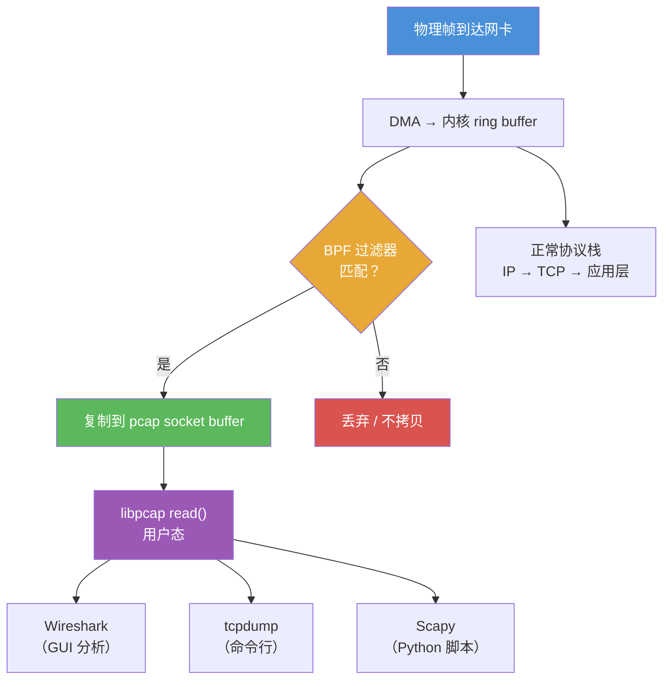

---
tags:
  - network
  - protocol-analysis
  - tier3
  - libpcap
  - bpf
  - pcapng
---
# 网络协议栈与抓包原理

> [!abstract] TL;DR
> 抓包的本质是将网卡置于混杂模式（promiscuous mode），借助 AF_PACKET socket 或等价机制把帧复制一份给用户态程序。BPF 在内核层提前过滤，避免无关帧被拷贝。libpcap 封装了这一差异，让 Wireshark/tcpdump 共享同一底层接口。pcapng 在经典 .pcap 基础上引入块结构，支持多接口注释与元数据。

## 概述与定位

网络抓包（packet capture）横跨 OSI 七层与 TCP/IP 四层两套模型。理解抓包工具必须先搞清楚：数据帧在哪一层被"拦截"、谁来决定哪些帧进入用户态、以及文件格式如何保存捕获结果。

**OSI 与 TCP/IP 对照**

| OSI 层 | 名称 | TCP/IP 层 | 典型协议 |
|--------|------|-----------|----------|
| 7 | 应用层 | 应用层 | HTTP、DNS、SMTP |
| 6 | 表示层 | 应用层 | TLS、XDR |
| 5 | 会话层 | 应用层 | RPC |
| 4 | 传输层 | 传输层 | TCP、UDP |
| 3 | 网络层 | 网络层 | IP、ICMP |
| 2 | 数据链路层 | 网络接口层 | Ethernet、Wi-Fi |
| 1 | 物理层 | 网络接口层 | PHY、Cable |

抓包工具通常工作在**第 2 层**（数据链路层），拿到完整以太帧，然后由各层 dissector 逐层解包直至应用层。这个选择并非偶然——在第二层介入意味着捕获到的帧包含完整的 Ethernet 头部（源/目的 MAC、EtherType），可以追踪 ARP 欺骗、VLAN 标签（802.1Q）、巨型帧等链路层细节，而这些信息在 IP 层以上已经被剥离。

## 原理与机制

### 混杂模式（Promiscuous Mode）——在网卡硬件与驱动层的含义

正常工作状态下，以太网网卡（NIC）的 MAC 控制器会在**硬件层**执行帧过滤：只有目标 MAC 地址等于本机 MAC、或者是广播地址（FF:FF:FF:FF:FF:FF）、或本机已加入的多播组地址，才会触发 DMA 操作把帧写入内存，其余帧在 MAC 控制器内部就被丢弃，CPU 从来不知道它们存在过。这个过滤是硬件电路完成的，几乎零开销。

开启混杂模式后，驱动向 NIC 的 MAC 控制器写入一个寄存器位（通常是 PROMISC 或 PFCTRL 寄存器中的某一 bit），关闭地址过滤，让 MAC 控制器把**所有物理层上到来的帧**都通过 DMA 写入内存，不管目标 MAC 是什么。这意味着同一物理链路上所有其他设备的帧，只要物理信号能到达，都会进入本机内存。

然而这里有一个关键的网络拓扑约束：**交换机环境下，混杂模式并不能捕获别人的单播流量**。交换机维护 MAC 地址表（CAM 表），只把单播帧发往目标端口，其他端口根本收不到这个帧的物理信号——既然物理信号不到达，混杂模式也无从捕获。广播帧和多播帧（flooding 行为）则会被发往所有端口，因此可以捕获。

要在交换环境捕获别人的流量，必须采用其他手段：
- **端口镜像（SPAN / RSPAN）**：在交换机上配置，把目标端口的所有流量复制到监控端口。这是最"干净"的方法，对目标无感知，对网络无影响。
- **ARP 欺骗（ARP Spoofing / ARP Poisoning）**：攻击者向网络中发送伪造的 ARP Reply，声称自己的 MAC 对应目标 IP，使交换机 CAM 表中目标 IP 指向攻击者 MAC。网关和受害主机的 ARP 缓存都被污染后，流量会经过攻击者机器。这属于主动干预，会产生异常流量，且容易被 IDS 检测。
- **Hub 替换**：把交换机换成集线器（Hub）。Hub 对所有端口广播，不进行 MAC 过滤。实验室环境可行，生产不可行。

```
# Linux 手动开启混杂模式
ip link set eth0 promisc on

# 查看当前模式
ip link show eth0 | grep PROMISC
```

当 libpcap/Npcap 调用 `pcap_open_live()` 并传入 `promisc=1` 参数时，它在内部会通过 `ioctl(SIOCSIFFLAGS)` 系统调用设置 `IFF_PROMISC` 标志，驱动接收到后再配置 NIC 寄存器。程序退出后 libpcap 会清除此标志——但如果进程异常终止，混杂模式可能保持激活状态，直到下次接口重置或系统重启。

### AF_PACKET socket（Linux）

Linux 通过 `AF_PACKET` 类型的原始套接字将帧副本递交给用户态进程：

```c
int fd = socket(AF_PACKET, SOCK_RAW, htons(ETH_P_ALL));
// ETH_P_ALL 表示捕获所有以太类型的帧
```

内核在帧进入协议栈**之前**将其克隆，因此抓包不影响正常数据通路。`AF_PACKET` 有两种模式：`SOCK_RAW`（包含链路层头部，抓包工具常用）和 `SOCK_DGRAM`（链路层头部被剥离）。

`AF_PACKET` 需要 `CAP_NET_RAW` 能力（capability），这就是为什么 tcpdump 默认需要 root 权限，但可以通过 `setcap` 授权给普通用户。macOS 则通过 `/dev/bpf*` 字符设备（Berkeley Packet Filter 设备文件）实现同等功能，打开设备后通过 `ioctl` 绑定到接口并设置 BPF 程序。

### BPF 内核级过滤工作流

BPF（Berkeley Packet Filter，1993年，Steven McCanne & Van Jacobson）是一套运行于内核的虚拟机，用于在帧到达用户态**之前**过滤。其核心价值：**减少内核→用户态的内存拷贝**。

```
帧到达网卡
    │
    ▼
DMA 到内核 ring buffer
    │
    ├─── BPF 程序判断：匹配？
    │         ├─ 是 → 复制到捕获 socket buffer → 用户态读取
    │         └─ 否 → 丢弃（不拷贝）
    │
    ▼
正常协议栈处理（IP/TCP/应用层）
```

### cBPF vs eBPF vs JIT——三个进化阶段

**经典 BPF（cBPF）** 是 1993 年论文中描述的原始设计。虚拟机极简：仅有两个寄存器（A 累加器和 X 索引寄存器）、一个 16 槽临时内存区（M[0..15]）、以及固定宽度的 8 字节指令集。这种简洁性使得验证器可以很容易地证明程序会终止（无循环）、不越界访问内存。libpcap 至今仍生成 cBPF 字节码注入内核，因为 `setsockopt(SO_ATTACH_FILTER)` 接受的就是 cBPF 格式。

**扩展 BPF（eBPF）** 是 Linux 3.18（2014年）引入的重大升级：寄存器从 2 个扩展为 11 个（R0-R10，64位宽）、支持 map 数据结构（哈希表/数组/环形缓冲）、支持调用内核辅助函数（bpf_helper）、支持尾调用和有限循环。eBPF 的应用早已超出网络过滤，涵盖性能追踪（kprobe/uprobe）、安全策略（LSM BPF）、负载均衡（XDP）等场景。但对于 libpcap 抓包而言，内核仍然把 cBPF 程序翻译成 eBPF 指令执行。

**JIT 编译**：现代 Linux 内核（3.0+）对 BPF 程序启用 JIT（Just-In-Time）编译器，把 BPF 字节码直接翻译成 x86-64/ARM64 原生机器码。这使 BPF 过滤的速度接近编译期写死的 C 函数，是高流量下实现线速过滤的关键。可以通过 `/proc/sys/net/core/bpf_jit_enable=1` 开启，并用 `tcpdump -d` 查看 BPF 字节码（解析前的 cBPF 指令），用 `tcpdump -dd` 查看 C 数组格式。

### AF_PACKET + ring buffer（TPACKET_V3）零拷贝抓包路径

标准 `AF_PACKET` 的工作方式是：每当一个帧匹配 BPF 过滤器，内核分配 `sk_buff` 结构体、将帧数据拷贝进去，用户进程调用 `recvmsg()` 时再从内核缓冲区拷贝到用户空间缓冲区——**两次拷贝**，每次都涉及系统调用开销。

`TPACKET_V3`（Linux 3.2 引入）通过 `mmap()` 实现**零拷贝**：
1. 用户态调用 `setsockopt(PACKET_RX_RING)` 在内核分配一块连续的环形内存（ring buffer）
2. 用户态通过 `mmap()` 把同一块物理内存映射到进程地址空间
3. NIC DMA 把帧写入这块共享内存，内核写入元数据（时间戳、帧长等），设置"帧可用"标志
4. 用户进程轮询（或等待 `poll()`）检测新帧，**直接读取共享内存**，无需系统调用，无拷贝

TPACKET_V3 进一步引入了"块"（block）概念：多个帧被打包进一个块，用户进程以块为单位消费，减少唤醒次数，提升吞吐量。libpcap 2.0+ 默认启用 TPACKET_V3，这是 Wireshark/tcpdump 在现代内核上能高效处理 1Gbps+ 流量的原因。

### 数据包从网卡到用户态的完整路径

理解完整路径有助于排查抓包丢帧问题：

1. **物理层**：信号通过网线/光纤/Wi-Fi 到达 NIC PHY 芯片，完成模数转换、时钟同步
2. **MAC 控制器**：检查 CRC，若混杂模式关闭则过滤非本机 MAC；通过 DMA 把帧写入主机内存（NIC ring buffer，也叫 RX descriptor ring）
3. **硬中断（IRQ）**：DMA 完成后 NIC 发出硬件中断，CPU 执行中断处理程序（ISR），标记"有帧待处理"，触发软中断 `NET_RX_SOFTIRQ`
4. **NAPI（New API）轮询**：现代驱动不再每帧一个中断，而是第一个帧触发中断后关中断，进入 NAPI 轮询模式批量处理多个帧，减少中断开销
5. **`netif_receive_skb()`**：帧被封装成 `sk_buff`，送入内核协议栈入口；在此处 BPF 过滤程序被调用，匹配的帧副本送入 `AF_PACKET` socket 的 ring buffer
6. **libpcap 用户态**：`pcap_loop()` / `pcap_next()` 从 mmap 共享内存读取帧，通过回调函数交给 Wireshark/tcpdump

丢帧（drops）主要发生在两处：**NIC ring buffer 满**（驱动未能及时清空）或 **AF_PACKET socket buffer 满**（用户进程消费不够快）。`tcpdump` 输出末尾的 "X packets dropped by kernel" 统计的就是后者。

### libpcap 架构

```
用户程序 (Wireshark/tcpdump)
        │
        ▼
  libpcap API
  pcap_open_live()
  pcap_compile()  ← 把 BPF 字符串编译为字节码
  pcap_setfilter() ← 注入内核
  pcap_loop() / pcap_next()
        │
        ▼
OS 抽象层
  Linux: AF_PACKET + BPF
  macOS: BPF device (/dev/bpf*)
  Windows: WinPcap/Npcap (NDIS 驱动)
        │
        ▼
  网络接口驱动 / 混杂模式
```

libpcap 的跨平台价值在于：Wireshark、tcpdump、Scapy、tshark 都只需调用同一套 API，底层差异被完全屏蔽。`pcap_compile()` 函数把人类可读的 BPF 过滤表达式（如 `tcp port 80`）编译成 cBPF 字节码，`pcap_setfilter()` 通过 `setsockopt(SO_ATTACH_FILTER)` 把字节码注入内核。这意味着过滤发生在**内核空间**，只有匹配的帧才进入用户空间——这对于高流量场景至关重要。

### 高速抓包：PF_RING 与 DPDK

当流量速率超过 10 Gbps，标准 AF_PACKET 的系统调用开销和内存拷贝成为瓶颈：

- **PF_RING**：零拷贝（zero-copy）内核模块，把帧直接映射到用户态共享内存环形缓冲区
- **DPDK**（Data Plane Development Kit）：完全绕过内核，用户态轮询模式驱动（PMD），适合 40/100 Gbps 场景

## 结构/算法/伪代码详解

### 协议封装叠加示意

```
┌─────────────────────────────────────────────────────┐
│ Ethernet Header (14 bytes)                          │
│  dst_mac(6) | src_mac(6) | ethertype(2: 0x0800=IP) │
├─────────────────────────────────────────────────────┤
│ IP Header (20 bytes minimum)                        │
│  ver(4b) | IHL(4b) | DSCP | total_len | id | flags │
│  frag_offset | TTL | proto(1: 6=TCP) | checksum    │
│  src_ip(4) | dst_ip(4)                              │
├─────────────────────────────────────────────────────┤
│ TCP Header (20 bytes minimum)                       │
│  src_port(2) | dst_port(2) | seq(4) | ack(4)       │
│  offset(4b) | flags(9b) | window(2) | checksum(2)  │
├─────────────────────────────────────────────────────┤
│ HTTP Request                                        │
│  GET /index.html HTTP/1.1\r\n                       │
│  Host: example.com\r\n\r\n                         │
└─────────────────────────────────────────────────────┘
```

### BPF 指令集简介与字节码解析

BPF 字节码由固定长度指令组成，每条指令 8 字节：

```
struct bpf_insn {
    u_int16_t code;   // 操作码
    u_int8_t  jt;     // 条件为真时跳过的指令数
    u_int8_t  jf;     // 条件为假时跳过的指令数
    int32_t   k;      // 通用常数字段
};
```

操作码由类（class，3位）、模式（mode，3位）、源（src，1位）等子字段组合而成。常见类包括：`BPF_LD`（加载到 A）、`BPF_LDX`（加载到 X）、`BPF_ST`（存储 A）、`BPF_ALU`（算术运算）、`BPF_JMP`（跳转）、`BPF_RET`（返回，返回值为 0=丢弃，非零=捕获该数量字节）。

访问数据包内容时，偏移量是相对于捕获帧开头的字节偏移。以太网头 14 字节 + IP 头最小 20 字节 + TCP 头，所以 TCP flags 字段在 `[14+20+13] = [47]` 处（以太网帧视角）。

示例：捕获所有 TCP SYN 包的 BPF 字节码（人类可读形式）：

```
# 等价于: tcp[13] & 0x02 != 0  (SYN flag)
(000) ldh  [12]          # 加载以太类型字段
(001) jeq  #0x800  jt 2  # 是 IPv4？
(002) ldb  [23]          # 加载 IP proto 字段
(003) jeq  #0x6   jt 4  # 是 TCP？
(004) ldb  [47]          # 加载 TCP flags 字节（以太14+IP20+TCP13=47）
(005) jset #0x02  jt 6  # SYN bit 是否置位？
(006) ret  #65535        # 匹配，捕获整个包
(007) ret  #0            # 不匹配，丢弃
```

用 `tcpdump -d 'tcp[tcpflags] & tcp-syn != 0'` 可以让 tcpdump 打印出类似上面的人类可读字节码；`-dd` 打印为 C 数组格式，可直接嵌入代码。

### pcapng 块结构——为何取代 pcap

经典 pcap 格式（Tcpdump 格式）只有一个全局文件头（24 字节，含魔数、版本、时区、snap_len、link_type）和重复的记录头（16 字节，含秒/微秒时间戳、帧长）。它存在几个根本性局限：
- **单接口**：一个 pcap 文件只能记录一个接口的帧，无法混合不同接口（如同时抓 eth0 和 wlan0）
- **无注释**：无法在文件中存储捕获条件、接口名称、注释等元数据
- **时间精度**：固定为微秒（某些场景需要纳秒）
- **无法嵌入密钥**：不能把 TLS 解密密钥内嵌到抓包文件中

pcapng（PCAP Next Generation，RFC 草案）使用**块**（block）结构，每个块有类型、长度和可选选项，彻底解决了这些问题：

| 块类型 | 缩写 | 类型值 | 用途 |
|--------|------|--------|------|
| Section Header Block | SHB | 0x0A0D0D0A | 文件起点，含字节序魔数、版本 |
| Interface Description Block | IDB | 0x00000001 | 描述捕获接口（名称/LinkType/快照长度）|
| Enhanced Packet Block | EPB | 0x00000006 | 主要分组块，含时间戳/接口索引/数据 |
| Simple Packet Block | SPB | 0x00000003 | 无时间戳的简化分组块 |
| Name Resolution Block | NRB | 0x00000004 | IP→主机名映射（类似 hosts 文件）|
| Interface Statistics Block | ISB | 0x00000005 | 接口统计（收包数/丢包数）|
| Decryption Secrets Block | DSB | 0x0000000A | 嵌入 TLS 密钥日志（Wireshark 4.0+）|

EPB 是最常用的块，结构如下：

```
┌─────────────────────────────────┐
│ Block Type (4)      = 0x06     │
│ Block Total Length (4)          │
│ Interface ID (4)                │
│ Timestamp High (4)              │
│ Timestamp Low (4)               │
│ Captured Packet Length (4)      │
│ Original Packet Length (4)      │
│ Packet Data (variable, padded)  │
│ Options (variable)              │
│ Block Total Length (4) [repeat] │
└─────────────────────────────────┘
```

块头尾各有一个相同的"Block Total Length"字段，是一种双向链接设计：从文件末尾反向扫描也能解析块结构。DSB（Decryption Secrets Block）是 Wireshark 4.0 引入的重要扩展，允许把 SSLKEYLOGFILE 的内容直接嵌入 pcapng 文件，分发给别人时对方无需单独提供密钥文件就能解密 TLS 流量。

## 工具视角与实战

### 安装

```bash
# Ubuntu/Debian
sudo apt install wireshark tcpdump

# macOS
brew install wireshark tcpdump

# 安装后无需 sudo 运行 Wireshark：将用户加入 wireshark 组
sudo usermod -aG wireshark $USER
```

### 混杂模式开关

```bash
# Wireshark 捕获对话框中勾选 "Capture in promiscuous mode"

# tcpdump 默认开启混杂模式，显式禁用：
tcpdump -p -i eth0

# 验证是否已开启
cat /sys/class/net/eth0/flags  # 0x100 表示 IFF_PROMISC
```

### 捕获权限

```bash
# 方法1：以 root 运行（不推荐）
sudo tcpdump -i eth0

# 方法2：赋予 CAP_NET_RAW 能力
sudo setcap cap_net_raw,cap_net_admin=eip $(which tcpdump)
tcpdump -i eth0  # 普通用户即可运行

# 方法3：Wireshark dumpcap（推荐，已由 wireshark 组管理）
ls -la /usr/bin/dumpcap  # 应有 cap_net_raw+eip
```

### 第一个抓包示例

```bash
# 抓取 eth0 上所有 HTTP 流量，保存为 pcapng
tcpdump -i eth0 -n -s 0 -w /tmp/http_capture.pcapng 'tcp port 80'

# 用 Wireshark 打开
wireshark /tmp/http_capture.pcapng

# 或用 tshark 命令行查看
tshark -r /tmp/http_capture.pcapng -Y 'http' -T fields -e frame.number -e ip.src -e http.request.uri
```

### 验证 BPF 字节码

```bash
# 查看过滤表达式编译后的 cBPF 指令（人类可读）
tcpdump -d 'tcp port 80'

# C 数组格式
tcpdump -dd 'tcp port 80'

# 过滤表达式对应的 BPF 指令数（指令越少过滤越快）
tcpdump -ddd 'tcp port 80'
```

## 安全性与正确使用

### 抓包对网络隐私的影响

混杂模式允许捕获**同一广播域**内所有设备的未加密流量，包括他人的明文密码、Cookie 等敏感信息。在共享以太网（集线器/共享 Wi-Fi）环境中，一台被攻陷的机器可以被动监听整个子网。

**交换机环境的缓解**：现代交换机基于 MAC 地址转发，混杂模式仅能捕获广播帧和发往本机的帧。但 ARP 欺骗（ARP spoofing）可以绕过这一保护，让目标流量经过攻击者机器。ARP 欺骗本质是利用 ARP 协议无验证机制——任何机器都可以发送 ARP Reply 声称自己是任何 IP，接收方不加验证就更新缓存。防御手段包括：动态 ARP 检测（DAI，交换机功能）、静态 ARP 绑定、使用支持 802.1X 的受管交换机。

即便在交换环境中，某些流量也对所有端口可见：ARP 广播、DHCP 广播、某些多播协议（STP、OSPF）等。分析人员利用这些"必然广播"流量可以绘制局域网设备图谱。

**重要原则：只对自有或明确授权的网络/设备开展抓包，任何形式的未授权流量监听均属违法行为，严禁针对他人系统进行抓包或 ARP 欺骗。**

### 合规要求

- **授权**：只对自己拥有权限的网络/设备抓包。在企业环境中，必须获得书面授权
- **数据保留**：捕获文件含有个人数据（密码、证书、个人信息），应在分析完成后及时删除或加密存储
- **法律边界**：在大多数司法管辖区，未经授权拦截网络通信属于违法行为（如美国 CFAA、中国网络安全法）
- **测试环境**：在生产环境抓包可能触发 IDS/IPS 告警，建议在隔离测试环境操作

## 小结

- 抓包通过混杂模式 + AF_PACKET socket 实现，BPF 在内核层过滤减少拷贝开销；混杂模式在交换网络下无法捕获非本机单播帧，需端口镜像或 ARP 欺骗（授权场景）配合
- cBPF 是 libpcap 使用的经典过滤引擎，现代内核对其做 JIT 编译优化；eBPF 是其后继，应用场景更广
- TPACKET_V3 通过 mmap 实现零拷贝抓包，是现代内核上高效抓包的基础
- libpcap 统一了跨平台接口，是 Wireshark/tcpdump/Scapy 的共同依赖
- pcapng 相比 .pcap 支持多接口、块结构和嵌入元数据（含 TLS 密钥），是首选格式
- 高速场景（10G+）需要 PF_RING 或 DPDK 绕过标准内核路径
- 抓包操作必须仅对自有/授权流量进行，捕获文件需妥善保管，严禁针对他人系统

## 相关阅读

- libpcap 官方文档：https://www.tcpdump.org/manpages/pcap.3pcap.html
- RFC 草案：PCAP Next Generation (pcapng) File Format
- McCanne & Jacobson 原始 BPF 论文（1993 USENIX）
- Linux `packet(7)` man page：AF_PACKET socket 详细说明
- Wireshark 开发者指南：Dissector 编写与 pcapng 扩展
- Linux eBPF 文档：https://ebpf.io/what-is-ebpf/



[[00.抓包与协议分析实战总览|⬆ 系列总览]] | [[01.网络协议栈与抓包原理|← 上一章]] | [[02.Wireshark深度使用与过滤器语法|→ 下一章]]
